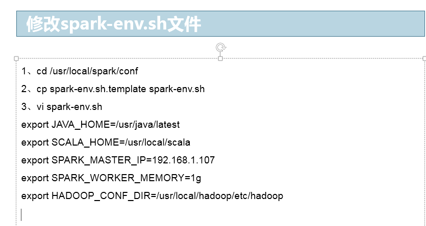
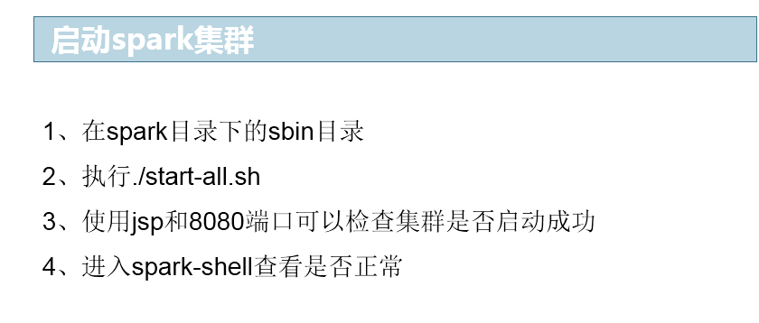
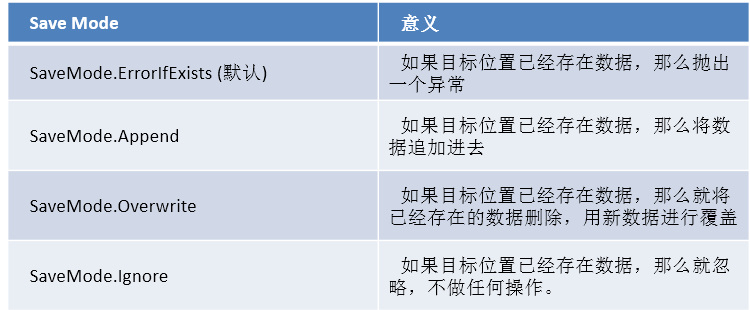
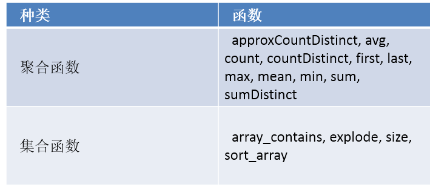
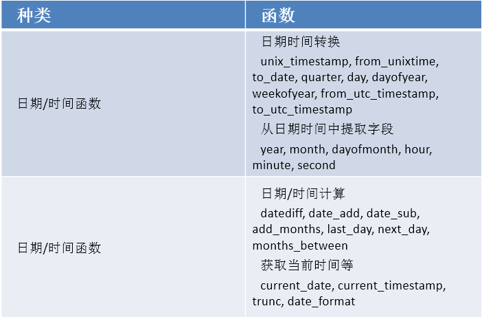
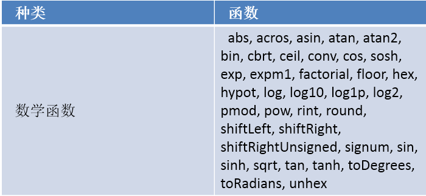
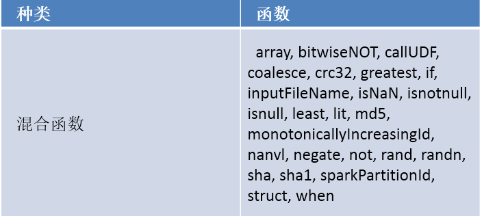
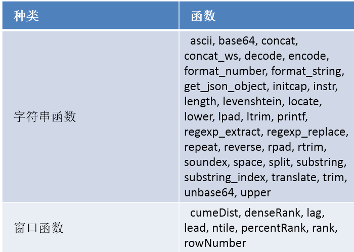
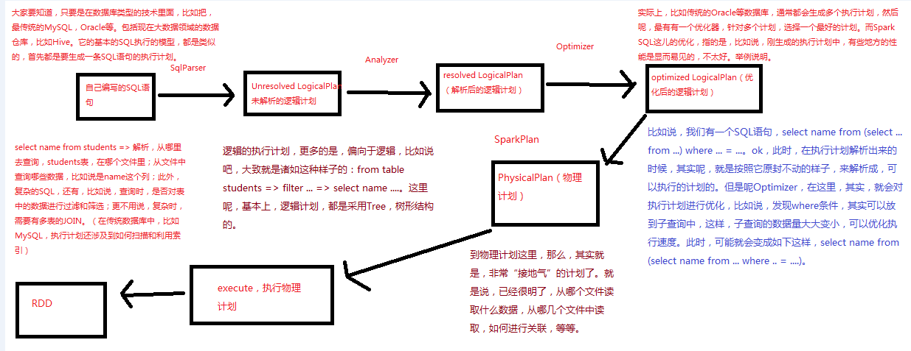

<!-- TOC -->

- [第71讲-课程环境搭建：Spark新版本特性、Spark 1.5.1源码编译、Spark 1.5.1集群搭建](#第71讲-课程环境搭建spark新版本特性spark-151源码编译spark-151集群搭建)
    - [1、为什么之前用spark 1.3.0，现在升级1.5.1？](#1为什么之前用spark-130现在升级151)
    - [2、Spark 1.4.x的新特性](#2spark-14x的新特性)
    - [3、Spark 1.5.x的新特性](#3spark-15x的新特性)
    - [4、Spark 1.5.1源码编译](#4spark-151源码编译)
    - [5、安装spark包](#5安装spark包)
- [第72讲-Spark SQL：前世今生](#第72讲-spark-sql前世今生)
    - [1、Spark SQL的特点](#1spark-sql的特点)
    - [2、Spark SQL的性能优化技术简介](#2spark-sql的性能优化技术简介)
- [第73讲-Spark SQL：DataFrame的使用](#第73讲-spark-sqldataframe的使用)
    - [1、Spark SQL and DataFrame引言](#1spark-sql-and-dataframe引言)
    - [2、SQLContext](#2sqlcontext)
    - [3、HiveContext](#3hivecontext)
    - [4、创建DataFrame](#4创建dataframe)
    - [5、DataFrame的常用操作](#5dataframe的常用操作)
- [第74讲-Spark SQL：使用反射方式将RDD转换为DataFrame](#第74讲-spark-sql使用反射方式将rdd转换为dataframe)
    - [1、使用反射方式推断元数据](#1使用反射方式推断元数据)
    - [2、使用编程方式指定元数据](#2使用编程方式指定元数据)
- [第75讲-Spark SQL：使用编程方式将RDD转换为DataFrame](#第75讲-spark-sql使用编程方式将rdd转换为dataframe)
- [第76讲-Spark SQL：数据源之通用的load和save操作](#第76讲-spark-sql数据源之通用的load和save操作)
    - [1、通用的load和save操作](#1通用的load和save操作)
    - [2、手动指定数据源类型](#2手动指定数据源类型)
    - [3、Save Mode](#3save-mode)
- [第77讲-Spark SQL：Parquet数据源之使用编程方式加载数据](#第77讲-spark-sqlparquet数据源之使用编程方式加载数据)
- [第78讲-Spark SQL：Parquet数据源之自动分区推断](#第78讲-spark-sqlparquet数据源之自动分区推断)
- [第79讲-Spark SQL：Parquet数据源之合并元数据](#第79讲-spark-sqlparquet数据源之合并元数据)
- [第80讲-Spark SQL：JSON数据源复杂综合案例实战](#第80讲-spark-sqljson数据源复杂综合案例实战)
- [第81讲-Spark SQL：Hive数据源复杂综合案例实战](#第81讲-spark-sqlhive数据源复杂综合案例实战)
    - [1、Hive数据源实战](#1hive数据源实战)
    - [2、将数据保存到表中](#2将数据保存到表中)
- [第82讲-Spark SQL：JDBC数据源复杂综合案例实战](#第82讲-spark-sqljdbc数据源复杂综合案例实战)
- [第83讲-Spark SQL：内置函数以及每日uv、销售额统计案例实战](#第83讲-spark-sql内置函数以及每日uv销售额统计案例实战)
- [第84讲-Spark SQL：开窗函数以及top3销售额统计案例实战](#第84讲-spark-sql开窗函数以及top3销售额统计案例实战)
- [第85讲-Spark SQL：UDF自定义函数实战](#第85讲-spark-sqludf自定义函数实战)
- [第86讲-Spark SQL：UDAF自定义聚合函数实战](#第86讲-spark-sqludaf自定义聚合函数实战)
- [第87讲-Spark SQL：工作原理剖析以及性能优化](#第87讲-spark-sql工作原理剖析以及性能优化)
    - [1、工作原理剖析](#1工作原理剖析)
    - [2、性能优化](#2性能优化)
- [第87讲-Spark SQL：核心源码深度剖析（DataFrame lazy特性、Optimizer优化策略等）](#第87讲-spark-sql核心源码深度剖析dataframe-lazy特性optimizer优化策略等)
- [第87讲-Spark SQL：延伸知识之Hive On Spark](#第87讲-spark-sql延伸知识之hive-on-spark)
    - [1、Hive On Spark背景知识](#1hive-on-spark背景知识)
        - [1、首先看一下Hive的基本工作原理：](#1首先看一下hive的基本工作原理)
        - [2、Hive On Spark的计算原理有如下几个要点：](#2hive-on-spark的计算原理有如下几个要点)
        - [3、Hive On Spark做了一些优化：](#3hive-on-spark做了一些优化)
    - [2、Hive On Spark环境搭建](#2hive-on-spark环境搭建)
    - [3、Hive On Spark使用](#3hive-on-spark使用)
- [第87讲-Spark SQL：与Spark Core整合之每日top3热点搜索词统计案例实战](#第87讲-spark-sql与spark-core整合之每日top3热点搜索词统计案例实战)
    - [1、每日top3热点搜索词统计案例实战](#1每日top3热点搜索词统计案例实战)
    - [2、实现思路分析](#2实现思路分析)
    - [3、每日top3热点搜索词统计案例实战](#3每日top3热点搜索词统计案例实战)

<!-- /TOC -->

# 第71讲-课程环境搭建：Spark新版本特性、Spark 1.5.1源码编译、Spark 1.5.1集群搭建

## 1、为什么之前用spark 1.3.0，现在升级1.5.1？

之前使用spark 1.3.0，主要是为了《Spark内核源码深度剖析》阶段的讲解。因为之前主要是研究spark 1.3.0版本的源码，因此如果要讲解Spark内核源码相关内容，最好的当然使用spark 1.3.0版本的源码来讲解。否则的话，如果要贸然用spark 1.5.1版本的源码来讲解，只怕未必能讲的好。

此外，虽然之前讲解的Spark核心编程阶段、Spark内核源码深度剖析阶段、Spark性能优化阶段，基本都是基于Spark 1.3.0版本讲解的。但是其实对学习和使用基本没有影响。

第一，对源码的理解，主要还是针对某一个版本进行精读，深入理解，源码中核心的思想和理念是不变的，是不会过时的。有了这个基础之后，此后对新版本的源码的阅读和理解就没有太大障碍了。我认为，在精通了Spark内核源码深度剖析阶段之后，如果你对spark 1.3.0的内核源码了如指掌了，接下来看spark 1.5.1的源码，也没有太大问题。

第二，就以Spark核心编程以及Spark性能优化来说，spark 1.3.0~spark 1.5.1版本，其实没有太大的差别，核心编程的主要功能是一样的（虽然有少量新特性出现），包括性能优化的核心理念其实各个版本都是差不多的（虽然有少量的原理上的差别，但是大多对我们是透明的）。因此用spark 1.3.0讲解，并不影响大家的学习。实际上，与源码一样，有了基础之后，如果大家有兴趣去研究最新版本的特性和功能，其实都会变得很容易。

而之后的spark sql和spark streaming阶段的学习，就可以使用最新的spark 1.5.1版本，其实虽然新版本的底层优化了很多，但是对于我们来说大部分都是透明的。功能上，有部分需要学习的新特性的出现，比如spark sql的窗口函数，我们都会一一讲解到。林外也是尽量保证大家学习到的是最前沿的知识和技术。

## 2、Spark 1.4.x的新特性

1、Spark Core

  1.1 提供REST API供外界开发者获取Spark内部的各种信息（jobs / stages / tasks / storage info），基于这些API，可以搭建自己的Spark监控系统。
  1.2 shuffle阶段，默认将map端写入磁盘的数据进行序列化，优化io性能。
  1.3 钨丝计划（Project Tungsten），提供了UnsafeShuffleManager，使用缓存友好的排序算法，降低了shuffle的内存使用，提高了排序性能。

2、Spark Streaming

  2.1 提供了新的Spark Streaming的UI，能够更好，更清晰的监控Spark Streaming应用程序的运行状况。
  2.2 支持Kafka 0.8.2版本

3、Spark SQL and DataFrame

  3.1 支持ORCFile
  3.2 提供了一些window function（窗口函数）
  3.3 优化了join的性能

## 3、Spark 1.5.x的新特性

1、DataFrame底层执行的性能优化（钨丝计划第一阶段）
  1.1 Spark自己来管理内存，而不再依靠JVM管理内容。这样就可以避免JVM GC的性能开销，并且能够控制OOM的问题。
  1.2 Java对象直接使用内部的二进制格式存储和计算，省去了序列化和反序列化的性能开销，而且更加节省内存开销。
  1.3 完善了Shuffle阶段的UnsafeShuffleManager，增加了不少新功能，优化shuffle性能。
  1.4 默认使用code-gen，使用cache-aware算法，加强了join、aggregation、shuffle、sorting的性能，增强了window function的性能，性能比1.4.x版本提高数倍

2、DataFrame
  2.1 实现了新的聚合函数接口，AggregateFunction2，并且提供了7个新的内置聚合函数。
  2.2 实现了100多个新的expression function，例如unix_timestamp等，增强了对NaN的处理
  2.3 支持连接不同版本的hive metastore
  2.4 支持Parquet 1.7

3、Spark Streaming：更完善的python支持、非实验的Kafka Direct API等等。


## 4、Spark 1.5.1源码编译

掌握了源码编译，就具备了对Spark进行二次开发的基本条件了！如果你要修改Spark源码，进行二次开发，那么首先就得从官网下载指定版本的源码，然后倒入你的ide开发环境，进行源码的修改；接着修改完了，你希望能够将修改后的源码部署到集群上面去，那么是不是得对源码进行编译，编译成可以在linux集群上进行部署的格式包吧！

1、http://d3kbcqa49mib13.cloudfront.net/spark-1.5.1.tgz
2、准备好JDK、Scala、Maven环境
3、针对指定hadoop版本进行编译：./make-distribution.sh --tgz -Phadoop-2.6 -Pyarn -DskipTests -Dhadoop.version=2.6.0 -Phive
4、经常长时间的编译之后，得到spark-1.4.0-bin-2.6.0.tgz

## 5、安装spark包

1、停止Spark 1.3.0集群：SPARK_HOME/sbin/stop-all.sh
2、将spark-1.5.1-bin-hadoop2.4.tgz使用WinSCP上传到/usr/local目录下。
3、解压缩spark包：tar zxvf spark-1.5.1-bin-hadoop2.4.tgz。
4、修改spark环境变量
vi .bashrc
export SPARK_HOME=/usr/local/spark-1.5.1-bin-hadoop2.4
export PATH=$SPARK_HOME/bin
export CLASSPATH=.:$CLASSPATH:$JAVA_HOME/lib:$JAVA_HOME/jre/lib
source .bashrc







# 第72讲-Spark SQL：前世今生

Spark 1.0版本开始，推出了Spark SQL。其实最早使用的，都是Hadoop自己的Hive查询引擎；但是后来Spark提供了Shark；再后来Shark被淘汰，推出了Spark SQL。Shark的性能比Hive就要高出一个数量级，而Spark SQL的性能又比Shark高出一个数量级。

最早来说，Hive的诞生，主要是因为要让那些不熟悉Java，无法深入进行MapReduce编程的数据分析师，能够使用他们熟悉的关系型数据库的SQL模型，来操作HDFS上的数据。因此推出了Hive。Hive底层基于MapReduce实现SQL功能，能够让数据分析人员，以及数据开发人员，方便的使用Hive进行数据仓库的建模和建设，然后使用SQL模型针对数据仓库中的数据进行统计和分析。但是Hive有个致命的缺陷，就是它的底层基于MapReduce，而MapReduce的shuffle又是基于磁盘的，因此导致Hive的性能异常低下。进场出现复杂的SQL ETL，要运行数个小时，甚至数十个小时的情况。

后来，Spark推出了Shark，Shark与Hive实际上还是紧密关联的，Shark底层很多东西还是依赖于Hive，但是修改了内存管理、物理计划、执行三个模块，底层使用Spark的基于内存的计算模型，从而让性能比Hive提升了数倍到上百倍。


然而，Shark还是它的问题所在，Shark底层依赖了Hive的语法解析器、查询优化器等组件，因此对于其性能的提升还是造成了制约。所以后来Spark团队决定，完全抛弃Shark，推出了全新的Spark SQL项目。Spark SQL就不只是针对Hive中的数据了，而且可以支持其他很多数据源的查询。

## 1、Spark SQL的特点

- 1、支持多种数据源：Hive、RDD、Parquet、JSON、JDBC等。
- 2、多种性能优化技术：in-memory columnar storage、byte-code generation、cost model动态评估等。
- 3、组件扩展性：对于SQL的语法解析器、分析器以及优化器，用户都可以自己重新开发，并且动态扩展。

在2014年6月1日的时候，Spark宣布了不再开发Shark，全面转向Spark SQL的开发。

Spark SQL的性能比Shark来说，又有了数倍的提升。


## 2、Spark SQL的性能优化技术简介

1、内存列存储（in-memory columnar storage）

内存列存储意味着，Spark SQL的数据，不是使用Java对象的方式来进行存储，而是使用面向列的内存存储的方式来进行存储。也就是说，每一列，作为一个数据存储的单位。从而大大优化了内存使用的效率。采用了内存列存储之后，减少了对内存的消耗，也就避免了gc大量数据的性能开销。

2、字节码生成技术（byte-code generation）

Spark SQL在其catalyst模块的expressions中增加了codegen模块，对于SQL语句中的计算表达式，比如select num + num from t这种的sql，就可以使用动态字节码生成技术来优化其性能。

3、Scala代码编写的优化

对于Scala代码编写中，可能会造成较大性能开销的地方，自己重写，使用更加复杂的方式，来获取更好的性能。比如Option样例类、for循环、map/filter/foreach等高阶函数，以及不可变对象，都改成了用null、while循环等来实现，并且重用可变的对象。


# 第73讲-Spark SQL：DataFrame的使用

## 1、Spark SQL and DataFrame引言

Spark SQL是Spark中的一个模块，主要用于进行结构化数据的处理。它提供的最核心的编程抽象，就是DataFrame。同时Spark SQL还可以作为分布式的SQL查询引擎。Spark SQL最重要的功能之一，就是从Hive中查询数据。

DataFrame，可以理解为是，以列的形式组织的，分布式的数据集合。它其实和关系型数据库中的表非常类似，但是底层做了很多的优化。DataFrame可以通过很多来源进行构建，包括：结构化的数据文件，Hive中的表，外部的关系型数据库，以及RDD。


## 2、SQLContext

要使用Spark SQL，首先就得创建一个创建一个SQLContext对象，或者是它的子类的对象，比如HiveContext的对象。

Java版本：
JavaSparkContext sc = ...; 
SQLContext sqlContext = new SQLContext(sc);

Scala版本：
val sc: SparkContext = ... 
val sqlContext = new SQLContext(sc)
import sqlContext.implicits._


## 3、HiveContext

除了基本的SQLContext以外，还可以使用它的子类——HiveContext。HiveContext的功能除了包含SQLContext提供的所有功能之外，还包括了额外的专门针对Hive的一些功能。这些额外功能包括：使用HiveQL语法来编写和执行SQL，使用Hive中的UDF函数，从Hive表中读取数据。

要使用HiveContext，就必须预先安装好Hive，SQLContext支持的数据源，HiveContext也同样支持——而不只是支持Hive。对于Spark 1.3.x以上的版本，都推荐使用HiveContext，因为其功能更加丰富和完善。

Spark SQL还支持用spark.sql.dialect参数设置SQL的方言。使用SQLContext的setConf()即可进行设置。对于SQLContext，它只支持“sql”一种方言。对于HiveContext，它默认的方言是“hiveql”。

## 4、创建DataFrame

使用SQLContext，可以从RDD、Hive表或者其他数据源，来创建一个DataFrame。以下是一个使用JSON文件创建DataFrame的例子：

```java
Java版本：
JavaSparkContext sc = ...; 
SQLContext sqlContext = new SQLContext(sc);
DataFrame df = sqlContext.read().json("hdfs://spark1:9000/students.json");
df.show();

Scala版本：
val sc: SparkContext = ...
val sqlContext = new SQLContext(sc)
val df = sqlContext.read.json("hdfs://spark1:9000/students.json")
df.show()
```

## 5、DataFrame的常用操作

```java
Java版本
DataFrame df = sqlContext.read().json("hdfs://spark1:9000/students.json");
df.show();
df.printSchema();
df.select("name").show();
df.select(df.col("name"), df.col("age").plus(1)).show();
df.filter(df.col("age").gt(21)).show();
df.groupBy("age").count().show();

Scala版本
val df = sqlContext.read.json("hdfs://spark1:9000/students.json")
df.show()
df.printSchema()
df.select("name").show()
df.select(df("name"), df("age") + 1).show()
df.filter(df("age") > 21).show()
df.groupBy("age").count().show()

```


# 第74讲-Spark SQL：使用反射方式将RDD转换为DataFrame


为什么要将RDD转换为DataFrame？因为这样的话，我们就可以直接针对HDFS等任何可以构建为RDD的数据，使用Spark SQL进行SQL查询了。这个功能是无比强大的。想象一下，针对HDFS中的数据，直接就可以使用SQL进行查询。

Spark SQL支持两种方式来将RDD转换为DataFrame。

第一种方式，是使用反射来推断包含了特定数据类型的RDD的元数据。这种基于反射的方式，代码比较简洁，当你已经知道你的RDD的元数据时，是一种非常不错的方式。

第二种方式，是通过编程接口来创建DataFrame，你可以在程序运行时动态构建一份元数据，然后将其应用到已经存在的RDD上。这种方式的代码比较冗长，但是如果在编写程序时，还不知道RDD的元数据，只有在程序运行时，才能动态得知其元数据，那么只能通过这种动态构建元数据的方式。

## 1、使用反射方式推断元数据

Java版本：Spark SQL是支持将包含了JavaBean的RDD转换为DataFrame的。JavaBean的信息，就定义了元数据。Spark SQL现在是不支持将包含了嵌套JavaBean或者List等复杂数据的JavaBean，作为元数据的。只支持一个包含简单数据类型的field的JavaBean。

Scala版本：而Scala由于其具有隐式转换的特性，所以Spark SQL的Scala接口，是支持自动将包含了case class的RDD转换为DataFrame的。case class就定义了元数据。Spark SQL会通过反射读取传递给case class的参数的名称，然后将其作为列名。与Java不同的是，Spark SQL是支持将包含了嵌套数据结构的case class作为元数据的，比如包含了Array等。

## 2、使用编程方式指定元数据

Java版本：当JavaBean无法预先定义和知道的时候，比如要动态从一个文件中读取数据结构，那么就只能用编程方式动态指定元数据了。首先要从原始RDD创建一个元素为Row的RDD；其次要创建一个StructType，来代表Row；最后将动态定义的元数据应用到RDD<Row>上。

Scala版本：Scala的实现方式，与Java是基本一样的。


# 第75讲-Spark SQL：使用编程方式将RDD转换为DataFrame

# 第76讲-Spark SQL：数据源之通用的load和save操作

## 1、通用的load和save操作

对于Spark SQL的DataFrame来说，无论是从什么数据源创建出来的DataFrame，都有一些共同的load和save操作。load操作主要用于加载数据，创建出DataFrame；save操作，主要用于将DataFrame中的数据保存到文件中。

Java版本
DataFrame df = sqlContext.read().load("users.parquet");
df.select("name", "favorite_color").write().save("namesAndFavColors.parquet");

Scala版本
val df = sqlContext.read.load("users.parquet")
df.select("name", "favorite_color").write.save("namesAndFavColors.parquet")


## 2、手动指定数据源类型

也可以手动指定用来操作的数据源类型。数据源通常需要使用其全限定名来指定，比如parquet是org.apache.spark.sql.parquet。但是Spark SQL内置了一些数据源类型，比如json，parquet，jdbc等等。实际上，通过这个功能，就可以在不同类型的数据源之间进行转换了。比如将json文件中的数据保存到parquet文件中。默认情况下，如果不指定数据源类型，那么就是parquet。

Java版本
DataFrame df = sqlContext.read().format("json").load("people.json");
df.select("name", "age").write().format("parquet").save("namesAndAges.parquet");

Scala版本
val df = sqlContext.read.format("json").load("people.json")
df.select("name", "age").write.format("parquet").save("namesAndAges.parquet")


## 3、Save Mode
Spark SQL对于save操作，提供了不同的save mode。主要用来处理，当目标位置，已经有数据时，应该如何处理。而且save操作并不会执行锁操作，并且不是原子的，因此是有一定风险出现脏数据的。




# 第77讲-Spark SQL：Parquet数据源之使用编程方式加载数据

Parquet是面向分析型业务的列式存储格式，由Twitter和Cloudera合作开发，2015年5月从Apache的孵化器里毕业成为Apache顶级项目，最新的版本是1.8.0。

列式存储和行式存储相比有哪些优势呢？

- 1、可以跳过不符合条件的数据，只读取需要的数据，降低IO数据量。 

- 2、压缩编码可以降低磁盘存储空间。由于同一列的数据类型是一样的，可以使用更高效的压缩编码（例如Run Length Encoding和Delta Encoding）进一步节约存储空间。 

- 3、只读取需要的列，支持向量运算，能够获取更好的扫描性能。 

这里讲解Parquet数据源的第一个知识点，使用编程的方式加载Parquet文件中的数据。

案例：查询用户数据中的用户姓名。


# 第78讲-Spark SQL：Parquet数据源之自动分区推断


表分区是一种常见的优化方式，比如Hive中就提供了表分区的特性。在一个分区表中，不同分区的数据通常存储在不同的目录中，分区列的值通常就包含在了分区目录的目录名中。Spark SQL中的Parquet数据源，支持自动根据目录名推断出分区信息。例如，如果将人口数据存储在分区表中，并且使用性别和国家作为分区列。那么目录结构可能如下所示：

```
tableName
  |- gender=male
    |- country=US
      ...
      ...
      ...
    |- country=CN
      ...
  |- gender=female
    |- country=US
      ...
    |- country=CH
      ... 
```

如果将/tableName传入SQLContext.read.parquet()或者SQLContext.read.load()方法，那么Spark SQL就会自动根据目录结构，推断出分区信息，是gender和country。即使数据文件中只包含了两列值，name和age，但是Spark SQL返回的DataFrame，调用printSchema()方法时，会打印出四个列的值：name，age，country，gender。这就是自动分区推断的功能。

此外，分区列的数据类型，也是自动被推断出来的。目前，Spark SQL仅支持自动推断出数字类型和字符串类型。有时，用户也许不希望Spark SQL自动推断分区列的数据类型。此时只要设置一个配置即可， spark.sql.sources.partitionColumnTypeInference.enabled，默认为true，即自动推断分区列的类型，设置为false，即不会自动推断类型。禁止自动推断分区列的类型时，所有分区列的类型，就统一默认都是String。

案例：自动推断用户数据的性别和国家


# 第79讲-Spark SQL：Parquet数据源之合并元数据

如同ProtocolBuffer，Avro，Thrift一样，Parquet也是支持元数据合并的。用户可以在一开始就定义一个简单的元数据，然后随着业务需要，逐渐往元数据中添加更多的列。在这种情况下，用户可能会创建多个Parquet文件，有着多个不同的但是却互相兼容的元数据。Parquet数据源支持自动推断出这种情况，并且进行多个Parquet文件的元数据的合并。

因为元数据合并是一种相对耗时的操作，而且在大多数情况下不是一种必要的特性，从Spark 1.5.0版本开始，默认是关闭Parquet文件的自动合并元数据的特性的。可以通过以下两种方式开启Parquet数据源的自动合并元数据的特性：

- 1、读取Parquet文件时，将数据源的选项，mergeSchema，设置为true
- 2、使用SQLContext.setConf()方法，将spark.sql.parquet.mergeSchema参数设置为true

案例：合并学生的基本信息，和成绩信息的元数据


# 第80讲-Spark SQL：JSON数据源复杂综合案例实战

Spark SQL可以自动推断JSON文件的元数据，并且加载其数据，创建一个DataFrame。可以使用SQLContext.read.json()方法，针对一个元素类型为String的RDD，或者是一个JSON文件。

但是要注意的是，这里使用的JSON文件与传统意义上的JSON文件是不一样的。每行都必须，也只能包含一个，单独的，自包含的，有效的JSON对象。不能让一个JSON对象分散在多行。否则会报错。

综合性复杂案例：查询成绩为80分以上的学生的基本信息与成绩信息


# 第81讲-Spark SQL：Hive数据源复杂综合案例实战

## 1、Hive数据源实战

Spark SQL支持对Hive中存储的数据进行读写。操作Hive中的数据时，必须创建HiveContext，而不是SQLContext。HiveContext继承自SQLContext，但是增加了在Hive元数据库中查找表，以及用HiveQL语法编写SQL的功能。除了sql()方法，HiveContext还提供了hql()方法，从而用Hive语法来编译sql。

使用HiveContext，可以执行Hive的大部分功能，包括创建表、往表里导入数据以及用SQL语句查询表中的数据。查询出来的数据是一个Row数组。

将hive-site.xml拷贝到spark/conf目录下，将mysql connector拷贝到spark/lib目录下

HiveContext sqlContext = new HiveContext(sc);
sqlContext.sql("CREATE TABLE IF NOT EXISTS students (name STRING, age INT)");
sqlContext.sql("LOAD DATA LOCAL INPATH '/usr/local/spark-study/resources/students.txt' INTO TABLE students");
Row[] teenagers = sqlContext.sql("SELECT name, age FROM students WHERE age<=18").collect();


## 2、将数据保存到表中

Spark SQL还允许将数据保存到Hive表中。调用DataFrame的saveAsTable命令，即可将DataFrame中的数据保存到Hive表中。与registerTempTable不同，saveAsTable是会将DataFrame中的数据物化到Hive表中的，而且还会在Hive元数据库中创建表的元数据。

默认情况下，saveAsTable会创建一张Hive Managed Table，也就是说，数据的位置都是由元数据库中的信息控制的。当Managed Table被删除时，表中的数据也会一并被物理删除。

registerTempTable只是注册一个临时的表，只要Spark Application重启或者停止了，那么表就没了。而saveAsTable创建的是物化的表，无论Spark Application重启或者停止，表都会一直存在。

调用HiveContext.table()方法，还可以直接针对Hive中的表，创建一个DataFrame。

案例：查询分数大于80分的学生的完整信息


# 第82讲-Spark SQL：JDBC数据源复杂综合案例实战

Spark SQL支持使用JDBC从关系型数据库（比如MySQL）中读取数据。读取的数据，依然由DataFrame表示，可以很方便地使用Spark Core提供的各种算子进行处理。

这里有一个经验之谈，实际上用Spark SQL处理JDBC中的数据是非常有用的。比如说，你的MySQL业务数据库中，有大量的数据，比如1000万，然后，你现在需要编写一个程序，对线上的脏数据某种复杂业务逻辑的处理，甚至复杂到可能涉及到要用Spark SQL反复查询Hive中的数据，来进行关联处理。

那么此时，用Spark SQL来通过JDBC数据源，加载MySQL中的数据，然后通过各种算子进行处理，是最好的选择。因为Spark是分布式的计算框架，对于1000万数据，肯定是分布式处理的。而如果你自己手工编写一个Java程序，那么不好意思，你只能分批次处理了，先处理2万条，再处理2万条，可能运行完你的Java程序，已经是几天以后的事情了。


Java版本
Map<String, String> options = new HashMap<String, String>();
options.put("url", "jdbc:mysql://spark1:3306/testdb");
options.put("dbtable", "students");
DataFrame jdbcDF = sqlContext.read().format("jdbc"). options(options).load();

Scala版本
val jdbcDF = sqlContext.read.format("jdbc").options( 
  Map("url" -> "jdbc:mysql://spark1:3306/testdb",
  "dbtable" -> "students")).load()

案例：查询分数大于80分的学生信息
grant all on testdb.* to ''@'spark1' with grant option;
flush privileges;


# 第83讲-Spark SQL：内置函数以及每日uv、销售额统计案例实战

在Spark 1.5.x版本，增加了一系列内置函数到DataFrame API中，并且实现了code-generation的优化。与普通的函数不同，DataFrame的函数并不会执行后立即返回一个结果值，而是返回一个Column对象，用于在并行作业中进行求值。Column可以用在DataFrame的操作之中，比如select，filter，groupBy等。函数的输入值，也可以是Column。












案例实战：根据每天的用户访问日志和用户购买日志，统计每日的uv和销售额


# 第84讲-Spark SQL：开窗函数以及top3销售额统计案例实战

Spark 1.4.x版本以后，为Spark SQL和DataFrame引入了开窗函数，比如最经典，最常用的，row_number()，可以让我们实现分组取topn的逻辑。

案例：统计每个种类的销售额排名前3的产品


# 第85讲-Spark SQL：UDF自定义函数实战

UDF：User Defined Function。用户自定义函数。


# 第86讲-Spark SQL：UDAF自定义聚合函数实战

UDAF：User Defined Aggregate Function。用户自定义聚合函数。是Spark 1.5.x引入的最新特性。

上节课讲解了UDF，其实更多的是针对单行输入，返回一个输出
这里的UDAF，则可以针对多行输入，进行聚合计算，返回一个输出，功能更加强大


# 第87讲-Spark SQL：工作原理剖析以及性能优化



## 1、工作原理剖析

- 1、SqlParse
- 2、Analyser
- 3、Optimizer
- 4、SparkPlan


## 2、性能优化

- 1、设置Shuffle过程中的并行度：spark.sql.shuffle.partitions（SQLContext.setConf()）

- 2、在Hive数据仓库建设过程中，合理设置数据类型，比如能设置为INT的，就不要设置为BIGINT。减少数据类型导致的不必要的内存开销。

- 3、编写SQL时，尽量给出明确的列名，比如select name from students。不要写select *的方式。

- 4、并行处理查询结果：对于Spark SQL查询的结果，如果数据量比较大，比如超过1000条，那么就不要一次性collect()到Driver再处理。使用foreach()算子，并行处理查询结果。

- 5、缓存表：对于一条SQL语句中可能多次使用到的表，可以对其进行缓存，使用SQLContext.cacheTable(tableName)，或者DataFrame.cache()即可。Spark SQL会用内存列存储的格式进行表的缓存。然后Spark SQL就可以仅仅扫描需要使用的列，并且自动优化压缩，来最小化内存使用和GC开销。SQLContext.uncacheTable(tableName)可以将表从缓存中移除。用SQLContext.setConf()，设置spark.sql.inMemoryColumnarStorage.batchSize参数（默认10000），可以配置列存储的单位。

- 6、广播join表：spark.sql.autoBroadcastJoinThreshold，默认10485760 (10 MB)。在内存够用的情况下，可以增加其大小，概参数设置了一个表在join的时候，最大在多大以内，可以被广播出去优化性能。

- 7、钨丝计划：spark.sql.tungsten.enabled，默认是true，自动管理内存。

最有效的，其实就是第四点、缓存表和广播join表，也是非常不错的！


# 第87讲-Spark SQL：核心源码深度剖析（DataFrame lazy特性、Optimizer优化策略等）


# 第87讲-Spark SQL：延伸知识之Hive On Spark

## 1、Hive On Spark背景知识

Hive是目前大数据领域，事实上的SQL标准。其底层默认是基于MapReduce实现的，但是由于MapReduce速度实在比较慢，因此这两年，陆续出来了新的SQL查询引擎。包括Spark SQL，Hive On Tez，Hive On Spark等。

Spark SQL与Hive On Spark是不一样的。Spark SQL是Spark自己研发出来的针对各种数据源，包括Hive、JSON、Parquet、JDBC、RDD等都可以执行查询的，一套基于Spark计算引擎的查询引擎。因此它是Spark的一个项目，只不过提供了针对Hive执行查询的工功能而已。适合在一些使用Spark技术栈的大数据应用类系统中使用。

而Hive On Spark，是Hive的一个项目，它是指，不通过MapReduce作为唯一的查询引擎，而是将Spark作为底层的查询引擎。Hive On Spark，只适用于Hive。在可预见的未来，很有可能Hive默认的底层引擎就从MapReduce切换为Spark了。适合于将原有的Hive数据仓库以及数据统计分析替换为Spark引擎，作为全公司通用的大数据统计分析引擎。


### 1、首先看一下Hive的基本工作原理：

Hive QL语句 => 
语法分析 => AST => 
生成逻辑执行计划 => Operator Tree => 
优化逻辑执行计划 => Optimized Operator Tree => 
生成物理执行计划 => Task Tree => 
优化物理执行计划 => Optimized Task Tree => 
执行优化后的Optimized Task Tree


### 2、Hive On Spark的计算原理有如下几个要点：

1、将Hive表作为Spark RDD来进行操作：这个是没有疑问的

2、使用Hive原语
对于一些针对RDD的操作，比如groupByKey、sortByKey等。不使用Spark的transformation操作和原语。如果那样做的话，那么就需要重新实现一套Hive的原语，而且如果Hive增加了新功能，那么又要实现新的Spark原语。因此选择将Hive的原语包装为针对RDD的操作即可。

3、新的物理执行计划生成机制
使用SparkCompiler将逻辑执行计划，即Operator Tree，转换为Task Tree。提交Spark Task给Spark进行执行。SparkTask包装了DAG，DAG包装为SparkWork。SparkTask根据SparkWork表示的DAG计算。

4、SparkContext生命周期
Hive On Spark会为每个用户的会话，比如执行一次SQL语句，创建一个SparkContext。但是Spark不允许在一个JVM内创建多个SparkContext。因此，需要在单独的JVM中启动每个会话的SparkContext，然后通过RPC与远程JVM中的SparkContext进行通信。

5、本地和远程运行模式
Hive On Spark提供两种运行模式，本地和远程。如果将Spark Master设置为local，比如set spark.master=local，那么就是本地模式，SparkContext与客户端运行在一个JVM中。否则，如果将Spark Master设置为Master的地址，那么就是远程模式，SparkContext会在远程的JVM中启动。

远程模式下，每个用户Session都会创建一个SparkClient，SparkClient启动RemoteDriver，RemoteDriver负责创建SparkContext。

### 3、Hive On Spark做了一些优化：

1、Map Join

Spark SQL默认对join是支持使用broadcast机制将小表广播到各个节点上，以进行join的。但是问题是，这会给Driver和Worker带来很大的内存开销。因为广播的数据要一直保留在Driver内存中。所以目前采取的是，类似乎MapReduce的Distributed Cache机制，即提高HDFS replica factor的复制因子，以让数据在每个计算节点上都有一个备份，从而可以在本地进行数据读取。

2、Cache Table

对于某些需要对一张表执行多次操作的场景，Hive On Spark内部做了优化，即将要多次操作的表cache到内存中，以便于提升性能。但是这里要注意，并不是对所有的情况都会自动进行cache。所以说，Hive On Spark还有很多不完善的地方。


## 2、Hive On Spark环境搭建

1、使用课程提供的apache-hive-1.2.1-bin.tar.gz
2、在/usr/local目录下解压缩
3、进入conf目录，mv hive-default.xml.template hive-site.xml，修改hive-site.xml
<property>
  <name>javax.jdo.option.ConnectionURL</name>
  <value>jdbc:mysql://spark1:3306/hive_metadata_2?createDatabaseIfNotExist=true</value>
</property>
<property>
  <name>javax.jdo.option.ConnectionDriverName</name>
  <value>com.mysql.jdbc.Driver</value>
</property>
<property>
  <name>javax.jdo.option.ConnectionUserName</name>
  <value>hive</value>
</property>
<property>
  <name>javax.jdo.option.ConnectionPassword</name>
  <value>hive</value>
</property>
<property>
  <name>hive.metastore.warehouse.dir</name>
  <value>/user/hive/warehouse2</value>
</property>


4、在conf目录下
mv hive-env.sh.template hive-env.sh

vi ./bin/hive-config.sh
export JAVA_HOME=/usr/java/latest
export HIVE_HOME=/usr/local/apache-hive-1.2.1-bin
export HADOOP_HOME=/usr/local/hadoop

5、cp /usr/share/java/mysql-connector-java-5.1.17.jar /usr/local/apache-hive-1.2.1-bin/lib

6、MySQL
create database if not exists hive_metadata_2;
grant all privileges on hive_metadata_2.* to 'hive'@'%' identified by 'hive';
grant all privileges on hive_metadata_2.* to 'hive'@'localhost' identified by 'hive';
grant all privileges on hive_metadata_2.* to 'hive'@'spark1' identified by 'hive';
flush privileges;

7、启动hive cli，./hive，报错，Relative path in absolute URI: ${system:java.io.tmpdir%7D/$%7Bsystem:user.name%7D
创建文件夹：/home/grid/apache-hive-1.2.1-bin
/iotmp
将hive-site.xml中所有的${system:java.io.tmpdir}改为上面的目录，这里建议用WinSCP将hive-site.xml拷贝到windows上来，用notepad++这种工具，来进行文本替换，比较方便。

8、启动hive cli，./hive，继续报错，Found class jline.Terminal, but interface was expected
cp /usr/local/apache-hive-1.2.1-bin/lib/jline-2.12.jar /usr/local/hadoop/share/hadoop/yarn/lib
将hadoop原来的老的jline-0.9.94.jar，改名或者删除

9、启动hive cli，/usr/local/apache-hive-1.2.1-bin/bin/hive，成功启动


## 3、Hive On Spark使用

create table students(name string, age int);
load data local inpath '/usr/local/spark-study/resources/students.txt' into table students;

// 使用Hive On Spark非常简单
// 只要用set hive.execution.engine命令设置Hive的执行引擎为spark即可
// 默认是mr
set hive.execution.engine=spark;
// 这里，是完全可以将其设置为Spark Master的URL地址的
set spark.master=spark://192.168.1.107:7077

select * from students;


# 第87讲-Spark SQL：与Spark Core整合之每日top3热点搜索词统计案例实战


## 1、每日top3热点搜索词统计案例实战

数据格式：
日期 用户 搜索词 城市 平台 版本

需求：
1、筛选出符合查询条件（城市、平台、版本）的数据
2、统计出每天搜索uv排名前3的搜索词
3、按照每天的top3搜索词的uv搜索总次数，倒序排序
4、将数据保存到hive表中


## 2、实现思路分析

1、针对原始数据（HDFS文件），获取输入的RDD
2、使用filter算子，去针对输入RDD中的数据，进行数据过滤，过滤出符合查询条件的数据。
  2.1 普通的做法：直接在fitler算子函数中，使用外部的查询条件（Map），但是，这样做的话，是不是查询条件Map，会发送到每一个task上一份副本。（性能并不好）
  2.2 优化后的做法：将查询条件，封装为Broadcast广播变量，在filter算子中使用Broadcast广播变量进行数据筛选。
3、将数据转换为“(日期_搜索词, 用户)”格式，然后呢，对它进行分组，然后再次进行映射，对每天每个搜索词的搜索用户进行去重操作，并统计去重后的数量，即为每天每个搜索词的uv。最后，获得“(日期_搜索词, uv)”
4、将得到的每天每个搜索词的uv，RDD，映射为元素类型为Row的RDD，将该RDD转换为DataFrame
5、将DataFrame注册为临时表，使用Spark SQL的开窗函数，来统计每天的uv数量排名前3的搜索词，以及它的搜索uv，最后获取，是一个DataFrame
6、将DataFrame转换为RDD，继续操作，按照每天日期来进行分组，并进行映射，计算出每天的top3搜索词的搜索uv的总数，然后将uv总数作为key，将每天的top3搜索词以及搜索次数，拼接为一个字符串
7、按照每天的top3搜索总uv，进行排序，倒序排序
8、将排好序的数据，再次映射回来，变成“日期_搜索词_uv”的格式
9、再次映射为DataFrame，并将数据保存到Hive中即可


## 3、每日top3热点搜索词统计案例实战

1、我们这里，只用了Java来实现，是因为整个案例过于复杂，如果再用Scala来实现的话，那么时间会耗费的很长，而且意义并不大
2、而且，我们通过Java开讲解，已经把数据格式、需求、具体实现思路、如何优化（broatcast），都讲解的非常清晰了，而且开发过程中，也做了大量的讲解；相信大家通过目前为止的讲解，已经知道应该如何开发这个复杂的案例和类似的需求了
3、所以，更好的一个做法，是将Scala版本实现，留给大家自己去做，作为课后作业
4、实际上，如果大家之前能够掌握我们讲的所有的内容，应该完全，是可以用Scala开发出这个程序的

这个案例，是完全从实际企业需求改造了一点点，抽取出来的，完全企业级实战。这种需求在实际工作中，可能并不是某个大数据分析系统的模块。但是更多的是，PM或老大的需求，要求每个月，跑一次，统计上个月，每天搜索uv前3的热词。那么其实，你可以用crontab来定时调度该shell脚本，每个月1号跑一次，跑上个月的数据。只要在filter中，过滤数据，即可。

