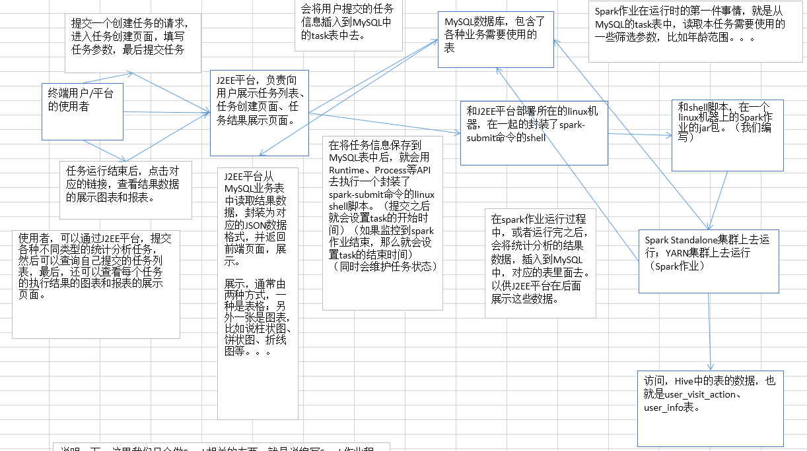

<!-- TOC -->

- [第11讲-用户访问session分析：模块介绍](#第11讲-用户访问session分析模块介绍)
- [第12讲-用户访问session分析：基础数据结构以及大数据平台架构介绍](#第12讲-用户访问session分析基础数据结构以及大数据平台架构介绍)
- [第13讲-用户访问session分析：需求分析](#第13讲-用户访问session分析需求分析)
- [第14讲-用户访问session分析：技术方案设计](#第14讲-用户访问session分析技术方案设计)
- [第15讲-用户访问session分析：数据表设计](#第15讲-用户访问session分析数据表设计)
- [第16讲-用户访问session分析：Eclipse工程搭建以及工具类说明](#第16讲-用户访问session分析eclipse工程搭建以及工具类说明)
- [第17讲-用户访问session分析：开发配置管理组件](#第17讲-用户访问session分析开发配置管理组件)
- [第18讲-用户访问session分析：JDBC原理介绍以及增删改查示范](#第18讲-用户访问session分析jdbc原理介绍以及增删改查示范)
- [第19讲-用户访问session分析：数据库连接池原理](#第19讲-用户访问session分析数据库连接池原理)
- [第20讲-用户访问session分析：单例设计模式](#第20讲-用户访问session分析单例设计模式)
- [第21讲-用户访问session分析：内部类以及匿名内部类](#第21讲-用户访问session分析内部类以及匿名内部类)
- [第22讲-用户访问session分析：开发JDBC辅助组件（上）](#第22讲-用户访问session分析开发jdbc辅助组件上)
- [第23讲-用户访问session分析：开发JDBC辅助组件（下）](#第23讲-用户访问session分析开发jdbc辅助组件下)
- [第24讲-用户访问session分析：JavaBean概念讲解](#第24讲-用户访问session分析javabean概念讲解)
- [第25讲-用户访问session分析：DAO模式讲解以及TaskDAO开发](#第25讲-用户访问session分析dao模式讲解以及taskdao开发)
- [第26讲-用户访问session分析：工厂模式讲解以及DAOFactory开发](#第26讲-用户访问session分析工厂模式讲解以及daofactory开发)
- [第27讲-用户访问session分析：JSON数据格式讲解以及fastjson介绍](#第27讲-用户访问session分析json数据格式讲解以及fastjson介绍)
- [第28讲-用户访问session分析：Spark上下文构建以及模拟数据生成](#第28讲-用户访问session分析spark上下文构建以及模拟数据生成)
- [第29讲-用户访问session分析：按session粒度进行数据聚合](#第29讲-用户访问session分析按session粒度进行数据聚合)
- [第30讲-用户访问session分析：按筛选参数对session粒度聚合数据进行过滤](#第30讲-用户访问session分析按筛选参数对session粒度聚合数据进行过滤)
- [第31讲-用户访问session分析：session聚合统计之自定义Accumulator](#第31讲-用户访问session分析session聚合统计之自定义accumulator)
- [第32讲-用户访问session分析：session聚合统计之重构实现思路与重构session聚合](#第32讲-用户访问session分析session聚合统计之重构实现思路与重构session聚合)
- [第33讲-用户访问session分析：session聚合统计之重构过滤进行统计](#第33讲-用户访问session分析session聚合统计之重构过滤进行统计)
- [第34讲-用户访问session分析：session聚合统计之计算统计结果并写入MySQL](#第34讲-用户访问session分析session聚合统计之计算统计结果并写入mysql)
- [第35讲-用户访问session分析：session聚合统计之本地测试](#第35讲-用户访问session分析session聚合统计之本地测试)
- [第36讲-用户访问session分析：session聚合统计之使用Scala实现自定义Accumulator](#第36讲-用户访问session分析session聚合统计之使用scala实现自定义accumulator)
- [第37讲-用户访问session分析：session随机抽取之实现思路分析](#第37讲-用户访问session分析session随机抽取之实现思路分析)
- [第38讲-用户访问session分析：session随机抽取之计算每天每小时session数量](#第38讲-用户访问session分析session随机抽取之计算每天每小时session数量)
- [第39讲-用户访问session分析：session随机抽取之按时间比例随机抽取算法实现](#第39讲-用户访问session分析session随机抽取之按时间比例随机抽取算法实现)
- [第40讲-用户访问session分析：session随机抽取之根据随机索引进行抽取](#第40讲-用户访问session分析session随机抽取之根据随机索引进行抽取)
- [第41讲-用户访问session分析：session随机抽取之获取抽取session的明细数据](#第41讲-用户访问session分析session随机抽取之获取抽取session的明细数据)
- [第42讲-用户访问session分析：session随机抽取之本地测试](#第42讲-用户访问session分析session随机抽取之本地测试)
- [第43讲-用户访问session分析：top10热门品类之需求回顾以及实现思路分析](#第43讲-用户访问session分析top10热门品类之需求回顾以及实现思路分析)
- [第44讲-用户访问session分析：top10热门品类之获取session访问过的所有品类](#第44讲-用户访问session分析top10热门品类之获取session访问过的所有品类)
- [第45讲-用户访问session分析：top10热门品类之计算各品类点击、下单和支付的次数](#第45讲-用户访问session分析top10热门品类之计算各品类点击下单和支付的次数)
- [第46讲-用户访问session分析：top10热门品类之join品类与点击下单支付次数](#第46讲-用户访问session分析top10热门品类之join品类与点击下单支付次数)
- [第47讲-用户访问session分析：top10热门品类之自定义二次排序key](#第47讲-用户访问session分析top10热门品类之自定义二次排序key)
- [第48讲-用户访问session分析：top10热门品类之进行二次排序](#第48讲-用户访问session分析top10热门品类之进行二次排序)
- [第49讲-用户访问session分析：top10热门品类之获取top10品类并写入MySQL](#第49讲-用户访问session分析top10热门品类之获取top10品类并写入mysql)
- [第50讲-用户访问session分析：top10热门品类之本地测试](#第50讲-用户访问session分析top10热门品类之本地测试)
- [第51讲-用户访问session分析：top10热门品类之使用Scala实现二次排序](#第51讲-用户访问session分析top10热门品类之使用scala实现二次排序)
- [第52讲-用户访问session分析：top10活跃session之开发准备以及top10品类RDD生成](#第52讲-用户访问session分析top10活跃session之开发准备以及top10品类rdd生成)
- [第53讲-用户访问session分析：top10活跃session之计算top10品类被各sessoin点击的次数](#第53讲-用户访问session分析top10活跃session之计算top10品类被各sessoin点击的次数)
- [第54讲-用户访问session分析：top10活跃session之分组取TopN算法获取top10活跃session](#第54讲-用户访问session分析top10活跃session之分组取topn算法获取top10活跃session)
- [第55讲-用户访问session分析：top10活跃session之本地测试以及阶段总结](#第55讲-用户访问session分析top10活跃session之本地测试以及阶段总结)
- [第56讲-用户访问session分析：性能调优之在实际项目中分配更多资源](#第56讲-用户访问session分析性能调优之在实际项目中分配更多资源)
- [第57讲-用户访问session分析：性能调优之在实际项目中调节并行度](#第57讲-用户访问session分析性能调优之在实际项目中调节并行度)
- [第58讲-用户访问session分析：性能调优之在实际项目中重构RDD架构以及RDD持久化](#第58讲-用户访问session分析性能调优之在实际项目中重构rdd架构以及rdd持久化)
- [第59讲-用户访问session分析：性能调优之在实际项目中广播大变量](#第59讲-用户访问session分析性能调优之在实际项目中广播大变量)
- [第60讲-用户访问session分析：性能调优之在实际项目中使用Kryo序列化](#第60讲-用户访问session分析性能调优之在实际项目中使用kryo序列化)
- [第61讲-用户访问session分析：性能调优之在实际项目中使用fastutil优化数据格式](#第61讲-用户访问session分析性能调优之在实际项目中使用fastutil优化数据格式)
- [第62讲-用户访问session分析：性能调优之在实际项目中调节数据本地化等待时长](#第62讲-用户访问session分析性能调优之在实际项目中调节数据本地化等待时长)
- [第63讲-用户访问session分析：JVM调优之原理概述以及降低cache操作的内存占比](#第63讲-用户访问session分析jvm调优之原理概述以及降低cache操作的内存占比)
- [第64讲-用户访问session分析：JVM调优之调节executor堆外内存与连接等待时长](#第64讲-用户访问session分析jvm调优之调节executor堆外内存与连接等待时长)
- [第65讲-用户访问session分析：Shuffle调优之原理概述](#第65讲-用户访问session分析shuffle调优之原理概述)
- [第66讲-用户访问session分析：Shuffle调优之合并map端输出文件](#第66讲-用户访问session分析shuffle调优之合并map端输出文件)
- [第67讲-用户访问session分析：Shuffle调优之调节map端内存缓冲与reduce端内存占比](#第67讲-用户访问session分析shuffle调优之调节map端内存缓冲与reduce端内存占比)
- [第68讲-用户访问session分析：Shuffle调优之HashShuffleManager与SortShuffleManager](#第68讲-用户访问session分析shuffle调优之hashshufflemanager与sortshufflemanager)
- [第69讲-用户访问session分析：算子调优之MapPartitions提升Map类操作性能](#第69讲-用户访问session分析算子调优之mappartitions提升map类操作性能)
- [第70讲-用户访问session分析：算子调优之filter过后使用coalesce减少分区数量](#第70讲-用户访问session分析算子调优之filter过后使用coalesce减少分区数量)
- [第71讲-用户访问session分析：算子调优之使用foreachPartition优化写数据库性能](#第71讲-用户访问session分析算子调优之使用foreachpartition优化写数据库性能)
- [第72讲-用户访问session分析：算子调优之使用repartition解决Spark SQL低并行度的性能问题](#第72讲-用户访问session分析算子调优之使用repartition解决spark-sql低并行度的性能问题)
- [第73讲-用户访问session分析：算子调优之reduceByKey本地聚合介绍](#第73讲-用户访问session分析算子调优之reducebykey本地聚合介绍)
- [第74讲-用户访问session分析：troubleshooting之控制shuffle reduce端缓冲大小以避免OOM](#第74讲-用户访问session分析troubleshooting之控制shuffle-reduce端缓冲大小以避免oom)
- [第75讲-用户访问session分析：troubleshooting之解决JVM GC导致的shuffle文件拉取失败](#第75讲-用户访问session分析troubleshooting之解决jvm-gc导致的shuffle文件拉取失败)
- [第76讲-用户访问session分析：](#第76讲-用户访问session分析)
- [第77讲-用户访问session分析：troubleshooting之解决各种序列化导致的报错](#第77讲-用户访问session分析troubleshooting之解决各种序列化导致的报错)
- [第78讲-用户访问session分析：troubleshooting之解决算子函数返回NULL导致的问题](#第78讲-用户访问session分析troubleshooting之解决算子函数返回null导致的问题)
- [第79讲-用户访问session分析：troubleshooting之解决yarn-client模式导致的网卡流量激增问题](#第79讲-用户访问session分析troubleshooting之解决yarn-client模式导致的网卡流量激增问题)
- [第80讲-用户访问session分析：troubleshooting之解决yarn-cluster模式的JVM栈内存溢出问题](#第80讲-用户访问session分析troubleshooting之解决yarn-cluster模式的jvm栈内存溢出问题)
- [第81讲-用户访问session分析：troubleshooting之错误的持久化方式以及checkpoint的使用](#第81讲-用户访问session分析troubleshooting之错误的持久化方式以及checkpoint的使用)
- [第82讲-用户访问session分析：数据倾斜解决方案之原理以及现象分析](#第82讲-用户访问session分析数据倾斜解决方案之原理以及现象分析)
- [第83讲-用户访问session分析：数据倾斜解决方案之聚合源数据以及过滤导致倾斜的key](#第83讲-用户访问session分析数据倾斜解决方案之聚合源数据以及过滤导致倾斜的key)
- [第84讲-用户访问session分析：数据倾斜解决方案之提高shuffle操作reduce并行度](#第84讲-用户访问session分析数据倾斜解决方案之提高shuffle操作reduce并行度)
- [第85讲-用户访问session分析：数据倾斜解决方案之使用随机key实现双重聚合](#第85讲-用户访问session分析数据倾斜解决方案之使用随机key实现双重聚合)
- [第86讲-用户访问session分析：数据倾斜解决方案之将reduce join转换为map join](#第86讲-用户访问session分析数据倾斜解决方案之将reduce-join转换为map-join)
- [第87讲-用户访问session分析：数据倾斜解决方案之sample采样倾斜key单独进行join](#第87讲-用户访问session分析数据倾斜解决方案之sample采样倾斜key单独进行join)
- [第88讲-用户访问session分析：数据倾斜解决方案之使用随机数以及扩容表进行join](#第88讲-用户访问session分析数据倾斜解决方案之使用随机数以及扩容表进行join)

<!-- /TOC -->


# 第11讲-用户访问session分析：模块介绍


# 第12讲-用户访问session分析：基础数据结构以及大数据平台架构介绍

表名：user_visit_action（Hive表）
date：日期，代表这个用户点击行为是在哪一天发生的
user_id：代表这个点击行为是哪一个用户执行的
session_id ：唯一标识了某个用户的一个访问session
page_id ：点击了某些商品/品类，也可能是搜索了某个关键词，然后进入了某个页面，页面的id
action_time ：这个点击行为发生的时间点
search_keyword ：如果用户执行的是一个搜索行为，比如说在网站/app中，搜索了某个关键词，然后会跳转到商品列表页面；搜索的关键词
click_category_id ：可能是在网站首页，点击了某个品类（美食、电子设备、电脑）
click_product_id ：可能是在网站首页，或者是在商品列表页，点击了某个商品（比如呷哺呷哺火锅XX路店3人套餐、iphone 6s）
order_category_ids ：代表了可能将某些商品加入了购物车，然后一次性对购物车中的商品下了一个订单，这就代表了某次下单的行为中，有哪些
商品品类，可能有6个商品，但是就对应了2个品类，比如有3根火腿肠（食品品类），3个电池（日用品品类）
order_product_ids ：某次下单，具体对哪些商品下的订单
pay_category_ids ：代表的是，对某个订单，或者某几个订单，进行了一次支付的行为，对应了哪些品类
pay_product_ids：代表的，支付行为下，对应的哪些具体的商品

user_visit_action表，其实就是放，比如说网站，或者是app，每天的点击流的数据。可以理解为，用户对网站/app每点击一下，就会代表在这个表里面的一条数据。

这个表，其实就是，我们先声明一点。我们的这份基础数据的结构，绝对是为了课程的需要，进行了某些改造和简化，真实的电商企业中，使用的基础数据表的结构，绝对是至少是这个表的10倍复杂度以上。

还有一点，这个表在任何企业中，都可能是不同的。为什么呢？因为我们之前讲解过日志采集流程。实际上，用户在网页上真正的执行某些行为时，那么会往服务器端发送日志。但是日志的格式绝对不是这个格式的哦。实际上，我们之前也提过，企业中会有专门的大数据ETL开发工程师，对原始的日志数据，开发大量的ETL，对数据进行各种转换和抽取。然后可能会为了各种业务的需要，形成大量的各种各样的结构的表，可能已经进行了处理或者是某些聚合的操作。

所以说，这里要说的是，这个表的结构，第一是为了课程我们造出来的，简化了很多；第二，即使是我们课程造出来的，但是往往不同的企业，这种表的结构，可能都是不一样的。

所以，哪怕说，这个基础数据的结构，不是企业中完全真实的，但是。我可以跟大家保证，这个是没有任何问题的。对与我们的学习来说。首先，虽然是做了简化的表结构，但是也基本是按照真实企业中的表结构来浓缩的；其次，在开发我们的这种大数据平台项目中，其实，使用这个表中提供的这些数据，也就足够了；最后，其实，按不按公司里的来，都不重要，因为你学习完这套课程以后，到任何企业中，去做类似的项目，可能都不会碰到一样的表。所以说，我们这里，更多的是，用一张简化后的，但是也相对贴近真实的表结构，方便我们课程的讲解和学习；然后呢，重点在于，理解课程中讲解的真实的复杂的业务逻辑和Spark技术实现流程，还有各种性能调优、troubleshooting、数据倾斜解决等技术的掌握。

最后，在掌握了以上知识以后，出去，做任何大数据项目，其实只是表结果和业务变化了而已，但是只要掌握了技术，你都可以去做。

实际上，从这节课开始，我们就已经进入了正规的大数据项目开发流程。我们做任何大数据系统/平台类的项目，首先第一步，就是要做数据调研。也就是分析平台要基于的底层的基础数据。分析表结构，弄清楚表之间的关系。表中的数据的更新粒度，一个小时更新一次，还是一天更新一次。会不会有脏数据。每天什么时候数据能够进来。

表名：user_info（Hive表）
user_id：其实就是每一个用户的唯一标识，通常是自增长的Long类型，BigInt类型
username：是每个用户的登录名
name：每个用户自己的昵称、或者是真实姓名
age：用户的年龄
professional：用户的职业
city：用户所在的城市

user_info表，实际上，就是一张最普通的用户基础信息表；这张表里面，其实就是放置了网站/app所有的注册用户的信息。那么我们这里也是对用户信息表，进行了一定程度的简化。比如略去了手机号等这种数据。因为我们这个项目里不需要使用到某些数据。那么我们就保留一些最重要的数据，即可。

表名：task（MySQL表）
task_id：表的主键
task_name：任务名称
create_time：创建时间
start_time：开始运行的时间
finish_time：结束运行的时间
task_type：任务类型，就是说，在一套大数据平台中，肯定会有各种不同类型的统计分析任务，比如说用户访问session分析任务，页面单跳转化率统计任务；所以这个字段就标识了每个任务的类型
task_status：任务状态，任务对应的就是一次Spark作业的运行，这里就标识了，Spark作业是新建，还没运行，还是正在运行，还是已经运行完毕
task_param：最最重要，用来使用JSON的格式，来封装用户提交的任务对应的特殊的筛选参数

task表，其实是用来保存平台的使用者，通过J2EE系统，提交的基于特定筛选参数的分析任务，的信息，就会通过J2EE系统保存到task表中来。之所以使用MySQL表，是因为J2EE系统是要实现快速的实时插入和查询的。




说明一下，这里我们只会做Spark相关的东西，就是说编写Spark作业程序；spark-submit脚本；数据表的设计；我们只会做，spark从MySQL表中读取任务参数，执行作业逻辑，持久化作业结果数据。

跟J2EE平台相关的，我们是不会做的。因为J2EE本身并不是我们这套课程的重点（Spark）。另外，如果要做J2EE平台，第一，大家的基础不同，不是每个做大数据的都会J2EE的；第二，要耗费的时间太多，如果那样，可能会压缩Spark的知识点和技术点，宁愿花所有时间专注讲解Spark，而不去讲J2EE；第三，如果你本身就是擅长J2EE的人， 那么听完本套课程以后，你自己都完全可以去做一个J2EE平台出来；第四，如果你本身就是只做Spark的大数据工程师，那么即使不去关注J2EE层的实现，也无所谓，专注精通做Spark即可。

但是这一套架构讲解以后，对于只会Spark的同学，至少可以了解跟J2EE平台配合起来的大数据平台的架构，对于提高自己的眼界，大有裨益


# 第13讲-用户访问session分析：需求分析

1、按条件筛选session
2、统计出符合条件的session中，访问时长在1s~3s、4s~6s、7s~9s、10s~30s、30s~60s、1m~3m、3m~10m、10m~30m、30m以上各个范围内的session占比；访问步长在1~3、4~6、7~9、10~30、30~60、60以上各个范围内的session占比
3、在符合条件的session中，按照时间比例随机抽取1000个session
4、在符合条件的session中，获取点击、下单和支付数量排名前10的品类
5、对于排名前10的品类，分别获取其点击次数排名前10的session

声明第一点，上节课的话，其实我们就已经进入了正规的企业级大数据项目的开发流程，第一个步骤就是数据调研（就是对底层基于的基础数据的表结构进行调研、分析和研究）；然后本节课，相当于是项目开发流程的第二个步骤，就是需求分析（在实际的企业中，需求分析，可能会比这里更加复杂很多；在互联网企业中，需求分析，首先就是要跟PM，就是产品经理，也就是负责设计你开发的大数据平台产品的人，去大量开会，去沟通需求的细节；此外，你自己还得根据产品经理编写的需求文档，可能还会自己设计一些产品原型图出来，让你看，去看，去研究；然后第三点，可能还需要作为一个项目的技术leader，去跟你的项目组内的成员，去讲解和讨论需求，要确保组内所有成员，都对需求清晰的理解了）

1、按条件筛选session

搜索过某些关键词的用户、访问时间在某个时间段内的用户、年龄在某个范围内的用户、职业在某个范围内的用户、所在某个城市的用户，发起的session。找到对应的这些用户的session，也就是我们所说的第一步，按条件筛选session。

这个功能，就最大的作用就是灵活。也就是说，可以让使用者，对感兴趣的和关系的用户群体，进行后续各种复杂业务逻辑的统计和分析，那么拿到的结果数据，就是只是针对特殊用户群体的分析结果；而不是对所有用户进行分析的泛泛的分析结果。比如说，现在某个企业高层，就是想看到用户群体中，28~35岁的，老师职业的群体，对应的一些统计和分析的结果数据，从而辅助高管进行公司战略上的决策制定。

2、统计出符合条件的session中，访问时长在1s~3s、4s~6s、7s~9s、10s~30s、30s~60s、1m~3m、3m~10m、10m~30m、30m以上各个范围内的session占比；访问步长在1~3、4~6、7~9、10~30、30~60、60以上各个范围内的session占比

session访问时长，也就是说一个session对应的开始的action，到结束的action，之间的时间范围；还有，就是访问步长，指的是，一个session执行期间内，依次点击过多少个页面，比如说，一次session，维持了1分钟，那么访问时长就是1m，然后在这1分钟内，点击了10个页面，那么session的访问步长，就是10.

比如说，符合第一步筛选出来的session的数量大概是有1000万个。那么里面，我们要计算出，访问时长在1s~3s内的session的数量，并除以符合条件的总session数量（比如1000万），比如是100万/1000万，那么1s~3s内的session占比就是10%。依次类推，这里说的统计，就是这个意思。

这个功能的作用，其实就是，可以让人从全局的角度看到，符合某些条件的用户群体，使用我们的产品的一些习惯。比如大多数人，到底是会在产品中停留多长时间，大多数人，会在一次使用产品的过程中，访问多少个页面。那么对于使用者来说，有一个全局和清晰的认识。

3、在符合条件的session中，按照时间比例随机抽取1000个session

这个按照时间比例是什么意思呢？随机抽取本身是很简单的，但是按照时间比例，就很复杂了。比如说，这一天总共有1000万的session。那么我现在总共要从这1000万session中，随机抽取出来1000个session。但是这个随机不是那么简单的。需要做到如下几点要求：首先，如果这一天的12:00~13:00的session数量是100万，那么这个小时的session占比就是1/10，那么这个小时中的100万的session，我们就要抽取1/10 * 1000 = 100个。然后再从这个小时的100万session中，随机抽取出100个session。以此类推，其他小时的抽取也是这样做。

这个功能的作用，是说，可以让使用者，能够对于符合条件的session，按照时间比例均匀的随机采样出1000个session，然后观察每个session具体的点击流/行为，比如先进入了首页、然后点击了食品品类、然后点击了雨润火腿肠商品、然后搜索了火腿肠罐头的关键词、接着对王中王火腿肠下了订单、最后对订单做了支付。

之所以要做到按时间比例随机采用抽取，就是要做到，观察样本的公平性。

4、在符合条件的session中，获取点击、下单和支付数量排名前10的品类

什么意思呢，对于这些session，每个session可能都会对一些品类的商品进行点击、下单和支付等等行为。那么现在就需要获取这些session点击、下单和支付数量排名前10的最热门的品类。也就是说，要计算出所有这些session对各个品类的点击、下单和支付的次数，然后按照这三个属性进行排序，获取前10个品类。

这个功能，很重要，就可以让我们明白，就是符合条件的用户，他最感兴趣的商品是什么种类。这个可以让公司里的人，清晰地了解到不同层次、不同类型的用户的心理和喜好。

5、对于排名前10的品类，分别获取其点击次数排名前10的session

这个就是说，对于top10的品类，每一个都要获取对它点击次数排名前10的session。

这个功能，可以让我们看到，对某个用户群体最感兴趣的品类，各个品类最感兴趣最典型的用户的session的行为。


# 第14讲-用户访问session分析：技术方案设计

1、按条件筛选session
2、聚合统计：统计出符合条件的session中，访问时长在1s~3s、4s~6s、7s~9s、10s~30s、30s~60s、1m~3m、3m~10m、10m~30m、30m以上各个范围内的session占比；访问步长在1~3、4~6、7~9、10~30、30~60、60以上各个范围内的session占比
3、在符合条件的session中，按照时间比例随机抽取1000个session
4、在符合条件的session中，获取点击、下单和支付数量排名前10的品类
5、对于排名前10的品类，分别获取其点击次数排名前10的session

说在前面的话，本节课是我们正规企业级大数据项目开发流程的第三个步骤。就是说，在调研完了基础数据、分析完了需求之后，就需要针对我们手头上有的基础数据和PM提出来的需求，来进行技术方案的设计。所谓技术方案，指的就是，基于现有的数据，针对提出的需求，实现所有需求的整个技术架构、关键的技术点等。在这个过程中，需要考虑到实现所有需求，需要使用以及可能涉及到的技术点。另外，在这个过程中，有时也会涉及到技术的选项。比如，如果说，我们的Spark程序在中间，需要对某个RDD的数据写入外部的缓存，以便于后续的算子可以直接通过缓存读取数据。那么就需要对缓存进行技术选项，redis、memcached、spark tachyon。

说明一下，技术架构，其实在之前，介绍这个基础数据的时候，已经讲解了。前端+J2EE+Spark+MySQL。

实现需求需要使用的以及涉及到的技术点，和技术实现思路，是我们这里的重点。也就是说，实现上述几个需求，你的技术实现的思路，以及在思路中，可能使用到的技术的要点。

1、按条件筛选session

这里首先提出第一个问题，你要按条件筛选session，但是这个筛选的粒度是不同的，比如说搜索词、访问时间，那么这个都是session粒度的，甚至是action粒度的；那么还有，就是针对用户的基础信息进行筛选，年龄、性别、职业。。；所以说筛选粒度是不统一的。

第二个问题，就是说，我们的每天的用户访问数据量是很大的，因为user_visit_action这个表，一行就代表了用户的一个行为，比如点击或者搜索；那么在国内一个大的电商企业里面，如果每天的活跃用户数量在千万级别的话。那么可以告诉大家，这个user_visit_action表，每天的数据量大概在至少5亿以上，在10亿左右。

那么针对这个筛选粒度不统一的问题，以及数据量巨大（10亿/day），可能会有两个问题；首先第一个，就是，如果不统一筛选粒度的话，那么就必须得对所有的数据进行全量的扫描；第二个，就是全量扫描的话，量实在太大了，一天如果在10亿左右，那么10天呢（100亿），100呢，1000亿。量太大的话，会导致Spark作业的运行速度大幅度降低。极大的影响平台使用者的用户体验。

所以为了解决这个问题，那么我们选择在这里，对原始的数据，进行聚合，什么粒度的聚合呢？session粒度的聚合。也就是说，用一些最基本的筛选条件，比如时间范围，从hive表中提取数据，然后呢，按照session_id这个字段进行聚合，那么聚合后的一条记录，就是一个用户的某个session在指定时间内的访问的记录，比如搜索过的所有的关键词、点击过的所有的品类id、session对应的userid关联的用户的基础信息。

聚合过后，针对session粒度的数据，按照使用者指定的筛选条件，进行数据的筛选。筛选出来符合条件的用session粒度的数据。其实就是我们想要的那些session了。

2、聚合统计

如果要做这个事情，那么首先要明确，我们的spark作业是分布式的。所以也就是说，每个spark task在执行我们的统计逻辑的时候，可能就需要对一个全局的变量，进行累加操作。比如代表访问时长在1s~3s的session数量，初始是0，然后呢分布式处理所有的session，判断每个session的访问时长，如果是1s~3s内的话，那么就给1s~3s内的session计数器，累加1。

那么在spark中，要实现分布式安全的累加操作，基本上只有一个最好的选择，就是Accumulator变量。但是，问题又来了，如果是基础的Accumulator变量，那么可能需要将近20个Accumulator变量，1s~3s、4s~6s。。。。；但是这样的话，就会导致代码中充斥了大量的Accumulator变量，导致维护变得更加复杂，在修改代码的时候，很可能会导致错误。比如说判断出一个session访问时长在4s~6s，但是代码中不小心写了一个bug（由于Accumulator太多了），比如说，更新了1s~3s的范围的Accumulator变量。导致统计出错。

所以，对于这个情况，那么我们就可以使用自定义Accumulator的技术，来实现复杂的分布式计算。也就是说，就用一个Accumulator，来计算所有的指标。

3、在符合条件的session中，按照时间比例随机抽取1000个session

这个呢，需求上已经明确了。那么剩下的就是具体的实现了。具体的实现这里不多说，技术上来说，就是要综合运用Spark的countByKey、groupByKey、mapToPair等算子，来开发一个复杂的按时间比例随机均匀采样抽取的算法。（大数据算法）

4、在符合条件的session中，获取点击、下单和支付数量排名前10的品类

这里的话呢，需要对每个品类的点击、下单和支付的数量都进行计算。然后呢，使用Spark的自定义Key二次排序算法的技术，来实现所有品类，按照三个字段，点击数量、下单数量、支付数量依次进行排序，首先比较点击数量，如果相同的话，那么比较下单数量，如果还是相同，那么比较支付数量。

5、对于排名前10的品类，分别获取其点击次数排名前10的session

这个需求，需要使用Spark的分组取TopN的算法来进行实现。也就是说对排名前10的品类对应的数据，按照品类id进行分组，然后求出每组点击数量排名前10的session。

最后总结一下，通过学习这个模块，通过业务功能的开发，还不说性能调优、troubleshooting、数据倾斜方面的东西。仅仅是业务功能的开发，可以掌握到的技术点：

1、通过底层数据聚合，来减少spark作业处理数据量，从而提升spark作业的性能（从根本上提升spark性能的技巧）
2、自定义Accumulator实现复杂分布式计算的技术
3、Spark按时间比例随机抽取算法
4、Spark自定义key二次排序技术
5、Spark分组取TopN算法
6、通过Spark的各种功能和技术点，进行各种聚合、采样、排序、取TopN业务的实现


# 第15讲-用户访问session分析：数据表设计

本节课，是进入企业级大数据项目开发流程的数据设计环节。在进行完了数据调研、需求分析、技术实现方案，进行数据设计。数据设计，往往包含两个环节，第一个呢，就是说，我们的上游数据，就是数据调研环节看到的项目基于的基础数据，是否要针对其开发一些Hive ETL，对数据进行进一步的处理和转换，从而让我们能够更加方便的和快速的去计算和执行spark作业；第二个，就是要设计spark作业要保存结果数据的业务表的结构，从而让J2EE平台可以使用业务表中的数据，来为使用者展示任务执行结果。

在本项目中，我们所有的数据设计环节，只会涉及第二个，不会涉及第一个。因为我们为了突出课程重点，也就是spark。所以主要还是集中在spark上面，就不要花时间去做Hive ETL了。设计MySQL中的业务表的结构。

第一表：session_aggr_stat表，存储第一个功能，session聚合统计的结果
CREATE TABLE `session_aggr_stat` (
  `task_id` int(11) NOT NULL,
  `session_count` int(11) DEFAULT NULL,
  `1s_3s` double DEFAULT NULL,
  `4s_6s` double DEFAULT NULL,
  `7s_9s` double DEFAULT NULL,
  `10s_30s` double DEFAULT NULL,
  `30s_60s` double DEFAULT NULL,
  `1m_3m` double DEFAULT NULL,
  `3m_10m` double DEFAULT NULL,
  `10m_30m` double DEFAULT NULL,
  `30m` double DEFAULT NULL,
  `1_3` double DEFAULT NULL,
  `4_6` double DEFAULT NULL,
  `7_9` double DEFAULT NULL,
  `10_30` double DEFAULT NULL,
  `30_60` double DEFAULT NULL,
  `60` double DEFAULT NULL,
  PRIMARY KEY (`task_id`)
) ENGINE=InnoDB DEFAULT CHARSET=utf8

第二个表：session_random_extract表，存储我们的按时间比例随机抽取功能抽取出来的1000个session
CREATE TABLE `session_random_extract` (
  `task_id` int(11) NOT NULL,
  `session_id` varchar(255) DEFAULT NULL,
  `start_time` varchar(50) DEFAULT NULL,
  `end_time` varchar(50) DEFAULT NULL,
  `search_keywords` varchar(255) DEFAULT NULL,
  PRIMARY KEY (`task_id`)
) ENGINE=InnoDB DEFAULT CHARSET=utf8

第三个表：top10_category表，存储按点击、下单和支付排序出来的top10品类数据
CREATE TABLE `top10_category` (
  `task_id` int(11) NOT NULL,
  `category_id` int(11) DEFAULT NULL,
  `click_count` int(11) DEFAULT NULL,
  `order_count` int(11) DEFAULT NULL,
  `pay_count` int(11) DEFAULT NULL,
  PRIMARY KEY (`task_id`)
) ENGINE=InnoDB DEFAULT CHARSET=utf8

第四个表：top10_category_session表，存储top10每个品类的点击top10的session
CREATE TABLE `top10_category_session` (
  `task_id` int(11) NOT NULL,
  `category_id` int(11) DEFAULT NULL,
  `session_id` varchar(255) DEFAULT NULL,
  `click_count` int(11) DEFAULT NULL,
  PRIMARY KEY (`task_id`)
) ENGINE=InnoDB DEFAULT CHARSET=utf8

最后一张表：session_detail，用来存储随机抽取出来的session的明细数据、top10品类的session的明细数据
CREATE TABLE `session_detail` (
  `task_id` int(11) NOT NULL,
  `user_id` int(11) DEFAULT NULL,
  `session_id` varchar(255) DEFAULT NULL,
  `page_id` int(11) DEFAULT NULL,
  `action_time` varchar(255) DEFAULT NULL,
  `search_keyword` varchar(255) DEFAULT NULL,
  `click_category_id` int(11) DEFAULT NULL,
  `click_product_id` int(11) DEFAULT NULL,
  `order_category_ids` varchar(255) DEFAULT NULL,
  `order_product_ids` varchar(255) DEFAULT NULL,
  `pay_category_ids` varchar(255) DEFAULT NULL,
  `pay_product_ids` varchar(255) DEFAULT NULL,
  PRIMARY KEY (`task_id`)
) ENGINE=InnoDB DEFAULT CHARSET=utf8

额外的一张表：task表，用来存储J2EE平台插入其中的任务的信息
CREATE TABLE `task` (
  `task_id` int(11) NOT NULL AUTO_INCREMENT,
  `task_name` varchar(255) DEFAULT NULL,
  `create_time` varchar(255) DEFAULT NULL,
  `start_time` varchar(255) DEFAULT NULL,
  `finish_time` varchar(255) DEFAULT NULL,
  `task_type` varchar(255) DEFAULT NULL,
  `task_status` varchar(255) DEFAULT NULL,
  `task_param` text,
  PRIMARY KEY (`task_id`)
) ENGINE=InnoDB AUTO_INCREMENT=0 DEFAULT CHARSET=utf8

在数据设计以后，就正式进入一个漫长的环节，就是编码实现阶段，coding阶段。在编码实现阶段，每开发完一个功能，其实都会走后续的两个环节，就是本地测试和生产环境测试。

大家需要在windows上面，自己安装MySQL数据库。然后本地测试的时候，将数据插入本地的MySQL中。

接下来，就是在完成了数据调研、需求分析、技术方案设计、数据设计以后，正式进入编码实现和功能测试阶段。最后才是性能调优阶段。


# 第16讲-用户访问session分析：Eclipse工程搭建以及工具类说明


```xml
<project xmlns="http://maven.apache.org/POM/4.0.0" xmlns:xsi="http://www.w3.org/2001/XMLSchema-instance"
  xsi:schemaLocation="http://maven.apache.org/POM/4.0.0 http://maven.apache.org/xsd/maven-4.0.0.xsd">
  <modelVersion>4.0.0</modelVersion>

  <groupId>com.ibeifeng</groupId>
  <artifactId>spark-project</artifactId>
  <version>0.0.1-SNAPSHOT</version>
  <packaging>jar</packaging>

  <name>spark-project</name>
  <url>http://maven.apache.org</url>

  <properties>
    <project.build.sourceEncoding>UTF-8</project.build.sourceEncoding>
  </properties>

  <dependencies>
    <dependency>
      <groupId>junit</groupId>
      <artifactId>junit</artifactId>
      <version>3.8.1</version>
      <scope>test</scope>
    </dependency>
    <dependency>
	  <groupId>org.apache.spark</groupId>
	  <artifactId>spark-core_2.10</artifactId>
	  <version>1.5.1</version>
	</dependency>
	<dependency>
	  <groupId>org.apache.spark</groupId>
	  <artifactId>spark-sql_2.10</artifactId>
	  <version>1.5.1</version>
	  </dependency>
	<dependency>
	  <groupId>org.apache.spark</groupId>
	  <artifactId>spark-hive_2.10</artifactId>
	  <version>1.5.1</version>
	</dependency>
	<dependency>
	  <groupId>org.apache.spark</groupId>
	  <artifactId>spark-streaming_2.10</artifactId>
	  <version>1.5.1</version>
	</dependency>
	<dependency>
	  <groupId>org.apache.hadoop</groupId>
	  <artifactId>hadoop-client</artifactId>
	  <version>2.4.1</version>
	</dependency>
	<dependency>
	  <groupId>org.apache.spark</groupId>
	  <artifactId>spark-streaming-kafka_2.10</artifactId>
	  <version>1.5.1</version>
	</dependency>
	<dependency>
	  <groupId>mysql</groupId>
	  <artifactId>mysql-connector-java</artifactId>
	  <version>5.1.6</version>
	</dependency>
	<dependency>
	  <groupId>org.json</groupId>
	  <artifactId>json</artifactId>
	  <version>20090211</version>
	</dependency>
	<dependency>
	  <groupId>com.fasterxml.jackson.core</groupId>
	  <artifactId>jackson-core</artifactId>
	  <version>2.4.3</version>
	</dependency>
	<dependency>
	  <groupId>com.fasterxml.jackson.core</groupId>
	  <artifactId>jackson-databind</artifactId>
	  <version>2.4.3</version>
	</dependency>
	<dependency>
	  <groupId>com.fasterxml.jackson.core</groupId>
	  <artifactId>jackson-annotations</artifactId>
	  <version>2.4.3</version>
	</dependency>
	<dependency>
	  <groupId>com.alibaba</groupId>
	  <artifactId>fastjson</artifactId>
	  <version>1.1.41</version>
	</dependency>
  </dependencies>
  
  <build>
    <sourceDirectory>src/main/java</sourceDirectory>
    <testSourceDirectory>src/main/test</testSourceDirectory>
	
    <plugins>
      <plugin>
        <artifactId>maven-assembly-plugin</artifactId>
        <configuration>
          <descriptorRefs>
            <descriptorRef>jar-with-dependencies</descriptorRef>
          </descriptorRefs>
          <archive>
            <manifest>
              <mainClass></mainClass>
            </manifest>
          </archive>
        </configuration>
        <executions>
          <execution>
            <id>make-assembly</id>
            <phase>package</phase>
            <goals>
              <goal>single</goal>
            </goals>
          </execution>
        </executions>
      </plugin>

      <plugin>
        <groupId>org.codehaus.mojo</groupId>
        <artifactId>exec-maven-plugin</artifactId>
        <version>1.2.1</version>
        <executions>
          <execution>
            <goals>
              <goal>exec</goal>
            </goals>
          </execution>
        </executions>
        <configuration>
          <executable>java</executable>
          <includeProjectDependencies>true</includeProjectDependencies>
          <includePluginDependencies>false</includePluginDependencies>
          <classpathScope>compile</classpathScope>
          <mainClass>com.ibeifeng.sparkproject.App</mainClass>
        </configuration>
      </plugin>

      <plugin>
        <groupId>org.apache.maven.plugins</groupId>
        <artifactId>maven-compiler-plugin</artifactId>
        <configuration>
          <source>1.6</source>
          <target>1.6</target>
        </configuration>
      </plugin>

    </plugins>
  </build>
</project>


```


```java
package com.ibeifeng.sparkproject.util;

import java.text.SimpleDateFormat;
import java.util.Calendar;
import java.util.Date;

/**
 * 日期时间工具类
 * @author Administrator
 *
 */
public class DateUtils {
	
	public static final SimpleDateFormat TIME_FORMAT = 
			new SimpleDateFormat("yyyy-MM-dd HH:mm:ss");
	public static final SimpleDateFormat DATE_FORMAT = 
			new SimpleDateFormat("yyyy-MM-dd");
	
	/**
	 * 判断一个时间是否在另一个时间之前
	 * @param time1 第一个时间
	 * @param time2 第二个时间
	 * @return 判断结果
	 */
	public static boolean before(String time1, String time2) {
		try {
			Date dateTime1 = TIME_FORMAT.parse(time1);
			Date dateTime2 = TIME_FORMAT.parse(time2);
			
			if(dateTime1.before(dateTime2)) {
				return true;
			}
		} catch (Exception e) {
			e.printStackTrace();
		}
		return false;
	}
	
	/**
	 * 判断一个时间是否在另一个时间之后
	 * @param time1 第一个时间
	 * @param time2 第二个时间
	 * @return 判断结果
	 */
	public static boolean after(String time1, String time2) {
		try {
			Date dateTime1 = TIME_FORMAT.parse(time1);
			Date dateTime2 = TIME_FORMAT.parse(time2);
			
			if(dateTime1.after(dateTime2)) {
				return true;
			}
		} catch (Exception e) {
			e.printStackTrace();
		}
		return false;
	}
	
	/**
	 * 计算时间差值（单位为秒）
	 * @param time1 时间1
	 * @param time2 时间2
	 * @return 差值
	 */
	public static int minus(String time1, String time2) {
		try {
			Date datetime1 = TIME_FORMAT.parse(time1);
			Date datetime2 = TIME_FORMAT.parse(time2);
			
			long millisecond = datetime1.getTime() - datetime2.getTime();
			
			return Integer.valueOf(String.valueOf(millisecond / 1000));  
		} catch (Exception e) {
			e.printStackTrace();
		}
		return 0;
	}
	
	/**
	 * 获取年月日和小时
	 * @param datetime 时间（yyyy-MM-dd HH:mm:ss）
	 * @return 结果
	 */
	public static String getDateHour(String datetime) {
		String date = datetime.split(" ")[0];
		String hourMinuteSecond = datetime.split(" ")[1];
		String hour = hourMinuteSecond.split(":")[0];
		return date + "_" + hour;
	}  
	
	/**
	 * 获取当天日期（yyyy-MM-dd）
	 * @return 当天日期
	 */
	public static String getTodayDate() {
		return DATE_FORMAT.format(new Date());  
	}
	
	/**
	 * 获取昨天的日期（yyyy-MM-dd）
	 * @return 昨天的日期
	 */
	public static String getYesterdayDate() {
		Calendar cal = Calendar.getInstance();
		cal.setTime(new Date());  
		cal.add(Calendar.DAY_OF_YEAR, -1);  
		
		Date date = cal.getTime();
		
		return DATE_FORMAT.format(date);
	}
	
	/**
	 * 格式化日期（yyyy-MM-dd）
	 * @param date Date对象
	 * @return 格式化后的日期
	 */
	public static String formatDate(Date date) {
		return DATE_FORMAT.format(date);
	}
	
	/**
	 * 格式化时间（yyyy-MM-dd HH:mm:ss）
	 * @param date Date对象
	 * @return 格式化后的时间
	 */
	public static String formatTime(Date date) {
		return TIME_FORMAT.format(date);
	}
	
}


```


```java
package com.ibeifeng.sparkproject.util;

import java.math.BigDecimal;

/**
 * 数字格工具类
 * @author Administrator
 *
 */
public class NumberUtils {

	/**
	 * 格式化小数
	 * @param str 字符串
	 * @param scale 四舍五入的位数
	 * @return 格式化小数
	 */
	public static double formatDouble(double num, int scale) {
		BigDecimal bd = new BigDecimal(num);  
		return bd.setScale(scale, BigDecimal.ROUND_HALF_UP).doubleValue();
	}
	
}


```


```java
package com.ibeifeng.sparkproject.util;

import com.alibaba.fastjson.JSONArray;
import com.alibaba.fastjson.JSONObject;

/**
 * 参数工具类
 * @author Administrator
 *
 */
public class ParamUtils {

	/**
	 * 从命令行参数中提取任务id
	 * @param args 命令行参数
	 * @return 任务id
	 */
	public static Long getTaskIdFromArgs(String[] args) {
		try {
			if(args != null && args.length > 0) {
				return Long.valueOf(args[0]);
			}
		} catch (Exception e) {
			e.printStackTrace();
		}  
		return null;
	}
	
	/**
	 * 从JSON对象中提取参数
	 * @param jsonObject JSON对象
	 * @return 参数
	 */
	public static String getParam(JSONObject jsonObject, String field) {
		JSONArray jsonArray = jsonObject.getJSONArray(field);
		if(jsonArray != null && jsonArray.size() > 0) {
			return jsonArray.getString(0);
		}
		return null;
	}
	
}


```

```java
package com.ibeifeng.sparkproject.util;

/**
 * 字符串工具类
 * @author Administrator
 *
 */
public class StringUtils {

	/**
	 * 判断字符串是否为空
	 * @param str 字符串
	 * @return 是否为空
	 */
	public static boolean isEmpty(String str) {
		return str == null || "".equals(str);
	}
	
	/**
	 * 判断字符串是否不为空
	 * @param str 字符串
	 * @return 是否不为空
	 */
	public static boolean isNotEmpty(String str) {
		return str != null && !"".equals(str);
	}
	
	/**
	 * 截断字符串两侧的逗号
	 * @param str 字符串
	 * @return 字符串
	 */
	public static String trimComma(String str) {
		if(str.startsWith(",")) {
			str = str.substring(1);
		}
		if(str.endsWith(",")) {
			str = str.substring(0, str.length() - 1);
		}
		return str;
	}
	
	/**
	 * 补全两位数字
	 * @param str
	 * @return
	 */
	public static String fulfuill(String str) {
		if(str.length() == 2) {
			return str;
		} else {
			return "0" + str;
		}
	}
	
	/**
	 * 从拼接的字符串中提取字段
	 * @param str 字符串
	 * @param delimiter 分隔符 
	 * @param field 字段
	 * @return 字段值
	 */
	public static String getFieldFromConcatString(String str, 
			String delimiter, String field) {
		String[] fields = str.split(delimiter);
		for(String concatField : fields) {
			String fieldName = concatField.split("=")[0];
			String fieldValue = concatField.split("=")[1];
			if(fieldName.equals(field)) {
				return fieldValue;
			}
		}
		return null;
	}
	
	/**
	 * 从拼接的字符串中给字段设置值
	 * @param str 字符串
	 * @param delimiter 分隔符 
	 * @param field 字段名
	 * @param newFieldValue 新的field值
	 * @return 字段值
	 */
	public static String setFieldInConcatString(String str, 
			String delimiter, String field, String newFieldValue) {
		String[] fields = str.split(delimiter);
		
		for(int i = 0; i < fields.length; i++) {
			String fieldName = fields[i].split("=")[0];
			if(fieldName.equals(field)) {
				String concatField = fieldName + "=" + newFieldValue;
				fields[i] = concatField;
				break;
			}
		}
		
		StringBuffer buffer = new StringBuffer("");
		for(int i = 0; i < fields.length; i++) {
			buffer.append(fields[i]);
			if(i < fields.length - 1) {
				buffer.append("|");  
			}
		}
		
		return buffer.toString();
	}
	
}

```


```java
package com.ibeifeng.sparkproject.util;

/**
 * 校验工具类
 * @author Administrator
 *
 */
public class ValidUtils {
	
	/**
	 * 校验数据中的指定字段，是否在指定范围内
	 * @param data 数据
	 * @param dataField 数据字段
	 * @param parameter 参数
	 * @param startParamField 起始参数字段
	 * @param endParamField 结束参数字段
	 * @return 校验结果
	 */
	public static boolean between(String data, String dataField, 
			String parameter, String startParamField, String endParamField) {
		String startParamFieldStr = StringUtils.getFieldFromConcatString(
				parameter, "\\|", startParamField);
		String endParamFieldStr = StringUtils.getFieldFromConcatString(
				parameter, "\\|", endParamField); 
		if(startParamFieldStr == null || endParamFieldStr == null) {
			return true;
		}
		
		int startParamFieldValue = Integer.valueOf(startParamFieldStr);
		int endParamFieldValue = Integer.valueOf(endParamFieldStr);
		
		String dataFieldStr = StringUtils.getFieldFromConcatString(
				data, "\\|", dataField);
		if(dataFieldStr != null) {
			int dataFieldValue = Integer.valueOf(dataFieldStr);
			if(dataFieldValue >= startParamFieldValue &&
					dataFieldValue <= endParamFieldValue) {
				return true;
			} else {
				return false;
			}
		}
		
		return false;
	}
	
	/**
	 * 校验数据中的指定字段，是否有值与参数字段的值相同
	 * @param data 数据
	 * @param dataField 数据字段
	 * @param parameter 参数
	 * @param paramField 参数字段
	 * @return 校验结果
	 */
	public static boolean in(String data, String dataField, 
			String parameter, String paramField) {
		String paramFieldValue = StringUtils.getFieldFromConcatString(
				parameter, "\\|", paramField);
		if(paramFieldValue == null) {
			return true;
		}
		String[] paramFieldValueSplited = paramFieldValue.split(",");  
		
		String dataFieldValue = StringUtils.getFieldFromConcatString(
				data, "\\|", dataField);
		if(dataFieldValue != null) {
			String[] dataFieldValueSplited = dataFieldValue.split(",");
			
			for(String singleDataFieldValue : dataFieldValueSplited) {
				for(String singleParamFieldValue : paramFieldValueSplited) {
					if(singleDataFieldValue.equals(singleParamFieldValue)) {
						return true;
					}
				}
			}
 		}
		
		return false;
	}
	
	/**
	 * 校验数据中的指定字段，是否在指定范围内
	 * @param data 数据
	 * @param dataField 数据字段
	 * @param parameter 参数
	 * @param paramField 参数字段
	 * @return 校验结果
	 */
	public static boolean equal(String data, String dataField, 
			String parameter, String paramField) {  
		String paramFieldValue = StringUtils.getFieldFromConcatString(
				parameter, "\\|", paramField);
		if(paramFieldValue == null) {
			return true;
		}
		
		String dataFieldValue = StringUtils.getFieldFromConcatString(
				data, "\\|", dataField);
		if(dataFieldValue != null) {
			if(dataFieldValue.equals(paramFieldValue)) {
				return true;
			}
 		}
		
		return false;
	}
	
}

```


# 第17讲-用户访问session分析：开发配置管理组件


```java
package com.ibeifeng.sparkproject.conf;

import java.io.InputStream;
import java.util.Properties;

/**
 * 配置管理组件
 * 
 * 1、配置管理组件可以复杂，也可以很简单，对于简单的配置管理组件来说，只要开发一个类，可以在第一次访问它的
 * 		时候，就从对应的properties文件中，读取配置项，并提供外界获取某个配置key对应的value的方法
 * 2、如果是特别复杂的配置管理组件，那么可能需要使用一些软件设计中的设计模式，比如单例模式、解释器模式
 * 		可能需要管理多个不同的properties，甚至是xml类型的配置文件
 * 3、我们这里的话，就是开发一个简单的配置管理组件，就可以了
 * 
 * @author Administrator
 *
 */
public class ConfigurationManager {
	
	// Properties对象使用private来修饰，就代表了其是类私有的
	// 那么外界的代码，就不能直接通过ConfigurationManager.prop这种方式获取到Properties对象
	// 之所以这么做，是为了避免外界的代码不小心错误的更新了Properties中某个key对应的value
	// 从而导致整个程序的状态错误，乃至崩溃
	private static Properties prop = new Properties();
	
	/**
	 * 静态代码块
	 * 
	 * Java中，每一个类第一次使用的时候，就会被Java虚拟机（JVM）中的类加载器，去从磁盘上的.class文件中
	 * 加载出来，然后为每个类都会构建一个Class对象，就代表了这个类
	 * 
	 * 每个类在第一次加载的时候，都会进行自身的初始化，那么类初始化的时候，会执行哪些操作的呢？
	 * 就由每个类内部的static {}构成的静态代码块决定，我们自己可以在类中开发静态代码块
	 * 类第一次使用的时候，就会加载，加载的时候，就会初始化类，初始化类的时候就会执行类的静态代码块
	 * 
	 * 因此，对于我们的配置管理组件，就在静态代码块中，编写读取配置文件的代码
	 * 这样的话，第一次外界代码调用这个ConfigurationManager类的静态方法的时候，就会加载配置文件中的数据
	 * 
	 * 而且，放在静态代码块中，还有一个好处，就是类的初始化在整个JVM生命周期内，有且仅有一次，也就是说
	 * 配置文件只会加载一次，然后以后就是重复使用，效率比较高；不用反复加载多次
	 */
	static {
		try {
			// 通过一个“类名.class”的方式，就可以获取到这个类在JVM中对应的Class对象
			// 然后再通过这个Class对象的getClassLoader()方法，就可以获取到当初加载这个类的JVM
			// 中的类加载器（ClassLoader），然后调用ClassLoader的getResourceAsStream()这个方法
			// 就可以用类加载器，去加载类加载路径中的指定的文件
			// 最终可以获取到一个，针对指定文件的输入流（InputStream）
			InputStream in = ConfigurationManager.class
					.getClassLoader().getResourceAsStream("my.properties"); 
			
			// 调用Properties的load()方法，给它传入一个文件的InputStream输入流
			// 即可将文件中的符合“key=value”格式的配置项，都加载到Properties对象中
			// 加载过后，此时，Properties对象中就有了配置文件中所有的key-value对了
			// 然后外界其实就可以通过Properties对象获取指定key对应的value
			prop.load(in);  
		} catch (Exception e) {
			e.printStackTrace();  
		}
	}
	
	/**
	 * 获取指定key对应的value
	 * 
	 * 第一次外界代码，调用ConfigurationManager类的getProperty静态方法时，JVM内部会发现
	 * ConfigurationManager类还不在JVM的内存中
	 * 
	 * 此时JVM，就会使用自己的ClassLoader（类加载器），去对应的类所在的磁盘文件（.class文件）中
	 * 去加载ConfigurationManager类，到JVM内存中来，并根据类内部的信息，去创建一个Class对象
	 * Class对象中，就包含了类的元信息，包括类有哪些field（Properties prop）；有哪些方法（getProperty）
	 * 
	 * 加载ConfigurationManager类的时候，还会初始化这个类，那么此时就执行类的static静态代码块
	 * 此时咱们自己编写的静态代码块中的代码，就会加载my.properites文件的内容，到Properties对象中来
	 * 
	 * 下一次外界代码，再调用ConfigurationManager的getProperty()方法时，就不会再次加载类，不会再次初始化
	 * 类，和执行静态代码块了，所以也印证了，我们上面所说的，类只会加载一次，配置文件也仅仅会加载一次
	 * 
	 * @param key 
	 * @return value
	 */
	public static String getProperty(String key) {
		return prop.getProperty(key);
	}
	
}


```


```java
package com.ibeifeng.sparkproject.test;

import com.ibeifeng.sparkproject.conf.ConfigurationManager;

/**
 * 配置管理组件测试类
 * @author Administrator
 *
 */
public class ConfigurationManagerTest {

	public static void main(String[] args) {
		String testkey1 = ConfigurationManager.getProperty("testkey1");
		String testkey2 = ConfigurationManager.getProperty("testkey2");  
		System.out.println(testkey1);  
		System.out.println(testkey2);  
	}
	
}


```


# 第18讲-用户访问session分析：JDBC原理介绍以及增删改查示范


```java
package com.ibeifeng.sparkproject.test;

import java.sql.Connection;
import java.sql.DriverManager;
import java.sql.PreparedStatement;
import java.sql.ResultSet;
import java.sql.Statement;

/**
 * JDBC增删改查示范类
 * 
 * JDBC只是java程序操作数据库中最原始和最基础的一种方式
 * 
 * 实际上，在项目中，我们一般不会直接使用JDBC；而是会使用J2EE的一些开源框架，比如MyBatis，也可以是Hibernate
 * 而且为了方便框架的整合使用，我们通常都会在spark作业中，使用Spring开源框架，进行各种技术的整合
 * 比如Kafka、Redis、ZooKeeper、Thrift
 * 
 * MyBatis/Hibernate这种操作数据库的框架，其实底层也是基于JDBC进行封装的，只不过提供了更加方便快捷的使用
 * 大大提升了我们的开发效率
 * 
 * 但是在本套系类课程中，是不会使用这些开源框架来操作数据库的，而只会使用JDBC
 * 因为直接用JDBC最简单，也最基础，不需要其他技术的基础
 * 主要同学们有基本的java编程基础、最最基础的hadoop基础知识，以及扎实的Spark技术功底
 * 我们就要保证同学们就可以学习这套高端、负责的Spark大型大数据项目实战课程
 * 
 * @author Administrator
 *
 */
@SuppressWarnings("unused")
public class JdbcCRUD {

	public static void main(String[] args) {
//		insert();
//		update();
//		delete();
//		select();
		preparedStatement();
	}
	
	/**
	 * 测试插入数据
	 */
	private static void insert() {
		// 总结一下JDBC的最基本的使用过程
		// 1、加载驱动类：Class.forName()
		// 2、获取数据库连接：DriverManager.getConnection()
		// 3、创建SQL语句执行句柄：Connection.createStatement()
		// 4、执行SQL语句：Statement.executeUpdate()
		// 5、释放数据库连接资源：finally，Connection.close()
		
		// 定义数据库连接对象
		// 引用JDBC相关的所有接口或者是抽象类的时候，必须是引用java.sql包下的
		// java.sql包下的，才代表了java提供的JDBC接口，只是一套规范
		// 至于具体的实现，则由数据库驱动来提供，切记不要引用诸如com.mysql.jdbc包的类
		Connection conn = null;
		
		// 定义SQL语句执行句柄：Statement对象
		// Statement对象，其实就是底层会基于Connection数据库连接
		// 可以让我们方便的针对数据库中的表，执行增删改查的SQL语句
		// 比如insert、udpate、delete和select语句
		Statement stmt = null;
		
		try {
			// 第一步，加载数据库的驱动，我们都是面向java.sql包下的接口在编程，所以
			// 要想让JDBC代码能够真正操作数据库，那么就必须第一步先加载进来你要操作的数据库的驱动类
			// 使用Class.forName()方式来加载数据库的驱动类
			// Class.forName()是Java提供的一种基于反射的方式，直接根据类的全限定名（包+类）
			// 从类所在的磁盘文件（.class文件）中加载类对应的内容，并创建对应的Class对象
			Class.forName("com.mysql.jdbc.Driver");  
			
			// 获取数据库的连接
			// 使用DriverManager.getConnection()方法获取针对数据库的连接
			// 需要给方法传入三个参数，包括url、user、password
			// 其中url就是有特定格式的数据库连接串，包括“主协议:子协议://主机名:端口号//数据库”
			conn = DriverManager.getConnection(
					"jdbc:mysql://localhost:3306/spark_project", 
					"root", 
					"root");  
			
			// 基于数据库连接Connection对象，创建SQL语句执行句柄，Statement对象
			// Statement对象，就是用来基于底层的Connection代表的数据库连接
			// 允许我们通过java程序，通过Statement对象，向MySQL数据库发送SQL语句
			// 从而实现通过发送的SQL语句来执行增删改查等逻辑
			stmt = conn.createStatement();
			
			// 然后就可以基于Statement对象，来执行insert SQL语句了
			// 插入一条数据
			// Statement.executeUpdate()方法，就可以用来执行insert、update、delete语句
			// 返回类型是个int值，也就是SQL语句影响的行数
			String sql = "insert into test_user(name,age) values('李四',26)";  
			int rtn = stmt.executeUpdate(sql);    
			
			System.out.println("SQL语句影响了【" + rtn + "】行。");  
		} catch (Exception e) {
			e.printStackTrace();  
		} finally {
			// 最后一定要记得在finally代码块中，尽快在执行完SQL语句之后，就释放数据库连接
			try {
				if(stmt != null) {
					stmt.close();
				} 
				if(conn != null) {
					conn.close();  
				}
			} catch (Exception e2) {
				e2.printStackTrace();
			}
		}
	}
	
	/**
	 * 测试更新数据
	 */
	private static void update() {
		Connection conn = null;
		Statement stmt = null;
		
		try {
			Class.forName("com.mysql.jdbc.Driver");  
			
			conn = DriverManager.getConnection(
					"jdbc:mysql://localhost:3306/spark_project", 
					"root", 
					"root"); 
			stmt = conn.createStatement();
			
			String sql = "update test_user set age=27 where name='李四'";
			int rtn = stmt.executeUpdate(sql);
			
			System.out.println("SQL语句影响了【" + rtn + "】行。");  
		} catch (Exception e) {
			e.printStackTrace();
		} finally {
			try {
				if(stmt != null) {
					stmt.close();
				} 
				if(conn != null) {
					conn.close();
				}
			} catch (Exception e2) {
				e2.printStackTrace(); 
			}
		}
	}
	
	/**
	 * 测试删除数据
	 */
	private static void delete() {
		Connection conn = null;
		Statement stmt = null;
		
		try {
			Class.forName("com.mysql.jdbc.Driver");  
			
			conn = DriverManager.getConnection(
					"jdbc:mysql://localhost:3306/spark_project", 
					"root", 
					"root"); 
			stmt = conn.createStatement();
			
			String sql = "delete from test_user where name='李四'";
			int rtn = stmt.executeUpdate(sql);
			
			System.out.println("SQL语句影响了【" + rtn + "】行。");  
		} catch (Exception e) {
			e.printStackTrace();
		} finally {
			try {
				if(stmt != null) {
					stmt.close();
				} 
				if(conn != null) {
					conn.close();
				}
			} catch (Exception e2) {
				e2.printStackTrace(); 
			}
		}
	}
	
	/**
	 * 测试查询数据
	 */
	private static void select() {
		Connection conn = null;
		Statement stmt = null;
		// 对于select查询语句，需要定义ResultSet
		// ResultSet就代表了，你的select语句查询出来的数据
		// 需要通过ResutSet对象，来遍历你查询出来的每一行数据，然后对数据进行保存或者处理
		ResultSet rs = null;
		
		try {
			Class.forName("com.mysql.jdbc.Driver");  
			
			conn = DriverManager.getConnection(
					"jdbc:mysql://localhost:3306/spark_project", 
					"root", 
					"root"); 
			stmt = conn.createStatement();
			
			String sql = "select * from test_user";
			rs = stmt.executeQuery(sql);
			
			// 获取到ResultSet以后，就需要对其进行遍历，然后获取查询出来的每一条数据
			while(rs.next()) {
				int id = rs.getInt(1);
				String name = rs.getString(2);
				int age = rs.getInt(3);
				System.out.println("id=" + id + ", name=" + name + ", age=" + age);    
			}
		} catch (Exception e) {
			e.printStackTrace();
		} finally {
			try {
				if(stmt != null) {
					stmt.close();
				} 
				if(conn != null) {
					conn.close();  
				}
			} catch (Exception e2) {
				e2.printStackTrace();
			}
		}
	}
	
	/**
	 * 测试PreparedStatement
	 */
	private static void preparedStatement() {
		Connection conn = null;
		/**
		 * 如果使用Statement，那么就必须在SQL语句中，实际地去嵌入值，比如之前的insert语句
		 * 
		 * 但是这种方式有一个弊端，第一，是容易发生SQL注入，SQL注入，简单来说，就是，你的网页的用户
		 * 在使用，比如论坛的留言板，电商网站的评论页面，提交内容的时候，可以使用'1 or 1'，诸如此类的
		 * 非法的字符，然后你的后台，如果在插入评论数据到表中的时候，如果使用Statement，就会原封不动的
		 * 将用户填写的内容拼接在SQL中，此时可能会发生对数据库的意外的损坏，甚至数据泄露，这种情况就叫做
		 * SQL注入
		 * 
		 * 第二种弊端，就是性能的低下，比如insert into test_user(name,age) values('张三',25)
		 * insert into test_user(name,age) values('李四',26)
		 * 其实两条SQL语句的结构大同小异，但是如果使用这种方式，在MySQL中执行SQL语句的时候，却需要对
		 * 每一条SQL语句都实现编译，编译的耗时在整个SQL语句的执行耗时中占据了大部分的比例
		 * 所以，Statement会导致执行大量类似SQL语句的时候的，性能低下
		 * 
		 * 如果使用PreparedStatement，那么就可以解决上述的两个问题
		 * 1、SQL注入，使用PreparedStatement时，是可以在SQL语句中，对值所在的位置使用?这种占位符的
		 * 使用占位符之后，实际的值，可以通过另外一份放在数组中的参数来代表。此时PreparedStatement会对
		 * 值做特殊的处理，往往特殊处理后，就会导致不法分子的恶意注入的SQL代码失效
		 * 2、提升性能，使用PreparedStatement之后，其实结构类似的SQL语句，都变成一样的了，因为值的地方
		 * 都会变成?，那么一条SQL语句，在MySQL中只会编译一次，后面的SQL语句过来，就直接拿编译后的执行计划
		 * 加上不同的参数直接执行，可以大大提升性能
		 */
		PreparedStatement pstmt = null;
		
		try {
			Class.forName("com.mysql.jdbc.Driver");  
			
			conn = DriverManager.getConnection(
					"jdbc:mysql://localhost:3306/spark_project?characterEncoding=utf8", 
					"root", 
					"root");  
			
			// 第一个，SQL语句中，值所在的地方，都用问好代表
			String sql = "insert into test_user(name,age) values(?,?)";
			
			pstmt = conn.prepareStatement(sql);
			
			// 第二个，必须调用PreparedStatement的setX()系列方法，对指定的占位符设置实际的值
			pstmt.setString(1, "李四");  
			pstmt.setInt(2, 26);  
			
			// 第三个，执行SQL语句时，直接使用executeUpdate()即可，不用传入任何参数
			int rtn = pstmt.executeUpdate();    
			
			System.out.println("SQL语句影响了【" + rtn + "】行。");  
		} catch (Exception e) {
			e.printStackTrace();  
		} finally {
			try {
				if(pstmt != null) {
					pstmt.close();
				} 
				if(conn != null) {
					conn.close();  
				}
			} catch (Exception e2) {
				e2.printStackTrace();
			}
		}
	}
	
}


```

# 第19讲-用户访问session分析：数据库连接池原理


在我们的spark作业中，通常来说，都需要使用数据库连接池。当然，可以使用开源的数据库连接池，功能非常强大，比如C3P0、DBCP等等。但是呢，对于某些简单的情况下，我们也可以自己编写一个简单的数据库连接池即可。

而且在spark作业中，是非常适合使用数据库连接池的，为什么呢？因此spark计算出来的结果，可能数据量还是会比较大的。比如说10万条。那么如果用普通的数据库操作方式，就必须创建和销毁数据库连接10万次，那么会大大降低整个spark作业的性能。数据库的操作变成整个spark作业的瓶颈。

如果可以善用数据库连接池的话，那么就大大节省数据库连接的创建和销毁的时间和性能开销。大大提升我们的spark作业的整体性能。

在本节课中，会自己手动实现一个非常非常简单的，数据库连接池。


# 第20讲-用户访问session分析：单例设计模式

```java
package com.ibeifeng.sparkproject.test;

/**
 * 单例模式Demo
 * 
 * 单例模式是指的什么意思？
 * 
 * 我们自己定义的类，其实默认情况下，都是可以让外界的代码随意创建任意多个实例的
 * 但是有些时候，我们不希望外界来随意创建实例，而只是希望一个类，在整个程序运行期间，只有一个实例
 * 任何外界代码，都不能随意创建实例
 * 
 * 那么，要实现单例模式，有几个要点：
 * 1、如果不想让外界可以随意创建实例，那么类的构造方法就必须用private修饰，必须是私有的
 * 2、既然类的构造方法被私有化了，外界代码要想获取类的实例，不能够随意地去创建
 * 那么就只能通过调用类的静态方法，去获取类的实例
 * 3、所以类必须有一个静态方法，getInstance()，来提供获取唯一实例的功能
 * getInstance()方法，必须保证类的实例创建，且仅创建一次，返回一个唯一的实例
 * 
 * 单例模式的应用场景有哪几个呢？
 * 1、配置管理组件，可以在读取大量的配置信息之后，用单例模式的方式，就将配置信息仅仅保存在一个实例的
 * 实例变量中，这样可以避免对于静态不变的配置信息，反复多次的读取
 * 2、JDBC辅助组件，全局就只有一个实例，实例中持有了一个内部的简单数据源
 * 使用了单例模式之后，就保证只有一个实例，那么数据源也只有一个，不会重复创建多次数据源（数据库连接池）
 * 
 * @author Administrator
 *
 */
public class Singleton {

	// 首先必须有一个私有的静态变量，来引用自己即将被创建出来的单例
	private static Singleton instance = null;
	
	/**
	 * 其次，必须对自己的构造方法使用private进行私有化
	 * 这样，才能保证，外界的代码不能随意的创建类的实例
	 */
	private Singleton() {
		
	}
	
	/**
	 * 最后，需要有一个共有的，静态方法
	 * 这个方法，负责创建唯一的实例，并且返回这个唯一的实例
	 * 
	 * 必须考虑到可能会出现的多线程并发访问安全的问题
	 * 就是说，可能会有多个线程同时过来获取单例，那么可能会导致创建多次单例
	 * 所以，这个方法，通常需要进行多线程并发访问安全的控制
	 * 
	 * 首先，就是，说到多线程并发访问安全的控制，大家觉得最简单的就是在方法上加入synchronized关键词
	 * public static synchronized Singleton getInstance()方法
	 * 但是这样做有一个很大的问题
	 * 在第一次调用的时候，的确是可以做到避免多个线程并发访问创建多个实例的问题
	 * 但是在第一次创建完实例以后，就会出现以后的多个线程并发访问这个方法的时候，就会在方法级别进行同步
	 * 导致并发性能大幅度降低
	 * 
	 * @return
	 */
	public static Singleton getInstance() {
		// 两步检查机制
		// 首先第一步，多个线程过来的时候，判断instance是否为null
		// 如果为null再往下走
		if(instance == null) {
			// 在这里，进行多个线程的同步
			// 同一时间，只能有一个线程获取到Singleton Class对象的锁
			// 进入后续的代码
			// 其他线程，都是只能够在原地等待，获取锁
			synchronized(Singleton.class) {
				// 只有第一个获取到锁的线程，进入到这里，会发现是instance是null
				// 然后才会去创建这个单例
				// 此后，线程，哪怕是走到了这一步，也会发现instance已经不是null了
				// 就不会反复创建一个单例
				if(instance == null) {
					instance = new Singleton();
				}
			}
		}
		return instance;
	}
	
}

```


# 第21讲-用户访问session分析：内部类以及匿名内部类

外部类：

最普通的，我们平时见到的那种类，就是在一个后缀为.java的文件中，直接定义的类，比如

public class Student {
  private String name;
  private int age;
}

内部类：

内部类，顾名思义，就是包含在外部类中的类，就叫做内部类。内部类有两种，一种是静态内部类，一种是非静态内部类。

public class School {
  private static School instance = null;
  static class Teacher {}
}

public class School {
  private String name;
  class Teacher {}
}

静态内部类和非静态内部类之间的区别主要如下：

1、内部原理的区别：

静态内部类是属于外部类的类成员，是一种静态的成员，是属于类的，就有点类似于private static Singleton instance = null；非静态内部类，是属于外部类的实例对象的一个实例成员，也就是说，每个非静态内部类，不是属于外部类的，是属于外部类的每一个实例的，创建非静态内部类的实例以后，非静态内部类实例，是必须跟一个外部类的实例进行关联和有寄存关系的。

2、创建方式的区别：

创建静态内部类的实例的时候，只要直接使用“外部类.内部类()”的方式，就可以，比如new School.Teacher()；创建非静态内部类的实例的时候，必须要先创建一个外部类的实例，然后通过外部类的实例，再来创建内部类的实例，new School().Teader()

通常来说，我们一般都会为了方便，会选择使用静态内部类。

匿名内部类：

public interface ISayHello {
  String sayHello(String name);
}

public class SayHelloTest {
  
  public static void main(String[] args) {
    ISayHello obj = new ISayHello() {
      public String sayHello(String name) { return "hello, " + name }
    }
    System.out.println(obj.sayHello("leo"))
  }

}

匿名内部类的使用场景，通常来说，就是在一个内部类，只要创建一次，使用一次，以后就不再使用的情况下，就可以。那么，此时，通常不会选择在外部创建一个类，而是选择直接创建一个实现了某个接口、或者继承了某个父类的内部类，而且通常是在方法内部，创建一个匿名内部类。

在使用java进行spark编程的时候，如果使用的是java7以及之前的版本，那么通常在对某个RDD执行算子，并传入算子的函数的时候，通常都会传入一个实现了某个Spark Java API中Function接口的匿名内部类。


# 第22讲-用户访问session分析：开发JDBC辅助组件（上）

```java

package com.ibeifeng.sparkproject.constant;

/**
 * 常量接口
 * @author Administrator
 *
 */
public interface Constants {

	/**
	 * 数据库相关的常量
	 */
	String JDBC_DRIVER = "jdbc.driver";
	String JDBC_DATASOURCE_SIZE = "jdbc.datasource.size";
	String JDBC_URL = "jdbc.url";
	String JDBC_USER = "jdbc.user";
	String JDBC_PASSWORD = "jdbc.password";
	
}

```


```java
package com.ibeifeng.sparkproject.jdbc;

import java.sql.Connection;
import java.sql.DriverManager;
import java.util.LinkedList;

import com.ibeifeng.sparkproject.conf.ConfigurationManager;
import com.ibeifeng.sparkproject.constant.Constants;

/**
 * JDBC辅助组件
 * 
 * 在正式的项目的代码编写过程中，是完全严格按照大公司的coding标准来的
 * 也就是说，在代码中，是不能出现任何hard code（硬编码）的字符
 * 比如“张三”、“com.mysql.jdbc.Driver”
 * 所有这些东西，都需要通过常量来封装和使用
 * 
 * @author Administrator
 *
 */
public class JDBCHelper {
	
	// 第一步：在静态代码块中，直接加载数据库的驱动
	// 加载驱动，不是直接简单的，使用com.mysql.jdbc.Driver就可以了
	// 之所以说，不要硬编码，他的原因就在于这里
	// 
	// com.mysql.jdbc.Driver只代表了MySQL数据库的驱动
	// 那么，如果有一天，我们的项目底层的数据库要进行迁移，比如迁移到Oracle
	// 或者是DB2、SQLServer
	// 那么，就必须很费劲的在代码中，找，找到硬编码了com.mysql.jdbc.Driver的地方，然后改成
	// 其他数据库的驱动类的类名
	// 所以正规项目，是不允许硬编码的，那样维护成本很高
	// 
	// 通常，我们都是用一个常量接口中的某个常量，来代表一个值
	// 然后在这个值改变的时候，只要改变常量接口中的常量对应的值就可以了
	// 
	// 项目，要尽量做成可配置的
	// 就是说，我们的这个数据库驱动，更进一步，也不只是放在常量接口中就可以了
	// 最好的方式，是放在外部的配置文件中，跟代码彻底分离
	// 常量接口中，只是包含了这个值对应的key的名字
	static {
		try {
			String driver = ConfigurationManager.getProperty(Constants.JDBC_DRIVER);
			Class.forName(driver);
		} catch (Exception e) {
			e.printStackTrace();  
		}
	}
	
	// 第二步，实现JDBCHelper的单例化
	// 为什么要实现代理化呢？因为它的内部要封装一个简单的内部的数据库连接池
	// 为了保证数据库连接池有且仅有一份，所以就通过单例的方式
	// 保证JDBCHelper只有一个实例，实例中只有一份数据库连接池
	private static JDBCHelper instance = null;
	
	/**
	 * 获取单例
	 * @return 单例
	 */
	public static JDBCHelper getInstance() {
		if(instance == null) {
			synchronized(JDBCHelper.class) {
				if(instance == null) {
					instance = new JDBCHelper();
				}
			}
		}
		return instance;
	}
	
	// 数据库连接池
	private LinkedList<Connection> datasource = new LinkedList<Connection>();
	
	/**
	 * 
	 * 第三步：实现单例的过程中，创建唯一的数据库连接池
	 * 
	 * 私有化构造方法
	 * 
	 * JDBCHelper在整个程序运行声明周期中，只会创建一次实例
	 * 在这一次创建实例的过程中，就会调用JDBCHelper()构造方法
	 * 此时，就可以在构造方法中，去创建自己唯一的一个数据库连接池
	 * 
	 */
	private JDBCHelper() {
		// 首先第一步，获取数据库连接池的大小，就是说，数据库连接池中要放多少个数据库连接
		// 这个，可以通过在配置文件中配置的方式，来灵活的设定
		int datasourceSize = ConfigurationManager.getInteger(
				Constants.JDBC_DATASOURCE_SIZE);
		
		// 然后创建指定数量的数据库连接，并放入数据库连接池中
		for(int i = 0; i < datasourceSize; i++) {
			String url = ConfigurationManager.getProperty(Constants.JDBC_URL);
			String user = ConfigurationManager.getProperty(Constants.JDBC_USER);
			String password = ConfigurationManager.getProperty(Constants.JDBC_PASSWORD);
			try {
				Connection conn = DriverManager.getConnection(url, user, password);
				datasource.push(conn);  
			} catch (Exception e) {
				e.printStackTrace(); 
			}
		}
	}
	
	/**
	 * 第四步，提供获取数据库连接的方法
	 * 有可能，你去获取的时候，这个时候，连接都被用光了，你暂时获取不到数据库连接
	 * 所以我们要自己编码实现一个简单的等待机制，去等待获取到数据库连接
	 * 
	 */
	public synchronized Connection getConnection() {
		while(datasource.size() == 0) {
			try {
				Thread.sleep(10);
			} catch (InterruptedException e) {
				e.printStackTrace();
			}  
		}
		return datasource.poll();
	}
	
}


```

# 第23讲-用户访问session分析：开发JDBC辅助组件（下）

```java
package com.ibeifeng.sparkproject.jdbc;

import java.sql.Connection;
import java.sql.DriverManager;
import java.sql.PreparedStatement;
import java.sql.ResultSet;
import java.util.LinkedList;
import java.util.List;

import com.ibeifeng.sparkproject.conf.ConfigurationManager;
import com.ibeifeng.sparkproject.constant.Constants;

/**
 * JDBC辅助组件
 * 
 * 在正式的项目的代码编写过程中，是完全严格按照大公司的coding标准来的
 * 也就是说，在代码中，是不能出现任何hard code（硬编码）的字符
 * 比如“张三”、“com.mysql.jdbc.Driver”
 * 所有这些东西，都需要通过常量来封装和使用
 * 
 * @author Administrator
 *
 */
public class JDBCHelper {
	
	// 第一步：在静态代码块中，直接加载数据库的驱动
	// 加载驱动，不是直接简单的，使用com.mysql.jdbc.Driver就可以了
	// 之所以说，不要硬编码，他的原因就在于这里
	// 
	// com.mysql.jdbc.Driver只代表了MySQL数据库的驱动
	// 那么，如果有一天，我们的项目底层的数据库要进行迁移，比如迁移到Oracle
	// 或者是DB2、SQLServer
	// 那么，就必须很费劲的在代码中，找，找到硬编码了com.mysql.jdbc.Driver的地方，然后改成
	// 其他数据库的驱动类的类名
	// 所以正规项目，是不允许硬编码的，那样维护成本很高
	// 
	// 通常，我们都是用一个常量接口中的某个常量，来代表一个值
	// 然后在这个值改变的时候，只要改变常量接口中的常量对应的值就可以了
	// 
	// 项目，要尽量做成可配置的
	// 就是说，我们的这个数据库驱动，更进一步，也不只是放在常量接口中就可以了
	// 最好的方式，是放在外部的配置文件中，跟代码彻底分离
	// 常量接口中，只是包含了这个值对应的key的名字
	static {
		try {
			String driver = ConfigurationManager.getProperty(Constants.JDBC_DRIVER);
			Class.forName(driver);
		} catch (Exception e) {
			e.printStackTrace();  
		}
	}
	
	// 第二步，实现JDBCHelper的单例化
	// 为什么要实现代理化呢？因为它的内部要封装一个简单的内部的数据库连接池
	// 为了保证数据库连接池有且仅有一份，所以就通过单例的方式
	// 保证JDBCHelper只有一个实例，实例中只有一份数据库连接池
	private static JDBCHelper instance = null;
	
	/**
	 * 获取单例
	 * @return 单例
	 */
	public static JDBCHelper getInstance() {
		if(instance == null) {
			synchronized(JDBCHelper.class) {
				if(instance == null) {
					instance = new JDBCHelper();
				}
			}
		}
		return instance;
	}
	
	// 数据库连接池
	private LinkedList<Connection> datasource = new LinkedList<Connection>();
	
	/**
	 * 
	 * 第三步：实现单例的过程中，创建唯一的数据库连接池
	 * 
	 * 私有化构造方法
	 * 
	 * JDBCHelper在整个程序运行声明周期中，只会创建一次实例
	 * 在这一次创建实例的过程中，就会调用JDBCHelper()构造方法
	 * 此时，就可以在构造方法中，去创建自己唯一的一个数据库连接池
	 * 
	 */
	private JDBCHelper() {
		// 首先第一步，获取数据库连接池的大小，就是说，数据库连接池中要放多少个数据库连接
		// 这个，可以通过在配置文件中配置的方式，来灵活的设定
		int datasourceSize = ConfigurationManager.getInteger(
				Constants.JDBC_DATASOURCE_SIZE);
		
		// 然后创建指定数量的数据库连接，并放入数据库连接池中
		for(int i = 0; i < datasourceSize; i++) {
			String url = ConfigurationManager.getProperty(Constants.JDBC_URL);
			String user = ConfigurationManager.getProperty(Constants.JDBC_USER);
			String password = ConfigurationManager.getProperty(Constants.JDBC_PASSWORD);
			try {
				Connection conn = DriverManager.getConnection(url, user, password);
				datasource.push(conn);  
			} catch (Exception e) {
				e.printStackTrace(); 
			}
		}
	}
	
	/**
	 * 第四步，提供获取数据库连接的方法
	 * 有可能，你去获取的时候，这个时候，连接都被用光了，你暂时获取不到数据库连接
	 * 所以我们要自己编码实现一个简单的等待机制，去等待获取到数据库连接
	 * 
	 */
	public synchronized Connection getConnection() {
		while(datasource.size() == 0) {
			try {
				Thread.sleep(10);
			} catch (InterruptedException e) {
				e.printStackTrace();
			}  
		}
		return datasource.poll();
	}
	
	/**
	 * 第五步：开发增删改查的方法
	 * 1、执行增删改SQL语句的方法
	 * 2、执行查询SQL语句的方法
	 * 3、批量执行SQL语句的方法
	 */
	
	/**
	 * 执行增删改SQL语句
	 * @param sql 
	 * @param params
	 * @return 影响的行数
	 */
	public int executeUpdate(String sql, Object[] params) {
		int rtn = 0;
		Connection conn = null;
		PreparedStatement pstmt = null;
		
		try {
			conn = getConnection();
			pstmt = conn.prepareStatement(sql);
			
			for(int i = 0; i < params.length; i++) {
				pstmt.setObject(i + 1, params[i]);  
			}
			
			rtn = pstmt.executeUpdate();
		} catch (Exception e) {
			e.printStackTrace();  
		} finally {
			if(conn != null) {
				datasource.push(conn);  
			}
		}
		
		return rtn;
	}
	
	/**
	 * 执行查询SQL语句
	 * @param sql
	 * @param params
	 * @param callback
	 */
	public void executeQuery(String sql, Object[] params, 
			QueryCallback callback) {
		Connection conn = null;
		PreparedStatement pstmt = null;
		ResultSet rs = null;
		
		try {
			conn = getConnection();
			pstmt = conn.prepareStatement(sql);
			
			for(int i = 0; i < params.length; i++) {
				pstmt.setObject(i + 1, params[i]);   
			}
			
			rs = pstmt.executeQuery();
			
			callback.process(rs);  
		} catch (Exception e) {
			e.printStackTrace();
		} finally {
			if(conn != null) {
				datasource.push(conn);  
			}
		}
	}
	
	/**
	 * 批量执行SQL语句
	 * 
	 * 批量执行SQL语句，是JDBC中的一个高级功能
	 * 默认情况下，每次执行一条SQL语句，就会通过网络连接，向MySQL发送一次请求
	 * 
	 * 但是，如果在短时间内要执行多条结构完全一模一样的SQL，只是参数不同
	 * 虽然使用PreparedStatement这种方式，可以只编译一次SQL，提高性能，但是，还是对于每次SQL
	 * 都要向MySQL发送一次网络请求
	 * 
	 * 可以通过批量执行SQL语句的功能优化这个性能
	 * 一次性通过PreparedStatement发送多条SQL语句，比如100条、1000条，甚至上万条
	 * 执行的时候，也仅仅编译一次就可以
	 * 这种批量执行SQL语句的方式，可以大大提升性能
	 * 
	 * @param sql
	 * @param paramsList
	 * @return 每条SQL语句影响的行数
	 */
	public int[] executeBatch(String sql, List<Object[]> paramsList) {
		int[] rtn = null;
		Connection conn = null;
		PreparedStatement pstmt = null;
		
		try {
			conn = getConnection();
			
			// 第一步：使用Connection对象，取消自动提交
			conn.setAutoCommit(false);  
			pstmt = conn.prepareStatement(sql);
			
			// 第二步：使用PreparedStatement.addBatch()方法加入批量的SQL参数
			for(Object[] params : paramsList) {
				for(int i = 0; i < params.length; i++) {
					pstmt.setObject(i + 1, params[i]);  
				}
				pstmt.addBatch();
			}
			
			// 第三步：使用PreparedStatement.executeBatch()方法，执行批量的SQL语句
			rtn = pstmt.executeBatch();
			
			// 最后一步：使用Connection对象，提交批量的SQL语句
			conn.commit();
		} catch (Exception e) {
			e.printStackTrace();  
		}
		
		return rtn;
	}
	
	/**
	 * 静态内部类：查询回调接口
	 * @author Administrator
	 *
	 */
	public static interface QueryCallback {
		
		/**
		 * 处理查询结果
		 * @param rs 
		 * @throws Exception
		 */
		void process(ResultSet rs) throws Exception;
		
	}
	
}


```


```java
package com.ibeifeng.sparkproject.test;

import java.sql.ResultSet;
import java.util.ArrayList;
import java.util.HashMap;
import java.util.List;
import java.util.Map;

import com.ibeifeng.sparkproject.jdbc.JDBCHelper;

/**
 * JDBC辅助组件测试类
 * @author Administrator
 *
 */
@SuppressWarnings("unused")
public class JDBCHelperTest {

	public static void main(String[] args) throws Exception {
		// 获取JDBCHelper的单例
		JDBCHelper jdbcHelper = JDBCHelper.getInstance();
		
		// 测试普通的增删改语句
//		jdbcHelper.executeUpdate(
//				"insert into test_user(name,age) values(?,?)", 
//				new Object[]{"王二", 28});
		
		// 测试查询语句
//		final Map<String, Object> testUser = new HashMap<String, Object>();
//		
//		// 设计一个内部接口QueryCallback
//		// 那么在执行查询语句的时候，我们就可以封装和指定自己的查询结果的处理逻辑
//		// 封装在一个内部接口的匿名内部类对象中，传入JDBCHelper的方法
//		// 在方法内部，可以回调我们定义的逻辑，处理查询结果
//		// 并将查询结果，放入外部的变量中
//		jdbcHelper.executeQuery(
//				"select name,age from test_user where id=?", 
//				new Object[]{5}, 
//				new JDBCHelper.QueryCallback() {
//					
//					@Override
//					public void process(ResultSet rs) throws Exception {
//						if(rs.next()) {
//							String name = rs.getString(1);
//							int age = rs.getInt(2);
//							
//							// 匿名内部类的使用，有一个很重要的知识点
//							// 如果要访问外部类中的一些成员，比如方法内的局部变量
//							// 那么，必须将局部变量，声明为final类型，才可以访问
//							// 否则是访问不了的
//							testUser.put("name", name);
//							testUser.put("age", age);
//						}
//					}
//					
//				});
//		
//		System.out.println(testUser.get("name") + ":" + testUser.get("age"));     
		
		// 测试批量执行SQL语句
		String sql = "insert into test_user(name,age) values(?,?)"; 
		
		List<Object[]> paramsList = new ArrayList<Object[]>();
		paramsList.add(new Object[]{"麻子", 30});
		paramsList.add(new Object[]{"王五", 35});
		
		jdbcHelper.executeBatch(sql, paramsList);
	}
	
}


```

# 第24讲-用户访问session分析：JavaBean概念讲解

JavaBean：类

JavaBean，虽然就是一个类，但是是有特殊条件的一个类，不是所有的类都可以叫做JavaBean的
首先，它需要有一些field，这些field，都必须用private来修饰，表示所有的field，都是私有化的，不能随意的获取和设置
其次，需要给所有的field，都提供对应的setter和getter方法，什么叫setter和getter？setter，就是说setX()方法，用于给某个field设置值；getter，就是说getX()方法，用于对某个field获取值

public class Student {
  
  private String name;
  private int age;

  public void setName(String name) {
    this.name = name;
  }
  public String getName() {
    return name;
  }
  public void setAge(int age) {
    this.age = age;
  }
  public int getAge() {
    return age;
  }

}

JavaBean通常怎么用？通常来说，会将一个JavaBean，与数据库中的某个表一一对应起来
比如说，有一个student表，create table student(name varchar(30), age integer)，那么这个表，如果要操作的话，通常来说，会在程序中，建立一个对应的JavaBean，这个JavaBean中，所有的field，都是和表中的字段一一对应起来的。
然后呢，在执行增删改查操作的时候，其实都是面向JavaBean来操作的，比如insertStudent()方法，就应该接收一个参数，Student对象；findAllStudent()方法，就应该将返回类型设置为List<Student>列表

domain的概念：在系统中，通常会分很多层，比如经典的三层架构，控制层、业务层、数据访问层（DAO层）
此外，还有一个层，就是domain层
domain层，通常就是用于放置这个系统中，与数据库中的表，一一对应起来的JavaBean的

三层架构+domain层+model层（J2EE web系统）

浏览器->后台->控制层->业务层->数据访问层->数据库
 	 domain->domain->domain->SQL
		domain/model<-

domain和model可能都是JavaBean；之间的区别，只是用途不太一样，domain通常就代表了与数据库表一一对应的JavaBean；model通常代表了不与数据库一一对应的JavaBean，但是封装的数据，是前端的JS脚本，需要使用的一些数据。


# 第25讲-用户访问session分析：DAO模式讲解以及TaskDAO开发

DAO模式

Data Access Object：数据访问对象

首先，你的应用程序，肯定会有业务逻辑的代码。在三层架构的web系统中，业务逻辑的代码，就是在你的Service组件里面；在我们的spark作业中，业务逻辑代码就是在我们的spark作业里面。

如果说，你不用DAO模式的话，那么所有的数据库访问的代码和逻辑会全部耦合在业务逻辑代码里面。比如，你的业务逻辑代码中，可能会充斥着JDBCHelper，定义SQL语句，处理查询返回结果等等代码。会导致业务逻辑和数据访问严重耦合。导致以后如果你只是想修改数据访问的代码，那么还得在一大堆业务逻辑的代码中去找，找到这段代码，然后去做对应的修改。

因为我们要将数据库访问的代码，封装在DAO中，然后呢，业务逻辑的代码，就可以直接去调用DAO组件，实现数据库操作的逻辑。如果这样做了以后，那么在业务逻辑的代码中，就不可能出现SQL语句、查询结果处理等等这些东西。当后面对系统进行维护的时候，如果你只是要优化一条SQL语句，那么你肯定不用跑到业务逻辑的代码里面去找到这条SQL语句，然后去修改它。。。

只需要到业务逻辑代码调用的DAO组件里面去，找到对应的SQL语句，修改，即可。

引入了DAO模式以后，就大大降低了业务逻辑层和数据访问层的耦合，大大提升了后期的系统维护的效率，并降低了时间成本。

我们自己在实现DAO模式的时候，通常来说，会将其分为两部分，一个是DAO接口；一个是DAO实现类。我们的业务的代码，通常就是面向接口进行编程；那么当接口的实现需要改变的时候，直接定义一个新的实现即可。但是对于我们的业务代码来说，只要面向接口开发就可以了。DAO的改动对业务代码应该没有任何的影响。


```java
package com.ibeifeng.sparkproject.dao;

import com.ibeifeng.sparkproject.domain.Task;

/**
 * 任务管理DAO接口
 * @author Administrator
 *
 */
public interface ITaskDAO {
	
	/**
	 * 根据主键查询任务
	 * @param taskid 主键
	 * @return 任务
	 */
	Task findById(long taskid);
	
}

```


```java
package com.ibeifeng.sparkproject.dao.impl;

import java.sql.ResultSet;

import com.ibeifeng.sparkproject.dao.ITaskDAO;
import com.ibeifeng.sparkproject.domain.Task;
import com.ibeifeng.sparkproject.jdbc.JDBCHelper;

/**
 * 任务管理DAO实现类
 * @author Administrator
 *
 */
public class TaskDAOImpl implements ITaskDAO {

	/**
	 * 根据主键查询任务
	 * @param taskid 主键
	 * @return 任务
	 */
	public Task findById(long taskid) {
		final Task task = new Task();
		
		String sql = "select * from task where task_id=?";
		Object[] params = new Object[]{taskid};
		
		JDBCHelper jdbcHelper = JDBCHelper.getInstance();
		jdbcHelper.executeQuery(sql, params, new JDBCHelper.QueryCallback() {
			
			@Override
			public void process(ResultSet rs) throws Exception {
				if(rs.next()) {
					long taskid = rs.getLong(1);
					String taskName = rs.getString(2);
					String createTime = rs.getString(3);
					String startTime = rs.getString(4);
					String finishTime = rs.getString(5);
					String taskType = rs.getString(6);
					String taskStatus = rs.getString(7);
					String taskParam = rs.getString(8);
					
					task.setTaskid(taskid);
					task.setTaskName(taskName); 
					task.setCreateTime(createTime); 
					task.setStartTime(startTime);
					task.setFinishTime(finishTime);
					task.setTaskType(taskType);  
					task.setTaskStatus(taskStatus);
					task.setTaskParam(taskParam);  
				}
			}
			
		});
		
		/**
		 * 说在后面的话：
		 * 
		 * 大家看到这个代码，包括后面的其他的DAO，就会发现，用JDBC进行数据库操作，最大的问题就是麻烦
		 * 你为了查询某些数据，需要自己编写大量的Domain对象的封装，数据的获取，数据的设置
		 * 造成大量很冗余的代码
		 * 
		 * 所以说，之前就是说，不建议用Scala来开发大型复杂的Spark的工程项目
		 * 因为大型复杂的工程项目，必定是要涉及很多第三方的东西的，MySQL只是最基础的，要进行数据库操作
		 * 可能还会有其他的redis、zookeeper等等
		 * 
		 * 如果你就用Scala，那么势必会造成与调用第三方组件的代码用java，那么就会变成scala+java混编
		 * 大大降低我们的开发和维护的效率
		 * 
		 * 此外，即使，你是用了scala+java混编
		 * 但是，真正最方便的，还是使用一些j2ee的开源框架，来进行第三方
		 * 技术的整合和操作，比如MySQL，那么可以用MyBatis/Hibernate，大大减少我们的冗余的代码
		 * 大大提升我们的开发速度和效率
		 * 
		 * 但是如果用了scala，那么用j2ee开源框架，进来，造成scala+java+j2ee开源框架混编
		 * 简直会造成你的spark工程的代码上的极度混乱和惨不忍睹
		 * 后期非常难以维护和交接
		 * 
		 */
		
		return task;
	}
	
}

```


# 第26讲-用户访问session分析：工厂模式讲解以及DAOFactory开发

如果没有工厂模式，可能会出现的问题：

ITaskDAO接口和TaskDAOImpl实现类；实现类是可能会更换的；那么，如果你就使用普通的方式来创建DAO，比如ITaskDAO taskDAO = new TaskDAOImpl()，那么后续，如果你的TaskDAO的实现类变更了，那么你就必须在你的程序中，所有出现过TaskDAOImpl的地方，去更换掉这个实现类。这是非常非常麻烦的。

如果说，你的TaskDAOImpl这个类，在你的程序中出现了100次，那么你就需要修改100个地方。这对程序的维护是一场灾难。

工厂设计模式

对于一些种类的对象，使用一个工厂，来提供这些对象创建的方式，外界要使用某个类型的对象时，就直接通过工厂来获取即可。不用自己手动一个一个地方的去创建对应的对象。

那么，假使我们有100个地方用到了TaskDAOImpl。不需要去在100个地方都创建TaskDAOImpl()对象，只要在100个地方，都使用TaskFactory.getTaskDAO()方法，获取出来ITaskDAO接口类型的对象即可。

如果后面，比如说MySQL迁移到Oracle，我们重新开发了一套TaskDAOImpl实现类，那么就直接在工厂方法中，更换掉这个类即可。不需要再所有使用到的地方都去修改。

```java
package com.ibeifeng.sparkproject.dao.impl;

import com.ibeifeng.sparkproject.dao.ITaskDAO;

/**
 * DAO工厂类
 * @author Administrator
 *
 */
public class DAOFactory {

	/**
	 * 获取任务管理DAO
	 * @return DAO
	 */
	public static ITaskDAO getTaskDAO() {
		return new TaskDAOImpl();
	}
	
}


```


```java
package com.ibeifeng.sparkproject.test;

import com.ibeifeng.sparkproject.dao.ITaskDAO;
import com.ibeifeng.sparkproject.dao.impl.DAOFactory;
import com.ibeifeng.sparkproject.domain.Task;

/**
 * 任务管理DAO测试类
 * @author Administrator
 *
 */
public class TaskDAOTest {
	
	public static void main(String[] args) {
		ITaskDAO taskDAO = DAOFactory.getTaskDAO();
		Task task = taskDAO.findById(2);
		System.out.println(task.getTaskName());  
	}
	
}


```


# 第27讲-用户访问session分析：JSON数据格式讲解以及fastjson介绍


什么是JSON？

就是一种数据格式；比如说，我们现在规定，有一个txt文本文件，用来存放一个班级的成绩；然后呢，我们规定，这个文本文件里的学生成绩的格式，是第一行，就是一行列头（姓名 班级 年级 科目 成绩），接下来，每一行就是一个学生的成绩。那么，这个文本文件内的这种信息存放的格式，其实就是一种数据格式。

学生 班级 年级 科目 成绩
张三 一班 大一 高数 90
李四 二班 大一 高数 80

ok，对应到JSON，它其实也是代表了一种数据格式，所谓数据格式，就是数据组织的形式。比如说，刚才所说的学生成绩，用JSON格式来表示的话，如下：

[{"学生":"张三", "班级":"一班", "年级":"大一", "科目":"高数", "成绩":90}, {"学生":"李四", "班级":"二班", "年级":"大一", "科目":"高数", "成绩":80}]

其实，JSON，很简单，一点都不复杂，就是对同样一批数据的，不同的一种数据表示的形式。

JSON的数据语法，其实很简单：如果是包含多个数据实体的话，比如说多个学生成绩，那么需要使用数组的表现形式，就是[]。对于单个数据实体，比如一个学生的成绩，那么使用一个{}来封装数据，对于数据实体中的每个字段以及对应的值，使用key:value的方式来表示，多个key-value对之间用逗号分隔；多个{}代表的数据实体之间，用逗号分隔。

扩展一下：

JSON在企业级项目开发过程中，扮演的角色是无比重要的。最常用的地方，莫过于基于Ajax的前端和后端程序之间的通信。比如说，在前端页面中，可以不刷新页面，直接发送一个Ajax异步请求到后端，后端返回一个JSON格式的数据，然后前端使用JSON格式的数据，渲染页面中的对应地方的信息。

在我们的项目中，JSON是起到了什么作用呢？我们在task表中的task_param字段，会存放不同类型的任务对应的参数。比如说，用户访问session分析模块与页面单跳转化率统计模块的任务参数是不同的，但是，使用同一张task表来存储所有类型的任务。那么，你怎么来存储不同类型的任务的不同的参数呢？你的表的字段是事先要定好的呀。

所以，我们采取了，用一个task_param字段，来存储不同类型的任务的参数的方式。task_param字段中，实际上会存储一个任务所有的字段，使用JSON的格式封装所有任务参数，并存储在task_param字段中。就实现了非常灵活的方式。

如何来操作JSON格式的数据？

比如说，要获取JSON中某个字段的值。我们这里使用的是阿里的fastjson工具包。使用这个工具包，可以方便的将字符串类型的JSON数据，转换为一个JSONObject对象，然后通过其中的getX()方法，获取指定的字段的值。


```java
package com.ibeifeng.sparkproject.test;

import com.alibaba.fastjson.JSONArray;
import com.alibaba.fastjson.JSONObject;

/**
 * fastjson测试类
 * @author Administrator
 *
 */
public class FastjsonTest {

	public static void main(String[] args) {
		String json = "[{'学生':'张三', '班级':'一班', '年级':'大一', '科目':'高数', '成绩':90}, {'学生':'李四', '班级':'二班', '年级':'大一', '科目':'高数', '成绩':80}]";
		
		JSONArray jsonArray = JSONArray.parseArray(json);
		JSONObject jsonObject = jsonArray.getJSONObject(0);
		System.out.println(jsonObject.getString("学生"));   
	}
	
}


```


# 第28讲-用户访问session分析：Spark上下文构建以及模拟数据生成


```java
package com.ibeifeng.sparkproject.test;

import java.util.ArrayList;
import java.util.Arrays;
import java.util.List;
import java.util.Random;
import java.util.UUID;

import org.apache.spark.api.java.JavaRDD;
import org.apache.spark.api.java.JavaSparkContext;
import org.apache.spark.sql.DataFrame;
import org.apache.spark.sql.Row;
import org.apache.spark.sql.RowFactory;
import org.apache.spark.sql.SQLContext;
import org.apache.spark.sql.types.DataTypes;
import org.apache.spark.sql.types.StructType;

import com.ibeifeng.sparkproject.util.DateUtils;
import com.ibeifeng.sparkproject.util.StringUtils;

/**
 * 模拟数据程序
 * @author Administrator
 *
 */
public class MockData {

	/**
	 * 弄你数据
	 * @param sc
	 * @param sqlContext
	 */
	public static void mock(JavaSparkContext sc,
			SQLContext sqlContext) {
		List<Row> rows = new ArrayList<Row>();
		
		String[] searchKeywords = new String[] {"火锅", "蛋糕", "重庆辣子鸡", "重庆小面",
				"呷哺呷哺", "新辣道鱼火锅", "国贸大厦", "太古商场", "日本料理", "温泉"};
		String date = DateUtils.getTodayDate();
		String[] actions = new String[]{"search", "click", "order", "pay"};
		Random random = new Random();
		
		for(int i = 0; i < 100; i++) {
			long userid = random.nextInt(100);    
			
			for(int j = 0; j < 10; j++) {
				String sessionid = UUID.randomUUID().toString().replace("-", "");  
				String baseActionTime = date + " " + random.nextInt(23);
				  
				for(int k = 0; k < random.nextInt(100); k++) {
					long pageid = random.nextInt(10);    
					String actionTime = baseActionTime + ":" + StringUtils.fulfuill(String.valueOf(random.nextInt(59))) + ":" + StringUtils.fulfuill(String.valueOf(random.nextInt(59)));
					String searchKeyword = null;
					Long clickCategoryId = null;
					Long clickProductId = null;
					String orderCategoryIds = null;
					String orderProductIds = null;
					String payCategoryIds = null;
					String payProductIds = null;
					
					String action = actions[random.nextInt(4)];
					if("search".equals(action)) {
						searchKeyword = searchKeywords[random.nextInt(10)];   
					} else if("click".equals(action)) {
						clickCategoryId = Long.valueOf(String.valueOf(random.nextInt(100)));    
						clickProductId = Long.valueOf(String.valueOf(random.nextInt(100)));  
					} else if("order".equals(action)) {
						orderCategoryIds = String.valueOf(random.nextInt(100));  
						orderProductIds = String.valueOf(random.nextInt(100));
					} else if("pay".equals(action)) {
						payCategoryIds = String.valueOf(random.nextInt(100));  
						payProductIds = String.valueOf(random.nextInt(100));
					}
					
					Row row = RowFactory.create(date, userid, sessionid, 
							pageid, actionTime, searchKeyword,
							clickCategoryId, clickProductId,
							orderCategoryIds, orderProductIds,
							payCategoryIds, payProductIds);
					rows.add(row);
				}
			}
		}
		
		JavaRDD<Row> rowsRDD = sc.parallelize(rows);
		
		StructType schema = DataTypes.createStructType(Arrays.asList(
				DataTypes.createStructField("date", DataTypes.StringType, true),
				DataTypes.createStructField("user_id", DataTypes.LongType, true),
				DataTypes.createStructField("session_id", DataTypes.StringType, true),
				DataTypes.createStructField("page_id", DataTypes.LongType, true),
				DataTypes.createStructField("action_time", DataTypes.StringType, true),
				DataTypes.createStructField("search_keyword", DataTypes.StringType, true),
				DataTypes.createStructField("click_category_id", DataTypes.LongType, true),
				DataTypes.createStructField("click_product_id", DataTypes.LongType, true),
				DataTypes.createStructField("order_category_ids", DataTypes.StringType, true),
				DataTypes.createStructField("order_product_ids", DataTypes.StringType, true),
				DataTypes.createStructField("pay_category_ids", DataTypes.StringType, true),
				DataTypes.createStructField("pay_product_ids", DataTypes.StringType, true)));
		
		DataFrame df = sqlContext.createDataFrame(rowsRDD, schema);
		
		df.registerTempTable("user_visit_action");  
		for(Row _row : df.take(1)) {
			System.out.println(_row);  
		}
		
		/**
		 * ==================================================================
		 */
		
		rows.clear();
		String[] sexes = new String[]{"male", "female"};
		for(int i = 0; i < 100; i ++) {
			long userid = i;
			String username = "user" + i;
			String name = "name" + i;
			int age = random.nextInt(60);
			String professional = "professional" + random.nextInt(100);
			String city = "city" + random.nextInt(100);
			String sex = sexes[random.nextInt(2)];
			
			Row row = RowFactory.create(userid, username, name, age, 
					professional, city, sex);
			rows.add(row);
		}
		
		rowsRDD = sc.parallelize(rows);
		
		StructType schema2 = DataTypes.createStructType(Arrays.asList(
				DataTypes.createStructField("user_id", DataTypes.LongType, true),
				DataTypes.createStructField("username", DataTypes.StringType, true),
				DataTypes.createStructField("name", DataTypes.StringType, true),
				DataTypes.createStructField("age", DataTypes.IntegerType, true),
				DataTypes.createStructField("professional", DataTypes.StringType, true),
				DataTypes.createStructField("city", DataTypes.StringType, true),
				DataTypes.createStructField("sex", DataTypes.StringType, true)));
		
		DataFrame df2 = sqlContext.createDataFrame(rowsRDD, schema2);
		for(Row _row : df2.take(1)) {
			System.out.println(_row);  
		}
		
		df2.registerTempTable("user_info");  
	}
	
}


```

```java
package com.ibeifeng.sparkproject.spark;

import org.apache.spark.SparkConf;
import org.apache.spark.SparkContext;
import org.apache.spark.api.java.JavaSparkContext;
import org.apache.spark.sql.SQLContext;
import org.apache.spark.sql.hive.HiveContext;

import com.ibeifeng.sparkproject.conf.ConfigurationManager;
import com.ibeifeng.sparkproject.constant.Constants;
import com.ibeifeng.sparkproject.test.MockData;

/**
 * 用户访问session分析Spark作业
 * @author Administrator
 *
 */
public class UserVisitSessionAnalyzeSpark {

	public static void main(String[] args) {
		// 构建Spark上下文
		SparkConf conf = new SparkConf()
				.setAppName(Constants.SPARK_APP_NAME_SESSION)
				.setMaster("local");    
		JavaSparkContext sc = new JavaSparkContext(conf);
		SQLContext sqlContext = getSQLContext(sc.sc());
		
		// 生成模拟测试数据
		mockData(sc, sqlContext);
		
		// 关闭Spark上下文
		sc.close(); 
	}
	
	/**
	 * 获取SQLContext
	 * 如果是在本地测试环境的话，那么就生成SQLContext对象
	 * 如果是在生产环境运行的话，那么就生成HiveContext对象
	 * @param sc SparkContext
	 * @return SQLContext
	 */
	private static SQLContext getSQLContext(SparkContext sc) {
		boolean local = ConfigurationManager.getBoolean(Constants.SPARK_LOCAL);
		if(local) {
			return new SQLContext(sc);
		} else {
			return new HiveContext(sc);
		}
	}
	
	/**
	 * 生成模拟数据（只有本地模式，才会去生成模拟数据）
	 * @param sc 
	 * @param sqlContext
	 */
	private static void mockData(JavaSparkContext sc, SQLContext sqlContext) {
		boolean local = ConfigurationManager.getBoolean(Constants.SPARK_LOCAL);
		if(local) {
			MockData.mock(sc, sqlContext);  
		}
	}
	
}


```


# 第29讲-用户访问session分析：按session粒度进行数据聚合


```java
package com.ibeifeng.sparkproject.spark;

import java.util.Iterator;

import org.apache.spark.SparkConf;
import org.apache.spark.SparkContext;
import org.apache.spark.api.java.JavaPairRDD;
import org.apache.spark.api.java.JavaRDD;
import org.apache.spark.api.java.JavaSparkContext;
import org.apache.spark.api.java.function.PairFunction;
import org.apache.spark.sql.DataFrame;
import org.apache.spark.sql.Row;
import org.apache.spark.sql.SQLContext;
import org.apache.spark.sql.hive.HiveContext;

import scala.Tuple2;

import com.alibaba.fastjson.JSONObject;
import com.ibeifeng.sparkproject.conf.ConfigurationManager;
import com.ibeifeng.sparkproject.constant.Constants;
import com.ibeifeng.sparkproject.dao.ITaskDAO;
import com.ibeifeng.sparkproject.dao.impl.DAOFactory;
import com.ibeifeng.sparkproject.domain.Task;
import com.ibeifeng.sparkproject.test.MockData;
import com.ibeifeng.sparkproject.util.ParamUtils;
import com.ibeifeng.sparkproject.util.StringUtils;

/**
 * 用户访问session分析Spark作业
 * 
 * 接收用户创建的分析任务，用户可能指定的条件如下：
 * 
 * 1、时间范围：起始日期~结束日期
 * 2、性别：男或女
 * 3、年龄范围
 * 4、职业：多选
 * 5、城市：多选
 * 6、搜索词：多个搜索词，只要某个session中的任何一个action搜索过指定的关键词，那么session就符合条件
 * 7、点击品类：多个品类，只要某个session中的任何一个action点击过某个品类，那么session就符合条件
 * 
 * 我们的spark作业如何接受用户创建的任务？
 * 
 * J2EE平台在接收用户创建任务的请求之后，会将任务信息插入MySQL的task表中，任务参数以JSON格式封装在task_param
 * 字段中
 * 
 * 接着J2EE平台会执行我们的spark-submit shell脚本，并将taskid作为参数传递给spark-submit shell脚本
 * spark-submit shell脚本，在执行时，是可以接收参数的，并且会将接收的参数，传递给Spark作业的main函数
 * 参数就封装在main函数的args数组中
 * 
 * 这是spark本身提供的特性
 * 
 * @author Administrator
 *
 */
public class UserVisitSessionAnalyzeSpark {
	
	public static void main(String[] args) {
		// 构建Spark上下文
		SparkConf conf = new SparkConf()
				.setAppName(Constants.SPARK_APP_NAME_SESSION)
				.setMaster("local");    
		JavaSparkContext sc = new JavaSparkContext(conf);
		SQLContext sqlContext = getSQLContext(sc.sc());
		
		// 生成模拟测试数据
		mockData(sc, sqlContext);
		
		// 创建需要使用的DAO组件
		ITaskDAO taskDAO = DAOFactory.getTaskDAO();
		
		// 首先得查询出来指定的任务，并获取任务的查询参数
		long taskid = ParamUtils.getTaskIdFromArgs(args);
		Task task = taskDAO.findById(taskid);
		JSONObject taskParam = JSONObject.parseObject(task.getTaskParam());
		
		// 如果要进行session粒度的数据聚合
		// 首先要从user_visit_action表中，查询出来指定日期范围内的行为数据
		JavaRDD<Row> actionRDD = getActionRDDByDateRange(sqlContext, taskParam);
		
		// 首先，可以将行为数据，按照session_id进行groupByKey分组
		// 此时的数据的粒度就是session粒度了，然后呢，可以将session粒度的数据
		// 与用户信息数据，进行join
		// 然后就可以获取到session粒度的数据，同时呢，数据里面还包含了session对应的user的信息
		JavaPairRDD<String, String> sessionid2AggrInfoRDD = 
				aggregateBySession(sqlContext, actionRDD);
		
		// 关闭Spark上下文
		sc.close(); 
	}
	
	/**
	 * 获取SQLContext
	 * 如果是在本地测试环境的话，那么就生成SQLContext对象
	 * 如果是在生产环境运行的话，那么就生成HiveContext对象
	 * @param sc SparkContext
	 * @return SQLContext
	 */
	private static SQLContext getSQLContext(SparkContext sc) {
		boolean local = ConfigurationManager.getBoolean(Constants.SPARK_LOCAL);
		if(local) {
			return new SQLContext(sc);
		} else {
			return new HiveContext(sc);
		}
	}
	
	/**
	 * 生成模拟数据（只有本地模式，才会去生成模拟数据）
	 * @param sc 
	 * @param sqlContext
	 */
	private static void mockData(JavaSparkContext sc, SQLContext sqlContext) {
		boolean local = ConfigurationManager.getBoolean(Constants.SPARK_LOCAL);
		if(local) {
			MockData.mock(sc, sqlContext);  
		}
	}
	
	/**
	 * 获取指定日期范围内的用户访问行为数据
	 * @param sqlContext SQLContext
	 * @param taskParam 任务参数
	 * @return 行为数据RDD
	 */
	private static JavaRDD<Row> getActionRDDByDateRange(
			SQLContext sqlContext, JSONObject taskParam) {
		String startDate = ParamUtils.getParam(taskParam, Constants.PARAM_START_DATE);
		String endDate = ParamUtils.getParam(taskParam, Constants.PARAM_END_DATE);
		
		String sql = 
				"select * "
				+ "from user_visit_action "
				+ "where date>='" + startDate + "' "
				+ "and date<='" + endDate + "'";  
		
		DataFrame actionDF = sqlContext.sql(sql);
		
		return actionDF.javaRDD();
	}
	
	/**
	 * 对行为数据按session粒度进行聚合
	 * @param actionRDD 行为数据RDD
	 * @return session粒度聚合数据
	 */
	private static JavaPairRDD<String, String> aggregateBySession(
			SQLContext sqlContext, JavaRDD<Row> actionRDD) {
		// 现在actionRDD中的元素是Row，一个Row就是一行用户访问行为记录，比如一次点击或者搜索
		// 我们现在需要将这个Row映射成<sessionid,Row>的格式
		JavaPairRDD<String, Row> sessionid2ActionRDD = actionRDD.mapToPair(
				
				/**
				 * PairFunction
				 * 第一个参数，相当于是函数的输入
				 * 第二个参数和第三个参数，相当于是函数的输出（Tuple），分别是Tuple第一个和第二个值
				 */
				new PairFunction<Row, String, Row>() {

					private static final long serialVersionUID = 1L;

					@Override
					public Tuple2<String, Row> call(Row row) throws Exception {
						return new Tuple2<String, Row>(row.getString(2), row);
					}
					
				});
		
		// 对行为数据按session粒度进行分组
		JavaPairRDD<String, Iterable<Row>> sessionid2ActionsRDD = 
				sessionid2ActionRDD.groupByKey();
		
		// 对每一个session分组进行聚合，将session中所有的搜索词和点击品类都聚合起来
		// 到此为止，获取的数据格式，如下：<userid,partAggrInfo(sessionid,searchKeywords,clickCategoryIds)>
		JavaPairRDD<Long, String> userid2PartAggrInfoRDD = sessionid2ActionsRDD.mapToPair(
				
				new PairFunction<Tuple2<String,Iterable<Row>>, Long, String>() {

					private static final long serialVersionUID = 1L;
		
					@Override
					public Tuple2<Long, String> call(Tuple2<String, Iterable<Row>> tuple)
							throws Exception {
						String sessionid = tuple._1;
						Iterator<Row> iterator = tuple._2.iterator();
						
						StringBuffer searchKeywordsBuffer = new StringBuffer("");
						StringBuffer clickCategoryIdsBuffer = new StringBuffer("");
						
						Long userid = null;
						
						// 遍历session所有的访问行为
						while(iterator.hasNext()) {
							// 提取每个访问行为的搜索词字段和点击品类字段
							Row row = iterator.next();
							if(userid == null) {
								userid = row.getLong(1);
							}
							String searchKeyword = row.getString(5);
							Long clickCategoryId = row.getLong(6);
							
							// 实际上这里要对数据说明一下
							// 并不是每一行访问行为都有searchKeyword何clickCategoryId两个字段的
							// 其实，只有搜索行为，是有searchKeyword字段的
							// 只有点击品类的行为，是有clickCategoryId字段的
							// 所以，任何一行行为数据，都不可能两个字段都有，所以数据是可能出现null值的
							
							// 我们决定是否将搜索词或点击品类id拼接到字符串中去
							// 首先要满足：不能是null值
							// 其次，之前的字符串中还没有搜索词或者点击品类id
							
							if(StringUtils.isNotEmpty(searchKeyword)) {
								if(!searchKeywordsBuffer.toString().contains(searchKeyword)) {
									searchKeywordsBuffer.append(searchKeyword + ",");  
								}
							}
							if(clickCategoryId != null) {
								if(!clickCategoryIdsBuffer.toString().contains(
										String.valueOf(clickCategoryId))) {   
									clickCategoryIdsBuffer.append(clickCategoryId + ",");  
								}
							}
						}
						
						String searchKeywords = StringUtils.trimComma(searchKeywordsBuffer.toString());
						String clickCategoryIds = StringUtils.trimComma(clickCategoryIdsBuffer.toString());
						
						// 大家思考一下
						// 我们返回的数据格式，即使<sessionid,partAggrInfo>
						// 但是，这一步聚合完了以后，其实，我们是还需要将每一行数据，跟对应的用户信息进行聚合
						// 问题就来了，如果是跟用户信息进行聚合的话，那么key，就不应该是sessionid
						// 就应该是userid，才能够跟<userid,Row>格式的用户信息进行聚合
						// 如果我们这里直接返回<sessionid,partAggrInfo>，还得再做一次mapToPair算子
						// 将RDD映射成<userid,partAggrInfo>的格式，那么就多此一举
						
						// 所以，我们这里其实可以直接，返回的数据格式，就是<userid,partAggrInfo>
						// 然后跟用户信息join的时候，将partAggrInfo关联上userInfo
						// 然后再直接将返回的Tuple的key设置成sessionid
						// 最后的数据格式，还是<sessionid,fullAggrInfo>
						
						// 聚合数据，用什么样的格式进行拼接？
						// 我们这里统一定义，使用key=value|key=value
						String partAggrInfo = Constants.FIELD_SESSION_ID + "=" + sessionid + "|"
								+ Constants.FIELD_SEARCH_KEYWORDS + "=" + searchKeywords + "|"
								+ Constants.FIELD_CLICK_CATEGORY_IDS + "=" + clickCategoryIds;
						
						return new Tuple2<Long, String>(userid, partAggrInfo);
					}
					
				});
		
		// 查询所有用户数据，并映射成<userid,Row>的格式
		String sql = "select * from user_info";  
		JavaRDD<Row> userInfoRDD = sqlContext.sql(sql).javaRDD();
		
		JavaPairRDD<Long, Row> userid2InfoRDD = userInfoRDD.mapToPair(
				
				new PairFunction<Row, Long, Row>() {

					private static final long serialVersionUID = 1L;

					@Override
					public Tuple2<Long, Row> call(Row row) throws Exception {
						return new Tuple2<Long, Row>(row.getLong(0), row);
					}
					
				});
		
		// 将session粒度聚合数据，与用户信息进行join
		JavaPairRDD<Long, Tuple2<String, Row>> userid2FullInfoRDD = 
				userid2PartAggrInfoRDD.join(userid2InfoRDD);
		
		// 对join起来的数据进行拼接，并且返回<sessionid,fullAggrInfo>格式的数据
		JavaPairRDD<String, String> sessionid2FullAggrInfoRDD = userid2FullInfoRDD.mapToPair(
				
				new PairFunction<Tuple2<Long,Tuple2<String,Row>>, String, String>() {

					private static final long serialVersionUID = 1L;

					@Override
					public Tuple2<String, String> call(
							Tuple2<Long, Tuple2<String, Row>> tuple)
							throws Exception {
						String partAggrInfo = tuple._2._1;
						Row userInfoRow = tuple._2._2;
						
						String sessionid = StringUtils.getFieldFromConcatString(
								partAggrInfo, "\\|", Constants.FIELD_SESSION_ID);
						
						int age = userInfoRow.getInt(3);
						String professional = userInfoRow.getString(4);
						String city = userInfoRow.getString(5);
						String sex = userInfoRow.getString(6);
						
						String fullAggrInfo = partAggrInfo + "|"
								+ Constants.FIELD_AGE + "=" + age + "|"
								+ Constants.FIELD_PROFESSIONAL + "=" + professional + "|"
								+ Constants.FIELD_CITY + "=" + city + "|"
								+ Constants.FIELD_SEX + "=" + sex;
						
						return new Tuple2<String, String>(sessionid, fullAggrInfo);
					}
					
				});
		
		return sessionid2FullAggrInfoRDD;
	}
	
}


```


# 第30讲-用户访问session分析：按筛选参数对session粒度聚合数据进行过滤

```java
package com.ibeifeng.sparkproject.spark;

import java.util.Iterator;

import org.apache.spark.SparkConf;
import org.apache.spark.SparkContext;
import org.apache.spark.api.java.JavaPairRDD;
import org.apache.spark.api.java.JavaRDD;
import org.apache.spark.api.java.JavaSparkContext;
import org.apache.spark.api.java.function.Function;
import org.apache.spark.api.java.function.PairFunction;
import org.apache.spark.sql.DataFrame;
import org.apache.spark.sql.Row;
import org.apache.spark.sql.SQLContext;
import org.apache.spark.sql.hive.HiveContext;

import scala.Tuple2;

import com.alibaba.fastjson.JSONObject;
import com.ibeifeng.sparkproject.conf.ConfigurationManager;
import com.ibeifeng.sparkproject.constant.Constants;
import com.ibeifeng.sparkproject.dao.ITaskDAO;
import com.ibeifeng.sparkproject.dao.impl.DAOFactory;
import com.ibeifeng.sparkproject.domain.Task;
import com.ibeifeng.sparkproject.test.MockData;
import com.ibeifeng.sparkproject.util.ParamUtils;
import com.ibeifeng.sparkproject.util.StringUtils;
import com.ibeifeng.sparkproject.util.ValidUtils;

/**
 * 用户访问session分析Spark作业
 * 
 * 接收用户创建的分析任务，用户可能指定的条件如下：
 * 
 * 1、时间范围：起始日期~结束日期
 * 2、性别：男或女
 * 3、年龄范围
 * 4、职业：多选
 * 5、城市：多选
 * 6、搜索词：多个搜索词，只要某个session中的任何一个action搜索过指定的关键词，那么session就符合条件
 * 7、点击品类：多个品类，只要某个session中的任何一个action点击过某个品类，那么session就符合条件
 * 
 * 我们的spark作业如何接受用户创建的任务？
 * 
 * J2EE平台在接收用户创建任务的请求之后，会将任务信息插入MySQL的task表中，任务参数以JSON格式封装在task_param
 * 字段中
 * 
 * 接着J2EE平台会执行我们的spark-submit shell脚本，并将taskid作为参数传递给spark-submit shell脚本
 * spark-submit shell脚本，在执行时，是可以接收参数的，并且会将接收的参数，传递给Spark作业的main函数
 * 参数就封装在main函数的args数组中
 * 
 * 这是spark本身提供的特性
 * 
 * @author Administrator
 *
 */
public class UserVisitSessionAnalyzeSpark {
	
	public static void main(String[] args) {
		args = new String[]{"2"};  
		
		// 构建Spark上下文
		SparkConf conf = new SparkConf()
				.setAppName(Constants.SPARK_APP_NAME_SESSION)
				.setMaster("local");    
		JavaSparkContext sc = new JavaSparkContext(conf);
		SQLContext sqlContext = getSQLContext(sc.sc());
		
		// 生成模拟测试数据
		mockData(sc, sqlContext);
		
		// 创建需要使用的DAO组件
		ITaskDAO taskDAO = DAOFactory.getTaskDAO();
		
		// 首先得查询出来指定的任务，并获取任务的查询参数
		long taskid = ParamUtils.getTaskIdFromArgs(args);
		Task task = taskDAO.findById(taskid);
		JSONObject taskParam = JSONObject.parseObject(task.getTaskParam());
		
		// 如果要进行session粒度的数据聚合
		// 首先要从user_visit_action表中，查询出来指定日期范围内的行为数据
		JavaRDD<Row> actionRDD = getActionRDDByDateRange(sqlContext, taskParam);
		
		// 首先，可以将行为数据，按照session_id进行groupByKey分组
		// 此时的数据的粒度就是session粒度了，然后呢，可以将session粒度的数据
		// 与用户信息数据，进行join
		// 然后就可以获取到session粒度的数据，同时呢，数据里面还包含了session对应的user的信息
		// 到这里为止，获取的数据是<sessionid,(sessionid,searchKeywords,clickCategoryIds,age,professional,city,sex)>  
		JavaPairRDD<String, String> sessionid2AggrInfoRDD = 
				aggregateBySession(sqlContext, actionRDD);
		
		// 接着，就要针对session粒度的聚合数据，按照使用者指定的筛选参数进行数据过滤
		// 相当于我们自己编写的算子，是要访问外面的任务参数对象的
		// 所以，大家记得我们之前说的，匿名内部类（算子函数），访问外部对象，是要给外部对象使用final修饰的
		JavaPairRDD<String, String> filteredSessionid2AggrInfoRDD = 
				filterSession(sessionid2AggrInfoRDD, taskParam);
		
		// 关闭Spark上下文
		sc.close(); 
	}
	
	/**
	 * 获取SQLContext
	 * 如果是在本地测试环境的话，那么就生成SQLContext对象
	 * 如果是在生产环境运行的话，那么就生成HiveContext对象
	 * @param sc SparkContext
	 * @return SQLContext
	 */
	private static SQLContext getSQLContext(SparkContext sc) {
		boolean local = ConfigurationManager.getBoolean(Constants.SPARK_LOCAL);
		if(local) {
			return new SQLContext(sc);
		} else {
			return new HiveContext(sc);
		}
	}
	
	/**
	 * 生成模拟数据（只有本地模式，才会去生成模拟数据）
	 * @param sc 
	 * @param sqlContext
	 */
	private static void mockData(JavaSparkContext sc, SQLContext sqlContext) {
		boolean local = ConfigurationManager.getBoolean(Constants.SPARK_LOCAL);
		if(local) {
			MockData.mock(sc, sqlContext);  
		}
	}
	
	/**
	 * 获取指定日期范围内的用户访问行为数据
	 * @param sqlContext SQLContext
	 * @param taskParam 任务参数
	 * @return 行为数据RDD
	 */
	private static JavaRDD<Row> getActionRDDByDateRange(
			SQLContext sqlContext, JSONObject taskParam) {
		String startDate = ParamUtils.getParam(taskParam, Constants.PARAM_START_DATE);
		String endDate = ParamUtils.getParam(taskParam, Constants.PARAM_END_DATE);
		
		String sql = 
				"select * "
				+ "from user_visit_action "
				+ "where date>='" + startDate + "' "
				+ "and date<='" + endDate + "'";  
		
		DataFrame actionDF = sqlContext.sql(sql);
		
		return actionDF.javaRDD();
	}
	
	/**
	 * 对行为数据按session粒度进行聚合
	 * @param actionRDD 行为数据RDD
	 * @return session粒度聚合数据
	 */
	private static JavaPairRDD<String, String> aggregateBySession(
			SQLContext sqlContext, JavaRDD<Row> actionRDD) {
		// 现在actionRDD中的元素是Row，一个Row就是一行用户访问行为记录，比如一次点击或者搜索
		// 我们现在需要将这个Row映射成<sessionid,Row>的格式
		JavaPairRDD<String, Row> sessionid2ActionRDD = actionRDD.mapToPair(
				
				/**
				 * PairFunction
				 * 第一个参数，相当于是函数的输入
				 * 第二个参数和第三个参数，相当于是函数的输出（Tuple），分别是Tuple第一个和第二个值
				 */
				new PairFunction<Row, String, Row>() {

					private static final long serialVersionUID = 1L;

					@Override
					public Tuple2<String, Row> call(Row row) throws Exception {
						return new Tuple2<String, Row>(row.getString(2), row);
					}
					
				});
		
		// 对行为数据按session粒度进行分组
		JavaPairRDD<String, Iterable<Row>> sessionid2ActionsRDD = 
				sessionid2ActionRDD.groupByKey();
		
		// 对每一个session分组进行聚合，将session中所有的搜索词和点击品类都聚合起来
		// 到此为止，获取的数据格式，如下：<userid,partAggrInfo(sessionid,searchKeywords,clickCategoryIds)>
		JavaPairRDD<Long, String> userid2PartAggrInfoRDD = sessionid2ActionsRDD.mapToPair(
				
				new PairFunction<Tuple2<String,Iterable<Row>>, Long, String>() {

					private static final long serialVersionUID = 1L;
		
					@Override
					public Tuple2<Long, String> call(Tuple2<String, Iterable<Row>> tuple)
							throws Exception {
						String sessionid = tuple._1;
						Iterator<Row> iterator = tuple._2.iterator();
						
						StringBuffer searchKeywordsBuffer = new StringBuffer("");
						StringBuffer clickCategoryIdsBuffer = new StringBuffer("");
						
						Long userid = null;
						
						// 遍历session所有的访问行为
						while(iterator.hasNext()) {
							// 提取每个访问行为的搜索词字段和点击品类字段
							Row row = iterator.next();
							if(userid == null) {
								userid = row.getLong(1);
							}
							String searchKeyword = row.getString(5);
							Long clickCategoryId = row.getLong(6);
							
							// 实际上这里要对数据说明一下
							// 并不是每一行访问行为都有searchKeyword何clickCategoryId两个字段的
							// 其实，只有搜索行为，是有searchKeyword字段的
							// 只有点击品类的行为，是有clickCategoryId字段的
							// 所以，任何一行行为数据，都不可能两个字段都有，所以数据是可能出现null值的
							
							// 我们决定是否将搜索词或点击品类id拼接到字符串中去
							// 首先要满足：不能是null值
							// 其次，之前的字符串中还没有搜索词或者点击品类id
							
							if(StringUtils.isNotEmpty(searchKeyword)) {
								if(!searchKeywordsBuffer.toString().contains(searchKeyword)) {
									searchKeywordsBuffer.append(searchKeyword + ",");  
								}
							}
							if(clickCategoryId != null) {
								if(!clickCategoryIdsBuffer.toString().contains(
										String.valueOf(clickCategoryId))) {   
									clickCategoryIdsBuffer.append(clickCategoryId + ",");  
								}
							}
						}
						
						String searchKeywords = StringUtils.trimComma(searchKeywordsBuffer.toString());
						String clickCategoryIds = StringUtils.trimComma(clickCategoryIdsBuffer.toString());
						
						// 大家思考一下
						// 我们返回的数据格式，即使<sessionid,partAggrInfo>
						// 但是，这一步聚合完了以后，其实，我们是还需要将每一行数据，跟对应的用户信息进行聚合
						// 问题就来了，如果是跟用户信息进行聚合的话，那么key，就不应该是sessionid
						// 就应该是userid，才能够跟<userid,Row>格式的用户信息进行聚合
						// 如果我们这里直接返回<sessionid,partAggrInfo>，还得再做一次mapToPair算子
						// 将RDD映射成<userid,partAggrInfo>的格式，那么就多此一举
						
						// 所以，我们这里其实可以直接，返回的数据格式，就是<userid,partAggrInfo>
						// 然后跟用户信息join的时候，将partAggrInfo关联上userInfo
						// 然后再直接将返回的Tuple的key设置成sessionid
						// 最后的数据格式，还是<sessionid,fullAggrInfo>
						
						// 聚合数据，用什么样的格式进行拼接？
						// 我们这里统一定义，使用key=value|key=value
						String partAggrInfo = Constants.FIELD_SESSION_ID + "=" + sessionid + "|"
								+ Constants.FIELD_SEARCH_KEYWORDS + "=" + searchKeywords + "|"
								+ Constants.FIELD_CLICK_CATEGORY_IDS + "=" + clickCategoryIds;
						
						return new Tuple2<Long, String>(userid, partAggrInfo);
					}
					
				});
		
		// 查询所有用户数据，并映射成<userid,Row>的格式
		String sql = "select * from user_info";  
		JavaRDD<Row> userInfoRDD = sqlContext.sql(sql).javaRDD();
		
		JavaPairRDD<Long, Row> userid2InfoRDD = userInfoRDD.mapToPair(
				
				new PairFunction<Row, Long, Row>() {

					private static final long serialVersionUID = 1L;

					@Override
					public Tuple2<Long, Row> call(Row row) throws Exception {
						return new Tuple2<Long, Row>(row.getLong(0), row);
					}
					
				});
		
		// 将session粒度聚合数据，与用户信息进行join
		JavaPairRDD<Long, Tuple2<String, Row>> userid2FullInfoRDD = 
				userid2PartAggrInfoRDD.join(userid2InfoRDD);
		
		// 对join起来的数据进行拼接，并且返回<sessionid,fullAggrInfo>格式的数据
		JavaPairRDD<String, String> sessionid2FullAggrInfoRDD = userid2FullInfoRDD.mapToPair(
				
				new PairFunction<Tuple2<Long,Tuple2<String,Row>>, String, String>() {

					private static final long serialVersionUID = 1L;

					@Override
					public Tuple2<String, String> call(
							Tuple2<Long, Tuple2<String, Row>> tuple)
							throws Exception {
						String partAggrInfo = tuple._2._1;
						Row userInfoRow = tuple._2._2;
						
						String sessionid = StringUtils.getFieldFromConcatString(
								partAggrInfo, "\\|", Constants.FIELD_SESSION_ID);
						
						int age = userInfoRow.getInt(3);
						String professional = userInfoRow.getString(4);
						String city = userInfoRow.getString(5);
						String sex = userInfoRow.getString(6);
						
						String fullAggrInfo = partAggrInfo + "|"
								+ Constants.FIELD_AGE + "=" + age + "|"
								+ Constants.FIELD_PROFESSIONAL + "=" + professional + "|"
								+ Constants.FIELD_CITY + "=" + city + "|"
								+ Constants.FIELD_SEX + "=" + sex;
						
						return new Tuple2<String, String>(sessionid, fullAggrInfo);
					}
					
				});
		
		return sessionid2FullAggrInfoRDD;
	}
	
	/**
	 * 过滤session数据
	 * @param sessionid2AggrInfoRDD
	 * @return 
	 */
	private static JavaPairRDD<String, String> filterSession(
			JavaPairRDD<String, String> sessionid2AggrInfoRDD, 
			final JSONObject taskParam) {
		// 为了使用我们后面的ValieUtils，所以，首先将所有的筛选参数拼接成一个连接串
		// 此外，这里其实大家不要觉得是多此一举
		// 其实我们是给后面的性能优化埋下了一个伏笔
		String startAge = ParamUtils.getParam(taskParam, Constants.PARAM_START_AGE);
		String endAge = ParamUtils.getParam(taskParam, Constants.PARAM_END_AGE);
		String professionals = ParamUtils.getParam(taskParam, Constants.PARAM_PROFESSIONALS);
		String cities = ParamUtils.getParam(taskParam, Constants.PARAM_CITIES);
		String sex = ParamUtils.getParam(taskParam, Constants.PARAM_SEX);
		String keywords = ParamUtils.getParam(taskParam, Constants.PARAM_KEYWORDS);
		String categoryIds = ParamUtils.getParam(taskParam, Constants.PARAM_CATEGORY_IDS);
		
		String _parameter = (startAge != null ? Constants.PARAM_START_AGE + "=" + startAge + "|" : "")
				+ (endAge != null ? Constants.PARAM_END_AGE + "=" + endAge + "|" : "")
				+ (professionals != null ? Constants.PARAM_PROFESSIONALS + "=" + professionals + "|" : "")
				+ (cities != null ? Constants.PARAM_CITIES + "=" + cities + "|" : "")
				+ (sex != null ? Constants.PARAM_SEX + "=" + sex + "|" : "")
				+ (keywords != null ? Constants.PARAM_KEYWORDS + "=" + keywords + "|" : "")
				+ (categoryIds != null ? Constants.PARAM_CATEGORY_IDS + "=" + categoryIds: "");
		
		if(_parameter.endsWith("\\|")) {
			_parameter = _parameter.substring(0, _parameter.length() - 1);
		}
		
		final String parameter = _parameter;
		
		// 根据筛选参数进行过滤
		JavaPairRDD<String, String> filteredSessionid2AggrInfoRDD = sessionid2AggrInfoRDD.filter(
				
				new Function<Tuple2<String,String>, Boolean>() {
			
					private static final long serialVersionUID = 1L;
			
					@Override
					public Boolean call(Tuple2<String, String> tuple) throws Exception {
						// 首先，从tuple中，获取聚合数据
						String aggrInfo = tuple._2;
						
						// 接着，依次按照筛选条件进行过滤
						// 按照年龄范围进行过滤（startAge、endAge）
						if(!ValidUtils.between(aggrInfo, Constants.FIELD_AGE, 
								parameter, Constants.PARAM_START_AGE, Constants.PARAM_END_AGE)) {
							return false;
						}
						
						// 按照职业范围进行过滤（professionals）
						// 互联网,IT,软件
						// 互联网
						if(!ValidUtils.in(aggrInfo, Constants.FIELD_PROFESSIONAL, 
								parameter, Constants.PARAM_PROFESSIONALS)) {
							return false;
						}
						
						// 按照城市范围进行过滤（cities）
						// 北京,上海,广州,深圳
						// 成都
						if(!ValidUtils.in(aggrInfo, Constants.FIELD_CITY, 
								parameter, Constants.PARAM_CITIES)) {
							return false;
						}
						
						// 按照性别进行过滤
						// 男/女
						// 男，女
						if(!ValidUtils.equal(aggrInfo, Constants.FIELD_SEX, 
								parameter, Constants.PARAM_SEX)) {
							return false;
						}
						
						// 按照搜索词进行过滤
						// 我们的session可能搜索了 火锅,蛋糕,烧烤
						// 我们的筛选条件可能是 火锅,串串香,iphone手机
						// 那么，in这个校验方法，主要判定session搜索的词中，有任何一个，与筛选条件中
						// 任何一个搜索词相当，即通过
						if(!ValidUtils.in(aggrInfo, Constants.FIELD_SEARCH_KEYWORDS, 
								parameter, Constants.PARAM_KEYWORDS)) {
							return false;
						}
						
						// 按照点击品类id进行过滤
						if(!ValidUtils.in(aggrInfo, Constants.FIELD_CLICK_CATEGORY_IDS, 
								parameter, Constants.PARAM_CATEGORY_IDS)) {
							return false;
						}
						
						return true;
					}
					
				});
		
		return filteredSessionid2AggrInfoRDD;
	}
	
}


```


# 第31讲-用户访问session分析：session聚合统计之自定义Accumulator


session聚合统计：

统计出来之前通过条件过滤的session，访问时长在0s~3s的session的数量，占总session数量的比例；4s~6s。。。。；
访问步长在1~3的session的数量，占总session数量的比例；4~6。。。；

Accumulator 1s_3s = sc.accumulator(0L);
。。
。。
。。
十几个Accumulator

可以对过滤以后的session，调用foreach也可以，遍历所有session；计算每个session的访问时长和访问步长；
访问时长：把session的最后一个action的时间，减去第一个action的时间
访问步长：session的action数量
计算出访问时长和访问步长以后，根据对应的区间，找到对应的Accumulator，1s_3s.add(1L)
同时每遍历一个session，就可以给总session数量对应的Accumulator，加1
最后用各个区间的session数量，除以总session数量，就可以计算出各个区间的占比了

这种传统的实现方式，有什么不好？？？

最大的不好，就是Accumulator太多了，不便于维护
首先第一，很有可能，在写后面的累加代码的时候，比如找到了一个4s~6s的区间的session，但是却代码里面不小心，累加到7s~9s里面去了；
第二，当后期，项目如果要出现一些逻辑上的变更，比如说，session数量的计算逻辑，要改变，就得更改所有Accumulator对应的代码；或者说，又要增加几个范围，那么又要增加多个Accumulator，并且修改对应的累加代码；维护成本，相当之高（甚至可能，修改一个小功能，或者增加一个小功能，耗费的时间，比做一个新项目还要多；甚至于，还修改出了bug，那就耗费更多的时间）

所以，我们这里的设计，不打算采用传统的方式，用十几个，甚至二十个Accumulator，因为维护成本太高
这里的实现思路是，我们自己自定义一个Accumulator，实现较为复杂的计算逻辑，一个Accumulator维护了所有范围区间的数量的统计逻辑
低耦合，如果说，session数量计算逻辑要改变，那么不用变更session遍历的相关的代码；只要维护一个Accumulator里面的代码即可；
如果计算逻辑后期变更，或者加了几个范围，那么也很方便，不用多加好几个Accumulator，去修改大量的代码；只要维护一个Accumulator里面的代码即可；
维护成本，大大降低

自定义Accumulator，也是Spark Core中，属于比较高端的一个技术
使用自定义Accumulator，大家就可以任意的实现自己的复杂分布式计算的逻辑
如果说，你的task，分布式，进行复杂计算逻辑，那么是很难实现的（借助于redis，维护中间状态，借助于zookeeper去实现分布式锁）
但是，使用自定义Accumulator，可以更方便进行中间状态的维护，而且不用担心并发和锁的问题


```java
package com.ibeifeng.sparkproject.spark;

import org.apache.spark.AccumulatorParam;

import com.ibeifeng.sparkproject.constant.Constants;
import com.ibeifeng.sparkproject.util.StringUtils;

/**
 * session聚合统计Accumulator
 * 
 * 大家可以看到
 * 其实使用自己定义的一些数据格式，比如String，甚至说，我们可以自己定义model，自己定义的类（必须可序列化）
 * 然后呢，可以基于这种特殊的数据格式，可以实现自己复杂的分布式的计算逻辑
 * 各个task，分布式在运行，可以根据你的需求，task给Accumulator传入不同的值
 * 根据不同的值，去做复杂的逻辑
 * 
 * Spark Core里面很实用的高端技术
 * 
 * @author Administrator
 *
 */
public class SessionAggrStatAccumulator implements AccumulatorParam<String> {

	private static final long serialVersionUID = 6311074555136039130L;
	
	/**
	 * zero方法，其实主要用于数据的初始化
	 * 那么，我们这里，就返回一个值，就是初始化中，所有范围区间的数量，都是0
	 * 各个范围区间的统计数量的拼接，还是采用一如既往的key=value|key=value的连接串的格式
	 */
	@Override
	public String zero(String v) {
		return Constants.SESSION_COUNT + "=0|"
				+ Constants.TIME_PERIOD_1s_3s + "=0|"
				+ Constants.TIME_PERIOD_4s_6s + "=0|"
				+ Constants.TIME_PERIOD_7s_9s + "=0|"
				+ Constants.TIME_PERIOD_10s_30s + "=0|"
				+ Constants.TIME_PERIOD_30s_60s + "=0|"
				+ Constants.TIME_PERIOD_1m_3m + "=0|"
				+ Constants.TIME_PERIOD_3m_10m + "=0|"
				+ Constants.TIME_PERIOD_10m_30m + "=0|"
				+ Constants.TIME_PERIOD_30m + "=0|"
				+ Constants.STEP_PERIOD_1_3 + "=0|"
				+ Constants.STEP_PERIOD_4_6 + "=0|"
				+ Constants.STEP_PERIOD_7_9 + "=0|"
				+ Constants.STEP_PERIOD_10_30 + "=0|"
				+ Constants.STEP_PERIOD_30_60 + "=0|"
				+ Constants.STEP_PERIOD_60 + "=0";
	}
	
	/**
	 * addInPlace和addAccumulator
	 * 可以理解为是一样的
	 * 
	 * 这两个方法，其实主要就是实现，v1可能就是我们初始化的那个连接串
	 * v2，就是我们在遍历session的时候，判断出某个session对应的区间，然后会用Constants.TIME_PERIOD_1s_3s
	 * 所以，我们，要做的事情就是
	 * 在v1中，找到v2对应的value，累加1，然后再更新回连接串里面去
	 * 
	 */
	@Override
	public String addInPlace(String v1, String v2) {
		return add(v1, v2);
	}
	
	@Override
	public String addAccumulator(String v1, String v2) {
		return add(v1, v2);
	}  
	
	/**
	 * session统计计算逻辑
	 * @param v1 连接串
	 * @param v2 范围区间
	 * @return 更新以后的连接串
	 */
	private String add(String v1, String v2) {
		// 校验：v1为空的话，直接返回v2
		if(StringUtils.isEmpty(v1)) {
			return v2;
		}
		
		// 使用StringUtils工具类，从v1中，提取v2对应的值，并累加1
		String oldValue = StringUtils.getFieldFromConcatString(v1, "\\|", v2);
		if(oldValue != null) {
			// 将范围区间原有的值，累加1
			int newValue = Integer.valueOf(oldValue) + 1;
			// 使用StringUtils工具类，将v1中，v2对应的值，设置成新的累加后的值
			return StringUtils.setFieldInConcatString(v1, "\\|", v2, String.valueOf(newValue));  
		}
		
		return v1;
	}
	
}


```


# 第32讲-用户访问session分析：session聚合统计之重构实现思路与重构session聚合

```java
package com.ibeifeng.sparkproject.spark;

import java.util.Date;
import java.util.Iterator;

import org.apache.spark.SparkConf;
import org.apache.spark.SparkContext;
import org.apache.spark.api.java.JavaPairRDD;
import org.apache.spark.api.java.JavaRDD;
import org.apache.spark.api.java.JavaSparkContext;
import org.apache.spark.api.java.function.Function;
import org.apache.spark.api.java.function.PairFunction;
import org.apache.spark.sql.DataFrame;
import org.apache.spark.sql.Row;
import org.apache.spark.sql.SQLContext;
import org.apache.spark.sql.hive.HiveContext;

import scala.Tuple2;

import com.alibaba.fastjson.JSONObject;
import com.ibeifeng.sparkproject.conf.ConfigurationManager;
import com.ibeifeng.sparkproject.constant.Constants;
import com.ibeifeng.sparkproject.dao.ITaskDAO;
import com.ibeifeng.sparkproject.dao.impl.DAOFactory;
import com.ibeifeng.sparkproject.domain.Task;
import com.ibeifeng.sparkproject.test.MockData;
import com.ibeifeng.sparkproject.util.DateUtils;
import com.ibeifeng.sparkproject.util.ParamUtils;
import com.ibeifeng.sparkproject.util.StringUtils;
import com.ibeifeng.sparkproject.util.ValidUtils;

/**
 * 用户访问session分析Spark作业
 * 
 * 接收用户创建的分析任务，用户可能指定的条件如下：
 * 
 * 1、时间范围：起始日期~结束日期
 * 2、性别：男或女
 * 3、年龄范围
 * 4、职业：多选
 * 5、城市：多选
 * 6、搜索词：多个搜索词，只要某个session中的任何一个action搜索过指定的关键词，那么session就符合条件
 * 7、点击品类：多个品类，只要某个session中的任何一个action点击过某个品类，那么session就符合条件
 * 
 * 我们的spark作业如何接受用户创建的任务？
 * 
 * J2EE平台在接收用户创建任务的请求之后，会将任务信息插入MySQL的task表中，任务参数以JSON格式封装在task_param
 * 字段中
 * 
 * 接着J2EE平台会执行我们的spark-submit shell脚本，并将taskid作为参数传递给spark-submit shell脚本
 * spark-submit shell脚本，在执行时，是可以接收参数的，并且会将接收的参数，传递给Spark作业的main函数
 * 参数就封装在main函数的args数组中
 * 
 * 这是spark本身提供的特性
 * 
 * @author Administrator
 *
 */
public class UserVisitSessionAnalyzeSpark {
	
	public static void main(String[] args) {
		args = new String[]{"2"};  
		
		// 构建Spark上下文
		SparkConf conf = new SparkConf()
				.setAppName(Constants.SPARK_APP_NAME_SESSION)
				.setMaster("local");    
		JavaSparkContext sc = new JavaSparkContext(conf);
		SQLContext sqlContext = getSQLContext(sc.sc());
		
		// 生成模拟测试数据
		mockData(sc, sqlContext);
		
		// 创建需要使用的DAO组件
		ITaskDAO taskDAO = DAOFactory.getTaskDAO();
		
		// 首先得查询出来指定的任务，并获取任务的查询参数
		long taskid = ParamUtils.getTaskIdFromArgs(args);
		Task task = taskDAO.findById(taskid);
		JSONObject taskParam = JSONObject.parseObject(task.getTaskParam());
		
		// 如果要进行session粒度的数据聚合
		// 首先要从user_visit_action表中，查询出来指定日期范围内的行为数据
		JavaRDD<Row> actionRDD = getActionRDDByDateRange(sqlContext, taskParam);
		
		// 首先，可以将行为数据，按照session_id进行groupByKey分组
		// 此时的数据的粒度就是session粒度了，然后呢，可以将session粒度的数据
		// 与用户信息数据，进行join
		// 然后就可以获取到session粒度的数据，同时呢，数据里面还包含了session对应的user的信息
		// 到这里为止，获取的数据是<sessionid,(sessionid,searchKeywords,clickCategoryIds,age,professional,city,sex)>  
		JavaPairRDD<String, String> sessionid2AggrInfoRDD = 
				aggregateBySession(sqlContext, actionRDD);
		
		// 接着，就要针对session粒度的聚合数据，按照使用者指定的筛选参数进行数据过滤
		// 相当于我们自己编写的算子，是要访问外面的任务参数对象的
		// 所以，大家记得我们之前说的，匿名内部类（算子函数），访问外部对象，是要给外部对象使用final修饰的
		JavaPairRDD<String, String> filteredSessionid2AggrInfoRDD = 
				filterSession(sessionid2AggrInfoRDD, taskParam);
		
		/**
		 * session聚合统计（统计出访问时长和访问步长，各个区间的session数量占总session数量的比例）
		 * 
		 * 如果不进行重构，直接来实现，思路：
		 * 1、actionRDD，映射成<sessionid,Row>的格式
		 * 2、按sessionid聚合，计算出每个session的访问时长和访问步长，生成一个新的RDD
		 * 3、遍历新生成的RDD，将每个session的访问时长和访问步长，去更新自定义Accumulator中的对应的值
		 * 4、使用自定义Accumulator中的统计值，去计算各个区间的比例
		 * 5、将最后计算出来的结果，写入MySQL对应的表中
		 * 
		 * 普通实现思路的问题：
		 * 1、为什么还要用actionRDD，去映射？其实我们之前在session聚合的时候，映射已经做过了。多此一举
		 * 2、是不是一定要，为了session的聚合这个功能，单独去遍历一遍session？其实没有必要，已经有session数据
		 * 		之前过滤session的时候，其实，就相当于，是在遍历session，那么这里就没有必要再过滤一遍了
		 * 
		 * 重构实现思路：
		 * 1、不要去生成任何新的RDD（处理上亿的数据）
		 * 2、不要去单独遍历一遍session的数据（处理上千万的数据）
		 * 3、可以在进行session聚合的时候，就直接计算出来每个session的访问时长和访问步长
		 * 4、在进行过滤的时候，本来就要遍历所有的聚合session信息，此时，就可以在某个session通过筛选条件后
		 * 		将其访问时长和访问步长，累加到自定义的Accumulator上面去
		 * 5、就是两种截然不同的思考方式，和实现方式，在面对上亿，上千万数据的时候，甚至可以节省时间长达
		 * 		半个小时，或者数个小时
		 * 
		 * 开发Spark大型复杂项目的一些经验准则：
		 * 1、尽量少生成RDD
		 * 2、尽量少对RDD进行算子操作，如果有可能，尽量在一个算子里面，实现多个需要做的功能
		 * 3、尽量少对RDD进行shuffle算子操作，比如groupByKey、reduceByKey、sortByKey（map、mapToPair）
		 * 		shuffle操作，会导致大量的磁盘读写，严重降低性能
		 * 		有shuffle的算子，和没有shuffle的算子，甚至性能，会达到几十分钟，甚至数个小时的差别
		 * 		有shfufle的算子，很容易导致数据倾斜，一旦数据倾斜，简直就是性能杀手（完整的解决方案）
		 * 4、无论做什么功能，性能第一
		 * 		在传统的J2EE或者.NET后者PHP，软件/系统/网站开发中，我认为是架构和可维护性，可扩展性的重要
		 * 		程度，远远高于了性能，大量的分布式的架构，设计模式，代码的划分，类的划分（高并发网站除外）
		 * 
		 * 		在大数据项目中，比如MapReduce、Hive、Spark、Storm，我认为性能的重要程度，远远大于一些代码
		 * 		的规范，和设计模式，代码的划分，类的划分；大数据，大数据，最重要的，就是性能
		 * 		主要就是因为大数据以及大数据项目的特点，决定了，大数据的程序和项目的速度，都比较慢
		 * 		如果不优先考虑性能的话，会导致一个大数据处理程序运行时间长度数个小时，甚至数十个小时
		 * 		此时，对于用户体验，简直就是一场灾难
		 * 		
		 * 		所以，推荐大数据项目，在开发和代码的架构中，优先考虑性能；其次考虑功能代码的划分、解耦合
		 * 
		 * 		我们如果采用第一种实现方案，那么其实就是代码划分（解耦合、可维护）优先，设计优先
		 * 		如果采用第二种方案，那么其实就是性能优先
		 * 
		 * 		讲了这么多，其实大家不要以为我是在岔开话题，大家不要觉得项目的课程，就是单纯的项目本身以及
		 * 		代码coding最重要，其实项目，我觉得，最重要的，除了技术本身和项目经验以外；非常重要的一点，就是
		 * 		积累了，处理各种问题的经验
		 * 
		 */
		
		// 关闭Spark上下文
		sc.close(); 
	}
	
	/**
	 * 获取SQLContext
	 * 如果是在本地测试环境的话，那么就生成SQLContext对象
	 * 如果是在生产环境运行的话，那么就生成HiveContext对象
	 * @param sc SparkContext
	 * @return SQLContext
	 */
	private static SQLContext getSQLContext(SparkContext sc) {
		boolean local = ConfigurationManager.getBoolean(Constants.SPARK_LOCAL);
		if(local) {
			return new SQLContext(sc);
		} else {
			return new HiveContext(sc);
		}
	}
	
	/**
	 * 生成模拟数据（只有本地模式，才会去生成模拟数据）
	 * @param sc 
	 * @param sqlContext
	 */
	private static void mockData(JavaSparkContext sc, SQLContext sqlContext) {
		boolean local = ConfigurationManager.getBoolean(Constants.SPARK_LOCAL);
		if(local) {
			MockData.mock(sc, sqlContext);  
		}
	}
	
	/**
	 * 获取指定日期范围内的用户访问行为数据
	 * @param sqlContext SQLContext
	 * @param taskParam 任务参数
	 * @return 行为数据RDD
	 */
	private static JavaRDD<Row> getActionRDDByDateRange(
			SQLContext sqlContext, JSONObject taskParam) {
		String startDate = ParamUtils.getParam(taskParam, Constants.PARAM_START_DATE);
		String endDate = ParamUtils.getParam(taskParam, Constants.PARAM_END_DATE);
		
		String sql = 
				"select * "
				+ "from user_visit_action "
				+ "where date>='" + startDate + "' "
				+ "and date<='" + endDate + "'";  
		
		DataFrame actionDF = sqlContext.sql(sql);
		
		return actionDF.javaRDD();
	}
	
	/**
	 * 对行为数据按session粒度进行聚合
	 * @param actionRDD 行为数据RDD
	 * @return session粒度聚合数据
	 */
	private static JavaPairRDD<String, String> aggregateBySession(
			SQLContext sqlContext, JavaRDD<Row> actionRDD) {
		// 现在actionRDD中的元素是Row，一个Row就是一行用户访问行为记录，比如一次点击或者搜索
		// 我们现在需要将这个Row映射成<sessionid,Row>的格式
		JavaPairRDD<String, Row> sessionid2ActionRDD = actionRDD.mapToPair(
				
				/**
				 * PairFunction
				 * 第一个参数，相当于是函数的输入
				 * 第二个参数和第三个参数，相当于是函数的输出（Tuple），分别是Tuple第一个和第二个值
				 */
				new PairFunction<Row, String, Row>() {

					private static final long serialVersionUID = 1L;

					@Override
					public Tuple2<String, Row> call(Row row) throws Exception {
						return new Tuple2<String, Row>(row.getString(2), row);
					}
					
				});
		
		// 对行为数据按session粒度进行分组
		JavaPairRDD<String, Iterable<Row>> sessionid2ActionsRDD = 
				sessionid2ActionRDD.groupByKey();
		
		// 对每一个session分组进行聚合，将session中所有的搜索词和点击品类都聚合起来
		// 到此为止，获取的数据格式，如下：<userid,partAggrInfo(sessionid,searchKeywords,clickCategoryIds)>
		JavaPairRDD<Long, String> userid2PartAggrInfoRDD = sessionid2ActionsRDD.mapToPair(
				
				new PairFunction<Tuple2<String,Iterable<Row>>, Long, String>() {
					
					private static final long serialVersionUID = 1L;
		
					@Override
					public Tuple2<Long, String> call(Tuple2<String, Iterable<Row>> tuple)
							throws Exception {
						String sessionid = tuple._1;
						Iterator<Row> iterator = tuple._2.iterator();
						
						StringBuffer searchKeywordsBuffer = new StringBuffer("");
						StringBuffer clickCategoryIdsBuffer = new StringBuffer("");
						
						Long userid = null;
						
						// session的起始和结束时间
						Date startTime = null;
						Date endTime = null;
						// session的访问步长
						int stepLength = 0;
						
						// 遍历session所有的访问行为
						while(iterator.hasNext()) {
							// 提取每个访问行为的搜索词字段和点击品类字段
							Row row = iterator.next();
							if(userid == null) {
								userid = row.getLong(1);
							}
							String searchKeyword = row.getString(5);
							Long clickCategoryId = row.getLong(6);
							
							// 实际上这里要对数据说明一下
							// 并不是每一行访问行为都有searchKeyword何clickCategoryId两个字段的
							// 其实，只有搜索行为，是有searchKeyword字段的
							// 只有点击品类的行为，是有clickCategoryId字段的
							// 所以，任何一行行为数据，都不可能两个字段都有，所以数据是可能出现null值的
							
							// 我们决定是否将搜索词或点击品类id拼接到字符串中去
							// 首先要满足：不能是null值
							// 其次，之前的字符串中还没有搜索词或者点击品类id
							
							if(StringUtils.isNotEmpty(searchKeyword)) {
								if(!searchKeywordsBuffer.toString().contains(searchKeyword)) {
									searchKeywordsBuffer.append(searchKeyword + ",");  
								}
							}
							if(clickCategoryId != null) {
								if(!clickCategoryIdsBuffer.toString().contains(
										String.valueOf(clickCategoryId))) {   
									clickCategoryIdsBuffer.append(clickCategoryId + ",");  
								}
							}
							
							// 计算session开始和结束时间
							Date actionTime = DateUtils.parseTime(row.getString(4));
							
							if(startTime == null) {
								startTime = actionTime;
							}
							if(endTime == null) {
								endTime = actionTime;
							}
							
							if(actionTime.before(startTime)) {
								startTime = actionTime;
							}
							if(actionTime.after(endTime)) {
								endTime = actionTime;
							}
							
							// 计算session访问步长
							stepLength++;
						}
						
						String searchKeywords = StringUtils.trimComma(searchKeywordsBuffer.toString());
						String clickCategoryIds = StringUtils.trimComma(clickCategoryIdsBuffer.toString());
						
						// 计算session访问时长（秒）
						long visitLength = (endTime.getTime() - startTime.getTime()) / 1000; 
						
						// 大家思考一下
						// 我们返回的数据格式，即使<sessionid,partAggrInfo>
						// 但是，这一步聚合完了以后，其实，我们是还需要将每一行数据，跟对应的用户信息进行聚合
						// 问题就来了，如果是跟用户信息进行聚合的话，那么key，就不应该是sessionid
						// 就应该是userid，才能够跟<userid,Row>格式的用户信息进行聚合
						// 如果我们这里直接返回<sessionid,partAggrInfo>，还得再做一次mapToPair算子
						// 将RDD映射成<userid,partAggrInfo>的格式，那么就多此一举
						
						// 所以，我们这里其实可以直接，返回的数据格式，就是<userid,partAggrInfo>
						// 然后跟用户信息join的时候，将partAggrInfo关联上userInfo
						// 然后再直接将返回的Tuple的key设置成sessionid
						// 最后的数据格式，还是<sessionid,fullAggrInfo>
						
						// 聚合数据，用什么样的格式进行拼接？
						// 我们这里统一定义，使用key=value|key=value
						String partAggrInfo = Constants.FIELD_SESSION_ID + "=" + sessionid + "|"
								+ Constants.FIELD_SEARCH_KEYWORDS + "=" + searchKeywords + "|"
								+ Constants.FIELD_CLICK_CATEGORY_IDS + "=" + clickCategoryIds + "|"
								+ Constants.FIELD_VISIT_LENGTH + "=" + visitLength + "|"
								+ Constants.FIELD_STEP_LENGTH + "=" + stepLength;  
						
						return new Tuple2<Long, String>(userid, partAggrInfo);
					}
					
				});
		
		// 查询所有用户数据，并映射成<userid,Row>的格式
		String sql = "select * from user_info";  
		JavaRDD<Row> userInfoRDD = sqlContext.sql(sql).javaRDD();
		
		JavaPairRDD<Long, Row> userid2InfoRDD = userInfoRDD.mapToPair(
				
				new PairFunction<Row, Long, Row>() {

					private static final long serialVersionUID = 1L;

					@Override
					public Tuple2<Long, Row> call(Row row) throws Exception {
						return new Tuple2<Long, Row>(row.getLong(0), row);
					}
					
				});
		
		// 将session粒度聚合数据，与用户信息进行join
		JavaPairRDD<Long, Tuple2<String, Row>> userid2FullInfoRDD = 
				userid2PartAggrInfoRDD.join(userid2InfoRDD);
		
		// 对join起来的数据进行拼接，并且返回<sessionid,fullAggrInfo>格式的数据
		JavaPairRDD<String, String> sessionid2FullAggrInfoRDD = userid2FullInfoRDD.mapToPair(
				
				new PairFunction<Tuple2<Long,Tuple2<String,Row>>, String, String>() {

					private static final long serialVersionUID = 1L;

					@Override
					public Tuple2<String, String> call(
							Tuple2<Long, Tuple2<String, Row>> tuple)
							throws Exception {
						String partAggrInfo = tuple._2._1;
						Row userInfoRow = tuple._2._2;
						
						String sessionid = StringUtils.getFieldFromConcatString(
								partAggrInfo, "\\|", Constants.FIELD_SESSION_ID);
						
						int age = userInfoRow.getInt(3);
						String professional = userInfoRow.getString(4);
						String city = userInfoRow.getString(5);
						String sex = userInfoRow.getString(6);
						
						String fullAggrInfo = partAggrInfo + "|"
								+ Constants.FIELD_AGE + "=" + age + "|"
								+ Constants.FIELD_PROFESSIONAL + "=" + professional + "|"
								+ Constants.FIELD_CITY + "=" + city + "|"
								+ Constants.FIELD_SEX + "=" + sex;
						
						return new Tuple2<String, String>(sessionid, fullAggrInfo);
					}
					
				});
		
		return sessionid2FullAggrInfoRDD;
	}
	
	/**
	 * 过滤session数据
	 * @param sessionid2AggrInfoRDD
	 * @return 
	 */
	private static JavaPairRDD<String, String> filterSession(
			JavaPairRDD<String, String> sessionid2AggrInfoRDD, 
			final JSONObject taskParam) {
		// 为了使用我们后面的ValieUtils，所以，首先将所有的筛选参数拼接成一个连接串
		// 此外，这里其实大家不要觉得是多此一举
		// 其实我们是给后面的性能优化埋下了一个伏笔
		String startAge = ParamUtils.getParam(taskParam, Constants.PARAM_START_AGE);
		String endAge = ParamUtils.getParam(taskParam, Constants.PARAM_END_AGE);
		String professionals = ParamUtils.getParam(taskParam, Constants.PARAM_PROFESSIONALS);
		String cities = ParamUtils.getParam(taskParam, Constants.PARAM_CITIES);
		String sex = ParamUtils.getParam(taskParam, Constants.PARAM_SEX);
		String keywords = ParamUtils.getParam(taskParam, Constants.PARAM_KEYWORDS);
		String categoryIds = ParamUtils.getParam(taskParam, Constants.PARAM_CATEGORY_IDS);
		
		String _parameter = (startAge != null ? Constants.PARAM_START_AGE + "=" + startAge + "|" : "")
				+ (endAge != null ? Constants.PARAM_END_AGE + "=" + endAge + "|" : "")
				+ (professionals != null ? Constants.PARAM_PROFESSIONALS + "=" + professionals + "|" : "")
				+ (cities != null ? Constants.PARAM_CITIES + "=" + cities + "|" : "")
				+ (sex != null ? Constants.PARAM_SEX + "=" + sex + "|" : "")
				+ (keywords != null ? Constants.PARAM_KEYWORDS + "=" + keywords + "|" : "")
				+ (categoryIds != null ? Constants.PARAM_CATEGORY_IDS + "=" + categoryIds: "");
		
		if(_parameter.endsWith("\\|")) {
			_parameter = _parameter.substring(0, _parameter.length() - 1);
		}
		
		final String parameter = _parameter;
		
		// 根据筛选参数进行过滤
		JavaPairRDD<String, String> filteredSessionid2AggrInfoRDD = sessionid2AggrInfoRDD.filter(
				
				new Function<Tuple2<String,String>, Boolean>() {
			
					private static final long serialVersionUID = 1L;
			
					@Override
					public Boolean call(Tuple2<String, String> tuple) throws Exception {
						// 首先，从tuple中，获取聚合数据
						String aggrInfo = tuple._2;
						
						// 接着，依次按照筛选条件进行过滤
						// 按照年龄范围进行过滤（startAge、endAge）
						if(!ValidUtils.between(aggrInfo, Constants.FIELD_AGE, 
								parameter, Constants.PARAM_START_AGE, Constants.PARAM_END_AGE)) {
							return false;
						}
						
						// 按照职业范围进行过滤（professionals）
						// 互联网,IT,软件
						// 互联网
						if(!ValidUtils.in(aggrInfo, Constants.FIELD_PROFESSIONAL, 
								parameter, Constants.PARAM_PROFESSIONALS)) {
							return false;
						}
						
						// 按照城市范围进行过滤（cities）
						// 北京,上海,广州,深圳
						// 成都
						if(!ValidUtils.in(aggrInfo, Constants.FIELD_CITY, 
								parameter, Constants.PARAM_CITIES)) {
							return false;
						}
						
						// 按照性别进行过滤
						// 男/女
						// 男，女
						if(!ValidUtils.equal(aggrInfo, Constants.FIELD_SEX, 
								parameter, Constants.PARAM_SEX)) {
							return false;
						}
						
						// 按照搜索词进行过滤
						// 我们的session可能搜索了 火锅,蛋糕,烧烤
						// 我们的筛选条件可能是 火锅,串串香,iphone手机
						// 那么，in这个校验方法，主要判定session搜索的词中，有任何一个，与筛选条件中
						// 任何一个搜索词相当，即通过
						if(!ValidUtils.in(aggrInfo, Constants.FIELD_SEARCH_KEYWORDS, 
								parameter, Constants.PARAM_KEYWORDS)) {
							return false;
						}
						
						// 按照点击品类id进行过滤
						if(!ValidUtils.in(aggrInfo, Constants.FIELD_CLICK_CATEGORY_IDS, 
								parameter, Constants.PARAM_CATEGORY_IDS)) {
							return false;
						}
						
						return true;
					}
					
				});
		
		return filteredSessionid2AggrInfoRDD;
	}
	
}


```


# 第33讲-用户访问session分析：session聚合统计之重构过滤进行统计

```java
package com.ibeifeng.sparkproject.spark;

import java.util.Date;
import java.util.Iterator;

import org.apache.spark.Accumulator;
import org.apache.spark.SparkConf;
import org.apache.spark.SparkContext;
import org.apache.spark.api.java.JavaPairRDD;
import org.apache.spark.api.java.JavaRDD;
import org.apache.spark.api.java.JavaSparkContext;
import org.apache.spark.api.java.function.Function;
import org.apache.spark.api.java.function.PairFunction;
import org.apache.spark.sql.DataFrame;
import org.apache.spark.sql.Row;
import org.apache.spark.sql.SQLContext;
import org.apache.spark.sql.hive.HiveContext;

import scala.Tuple2;

import com.alibaba.fastjson.JSONObject;
import com.ibeifeng.sparkproject.conf.ConfigurationManager;
import com.ibeifeng.sparkproject.constant.Constants;
import com.ibeifeng.sparkproject.dao.ITaskDAO;
import com.ibeifeng.sparkproject.dao.impl.DAOFactory;
import com.ibeifeng.sparkproject.domain.Task;
import com.ibeifeng.sparkproject.test.MockData;
import com.ibeifeng.sparkproject.util.DateUtils;
import com.ibeifeng.sparkproject.util.ParamUtils;
import com.ibeifeng.sparkproject.util.StringUtils;
import com.ibeifeng.sparkproject.util.ValidUtils;

/**
 * 用户访问session分析Spark作业
 * 
 * 接收用户创建的分析任务，用户可能指定的条件如下：
 * 
 * 1、时间范围：起始日期~结束日期
 * 2、性别：男或女
 * 3、年龄范围
 * 4、职业：多选
 * 5、城市：多选
 * 6、搜索词：多个搜索词，只要某个session中的任何一个action搜索过指定的关键词，那么session就符合条件
 * 7、点击品类：多个品类，只要某个session中的任何一个action点击过某个品类，那么session就符合条件
 * 
 * 我们的spark作业如何接受用户创建的任务？
 * 
 * J2EE平台在接收用户创建任务的请求之后，会将任务信息插入MySQL的task表中，任务参数以JSON格式封装在task_param
 * 字段中
 * 
 * 接着J2EE平台会执行我们的spark-submit shell脚本，并将taskid作为参数传递给spark-submit shell脚本
 * spark-submit shell脚本，在执行时，是可以接收参数的，并且会将接收的参数，传递给Spark作业的main函数
 * 参数就封装在main函数的args数组中
 * 
 * 这是spark本身提供的特性
 * 
 * @author Administrator
 *
 */
public class UserVisitSessionAnalyzeSpark {
	
	public static void main(String[] args) {
		args = new String[]{"2"};  
		
		// 构建Spark上下文
		SparkConf conf = new SparkConf()
				.setAppName(Constants.SPARK_APP_NAME_SESSION)
				.setMaster("local");    
		JavaSparkContext sc = new JavaSparkContext(conf);
		SQLContext sqlContext = getSQLContext(sc.sc());
		
		// 生成模拟测试数据
		mockData(sc, sqlContext);
		
		// 创建需要使用的DAO组件
		ITaskDAO taskDAO = DAOFactory.getTaskDAO();
		
		// 首先得查询出来指定的任务，并获取任务的查询参数
		long taskid = ParamUtils.getTaskIdFromArgs(args);
		Task task = taskDAO.findById(taskid);
		JSONObject taskParam = JSONObject.parseObject(task.getTaskParam());
		
		// 如果要进行session粒度的数据聚合
		// 首先要从user_visit_action表中，查询出来指定日期范围内的行为数据
		JavaRDD<Row> actionRDD = getActionRDDByDateRange(sqlContext, taskParam);
		
		// 首先，可以将行为数据，按照session_id进行groupByKey分组
		// 此时的数据的粒度就是session粒度了，然后呢，可以将session粒度的数据
		// 与用户信息数据，进行join
		// 然后就可以获取到session粒度的数据，同时呢，数据里面还包含了session对应的user的信息
		// 到这里为止，获取的数据是<sessionid,(sessionid,searchKeywords,clickCategoryIds,age,professional,city,sex)>  
		JavaPairRDD<String, String> sessionid2AggrInfoRDD = 
				aggregateBySession(sqlContext, actionRDD);
		
		// 接着，就要针对session粒度的聚合数据，按照使用者指定的筛选参数进行数据过滤
		// 相当于我们自己编写的算子，是要访问外面的任务参数对象的
		// 所以，大家记得我们之前说的，匿名内部类（算子函数），访问外部对象，是要给外部对象使用final修饰的
		
		// 重构，同时进行过滤和统计
		Accumulator<String> sessionAggrStatAccumulator = sc.accumulator(
				"", new SessionAggrStatAccumulator());
		
		JavaPairRDD<String, String> filteredSessionid2AggrInfoRDD = filterSessionAndAggrStat(
				sessionid2AggrInfoRDD, taskParam, sessionAggrStatAccumulator);
		
		/**
		 * session聚合统计（统计出访问时长和访问步长，各个区间的session数量占总session数量的比例）
		 * 
		 * 如果不进行重构，直接来实现，思路：
		 * 1、actionRDD，映射成<sessionid,Row>的格式
		 * 2、按sessionid聚合，计算出每个session的访问时长和访问步长，生成一个新的RDD
		 * 3、遍历新生成的RDD，将每个session的访问时长和访问步长，去更新自定义Accumulator中的对应的值
		 * 4、使用自定义Accumulator中的统计值，去计算各个区间的比例
		 * 5、将最后计算出来的结果，写入MySQL对应的表中
		 * 
		 * 普通实现思路的问题：
		 * 1、为什么还要用actionRDD，去映射？其实我们之前在session聚合的时候，映射已经做过了。多此一举
		 * 2、是不是一定要，为了session的聚合这个功能，单独去遍历一遍session？其实没有必要，已经有session数据
		 * 		之前过滤session的时候，其实，就相当于，是在遍历session，那么这里就没有必要再过滤一遍了
		 * 
		 * 重构实现思路：
		 * 1、不要去生成任何新的RDD（处理上亿的数据）
		 * 2、不要去单独遍历一遍session的数据（处理上千万的数据）
		 * 3、可以在进行session聚合的时候，就直接计算出来每个session的访问时长和访问步长
		 * 4、在进行过滤的时候，本来就要遍历所有的聚合session信息，此时，就可以在某个session通过筛选条件后
		 * 		将其访问时长和访问步长，累加到自定义的Accumulator上面去
		 * 5、就是两种截然不同的思考方式，和实现方式，在面对上亿，上千万数据的时候，甚至可以节省时间长达
		 * 		半个小时，或者数个小时
		 * 
		 * 开发Spark大型复杂项目的一些经验准则：
		 * 1、尽量少生成RDD
		 * 2、尽量少对RDD进行算子操作，如果有可能，尽量在一个算子里面，实现多个需要做的功能
		 * 3、尽量少对RDD进行shuffle算子操作，比如groupByKey、reduceByKey、sortByKey（map、mapToPair）
		 * 		shuffle操作，会导致大量的磁盘读写，严重降低性能
		 * 		有shuffle的算子，和没有shuffle的算子，甚至性能，会达到几十分钟，甚至数个小时的差别
		 * 		有shfufle的算子，很容易导致数据倾斜，一旦数据倾斜，简直就是性能杀手（完整的解决方案）
		 * 4、无论做什么功能，性能第一
		 * 		在传统的J2EE或者.NET后者PHP，软件/系统/网站开发中，我认为是架构和可维护性，可扩展性的重要
		 * 		程度，远远高于了性能，大量的分布式的架构，设计模式，代码的划分，类的划分（高并发网站除外）
		 * 
		 * 		在大数据项目中，比如MapReduce、Hive、Spark、Storm，我认为性能的重要程度，远远大于一些代码
		 * 		的规范，和设计模式，代码的划分，类的划分；大数据，大数据，最重要的，就是性能
		 * 		主要就是因为大数据以及大数据项目的特点，决定了，大数据的程序和项目的速度，都比较慢
		 * 		如果不优先考虑性能的话，会导致一个大数据处理程序运行时间长度数个小时，甚至数十个小时
		 * 		此时，对于用户体验，简直就是一场灾难
		 * 		
		 * 		所以，推荐大数据项目，在开发和代码的架构中，优先考虑性能；其次考虑功能代码的划分、解耦合
		 * 
		 * 		我们如果采用第一种实现方案，那么其实就是代码划分（解耦合、可维护）优先，设计优先
		 * 		如果采用第二种方案，那么其实就是性能优先
		 * 
		 * 		讲了这么多，其实大家不要以为我是在岔开话题，大家不要觉得项目的课程，就是单纯的项目本身以及
		 * 		代码coding最重要，其实项目，我觉得，最重要的，除了技术本身和项目经验以外；非常重要的一点，就是
		 * 		积累了，处理各种问题的经验
		 * 
		 */
		
		// 关闭Spark上下文
		sc.close(); 
	}
	
	/**
	 * 获取SQLContext
	 * 如果是在本地测试环境的话，那么就生成SQLContext对象
	 * 如果是在生产环境运行的话，那么就生成HiveContext对象
	 * @param sc SparkContext
	 * @return SQLContext
	 */
	private static SQLContext getSQLContext(SparkContext sc) {
		boolean local = ConfigurationManager.getBoolean(Constants.SPARK_LOCAL);
		if(local) {
			return new SQLContext(sc);
		} else {
			return new HiveContext(sc);
		}
	}
	
	/**
	 * 生成模拟数据（只有本地模式，才会去生成模拟数据）
	 * @param sc 
	 * @param sqlContext
	 */
	private static void mockData(JavaSparkContext sc, SQLContext sqlContext) {
		boolean local = ConfigurationManager.getBoolean(Constants.SPARK_LOCAL);
		if(local) {
			MockData.mock(sc, sqlContext);  
		}
	}
	
	/**
	 * 获取指定日期范围内的用户访问行为数据
	 * @param sqlContext SQLContext
	 * @param taskParam 任务参数
	 * @return 行为数据RDD
	 */
	private static JavaRDD<Row> getActionRDDByDateRange(
			SQLContext sqlContext, JSONObject taskParam) {
		String startDate = ParamUtils.getParam(taskParam, Constants.PARAM_START_DATE);
		String endDate = ParamUtils.getParam(taskParam, Constants.PARAM_END_DATE);
		
		String sql = 
				"select * "
				+ "from user_visit_action "
				+ "where date>='" + startDate + "' "
				+ "and date<='" + endDate + "'";  
		
		DataFrame actionDF = sqlContext.sql(sql);
		
		return actionDF.javaRDD();
	}
	
	/**
	 * 对行为数据按session粒度进行聚合
	 * @param actionRDD 行为数据RDD
	 * @return session粒度聚合数据
	 */
	private static JavaPairRDD<String, String> aggregateBySession(
			SQLContext sqlContext, JavaRDD<Row> actionRDD) {
		// 现在actionRDD中的元素是Row，一个Row就是一行用户访问行为记录，比如一次点击或者搜索
		// 我们现在需要将这个Row映射成<sessionid,Row>的格式
		JavaPairRDD<String, Row> sessionid2ActionRDD = actionRDD.mapToPair(
				
				/**
				 * PairFunction
				 * 第一个参数，相当于是函数的输入
				 * 第二个参数和第三个参数，相当于是函数的输出（Tuple），分别是Tuple第一个和第二个值
				 */
				new PairFunction<Row, String, Row>() {

					private static final long serialVersionUID = 1L;

					@Override
					public Tuple2<String, Row> call(Row row) throws Exception {
						return new Tuple2<String, Row>(row.getString(2), row);
					}
					
				});
		
		// 对行为数据按session粒度进行分组
		JavaPairRDD<String, Iterable<Row>> sessionid2ActionsRDD = 
				sessionid2ActionRDD.groupByKey();
		
		// 对每一个session分组进行聚合，将session中所有的搜索词和点击品类都聚合起来
		// 到此为止，获取的数据格式，如下：<userid,partAggrInfo(sessionid,searchKeywords,clickCategoryIds)>
		JavaPairRDD<Long, String> userid2PartAggrInfoRDD = sessionid2ActionsRDD.mapToPair(
				
				new PairFunction<Tuple2<String,Iterable<Row>>, Long, String>() {
					
					private static final long serialVersionUID = 1L;
		
					@Override
					public Tuple2<Long, String> call(Tuple2<String, Iterable<Row>> tuple)
							throws Exception {
						String sessionid = tuple._1;
						Iterator<Row> iterator = tuple._2.iterator();
						
						StringBuffer searchKeywordsBuffer = new StringBuffer("");
						StringBuffer clickCategoryIdsBuffer = new StringBuffer("");
						
						Long userid = null;
						
						// session的起始和结束时间
						Date startTime = null;
						Date endTime = null;
						// session的访问步长
						int stepLength = 0;
						
						// 遍历session所有的访问行为
						while(iterator.hasNext()) {
							// 提取每个访问行为的搜索词字段和点击品类字段
							Row row = iterator.next();
							if(userid == null) {
								userid = row.getLong(1);
							}
							String searchKeyword = row.getString(5);
							Long clickCategoryId = row.getLong(6);
							
							// 实际上这里要对数据说明一下
							// 并不是每一行访问行为都有searchKeyword何clickCategoryId两个字段的
							// 其实，只有搜索行为，是有searchKeyword字段的
							// 只有点击品类的行为，是有clickCategoryId字段的
							// 所以，任何一行行为数据，都不可能两个字段都有，所以数据是可能出现null值的
							
							// 我们决定是否将搜索词或点击品类id拼接到字符串中去
							// 首先要满足：不能是null值
							// 其次，之前的字符串中还没有搜索词或者点击品类id
							
							if(StringUtils.isNotEmpty(searchKeyword)) {
								if(!searchKeywordsBuffer.toString().contains(searchKeyword)) {
									searchKeywordsBuffer.append(searchKeyword + ",");  
								}
							}
							if(clickCategoryId != null) {
								if(!clickCategoryIdsBuffer.toString().contains(
										String.valueOf(clickCategoryId))) {   
									clickCategoryIdsBuffer.append(clickCategoryId + ",");  
								}
							}
							
							// 计算session开始和结束时间
							Date actionTime = DateUtils.parseTime(row.getString(4));
							
							if(startTime == null) {
								startTime = actionTime;
							}
							if(endTime == null) {
								endTime = actionTime;
							}
							
							if(actionTime.before(startTime)) {
								startTime = actionTime;
							}
							if(actionTime.after(endTime)) {
								endTime = actionTime;
							}
							
							// 计算session访问步长
							stepLength++;
						}
						
						String searchKeywords = StringUtils.trimComma(searchKeywordsBuffer.toString());
						String clickCategoryIds = StringUtils.trimComma(clickCategoryIdsBuffer.toString());
						
						// 计算session访问时长（秒）
						long visitLength = (endTime.getTime() - startTime.getTime()) / 1000; 
						
						// 大家思考一下
						// 我们返回的数据格式，即使<sessionid,partAggrInfo>
						// 但是，这一步聚合完了以后，其实，我们是还需要将每一行数据，跟对应的用户信息进行聚合
						// 问题就来了，如果是跟用户信息进行聚合的话，那么key，就不应该是sessionid
						// 就应该是userid，才能够跟<userid,Row>格式的用户信息进行聚合
						// 如果我们这里直接返回<sessionid,partAggrInfo>，还得再做一次mapToPair算子
						// 将RDD映射成<userid,partAggrInfo>的格式，那么就多此一举
						
						// 所以，我们这里其实可以直接，返回的数据格式，就是<userid,partAggrInfo>
						// 然后跟用户信息join的时候，将partAggrInfo关联上userInfo
						// 然后再直接将返回的Tuple的key设置成sessionid
						// 最后的数据格式，还是<sessionid,fullAggrInfo>
						
						// 聚合数据，用什么样的格式进行拼接？
						// 我们这里统一定义，使用key=value|key=value
						String partAggrInfo = Constants.FIELD_SESSION_ID + "=" + sessionid + "|"
								+ Constants.FIELD_SEARCH_KEYWORDS + "=" + searchKeywords + "|"
								+ Constants.FIELD_CLICK_CATEGORY_IDS + "=" + clickCategoryIds + "|"
								+ Constants.FIELD_VISIT_LENGTH + "=" + visitLength + "|"
								+ Constants.FIELD_STEP_LENGTH + "=" + stepLength;  
						
						return new Tuple2<Long, String>(userid, partAggrInfo);
					}
					
				});
		
		// 查询所有用户数据，并映射成<userid,Row>的格式
		String sql = "select * from user_info";  
		JavaRDD<Row> userInfoRDD = sqlContext.sql(sql).javaRDD();
		
		JavaPairRDD<Long, Row> userid2InfoRDD = userInfoRDD.mapToPair(
				
				new PairFunction<Row, Long, Row>() {

					private static final long serialVersionUID = 1L;

					@Override
					public Tuple2<Long, Row> call(Row row) throws Exception {
						return new Tuple2<Long, Row>(row.getLong(0), row);
					}
					
				});
		
		// 将session粒度聚合数据，与用户信息进行join
		JavaPairRDD<Long, Tuple2<String, Row>> userid2FullInfoRDD = 
				userid2PartAggrInfoRDD.join(userid2InfoRDD);
		
		// 对join起来的数据进行拼接，并且返回<sessionid,fullAggrInfo>格式的数据
		JavaPairRDD<String, String> sessionid2FullAggrInfoRDD = userid2FullInfoRDD.mapToPair(
				
				new PairFunction<Tuple2<Long,Tuple2<String,Row>>, String, String>() {

					private static final long serialVersionUID = 1L;

					@Override
					public Tuple2<String, String> call(
							Tuple2<Long, Tuple2<String, Row>> tuple)
							throws Exception {
						String partAggrInfo = tuple._2._1;
						Row userInfoRow = tuple._2._2;
						
						String sessionid = StringUtils.getFieldFromConcatString(
								partAggrInfo, "\\|", Constants.FIELD_SESSION_ID);
						
						int age = userInfoRow.getInt(3);
						String professional = userInfoRow.getString(4);
						String city = userInfoRow.getString(5);
						String sex = userInfoRow.getString(6);
						
						String fullAggrInfo = partAggrInfo + "|"
								+ Constants.FIELD_AGE + "=" + age + "|"
								+ Constants.FIELD_PROFESSIONAL + "=" + professional + "|"
								+ Constants.FIELD_CITY + "=" + city + "|"
								+ Constants.FIELD_SEX + "=" + sex;
						
						return new Tuple2<String, String>(sessionid, fullAggrInfo);
					}
					
				});
		
		return sessionid2FullAggrInfoRDD;
	}
	
	/**
	 * 过滤session数据，并进行聚合统计
	 * @param sessionid2AggrInfoRDD
	 * @return 
	 */
	private static JavaPairRDD<String, String> filterSessionAndAggrStat(
			JavaPairRDD<String, String> sessionid2AggrInfoRDD, 
			final JSONObject taskParam,
			final Accumulator<String> sessionAggrStatAccumulator) {  
		// 为了使用我们后面的ValieUtils，所以，首先将所有的筛选参数拼接成一个连接串
		// 此外，这里其实大家不要觉得是多此一举
		// 其实我们是给后面的性能优化埋下了一个伏笔
		String startAge = ParamUtils.getParam(taskParam, Constants.PARAM_START_AGE);
		String endAge = ParamUtils.getParam(taskParam, Constants.PARAM_END_AGE);
		String professionals = ParamUtils.getParam(taskParam, Constants.PARAM_PROFESSIONALS);
		String cities = ParamUtils.getParam(taskParam, Constants.PARAM_CITIES);
		String sex = ParamUtils.getParam(taskParam, Constants.PARAM_SEX);
		String keywords = ParamUtils.getParam(taskParam, Constants.PARAM_KEYWORDS);
		String categoryIds = ParamUtils.getParam(taskParam, Constants.PARAM_CATEGORY_IDS);
		
		String _parameter = (startAge != null ? Constants.PARAM_START_AGE + "=" + startAge + "|" : "")
				+ (endAge != null ? Constants.PARAM_END_AGE + "=" + endAge + "|" : "")
				+ (professionals != null ? Constants.PARAM_PROFESSIONALS + "=" + professionals + "|" : "")
				+ (cities != null ? Constants.PARAM_CITIES + "=" + cities + "|" : "")
				+ (sex != null ? Constants.PARAM_SEX + "=" + sex + "|" : "")
				+ (keywords != null ? Constants.PARAM_KEYWORDS + "=" + keywords + "|" : "")
				+ (categoryIds != null ? Constants.PARAM_CATEGORY_IDS + "=" + categoryIds: "");
		
		if(_parameter.endsWith("\\|")) {
			_parameter = _parameter.substring(0, _parameter.length() - 1);
		}
		
		final String parameter = _parameter;
		
		// 根据筛选参数进行过滤
		JavaPairRDD<String, String> filteredSessionid2AggrInfoRDD = sessionid2AggrInfoRDD.filter(
				
				new Function<Tuple2<String,String>, Boolean>() {
			
					private static final long serialVersionUID = 1L;
			
					@Override
					public Boolean call(Tuple2<String, String> tuple) throws Exception {
						// 首先，从tuple中，获取聚合数据
						String aggrInfo = tuple._2;
						
						// 接着，依次按照筛选条件进行过滤
						// 按照年龄范围进行过滤（startAge、endAge）
						if(!ValidUtils.between(aggrInfo, Constants.FIELD_AGE, 
								parameter, Constants.PARAM_START_AGE, Constants.PARAM_END_AGE)) {
							return false;
						}
						
						// 按照职业范围进行过滤（professionals）
						// 互联网,IT,软件
						// 互联网
						if(!ValidUtils.in(aggrInfo, Constants.FIELD_PROFESSIONAL, 
								parameter, Constants.PARAM_PROFESSIONALS)) {
							return false;
						}
						
						// 按照城市范围进行过滤（cities）
						// 北京,上海,广州,深圳
						// 成都
						if(!ValidUtils.in(aggrInfo, Constants.FIELD_CITY, 
								parameter, Constants.PARAM_CITIES)) {
							return false;
						}
						
						// 按照性别进行过滤
						// 男/女
						// 男，女
						if(!ValidUtils.equal(aggrInfo, Constants.FIELD_SEX, 
								parameter, Constants.PARAM_SEX)) {
							return false;
						}
						
						// 按照搜索词进行过滤
						// 我们的session可能搜索了 火锅,蛋糕,烧烤
						// 我们的筛选条件可能是 火锅,串串香,iphone手机
						// 那么，in这个校验方法，主要判定session搜索的词中，有任何一个，与筛选条件中
						// 任何一个搜索词相当，即通过
						if(!ValidUtils.in(aggrInfo, Constants.FIELD_SEARCH_KEYWORDS, 
								parameter, Constants.PARAM_KEYWORDS)) {
							return false;
						}
						
						// 按照点击品类id进行过滤
						if(!ValidUtils.in(aggrInfo, Constants.FIELD_CLICK_CATEGORY_IDS, 
								parameter, Constants.PARAM_CATEGORY_IDS)) {
							return false;
						}
						
						// 如果经过了之前的多个过滤条件之后，程序能够走到这里
						// 那么就说明，该session是通过了用户指定的筛选条件的，也就是需要保留的session
						// 那么就要对session的访问时长和访问步长，进行统计，根据session对应的范围
						// 进行相应的累加计数
						
						// 主要走到这一步，那么就是需要计数的session
						sessionAggrStatAccumulator.add(Constants.SESSION_COUNT);  
						
						// 计算出session的访问时长和访问步长的范围，并进行相应的累加
						long visitLength = Long.valueOf(StringUtils.getFieldFromConcatString(
								aggrInfo, "\\|", Constants.FIELD_VISIT_LENGTH)); 
						long stepLength = Long.valueOf(StringUtils.getFieldFromConcatString(
								aggrInfo, "\\|", Constants.FIELD_STEP_LENGTH));  
						calculateVisitLength(visitLength); 
						calculateStepLength(stepLength);  
						
						return true;
					}
					
					/**
					 * 计算访问时长范围
					 * @param visitLength
					 */
					private void calculateVisitLength(long visitLength) {
						if(visitLength >=1 && visitLength <= 3) {
							sessionAggrStatAccumulator.add(Constants.TIME_PERIOD_1s_3s);  
						} else if(visitLength >=4 && visitLength <= 6) {
							sessionAggrStatAccumulator.add(Constants.TIME_PERIOD_4s_6s);  
						} else if(visitLength >=7 && visitLength <= 9) {
							sessionAggrStatAccumulator.add(Constants.TIME_PERIOD_7s_9s);  
						} else if(visitLength >=10 && visitLength <= 30) {
							sessionAggrStatAccumulator.add(Constants.TIME_PERIOD_10s_30s);  
						} else if(visitLength > 30 && visitLength <= 60) {
							sessionAggrStatAccumulator.add(Constants.TIME_PERIOD_30s_60s);  
						} else if(visitLength > 60 && visitLength <= 180) {
							sessionAggrStatAccumulator.add(Constants.TIME_PERIOD_1m_3m);  
						} else if(visitLength > 180 && visitLength <= 600) {
							sessionAggrStatAccumulator.add(Constants.TIME_PERIOD_3m_10m);  
						} else if(visitLength > 600 && visitLength <= 1800) {  
							sessionAggrStatAccumulator.add(Constants.TIME_PERIOD_10m_30m);  
						} else if(visitLength > 1800) {
							sessionAggrStatAccumulator.add(Constants.TIME_PERIOD_30m);  
						} 
					}
					
					/**
					 * 计算访问步长范围
					 * @param stepLength
					 */
					private void calculateStepLength(long stepLength) {
						if(stepLength >= 1 && stepLength <= 3) {
							sessionAggrStatAccumulator.add(Constants.STEP_PERIOD_1_3);  
						} else if(stepLength >= 4 && stepLength <= 6) {
							sessionAggrStatAccumulator.add(Constants.STEP_PERIOD_4_6);  
						} else if(stepLength >= 7 && stepLength <= 9) {
							sessionAggrStatAccumulator.add(Constants.STEP_PERIOD_7_9);  
						} else if(stepLength >= 10 && stepLength <= 30) {
							sessionAggrStatAccumulator.add(Constants.STEP_PERIOD_10_30);  
						} else if(stepLength > 30 && stepLength <= 60) {
							sessionAggrStatAccumulator.add(Constants.STEP_PERIOD_30_60);  
						} else if(stepLength > 60) {
							sessionAggrStatAccumulator.add(Constants.STEP_PERIOD_60);    
						}
					}
					
				});
		
		return filteredSessionid2AggrInfoRDD;
	}
	
}


```


# 第34讲-用户访问session分析：session聚合统计之计算统计结果并写入MySQL

```java
package com.ibeifeng.sparkproject.dao;

import com.ibeifeng.sparkproject.domain.SessionAggrStat;

/**
 * session聚合统计模块DAO接口
 * @author Administrator
 *
 */
public interface ISessionAggrStatDAO {

	/**
	 * 插入session聚合统计结果
	 * @param sessionAggrStat 
	 */
	void insert(SessionAggrStat sessionAggrStat);
	
}


```

```java
package com.ibeifeng.sparkproject.dao.impl;

import com.ibeifeng.sparkproject.dao.ISessionAggrStatDAO;
import com.ibeifeng.sparkproject.domain.SessionAggrStat;
import com.ibeifeng.sparkproject.jdbc.JDBCHelper;

/**
 * session聚合统计DAO实现类
 * @author Administrator
 *
 */
public class SessionAggrStatDAOImpl implements ISessionAggrStatDAO {
	
	/**
	 * 插入session聚合统计结果
	 * @param sessionAggrStat 
	 */
	public void insert(SessionAggrStat sessionAggrStat) {
		String sql = "insert into session_aggr_stat "
				+ "values(?,?,?,?,?,?,?,?,?,?,?,?,?,?,?,?,?)"; 
		
		Object[] params = new Object[]{sessionAggrStat.getTaskid(),
				sessionAggrStat.getSession_count(),
				sessionAggrStat.getVisit_length_1s_3s_ratio(),
				sessionAggrStat.getVisit_length_4s_6s_ratio(),
				sessionAggrStat.getVisit_length_7s_9s_ratio(),
				sessionAggrStat.getVisit_length_10s_30s_ratio(),
				sessionAggrStat.getVisit_length_30s_60s_ratio(),
				sessionAggrStat.getVisit_length_1m_3m_ratio(),
				sessionAggrStat.getVisit_length_3m_10m_ratio(),
				sessionAggrStat.getVisit_length_10m_30m_ratio(),
				sessionAggrStat.getVisit_length_30m_ratio(),
				sessionAggrStat.getStep_length_1_3_ratio(),
				sessionAggrStat.getStep_length_4_6_ratio(),
				sessionAggrStat.getStep_length_7_9_ratio(),
				sessionAggrStat.getStep_length_10_30_ratio(),
				sessionAggrStat.getStep_length_30_60_ratio(),
				sessionAggrStat.getStep_length_60_ratio()};
		
		JDBCHelper jdbcHelper = JDBCHelper.getInstance();
		jdbcHelper.executeUpdate(sql, params);
	}

}


```

```java
package com.ibeifeng.sparkproject.spark;

import java.util.Date;
import java.util.Iterator;

import org.apache.spark.Accumulator;
import org.apache.spark.SparkConf;
import org.apache.spark.SparkContext;
import org.apache.spark.api.java.JavaPairRDD;
import org.apache.spark.api.java.JavaRDD;
import org.apache.spark.api.java.JavaSparkContext;
import org.apache.spark.api.java.function.Function;
import org.apache.spark.api.java.function.PairFunction;
import org.apache.spark.sql.DataFrame;
import org.apache.spark.sql.Row;
import org.apache.spark.sql.SQLContext;
import org.apache.spark.sql.hive.HiveContext;

import scala.Tuple2;

import com.alibaba.fastjson.JSONObject;
import com.ibeifeng.sparkproject.conf.ConfigurationManager;
import com.ibeifeng.sparkproject.constant.Constants;
import com.ibeifeng.sparkproject.dao.ISessionAggrStatDAO;
import com.ibeifeng.sparkproject.dao.ITaskDAO;
import com.ibeifeng.sparkproject.dao.impl.DAOFactory;
import com.ibeifeng.sparkproject.domain.SessionAggrStat;
import com.ibeifeng.sparkproject.domain.Task;
import com.ibeifeng.sparkproject.test.MockData;
import com.ibeifeng.sparkproject.util.DateUtils;
import com.ibeifeng.sparkproject.util.NumberUtils;
import com.ibeifeng.sparkproject.util.ParamUtils;
import com.ibeifeng.sparkproject.util.StringUtils;
import com.ibeifeng.sparkproject.util.ValidUtils;

/**
 * 用户访问session分析Spark作业
 * 
 * 接收用户创建的分析任务，用户可能指定的条件如下：
 * 
 * 1、时间范围：起始日期~结束日期
 * 2、性别：男或女
 * 3、年龄范围
 * 4、职业：多选
 * 5、城市：多选
 * 6、搜索词：多个搜索词，只要某个session中的任何一个action搜索过指定的关键词，那么session就符合条件
 * 7、点击品类：多个品类，只要某个session中的任何一个action点击过某个品类，那么session就符合条件
 * 
 * 我们的spark作业如何接受用户创建的任务？
 * 
 * J2EE平台在接收用户创建任务的请求之后，会将任务信息插入MySQL的task表中，任务参数以JSON格式封装在task_param
 * 字段中
 * 
 * 接着J2EE平台会执行我们的spark-submit shell脚本，并将taskid作为参数传递给spark-submit shell脚本
 * spark-submit shell脚本，在执行时，是可以接收参数的，并且会将接收的参数，传递给Spark作业的main函数
 * 参数就封装在main函数的args数组中
 * 
 * 这是spark本身提供的特性
 * 
 * @author Administrator
 *
 */
public class UserVisitSessionAnalyzeSpark {
	
	public static void main(String[] args) {
		args = new String[]{"2"};  
		
		// 构建Spark上下文
		SparkConf conf = new SparkConf()
				.setAppName(Constants.SPARK_APP_NAME_SESSION)
				.setMaster("local");    
		JavaSparkContext sc = new JavaSparkContext(conf);
		SQLContext sqlContext = getSQLContext(sc.sc());
		
		// 生成模拟测试数据
		mockData(sc, sqlContext);
		
		// 创建需要使用的DAO组件
		ITaskDAO taskDAO = DAOFactory.getTaskDAO();
		
		// 首先得查询出来指定的任务，并获取任务的查询参数
		long taskid = ParamUtils.getTaskIdFromArgs(args);
		Task task = taskDAO.findById(taskid);
		JSONObject taskParam = JSONObject.parseObject(task.getTaskParam());
		
		// 如果要进行session粒度的数据聚合
		// 首先要从user_visit_action表中，查询出来指定日期范围内的行为数据
		JavaRDD<Row> actionRDD = getActionRDDByDateRange(sqlContext, taskParam);
		
		// 首先，可以将行为数据，按照session_id进行groupByKey分组
		// 此时的数据的粒度就是session粒度了，然后呢，可以将session粒度的数据
		// 与用户信息数据，进行join
		// 然后就可以获取到session粒度的数据，同时呢，数据里面还包含了session对应的user的信息
		// 到这里为止，获取的数据是<sessionid,(sessionid,searchKeywords,clickCategoryIds,age,professional,city,sex)>  
		JavaPairRDD<String, String> sessionid2AggrInfoRDD = 
				aggregateBySession(sqlContext, actionRDD);
		
		// 接着，就要针对session粒度的聚合数据，按照使用者指定的筛选参数进行数据过滤
		// 相当于我们自己编写的算子，是要访问外面的任务参数对象的
		// 所以，大家记得我们之前说的，匿名内部类（算子函数），访问外部对象，是要给外部对象使用final修饰的
		
		// 重构，同时进行过滤和统计
		Accumulator<String> sessionAggrStatAccumulator = sc.accumulator(
				"", new SessionAggrStatAccumulator());
		
		JavaPairRDD<String, String> filteredSessionid2AggrInfoRDD = filterSessionAndAggrStat(
				sessionid2AggrInfoRDD, taskParam, sessionAggrStatAccumulator);
		
		// 计算出各个范围的session占比，并写入MySQL
		calculateAndPersistAggrStat(sessionAggrStatAccumulator.value(),
				task.getTaskid());
		
		/**
		 * session聚合统计（统计出访问时长和访问步长，各个区间的session数量占总session数量的比例）
		 * 
		 * 如果不进行重构，直接来实现，思路：
		 * 1、actionRDD，映射成<sessionid,Row>的格式
		 * 2、按sessionid聚合，计算出每个session的访问时长和访问步长，生成一个新的RDD
		 * 3、遍历新生成的RDD，将每个session的访问时长和访问步长，去更新自定义Accumulator中的对应的值
		 * 4、使用自定义Accumulator中的统计值，去计算各个区间的比例
		 * 5、将最后计算出来的结果，写入MySQL对应的表中
		 * 
		 * 普通实现思路的问题：
		 * 1、为什么还要用actionRDD，去映射？其实我们之前在session聚合的时候，映射已经做过了。多此一举
		 * 2、是不是一定要，为了session的聚合这个功能，单独去遍历一遍session？其实没有必要，已经有session数据
		 * 		之前过滤session的时候，其实，就相当于，是在遍历session，那么这里就没有必要再过滤一遍了
		 * 
		 * 重构实现思路：
		 * 1、不要去生成任何新的RDD（处理上亿的数据）
		 * 2、不要去单独遍历一遍session的数据（处理上千万的数据）
		 * 3、可以在进行session聚合的时候，就直接计算出来每个session的访问时长和访问步长
		 * 4、在进行过滤的时候，本来就要遍历所有的聚合session信息，此时，就可以在某个session通过筛选条件后
		 * 		将其访问时长和访问步长，累加到自定义的Accumulator上面去
		 * 5、就是两种截然不同的思考方式，和实现方式，在面对上亿，上千万数据的时候，甚至可以节省时间长达
		 * 		半个小时，或者数个小时
		 * 
		 * 开发Spark大型复杂项目的一些经验准则：
		 * 1、尽量少生成RDD
		 * 2、尽量少对RDD进行算子操作，如果有可能，尽量在一个算子里面，实现多个需要做的功能
		 * 3、尽量少对RDD进行shuffle算子操作，比如groupByKey、reduceByKey、sortByKey（map、mapToPair）
		 * 		shuffle操作，会导致大量的磁盘读写，严重降低性能
		 * 		有shuffle的算子，和没有shuffle的算子，甚至性能，会达到几十分钟，甚至数个小时的差别
		 * 		有shfufle的算子，很容易导致数据倾斜，一旦数据倾斜，简直就是性能杀手（完整的解决方案）
		 * 4、无论做什么功能，性能第一
		 * 		在传统的J2EE或者.NET后者PHP，软件/系统/网站开发中，我认为是架构和可维护性，可扩展性的重要
		 * 		程度，远远高于了性能，大量的分布式的架构，设计模式，代码的划分，类的划分（高并发网站除外）
		 * 
		 * 		在大数据项目中，比如MapReduce、Hive、Spark、Storm，我认为性能的重要程度，远远大于一些代码
		 * 		的规范，和设计模式，代码的划分，类的划分；大数据，大数据，最重要的，就是性能
		 * 		主要就是因为大数据以及大数据项目的特点，决定了，大数据的程序和项目的速度，都比较慢
		 * 		如果不优先考虑性能的话，会导致一个大数据处理程序运行时间长度数个小时，甚至数十个小时
		 * 		此时，对于用户体验，简直就是一场灾难
		 * 		
		 * 		所以，推荐大数据项目，在开发和代码的架构中，优先考虑性能；其次考虑功能代码的划分、解耦合
		 * 
		 * 		我们如果采用第一种实现方案，那么其实就是代码划分（解耦合、可维护）优先，设计优先
		 * 		如果采用第二种方案，那么其实就是性能优先
		 * 
		 * 		讲了这么多，其实大家不要以为我是在岔开话题，大家不要觉得项目的课程，就是单纯的项目本身以及
		 * 		代码coding最重要，其实项目，我觉得，最重要的，除了技术本身和项目经验以外；非常重要的一点，就是
		 * 		积累了，处理各种问题的经验
		 * 
		 */
		
		// 关闭Spark上下文
		sc.close(); 
	}

	/**
	 * 获取SQLContext
	 * 如果是在本地测试环境的话，那么就生成SQLContext对象
	 * 如果是在生产环境运行的话，那么就生成HiveContext对象
	 * @param sc SparkContext
	 * @return SQLContext
	 */
	private static SQLContext getSQLContext(SparkContext sc) {
		boolean local = ConfigurationManager.getBoolean(Constants.SPARK_LOCAL);
		if(local) {
			return new SQLContext(sc);
		} else {
			return new HiveContext(sc);
		}
	}
	
	/**
	 * 生成模拟数据（只有本地模式，才会去生成模拟数据）
	 * @param sc 
	 * @param sqlContext
	 */
	private static void mockData(JavaSparkContext sc, SQLContext sqlContext) {
		boolean local = ConfigurationManager.getBoolean(Constants.SPARK_LOCAL);
		if(local) {
			MockData.mock(sc, sqlContext);  
		}
	}
	
	/**
	 * 获取指定日期范围内的用户访问行为数据
	 * @param sqlContext SQLContext
	 * @param taskParam 任务参数
	 * @return 行为数据RDD
	 */
	private static JavaRDD<Row> getActionRDDByDateRange(
			SQLContext sqlContext, JSONObject taskParam) {
		String startDate = ParamUtils.getParam(taskParam, Constants.PARAM_START_DATE);
		String endDate = ParamUtils.getParam(taskParam, Constants.PARAM_END_DATE);
		
		String sql = 
				"select * "
				+ "from user_visit_action "
				+ "where date>='" + startDate + "' "
				+ "and date<='" + endDate + "'";  
		
		DataFrame actionDF = sqlContext.sql(sql);
		
		return actionDF.javaRDD();
	}
	
	/**
	 * 对行为数据按session粒度进行聚合
	 * @param actionRDD 行为数据RDD
	 * @return session粒度聚合数据
	 */
	private static JavaPairRDD<String, String> aggregateBySession(
			SQLContext sqlContext, JavaRDD<Row> actionRDD) {
		// 现在actionRDD中的元素是Row，一个Row就是一行用户访问行为记录，比如一次点击或者搜索
		// 我们现在需要将这个Row映射成<sessionid,Row>的格式
		JavaPairRDD<String, Row> sessionid2ActionRDD = actionRDD.mapToPair(
				
				/**
				 * PairFunction
				 * 第一个参数，相当于是函数的输入
				 * 第二个参数和第三个参数，相当于是函数的输出（Tuple），分别是Tuple第一个和第二个值
				 */
				new PairFunction<Row, String, Row>() {

					private static final long serialVersionUID = 1L;

					@Override
					public Tuple2<String, Row> call(Row row) throws Exception {
						return new Tuple2<String, Row>(row.getString(2), row);
					}
					
				});
		
		// 对行为数据按session粒度进行分组
		JavaPairRDD<String, Iterable<Row>> sessionid2ActionsRDD = 
				sessionid2ActionRDD.groupByKey();
		
		// 对每一个session分组进行聚合，将session中所有的搜索词和点击品类都聚合起来
		// 到此为止，获取的数据格式，如下：<userid,partAggrInfo(sessionid,searchKeywords,clickCategoryIds)>
		JavaPairRDD<Long, String> userid2PartAggrInfoRDD = sessionid2ActionsRDD.mapToPair(
				
				new PairFunction<Tuple2<String,Iterable<Row>>, Long, String>() {
					
					private static final long serialVersionUID = 1L;
		
					@Override
					public Tuple2<Long, String> call(Tuple2<String, Iterable<Row>> tuple)
							throws Exception {
						String sessionid = tuple._1;
						Iterator<Row> iterator = tuple._2.iterator();
						
						StringBuffer searchKeywordsBuffer = new StringBuffer("");
						StringBuffer clickCategoryIdsBuffer = new StringBuffer("");
						
						Long userid = null;
						
						// session的起始和结束时间
						Date startTime = null;
						Date endTime = null;
						// session的访问步长
						int stepLength = 0;
						
						// 遍历session所有的访问行为
						while(iterator.hasNext()) {
							// 提取每个访问行为的搜索词字段和点击品类字段
							Row row = iterator.next();
							if(userid == null) {
								userid = row.getLong(1);
							}
							String searchKeyword = row.getString(5);
							Long clickCategoryId = row.getLong(6);
							
							// 实际上这里要对数据说明一下
							// 并不是每一行访问行为都有searchKeyword何clickCategoryId两个字段的
							// 其实，只有搜索行为，是有searchKeyword字段的
							// 只有点击品类的行为，是有clickCategoryId字段的
							// 所以，任何一行行为数据，都不可能两个字段都有，所以数据是可能出现null值的
							
							// 我们决定是否将搜索词或点击品类id拼接到字符串中去
							// 首先要满足：不能是null值
							// 其次，之前的字符串中还没有搜索词或者点击品类id
							
							if(StringUtils.isNotEmpty(searchKeyword)) {
								if(!searchKeywordsBuffer.toString().contains(searchKeyword)) {
									searchKeywordsBuffer.append(searchKeyword + ",");  
								}
							}
							if(clickCategoryId != null) {
								if(!clickCategoryIdsBuffer.toString().contains(
										String.valueOf(clickCategoryId))) {   
									clickCategoryIdsBuffer.append(clickCategoryId + ",");  
								}
							}
							
							// 计算session开始和结束时间
							Date actionTime = DateUtils.parseTime(row.getString(4));
							
							if(startTime == null) {
								startTime = actionTime;
							}
							if(endTime == null) {
								endTime = actionTime;
							}
							
							if(actionTime.before(startTime)) {
								startTime = actionTime;
							}
							if(actionTime.after(endTime)) {
								endTime = actionTime;
							}
							
							// 计算session访问步长
							stepLength++;
						}
						
						String searchKeywords = StringUtils.trimComma(searchKeywordsBuffer.toString());
						String clickCategoryIds = StringUtils.trimComma(clickCategoryIdsBuffer.toString());
						
						// 计算session访问时长（秒）
						long visitLength = (endTime.getTime() - startTime.getTime()) / 1000; 
						
						// 大家思考一下
						// 我们返回的数据格式，即使<sessionid,partAggrInfo>
						// 但是，这一步聚合完了以后，其实，我们是还需要将每一行数据，跟对应的用户信息进行聚合
						// 问题就来了，如果是跟用户信息进行聚合的话，那么key，就不应该是sessionid
						// 就应该是userid，才能够跟<userid,Row>格式的用户信息进行聚合
						// 如果我们这里直接返回<sessionid,partAggrInfo>，还得再做一次mapToPair算子
						// 将RDD映射成<userid,partAggrInfo>的格式，那么就多此一举
						
						// 所以，我们这里其实可以直接，返回的数据格式，就是<userid,partAggrInfo>
						// 然后跟用户信息join的时候，将partAggrInfo关联上userInfo
						// 然后再直接将返回的Tuple的key设置成sessionid
						// 最后的数据格式，还是<sessionid,fullAggrInfo>
						
						// 聚合数据，用什么样的格式进行拼接？
						// 我们这里统一定义，使用key=value|key=value
						String partAggrInfo = Constants.FIELD_SESSION_ID + "=" + sessionid + "|"
								+ Constants.FIELD_SEARCH_KEYWORDS + "=" + searchKeywords + "|"
								+ Constants.FIELD_CLICK_CATEGORY_IDS + "=" + clickCategoryIds + "|"
								+ Constants.FIELD_VISIT_LENGTH + "=" + visitLength + "|"
								+ Constants.FIELD_STEP_LENGTH + "=" + stepLength;  
						
						return new Tuple2<Long, String>(userid, partAggrInfo);
					}
					
				});
		
		// 查询所有用户数据，并映射成<userid,Row>的格式
		String sql = "select * from user_info";  
		JavaRDD<Row> userInfoRDD = sqlContext.sql(sql).javaRDD();
		
		JavaPairRDD<Long, Row> userid2InfoRDD = userInfoRDD.mapToPair(
				
				new PairFunction<Row, Long, Row>() {

					private static final long serialVersionUID = 1L;

					@Override
					public Tuple2<Long, Row> call(Row row) throws Exception {
						return new Tuple2<Long, Row>(row.getLong(0), row);
					}
					
				});
		
		// 将session粒度聚合数据，与用户信息进行join
		JavaPairRDD<Long, Tuple2<String, Row>> userid2FullInfoRDD = 
				userid2PartAggrInfoRDD.join(userid2InfoRDD);
		
		// 对join起来的数据进行拼接，并且返回<sessionid,fullAggrInfo>格式的数据
		JavaPairRDD<String, String> sessionid2FullAggrInfoRDD = userid2FullInfoRDD.mapToPair(
				
				new PairFunction<Tuple2<Long,Tuple2<String,Row>>, String, String>() {

					private static final long serialVersionUID = 1L;

					@Override
					public Tuple2<String, String> call(
							Tuple2<Long, Tuple2<String, Row>> tuple)
							throws Exception {
						String partAggrInfo = tuple._2._1;
						Row userInfoRow = tuple._2._2;
						
						String sessionid = StringUtils.getFieldFromConcatString(
								partAggrInfo, "\\|", Constants.FIELD_SESSION_ID);
						
						int age = userInfoRow.getInt(3);
						String professional = userInfoRow.getString(4);
						String city = userInfoRow.getString(5);
						String sex = userInfoRow.getString(6);
						
						String fullAggrInfo = partAggrInfo + "|"
								+ Constants.FIELD_AGE + "=" + age + "|"
								+ Constants.FIELD_PROFESSIONAL + "=" + professional + "|"
								+ Constants.FIELD_CITY + "=" + city + "|"
								+ Constants.FIELD_SEX + "=" + sex;
						
						return new Tuple2<String, String>(sessionid, fullAggrInfo);
					}
					
				});
		
		return sessionid2FullAggrInfoRDD;
	}
	
	/**
	 * 过滤session数据，并进行聚合统计
	 * @param sessionid2AggrInfoRDD
	 * @return 
	 */
	private static JavaPairRDD<String, String> filterSessionAndAggrStat(
			JavaPairRDD<String, String> sessionid2AggrInfoRDD, 
			final JSONObject taskParam,
			final Accumulator<String> sessionAggrStatAccumulator) {  
		// 为了使用我们后面的ValieUtils，所以，首先将所有的筛选参数拼接成一个连接串
		// 此外，这里其实大家不要觉得是多此一举
		// 其实我们是给后面的性能优化埋下了一个伏笔
		String startAge = ParamUtils.getParam(taskParam, Constants.PARAM_START_AGE);
		String endAge = ParamUtils.getParam(taskParam, Constants.PARAM_END_AGE);
		String professionals = ParamUtils.getParam(taskParam, Constants.PARAM_PROFESSIONALS);
		String cities = ParamUtils.getParam(taskParam, Constants.PARAM_CITIES);
		String sex = ParamUtils.getParam(taskParam, Constants.PARAM_SEX);
		String keywords = ParamUtils.getParam(taskParam, Constants.PARAM_KEYWORDS);
		String categoryIds = ParamUtils.getParam(taskParam, Constants.PARAM_CATEGORY_IDS);
		
		String _parameter = (startAge != null ? Constants.PARAM_START_AGE + "=" + startAge + "|" : "")
				+ (endAge != null ? Constants.PARAM_END_AGE + "=" + endAge + "|" : "")
				+ (professionals != null ? Constants.PARAM_PROFESSIONALS + "=" + professionals + "|" : "")
				+ (cities != null ? Constants.PARAM_CITIES + "=" + cities + "|" : "")
				+ (sex != null ? Constants.PARAM_SEX + "=" + sex + "|" : "")
				+ (keywords != null ? Constants.PARAM_KEYWORDS + "=" + keywords + "|" : "")
				+ (categoryIds != null ? Constants.PARAM_CATEGORY_IDS + "=" + categoryIds: "");
		
		if(_parameter.endsWith("\\|")) {
			_parameter = _parameter.substring(0, _parameter.length() - 1);
		}
		
		final String parameter = _parameter;
		
		// 根据筛选参数进行过滤
		JavaPairRDD<String, String> filteredSessionid2AggrInfoRDD = sessionid2AggrInfoRDD.filter(
				
				new Function<Tuple2<String,String>, Boolean>() {
			
					private static final long serialVersionUID = 1L;
			
					@Override
					public Boolean call(Tuple2<String, String> tuple) throws Exception {
						// 首先，从tuple中，获取聚合数据
						String aggrInfo = tuple._2;
						
						// 接着，依次按照筛选条件进行过滤
						// 按照年龄范围进行过滤（startAge、endAge）
						if(!ValidUtils.between(aggrInfo, Constants.FIELD_AGE, 
								parameter, Constants.PARAM_START_AGE, Constants.PARAM_END_AGE)) {
							return false;
						}
						
						// 按照职业范围进行过滤（professionals）
						// 互联网,IT,软件
						// 互联网
						if(!ValidUtils.in(aggrInfo, Constants.FIELD_PROFESSIONAL, 
								parameter, Constants.PARAM_PROFESSIONALS)) {
							return false;
						}
						
						// 按照城市范围进行过滤（cities）
						// 北京,上海,广州,深圳
						// 成都
						if(!ValidUtils.in(aggrInfo, Constants.FIELD_CITY, 
								parameter, Constants.PARAM_CITIES)) {
							return false;
						}
						
						// 按照性别进行过滤
						// 男/女
						// 男，女
						if(!ValidUtils.equal(aggrInfo, Constants.FIELD_SEX, 
								parameter, Constants.PARAM_SEX)) {
							return false;
						}
						
						// 按照搜索词进行过滤
						// 我们的session可能搜索了 火锅,蛋糕,烧烤
						// 我们的筛选条件可能是 火锅,串串香,iphone手机
						// 那么，in这个校验方法，主要判定session搜索的词中，有任何一个，与筛选条件中
						// 任何一个搜索词相当，即通过
						if(!ValidUtils.in(aggrInfo, Constants.FIELD_SEARCH_KEYWORDS, 
								parameter, Constants.PARAM_KEYWORDS)) {
							return false;
						}
						
						// 按照点击品类id进行过滤
						if(!ValidUtils.in(aggrInfo, Constants.FIELD_CLICK_CATEGORY_IDS, 
								parameter, Constants.PARAM_CATEGORY_IDS)) {
							return false;
						}
						
						// 如果经过了之前的多个过滤条件之后，程序能够走到这里
						// 那么就说明，该session是通过了用户指定的筛选条件的，也就是需要保留的session
						// 那么就要对session的访问时长和访问步长，进行统计，根据session对应的范围
						// 进行相应的累加计数
						
						// 主要走到这一步，那么就是需要计数的session
						sessionAggrStatAccumulator.add(Constants.SESSION_COUNT);  
						
						// 计算出session的访问时长和访问步长的范围，并进行相应的累加
						long visitLength = Long.valueOf(StringUtils.getFieldFromConcatString(
								aggrInfo, "\\|", Constants.FIELD_VISIT_LENGTH)); 
						long stepLength = Long.valueOf(StringUtils.getFieldFromConcatString(
								aggrInfo, "\\|", Constants.FIELD_STEP_LENGTH));  
						calculateVisitLength(visitLength); 
						calculateStepLength(stepLength);  
						
						return true;
					}
					
					/**
					 * 计算访问时长范围
					 * @param visitLength
					 */
					private void calculateVisitLength(long visitLength) {
						if(visitLength >=1 && visitLength <= 3) {
							sessionAggrStatAccumulator.add(Constants.TIME_PERIOD_1s_3s);  
						} else if(visitLength >=4 && visitLength <= 6) {
							sessionAggrStatAccumulator.add(Constants.TIME_PERIOD_4s_6s);  
						} else if(visitLength >=7 && visitLength <= 9) {
							sessionAggrStatAccumulator.add(Constants.TIME_PERIOD_7s_9s);  
						} else if(visitLength >=10 && visitLength <= 30) {
							sessionAggrStatAccumulator.add(Constants.TIME_PERIOD_10s_30s);  
						} else if(visitLength > 30 && visitLength <= 60) {
							sessionAggrStatAccumulator.add(Constants.TIME_PERIOD_30s_60s);  
						} else if(visitLength > 60 && visitLength <= 180) {
							sessionAggrStatAccumulator.add(Constants.TIME_PERIOD_1m_3m);  
						} else if(visitLength > 180 && visitLength <= 600) {
							sessionAggrStatAccumulator.add(Constants.TIME_PERIOD_3m_10m);  
						} else if(visitLength > 600 && visitLength <= 1800) {  
							sessionAggrStatAccumulator.add(Constants.TIME_PERIOD_10m_30m);  
						} else if(visitLength > 1800) {
							sessionAggrStatAccumulator.add(Constants.TIME_PERIOD_30m);  
						} 
					}
					
					/**
					 * 计算访问步长范围
					 * @param stepLength
					 */
					private void calculateStepLength(long stepLength) {
						if(stepLength >= 1 && stepLength <= 3) {
							sessionAggrStatAccumulator.add(Constants.STEP_PERIOD_1_3);  
						} else if(stepLength >= 4 && stepLength <= 6) {
							sessionAggrStatAccumulator.add(Constants.STEP_PERIOD_4_6);  
						} else if(stepLength >= 7 && stepLength <= 9) {
							sessionAggrStatAccumulator.add(Constants.STEP_PERIOD_7_9);  
						} else if(stepLength >= 10 && stepLength <= 30) {
							sessionAggrStatAccumulator.add(Constants.STEP_PERIOD_10_30);  
						} else if(stepLength > 30 && stepLength <= 60) {
							sessionAggrStatAccumulator.add(Constants.STEP_PERIOD_30_60);  
						} else if(stepLength > 60) {
							sessionAggrStatAccumulator.add(Constants.STEP_PERIOD_60);    
						}
					}
					
				});
		
		return filteredSessionid2AggrInfoRDD;
	}
	
	/**
	 * 计算各session范围占比，并写入MySQL
	 * @param value
	 */
	private static void calculateAndPersistAggrStat(String value, long taskid) {
		// 从Accumulator统计串中获取值
		long session_count = Long.valueOf(StringUtils.getFieldFromConcatString(
				value, "\\|", Constants.SESSION_COUNT));  
		
		long visit_length_1s_3s = Long.valueOf(StringUtils.getFieldFromConcatString(
				value, "\\|", Constants.TIME_PERIOD_1s_3s));  
		long visit_length_4s_6s = Long.valueOf(StringUtils.getFieldFromConcatString(
				value, "\\|", Constants.TIME_PERIOD_4s_6s));
		long visit_length_7s_9s = Long.valueOf(StringUtils.getFieldFromConcatString(
				value, "\\|", Constants.TIME_PERIOD_7s_9s));
		long visit_length_10s_30s = Long.valueOf(StringUtils.getFieldFromConcatString(
				value, "\\|", Constants.TIME_PERIOD_10s_30s));
		long visit_length_30s_60s = Long.valueOf(StringUtils.getFieldFromConcatString(
				value, "\\|", Constants.TIME_PERIOD_30s_60s));
		long visit_length_1m_3m = Long.valueOf(StringUtils.getFieldFromConcatString(
				value, "\\|", Constants.TIME_PERIOD_1m_3m));
		long visit_length_3m_10m = Long.valueOf(StringUtils.getFieldFromConcatString(
				value, "\\|", Constants.TIME_PERIOD_3m_10m));
		long visit_length_10m_30m = Long.valueOf(StringUtils.getFieldFromConcatString(
				value, "\\|", Constants.TIME_PERIOD_10m_30m));
		long visit_length_30m = Long.valueOf(StringUtils.getFieldFromConcatString(
				value, "\\|", Constants.TIME_PERIOD_30m));
		
		long step_length_1_3 = Long.valueOf(StringUtils.getFieldFromConcatString(
				value, "\\|", Constants.STEP_PERIOD_1_3));
		long step_length_4_6 = Long.valueOf(StringUtils.getFieldFromConcatString(
				value, "\\|", Constants.STEP_PERIOD_4_6));
		long step_length_7_9 = Long.valueOf(StringUtils.getFieldFromConcatString(
				value, "\\|", Constants.STEP_PERIOD_7_9));
		long step_length_10_30 = Long.valueOf(StringUtils.getFieldFromConcatString(
				value, "\\|", Constants.STEP_PERIOD_10_30));
		long step_length_30_60 = Long.valueOf(StringUtils.getFieldFromConcatString(
				value, "\\|", Constants.STEP_PERIOD_30_60));
		long step_length_60 = Long.valueOf(StringUtils.getFieldFromConcatString(
				value, "\\|", Constants.STEP_PERIOD_60));
		
		// 计算各个访问时长和访问步长的范围
		double visit_length_1s_3s_ratio = NumberUtils.formatDouble(
				visit_length_1s_3s / session_count, 2);  
		double visit_length_4s_6s_ratio = NumberUtils.formatDouble(
				visit_length_4s_6s / session_count, 2);  
		double visit_length_7s_9s_ratio = NumberUtils.formatDouble(
				visit_length_7s_9s / session_count, 2);  
		double visit_length_10s_30s_ratio = NumberUtils.formatDouble(
				visit_length_10s_30s / session_count, 2);  
		double visit_length_30s_60s_ratio = NumberUtils.formatDouble(
				visit_length_30s_60s / session_count, 2);  
		double visit_length_1m_3m_ratio = NumberUtils.formatDouble(
				visit_length_1m_3m / session_count, 2);
		double visit_length_3m_10m_ratio = NumberUtils.formatDouble(
				visit_length_3m_10m / session_count, 2);  
		double visit_length_10m_30m_ratio = NumberUtils.formatDouble(
				visit_length_10m_30m / session_count, 2);
		double visit_length_30m_ratio = NumberUtils.formatDouble(
				visit_length_30m / session_count, 2);  
		
		double step_length_1_3_ratio = NumberUtils.formatDouble(
				step_length_1_3 / session_count, 2);  
		double step_length_4_6_ratio = NumberUtils.formatDouble(
				step_length_4_6 / session_count, 2);  
		double step_length_7_9_ratio = NumberUtils.formatDouble(
				step_length_7_9 / session_count, 2);  
		double step_length_10_30_ratio = NumberUtils.formatDouble(
				step_length_10_30 / session_count, 2);  
		double step_length_30_60_ratio = NumberUtils.formatDouble(
				step_length_30_60 / session_count, 2);  
		double step_length_60_ratio = NumberUtils.formatDouble(
				step_length_60 / session_count, 2);  
		
		// 将统计结果封装为Domain对象
		SessionAggrStat sessionAggrStat = new SessionAggrStat();
		sessionAggrStat.setTaskid(taskid);
		sessionAggrStat.setSession_count(session_count);  
		sessionAggrStat.setVisit_length_1s_3s_ratio(visit_length_1s_3s_ratio);  
		sessionAggrStat.setVisit_length_4s_6s_ratio(visit_length_4s_6s_ratio);  
		sessionAggrStat.setVisit_length_7s_9s_ratio(visit_length_7s_9s_ratio);  
		sessionAggrStat.setVisit_length_10s_30s_ratio(visit_length_10s_30s_ratio);  
		sessionAggrStat.setVisit_length_30s_60s_ratio(visit_length_30s_60s_ratio);  
		sessionAggrStat.setVisit_length_1m_3m_ratio(visit_length_1m_3m_ratio); 
		sessionAggrStat.setVisit_length_3m_10m_ratio(visit_length_3m_10m_ratio);  
		sessionAggrStat.setVisit_length_10m_30m_ratio(visit_length_10m_30m_ratio); 
		sessionAggrStat.setVisit_length_30m_ratio(visit_length_30m_ratio);  
		sessionAggrStat.setStep_length_1_3_ratio(step_length_1_3_ratio);  
		sessionAggrStat.setStep_length_4_6_ratio(step_length_4_6_ratio);  
		sessionAggrStat.setStep_length_7_9_ratio(step_length_7_9_ratio);  
		sessionAggrStat.setStep_length_10_30_ratio(step_length_10_30_ratio);  
		sessionAggrStat.setStep_length_30_60_ratio(step_length_30_60_ratio);  
		sessionAggrStat.setStep_length_60_ratio(step_length_60_ratio);  
		
		// 调用对应的DAO插入统计结果
		ISessionAggrStatDAO sessionAggrStatDAO = DAOFactory.getSessionAggrStatDAO();
		sessionAggrStatDAO.insert(sessionAggrStat);  
	}
	
}


```


# 第35讲-用户访问session分析：session聚合统计之本地测试


```java
package com.ibeifeng.sparkproject.spark;

import java.util.Date;
import java.util.Iterator;

import org.apache.spark.Accumulator;
import org.apache.spark.SparkConf;
import org.apache.spark.SparkContext;
import org.apache.spark.api.java.JavaPairRDD;
import org.apache.spark.api.java.JavaRDD;
import org.apache.spark.api.java.JavaSparkContext;
import org.apache.spark.api.java.function.Function;
import org.apache.spark.api.java.function.PairFunction;
import org.apache.spark.sql.DataFrame;
import org.apache.spark.sql.Row;
import org.apache.spark.sql.SQLContext;
import org.apache.spark.sql.hive.HiveContext;

import scala.Tuple2;

import com.alibaba.fastjson.JSONObject;
import com.ibeifeng.sparkproject.conf.ConfigurationManager;
import com.ibeifeng.sparkproject.constant.Constants;
import com.ibeifeng.sparkproject.dao.ISessionAggrStatDAO;
import com.ibeifeng.sparkproject.dao.ITaskDAO;
import com.ibeifeng.sparkproject.dao.impl.DAOFactory;
import com.ibeifeng.sparkproject.domain.SessionAggrStat;
import com.ibeifeng.sparkproject.domain.Task;
import com.ibeifeng.sparkproject.test.MockData;
import com.ibeifeng.sparkproject.util.DateUtils;
import com.ibeifeng.sparkproject.util.NumberUtils;
import com.ibeifeng.sparkproject.util.ParamUtils;
import com.ibeifeng.sparkproject.util.StringUtils;
import com.ibeifeng.sparkproject.util.ValidUtils;

/**
 * 用户访问session分析Spark作业
 * 
 * 接收用户创建的分析任务，用户可能指定的条件如下：
 * 
 * 1、时间范围：起始日期~结束日期
 * 2、性别：男或女
 * 3、年龄范围
 * 4、职业：多选
 * 5、城市：多选
 * 6、搜索词：多个搜索词，只要某个session中的任何一个action搜索过指定的关键词，那么session就符合条件
 * 7、点击品类：多个品类，只要某个session中的任何一个action点击过某个品类，那么session就符合条件
 * 
 * 我们的spark作业如何接受用户创建的任务？
 * 
 * J2EE平台在接收用户创建任务的请求之后，会将任务信息插入MySQL的task表中，任务参数以JSON格式封装在task_param
 * 字段中
 * 
 * 接着J2EE平台会执行我们的spark-submit shell脚本，并将taskid作为参数传递给spark-submit shell脚本
 * spark-submit shell脚本，在执行时，是可以接收参数的，并且会将接收的参数，传递给Spark作业的main函数
 * 参数就封装在main函数的args数组中
 * 
 * 这是spark本身提供的特性
 * 
 * @author Administrator
 *
 */
public class UserVisitSessionAnalyzeSpark {
	
	public static void main(String[] args) {
		args = new String[]{"2"};  
		
		// 构建Spark上下文
		SparkConf conf = new SparkConf()
				.setAppName(Constants.SPARK_APP_NAME_SESSION)
				.setMaster("local");    
		JavaSparkContext sc = new JavaSparkContext(conf);
		SQLContext sqlContext = getSQLContext(sc.sc());
		
		// 生成模拟测试数据
		mockData(sc, sqlContext);
		
		// 创建需要使用的DAO组件
		ITaskDAO taskDAO = DAOFactory.getTaskDAO();
		
		// 首先得查询出来指定的任务，并获取任务的查询参数
		long taskid = ParamUtils.getTaskIdFromArgs(args);
		Task task = taskDAO.findById(taskid);
		JSONObject taskParam = JSONObject.parseObject(task.getTaskParam());
		
		// 如果要进行session粒度的数据聚合
		// 首先要从user_visit_action表中，查询出来指定日期范围内的行为数据
		JavaRDD<Row> actionRDD = getActionRDDByDateRange(sqlContext, taskParam);
		
		// 首先，可以将行为数据，按照session_id进行groupByKey分组
		// 此时的数据的粒度就是session粒度了，然后呢，可以将session粒度的数据
		// 与用户信息数据，进行join
		// 然后就可以获取到session粒度的数据，同时呢，数据里面还包含了session对应的user的信息
		// 到这里为止，获取的数据是<sessionid,(sessionid,searchKeywords,clickCategoryIds,age,professional,city,sex)>  
		JavaPairRDD<String, String> sessionid2AggrInfoRDD = 
				aggregateBySession(sqlContext, actionRDD);
		
		// 接着，就要针对session粒度的聚合数据，按照使用者指定的筛选参数进行数据过滤
		// 相当于我们自己编写的算子，是要访问外面的任务参数对象的
		// 所以，大家记得我们之前说的，匿名内部类（算子函数），访问外部对象，是要给外部对象使用final修饰的
		
		// 重构，同时进行过滤和统计
		Accumulator<String> sessionAggrStatAccumulator = sc.accumulator(
				"", new SessionAggrStatAccumulator());
		
		JavaPairRDD<String, String> filteredSessionid2AggrInfoRDD = filterSessionAndAggrStat(
				sessionid2AggrInfoRDD, taskParam, sessionAggrStatAccumulator);
		
		/**
		 * 对于Accumulator这种分布式累加计算的变量的使用，有一个重要说明
		 * 
		 * 从Accumulator中，获取数据，插入数据库的时候，一定要，一定要，是在有某一个action操作以后
		 * 再进行。。。
		 * 
		 * 如果没有action的话，那么整个程序根本不会运行。。。
		 * 
		 * 是不是在calculateAndPersisitAggrStat方法之后，运行一个action操作，比如count、take
		 * 不对！！！
		 * 
		 * 必须把能够触发job执行的操作，放在最终写入MySQL方法之前
		 * 
		 * 计算出来的结果，在J2EE中，是怎么显示的，是用两张柱状图显示
		 */
		
		System.out.println(filteredSessionid2AggrInfoRDD.count());      
		
		// 计算出各个范围的session占比，并写入MySQL
		calculateAndPersistAggrStat(sessionAggrStatAccumulator.value(),
				task.getTaskid());
		
		/**
		 * session聚合统计（统计出访问时长和访问步长，各个区间的session数量占总session数量的比例）
		 * 
		 * 如果不进行重构，直接来实现，思路：
		 * 1、actionRDD，映射成<sessionid,Row>的格式
		 * 2、按sessionid聚合，计算出每个session的访问时长和访问步长，生成一个新的RDD
		 * 3、遍历新生成的RDD，将每个session的访问时长和访问步长，去更新自定义Accumulator中的对应的值
		 * 4、使用自定义Accumulator中的统计值，去计算各个区间的比例
		 * 5、将最后计算出来的结果，写入MySQL对应的表中
		 * 
		 * 普通实现思路的问题：
		 * 1、为什么还要用actionRDD，去映射？其实我们之前在session聚合的时候，映射已经做过了。多此一举
		 * 2、是不是一定要，为了session的聚合这个功能，单独去遍历一遍session？其实没有必要，已经有session数据
		 * 		之前过滤session的时候，其实，就相当于，是在遍历session，那么这里就没有必要再过滤一遍了
		 * 
		 * 重构实现思路：
		 * 1、不要去生成任何新的RDD（处理上亿的数据）
		 * 2、不要去单独遍历一遍session的数据（处理上千万的数据）
		 * 3、可以在进行session聚合的时候，就直接计算出来每个session的访问时长和访问步长
		 * 4、在进行过滤的时候，本来就要遍历所有的聚合session信息，此时，就可以在某个session通过筛选条件后
		 * 		将其访问时长和访问步长，累加到自定义的Accumulator上面去
		 * 5、就是两种截然不同的思考方式，和实现方式，在面对上亿，上千万数据的时候，甚至可以节省时间长达
		 * 		半个小时，或者数个小时
		 * 
		 * 开发Spark大型复杂项目的一些经验准则：
		 * 1、尽量少生成RDD
		 * 2、尽量少对RDD进行算子操作，如果有可能，尽量在一个算子里面，实现多个需要做的功能
		 * 3、尽量少对RDD进行shuffle算子操作，比如groupByKey、reduceByKey、sortByKey（map、mapToPair）
		 * 		shuffle操作，会导致大量的磁盘读写，严重降低性能
		 * 		有shuffle的算子，和没有shuffle的算子，甚至性能，会达到几十分钟，甚至数个小时的差别
		 * 		有shfufle的算子，很容易导致数据倾斜，一旦数据倾斜，简直就是性能杀手（完整的解决方案）
		 * 4、无论做什么功能，性能第一
		 * 		在传统的J2EE或者.NET后者PHP，软件/系统/网站开发中，我认为是架构和可维护性，可扩展性的重要
		 * 		程度，远远高于了性能，大量的分布式的架构，设计模式，代码的划分，类的划分（高并发网站除外）
		 * 
		 * 		在大数据项目中，比如MapReduce、Hive、Spark、Storm，我认为性能的重要程度，远远大于一些代码
		 * 		的规范，和设计模式，代码的划分，类的划分；大数据，大数据，最重要的，就是性能
		 * 		主要就是因为大数据以及大数据项目的特点，决定了，大数据的程序和项目的速度，都比较慢
		 * 		如果不优先考虑性能的话，会导致一个大数据处理程序运行时间长度数个小时，甚至数十个小时
		 * 		此时，对于用户体验，简直就是一场灾难
		 * 		
		 * 		所以，推荐大数据项目，在开发和代码的架构中，优先考虑性能；其次考虑功能代码的划分、解耦合
		 * 
		 * 		我们如果采用第一种实现方案，那么其实就是代码划分（解耦合、可维护）优先，设计优先
		 * 		如果采用第二种方案，那么其实就是性能优先
		 * 
		 * 		讲了这么多，其实大家不要以为我是在岔开话题，大家不要觉得项目的课程，就是单纯的项目本身以及
		 * 		代码coding最重要，其实项目，我觉得，最重要的，除了技术本身和项目经验以外；非常重要的一点，就是
		 * 		积累了，处理各种问题的经验
		 * 
		 */
		
		// 关闭Spark上下文
		sc.close(); 
	}

	/**
	 * 获取SQLContext
	 * 如果是在本地测试环境的话，那么就生成SQLContext对象
	 * 如果是在生产环境运行的话，那么就生成HiveContext对象
	 * @param sc SparkContext
	 * @return SQLContext
	 */
	private static SQLContext getSQLContext(SparkContext sc) {
		boolean local = ConfigurationManager.getBoolean(Constants.SPARK_LOCAL);
		if(local) {
			return new SQLContext(sc);
		} else {
			return new HiveContext(sc);
		}
	}
	
	/**
	 * 生成模拟数据（只有本地模式，才会去生成模拟数据）
	 * @param sc 
	 * @param sqlContext
	 */
	private static void mockData(JavaSparkContext sc, SQLContext sqlContext) {
		boolean local = ConfigurationManager.getBoolean(Constants.SPARK_LOCAL);
		if(local) {
			MockData.mock(sc, sqlContext);  
		}
	}
	
	/**
	 * 获取指定日期范围内的用户访问行为数据
	 * @param sqlContext SQLContext
	 * @param taskParam 任务参数
	 * @return 行为数据RDD
	 */
	private static JavaRDD<Row> getActionRDDByDateRange(
			SQLContext sqlContext, JSONObject taskParam) {
		String startDate = ParamUtils.getParam(taskParam, Constants.PARAM_START_DATE);
		String endDate = ParamUtils.getParam(taskParam, Constants.PARAM_END_DATE);
		
		String sql = 
				"select * "
				+ "from user_visit_action "
				+ "where date>='" + startDate + "' "
				+ "and date<='" + endDate + "'";  
		
		DataFrame actionDF = sqlContext.sql(sql);
		
		return actionDF.javaRDD();
	}
	
	/**
	 * 对行为数据按session粒度进行聚合
	 * @param actionRDD 行为数据RDD
	 * @return session粒度聚合数据
	 */
	private static JavaPairRDD<String, String> aggregateBySession(
			SQLContext sqlContext, JavaRDD<Row> actionRDD) {
		// 现在actionRDD中的元素是Row，一个Row就是一行用户访问行为记录，比如一次点击或者搜索
		// 我们现在需要将这个Row映射成<sessionid,Row>的格式
		JavaPairRDD<String, Row> sessionid2ActionRDD = actionRDD.mapToPair(
				
				/**
				 * PairFunction
				 * 第一个参数，相当于是函数的输入
				 * 第二个参数和第三个参数，相当于是函数的输出（Tuple），分别是Tuple第一个和第二个值
				 */
				new PairFunction<Row, String, Row>() {

					private static final long serialVersionUID = 1L;

					@Override
					public Tuple2<String, Row> call(Row row) throws Exception {
						return new Tuple2<String, Row>(row.getString(2), row);
					}
					
				});
		
		// 对行为数据按session粒度进行分组
		JavaPairRDD<String, Iterable<Row>> sessionid2ActionsRDD = 
				sessionid2ActionRDD.groupByKey();
		
		// 对每一个session分组进行聚合，将session中所有的搜索词和点击品类都聚合起来
		// 到此为止，获取的数据格式，如下：<userid,partAggrInfo(sessionid,searchKeywords,clickCategoryIds)>
		JavaPairRDD<Long, String> userid2PartAggrInfoRDD = sessionid2ActionsRDD.mapToPair(
				
				new PairFunction<Tuple2<String,Iterable<Row>>, Long, String>() {
					
					private static final long serialVersionUID = 1L;
		
					@Override
					public Tuple2<Long, String> call(Tuple2<String, Iterable<Row>> tuple)
							throws Exception {
						String sessionid = tuple._1;
						Iterator<Row> iterator = tuple._2.iterator();
						
						StringBuffer searchKeywordsBuffer = new StringBuffer("");
						StringBuffer clickCategoryIdsBuffer = new StringBuffer("");
						
						Long userid = null;
						
						// session的起始和结束时间
						Date startTime = null;
						Date endTime = null;
						// session的访问步长
						int stepLength = 0;
						
						// 遍历session所有的访问行为
						while(iterator.hasNext()) {
							// 提取每个访问行为的搜索词字段和点击品类字段
							Row row = iterator.next();
							if(userid == null) {
								userid = row.getLong(1);
							}
							String searchKeyword = row.getString(5);
							Long clickCategoryId = row.getLong(6);
							
							// 实际上这里要对数据说明一下
							// 并不是每一行访问行为都有searchKeyword何clickCategoryId两个字段的
							// 其实，只有搜索行为，是有searchKeyword字段的
							// 只有点击品类的行为，是有clickCategoryId字段的
							// 所以，任何一行行为数据，都不可能两个字段都有，所以数据是可能出现null值的
							
							// 我们决定是否将搜索词或点击品类id拼接到字符串中去
							// 首先要满足：不能是null值
							// 其次，之前的字符串中还没有搜索词或者点击品类id
							
							if(StringUtils.isNotEmpty(searchKeyword)) {
								if(!searchKeywordsBuffer.toString().contains(searchKeyword)) {
									searchKeywordsBuffer.append(searchKeyword + ",");  
								}
							}
							if(clickCategoryId != null) {
								if(!clickCategoryIdsBuffer.toString().contains(
										String.valueOf(clickCategoryId))) {   
									clickCategoryIdsBuffer.append(clickCategoryId + ",");  
								}
							}
							
							// 计算session开始和结束时间
							Date actionTime = DateUtils.parseTime(row.getString(4));
							
							if(startTime == null) {
								startTime = actionTime;
							}
							if(endTime == null) {
								endTime = actionTime;
							}
							
							if(actionTime.before(startTime)) {
								startTime = actionTime;
							}
							if(actionTime.after(endTime)) {
								endTime = actionTime;
							}
							
							// 计算session访问步长
							stepLength++;
						}
						
						String searchKeywords = StringUtils.trimComma(searchKeywordsBuffer.toString());
						String clickCategoryIds = StringUtils.trimComma(clickCategoryIdsBuffer.toString());
						
						// 计算session访问时长（秒）
						long visitLength = (endTime.getTime() - startTime.getTime()) / 1000; 
						
						// 大家思考一下
						// 我们返回的数据格式，即使<sessionid,partAggrInfo>
						// 但是，这一步聚合完了以后，其实，我们是还需要将每一行数据，跟对应的用户信息进行聚合
						// 问题就来了，如果是跟用户信息进行聚合的话，那么key，就不应该是sessionid
						// 就应该是userid，才能够跟<userid,Row>格式的用户信息进行聚合
						// 如果我们这里直接返回<sessionid,partAggrInfo>，还得再做一次mapToPair算子
						// 将RDD映射成<userid,partAggrInfo>的格式，那么就多此一举
						
						// 所以，我们这里其实可以直接，返回的数据格式，就是<userid,partAggrInfo>
						// 然后跟用户信息join的时候，将partAggrInfo关联上userInfo
						// 然后再直接将返回的Tuple的key设置成sessionid
						// 最后的数据格式，还是<sessionid,fullAggrInfo>
						
						// 聚合数据，用什么样的格式进行拼接？
						// 我们这里统一定义，使用key=value|key=value
						String partAggrInfo = Constants.FIELD_SESSION_ID + "=" + sessionid + "|"
								+ Constants.FIELD_SEARCH_KEYWORDS + "=" + searchKeywords + "|"
								+ Constants.FIELD_CLICK_CATEGORY_IDS + "=" + clickCategoryIds + "|"
								+ Constants.FIELD_VISIT_LENGTH + "=" + visitLength + "|"
								+ Constants.FIELD_STEP_LENGTH + "=" + stepLength;  
						
						return new Tuple2<Long, String>(userid, partAggrInfo);
					}
					
				});
		
		// 查询所有用户数据，并映射成<userid,Row>的格式
		String sql = "select * from user_info";  
		JavaRDD<Row> userInfoRDD = sqlContext.sql(sql).javaRDD();
		
		JavaPairRDD<Long, Row> userid2InfoRDD = userInfoRDD.mapToPair(
				
				new PairFunction<Row, Long, Row>() {

					private static final long serialVersionUID = 1L;

					@Override
					public Tuple2<Long, Row> call(Row row) throws Exception {
						return new Tuple2<Long, Row>(row.getLong(0), row);
					}
					
				});
		
		// 将session粒度聚合数据，与用户信息进行join
		JavaPairRDD<Long, Tuple2<String, Row>> userid2FullInfoRDD = 
				userid2PartAggrInfoRDD.join(userid2InfoRDD);
		
		// 对join起来的数据进行拼接，并且返回<sessionid,fullAggrInfo>格式的数据
		JavaPairRDD<String, String> sessionid2FullAggrInfoRDD = userid2FullInfoRDD.mapToPair(
				
				new PairFunction<Tuple2<Long,Tuple2<String,Row>>, String, String>() {

					private static final long serialVersionUID = 1L;

					@Override
					public Tuple2<String, String> call(
							Tuple2<Long, Tuple2<String, Row>> tuple)
							throws Exception {
						String partAggrInfo = tuple._2._1;
						Row userInfoRow = tuple._2._2;
						
						String sessionid = StringUtils.getFieldFromConcatString(
								partAggrInfo, "\\|", Constants.FIELD_SESSION_ID);
						
						int age = userInfoRow.getInt(3);
						String professional = userInfoRow.getString(4);
						String city = userInfoRow.getString(5);
						String sex = userInfoRow.getString(6);
						
						String fullAggrInfo = partAggrInfo + "|"
								+ Constants.FIELD_AGE + "=" + age + "|"
								+ Constants.FIELD_PROFESSIONAL + "=" + professional + "|"
								+ Constants.FIELD_CITY + "=" + city + "|"
								+ Constants.FIELD_SEX + "=" + sex;
						
						return new Tuple2<String, String>(sessionid, fullAggrInfo);
					}
					
				});
		
		return sessionid2FullAggrInfoRDD;
	}
	
	/**
	 * 过滤session数据，并进行聚合统计
	 * @param sessionid2AggrInfoRDD
	 * @return 
	 */
	private static JavaPairRDD<String, String> filterSessionAndAggrStat(
			JavaPairRDD<String, String> sessionid2AggrInfoRDD, 
			final JSONObject taskParam,
			final Accumulator<String> sessionAggrStatAccumulator) {  
		// 为了使用我们后面的ValieUtils，所以，首先将所有的筛选参数拼接成一个连接串
		// 此外，这里其实大家不要觉得是多此一举
		// 其实我们是给后面的性能优化埋下了一个伏笔
		String startAge = ParamUtils.getParam(taskParam, Constants.PARAM_START_AGE);
		String endAge = ParamUtils.getParam(taskParam, Constants.PARAM_END_AGE);
		String professionals = ParamUtils.getParam(taskParam, Constants.PARAM_PROFESSIONALS);
		String cities = ParamUtils.getParam(taskParam, Constants.PARAM_CITIES);
		String sex = ParamUtils.getParam(taskParam, Constants.PARAM_SEX);
		String keywords = ParamUtils.getParam(taskParam, Constants.PARAM_KEYWORDS);
		String categoryIds = ParamUtils.getParam(taskParam, Constants.PARAM_CATEGORY_IDS);
		
		String _parameter = (startAge != null ? Constants.PARAM_START_AGE + "=" + startAge + "|" : "")
				+ (endAge != null ? Constants.PARAM_END_AGE + "=" + endAge + "|" : "")
				+ (professionals != null ? Constants.PARAM_PROFESSIONALS + "=" + professionals + "|" : "")
				+ (cities != null ? Constants.PARAM_CITIES + "=" + cities + "|" : "")
				+ (sex != null ? Constants.PARAM_SEX + "=" + sex + "|" : "")
				+ (keywords != null ? Constants.PARAM_KEYWORDS + "=" + keywords + "|" : "")
				+ (categoryIds != null ? Constants.PARAM_CATEGORY_IDS + "=" + categoryIds: "");
		
		if(_parameter.endsWith("\\|")) {
			_parameter = _parameter.substring(0, _parameter.length() - 1);
		}
		
		final String parameter = _parameter;
		
		// 根据筛选参数进行过滤
		JavaPairRDD<String, String> filteredSessionid2AggrInfoRDD = sessionid2AggrInfoRDD.filter(
				
				new Function<Tuple2<String,String>, Boolean>() {
			
					private static final long serialVersionUID = 1L;
			
					@Override
					public Boolean call(Tuple2<String, String> tuple) throws Exception {
						// 首先，从tuple中，获取聚合数据
						String aggrInfo = tuple._2;
						
						// 接着，依次按照筛选条件进行过滤
						// 按照年龄范围进行过滤（startAge、endAge）
						if(!ValidUtils.between(aggrInfo, Constants.FIELD_AGE, 
								parameter, Constants.PARAM_START_AGE, Constants.PARAM_END_AGE)) {
							return false;
						}
						
						// 按照职业范围进行过滤（professionals）
						// 互联网,IT,软件
						// 互联网
						if(!ValidUtils.in(aggrInfo, Constants.FIELD_PROFESSIONAL, 
								parameter, Constants.PARAM_PROFESSIONALS)) {
							return false;
						}
						
						// 按照城市范围进行过滤（cities）
						// 北京,上海,广州,深圳
						// 成都
						if(!ValidUtils.in(aggrInfo, Constants.FIELD_CITY, 
								parameter, Constants.PARAM_CITIES)) {
							return false;
						}
						
						// 按照性别进行过滤
						// 男/女
						// 男，女
						if(!ValidUtils.equal(aggrInfo, Constants.FIELD_SEX, 
								parameter, Constants.PARAM_SEX)) {
							return false;
						}
						
						// 按照搜索词进行过滤
						// 我们的session可能搜索了 火锅,蛋糕,烧烤
						// 我们的筛选条件可能是 火锅,串串香,iphone手机
						// 那么，in这个校验方法，主要判定session搜索的词中，有任何一个，与筛选条件中
						// 任何一个搜索词相当，即通过
						if(!ValidUtils.in(aggrInfo, Constants.FIELD_SEARCH_KEYWORDS, 
								parameter, Constants.PARAM_KEYWORDS)) {
							return false;
						}
						
						// 按照点击品类id进行过滤
						if(!ValidUtils.in(aggrInfo, Constants.FIELD_CLICK_CATEGORY_IDS, 
								parameter, Constants.PARAM_CATEGORY_IDS)) {
							return false;
						}
						
						// 如果经过了之前的多个过滤条件之后，程序能够走到这里
						// 那么就说明，该session是通过了用户指定的筛选条件的，也就是需要保留的session
						// 那么就要对session的访问时长和访问步长，进行统计，根据session对应的范围
						// 进行相应的累加计数
						
						// 主要走到这一步，那么就是需要计数的session
						sessionAggrStatAccumulator.add(Constants.SESSION_COUNT);  
						
						// 计算出session的访问时长和访问步长的范围，并进行相应的累加
						long visitLength = Long.valueOf(StringUtils.getFieldFromConcatString(
								aggrInfo, "\\|", Constants.FIELD_VISIT_LENGTH)); 
						long stepLength = Long.valueOf(StringUtils.getFieldFromConcatString(
								aggrInfo, "\\|", Constants.FIELD_STEP_LENGTH));  
						calculateVisitLength(visitLength); 
						calculateStepLength(stepLength);  
						
						return true;
					}
					
					/**
					 * 计算访问时长范围
					 * @param visitLength
					 */
					private void calculateVisitLength(long visitLength) {
						if(visitLength >=1 && visitLength <= 3) {
							sessionAggrStatAccumulator.add(Constants.TIME_PERIOD_1s_3s);  
						} else if(visitLength >=4 && visitLength <= 6) {
							sessionAggrStatAccumulator.add(Constants.TIME_PERIOD_4s_6s);  
						} else if(visitLength >=7 && visitLength <= 9) {
							sessionAggrStatAccumulator.add(Constants.TIME_PERIOD_7s_9s);  
						} else if(visitLength >=10 && visitLength <= 30) {
							sessionAggrStatAccumulator.add(Constants.TIME_PERIOD_10s_30s);  
						} else if(visitLength > 30 && visitLength <= 60) {
							sessionAggrStatAccumulator.add(Constants.TIME_PERIOD_30s_60s);  
						} else if(visitLength > 60 && visitLength <= 180) {
							sessionAggrStatAccumulator.add(Constants.TIME_PERIOD_1m_3m);  
						} else if(visitLength > 180 && visitLength <= 600) {
							sessionAggrStatAccumulator.add(Constants.TIME_PERIOD_3m_10m);  
						} else if(visitLength > 600 && visitLength <= 1800) {  
							sessionAggrStatAccumulator.add(Constants.TIME_PERIOD_10m_30m);  
						} else if(visitLength > 1800) {
							sessionAggrStatAccumulator.add(Constants.TIME_PERIOD_30m);  
						} 
					}
					
					/**
					 * 计算访问步长范围
					 * @param stepLength
					 */
					private void calculateStepLength(long stepLength) {
						if(stepLength >= 1 && stepLength <= 3) {
							sessionAggrStatAccumulator.add(Constants.STEP_PERIOD_1_3);  
						} else if(stepLength >= 4 && stepLength <= 6) {
							sessionAggrStatAccumulator.add(Constants.STEP_PERIOD_4_6);  
						} else if(stepLength >= 7 && stepLength <= 9) {
							sessionAggrStatAccumulator.add(Constants.STEP_PERIOD_7_9);  
						} else if(stepLength >= 10 && stepLength <= 30) {
							sessionAggrStatAccumulator.add(Constants.STEP_PERIOD_10_30);  
						} else if(stepLength > 30 && stepLength <= 60) {
							sessionAggrStatAccumulator.add(Constants.STEP_PERIOD_30_60);  
						} else if(stepLength > 60) {
							sessionAggrStatAccumulator.add(Constants.STEP_PERIOD_60);    
						}
					}
					
				});
		
		return filteredSessionid2AggrInfoRDD;
	}
	
	/**
	 * 计算各session范围占比，并写入MySQL
	 * @param value
	 */
	private static void calculateAndPersistAggrStat(String value, long taskid) {
		// 从Accumulator统计串中获取值
		long session_count = Long.valueOf(StringUtils.getFieldFromConcatString(
				value, "\\|", Constants.SESSION_COUNT));  
		
		long visit_length_1s_3s = Long.valueOf(StringUtils.getFieldFromConcatString(
				value, "\\|", Constants.TIME_PERIOD_1s_3s));  
		long visit_length_4s_6s = Long.valueOf(StringUtils.getFieldFromConcatString(
				value, "\\|", Constants.TIME_PERIOD_4s_6s));
		long visit_length_7s_9s = Long.valueOf(StringUtils.getFieldFromConcatString(
				value, "\\|", Constants.TIME_PERIOD_7s_9s));
		long visit_length_10s_30s = Long.valueOf(StringUtils.getFieldFromConcatString(
				value, "\\|", Constants.TIME_PERIOD_10s_30s));
		long visit_length_30s_60s = Long.valueOf(StringUtils.getFieldFromConcatString(
				value, "\\|", Constants.TIME_PERIOD_30s_60s));
		long visit_length_1m_3m = Long.valueOf(StringUtils.getFieldFromConcatString(
				value, "\\|", Constants.TIME_PERIOD_1m_3m));
		long visit_length_3m_10m = Long.valueOf(StringUtils.getFieldFromConcatString(
				value, "\\|", Constants.TIME_PERIOD_3m_10m));
		long visit_length_10m_30m = Long.valueOf(StringUtils.getFieldFromConcatString(
				value, "\\|", Constants.TIME_PERIOD_10m_30m));
		long visit_length_30m = Long.valueOf(StringUtils.getFieldFromConcatString(
				value, "\\|", Constants.TIME_PERIOD_30m));
		
		long step_length_1_3 = Long.valueOf(StringUtils.getFieldFromConcatString(
				value, "\\|", Constants.STEP_PERIOD_1_3));
		long step_length_4_6 = Long.valueOf(StringUtils.getFieldFromConcatString(
				value, "\\|", Constants.STEP_PERIOD_4_6));
		long step_length_7_9 = Long.valueOf(StringUtils.getFieldFromConcatString(
				value, "\\|", Constants.STEP_PERIOD_7_9));
		long step_length_10_30 = Long.valueOf(StringUtils.getFieldFromConcatString(
				value, "\\|", Constants.STEP_PERIOD_10_30));
		long step_length_30_60 = Long.valueOf(StringUtils.getFieldFromConcatString(
				value, "\\|", Constants.STEP_PERIOD_30_60));
		long step_length_60 = Long.valueOf(StringUtils.getFieldFromConcatString(
				value, "\\|", Constants.STEP_PERIOD_60));
		
		// 计算各个访问时长和访问步长的范围
		double visit_length_1s_3s_ratio = NumberUtils.formatDouble(
				(double)visit_length_1s_3s / (double)session_count, 2);  
		double visit_length_4s_6s_ratio = NumberUtils.formatDouble(
				(double)visit_length_4s_6s / (double)session_count, 2);  
		double visit_length_7s_9s_ratio = NumberUtils.formatDouble(
				(double)visit_length_7s_9s / (double)session_count, 2);  
		double visit_length_10s_30s_ratio = NumberUtils.formatDouble(
				(double)visit_length_10s_30s / (double)session_count, 2);  
		double visit_length_30s_60s_ratio = NumberUtils.formatDouble(
				(double)visit_length_30s_60s / (double)session_count, 2);  
		double visit_length_1m_3m_ratio = NumberUtils.formatDouble(
				(double)visit_length_1m_3m / (double)session_count, 2);
		double visit_length_3m_10m_ratio = NumberUtils.formatDouble(
				(double)visit_length_3m_10m / (double)session_count, 2);  
		double visit_length_10m_30m_ratio = NumberUtils.formatDouble(
				(double)visit_length_10m_30m / (double)session_count, 2);
		double visit_length_30m_ratio = NumberUtils.formatDouble(
				(double)visit_length_30m / (double)session_count, 2);  
		
		double step_length_1_3_ratio = NumberUtils.formatDouble(
				(double)step_length_1_3 / (double)session_count, 2);  
		double step_length_4_6_ratio = NumberUtils.formatDouble(
				(double)step_length_4_6 / (double)session_count, 2);  
		double step_length_7_9_ratio = NumberUtils.formatDouble(
				(double)step_length_7_9 / (double)session_count, 2);  
		double step_length_10_30_ratio = NumberUtils.formatDouble(
				(double)step_length_10_30 / (double)session_count, 2);  
		double step_length_30_60_ratio = NumberUtils.formatDouble(
				(double)step_length_30_60 / (double)session_count, 2);  
		double step_length_60_ratio = NumberUtils.formatDouble(
				(double)step_length_60 / (double)session_count, 2);  
		
		// 将统计结果封装为Domain对象
		SessionAggrStat sessionAggrStat = new SessionAggrStat();
		sessionAggrStat.setTaskid(taskid);
		sessionAggrStat.setSession_count(session_count);  
		sessionAggrStat.setVisit_length_1s_3s_ratio(visit_length_1s_3s_ratio);  
		sessionAggrStat.setVisit_length_4s_6s_ratio(visit_length_4s_6s_ratio);  
		sessionAggrStat.setVisit_length_7s_9s_ratio(visit_length_7s_9s_ratio);  
		sessionAggrStat.setVisit_length_10s_30s_ratio(visit_length_10s_30s_ratio);  
		sessionAggrStat.setVisit_length_30s_60s_ratio(visit_length_30s_60s_ratio);  
		sessionAggrStat.setVisit_length_1m_3m_ratio(visit_length_1m_3m_ratio); 
		sessionAggrStat.setVisit_length_3m_10m_ratio(visit_length_3m_10m_ratio);  
		sessionAggrStat.setVisit_length_10m_30m_ratio(visit_length_10m_30m_ratio); 
		sessionAggrStat.setVisit_length_30m_ratio(visit_length_30m_ratio);  
		sessionAggrStat.setStep_length_1_3_ratio(step_length_1_3_ratio);  
		sessionAggrStat.setStep_length_4_6_ratio(step_length_4_6_ratio);  
		sessionAggrStat.setStep_length_7_9_ratio(step_length_7_9_ratio);  
		sessionAggrStat.setStep_length_10_30_ratio(step_length_10_30_ratio);  
		sessionAggrStat.setStep_length_30_60_ratio(step_length_30_60_ratio);  
		sessionAggrStat.setStep_length_60_ratio(step_length_60_ratio);  
		
		// 调用对应的DAO插入统计结果
		ISessionAggrStatDAO sessionAggrStatDAO = DAOFactory.getSessionAggrStatDAO();
		sessionAggrStatDAO.insert(sessionAggrStat);  
	}
	
}


```


# 第36讲-用户访问session分析：session聚合统计之使用Scala实现自定义Accumulator


```java
package com.ibeifeng.sparkproject

import org.apache.spark.AccumulatorParam
import org.apache.spark.SparkConf
import org.apache.spark.SparkContext


/**
 * @author Administrator
 */
object SessionAggrStatAccumulatorTest {
  
  def main(args: Array[String]): Unit = {
    /**
     * Scala中，自定义Accumulator
     * 使用object，直接定义一个伴生对象即可
     * 需要实现AccumulatorParam接口，并使用[]语法，定义输入输出的数据格式
     */
    object SessionAggrStatAccumulator extends AccumulatorParam[String] {
      
      /**
       * 首先要实现zero方法
       * 负责返回一个初始值
       */
      def zero(initialValue: String): String = {
        Constants.SESSION_COUNT + "=0|" + Constants.TIME_PERIOD_1s_3s + "=0|" + Constants.TIME_PERIOD_4s_6s + "=0|" + Constants.TIME_PERIOD_7s_9s + "=0|" + Constants.TIME_PERIOD_10s_30s + "=0|" + Constants.TIME_PERIOD_30s_60s + "=0|" + Constants.TIME_PERIOD_1m_3m + "=0|" + Constants.TIME_PERIOD_3m_10m + "=0|" + Constants.TIME_PERIOD_10m_30m + "=0|" + Constants.TIME_PERIOD_30m + "=0|" + Constants.STEP_PERIOD_1_3 + "=0|" + Constants.STEP_PERIOD_4_6 + "=0|" + Constants.STEP_PERIOD_7_9 + "=0|" + Constants.STEP_PERIOD_10_30 + "=0|" + Constants.STEP_PERIOD_30_60 + "=0|" + Constants.STEP_PERIOD_60 + "=0"
      }
      
      /**
       * 其次需要实现一个累加方法
       */
      def addInPlace(v1: String, v2: String): String = {
        // 如果初始化值为空，那么返回v2
        if(v1 == "") {
          v2
        } else {
          // 从现有的连接串中提取v2对应的值
          val oldValue = StringUtils.getFieldFromConcatString(v1, "\\|", v2);
          // 累加1
          val newValue = Integer.valueOf(oldValue) + 1
          // 给连接串中的v2设置新的累加后的值
          StringUtils.setFieldInConcatString(v1, "\\|", v2, String.valueOf(newValue))   
        }
      }
      
    }
    
    // 创建Spark上下文
    val conf = new SparkConf()
        .setAppName("SessionAggrStatAccumulatorTest")  
        .setMaster("local")  
    val sc = new SparkContext(conf);
        
    // 使用accumulator()()方法（curry），创建自定义的Accumulator
    val sessionAggrStatAccumulator = sc.accumulator("")(SessionAggrStatAccumulator)   
    
    // 模拟使用一把自定义的Accumulator
    val arr = Array(Constants.TIME_PERIOD_1s_3s, Constants.TIME_PERIOD_4s_6s)  
    val rdd = sc.parallelize(arr, 1)  
    rdd.foreach { sessionAggrStatAccumulator.add(_) }  
    
    println(sessionAggrStatAccumulator.value)  
  }
  
}

```

```java


```

# 第37讲-用户访问session分析：session随机抽取之实现思路分析

每一次执行用户访问session分析模块，要抽取出100个session

session随机抽取：按每天的每个小时的session数量，占当天session总数的比例，乘以每天要抽取的session数量，计算出每个小时要抽取的session数量；然后呢，在每天每小时的session中，随机抽取出之前计算出来的数量的session。

举例：10000个session，100个session；0点~1点之间，有2000个session，占总session的比例就是0.2；按照比例，0点~1点需要抽取出来的session数量是100 * 0.2 = 20个；在0点~点的2000个session中，随机抽取出来20个session。

我们之前有什么数据：session粒度的聚合数据（计算出来session的start_time）

session聚合数据进行映射，将每个session发生的yyyy-MM-dd_HH（start_time）作为key，value就是session_id
对上述数据，使用countByKey算子，就可以获取到每天每小时的session数量

（按时间比例随机抽取算法）每天每小时有多少session，根据这个数量计算出每天每小时的session占比，以及按照占比，需要抽取多少session，可以计算出每个小时内，从0~session数量之间的范围中，获取指定抽取数量个随机数，作为随机抽取的索引

把之前转换后的session数据（以yyyy-MM-dd_HH作为key），执行groupByKey算子；然后可以遍历每天每小时的session，遍历时，遇到之前计算出来的要抽取的索引，即将session抽取出来；抽取出来的session，直接写入MySQL数据库


```java


```

```java


```

# 第38讲-用户访问session分析：session随机抽取之计算每天每小时session数量


```java

package com.ibeifeng.sparkproject.spark;

import java.util.Date;
import java.util.Iterator;
import java.util.Map;

import org.apache.spark.Accumulator;
import org.apache.spark.SparkConf;
import org.apache.spark.SparkContext;
import org.apache.spark.api.java.JavaPairRDD;
import org.apache.spark.api.java.JavaRDD;
import org.apache.spark.api.java.JavaSparkContext;
import org.apache.spark.api.java.function.Function;
import org.apache.spark.api.java.function.PairFunction;
import org.apache.spark.sql.DataFrame;
import org.apache.spark.sql.Row;
import org.apache.spark.sql.SQLContext;
import org.apache.spark.sql.hive.HiveContext;

import scala.Tuple2;

import com.alibaba.fastjson.JSONObject;
import com.ibeifeng.sparkproject.conf.ConfigurationManager;
import com.ibeifeng.sparkproject.constant.Constants;
import com.ibeifeng.sparkproject.dao.ISessionAggrStatDAO;
import com.ibeifeng.sparkproject.dao.ITaskDAO;
import com.ibeifeng.sparkproject.dao.impl.DAOFactory;
import com.ibeifeng.sparkproject.domain.SessionAggrStat;
import com.ibeifeng.sparkproject.domain.Task;
import com.ibeifeng.sparkproject.test.MockData;
import com.ibeifeng.sparkproject.util.DateUtils;
import com.ibeifeng.sparkproject.util.NumberUtils;
import com.ibeifeng.sparkproject.util.ParamUtils;
import com.ibeifeng.sparkproject.util.StringUtils;
import com.ibeifeng.sparkproject.util.ValidUtils;

/**
 * 用户访问session分析Spark作业
 * 
 * 接收用户创建的分析任务，用户可能指定的条件如下：
 * 
 * 1、时间范围：起始日期~结束日期
 * 2、性别：男或女
 * 3、年龄范围
 * 4、职业：多选
 * 5、城市：多选
 * 6、搜索词：多个搜索词，只要某个session中的任何一个action搜索过指定的关键词，那么session就符合条件
 * 7、点击品类：多个品类，只要某个session中的任何一个action点击过某个品类，那么session就符合条件
 * 
 * 我们的spark作业如何接受用户创建的任务？
 * 
 * J2EE平台在接收用户创建任务的请求之后，会将任务信息插入MySQL的task表中，任务参数以JSON格式封装在task_param
 * 字段中
 * 
 * 接着J2EE平台会执行我们的spark-submit shell脚本，并将taskid作为参数传递给spark-submit shell脚本
 * spark-submit shell脚本，在执行时，是可以接收参数的，并且会将接收的参数，传递给Spark作业的main函数
 * 参数就封装在main函数的args数组中
 * 
 * 这是spark本身提供的特性
 * 
 * @author Administrator
 *
 */
public class UserVisitSessionAnalyzeSpark {
	
	public static void main(String[] args) {
		args = new String[]{"2"};  
		
		// 构建Spark上下文
		SparkConf conf = new SparkConf()
				.setAppName(Constants.SPARK_APP_NAME_SESSION)
				.setMaster("local");    
		JavaSparkContext sc = new JavaSparkContext(conf);
		SQLContext sqlContext = getSQLContext(sc.sc());
		
		// 生成模拟测试数据
		mockData(sc, sqlContext);
		
		// 创建需要使用的DAO组件
		ITaskDAO taskDAO = DAOFactory.getTaskDAO();
		
		// 首先得查询出来指定的任务，并获取任务的查询参数
		long taskid = ParamUtils.getTaskIdFromArgs(args);
		Task task = taskDAO.findById(taskid);
		JSONObject taskParam = JSONObject.parseObject(task.getTaskParam());
		
		// 如果要进行session粒度的数据聚合
		// 首先要从user_visit_action表中，查询出来指定日期范围内的行为数据
		JavaRDD<Row> actionRDD = getActionRDDByDateRange(sqlContext, taskParam);
		
		// 首先，可以将行为数据，按照session_id进行groupByKey分组
		// 此时的数据的粒度就是session粒度了，然后呢，可以将session粒度的数据
		// 与用户信息数据，进行join
		// 然后就可以获取到session粒度的数据，同时呢，数据里面还包含了session对应的user的信息
		// 到这里为止，获取的数据是<sessionid,(sessionid,searchKeywords,clickCategoryIds,age,professional,city,sex)>  
		JavaPairRDD<String, String> sessionid2AggrInfoRDD = 
				aggregateBySession(sqlContext, actionRDD);
		
		// 接着，就要针对session粒度的聚合数据，按照使用者指定的筛选参数进行数据过滤
		// 相当于我们自己编写的算子，是要访问外面的任务参数对象的
		// 所以，大家记得我们之前说的，匿名内部类（算子函数），访问外部对象，是要给外部对象使用final修饰的
		
		// 重构，同时进行过滤和统计
		Accumulator<String> sessionAggrStatAccumulator = sc.accumulator(
				"", new SessionAggrStatAccumulator());
		
		JavaPairRDD<String, String> filteredSessionid2AggrInfoRDD = filterSessionAndAggrStat(
				sessionid2AggrInfoRDD, taskParam, sessionAggrStatAccumulator);
		
		/**
		 * 对于Accumulator这种分布式累加计算的变量的使用，有一个重要说明
		 * 
		 * 从Accumulator中，获取数据，插入数据库的时候，一定要，一定要，是在有某一个action操作以后
		 * 再进行。。。
		 * 
		 * 如果没有action的话，那么整个程序根本不会运行。。。
		 * 
		 * 是不是在calculateAndPersisitAggrStat方法之后，运行一个action操作，比如count、take
		 * 不对！！！
		 * 
		 * 必须把能够触发job执行的操作，放在最终写入MySQL方法之前
		 * 
		 * 计算出来的结果，在J2EE中，是怎么显示的，是用两张柱状图显示
		 */
		
		randomExtractSession(filteredSessionid2AggrInfoRDD);
		
		/**
		 * 特别说明
		 * 我们知道，要将上一个功能的session聚合统计数据获取到，就必须是在一个action操作触发job之后
		 * 才能从Accumulator中获取数据，否则是获取不到数据的，因为没有job执行，Accumulator的值为空
		 * 所以，我们在这里，将随机抽取的功能的实现代码，放在session聚合统计功能的最终计算和写库之前
		 * 因为随机抽取功能中，有一个countByKey算子，是action操作，会触发job
		 */
		
		// 计算出各个范围的session占比，并写入MySQL
		calculateAndPersistAggrStat(sessionAggrStatAccumulator.value(),
				task.getTaskid());
		
		/**
		 * session聚合统计（统计出访问时长和访问步长，各个区间的session数量占总session数量的比例）
		 * 
		 * 如果不进行重构，直接来实现，思路：
		 * 1、actionRDD，映射成<sessionid,Row>的格式
		 * 2、按sessionid聚合，计算出每个session的访问时长和访问步长，生成一个新的RDD
		 * 3、遍历新生成的RDD，将每个session的访问时长和访问步长，去更新自定义Accumulator中的对应的值
		 * 4、使用自定义Accumulator中的统计值，去计算各个区间的比例
		 * 5、将最后计算出来的结果，写入MySQL对应的表中
		 * 
		 * 普通实现思路的问题：
		 * 1、为什么还要用actionRDD，去映射？其实我们之前在session聚合的时候，映射已经做过了。多此一举
		 * 2、是不是一定要，为了session的聚合这个功能，单独去遍历一遍session？其实没有必要，已经有session数据
		 * 		之前过滤session的时候，其实，就相当于，是在遍历session，那么这里就没有必要再过滤一遍了
		 * 
		 * 重构实现思路：
		 * 1、不要去生成任何新的RDD（处理上亿的数据）
		 * 2、不要去单独遍历一遍session的数据（处理上千万的数据）
		 * 3、可以在进行session聚合的时候，就直接计算出来每个session的访问时长和访问步长
		 * 4、在进行过滤的时候，本来就要遍历所有的聚合session信息，此时，就可以在某个session通过筛选条件后
		 * 		将其访问时长和访问步长，累加到自定义的Accumulator上面去
		 * 5、就是两种截然不同的思考方式，和实现方式，在面对上亿，上千万数据的时候，甚至可以节省时间长达
		 * 		半个小时，或者数个小时
		 * 
		 * 开发Spark大型复杂项目的一些经验准则：
		 * 1、尽量少生成RDD
		 * 2、尽量少对RDD进行算子操作，如果有可能，尽量在一个算子里面，实现多个需要做的功能
		 * 3、尽量少对RDD进行shuffle算子操作，比如groupByKey、reduceByKey、sortByKey（map、mapToPair）
		 * 		shuffle操作，会导致大量的磁盘读写，严重降低性能
		 * 		有shuffle的算子，和没有shuffle的算子，甚至性能，会达到几十分钟，甚至数个小时的差别
		 * 		有shfufle的算子，很容易导致数据倾斜，一旦数据倾斜，简直就是性能杀手（完整的解决方案）
		 * 4、无论做什么功能，性能第一
		 * 		在传统的J2EE或者.NET后者PHP，软件/系统/网站开发中，我认为是架构和可维护性，可扩展性的重要
		 * 		程度，远远高于了性能，大量的分布式的架构，设计模式，代码的划分，类的划分（高并发网站除外）
		 * 
		 * 		在大数据项目中，比如MapReduce、Hive、Spark、Storm，我认为性能的重要程度，远远大于一些代码
		 * 		的规范，和设计模式，代码的划分，类的划分；大数据，大数据，最重要的，就是性能
		 * 		主要就是因为大数据以及大数据项目的特点，决定了，大数据的程序和项目的速度，都比较慢
		 * 		如果不优先考虑性能的话，会导致一个大数据处理程序运行时间长度数个小时，甚至数十个小时
		 * 		此时，对于用户体验，简直就是一场灾难
		 * 		
		 * 		所以，推荐大数据项目，在开发和代码的架构中，优先考虑性能；其次考虑功能代码的划分、解耦合
		 * 
		 * 		我们如果采用第一种实现方案，那么其实就是代码划分（解耦合、可维护）优先，设计优先
		 * 		如果采用第二种方案，那么其实就是性能优先
		 * 
		 * 		讲了这么多，其实大家不要以为我是在岔开话题，大家不要觉得项目的课程，就是单纯的项目本身以及
		 * 		代码coding最重要，其实项目，我觉得，最重要的，除了技术本身和项目经验以外；非常重要的一点，就是
		 * 		积累了，处理各种问题的经验
		 * 
		 */
		
		// 关闭Spark上下文
		sc.close(); 
	}

	/**
	 * 获取SQLContext
	 * 如果是在本地测试环境的话，那么就生成SQLContext对象
	 * 如果是在生产环境运行的话，那么就生成HiveContext对象
	 * @param sc SparkContext
	 * @return SQLContext
	 */
	private static SQLContext getSQLContext(SparkContext sc) {
		boolean local = ConfigurationManager.getBoolean(Constants.SPARK_LOCAL);
		if(local) {
			return new SQLContext(sc);
		} else {
			return new HiveContext(sc);
		}
	}
	
	/**
	 * 生成模拟数据（只有本地模式，才会去生成模拟数据）
	 * @param sc 
	 * @param sqlContext
	 */
	private static void mockData(JavaSparkContext sc, SQLContext sqlContext) {
		boolean local = ConfigurationManager.getBoolean(Constants.SPARK_LOCAL);
		if(local) {
			MockData.mock(sc, sqlContext);  
		}
	}
	
	/**
	 * 获取指定日期范围内的用户访问行为数据
	 * @param sqlContext SQLContext
	 * @param taskParam 任务参数
	 * @return 行为数据RDD
	 */
	private static JavaRDD<Row> getActionRDDByDateRange(
			SQLContext sqlContext, JSONObject taskParam) {
		String startDate = ParamUtils.getParam(taskParam, Constants.PARAM_START_DATE);
		String endDate = ParamUtils.getParam(taskParam, Constants.PARAM_END_DATE);
		
		String sql = 
				"select * "
				+ "from user_visit_action "
				+ "where date>='" + startDate + "' "
				+ "and date<='" + endDate + "'";  
		
		DataFrame actionDF = sqlContext.sql(sql);
		
		return actionDF.javaRDD();
	}
	
	/**
	 * 对行为数据按session粒度进行聚合
	 * @param actionRDD 行为数据RDD
	 * @return session粒度聚合数据
	 */
	private static JavaPairRDD<String, String> aggregateBySession(
			SQLContext sqlContext, JavaRDD<Row> actionRDD) {
		// 现在actionRDD中的元素是Row，一个Row就是一行用户访问行为记录，比如一次点击或者搜索
		// 我们现在需要将这个Row映射成<sessionid,Row>的格式
		JavaPairRDD<String, Row> sessionid2ActionRDD = actionRDD.mapToPair(
				
				/**
				 * PairFunction
				 * 第一个参数，相当于是函数的输入
				 * 第二个参数和第三个参数，相当于是函数的输出（Tuple），分别是Tuple第一个和第二个值
				 */
				new PairFunction<Row, String, Row>() {

					private static final long serialVersionUID = 1L;

					@Override
					public Tuple2<String, Row> call(Row row) throws Exception {
						return new Tuple2<String, Row>(row.getString(2), row);
					}
					
				});
		
		// 对行为数据按session粒度进行分组
		JavaPairRDD<String, Iterable<Row>> sessionid2ActionsRDD = 
				sessionid2ActionRDD.groupByKey();
		
		// 对每一个session分组进行聚合，将session中所有的搜索词和点击品类都聚合起来
		// 到此为止，获取的数据格式，如下：<userid,partAggrInfo(sessionid,searchKeywords,clickCategoryIds)>
		JavaPairRDD<Long, String> userid2PartAggrInfoRDD = sessionid2ActionsRDD.mapToPair(
				
				new PairFunction<Tuple2<String,Iterable<Row>>, Long, String>() {
					
					private static final long serialVersionUID = 1L;
		
					@Override
					public Tuple2<Long, String> call(Tuple2<String, Iterable<Row>> tuple)
							throws Exception {
						String sessionid = tuple._1;
						Iterator<Row> iterator = tuple._2.iterator();
						
						StringBuffer searchKeywordsBuffer = new StringBuffer("");
						StringBuffer clickCategoryIdsBuffer = new StringBuffer("");
						
						Long userid = null;
						
						// session的起始和结束时间
						Date startTime = null;
						Date endTime = null;
						// session的访问步长
						int stepLength = 0;
						
						// 遍历session所有的访问行为
						while(iterator.hasNext()) {
							// 提取每个访问行为的搜索词字段和点击品类字段
							Row row = iterator.next();
							if(userid == null) {
								userid = row.getLong(1);
							}
							String searchKeyword = row.getString(5);
							Long clickCategoryId = row.getLong(6);
							
							// 实际上这里要对数据说明一下
							// 并不是每一行访问行为都有searchKeyword何clickCategoryId两个字段的
							// 其实，只有搜索行为，是有searchKeyword字段的
							// 只有点击品类的行为，是有clickCategoryId字段的
							// 所以，任何一行行为数据，都不可能两个字段都有，所以数据是可能出现null值的
							
							// 我们决定是否将搜索词或点击品类id拼接到字符串中去
							// 首先要满足：不能是null值
							// 其次，之前的字符串中还没有搜索词或者点击品类id
							
							if(StringUtils.isNotEmpty(searchKeyword)) {
								if(!searchKeywordsBuffer.toString().contains(searchKeyword)) {
									searchKeywordsBuffer.append(searchKeyword + ",");  
								}
							}
							if(clickCategoryId != null) {
								if(!clickCategoryIdsBuffer.toString().contains(
										String.valueOf(clickCategoryId))) {   
									clickCategoryIdsBuffer.append(clickCategoryId + ",");  
								}
							}
							
							// 计算session开始和结束时间
							Date actionTime = DateUtils.parseTime(row.getString(4));
							
							if(startTime == null) {
								startTime = actionTime;
							}
							if(endTime == null) {
								endTime = actionTime;
							}
							
							if(actionTime.before(startTime)) {
								startTime = actionTime;
							}
							if(actionTime.after(endTime)) {
								endTime = actionTime;
							}
							
							// 计算session访问步长
							stepLength++;
						}
						
						String searchKeywords = StringUtils.trimComma(searchKeywordsBuffer.toString());
						String clickCategoryIds = StringUtils.trimComma(clickCategoryIdsBuffer.toString());
						
						// 计算session访问时长（秒）
						long visitLength = (endTime.getTime() - startTime.getTime()) / 1000; 
						
						// 大家思考一下
						// 我们返回的数据格式，即使<sessionid,partAggrInfo>
						// 但是，这一步聚合完了以后，其实，我们是还需要将每一行数据，跟对应的用户信息进行聚合
						// 问题就来了，如果是跟用户信息进行聚合的话，那么key，就不应该是sessionid
						// 就应该是userid，才能够跟<userid,Row>格式的用户信息进行聚合
						// 如果我们这里直接返回<sessionid,partAggrInfo>，还得再做一次mapToPair算子
						// 将RDD映射成<userid,partAggrInfo>的格式，那么就多此一举
						
						// 所以，我们这里其实可以直接，返回的数据格式，就是<userid,partAggrInfo>
						// 然后跟用户信息join的时候，将partAggrInfo关联上userInfo
						// 然后再直接将返回的Tuple的key设置成sessionid
						// 最后的数据格式，还是<sessionid,fullAggrInfo>
						
						// 聚合数据，用什么样的格式进行拼接？
						// 我们这里统一定义，使用key=value|key=value
						String partAggrInfo = Constants.FIELD_SESSION_ID + "=" + sessionid + "|"
								+ Constants.FIELD_SEARCH_KEYWORDS + "=" + searchKeywords + "|"
								+ Constants.FIELD_CLICK_CATEGORY_IDS + "=" + clickCategoryIds + "|"
								+ Constants.FIELD_VISIT_LENGTH + "=" + visitLength + "|"
								+ Constants.FIELD_STEP_LENGTH + "=" + stepLength + "|"
								+ Constants.FIELD_START_TIME + "=" + DateUtils.formatTime(startTime);    
						
						return new Tuple2<Long, String>(userid, partAggrInfo);
					}
					
				});
		
		// 查询所有用户数据，并映射成<userid,Row>的格式
		String sql = "select * from user_info";  
		JavaRDD<Row> userInfoRDD = sqlContext.sql(sql).javaRDD();
		
		JavaPairRDD<Long, Row> userid2InfoRDD = userInfoRDD.mapToPair(
				
				new PairFunction<Row, Long, Row>() {

					private static final long serialVersionUID = 1L;

					@Override
					public Tuple2<Long, Row> call(Row row) throws Exception {
						return new Tuple2<Long, Row>(row.getLong(0), row);
					}
					
				});
		
		// 将session粒度聚合数据，与用户信息进行join
		JavaPairRDD<Long, Tuple2<String, Row>> userid2FullInfoRDD = 
				userid2PartAggrInfoRDD.join(userid2InfoRDD);
		
		// 对join起来的数据进行拼接，并且返回<sessionid,fullAggrInfo>格式的数据
		JavaPairRDD<String, String> sessionid2FullAggrInfoRDD = userid2FullInfoRDD.mapToPair(
				
				new PairFunction<Tuple2<Long,Tuple2<String,Row>>, String, String>() {

					private static final long serialVersionUID = 1L;

					@Override
					public Tuple2<String, String> call(
							Tuple2<Long, Tuple2<String, Row>> tuple)
							throws Exception {
						String partAggrInfo = tuple._2._1;
						Row userInfoRow = tuple._2._2;
						
						String sessionid = StringUtils.getFieldFromConcatString(
								partAggrInfo, "\\|", Constants.FIELD_SESSION_ID);
						
						int age = userInfoRow.getInt(3);
						String professional = userInfoRow.getString(4);
						String city = userInfoRow.getString(5);
						String sex = userInfoRow.getString(6);
						
						String fullAggrInfo = partAggrInfo + "|"
								+ Constants.FIELD_AGE + "=" + age + "|"
								+ Constants.FIELD_PROFESSIONAL + "=" + professional + "|"
								+ Constants.FIELD_CITY + "=" + city + "|"
								+ Constants.FIELD_SEX + "=" + sex;
						
						return new Tuple2<String, String>(sessionid, fullAggrInfo);
					}
					
				});
		
		return sessionid2FullAggrInfoRDD;
	}
	
	/**
	 * 过滤session数据，并进行聚合统计
	 * @param sessionid2AggrInfoRDD
	 * @return 
	 */
	private static JavaPairRDD<String, String> filterSessionAndAggrStat(
			JavaPairRDD<String, String> sessionid2AggrInfoRDD, 
			final JSONObject taskParam,
			final Accumulator<String> sessionAggrStatAccumulator) {  
		// 为了使用我们后面的ValieUtils，所以，首先将所有的筛选参数拼接成一个连接串
		// 此外，这里其实大家不要觉得是多此一举
		// 其实我们是给后面的性能优化埋下了一个伏笔
		String startAge = ParamUtils.getParam(taskParam, Constants.PARAM_START_AGE);
		String endAge = ParamUtils.getParam(taskParam, Constants.PARAM_END_AGE);
		String professionals = ParamUtils.getParam(taskParam, Constants.PARAM_PROFESSIONALS);
		String cities = ParamUtils.getParam(taskParam, Constants.PARAM_CITIES);
		String sex = ParamUtils.getParam(taskParam, Constants.PARAM_SEX);
		String keywords = ParamUtils.getParam(taskParam, Constants.PARAM_KEYWORDS);
		String categoryIds = ParamUtils.getParam(taskParam, Constants.PARAM_CATEGORY_IDS);
		
		String _parameter = (startAge != null ? Constants.PARAM_START_AGE + "=" + startAge + "|" : "")
				+ (endAge != null ? Constants.PARAM_END_AGE + "=" + endAge + "|" : "")
				+ (professionals != null ? Constants.PARAM_PROFESSIONALS + "=" + professionals + "|" : "")
				+ (cities != null ? Constants.PARAM_CITIES + "=" + cities + "|" : "")
				+ (sex != null ? Constants.PARAM_SEX + "=" + sex + "|" : "")
				+ (keywords != null ? Constants.PARAM_KEYWORDS + "=" + keywords + "|" : "")
				+ (categoryIds != null ? Constants.PARAM_CATEGORY_IDS + "=" + categoryIds: "");
		
		if(_parameter.endsWith("\\|")) {
			_parameter = _parameter.substring(0, _parameter.length() - 1);
		}
		
		final String parameter = _parameter;
		
		// 根据筛选参数进行过滤
		JavaPairRDD<String, String> filteredSessionid2AggrInfoRDD = sessionid2AggrInfoRDD.filter(
				
				new Function<Tuple2<String,String>, Boolean>() {
			
					private static final long serialVersionUID = 1L;
			
					@Override
					public Boolean call(Tuple2<String, String> tuple) throws Exception {
						// 首先，从tuple中，获取聚合数据
						String aggrInfo = tuple._2;
						
						// 接着，依次按照筛选条件进行过滤
						// 按照年龄范围进行过滤（startAge、endAge）
						if(!ValidUtils.between(aggrInfo, Constants.FIELD_AGE, 
								parameter, Constants.PARAM_START_AGE, Constants.PARAM_END_AGE)) {
							return false;
						}
						
						// 按照职业范围进行过滤（professionals）
						// 互联网,IT,软件
						// 互联网
						if(!ValidUtils.in(aggrInfo, Constants.FIELD_PROFESSIONAL, 
								parameter, Constants.PARAM_PROFESSIONALS)) {
							return false;
						}
						
						// 按照城市范围进行过滤（cities）
						// 北京,上海,广州,深圳
						// 成都
						if(!ValidUtils.in(aggrInfo, Constants.FIELD_CITY, 
								parameter, Constants.PARAM_CITIES)) {
							return false;
						}
						
						// 按照性别进行过滤
						// 男/女
						// 男，女
						if(!ValidUtils.equal(aggrInfo, Constants.FIELD_SEX, 
								parameter, Constants.PARAM_SEX)) {
							return false;
						}
						
						// 按照搜索词进行过滤
						// 我们的session可能搜索了 火锅,蛋糕,烧烤
						// 我们的筛选条件可能是 火锅,串串香,iphone手机
						// 那么，in这个校验方法，主要判定session搜索的词中，有任何一个，与筛选条件中
						// 任何一个搜索词相当，即通过
						if(!ValidUtils.in(aggrInfo, Constants.FIELD_SEARCH_KEYWORDS, 
								parameter, Constants.PARAM_KEYWORDS)) {
							return false;
						}
						
						// 按照点击品类id进行过滤
						if(!ValidUtils.in(aggrInfo, Constants.FIELD_CLICK_CATEGORY_IDS, 
								parameter, Constants.PARAM_CATEGORY_IDS)) {
							return false;
						}
						
						// 如果经过了之前的多个过滤条件之后，程序能够走到这里
						// 那么就说明，该session是通过了用户指定的筛选条件的，也就是需要保留的session
						// 那么就要对session的访问时长和访问步长，进行统计，根据session对应的范围
						// 进行相应的累加计数
						
						// 主要走到这一步，那么就是需要计数的session
						sessionAggrStatAccumulator.add(Constants.SESSION_COUNT);  
						
						// 计算出session的访问时长和访问步长的范围，并进行相应的累加
						long visitLength = Long.valueOf(StringUtils.getFieldFromConcatString(
								aggrInfo, "\\|", Constants.FIELD_VISIT_LENGTH)); 
						long stepLength = Long.valueOf(StringUtils.getFieldFromConcatString(
								aggrInfo, "\\|", Constants.FIELD_STEP_LENGTH));  
						calculateVisitLength(visitLength); 
						calculateStepLength(stepLength);  
						
						return true;
					}
					
					/**
					 * 计算访问时长范围
					 * @param visitLength
					 */
					private void calculateVisitLength(long visitLength) {
						if(visitLength >=1 && visitLength <= 3) {
							sessionAggrStatAccumulator.add(Constants.TIME_PERIOD_1s_3s);  
						} else if(visitLength >=4 && visitLength <= 6) {
							sessionAggrStatAccumulator.add(Constants.TIME_PERIOD_4s_6s);  
						} else if(visitLength >=7 && visitLength <= 9) {
							sessionAggrStatAccumulator.add(Constants.TIME_PERIOD_7s_9s);  
						} else if(visitLength >=10 && visitLength <= 30) {
							sessionAggrStatAccumulator.add(Constants.TIME_PERIOD_10s_30s);  
						} else if(visitLength > 30 && visitLength <= 60) {
							sessionAggrStatAccumulator.add(Constants.TIME_PERIOD_30s_60s);  
						} else if(visitLength > 60 && visitLength <= 180) {
							sessionAggrStatAccumulator.add(Constants.TIME_PERIOD_1m_3m);  
						} else if(visitLength > 180 && visitLength <= 600) {
							sessionAggrStatAccumulator.add(Constants.TIME_PERIOD_3m_10m);  
						} else if(visitLength > 600 && visitLength <= 1800) {  
							sessionAggrStatAccumulator.add(Constants.TIME_PERIOD_10m_30m);  
						} else if(visitLength > 1800) {
							sessionAggrStatAccumulator.add(Constants.TIME_PERIOD_30m);  
						} 
					}
					
					/**
					 * 计算访问步长范围
					 * @param stepLength
					 */
					private void calculateStepLength(long stepLength) {
						if(stepLength >= 1 && stepLength <= 3) {
							sessionAggrStatAccumulator.add(Constants.STEP_PERIOD_1_3);  
						} else if(stepLength >= 4 && stepLength <= 6) {
							sessionAggrStatAccumulator.add(Constants.STEP_PERIOD_4_6);  
						} else if(stepLength >= 7 && stepLength <= 9) {
							sessionAggrStatAccumulator.add(Constants.STEP_PERIOD_7_9);  
						} else if(stepLength >= 10 && stepLength <= 30) {
							sessionAggrStatAccumulator.add(Constants.STEP_PERIOD_10_30);  
						} else if(stepLength > 30 && stepLength <= 60) {
							sessionAggrStatAccumulator.add(Constants.STEP_PERIOD_30_60);  
						} else if(stepLength > 60) {
							sessionAggrStatAccumulator.add(Constants.STEP_PERIOD_60);    
						}
					}
					
				});
		
		return filteredSessionid2AggrInfoRDD;
	}
	
	/**
	 * 随机抽取session
	 * @param sessionid2AggrInfoRDD  
	 */
	private static void randomExtractSession(
			JavaPairRDD<String, String> sessionid2AggrInfoRDD) {
		// 第一步，计算出每天每小时的session数量，获取<yyyy-MM-dd_HH,sessionid>格式的RDD
		JavaPairRDD<String, String> time2sessionidRDD = sessionid2AggrInfoRDD.mapToPair(
				
				new PairFunction<Tuple2<String,String>, String, String>() {

					private static final long serialVersionUID = 1L;

					@Override
					public Tuple2<String, String> call(
							Tuple2<String, String> tuple) throws Exception {
						String aggrInfo = tuple._2;
						
						String startTime = StringUtils.getFieldFromConcatString(
								aggrInfo, "\\|", Constants.FIELD_START_TIME);
						String dateHour = DateUtils.getDateHour(startTime);
						
						return new Tuple2<String, String>(dateHour, aggrInfo);  
					}
					
				});
		
		/**
		 * 思考一下：这里我们不要着急写大量的代码，做项目的时候，一定要用脑子多思考
		 * 
		 * 每天每小时的session数量，然后计算出每天每小时的session抽取索引，遍历每天每小时session
		 * 首先抽取出的session的聚合数据，写入session_random_extract表
		 * 所以第一个RDD的value，应该是session聚合数据
		 * 
		 */
		
		// 得到每天每小时的session数量
		Map<String, Object> countMap = time2sessionidRDD.countByKey();
	}
	
	/**
	 * 计算各session范围占比，并写入MySQL
	 * @param value
	 */
	private static void calculateAndPersistAggrStat(String value, long taskid) {
		// 从Accumulator统计串中获取值
		long session_count = Long.valueOf(StringUtils.getFieldFromConcatString(
				value, "\\|", Constants.SESSION_COUNT));  
		
		long visit_length_1s_3s = Long.valueOf(StringUtils.getFieldFromConcatString(
				value, "\\|", Constants.TIME_PERIOD_1s_3s));  
		long visit_length_4s_6s = Long.valueOf(StringUtils.getFieldFromConcatString(
				value, "\\|", Constants.TIME_PERIOD_4s_6s));
		long visit_length_7s_9s = Long.valueOf(StringUtils.getFieldFromConcatString(
				value, "\\|", Constants.TIME_PERIOD_7s_9s));
		long visit_length_10s_30s = Long.valueOf(StringUtils.getFieldFromConcatString(
				value, "\\|", Constants.TIME_PERIOD_10s_30s));
		long visit_length_30s_60s = Long.valueOf(StringUtils.getFieldFromConcatString(
				value, "\\|", Constants.TIME_PERIOD_30s_60s));
		long visit_length_1m_3m = Long.valueOf(StringUtils.getFieldFromConcatString(
				value, "\\|", Constants.TIME_PERIOD_1m_3m));
		long visit_length_3m_10m = Long.valueOf(StringUtils.getFieldFromConcatString(
				value, "\\|", Constants.TIME_PERIOD_3m_10m));
		long visit_length_10m_30m = Long.valueOf(StringUtils.getFieldFromConcatString(
				value, "\\|", Constants.TIME_PERIOD_10m_30m));
		long visit_length_30m = Long.valueOf(StringUtils.getFieldFromConcatString(
				value, "\\|", Constants.TIME_PERIOD_30m));
		
		long step_length_1_3 = Long.valueOf(StringUtils.getFieldFromConcatString(
				value, "\\|", Constants.STEP_PERIOD_1_3));
		long step_length_4_6 = Long.valueOf(StringUtils.getFieldFromConcatString(
				value, "\\|", Constants.STEP_PERIOD_4_6));
		long step_length_7_9 = Long.valueOf(StringUtils.getFieldFromConcatString(
				value, "\\|", Constants.STEP_PERIOD_7_9));
		long step_length_10_30 = Long.valueOf(StringUtils.getFieldFromConcatString(
				value, "\\|", Constants.STEP_PERIOD_10_30));
		long step_length_30_60 = Long.valueOf(StringUtils.getFieldFromConcatString(
				value, "\\|", Constants.STEP_PERIOD_30_60));
		long step_length_60 = Long.valueOf(StringUtils.getFieldFromConcatString(
				value, "\\|", Constants.STEP_PERIOD_60));
		
		// 计算各个访问时长和访问步长的范围
		double visit_length_1s_3s_ratio = NumberUtils.formatDouble(
				(double)visit_length_1s_3s / (double)session_count, 2);  
		double visit_length_4s_6s_ratio = NumberUtils.formatDouble(
				(double)visit_length_4s_6s / (double)session_count, 2);  
		double visit_length_7s_9s_ratio = NumberUtils.formatDouble(
				(double)visit_length_7s_9s / (double)session_count, 2);  
		double visit_length_10s_30s_ratio = NumberUtils.formatDouble(
				(double)visit_length_10s_30s / (double)session_count, 2);  
		double visit_length_30s_60s_ratio = NumberUtils.formatDouble(
				(double)visit_length_30s_60s / (double)session_count, 2);  
		double visit_length_1m_3m_ratio = NumberUtils.formatDouble(
				(double)visit_length_1m_3m / (double)session_count, 2);
		double visit_length_3m_10m_ratio = NumberUtils.formatDouble(
				(double)visit_length_3m_10m / (double)session_count, 2);  
		double visit_length_10m_30m_ratio = NumberUtils.formatDouble(
				(double)visit_length_10m_30m / (double)session_count, 2);
		double visit_length_30m_ratio = NumberUtils.formatDouble(
				(double)visit_length_30m / (double)session_count, 2);  
		
		double step_length_1_3_ratio = NumberUtils.formatDouble(
				(double)step_length_1_3 / (double)session_count, 2);  
		double step_length_4_6_ratio = NumberUtils.formatDouble(
				(double)step_length_4_6 / (double)session_count, 2);  
		double step_length_7_9_ratio = NumberUtils.formatDouble(
				(double)step_length_7_9 / (double)session_count, 2);  
		double step_length_10_30_ratio = NumberUtils.formatDouble(
				(double)step_length_10_30 / (double)session_count, 2);  
		double step_length_30_60_ratio = NumberUtils.formatDouble(
				(double)step_length_30_60 / (double)session_count, 2);  
		double step_length_60_ratio = NumberUtils.formatDouble(
				(double)step_length_60 / (double)session_count, 2);  
		
		// 将统计结果封装为Domain对象
		SessionAggrStat sessionAggrStat = new SessionAggrStat();
		sessionAggrStat.setTaskid(taskid);
		sessionAggrStat.setSession_count(session_count);  
		sessionAggrStat.setVisit_length_1s_3s_ratio(visit_length_1s_3s_ratio);  
		sessionAggrStat.setVisit_length_4s_6s_ratio(visit_length_4s_6s_ratio);  
		sessionAggrStat.setVisit_length_7s_9s_ratio(visit_length_7s_9s_ratio);  
		sessionAggrStat.setVisit_length_10s_30s_ratio(visit_length_10s_30s_ratio);  
		sessionAggrStat.setVisit_length_30s_60s_ratio(visit_length_30s_60s_ratio);  
		sessionAggrStat.setVisit_length_1m_3m_ratio(visit_length_1m_3m_ratio); 
		sessionAggrStat.setVisit_length_3m_10m_ratio(visit_length_3m_10m_ratio);  
		sessionAggrStat.setVisit_length_10m_30m_ratio(visit_length_10m_30m_ratio); 
		sessionAggrStat.setVisit_length_30m_ratio(visit_length_30m_ratio);  
		sessionAggrStat.setStep_length_1_3_ratio(step_length_1_3_ratio);  
		sessionAggrStat.setStep_length_4_6_ratio(step_length_4_6_ratio);  
		sessionAggrStat.setStep_length_7_9_ratio(step_length_7_9_ratio);  
		sessionAggrStat.setStep_length_10_30_ratio(step_length_10_30_ratio);  
		sessionAggrStat.setStep_length_30_60_ratio(step_length_30_60_ratio);  
		sessionAggrStat.setStep_length_60_ratio(step_length_60_ratio);  
		
		// 调用对应的DAO插入统计结果
		ISessionAggrStatDAO sessionAggrStatDAO = DAOFactory.getSessionAggrStatDAO();
		sessionAggrStatDAO.insert(sessionAggrStat);  
	}
	
}

```

```java


```

# 第39讲-用户访问session分析：session随机抽取之按时间比例随机抽取算法实现


```java
package com.ibeifeng.sparkproject.spark;

import java.util.ArrayList;
import java.util.Date;
import java.util.HashMap;
import java.util.Iterator;
import java.util.List;
import java.util.Map;
import java.util.Random;

import org.apache.spark.Accumulator;
import org.apache.spark.SparkConf;
import org.apache.spark.SparkContext;
import org.apache.spark.api.java.JavaPairRDD;
import org.apache.spark.api.java.JavaRDD;
import org.apache.spark.api.java.JavaSparkContext;
import org.apache.spark.api.java.function.Function;
import org.apache.spark.api.java.function.PairFunction;
import org.apache.spark.sql.DataFrame;
import org.apache.spark.sql.Row;
import org.apache.spark.sql.SQLContext;
import org.apache.spark.sql.hive.HiveContext;

import scala.Tuple2;

import com.alibaba.fastjson.JSONObject;
import com.ibeifeng.sparkproject.conf.ConfigurationManager;
import com.ibeifeng.sparkproject.constant.Constants;
import com.ibeifeng.sparkproject.dao.ISessionAggrStatDAO;
import com.ibeifeng.sparkproject.dao.ITaskDAO;
import com.ibeifeng.sparkproject.dao.impl.DAOFactory;
import com.ibeifeng.sparkproject.domain.SessionAggrStat;
import com.ibeifeng.sparkproject.domain.Task;
import com.ibeifeng.sparkproject.test.MockData;
import com.ibeifeng.sparkproject.util.DateUtils;
import com.ibeifeng.sparkproject.util.NumberUtils;
import com.ibeifeng.sparkproject.util.ParamUtils;
import com.ibeifeng.sparkproject.util.StringUtils;
import com.ibeifeng.sparkproject.util.ValidUtils;

/**
 * 用户访问session分析Spark作业
 * 
 * 接收用户创建的分析任务，用户可能指定的条件如下：
 * 
 * 1、时间范围：起始日期~结束日期
 * 2、性别：男或女
 * 3、年龄范围
 * 4、职业：多选
 * 5、城市：多选
 * 6、搜索词：多个搜索词，只要某个session中的任何一个action搜索过指定的关键词，那么session就符合条件
 * 7、点击品类：多个品类，只要某个session中的任何一个action点击过某个品类，那么session就符合条件
 * 
 * 我们的spark作业如何接受用户创建的任务？
 * 
 * J2EE平台在接收用户创建任务的请求之后，会将任务信息插入MySQL的task表中，任务参数以JSON格式封装在task_param
 * 字段中
 * 
 * 接着J2EE平台会执行我们的spark-submit shell脚本，并将taskid作为参数传递给spark-submit shell脚本
 * spark-submit shell脚本，在执行时，是可以接收参数的，并且会将接收的参数，传递给Spark作业的main函数
 * 参数就封装在main函数的args数组中
 * 
 * 这是spark本身提供的特性
 * 
 * @author Administrator
 *
 */
public class UserVisitSessionAnalyzeSpark {
	
	public static void main(String[] args) {
		args = new String[]{"2"};  
		
		// 构建Spark上下文
		SparkConf conf = new SparkConf()
				.setAppName(Constants.SPARK_APP_NAME_SESSION)
				.setMaster("local");    
		JavaSparkContext sc = new JavaSparkContext(conf);
		SQLContext sqlContext = getSQLContext(sc.sc());
		
		// 生成模拟测试数据
		mockData(sc, sqlContext);
		
		// 创建需要使用的DAO组件
		ITaskDAO taskDAO = DAOFactory.getTaskDAO();
		
		// 首先得查询出来指定的任务，并获取任务的查询参数
		long taskid = ParamUtils.getTaskIdFromArgs(args);
		Task task = taskDAO.findById(taskid);
		JSONObject taskParam = JSONObject.parseObject(task.getTaskParam());
		
		// 如果要进行session粒度的数据聚合
		// 首先要从user_visit_action表中，查询出来指定日期范围内的行为数据
		JavaRDD<Row> actionRDD = getActionRDDByDateRange(sqlContext, taskParam);
		
		// 首先，可以将行为数据，按照session_id进行groupByKey分组
		// 此时的数据的粒度就是session粒度了，然后呢，可以将session粒度的数据
		// 与用户信息数据，进行join
		// 然后就可以获取到session粒度的数据，同时呢，数据里面还包含了session对应的user的信息
		// 到这里为止，获取的数据是<sessionid,(sessionid,searchKeywords,clickCategoryIds,age,professional,city,sex)>  
		JavaPairRDD<String, String> sessionid2AggrInfoRDD = 
				aggregateBySession(sqlContext, actionRDD);
		
		// 接着，就要针对session粒度的聚合数据，按照使用者指定的筛选参数进行数据过滤
		// 相当于我们自己编写的算子，是要访问外面的任务参数对象的
		// 所以，大家记得我们之前说的，匿名内部类（算子函数），访问外部对象，是要给外部对象使用final修饰的
		
		// 重构，同时进行过滤和统计
		Accumulator<String> sessionAggrStatAccumulator = sc.accumulator(
				"", new SessionAggrStatAccumulator());
		
		JavaPairRDD<String, String> filteredSessionid2AggrInfoRDD = filterSessionAndAggrStat(
				sessionid2AggrInfoRDD, taskParam, sessionAggrStatAccumulator);
		
		/**
		 * 对于Accumulator这种分布式累加计算的变量的使用，有一个重要说明
		 * 
		 * 从Accumulator中，获取数据，插入数据库的时候，一定要，一定要，是在有某一个action操作以后
		 * 再进行。。。
		 * 
		 * 如果没有action的话，那么整个程序根本不会运行。。。
		 * 
		 * 是不是在calculateAndPersisitAggrStat方法之后，运行一个action操作，比如count、take
		 * 不对！！！
		 * 
		 * 必须把能够触发job执行的操作，放在最终写入MySQL方法之前
		 * 
		 * 计算出来的结果，在J2EE中，是怎么显示的，是用两张柱状图显示
		 */
		
		randomExtractSession(filteredSessionid2AggrInfoRDD);
		
		/**
		 * 特别说明
		 * 我们知道，要将上一个功能的session聚合统计数据获取到，就必须是在一个action操作触发job之后
		 * 才能从Accumulator中获取数据，否则是获取不到数据的，因为没有job执行，Accumulator的值为空
		 * 所以，我们在这里，将随机抽取的功能的实现代码，放在session聚合统计功能的最终计算和写库之前
		 * 因为随机抽取功能中，有一个countByKey算子，是action操作，会触发job
		 */
		
		// 计算出各个范围的session占比，并写入MySQL
		calculateAndPersistAggrStat(sessionAggrStatAccumulator.value(),
				task.getTaskid());
		
		/**
		 * session聚合统计（统计出访问时长和访问步长，各个区间的session数量占总session数量的比例）
		 * 
		 * 如果不进行重构，直接来实现，思路：
		 * 1、actionRDD，映射成<sessionid,Row>的格式
		 * 2、按sessionid聚合，计算出每个session的访问时长和访问步长，生成一个新的RDD
		 * 3、遍历新生成的RDD，将每个session的访问时长和访问步长，去更新自定义Accumulator中的对应的值
		 * 4、使用自定义Accumulator中的统计值，去计算各个区间的比例
		 * 5、将最后计算出来的结果，写入MySQL对应的表中
		 * 
		 * 普通实现思路的问题：
		 * 1、为什么还要用actionRDD，去映射？其实我们之前在session聚合的时候，映射已经做过了。多此一举
		 * 2、是不是一定要，为了session的聚合这个功能，单独去遍历一遍session？其实没有必要，已经有session数据
		 * 		之前过滤session的时候，其实，就相当于，是在遍历session，那么这里就没有必要再过滤一遍了
		 * 
		 * 重构实现思路：
		 * 1、不要去生成任何新的RDD（处理上亿的数据）
		 * 2、不要去单独遍历一遍session的数据（处理上千万的数据）
		 * 3、可以在进行session聚合的时候，就直接计算出来每个session的访问时长和访问步长
		 * 4、在进行过滤的时候，本来就要遍历所有的聚合session信息，此时，就可以在某个session通过筛选条件后
		 * 		将其访问时长和访问步长，累加到自定义的Accumulator上面去
		 * 5、就是两种截然不同的思考方式，和实现方式，在面对上亿，上千万数据的时候，甚至可以节省时间长达
		 * 		半个小时，或者数个小时
		 * 
		 * 开发Spark大型复杂项目的一些经验准则：
		 * 1、尽量少生成RDD
		 * 2、尽量少对RDD进行算子操作，如果有可能，尽量在一个算子里面，实现多个需要做的功能
		 * 3、尽量少对RDD进行shuffle算子操作，比如groupByKey、reduceByKey、sortByKey（map、mapToPair）
		 * 		shuffle操作，会导致大量的磁盘读写，严重降低性能
		 * 		有shuffle的算子，和没有shuffle的算子，甚至性能，会达到几十分钟，甚至数个小时的差别
		 * 		有shfufle的算子，很容易导致数据倾斜，一旦数据倾斜，简直就是性能杀手（完整的解决方案）
		 * 4、无论做什么功能，性能第一
		 * 		在传统的J2EE或者.NET后者PHP，软件/系统/网站开发中，我认为是架构和可维护性，可扩展性的重要
		 * 		程度，远远高于了性能，大量的分布式的架构，设计模式，代码的划分，类的划分（高并发网站除外）
		 * 
		 * 		在大数据项目中，比如MapReduce、Hive、Spark、Storm，我认为性能的重要程度，远远大于一些代码
		 * 		的规范，和设计模式，代码的划分，类的划分；大数据，大数据，最重要的，就是性能
		 * 		主要就是因为大数据以及大数据项目的特点，决定了，大数据的程序和项目的速度，都比较慢
		 * 		如果不优先考虑性能的话，会导致一个大数据处理程序运行时间长度数个小时，甚至数十个小时
		 * 		此时，对于用户体验，简直就是一场灾难
		 * 		
		 * 		所以，推荐大数据项目，在开发和代码的架构中，优先考虑性能；其次考虑功能代码的划分、解耦合
		 * 
		 * 		我们如果采用第一种实现方案，那么其实就是代码划分（解耦合、可维护）优先，设计优先
		 * 		如果采用第二种方案，那么其实就是性能优先
		 * 
		 * 		讲了这么多，其实大家不要以为我是在岔开话题，大家不要觉得项目的课程，就是单纯的项目本身以及
		 * 		代码coding最重要，其实项目，我觉得，最重要的，除了技术本身和项目经验以外；非常重要的一点，就是
		 * 		积累了，处理各种问题的经验
		 * 
		 */
		
		// 关闭Spark上下文
		sc.close(); 
	}

	/**
	 * 获取SQLContext
	 * 如果是在本地测试环境的话，那么就生成SQLContext对象
	 * 如果是在生产环境运行的话，那么就生成HiveContext对象
	 * @param sc SparkContext
	 * @return SQLContext
	 */
	private static SQLContext getSQLContext(SparkContext sc) {
		boolean local = ConfigurationManager.getBoolean(Constants.SPARK_LOCAL);
		if(local) {
			return new SQLContext(sc);
		} else {
			return new HiveContext(sc);
		}
	}
	
	/**
	 * 生成模拟数据（只有本地模式，才会去生成模拟数据）
	 * @param sc 
	 * @param sqlContext
	 */
	private static void mockData(JavaSparkContext sc, SQLContext sqlContext) {
		boolean local = ConfigurationManager.getBoolean(Constants.SPARK_LOCAL);
		if(local) {
			MockData.mock(sc, sqlContext);  
		}
	}
	
	/**
	 * 获取指定日期范围内的用户访问行为数据
	 * @param sqlContext SQLContext
	 * @param taskParam 任务参数
	 * @return 行为数据RDD
	 */
	private static JavaRDD<Row> getActionRDDByDateRange(
			SQLContext sqlContext, JSONObject taskParam) {
		String startDate = ParamUtils.getParam(taskParam, Constants.PARAM_START_DATE);
		String endDate = ParamUtils.getParam(taskParam, Constants.PARAM_END_DATE);
		
		String sql = 
				"select * "
				+ "from user_visit_action "
				+ "where date>='" + startDate + "' "
				+ "and date<='" + endDate + "'";  
		
		DataFrame actionDF = sqlContext.sql(sql);
		
		return actionDF.javaRDD();
	}
	
	/**
	 * 对行为数据按session粒度进行聚合
	 * @param actionRDD 行为数据RDD
	 * @return session粒度聚合数据
	 */
	private static JavaPairRDD<String, String> aggregateBySession(
			SQLContext sqlContext, JavaRDD<Row> actionRDD) {
		// 现在actionRDD中的元素是Row，一个Row就是一行用户访问行为记录，比如一次点击或者搜索
		// 我们现在需要将这个Row映射成<sessionid,Row>的格式
		JavaPairRDD<String, Row> sessionid2ActionRDD = actionRDD.mapToPair(
				
				/**
				 * PairFunction
				 * 第一个参数，相当于是函数的输入
				 * 第二个参数和第三个参数，相当于是函数的输出（Tuple），分别是Tuple第一个和第二个值
				 */
				new PairFunction<Row, String, Row>() {

					private static final long serialVersionUID = 1L;

					@Override
					public Tuple2<String, Row> call(Row row) throws Exception {
						return new Tuple2<String, Row>(row.getString(2), row);
					}
					
				});
		
		// 对行为数据按session粒度进行分组
		JavaPairRDD<String, Iterable<Row>> sessionid2ActionsRDD = 
				sessionid2ActionRDD.groupByKey();
		
		// 对每一个session分组进行聚合，将session中所有的搜索词和点击品类都聚合起来
		// 到此为止，获取的数据格式，如下：<userid,partAggrInfo(sessionid,searchKeywords,clickCategoryIds)>
		JavaPairRDD<Long, String> userid2PartAggrInfoRDD = sessionid2ActionsRDD.mapToPair(
				
				new PairFunction<Tuple2<String,Iterable<Row>>, Long, String>() {
					
					private static final long serialVersionUID = 1L;
		
					@Override
					public Tuple2<Long, String> call(Tuple2<String, Iterable<Row>> tuple)
							throws Exception {
						String sessionid = tuple._1;
						Iterator<Row> iterator = tuple._2.iterator();
						
						StringBuffer searchKeywordsBuffer = new StringBuffer("");
						StringBuffer clickCategoryIdsBuffer = new StringBuffer("");
						
						Long userid = null;
						
						// session的起始和结束时间
						Date startTime = null;
						Date endTime = null;
						// session的访问步长
						int stepLength = 0;
						
						// 遍历session所有的访问行为
						while(iterator.hasNext()) {
							// 提取每个访问行为的搜索词字段和点击品类字段
							Row row = iterator.next();
							if(userid == null) {
								userid = row.getLong(1);
							}
							String searchKeyword = row.getString(5);
							Long clickCategoryId = row.getLong(6);
							
							// 实际上这里要对数据说明一下
							// 并不是每一行访问行为都有searchKeyword何clickCategoryId两个字段的
							// 其实，只有搜索行为，是有searchKeyword字段的
							// 只有点击品类的行为，是有clickCategoryId字段的
							// 所以，任何一行行为数据，都不可能两个字段都有，所以数据是可能出现null值的
							
							// 我们决定是否将搜索词或点击品类id拼接到字符串中去
							// 首先要满足：不能是null值
							// 其次，之前的字符串中还没有搜索词或者点击品类id
							
							if(StringUtils.isNotEmpty(searchKeyword)) {
								if(!searchKeywordsBuffer.toString().contains(searchKeyword)) {
									searchKeywordsBuffer.append(searchKeyword + ",");  
								}
							}
							if(clickCategoryId != null) {
								if(!clickCategoryIdsBuffer.toString().contains(
										String.valueOf(clickCategoryId))) {   
									clickCategoryIdsBuffer.append(clickCategoryId + ",");  
								}
							}
							
							// 计算session开始和结束时间
							Date actionTime = DateUtils.parseTime(row.getString(4));
							
							if(startTime == null) {
								startTime = actionTime;
							}
							if(endTime == null) {
								endTime = actionTime;
							}
							
							if(actionTime.before(startTime)) {
								startTime = actionTime;
							}
							if(actionTime.after(endTime)) {
								endTime = actionTime;
							}
							
							// 计算session访问步长
							stepLength++;
						}
						
						String searchKeywords = StringUtils.trimComma(searchKeywordsBuffer.toString());
						String clickCategoryIds = StringUtils.trimComma(clickCategoryIdsBuffer.toString());
						
						// 计算session访问时长（秒）
						long visitLength = (endTime.getTime() - startTime.getTime()) / 1000; 
						
						// 大家思考一下
						// 我们返回的数据格式，即使<sessionid,partAggrInfo>
						// 但是，这一步聚合完了以后，其实，我们是还需要将每一行数据，跟对应的用户信息进行聚合
						// 问题就来了，如果是跟用户信息进行聚合的话，那么key，就不应该是sessionid
						// 就应该是userid，才能够跟<userid,Row>格式的用户信息进行聚合
						// 如果我们这里直接返回<sessionid,partAggrInfo>，还得再做一次mapToPair算子
						// 将RDD映射成<userid,partAggrInfo>的格式，那么就多此一举
						
						// 所以，我们这里其实可以直接，返回的数据格式，就是<userid,partAggrInfo>
						// 然后跟用户信息join的时候，将partAggrInfo关联上userInfo
						// 然后再直接将返回的Tuple的key设置成sessionid
						// 最后的数据格式，还是<sessionid,fullAggrInfo>
						
						// 聚合数据，用什么样的格式进行拼接？
						// 我们这里统一定义，使用key=value|key=value
						String partAggrInfo = Constants.FIELD_SESSION_ID + "=" + sessionid + "|"
								+ Constants.FIELD_SEARCH_KEYWORDS + "=" + searchKeywords + "|"
								+ Constants.FIELD_CLICK_CATEGORY_IDS + "=" + clickCategoryIds + "|"
								+ Constants.FIELD_VISIT_LENGTH + "=" + visitLength + "|"
								+ Constants.FIELD_STEP_LENGTH + "=" + stepLength + "|"
								+ Constants.FIELD_START_TIME + "=" + DateUtils.formatTime(startTime);    
						
						return new Tuple2<Long, String>(userid, partAggrInfo);
					}
					
				});
		
		// 查询所有用户数据，并映射成<userid,Row>的格式
		String sql = "select * from user_info";  
		JavaRDD<Row> userInfoRDD = sqlContext.sql(sql).javaRDD();
		
		JavaPairRDD<Long, Row> userid2InfoRDD = userInfoRDD.mapToPair(
				
				new PairFunction<Row, Long, Row>() {

					private static final long serialVersionUID = 1L;

					@Override
					public Tuple2<Long, Row> call(Row row) throws Exception {
						return new Tuple2<Long, Row>(row.getLong(0), row);
					}
					
				});
		
		// 将session粒度聚合数据，与用户信息进行join
		JavaPairRDD<Long, Tuple2<String, Row>> userid2FullInfoRDD = 
				userid2PartAggrInfoRDD.join(userid2InfoRDD);
		
		// 对join起来的数据进行拼接，并且返回<sessionid,fullAggrInfo>格式的数据
		JavaPairRDD<String, String> sessionid2FullAggrInfoRDD = userid2FullInfoRDD.mapToPair(
				
				new PairFunction<Tuple2<Long,Tuple2<String,Row>>, String, String>() {

					private static final long serialVersionUID = 1L;

					@Override
					public Tuple2<String, String> call(
							Tuple2<Long, Tuple2<String, Row>> tuple)
							throws Exception {
						String partAggrInfo = tuple._2._1;
						Row userInfoRow = tuple._2._2;
						
						String sessionid = StringUtils.getFieldFromConcatString(
								partAggrInfo, "\\|", Constants.FIELD_SESSION_ID);
						
						int age = userInfoRow.getInt(3);
						String professional = userInfoRow.getString(4);
						String city = userInfoRow.getString(5);
						String sex = userInfoRow.getString(6);
						
						String fullAggrInfo = partAggrInfo + "|"
								+ Constants.FIELD_AGE + "=" + age + "|"
								+ Constants.FIELD_PROFESSIONAL + "=" + professional + "|"
								+ Constants.FIELD_CITY + "=" + city + "|"
								+ Constants.FIELD_SEX + "=" + sex;
						
						return new Tuple2<String, String>(sessionid, fullAggrInfo);
					}
					
				});
		
		return sessionid2FullAggrInfoRDD;
	}
	
	/**
	 * 过滤session数据，并进行聚合统计
	 * @param sessionid2AggrInfoRDD
	 * @return 
	 */
	private static JavaPairRDD<String, String> filterSessionAndAggrStat(
			JavaPairRDD<String, String> sessionid2AggrInfoRDD, 
			final JSONObject taskParam,
			final Accumulator<String> sessionAggrStatAccumulator) {  
		// 为了使用我们后面的ValieUtils，所以，首先将所有的筛选参数拼接成一个连接串
		// 此外，这里其实大家不要觉得是多此一举
		// 其实我们是给后面的性能优化埋下了一个伏笔
		String startAge = ParamUtils.getParam(taskParam, Constants.PARAM_START_AGE);
		String endAge = ParamUtils.getParam(taskParam, Constants.PARAM_END_AGE);
		String professionals = ParamUtils.getParam(taskParam, Constants.PARAM_PROFESSIONALS);
		String cities = ParamUtils.getParam(taskParam, Constants.PARAM_CITIES);
		String sex = ParamUtils.getParam(taskParam, Constants.PARAM_SEX);
		String keywords = ParamUtils.getParam(taskParam, Constants.PARAM_KEYWORDS);
		String categoryIds = ParamUtils.getParam(taskParam, Constants.PARAM_CATEGORY_IDS);
		
		String _parameter = (startAge != null ? Constants.PARAM_START_AGE + "=" + startAge + "|" : "")
				+ (endAge != null ? Constants.PARAM_END_AGE + "=" + endAge + "|" : "")
				+ (professionals != null ? Constants.PARAM_PROFESSIONALS + "=" + professionals + "|" : "")
				+ (cities != null ? Constants.PARAM_CITIES + "=" + cities + "|" : "")
				+ (sex != null ? Constants.PARAM_SEX + "=" + sex + "|" : "")
				+ (keywords != null ? Constants.PARAM_KEYWORDS + "=" + keywords + "|" : "")
				+ (categoryIds != null ? Constants.PARAM_CATEGORY_IDS + "=" + categoryIds: "");
		
		if(_parameter.endsWith("\\|")) {
			_parameter = _parameter.substring(0, _parameter.length() - 1);
		}
		
		final String parameter = _parameter;
		
		// 根据筛选参数进行过滤
		JavaPairRDD<String, String> filteredSessionid2AggrInfoRDD = sessionid2AggrInfoRDD.filter(
				
				new Function<Tuple2<String,String>, Boolean>() {
			
					private static final long serialVersionUID = 1L;
			
					@Override
					public Boolean call(Tuple2<String, String> tuple) throws Exception {
						// 首先，从tuple中，获取聚合数据
						String aggrInfo = tuple._2;
						
						// 接着，依次按照筛选条件进行过滤
						// 按照年龄范围进行过滤（startAge、endAge）
						if(!ValidUtils.between(aggrInfo, Constants.FIELD_AGE, 
								parameter, Constants.PARAM_START_AGE, Constants.PARAM_END_AGE)) {
							return false;
						}
						
						// 按照职业范围进行过滤（professionals）
						// 互联网,IT,软件
						// 互联网
						if(!ValidUtils.in(aggrInfo, Constants.FIELD_PROFESSIONAL, 
								parameter, Constants.PARAM_PROFESSIONALS)) {
							return false;
						}
						
						// 按照城市范围进行过滤（cities）
						// 北京,上海,广州,深圳
						// 成都
						if(!ValidUtils.in(aggrInfo, Constants.FIELD_CITY, 
								parameter, Constants.PARAM_CITIES)) {
							return false;
						}
						
						// 按照性别进行过滤
						// 男/女
						// 男，女
						if(!ValidUtils.equal(aggrInfo, Constants.FIELD_SEX, 
								parameter, Constants.PARAM_SEX)) {
							return false;
						}
						
						// 按照搜索词进行过滤
						// 我们的session可能搜索了 火锅,蛋糕,烧烤
						// 我们的筛选条件可能是 火锅,串串香,iphone手机
						// 那么，in这个校验方法，主要判定session搜索的词中，有任何一个，与筛选条件中
						// 任何一个搜索词相当，即通过
						if(!ValidUtils.in(aggrInfo, Constants.FIELD_SEARCH_KEYWORDS, 
								parameter, Constants.PARAM_KEYWORDS)) {
							return false;
						}
						
						// 按照点击品类id进行过滤
						if(!ValidUtils.in(aggrInfo, Constants.FIELD_CLICK_CATEGORY_IDS, 
								parameter, Constants.PARAM_CATEGORY_IDS)) {
							return false;
						}
						
						// 如果经过了之前的多个过滤条件之后，程序能够走到这里
						// 那么就说明，该session是通过了用户指定的筛选条件的，也就是需要保留的session
						// 那么就要对session的访问时长和访问步长，进行统计，根据session对应的范围
						// 进行相应的累加计数
						
						// 主要走到这一步，那么就是需要计数的session
						sessionAggrStatAccumulator.add(Constants.SESSION_COUNT);  
						
						// 计算出session的访问时长和访问步长的范围，并进行相应的累加
						long visitLength = Long.valueOf(StringUtils.getFieldFromConcatString(
								aggrInfo, "\\|", Constants.FIELD_VISIT_LENGTH)); 
						long stepLength = Long.valueOf(StringUtils.getFieldFromConcatString(
								aggrInfo, "\\|", Constants.FIELD_STEP_LENGTH));  
						calculateVisitLength(visitLength); 
						calculateStepLength(stepLength);  
						
						return true;
					}
					
					/**
					 * 计算访问时长范围
					 * @param visitLength
					 */
					private void calculateVisitLength(long visitLength) {
						if(visitLength >=1 && visitLength <= 3) {
							sessionAggrStatAccumulator.add(Constants.TIME_PERIOD_1s_3s);  
						} else if(visitLength >=4 && visitLength <= 6) {
							sessionAggrStatAccumulator.add(Constants.TIME_PERIOD_4s_6s);  
						} else if(visitLength >=7 && visitLength <= 9) {
							sessionAggrStatAccumulator.add(Constants.TIME_PERIOD_7s_9s);  
						} else if(visitLength >=10 && visitLength <= 30) {
							sessionAggrStatAccumulator.add(Constants.TIME_PERIOD_10s_30s);  
						} else if(visitLength > 30 && visitLength <= 60) {
							sessionAggrStatAccumulator.add(Constants.TIME_PERIOD_30s_60s);  
						} else if(visitLength > 60 && visitLength <= 180) {
							sessionAggrStatAccumulator.add(Constants.TIME_PERIOD_1m_3m);  
						} else if(visitLength > 180 && visitLength <= 600) {
							sessionAggrStatAccumulator.add(Constants.TIME_PERIOD_3m_10m);  
						} else if(visitLength > 600 && visitLength <= 1800) {  
							sessionAggrStatAccumulator.add(Constants.TIME_PERIOD_10m_30m);  
						} else if(visitLength > 1800) {
							sessionAggrStatAccumulator.add(Constants.TIME_PERIOD_30m);  
						} 
					}
					
					/**
					 * 计算访问步长范围
					 * @param stepLength
					 */
					private void calculateStepLength(long stepLength) {
						if(stepLength >= 1 && stepLength <= 3) {
							sessionAggrStatAccumulator.add(Constants.STEP_PERIOD_1_3);  
						} else if(stepLength >= 4 && stepLength <= 6) {
							sessionAggrStatAccumulator.add(Constants.STEP_PERIOD_4_6);  
						} else if(stepLength >= 7 && stepLength <= 9) {
							sessionAggrStatAccumulator.add(Constants.STEP_PERIOD_7_9);  
						} else if(stepLength >= 10 && stepLength <= 30) {
							sessionAggrStatAccumulator.add(Constants.STEP_PERIOD_10_30);  
						} else if(stepLength > 30 && stepLength <= 60) {
							sessionAggrStatAccumulator.add(Constants.STEP_PERIOD_30_60);  
						} else if(stepLength > 60) {
							sessionAggrStatAccumulator.add(Constants.STEP_PERIOD_60);    
						}
					}
					
				});
		
		return filteredSessionid2AggrInfoRDD;
	}
	
	/**
	 * 随机抽取session
	 * @param sessionid2AggrInfoRDD  
	 */
	private static void randomExtractSession(
			JavaPairRDD<String, String> sessionid2AggrInfoRDD) {
		// 第一步，计算出每天每小时的session数量，获取<yyyy-MM-dd_HH,sessionid>格式的RDD
		JavaPairRDD<String, String> time2sessionidRDD = sessionid2AggrInfoRDD.mapToPair(
				
				new PairFunction<Tuple2<String,String>, String, String>() {

					private static final long serialVersionUID = 1L;

					@Override
					public Tuple2<String, String> call(
							Tuple2<String, String> tuple) throws Exception {
						String aggrInfo = tuple._2;
						
						String startTime = StringUtils.getFieldFromConcatString(
								aggrInfo, "\\|", Constants.FIELD_START_TIME);
						String dateHour = DateUtils.getDateHour(startTime);
						
						return new Tuple2<String, String>(dateHour, aggrInfo);  
					}
					
				});
		
		/**
		 * 思考一下：这里我们不要着急写大量的代码，做项目的时候，一定要用脑子多思考
		 * 
		 * 每天每小时的session数量，然后计算出每天每小时的session抽取索引，遍历每天每小时session
		 * 首先抽取出的session的聚合数据，写入session_random_extract表
		 * 所以第一个RDD的value，应该是session聚合数据
		 * 
		 */
		
		// 得到每天每小时的session数量
		Map<String, Object> countMap = time2sessionidRDD.countByKey();
		
		// 第二步，使用按时间比例随机抽取算法，计算出每天每小时要抽取session的索引
		
		// 将<yyyy-MM-dd_HH,count>格式的map，转换成<yyyy-MM-dd,<HH,count>>的格式
		Map<String, Map<String, Long>> dateHourCountMap = 
				new HashMap<String, Map<String, Long>>();
		
		for(Map.Entry<String, Object> countEntry : countMap.entrySet()) {
			String dateHour = countEntry.getKey();
			String date = dateHour.split("_")[0];
			String hour = dateHour.split("_")[1];  
			
			long count = Long.valueOf(String.valueOf(countEntry.getValue()));  
			
			Map<String, Long> hourCountMap = dateHourCountMap.get(date);
			if(hourCountMap == null) {
				hourCountMap = new HashMap<String, Long>();
				dateHourCountMap.put(date, hourCountMap);
			}
			
			hourCountMap.put(hour, count);
		}
		
		// 开始实现我们的按时间比例随机抽取算法
		
		// 总共要抽取100个session，先按照天数，进行平分
		int extractNumberPerDay = 100 / dateHourCountMap.size();
		
		// <date,<hour,(3,5,20,102)>>  
		Map<String, Map<String, List<Integer>>> dateHourExtractMap = 
				new HashMap<String, Map<String, List<Integer>>>();
		
		Random random = new Random();
		
		for(Map.Entry<String, Map<String, Long>> dateHourCountEntry : dateHourCountMap.entrySet()) {
			String date = dateHourCountEntry.getKey();
			Map<String, Long> hourCountMap = dateHourCountEntry.getValue();
			
			// 计算出这一天的session总数
			long sessionCount = 0L;
			for(long hourCount : hourCountMap.values()) {
				sessionCount += hourCount;
			}
			
			Map<String, List<Integer>> hourExtractMap = dateHourExtractMap.get(date);
			if(hourExtractMap == null) {
				hourExtractMap = new HashMap<String, List<Integer>>();
				dateHourExtractMap.put(date, hourExtractMap);
			}
			
			// 遍历每个小时
			for(Map.Entry<String, Long> hourCountEntry : hourCountMap.entrySet()) {
				String hour = hourCountEntry.getKey();
				long count = hourCountEntry.getValue();
				
				// 计算每个小时的session数量，占据当天总session数量的比例，直接乘以每天要抽取的数量
				// 就可以计算出，当前小时需要抽取的session数量
				int hourExtractNumber = (int)(((double)count / (double)sessionCount) 
						* extractNumberPerDay);
				if(hourExtractNumber > count) {
					hourExtractNumber = (int) count;
				}
				
				// 先获取当前小时的存放随机数的list
				List<Integer> extractIndexList = hourExtractMap.get(hour);
				if(extractIndexList == null) {
					extractIndexList = new ArrayList<Integer>();
					hourExtractMap.put(hour, extractIndexList);
				}
				
				// 生成上面计算出来的数量的随机数
				for(int i = 0; i < hourExtractNumber; i++) {
					int extractIndex = random.nextInt((int) count);
					while(extractIndexList.contains(extractIndex)) {
						extractIndex = random.nextInt((int) count);
					}
					extractIndexList.add(extractIndex);
				}
			}
		}
	}
	
	/**
	 * 计算各session范围占比，并写入MySQL
	 * @param value
	 */
	private static void calculateAndPersistAggrStat(String value, long taskid) {
		// 从Accumulator统计串中获取值
		long session_count = Long.valueOf(StringUtils.getFieldFromConcatString(
				value, "\\|", Constants.SESSION_COUNT));  
		
		long visit_length_1s_3s = Long.valueOf(StringUtils.getFieldFromConcatString(
				value, "\\|", Constants.TIME_PERIOD_1s_3s));  
		long visit_length_4s_6s = Long.valueOf(StringUtils.getFieldFromConcatString(
				value, "\\|", Constants.TIME_PERIOD_4s_6s));
		long visit_length_7s_9s = Long.valueOf(StringUtils.getFieldFromConcatString(
				value, "\\|", Constants.TIME_PERIOD_7s_9s));
		long visit_length_10s_30s = Long.valueOf(StringUtils.getFieldFromConcatString(
				value, "\\|", Constants.TIME_PERIOD_10s_30s));
		long visit_length_30s_60s = Long.valueOf(StringUtils.getFieldFromConcatString(
				value, "\\|", Constants.TIME_PERIOD_30s_60s));
		long visit_length_1m_3m = Long.valueOf(StringUtils.getFieldFromConcatString(
				value, "\\|", Constants.TIME_PERIOD_1m_3m));
		long visit_length_3m_10m = Long.valueOf(StringUtils.getFieldFromConcatString(
				value, "\\|", Constants.TIME_PERIOD_3m_10m));
		long visit_length_10m_30m = Long.valueOf(StringUtils.getFieldFromConcatString(
				value, "\\|", Constants.TIME_PERIOD_10m_30m));
		long visit_length_30m = Long.valueOf(StringUtils.getFieldFromConcatString(
				value, "\\|", Constants.TIME_PERIOD_30m));
		
		long step_length_1_3 = Long.valueOf(StringUtils.getFieldFromConcatString(
				value, "\\|", Constants.STEP_PERIOD_1_3));
		long step_length_4_6 = Long.valueOf(StringUtils.getFieldFromConcatString(
				value, "\\|", Constants.STEP_PERIOD_4_6));
		long step_length_7_9 = Long.valueOf(StringUtils.getFieldFromConcatString(
				value, "\\|", Constants.STEP_PERIOD_7_9));
		long step_length_10_30 = Long.valueOf(StringUtils.getFieldFromConcatString(
				value, "\\|", Constants.STEP_PERIOD_10_30));
		long step_length_30_60 = Long.valueOf(StringUtils.getFieldFromConcatString(
				value, "\\|", Constants.STEP_PERIOD_30_60));
		long step_length_60 = Long.valueOf(StringUtils.getFieldFromConcatString(
				value, "\\|", Constants.STEP_PERIOD_60));
		
		// 计算各个访问时长和访问步长的范围
		double visit_length_1s_3s_ratio = NumberUtils.formatDouble(
				(double)visit_length_1s_3s / (double)session_count, 2);  
		double visit_length_4s_6s_ratio = NumberUtils.formatDouble(
				(double)visit_length_4s_6s / (double)session_count, 2);  
		double visit_length_7s_9s_ratio = NumberUtils.formatDouble(
				(double)visit_length_7s_9s / (double)session_count, 2);  
		double visit_length_10s_30s_ratio = NumberUtils.formatDouble(
				(double)visit_length_10s_30s / (double)session_count, 2);  
		double visit_length_30s_60s_ratio = NumberUtils.formatDouble(
				(double)visit_length_30s_60s / (double)session_count, 2);  
		double visit_length_1m_3m_ratio = NumberUtils.formatDouble(
				(double)visit_length_1m_3m / (double)session_count, 2);
		double visit_length_3m_10m_ratio = NumberUtils.formatDouble(
				(double)visit_length_3m_10m / (double)session_count, 2);  
		double visit_length_10m_30m_ratio = NumberUtils.formatDouble(
				(double)visit_length_10m_30m / (double)session_count, 2);
		double visit_length_30m_ratio = NumberUtils.formatDouble(
				(double)visit_length_30m / (double)session_count, 2);  
		
		double step_length_1_3_ratio = NumberUtils.formatDouble(
				(double)step_length_1_3 / (double)session_count, 2);  
		double step_length_4_6_ratio = NumberUtils.formatDouble(
				(double)step_length_4_6 / (double)session_count, 2);  
		double step_length_7_9_ratio = NumberUtils.formatDouble(
				(double)step_length_7_9 / (double)session_count, 2);  
		double step_length_10_30_ratio = NumberUtils.formatDouble(
				(double)step_length_10_30 / (double)session_count, 2);  
		double step_length_30_60_ratio = NumberUtils.formatDouble(
				(double)step_length_30_60 / (double)session_count, 2);  
		double step_length_60_ratio = NumberUtils.formatDouble(
				(double)step_length_60 / (double)session_count, 2);  
		
		// 将统计结果封装为Domain对象
		SessionAggrStat sessionAggrStat = new SessionAggrStat();
		sessionAggrStat.setTaskid(taskid);
		sessionAggrStat.setSession_count(session_count);  
		sessionAggrStat.setVisit_length_1s_3s_ratio(visit_length_1s_3s_ratio);  
		sessionAggrStat.setVisit_length_4s_6s_ratio(visit_length_4s_6s_ratio);  
		sessionAggrStat.setVisit_length_7s_9s_ratio(visit_length_7s_9s_ratio);  
		sessionAggrStat.setVisit_length_10s_30s_ratio(visit_length_10s_30s_ratio);  
		sessionAggrStat.setVisit_length_30s_60s_ratio(visit_length_30s_60s_ratio);  
		sessionAggrStat.setVisit_length_1m_3m_ratio(visit_length_1m_3m_ratio); 
		sessionAggrStat.setVisit_length_3m_10m_ratio(visit_length_3m_10m_ratio);  
		sessionAggrStat.setVisit_length_10m_30m_ratio(visit_length_10m_30m_ratio); 
		sessionAggrStat.setVisit_length_30m_ratio(visit_length_30m_ratio);  
		sessionAggrStat.setStep_length_1_3_ratio(step_length_1_3_ratio);  
		sessionAggrStat.setStep_length_4_6_ratio(step_length_4_6_ratio);  
		sessionAggrStat.setStep_length_7_9_ratio(step_length_7_9_ratio);  
		sessionAggrStat.setStep_length_10_30_ratio(step_length_10_30_ratio);  
		sessionAggrStat.setStep_length_30_60_ratio(step_length_30_60_ratio);  
		sessionAggrStat.setStep_length_60_ratio(step_length_60_ratio);  
		
		// 调用对应的DAO插入统计结果
		ISessionAggrStatDAO sessionAggrStatDAO = DAOFactory.getSessionAggrStatDAO();
		sessionAggrStatDAO.insert(sessionAggrStat);  
	}
	
}


```

```java


```

# 第40讲-用户访问session分析：session随机抽取之根据随机索引进行抽取


```java

package com.ibeifeng.sparkproject.dao;

import com.ibeifeng.sparkproject.domain.SessionRandomExtract;

/**
 * session随机抽取模块DAO接口
 * @author Administrator
 *
 */
public interface ISessionRandomExtractDAO {

	/**
	 * 插入session随机抽取
	 * @param sessionAggrStat 
	 */
	void insert(SessionRandomExtract sessionRandomExtract);
	
}

```

```java
package com.ibeifeng.sparkproject.dao.impl;

import com.ibeifeng.sparkproject.dao.ISessionRandomExtractDAO;
import com.ibeifeng.sparkproject.domain.SessionRandomExtract;
import com.ibeifeng.sparkproject.jdbc.JDBCHelper;

/**
 * 随机抽取session的DAO实现
 * @author Administrator
 *
 */
public class SessionRandomExtractDAOImpl implements ISessionRandomExtractDAO {

	/**
	 * 插入session随机抽取
	 * @param sessionAggrStat 
	 */
	public void insert(SessionRandomExtract sessionRandomExtract) {
		String sql = "insert into session_random_extract values(?,?,?,?,?)";
		
		Object[] params = new Object[]{sessionRandomExtract.getTaskid(),
				sessionRandomExtract.getSessionid(),
				sessionRandomExtract.getStartTime(),
				sessionRandomExtract.getSearchKeywords(),
				sessionRandomExtract.getClickCategoryIds()};
		
		JDBCHelper jdbcHelper = JDBCHelper.getInstance();
		jdbcHelper.executeUpdate(sql, params);
	}
	
}


```

```java
package com.ibeifeng.sparkproject.spark;

import java.util.ArrayList;
import java.util.Date;
import java.util.HashMap;
import java.util.Iterator;
import java.util.List;
import java.util.Map;
import java.util.Random;

import org.apache.spark.Accumulator;
import org.apache.spark.SparkConf;
import org.apache.spark.SparkContext;
import org.apache.spark.api.java.JavaPairRDD;
import org.apache.spark.api.java.JavaRDD;
import org.apache.spark.api.java.JavaSparkContext;
import org.apache.spark.api.java.function.Function;
import org.apache.spark.api.java.function.PairFlatMapFunction;
import org.apache.spark.api.java.function.PairFunction;
import org.apache.spark.sql.DataFrame;
import org.apache.spark.sql.Row;
import org.apache.spark.sql.SQLContext;
import org.apache.spark.sql.hive.HiveContext;

import scala.Tuple2;

import com.alibaba.fastjson.JSONObject;
import com.ibeifeng.sparkproject.conf.ConfigurationManager;
import com.ibeifeng.sparkproject.constant.Constants;
import com.ibeifeng.sparkproject.dao.ISessionAggrStatDAO;
import com.ibeifeng.sparkproject.dao.ISessionRandomExtractDAO;
import com.ibeifeng.sparkproject.dao.ITaskDAO;
import com.ibeifeng.sparkproject.dao.impl.DAOFactory;
import com.ibeifeng.sparkproject.domain.SessionAggrStat;
import com.ibeifeng.sparkproject.domain.SessionRandomExtract;
import com.ibeifeng.sparkproject.domain.Task;
import com.ibeifeng.sparkproject.test.MockData;
import com.ibeifeng.sparkproject.util.DateUtils;
import com.ibeifeng.sparkproject.util.NumberUtils;
import com.ibeifeng.sparkproject.util.ParamUtils;
import com.ibeifeng.sparkproject.util.StringUtils;
import com.ibeifeng.sparkproject.util.ValidUtils;

/**
 * 用户访问session分析Spark作业
 * 
 * 接收用户创建的分析任务，用户可能指定的条件如下：
 * 
 * 1、时间范围：起始日期~结束日期
 * 2、性别：男或女
 * 3、年龄范围
 * 4、职业：多选
 * 5、城市：多选
 * 6、搜索词：多个搜索词，只要某个session中的任何一个action搜索过指定的关键词，那么session就符合条件
 * 7、点击品类：多个品类，只要某个session中的任何一个action点击过某个品类，那么session就符合条件
 * 
 * 我们的spark作业如何接受用户创建的任务？
 * 
 * J2EE平台在接收用户创建任务的请求之后，会将任务信息插入MySQL的task表中，任务参数以JSON格式封装在task_param
 * 字段中
 * 
 * 接着J2EE平台会执行我们的spark-submit shell脚本，并将taskid作为参数传递给spark-submit shell脚本
 * spark-submit shell脚本，在执行时，是可以接收参数的，并且会将接收的参数，传递给Spark作业的main函数
 * 参数就封装在main函数的args数组中
 * 
 * 这是spark本身提供的特性
 * 
 * @author Administrator
 *
 */
public class UserVisitSessionAnalyzeSpark {
	
	public static void main(String[] args) {
		args = new String[]{"2"};  
		
		// 构建Spark上下文
		SparkConf conf = new SparkConf()
				.setAppName(Constants.SPARK_APP_NAME_SESSION)
				.setMaster("local");    
		JavaSparkContext sc = new JavaSparkContext(conf);
		SQLContext sqlContext = getSQLContext(sc.sc());
		
		// 生成模拟测试数据
		mockData(sc, sqlContext);
		
		// 创建需要使用的DAO组件
		ITaskDAO taskDAO = DAOFactory.getTaskDAO();
		
		// 首先得查询出来指定的任务，并获取任务的查询参数
		long taskid = ParamUtils.getTaskIdFromArgs(args);
		Task task = taskDAO.findById(taskid);
		JSONObject taskParam = JSONObject.parseObject(task.getTaskParam());
		
		// 如果要进行session粒度的数据聚合
		// 首先要从user_visit_action表中，查询出来指定日期范围内的行为数据
		JavaRDD<Row> actionRDD = getActionRDDByDateRange(sqlContext, taskParam);
		
		// 首先，可以将行为数据，按照session_id进行groupByKey分组
		// 此时的数据的粒度就是session粒度了，然后呢，可以将session粒度的数据
		// 与用户信息数据，进行join
		// 然后就可以获取到session粒度的数据，同时呢，数据里面还包含了session对应的user的信息
		// 到这里为止，获取的数据是<sessionid,(sessionid,searchKeywords,clickCategoryIds,age,professional,city,sex)>  
		JavaPairRDD<String, String> sessionid2AggrInfoRDD = 
				aggregateBySession(sqlContext, actionRDD);
		
		// 接着，就要针对session粒度的聚合数据，按照使用者指定的筛选参数进行数据过滤
		// 相当于我们自己编写的算子，是要访问外面的任务参数对象的
		// 所以，大家记得我们之前说的，匿名内部类（算子函数），访问外部对象，是要给外部对象使用final修饰的
		
		// 重构，同时进行过滤和统计
		Accumulator<String> sessionAggrStatAccumulator = sc.accumulator(
				"", new SessionAggrStatAccumulator());
		
		JavaPairRDD<String, String> filteredSessionid2AggrInfoRDD = filterSessionAndAggrStat(
				sessionid2AggrInfoRDD, taskParam, sessionAggrStatAccumulator);
		
		/**
		 * 对于Accumulator这种分布式累加计算的变量的使用，有一个重要说明
		 * 
		 * 从Accumulator中，获取数据，插入数据库的时候，一定要，一定要，是在有某一个action操作以后
		 * 再进行。。。
		 * 
		 * 如果没有action的话，那么整个程序根本不会运行。。。
		 * 
		 * 是不是在calculateAndPersisitAggrStat方法之后，运行一个action操作，比如count、take
		 * 不对！！！
		 * 
		 * 必须把能够触发job执行的操作，放在最终写入MySQL方法之前
		 * 
		 * 计算出来的结果，在J2EE中，是怎么显示的，是用两张柱状图显示
		 */
		
		randomExtractSession(task.getTaskid(), filteredSessionid2AggrInfoRDD);
		
		/**
		 * 特别说明
		 * 我们知道，要将上一个功能的session聚合统计数据获取到，就必须是在一个action操作触发job之后
		 * 才能从Accumulator中获取数据，否则是获取不到数据的，因为没有job执行，Accumulator的值为空
		 * 所以，我们在这里，将随机抽取的功能的实现代码，放在session聚合统计功能的最终计算和写库之前
		 * 因为随机抽取功能中，有一个countByKey算子，是action操作，会触发job
		 */
		
		// 计算出各个范围的session占比，并写入MySQL
		calculateAndPersistAggrStat(sessionAggrStatAccumulator.value(),
				task.getTaskid());
		
		/**
		 * session聚合统计（统计出访问时长和访问步长，各个区间的session数量占总session数量的比例）
		 * 
		 * 如果不进行重构，直接来实现，思路：
		 * 1、actionRDD，映射成<sessionid,Row>的格式
		 * 2、按sessionid聚合，计算出每个session的访问时长和访问步长，生成一个新的RDD
		 * 3、遍历新生成的RDD，将每个session的访问时长和访问步长，去更新自定义Accumulator中的对应的值
		 * 4、使用自定义Accumulator中的统计值，去计算各个区间的比例
		 * 5、将最后计算出来的结果，写入MySQL对应的表中
		 * 
		 * 普通实现思路的问题：
		 * 1、为什么还要用actionRDD，去映射？其实我们之前在session聚合的时候，映射已经做过了。多此一举
		 * 2、是不是一定要，为了session的聚合这个功能，单独去遍历一遍session？其实没有必要，已经有session数据
		 * 		之前过滤session的时候，其实，就相当于，是在遍历session，那么这里就没有必要再过滤一遍了
		 * 
		 * 重构实现思路：
		 * 1、不要去生成任何新的RDD（处理上亿的数据）
		 * 2、不要去单独遍历一遍session的数据（处理上千万的数据）
		 * 3、可以在进行session聚合的时候，就直接计算出来每个session的访问时长和访问步长
		 * 4、在进行过滤的时候，本来就要遍历所有的聚合session信息，此时，就可以在某个session通过筛选条件后
		 * 		将其访问时长和访问步长，累加到自定义的Accumulator上面去
		 * 5、就是两种截然不同的思考方式，和实现方式，在面对上亿，上千万数据的时候，甚至可以节省时间长达
		 * 		半个小时，或者数个小时
		 * 
		 * 开发Spark大型复杂项目的一些经验准则：
		 * 1、尽量少生成RDD
		 * 2、尽量少对RDD进行算子操作，如果有可能，尽量在一个算子里面，实现多个需要做的功能
		 * 3、尽量少对RDD进行shuffle算子操作，比如groupByKey、reduceByKey、sortByKey（map、mapToPair）
		 * 		shuffle操作，会导致大量的磁盘读写，严重降低性能
		 * 		有shuffle的算子，和没有shuffle的算子，甚至性能，会达到几十分钟，甚至数个小时的差别
		 * 		有shfufle的算子，很容易导致数据倾斜，一旦数据倾斜，简直就是性能杀手（完整的解决方案）
		 * 4、无论做什么功能，性能第一
		 * 		在传统的J2EE或者.NET后者PHP，软件/系统/网站开发中，我认为是架构和可维护性，可扩展性的重要
		 * 		程度，远远高于了性能，大量的分布式的架构，设计模式，代码的划分，类的划分（高并发网站除外）
		 * 
		 * 		在大数据项目中，比如MapReduce、Hive、Spark、Storm，我认为性能的重要程度，远远大于一些代码
		 * 		的规范，和设计模式，代码的划分，类的划分；大数据，大数据，最重要的，就是性能
		 * 		主要就是因为大数据以及大数据项目的特点，决定了，大数据的程序和项目的速度，都比较慢
		 * 		如果不优先考虑性能的话，会导致一个大数据处理程序运行时间长度数个小时，甚至数十个小时
		 * 		此时，对于用户体验，简直就是一场灾难
		 * 		
		 * 		所以，推荐大数据项目，在开发和代码的架构中，优先考虑性能；其次考虑功能代码的划分、解耦合
		 * 
		 * 		我们如果采用第一种实现方案，那么其实就是代码划分（解耦合、可维护）优先，设计优先
		 * 		如果采用第二种方案，那么其实就是性能优先
		 * 
		 * 		讲了这么多，其实大家不要以为我是在岔开话题，大家不要觉得项目的课程，就是单纯的项目本身以及
		 * 		代码coding最重要，其实项目，我觉得，最重要的，除了技术本身和项目经验以外；非常重要的一点，就是
		 * 		积累了，处理各种问题的经验
		 * 
		 */
		
		// 关闭Spark上下文
		sc.close(); 
	}

	/**
	 * 获取SQLContext
	 * 如果是在本地测试环境的话，那么就生成SQLContext对象
	 * 如果是在生产环境运行的话，那么就生成HiveContext对象
	 * @param sc SparkContext
	 * @return SQLContext
	 */
	private static SQLContext getSQLContext(SparkContext sc) {
		boolean local = ConfigurationManager.getBoolean(Constants.SPARK_LOCAL);
		if(local) {
			return new SQLContext(sc);
		} else {
			return new HiveContext(sc);
		}
	}
	
	/**
	 * 生成模拟数据（只有本地模式，才会去生成模拟数据）
	 * @param sc 
	 * @param sqlContext
	 */
	private static void mockData(JavaSparkContext sc, SQLContext sqlContext) {
		boolean local = ConfigurationManager.getBoolean(Constants.SPARK_LOCAL);
		if(local) {
			MockData.mock(sc, sqlContext);  
		}
	}
	
	/**
	 * 获取指定日期范围内的用户访问行为数据
	 * @param sqlContext SQLContext
	 * @param taskParam 任务参数
	 * @return 行为数据RDD
	 */
	private static JavaRDD<Row> getActionRDDByDateRange(
			SQLContext sqlContext, JSONObject taskParam) {
		String startDate = ParamUtils.getParam(taskParam, Constants.PARAM_START_DATE);
		String endDate = ParamUtils.getParam(taskParam, Constants.PARAM_END_DATE);
		
		String sql = 
				"select * "
				+ "from user_visit_action "
				+ "where date>='" + startDate + "' "
				+ "and date<='" + endDate + "'";  
		
		DataFrame actionDF = sqlContext.sql(sql);
		
		return actionDF.javaRDD();
	}
	
	/**
	 * 对行为数据按session粒度进行聚合
	 * @param actionRDD 行为数据RDD
	 * @return session粒度聚合数据
	 */
	private static JavaPairRDD<String, String> aggregateBySession(
			SQLContext sqlContext, JavaRDD<Row> actionRDD) {
		// 现在actionRDD中的元素是Row，一个Row就是一行用户访问行为记录，比如一次点击或者搜索
		// 我们现在需要将这个Row映射成<sessionid,Row>的格式
		JavaPairRDD<String, Row> sessionid2ActionRDD = actionRDD.mapToPair(
				
				/**
				 * PairFunction
				 * 第一个参数，相当于是函数的输入
				 * 第二个参数和第三个参数，相当于是函数的输出（Tuple），分别是Tuple第一个和第二个值
				 */
				new PairFunction<Row, String, Row>() {

					private static final long serialVersionUID = 1L;

					@Override
					public Tuple2<String, Row> call(Row row) throws Exception {
						return new Tuple2<String, Row>(row.getString(2), row);
					}
					
				});
		
		// 对行为数据按session粒度进行分组
		JavaPairRDD<String, Iterable<Row>> sessionid2ActionsRDD = 
				sessionid2ActionRDD.groupByKey();
		
		// 对每一个session分组进行聚合，将session中所有的搜索词和点击品类都聚合起来
		// 到此为止，获取的数据格式，如下：<userid,partAggrInfo(sessionid,searchKeywords,clickCategoryIds)>
		JavaPairRDD<Long, String> userid2PartAggrInfoRDD = sessionid2ActionsRDD.mapToPair(
				
				new PairFunction<Tuple2<String,Iterable<Row>>, Long, String>() {
					
					private static final long serialVersionUID = 1L;
		
					@Override
					public Tuple2<Long, String> call(Tuple2<String, Iterable<Row>> tuple)
							throws Exception {
						String sessionid = tuple._1;
						Iterator<Row> iterator = tuple._2.iterator();
						
						StringBuffer searchKeywordsBuffer = new StringBuffer("");
						StringBuffer clickCategoryIdsBuffer = new StringBuffer("");
						
						Long userid = null;
						
						// session的起始和结束时间
						Date startTime = null;
						Date endTime = null;
						// session的访问步长
						int stepLength = 0;
						
						// 遍历session所有的访问行为
						while(iterator.hasNext()) {
							// 提取每个访问行为的搜索词字段和点击品类字段
							Row row = iterator.next();
							if(userid == null) {
								userid = row.getLong(1);
							}
							String searchKeyword = row.getString(5);
							Long clickCategoryId = row.getLong(6);
							
							// 实际上这里要对数据说明一下
							// 并不是每一行访问行为都有searchKeyword何clickCategoryId两个字段的
							// 其实，只有搜索行为，是有searchKeyword字段的
							// 只有点击品类的行为，是有clickCategoryId字段的
							// 所以，任何一行行为数据，都不可能两个字段都有，所以数据是可能出现null值的
							
							// 我们决定是否将搜索词或点击品类id拼接到字符串中去
							// 首先要满足：不能是null值
							// 其次，之前的字符串中还没有搜索词或者点击品类id
							
							if(StringUtils.isNotEmpty(searchKeyword)) {
								if(!searchKeywordsBuffer.toString().contains(searchKeyword)) {
									searchKeywordsBuffer.append(searchKeyword + ",");  
								}
							}
							if(clickCategoryId != null) {
								if(!clickCategoryIdsBuffer.toString().contains(
										String.valueOf(clickCategoryId))) {   
									clickCategoryIdsBuffer.append(clickCategoryId + ",");  
								}
							}
							
							// 计算session开始和结束时间
							Date actionTime = DateUtils.parseTime(row.getString(4));
							
							if(startTime == null) {
								startTime = actionTime;
							}
							if(endTime == null) {
								endTime = actionTime;
							}
							
							if(actionTime.before(startTime)) {
								startTime = actionTime;
							}
							if(actionTime.after(endTime)) {
								endTime = actionTime;
							}
							
							// 计算session访问步长
							stepLength++;
						}
						
						String searchKeywords = StringUtils.trimComma(searchKeywordsBuffer.toString());
						String clickCategoryIds = StringUtils.trimComma(clickCategoryIdsBuffer.toString());
						
						// 计算session访问时长（秒）
						long visitLength = (endTime.getTime() - startTime.getTime()) / 1000; 
						
						// 大家思考一下
						// 我们返回的数据格式，即使<sessionid,partAggrInfo>
						// 但是，这一步聚合完了以后，其实，我们是还需要将每一行数据，跟对应的用户信息进行聚合
						// 问题就来了，如果是跟用户信息进行聚合的话，那么key，就不应该是sessionid
						// 就应该是userid，才能够跟<userid,Row>格式的用户信息进行聚合
						// 如果我们这里直接返回<sessionid,partAggrInfo>，还得再做一次mapToPair算子
						// 将RDD映射成<userid,partAggrInfo>的格式，那么就多此一举
						
						// 所以，我们这里其实可以直接，返回的数据格式，就是<userid,partAggrInfo>
						// 然后跟用户信息join的时候，将partAggrInfo关联上userInfo
						// 然后再直接将返回的Tuple的key设置成sessionid
						// 最后的数据格式，还是<sessionid,fullAggrInfo>
						
						// 聚合数据，用什么样的格式进行拼接？
						// 我们这里统一定义，使用key=value|key=value
						String partAggrInfo = Constants.FIELD_SESSION_ID + "=" + sessionid + "|"
								+ Constants.FIELD_SEARCH_KEYWORDS + "=" + searchKeywords + "|"
								+ Constants.FIELD_CLICK_CATEGORY_IDS + "=" + clickCategoryIds + "|"
								+ Constants.FIELD_VISIT_LENGTH + "=" + visitLength + "|"
								+ Constants.FIELD_STEP_LENGTH + "=" + stepLength + "|"
								+ Constants.FIELD_START_TIME + "=" + DateUtils.formatTime(startTime);    
						
						return new Tuple2<Long, String>(userid, partAggrInfo);
					}
					
				});
		
		// 查询所有用户数据，并映射成<userid,Row>的格式
		String sql = "select * from user_info";  
		JavaRDD<Row> userInfoRDD = sqlContext.sql(sql).javaRDD();
		
		JavaPairRDD<Long, Row> userid2InfoRDD = userInfoRDD.mapToPair(
				
				new PairFunction<Row, Long, Row>() {

					private static final long serialVersionUID = 1L;

					@Override
					public Tuple2<Long, Row> call(Row row) throws Exception {
						return new Tuple2<Long, Row>(row.getLong(0), row);
					}
					
				});
		
		// 将session粒度聚合数据，与用户信息进行join
		JavaPairRDD<Long, Tuple2<String, Row>> userid2FullInfoRDD = 
				userid2PartAggrInfoRDD.join(userid2InfoRDD);
		
		// 对join起来的数据进行拼接，并且返回<sessionid,fullAggrInfo>格式的数据
		JavaPairRDD<String, String> sessionid2FullAggrInfoRDD = userid2FullInfoRDD.mapToPair(
				
				new PairFunction<Tuple2<Long,Tuple2<String,Row>>, String, String>() {

					private static final long serialVersionUID = 1L;

					@Override
					public Tuple2<String, String> call(
							Tuple2<Long, Tuple2<String, Row>> tuple)
							throws Exception {
						String partAggrInfo = tuple._2._1;
						Row userInfoRow = tuple._2._2;
						
						String sessionid = StringUtils.getFieldFromConcatString(
								partAggrInfo, "\\|", Constants.FIELD_SESSION_ID);
						
						int age = userInfoRow.getInt(3);
						String professional = userInfoRow.getString(4);
						String city = userInfoRow.getString(5);
						String sex = userInfoRow.getString(6);
						
						String fullAggrInfo = partAggrInfo + "|"
								+ Constants.FIELD_AGE + "=" + age + "|"
								+ Constants.FIELD_PROFESSIONAL + "=" + professional + "|"
								+ Constants.FIELD_CITY + "=" + city + "|"
								+ Constants.FIELD_SEX + "=" + sex;
						
						return new Tuple2<String, String>(sessionid, fullAggrInfo);
					}
					
				});
		
		return sessionid2FullAggrInfoRDD;
	}
	
	/**
	 * 过滤session数据，并进行聚合统计
	 * @param sessionid2AggrInfoRDD
	 * @return 
	 */
	private static JavaPairRDD<String, String> filterSessionAndAggrStat(
			JavaPairRDD<String, String> sessionid2AggrInfoRDD, 
			final JSONObject taskParam,
			final Accumulator<String> sessionAggrStatAccumulator) {  
		// 为了使用我们后面的ValieUtils，所以，首先将所有的筛选参数拼接成一个连接串
		// 此外，这里其实大家不要觉得是多此一举
		// 其实我们是给后面的性能优化埋下了一个伏笔
		String startAge = ParamUtils.getParam(taskParam, Constants.PARAM_START_AGE);
		String endAge = ParamUtils.getParam(taskParam, Constants.PARAM_END_AGE);
		String professionals = ParamUtils.getParam(taskParam, Constants.PARAM_PROFESSIONALS);
		String cities = ParamUtils.getParam(taskParam, Constants.PARAM_CITIES);
		String sex = ParamUtils.getParam(taskParam, Constants.PARAM_SEX);
		String keywords = ParamUtils.getParam(taskParam, Constants.PARAM_KEYWORDS);
		String categoryIds = ParamUtils.getParam(taskParam, Constants.PARAM_CATEGORY_IDS);
		
		String _parameter = (startAge != null ? Constants.PARAM_START_AGE + "=" + startAge + "|" : "")
				+ (endAge != null ? Constants.PARAM_END_AGE + "=" + endAge + "|" : "")
				+ (professionals != null ? Constants.PARAM_PROFESSIONALS + "=" + professionals + "|" : "")
				+ (cities != null ? Constants.PARAM_CITIES + "=" + cities + "|" : "")
				+ (sex != null ? Constants.PARAM_SEX + "=" + sex + "|" : "")
				+ (keywords != null ? Constants.PARAM_KEYWORDS + "=" + keywords + "|" : "")
				+ (categoryIds != null ? Constants.PARAM_CATEGORY_IDS + "=" + categoryIds: "");
		
		if(_parameter.endsWith("\\|")) {
			_parameter = _parameter.substring(0, _parameter.length() - 1);
		}
		
		final String parameter = _parameter;
		
		// 根据筛选参数进行过滤
		JavaPairRDD<String, String> filteredSessionid2AggrInfoRDD = sessionid2AggrInfoRDD.filter(
				
				new Function<Tuple2<String,String>, Boolean>() {
			
					private static final long serialVersionUID = 1L;
			
					@Override
					public Boolean call(Tuple2<String, String> tuple) throws Exception {
						// 首先，从tuple中，获取聚合数据
						String aggrInfo = tuple._2;
						
						// 接着，依次按照筛选条件进行过滤
						// 按照年龄范围进行过滤（startAge、endAge）
						if(!ValidUtils.between(aggrInfo, Constants.FIELD_AGE, 
								parameter, Constants.PARAM_START_AGE, Constants.PARAM_END_AGE)) {
							return false;
						}
						
						// 按照职业范围进行过滤（professionals）
						// 互联网,IT,软件
						// 互联网
						if(!ValidUtils.in(aggrInfo, Constants.FIELD_PROFESSIONAL, 
								parameter, Constants.PARAM_PROFESSIONALS)) {
							return false;
						}
						
						// 按照城市范围进行过滤（cities）
						// 北京,上海,广州,深圳
						// 成都
						if(!ValidUtils.in(aggrInfo, Constants.FIELD_CITY, 
								parameter, Constants.PARAM_CITIES)) {
							return false;
						}
						
						// 按照性别进行过滤
						// 男/女
						// 男，女
						if(!ValidUtils.equal(aggrInfo, Constants.FIELD_SEX, 
								parameter, Constants.PARAM_SEX)) {
							return false;
						}
						
						// 按照搜索词进行过滤
						// 我们的session可能搜索了 火锅,蛋糕,烧烤
						// 我们的筛选条件可能是 火锅,串串香,iphone手机
						// 那么，in这个校验方法，主要判定session搜索的词中，有任何一个，与筛选条件中
						// 任何一个搜索词相当，即通过
						if(!ValidUtils.in(aggrInfo, Constants.FIELD_SEARCH_KEYWORDS, 
								parameter, Constants.PARAM_KEYWORDS)) {
							return false;
						}
						
						// 按照点击品类id进行过滤
						if(!ValidUtils.in(aggrInfo, Constants.FIELD_CLICK_CATEGORY_IDS, 
								parameter, Constants.PARAM_CATEGORY_IDS)) {
							return false;
						}
						
						// 如果经过了之前的多个过滤条件之后，程序能够走到这里
						// 那么就说明，该session是通过了用户指定的筛选条件的，也就是需要保留的session
						// 那么就要对session的访问时长和访问步长，进行统计，根据session对应的范围
						// 进行相应的累加计数
						
						// 主要走到这一步，那么就是需要计数的session
						sessionAggrStatAccumulator.add(Constants.SESSION_COUNT);  
						
						// 计算出session的访问时长和访问步长的范围，并进行相应的累加
						long visitLength = Long.valueOf(StringUtils.getFieldFromConcatString(
								aggrInfo, "\\|", Constants.FIELD_VISIT_LENGTH)); 
						long stepLength = Long.valueOf(StringUtils.getFieldFromConcatString(
								aggrInfo, "\\|", Constants.FIELD_STEP_LENGTH));  
						calculateVisitLength(visitLength); 
						calculateStepLength(stepLength);  
						
						return true;
					}
					
					/**
					 * 计算访问时长范围
					 * @param visitLength
					 */
					private void calculateVisitLength(long visitLength) {
						if(visitLength >=1 && visitLength <= 3) {
							sessionAggrStatAccumulator.add(Constants.TIME_PERIOD_1s_3s);  
						} else if(visitLength >=4 && visitLength <= 6) {
							sessionAggrStatAccumulator.add(Constants.TIME_PERIOD_4s_6s);  
						} else if(visitLength >=7 && visitLength <= 9) {
							sessionAggrStatAccumulator.add(Constants.TIME_PERIOD_7s_9s);  
						} else if(visitLength >=10 && visitLength <= 30) {
							sessionAggrStatAccumulator.add(Constants.TIME_PERIOD_10s_30s);  
						} else if(visitLength > 30 && visitLength <= 60) {
							sessionAggrStatAccumulator.add(Constants.TIME_PERIOD_30s_60s);  
						} else if(visitLength > 60 && visitLength <= 180) {
							sessionAggrStatAccumulator.add(Constants.TIME_PERIOD_1m_3m);  
						} else if(visitLength > 180 && visitLength <= 600) {
							sessionAggrStatAccumulator.add(Constants.TIME_PERIOD_3m_10m);  
						} else if(visitLength > 600 && visitLength <= 1800) {  
							sessionAggrStatAccumulator.add(Constants.TIME_PERIOD_10m_30m);  
						} else if(visitLength > 1800) {
							sessionAggrStatAccumulator.add(Constants.TIME_PERIOD_30m);  
						} 
					}
					
					/**
					 * 计算访问步长范围
					 * @param stepLength
					 */
					private void calculateStepLength(long stepLength) {
						if(stepLength >= 1 && stepLength <= 3) {
							sessionAggrStatAccumulator.add(Constants.STEP_PERIOD_1_3);  
						} else if(stepLength >= 4 && stepLength <= 6) {
							sessionAggrStatAccumulator.add(Constants.STEP_PERIOD_4_6);  
						} else if(stepLength >= 7 && stepLength <= 9) {
							sessionAggrStatAccumulator.add(Constants.STEP_PERIOD_7_9);  
						} else if(stepLength >= 10 && stepLength <= 30) {
							sessionAggrStatAccumulator.add(Constants.STEP_PERIOD_10_30);  
						} else if(stepLength > 30 && stepLength <= 60) {
							sessionAggrStatAccumulator.add(Constants.STEP_PERIOD_30_60);  
						} else if(stepLength > 60) {
							sessionAggrStatAccumulator.add(Constants.STEP_PERIOD_60);    
						}
					}
					
				});
		
		return filteredSessionid2AggrInfoRDD;
	}
	
	/**
	 * 随机抽取session
	 * @param sessionid2AggrInfoRDD  
	 */
	private static void randomExtractSession(
			final long taskid,
			JavaPairRDD<String, String> sessionid2AggrInfoRDD) {
		/**
		 * 第一步，计算出每天每小时的session数量
		 */
		
		// 获取<yyyy-MM-dd_HH,aggrInfo>格式的RDD
		JavaPairRDD<String, String> time2sessionidRDD = sessionid2AggrInfoRDD.mapToPair(
				
				new PairFunction<Tuple2<String,String>, String, String>() {

					private static final long serialVersionUID = 1L;

					@Override
					public Tuple2<String, String> call(
							Tuple2<String, String> tuple) throws Exception {
						String aggrInfo = tuple._2;
						
						String startTime = StringUtils.getFieldFromConcatString(
								aggrInfo, "\\|", Constants.FIELD_START_TIME);
						String dateHour = DateUtils.getDateHour(startTime);
						
						return new Tuple2<String, String>(dateHour, aggrInfo);  
					}
					
				});
		
		/**
		 * 思考一下：这里我们不要着急写大量的代码，做项目的时候，一定要用脑子多思考
		 * 
		 * 每天每小时的session数量，然后计算出每天每小时的session抽取索引，遍历每天每小时session
		 * 首先抽取出的session的聚合数据，写入session_random_extract表
		 * 所以第一个RDD的value，应该是session聚合数据
		 * 
		 */
		
		// 得到每天每小时的session数量
		Map<String, Object> countMap = time2sessionidRDD.countByKey();
		
		/**
		 * 第二步，使用按时间比例随机抽取算法，计算出每天每小时要抽取session的索引
		 */
		
		// 将<yyyy-MM-dd_HH,count>格式的map，转换成<yyyy-MM-dd,<HH,count>>的格式
		Map<String, Map<String, Long>> dateHourCountMap = 
				new HashMap<String, Map<String, Long>>();
		
		for(Map.Entry<String, Object> countEntry : countMap.entrySet()) {
			String dateHour = countEntry.getKey();
			String date = dateHour.split("_")[0];
			String hour = dateHour.split("_")[1];  
			
			long count = Long.valueOf(String.valueOf(countEntry.getValue()));  
			
			Map<String, Long> hourCountMap = dateHourCountMap.get(date);
			if(hourCountMap == null) {
				hourCountMap = new HashMap<String, Long>();
				dateHourCountMap.put(date, hourCountMap);
			}
			
			hourCountMap.put(hour, count);
		}
		
		// 开始实现我们的按时间比例随机抽取算法
		
		// 总共要抽取100个session，先按照天数，进行平分
		int extractNumberPerDay = 100 / dateHourCountMap.size();
		
		// <date,<hour,(3,5,20,102)>>  
		final Map<String, Map<String, List<Integer>>> dateHourExtractMap = 
				new HashMap<String, Map<String, List<Integer>>>();
		
		Random random = new Random();
		
		for(Map.Entry<String, Map<String, Long>> dateHourCountEntry : dateHourCountMap.entrySet()) {
			String date = dateHourCountEntry.getKey();
			Map<String, Long> hourCountMap = dateHourCountEntry.getValue();
			
			// 计算出这一天的session总数
			long sessionCount = 0L;
			for(long hourCount : hourCountMap.values()) {
				sessionCount += hourCount;
			}
			
			Map<String, List<Integer>> hourExtractMap = dateHourExtractMap.get(date);
			if(hourExtractMap == null) {
				hourExtractMap = new HashMap<String, List<Integer>>();
				dateHourExtractMap.put(date, hourExtractMap);
			}
			
			// 遍历每个小时
			for(Map.Entry<String, Long> hourCountEntry : hourCountMap.entrySet()) {
				String hour = hourCountEntry.getKey();
				long count = hourCountEntry.getValue();
				
				// 计算每个小时的session数量，占据当天总session数量的比例，直接乘以每天要抽取的数量
				// 就可以计算出，当前小时需要抽取的session数量
				int hourExtractNumber = (int)(((double)count / (double)sessionCount) 
						* extractNumberPerDay);
				if(hourExtractNumber > count) {
					hourExtractNumber = (int) count;
				}
				
				// 先获取当前小时的存放随机数的list
				List<Integer> extractIndexList = hourExtractMap.get(hour);
				if(extractIndexList == null) {
					extractIndexList = new ArrayList<Integer>();
					hourExtractMap.put(hour, extractIndexList);
				}
				
				// 生成上面计算出来的数量的随机数
				for(int i = 0; i < hourExtractNumber; i++) {
					int extractIndex = random.nextInt((int) count);
					while(extractIndexList.contains(extractIndex)) {
						extractIndex = random.nextInt((int) count);
					}
					extractIndexList.add(extractIndex);
				}
			}
		}
		
		/**
		 * 第三步：遍历每天每小时的session，然后根据随机索引进行抽取
		 */
		
		// 执行groupByKey算子，得到<dateHour,(session aggrInfo)>  
		JavaPairRDD<String, Iterable<String>> time2sessionsRDD = time2sessionidRDD.groupByKey();
		
		// 我们用flatMap算子，遍历所有的<dateHour,(session aggrInfo)>格式的数据
		// 然后呢，会遍历每天每小时的session
		// 如果发现某个session恰巧在我们指定的这天这小时的随机抽取索引上
		// 那么抽取该session，直接写入MySQL的random_extract_session表
		// 将抽取出来的session id返回回来，形成一个新的JavaRDD<String>
		// 然后最后一步，是用抽取出来的sessionid，去join它们的访问行为明细数据，写入session表
		JavaPairRDD<String, String> extractSessionidsRDD = time2sessionsRDD.flatMapToPair(
				
				new PairFlatMapFunction<Tuple2<String,Iterable<String>>, String, String>() {

					private static final long serialVersionUID = 1L;

					@Override
					public Iterable<Tuple2<String, String>> call(
							Tuple2<String, Iterable<String>> tuple)
							throws Exception {
						List<Tuple2<String, String>> extractSessionids = 
								new ArrayList<Tuple2<String, String>>();
						
						String dateHour = tuple._1;
						String date = dateHour.split("_")[0];
						String hour = dateHour.split("_")[1];
						Iterator<String> iterator = tuple._2.iterator();
						
						List<Integer> extractIndexList = dateHourExtractMap.get(date).get(hour);  
						
						ISessionRandomExtractDAO sessionRandomExtractDAO = 
								DAOFactory.getSessionRandomExtractDAO();
						
						int index = 0;
						while(iterator.hasNext()) {
							String sessionAggrInfo = iterator.next();
							
							if(extractIndexList.contains(index)) {
								String sessionid = StringUtils.getFieldFromConcatString(
										sessionAggrInfo, "\\|", Constants.FIELD_SESSION_ID);
								
								// 将数据写入MySQL
								SessionRandomExtract sessionRandomExtract = new SessionRandomExtract();
								sessionRandomExtract.setTaskid(taskid);  
								sessionRandomExtract.setSessionid(sessionid);  
								sessionRandomExtract.setStartTime(StringUtils.getFieldFromConcatString(
										sessionAggrInfo, "\\|", Constants.FIELD_START_TIME));  
								sessionRandomExtract.setSearchKeywords(StringUtils.getFieldFromConcatString(
										sessionAggrInfo, "\\|", Constants.FIELD_SEARCH_KEYWORDS));
								sessionRandomExtract.setClickCategoryIds(StringUtils.getFieldFromConcatString(
										sessionAggrInfo, "\\|", Constants.FIELD_CLICK_CATEGORY_IDS));
								
								sessionRandomExtractDAO.insert(sessionRandomExtract);  
								
								// 将sessionid加入list
								extractSessionids.add(new Tuple2<String, String>(sessionid, sessionid));  
							}
							
							index++;
						}
						
						return extractSessionids;
					}
					
				});
	}
	
	/**
	 * 计算各session范围占比，并写入MySQL
	 * @param value
	 */
	private static void calculateAndPersistAggrStat(String value, long taskid) {
		// 从Accumulator统计串中获取值
		long session_count = Long.valueOf(StringUtils.getFieldFromConcatString(
				value, "\\|", Constants.SESSION_COUNT));  
		
		long visit_length_1s_3s = Long.valueOf(StringUtils.getFieldFromConcatString(
				value, "\\|", Constants.TIME_PERIOD_1s_3s));  
		long visit_length_4s_6s = Long.valueOf(StringUtils.getFieldFromConcatString(
				value, "\\|", Constants.TIME_PERIOD_4s_6s));
		long visit_length_7s_9s = Long.valueOf(StringUtils.getFieldFromConcatString(
				value, "\\|", Constants.TIME_PERIOD_7s_9s));
		long visit_length_10s_30s = Long.valueOf(StringUtils.getFieldFromConcatString(
				value, "\\|", Constants.TIME_PERIOD_10s_30s));
		long visit_length_30s_60s = Long.valueOf(StringUtils.getFieldFromConcatString(
				value, "\\|", Constants.TIME_PERIOD_30s_60s));
		long visit_length_1m_3m = Long.valueOf(StringUtils.getFieldFromConcatString(
				value, "\\|", Constants.TIME_PERIOD_1m_3m));
		long visit_length_3m_10m = Long.valueOf(StringUtils.getFieldFromConcatString(
				value, "\\|", Constants.TIME_PERIOD_3m_10m));
		long visit_length_10m_30m = Long.valueOf(StringUtils.getFieldFromConcatString(
				value, "\\|", Constants.TIME_PERIOD_10m_30m));
		long visit_length_30m = Long.valueOf(StringUtils.getFieldFromConcatString(
				value, "\\|", Constants.TIME_PERIOD_30m));
		
		long step_length_1_3 = Long.valueOf(StringUtils.getFieldFromConcatString(
				value, "\\|", Constants.STEP_PERIOD_1_3));
		long step_length_4_6 = Long.valueOf(StringUtils.getFieldFromConcatString(
				value, "\\|", Constants.STEP_PERIOD_4_6));
		long step_length_7_9 = Long.valueOf(StringUtils.getFieldFromConcatString(
				value, "\\|", Constants.STEP_PERIOD_7_9));
		long step_length_10_30 = Long.valueOf(StringUtils.getFieldFromConcatString(
				value, "\\|", Constants.STEP_PERIOD_10_30));
		long step_length_30_60 = Long.valueOf(StringUtils.getFieldFromConcatString(
				value, "\\|", Constants.STEP_PERIOD_30_60));
		long step_length_60 = Long.valueOf(StringUtils.getFieldFromConcatString(
				value, "\\|", Constants.STEP_PERIOD_60));
		
		// 计算各个访问时长和访问步长的范围
		double visit_length_1s_3s_ratio = NumberUtils.formatDouble(
				(double)visit_length_1s_3s / (double)session_count, 2);  
		double visit_length_4s_6s_ratio = NumberUtils.formatDouble(
				(double)visit_length_4s_6s / (double)session_count, 2);  
		double visit_length_7s_9s_ratio = NumberUtils.formatDouble(
				(double)visit_length_7s_9s / (double)session_count, 2);  
		double visit_length_10s_30s_ratio = NumberUtils.formatDouble(
				(double)visit_length_10s_30s / (double)session_count, 2);  
		double visit_length_30s_60s_ratio = NumberUtils.formatDouble(
				(double)visit_length_30s_60s / (double)session_count, 2);  
		double visit_length_1m_3m_ratio = NumberUtils.formatDouble(
				(double)visit_length_1m_3m / (double)session_count, 2);
		double visit_length_3m_10m_ratio = NumberUtils.formatDouble(
				(double)visit_length_3m_10m / (double)session_count, 2);  
		double visit_length_10m_30m_ratio = NumberUtils.formatDouble(
				(double)visit_length_10m_30m / (double)session_count, 2);
		double visit_length_30m_ratio = NumberUtils.formatDouble(
				(double)visit_length_30m / (double)session_count, 2);  
		
		double step_length_1_3_ratio = NumberUtils.formatDouble(
				(double)step_length_1_3 / (double)session_count, 2);  
		double step_length_4_6_ratio = NumberUtils.formatDouble(
				(double)step_length_4_6 / (double)session_count, 2);  
		double step_length_7_9_ratio = NumberUtils.formatDouble(
				(double)step_length_7_9 / (double)session_count, 2);  
		double step_length_10_30_ratio = NumberUtils.formatDouble(
				(double)step_length_10_30 / (double)session_count, 2);  
		double step_length_30_60_ratio = NumberUtils.formatDouble(
				(double)step_length_30_60 / (double)session_count, 2);  
		double step_length_60_ratio = NumberUtils.formatDouble(
				(double)step_length_60 / (double)session_count, 2);  
		
		// 将统计结果封装为Domain对象
		SessionAggrStat sessionAggrStat = new SessionAggrStat();
		sessionAggrStat.setTaskid(taskid);
		sessionAggrStat.setSession_count(session_count);  
		sessionAggrStat.setVisit_length_1s_3s_ratio(visit_length_1s_3s_ratio);  
		sessionAggrStat.setVisit_length_4s_6s_ratio(visit_length_4s_6s_ratio);  
		sessionAggrStat.setVisit_length_7s_9s_ratio(visit_length_7s_9s_ratio);  
		sessionAggrStat.setVisit_length_10s_30s_ratio(visit_length_10s_30s_ratio);  
		sessionAggrStat.setVisit_length_30s_60s_ratio(visit_length_30s_60s_ratio);  
		sessionAggrStat.setVisit_length_1m_3m_ratio(visit_length_1m_3m_ratio); 
		sessionAggrStat.setVisit_length_3m_10m_ratio(visit_length_3m_10m_ratio);  
		sessionAggrStat.setVisit_length_10m_30m_ratio(visit_length_10m_30m_ratio); 
		sessionAggrStat.setVisit_length_30m_ratio(visit_length_30m_ratio);  
		sessionAggrStat.setStep_length_1_3_ratio(step_length_1_3_ratio);  
		sessionAggrStat.setStep_length_4_6_ratio(step_length_4_6_ratio);  
		sessionAggrStat.setStep_length_7_9_ratio(step_length_7_9_ratio);  
		sessionAggrStat.setStep_length_10_30_ratio(step_length_10_30_ratio);  
		sessionAggrStat.setStep_length_30_60_ratio(step_length_30_60_ratio);  
		sessionAggrStat.setStep_length_60_ratio(step_length_60_ratio);  
		
		// 调用对应的DAO插入统计结果
		ISessionAggrStatDAO sessionAggrStatDAO = DAOFactory.getSessionAggrStatDAO();
		sessionAggrStatDAO.insert(sessionAggrStat);  
	}
	
}


```

# 第41讲-用户访问session分析：session随机抽取之获取抽取session的明细数据


```java
package com.ibeifeng.sparkproject.dao;

import com.ibeifeng.sparkproject.domain.SessionDetail;

/**
 * Session明细DAO接口
 * @author Administrator
 *
 */
public interface ISessionDetailDAO {

	/**
	 * 插入一条session明细数据
	 * @param sessionDetail 
	 */
	void insert(SessionDetail sessionDetail);
	
}


```

```java
package com.ibeifeng.sparkproject.dao.impl;

import com.ibeifeng.sparkproject.dao.ISessionDetailDAO;
import com.ibeifeng.sparkproject.domain.SessionDetail;
import com.ibeifeng.sparkproject.jdbc.JDBCHelper;

/**
 * session明细DAO实现类
 * @author Administrator
 *
 */
public class SessionDetailDAOImpl implements ISessionDetailDAO {

	/**
	 * 插入一条session明细数据
	 * @param sessionDetail 
	 */
	public void insert(SessionDetail sessionDetail) {
		String sql = "insert into session_detail values(?,?,?,?,?,?,?,?,?,?,?,?)";  
		
		Object[] params = new Object[]{sessionDetail.getTaskid(),
				sessionDetail.getUserid(),
				sessionDetail.getSessionid(),
				sessionDetail.getPageid(),
				sessionDetail.getActionTime(),
				sessionDetail.getSearchKeyword(),
				sessionDetail.getClickCategoryId(),
				sessionDetail.getClickProductId(),
				sessionDetail.getOrderCategoryIds(),
				sessionDetail.getOrderProductIds(),
				sessionDetail.getPayCategoryIds(),
				sessionDetail.getPayProductIds()};  
		
		JDBCHelper jdbcHelper = JDBCHelper.getInstance();
		jdbcHelper.executeUpdate(sql, params);
	}
	
}


```

```java
package com.ibeifeng.sparkproject.spark;

import java.util.ArrayList;
import java.util.Date;
import java.util.HashMap;
import java.util.Iterator;
import java.util.List;
import java.util.Map;
import java.util.Random;

import org.apache.spark.Accumulator;
import org.apache.spark.SparkConf;
import org.apache.spark.SparkContext;
import org.apache.spark.api.java.JavaPairRDD;
import org.apache.spark.api.java.JavaRDD;
import org.apache.spark.api.java.JavaSparkContext;
import org.apache.spark.api.java.function.Function;
import org.apache.spark.api.java.function.PairFlatMapFunction;
import org.apache.spark.api.java.function.PairFunction;
import org.apache.spark.api.java.function.VoidFunction;
import org.apache.spark.sql.DataFrame;
import org.apache.spark.sql.Row;
import org.apache.spark.sql.SQLContext;
import org.apache.spark.sql.hive.HiveContext;

import scala.Tuple2;

import com.alibaba.fastjson.JSONObject;
import com.ibeifeng.sparkproject.conf.ConfigurationManager;
import com.ibeifeng.sparkproject.constant.Constants;
import com.ibeifeng.sparkproject.dao.ISessionAggrStatDAO;
import com.ibeifeng.sparkproject.dao.ISessionDetailDAO;
import com.ibeifeng.sparkproject.dao.ISessionRandomExtractDAO;
import com.ibeifeng.sparkproject.dao.ITaskDAO;
import com.ibeifeng.sparkproject.dao.impl.DAOFactory;
import com.ibeifeng.sparkproject.domain.SessionAggrStat;
import com.ibeifeng.sparkproject.domain.SessionDetail;
import com.ibeifeng.sparkproject.domain.SessionRandomExtract;
import com.ibeifeng.sparkproject.domain.Task;
import com.ibeifeng.sparkproject.test.MockData;
import com.ibeifeng.sparkproject.util.DateUtils;
import com.ibeifeng.sparkproject.util.NumberUtils;
import com.ibeifeng.sparkproject.util.ParamUtils;
import com.ibeifeng.sparkproject.util.StringUtils;
import com.ibeifeng.sparkproject.util.ValidUtils;

/**
 * 用户访问session分析Spark作业
 * 
 * 接收用户创建的分析任务，用户可能指定的条件如下：
 * 
 * 1、时间范围：起始日期~结束日期
 * 2、性别：男或女
 * 3、年龄范围
 * 4、职业：多选
 * 5、城市：多选
 * 6、搜索词：多个搜索词，只要某个session中的任何一个action搜索过指定的关键词，那么session就符合条件
 * 7、点击品类：多个品类，只要某个session中的任何一个action点击过某个品类，那么session就符合条件
 * 
 * 我们的spark作业如何接受用户创建的任务？
 * 
 * J2EE平台在接收用户创建任务的请求之后，会将任务信息插入MySQL的task表中，任务参数以JSON格式封装在task_param
 * 字段中
 * 
 * 接着J2EE平台会执行我们的spark-submit shell脚本，并将taskid作为参数传递给spark-submit shell脚本
 * spark-submit shell脚本，在执行时，是可以接收参数的，并且会将接收的参数，传递给Spark作业的main函数
 * 参数就封装在main函数的args数组中
 * 
 * 这是spark本身提供的特性
 * 
 * @author Administrator
 *
 */
public class UserVisitSessionAnalyzeSpark {
	
	public static void main(String[] args) {
		args = new String[]{"2"};  
		
		// 构建Spark上下文
		SparkConf conf = new SparkConf()
				.setAppName(Constants.SPARK_APP_NAME_SESSION)
				.setMaster("local");    
		JavaSparkContext sc = new JavaSparkContext(conf);
		SQLContext sqlContext = getSQLContext(sc.sc());
		
		// 生成模拟测试数据
		mockData(sc, sqlContext);
		
		// 创建需要使用的DAO组件
		ITaskDAO taskDAO = DAOFactory.getTaskDAO();
		
		// 首先得查询出来指定的任务，并获取任务的查询参数
		long taskid = ParamUtils.getTaskIdFromArgs(args);
		Task task = taskDAO.findById(taskid);
		JSONObject taskParam = JSONObject.parseObject(task.getTaskParam());
		
		// 如果要进行session粒度的数据聚合
		// 首先要从user_visit_action表中，查询出来指定日期范围内的行为数据
		JavaRDD<Row> actionRDD = getActionRDDByDateRange(sqlContext, taskParam);
		JavaPairRDD<String, Row> sessionid2actionRDD = getSessionid2ActionRDD(actionRDD);
		
		// 首先，可以将行为数据，按照session_id进行groupByKey分组
		// 此时的数据的粒度就是session粒度了，然后呢，可以将session粒度的数据
		// 与用户信息数据，进行join
		// 然后就可以获取到session粒度的数据，同时呢，数据里面还包含了session对应的user的信息
		// 到这里为止，获取的数据是<sessionid,(sessionid,searchKeywords,clickCategoryIds,age,professional,city,sex)>  
		JavaPairRDD<String, String> sessionid2AggrInfoRDD = 
				aggregateBySession(sqlContext, actionRDD);
		
		// 接着，就要针对session粒度的聚合数据，按照使用者指定的筛选参数进行数据过滤
		// 相当于我们自己编写的算子，是要访问外面的任务参数对象的
		// 所以，大家记得我们之前说的，匿名内部类（算子函数），访问外部对象，是要给外部对象使用final修饰的
		
		// 重构，同时进行过滤和统计
		Accumulator<String> sessionAggrStatAccumulator = sc.accumulator(
				"", new SessionAggrStatAccumulator());
		
		JavaPairRDD<String, String> filteredSessionid2AggrInfoRDD = filterSessionAndAggrStat(
				sessionid2AggrInfoRDD, taskParam, sessionAggrStatAccumulator);
		
		/**
		 * 对于Accumulator这种分布式累加计算的变量的使用，有一个重要说明
		 * 
		 * 从Accumulator中，获取数据，插入数据库的时候，一定要，一定要，是在有某一个action操作以后
		 * 再进行。。。
		 * 
		 * 如果没有action的话，那么整个程序根本不会运行。。。
		 * 
		 * 是不是在calculateAndPersisitAggrStat方法之后，运行一个action操作，比如count、take
		 * 不对！！！
		 * 
		 * 必须把能够触发job执行的操作，放在最终写入MySQL方法之前
		 * 
		 * 计算出来的结果，在J2EE中，是怎么显示的，是用两张柱状图显示
		 */
		
		randomExtractSession(task.getTaskid(), 
				filteredSessionid2AggrInfoRDD, sessionid2actionRDD);
		
		/**
		 * 特别说明
		 * 我们知道，要将上一个功能的session聚合统计数据获取到，就必须是在一个action操作触发job之后
		 * 才能从Accumulator中获取数据，否则是获取不到数据的，因为没有job执行，Accumulator的值为空
		 * 所以，我们在这里，将随机抽取的功能的实现代码，放在session聚合统计功能的最终计算和写库之前
		 * 因为随机抽取功能中，有一个countByKey算子，是action操作，会触发job
		 */
		
		// 计算出各个范围的session占比，并写入MySQL
		calculateAndPersistAggrStat(sessionAggrStatAccumulator.value(),
				task.getTaskid());
		
		/**
		 * session聚合统计（统计出访问时长和访问步长，各个区间的session数量占总session数量的比例）
		 * 
		 * 如果不进行重构，直接来实现，思路：
		 * 1、actionRDD，映射成<sessionid,Row>的格式
		 * 2、按sessionid聚合，计算出每个session的访问时长和访问步长，生成一个新的RDD
		 * 3、遍历新生成的RDD，将每个session的访问时长和访问步长，去更新自定义Accumulator中的对应的值
		 * 4、使用自定义Accumulator中的统计值，去计算各个区间的比例
		 * 5、将最后计算出来的结果，写入MySQL对应的表中
		 * 
		 * 普通实现思路的问题：
		 * 1、为什么还要用actionRDD，去映射？其实我们之前在session聚合的时候，映射已经做过了。多此一举
		 * 2、是不是一定要，为了session的聚合这个功能，单独去遍历一遍session？其实没有必要，已经有session数据
		 * 		之前过滤session的时候，其实，就相当于，是在遍历session，那么这里就没有必要再过滤一遍了
		 * 
		 * 重构实现思路：
		 * 1、不要去生成任何新的RDD（处理上亿的数据）
		 * 2、不要去单独遍历一遍session的数据（处理上千万的数据）
		 * 3、可以在进行session聚合的时候，就直接计算出来每个session的访问时长和访问步长
		 * 4、在进行过滤的时候，本来就要遍历所有的聚合session信息，此时，就可以在某个session通过筛选条件后
		 * 		将其访问时长和访问步长，累加到自定义的Accumulator上面去
		 * 5、就是两种截然不同的思考方式，和实现方式，在面对上亿，上千万数据的时候，甚至可以节省时间长达
		 * 		半个小时，或者数个小时
		 * 
		 * 开发Spark大型复杂项目的一些经验准则：
		 * 1、尽量少生成RDD
		 * 2、尽量少对RDD进行算子操作，如果有可能，尽量在一个算子里面，实现多个需要做的功能
		 * 3、尽量少对RDD进行shuffle算子操作，比如groupByKey、reduceByKey、sortByKey（map、mapToPair）
		 * 		shuffle操作，会导致大量的磁盘读写，严重降低性能
		 * 		有shuffle的算子，和没有shuffle的算子，甚至性能，会达到几十分钟，甚至数个小时的差别
		 * 		有shfufle的算子，很容易导致数据倾斜，一旦数据倾斜，简直就是性能杀手（完整的解决方案）
		 * 4、无论做什么功能，性能第一
		 * 		在传统的J2EE或者.NET后者PHP，软件/系统/网站开发中，我认为是架构和可维护性，可扩展性的重要
		 * 		程度，远远高于了性能，大量的分布式的架构，设计模式，代码的划分，类的划分（高并发网站除外）
		 * 
		 * 		在大数据项目中，比如MapReduce、Hive、Spark、Storm，我认为性能的重要程度，远远大于一些代码
		 * 		的规范，和设计模式，代码的划分，类的划分；大数据，大数据，最重要的，就是性能
		 * 		主要就是因为大数据以及大数据项目的特点，决定了，大数据的程序和项目的速度，都比较慢
		 * 		如果不优先考虑性能的话，会导致一个大数据处理程序运行时间长度数个小时，甚至数十个小时
		 * 		此时，对于用户体验，简直就是一场灾难
		 * 		
		 * 		所以，推荐大数据项目，在开发和代码的架构中，优先考虑性能；其次考虑功能代码的划分、解耦合
		 * 
		 * 		我们如果采用第一种实现方案，那么其实就是代码划分（解耦合、可维护）优先，设计优先
		 * 		如果采用第二种方案，那么其实就是性能优先
		 * 
		 * 		讲了这么多，其实大家不要以为我是在岔开话题，大家不要觉得项目的课程，就是单纯的项目本身以及
		 * 		代码coding最重要，其实项目，我觉得，最重要的，除了技术本身和项目经验以外；非常重要的一点，就是
		 * 		积累了，处理各种问题的经验
		 * 
		 */
		
		// 关闭Spark上下文
		sc.close(); 
	}

	/**
	 * 获取SQLContext
	 * 如果是在本地测试环境的话，那么就生成SQLContext对象
	 * 如果是在生产环境运行的话，那么就生成HiveContext对象
	 * @param sc SparkContext
	 * @return SQLContext
	 */
	private static SQLContext getSQLContext(SparkContext sc) {
		boolean local = ConfigurationManager.getBoolean(Constants.SPARK_LOCAL);
		if(local) {
			return new SQLContext(sc);
		} else {
			return new HiveContext(sc);
		}
	}
	
	/**
	 * 生成模拟数据（只有本地模式，才会去生成模拟数据）
	 * @param sc 
	 * @param sqlContext
	 */
	private static void mockData(JavaSparkContext sc, SQLContext sqlContext) {
		boolean local = ConfigurationManager.getBoolean(Constants.SPARK_LOCAL);
		if(local) {
			MockData.mock(sc, sqlContext);  
		}
	}
	
	/**
	 * 获取指定日期范围内的用户访问行为数据
	 * @param sqlContext SQLContext
	 * @param taskParam 任务参数
	 * @return 行为数据RDD
	 */
	private static JavaRDD<Row> getActionRDDByDateRange(
			SQLContext sqlContext, JSONObject taskParam) {
		String startDate = ParamUtils.getParam(taskParam, Constants.PARAM_START_DATE);
		String endDate = ParamUtils.getParam(taskParam, Constants.PARAM_END_DATE);
		
		String sql = 
				"select * "
				+ "from user_visit_action "
				+ "where date>='" + startDate + "' "
				+ "and date<='" + endDate + "'";  
		
		DataFrame actionDF = sqlContext.sql(sql);
		
		return actionDF.javaRDD();
	}
	
	/**
	 * 获取sessionid2到访问行为数据的映射的RDD
	 * @param actionRDD 
	 * @return
	 */
	public static JavaPairRDD<String, Row> getSessionid2ActionRDD(JavaRDD<Row> actionRDD) {
		return actionRDD.mapToPair(new PairFunction<Row, String, Row>() {

			private static final long serialVersionUID = 1L;

			@Override
			public Tuple2<String, Row> call(Row row) throws Exception {
				return new Tuple2<String, Row>(row.getString(2), row);  
			}
			
		});
	}
	
	/**
	 * 对行为数据按session粒度进行聚合
	 * @param actionRDD 行为数据RDD
	 * @return session粒度聚合数据
	 */
	private static JavaPairRDD<String, String> aggregateBySession(
			SQLContext sqlContext, JavaRDD<Row> actionRDD) {
		// 现在actionRDD中的元素是Row，一个Row就是一行用户访问行为记录，比如一次点击或者搜索
		// 我们现在需要将这个Row映射成<sessionid,Row>的格式
		JavaPairRDD<String, Row> sessionid2ActionRDD = actionRDD.mapToPair(
				
				/**
				 * PairFunction
				 * 第一个参数，相当于是函数的输入
				 * 第二个参数和第三个参数，相当于是函数的输出（Tuple），分别是Tuple第一个和第二个值
				 */
				new PairFunction<Row, String, Row>() {

					private static final long serialVersionUID = 1L;

					@Override
					public Tuple2<String, Row> call(Row row) throws Exception {
						return new Tuple2<String, Row>(row.getString(2), row);
					}
					
				});
		
		// 对行为数据按session粒度进行分组
		JavaPairRDD<String, Iterable<Row>> sessionid2ActionsRDD = 
				sessionid2ActionRDD.groupByKey();
		
		// 对每一个session分组进行聚合，将session中所有的搜索词和点击品类都聚合起来
		// 到此为止，获取的数据格式，如下：<userid,partAggrInfo(sessionid,searchKeywords,clickCategoryIds)>
		JavaPairRDD<Long, String> userid2PartAggrInfoRDD = sessionid2ActionsRDD.mapToPair(
				
				new PairFunction<Tuple2<String,Iterable<Row>>, Long, String>() {
					
					private static final long serialVersionUID = 1L;
		
					@Override
					public Tuple2<Long, String> call(Tuple2<String, Iterable<Row>> tuple)
							throws Exception {
						String sessionid = tuple._1;
						Iterator<Row> iterator = tuple._2.iterator();
						
						StringBuffer searchKeywordsBuffer = new StringBuffer("");
						StringBuffer clickCategoryIdsBuffer = new StringBuffer("");
						
						Long userid = null;
						
						// session的起始和结束时间
						Date startTime = null;
						Date endTime = null;
						// session的访问步长
						int stepLength = 0;
						
						// 遍历session所有的访问行为
						while(iterator.hasNext()) {
							// 提取每个访问行为的搜索词字段和点击品类字段
							Row row = iterator.next();
							if(userid == null) {
								userid = row.getLong(1);
							}
							String searchKeyword = row.getString(5);
							Long clickCategoryId = row.getLong(6);
							
							// 实际上这里要对数据说明一下
							// 并不是每一行访问行为都有searchKeyword何clickCategoryId两个字段的
							// 其实，只有搜索行为，是有searchKeyword字段的
							// 只有点击品类的行为，是有clickCategoryId字段的
							// 所以，任何一行行为数据，都不可能两个字段都有，所以数据是可能出现null值的
							
							// 我们决定是否将搜索词或点击品类id拼接到字符串中去
							// 首先要满足：不能是null值
							// 其次，之前的字符串中还没有搜索词或者点击品类id
							
							if(StringUtils.isNotEmpty(searchKeyword)) {
								if(!searchKeywordsBuffer.toString().contains(searchKeyword)) {
									searchKeywordsBuffer.append(searchKeyword + ",");  
								}
							}
							if(clickCategoryId != null) {
								if(!clickCategoryIdsBuffer.toString().contains(
										String.valueOf(clickCategoryId))) {   
									clickCategoryIdsBuffer.append(clickCategoryId + ",");  
								}
							}
							
							// 计算session开始和结束时间
							Date actionTime = DateUtils.parseTime(row.getString(4));
							
							if(startTime == null) {
								startTime = actionTime;
							}
							if(endTime == null) {
								endTime = actionTime;
							}
							
							if(actionTime.before(startTime)) {
								startTime = actionTime;
							}
							if(actionTime.after(endTime)) {
								endTime = actionTime;
							}
							
							// 计算session访问步长
							stepLength++;
						}
						
						String searchKeywords = StringUtils.trimComma(searchKeywordsBuffer.toString());
						String clickCategoryIds = StringUtils.trimComma(clickCategoryIdsBuffer.toString());
						
						// 计算session访问时长（秒）
						long visitLength = (endTime.getTime() - startTime.getTime()) / 1000; 
						
						// 大家思考一下
						// 我们返回的数据格式，即使<sessionid,partAggrInfo>
						// 但是，这一步聚合完了以后，其实，我们是还需要将每一行数据，跟对应的用户信息进行聚合
						// 问题就来了，如果是跟用户信息进行聚合的话，那么key，就不应该是sessionid
						// 就应该是userid，才能够跟<userid,Row>格式的用户信息进行聚合
						// 如果我们这里直接返回<sessionid,partAggrInfo>，还得再做一次mapToPair算子
						// 将RDD映射成<userid,partAggrInfo>的格式，那么就多此一举
						
						// 所以，我们这里其实可以直接，返回的数据格式，就是<userid,partAggrInfo>
						// 然后跟用户信息join的时候，将partAggrInfo关联上userInfo
						// 然后再直接将返回的Tuple的key设置成sessionid
						// 最后的数据格式，还是<sessionid,fullAggrInfo>
						
						// 聚合数据，用什么样的格式进行拼接？
						// 我们这里统一定义，使用key=value|key=value
						String partAggrInfo = Constants.FIELD_SESSION_ID + "=" + sessionid + "|"
								+ Constants.FIELD_SEARCH_KEYWORDS + "=" + searchKeywords + "|"
								+ Constants.FIELD_CLICK_CATEGORY_IDS + "=" + clickCategoryIds + "|"
								+ Constants.FIELD_VISIT_LENGTH + "=" + visitLength + "|"
								+ Constants.FIELD_STEP_LENGTH + "=" + stepLength + "|"
								+ Constants.FIELD_START_TIME + "=" + DateUtils.formatTime(startTime);    
						
						return new Tuple2<Long, String>(userid, partAggrInfo);
					}
					
				});
		
		// 查询所有用户数据，并映射成<userid,Row>的格式
		String sql = "select * from user_info";  
		JavaRDD<Row> userInfoRDD = sqlContext.sql(sql).javaRDD();
		
		JavaPairRDD<Long, Row> userid2InfoRDD = userInfoRDD.mapToPair(
				
				new PairFunction<Row, Long, Row>() {

					private static final long serialVersionUID = 1L;

					@Override
					public Tuple2<Long, Row> call(Row row) throws Exception {
						return new Tuple2<Long, Row>(row.getLong(0), row);
					}
					
				});
		
		// 将session粒度聚合数据，与用户信息进行join
		JavaPairRDD<Long, Tuple2<String, Row>> userid2FullInfoRDD = 
				userid2PartAggrInfoRDD.join(userid2InfoRDD);
		
		// 对join起来的数据进行拼接，并且返回<sessionid,fullAggrInfo>格式的数据
		JavaPairRDD<String, String> sessionid2FullAggrInfoRDD = userid2FullInfoRDD.mapToPair(
				
				new PairFunction<Tuple2<Long,Tuple2<String,Row>>, String, String>() {

					private static final long serialVersionUID = 1L;

					@Override
					public Tuple2<String, String> call(
							Tuple2<Long, Tuple2<String, Row>> tuple)
							throws Exception {
						String partAggrInfo = tuple._2._1;
						Row userInfoRow = tuple._2._2;
						
						String sessionid = StringUtils.getFieldFromConcatString(
								partAggrInfo, "\\|", Constants.FIELD_SESSION_ID);
						
						int age = userInfoRow.getInt(3);
						String professional = userInfoRow.getString(4);
						String city = userInfoRow.getString(5);
						String sex = userInfoRow.getString(6);
						
						String fullAggrInfo = partAggrInfo + "|"
								+ Constants.FIELD_AGE + "=" + age + "|"
								+ Constants.FIELD_PROFESSIONAL + "=" + professional + "|"
								+ Constants.FIELD_CITY + "=" + city + "|"
								+ Constants.FIELD_SEX + "=" + sex;
						
						return new Tuple2<String, String>(sessionid, fullAggrInfo);
					}
					
				});
		
		return sessionid2FullAggrInfoRDD;
	}
	
	/**
	 * 过滤session数据，并进行聚合统计
	 * @param sessionid2AggrInfoRDD
	 * @return 
	 */
	private static JavaPairRDD<String, String> filterSessionAndAggrStat(
			JavaPairRDD<String, String> sessionid2AggrInfoRDD, 
			final JSONObject taskParam,
			final Accumulator<String> sessionAggrStatAccumulator) {  
		// 为了使用我们后面的ValieUtils，所以，首先将所有的筛选参数拼接成一个连接串
		// 此外，这里其实大家不要觉得是多此一举
		// 其实我们是给后面的性能优化埋下了一个伏笔
		String startAge = ParamUtils.getParam(taskParam, Constants.PARAM_START_AGE);
		String endAge = ParamUtils.getParam(taskParam, Constants.PARAM_END_AGE);
		String professionals = ParamUtils.getParam(taskParam, Constants.PARAM_PROFESSIONALS);
		String cities = ParamUtils.getParam(taskParam, Constants.PARAM_CITIES);
		String sex = ParamUtils.getParam(taskParam, Constants.PARAM_SEX);
		String keywords = ParamUtils.getParam(taskParam, Constants.PARAM_KEYWORDS);
		String categoryIds = ParamUtils.getParam(taskParam, Constants.PARAM_CATEGORY_IDS);
		
		String _parameter = (startAge != null ? Constants.PARAM_START_AGE + "=" + startAge + "|" : "")
				+ (endAge != null ? Constants.PARAM_END_AGE + "=" + endAge + "|" : "")
				+ (professionals != null ? Constants.PARAM_PROFESSIONALS + "=" + professionals + "|" : "")
				+ (cities != null ? Constants.PARAM_CITIES + "=" + cities + "|" : "")
				+ (sex != null ? Constants.PARAM_SEX + "=" + sex + "|" : "")
				+ (keywords != null ? Constants.PARAM_KEYWORDS + "=" + keywords + "|" : "")
				+ (categoryIds != null ? Constants.PARAM_CATEGORY_IDS + "=" + categoryIds: "");
		
		if(_parameter.endsWith("\\|")) {
			_parameter = _parameter.substring(0, _parameter.length() - 1);
		}
		
		final String parameter = _parameter;
		
		// 根据筛选参数进行过滤
		JavaPairRDD<String, String> filteredSessionid2AggrInfoRDD = sessionid2AggrInfoRDD.filter(
				
				new Function<Tuple2<String,String>, Boolean>() {
			
					private static final long serialVersionUID = 1L;
			
					@Override
					public Boolean call(Tuple2<String, String> tuple) throws Exception {
						// 首先，从tuple中，获取聚合数据
						String aggrInfo = tuple._2;
						
						// 接着，依次按照筛选条件进行过滤
						// 按照年龄范围进行过滤（startAge、endAge）
						if(!ValidUtils.between(aggrInfo, Constants.FIELD_AGE, 
								parameter, Constants.PARAM_START_AGE, Constants.PARAM_END_AGE)) {
							return false;
						}
						
						// 按照职业范围进行过滤（professionals）
						// 互联网,IT,软件
						// 互联网
						if(!ValidUtils.in(aggrInfo, Constants.FIELD_PROFESSIONAL, 
								parameter, Constants.PARAM_PROFESSIONALS)) {
							return false;
						}
						
						// 按照城市范围进行过滤（cities）
						// 北京,上海,广州,深圳
						// 成都
						if(!ValidUtils.in(aggrInfo, Constants.FIELD_CITY, 
								parameter, Constants.PARAM_CITIES)) {
							return false;
						}
						
						// 按照性别进行过滤
						// 男/女
						// 男，女
						if(!ValidUtils.equal(aggrInfo, Constants.FIELD_SEX, 
								parameter, Constants.PARAM_SEX)) {
							return false;
						}
						
						// 按照搜索词进行过滤
						// 我们的session可能搜索了 火锅,蛋糕,烧烤
						// 我们的筛选条件可能是 火锅,串串香,iphone手机
						// 那么，in这个校验方法，主要判定session搜索的词中，有任何一个，与筛选条件中
						// 任何一个搜索词相当，即通过
						if(!ValidUtils.in(aggrInfo, Constants.FIELD_SEARCH_KEYWORDS, 
								parameter, Constants.PARAM_KEYWORDS)) {
							return false;
						}
						
						// 按照点击品类id进行过滤
						if(!ValidUtils.in(aggrInfo, Constants.FIELD_CLICK_CATEGORY_IDS, 
								parameter, Constants.PARAM_CATEGORY_IDS)) {
							return false;
						}
						
						// 如果经过了之前的多个过滤条件之后，程序能够走到这里
						// 那么就说明，该session是通过了用户指定的筛选条件的，也就是需要保留的session
						// 那么就要对session的访问时长和访问步长，进行统计，根据session对应的范围
						// 进行相应的累加计数
						
						// 主要走到这一步，那么就是需要计数的session
						sessionAggrStatAccumulator.add(Constants.SESSION_COUNT);  
						
						// 计算出session的访问时长和访问步长的范围，并进行相应的累加
						long visitLength = Long.valueOf(StringUtils.getFieldFromConcatString(
								aggrInfo, "\\|", Constants.FIELD_VISIT_LENGTH)); 
						long stepLength = Long.valueOf(StringUtils.getFieldFromConcatString(
								aggrInfo, "\\|", Constants.FIELD_STEP_LENGTH));  
						calculateVisitLength(visitLength); 
						calculateStepLength(stepLength);  
						
						return true;
					}
					
					/**
					 * 计算访问时长范围
					 * @param visitLength
					 */
					private void calculateVisitLength(long visitLength) {
						if(visitLength >=1 && visitLength <= 3) {
							sessionAggrStatAccumulator.add(Constants.TIME_PERIOD_1s_3s);  
						} else if(visitLength >=4 && visitLength <= 6) {
							sessionAggrStatAccumulator.add(Constants.TIME_PERIOD_4s_6s);  
						} else if(visitLength >=7 && visitLength <= 9) {
							sessionAggrStatAccumulator.add(Constants.TIME_PERIOD_7s_9s);  
						} else if(visitLength >=10 && visitLength <= 30) {
							sessionAggrStatAccumulator.add(Constants.TIME_PERIOD_10s_30s);  
						} else if(visitLength > 30 && visitLength <= 60) {
							sessionAggrStatAccumulator.add(Constants.TIME_PERIOD_30s_60s);  
						} else if(visitLength > 60 && visitLength <= 180) {
							sessionAggrStatAccumulator.add(Constants.TIME_PERIOD_1m_3m);  
						} else if(visitLength > 180 && visitLength <= 600) {
							sessionAggrStatAccumulator.add(Constants.TIME_PERIOD_3m_10m);  
						} else if(visitLength > 600 && visitLength <= 1800) {  
							sessionAggrStatAccumulator.add(Constants.TIME_PERIOD_10m_30m);  
						} else if(visitLength > 1800) {
							sessionAggrStatAccumulator.add(Constants.TIME_PERIOD_30m);  
						} 
					}
					
					/**
					 * 计算访问步长范围
					 * @param stepLength
					 */
					private void calculateStepLength(long stepLength) {
						if(stepLength >= 1 && stepLength <= 3) {
							sessionAggrStatAccumulator.add(Constants.STEP_PERIOD_1_3);  
						} else if(stepLength >= 4 && stepLength <= 6) {
							sessionAggrStatAccumulator.add(Constants.STEP_PERIOD_4_6);  
						} else if(stepLength >= 7 && stepLength <= 9) {
							sessionAggrStatAccumulator.add(Constants.STEP_PERIOD_7_9);  
						} else if(stepLength >= 10 && stepLength <= 30) {
							sessionAggrStatAccumulator.add(Constants.STEP_PERIOD_10_30);  
						} else if(stepLength > 30 && stepLength <= 60) {
							sessionAggrStatAccumulator.add(Constants.STEP_PERIOD_30_60);  
						} else if(stepLength > 60) {
							sessionAggrStatAccumulator.add(Constants.STEP_PERIOD_60);    
						}
					}
					
				});
		
		return filteredSessionid2AggrInfoRDD;
	}
	
	/**
	 * 随机抽取session
	 * @param sessionid2AggrInfoRDD  
	 */
	private static void randomExtractSession(
			final long taskid,
			JavaPairRDD<String, String> sessionid2AggrInfoRDD,
			JavaPairRDD<String, Row> sessionid2actionRDD) { 
		/**
		 * 第一步，计算出每天每小时的session数量
		 */
		
		// 获取<yyyy-MM-dd_HH,aggrInfo>格式的RDD
		JavaPairRDD<String, String> time2sessionidRDD = sessionid2AggrInfoRDD.mapToPair(
				
				new PairFunction<Tuple2<String,String>, String, String>() {

					private static final long serialVersionUID = 1L;

					@Override
					public Tuple2<String, String> call(
							Tuple2<String, String> tuple) throws Exception {
						String aggrInfo = tuple._2;
						
						String startTime = StringUtils.getFieldFromConcatString(
								aggrInfo, "\\|", Constants.FIELD_START_TIME);
						String dateHour = DateUtils.getDateHour(startTime);
						
						return new Tuple2<String, String>(dateHour, aggrInfo);  
					}
					
				});
		
		/**
		 * 思考一下：这里我们不要着急写大量的代码，做项目的时候，一定要用脑子多思考
		 * 
		 * 每天每小时的session数量，然后计算出每天每小时的session抽取索引，遍历每天每小时session
		 * 首先抽取出的session的聚合数据，写入session_random_extract表
		 * 所以第一个RDD的value，应该是session聚合数据
		 * 
		 */
		
		// 得到每天每小时的session数量
		Map<String, Object> countMap = time2sessionidRDD.countByKey();
		
		/**
		 * 第二步，使用按时间比例随机抽取算法，计算出每天每小时要抽取session的索引
		 */
		
		// 将<yyyy-MM-dd_HH,count>格式的map，转换成<yyyy-MM-dd,<HH,count>>的格式
		Map<String, Map<String, Long>> dateHourCountMap = 
				new HashMap<String, Map<String, Long>>();
		
		for(Map.Entry<String, Object> countEntry : countMap.entrySet()) {
			String dateHour = countEntry.getKey();
			String date = dateHour.split("_")[0];
			String hour = dateHour.split("_")[1];  
			
			long count = Long.valueOf(String.valueOf(countEntry.getValue()));  
			
			Map<String, Long> hourCountMap = dateHourCountMap.get(date);
			if(hourCountMap == null) {
				hourCountMap = new HashMap<String, Long>();
				dateHourCountMap.put(date, hourCountMap);
			}
			
			hourCountMap.put(hour, count);
		}
		
		// 开始实现我们的按时间比例随机抽取算法
		
		// 总共要抽取100个session，先按照天数，进行平分
		int extractNumberPerDay = 100 / dateHourCountMap.size();
		
		// <date,<hour,(3,5,20,102)>>  
		final Map<String, Map<String, List<Integer>>> dateHourExtractMap = 
				new HashMap<String, Map<String, List<Integer>>>();
		
		Random random = new Random();
		
		for(Map.Entry<String, Map<String, Long>> dateHourCountEntry : dateHourCountMap.entrySet()) {
			String date = dateHourCountEntry.getKey();
			Map<String, Long> hourCountMap = dateHourCountEntry.getValue();
			
			// 计算出这一天的session总数
			long sessionCount = 0L;
			for(long hourCount : hourCountMap.values()) {
				sessionCount += hourCount;
			}
			
			Map<String, List<Integer>> hourExtractMap = dateHourExtractMap.get(date);
			if(hourExtractMap == null) {
				hourExtractMap = new HashMap<String, List<Integer>>();
				dateHourExtractMap.put(date, hourExtractMap);
			}
			
			// 遍历每个小时
			for(Map.Entry<String, Long> hourCountEntry : hourCountMap.entrySet()) {
				String hour = hourCountEntry.getKey();
				long count = hourCountEntry.getValue();
				
				// 计算每个小时的session数量，占据当天总session数量的比例，直接乘以每天要抽取的数量
				// 就可以计算出，当前小时需要抽取的session数量
				int hourExtractNumber = (int)(((double)count / (double)sessionCount) 
						* extractNumberPerDay);
				if(hourExtractNumber > count) {
					hourExtractNumber = (int) count;
				}
				
				// 先获取当前小时的存放随机数的list
				List<Integer> extractIndexList = hourExtractMap.get(hour);
				if(extractIndexList == null) {
					extractIndexList = new ArrayList<Integer>();
					hourExtractMap.put(hour, extractIndexList);
				}
				
				// 生成上面计算出来的数量的随机数
				for(int i = 0; i < hourExtractNumber; i++) {
					int extractIndex = random.nextInt((int) count);
					while(extractIndexList.contains(extractIndex)) {
						extractIndex = random.nextInt((int) count);
					}
					extractIndexList.add(extractIndex);
				}
			}
		}
		
		/**
		 * 第三步：遍历每天每小时的session，然后根据随机索引进行抽取
		 */
		
		// 执行groupByKey算子，得到<dateHour,(session aggrInfo)>  
		JavaPairRDD<String, Iterable<String>> time2sessionsRDD = time2sessionidRDD.groupByKey();
		
		// 我们用flatMap算子，遍历所有的<dateHour,(session aggrInfo)>格式的数据
		// 然后呢，会遍历每天每小时的session
		// 如果发现某个session恰巧在我们指定的这天这小时的随机抽取索引上
		// 那么抽取该session，直接写入MySQL的random_extract_session表
		// 将抽取出来的session id返回回来，形成一个新的JavaRDD<String>
		// 然后最后一步，是用抽取出来的sessionid，去join它们的访问行为明细数据，写入session表
		JavaPairRDD<String, String> extractSessionidsRDD = time2sessionsRDD.flatMapToPair(
				
				new PairFlatMapFunction<Tuple2<String,Iterable<String>>, String, String>() {

					private static final long serialVersionUID = 1L;

					@Override
					public Iterable<Tuple2<String, String>> call(
							Tuple2<String, Iterable<String>> tuple)
							throws Exception {
						List<Tuple2<String, String>> extractSessionids = 
								new ArrayList<Tuple2<String, String>>();
						
						String dateHour = tuple._1;
						String date = dateHour.split("_")[0];
						String hour = dateHour.split("_")[1];
						Iterator<String> iterator = tuple._2.iterator();
						
						List<Integer> extractIndexList = dateHourExtractMap.get(date).get(hour);  
						
						ISessionRandomExtractDAO sessionRandomExtractDAO = 
								DAOFactory.getSessionRandomExtractDAO();
						
						int index = 0;
						while(iterator.hasNext()) {
							String sessionAggrInfo = iterator.next();
							
							if(extractIndexList.contains(index)) {
								String sessionid = StringUtils.getFieldFromConcatString(
										sessionAggrInfo, "\\|", Constants.FIELD_SESSION_ID);
								
								// 将数据写入MySQL
								SessionRandomExtract sessionRandomExtract = new SessionRandomExtract();
								sessionRandomExtract.setTaskid(taskid);  
								sessionRandomExtract.setSessionid(sessionid);  
								sessionRandomExtract.setStartTime(StringUtils.getFieldFromConcatString(
										sessionAggrInfo, "\\|", Constants.FIELD_START_TIME));  
								sessionRandomExtract.setSearchKeywords(StringUtils.getFieldFromConcatString(
										sessionAggrInfo, "\\|", Constants.FIELD_SEARCH_KEYWORDS));
								sessionRandomExtract.setClickCategoryIds(StringUtils.getFieldFromConcatString(
										sessionAggrInfo, "\\|", Constants.FIELD_CLICK_CATEGORY_IDS));
								
								sessionRandomExtractDAO.insert(sessionRandomExtract);  
								
								// 将sessionid加入list
								extractSessionids.add(new Tuple2<String, String>(sessionid, sessionid));  
							}
							
							index++;
						}
						
						return extractSessionids;
					}
					
				});
		
		/**
		 * 第四步：获取抽取出来的session的明细数据
		 */
		JavaPairRDD<String, Tuple2<String, Row>> extractSessionDetailRDD =
				extractSessionidsRDD.join(sessionid2actionRDD);
		extractSessionDetailRDD.foreach(new VoidFunction<Tuple2<String,Tuple2<String,Row>>>() {  
			
			private static final long serialVersionUID = 1L;

			@Override
			public void call(Tuple2<String, Tuple2<String, Row>> tuple) throws Exception {
				Row row = tuple._2._2;
				
				SessionDetail sessionDetail = new SessionDetail();
				sessionDetail.setTaskid(taskid);  
				sessionDetail.setUserid(row.getLong(0));  
				sessionDetail.setSessionid(row.getString(1));  
				sessionDetail.setPageid(row.getLong(2));  
				sessionDetail.setActionTime(row.getString(3));
				sessionDetail.setSearchKeyword(row.getString(4));  
				sessionDetail.setClickCategoryId(row.getLong(5));  
				sessionDetail.setClickProductId(row.getLong(6));   
				sessionDetail.setOrderCategoryIds(row.getString(7));  
				sessionDetail.setOrderProductIds(row.getString(8));  
				sessionDetail.setPayCategoryIds(row.getString(9)); 
				sessionDetail.setPayProductIds(row.getString(11));  
				
				ISessionDetailDAO sessionDetailDAO = DAOFactory.getSessionDetailDAO();
				sessionDetailDAO.insert(sessionDetail);  
			}
		});
	}
	
	/**
	 * 计算各session范围占比，并写入MySQL
	 * @param value
	 */
	private static void calculateAndPersistAggrStat(String value, long taskid) {
		// 从Accumulator统计串中获取值
		long session_count = Long.valueOf(StringUtils.getFieldFromConcatString(
				value, "\\|", Constants.SESSION_COUNT));  
		
		long visit_length_1s_3s = Long.valueOf(StringUtils.getFieldFromConcatString(
				value, "\\|", Constants.TIME_PERIOD_1s_3s));  
		long visit_length_4s_6s = Long.valueOf(StringUtils.getFieldFromConcatString(
				value, "\\|", Constants.TIME_PERIOD_4s_6s));
		long visit_length_7s_9s = Long.valueOf(StringUtils.getFieldFromConcatString(
				value, "\\|", Constants.TIME_PERIOD_7s_9s));
		long visit_length_10s_30s = Long.valueOf(StringUtils.getFieldFromConcatString(
				value, "\\|", Constants.TIME_PERIOD_10s_30s));
		long visit_length_30s_60s = Long.valueOf(StringUtils.getFieldFromConcatString(
				value, "\\|", Constants.TIME_PERIOD_30s_60s));
		long visit_length_1m_3m = Long.valueOf(StringUtils.getFieldFromConcatString(
				value, "\\|", Constants.TIME_PERIOD_1m_3m));
		long visit_length_3m_10m = Long.valueOf(StringUtils.getFieldFromConcatString(
				value, "\\|", Constants.TIME_PERIOD_3m_10m));
		long visit_length_10m_30m = Long.valueOf(StringUtils.getFieldFromConcatString(
				value, "\\|", Constants.TIME_PERIOD_10m_30m));
		long visit_length_30m = Long.valueOf(StringUtils.getFieldFromConcatString(
				value, "\\|", Constants.TIME_PERIOD_30m));
		
		long step_length_1_3 = Long.valueOf(StringUtils.getFieldFromConcatString(
				value, "\\|", Constants.STEP_PERIOD_1_3));
		long step_length_4_6 = Long.valueOf(StringUtils.getFieldFromConcatString(
				value, "\\|", Constants.STEP_PERIOD_4_6));
		long step_length_7_9 = Long.valueOf(StringUtils.getFieldFromConcatString(
				value, "\\|", Constants.STEP_PERIOD_7_9));
		long step_length_10_30 = Long.valueOf(StringUtils.getFieldFromConcatString(
				value, "\\|", Constants.STEP_PERIOD_10_30));
		long step_length_30_60 = Long.valueOf(StringUtils.getFieldFromConcatString(
				value, "\\|", Constants.STEP_PERIOD_30_60));
		long step_length_60 = Long.valueOf(StringUtils.getFieldFromConcatString(
				value, "\\|", Constants.STEP_PERIOD_60));
		
		// 计算各个访问时长和访问步长的范围
		double visit_length_1s_3s_ratio = NumberUtils.formatDouble(
				(double)visit_length_1s_3s / (double)session_count, 2);  
		double visit_length_4s_6s_ratio = NumberUtils.formatDouble(
				(double)visit_length_4s_6s / (double)session_count, 2);  
		double visit_length_7s_9s_ratio = NumberUtils.formatDouble(
				(double)visit_length_7s_9s / (double)session_count, 2);  
		double visit_length_10s_30s_ratio = NumberUtils.formatDouble(
				(double)visit_length_10s_30s / (double)session_count, 2);  
		double visit_length_30s_60s_ratio = NumberUtils.formatDouble(
				(double)visit_length_30s_60s / (double)session_count, 2);  
		double visit_length_1m_3m_ratio = NumberUtils.formatDouble(
				(double)visit_length_1m_3m / (double)session_count, 2);
		double visit_length_3m_10m_ratio = NumberUtils.formatDouble(
				(double)visit_length_3m_10m / (double)session_count, 2);  
		double visit_length_10m_30m_ratio = NumberUtils.formatDouble(
				(double)visit_length_10m_30m / (double)session_count, 2);
		double visit_length_30m_ratio = NumberUtils.formatDouble(
				(double)visit_length_30m / (double)session_count, 2);  
		
		double step_length_1_3_ratio = NumberUtils.formatDouble(
				(double)step_length_1_3 / (double)session_count, 2);  
		double step_length_4_6_ratio = NumberUtils.formatDouble(
				(double)step_length_4_6 / (double)session_count, 2);  
		double step_length_7_9_ratio = NumberUtils.formatDouble(
				(double)step_length_7_9 / (double)session_count, 2);  
		double step_length_10_30_ratio = NumberUtils.formatDouble(
				(double)step_length_10_30 / (double)session_count, 2);  
		double step_length_30_60_ratio = NumberUtils.formatDouble(
				(double)step_length_30_60 / (double)session_count, 2);  
		double step_length_60_ratio = NumberUtils.formatDouble(
				(double)step_length_60 / (double)session_count, 2);  
		
		// 将统计结果封装为Domain对象
		SessionAggrStat sessionAggrStat = new SessionAggrStat();
		sessionAggrStat.setTaskid(taskid);
		sessionAggrStat.setSession_count(session_count);  
		sessionAggrStat.setVisit_length_1s_3s_ratio(visit_length_1s_3s_ratio);  
		sessionAggrStat.setVisit_length_4s_6s_ratio(visit_length_4s_6s_ratio);  
		sessionAggrStat.setVisit_length_7s_9s_ratio(visit_length_7s_9s_ratio);  
		sessionAggrStat.setVisit_length_10s_30s_ratio(visit_length_10s_30s_ratio);  
		sessionAggrStat.setVisit_length_30s_60s_ratio(visit_length_30s_60s_ratio);  
		sessionAggrStat.setVisit_length_1m_3m_ratio(visit_length_1m_3m_ratio); 
		sessionAggrStat.setVisit_length_3m_10m_ratio(visit_length_3m_10m_ratio);  
		sessionAggrStat.setVisit_length_10m_30m_ratio(visit_length_10m_30m_ratio); 
		sessionAggrStat.setVisit_length_30m_ratio(visit_length_30m_ratio);  
		sessionAggrStat.setStep_length_1_3_ratio(step_length_1_3_ratio);  
		sessionAggrStat.setStep_length_4_6_ratio(step_length_4_6_ratio);  
		sessionAggrStat.setStep_length_7_9_ratio(step_length_7_9_ratio);  
		sessionAggrStat.setStep_length_10_30_ratio(step_length_10_30_ratio);  
		sessionAggrStat.setStep_length_30_60_ratio(step_length_30_60_ratio);  
		sessionAggrStat.setStep_length_60_ratio(step_length_60_ratio);  
		
		// 调用对应的DAO插入统计结果
		ISessionAggrStatDAO sessionAggrStatDAO = DAOFactory.getSessionAggrStatDAO();
		sessionAggrStatDAO.insert(sessionAggrStat);  
	}
	
}


```

# 第42讲-用户访问session分析：session随机抽取之本地测试


```java


```

```java


```

# 第43讲-用户访问session分析：top10热门品类之需求回顾以及实现思路分析
需求回顾：top10热门品类

计算出来通过筛选条件的那些session，他们访问过的所有品类（点击、下单、支付），按照各个品类的点击、下单和支付次数，降序排序，获取前10个品类，也就是筛选条件下的那一批session的top10热门品类；

点击、下单和支付次数：优先按照点击次数排序、如果点击次数相等，那么按照下单次数排序、如果下单次数相当，那么按照支付次数排序

这个需求是很有意义的，因为这样，就可以让数据分析师、产品经理、公司高层，随时随地都可以看到自己感兴趣的那一批用户，最喜欢的10个品类，从而对自己公司和产品的定位有清晰的了解，并且可以更加深入的了解自己的用户，更好的调整公司战略

二次排序：

如果我们就只是根据某一个字段进行排序，比如点击次数降序排序，那么就不是二次排序；
二次排序，顾名思义，就是说，不只是根据一个字段进行一次排序，可能是要根据多个字段，进行多次排序的
点击、下单和支付次数，依次进行排序，就是二次排序

sortByKey算子，默认情况下，它支持根据int、long等类型来进行排序，但是那样的话，key就只能放一个字段了
所以需要自定义key，作为sortByKey算子的key，自定义key中，封装n个字段，并在key中，自己在指定接口方法中，实现自己的根据多字段的排序算法
然后再使用sortByKey算子进行排序，那么就可以按照我们自己的key，使用多个字段进行排序

本模块中，最最重要和核心的一个Spark技术点

实现思路分析：

1、拿到通过筛选条件的那批session，访问过的所有品类
2、计算出session访问过的所有品类的点击、下单和支付次数，这里可能要跟第一步计算出来的品类进行join
3、自己开发二次排序的key
4、做映射，将品类的点击、下单和支付次数，封装到二次排序key中，作为PairRDD的key
5、使用sortByKey(false)，按照自定义key，进行降序二次排序
6、使用take(10)获取，排序后的前10个品类，就是top10热门品类
7、将top10热门品类，以及每个品类的点击、下单和支付次数，写入MySQL数据库
8、本地测试
9、使用Scala来开发二次排序key


```java


```

```java


```

# 第44讲-用户访问session分析：top10热门品类之获取session访问过的所有品类


```java
package com.ibeifeng.sparkproject.spark;

import java.util.ArrayList;
import java.util.Date;
import java.util.HashMap;
import java.util.Iterator;
import java.util.List;
import java.util.Map;
import java.util.Random;

import org.apache.spark.Accumulator;
import org.apache.spark.SparkConf;
import org.apache.spark.SparkContext;
import org.apache.spark.api.java.JavaPairRDD;
import org.apache.spark.api.java.JavaRDD;
import org.apache.spark.api.java.JavaSparkContext;
import org.apache.spark.api.java.function.FlatMapFunction;
import org.apache.spark.api.java.function.Function;
import org.apache.spark.api.java.function.PairFlatMapFunction;
import org.apache.spark.api.java.function.PairFunction;
import org.apache.spark.api.java.function.VoidFunction;
import org.apache.spark.sql.DataFrame;
import org.apache.spark.sql.Row;
import org.apache.spark.sql.SQLContext;
import org.apache.spark.sql.hive.HiveContext;

import scala.Tuple2;

import com.alibaba.fastjson.JSONObject;
import com.ibeifeng.sparkproject.conf.ConfigurationManager;
import com.ibeifeng.sparkproject.constant.Constants;
import com.ibeifeng.sparkproject.dao.ISessionAggrStatDAO;
import com.ibeifeng.sparkproject.dao.ISessionDetailDAO;
import com.ibeifeng.sparkproject.dao.ISessionRandomExtractDAO;
import com.ibeifeng.sparkproject.dao.ITaskDAO;
import com.ibeifeng.sparkproject.dao.impl.DAOFactory;
import com.ibeifeng.sparkproject.domain.SessionAggrStat;
import com.ibeifeng.sparkproject.domain.SessionDetail;
import com.ibeifeng.sparkproject.domain.SessionRandomExtract;
import com.ibeifeng.sparkproject.domain.Task;
import com.ibeifeng.sparkproject.test.MockData;
import com.ibeifeng.sparkproject.util.DateUtils;
import com.ibeifeng.sparkproject.util.NumberUtils;
import com.ibeifeng.sparkproject.util.ParamUtils;
import com.ibeifeng.sparkproject.util.StringUtils;
import com.ibeifeng.sparkproject.util.ValidUtils;

/**
 * 用户访问session分析Spark作业
 * 
 * 接收用户创建的分析任务，用户可能指定的条件如下：
 * 
 * 1、时间范围：起始日期~结束日期
 * 2、性别：男或女
 * 3、年龄范围
 * 4、职业：多选
 * 5、城市：多选
 * 6、搜索词：多个搜索词，只要某个session中的任何一个action搜索过指定的关键词，那么session就符合条件
 * 7、点击品类：多个品类，只要某个session中的任何一个action点击过某个品类，那么session就符合条件
 * 
 * 我们的spark作业如何接受用户创建的任务？
 * 
 * J2EE平台在接收用户创建任务的请求之后，会将任务信息插入MySQL的task表中，任务参数以JSON格式封装在task_param
 * 字段中
 * 
 * 接着J2EE平台会执行我们的spark-submit shell脚本，并将taskid作为参数传递给spark-submit shell脚本
 * spark-submit shell脚本，在执行时，是可以接收参数的，并且会将接收的参数，传递给Spark作业的main函数
 * 参数就封装在main函数的args数组中
 * 
 * 这是spark本身提供的特性
 * 
 * @author Administrator
 *
 */
public class UserVisitSessionAnalyzeSpark {
	
	public static void main(String[] args) {
		args = new String[]{"2"};  
		
		// 构建Spark上下文
		SparkConf conf = new SparkConf()
				.setAppName(Constants.SPARK_APP_NAME_SESSION)
				.setMaster("local");    
		JavaSparkContext sc = new JavaSparkContext(conf);
		SQLContext sqlContext = getSQLContext(sc.sc());
		
		// 生成模拟测试数据
		mockData(sc, sqlContext);
		
		// 创建需要使用的DAO组件
		ITaskDAO taskDAO = DAOFactory.getTaskDAO();
		
		// 首先得查询出来指定的任务，并获取任务的查询参数
		long taskid = ParamUtils.getTaskIdFromArgs(args);
		Task task = taskDAO.findById(taskid);
		JSONObject taskParam = JSONObject.parseObject(task.getTaskParam());
		
		// 如果要进行session粒度的数据聚合
		// 首先要从user_visit_action表中，查询出来指定日期范围内的行为数据
		JavaRDD<Row> actionRDD = getActionRDDByDateRange(sqlContext, taskParam);
		JavaPairRDD<String, Row> sessionid2actionRDD = getSessionid2ActionRDD(actionRDD);
		
		// 首先，可以将行为数据，按照session_id进行groupByKey分组
		// 此时的数据的粒度就是session粒度了，然后呢，可以将session粒度的数据
		// 与用户信息数据，进行join
		// 然后就可以获取到session粒度的数据，同时呢，数据里面还包含了session对应的user的信息
		// 到这里为止，获取的数据是<sessionid,(sessionid,searchKeywords,clickCategoryIds,age,professional,city,sex)>  
		JavaPairRDD<String, String> sessionid2AggrInfoRDD = 
				aggregateBySession(sqlContext, actionRDD);
		
		// 接着，就要针对session粒度的聚合数据，按照使用者指定的筛选参数进行数据过滤
		// 相当于我们自己编写的算子，是要访问外面的任务参数对象的
		// 所以，大家记得我们之前说的，匿名内部类（算子函数），访问外部对象，是要给外部对象使用final修饰的
		
		// 重构，同时进行过滤和统计
		Accumulator<String> sessionAggrStatAccumulator = sc.accumulator(
				"", new SessionAggrStatAccumulator());
		
		JavaPairRDD<String, String> filteredSessionid2AggrInfoRDD = filterSessionAndAggrStat(
				sessionid2AggrInfoRDD, taskParam, sessionAggrStatAccumulator);
		
		/**
		 * 对于Accumulator这种分布式累加计算的变量的使用，有一个重要说明
		 * 
		 * 从Accumulator中，获取数据，插入数据库的时候，一定要，一定要，是在有某一个action操作以后
		 * 再进行。。。
		 * 
		 * 如果没有action的话，那么整个程序根本不会运行。。。
		 * 
		 * 是不是在calculateAndPersisitAggrStat方法之后，运行一个action操作，比如count、take
		 * 不对！！！
		 * 
		 * 必须把能够触发job执行的操作，放在最终写入MySQL方法之前
		 * 
		 * 计算出来的结果，在J2EE中，是怎么显示的，是用两张柱状图显示
		 */
		
		randomExtractSession(task.getTaskid(), 
				filteredSessionid2AggrInfoRDD, sessionid2actionRDD);
		
		/**
		 * 特别说明
		 * 我们知道，要将上一个功能的session聚合统计数据获取到，就必须是在一个action操作触发job之后
		 * 才能从Accumulator中获取数据，否则是获取不到数据的，因为没有job执行，Accumulator的值为空
		 * 所以，我们在这里，将随机抽取的功能的实现代码，放在session聚合统计功能的最终计算和写库之前
		 * 因为随机抽取功能中，有一个countByKey算子，是action操作，会触发job
		 */
		
		// 计算出各个范围的session占比，并写入MySQL
		calculateAndPersistAggrStat(sessionAggrStatAccumulator.value(),
				task.getTaskid());
		
		/**
		 * session聚合统计（统计出访问时长和访问步长，各个区间的session数量占总session数量的比例）
		 * 
		 * 如果不进行重构，直接来实现，思路：
		 * 1、actionRDD，映射成<sessionid,Row>的格式
		 * 2、按sessionid聚合，计算出每个session的访问时长和访问步长，生成一个新的RDD
		 * 3、遍历新生成的RDD，将每个session的访问时长和访问步长，去更新自定义Accumulator中的对应的值
		 * 4、使用自定义Accumulator中的统计值，去计算各个区间的比例
		 * 5、将最后计算出来的结果，写入MySQL对应的表中
		 * 
		 * 普通实现思路的问题：
		 * 1、为什么还要用actionRDD，去映射？其实我们之前在session聚合的时候，映射已经做过了。多此一举
		 * 2、是不是一定要，为了session的聚合这个功能，单独去遍历一遍session？其实没有必要，已经有session数据
		 * 		之前过滤session的时候，其实，就相当于，是在遍历session，那么这里就没有必要再过滤一遍了
		 * 
		 * 重构实现思路：
		 * 1、不要去生成任何新的RDD（处理上亿的数据）
		 * 2、不要去单独遍历一遍session的数据（处理上千万的数据）
		 * 3、可以在进行session聚合的时候，就直接计算出来每个session的访问时长和访问步长
		 * 4、在进行过滤的时候，本来就要遍历所有的聚合session信息，此时，就可以在某个session通过筛选条件后
		 * 		将其访问时长和访问步长，累加到自定义的Accumulator上面去
		 * 5、就是两种截然不同的思考方式，和实现方式，在面对上亿，上千万数据的时候，甚至可以节省时间长达
		 * 		半个小时，或者数个小时
		 * 
		 * 开发Spark大型复杂项目的一些经验准则：
		 * 1、尽量少生成RDD
		 * 2、尽量少对RDD进行算子操作，如果有可能，尽量在一个算子里面，实现多个需要做的功能
		 * 3、尽量少对RDD进行shuffle算子操作，比如groupByKey、reduceByKey、sortByKey（map、mapToPair）
		 * 		shuffle操作，会导致大量的磁盘读写，严重降低性能
		 * 		有shuffle的算子，和没有shuffle的算子，甚至性能，会达到几十分钟，甚至数个小时的差别
		 * 		有shfufle的算子，很容易导致数据倾斜，一旦数据倾斜，简直就是性能杀手（完整的解决方案）
		 * 4、无论做什么功能，性能第一
		 * 		在传统的J2EE或者.NET后者PHP，软件/系统/网站开发中，我认为是架构和可维护性，可扩展性的重要
		 * 		程度，远远高于了性能，大量的分布式的架构，设计模式，代码的划分，类的划分（高并发网站除外）
		 * 
		 * 		在大数据项目中，比如MapReduce、Hive、Spark、Storm，我认为性能的重要程度，远远大于一些代码
		 * 		的规范，和设计模式，代码的划分，类的划分；大数据，大数据，最重要的，就是性能
		 * 		主要就是因为大数据以及大数据项目的特点，决定了，大数据的程序和项目的速度，都比较慢
		 * 		如果不优先考虑性能的话，会导致一个大数据处理程序运行时间长度数个小时，甚至数十个小时
		 * 		此时，对于用户体验，简直就是一场灾难
		 * 		
		 * 		所以，推荐大数据项目，在开发和代码的架构中，优先考虑性能；其次考虑功能代码的划分、解耦合
		 * 
		 * 		我们如果采用第一种实现方案，那么其实就是代码划分（解耦合、可维护）优先，设计优先
		 * 		如果采用第二种方案，那么其实就是性能优先
		 * 
		 * 		讲了这么多，其实大家不要以为我是在岔开话题，大家不要觉得项目的课程，就是单纯的项目本身以及
		 * 		代码coding最重要，其实项目，我觉得，最重要的，除了技术本身和项目经验以外；非常重要的一点，就是
		 * 		积累了，处理各种问题的经验
		 * 
		 */
		
		getTop10Category(filteredSessionid2AggrInfoRDD, sessionid2actionRDD);
		
		// 关闭Spark上下文
		sc.close(); 
	}

	/**
	 * 获取SQLContext
	 * 如果是在本地测试环境的话，那么就生成SQLContext对象
	 * 如果是在生产环境运行的话，那么就生成HiveContext对象
	 * @param sc SparkContext
	 * @return SQLContext
	 */
	private static SQLContext getSQLContext(SparkContext sc) {
		boolean local = ConfigurationManager.getBoolean(Constants.SPARK_LOCAL);
		if(local) {
			return new SQLContext(sc);
		} else {
			return new HiveContext(sc);
		}
	}
	
	/**
	 * 生成模拟数据（只有本地模式，才会去生成模拟数据）
	 * @param sc 
	 * @param sqlContext
	 */
	private static void mockData(JavaSparkContext sc, SQLContext sqlContext) {
		boolean local = ConfigurationManager.getBoolean(Constants.SPARK_LOCAL);
		if(local) {
			MockData.mock(sc, sqlContext);  
		}
	}
	
	/**
	 * 获取指定日期范围内的用户访问行为数据
	 * @param sqlContext SQLContext
	 * @param taskParam 任务参数
	 * @return 行为数据RDD
	 */
	private static JavaRDD<Row> getActionRDDByDateRange(
			SQLContext sqlContext, JSONObject taskParam) {
		String startDate = ParamUtils.getParam(taskParam, Constants.PARAM_START_DATE);
		String endDate = ParamUtils.getParam(taskParam, Constants.PARAM_END_DATE);
		
		String sql = 
				"select * "
				+ "from user_visit_action "
				+ "where date>='" + startDate + "' "
				+ "and date<='" + endDate + "'";  
		
		DataFrame actionDF = sqlContext.sql(sql);
		
		return actionDF.javaRDD();
	}
	
	/**
	 * 获取sessionid2到访问行为数据的映射的RDD
	 * @param actionRDD 
	 * @return
	 */
	public static JavaPairRDD<String, Row> getSessionid2ActionRDD(JavaRDD<Row> actionRDD) {
		return actionRDD.mapToPair(new PairFunction<Row, String, Row>() {

			private static final long serialVersionUID = 1L;

			@Override
			public Tuple2<String, Row> call(Row row) throws Exception {
				return new Tuple2<String, Row>(row.getString(2), row);  
			}
			
		});
	}
	
	/**
	 * 对行为数据按session粒度进行聚合
	 * @param actionRDD 行为数据RDD
	 * @return session粒度聚合数据
	 */
	private static JavaPairRDD<String, String> aggregateBySession(
			SQLContext sqlContext, JavaRDD<Row> actionRDD) {
		// 现在actionRDD中的元素是Row，一个Row就是一行用户访问行为记录，比如一次点击或者搜索
		// 我们现在需要将这个Row映射成<sessionid,Row>的格式
		JavaPairRDD<String, Row> sessionid2ActionRDD = actionRDD.mapToPair(
				
				/**
				 * PairFunction
				 * 第一个参数，相当于是函数的输入
				 * 第二个参数和第三个参数，相当于是函数的输出（Tuple），分别是Tuple第一个和第二个值
				 */
				new PairFunction<Row, String, Row>() {

					private static final long serialVersionUID = 1L;

					@Override
					public Tuple2<String, Row> call(Row row) throws Exception {
						return new Tuple2<String, Row>(row.getString(2), row);
					}
					
				});
		
		// 对行为数据按session粒度进行分组
		JavaPairRDD<String, Iterable<Row>> sessionid2ActionsRDD = 
				sessionid2ActionRDD.groupByKey();
		
		// 对每一个session分组进行聚合，将session中所有的搜索词和点击品类都聚合起来
		// 到此为止，获取的数据格式，如下：<userid,partAggrInfo(sessionid,searchKeywords,clickCategoryIds)>
		JavaPairRDD<Long, String> userid2PartAggrInfoRDD = sessionid2ActionsRDD.mapToPair(
				
				new PairFunction<Tuple2<String,Iterable<Row>>, Long, String>() {
					
					private static final long serialVersionUID = 1L;
		
					@Override
					public Tuple2<Long, String> call(Tuple2<String, Iterable<Row>> tuple)
							throws Exception {
						String sessionid = tuple._1;
						Iterator<Row> iterator = tuple._2.iterator();
						
						StringBuffer searchKeywordsBuffer = new StringBuffer("");
						StringBuffer clickCategoryIdsBuffer = new StringBuffer("");
						
						Long userid = null;
						
						// session的起始和结束时间
						Date startTime = null;
						Date endTime = null;
						// session的访问步长
						int stepLength = 0;
						
						// 遍历session所有的访问行为
						while(iterator.hasNext()) {
							// 提取每个访问行为的搜索词字段和点击品类字段
							Row row = iterator.next();
							if(userid == null) {
								userid = row.getLong(1);
							}
							String searchKeyword = row.getString(5);
							Long clickCategoryId = row.getLong(6);
							
							// 实际上这里要对数据说明一下
							// 并不是每一行访问行为都有searchKeyword何clickCategoryId两个字段的
							// 其实，只有搜索行为，是有searchKeyword字段的
							// 只有点击品类的行为，是有clickCategoryId字段的
							// 所以，任何一行行为数据，都不可能两个字段都有，所以数据是可能出现null值的
							
							// 我们决定是否将搜索词或点击品类id拼接到字符串中去
							// 首先要满足：不能是null值
							// 其次，之前的字符串中还没有搜索词或者点击品类id
							
							if(StringUtils.isNotEmpty(searchKeyword)) {
								if(!searchKeywordsBuffer.toString().contains(searchKeyword)) {
									searchKeywordsBuffer.append(searchKeyword + ",");  
								}
							}
							if(clickCategoryId != null) {
								if(!clickCategoryIdsBuffer.toString().contains(
										String.valueOf(clickCategoryId))) {   
									clickCategoryIdsBuffer.append(clickCategoryId + ",");  
								}
							}
							
							// 计算session开始和结束时间
							Date actionTime = DateUtils.parseTime(row.getString(4));
							
							if(startTime == null) {
								startTime = actionTime;
							}
							if(endTime == null) {
								endTime = actionTime;
							}
							
							if(actionTime.before(startTime)) {
								startTime = actionTime;
							}
							if(actionTime.after(endTime)) {
								endTime = actionTime;
							}
							
							// 计算session访问步长
							stepLength++;
						}
						
						String searchKeywords = StringUtils.trimComma(searchKeywordsBuffer.toString());
						String clickCategoryIds = StringUtils.trimComma(clickCategoryIdsBuffer.toString());
						
						// 计算session访问时长（秒）
						long visitLength = (endTime.getTime() - startTime.getTime()) / 1000; 
						
						// 大家思考一下
						// 我们返回的数据格式，即使<sessionid,partAggrInfo>
						// 但是，这一步聚合完了以后，其实，我们是还需要将每一行数据，跟对应的用户信息进行聚合
						// 问题就来了，如果是跟用户信息进行聚合的话，那么key，就不应该是sessionid
						// 就应该是userid，才能够跟<userid,Row>格式的用户信息进行聚合
						// 如果我们这里直接返回<sessionid,partAggrInfo>，还得再做一次mapToPair算子
						// 将RDD映射成<userid,partAggrInfo>的格式，那么就多此一举
						
						// 所以，我们这里其实可以直接，返回的数据格式，就是<userid,partAggrInfo>
						// 然后跟用户信息join的时候，将partAggrInfo关联上userInfo
						// 然后再直接将返回的Tuple的key设置成sessionid
						// 最后的数据格式，还是<sessionid,fullAggrInfo>
						
						// 聚合数据，用什么样的格式进行拼接？
						// 我们这里统一定义，使用key=value|key=value
						String partAggrInfo = Constants.FIELD_SESSION_ID + "=" + sessionid + "|"
								+ Constants.FIELD_SEARCH_KEYWORDS + "=" + searchKeywords + "|"
								+ Constants.FIELD_CLICK_CATEGORY_IDS + "=" + clickCategoryIds + "|"
								+ Constants.FIELD_VISIT_LENGTH + "=" + visitLength + "|"
								+ Constants.FIELD_STEP_LENGTH + "=" + stepLength + "|"
								+ Constants.FIELD_START_TIME + "=" + DateUtils.formatTime(startTime);    
						
						return new Tuple2<Long, String>(userid, partAggrInfo);
					}
					
				});
		
		// 查询所有用户数据，并映射成<userid,Row>的格式
		String sql = "select * from user_info";  
		JavaRDD<Row> userInfoRDD = sqlContext.sql(sql).javaRDD();
		
		JavaPairRDD<Long, Row> userid2InfoRDD = userInfoRDD.mapToPair(
				
				new PairFunction<Row, Long, Row>() {

					private static final long serialVersionUID = 1L;

					@Override
					public Tuple2<Long, Row> call(Row row) throws Exception {
						return new Tuple2<Long, Row>(row.getLong(0), row);
					}
					
				});
		
		// 将session粒度聚合数据，与用户信息进行join
		JavaPairRDD<Long, Tuple2<String, Row>> userid2FullInfoRDD = 
				userid2PartAggrInfoRDD.join(userid2InfoRDD);
		
		// 对join起来的数据进行拼接，并且返回<sessionid,fullAggrInfo>格式的数据
		JavaPairRDD<String, String> sessionid2FullAggrInfoRDD = userid2FullInfoRDD.mapToPair(
				
				new PairFunction<Tuple2<Long,Tuple2<String,Row>>, String, String>() {

					private static final long serialVersionUID = 1L;

					@Override
					public Tuple2<String, String> call(
							Tuple2<Long, Tuple2<String, Row>> tuple)
							throws Exception {
						String partAggrInfo = tuple._2._1;
						Row userInfoRow = tuple._2._2;
						
						String sessionid = StringUtils.getFieldFromConcatString(
								partAggrInfo, "\\|", Constants.FIELD_SESSION_ID);
						
						int age = userInfoRow.getInt(3);
						String professional = userInfoRow.getString(4);
						String city = userInfoRow.getString(5);
						String sex = userInfoRow.getString(6);
						
						String fullAggrInfo = partAggrInfo + "|"
								+ Constants.FIELD_AGE + "=" + age + "|"
								+ Constants.FIELD_PROFESSIONAL + "=" + professional + "|"
								+ Constants.FIELD_CITY + "=" + city + "|"
								+ Constants.FIELD_SEX + "=" + sex;
						
						return new Tuple2<String, String>(sessionid, fullAggrInfo);
					}
					
				});
		
		return sessionid2FullAggrInfoRDD;
	}
	
	/**
	 * 过滤session数据，并进行聚合统计
	 * @param sessionid2AggrInfoRDD
	 * @return 
	 */
	private static JavaPairRDD<String, String> filterSessionAndAggrStat(
			JavaPairRDD<String, String> sessionid2AggrInfoRDD, 
			final JSONObject taskParam,
			final Accumulator<String> sessionAggrStatAccumulator) {  
		// 为了使用我们后面的ValieUtils，所以，首先将所有的筛选参数拼接成一个连接串
		// 此外，这里其实大家不要觉得是多此一举
		// 其实我们是给后面的性能优化埋下了一个伏笔
		String startAge = ParamUtils.getParam(taskParam, Constants.PARAM_START_AGE);
		String endAge = ParamUtils.getParam(taskParam, Constants.PARAM_END_AGE);
		String professionals = ParamUtils.getParam(taskParam, Constants.PARAM_PROFESSIONALS);
		String cities = ParamUtils.getParam(taskParam, Constants.PARAM_CITIES);
		String sex = ParamUtils.getParam(taskParam, Constants.PARAM_SEX);
		String keywords = ParamUtils.getParam(taskParam, Constants.PARAM_KEYWORDS);
		String categoryIds = ParamUtils.getParam(taskParam, Constants.PARAM_CATEGORY_IDS);
		
		String _parameter = (startAge != null ? Constants.PARAM_START_AGE + "=" + startAge + "|" : "")
				+ (endAge != null ? Constants.PARAM_END_AGE + "=" + endAge + "|" : "")
				+ (professionals != null ? Constants.PARAM_PROFESSIONALS + "=" + professionals + "|" : "")
				+ (cities != null ? Constants.PARAM_CITIES + "=" + cities + "|" : "")
				+ (sex != null ? Constants.PARAM_SEX + "=" + sex + "|" : "")
				+ (keywords != null ? Constants.PARAM_KEYWORDS + "=" + keywords + "|" : "")
				+ (categoryIds != null ? Constants.PARAM_CATEGORY_IDS + "=" + categoryIds: "");
		
		if(_parameter.endsWith("\\|")) {
			_parameter = _parameter.substring(0, _parameter.length() - 1);
		}
		
		final String parameter = _parameter;
		
		// 根据筛选参数进行过滤
		JavaPairRDD<String, String> filteredSessionid2AggrInfoRDD = sessionid2AggrInfoRDD.filter(
				
				new Function<Tuple2<String,String>, Boolean>() {
			
					private static final long serialVersionUID = 1L;
			
					@Override
					public Boolean call(Tuple2<String, String> tuple) throws Exception {
						// 首先，从tuple中，获取聚合数据
						String aggrInfo = tuple._2;
						
						// 接着，依次按照筛选条件进行过滤
						// 按照年龄范围进行过滤（startAge、endAge）
						if(!ValidUtils.between(aggrInfo, Constants.FIELD_AGE, 
								parameter, Constants.PARAM_START_AGE, Constants.PARAM_END_AGE)) {
							return false;
						}
						
						// 按照职业范围进行过滤（professionals）
						// 互联网,IT,软件
						// 互联网
						if(!ValidUtils.in(aggrInfo, Constants.FIELD_PROFESSIONAL, 
								parameter, Constants.PARAM_PROFESSIONALS)) {
							return false;
						}
						
						// 按照城市范围进行过滤（cities）
						// 北京,上海,广州,深圳
						// 成都
						if(!ValidUtils.in(aggrInfo, Constants.FIELD_CITY, 
								parameter, Constants.PARAM_CITIES)) {
							return false;
						}
						
						// 按照性别进行过滤
						// 男/女
						// 男，女
						if(!ValidUtils.equal(aggrInfo, Constants.FIELD_SEX, 
								parameter, Constants.PARAM_SEX)) {
							return false;
						}
						
						// 按照搜索词进行过滤
						// 我们的session可能搜索了 火锅,蛋糕,烧烤
						// 我们的筛选条件可能是 火锅,串串香,iphone手机
						// 那么，in这个校验方法，主要判定session搜索的词中，有任何一个，与筛选条件中
						// 任何一个搜索词相当，即通过
						if(!ValidUtils.in(aggrInfo, Constants.FIELD_SEARCH_KEYWORDS, 
								parameter, Constants.PARAM_KEYWORDS)) {
							return false;
						}
						
						// 按照点击品类id进行过滤
						if(!ValidUtils.in(aggrInfo, Constants.FIELD_CLICK_CATEGORY_IDS, 
								parameter, Constants.PARAM_CATEGORY_IDS)) {
							return false;
						}
						
						// 如果经过了之前的多个过滤条件之后，程序能够走到这里
						// 那么就说明，该session是通过了用户指定的筛选条件的，也就是需要保留的session
						// 那么就要对session的访问时长和访问步长，进行统计，根据session对应的范围
						// 进行相应的累加计数
						
						// 主要走到这一步，那么就是需要计数的session
						sessionAggrStatAccumulator.add(Constants.SESSION_COUNT);  
						
						// 计算出session的访问时长和访问步长的范围，并进行相应的累加
						long visitLength = Long.valueOf(StringUtils.getFieldFromConcatString(
								aggrInfo, "\\|", Constants.FIELD_VISIT_LENGTH)); 
						long stepLength = Long.valueOf(StringUtils.getFieldFromConcatString(
								aggrInfo, "\\|", Constants.FIELD_STEP_LENGTH));  
						calculateVisitLength(visitLength); 
						calculateStepLength(stepLength);  
						
						return true;
					}
					
					/**
					 * 计算访问时长范围
					 * @param visitLength
					 */
					private void calculateVisitLength(long visitLength) {
						if(visitLength >=1 && visitLength <= 3) {
							sessionAggrStatAccumulator.add(Constants.TIME_PERIOD_1s_3s);  
						} else if(visitLength >=4 && visitLength <= 6) {
							sessionAggrStatAccumulator.add(Constants.TIME_PERIOD_4s_6s);  
						} else if(visitLength >=7 && visitLength <= 9) {
							sessionAggrStatAccumulator.add(Constants.TIME_PERIOD_7s_9s);  
						} else if(visitLength >=10 && visitLength <= 30) {
							sessionAggrStatAccumulator.add(Constants.TIME_PERIOD_10s_30s);  
						} else if(visitLength > 30 && visitLength <= 60) {
							sessionAggrStatAccumulator.add(Constants.TIME_PERIOD_30s_60s);  
						} else if(visitLength > 60 && visitLength <= 180) {
							sessionAggrStatAccumulator.add(Constants.TIME_PERIOD_1m_3m);  
						} else if(visitLength > 180 && visitLength <= 600) {
							sessionAggrStatAccumulator.add(Constants.TIME_PERIOD_3m_10m);  
						} else if(visitLength > 600 && visitLength <= 1800) {  
							sessionAggrStatAccumulator.add(Constants.TIME_PERIOD_10m_30m);  
						} else if(visitLength > 1800) {
							sessionAggrStatAccumulator.add(Constants.TIME_PERIOD_30m);  
						} 
					}
					
					/**
					 * 计算访问步长范围
					 * @param stepLength
					 */
					private void calculateStepLength(long stepLength) {
						if(stepLength >= 1 && stepLength <= 3) {
							sessionAggrStatAccumulator.add(Constants.STEP_PERIOD_1_3);  
						} else if(stepLength >= 4 && stepLength <= 6) {
							sessionAggrStatAccumulator.add(Constants.STEP_PERIOD_4_6);  
						} else if(stepLength >= 7 && stepLength <= 9) {
							sessionAggrStatAccumulator.add(Constants.STEP_PERIOD_7_9);  
						} else if(stepLength >= 10 && stepLength <= 30) {
							sessionAggrStatAccumulator.add(Constants.STEP_PERIOD_10_30);  
						} else if(stepLength > 30 && stepLength <= 60) {
							sessionAggrStatAccumulator.add(Constants.STEP_PERIOD_30_60);  
						} else if(stepLength > 60) {
							sessionAggrStatAccumulator.add(Constants.STEP_PERIOD_60);    
						}
					}
					
				});
		
		return filteredSessionid2AggrInfoRDD;
	}
	
	/**
	 * 随机抽取session
	 * @param sessionid2AggrInfoRDD  
	 */
	private static void randomExtractSession(
			final long taskid,
			JavaPairRDD<String, String> sessionid2AggrInfoRDD,
			JavaPairRDD<String, Row> sessionid2actionRDD) { 
		/**
		 * 第一步，计算出每天每小时的session数量
		 */
		
		// 获取<yyyy-MM-dd_HH,aggrInfo>格式的RDD
		JavaPairRDD<String, String> time2sessionidRDD = sessionid2AggrInfoRDD.mapToPair(
				
				new PairFunction<Tuple2<String,String>, String, String>() {

					private static final long serialVersionUID = 1L;

					@Override
					public Tuple2<String, String> call(
							Tuple2<String, String> tuple) throws Exception {
						String aggrInfo = tuple._2;
						
						String startTime = StringUtils.getFieldFromConcatString(
								aggrInfo, "\\|", Constants.FIELD_START_TIME);
						String dateHour = DateUtils.getDateHour(startTime);
						
						return new Tuple2<String, String>(dateHour, aggrInfo);  
					}
					
				});
		
		/**
		 * 思考一下：这里我们不要着急写大量的代码，做项目的时候，一定要用脑子多思考
		 * 
		 * 每天每小时的session数量，然后计算出每天每小时的session抽取索引，遍历每天每小时session
		 * 首先抽取出的session的聚合数据，写入session_random_extract表
		 * 所以第一个RDD的value，应该是session聚合数据
		 * 
		 */
		
		// 得到每天每小时的session数量
		Map<String, Object> countMap = time2sessionidRDD.countByKey();
		
		/**
		 * 第二步，使用按时间比例随机抽取算法，计算出每天每小时要抽取session的索引
		 */
		
		// 将<yyyy-MM-dd_HH,count>格式的map，转换成<yyyy-MM-dd,<HH,count>>的格式
		Map<String, Map<String, Long>> dateHourCountMap = 
				new HashMap<String, Map<String, Long>>();
		
		for(Map.Entry<String, Object> countEntry : countMap.entrySet()) {
			String dateHour = countEntry.getKey();
			String date = dateHour.split("_")[0];
			String hour = dateHour.split("_")[1];  
			
			long count = Long.valueOf(String.valueOf(countEntry.getValue()));  
			
			Map<String, Long> hourCountMap = dateHourCountMap.get(date);
			if(hourCountMap == null) {
				hourCountMap = new HashMap<String, Long>();
				dateHourCountMap.put(date, hourCountMap);
			}
			
			hourCountMap.put(hour, count);
		}
		
		// 开始实现我们的按时间比例随机抽取算法
		
		// 总共要抽取100个session，先按照天数，进行平分
		int extractNumberPerDay = 100 / dateHourCountMap.size();
		
		// <date,<hour,(3,5,20,102)>>  
		final Map<String, Map<String, List<Integer>>> dateHourExtractMap = 
				new HashMap<String, Map<String, List<Integer>>>();
		
		Random random = new Random();
		
		for(Map.Entry<String, Map<String, Long>> dateHourCountEntry : dateHourCountMap.entrySet()) {
			String date = dateHourCountEntry.getKey();
			Map<String, Long> hourCountMap = dateHourCountEntry.getValue();
			
			// 计算出这一天的session总数
			long sessionCount = 0L;
			for(long hourCount : hourCountMap.values()) {
				sessionCount += hourCount;
			}
			
			Map<String, List<Integer>> hourExtractMap = dateHourExtractMap.get(date);
			if(hourExtractMap == null) {
				hourExtractMap = new HashMap<String, List<Integer>>();
				dateHourExtractMap.put(date, hourExtractMap);
			}
			
			// 遍历每个小时
			for(Map.Entry<String, Long> hourCountEntry : hourCountMap.entrySet()) {
				String hour = hourCountEntry.getKey();
				long count = hourCountEntry.getValue();
				
				// 计算每个小时的session数量，占据当天总session数量的比例，直接乘以每天要抽取的数量
				// 就可以计算出，当前小时需要抽取的session数量
				int hourExtractNumber = (int)(((double)count / (double)sessionCount) 
						* extractNumberPerDay);
				if(hourExtractNumber > count) {
					hourExtractNumber = (int) count;
				}
				
				// 先获取当前小时的存放随机数的list
				List<Integer> extractIndexList = hourExtractMap.get(hour);
				if(extractIndexList == null) {
					extractIndexList = new ArrayList<Integer>();
					hourExtractMap.put(hour, extractIndexList);
				}
				
				// 生成上面计算出来的数量的随机数
				for(int i = 0; i < hourExtractNumber; i++) {
					int extractIndex = random.nextInt((int) count);
					while(extractIndexList.contains(extractIndex)) {
						extractIndex = random.nextInt((int) count);
					}
					extractIndexList.add(extractIndex);
				}
			}
		}
		
		/**
		 * 第三步：遍历每天每小时的session，然后根据随机索引进行抽取
		 */
		
		// 执行groupByKey算子，得到<dateHour,(session aggrInfo)>  
		JavaPairRDD<String, Iterable<String>> time2sessionsRDD = time2sessionidRDD.groupByKey();
		
		// 我们用flatMap算子，遍历所有的<dateHour,(session aggrInfo)>格式的数据
		// 然后呢，会遍历每天每小时的session
		// 如果发现某个session恰巧在我们指定的这天这小时的随机抽取索引上
		// 那么抽取该session，直接写入MySQL的random_extract_session表
		// 将抽取出来的session id返回回来，形成一个新的JavaRDD<String>
		// 然后最后一步，是用抽取出来的sessionid，去join它们的访问行为明细数据，写入session表
		JavaPairRDD<String, String> extractSessionidsRDD = time2sessionsRDD.flatMapToPair(
				
				new PairFlatMapFunction<Tuple2<String,Iterable<String>>, String, String>() {

					private static final long serialVersionUID = 1L;

					@Override
					public Iterable<Tuple2<String, String>> call(
							Tuple2<String, Iterable<String>> tuple)
							throws Exception {
						List<Tuple2<String, String>> extractSessionids = 
								new ArrayList<Tuple2<String, String>>();
						
						String dateHour = tuple._1;
						String date = dateHour.split("_")[0];
						String hour = dateHour.split("_")[1];
						Iterator<String> iterator = tuple._2.iterator();
						
						List<Integer> extractIndexList = dateHourExtractMap.get(date).get(hour);  
						
						ISessionRandomExtractDAO sessionRandomExtractDAO = 
								DAOFactory.getSessionRandomExtractDAO();
						
						int index = 0;
						while(iterator.hasNext()) {
							String sessionAggrInfo = iterator.next();
							
							if(extractIndexList.contains(index)) {
								String sessionid = StringUtils.getFieldFromConcatString(
										sessionAggrInfo, "\\|", Constants.FIELD_SESSION_ID);
								
								// 将数据写入MySQL
								SessionRandomExtract sessionRandomExtract = new SessionRandomExtract();
								sessionRandomExtract.setTaskid(taskid);  
								sessionRandomExtract.setSessionid(sessionid);  
								sessionRandomExtract.setStartTime(StringUtils.getFieldFromConcatString(
										sessionAggrInfo, "\\|", Constants.FIELD_START_TIME));  
								sessionRandomExtract.setSearchKeywords(StringUtils.getFieldFromConcatString(
										sessionAggrInfo, "\\|", Constants.FIELD_SEARCH_KEYWORDS));
								sessionRandomExtract.setClickCategoryIds(StringUtils.getFieldFromConcatString(
										sessionAggrInfo, "\\|", Constants.FIELD_CLICK_CATEGORY_IDS));
								
								sessionRandomExtractDAO.insert(sessionRandomExtract);  
								
								// 将sessionid加入list
								extractSessionids.add(new Tuple2<String, String>(sessionid, sessionid));  
							}
							
							index++;
						}
						
						return extractSessionids;
					}
					
				});
		
		/**
		 * 第四步：获取抽取出来的session的明细数据
		 */
		JavaPairRDD<String, Tuple2<String, Row>> extractSessionDetailRDD =
				extractSessionidsRDD.join(sessionid2actionRDD);
		extractSessionDetailRDD.foreach(new VoidFunction<Tuple2<String,Tuple2<String,Row>>>() {  
			
			private static final long serialVersionUID = 1L;

			@Override
			public void call(Tuple2<String, Tuple2<String, Row>> tuple) throws Exception {
				Row row = tuple._2._2;
				
				SessionDetail sessionDetail = new SessionDetail();
				sessionDetail.setTaskid(taskid);  
				sessionDetail.setUserid(row.getLong(1));  
				sessionDetail.setSessionid(row.getString(2));  
				sessionDetail.setPageid(row.getLong(3));  
				sessionDetail.setActionTime(row.getString(4));
				sessionDetail.setSearchKeyword(row.getString(5));  
				sessionDetail.setClickCategoryId(row.getLong(6));  
				sessionDetail.setClickProductId(row.getLong(7));   
				sessionDetail.setOrderCategoryIds(row.getString(8));  
				sessionDetail.setOrderProductIds(row.getString(9));  
				sessionDetail.setPayCategoryIds(row.getString(10)); 
				sessionDetail.setPayProductIds(row.getString(11));  
				
				ISessionDetailDAO sessionDetailDAO = DAOFactory.getSessionDetailDAO();
				sessionDetailDAO.insert(sessionDetail);  
			}
		});
	}
	
	/**
	 * 计算各session范围占比，并写入MySQL
	 * @param value
	 */
	private static void calculateAndPersistAggrStat(String value, long taskid) {
		// 从Accumulator统计串中获取值
		long session_count = Long.valueOf(StringUtils.getFieldFromConcatString(
				value, "\\|", Constants.SESSION_COUNT));  
		
		long visit_length_1s_3s = Long.valueOf(StringUtils.getFieldFromConcatString(
				value, "\\|", Constants.TIME_PERIOD_1s_3s));  
		long visit_length_4s_6s = Long.valueOf(StringUtils.getFieldFromConcatString(
				value, "\\|", Constants.TIME_PERIOD_4s_6s));
		long visit_length_7s_9s = Long.valueOf(StringUtils.getFieldFromConcatString(
				value, "\\|", Constants.TIME_PERIOD_7s_9s));
		long visit_length_10s_30s = Long.valueOf(StringUtils.getFieldFromConcatString(
				value, "\\|", Constants.TIME_PERIOD_10s_30s));
		long visit_length_30s_60s = Long.valueOf(StringUtils.getFieldFromConcatString(
				value, "\\|", Constants.TIME_PERIOD_30s_60s));
		long visit_length_1m_3m = Long.valueOf(StringUtils.getFieldFromConcatString(
				value, "\\|", Constants.TIME_PERIOD_1m_3m));
		long visit_length_3m_10m = Long.valueOf(StringUtils.getFieldFromConcatString(
				value, "\\|", Constants.TIME_PERIOD_3m_10m));
		long visit_length_10m_30m = Long.valueOf(StringUtils.getFieldFromConcatString(
				value, "\\|", Constants.TIME_PERIOD_10m_30m));
		long visit_length_30m = Long.valueOf(StringUtils.getFieldFromConcatString(
				value, "\\|", Constants.TIME_PERIOD_30m));
		
		long step_length_1_3 = Long.valueOf(StringUtils.getFieldFromConcatString(
				value, "\\|", Constants.STEP_PERIOD_1_3));
		long step_length_4_6 = Long.valueOf(StringUtils.getFieldFromConcatString(
				value, "\\|", Constants.STEP_PERIOD_4_6));
		long step_length_7_9 = Long.valueOf(StringUtils.getFieldFromConcatString(
				value, "\\|", Constants.STEP_PERIOD_7_9));
		long step_length_10_30 = Long.valueOf(StringUtils.getFieldFromConcatString(
				value, "\\|", Constants.STEP_PERIOD_10_30));
		long step_length_30_60 = Long.valueOf(StringUtils.getFieldFromConcatString(
				value, "\\|", Constants.STEP_PERIOD_30_60));
		long step_length_60 = Long.valueOf(StringUtils.getFieldFromConcatString(
				value, "\\|", Constants.STEP_PERIOD_60));
		
		// 计算各个访问时长和访问步长的范围
		double visit_length_1s_3s_ratio = NumberUtils.formatDouble(
				(double)visit_length_1s_3s / (double)session_count, 2);  
		double visit_length_4s_6s_ratio = NumberUtils.formatDouble(
				(double)visit_length_4s_6s / (double)session_count, 2);  
		double visit_length_7s_9s_ratio = NumberUtils.formatDouble(
				(double)visit_length_7s_9s / (double)session_count, 2);  
		double visit_length_10s_30s_ratio = NumberUtils.formatDouble(
				(double)visit_length_10s_30s / (double)session_count, 2);  
		double visit_length_30s_60s_ratio = NumberUtils.formatDouble(
				(double)visit_length_30s_60s / (double)session_count, 2);  
		double visit_length_1m_3m_ratio = NumberUtils.formatDouble(
				(double)visit_length_1m_3m / (double)session_count, 2);
		double visit_length_3m_10m_ratio = NumberUtils.formatDouble(
				(double)visit_length_3m_10m / (double)session_count, 2);  
		double visit_length_10m_30m_ratio = NumberUtils.formatDouble(
				(double)visit_length_10m_30m / (double)session_count, 2);
		double visit_length_30m_ratio = NumberUtils.formatDouble(
				(double)visit_length_30m / (double)session_count, 2);  
		
		double step_length_1_3_ratio = NumberUtils.formatDouble(
				(double)step_length_1_3 / (double)session_count, 2);  
		double step_length_4_6_ratio = NumberUtils.formatDouble(
				(double)step_length_4_6 / (double)session_count, 2);  
		double step_length_7_9_ratio = NumberUtils.formatDouble(
				(double)step_length_7_9 / (double)session_count, 2);  
		double step_length_10_30_ratio = NumberUtils.formatDouble(
				(double)step_length_10_30 / (double)session_count, 2);  
		double step_length_30_60_ratio = NumberUtils.formatDouble(
				(double)step_length_30_60 / (double)session_count, 2);  
		double step_length_60_ratio = NumberUtils.formatDouble(
				(double)step_length_60 / (double)session_count, 2);  
		
		// 将统计结果封装为Domain对象
		SessionAggrStat sessionAggrStat = new SessionAggrStat();
		sessionAggrStat.setTaskid(taskid);
		sessionAggrStat.setSession_count(session_count);  
		sessionAggrStat.setVisit_length_1s_3s_ratio(visit_length_1s_3s_ratio);  
		sessionAggrStat.setVisit_length_4s_6s_ratio(visit_length_4s_6s_ratio);  
		sessionAggrStat.setVisit_length_7s_9s_ratio(visit_length_7s_9s_ratio);  
		sessionAggrStat.setVisit_length_10s_30s_ratio(visit_length_10s_30s_ratio);  
		sessionAggrStat.setVisit_length_30s_60s_ratio(visit_length_30s_60s_ratio);  
		sessionAggrStat.setVisit_length_1m_3m_ratio(visit_length_1m_3m_ratio); 
		sessionAggrStat.setVisit_length_3m_10m_ratio(visit_length_3m_10m_ratio);  
		sessionAggrStat.setVisit_length_10m_30m_ratio(visit_length_10m_30m_ratio); 
		sessionAggrStat.setVisit_length_30m_ratio(visit_length_30m_ratio);  
		sessionAggrStat.setStep_length_1_3_ratio(step_length_1_3_ratio);  
		sessionAggrStat.setStep_length_4_6_ratio(step_length_4_6_ratio);  
		sessionAggrStat.setStep_length_7_9_ratio(step_length_7_9_ratio);  
		sessionAggrStat.setStep_length_10_30_ratio(step_length_10_30_ratio);  
		sessionAggrStat.setStep_length_30_60_ratio(step_length_30_60_ratio);  
		sessionAggrStat.setStep_length_60_ratio(step_length_60_ratio);  
		
		// 调用对应的DAO插入统计结果
		ISessionAggrStatDAO sessionAggrStatDAO = DAOFactory.getSessionAggrStatDAO();
		sessionAggrStatDAO.insert(sessionAggrStat);  
	}
	
	/**
	 * 获取top10热门品类
	 * @param filteredSessionid2AggrInfoRDD
	 * @param sessionid2actionRDD
	 */
	private static void getTop10Category(  
			JavaPairRDD<String, String> filteredSessionid2AggrInfoRDD,
			JavaPairRDD<String, Row> sessionid2actionRDD) {
		/**
		 * 第一步：获取符合条件的session访问过的所有品类
		 */
		
		// 获取符合条件的session的访问明细
		JavaPairRDD<String, Row> sessionid2detailRDD = filteredSessionid2AggrInfoRDD
				.join(sessionid2actionRDD)
				.mapToPair(new PairFunction<Tuple2<String,Tuple2<String,Row>>, String, Row>() {
		
					private static final long serialVersionUID = 1L;

					@Override
					public Tuple2<String, Row> call(
							Tuple2<String, Tuple2<String, Row>> tuple) throws Exception {
						return new Tuple2<String, Row>(tuple._1, tuple._2._2);
					}
					
				});
		
		// 获取session访问过的所有品类id
		// 访问过：指的是，点击过、下单过、支付过的品类
		JavaPairRDD<Long, Long> categoryidRDD = sessionid2detailRDD.flatMapToPair(
				
				new PairFlatMapFunction<Tuple2<String,Row>, Long, Long>() {

					private static final long serialVersionUID = 1L;

					@Override
					public Iterable<Tuple2<Long, Long>> call(
							Tuple2<String, Row> tuple) throws Exception {
						Row row = tuple._2;
						
						List<Tuple2<Long, Long>> list = new ArrayList<Tuple2<Long, Long>>();
						
						Long clickCategoryId = row.getLong(6);
						if(clickCategoryId != null) {
							list.add(new Tuple2<Long, Long>(clickCategoryId, clickCategoryId));   
						}
						
						String orderCategoryIds = row.getString(8);
						if(orderCategoryIds != null) {
							String[] orderCategoryIdsSplited = orderCategoryIds.split(",");  
							for(String orderCategoryId : orderCategoryIdsSplited) {
								list.add(new Tuple2<Long, Long>(Long.valueOf(orderCategoryId),
										Long.valueOf(orderCategoryId)));
							}
						}
						
						String payCategoryIds = row.getString(10);
						if(payCategoryIds != null) {
							String[] payCategoryIdsSplited = payCategoryIds.split(",");  
							for(String payCategoryId : payCategoryIdsSplited) {
								list.add(new Tuple2<Long, Long>(Long.valueOf(payCategoryId),
										Long.valueOf(payCategoryId)));
							}
						}
						
						return list;
					}
					
				});
	}
	
}


```

```java


```

# 第45讲-用户访问session分析：top10热门品类之计算各品类点击、下单和支付的次数


```java
package com.ibeifeng.sparkproject.spark;

import java.util.ArrayList;
import java.util.Date;
import java.util.HashMap;
import java.util.Iterator;
import java.util.List;
import java.util.Map;
import java.util.Random;

import org.apache.spark.Accumulator;
import org.apache.spark.SparkConf;
import org.apache.spark.SparkContext;
import org.apache.spark.api.java.JavaPairRDD;
import org.apache.spark.api.java.JavaRDD;
import org.apache.spark.api.java.JavaSparkContext;
import org.apache.spark.api.java.function.FlatMapFunction;
import org.apache.spark.api.java.function.Function;
import org.apache.spark.api.java.function.Function2;
import org.apache.spark.api.java.function.PairFlatMapFunction;
import org.apache.spark.api.java.function.PairFunction;
import org.apache.spark.api.java.function.VoidFunction;
import org.apache.spark.sql.DataFrame;
import org.apache.spark.sql.Row;
import org.apache.spark.sql.SQLContext;
import org.apache.spark.sql.hive.HiveContext;

import scala.Tuple2;

import com.alibaba.fastjson.JSONObject;
import com.ibeifeng.sparkproject.conf.ConfigurationManager;
import com.ibeifeng.sparkproject.constant.Constants;
import com.ibeifeng.sparkproject.dao.ISessionAggrStatDAO;
import com.ibeifeng.sparkproject.dao.ISessionDetailDAO;
import com.ibeifeng.sparkproject.dao.ISessionRandomExtractDAO;
import com.ibeifeng.sparkproject.dao.ITaskDAO;
import com.ibeifeng.sparkproject.dao.impl.DAOFactory;
import com.ibeifeng.sparkproject.domain.SessionAggrStat;
import com.ibeifeng.sparkproject.domain.SessionDetail;
import com.ibeifeng.sparkproject.domain.SessionRandomExtract;
import com.ibeifeng.sparkproject.domain.Task;
import com.ibeifeng.sparkproject.test.MockData;
import com.ibeifeng.sparkproject.util.DateUtils;
import com.ibeifeng.sparkproject.util.NumberUtils;
import com.ibeifeng.sparkproject.util.ParamUtils;
import com.ibeifeng.sparkproject.util.StringUtils;
import com.ibeifeng.sparkproject.util.ValidUtils;

/**
 * 用户访问session分析Spark作业
 * 
 * 接收用户创建的分析任务，用户可能指定的条件如下：
 * 
 * 1、时间范围：起始日期~结束日期
 * 2、性别：男或女
 * 3、年龄范围
 * 4、职业：多选
 * 5、城市：多选
 * 6、搜索词：多个搜索词，只要某个session中的任何一个action搜索过指定的关键词，那么session就符合条件
 * 7、点击品类：多个品类，只要某个session中的任何一个action点击过某个品类，那么session就符合条件
 * 
 * 我们的spark作业如何接受用户创建的任务？
 * 
 * J2EE平台在接收用户创建任务的请求之后，会将任务信息插入MySQL的task表中，任务参数以JSON格式封装在task_param
 * 字段中
 * 
 * 接着J2EE平台会执行我们的spark-submit shell脚本，并将taskid作为参数传递给spark-submit shell脚本
 * spark-submit shell脚本，在执行时，是可以接收参数的，并且会将接收的参数，传递给Spark作业的main函数
 * 参数就封装在main函数的args数组中
 * 
 * 这是spark本身提供的特性
 * 
 * @author Administrator
 *
 */
public class UserVisitSessionAnalyzeSpark {
	
	public static void main(String[] args) {
		args = new String[]{"2"};  
		
		// 构建Spark上下文
		SparkConf conf = new SparkConf()
				.setAppName(Constants.SPARK_APP_NAME_SESSION)
				.setMaster("local");    
		JavaSparkContext sc = new JavaSparkContext(conf);
		SQLContext sqlContext = getSQLContext(sc.sc());
		
		// 生成模拟测试数据
		mockData(sc, sqlContext);
		
		// 创建需要使用的DAO组件
		ITaskDAO taskDAO = DAOFactory.getTaskDAO();
		
		// 首先得查询出来指定的任务，并获取任务的查询参数
		long taskid = ParamUtils.getTaskIdFromArgs(args);
		Task task = taskDAO.findById(taskid);
		JSONObject taskParam = JSONObject.parseObject(task.getTaskParam());
		
		// 如果要进行session粒度的数据聚合
		// 首先要从user_visit_action表中，查询出来指定日期范围内的行为数据
		JavaRDD<Row> actionRDD = getActionRDDByDateRange(sqlContext, taskParam);
		JavaPairRDD<String, Row> sessionid2actionRDD = getSessionid2ActionRDD(actionRDD);
		
		// 首先，可以将行为数据，按照session_id进行groupByKey分组
		// 此时的数据的粒度就是session粒度了，然后呢，可以将session粒度的数据
		// 与用户信息数据，进行join
		// 然后就可以获取到session粒度的数据，同时呢，数据里面还包含了session对应的user的信息
		// 到这里为止，获取的数据是<sessionid,(sessionid,searchKeywords,clickCategoryIds,age,professional,city,sex)>  
		JavaPairRDD<String, String> sessionid2AggrInfoRDD = 
				aggregateBySession(sqlContext, actionRDD);
		
		// 接着，就要针对session粒度的聚合数据，按照使用者指定的筛选参数进行数据过滤
		// 相当于我们自己编写的算子，是要访问外面的任务参数对象的
		// 所以，大家记得我们之前说的，匿名内部类（算子函数），访问外部对象，是要给外部对象使用final修饰的
		
		// 重构，同时进行过滤和统计
		Accumulator<String> sessionAggrStatAccumulator = sc.accumulator(
				"", new SessionAggrStatAccumulator());
		
		JavaPairRDD<String, String> filteredSessionid2AggrInfoRDD = filterSessionAndAggrStat(
				sessionid2AggrInfoRDD, taskParam, sessionAggrStatAccumulator);
		
		/**
		 * 对于Accumulator这种分布式累加计算的变量的使用，有一个重要说明
		 * 
		 * 从Accumulator中，获取数据，插入数据库的时候，一定要，一定要，是在有某一个action操作以后
		 * 再进行。。。
		 * 
		 * 如果没有action的话，那么整个程序根本不会运行。。。
		 * 
		 * 是不是在calculateAndPersisitAggrStat方法之后，运行一个action操作，比如count、take
		 * 不对！！！
		 * 
		 * 必须把能够触发job执行的操作，放在最终写入MySQL方法之前
		 * 
		 * 计算出来的结果，在J2EE中，是怎么显示的，是用两张柱状图显示
		 */
		
		randomExtractSession(task.getTaskid(), 
				filteredSessionid2AggrInfoRDD, sessionid2actionRDD);
		
		/**
		 * 特别说明
		 * 我们知道，要将上一个功能的session聚合统计数据获取到，就必须是在一个action操作触发job之后
		 * 才能从Accumulator中获取数据，否则是获取不到数据的，因为没有job执行，Accumulator的值为空
		 * 所以，我们在这里，将随机抽取的功能的实现代码，放在session聚合统计功能的最终计算和写库之前
		 * 因为随机抽取功能中，有一个countByKey算子，是action操作，会触发job
		 */
		
		// 计算出各个范围的session占比，并写入MySQL
		calculateAndPersistAggrStat(sessionAggrStatAccumulator.value(),
				task.getTaskid());
		
		/**
		 * session聚合统计（统计出访问时长和访问步长，各个区间的session数量占总session数量的比例）
		 * 
		 * 如果不进行重构，直接来实现，思路：
		 * 1、actionRDD，映射成<sessionid,Row>的格式
		 * 2、按sessionid聚合，计算出每个session的访问时长和访问步长，生成一个新的RDD
		 * 3、遍历新生成的RDD，将每个session的访问时长和访问步长，去更新自定义Accumulator中的对应的值
		 * 4、使用自定义Accumulator中的统计值，去计算各个区间的比例
		 * 5、将最后计算出来的结果，写入MySQL对应的表中
		 * 
		 * 普通实现思路的问题：
		 * 1、为什么还要用actionRDD，去映射？其实我们之前在session聚合的时候，映射已经做过了。多此一举
		 * 2、是不是一定要，为了session的聚合这个功能，单独去遍历一遍session？其实没有必要，已经有session数据
		 * 		之前过滤session的时候，其实，就相当于，是在遍历session，那么这里就没有必要再过滤一遍了
		 * 
		 * 重构实现思路：
		 * 1、不要去生成任何新的RDD（处理上亿的数据）
		 * 2、不要去单独遍历一遍session的数据（处理上千万的数据）
		 * 3、可以在进行session聚合的时候，就直接计算出来每个session的访问时长和访问步长
		 * 4、在进行过滤的时候，本来就要遍历所有的聚合session信息，此时，就可以在某个session通过筛选条件后
		 * 		将其访问时长和访问步长，累加到自定义的Accumulator上面去
		 * 5、就是两种截然不同的思考方式，和实现方式，在面对上亿，上千万数据的时候，甚至可以节省时间长达
		 * 		半个小时，或者数个小时
		 * 
		 * 开发Spark大型复杂项目的一些经验准则：
		 * 1、尽量少生成RDD
		 * 2、尽量少对RDD进行算子操作，如果有可能，尽量在一个算子里面，实现多个需要做的功能
		 * 3、尽量少对RDD进行shuffle算子操作，比如groupByKey、reduceByKey、sortByKey（map、mapToPair）
		 * 		shuffle操作，会导致大量的磁盘读写，严重降低性能
		 * 		有shuffle的算子，和没有shuffle的算子，甚至性能，会达到几十分钟，甚至数个小时的差别
		 * 		有shfufle的算子，很容易导致数据倾斜，一旦数据倾斜，简直就是性能杀手（完整的解决方案）
		 * 4、无论做什么功能，性能第一
		 * 		在传统的J2EE或者.NET后者PHP，软件/系统/网站开发中，我认为是架构和可维护性，可扩展性的重要
		 * 		程度，远远高于了性能，大量的分布式的架构，设计模式，代码的划分，类的划分（高并发网站除外）
		 * 
		 * 		在大数据项目中，比如MapReduce、Hive、Spark、Storm，我认为性能的重要程度，远远大于一些代码
		 * 		的规范，和设计模式，代码的划分，类的划分；大数据，大数据，最重要的，就是性能
		 * 		主要就是因为大数据以及大数据项目的特点，决定了，大数据的程序和项目的速度，都比较慢
		 * 		如果不优先考虑性能的话，会导致一个大数据处理程序运行时间长度数个小时，甚至数十个小时
		 * 		此时，对于用户体验，简直就是一场灾难
		 * 		
		 * 		所以，推荐大数据项目，在开发和代码的架构中，优先考虑性能；其次考虑功能代码的划分、解耦合
		 * 
		 * 		我们如果采用第一种实现方案，那么其实就是代码划分（解耦合、可维护）优先，设计优先
		 * 		如果采用第二种方案，那么其实就是性能优先
		 * 
		 * 		讲了这么多，其实大家不要以为我是在岔开话题，大家不要觉得项目的课程，就是单纯的项目本身以及
		 * 		代码coding最重要，其实项目，我觉得，最重要的，除了技术本身和项目经验以外；非常重要的一点，就是
		 * 		积累了，处理各种问题的经验
		 * 
		 */
		
		getTop10Category(filteredSessionid2AggrInfoRDD, sessionid2actionRDD);
		
		// 关闭Spark上下文
		sc.close(); 
	}

	/**
	 * 获取SQLContext
	 * 如果是在本地测试环境的话，那么就生成SQLContext对象
	 * 如果是在生产环境运行的话，那么就生成HiveContext对象
	 * @param sc SparkContext
	 * @return SQLContext
	 */
	private static SQLContext getSQLContext(SparkContext sc) {
		boolean local = ConfigurationManager.getBoolean(Constants.SPARK_LOCAL);
		if(local) {
			return new SQLContext(sc);
		} else {
			return new HiveContext(sc);
		}
	}
	
	/**
	 * 生成模拟数据（只有本地模式，才会去生成模拟数据）
	 * @param sc 
	 * @param sqlContext
	 */
	private static void mockData(JavaSparkContext sc, SQLContext sqlContext) {
		boolean local = ConfigurationManager.getBoolean(Constants.SPARK_LOCAL);
		if(local) {
			MockData.mock(sc, sqlContext);  
		}
	}
	
	/**
	 * 获取指定日期范围内的用户访问行为数据
	 * @param sqlContext SQLContext
	 * @param taskParam 任务参数
	 * @return 行为数据RDD
	 */
	private static JavaRDD<Row> getActionRDDByDateRange(
			SQLContext sqlContext, JSONObject taskParam) {
		String startDate = ParamUtils.getParam(taskParam, Constants.PARAM_START_DATE);
		String endDate = ParamUtils.getParam(taskParam, Constants.PARAM_END_DATE);
		
		String sql = 
				"select * "
				+ "from user_visit_action "
				+ "where date>='" + startDate + "' "
				+ "and date<='" + endDate + "'";  
		
		DataFrame actionDF = sqlContext.sql(sql);
		
		return actionDF.javaRDD();
	}
	
	/**
	 * 获取sessionid2到访问行为数据的映射的RDD
	 * @param actionRDD 
	 * @return
	 */
	public static JavaPairRDD<String, Row> getSessionid2ActionRDD(JavaRDD<Row> actionRDD) {
		return actionRDD.mapToPair(new PairFunction<Row, String, Row>() {

			private static final long serialVersionUID = 1L;

			@Override
			public Tuple2<String, Row> call(Row row) throws Exception {
				return new Tuple2<String, Row>(row.getString(2), row);  
			}
			
		});
	}
	
	/**
	 * 对行为数据按session粒度进行聚合
	 * @param actionRDD 行为数据RDD
	 * @return session粒度聚合数据
	 */
	private static JavaPairRDD<String, String> aggregateBySession(
			SQLContext sqlContext, JavaRDD<Row> actionRDD) {
		// 现在actionRDD中的元素是Row，一个Row就是一行用户访问行为记录，比如一次点击或者搜索
		// 我们现在需要将这个Row映射成<sessionid,Row>的格式
		JavaPairRDD<String, Row> sessionid2ActionRDD = actionRDD.mapToPair(
				
				/**
				 * PairFunction
				 * 第一个参数，相当于是函数的输入
				 * 第二个参数和第三个参数，相当于是函数的输出（Tuple），分别是Tuple第一个和第二个值
				 */
				new PairFunction<Row, String, Row>() {

					private static final long serialVersionUID = 1L;

					@Override
					public Tuple2<String, Row> call(Row row) throws Exception {
						return new Tuple2<String, Row>(row.getString(2), row);
					}
					
				});
		
		// 对行为数据按session粒度进行分组
		JavaPairRDD<String, Iterable<Row>> sessionid2ActionsRDD = 
				sessionid2ActionRDD.groupByKey();
		
		// 对每一个session分组进行聚合，将session中所有的搜索词和点击品类都聚合起来
		// 到此为止，获取的数据格式，如下：<userid,partAggrInfo(sessionid,searchKeywords,clickCategoryIds)>
		JavaPairRDD<Long, String> userid2PartAggrInfoRDD = sessionid2ActionsRDD.mapToPair(
				
				new PairFunction<Tuple2<String,Iterable<Row>>, Long, String>() {
					
					private static final long serialVersionUID = 1L;
		
					@Override
					public Tuple2<Long, String> call(Tuple2<String, Iterable<Row>> tuple)
							throws Exception {
						String sessionid = tuple._1;
						Iterator<Row> iterator = tuple._2.iterator();
						
						StringBuffer searchKeywordsBuffer = new StringBuffer("");
						StringBuffer clickCategoryIdsBuffer = new StringBuffer("");
						
						Long userid = null;
						
						// session的起始和结束时间
						Date startTime = null;
						Date endTime = null;
						// session的访问步长
						int stepLength = 0;
						
						// 遍历session所有的访问行为
						while(iterator.hasNext()) {
							// 提取每个访问行为的搜索词字段和点击品类字段
							Row row = iterator.next();
							if(userid == null) {
								userid = row.getLong(1);
							}
							String searchKeyword = row.getString(5);
							Long clickCategoryId = row.getLong(6);
							
							// 实际上这里要对数据说明一下
							// 并不是每一行访问行为都有searchKeyword何clickCategoryId两个字段的
							// 其实，只有搜索行为，是有searchKeyword字段的
							// 只有点击品类的行为，是有clickCategoryId字段的
							// 所以，任何一行行为数据，都不可能两个字段都有，所以数据是可能出现null值的
							
							// 我们决定是否将搜索词或点击品类id拼接到字符串中去
							// 首先要满足：不能是null值
							// 其次，之前的字符串中还没有搜索词或者点击品类id
							
							if(StringUtils.isNotEmpty(searchKeyword)) {
								if(!searchKeywordsBuffer.toString().contains(searchKeyword)) {
									searchKeywordsBuffer.append(searchKeyword + ",");  
								}
							}
							if(clickCategoryId != null) {
								if(!clickCategoryIdsBuffer.toString().contains(
										String.valueOf(clickCategoryId))) {   
									clickCategoryIdsBuffer.append(clickCategoryId + ",");  
								}
							}
							
							// 计算session开始和结束时间
							Date actionTime = DateUtils.parseTime(row.getString(4));
							
							if(startTime == null) {
								startTime = actionTime;
							}
							if(endTime == null) {
								endTime = actionTime;
							}
							
							if(actionTime.before(startTime)) {
								startTime = actionTime;
							}
							if(actionTime.after(endTime)) {
								endTime = actionTime;
							}
							
							// 计算session访问步长
							stepLength++;
						}
						
						String searchKeywords = StringUtils.trimComma(searchKeywordsBuffer.toString());
						String clickCategoryIds = StringUtils.trimComma(clickCategoryIdsBuffer.toString());
						
						// 计算session访问时长（秒）
						long visitLength = (endTime.getTime() - startTime.getTime()) / 1000; 
						
						// 大家思考一下
						// 我们返回的数据格式，即使<sessionid,partAggrInfo>
						// 但是，这一步聚合完了以后，其实，我们是还需要将每一行数据，跟对应的用户信息进行聚合
						// 问题就来了，如果是跟用户信息进行聚合的话，那么key，就不应该是sessionid
						// 就应该是userid，才能够跟<userid,Row>格式的用户信息进行聚合
						// 如果我们这里直接返回<sessionid,partAggrInfo>，还得再做一次mapToPair算子
						// 将RDD映射成<userid,partAggrInfo>的格式，那么就多此一举
						
						// 所以，我们这里其实可以直接，返回的数据格式，就是<userid,partAggrInfo>
						// 然后跟用户信息join的时候，将partAggrInfo关联上userInfo
						// 然后再直接将返回的Tuple的key设置成sessionid
						// 最后的数据格式，还是<sessionid,fullAggrInfo>
						
						// 聚合数据，用什么样的格式进行拼接？
						// 我们这里统一定义，使用key=value|key=value
						String partAggrInfo = Constants.FIELD_SESSION_ID + "=" + sessionid + "|"
								+ Constants.FIELD_SEARCH_KEYWORDS + "=" + searchKeywords + "|"
								+ Constants.FIELD_CLICK_CATEGORY_IDS + "=" + clickCategoryIds + "|"
								+ Constants.FIELD_VISIT_LENGTH + "=" + visitLength + "|"
								+ Constants.FIELD_STEP_LENGTH + "=" + stepLength + "|"
								+ Constants.FIELD_START_TIME + "=" + DateUtils.formatTime(startTime);    
						
						return new Tuple2<Long, String>(userid, partAggrInfo);
					}
					
				});
		
		// 查询所有用户数据，并映射成<userid,Row>的格式
		String sql = "select * from user_info";  
		JavaRDD<Row> userInfoRDD = sqlContext.sql(sql).javaRDD();
		
		JavaPairRDD<Long, Row> userid2InfoRDD = userInfoRDD.mapToPair(
				
				new PairFunction<Row, Long, Row>() {

					private static final long serialVersionUID = 1L;

					@Override
					public Tuple2<Long, Row> call(Row row) throws Exception {
						return new Tuple2<Long, Row>(row.getLong(0), row);
					}
					
				});
		
		// 将session粒度聚合数据，与用户信息进行join
		JavaPairRDD<Long, Tuple2<String, Row>> userid2FullInfoRDD = 
				userid2PartAggrInfoRDD.join(userid2InfoRDD);
		
		// 对join起来的数据进行拼接，并且返回<sessionid,fullAggrInfo>格式的数据
		JavaPairRDD<String, String> sessionid2FullAggrInfoRDD = userid2FullInfoRDD.mapToPair(
				
				new PairFunction<Tuple2<Long,Tuple2<String,Row>>, String, String>() {

					private static final long serialVersionUID = 1L;

					@Override
					public Tuple2<String, String> call(
							Tuple2<Long, Tuple2<String, Row>> tuple)
							throws Exception {
						String partAggrInfo = tuple._2._1;
						Row userInfoRow = tuple._2._2;
						
						String sessionid = StringUtils.getFieldFromConcatString(
								partAggrInfo, "\\|", Constants.FIELD_SESSION_ID);
						
						int age = userInfoRow.getInt(3);
						String professional = userInfoRow.getString(4);
						String city = userInfoRow.getString(5);
						String sex = userInfoRow.getString(6);
						
						String fullAggrInfo = partAggrInfo + "|"
								+ Constants.FIELD_AGE + "=" + age + "|"
								+ Constants.FIELD_PROFESSIONAL + "=" + professional + "|"
								+ Constants.FIELD_CITY + "=" + city + "|"
								+ Constants.FIELD_SEX + "=" + sex;
						
						return new Tuple2<String, String>(sessionid, fullAggrInfo);
					}
					
				});
		
		return sessionid2FullAggrInfoRDD;
	}
	
	/**
	 * 过滤session数据，并进行聚合统计
	 * @param sessionid2AggrInfoRDD
	 * @return 
	 */
	private static JavaPairRDD<String, String> filterSessionAndAggrStat(
			JavaPairRDD<String, String> sessionid2AggrInfoRDD, 
			final JSONObject taskParam,
			final Accumulator<String> sessionAggrStatAccumulator) {  
		// 为了使用我们后面的ValieUtils，所以，首先将所有的筛选参数拼接成一个连接串
		// 此外，这里其实大家不要觉得是多此一举
		// 其实我们是给后面的性能优化埋下了一个伏笔
		String startAge = ParamUtils.getParam(taskParam, Constants.PARAM_START_AGE);
		String endAge = ParamUtils.getParam(taskParam, Constants.PARAM_END_AGE);
		String professionals = ParamUtils.getParam(taskParam, Constants.PARAM_PROFESSIONALS);
		String cities = ParamUtils.getParam(taskParam, Constants.PARAM_CITIES);
		String sex = ParamUtils.getParam(taskParam, Constants.PARAM_SEX);
		String keywords = ParamUtils.getParam(taskParam, Constants.PARAM_KEYWORDS);
		String categoryIds = ParamUtils.getParam(taskParam, Constants.PARAM_CATEGORY_IDS);
		
		String _parameter = (startAge != null ? Constants.PARAM_START_AGE + "=" + startAge + "|" : "")
				+ (endAge != null ? Constants.PARAM_END_AGE + "=" + endAge + "|" : "")
				+ (professionals != null ? Constants.PARAM_PROFESSIONALS + "=" + professionals + "|" : "")
				+ (cities != null ? Constants.PARAM_CITIES + "=" + cities + "|" : "")
				+ (sex != null ? Constants.PARAM_SEX + "=" + sex + "|" : "")
				+ (keywords != null ? Constants.PARAM_KEYWORDS + "=" + keywords + "|" : "")
				+ (categoryIds != null ? Constants.PARAM_CATEGORY_IDS + "=" + categoryIds: "");
		
		if(_parameter.endsWith("\\|")) {
			_parameter = _parameter.substring(0, _parameter.length() - 1);
		}
		
		final String parameter = _parameter;
		
		// 根据筛选参数进行过滤
		JavaPairRDD<String, String> filteredSessionid2AggrInfoRDD = sessionid2AggrInfoRDD.filter(
				
				new Function<Tuple2<String,String>, Boolean>() {
			
					private static final long serialVersionUID = 1L;
			
					@Override
					public Boolean call(Tuple2<String, String> tuple) throws Exception {
						// 首先，从tuple中，获取聚合数据
						String aggrInfo = tuple._2;
						
						// 接着，依次按照筛选条件进行过滤
						// 按照年龄范围进行过滤（startAge、endAge）
						if(!ValidUtils.between(aggrInfo, Constants.FIELD_AGE, 
								parameter, Constants.PARAM_START_AGE, Constants.PARAM_END_AGE)) {
							return false;
						}
						
						// 按照职业范围进行过滤（professionals）
						// 互联网,IT,软件
						// 互联网
						if(!ValidUtils.in(aggrInfo, Constants.FIELD_PROFESSIONAL, 
								parameter, Constants.PARAM_PROFESSIONALS)) {
							return false;
						}
						
						// 按照城市范围进行过滤（cities）
						// 北京,上海,广州,深圳
						// 成都
						if(!ValidUtils.in(aggrInfo, Constants.FIELD_CITY, 
								parameter, Constants.PARAM_CITIES)) {
							return false;
						}
						
						// 按照性别进行过滤
						// 男/女
						// 男，女
						if(!ValidUtils.equal(aggrInfo, Constants.FIELD_SEX, 
								parameter, Constants.PARAM_SEX)) {
							return false;
						}
						
						// 按照搜索词进行过滤
						// 我们的session可能搜索了 火锅,蛋糕,烧烤
						// 我们的筛选条件可能是 火锅,串串香,iphone手机
						// 那么，in这个校验方法，主要判定session搜索的词中，有任何一个，与筛选条件中
						// 任何一个搜索词相当，即通过
						if(!ValidUtils.in(aggrInfo, Constants.FIELD_SEARCH_KEYWORDS, 
								parameter, Constants.PARAM_KEYWORDS)) {
							return false;
						}
						
						// 按照点击品类id进行过滤
						if(!ValidUtils.in(aggrInfo, Constants.FIELD_CLICK_CATEGORY_IDS, 
								parameter, Constants.PARAM_CATEGORY_IDS)) {
							return false;
						}
						
						// 如果经过了之前的多个过滤条件之后，程序能够走到这里
						// 那么就说明，该session是通过了用户指定的筛选条件的，也就是需要保留的session
						// 那么就要对session的访问时长和访问步长，进行统计，根据session对应的范围
						// 进行相应的累加计数
						
						// 主要走到这一步，那么就是需要计数的session
						sessionAggrStatAccumulator.add(Constants.SESSION_COUNT);  
						
						// 计算出session的访问时长和访问步长的范围，并进行相应的累加
						long visitLength = Long.valueOf(StringUtils.getFieldFromConcatString(
								aggrInfo, "\\|", Constants.FIELD_VISIT_LENGTH)); 
						long stepLength = Long.valueOf(StringUtils.getFieldFromConcatString(
								aggrInfo, "\\|", Constants.FIELD_STEP_LENGTH));  
						calculateVisitLength(visitLength); 
						calculateStepLength(stepLength);  
						
						return true;
					}
					
					/**
					 * 计算访问时长范围
					 * @param visitLength
					 */
					private void calculateVisitLength(long visitLength) {
						if(visitLength >=1 && visitLength <= 3) {
							sessionAggrStatAccumulator.add(Constants.TIME_PERIOD_1s_3s);  
						} else if(visitLength >=4 && visitLength <= 6) {
							sessionAggrStatAccumulator.add(Constants.TIME_PERIOD_4s_6s);  
						} else if(visitLength >=7 && visitLength <= 9) {
							sessionAggrStatAccumulator.add(Constants.TIME_PERIOD_7s_9s);  
						} else if(visitLength >=10 && visitLength <= 30) {
							sessionAggrStatAccumulator.add(Constants.TIME_PERIOD_10s_30s);  
						} else if(visitLength > 30 && visitLength <= 60) {
							sessionAggrStatAccumulator.add(Constants.TIME_PERIOD_30s_60s);  
						} else if(visitLength > 60 && visitLength <= 180) {
							sessionAggrStatAccumulator.add(Constants.TIME_PERIOD_1m_3m);  
						} else if(visitLength > 180 && visitLength <= 600) {
							sessionAggrStatAccumulator.add(Constants.TIME_PERIOD_3m_10m);  
						} else if(visitLength > 600 && visitLength <= 1800) {  
							sessionAggrStatAccumulator.add(Constants.TIME_PERIOD_10m_30m);  
						} else if(visitLength > 1800) {
							sessionAggrStatAccumulator.add(Constants.TIME_PERIOD_30m);  
						} 
					}
					
					/**
					 * 计算访问步长范围
					 * @param stepLength
					 */
					private void calculateStepLength(long stepLength) {
						if(stepLength >= 1 && stepLength <= 3) {
							sessionAggrStatAccumulator.add(Constants.STEP_PERIOD_1_3);  
						} else if(stepLength >= 4 && stepLength <= 6) {
							sessionAggrStatAccumulator.add(Constants.STEP_PERIOD_4_6);  
						} else if(stepLength >= 7 && stepLength <= 9) {
							sessionAggrStatAccumulator.add(Constants.STEP_PERIOD_7_9);  
						} else if(stepLength >= 10 && stepLength <= 30) {
							sessionAggrStatAccumulator.add(Constants.STEP_PERIOD_10_30);  
						} else if(stepLength > 30 && stepLength <= 60) {
							sessionAggrStatAccumulator.add(Constants.STEP_PERIOD_30_60);  
						} else if(stepLength > 60) {
							sessionAggrStatAccumulator.add(Constants.STEP_PERIOD_60);    
						}
					}
					
				});
		
		return filteredSessionid2AggrInfoRDD;
	}
	
	/**
	 * 随机抽取session
	 * @param sessionid2AggrInfoRDD  
	 */
	private static void randomExtractSession(
			final long taskid,
			JavaPairRDD<String, String> sessionid2AggrInfoRDD,
			JavaPairRDD<String, Row> sessionid2actionRDD) { 
		/**
		 * 第一步，计算出每天每小时的session数量
		 */
		
		// 获取<yyyy-MM-dd_HH,aggrInfo>格式的RDD
		JavaPairRDD<String, String> time2sessionidRDD = sessionid2AggrInfoRDD.mapToPair(
				
				new PairFunction<Tuple2<String,String>, String, String>() {

					private static final long serialVersionUID = 1L;

					@Override
					public Tuple2<String, String> call(
							Tuple2<String, String> tuple) throws Exception {
						String aggrInfo = tuple._2;
						
						String startTime = StringUtils.getFieldFromConcatString(
								aggrInfo, "\\|", Constants.FIELD_START_TIME);
						String dateHour = DateUtils.getDateHour(startTime);
						
						return new Tuple2<String, String>(dateHour, aggrInfo);  
					}
					
				});
		
		/**
		 * 思考一下：这里我们不要着急写大量的代码，做项目的时候，一定要用脑子多思考
		 * 
		 * 每天每小时的session数量，然后计算出每天每小时的session抽取索引，遍历每天每小时session
		 * 首先抽取出的session的聚合数据，写入session_random_extract表
		 * 所以第一个RDD的value，应该是session聚合数据
		 * 
		 */
		
		// 得到每天每小时的session数量
		Map<String, Object> countMap = time2sessionidRDD.countByKey();
		
		/**
		 * 第二步，使用按时间比例随机抽取算法，计算出每天每小时要抽取session的索引
		 */
		
		// 将<yyyy-MM-dd_HH,count>格式的map，转换成<yyyy-MM-dd,<HH,count>>的格式
		Map<String, Map<String, Long>> dateHourCountMap = 
				new HashMap<String, Map<String, Long>>();
		
		for(Map.Entry<String, Object> countEntry : countMap.entrySet()) {
			String dateHour = countEntry.getKey();
			String date = dateHour.split("_")[0];
			String hour = dateHour.split("_")[1];  
			
			long count = Long.valueOf(String.valueOf(countEntry.getValue()));  
			
			Map<String, Long> hourCountMap = dateHourCountMap.get(date);
			if(hourCountMap == null) {
				hourCountMap = new HashMap<String, Long>();
				dateHourCountMap.put(date, hourCountMap);
			}
			
			hourCountMap.put(hour, count);
		}
		
		// 开始实现我们的按时间比例随机抽取算法
		
		// 总共要抽取100个session，先按照天数，进行平分
		int extractNumberPerDay = 100 / dateHourCountMap.size();
		
		// <date,<hour,(3,5,20,102)>>  
		final Map<String, Map<String, List<Integer>>> dateHourExtractMap = 
				new HashMap<String, Map<String, List<Integer>>>();
		
		Random random = new Random();
		
		for(Map.Entry<String, Map<String, Long>> dateHourCountEntry : dateHourCountMap.entrySet()) {
			String date = dateHourCountEntry.getKey();
			Map<String, Long> hourCountMap = dateHourCountEntry.getValue();
			
			// 计算出这一天的session总数
			long sessionCount = 0L;
			for(long hourCount : hourCountMap.values()) {
				sessionCount += hourCount;
			}
			
			Map<String, List<Integer>> hourExtractMap = dateHourExtractMap.get(date);
			if(hourExtractMap == null) {
				hourExtractMap = new HashMap<String, List<Integer>>();
				dateHourExtractMap.put(date, hourExtractMap);
			}
			
			// 遍历每个小时
			for(Map.Entry<String, Long> hourCountEntry : hourCountMap.entrySet()) {
				String hour = hourCountEntry.getKey();
				long count = hourCountEntry.getValue();
				
				// 计算每个小时的session数量，占据当天总session数量的比例，直接乘以每天要抽取的数量
				// 就可以计算出，当前小时需要抽取的session数量
				int hourExtractNumber = (int)(((double)count / (double)sessionCount) 
						* extractNumberPerDay);
				if(hourExtractNumber > count) {
					hourExtractNumber = (int) count;
				}
				
				// 先获取当前小时的存放随机数的list
				List<Integer> extractIndexList = hourExtractMap.get(hour);
				if(extractIndexList == null) {
					extractIndexList = new ArrayList<Integer>();
					hourExtractMap.put(hour, extractIndexList);
				}
				
				// 生成上面计算出来的数量的随机数
				for(int i = 0; i < hourExtractNumber; i++) {
					int extractIndex = random.nextInt((int) count);
					while(extractIndexList.contains(extractIndex)) {
						extractIndex = random.nextInt((int) count);
					}
					extractIndexList.add(extractIndex);
				}
			}
		}
		
		/**
		 * 第三步：遍历每天每小时的session，然后根据随机索引进行抽取
		 */
		
		// 执行groupByKey算子，得到<dateHour,(session aggrInfo)>  
		JavaPairRDD<String, Iterable<String>> time2sessionsRDD = time2sessionidRDD.groupByKey();
		
		// 我们用flatMap算子，遍历所有的<dateHour,(session aggrInfo)>格式的数据
		// 然后呢，会遍历每天每小时的session
		// 如果发现某个session恰巧在我们指定的这天这小时的随机抽取索引上
		// 那么抽取该session，直接写入MySQL的random_extract_session表
		// 将抽取出来的session id返回回来，形成一个新的JavaRDD<String>
		// 然后最后一步，是用抽取出来的sessionid，去join它们的访问行为明细数据，写入session表
		JavaPairRDD<String, String> extractSessionidsRDD = time2sessionsRDD.flatMapToPair(
				
				new PairFlatMapFunction<Tuple2<String,Iterable<String>>, String, String>() {

					private static final long serialVersionUID = 1L;

					@Override
					public Iterable<Tuple2<String, String>> call(
							Tuple2<String, Iterable<String>> tuple)
							throws Exception {
						List<Tuple2<String, String>> extractSessionids = 
								new ArrayList<Tuple2<String, String>>();
						
						String dateHour = tuple._1;
						String date = dateHour.split("_")[0];
						String hour = dateHour.split("_")[1];
						Iterator<String> iterator = tuple._2.iterator();
						
						List<Integer> extractIndexList = dateHourExtractMap.get(date).get(hour);  
						
						ISessionRandomExtractDAO sessionRandomExtractDAO = 
								DAOFactory.getSessionRandomExtractDAO();
						
						int index = 0;
						while(iterator.hasNext()) {
							String sessionAggrInfo = iterator.next();
							
							if(extractIndexList.contains(index)) {
								String sessionid = StringUtils.getFieldFromConcatString(
										sessionAggrInfo, "\\|", Constants.FIELD_SESSION_ID);
								
								// 将数据写入MySQL
								SessionRandomExtract sessionRandomExtract = new SessionRandomExtract();
								sessionRandomExtract.setTaskid(taskid);  
								sessionRandomExtract.setSessionid(sessionid);  
								sessionRandomExtract.setStartTime(StringUtils.getFieldFromConcatString(
										sessionAggrInfo, "\\|", Constants.FIELD_START_TIME));  
								sessionRandomExtract.setSearchKeywords(StringUtils.getFieldFromConcatString(
										sessionAggrInfo, "\\|", Constants.FIELD_SEARCH_KEYWORDS));
								sessionRandomExtract.setClickCategoryIds(StringUtils.getFieldFromConcatString(
										sessionAggrInfo, "\\|", Constants.FIELD_CLICK_CATEGORY_IDS));
								
								sessionRandomExtractDAO.insert(sessionRandomExtract);  
								
								// 将sessionid加入list
								extractSessionids.add(new Tuple2<String, String>(sessionid, sessionid));  
							}
							
							index++;
						}
						
						return extractSessionids;
					}
					
				});
		
		/**
		 * 第四步：获取抽取出来的session的明细数据
		 */
		JavaPairRDD<String, Tuple2<String, Row>> extractSessionDetailRDD =
				extractSessionidsRDD.join(sessionid2actionRDD);
		extractSessionDetailRDD.foreach(new VoidFunction<Tuple2<String,Tuple2<String,Row>>>() {  
			
			private static final long serialVersionUID = 1L;

			@Override
			public void call(Tuple2<String, Tuple2<String, Row>> tuple) throws Exception {
				Row row = tuple._2._2;
				
				SessionDetail sessionDetail = new SessionDetail();
				sessionDetail.setTaskid(taskid);  
				sessionDetail.setUserid(row.getLong(1));  
				sessionDetail.setSessionid(row.getString(2));  
				sessionDetail.setPageid(row.getLong(3));  
				sessionDetail.setActionTime(row.getString(4));
				sessionDetail.setSearchKeyword(row.getString(5));  
				sessionDetail.setClickCategoryId(row.getLong(6));  
				sessionDetail.setClickProductId(row.getLong(7));   
				sessionDetail.setOrderCategoryIds(row.getString(8));  
				sessionDetail.setOrderProductIds(row.getString(9));  
				sessionDetail.setPayCategoryIds(row.getString(10)); 
				sessionDetail.setPayProductIds(row.getString(11));  
				
				ISessionDetailDAO sessionDetailDAO = DAOFactory.getSessionDetailDAO();
				sessionDetailDAO.insert(sessionDetail);  
			}
		});
	}
	
	/**
	 * 计算各session范围占比，并写入MySQL
	 * @param value
	 */
	private static void calculateAndPersistAggrStat(String value, long taskid) {
		// 从Accumulator统计串中获取值
		long session_count = Long.valueOf(StringUtils.getFieldFromConcatString(
				value, "\\|", Constants.SESSION_COUNT));  
		
		long visit_length_1s_3s = Long.valueOf(StringUtils.getFieldFromConcatString(
				value, "\\|", Constants.TIME_PERIOD_1s_3s));  
		long visit_length_4s_6s = Long.valueOf(StringUtils.getFieldFromConcatString(
				value, "\\|", Constants.TIME_PERIOD_4s_6s));
		long visit_length_7s_9s = Long.valueOf(StringUtils.getFieldFromConcatString(
				value, "\\|", Constants.TIME_PERIOD_7s_9s));
		long visit_length_10s_30s = Long.valueOf(StringUtils.getFieldFromConcatString(
				value, "\\|", Constants.TIME_PERIOD_10s_30s));
		long visit_length_30s_60s = Long.valueOf(StringUtils.getFieldFromConcatString(
				value, "\\|", Constants.TIME_PERIOD_30s_60s));
		long visit_length_1m_3m = Long.valueOf(StringUtils.getFieldFromConcatString(
				value, "\\|", Constants.TIME_PERIOD_1m_3m));
		long visit_length_3m_10m = Long.valueOf(StringUtils.getFieldFromConcatString(
				value, "\\|", Constants.TIME_PERIOD_3m_10m));
		long visit_length_10m_30m = Long.valueOf(StringUtils.getFieldFromConcatString(
				value, "\\|", Constants.TIME_PERIOD_10m_30m));
		long visit_length_30m = Long.valueOf(StringUtils.getFieldFromConcatString(
				value, "\\|", Constants.TIME_PERIOD_30m));
		
		long step_length_1_3 = Long.valueOf(StringUtils.getFieldFromConcatString(
				value, "\\|", Constants.STEP_PERIOD_1_3));
		long step_length_4_6 = Long.valueOf(StringUtils.getFieldFromConcatString(
				value, "\\|", Constants.STEP_PERIOD_4_6));
		long step_length_7_9 = Long.valueOf(StringUtils.getFieldFromConcatString(
				value, "\\|", Constants.STEP_PERIOD_7_9));
		long step_length_10_30 = Long.valueOf(StringUtils.getFieldFromConcatString(
				value, "\\|", Constants.STEP_PERIOD_10_30));
		long step_length_30_60 = Long.valueOf(StringUtils.getFieldFromConcatString(
				value, "\\|", Constants.STEP_PERIOD_30_60));
		long step_length_60 = Long.valueOf(StringUtils.getFieldFromConcatString(
				value, "\\|", Constants.STEP_PERIOD_60));
		
		// 计算各个访问时长和访问步长的范围
		double visit_length_1s_3s_ratio = NumberUtils.formatDouble(
				(double)visit_length_1s_3s / (double)session_count, 2);  
		double visit_length_4s_6s_ratio = NumberUtils.formatDouble(
				(double)visit_length_4s_6s / (double)session_count, 2);  
		double visit_length_7s_9s_ratio = NumberUtils.formatDouble(
				(double)visit_length_7s_9s / (double)session_count, 2);  
		double visit_length_10s_30s_ratio = NumberUtils.formatDouble(
				(double)visit_length_10s_30s / (double)session_count, 2);  
		double visit_length_30s_60s_ratio = NumberUtils.formatDouble(
				(double)visit_length_30s_60s / (double)session_count, 2);  
		double visit_length_1m_3m_ratio = NumberUtils.formatDouble(
				(double)visit_length_1m_3m / (double)session_count, 2);
		double visit_length_3m_10m_ratio = NumberUtils.formatDouble(
				(double)visit_length_3m_10m / (double)session_count, 2);  
		double visit_length_10m_30m_ratio = NumberUtils.formatDouble(
				(double)visit_length_10m_30m / (double)session_count, 2);
		double visit_length_30m_ratio = NumberUtils.formatDouble(
				(double)visit_length_30m / (double)session_count, 2);  
		
		double step_length_1_3_ratio = NumberUtils.formatDouble(
				(double)step_length_1_3 / (double)session_count, 2);  
		double step_length_4_6_ratio = NumberUtils.formatDouble(
				(double)step_length_4_6 / (double)session_count, 2);  
		double step_length_7_9_ratio = NumberUtils.formatDouble(
				(double)step_length_7_9 / (double)session_count, 2);  
		double step_length_10_30_ratio = NumberUtils.formatDouble(
				(double)step_length_10_30 / (double)session_count, 2);  
		double step_length_30_60_ratio = NumberUtils.formatDouble(
				(double)step_length_30_60 / (double)session_count, 2);  
		double step_length_60_ratio = NumberUtils.formatDouble(
				(double)step_length_60 / (double)session_count, 2);  
		
		// 将统计结果封装为Domain对象
		SessionAggrStat sessionAggrStat = new SessionAggrStat();
		sessionAggrStat.setTaskid(taskid);
		sessionAggrStat.setSession_count(session_count);  
		sessionAggrStat.setVisit_length_1s_3s_ratio(visit_length_1s_3s_ratio);  
		sessionAggrStat.setVisit_length_4s_6s_ratio(visit_length_4s_6s_ratio);  
		sessionAggrStat.setVisit_length_7s_9s_ratio(visit_length_7s_9s_ratio);  
		sessionAggrStat.setVisit_length_10s_30s_ratio(visit_length_10s_30s_ratio);  
		sessionAggrStat.setVisit_length_30s_60s_ratio(visit_length_30s_60s_ratio);  
		sessionAggrStat.setVisit_length_1m_3m_ratio(visit_length_1m_3m_ratio); 
		sessionAggrStat.setVisit_length_3m_10m_ratio(visit_length_3m_10m_ratio);  
		sessionAggrStat.setVisit_length_10m_30m_ratio(visit_length_10m_30m_ratio); 
		sessionAggrStat.setVisit_length_30m_ratio(visit_length_30m_ratio);  
		sessionAggrStat.setStep_length_1_3_ratio(step_length_1_3_ratio);  
		sessionAggrStat.setStep_length_4_6_ratio(step_length_4_6_ratio);  
		sessionAggrStat.setStep_length_7_9_ratio(step_length_7_9_ratio);  
		sessionAggrStat.setStep_length_10_30_ratio(step_length_10_30_ratio);  
		sessionAggrStat.setStep_length_30_60_ratio(step_length_30_60_ratio);  
		sessionAggrStat.setStep_length_60_ratio(step_length_60_ratio);  
		
		// 调用对应的DAO插入统计结果
		ISessionAggrStatDAO sessionAggrStatDAO = DAOFactory.getSessionAggrStatDAO();
		sessionAggrStatDAO.insert(sessionAggrStat);  
	}
	
	/**
	 * 获取top10热门品类
	 * @param filteredSessionid2AggrInfoRDD
	 * @param sessionid2actionRDD
	 */
	private static void getTop10Category(  
			JavaPairRDD<String, String> filteredSessionid2AggrInfoRDD,
			JavaPairRDD<String, Row> sessionid2actionRDD) {
		/**
		 * 第一步：获取符合条件的session访问过的所有品类
		 */
		
		// 获取符合条件的session的访问明细
		JavaPairRDD<String, Row> sessionid2detailRDD = filteredSessionid2AggrInfoRDD
				.join(sessionid2actionRDD)
				.mapToPair(new PairFunction<Tuple2<String,Tuple2<String,Row>>, String, Row>() {
		
					private static final long serialVersionUID = 1L;

					@Override
					public Tuple2<String, Row> call(
							Tuple2<String, Tuple2<String, Row>> tuple) throws Exception {
						return new Tuple2<String, Row>(tuple._1, tuple._2._2);
					}
					
				});
		
		// 获取session访问过的所有品类id
		// 访问过：指的是，点击过、下单过、支付过的品类
		JavaPairRDD<Long, Long> categoryidRDD = sessionid2detailRDD.flatMapToPair(
				
				new PairFlatMapFunction<Tuple2<String,Row>, Long, Long>() {

					private static final long serialVersionUID = 1L;

					@Override
					public Iterable<Tuple2<Long, Long>> call(
							Tuple2<String, Row> tuple) throws Exception {
						Row row = tuple._2;
						
						List<Tuple2<Long, Long>> list = new ArrayList<Tuple2<Long, Long>>();
						
						Long clickCategoryId = row.getLong(6);
						if(clickCategoryId != null) {
							list.add(new Tuple2<Long, Long>(clickCategoryId, clickCategoryId));   
						}
						
						String orderCategoryIds = row.getString(8);
						if(orderCategoryIds != null) {
							String[] orderCategoryIdsSplited = orderCategoryIds.split(",");  
							for(String orderCategoryId : orderCategoryIdsSplited) {
								list.add(new Tuple2<Long, Long>(Long.valueOf(orderCategoryId),
										Long.valueOf(orderCategoryId)));
							}
						}
						
						String payCategoryIds = row.getString(10);
						if(payCategoryIds != null) {
							String[] payCategoryIdsSplited = payCategoryIds.split(",");  
							for(String payCategoryId : payCategoryIdsSplited) {
								list.add(new Tuple2<Long, Long>(Long.valueOf(payCategoryId),
										Long.valueOf(payCategoryId)));
							}
						}
						
						return list;
					}
					
				});
		
		/**
		 * 第二步：计算各品类的点击、下单和支付的次数
		 */
		
		// 访问明细中，其中三种访问行为是：点击、下单和支付
		// 分别来计算各品类点击、下单和支付的次数，可以先对访问明细数据进行过滤
		// 分别过滤出点击、下单和支付行为，然后通过map、reduceByKey等算子来进行计算
		
		// 计算各个品类的点击次数
		JavaPairRDD<Long, Long> clickCategoryId2CountRDD = 
				getClickCategoryId2CountRDD(sessionid2detailRDD);
		// 计算各个品类的下单次数
		JavaPairRDD<Long, Long> orderCategoryId2CountRDD = 
				getOrderCategoryId2CountRDD(sessionid2detailRDD);
		// 计算各个品类的支付次数
		JavaPairRDD<Long, Long> payCategoryId2CountRDD = 
				getPayCategoryId2CountRDD(sessionid2detailRDD);
	}
	
	/**
	 * 获取各品类点击次数RDD
	 * @param sessionid2detailRDD
	 * @return
	 */
	private static JavaPairRDD<Long, Long> getClickCategoryId2CountRDD(
			JavaPairRDD<String, Row> sessionid2detailRDD) {
		JavaPairRDD<String, Row> clickActionRDD = sessionid2detailRDD.filter(
				
				new Function<Tuple2<String,Row>, Boolean>() {

					private static final long serialVersionUID = 1L;
		
					@Override
					public Boolean call(Tuple2<String, Row> tuple) throws Exception {
						Row row = tuple._2;  
						return Long.valueOf(row.getLong(6)) != null ? true : false;
					}
					
				});
		
		JavaPairRDD<Long, Long> clickCategoryIdRDD = clickActionRDD.mapToPair(
				
				new PairFunction<Tuple2<String,Row>, Long, Long>() {

					private static final long serialVersionUID = 1L;

					@Override
					public Tuple2<Long, Long> call(Tuple2<String, Row> tuple)
							throws Exception {
						long clickCategoryId = tuple._2.getLong(6);
						return new Tuple2<Long, Long>(clickCategoryId, 1L);
					}
					
				});
		
		JavaPairRDD<Long, Long> clickCategoryId2CountRDD = clickCategoryIdRDD.reduceByKey(
				
				new Function2<Long, Long, Long>() {

					private static final long serialVersionUID = 1L;

					@Override
					public Long call(Long v1, Long v2) throws Exception {
						return v1 + v2;
					}
					
				});
		
		return clickCategoryId2CountRDD;
	}
	
	/**
	 * 获取各品类的下单次数RDD
	 * @param sessionid2detailRDD
	 * @return
	 */
	private static JavaPairRDD<Long, Long> getOrderCategoryId2CountRDD(
			JavaPairRDD<String, Row> sessionid2detailRDD) {
		JavaPairRDD<String, Row> orderActionRDD = sessionid2detailRDD.filter(
				
				new Function<Tuple2<String,Row>, Boolean>() {

					private static final long serialVersionUID = 1L;
		
					@Override
					public Boolean call(Tuple2<String, Row> tuple) throws Exception {
						Row row = tuple._2;  
						return row.getString(8) != null ? true : false;
					}
					
				});
		
		JavaPairRDD<Long, Long> orderCategoryIdRDD = orderActionRDD.flatMapToPair(
				
				new PairFlatMapFunction<Tuple2<String,Row>, Long, Long>() {

					private static final long serialVersionUID = 1L;

					@Override
					public Iterable<Tuple2<Long, Long>> call(
							Tuple2<String, Row> tuple) throws Exception {
						Row row = tuple._2;
						String orderCategoryIds = row.getString(8);
						String[] orderCategoryIdsSplited = orderCategoryIds.split(",");  
						
						List<Tuple2<Long, Long>> list = new ArrayList<Tuple2<Long, Long>>();
						
						for(String orderCategoryId : orderCategoryIdsSplited) {
							list.add(new Tuple2<Long, Long>(Long.valueOf(orderCategoryId), 1L));  
						}
						
						return list;
					}
					
				});
		
		JavaPairRDD<Long, Long> orderCategoryId2CountRDD = orderCategoryIdRDD.reduceByKey(
				
				new Function2<Long, Long, Long>() {

					private static final long serialVersionUID = 1L;

					@Override
					public Long call(Long v1, Long v2) throws Exception {
						return v1 + v2;
					}
					
				});
		
		return orderCategoryId2CountRDD;
	}
	
	/**
	 * 获取各个品类的支付次数RDD
	 * @param sessionid2detailRDD
	 * @return
	 */
	private static JavaPairRDD<Long, Long> getPayCategoryId2CountRDD(
			JavaPairRDD<String, Row> sessionid2detailRDD) {
		JavaPairRDD<String, Row> payActionRDD = sessionid2detailRDD.filter(
				
				new Function<Tuple2<String,Row>, Boolean>() {

					private static final long serialVersionUID = 1L;
		
					@Override
					public Boolean call(Tuple2<String, Row> tuple) throws Exception {
						Row row = tuple._2;  
						return row.getString(10) != null ? true : false;
					}
					
				});
		
		JavaPairRDD<Long, Long> payCategoryIdRDD = payActionRDD.flatMapToPair(
				
				new PairFlatMapFunction<Tuple2<String,Row>, Long, Long>() {

					private static final long serialVersionUID = 1L;

					@Override
					public Iterable<Tuple2<Long, Long>> call(
							Tuple2<String, Row> tuple) throws Exception {
						Row row = tuple._2;
						String payCategoryIds = row.getString(10);
						String[] payCategoryIdsSplited = payCategoryIds.split(",");  
						
						List<Tuple2<Long, Long>> list = new ArrayList<Tuple2<Long, Long>>();
						
						for(String payCategoryId : payCategoryIdsSplited) {
							list.add(new Tuple2<Long, Long>(Long.valueOf(payCategoryId), 1L));  
						}
						
						return list;
					}
					
				});
		
		JavaPairRDD<Long, Long> payCategoryId2CountRDD = payCategoryIdRDD.reduceByKey(
				
				new Function2<Long, Long, Long>() {

					private static final long serialVersionUID = 1L;

					@Override
					public Long call(Long v1, Long v2) throws Exception {
						return v1 + v2;
					}
					
				});
		
		return payCategoryId2CountRDD;
	}
	
}


```

```java


```

# 第46讲-用户访问session分析：top10热门品类之join品类与点击下单支付次数


```java
package com.ibeifeng.sparkproject.spark;

import java.util.ArrayList;
import java.util.Date;
import java.util.HashMap;
import java.util.Iterator;
import java.util.List;
import java.util.Map;
import java.util.Random;

import org.apache.spark.Accumulator;
import org.apache.spark.SparkConf;
import org.apache.spark.SparkContext;
import org.apache.spark.api.java.JavaPairRDD;
import org.apache.spark.api.java.JavaRDD;
import org.apache.spark.api.java.JavaSparkContext;
import org.apache.spark.api.java.function.FlatMapFunction;
import org.apache.spark.api.java.function.Function;
import org.apache.spark.api.java.function.Function2;
import org.apache.spark.api.java.function.PairFlatMapFunction;
import org.apache.spark.api.java.function.PairFunction;
import org.apache.spark.api.java.function.VoidFunction;
import org.apache.spark.sql.DataFrame;
import org.apache.spark.sql.Row;
import org.apache.spark.sql.SQLContext;
import org.apache.spark.sql.hive.HiveContext;

import scala.Tuple2;

import com.alibaba.fastjson.JSONObject;
import com.google.common.base.Optional;
import com.ibeifeng.sparkproject.conf.ConfigurationManager;
import com.ibeifeng.sparkproject.constant.Constants;
import com.ibeifeng.sparkproject.dao.ISessionAggrStatDAO;
import com.ibeifeng.sparkproject.dao.ISessionDetailDAO;
import com.ibeifeng.sparkproject.dao.ISessionRandomExtractDAO;
import com.ibeifeng.sparkproject.dao.ITaskDAO;
import com.ibeifeng.sparkproject.dao.impl.DAOFactory;
import com.ibeifeng.sparkproject.domain.SessionAggrStat;
import com.ibeifeng.sparkproject.domain.SessionDetail;
import com.ibeifeng.sparkproject.domain.SessionRandomExtract;
import com.ibeifeng.sparkproject.domain.Task;
import com.ibeifeng.sparkproject.test.MockData;
import com.ibeifeng.sparkproject.util.DateUtils;
import com.ibeifeng.sparkproject.util.NumberUtils;
import com.ibeifeng.sparkproject.util.ParamUtils;
import com.ibeifeng.sparkproject.util.StringUtils;
import com.ibeifeng.sparkproject.util.ValidUtils;

/**
 * 用户访问session分析Spark作业
 * 
 * 接收用户创建的分析任务，用户可能指定的条件如下：
 * 
 * 1、时间范围：起始日期~结束日期
 * 2、性别：男或女
 * 3、年龄范围
 * 4、职业：多选
 * 5、城市：多选
 * 6、搜索词：多个搜索词，只要某个session中的任何一个action搜索过指定的关键词，那么session就符合条件
 * 7、点击品类：多个品类，只要某个session中的任何一个action点击过某个品类，那么session就符合条件
 * 
 * 我们的spark作业如何接受用户创建的任务？
 * 
 * J2EE平台在接收用户创建任务的请求之后，会将任务信息插入MySQL的task表中，任务参数以JSON格式封装在task_param
 * 字段中
 * 
 * 接着J2EE平台会执行我们的spark-submit shell脚本，并将taskid作为参数传递给spark-submit shell脚本
 * spark-submit shell脚本，在执行时，是可以接收参数的，并且会将接收的参数，传递给Spark作业的main函数
 * 参数就封装在main函数的args数组中
 * 
 * 这是spark本身提供的特性
 * 
 * @author Administrator
 *
 */
public class UserVisitSessionAnalyzeSpark {
	
	public static void main(String[] args) {
		args = new String[]{"2"};  
		
		// 构建Spark上下文
		SparkConf conf = new SparkConf()
				.setAppName(Constants.SPARK_APP_NAME_SESSION)
				.setMaster("local");    
		JavaSparkContext sc = new JavaSparkContext(conf);
		SQLContext sqlContext = getSQLContext(sc.sc());
		
		// 生成模拟测试数据
		mockData(sc, sqlContext);
		
		// 创建需要使用的DAO组件
		ITaskDAO taskDAO = DAOFactory.getTaskDAO();
		
		// 首先得查询出来指定的任务，并获取任务的查询参数
		long taskid = ParamUtils.getTaskIdFromArgs(args);
		Task task = taskDAO.findById(taskid);
		JSONObject taskParam = JSONObject.parseObject(task.getTaskParam());
		
		// 如果要进行session粒度的数据聚合
		// 首先要从user_visit_action表中，查询出来指定日期范围内的行为数据
		JavaRDD<Row> actionRDD = getActionRDDByDateRange(sqlContext, taskParam);
		JavaPairRDD<String, Row> sessionid2actionRDD = getSessionid2ActionRDD(actionRDD);
		
		// 首先，可以将行为数据，按照session_id进行groupByKey分组
		// 此时的数据的粒度就是session粒度了，然后呢，可以将session粒度的数据
		// 与用户信息数据，进行join
		// 然后就可以获取到session粒度的数据，同时呢，数据里面还包含了session对应的user的信息
		// 到这里为止，获取的数据是<sessionid,(sessionid,searchKeywords,clickCategoryIds,age,professional,city,sex)>  
		JavaPairRDD<String, String> sessionid2AggrInfoRDD = 
				aggregateBySession(sqlContext, actionRDD);
		
		// 接着，就要针对session粒度的聚合数据，按照使用者指定的筛选参数进行数据过滤
		// 相当于我们自己编写的算子，是要访问外面的任务参数对象的
		// 所以，大家记得我们之前说的，匿名内部类（算子函数），访问外部对象，是要给外部对象使用final修饰的
		
		// 重构，同时进行过滤和统计
		Accumulator<String> sessionAggrStatAccumulator = sc.accumulator(
				"", new SessionAggrStatAccumulator());
		
		JavaPairRDD<String, String> filteredSessionid2AggrInfoRDD = filterSessionAndAggrStat(
				sessionid2AggrInfoRDD, taskParam, sessionAggrStatAccumulator);
		
		/**
		 * 对于Accumulator这种分布式累加计算的变量的使用，有一个重要说明
		 * 
		 * 从Accumulator中，获取数据，插入数据库的时候，一定要，一定要，是在有某一个action操作以后
		 * 再进行。。。
		 * 
		 * 如果没有action的话，那么整个程序根本不会运行。。。
		 * 
		 * 是不是在calculateAndPersisitAggrStat方法之后，运行一个action操作，比如count、take
		 * 不对！！！
		 * 
		 * 必须把能够触发job执行的操作，放在最终写入MySQL方法之前
		 * 
		 * 计算出来的结果，在J2EE中，是怎么显示的，是用两张柱状图显示
		 */
		
		randomExtractSession(task.getTaskid(), 
				filteredSessionid2AggrInfoRDD, sessionid2actionRDD);
		
		/**
		 * 特别说明
		 * 我们知道，要将上一个功能的session聚合统计数据获取到，就必须是在一个action操作触发job之后
		 * 才能从Accumulator中获取数据，否则是获取不到数据的，因为没有job执行，Accumulator的值为空
		 * 所以，我们在这里，将随机抽取的功能的实现代码，放在session聚合统计功能的最终计算和写库之前
		 * 因为随机抽取功能中，有一个countByKey算子，是action操作，会触发job
		 */
		
		// 计算出各个范围的session占比，并写入MySQL
		calculateAndPersistAggrStat(sessionAggrStatAccumulator.value(),
				task.getTaskid());
		
		/**
		 * session聚合统计（统计出访问时长和访问步长，各个区间的session数量占总session数量的比例）
		 * 
		 * 如果不进行重构，直接来实现，思路：
		 * 1、actionRDD，映射成<sessionid,Row>的格式
		 * 2、按sessionid聚合，计算出每个session的访问时长和访问步长，生成一个新的RDD
		 * 3、遍历新生成的RDD，将每个session的访问时长和访问步长，去更新自定义Accumulator中的对应的值
		 * 4、使用自定义Accumulator中的统计值，去计算各个区间的比例
		 * 5、将最后计算出来的结果，写入MySQL对应的表中
		 * 
		 * 普通实现思路的问题：
		 * 1、为什么还要用actionRDD，去映射？其实我们之前在session聚合的时候，映射已经做过了。多此一举
		 * 2、是不是一定要，为了session的聚合这个功能，单独去遍历一遍session？其实没有必要，已经有session数据
		 * 		之前过滤session的时候，其实，就相当于，是在遍历session，那么这里就没有必要再过滤一遍了
		 * 
		 * 重构实现思路：
		 * 1、不要去生成任何新的RDD（处理上亿的数据）
		 * 2、不要去单独遍历一遍session的数据（处理上千万的数据）
		 * 3、可以在进行session聚合的时候，就直接计算出来每个session的访问时长和访问步长
		 * 4、在进行过滤的时候，本来就要遍历所有的聚合session信息，此时，就可以在某个session通过筛选条件后
		 * 		将其访问时长和访问步长，累加到自定义的Accumulator上面去
		 * 5、就是两种截然不同的思考方式，和实现方式，在面对上亿，上千万数据的时候，甚至可以节省时间长达
		 * 		半个小时，或者数个小时
		 * 
		 * 开发Spark大型复杂项目的一些经验准则：
		 * 1、尽量少生成RDD
		 * 2、尽量少对RDD进行算子操作，如果有可能，尽量在一个算子里面，实现多个需要做的功能
		 * 3、尽量少对RDD进行shuffle算子操作，比如groupByKey、reduceByKey、sortByKey（map、mapToPair）
		 * 		shuffle操作，会导致大量的磁盘读写，严重降低性能
		 * 		有shuffle的算子，和没有shuffle的算子，甚至性能，会达到几十分钟，甚至数个小时的差别
		 * 		有shfufle的算子，很容易导致数据倾斜，一旦数据倾斜，简直就是性能杀手（完整的解决方案）
		 * 4、无论做什么功能，性能第一
		 * 		在传统的J2EE或者.NET后者PHP，软件/系统/网站开发中，我认为是架构和可维护性，可扩展性的重要
		 * 		程度，远远高于了性能，大量的分布式的架构，设计模式，代码的划分，类的划分（高并发网站除外）
		 * 
		 * 		在大数据项目中，比如MapReduce、Hive、Spark、Storm，我认为性能的重要程度，远远大于一些代码
		 * 		的规范，和设计模式，代码的划分，类的划分；大数据，大数据，最重要的，就是性能
		 * 		主要就是因为大数据以及大数据项目的特点，决定了，大数据的程序和项目的速度，都比较慢
		 * 		如果不优先考虑性能的话，会导致一个大数据处理程序运行时间长度数个小时，甚至数十个小时
		 * 		此时，对于用户体验，简直就是一场灾难
		 * 		
		 * 		所以，推荐大数据项目，在开发和代码的架构中，优先考虑性能；其次考虑功能代码的划分、解耦合
		 * 
		 * 		我们如果采用第一种实现方案，那么其实就是代码划分（解耦合、可维护）优先，设计优先
		 * 		如果采用第二种方案，那么其实就是性能优先
		 * 
		 * 		讲了这么多，其实大家不要以为我是在岔开话题，大家不要觉得项目的课程，就是单纯的项目本身以及
		 * 		代码coding最重要，其实项目，我觉得，最重要的，除了技术本身和项目经验以外；非常重要的一点，就是
		 * 		积累了，处理各种问题的经验
		 * 
		 */
		
		getTop10Category(filteredSessionid2AggrInfoRDD, sessionid2actionRDD);
		
		// 关闭Spark上下文
		sc.close(); 
	}

	/**
	 * 获取SQLContext
	 * 如果是在本地测试环境的话，那么就生成SQLContext对象
	 * 如果是在生产环境运行的话，那么就生成HiveContext对象
	 * @param sc SparkContext
	 * @return SQLContext
	 */
	private static SQLContext getSQLContext(SparkContext sc) {
		boolean local = ConfigurationManager.getBoolean(Constants.SPARK_LOCAL);
		if(local) {
			return new SQLContext(sc);
		} else {
			return new HiveContext(sc);
		}
	}
	
	/**
	 * 生成模拟数据（只有本地模式，才会去生成模拟数据）
	 * @param sc 
	 * @param sqlContext
	 */
	private static void mockData(JavaSparkContext sc, SQLContext sqlContext) {
		boolean local = ConfigurationManager.getBoolean(Constants.SPARK_LOCAL);
		if(local) {
			MockData.mock(sc, sqlContext);  
		}
	}
	
	/**
	 * 获取指定日期范围内的用户访问行为数据
	 * @param sqlContext SQLContext
	 * @param taskParam 任务参数
	 * @return 行为数据RDD
	 */
	private static JavaRDD<Row> getActionRDDByDateRange(
			SQLContext sqlContext, JSONObject taskParam) {
		String startDate = ParamUtils.getParam(taskParam, Constants.PARAM_START_DATE);
		String endDate = ParamUtils.getParam(taskParam, Constants.PARAM_END_DATE);
		
		String sql = 
				"select * "
				+ "from user_visit_action "
				+ "where date>='" + startDate + "' "
				+ "and date<='" + endDate + "'";  
		
		DataFrame actionDF = sqlContext.sql(sql);
		
		return actionDF.javaRDD();
	}
	
	/**
	 * 获取sessionid2到访问行为数据的映射的RDD
	 * @param actionRDD 
	 * @return
	 */
	public static JavaPairRDD<String, Row> getSessionid2ActionRDD(JavaRDD<Row> actionRDD) {
		return actionRDD.mapToPair(new PairFunction<Row, String, Row>() {

			private static final long serialVersionUID = 1L;

			@Override
			public Tuple2<String, Row> call(Row row) throws Exception {
				return new Tuple2<String, Row>(row.getString(2), row);  
			}
			
		});
	}
	
	/**
	 * 对行为数据按session粒度进行聚合
	 * @param actionRDD 行为数据RDD
	 * @return session粒度聚合数据
	 */
	private static JavaPairRDD<String, String> aggregateBySession(
			SQLContext sqlContext, JavaRDD<Row> actionRDD) {
		// 现在actionRDD中的元素是Row，一个Row就是一行用户访问行为记录，比如一次点击或者搜索
		// 我们现在需要将这个Row映射成<sessionid,Row>的格式
		JavaPairRDD<String, Row> sessionid2ActionRDD = actionRDD.mapToPair(
				
				/**
				 * PairFunction
				 * 第一个参数，相当于是函数的输入
				 * 第二个参数和第三个参数，相当于是函数的输出（Tuple），分别是Tuple第一个和第二个值
				 */
				new PairFunction<Row, String, Row>() {

					private static final long serialVersionUID = 1L;

					@Override
					public Tuple2<String, Row> call(Row row) throws Exception {
						return new Tuple2<String, Row>(row.getString(2), row);
					}
					
				});
		
		// 对行为数据按session粒度进行分组
		JavaPairRDD<String, Iterable<Row>> sessionid2ActionsRDD = 
				sessionid2ActionRDD.groupByKey();
		
		// 对每一个session分组进行聚合，将session中所有的搜索词和点击品类都聚合起来
		// 到此为止，获取的数据格式，如下：<userid,partAggrInfo(sessionid,searchKeywords,clickCategoryIds)>
		JavaPairRDD<Long, String> userid2PartAggrInfoRDD = sessionid2ActionsRDD.mapToPair(
				
				new PairFunction<Tuple2<String,Iterable<Row>>, Long, String>() {
					
					private static final long serialVersionUID = 1L;
		
					@Override
					public Tuple2<Long, String> call(Tuple2<String, Iterable<Row>> tuple)
							throws Exception {
						String sessionid = tuple._1;
						Iterator<Row> iterator = tuple._2.iterator();
						
						StringBuffer searchKeywordsBuffer = new StringBuffer("");
						StringBuffer clickCategoryIdsBuffer = new StringBuffer("");
						
						Long userid = null;
						
						// session的起始和结束时间
						Date startTime = null;
						Date endTime = null;
						// session的访问步长
						int stepLength = 0;
						
						// 遍历session所有的访问行为
						while(iterator.hasNext()) {
							// 提取每个访问行为的搜索词字段和点击品类字段
							Row row = iterator.next();
							if(userid == null) {
								userid = row.getLong(1);
							}
							String searchKeyword = row.getString(5);
							Long clickCategoryId = row.getLong(6);
							
							// 实际上这里要对数据说明一下
							// 并不是每一行访问行为都有searchKeyword何clickCategoryId两个字段的
							// 其实，只有搜索行为，是有searchKeyword字段的
							// 只有点击品类的行为，是有clickCategoryId字段的
							// 所以，任何一行行为数据，都不可能两个字段都有，所以数据是可能出现null值的
							
							// 我们决定是否将搜索词或点击品类id拼接到字符串中去
							// 首先要满足：不能是null值
							// 其次，之前的字符串中还没有搜索词或者点击品类id
							
							if(StringUtils.isNotEmpty(searchKeyword)) {
								if(!searchKeywordsBuffer.toString().contains(searchKeyword)) {
									searchKeywordsBuffer.append(searchKeyword + ",");  
								}
							}
							if(clickCategoryId != null) {
								if(!clickCategoryIdsBuffer.toString().contains(
										String.valueOf(clickCategoryId))) {   
									clickCategoryIdsBuffer.append(clickCategoryId + ",");  
								}
							}
							
							// 计算session开始和结束时间
							Date actionTime = DateUtils.parseTime(row.getString(4));
							
							if(startTime == null) {
								startTime = actionTime;
							}
							if(endTime == null) {
								endTime = actionTime;
							}
							
							if(actionTime.before(startTime)) {
								startTime = actionTime;
							}
							if(actionTime.after(endTime)) {
								endTime = actionTime;
							}
							
							// 计算session访问步长
							stepLength++;
						}
						
						String searchKeywords = StringUtils.trimComma(searchKeywordsBuffer.toString());
						String clickCategoryIds = StringUtils.trimComma(clickCategoryIdsBuffer.toString());
						
						// 计算session访问时长（秒）
						long visitLength = (endTime.getTime() - startTime.getTime()) / 1000; 
						
						// 大家思考一下
						// 我们返回的数据格式，即使<sessionid,partAggrInfo>
						// 但是，这一步聚合完了以后，其实，我们是还需要将每一行数据，跟对应的用户信息进行聚合
						// 问题就来了，如果是跟用户信息进行聚合的话，那么key，就不应该是sessionid
						// 就应该是userid，才能够跟<userid,Row>格式的用户信息进行聚合
						// 如果我们这里直接返回<sessionid,partAggrInfo>，还得再做一次mapToPair算子
						// 将RDD映射成<userid,partAggrInfo>的格式，那么就多此一举
						
						// 所以，我们这里其实可以直接，返回的数据格式，就是<userid,partAggrInfo>
						// 然后跟用户信息join的时候，将partAggrInfo关联上userInfo
						// 然后再直接将返回的Tuple的key设置成sessionid
						// 最后的数据格式，还是<sessionid,fullAggrInfo>
						
						// 聚合数据，用什么样的格式进行拼接？
						// 我们这里统一定义，使用key=value|key=value
						String partAggrInfo = Constants.FIELD_SESSION_ID + "=" + sessionid + "|"
								+ Constants.FIELD_SEARCH_KEYWORDS + "=" + searchKeywords + "|"
								+ Constants.FIELD_CLICK_CATEGORY_IDS + "=" + clickCategoryIds + "|"
								+ Constants.FIELD_VISIT_LENGTH + "=" + visitLength + "|"
								+ Constants.FIELD_STEP_LENGTH + "=" + stepLength + "|"
								+ Constants.FIELD_START_TIME + "=" + DateUtils.formatTime(startTime);    
						
						return new Tuple2<Long, String>(userid, partAggrInfo);
					}
					
				});
		
		// 查询所有用户数据，并映射成<userid,Row>的格式
		String sql = "select * from user_info";  
		JavaRDD<Row> userInfoRDD = sqlContext.sql(sql).javaRDD();
		
		JavaPairRDD<Long, Row> userid2InfoRDD = userInfoRDD.mapToPair(
				
				new PairFunction<Row, Long, Row>() {

					private static final long serialVersionUID = 1L;

					@Override
					public Tuple2<Long, Row> call(Row row) throws Exception {
						return new Tuple2<Long, Row>(row.getLong(0), row);
					}
					
				});
		
		// 将session粒度聚合数据，与用户信息进行join
		JavaPairRDD<Long, Tuple2<String, Row>> userid2FullInfoRDD = 
				userid2PartAggrInfoRDD.join(userid2InfoRDD);
		
		// 对join起来的数据进行拼接，并且返回<sessionid,fullAggrInfo>格式的数据
		JavaPairRDD<String, String> sessionid2FullAggrInfoRDD = userid2FullInfoRDD.mapToPair(
				
				new PairFunction<Tuple2<Long,Tuple2<String,Row>>, String, String>() {

					private static final long serialVersionUID = 1L;

					@Override
					public Tuple2<String, String> call(
							Tuple2<Long, Tuple2<String, Row>> tuple)
							throws Exception {
						String partAggrInfo = tuple._2._1;
						Row userInfoRow = tuple._2._2;
						
						String sessionid = StringUtils.getFieldFromConcatString(
								partAggrInfo, "\\|", Constants.FIELD_SESSION_ID);
						
						int age = userInfoRow.getInt(3);
						String professional = userInfoRow.getString(4);
						String city = userInfoRow.getString(5);
						String sex = userInfoRow.getString(6);
						
						String fullAggrInfo = partAggrInfo + "|"
								+ Constants.FIELD_AGE + "=" + age + "|"
								+ Constants.FIELD_PROFESSIONAL + "=" + professional + "|"
								+ Constants.FIELD_CITY + "=" + city + "|"
								+ Constants.FIELD_SEX + "=" + sex;
						
						return new Tuple2<String, String>(sessionid, fullAggrInfo);
					}
					
				});
		
		return sessionid2FullAggrInfoRDD;
	}
	
	/**
	 * 过滤session数据，并进行聚合统计
	 * @param sessionid2AggrInfoRDD
	 * @return 
	 */
	private static JavaPairRDD<String, String> filterSessionAndAggrStat(
			JavaPairRDD<String, String> sessionid2AggrInfoRDD, 
			final JSONObject taskParam,
			final Accumulator<String> sessionAggrStatAccumulator) {  
		// 为了使用我们后面的ValieUtils，所以，首先将所有的筛选参数拼接成一个连接串
		// 此外，这里其实大家不要觉得是多此一举
		// 其实我们是给后面的性能优化埋下了一个伏笔
		String startAge = ParamUtils.getParam(taskParam, Constants.PARAM_START_AGE);
		String endAge = ParamUtils.getParam(taskParam, Constants.PARAM_END_AGE);
		String professionals = ParamUtils.getParam(taskParam, Constants.PARAM_PROFESSIONALS);
		String cities = ParamUtils.getParam(taskParam, Constants.PARAM_CITIES);
		String sex = ParamUtils.getParam(taskParam, Constants.PARAM_SEX);
		String keywords = ParamUtils.getParam(taskParam, Constants.PARAM_KEYWORDS);
		String categoryIds = ParamUtils.getParam(taskParam, Constants.PARAM_CATEGORY_IDS);
		
		String _parameter = (startAge != null ? Constants.PARAM_START_AGE + "=" + startAge + "|" : "")
				+ (endAge != null ? Constants.PARAM_END_AGE + "=" + endAge + "|" : "")
				+ (professionals != null ? Constants.PARAM_PROFESSIONALS + "=" + professionals + "|" : "")
				+ (cities != null ? Constants.PARAM_CITIES + "=" + cities + "|" : "")
				+ (sex != null ? Constants.PARAM_SEX + "=" + sex + "|" : "")
				+ (keywords != null ? Constants.PARAM_KEYWORDS + "=" + keywords + "|" : "")
				+ (categoryIds != null ? Constants.PARAM_CATEGORY_IDS + "=" + categoryIds: "");
		
		if(_parameter.endsWith("\\|")) {
			_parameter = _parameter.substring(0, _parameter.length() - 1);
		}
		
		final String parameter = _parameter;
		
		// 根据筛选参数进行过滤
		JavaPairRDD<String, String> filteredSessionid2AggrInfoRDD = sessionid2AggrInfoRDD.filter(
				
				new Function<Tuple2<String,String>, Boolean>() {
			
					private static final long serialVersionUID = 1L;
			
					@Override
					public Boolean call(Tuple2<String, String> tuple) throws Exception {
						// 首先，从tuple中，获取聚合数据
						String aggrInfo = tuple._2;
						
						// 接着，依次按照筛选条件进行过滤
						// 按照年龄范围进行过滤（startAge、endAge）
						if(!ValidUtils.between(aggrInfo, Constants.FIELD_AGE, 
								parameter, Constants.PARAM_START_AGE, Constants.PARAM_END_AGE)) {
							return false;
						}
						
						// 按照职业范围进行过滤（professionals）
						// 互联网,IT,软件
						// 互联网
						if(!ValidUtils.in(aggrInfo, Constants.FIELD_PROFESSIONAL, 
								parameter, Constants.PARAM_PROFESSIONALS)) {
							return false;
						}
						
						// 按照城市范围进行过滤（cities）
						// 北京,上海,广州,深圳
						// 成都
						if(!ValidUtils.in(aggrInfo, Constants.FIELD_CITY, 
								parameter, Constants.PARAM_CITIES)) {
							return false;
						}
						
						// 按照性别进行过滤
						// 男/女
						// 男，女
						if(!ValidUtils.equal(aggrInfo, Constants.FIELD_SEX, 
								parameter, Constants.PARAM_SEX)) {
							return false;
						}
						
						// 按照搜索词进行过滤
						// 我们的session可能搜索了 火锅,蛋糕,烧烤
						// 我们的筛选条件可能是 火锅,串串香,iphone手机
						// 那么，in这个校验方法，主要判定session搜索的词中，有任何一个，与筛选条件中
						// 任何一个搜索词相当，即通过
						if(!ValidUtils.in(aggrInfo, Constants.FIELD_SEARCH_KEYWORDS, 
								parameter, Constants.PARAM_KEYWORDS)) {
							return false;
						}
						
						// 按照点击品类id进行过滤
						if(!ValidUtils.in(aggrInfo, Constants.FIELD_CLICK_CATEGORY_IDS, 
								parameter, Constants.PARAM_CATEGORY_IDS)) {
							return false;
						}
						
						// 如果经过了之前的多个过滤条件之后，程序能够走到这里
						// 那么就说明，该session是通过了用户指定的筛选条件的，也就是需要保留的session
						// 那么就要对session的访问时长和访问步长，进行统计，根据session对应的范围
						// 进行相应的累加计数
						
						// 主要走到这一步，那么就是需要计数的session
						sessionAggrStatAccumulator.add(Constants.SESSION_COUNT);  
						
						// 计算出session的访问时长和访问步长的范围，并进行相应的累加
						long visitLength = Long.valueOf(StringUtils.getFieldFromConcatString(
								aggrInfo, "\\|", Constants.FIELD_VISIT_LENGTH)); 
						long stepLength = Long.valueOf(StringUtils.getFieldFromConcatString(
								aggrInfo, "\\|", Constants.FIELD_STEP_LENGTH));  
						calculateVisitLength(visitLength); 
						calculateStepLength(stepLength);  
						
						return true;
					}
					
					/**
					 * 计算访问时长范围
					 * @param visitLength
					 */
					private void calculateVisitLength(long visitLength) {
						if(visitLength >=1 && visitLength <= 3) {
							sessionAggrStatAccumulator.add(Constants.TIME_PERIOD_1s_3s);  
						} else if(visitLength >=4 && visitLength <= 6) {
							sessionAggrStatAccumulator.add(Constants.TIME_PERIOD_4s_6s);  
						} else if(visitLength >=7 && visitLength <= 9) {
							sessionAggrStatAccumulator.add(Constants.TIME_PERIOD_7s_9s);  
						} else if(visitLength >=10 && visitLength <= 30) {
							sessionAggrStatAccumulator.add(Constants.TIME_PERIOD_10s_30s);  
						} else if(visitLength > 30 && visitLength <= 60) {
							sessionAggrStatAccumulator.add(Constants.TIME_PERIOD_30s_60s);  
						} else if(visitLength > 60 && visitLength <= 180) {
							sessionAggrStatAccumulator.add(Constants.TIME_PERIOD_1m_3m);  
						} else if(visitLength > 180 && visitLength <= 600) {
							sessionAggrStatAccumulator.add(Constants.TIME_PERIOD_3m_10m);  
						} else if(visitLength > 600 && visitLength <= 1800) {  
							sessionAggrStatAccumulator.add(Constants.TIME_PERIOD_10m_30m);  
						} else if(visitLength > 1800) {
							sessionAggrStatAccumulator.add(Constants.TIME_PERIOD_30m);  
						} 
					}
					
					/**
					 * 计算访问步长范围
					 * @param stepLength
					 */
					private void calculateStepLength(long stepLength) {
						if(stepLength >= 1 && stepLength <= 3) {
							sessionAggrStatAccumulator.add(Constants.STEP_PERIOD_1_3);  
						} else if(stepLength >= 4 && stepLength <= 6) {
							sessionAggrStatAccumulator.add(Constants.STEP_PERIOD_4_6);  
						} else if(stepLength >= 7 && stepLength <= 9) {
							sessionAggrStatAccumulator.add(Constants.STEP_PERIOD_7_9);  
						} else if(stepLength >= 10 && stepLength <= 30) {
							sessionAggrStatAccumulator.add(Constants.STEP_PERIOD_10_30);  
						} else if(stepLength > 30 && stepLength <= 60) {
							sessionAggrStatAccumulator.add(Constants.STEP_PERIOD_30_60);  
						} else if(stepLength > 60) {
							sessionAggrStatAccumulator.add(Constants.STEP_PERIOD_60);    
						}
					}
					
				});
		
		return filteredSessionid2AggrInfoRDD;
	}
	
	/**
	 * 随机抽取session
	 * @param sessionid2AggrInfoRDD  
	 */
	private static void randomExtractSession(
			final long taskid,
			JavaPairRDD<String, String> sessionid2AggrInfoRDD,
			JavaPairRDD<String, Row> sessionid2actionRDD) { 
		/**
		 * 第一步，计算出每天每小时的session数量
		 */
		
		// 获取<yyyy-MM-dd_HH,aggrInfo>格式的RDD
		JavaPairRDD<String, String> time2sessionidRDD = sessionid2AggrInfoRDD.mapToPair(
				
				new PairFunction<Tuple2<String,String>, String, String>() {

					private static final long serialVersionUID = 1L;

					@Override
					public Tuple2<String, String> call(
							Tuple2<String, String> tuple) throws Exception {
						String aggrInfo = tuple._2;
						
						String startTime = StringUtils.getFieldFromConcatString(
								aggrInfo, "\\|", Constants.FIELD_START_TIME);
						String dateHour = DateUtils.getDateHour(startTime);
						
						return new Tuple2<String, String>(dateHour, aggrInfo);  
					}
					
				});
		
		/**
		 * 思考一下：这里我们不要着急写大量的代码，做项目的时候，一定要用脑子多思考
		 * 
		 * 每天每小时的session数量，然后计算出每天每小时的session抽取索引，遍历每天每小时session
		 * 首先抽取出的session的聚合数据，写入session_random_extract表
		 * 所以第一个RDD的value，应该是session聚合数据
		 * 
		 */
		
		// 得到每天每小时的session数量
		Map<String, Object> countMap = time2sessionidRDD.countByKey();
		
		/**
		 * 第二步，使用按时间比例随机抽取算法，计算出每天每小时要抽取session的索引
		 */
		
		// 将<yyyy-MM-dd_HH,count>格式的map，转换成<yyyy-MM-dd,<HH,count>>的格式
		Map<String, Map<String, Long>> dateHourCountMap = 
				new HashMap<String, Map<String, Long>>();
		
		for(Map.Entry<String, Object> countEntry : countMap.entrySet()) {
			String dateHour = countEntry.getKey();
			String date = dateHour.split("_")[0];
			String hour = dateHour.split("_")[1];  
			
			long count = Long.valueOf(String.valueOf(countEntry.getValue()));  
			
			Map<String, Long> hourCountMap = dateHourCountMap.get(date);
			if(hourCountMap == null) {
				hourCountMap = new HashMap<String, Long>();
				dateHourCountMap.put(date, hourCountMap);
			}
			
			hourCountMap.put(hour, count);
		}
		
		// 开始实现我们的按时间比例随机抽取算法
		
		// 总共要抽取100个session，先按照天数，进行平分
		int extractNumberPerDay = 100 / dateHourCountMap.size();
		
		// <date,<hour,(3,5,20,102)>>  
		final Map<String, Map<String, List<Integer>>> dateHourExtractMap = 
				new HashMap<String, Map<String, List<Integer>>>();
		
		Random random = new Random();
		
		for(Map.Entry<String, Map<String, Long>> dateHourCountEntry : dateHourCountMap.entrySet()) {
			String date = dateHourCountEntry.getKey();
			Map<String, Long> hourCountMap = dateHourCountEntry.getValue();
			
			// 计算出这一天的session总数
			long sessionCount = 0L;
			for(long hourCount : hourCountMap.values()) {
				sessionCount += hourCount;
			}
			
			Map<String, List<Integer>> hourExtractMap = dateHourExtractMap.get(date);
			if(hourExtractMap == null) {
				hourExtractMap = new HashMap<String, List<Integer>>();
				dateHourExtractMap.put(date, hourExtractMap);
			}
			
			// 遍历每个小时
			for(Map.Entry<String, Long> hourCountEntry : hourCountMap.entrySet()) {
				String hour = hourCountEntry.getKey();
				long count = hourCountEntry.getValue();
				
				// 计算每个小时的session数量，占据当天总session数量的比例，直接乘以每天要抽取的数量
				// 就可以计算出，当前小时需要抽取的session数量
				int hourExtractNumber = (int)(((double)count / (double)sessionCount) 
						* extractNumberPerDay);
				if(hourExtractNumber > count) {
					hourExtractNumber = (int) count;
				}
				
				// 先获取当前小时的存放随机数的list
				List<Integer> extractIndexList = hourExtractMap.get(hour);
				if(extractIndexList == null) {
					extractIndexList = new ArrayList<Integer>();
					hourExtractMap.put(hour, extractIndexList);
				}
				
				// 生成上面计算出来的数量的随机数
				for(int i = 0; i < hourExtractNumber; i++) {
					int extractIndex = random.nextInt((int) count);
					while(extractIndexList.contains(extractIndex)) {
						extractIndex = random.nextInt((int) count);
					}
					extractIndexList.add(extractIndex);
				}
			}
		}
		
		/**
		 * 第三步：遍历每天每小时的session，然后根据随机索引进行抽取
		 */
		
		// 执行groupByKey算子，得到<dateHour,(session aggrInfo)>  
		JavaPairRDD<String, Iterable<String>> time2sessionsRDD = time2sessionidRDD.groupByKey();
		
		// 我们用flatMap算子，遍历所有的<dateHour,(session aggrInfo)>格式的数据
		// 然后呢，会遍历每天每小时的session
		// 如果发现某个session恰巧在我们指定的这天这小时的随机抽取索引上
		// 那么抽取该session，直接写入MySQL的random_extract_session表
		// 将抽取出来的session id返回回来，形成一个新的JavaRDD<String>
		// 然后最后一步，是用抽取出来的sessionid，去join它们的访问行为明细数据，写入session表
		JavaPairRDD<String, String> extractSessionidsRDD = time2sessionsRDD.flatMapToPair(
				
				new PairFlatMapFunction<Tuple2<String,Iterable<String>>, String, String>() {

					private static final long serialVersionUID = 1L;

					@Override
					public Iterable<Tuple2<String, String>> call(
							Tuple2<String, Iterable<String>> tuple)
							throws Exception {
						List<Tuple2<String, String>> extractSessionids = 
								new ArrayList<Tuple2<String, String>>();
						
						String dateHour = tuple._1;
						String date = dateHour.split("_")[0];
						String hour = dateHour.split("_")[1];
						Iterator<String> iterator = tuple._2.iterator();
						
						List<Integer> extractIndexList = dateHourExtractMap.get(date).get(hour);  
						
						ISessionRandomExtractDAO sessionRandomExtractDAO = 
								DAOFactory.getSessionRandomExtractDAO();
						
						int index = 0;
						while(iterator.hasNext()) {
							String sessionAggrInfo = iterator.next();
							
							if(extractIndexList.contains(index)) {
								String sessionid = StringUtils.getFieldFromConcatString(
										sessionAggrInfo, "\\|", Constants.FIELD_SESSION_ID);
								
								// 将数据写入MySQL
								SessionRandomExtract sessionRandomExtract = new SessionRandomExtract();
								sessionRandomExtract.setTaskid(taskid);  
								sessionRandomExtract.setSessionid(sessionid);  
								sessionRandomExtract.setStartTime(StringUtils.getFieldFromConcatString(
										sessionAggrInfo, "\\|", Constants.FIELD_START_TIME));  
								sessionRandomExtract.setSearchKeywords(StringUtils.getFieldFromConcatString(
										sessionAggrInfo, "\\|", Constants.FIELD_SEARCH_KEYWORDS));
								sessionRandomExtract.setClickCategoryIds(StringUtils.getFieldFromConcatString(
										sessionAggrInfo, "\\|", Constants.FIELD_CLICK_CATEGORY_IDS));
								
								sessionRandomExtractDAO.insert(sessionRandomExtract);  
								
								// 将sessionid加入list
								extractSessionids.add(new Tuple2<String, String>(sessionid, sessionid));  
							}
							
							index++;
						}
						
						return extractSessionids;
					}
					
				});
		
		/**
		 * 第四步：获取抽取出来的session的明细数据
		 */
		JavaPairRDD<String, Tuple2<String, Row>> extractSessionDetailRDD =
				extractSessionidsRDD.join(sessionid2actionRDD);
		extractSessionDetailRDD.foreach(new VoidFunction<Tuple2<String,Tuple2<String,Row>>>() {  
			
			private static final long serialVersionUID = 1L;

			@Override
			public void call(Tuple2<String, Tuple2<String, Row>> tuple) throws Exception {
				Row row = tuple._2._2;
				
				SessionDetail sessionDetail = new SessionDetail();
				sessionDetail.setTaskid(taskid);  
				sessionDetail.setUserid(row.getLong(1));  
				sessionDetail.setSessionid(row.getString(2));  
				sessionDetail.setPageid(row.getLong(3));  
				sessionDetail.setActionTime(row.getString(4));
				sessionDetail.setSearchKeyword(row.getString(5));  
				sessionDetail.setClickCategoryId(row.getLong(6));  
				sessionDetail.setClickProductId(row.getLong(7));   
				sessionDetail.setOrderCategoryIds(row.getString(8));  
				sessionDetail.setOrderProductIds(row.getString(9));  
				sessionDetail.setPayCategoryIds(row.getString(10)); 
				sessionDetail.setPayProductIds(row.getString(11));  
				
				ISessionDetailDAO sessionDetailDAO = DAOFactory.getSessionDetailDAO();
				sessionDetailDAO.insert(sessionDetail);  
			}
		});
	}
	
	/**
	 * 计算各session范围占比，并写入MySQL
	 * @param value
	 */
	private static void calculateAndPersistAggrStat(String value, long taskid) {
		// 从Accumulator统计串中获取值
		long session_count = Long.valueOf(StringUtils.getFieldFromConcatString(
				value, "\\|", Constants.SESSION_COUNT));  
		
		long visit_length_1s_3s = Long.valueOf(StringUtils.getFieldFromConcatString(
				value, "\\|", Constants.TIME_PERIOD_1s_3s));  
		long visit_length_4s_6s = Long.valueOf(StringUtils.getFieldFromConcatString(
				value, "\\|", Constants.TIME_PERIOD_4s_6s));
		long visit_length_7s_9s = Long.valueOf(StringUtils.getFieldFromConcatString(
				value, "\\|", Constants.TIME_PERIOD_7s_9s));
		long visit_length_10s_30s = Long.valueOf(StringUtils.getFieldFromConcatString(
				value, "\\|", Constants.TIME_PERIOD_10s_30s));
		long visit_length_30s_60s = Long.valueOf(StringUtils.getFieldFromConcatString(
				value, "\\|", Constants.TIME_PERIOD_30s_60s));
		long visit_length_1m_3m = Long.valueOf(StringUtils.getFieldFromConcatString(
				value, "\\|", Constants.TIME_PERIOD_1m_3m));
		long visit_length_3m_10m = Long.valueOf(StringUtils.getFieldFromConcatString(
				value, "\\|", Constants.TIME_PERIOD_3m_10m));
		long visit_length_10m_30m = Long.valueOf(StringUtils.getFieldFromConcatString(
				value, "\\|", Constants.TIME_PERIOD_10m_30m));
		long visit_length_30m = Long.valueOf(StringUtils.getFieldFromConcatString(
				value, "\\|", Constants.TIME_PERIOD_30m));
		
		long step_length_1_3 = Long.valueOf(StringUtils.getFieldFromConcatString(
				value, "\\|", Constants.STEP_PERIOD_1_3));
		long step_length_4_6 = Long.valueOf(StringUtils.getFieldFromConcatString(
				value, "\\|", Constants.STEP_PERIOD_4_6));
		long step_length_7_9 = Long.valueOf(StringUtils.getFieldFromConcatString(
				value, "\\|", Constants.STEP_PERIOD_7_9));
		long step_length_10_30 = Long.valueOf(StringUtils.getFieldFromConcatString(
				value, "\\|", Constants.STEP_PERIOD_10_30));
		long step_length_30_60 = Long.valueOf(StringUtils.getFieldFromConcatString(
				value, "\\|", Constants.STEP_PERIOD_30_60));
		long step_length_60 = Long.valueOf(StringUtils.getFieldFromConcatString(
				value, "\\|", Constants.STEP_PERIOD_60));
		
		// 计算各个访问时长和访问步长的范围
		double visit_length_1s_3s_ratio = NumberUtils.formatDouble(
				(double)visit_length_1s_3s / (double)session_count, 2);  
		double visit_length_4s_6s_ratio = NumberUtils.formatDouble(
				(double)visit_length_4s_6s / (double)session_count, 2);  
		double visit_length_7s_9s_ratio = NumberUtils.formatDouble(
				(double)visit_length_7s_9s / (double)session_count, 2);  
		double visit_length_10s_30s_ratio = NumberUtils.formatDouble(
				(double)visit_length_10s_30s / (double)session_count, 2);  
		double visit_length_30s_60s_ratio = NumberUtils.formatDouble(
				(double)visit_length_30s_60s / (double)session_count, 2);  
		double visit_length_1m_3m_ratio = NumberUtils.formatDouble(
				(double)visit_length_1m_3m / (double)session_count, 2);
		double visit_length_3m_10m_ratio = NumberUtils.formatDouble(
				(double)visit_length_3m_10m / (double)session_count, 2);  
		double visit_length_10m_30m_ratio = NumberUtils.formatDouble(
				(double)visit_length_10m_30m / (double)session_count, 2);
		double visit_length_30m_ratio = NumberUtils.formatDouble(
				(double)visit_length_30m / (double)session_count, 2);  
		
		double step_length_1_3_ratio = NumberUtils.formatDouble(
				(double)step_length_1_3 / (double)session_count, 2);  
		double step_length_4_6_ratio = NumberUtils.formatDouble(
				(double)step_length_4_6 / (double)session_count, 2);  
		double step_length_7_9_ratio = NumberUtils.formatDouble(
				(double)step_length_7_9 / (double)session_count, 2);  
		double step_length_10_30_ratio = NumberUtils.formatDouble(
				(double)step_length_10_30 / (double)session_count, 2);  
		double step_length_30_60_ratio = NumberUtils.formatDouble(
				(double)step_length_30_60 / (double)session_count, 2);  
		double step_length_60_ratio = NumberUtils.formatDouble(
				(double)step_length_60 / (double)session_count, 2);  
		
		// 将统计结果封装为Domain对象
		SessionAggrStat sessionAggrStat = new SessionAggrStat();
		sessionAggrStat.setTaskid(taskid);
		sessionAggrStat.setSession_count(session_count);  
		sessionAggrStat.setVisit_length_1s_3s_ratio(visit_length_1s_3s_ratio);  
		sessionAggrStat.setVisit_length_4s_6s_ratio(visit_length_4s_6s_ratio);  
		sessionAggrStat.setVisit_length_7s_9s_ratio(visit_length_7s_9s_ratio);  
		sessionAggrStat.setVisit_length_10s_30s_ratio(visit_length_10s_30s_ratio);  
		sessionAggrStat.setVisit_length_30s_60s_ratio(visit_length_30s_60s_ratio);  
		sessionAggrStat.setVisit_length_1m_3m_ratio(visit_length_1m_3m_ratio); 
		sessionAggrStat.setVisit_length_3m_10m_ratio(visit_length_3m_10m_ratio);  
		sessionAggrStat.setVisit_length_10m_30m_ratio(visit_length_10m_30m_ratio); 
		sessionAggrStat.setVisit_length_30m_ratio(visit_length_30m_ratio);  
		sessionAggrStat.setStep_length_1_3_ratio(step_length_1_3_ratio);  
		sessionAggrStat.setStep_length_4_6_ratio(step_length_4_6_ratio);  
		sessionAggrStat.setStep_length_7_9_ratio(step_length_7_9_ratio);  
		sessionAggrStat.setStep_length_10_30_ratio(step_length_10_30_ratio);  
		sessionAggrStat.setStep_length_30_60_ratio(step_length_30_60_ratio);  
		sessionAggrStat.setStep_length_60_ratio(step_length_60_ratio);  
		
		// 调用对应的DAO插入统计结果
		ISessionAggrStatDAO sessionAggrStatDAO = DAOFactory.getSessionAggrStatDAO();
		sessionAggrStatDAO.insert(sessionAggrStat);  
	}
	
	/**
	 * 获取top10热门品类
	 * @param filteredSessionid2AggrInfoRDD
	 * @param sessionid2actionRDD
	 */
	private static void getTop10Category(  
			JavaPairRDD<String, String> filteredSessionid2AggrInfoRDD,
			JavaPairRDD<String, Row> sessionid2actionRDD) {
		/**
		 * 第一步：获取符合条件的session访问过的所有品类
		 */
		
		// 获取符合条件的session的访问明细
		JavaPairRDD<String, Row> sessionid2detailRDD = filteredSessionid2AggrInfoRDD
				.join(sessionid2actionRDD)
				.mapToPair(new PairFunction<Tuple2<String,Tuple2<String,Row>>, String, Row>() {
		
					private static final long serialVersionUID = 1L;

					@Override
					public Tuple2<String, Row> call(
							Tuple2<String, Tuple2<String, Row>> tuple) throws Exception {
						return new Tuple2<String, Row>(tuple._1, tuple._2._2);
					}
					
				});
		
		// 获取session访问过的所有品类id
		// 访问过：指的是，点击过、下单过、支付过的品类
		JavaPairRDD<Long, Long> categoryidRDD = sessionid2detailRDD.flatMapToPair(
				
				new PairFlatMapFunction<Tuple2<String,Row>, Long, Long>() {

					private static final long serialVersionUID = 1L;

					@Override
					public Iterable<Tuple2<Long, Long>> call(
							Tuple2<String, Row> tuple) throws Exception {
						Row row = tuple._2;
						
						List<Tuple2<Long, Long>> list = new ArrayList<Tuple2<Long, Long>>();
						
						Long clickCategoryId = row.getLong(6);
						if(clickCategoryId != null) {
							list.add(new Tuple2<Long, Long>(clickCategoryId, clickCategoryId));   
						}
						
						String orderCategoryIds = row.getString(8);
						if(orderCategoryIds != null) {
							String[] orderCategoryIdsSplited = orderCategoryIds.split(",");  
							for(String orderCategoryId : orderCategoryIdsSplited) {
								list.add(new Tuple2<Long, Long>(Long.valueOf(orderCategoryId),
										Long.valueOf(orderCategoryId)));
							}
						}
						
						String payCategoryIds = row.getString(10);
						if(payCategoryIds != null) {
							String[] payCategoryIdsSplited = payCategoryIds.split(",");  
							for(String payCategoryId : payCategoryIdsSplited) {
								list.add(new Tuple2<Long, Long>(Long.valueOf(payCategoryId),
										Long.valueOf(payCategoryId)));
							}
						}
						
						return list;
					}
					
				});
		
		/**
		 * 第二步：计算各品类的点击、下单和支付的次数
		 */
		
		// 访问明细中，其中三种访问行为是：点击、下单和支付
		// 分别来计算各品类点击、下单和支付的次数，可以先对访问明细数据进行过滤
		// 分别过滤出点击、下单和支付行为，然后通过map、reduceByKey等算子来进行计算
		
		// 计算各个品类的点击次数
		JavaPairRDD<Long, Long> clickCategoryId2CountRDD = 
				getClickCategoryId2CountRDD(sessionid2detailRDD);
		// 计算各个品类的下单次数
		JavaPairRDD<Long, Long> orderCategoryId2CountRDD = 
				getOrderCategoryId2CountRDD(sessionid2detailRDD);
		// 计算各个品类的支付次数
		JavaPairRDD<Long, Long> payCategoryId2CountRDD = 
				getPayCategoryId2CountRDD(sessionid2detailRDD);
		
		/**
		 * 第三步：join各品类与它的点击、下单和支付的次数
		 * 
		 * categoryidRDD中，是包含了所有的符合条件的session，访问过的品类id
		 * 
		 * 上面分别计算出来的三份，各品类的点击、下单和支付的次数，可能不是包含所有品类的
		 * 比如，有的品类，就只是被点击过，但是没有人下单和支付
		 * 
		 * 所以，这里，就不能使用join操作，要使用leftOuterJoin操作，就是说，如果categoryidRDD不能
		 * join到自己的某个数据，比如点击、或下单、或支付次数，那么该categoryidRDD还是要保留下来的
		 * 只不过，没有join到的那个数据，就是0了
		 * 
		 */
		JavaPairRDD<Long, String> categoryid2countRDD = joinCategoryAndData(
				categoryidRDD, clickCategoryId2CountRDD, orderCategoryId2CountRDD, 
				payCategoryId2CountRDD);
	}
	
	/**
	 * 获取各品类点击次数RDD
	 * @param sessionid2detailRDD
	 * @return
	 */
	private static JavaPairRDD<Long, Long> getClickCategoryId2CountRDD(
			JavaPairRDD<String, Row> sessionid2detailRDD) {
		JavaPairRDD<String, Row> clickActionRDD = sessionid2detailRDD.filter(
				
				new Function<Tuple2<String,Row>, Boolean>() {

					private static final long serialVersionUID = 1L;
		
					@Override
					public Boolean call(Tuple2<String, Row> tuple) throws Exception {
						Row row = tuple._2;  
						return Long.valueOf(row.getLong(6)) != null ? true : false;
					}
					
				});
		
		JavaPairRDD<Long, Long> clickCategoryIdRDD = clickActionRDD.mapToPair(
				
				new PairFunction<Tuple2<String,Row>, Long, Long>() {

					private static final long serialVersionUID = 1L;

					@Override
					public Tuple2<Long, Long> call(Tuple2<String, Row> tuple)
							throws Exception {
						long clickCategoryId = tuple._2.getLong(6);
						return new Tuple2<Long, Long>(clickCategoryId, 1L);
					}
					
				});
		
		JavaPairRDD<Long, Long> clickCategoryId2CountRDD = clickCategoryIdRDD.reduceByKey(
				
				new Function2<Long, Long, Long>() {

					private static final long serialVersionUID = 1L;

					@Override
					public Long call(Long v1, Long v2) throws Exception {
						return v1 + v2;
					}
					
				});
		
		return clickCategoryId2CountRDD;
	}
	
	/**
	 * 获取各品类的下单次数RDD
	 * @param sessionid2detailRDD
	 * @return
	 */
	private static JavaPairRDD<Long, Long> getOrderCategoryId2CountRDD(
			JavaPairRDD<String, Row> sessionid2detailRDD) {
		JavaPairRDD<String, Row> orderActionRDD = sessionid2detailRDD.filter(
				
				new Function<Tuple2<String,Row>, Boolean>() {

					private static final long serialVersionUID = 1L;
		
					@Override
					public Boolean call(Tuple2<String, Row> tuple) throws Exception {
						Row row = tuple._2;  
						return row.getString(8) != null ? true : false;
					}
					
				});
		
		JavaPairRDD<Long, Long> orderCategoryIdRDD = orderActionRDD.flatMapToPair(
				
				new PairFlatMapFunction<Tuple2<String,Row>, Long, Long>() {

					private static final long serialVersionUID = 1L;

					@Override
					public Iterable<Tuple2<Long, Long>> call(
							Tuple2<String, Row> tuple) throws Exception {
						Row row = tuple._2;
						String orderCategoryIds = row.getString(8);
						String[] orderCategoryIdsSplited = orderCategoryIds.split(",");  
						
						List<Tuple2<Long, Long>> list = new ArrayList<Tuple2<Long, Long>>();
						
						for(String orderCategoryId : orderCategoryIdsSplited) {
							list.add(new Tuple2<Long, Long>(Long.valueOf(orderCategoryId), 1L));  
						}
						
						return list;
					}
					
				});
		
		JavaPairRDD<Long, Long> orderCategoryId2CountRDD = orderCategoryIdRDD.reduceByKey(
				
				new Function2<Long, Long, Long>() {

					private static final long serialVersionUID = 1L;

					@Override
					public Long call(Long v1, Long v2) throws Exception {
						return v1 + v2;
					}
					
				});
		
		return orderCategoryId2CountRDD;
	}
	
	/**
	 * 获取各个品类的支付次数RDD
	 * @param sessionid2detailRDD
	 * @return
	 */
	private static JavaPairRDD<Long, Long> getPayCategoryId2CountRDD(
			JavaPairRDD<String, Row> sessionid2detailRDD) {
		JavaPairRDD<String, Row> payActionRDD = sessionid2detailRDD.filter(
				
				new Function<Tuple2<String,Row>, Boolean>() {

					private static final long serialVersionUID = 1L;
		
					@Override
					public Boolean call(Tuple2<String, Row> tuple) throws Exception {
						Row row = tuple._2;  
						return row.getString(10) != null ? true : false;
					}
					
				});
		
		JavaPairRDD<Long, Long> payCategoryIdRDD = payActionRDD.flatMapToPair(
				
				new PairFlatMapFunction<Tuple2<String,Row>, Long, Long>() {

					private static final long serialVersionUID = 1L;

					@Override
					public Iterable<Tuple2<Long, Long>> call(
							Tuple2<String, Row> tuple) throws Exception {
						Row row = tuple._2;
						String payCategoryIds = row.getString(10);
						String[] payCategoryIdsSplited = payCategoryIds.split(",");  
						
						List<Tuple2<Long, Long>> list = new ArrayList<Tuple2<Long, Long>>();
						
						for(String payCategoryId : payCategoryIdsSplited) {
							list.add(new Tuple2<Long, Long>(Long.valueOf(payCategoryId), 1L));  
						}
						
						return list;
					}
					
				});
		
		JavaPairRDD<Long, Long> payCategoryId2CountRDD = payCategoryIdRDD.reduceByKey(
				
				new Function2<Long, Long, Long>() {

					private static final long serialVersionUID = 1L;

					@Override
					public Long call(Long v1, Long v2) throws Exception {
						return v1 + v2;
					}
					
				});
		
		return payCategoryId2CountRDD;
	}
	
	/**
	 * 连接品类RDD与数据RDD
	 * @param categoryidRDD
	 * @param clickCategoryId2CountRDD
	 * @param orderCategoryId2CountRDD
	 * @param payCategoryId2CountRDD
	 * @return
	 */
	private static JavaPairRDD<Long, String> joinCategoryAndData(
			JavaPairRDD<Long, Long> categoryidRDD,
			JavaPairRDD<Long, Long> clickCategoryId2CountRDD,
			JavaPairRDD<Long, Long> orderCategoryId2CountRDD,
			JavaPairRDD<Long, Long> payCategoryId2CountRDD) {
		// 解释一下，如果用leftOuterJoin，就可能出现，右边那个RDD中，join过来时，没有值
		// 所以Tuple中的第二个值用Optional<Long>类型，就代表，可能有值，可能没有值
		JavaPairRDD<Long, Tuple2<Long, Optional<Long>>> tmpJoinRDD = 
				categoryidRDD.leftOuterJoin(clickCategoryId2CountRDD);
		
		JavaPairRDD<Long, String> tmpMapRDD = tmpJoinRDD.mapToPair(
				
				new PairFunction<Tuple2<Long,Tuple2<Long,Optional<Long>>>, Long, String>() {

					private static final long serialVersionUID = 1L;

					@Override
					public Tuple2<Long, String> call(
							Tuple2<Long, Tuple2<Long, Optional<Long>>> tuple)
							throws Exception {
						long categoryid = tuple._1;
						Optional<Long> optional = tuple._2._2;
						long clickCount = 0L;
						
						if(optional.isPresent()) {
							clickCount = optional.get();
						}
						
						String value = Constants.FIELD_CATEGORY_ID + "=" + categoryid + "|" + 
								Constants.FIELD_CLICK_COUNT + "=" + clickCount;
						
						return new Tuple2<Long, String>(categoryid, value);  
					}
					
				});
		
		tmpMapRDD = tmpMapRDD.leftOuterJoin(orderCategoryId2CountRDD).mapToPair(
				
				new PairFunction<Tuple2<Long,Tuple2<String,Optional<Long>>>, Long, String>() {

					private static final long serialVersionUID = 1L;

					@Override
					public Tuple2<Long, String> call(
							Tuple2<Long, Tuple2<String, Optional<Long>>> tuple)
							throws Exception {
						long categoryid = tuple._1;
						String value = tuple._2._1;
						
						Optional<Long> optional = tuple._2._2;
						long orderCount = 0L;
						
						if(optional.isPresent()) {
							orderCount = optional.get();
						}
						
						value = value + "|" + Constants.FIELD_ORDER_COUNT + "=" + orderCount;  
						
						return new Tuple2<Long, String>(categoryid, value);  
					}
				
				});
		
		tmpMapRDD = tmpMapRDD.leftOuterJoin(payCategoryId2CountRDD).mapToPair(
				
				new PairFunction<Tuple2<Long,Tuple2<String,Optional<Long>>>, Long, String>() {

					private static final long serialVersionUID = 1L;

					@Override
					public Tuple2<Long, String> call(
							Tuple2<Long, Tuple2<String, Optional<Long>>> tuple)
							throws Exception {
						long categoryid = tuple._1;
						String value = tuple._2._1;
						
						Optional<Long> optional = tuple._2._2;
						long payCount = 0L;
						
						if(optional.isPresent()) {
							payCount = optional.get();
						}
						
						value = value + "|" + Constants.FIELD_PAY_COUNT + "=" + payCount;  
						
						return new Tuple2<Long, String>(categoryid, value);  
					}
				
				});
		
		return tmpMapRDD;
	}
	
}


```

```java


```

# 第47讲-用户访问session分析：top10热门品类之自定义二次排序key
```java
package com.ibeifeng.sparkproject.spark;

import scala.math.Ordered;

/**
 * 品类二次排序key
 * 
 * 封装你要进行排序算法需要的几个字段：点击次数、下单次数和支付次数
 * 实现Ordered接口要求的几个方法
 * 
 * 跟其他key相比，如何来判定大于、大于等于、小于、小于等于
 * 
 * 依次使用三个次数进行比较，如果某一个相等，那么就比较下一个
 * 
 * @author Administrator
 *
 */
public class CategorySortKey implements Ordered<CategorySortKey> {
	
	private long clickCount;
	private long orderCount;
	private long payCount;
	
	@Override
	public boolean $greater(CategorySortKey other) {
		if(clickCount > other.getClickCount()) {
			return true;
		} else if(clickCount == other.getClickCount() && 
				orderCount > other.getOrderCount()) {
			return true;
		} else if(clickCount == other.getClickCount() &&
				orderCount == other.getOrderCount() &&
				payCount > other.getPayCount()) {
			return true;
		}
		return false;
	}

	@Override
	public boolean $greater$eq(CategorySortKey other) {
		if($greater(other)) {
			return true;
		} else if(clickCount == other.getClickCount() &&
				orderCount == other.getOrderCount() &&
				payCount == other.getPayCount()) {
			return true;
		}
		return false;
	}
	
	@Override
	public boolean $less(CategorySortKey other) {
		if(clickCount < other.getClickCount()) {
			return true;
		} else if(clickCount == other.getClickCount() && 
				orderCount < other.getOrderCount()) {
			return true;
		} else if(clickCount == other.getClickCount() &&
				orderCount == other.getOrderCount() &&
				payCount < other.getPayCount()) {
			return true;
		}
		return false;
	}

	@Override
	public boolean $less$eq(CategorySortKey other) {
		if($less(other)) {
			return true;
		} else if(clickCount == other.getClickCount() &&
				orderCount == other.getOrderCount() &&
				payCount == other.getPayCount()) {
			return true;
		}
		return false;
	}

	@Override
	public int compare(CategorySortKey other) {
		if(clickCount - other.getClickCount() != 0) {
			return (int) (clickCount - other.getClickCount());
		} else if(orderCount - other.getOrderCount() != 0) {
			return (int) (orderCount - other.getOrderCount());
		} else if(payCount - other.getPayCount() != 0) {
			return (int) (payCount - other.getPayCount());
		}
		return 0;
	}
	
	@Override
	public int compareTo(CategorySortKey other) {
		if(clickCount - other.getClickCount() != 0) {
			return (int) (clickCount - other.getClickCount());
		} else if(orderCount - other.getOrderCount() != 0) {
			return (int) (orderCount - other.getOrderCount());
		} else if(payCount - other.getPayCount() != 0) {
			return (int) (payCount - other.getPayCount());
		}
		return 0;
	}

	public long getClickCount() {
		return clickCount;
	}

	public void setClickCount(long clickCount) {
		this.clickCount = clickCount;
	}

	public long getOrderCount() {
		return orderCount;
	}

	public void setOrderCount(long orderCount) {
		this.orderCount = orderCount;
	}

	public long getPayCount() {
		return payCount;
	}

	public void setPayCount(long payCount) {
		this.payCount = payCount;
	}  
	
}


```


# 第48讲-用户访问session分析：top10热门品类之进行二次排序
```java
package com.ibeifeng.sparkproject.spark;

import java.util.ArrayList;
import java.util.Date;
import java.util.HashMap;
import java.util.Iterator;
import java.util.List;
import java.util.Map;
import java.util.Random;

import org.apache.spark.Accumulator;
import org.apache.spark.SparkConf;
import org.apache.spark.SparkContext;
import org.apache.spark.api.java.JavaPairRDD;
import org.apache.spark.api.java.JavaRDD;
import org.apache.spark.api.java.JavaSparkContext;
import org.apache.spark.api.java.function.FlatMapFunction;
import org.apache.spark.api.java.function.Function;
import org.apache.spark.api.java.function.Function2;
import org.apache.spark.api.java.function.PairFlatMapFunction;
import org.apache.spark.api.java.function.PairFunction;
import org.apache.spark.api.java.function.VoidFunction;
import org.apache.spark.sql.DataFrame;
import org.apache.spark.sql.Row;
import org.apache.spark.sql.SQLContext;
import org.apache.spark.sql.hive.HiveContext;

import scala.Tuple2;

import com.alibaba.fastjson.JSONObject;
import com.google.common.base.Optional;
import com.ibeifeng.sparkproject.conf.ConfigurationManager;
import com.ibeifeng.sparkproject.constant.Constants;
import com.ibeifeng.sparkproject.dao.ISessionAggrStatDAO;
import com.ibeifeng.sparkproject.dao.ISessionDetailDAO;
import com.ibeifeng.sparkproject.dao.ISessionRandomExtractDAO;
import com.ibeifeng.sparkproject.dao.ITaskDAO;
import com.ibeifeng.sparkproject.dao.impl.DAOFactory;
import com.ibeifeng.sparkproject.domain.SessionAggrStat;
import com.ibeifeng.sparkproject.domain.SessionDetail;
import com.ibeifeng.sparkproject.domain.SessionRandomExtract;
import com.ibeifeng.sparkproject.domain.Task;
import com.ibeifeng.sparkproject.test.MockData;
import com.ibeifeng.sparkproject.util.DateUtils;
import com.ibeifeng.sparkproject.util.NumberUtils;
import com.ibeifeng.sparkproject.util.ParamUtils;
import com.ibeifeng.sparkproject.util.StringUtils;
import com.ibeifeng.sparkproject.util.ValidUtils;

/**
 * 用户访问session分析Spark作业
 * 
 * 接收用户创建的分析任务，用户可能指定的条件如下：
 * 
 * 1、时间范围：起始日期~结束日期
 * 2、性别：男或女
 * 3、年龄范围
 * 4、职业：多选
 * 5、城市：多选
 * 6、搜索词：多个搜索词，只要某个session中的任何一个action搜索过指定的关键词，那么session就符合条件
 * 7、点击品类：多个品类，只要某个session中的任何一个action点击过某个品类，那么session就符合条件
 * 
 * 我们的spark作业如何接受用户创建的任务？
 * 
 * J2EE平台在接收用户创建任务的请求之后，会将任务信息插入MySQL的task表中，任务参数以JSON格式封装在task_param
 * 字段中
 * 
 * 接着J2EE平台会执行我们的spark-submit shell脚本，并将taskid作为参数传递给spark-submit shell脚本
 * spark-submit shell脚本，在执行时，是可以接收参数的，并且会将接收的参数，传递给Spark作业的main函数
 * 参数就封装在main函数的args数组中
 * 
 * 这是spark本身提供的特性
 * 
 * @author Administrator
 *
 */
public class UserVisitSessionAnalyzeSpark {
	
	public static void main(String[] args) {
		args = new String[]{"2"};  
		
		// 构建Spark上下文
		SparkConf conf = new SparkConf()
				.setAppName(Constants.SPARK_APP_NAME_SESSION)
				.setMaster("local");    
		JavaSparkContext sc = new JavaSparkContext(conf);
		SQLContext sqlContext = getSQLContext(sc.sc());
		
		// 生成模拟测试数据
		mockData(sc, sqlContext);
		
		// 创建需要使用的DAO组件
		ITaskDAO taskDAO = DAOFactory.getTaskDAO();
		
		// 首先得查询出来指定的任务，并获取任务的查询参数
		long taskid = ParamUtils.getTaskIdFromArgs(args);
		Task task = taskDAO.findById(taskid);
		JSONObject taskParam = JSONObject.parseObject(task.getTaskParam());
		
		// 如果要进行session粒度的数据聚合
		// 首先要从user_visit_action表中，查询出来指定日期范围内的行为数据
		JavaRDD<Row> actionRDD = getActionRDDByDateRange(sqlContext, taskParam);
		JavaPairRDD<String, Row> sessionid2actionRDD = getSessionid2ActionRDD(actionRDD);
		
		// 首先，可以将行为数据，按照session_id进行groupByKey分组
		// 此时的数据的粒度就是session粒度了，然后呢，可以将session粒度的数据
		// 与用户信息数据，进行join
		// 然后就可以获取到session粒度的数据，同时呢，数据里面还包含了session对应的user的信息
		// 到这里为止，获取的数据是<sessionid,(sessionid,searchKeywords,clickCategoryIds,age,professional,city,sex)>  
		JavaPairRDD<String, String> sessionid2AggrInfoRDD = 
				aggregateBySession(sqlContext, actionRDD);
		
		// 接着，就要针对session粒度的聚合数据，按照使用者指定的筛选参数进行数据过滤
		// 相当于我们自己编写的算子，是要访问外面的任务参数对象的
		// 所以，大家记得我们之前说的，匿名内部类（算子函数），访问外部对象，是要给外部对象使用final修饰的
		
		// 重构，同时进行过滤和统计
		Accumulator<String> sessionAggrStatAccumulator = sc.accumulator(
				"", new SessionAggrStatAccumulator());
		
		JavaPairRDD<String, String> filteredSessionid2AggrInfoRDD = filterSessionAndAggrStat(
				sessionid2AggrInfoRDD, taskParam, sessionAggrStatAccumulator);
		
		/**
		 * 对于Accumulator这种分布式累加计算的变量的使用，有一个重要说明
		 * 
		 * 从Accumulator中，获取数据，插入数据库的时候，一定要，一定要，是在有某一个action操作以后
		 * 再进行。。。
		 * 
		 * 如果没有action的话，那么整个程序根本不会运行。。。
		 * 
		 * 是不是在calculateAndPersisitAggrStat方法之后，运行一个action操作，比如count、take
		 * 不对！！！
		 * 
		 * 必须把能够触发job执行的操作，放在最终写入MySQL方法之前
		 * 
		 * 计算出来的结果，在J2EE中，是怎么显示的，是用两张柱状图显示
		 */
		
		randomExtractSession(task.getTaskid(), 
				filteredSessionid2AggrInfoRDD, sessionid2actionRDD);
		
		/**
		 * 特别说明
		 * 我们知道，要将上一个功能的session聚合统计数据获取到，就必须是在一个action操作触发job之后
		 * 才能从Accumulator中获取数据，否则是获取不到数据的，因为没有job执行，Accumulator的值为空
		 * 所以，我们在这里，将随机抽取的功能的实现代码，放在session聚合统计功能的最终计算和写库之前
		 * 因为随机抽取功能中，有一个countByKey算子，是action操作，会触发job
		 */
		
		// 计算出各个范围的session占比，并写入MySQL
		calculateAndPersistAggrStat(sessionAggrStatAccumulator.value(),
				task.getTaskid());
		
		/**
		 * session聚合统计（统计出访问时长和访问步长，各个区间的session数量占总session数量的比例）
		 * 
		 * 如果不进行重构，直接来实现，思路：
		 * 1、actionRDD，映射成<sessionid,Row>的格式
		 * 2、按sessionid聚合，计算出每个session的访问时长和访问步长，生成一个新的RDD
		 * 3、遍历新生成的RDD，将每个session的访问时长和访问步长，去更新自定义Accumulator中的对应的值
		 * 4、使用自定义Accumulator中的统计值，去计算各个区间的比例
		 * 5、将最后计算出来的结果，写入MySQL对应的表中
		 * 
		 * 普通实现思路的问题：
		 * 1、为什么还要用actionRDD，去映射？其实我们之前在session聚合的时候，映射已经做过了。多此一举
		 * 2、是不是一定要，为了session的聚合这个功能，单独去遍历一遍session？其实没有必要，已经有session数据
		 * 		之前过滤session的时候，其实，就相当于，是在遍历session，那么这里就没有必要再过滤一遍了
		 * 
		 * 重构实现思路：
		 * 1、不要去生成任何新的RDD（处理上亿的数据）
		 * 2、不要去单独遍历一遍session的数据（处理上千万的数据）
		 * 3、可以在进行session聚合的时候，就直接计算出来每个session的访问时长和访问步长
		 * 4、在进行过滤的时候，本来就要遍历所有的聚合session信息，此时，就可以在某个session通过筛选条件后
		 * 		将其访问时长和访问步长，累加到自定义的Accumulator上面去
		 * 5、就是两种截然不同的思考方式，和实现方式，在面对上亿，上千万数据的时候，甚至可以节省时间长达
		 * 		半个小时，或者数个小时
		 * 
		 * 开发Spark大型复杂项目的一些经验准则：
		 * 1、尽量少生成RDD
		 * 2、尽量少对RDD进行算子操作，如果有可能，尽量在一个算子里面，实现多个需要做的功能
		 * 3、尽量少对RDD进行shuffle算子操作，比如groupByKey、reduceByKey、sortByKey（map、mapToPair）
		 * 		shuffle操作，会导致大量的磁盘读写，严重降低性能
		 * 		有shuffle的算子，和没有shuffle的算子，甚至性能，会达到几十分钟，甚至数个小时的差别
		 * 		有shfufle的算子，很容易导致数据倾斜，一旦数据倾斜，简直就是性能杀手（完整的解决方案）
		 * 4、无论做什么功能，性能第一
		 * 		在传统的J2EE或者.NET后者PHP，软件/系统/网站开发中，我认为是架构和可维护性，可扩展性的重要
		 * 		程度，远远高于了性能，大量的分布式的架构，设计模式，代码的划分，类的划分（高并发网站除外）
		 * 
		 * 		在大数据项目中，比如MapReduce、Hive、Spark、Storm，我认为性能的重要程度，远远大于一些代码
		 * 		的规范，和设计模式，代码的划分，类的划分；大数据，大数据，最重要的，就是性能
		 * 		主要就是因为大数据以及大数据项目的特点，决定了，大数据的程序和项目的速度，都比较慢
		 * 		如果不优先考虑性能的话，会导致一个大数据处理程序运行时间长度数个小时，甚至数十个小时
		 * 		此时，对于用户体验，简直就是一场灾难
		 * 		
		 * 		所以，推荐大数据项目，在开发和代码的架构中，优先考虑性能；其次考虑功能代码的划分、解耦合
		 * 
		 * 		我们如果采用第一种实现方案，那么其实就是代码划分（解耦合、可维护）优先，设计优先
		 * 		如果采用第二种方案，那么其实就是性能优先
		 * 
		 * 		讲了这么多，其实大家不要以为我是在岔开话题，大家不要觉得项目的课程，就是单纯的项目本身以及
		 * 		代码coding最重要，其实项目，我觉得，最重要的，除了技术本身和项目经验以外；非常重要的一点，就是
		 * 		积累了，处理各种问题的经验
		 * 
		 */
		
		getTop10Category(filteredSessionid2AggrInfoRDD, sessionid2actionRDD);
		
		// 关闭Spark上下文
		sc.close(); 
	}

	/**
	 * 获取SQLContext
	 * 如果是在本地测试环境的话，那么就生成SQLContext对象
	 * 如果是在生产环境运行的话，那么就生成HiveContext对象
	 * @param sc SparkContext
	 * @return SQLContext
	 */
	private static SQLContext getSQLContext(SparkContext sc) {
		boolean local = ConfigurationManager.getBoolean(Constants.SPARK_LOCAL);
		if(local) {
			return new SQLContext(sc);
		} else {
			return new HiveContext(sc);
		}
	}
	
	/**
	 * 生成模拟数据（只有本地模式，才会去生成模拟数据）
	 * @param sc 
	 * @param sqlContext
	 */
	private static void mockData(JavaSparkContext sc, SQLContext sqlContext) {
		boolean local = ConfigurationManager.getBoolean(Constants.SPARK_LOCAL);
		if(local) {
			MockData.mock(sc, sqlContext);  
		}
	}
	
	/**
	 * 获取指定日期范围内的用户访问行为数据
	 * @param sqlContext SQLContext
	 * @param taskParam 任务参数
	 * @return 行为数据RDD
	 */
	private static JavaRDD<Row> getActionRDDByDateRange(
			SQLContext sqlContext, JSONObject taskParam) {
		String startDate = ParamUtils.getParam(taskParam, Constants.PARAM_START_DATE);
		String endDate = ParamUtils.getParam(taskParam, Constants.PARAM_END_DATE);
		
		String sql = 
				"select * "
				+ "from user_visit_action "
				+ "where date>='" + startDate + "' "
				+ "and date<='" + endDate + "'";  
		
		DataFrame actionDF = sqlContext.sql(sql);
		
		return actionDF.javaRDD();
	}
	
	/**
	 * 获取sessionid2到访问行为数据的映射的RDD
	 * @param actionRDD 
	 * @return
	 */
	public static JavaPairRDD<String, Row> getSessionid2ActionRDD(JavaRDD<Row> actionRDD) {
		return actionRDD.mapToPair(new PairFunction<Row, String, Row>() {

			private static final long serialVersionUID = 1L;

			@Override
			public Tuple2<String, Row> call(Row row) throws Exception {
				return new Tuple2<String, Row>(row.getString(2), row);  
			}
			
		});
	}
	
	/**
	 * 对行为数据按session粒度进行聚合
	 * @param actionRDD 行为数据RDD
	 * @return session粒度聚合数据
	 */
	private static JavaPairRDD<String, String> aggregateBySession(
			SQLContext sqlContext, JavaRDD<Row> actionRDD) {
		// 现在actionRDD中的元素是Row，一个Row就是一行用户访问行为记录，比如一次点击或者搜索
		// 我们现在需要将这个Row映射成<sessionid,Row>的格式
		JavaPairRDD<String, Row> sessionid2ActionRDD = actionRDD.mapToPair(
				
				/**
				 * PairFunction
				 * 第一个参数，相当于是函数的输入
				 * 第二个参数和第三个参数，相当于是函数的输出（Tuple），分别是Tuple第一个和第二个值
				 */
				new PairFunction<Row, String, Row>() {

					private static final long serialVersionUID = 1L;

					@Override
					public Tuple2<String, Row> call(Row row) throws Exception {
						return new Tuple2<String, Row>(row.getString(2), row);
					}
					
				});
		
		// 对行为数据按session粒度进行分组
		JavaPairRDD<String, Iterable<Row>> sessionid2ActionsRDD = 
				sessionid2ActionRDD.groupByKey();
		
		// 对每一个session分组进行聚合，将session中所有的搜索词和点击品类都聚合起来
		// 到此为止，获取的数据格式，如下：<userid,partAggrInfo(sessionid,searchKeywords,clickCategoryIds)>
		JavaPairRDD<Long, String> userid2PartAggrInfoRDD = sessionid2ActionsRDD.mapToPair(
				
				new PairFunction<Tuple2<String,Iterable<Row>>, Long, String>() {
					
					private static final long serialVersionUID = 1L;
		
					@Override
					public Tuple2<Long, String> call(Tuple2<String, Iterable<Row>> tuple)
							throws Exception {
						String sessionid = tuple._1;
						Iterator<Row> iterator = tuple._2.iterator();
						
						StringBuffer searchKeywordsBuffer = new StringBuffer("");
						StringBuffer clickCategoryIdsBuffer = new StringBuffer("");
						
						Long userid = null;
						
						// session的起始和结束时间
						Date startTime = null;
						Date endTime = null;
						// session的访问步长
						int stepLength = 0;
						
						// 遍历session所有的访问行为
						while(iterator.hasNext()) {
							// 提取每个访问行为的搜索词字段和点击品类字段
							Row row = iterator.next();
							if(userid == null) {
								userid = row.getLong(1);
							}
							String searchKeyword = row.getString(5);
							Long clickCategoryId = row.getLong(6);
							
							// 实际上这里要对数据说明一下
							// 并不是每一行访问行为都有searchKeyword何clickCategoryId两个字段的
							// 其实，只有搜索行为，是有searchKeyword字段的
							// 只有点击品类的行为，是有clickCategoryId字段的
							// 所以，任何一行行为数据，都不可能两个字段都有，所以数据是可能出现null值的
							
							// 我们决定是否将搜索词或点击品类id拼接到字符串中去
							// 首先要满足：不能是null值
							// 其次，之前的字符串中还没有搜索词或者点击品类id
							
							if(StringUtils.isNotEmpty(searchKeyword)) {
								if(!searchKeywordsBuffer.toString().contains(searchKeyword)) {
									searchKeywordsBuffer.append(searchKeyword + ",");  
								}
							}
							if(clickCategoryId != null) {
								if(!clickCategoryIdsBuffer.toString().contains(
										String.valueOf(clickCategoryId))) {   
									clickCategoryIdsBuffer.append(clickCategoryId + ",");  
								}
							}
							
							// 计算session开始和结束时间
							Date actionTime = DateUtils.parseTime(row.getString(4));
							
							if(startTime == null) {
								startTime = actionTime;
							}
							if(endTime == null) {
								endTime = actionTime;
							}
							
							if(actionTime.before(startTime)) {
								startTime = actionTime;
							}
							if(actionTime.after(endTime)) {
								endTime = actionTime;
							}
							
							// 计算session访问步长
							stepLength++;
						}
						
						String searchKeywords = StringUtils.trimComma(searchKeywordsBuffer.toString());
						String clickCategoryIds = StringUtils.trimComma(clickCategoryIdsBuffer.toString());
						
						// 计算session访问时长（秒）
						long visitLength = (endTime.getTime() - startTime.getTime()) / 1000; 
						
						// 大家思考一下
						// 我们返回的数据格式，即使<sessionid,partAggrInfo>
						// 但是，这一步聚合完了以后，其实，我们是还需要将每一行数据，跟对应的用户信息进行聚合
						// 问题就来了，如果是跟用户信息进行聚合的话，那么key，就不应该是sessionid
						// 就应该是userid，才能够跟<userid,Row>格式的用户信息进行聚合
						// 如果我们这里直接返回<sessionid,partAggrInfo>，还得再做一次mapToPair算子
						// 将RDD映射成<userid,partAggrInfo>的格式，那么就多此一举
						
						// 所以，我们这里其实可以直接，返回的数据格式，就是<userid,partAggrInfo>
						// 然后跟用户信息join的时候，将partAggrInfo关联上userInfo
						// 然后再直接将返回的Tuple的key设置成sessionid
						// 最后的数据格式，还是<sessionid,fullAggrInfo>
						
						// 聚合数据，用什么样的格式进行拼接？
						// 我们这里统一定义，使用key=value|key=value
						String partAggrInfo = Constants.FIELD_SESSION_ID + "=" + sessionid + "|"
								+ Constants.FIELD_SEARCH_KEYWORDS + "=" + searchKeywords + "|"
								+ Constants.FIELD_CLICK_CATEGORY_IDS + "=" + clickCategoryIds + "|"
								+ Constants.FIELD_VISIT_LENGTH + "=" + visitLength + "|"
								+ Constants.FIELD_STEP_LENGTH + "=" + stepLength + "|"
								+ Constants.FIELD_START_TIME + "=" + DateUtils.formatTime(startTime);    
						
						return new Tuple2<Long, String>(userid, partAggrInfo);
					}
					
				});
		
		// 查询所有用户数据，并映射成<userid,Row>的格式
		String sql = "select * from user_info";  
		JavaRDD<Row> userInfoRDD = sqlContext.sql(sql).javaRDD();
		
		JavaPairRDD<Long, Row> userid2InfoRDD = userInfoRDD.mapToPair(
				
				new PairFunction<Row, Long, Row>() {

					private static final long serialVersionUID = 1L;

					@Override
					public Tuple2<Long, Row> call(Row row) throws Exception {
						return new Tuple2<Long, Row>(row.getLong(0), row);
					}
					
				});
		
		// 将session粒度聚合数据，与用户信息进行join
		JavaPairRDD<Long, Tuple2<String, Row>> userid2FullInfoRDD = 
				userid2PartAggrInfoRDD.join(userid2InfoRDD);
		
		// 对join起来的数据进行拼接，并且返回<sessionid,fullAggrInfo>格式的数据
		JavaPairRDD<String, String> sessionid2FullAggrInfoRDD = userid2FullInfoRDD.mapToPair(
				
				new PairFunction<Tuple2<Long,Tuple2<String,Row>>, String, String>() {

					private static final long serialVersionUID = 1L;

					@Override
					public Tuple2<String, String> call(
							Tuple2<Long, Tuple2<String, Row>> tuple)
							throws Exception {
						String partAggrInfo = tuple._2._1;
						Row userInfoRow = tuple._2._2;
						
						String sessionid = StringUtils.getFieldFromConcatString(
								partAggrInfo, "\\|", Constants.FIELD_SESSION_ID);
						
						int age = userInfoRow.getInt(3);
						String professional = userInfoRow.getString(4);
						String city = userInfoRow.getString(5);
						String sex = userInfoRow.getString(6);
						
						String fullAggrInfo = partAggrInfo + "|"
								+ Constants.FIELD_AGE + "=" + age + "|"
								+ Constants.FIELD_PROFESSIONAL + "=" + professional + "|"
								+ Constants.FIELD_CITY + "=" + city + "|"
								+ Constants.FIELD_SEX + "=" + sex;
						
						return new Tuple2<String, String>(sessionid, fullAggrInfo);
					}
					
				});
		
		return sessionid2FullAggrInfoRDD;
	}
	
	/**
	 * 过滤session数据，并进行聚合统计
	 * @param sessionid2AggrInfoRDD
	 * @return 
	 */
	private static JavaPairRDD<String, String> filterSessionAndAggrStat(
			JavaPairRDD<String, String> sessionid2AggrInfoRDD, 
			final JSONObject taskParam,
			final Accumulator<String> sessionAggrStatAccumulator) {  
		// 为了使用我们后面的ValieUtils，所以，首先将所有的筛选参数拼接成一个连接串
		// 此外，这里其实大家不要觉得是多此一举
		// 其实我们是给后面的性能优化埋下了一个伏笔
		String startAge = ParamUtils.getParam(taskParam, Constants.PARAM_START_AGE);
		String endAge = ParamUtils.getParam(taskParam, Constants.PARAM_END_AGE);
		String professionals = ParamUtils.getParam(taskParam, Constants.PARAM_PROFESSIONALS);
		String cities = ParamUtils.getParam(taskParam, Constants.PARAM_CITIES);
		String sex = ParamUtils.getParam(taskParam, Constants.PARAM_SEX);
		String keywords = ParamUtils.getParam(taskParam, Constants.PARAM_KEYWORDS);
		String categoryIds = ParamUtils.getParam(taskParam, Constants.PARAM_CATEGORY_IDS);
		
		String _parameter = (startAge != null ? Constants.PARAM_START_AGE + "=" + startAge + "|" : "")
				+ (endAge != null ? Constants.PARAM_END_AGE + "=" + endAge + "|" : "")
				+ (professionals != null ? Constants.PARAM_PROFESSIONALS + "=" + professionals + "|" : "")
				+ (cities != null ? Constants.PARAM_CITIES + "=" + cities + "|" : "")
				+ (sex != null ? Constants.PARAM_SEX + "=" + sex + "|" : "")
				+ (keywords != null ? Constants.PARAM_KEYWORDS + "=" + keywords + "|" : "")
				+ (categoryIds != null ? Constants.PARAM_CATEGORY_IDS + "=" + categoryIds: "");
		
		if(_parameter.endsWith("\\|")) {
			_parameter = _parameter.substring(0, _parameter.length() - 1);
		}
		
		final String parameter = _parameter;
		
		// 根据筛选参数进行过滤
		JavaPairRDD<String, String> filteredSessionid2AggrInfoRDD = sessionid2AggrInfoRDD.filter(
				
				new Function<Tuple2<String,String>, Boolean>() {
			
					private static final long serialVersionUID = 1L;
			
					@Override
					public Boolean call(Tuple2<String, String> tuple) throws Exception {
						// 首先，从tuple中，获取聚合数据
						String aggrInfo = tuple._2;
						
						// 接着，依次按照筛选条件进行过滤
						// 按照年龄范围进行过滤（startAge、endAge）
						if(!ValidUtils.between(aggrInfo, Constants.FIELD_AGE, 
								parameter, Constants.PARAM_START_AGE, Constants.PARAM_END_AGE)) {
							return false;
						}
						
						// 按照职业范围进行过滤（professionals）
						// 互联网,IT,软件
						// 互联网
						if(!ValidUtils.in(aggrInfo, Constants.FIELD_PROFESSIONAL, 
								parameter, Constants.PARAM_PROFESSIONALS)) {
							return false;
						}
						
						// 按照城市范围进行过滤（cities）
						// 北京,上海,广州,深圳
						// 成都
						if(!ValidUtils.in(aggrInfo, Constants.FIELD_CITY, 
								parameter, Constants.PARAM_CITIES)) {
							return false;
						}
						
						// 按照性别进行过滤
						// 男/女
						// 男，女
						if(!ValidUtils.equal(aggrInfo, Constants.FIELD_SEX, 
								parameter, Constants.PARAM_SEX)) {
							return false;
						}
						
						// 按照搜索词进行过滤
						// 我们的session可能搜索了 火锅,蛋糕,烧烤
						// 我们的筛选条件可能是 火锅,串串香,iphone手机
						// 那么，in这个校验方法，主要判定session搜索的词中，有任何一个，与筛选条件中
						// 任何一个搜索词相当，即通过
						if(!ValidUtils.in(aggrInfo, Constants.FIELD_SEARCH_KEYWORDS, 
								parameter, Constants.PARAM_KEYWORDS)) {
							return false;
						}
						
						// 按照点击品类id进行过滤
						if(!ValidUtils.in(aggrInfo, Constants.FIELD_CLICK_CATEGORY_IDS, 
								parameter, Constants.PARAM_CATEGORY_IDS)) {
							return false;
						}
						
						// 如果经过了之前的多个过滤条件之后，程序能够走到这里
						// 那么就说明，该session是通过了用户指定的筛选条件的，也就是需要保留的session
						// 那么就要对session的访问时长和访问步长，进行统计，根据session对应的范围
						// 进行相应的累加计数
						
						// 主要走到这一步，那么就是需要计数的session
						sessionAggrStatAccumulator.add(Constants.SESSION_COUNT);  
						
						// 计算出session的访问时长和访问步长的范围，并进行相应的累加
						long visitLength = Long.valueOf(StringUtils.getFieldFromConcatString(
								aggrInfo, "\\|", Constants.FIELD_VISIT_LENGTH)); 
						long stepLength = Long.valueOf(StringUtils.getFieldFromConcatString(
								aggrInfo, "\\|", Constants.FIELD_STEP_LENGTH));  
						calculateVisitLength(visitLength); 
						calculateStepLength(stepLength);  
						
						return true;
					}
					
					/**
					 * 计算访问时长范围
					 * @param visitLength
					 */
					private void calculateVisitLength(long visitLength) {
						if(visitLength >=1 && visitLength <= 3) {
							sessionAggrStatAccumulator.add(Constants.TIME_PERIOD_1s_3s);  
						} else if(visitLength >=4 && visitLength <= 6) {
							sessionAggrStatAccumulator.add(Constants.TIME_PERIOD_4s_6s);  
						} else if(visitLength >=7 && visitLength <= 9) {
							sessionAggrStatAccumulator.add(Constants.TIME_PERIOD_7s_9s);  
						} else if(visitLength >=10 && visitLength <= 30) {
							sessionAggrStatAccumulator.add(Constants.TIME_PERIOD_10s_30s);  
						} else if(visitLength > 30 && visitLength <= 60) {
							sessionAggrStatAccumulator.add(Constants.TIME_PERIOD_30s_60s);  
						} else if(visitLength > 60 && visitLength <= 180) {
							sessionAggrStatAccumulator.add(Constants.TIME_PERIOD_1m_3m);  
						} else if(visitLength > 180 && visitLength <= 600) {
							sessionAggrStatAccumulator.add(Constants.TIME_PERIOD_3m_10m);  
						} else if(visitLength > 600 && visitLength <= 1800) {  
							sessionAggrStatAccumulator.add(Constants.TIME_PERIOD_10m_30m);  
						} else if(visitLength > 1800) {
							sessionAggrStatAccumulator.add(Constants.TIME_PERIOD_30m);  
						} 
					}
					
					/**
					 * 计算访问步长范围
					 * @param stepLength
					 */
					private void calculateStepLength(long stepLength) {
						if(stepLength >= 1 && stepLength <= 3) {
							sessionAggrStatAccumulator.add(Constants.STEP_PERIOD_1_3);  
						} else if(stepLength >= 4 && stepLength <= 6) {
							sessionAggrStatAccumulator.add(Constants.STEP_PERIOD_4_6);  
						} else if(stepLength >= 7 && stepLength <= 9) {
							sessionAggrStatAccumulator.add(Constants.STEP_PERIOD_7_9);  
						} else if(stepLength >= 10 && stepLength <= 30) {
							sessionAggrStatAccumulator.add(Constants.STEP_PERIOD_10_30);  
						} else if(stepLength > 30 && stepLength <= 60) {
							sessionAggrStatAccumulator.add(Constants.STEP_PERIOD_30_60);  
						} else if(stepLength > 60) {
							sessionAggrStatAccumulator.add(Constants.STEP_PERIOD_60);    
						}
					}
					
				});
		
		return filteredSessionid2AggrInfoRDD;
	}
	
	/**
	 * 随机抽取session
	 * @param sessionid2AggrInfoRDD  
	 */
	private static void randomExtractSession(
			final long taskid,
			JavaPairRDD<String, String> sessionid2AggrInfoRDD,
			JavaPairRDD<String, Row> sessionid2actionRDD) { 
		/**
		 * 第一步，计算出每天每小时的session数量
		 */
		
		// 获取<yyyy-MM-dd_HH,aggrInfo>格式的RDD
		JavaPairRDD<String, String> time2sessionidRDD = sessionid2AggrInfoRDD.mapToPair(
				
				new PairFunction<Tuple2<String,String>, String, String>() {

					private static final long serialVersionUID = 1L;

					@Override
					public Tuple2<String, String> call(
							Tuple2<String, String> tuple) throws Exception {
						String aggrInfo = tuple._2;
						
						String startTime = StringUtils.getFieldFromConcatString(
								aggrInfo, "\\|", Constants.FIELD_START_TIME);
						String dateHour = DateUtils.getDateHour(startTime);
						
						return new Tuple2<String, String>(dateHour, aggrInfo);  
					}
					
				});
		
		/**
		 * 思考一下：这里我们不要着急写大量的代码，做项目的时候，一定要用脑子多思考
		 * 
		 * 每天每小时的session数量，然后计算出每天每小时的session抽取索引，遍历每天每小时session
		 * 首先抽取出的session的聚合数据，写入session_random_extract表
		 * 所以第一个RDD的value，应该是session聚合数据
		 * 
		 */
		
		// 得到每天每小时的session数量
		Map<String, Object> countMap = time2sessionidRDD.countByKey();
		
		/**
		 * 第二步，使用按时间比例随机抽取算法，计算出每天每小时要抽取session的索引
		 */
		
		// 将<yyyy-MM-dd_HH,count>格式的map，转换成<yyyy-MM-dd,<HH,count>>的格式
		Map<String, Map<String, Long>> dateHourCountMap = 
				new HashMap<String, Map<String, Long>>();
		
		for(Map.Entry<String, Object> countEntry : countMap.entrySet()) {
			String dateHour = countEntry.getKey();
			String date = dateHour.split("_")[0];
			String hour = dateHour.split("_")[1];  
			
			long count = Long.valueOf(String.valueOf(countEntry.getValue()));  
			
			Map<String, Long> hourCountMap = dateHourCountMap.get(date);
			if(hourCountMap == null) {
				hourCountMap = new HashMap<String, Long>();
				dateHourCountMap.put(date, hourCountMap);
			}
			
			hourCountMap.put(hour, count);
		}
		
		// 开始实现我们的按时间比例随机抽取算法
		
		// 总共要抽取100个session，先按照天数，进行平分
		int extractNumberPerDay = 100 / dateHourCountMap.size();
		
		// <date,<hour,(3,5,20,102)>>  
		final Map<String, Map<String, List<Integer>>> dateHourExtractMap = 
				new HashMap<String, Map<String, List<Integer>>>();
		
		Random random = new Random();
		
		for(Map.Entry<String, Map<String, Long>> dateHourCountEntry : dateHourCountMap.entrySet()) {
			String date = dateHourCountEntry.getKey();
			Map<String, Long> hourCountMap = dateHourCountEntry.getValue();
			
			// 计算出这一天的session总数
			long sessionCount = 0L;
			for(long hourCount : hourCountMap.values()) {
				sessionCount += hourCount;
			}
			
			Map<String, List<Integer>> hourExtractMap = dateHourExtractMap.get(date);
			if(hourExtractMap == null) {
				hourExtractMap = new HashMap<String, List<Integer>>();
				dateHourExtractMap.put(date, hourExtractMap);
			}
			
			// 遍历每个小时
			for(Map.Entry<String, Long> hourCountEntry : hourCountMap.entrySet()) {
				String hour = hourCountEntry.getKey();
				long count = hourCountEntry.getValue();
				
				// 计算每个小时的session数量，占据当天总session数量的比例，直接乘以每天要抽取的数量
				// 就可以计算出，当前小时需要抽取的session数量
				int hourExtractNumber = (int)(((double)count / (double)sessionCount) 
						* extractNumberPerDay);
				if(hourExtractNumber > count) {
					hourExtractNumber = (int) count;
				}
				
				// 先获取当前小时的存放随机数的list
				List<Integer> extractIndexList = hourExtractMap.get(hour);
				if(extractIndexList == null) {
					extractIndexList = new ArrayList<Integer>();
					hourExtractMap.put(hour, extractIndexList);
				}
				
				// 生成上面计算出来的数量的随机数
				for(int i = 0; i < hourExtractNumber; i++) {
					int extractIndex = random.nextInt((int) count);
					while(extractIndexList.contains(extractIndex)) {
						extractIndex = random.nextInt((int) count);
					}
					extractIndexList.add(extractIndex);
				}
			}
		}
		
		/**
		 * 第三步：遍历每天每小时的session，然后根据随机索引进行抽取
		 */
		
		// 执行groupByKey算子，得到<dateHour,(session aggrInfo)>  
		JavaPairRDD<String, Iterable<String>> time2sessionsRDD = time2sessionidRDD.groupByKey();
		
		// 我们用flatMap算子，遍历所有的<dateHour,(session aggrInfo)>格式的数据
		// 然后呢，会遍历每天每小时的session
		// 如果发现某个session恰巧在我们指定的这天这小时的随机抽取索引上
		// 那么抽取该session，直接写入MySQL的random_extract_session表
		// 将抽取出来的session id返回回来，形成一个新的JavaRDD<String>
		// 然后最后一步，是用抽取出来的sessionid，去join它们的访问行为明细数据，写入session表
		JavaPairRDD<String, String> extractSessionidsRDD = time2sessionsRDD.flatMapToPair(
				
				new PairFlatMapFunction<Tuple2<String,Iterable<String>>, String, String>() {

					private static final long serialVersionUID = 1L;

					@Override
					public Iterable<Tuple2<String, String>> call(
							Tuple2<String, Iterable<String>> tuple)
							throws Exception {
						List<Tuple2<String, String>> extractSessionids = 
								new ArrayList<Tuple2<String, String>>();
						
						String dateHour = tuple._1;
						String date = dateHour.split("_")[0];
						String hour = dateHour.split("_")[1];
						Iterator<String> iterator = tuple._2.iterator();
						
						List<Integer> extractIndexList = dateHourExtractMap.get(date).get(hour);  
						
						ISessionRandomExtractDAO sessionRandomExtractDAO = 
								DAOFactory.getSessionRandomExtractDAO();
						
						int index = 0;
						while(iterator.hasNext()) {
							String sessionAggrInfo = iterator.next();
							
							if(extractIndexList.contains(index)) {
								String sessionid = StringUtils.getFieldFromConcatString(
										sessionAggrInfo, "\\|", Constants.FIELD_SESSION_ID);
								
								// 将数据写入MySQL
								SessionRandomExtract sessionRandomExtract = new SessionRandomExtract();
								sessionRandomExtract.setTaskid(taskid);  
								sessionRandomExtract.setSessionid(sessionid);  
								sessionRandomExtract.setStartTime(StringUtils.getFieldFromConcatString(
										sessionAggrInfo, "\\|", Constants.FIELD_START_TIME));  
								sessionRandomExtract.setSearchKeywords(StringUtils.getFieldFromConcatString(
										sessionAggrInfo, "\\|", Constants.FIELD_SEARCH_KEYWORDS));
								sessionRandomExtract.setClickCategoryIds(StringUtils.getFieldFromConcatString(
										sessionAggrInfo, "\\|", Constants.FIELD_CLICK_CATEGORY_IDS));
								
								sessionRandomExtractDAO.insert(sessionRandomExtract);  
								
								// 将sessionid加入list
								extractSessionids.add(new Tuple2<String, String>(sessionid, sessionid));  
							}
							
							index++;
						}
						
						return extractSessionids;
					}
					
				});
		
		/**
		 * 第四步：获取抽取出来的session的明细数据
		 */
		JavaPairRDD<String, Tuple2<String, Row>> extractSessionDetailRDD =
				extractSessionidsRDD.join(sessionid2actionRDD);
		extractSessionDetailRDD.foreach(new VoidFunction<Tuple2<String,Tuple2<String,Row>>>() {  
			
			private static final long serialVersionUID = 1L;

			@Override
			public void call(Tuple2<String, Tuple2<String, Row>> tuple) throws Exception {
				Row row = tuple._2._2;
				
				SessionDetail sessionDetail = new SessionDetail();
				sessionDetail.setTaskid(taskid);  
				sessionDetail.setUserid(row.getLong(1));  
				sessionDetail.setSessionid(row.getString(2));  
				sessionDetail.setPageid(row.getLong(3));  
				sessionDetail.setActionTime(row.getString(4));
				sessionDetail.setSearchKeyword(row.getString(5));  
				sessionDetail.setClickCategoryId(row.getLong(6));  
				sessionDetail.setClickProductId(row.getLong(7));   
				sessionDetail.setOrderCategoryIds(row.getString(8));  
				sessionDetail.setOrderProductIds(row.getString(9));  
				sessionDetail.setPayCategoryIds(row.getString(10)); 
				sessionDetail.setPayProductIds(row.getString(11));  
				
				ISessionDetailDAO sessionDetailDAO = DAOFactory.getSessionDetailDAO();
				sessionDetailDAO.insert(sessionDetail);  
			}
		});
	}
	
	/**
	 * 计算各session范围占比，并写入MySQL
	 * @param value
	 */
	private static void calculateAndPersistAggrStat(String value, long taskid) {
		// 从Accumulator统计串中获取值
		long session_count = Long.valueOf(StringUtils.getFieldFromConcatString(
				value, "\\|", Constants.SESSION_COUNT));  
		
		long visit_length_1s_3s = Long.valueOf(StringUtils.getFieldFromConcatString(
				value, "\\|", Constants.TIME_PERIOD_1s_3s));  
		long visit_length_4s_6s = Long.valueOf(StringUtils.getFieldFromConcatString(
				value, "\\|", Constants.TIME_PERIOD_4s_6s));
		long visit_length_7s_9s = Long.valueOf(StringUtils.getFieldFromConcatString(
				value, "\\|", Constants.TIME_PERIOD_7s_9s));
		long visit_length_10s_30s = Long.valueOf(StringUtils.getFieldFromConcatString(
				value, "\\|", Constants.TIME_PERIOD_10s_30s));
		long visit_length_30s_60s = Long.valueOf(StringUtils.getFieldFromConcatString(
				value, "\\|", Constants.TIME_PERIOD_30s_60s));
		long visit_length_1m_3m = Long.valueOf(StringUtils.getFieldFromConcatString(
				value, "\\|", Constants.TIME_PERIOD_1m_3m));
		long visit_length_3m_10m = Long.valueOf(StringUtils.getFieldFromConcatString(
				value, "\\|", Constants.TIME_PERIOD_3m_10m));
		long visit_length_10m_30m = Long.valueOf(StringUtils.getFieldFromConcatString(
				value, "\\|", Constants.TIME_PERIOD_10m_30m));
		long visit_length_30m = Long.valueOf(StringUtils.getFieldFromConcatString(
				value, "\\|", Constants.TIME_PERIOD_30m));
		
		long step_length_1_3 = Long.valueOf(StringUtils.getFieldFromConcatString(
				value, "\\|", Constants.STEP_PERIOD_1_3));
		long step_length_4_6 = Long.valueOf(StringUtils.getFieldFromConcatString(
				value, "\\|", Constants.STEP_PERIOD_4_6));
		long step_length_7_9 = Long.valueOf(StringUtils.getFieldFromConcatString(
				value, "\\|", Constants.STEP_PERIOD_7_9));
		long step_length_10_30 = Long.valueOf(StringUtils.getFieldFromConcatString(
				value, "\\|", Constants.STEP_PERIOD_10_30));
		long step_length_30_60 = Long.valueOf(StringUtils.getFieldFromConcatString(
				value, "\\|", Constants.STEP_PERIOD_30_60));
		long step_length_60 = Long.valueOf(StringUtils.getFieldFromConcatString(
				value, "\\|", Constants.STEP_PERIOD_60));
		
		// 计算各个访问时长和访问步长的范围
		double visit_length_1s_3s_ratio = NumberUtils.formatDouble(
				(double)visit_length_1s_3s / (double)session_count, 2);  
		double visit_length_4s_6s_ratio = NumberUtils.formatDouble(
				(double)visit_length_4s_6s / (double)session_count, 2);  
		double visit_length_7s_9s_ratio = NumberUtils.formatDouble(
				(double)visit_length_7s_9s / (double)session_count, 2);  
		double visit_length_10s_30s_ratio = NumberUtils.formatDouble(
				(double)visit_length_10s_30s / (double)session_count, 2);  
		double visit_length_30s_60s_ratio = NumberUtils.formatDouble(
				(double)visit_length_30s_60s / (double)session_count, 2);  
		double visit_length_1m_3m_ratio = NumberUtils.formatDouble(
				(double)visit_length_1m_3m / (double)session_count, 2);
		double visit_length_3m_10m_ratio = NumberUtils.formatDouble(
				(double)visit_length_3m_10m / (double)session_count, 2);  
		double visit_length_10m_30m_ratio = NumberUtils.formatDouble(
				(double)visit_length_10m_30m / (double)session_count, 2);
		double visit_length_30m_ratio = NumberUtils.formatDouble(
				(double)visit_length_30m / (double)session_count, 2);  
		
		double step_length_1_3_ratio = NumberUtils.formatDouble(
				(double)step_length_1_3 / (double)session_count, 2);  
		double step_length_4_6_ratio = NumberUtils.formatDouble(
				(double)step_length_4_6 / (double)session_count, 2);  
		double step_length_7_9_ratio = NumberUtils.formatDouble(
				(double)step_length_7_9 / (double)session_count, 2);  
		double step_length_10_30_ratio = NumberUtils.formatDouble(
				(double)step_length_10_30 / (double)session_count, 2);  
		double step_length_30_60_ratio = NumberUtils.formatDouble(
				(double)step_length_30_60 / (double)session_count, 2);  
		double step_length_60_ratio = NumberUtils.formatDouble(
				(double)step_length_60 / (double)session_count, 2);  
		
		// 将统计结果封装为Domain对象
		SessionAggrStat sessionAggrStat = new SessionAggrStat();
		sessionAggrStat.setTaskid(taskid);
		sessionAggrStat.setSession_count(session_count);  
		sessionAggrStat.setVisit_length_1s_3s_ratio(visit_length_1s_3s_ratio);  
		sessionAggrStat.setVisit_length_4s_6s_ratio(visit_length_4s_6s_ratio);  
		sessionAggrStat.setVisit_length_7s_9s_ratio(visit_length_7s_9s_ratio);  
		sessionAggrStat.setVisit_length_10s_30s_ratio(visit_length_10s_30s_ratio);  
		sessionAggrStat.setVisit_length_30s_60s_ratio(visit_length_30s_60s_ratio);  
		sessionAggrStat.setVisit_length_1m_3m_ratio(visit_length_1m_3m_ratio); 
		sessionAggrStat.setVisit_length_3m_10m_ratio(visit_length_3m_10m_ratio);  
		sessionAggrStat.setVisit_length_10m_30m_ratio(visit_length_10m_30m_ratio); 
		sessionAggrStat.setVisit_length_30m_ratio(visit_length_30m_ratio);  
		sessionAggrStat.setStep_length_1_3_ratio(step_length_1_3_ratio);  
		sessionAggrStat.setStep_length_4_6_ratio(step_length_4_6_ratio);  
		sessionAggrStat.setStep_length_7_9_ratio(step_length_7_9_ratio);  
		sessionAggrStat.setStep_length_10_30_ratio(step_length_10_30_ratio);  
		sessionAggrStat.setStep_length_30_60_ratio(step_length_30_60_ratio);  
		sessionAggrStat.setStep_length_60_ratio(step_length_60_ratio);  
		
		// 调用对应的DAO插入统计结果
		ISessionAggrStatDAO sessionAggrStatDAO = DAOFactory.getSessionAggrStatDAO();
		sessionAggrStatDAO.insert(sessionAggrStat);  
	}
	
	/**
	 * 获取top10热门品类
	 * @param filteredSessionid2AggrInfoRDD
	 * @param sessionid2actionRDD
	 */
	private static void getTop10Category(  
			JavaPairRDD<String, String> filteredSessionid2AggrInfoRDD,
			JavaPairRDD<String, Row> sessionid2actionRDD) {
		/**
		 * 第一步：获取符合条件的session访问过的所有品类
		 */
		
		// 获取符合条件的session的访问明细
		JavaPairRDD<String, Row> sessionid2detailRDD = filteredSessionid2AggrInfoRDD
				.join(sessionid2actionRDD)
				.mapToPair(new PairFunction<Tuple2<String,Tuple2<String,Row>>, String, Row>() {
		
					private static final long serialVersionUID = 1L;

					@Override
					public Tuple2<String, Row> call(
							Tuple2<String, Tuple2<String, Row>> tuple) throws Exception {
						return new Tuple2<String, Row>(tuple._1, tuple._2._2);
					}
					
				});
		
		// 获取session访问过的所有品类id
		// 访问过：指的是，点击过、下单过、支付过的品类
		JavaPairRDD<Long, Long> categoryidRDD = sessionid2detailRDD.flatMapToPair(
				
				new PairFlatMapFunction<Tuple2<String,Row>, Long, Long>() {

					private static final long serialVersionUID = 1L;

					@Override
					public Iterable<Tuple2<Long, Long>> call(
							Tuple2<String, Row> tuple) throws Exception {
						Row row = tuple._2;
						
						List<Tuple2<Long, Long>> list = new ArrayList<Tuple2<Long, Long>>();
						
						Long clickCategoryId = row.getLong(6);
						if(clickCategoryId != null) {
							list.add(new Tuple2<Long, Long>(clickCategoryId, clickCategoryId));   
						}
						
						String orderCategoryIds = row.getString(8);
						if(orderCategoryIds != null) {
							String[] orderCategoryIdsSplited = orderCategoryIds.split(",");  
							for(String orderCategoryId : orderCategoryIdsSplited) {
								list.add(new Tuple2<Long, Long>(Long.valueOf(orderCategoryId),
										Long.valueOf(orderCategoryId)));
							}
						}
						
						String payCategoryIds = row.getString(10);
						if(payCategoryIds != null) {
							String[] payCategoryIdsSplited = payCategoryIds.split(",");  
							for(String payCategoryId : payCategoryIdsSplited) {
								list.add(new Tuple2<Long, Long>(Long.valueOf(payCategoryId),
										Long.valueOf(payCategoryId)));
							}
						}
						
						return list;
					}
					
				});
		
		/**
		 * 第二步：计算各品类的点击、下单和支付的次数
		 */
		
		// 访问明细中，其中三种访问行为是：点击、下单和支付
		// 分别来计算各品类点击、下单和支付的次数，可以先对访问明细数据进行过滤
		// 分别过滤出点击、下单和支付行为，然后通过map、reduceByKey等算子来进行计算
		
		// 计算各个品类的点击次数
		JavaPairRDD<Long, Long> clickCategoryId2CountRDD = 
				getClickCategoryId2CountRDD(sessionid2detailRDD);
		// 计算各个品类的下单次数
		JavaPairRDD<Long, Long> orderCategoryId2CountRDD = 
				getOrderCategoryId2CountRDD(sessionid2detailRDD);
		// 计算各个品类的支付次数
		JavaPairRDD<Long, Long> payCategoryId2CountRDD = 
				getPayCategoryId2CountRDD(sessionid2detailRDD);
		
		/**
		 * 第三步：join各品类与它的点击、下单和支付的次数
		 * 
		 * categoryidRDD中，是包含了所有的符合条件的session，访问过的品类id
		 * 
		 * 上面分别计算出来的三份，各品类的点击、下单和支付的次数，可能不是包含所有品类的
		 * 比如，有的品类，就只是被点击过，但是没有人下单和支付
		 * 
		 * 所以，这里，就不能使用join操作，要使用leftOuterJoin操作，就是说，如果categoryidRDD不能
		 * join到自己的某个数据，比如点击、或下单、或支付次数，那么该categoryidRDD还是要保留下来的
		 * 只不过，没有join到的那个数据，就是0了
		 * 
		 */
		JavaPairRDD<Long, String> categoryid2countRDD = joinCategoryAndData(
				categoryidRDD, clickCategoryId2CountRDD, orderCategoryId2CountRDD, 
				payCategoryId2CountRDD);
		
		/**
		 * 第四步：自定义二次排序key
		 */
		
		/**
		 * 第五步：将数据映射成<CategorySortKey,info>格式的RDD，然后进行二次排序（降序）
		 */
		JavaPairRDD<CategorySortKey, String> sortKey2countRDD = categoryid2countRDD.mapToPair(
				
				new PairFunction<Tuple2<Long,String>, CategorySortKey, String>() {

					private static final long serialVersionUID = 1L;

					@Override
					public Tuple2<CategorySortKey, String> call(
							Tuple2<Long, String> tuple) throws Exception {
						String countInfo = tuple._2;
						long clickCount = Long.valueOf(StringUtils.getFieldFromConcatString(
								countInfo, "\\|", Constants.FIELD_CLICK_COUNT));  
						long orderCount = Long.valueOf(StringUtils.getFieldFromConcatString(
								countInfo, "\\|", Constants.FIELD_ORDER_COUNT));  
						long payCount = Long.valueOf(StringUtils.getFieldFromConcatString(
								countInfo, "\\|", Constants.FIELD_PAY_COUNT));  
						
						CategorySortKey sortKey = new CategorySortKey(clickCount,
								orderCount, payCount);
						
						return new Tuple2<CategorySortKey, String>(sortKey, countInfo);  
					}
					
				});
		
		JavaPairRDD<CategorySortKey, String> sortedCategoryCountRDD = 
				sortKey2countRDD.sortByKey(false);
		
		/**
		 * 第六步：用take(10)取出top10热门品类，并写入MySQL
		 */
	}
	
	/**
	 * 获取各品类点击次数RDD
	 * @param sessionid2detailRDD
	 * @return
	 */
	private static JavaPairRDD<Long, Long> getClickCategoryId2CountRDD(
			JavaPairRDD<String, Row> sessionid2detailRDD) {
		JavaPairRDD<String, Row> clickActionRDD = sessionid2detailRDD.filter(
				
				new Function<Tuple2<String,Row>, Boolean>() {

					private static final long serialVersionUID = 1L;
		
					@Override
					public Boolean call(Tuple2<String, Row> tuple) throws Exception {
						Row row = tuple._2;  
						return Long.valueOf(row.getLong(6)) != null ? true : false;
					}
					
				});
		
		JavaPairRDD<Long, Long> clickCategoryIdRDD = clickActionRDD.mapToPair(
				
				new PairFunction<Tuple2<String,Row>, Long, Long>() {

					private static final long serialVersionUID = 1L;

					@Override
					public Tuple2<Long, Long> call(Tuple2<String, Row> tuple)
							throws Exception {
						long clickCategoryId = tuple._2.getLong(6);
						return new Tuple2<Long, Long>(clickCategoryId, 1L);
					}
					
				});
		
		JavaPairRDD<Long, Long> clickCategoryId2CountRDD = clickCategoryIdRDD.reduceByKey(
				
				new Function2<Long, Long, Long>() {

					private static final long serialVersionUID = 1L;

					@Override
					public Long call(Long v1, Long v2) throws Exception {
						return v1 + v2;
					}
					
				});
		
		return clickCategoryId2CountRDD;
	}
	
	/**
	 * 获取各品类的下单次数RDD
	 * @param sessionid2detailRDD
	 * @return
	 */
	private static JavaPairRDD<Long, Long> getOrderCategoryId2CountRDD(
			JavaPairRDD<String, Row> sessionid2detailRDD) {
		JavaPairRDD<String, Row> orderActionRDD = sessionid2detailRDD.filter(
				
				new Function<Tuple2<String,Row>, Boolean>() {

					private static final long serialVersionUID = 1L;
		
					@Override
					public Boolean call(Tuple2<String, Row> tuple) throws Exception {
						Row row = tuple._2;  
						return row.getString(8) != null ? true : false;
					}
					
				});
		
		JavaPairRDD<Long, Long> orderCategoryIdRDD = orderActionRDD.flatMapToPair(
				
				new PairFlatMapFunction<Tuple2<String,Row>, Long, Long>() {

					private static final long serialVersionUID = 1L;

					@Override
					public Iterable<Tuple2<Long, Long>> call(
							Tuple2<String, Row> tuple) throws Exception {
						Row row = tuple._2;
						String orderCategoryIds = row.getString(8);
						String[] orderCategoryIdsSplited = orderCategoryIds.split(",");  
						
						List<Tuple2<Long, Long>> list = new ArrayList<Tuple2<Long, Long>>();
						
						for(String orderCategoryId : orderCategoryIdsSplited) {
							list.add(new Tuple2<Long, Long>(Long.valueOf(orderCategoryId), 1L));  
						}
						
						return list;
					}
					
				});
		
		JavaPairRDD<Long, Long> orderCategoryId2CountRDD = orderCategoryIdRDD.reduceByKey(
				
				new Function2<Long, Long, Long>() {

					private static final long serialVersionUID = 1L;

					@Override
					public Long call(Long v1, Long v2) throws Exception {
						return v1 + v2;
					}
					
				});
		
		return orderCategoryId2CountRDD;
	}
	
	/**
	 * 获取各个品类的支付次数RDD
	 * @param sessionid2detailRDD
	 * @return
	 */
	private static JavaPairRDD<Long, Long> getPayCategoryId2CountRDD(
			JavaPairRDD<String, Row> sessionid2detailRDD) {
		JavaPairRDD<String, Row> payActionRDD = sessionid2detailRDD.filter(
				
				new Function<Tuple2<String,Row>, Boolean>() {

					private static final long serialVersionUID = 1L;
		
					@Override
					public Boolean call(Tuple2<String, Row> tuple) throws Exception {
						Row row = tuple._2;  
						return row.getString(10) != null ? true : false;
					}
					
				});
		
		JavaPairRDD<Long, Long> payCategoryIdRDD = payActionRDD.flatMapToPair(
				
				new PairFlatMapFunction<Tuple2<String,Row>, Long, Long>() {

					private static final long serialVersionUID = 1L;

					@Override
					public Iterable<Tuple2<Long, Long>> call(
							Tuple2<String, Row> tuple) throws Exception {
						Row row = tuple._2;
						String payCategoryIds = row.getString(10);
						String[] payCategoryIdsSplited = payCategoryIds.split(",");  
						
						List<Tuple2<Long, Long>> list = new ArrayList<Tuple2<Long, Long>>();
						
						for(String payCategoryId : payCategoryIdsSplited) {
							list.add(new Tuple2<Long, Long>(Long.valueOf(payCategoryId), 1L));  
						}
						
						return list;
					}
					
				});
		
		JavaPairRDD<Long, Long> payCategoryId2CountRDD = payCategoryIdRDD.reduceByKey(
				
				new Function2<Long, Long, Long>() {

					private static final long serialVersionUID = 1L;

					@Override
					public Long call(Long v1, Long v2) throws Exception {
						return v1 + v2;
					}
					
				});
		
		return payCategoryId2CountRDD;
	}
	
	/**
	 * 连接品类RDD与数据RDD
	 * @param categoryidRDD
	 * @param clickCategoryId2CountRDD
	 * @param orderCategoryId2CountRDD
	 * @param payCategoryId2CountRDD
	 * @return
	 */
	private static JavaPairRDD<Long, String> joinCategoryAndData(
			JavaPairRDD<Long, Long> categoryidRDD,
			JavaPairRDD<Long, Long> clickCategoryId2CountRDD,
			JavaPairRDD<Long, Long> orderCategoryId2CountRDD,
			JavaPairRDD<Long, Long> payCategoryId2CountRDD) {
		// 解释一下，如果用leftOuterJoin，就可能出现，右边那个RDD中，join过来时，没有值
		// 所以Tuple中的第二个值用Optional<Long>类型，就代表，可能有值，可能没有值
		JavaPairRDD<Long, Tuple2<Long, Optional<Long>>> tmpJoinRDD = 
				categoryidRDD.leftOuterJoin(clickCategoryId2CountRDD);
		
		JavaPairRDD<Long, String> tmpMapRDD = tmpJoinRDD.mapToPair(
				
				new PairFunction<Tuple2<Long,Tuple2<Long,Optional<Long>>>, Long, String>() {

					private static final long serialVersionUID = 1L;

					@Override
					public Tuple2<Long, String> call(
							Tuple2<Long, Tuple2<Long, Optional<Long>>> tuple)
							throws Exception {
						long categoryid = tuple._1;
						Optional<Long> optional = tuple._2._2;
						long clickCount = 0L;
						
						if(optional.isPresent()) {
							clickCount = optional.get();
						}
						
						String value = Constants.FIELD_CATEGORY_ID + "=" + categoryid + "|" + 
								Constants.FIELD_CLICK_COUNT + "=" + clickCount;
						
						return new Tuple2<Long, String>(categoryid, value);  
					}
					
				});
		
		tmpMapRDD = tmpMapRDD.leftOuterJoin(orderCategoryId2CountRDD).mapToPair(
				
				new PairFunction<Tuple2<Long,Tuple2<String,Optional<Long>>>, Long, String>() {

					private static final long serialVersionUID = 1L;

					@Override
					public Tuple2<Long, String> call(
							Tuple2<Long, Tuple2<String, Optional<Long>>> tuple)
							throws Exception {
						long categoryid = tuple._1;
						String value = tuple._2._1;
						
						Optional<Long> optional = tuple._2._2;
						long orderCount = 0L;
						
						if(optional.isPresent()) {
							orderCount = optional.get();
						}
						
						value = value + "|" + Constants.FIELD_ORDER_COUNT + "=" + orderCount;  
						
						return new Tuple2<Long, String>(categoryid, value);  
					}
				
				});
		
		tmpMapRDD = tmpMapRDD.leftOuterJoin(payCategoryId2CountRDD).mapToPair(
				
				new PairFunction<Tuple2<Long,Tuple2<String,Optional<Long>>>, Long, String>() {

					private static final long serialVersionUID = 1L;

					@Override
					public Tuple2<Long, String> call(
							Tuple2<Long, Tuple2<String, Optional<Long>>> tuple)
							throws Exception {
						long categoryid = tuple._1;
						String value = tuple._2._1;
						
						Optional<Long> optional = tuple._2._2;
						long payCount = 0L;
						
						if(optional.isPresent()) {
							payCount = optional.get();
						}
						
						value = value + "|" + Constants.FIELD_PAY_COUNT + "=" + payCount;  
						
						return new Tuple2<Long, String>(categoryid, value);  
					}
				
				});
		
		return tmpMapRDD;
	}
	
}


```


# 第49讲-用户访问session分析：top10热门品类之获取top10品类并写入MySQL

```java
package com.ibeifeng.sparkproject.spark;

import java.util.ArrayList;
import java.util.Date;
import java.util.HashMap;
import java.util.Iterator;
import java.util.List;
import java.util.Map;
import java.util.Random;

import org.apache.spark.Accumulator;
import org.apache.spark.SparkConf;
import org.apache.spark.SparkContext;
import org.apache.spark.api.java.JavaPairRDD;
import org.apache.spark.api.java.JavaRDD;
import org.apache.spark.api.java.JavaSparkContext;
import org.apache.spark.api.java.function.FlatMapFunction;
import org.apache.spark.api.java.function.Function;
import org.apache.spark.api.java.function.Function2;
import org.apache.spark.api.java.function.PairFlatMapFunction;
import org.apache.spark.api.java.function.PairFunction;
import org.apache.spark.api.java.function.VoidFunction;
import org.apache.spark.sql.DataFrame;
import org.apache.spark.sql.Row;
import org.apache.spark.sql.SQLContext;
import org.apache.spark.sql.hive.HiveContext;

import scala.Tuple2;

import com.alibaba.fastjson.JSONObject;
import com.google.common.base.Optional;
import com.ibeifeng.sparkproject.conf.ConfigurationManager;
import com.ibeifeng.sparkproject.constant.Constants;
import com.ibeifeng.sparkproject.dao.ISessionAggrStatDAO;
import com.ibeifeng.sparkproject.dao.ISessionDetailDAO;
import com.ibeifeng.sparkproject.dao.ISessionRandomExtractDAO;
import com.ibeifeng.sparkproject.dao.ITaskDAO;
import com.ibeifeng.sparkproject.dao.ITop10CategoryDAO;
import com.ibeifeng.sparkproject.dao.factory.DAOFactory;
import com.ibeifeng.sparkproject.domain.SessionAggrStat;
import com.ibeifeng.sparkproject.domain.SessionDetail;
import com.ibeifeng.sparkproject.domain.SessionRandomExtract;
import com.ibeifeng.sparkproject.domain.Task;
import com.ibeifeng.sparkproject.domain.Top10Category;
import com.ibeifeng.sparkproject.test.MockData;
import com.ibeifeng.sparkproject.util.DateUtils;
import com.ibeifeng.sparkproject.util.NumberUtils;
import com.ibeifeng.sparkproject.util.ParamUtils;
import com.ibeifeng.sparkproject.util.StringUtils;
import com.ibeifeng.sparkproject.util.ValidUtils;

/**
 * 用户访问session分析Spark作业
 * 
 * 接收用户创建的分析任务，用户可能指定的条件如下：
 * 
 * 1、时间范围：起始日期~结束日期
 * 2、性别：男或女
 * 3、年龄范围
 * 4、职业：多选
 * 5、城市：多选
 * 6、搜索词：多个搜索词，只要某个session中的任何一个action搜索过指定的关键词，那么session就符合条件
 * 7、点击品类：多个品类，只要某个session中的任何一个action点击过某个品类，那么session就符合条件
 * 
 * 我们的spark作业如何接受用户创建的任务？
 * 
 * J2EE平台在接收用户创建任务的请求之后，会将任务信息插入MySQL的task表中，任务参数以JSON格式封装在task_param
 * 字段中
 * 
 * 接着J2EE平台会执行我们的spark-submit shell脚本，并将taskid作为参数传递给spark-submit shell脚本
 * spark-submit shell脚本，在执行时，是可以接收参数的，并且会将接收的参数，传递给Spark作业的main函数
 * 参数就封装在main函数的args数组中
 * 
 * 这是spark本身提供的特性
 * 
 * @author Administrator
 *
 */
public class UserVisitSessionAnalyzeSpark {
	
	public static void main(String[] args) {
		args = new String[]{"2"};  
		
		// 构建Spark上下文
		SparkConf conf = new SparkConf()
				.setAppName(Constants.SPARK_APP_NAME_SESSION)
				.setMaster("local");    
		JavaSparkContext sc = new JavaSparkContext(conf);
		SQLContext sqlContext = getSQLContext(sc.sc());
		
		// 生成模拟测试数据
		mockData(sc, sqlContext);
		
		// 创建需要使用的DAO组件
		ITaskDAO taskDAO = DAOFactory.getTaskDAO();
		
		// 首先得查询出来指定的任务，并获取任务的查询参数
		long taskid = ParamUtils.getTaskIdFromArgs(args);
		Task task = taskDAO.findById(taskid);
		JSONObject taskParam = JSONObject.parseObject(task.getTaskParam());
		
		// 如果要进行session粒度的数据聚合
		// 首先要从user_visit_action表中，查询出来指定日期范围内的行为数据
		JavaRDD<Row> actionRDD = getActionRDDByDateRange(sqlContext, taskParam);
		JavaPairRDD<String, Row> sessionid2actionRDD = getSessionid2ActionRDD(actionRDD);
		
		// 首先，可以将行为数据，按照session_id进行groupByKey分组
		// 此时的数据的粒度就是session粒度了，然后呢，可以将session粒度的数据
		// 与用户信息数据，进行join
		// 然后就可以获取到session粒度的数据，同时呢，数据里面还包含了session对应的user的信息
		// 到这里为止，获取的数据是<sessionid,(sessionid,searchKeywords,clickCategoryIds,age,professional,city,sex)>  
		JavaPairRDD<String, String> sessionid2AggrInfoRDD = 
				aggregateBySession(sqlContext, actionRDD);
		
		// 接着，就要针对session粒度的聚合数据，按照使用者指定的筛选参数进行数据过滤
		// 相当于我们自己编写的算子，是要访问外面的任务参数对象的
		// 所以，大家记得我们之前说的，匿名内部类（算子函数），访问外部对象，是要给外部对象使用final修饰的
		
		// 重构，同时进行过滤和统计
		Accumulator<String> sessionAggrStatAccumulator = sc.accumulator(
				"", new SessionAggrStatAccumulator());
		
		JavaPairRDD<String, String> filteredSessionid2AggrInfoRDD = filterSessionAndAggrStat(
				sessionid2AggrInfoRDD, taskParam, sessionAggrStatAccumulator);
		
		/**
		 * 对于Accumulator这种分布式累加计算的变量的使用，有一个重要说明
		 * 
		 * 从Accumulator中，获取数据，插入数据库的时候，一定要，一定要，是在有某一个action操作以后
		 * 再进行。。。
		 * 
		 * 如果没有action的话，那么整个程序根本不会运行。。。
		 * 
		 * 是不是在calculateAndPersisitAggrStat方法之后，运行一个action操作，比如count、take
		 * 不对！！！
		 * 
		 * 必须把能够触发job执行的操作，放在最终写入MySQL方法之前
		 * 
		 * 计算出来的结果，在J2EE中，是怎么显示的，是用两张柱状图显示
		 */
		
		randomExtractSession(task.getTaskid(), 
				filteredSessionid2AggrInfoRDD, sessionid2actionRDD);
		
		/**
		 * 特别说明
		 * 我们知道，要将上一个功能的session聚合统计数据获取到，就必须是在一个action操作触发job之后
		 * 才能从Accumulator中获取数据，否则是获取不到数据的，因为没有job执行，Accumulator的值为空
		 * 所以，我们在这里，将随机抽取的功能的实现代码，放在session聚合统计功能的最终计算和写库之前
		 * 因为随机抽取功能中，有一个countByKey算子，是action操作，会触发job
		 */
		
		// 计算出各个范围的session占比，并写入MySQL
		calculateAndPersistAggrStat(sessionAggrStatAccumulator.value(),
				task.getTaskid());
		
		/**
		 * session聚合统计（统计出访问时长和访问步长，各个区间的session数量占总session数量的比例）
		 * 
		 * 如果不进行重构，直接来实现，思路：
		 * 1、actionRDD，映射成<sessionid,Row>的格式
		 * 2、按sessionid聚合，计算出每个session的访问时长和访问步长，生成一个新的RDD
		 * 3、遍历新生成的RDD，将每个session的访问时长和访问步长，去更新自定义Accumulator中的对应的值
		 * 4、使用自定义Accumulator中的统计值，去计算各个区间的比例
		 * 5、将最后计算出来的结果，写入MySQL对应的表中
		 * 
		 * 普通实现思路的问题：
		 * 1、为什么还要用actionRDD，去映射？其实我们之前在session聚合的时候，映射已经做过了。多此一举
		 * 2、是不是一定要，为了session的聚合这个功能，单独去遍历一遍session？其实没有必要，已经有session数据
		 * 		之前过滤session的时候，其实，就相当于，是在遍历session，那么这里就没有必要再过滤一遍了
		 * 
		 * 重构实现思路：
		 * 1、不要去生成任何新的RDD（处理上亿的数据）
		 * 2、不要去单独遍历一遍session的数据（处理上千万的数据）
		 * 3、可以在进行session聚合的时候，就直接计算出来每个session的访问时长和访问步长
		 * 4、在进行过滤的时候，本来就要遍历所有的聚合session信息，此时，就可以在某个session通过筛选条件后
		 * 		将其访问时长和访问步长，累加到自定义的Accumulator上面去
		 * 5、就是两种截然不同的思考方式，和实现方式，在面对上亿，上千万数据的时候，甚至可以节省时间长达
		 * 		半个小时，或者数个小时
		 * 
		 * 开发Spark大型复杂项目的一些经验准则：
		 * 1、尽量少生成RDD
		 * 2、尽量少对RDD进行算子操作，如果有可能，尽量在一个算子里面，实现多个需要做的功能
		 * 3、尽量少对RDD进行shuffle算子操作，比如groupByKey、reduceByKey、sortByKey（map、mapToPair）
		 * 		shuffle操作，会导致大量的磁盘读写，严重降低性能
		 * 		有shuffle的算子，和没有shuffle的算子，甚至性能，会达到几十分钟，甚至数个小时的差别
		 * 		有shfufle的算子，很容易导致数据倾斜，一旦数据倾斜，简直就是性能杀手（完整的解决方案）
		 * 4、无论做什么功能，性能第一
		 * 		在传统的J2EE或者.NET后者PHP，软件/系统/网站开发中，我认为是架构和可维护性，可扩展性的重要
		 * 		程度，远远高于了性能，大量的分布式的架构，设计模式，代码的划分，类的划分（高并发网站除外）
		 * 
		 * 		在大数据项目中，比如MapReduce、Hive、Spark、Storm，我认为性能的重要程度，远远大于一些代码
		 * 		的规范，和设计模式，代码的划分，类的划分；大数据，大数据，最重要的，就是性能
		 * 		主要就是因为大数据以及大数据项目的特点，决定了，大数据的程序和项目的速度，都比较慢
		 * 		如果不优先考虑性能的话，会导致一个大数据处理程序运行时间长度数个小时，甚至数十个小时
		 * 		此时，对于用户体验，简直就是一场灾难
		 * 		
		 * 		所以，推荐大数据项目，在开发和代码的架构中，优先考虑性能；其次考虑功能代码的划分、解耦合
		 * 
		 * 		我们如果采用第一种实现方案，那么其实就是代码划分（解耦合、可维护）优先，设计优先
		 * 		如果采用第二种方案，那么其实就是性能优先
		 * 
		 * 		讲了这么多，其实大家不要以为我是在岔开话题，大家不要觉得项目的课程，就是单纯的项目本身以及
		 * 		代码coding最重要，其实项目，我觉得，最重要的，除了技术本身和项目经验以外；非常重要的一点，就是
		 * 		积累了，处理各种问题的经验
		 * 
		 */
		
		getTop10Category(task.getTaskid(), 
				filteredSessionid2AggrInfoRDD, sessionid2actionRDD);
		
		// 关闭Spark上下文
		sc.close(); 
	}

	/**
	 * 获取SQLContext
	 * 如果是在本地测试环境的话，那么就生成SQLContext对象
	 * 如果是在生产环境运行的话，那么就生成HiveContext对象
	 * @param sc SparkContext
	 * @return SQLContext
	 */
	private static SQLContext getSQLContext(SparkContext sc) {
		boolean local = ConfigurationManager.getBoolean(Constants.SPARK_LOCAL);
		if(local) {
			return new SQLContext(sc);
		} else {
			return new HiveContext(sc);
		}
	}
	
	/**
	 * 生成模拟数据（只有本地模式，才会去生成模拟数据）
	 * @param sc 
	 * @param sqlContext
	 */
	private static void mockData(JavaSparkContext sc, SQLContext sqlContext) {
		boolean local = ConfigurationManager.getBoolean(Constants.SPARK_LOCAL);
		if(local) {
			MockData.mock(sc, sqlContext);  
		}
	}
	
	/**
	 * 获取指定日期范围内的用户访问行为数据
	 * @param sqlContext SQLContext
	 * @param taskParam 任务参数
	 * @return 行为数据RDD
	 */
	private static JavaRDD<Row> getActionRDDByDateRange(
			SQLContext sqlContext, JSONObject taskParam) {
		String startDate = ParamUtils.getParam(taskParam, Constants.PARAM_START_DATE);
		String endDate = ParamUtils.getParam(taskParam, Constants.PARAM_END_DATE);
		
		String sql = 
				"select * "
				+ "from user_visit_action "
				+ "where date>='" + startDate + "' "
				+ "and date<='" + endDate + "'";  
		
		DataFrame actionDF = sqlContext.sql(sql);
		
		return actionDF.javaRDD();
	}
	
	/**
	 * 获取sessionid2到访问行为数据的映射的RDD
	 * @param actionRDD 
	 * @return
	 */
	public static JavaPairRDD<String, Row> getSessionid2ActionRDD(JavaRDD<Row> actionRDD) {
		return actionRDD.mapToPair(new PairFunction<Row, String, Row>() {

			private static final long serialVersionUID = 1L;

			@Override
			public Tuple2<String, Row> call(Row row) throws Exception {
				return new Tuple2<String, Row>(row.getString(2), row);  
			}
			
		});
	}
	
	/**
	 * 对行为数据按session粒度进行聚合
	 * @param actionRDD 行为数据RDD
	 * @return session粒度聚合数据
	 */
	private static JavaPairRDD<String, String> aggregateBySession(
			SQLContext sqlContext, JavaRDD<Row> actionRDD) {
		// 现在actionRDD中的元素是Row，一个Row就是一行用户访问行为记录，比如一次点击或者搜索
		// 我们现在需要将这个Row映射成<sessionid,Row>的格式
		JavaPairRDD<String, Row> sessionid2ActionRDD = actionRDD.mapToPair(
				
				/**
				 * PairFunction
				 * 第一个参数，相当于是函数的输入
				 * 第二个参数和第三个参数，相当于是函数的输出（Tuple），分别是Tuple第一个和第二个值
				 */
				new PairFunction<Row, String, Row>() {

					private static final long serialVersionUID = 1L;

					@Override
					public Tuple2<String, Row> call(Row row) throws Exception {
						return new Tuple2<String, Row>(row.getString(2), row);
					}
					
				});
		
		// 对行为数据按session粒度进行分组
		JavaPairRDD<String, Iterable<Row>> sessionid2ActionsRDD = 
				sessionid2ActionRDD.groupByKey();
		
		// 对每一个session分组进行聚合，将session中所有的搜索词和点击品类都聚合起来
		// 到此为止，获取的数据格式，如下：<userid,partAggrInfo(sessionid,searchKeywords,clickCategoryIds)>
		JavaPairRDD<Long, String> userid2PartAggrInfoRDD = sessionid2ActionsRDD.mapToPair(
				
				new PairFunction<Tuple2<String,Iterable<Row>>, Long, String>() {
					
					private static final long serialVersionUID = 1L;
		
					@Override
					public Tuple2<Long, String> call(Tuple2<String, Iterable<Row>> tuple)
							throws Exception {
						String sessionid = tuple._1;
						Iterator<Row> iterator = tuple._2.iterator();
						
						StringBuffer searchKeywordsBuffer = new StringBuffer("");
						StringBuffer clickCategoryIdsBuffer = new StringBuffer("");
						
						Long userid = null;
						
						// session的起始和结束时间
						Date startTime = null;
						Date endTime = null;
						// session的访问步长
						int stepLength = 0;
						
						// 遍历session所有的访问行为
						while(iterator.hasNext()) {
							// 提取每个访问行为的搜索词字段和点击品类字段
							Row row = iterator.next();
							if(userid == null) {
								userid = row.getLong(1);
							}
							String searchKeyword = row.getString(5);
							Long clickCategoryId = row.getLong(6);
							
							// 实际上这里要对数据说明一下
							// 并不是每一行访问行为都有searchKeyword何clickCategoryId两个字段的
							// 其实，只有搜索行为，是有searchKeyword字段的
							// 只有点击品类的行为，是有clickCategoryId字段的
							// 所以，任何一行行为数据，都不可能两个字段都有，所以数据是可能出现null值的
							
							// 我们决定是否将搜索词或点击品类id拼接到字符串中去
							// 首先要满足：不能是null值
							// 其次，之前的字符串中还没有搜索词或者点击品类id
							
							if(StringUtils.isNotEmpty(searchKeyword)) {
								if(!searchKeywordsBuffer.toString().contains(searchKeyword)) {
									searchKeywordsBuffer.append(searchKeyword + ",");  
								}
							}
							if(clickCategoryId != null) {
								if(!clickCategoryIdsBuffer.toString().contains(
										String.valueOf(clickCategoryId))) {   
									clickCategoryIdsBuffer.append(clickCategoryId + ",");  
								}
							}
							
							// 计算session开始和结束时间
							Date actionTime = DateUtils.parseTime(row.getString(4));
							
							if(startTime == null) {
								startTime = actionTime;
							}
							if(endTime == null) {
								endTime = actionTime;
							}
							
							if(actionTime.before(startTime)) {
								startTime = actionTime;
							}
							if(actionTime.after(endTime)) {
								endTime = actionTime;
							}
							
							// 计算session访问步长
							stepLength++;
						}
						
						String searchKeywords = StringUtils.trimComma(searchKeywordsBuffer.toString());
						String clickCategoryIds = StringUtils.trimComma(clickCategoryIdsBuffer.toString());
						
						// 计算session访问时长（秒）
						long visitLength = (endTime.getTime() - startTime.getTime()) / 1000; 
						
						// 大家思考一下
						// 我们返回的数据格式，即使<sessionid,partAggrInfo>
						// 但是，这一步聚合完了以后，其实，我们是还需要将每一行数据，跟对应的用户信息进行聚合
						// 问题就来了，如果是跟用户信息进行聚合的话，那么key，就不应该是sessionid
						// 就应该是userid，才能够跟<userid,Row>格式的用户信息进行聚合
						// 如果我们这里直接返回<sessionid,partAggrInfo>，还得再做一次mapToPair算子
						// 将RDD映射成<userid,partAggrInfo>的格式，那么就多此一举
						
						// 所以，我们这里其实可以直接，返回的数据格式，就是<userid,partAggrInfo>
						// 然后跟用户信息join的时候，将partAggrInfo关联上userInfo
						// 然后再直接将返回的Tuple的key设置成sessionid
						// 最后的数据格式，还是<sessionid,fullAggrInfo>
						
						// 聚合数据，用什么样的格式进行拼接？
						// 我们这里统一定义，使用key=value|key=value
						String partAggrInfo = Constants.FIELD_SESSION_ID + "=" + sessionid + "|"
								+ Constants.FIELD_SEARCH_KEYWORDS + "=" + searchKeywords + "|"
								+ Constants.FIELD_CLICK_CATEGORY_IDS + "=" + clickCategoryIds + "|"
								+ Constants.FIELD_VISIT_LENGTH + "=" + visitLength + "|"
								+ Constants.FIELD_STEP_LENGTH + "=" + stepLength + "|"
								+ Constants.FIELD_START_TIME + "=" + DateUtils.formatTime(startTime);    
						
						return new Tuple2<Long, String>(userid, partAggrInfo);
					}
					
				});
		
		// 查询所有用户数据，并映射成<userid,Row>的格式
		String sql = "select * from user_info";  
		JavaRDD<Row> userInfoRDD = sqlContext.sql(sql).javaRDD();
		
		JavaPairRDD<Long, Row> userid2InfoRDD = userInfoRDD.mapToPair(
				
				new PairFunction<Row, Long, Row>() {

					private static final long serialVersionUID = 1L;

					@Override
					public Tuple2<Long, Row> call(Row row) throws Exception {
						return new Tuple2<Long, Row>(row.getLong(0), row);
					}
					
				});
		
		// 将session粒度聚合数据，与用户信息进行join
		JavaPairRDD<Long, Tuple2<String, Row>> userid2FullInfoRDD = 
				userid2PartAggrInfoRDD.join(userid2InfoRDD);
		
		// 对join起来的数据进行拼接，并且返回<sessionid,fullAggrInfo>格式的数据
		JavaPairRDD<String, String> sessionid2FullAggrInfoRDD = userid2FullInfoRDD.mapToPair(
				
				new PairFunction<Tuple2<Long,Tuple2<String,Row>>, String, String>() {

					private static final long serialVersionUID = 1L;

					@Override
					public Tuple2<String, String> call(
							Tuple2<Long, Tuple2<String, Row>> tuple)
							throws Exception {
						String partAggrInfo = tuple._2._1;
						Row userInfoRow = tuple._2._2;
						
						String sessionid = StringUtils.getFieldFromConcatString(
								partAggrInfo, "\\|", Constants.FIELD_SESSION_ID);
						
						int age = userInfoRow.getInt(3);
						String professional = userInfoRow.getString(4);
						String city = userInfoRow.getString(5);
						String sex = userInfoRow.getString(6);
						
						String fullAggrInfo = partAggrInfo + "|"
								+ Constants.FIELD_AGE + "=" + age + "|"
								+ Constants.FIELD_PROFESSIONAL + "=" + professional + "|"
								+ Constants.FIELD_CITY + "=" + city + "|"
								+ Constants.FIELD_SEX + "=" + sex;
						
						return new Tuple2<String, String>(sessionid, fullAggrInfo);
					}
					
				});
		
		return sessionid2FullAggrInfoRDD;
	}
	
	/**
	 * 过滤session数据，并进行聚合统计
	 * @param sessionid2AggrInfoRDD
	 * @return 
	 */
	private static JavaPairRDD<String, String> filterSessionAndAggrStat(
			JavaPairRDD<String, String> sessionid2AggrInfoRDD, 
			final JSONObject taskParam,
			final Accumulator<String> sessionAggrStatAccumulator) {  
		// 为了使用我们后面的ValieUtils，所以，首先将所有的筛选参数拼接成一个连接串
		// 此外，这里其实大家不要觉得是多此一举
		// 其实我们是给后面的性能优化埋下了一个伏笔
		String startAge = ParamUtils.getParam(taskParam, Constants.PARAM_START_AGE);
		String endAge = ParamUtils.getParam(taskParam, Constants.PARAM_END_AGE);
		String professionals = ParamUtils.getParam(taskParam, Constants.PARAM_PROFESSIONALS);
		String cities = ParamUtils.getParam(taskParam, Constants.PARAM_CITIES);
		String sex = ParamUtils.getParam(taskParam, Constants.PARAM_SEX);
		String keywords = ParamUtils.getParam(taskParam, Constants.PARAM_KEYWORDS);
		String categoryIds = ParamUtils.getParam(taskParam, Constants.PARAM_CATEGORY_IDS);
		
		String _parameter = (startAge != null ? Constants.PARAM_START_AGE + "=" + startAge + "|" : "")
				+ (endAge != null ? Constants.PARAM_END_AGE + "=" + endAge + "|" : "")
				+ (professionals != null ? Constants.PARAM_PROFESSIONALS + "=" + professionals + "|" : "")
				+ (cities != null ? Constants.PARAM_CITIES + "=" + cities + "|" : "")
				+ (sex != null ? Constants.PARAM_SEX + "=" + sex + "|" : "")
				+ (keywords != null ? Constants.PARAM_KEYWORDS + "=" + keywords + "|" : "")
				+ (categoryIds != null ? Constants.PARAM_CATEGORY_IDS + "=" + categoryIds: "");
		
		if(_parameter.endsWith("\\|")) {
			_parameter = _parameter.substring(0, _parameter.length() - 1);
		}
		
		final String parameter = _parameter;
		
		// 根据筛选参数进行过滤
		JavaPairRDD<String, String> filteredSessionid2AggrInfoRDD = sessionid2AggrInfoRDD.filter(
				
				new Function<Tuple2<String,String>, Boolean>() {
			
					private static final long serialVersionUID = 1L;
			
					@Override
					public Boolean call(Tuple2<String, String> tuple) throws Exception {
						// 首先，从tuple中，获取聚合数据
						String aggrInfo = tuple._2;
						
						// 接着，依次按照筛选条件进行过滤
						// 按照年龄范围进行过滤（startAge、endAge）
						if(!ValidUtils.between(aggrInfo, Constants.FIELD_AGE, 
								parameter, Constants.PARAM_START_AGE, Constants.PARAM_END_AGE)) {
							return false;
						}
						
						// 按照职业范围进行过滤（professionals）
						// 互联网,IT,软件
						// 互联网
						if(!ValidUtils.in(aggrInfo, Constants.FIELD_PROFESSIONAL, 
								parameter, Constants.PARAM_PROFESSIONALS)) {
							return false;
						}
						
						// 按照城市范围进行过滤（cities）
						// 北京,上海,广州,深圳
						// 成都
						if(!ValidUtils.in(aggrInfo, Constants.FIELD_CITY, 
								parameter, Constants.PARAM_CITIES)) {
							return false;
						}
						
						// 按照性别进行过滤
						// 男/女
						// 男，女
						if(!ValidUtils.equal(aggrInfo, Constants.FIELD_SEX, 
								parameter, Constants.PARAM_SEX)) {
							return false;
						}
						
						// 按照搜索词进行过滤
						// 我们的session可能搜索了 火锅,蛋糕,烧烤
						// 我们的筛选条件可能是 火锅,串串香,iphone手机
						// 那么，in这个校验方法，主要判定session搜索的词中，有任何一个，与筛选条件中
						// 任何一个搜索词相当，即通过
						if(!ValidUtils.in(aggrInfo, Constants.FIELD_SEARCH_KEYWORDS, 
								parameter, Constants.PARAM_KEYWORDS)) {
							return false;
						}
						
						// 按照点击品类id进行过滤
						if(!ValidUtils.in(aggrInfo, Constants.FIELD_CLICK_CATEGORY_IDS, 
								parameter, Constants.PARAM_CATEGORY_IDS)) {
							return false;
						}
						
						// 如果经过了之前的多个过滤条件之后，程序能够走到这里
						// 那么就说明，该session是通过了用户指定的筛选条件的，也就是需要保留的session
						// 那么就要对session的访问时长和访问步长，进行统计，根据session对应的范围
						// 进行相应的累加计数
						
						// 主要走到这一步，那么就是需要计数的session
						sessionAggrStatAccumulator.add(Constants.SESSION_COUNT);  
						
						// 计算出session的访问时长和访问步长的范围，并进行相应的累加
						long visitLength = Long.valueOf(StringUtils.getFieldFromConcatString(
								aggrInfo, "\\|", Constants.FIELD_VISIT_LENGTH)); 
						long stepLength = Long.valueOf(StringUtils.getFieldFromConcatString(
								aggrInfo, "\\|", Constants.FIELD_STEP_LENGTH));  
						calculateVisitLength(visitLength); 
						calculateStepLength(stepLength);  
						
						return true;
					}
					
					/**
					 * 计算访问时长范围
					 * @param visitLength
					 */
					private void calculateVisitLength(long visitLength) {
						if(visitLength >=1 && visitLength <= 3) {
							sessionAggrStatAccumulator.add(Constants.TIME_PERIOD_1s_3s);  
						} else if(visitLength >=4 && visitLength <= 6) {
							sessionAggrStatAccumulator.add(Constants.TIME_PERIOD_4s_6s);  
						} else if(visitLength >=7 && visitLength <= 9) {
							sessionAggrStatAccumulator.add(Constants.TIME_PERIOD_7s_9s);  
						} else if(visitLength >=10 && visitLength <= 30) {
							sessionAggrStatAccumulator.add(Constants.TIME_PERIOD_10s_30s);  
						} else if(visitLength > 30 && visitLength <= 60) {
							sessionAggrStatAccumulator.add(Constants.TIME_PERIOD_30s_60s);  
						} else if(visitLength > 60 && visitLength <= 180) {
							sessionAggrStatAccumulator.add(Constants.TIME_PERIOD_1m_3m);  
						} else if(visitLength > 180 && visitLength <= 600) {
							sessionAggrStatAccumulator.add(Constants.TIME_PERIOD_3m_10m);  
						} else if(visitLength > 600 && visitLength <= 1800) {  
							sessionAggrStatAccumulator.add(Constants.TIME_PERIOD_10m_30m);  
						} else if(visitLength > 1800) {
							sessionAggrStatAccumulator.add(Constants.TIME_PERIOD_30m);  
						} 
					}
					
					/**
					 * 计算访问步长范围
					 * @param stepLength
					 */
					private void calculateStepLength(long stepLength) {
						if(stepLength >= 1 && stepLength <= 3) {
							sessionAggrStatAccumulator.add(Constants.STEP_PERIOD_1_3);  
						} else if(stepLength >= 4 && stepLength <= 6) {
							sessionAggrStatAccumulator.add(Constants.STEP_PERIOD_4_6);  
						} else if(stepLength >= 7 && stepLength <= 9) {
							sessionAggrStatAccumulator.add(Constants.STEP_PERIOD_7_9);  
						} else if(stepLength >= 10 && stepLength <= 30) {
							sessionAggrStatAccumulator.add(Constants.STEP_PERIOD_10_30);  
						} else if(stepLength > 30 && stepLength <= 60) {
							sessionAggrStatAccumulator.add(Constants.STEP_PERIOD_30_60);  
						} else if(stepLength > 60) {
							sessionAggrStatAccumulator.add(Constants.STEP_PERIOD_60);    
						}
					}
					
				});
		
		return filteredSessionid2AggrInfoRDD;
	}
	
	/**
	 * 随机抽取session
	 * @param sessionid2AggrInfoRDD  
	 */
	private static void randomExtractSession(
			final long taskid,
			JavaPairRDD<String, String> sessionid2AggrInfoRDD,
			JavaPairRDD<String, Row> sessionid2actionRDD) { 
		/**
		 * 第一步，计算出每天每小时的session数量
		 */
		
		// 获取<yyyy-MM-dd_HH,aggrInfo>格式的RDD
		JavaPairRDD<String, String> time2sessionidRDD = sessionid2AggrInfoRDD.mapToPair(
				
				new PairFunction<Tuple2<String,String>, String, String>() {

					private static final long serialVersionUID = 1L;

					@Override
					public Tuple2<String, String> call(
							Tuple2<String, String> tuple) throws Exception {
						String aggrInfo = tuple._2;
						
						String startTime = StringUtils.getFieldFromConcatString(
								aggrInfo, "\\|", Constants.FIELD_START_TIME);
						String dateHour = DateUtils.getDateHour(startTime);
						
						return new Tuple2<String, String>(dateHour, aggrInfo);  
					}
					
				});
		
		/**
		 * 思考一下：这里我们不要着急写大量的代码，做项目的时候，一定要用脑子多思考
		 * 
		 * 每天每小时的session数量，然后计算出每天每小时的session抽取索引，遍历每天每小时session
		 * 首先抽取出的session的聚合数据，写入session_random_extract表
		 * 所以第一个RDD的value，应该是session聚合数据
		 * 
		 */
		
		// 得到每天每小时的session数量
		Map<String, Object> countMap = time2sessionidRDD.countByKey();
		
		/**
		 * 第二步，使用按时间比例随机抽取算法，计算出每天每小时要抽取session的索引
		 */
		
		// 将<yyyy-MM-dd_HH,count>格式的map，转换成<yyyy-MM-dd,<HH,count>>的格式
		Map<String, Map<String, Long>> dateHourCountMap = 
				new HashMap<String, Map<String, Long>>();
		
		for(Map.Entry<String, Object> countEntry : countMap.entrySet()) {
			String dateHour = countEntry.getKey();
			String date = dateHour.split("_")[0];
			String hour = dateHour.split("_")[1];  
			
			long count = Long.valueOf(String.valueOf(countEntry.getValue()));  
			
			Map<String, Long> hourCountMap = dateHourCountMap.get(date);
			if(hourCountMap == null) {
				hourCountMap = new HashMap<String, Long>();
				dateHourCountMap.put(date, hourCountMap);
			}
			
			hourCountMap.put(hour, count);
		}
		
		// 开始实现我们的按时间比例随机抽取算法
		
		// 总共要抽取100个session，先按照天数，进行平分
		int extractNumberPerDay = 100 / dateHourCountMap.size();
		
		// <date,<hour,(3,5,20,102)>>  
		final Map<String, Map<String, List<Integer>>> dateHourExtractMap = 
				new HashMap<String, Map<String, List<Integer>>>();
		
		Random random = new Random();
		
		for(Map.Entry<String, Map<String, Long>> dateHourCountEntry : dateHourCountMap.entrySet()) {
			String date = dateHourCountEntry.getKey();
			Map<String, Long> hourCountMap = dateHourCountEntry.getValue();
			
			// 计算出这一天的session总数
			long sessionCount = 0L;
			for(long hourCount : hourCountMap.values()) {
				sessionCount += hourCount;
			}
			
			Map<String, List<Integer>> hourExtractMap = dateHourExtractMap.get(date);
			if(hourExtractMap == null) {
				hourExtractMap = new HashMap<String, List<Integer>>();
				dateHourExtractMap.put(date, hourExtractMap);
			}
			
			// 遍历每个小时
			for(Map.Entry<String, Long> hourCountEntry : hourCountMap.entrySet()) {
				String hour = hourCountEntry.getKey();
				long count = hourCountEntry.getValue();
				
				// 计算每个小时的session数量，占据当天总session数量的比例，直接乘以每天要抽取的数量
				// 就可以计算出，当前小时需要抽取的session数量
				int hourExtractNumber = (int)(((double)count / (double)sessionCount) 
						* extractNumberPerDay);
				if(hourExtractNumber > count) {
					hourExtractNumber = (int) count;
				}
				
				// 先获取当前小时的存放随机数的list
				List<Integer> extractIndexList = hourExtractMap.get(hour);
				if(extractIndexList == null) {
					extractIndexList = new ArrayList<Integer>();
					hourExtractMap.put(hour, extractIndexList);
				}
				
				// 生成上面计算出来的数量的随机数
				for(int i = 0; i < hourExtractNumber; i++) {
					int extractIndex = random.nextInt((int) count);
					while(extractIndexList.contains(extractIndex)) {
						extractIndex = random.nextInt((int) count);
					}
					extractIndexList.add(extractIndex);
				}
			}
		}
		
		/**
		 * 第三步：遍历每天每小时的session，然后根据随机索引进行抽取
		 */
		
		// 执行groupByKey算子，得到<dateHour,(session aggrInfo)>  
		JavaPairRDD<String, Iterable<String>> time2sessionsRDD = time2sessionidRDD.groupByKey();
		
		// 我们用flatMap算子，遍历所有的<dateHour,(session aggrInfo)>格式的数据
		// 然后呢，会遍历每天每小时的session
		// 如果发现某个session恰巧在我们指定的这天这小时的随机抽取索引上
		// 那么抽取该session，直接写入MySQL的random_extract_session表
		// 将抽取出来的session id返回回来，形成一个新的JavaRDD<String>
		// 然后最后一步，是用抽取出来的sessionid，去join它们的访问行为明细数据，写入session表
		JavaPairRDD<String, String> extractSessionidsRDD = time2sessionsRDD.flatMapToPair(
				
				new PairFlatMapFunction<Tuple2<String,Iterable<String>>, String, String>() {

					private static final long serialVersionUID = 1L;

					@Override
					public Iterable<Tuple2<String, String>> call(
							Tuple2<String, Iterable<String>> tuple)
							throws Exception {
						List<Tuple2<String, String>> extractSessionids = 
								new ArrayList<Tuple2<String, String>>();
						
						String dateHour = tuple._1;
						String date = dateHour.split("_")[0];
						String hour = dateHour.split("_")[1];
						Iterator<String> iterator = tuple._2.iterator();
						
						List<Integer> extractIndexList = dateHourExtractMap.get(date).get(hour);  
						
						ISessionRandomExtractDAO sessionRandomExtractDAO = 
								DAOFactory.getSessionRandomExtractDAO();
						
						int index = 0;
						while(iterator.hasNext()) {
							String sessionAggrInfo = iterator.next();
							
							if(extractIndexList.contains(index)) {
								String sessionid = StringUtils.getFieldFromConcatString(
										sessionAggrInfo, "\\|", Constants.FIELD_SESSION_ID);
								
								// 将数据写入MySQL
								SessionRandomExtract sessionRandomExtract = new SessionRandomExtract();
								sessionRandomExtract.setTaskid(taskid);  
								sessionRandomExtract.setSessionid(sessionid);  
								sessionRandomExtract.setStartTime(StringUtils.getFieldFromConcatString(
										sessionAggrInfo, "\\|", Constants.FIELD_START_TIME));  
								sessionRandomExtract.setSearchKeywords(StringUtils.getFieldFromConcatString(
										sessionAggrInfo, "\\|", Constants.FIELD_SEARCH_KEYWORDS));
								sessionRandomExtract.setClickCategoryIds(StringUtils.getFieldFromConcatString(
										sessionAggrInfo, "\\|", Constants.FIELD_CLICK_CATEGORY_IDS));
								
								sessionRandomExtractDAO.insert(sessionRandomExtract);  
								
								// 将sessionid加入list
								extractSessionids.add(new Tuple2<String, String>(sessionid, sessionid));  
							}
							
							index++;
						}
						
						return extractSessionids;
					}
					
				});
		
		/**
		 * 第四步：获取抽取出来的session的明细数据
		 */
		JavaPairRDD<String, Tuple2<String, Row>> extractSessionDetailRDD =
				extractSessionidsRDD.join(sessionid2actionRDD);
		extractSessionDetailRDD.foreach(new VoidFunction<Tuple2<String,Tuple2<String,Row>>>() {  
			
			private static final long serialVersionUID = 1L;

			@Override
			public void call(Tuple2<String, Tuple2<String, Row>> tuple) throws Exception {
				Row row = tuple._2._2;
				
				SessionDetail sessionDetail = new SessionDetail();
				sessionDetail.setTaskid(taskid);  
				sessionDetail.setUserid(row.getLong(1));  
				sessionDetail.setSessionid(row.getString(2));  
				sessionDetail.setPageid(row.getLong(3));  
				sessionDetail.setActionTime(row.getString(4));
				sessionDetail.setSearchKeyword(row.getString(5));  
				sessionDetail.setClickCategoryId(row.getLong(6));  
				sessionDetail.setClickProductId(row.getLong(7));   
				sessionDetail.setOrderCategoryIds(row.getString(8));  
				sessionDetail.setOrderProductIds(row.getString(9));  
				sessionDetail.setPayCategoryIds(row.getString(10)); 
				sessionDetail.setPayProductIds(row.getString(11));  
				
				ISessionDetailDAO sessionDetailDAO = DAOFactory.getSessionDetailDAO();
				sessionDetailDAO.insert(sessionDetail);  
			}
		});
	}
	
	/**
	 * 计算各session范围占比，并写入MySQL
	 * @param value
	 */
	private static void calculateAndPersistAggrStat(String value, long taskid) {
		// 从Accumulator统计串中获取值
		long session_count = Long.valueOf(StringUtils.getFieldFromConcatString(
				value, "\\|", Constants.SESSION_COUNT));  
		
		long visit_length_1s_3s = Long.valueOf(StringUtils.getFieldFromConcatString(
				value, "\\|", Constants.TIME_PERIOD_1s_3s));  
		long visit_length_4s_6s = Long.valueOf(StringUtils.getFieldFromConcatString(
				value, "\\|", Constants.TIME_PERIOD_4s_6s));
		long visit_length_7s_9s = Long.valueOf(StringUtils.getFieldFromConcatString(
				value, "\\|", Constants.TIME_PERIOD_7s_9s));
		long visit_length_10s_30s = Long.valueOf(StringUtils.getFieldFromConcatString(
				value, "\\|", Constants.TIME_PERIOD_10s_30s));
		long visit_length_30s_60s = Long.valueOf(StringUtils.getFieldFromConcatString(
				value, "\\|", Constants.TIME_PERIOD_30s_60s));
		long visit_length_1m_3m = Long.valueOf(StringUtils.getFieldFromConcatString(
				value, "\\|", Constants.TIME_PERIOD_1m_3m));
		long visit_length_3m_10m = Long.valueOf(StringUtils.getFieldFromConcatString(
				value, "\\|", Constants.TIME_PERIOD_3m_10m));
		long visit_length_10m_30m = Long.valueOf(StringUtils.getFieldFromConcatString(
				value, "\\|", Constants.TIME_PERIOD_10m_30m));
		long visit_length_30m = Long.valueOf(StringUtils.getFieldFromConcatString(
				value, "\\|", Constants.TIME_PERIOD_30m));
		
		long step_length_1_3 = Long.valueOf(StringUtils.getFieldFromConcatString(
				value, "\\|", Constants.STEP_PERIOD_1_3));
		long step_length_4_6 = Long.valueOf(StringUtils.getFieldFromConcatString(
				value, "\\|", Constants.STEP_PERIOD_4_6));
		long step_length_7_9 = Long.valueOf(StringUtils.getFieldFromConcatString(
				value, "\\|", Constants.STEP_PERIOD_7_9));
		long step_length_10_30 = Long.valueOf(StringUtils.getFieldFromConcatString(
				value, "\\|", Constants.STEP_PERIOD_10_30));
		long step_length_30_60 = Long.valueOf(StringUtils.getFieldFromConcatString(
				value, "\\|", Constants.STEP_PERIOD_30_60));
		long step_length_60 = Long.valueOf(StringUtils.getFieldFromConcatString(
				value, "\\|", Constants.STEP_PERIOD_60));
		
		// 计算各个访问时长和访问步长的范围
		double visit_length_1s_3s_ratio = NumberUtils.formatDouble(
				(double)visit_length_1s_3s / (double)session_count, 2);  
		double visit_length_4s_6s_ratio = NumberUtils.formatDouble(
				(double)visit_length_4s_6s / (double)session_count, 2);  
		double visit_length_7s_9s_ratio = NumberUtils.formatDouble(
				(double)visit_length_7s_9s / (double)session_count, 2);  
		double visit_length_10s_30s_ratio = NumberUtils.formatDouble(
				(double)visit_length_10s_30s / (double)session_count, 2);  
		double visit_length_30s_60s_ratio = NumberUtils.formatDouble(
				(double)visit_length_30s_60s / (double)session_count, 2);  
		double visit_length_1m_3m_ratio = NumberUtils.formatDouble(
				(double)visit_length_1m_3m / (double)session_count, 2);
		double visit_length_3m_10m_ratio = NumberUtils.formatDouble(
				(double)visit_length_3m_10m / (double)session_count, 2);  
		double visit_length_10m_30m_ratio = NumberUtils.formatDouble(
				(double)visit_length_10m_30m / (double)session_count, 2);
		double visit_length_30m_ratio = NumberUtils.formatDouble(
				(double)visit_length_30m / (double)session_count, 2);  
		
		double step_length_1_3_ratio = NumberUtils.formatDouble(
				(double)step_length_1_3 / (double)session_count, 2);  
		double step_length_4_6_ratio = NumberUtils.formatDouble(
				(double)step_length_4_6 / (double)session_count, 2);  
		double step_length_7_9_ratio = NumberUtils.formatDouble(
				(double)step_length_7_9 / (double)session_count, 2);  
		double step_length_10_30_ratio = NumberUtils.formatDouble(
				(double)step_length_10_30 / (double)session_count, 2);  
		double step_length_30_60_ratio = NumberUtils.formatDouble(
				(double)step_length_30_60 / (double)session_count, 2);  
		double step_length_60_ratio = NumberUtils.formatDouble(
				(double)step_length_60 / (double)session_count, 2);  
		
		// 将统计结果封装为Domain对象
		SessionAggrStat sessionAggrStat = new SessionAggrStat();
		sessionAggrStat.setTaskid(taskid);
		sessionAggrStat.setSession_count(session_count);  
		sessionAggrStat.setVisit_length_1s_3s_ratio(visit_length_1s_3s_ratio);  
		sessionAggrStat.setVisit_length_4s_6s_ratio(visit_length_4s_6s_ratio);  
		sessionAggrStat.setVisit_length_7s_9s_ratio(visit_length_7s_9s_ratio);  
		sessionAggrStat.setVisit_length_10s_30s_ratio(visit_length_10s_30s_ratio);  
		sessionAggrStat.setVisit_length_30s_60s_ratio(visit_length_30s_60s_ratio);  
		sessionAggrStat.setVisit_length_1m_3m_ratio(visit_length_1m_3m_ratio); 
		sessionAggrStat.setVisit_length_3m_10m_ratio(visit_length_3m_10m_ratio);  
		sessionAggrStat.setVisit_length_10m_30m_ratio(visit_length_10m_30m_ratio); 
		sessionAggrStat.setVisit_length_30m_ratio(visit_length_30m_ratio);  
		sessionAggrStat.setStep_length_1_3_ratio(step_length_1_3_ratio);  
		sessionAggrStat.setStep_length_4_6_ratio(step_length_4_6_ratio);  
		sessionAggrStat.setStep_length_7_9_ratio(step_length_7_9_ratio);  
		sessionAggrStat.setStep_length_10_30_ratio(step_length_10_30_ratio);  
		sessionAggrStat.setStep_length_30_60_ratio(step_length_30_60_ratio);  
		sessionAggrStat.setStep_length_60_ratio(step_length_60_ratio);  
		
		// 调用对应的DAO插入统计结果
		ISessionAggrStatDAO sessionAggrStatDAO = DAOFactory.getSessionAggrStatDAO();
		sessionAggrStatDAO.insert(sessionAggrStat);  
	}
	
	/**
	 * 获取top10热门品类
	 * @param filteredSessionid2AggrInfoRDD
	 * @param sessionid2actionRDD
	 */
	private static void getTop10Category(  
			long taskid,
			JavaPairRDD<String, String> filteredSessionid2AggrInfoRDD,
			JavaPairRDD<String, Row> sessionid2actionRDD) {
		/**
		 * 第一步：获取符合条件的session访问过的所有品类
		 */
		
		// 获取符合条件的session的访问明细
		JavaPairRDD<String, Row> sessionid2detailRDD = filteredSessionid2AggrInfoRDD
				.join(sessionid2actionRDD)
				.mapToPair(new PairFunction<Tuple2<String,Tuple2<String,Row>>, String, Row>() {
		
					private static final long serialVersionUID = 1L;

					@Override
					public Tuple2<String, Row> call(
							Tuple2<String, Tuple2<String, Row>> tuple) throws Exception {
						return new Tuple2<String, Row>(tuple._1, tuple._2._2);
					}
					
				});
		
		// 获取session访问过的所有品类id
		// 访问过：指的是，点击过、下单过、支付过的品类
		JavaPairRDD<Long, Long> categoryidRDD = sessionid2detailRDD.flatMapToPair(
				
				new PairFlatMapFunction<Tuple2<String,Row>, Long, Long>() {

					private static final long serialVersionUID = 1L;

					@Override
					public Iterable<Tuple2<Long, Long>> call(
							Tuple2<String, Row> tuple) throws Exception {
						Row row = tuple._2;
						
						List<Tuple2<Long, Long>> list = new ArrayList<Tuple2<Long, Long>>();
						
						Long clickCategoryId = row.getLong(6);
						if(clickCategoryId != null) {
							list.add(new Tuple2<Long, Long>(clickCategoryId, clickCategoryId));   
						}
						
						String orderCategoryIds = row.getString(8);
						if(orderCategoryIds != null) {
							String[] orderCategoryIdsSplited = orderCategoryIds.split(",");  
							for(String orderCategoryId : orderCategoryIdsSplited) {
								list.add(new Tuple2<Long, Long>(Long.valueOf(orderCategoryId),
										Long.valueOf(orderCategoryId)));
							}
						}
						
						String payCategoryIds = row.getString(10);
						if(payCategoryIds != null) {
							String[] payCategoryIdsSplited = payCategoryIds.split(",");  
							for(String payCategoryId : payCategoryIdsSplited) {
								list.add(new Tuple2<Long, Long>(Long.valueOf(payCategoryId),
										Long.valueOf(payCategoryId)));
							}
						}
						
						return list;
					}
					
				});
		
		/**
		 * 第二步：计算各品类的点击、下单和支付的次数
		 */
		
		// 访问明细中，其中三种访问行为是：点击、下单和支付
		// 分别来计算各品类点击、下单和支付的次数，可以先对访问明细数据进行过滤
		// 分别过滤出点击、下单和支付行为，然后通过map、reduceByKey等算子来进行计算
		
		// 计算各个品类的点击次数
		JavaPairRDD<Long, Long> clickCategoryId2CountRDD = 
				getClickCategoryId2CountRDD(sessionid2detailRDD);
		// 计算各个品类的下单次数
		JavaPairRDD<Long, Long> orderCategoryId2CountRDD = 
				getOrderCategoryId2CountRDD(sessionid2detailRDD);
		// 计算各个品类的支付次数
		JavaPairRDD<Long, Long> payCategoryId2CountRDD = 
				getPayCategoryId2CountRDD(sessionid2detailRDD);
		
		/**
		 * 第三步：join各品类与它的点击、下单和支付的次数
		 * 
		 * categoryidRDD中，是包含了所有的符合条件的session，访问过的品类id
		 * 
		 * 上面分别计算出来的三份，各品类的点击、下单和支付的次数，可能不是包含所有品类的
		 * 比如，有的品类，就只是被点击过，但是没有人下单和支付
		 * 
		 * 所以，这里，就不能使用join操作，要使用leftOuterJoin操作，就是说，如果categoryidRDD不能
		 * join到自己的某个数据，比如点击、或下单、或支付次数，那么该categoryidRDD还是要保留下来的
		 * 只不过，没有join到的那个数据，就是0了
		 * 
		 */
		JavaPairRDD<Long, String> categoryid2countRDD = joinCategoryAndData(
				categoryidRDD, clickCategoryId2CountRDD, orderCategoryId2CountRDD, 
				payCategoryId2CountRDD);
		
		/**
		 * 第四步：自定义二次排序key
		 */
		
		/**
		 * 第五步：将数据映射成<CategorySortKey,info>格式的RDD，然后进行二次排序（降序）
		 */
		JavaPairRDD<CategorySortKey, String> sortKey2countRDD = categoryid2countRDD.mapToPair(
				
				new PairFunction<Tuple2<Long,String>, CategorySortKey, String>() {

					private static final long serialVersionUID = 1L;

					@Override
					public Tuple2<CategorySortKey, String> call(
							Tuple2<Long, String> tuple) throws Exception {
						String countInfo = tuple._2;
						long clickCount = Long.valueOf(StringUtils.getFieldFromConcatString(
								countInfo, "\\|", Constants.FIELD_CLICK_COUNT));  
						long orderCount = Long.valueOf(StringUtils.getFieldFromConcatString(
								countInfo, "\\|", Constants.FIELD_ORDER_COUNT));  
						long payCount = Long.valueOf(StringUtils.getFieldFromConcatString(
								countInfo, "\\|", Constants.FIELD_PAY_COUNT));  
						
						CategorySortKey sortKey = new CategorySortKey(clickCount,
								orderCount, payCount);
						
						return new Tuple2<CategorySortKey, String>(sortKey, countInfo);  
					}
					
				});
		
		JavaPairRDD<CategorySortKey, String> sortedCategoryCountRDD = 
				sortKey2countRDD.sortByKey(false);
		
		/**
		 * 第六步：用take(10)取出top10热门品类，并写入MySQL
		 */
		ITop10CategoryDAO top10CategoryDAO = DAOFactory.getTop10CategoryDAO();
		
		List<Tuple2<CategorySortKey, String>> top10CategoryList = 
				sortedCategoryCountRDD.take(10);
		for(Tuple2<CategorySortKey, String> tuple: top10CategoryList) {
			String countInfo = tuple._2;
			long categoryid = Long.valueOf(StringUtils.getFieldFromConcatString(
					countInfo, "\\|", Constants.FIELD_CATEGORY_ID));  
			long clickCount = Long.valueOf(StringUtils.getFieldFromConcatString(
					countInfo, "\\|", Constants.FIELD_CLICK_COUNT));  
			long orderCount = Long.valueOf(StringUtils.getFieldFromConcatString(
					countInfo, "\\|", Constants.FIELD_ORDER_COUNT));  
			long payCount = Long.valueOf(StringUtils.getFieldFromConcatString(
					countInfo, "\\|", Constants.FIELD_PAY_COUNT));  
			
			Top10Category category = new Top10Category();
			category.setTaskid(taskid); 
			category.setCategoryid(categoryid); 
			category.setClickCount(clickCount);  
			category.setOrderCount(orderCount);
			category.setPayCount(payCount);
			
			top10CategoryDAO.insert(category);  
		}
	}
	
	/**
	 * 获取各品类点击次数RDD
	 * @param sessionid2detailRDD
	 * @return
	 */
	private static JavaPairRDD<Long, Long> getClickCategoryId2CountRDD(
			JavaPairRDD<String, Row> sessionid2detailRDD) {
		JavaPairRDD<String, Row> clickActionRDD = sessionid2detailRDD.filter(
				
				new Function<Tuple2<String,Row>, Boolean>() {

					private static final long serialVersionUID = 1L;
		
					@Override
					public Boolean call(Tuple2<String, Row> tuple) throws Exception {
						Row row = tuple._2;  
						return Long.valueOf(row.getLong(6)) != null ? true : false;
					}
					
				});
		
		JavaPairRDD<Long, Long> clickCategoryIdRDD = clickActionRDD.mapToPair(
				
				new PairFunction<Tuple2<String,Row>, Long, Long>() {

					private static final long serialVersionUID = 1L;

					@Override
					public Tuple2<Long, Long> call(Tuple2<String, Row> tuple)
							throws Exception {
						long clickCategoryId = tuple._2.getLong(6);
						return new Tuple2<Long, Long>(clickCategoryId, 1L);
					}
					
				});
		
		JavaPairRDD<Long, Long> clickCategoryId2CountRDD = clickCategoryIdRDD.reduceByKey(
				
				new Function2<Long, Long, Long>() {

					private static final long serialVersionUID = 1L;

					@Override
					public Long call(Long v1, Long v2) throws Exception {
						return v1 + v2;
					}
					
				});
		
		return clickCategoryId2CountRDD;
	}
	
	/**
	 * 获取各品类的下单次数RDD
	 * @param sessionid2detailRDD
	 * @return
	 */
	private static JavaPairRDD<Long, Long> getOrderCategoryId2CountRDD(
			JavaPairRDD<String, Row> sessionid2detailRDD) {
		JavaPairRDD<String, Row> orderActionRDD = sessionid2detailRDD.filter(
				
				new Function<Tuple2<String,Row>, Boolean>() {

					private static final long serialVersionUID = 1L;
		
					@Override
					public Boolean call(Tuple2<String, Row> tuple) throws Exception {
						Row row = tuple._2;  
						return row.getString(8) != null ? true : false;
					}
					
				});
		
		JavaPairRDD<Long, Long> orderCategoryIdRDD = orderActionRDD.flatMapToPair(
				
				new PairFlatMapFunction<Tuple2<String,Row>, Long, Long>() {

					private static final long serialVersionUID = 1L;

					@Override
					public Iterable<Tuple2<Long, Long>> call(
							Tuple2<String, Row> tuple) throws Exception {
						Row row = tuple._2;
						String orderCategoryIds = row.getString(8);
						String[] orderCategoryIdsSplited = orderCategoryIds.split(",");  
						
						List<Tuple2<Long, Long>> list = new ArrayList<Tuple2<Long, Long>>();
						
						for(String orderCategoryId : orderCategoryIdsSplited) {
							list.add(new Tuple2<Long, Long>(Long.valueOf(orderCategoryId), 1L));  
						}
						
						return list;
					}
					
				});
		
		JavaPairRDD<Long, Long> orderCategoryId2CountRDD = orderCategoryIdRDD.reduceByKey(
				
				new Function2<Long, Long, Long>() {

					private static final long serialVersionUID = 1L;

					@Override
					public Long call(Long v1, Long v2) throws Exception {
						return v1 + v2;
					}
					
				});
		
		return orderCategoryId2CountRDD;
	}
	
	/**
	 * 获取各个品类的支付次数RDD
	 * @param sessionid2detailRDD
	 * @return
	 */
	private static JavaPairRDD<Long, Long> getPayCategoryId2CountRDD(
			JavaPairRDD<String, Row> sessionid2detailRDD) {
		JavaPairRDD<String, Row> payActionRDD = sessionid2detailRDD.filter(
				
				new Function<Tuple2<String,Row>, Boolean>() {

					private static final long serialVersionUID = 1L;
		
					@Override
					public Boolean call(Tuple2<String, Row> tuple) throws Exception {
						Row row = tuple._2;  
						return row.getString(10) != null ? true : false;
					}
					
				});
		
		JavaPairRDD<Long, Long> payCategoryIdRDD = payActionRDD.flatMapToPair(
				
				new PairFlatMapFunction<Tuple2<String,Row>, Long, Long>() {

					private static final long serialVersionUID = 1L;

					@Override
					public Iterable<Tuple2<Long, Long>> call(
							Tuple2<String, Row> tuple) throws Exception {
						Row row = tuple._2;
						String payCategoryIds = row.getString(10);
						String[] payCategoryIdsSplited = payCategoryIds.split(",");  
						
						List<Tuple2<Long, Long>> list = new ArrayList<Tuple2<Long, Long>>();
						
						for(String payCategoryId : payCategoryIdsSplited) {
							list.add(new Tuple2<Long, Long>(Long.valueOf(payCategoryId), 1L));  
						}
						
						return list;
					}
					
				});
		
		JavaPairRDD<Long, Long> payCategoryId2CountRDD = payCategoryIdRDD.reduceByKey(
				
				new Function2<Long, Long, Long>() {

					private static final long serialVersionUID = 1L;

					@Override
					public Long call(Long v1, Long v2) throws Exception {
						return v1 + v2;
					}
					
				});
		
		return payCategoryId2CountRDD;
	}
	
	/**
	 * 连接品类RDD与数据RDD
	 * @param categoryidRDD
	 * @param clickCategoryId2CountRDD
	 * @param orderCategoryId2CountRDD
	 * @param payCategoryId2CountRDD
	 * @return
	 */
	private static JavaPairRDD<Long, String> joinCategoryAndData(
			JavaPairRDD<Long, Long> categoryidRDD,
			JavaPairRDD<Long, Long> clickCategoryId2CountRDD,
			JavaPairRDD<Long, Long> orderCategoryId2CountRDD,
			JavaPairRDD<Long, Long> payCategoryId2CountRDD) {
		// 解释一下，如果用leftOuterJoin，就可能出现，右边那个RDD中，join过来时，没有值
		// 所以Tuple中的第二个值用Optional<Long>类型，就代表，可能有值，可能没有值
		JavaPairRDD<Long, Tuple2<Long, Optional<Long>>> tmpJoinRDD = 
				categoryidRDD.leftOuterJoin(clickCategoryId2CountRDD);
		
		JavaPairRDD<Long, String> tmpMapRDD = tmpJoinRDD.mapToPair(
				
				new PairFunction<Tuple2<Long,Tuple2<Long,Optional<Long>>>, Long, String>() {

					private static final long serialVersionUID = 1L;

					@Override
					public Tuple2<Long, String> call(
							Tuple2<Long, Tuple2<Long, Optional<Long>>> tuple)
							throws Exception {
						long categoryid = tuple._1;
						Optional<Long> optional = tuple._2._2;
						long clickCount = 0L;
						
						if(optional.isPresent()) {
							clickCount = optional.get();
						}
						
						String value = Constants.FIELD_CATEGORY_ID + "=" + categoryid + "|" + 
								Constants.FIELD_CLICK_COUNT + "=" + clickCount;
						
						return new Tuple2<Long, String>(categoryid, value);  
					}
					
				});
		
		tmpMapRDD = tmpMapRDD.leftOuterJoin(orderCategoryId2CountRDD).mapToPair(
				
				new PairFunction<Tuple2<Long,Tuple2<String,Optional<Long>>>, Long, String>() {

					private static final long serialVersionUID = 1L;

					@Override
					public Tuple2<Long, String> call(
							Tuple2<Long, Tuple2<String, Optional<Long>>> tuple)
							throws Exception {
						long categoryid = tuple._1;
						String value = tuple._2._1;
						
						Optional<Long> optional = tuple._2._2;
						long orderCount = 0L;
						
						if(optional.isPresent()) {
							orderCount = optional.get();
						}
						
						value = value + "|" + Constants.FIELD_ORDER_COUNT + "=" + orderCount;  
						
						return new Tuple2<Long, String>(categoryid, value);  
					}
				
				});
		
		tmpMapRDD = tmpMapRDD.leftOuterJoin(payCategoryId2CountRDD).mapToPair(
				
				new PairFunction<Tuple2<Long,Tuple2<String,Optional<Long>>>, Long, String>() {

					private static final long serialVersionUID = 1L;

					@Override
					public Tuple2<Long, String> call(
							Tuple2<Long, Tuple2<String, Optional<Long>>> tuple)
							throws Exception {
						long categoryid = tuple._1;
						String value = tuple._2._1;
						
						Optional<Long> optional = tuple._2._2;
						long payCount = 0L;
						
						if(optional.isPresent()) {
							payCount = optional.get();
						}
						
						value = value + "|" + Constants.FIELD_PAY_COUNT + "=" + payCount;  
						
						return new Tuple2<Long, String>(categoryid, value);  
					}
				
				});
		
		return tmpMapRDD;
	}
	
}


```

# 第50讲-用户访问session分析：top10热门品类之本地测试


# 第51讲-用户访问session分析：top10热门品类之使用Scala实现二次排序

```java
package com.ibeifeng.sparkproject

/**
 * @author Administrator
 */
class SortKey(val clickCount: Int, 
    val orderCount: Int, 
    val payCount: Int)
    extends Ordered[SortKey] with Serializable {
  
  def compare(that: SortKey): Int = {
    if(clickCount - that.clickCount != 0) {
      clickCount - that.clickCount
    } else if(orderCount - that.orderCount != 0) {
      orderCount - that.orderCount 
    } else if(payCount - that.payCount != 0) {
      payCount - that.payCount
    } else {
      0
    }
  }
  
}

```
```java
package com.ibeifeng.sparkproject

import org.apache.spark.SparkConf
import org.apache.spark.SparkContext


/**
 * @author Administrator
 */
object SortKeyTest {
  
  def main(args: Array[String]): Unit = {
    val conf = new SparkConf()
        .setAppName("SortKeyTest")  
        .setMaster("local")  
    val sc = new SparkContext(conf) 
  
    val arr = Array(Tuple2(new SortKey(30, 35, 40), "1"),
        Tuple2(new SortKey(35, 30, 40), "2"),
        Tuple2(new SortKey(30, 38, 30), "3"))  
    val rdd = sc.parallelize(arr, 1)  
    
    val sortedRdd = rdd.sortByKey(false)
  
    for(tuple <- sortedRdd.collect()) {
      println(tuple._2)  
    }
  }
  
}

```

# 第52讲-用户访问session分析：top10活跃session之开发准备以及top10品类RDD生成


需求回顾：top10活跃session

top10热门品类，获取每个品类点击次数最多的10个session，以及其对应的访问明细

实现思路分析：

1、拿到符合筛选条件的session的明细数据
2、按照session粒度进行聚合，获取到session对每个品类的点击次数，用flatMap，算子函数返回的是<categoryid,(sessionid,clickCount)>
3、按照品类id，分组取top10，获取到top10活跃session；groupByKey；自己写算法，获取到点击次数最多的前10个session，直接写入MySQL表；返回的是sessionid
4、获取各品类top10活跃session的访问明细数据，写入MySQL
5、本地测试

本节课：

1、重构一下之前的代码，将通过筛选条件的session的访问明细数据RDD，提取成公共的RDD；这样就不用重复计算同样的RDD
2、将之前计算出来的top10热门品类的id，生成一个PairRDD，方便后面进行join


```java
package com.ibeifeng.sparkproject.spark.session;

import java.util.ArrayList;
import java.util.Date;
import java.util.HashMap;
import java.util.Iterator;
import java.util.List;
import java.util.Map;
import java.util.Random;

import org.apache.spark.Accumulator;
import org.apache.spark.SparkConf;
import org.apache.spark.SparkContext;
import org.apache.spark.api.java.JavaPairRDD;
import org.apache.spark.api.java.JavaRDD;
import org.apache.spark.api.java.JavaSparkContext;
import org.apache.spark.api.java.function.Function;
import org.apache.spark.api.java.function.Function2;
import org.apache.spark.api.java.function.PairFlatMapFunction;
import org.apache.spark.api.java.function.PairFunction;
import org.apache.spark.api.java.function.VoidFunction;
import org.apache.spark.sql.DataFrame;
import org.apache.spark.sql.Row;
import org.apache.spark.sql.SQLContext;
import org.apache.spark.sql.hive.HiveContext;

import scala.Tuple2;

import com.alibaba.fastjson.JSONObject;
import com.google.common.base.Optional;
import com.ibeifeng.sparkproject.conf.ConfigurationManager;
import com.ibeifeng.sparkproject.constant.Constants;
import com.ibeifeng.sparkproject.dao.ISessionAggrStatDAO;
import com.ibeifeng.sparkproject.dao.ISessionDetailDAO;
import com.ibeifeng.sparkproject.dao.ISessionRandomExtractDAO;
import com.ibeifeng.sparkproject.dao.ITaskDAO;
import com.ibeifeng.sparkproject.dao.ITop10CategoryDAO;
import com.ibeifeng.sparkproject.dao.factory.DAOFactory;
import com.ibeifeng.sparkproject.domain.SessionAggrStat;
import com.ibeifeng.sparkproject.domain.SessionDetail;
import com.ibeifeng.sparkproject.domain.SessionRandomExtract;
import com.ibeifeng.sparkproject.domain.Task;
import com.ibeifeng.sparkproject.domain.Top10Category;
import com.ibeifeng.sparkproject.test.MockData;
import com.ibeifeng.sparkproject.util.DateUtils;
import com.ibeifeng.sparkproject.util.NumberUtils;
import com.ibeifeng.sparkproject.util.ParamUtils;
import com.ibeifeng.sparkproject.util.StringUtils;
import com.ibeifeng.sparkproject.util.ValidUtils;

/**
 * 用户访问session分析Spark作业
 * 
 * 接收用户创建的分析任务，用户可能指定的条件如下：
 * 
 * 1、时间范围：起始日期~结束日期
 * 2、性别：男或女
 * 3、年龄范围
 * 4、职业：多选
 * 5、城市：多选
 * 6、搜索词：多个搜索词，只要某个session中的任何一个action搜索过指定的关键词，那么session就符合条件
 * 7、点击品类：多个品类，只要某个session中的任何一个action点击过某个品类，那么session就符合条件
 * 
 * 我们的spark作业如何接受用户创建的任务？
 * 
 * J2EE平台在接收用户创建任务的请求之后，会将任务信息插入MySQL的task表中，任务参数以JSON格式封装在task_param
 * 字段中
 * 
 * 接着J2EE平台会执行我们的spark-submit shell脚本，并将taskid作为参数传递给spark-submit shell脚本
 * spark-submit shell脚本，在执行时，是可以接收参数的，并且会将接收的参数，传递给Spark作业的main函数
 * 参数就封装在main函数的args数组中
 * 
 * 这是spark本身提供的特性
 * 
 * @author Administrator
 *
 */
public class UserVisitSessionAnalyzeSpark {
	
	public static void main(String[] args) {
		args = new String[]{"2"};  
		
		// 构建Spark上下文
		SparkConf conf = new SparkConf()
				.setAppName(Constants.SPARK_APP_NAME_SESSION)
				.setMaster("local");    
		JavaSparkContext sc = new JavaSparkContext(conf);
		SQLContext sqlContext = getSQLContext(sc.sc());
		
		// 生成模拟测试数据
		mockData(sc, sqlContext);
		
		// 创建需要使用的DAO组件
		ITaskDAO taskDAO = DAOFactory.getTaskDAO();
		
		// 首先得查询出来指定的任务，并获取任务的查询参数
		long taskid = ParamUtils.getTaskIdFromArgs(args);
		Task task = taskDAO.findById(taskid);
		JSONObject taskParam = JSONObject.parseObject(task.getTaskParam());
		
		// 如果要进行session粒度的数据聚合
		// 首先要从user_visit_action表中，查询出来指定日期范围内的行为数据
		JavaRDD<Row> actionRDD = getActionRDDByDateRange(sqlContext, taskParam);
		JavaPairRDD<String, Row> sessionid2actionRDD = getSessionid2ActionRDD(actionRDD);
		
		// 首先，可以将行为数据，按照session_id进行groupByKey分组
		// 此时的数据的粒度就是session粒度了，然后呢，可以将session粒度的数据
		// 与用户信息数据，进行join
		// 然后就可以获取到session粒度的数据，同时呢，数据里面还包含了session对应的user的信息
		// 到这里为止，获取的数据是<sessionid,(sessionid,searchKeywords,clickCategoryIds,age,professional,city,sex)>  
		JavaPairRDD<String, String> sessionid2AggrInfoRDD = 
				aggregateBySession(sqlContext, actionRDD);
		
		// 接着，就要针对session粒度的聚合数据，按照使用者指定的筛选参数进行数据过滤
		// 相当于我们自己编写的算子，是要访问外面的任务参数对象的
		// 所以，大家记得我们之前说的，匿名内部类（算子函数），访问外部对象，是要给外部对象使用final修饰的
		
		// 重构，同时进行过滤和统计
		Accumulator<String> sessionAggrStatAccumulator = sc.accumulator(
				"", new SessionAggrStatAccumulator());
		
		JavaPairRDD<String, String> filteredSessionid2AggrInfoRDD = filterSessionAndAggrStat(
				sessionid2AggrInfoRDD, taskParam, sessionAggrStatAccumulator);
		
		// 生成公共的RDD：通过筛选条件的session的访问明细数据
		JavaPairRDD<String, Row> sessionid2detailRDD = getSessionid2detailRDD(
				filteredSessionid2AggrInfoRDD, sessionid2actionRDD);
		
		/**
		 * 对于Accumulator这种分布式累加计算的变量的使用，有一个重要说明
		 * 
		 * 从Accumulator中，获取数据，插入数据库的时候，一定要，一定要，是在有某一个action操作以后
		 * 再进行。。。
		 * 
		 * 如果没有action的话，那么整个程序根本不会运行。。。
		 * 
		 * 是不是在calculateAndPersisitAggrStat方法之后，运行一个action操作，比如count、take
		 * 不对！！！
		 * 
		 * 必须把能够触发job执行的操作，放在最终写入MySQL方法之前
		 * 
		 * 计算出来的结果，在J2EE中，是怎么显示的，是用两张柱状图显示
		 */
		
		randomExtractSession(task.getTaskid(), 
				filteredSessionid2AggrInfoRDD, sessionid2actionRDD);
		
		/**
		 * 特别说明
		 * 我们知道，要将上一个功能的session聚合统计数据获取到，就必须是在一个action操作触发job之后
		 * 才能从Accumulator中获取数据，否则是获取不到数据的，因为没有job执行，Accumulator的值为空
		 * 所以，我们在这里，将随机抽取的功能的实现代码，放在session聚合统计功能的最终计算和写库之前
		 * 因为随机抽取功能中，有一个countByKey算子，是action操作，会触发job
		 */
		
		// 计算出各个范围的session占比，并写入MySQL
		calculateAndPersistAggrStat(sessionAggrStatAccumulator.value(),
				task.getTaskid());
		
		/**
		 * session聚合统计（统计出访问时长和访问步长，各个区间的session数量占总session数量的比例）
		 * 
		 * 如果不进行重构，直接来实现，思路：
		 * 1、actionRDD，映射成<sessionid,Row>的格式
		 * 2、按sessionid聚合，计算出每个session的访问时长和访问步长，生成一个新的RDD
		 * 3、遍历新生成的RDD，将每个session的访问时长和访问步长，去更新自定义Accumulator中的对应的值
		 * 4、使用自定义Accumulator中的统计值，去计算各个区间的比例
		 * 5、将最后计算出来的结果，写入MySQL对应的表中
		 * 
		 * 普通实现思路的问题：
		 * 1、为什么还要用actionRDD，去映射？其实我们之前在session聚合的时候，映射已经做过了。多此一举
		 * 2、是不是一定要，为了session的聚合这个功能，单独去遍历一遍session？其实没有必要，已经有session数据
		 * 		之前过滤session的时候，其实，就相当于，是在遍历session，那么这里就没有必要再过滤一遍了
		 * 
		 * 重构实现思路：
		 * 1、不要去生成任何新的RDD（处理上亿的数据）
		 * 2、不要去单独遍历一遍session的数据（处理上千万的数据）
		 * 3、可以在进行session聚合的时候，就直接计算出来每个session的访问时长和访问步长
		 * 4、在进行过滤的时候，本来就要遍历所有的聚合session信息，此时，就可以在某个session通过筛选条件后
		 * 		将其访问时长和访问步长，累加到自定义的Accumulator上面去
		 * 5、就是两种截然不同的思考方式，和实现方式，在面对上亿，上千万数据的时候，甚至可以节省时间长达
		 * 		半个小时，或者数个小时
		 * 
		 * 开发Spark大型复杂项目的一些经验准则：
		 * 1、尽量少生成RDD
		 * 2、尽量少对RDD进行算子操作，如果有可能，尽量在一个算子里面，实现多个需要做的功能
		 * 3、尽量少对RDD进行shuffle算子操作，比如groupByKey、reduceByKey、sortByKey（map、mapToPair）
		 * 		shuffle操作，会导致大量的磁盘读写，严重降低性能
		 * 		有shuffle的算子，和没有shuffle的算子，甚至性能，会达到几十分钟，甚至数个小时的差别
		 * 		有shfufle的算子，很容易导致数据倾斜，一旦数据倾斜，简直就是性能杀手（完整的解决方案）
		 * 4、无论做什么功能，性能第一
		 * 		在传统的J2EE或者.NET后者PHP，软件/系统/网站开发中，我认为是架构和可维护性，可扩展性的重要
		 * 		程度，远远高于了性能，大量的分布式的架构，设计模式，代码的划分，类的划分（高并发网站除外）
		 * 
		 * 		在大数据项目中，比如MapReduce、Hive、Spark、Storm，我认为性能的重要程度，远远大于一些代码
		 * 		的规范，和设计模式，代码的划分，类的划分；大数据，大数据，最重要的，就是性能
		 * 		主要就是因为大数据以及大数据项目的特点，决定了，大数据的程序和项目的速度，都比较慢
		 * 		如果不优先考虑性能的话，会导致一个大数据处理程序运行时间长度数个小时，甚至数十个小时
		 * 		此时，对于用户体验，简直就是一场灾难
		 * 		
		 * 		所以，推荐大数据项目，在开发和代码的架构中，优先考虑性能；其次考虑功能代码的划分、解耦合
		 * 
		 * 		我们如果采用第一种实现方案，那么其实就是代码划分（解耦合、可维护）优先，设计优先
		 * 		如果采用第二种方案，那么其实就是性能优先
		 * 
		 * 		讲了这么多，其实大家不要以为我是在岔开话题，大家不要觉得项目的课程，就是单纯的项目本身以及
		 * 		代码coding最重要，其实项目，我觉得，最重要的，除了技术本身和项目经验以外；非常重要的一点，就是
		 * 		积累了，处理各种问题的经验
		 * 
		 */
		
		// 获取top10热门品类
		List<Tuple2<CategorySortKey, String>> top10CategoryList = 
				getTop10Category(task.getTaskid(), sessionid2detailRDD);
		
		// 获取top10活跃session
		getTop10Session(sc, task.getTaskid(), 
				top10CategoryList, sessionid2detailRDD);
		
		// 关闭Spark上下文
		sc.close(); 
	}

	/**
	 * 获取SQLContext
	 * 如果是在本地测试环境的话，那么就生成SQLContext对象
	 * 如果是在生产环境运行的话，那么就生成HiveContext对象
	 * @param sc SparkContext
	 * @return SQLContext
	 */
	private static SQLContext getSQLContext(SparkContext sc) {
		boolean local = ConfigurationManager.getBoolean(Constants.SPARK_LOCAL);
		if(local) {
			return new SQLContext(sc);
		} else {
			return new HiveContext(sc);
		}
	}
	
	/**
	 * 生成模拟数据（只有本地模式，才会去生成模拟数据）
	 * @param sc 
	 * @param sqlContext
	 */
	private static void mockData(JavaSparkContext sc, SQLContext sqlContext) {
		boolean local = ConfigurationManager.getBoolean(Constants.SPARK_LOCAL);
		if(local) {
			MockData.mock(sc, sqlContext);  
		}
	}
	
	/**
	 * 获取指定日期范围内的用户访问行为数据
	 * @param sqlContext SQLContext
	 * @param taskParam 任务参数
	 * @return 行为数据RDD
	 */
	private static JavaRDD<Row> getActionRDDByDateRange(
			SQLContext sqlContext, JSONObject taskParam) {
		String startDate = ParamUtils.getParam(taskParam, Constants.PARAM_START_DATE);
		String endDate = ParamUtils.getParam(taskParam, Constants.PARAM_END_DATE);
		
		String sql = 
				"select * "
				+ "from user_visit_action "
				+ "where date>='" + startDate + "' "
				+ "and date<='" + endDate + "'";  
		
		DataFrame actionDF = sqlContext.sql(sql);
		
		return actionDF.javaRDD();
	}
	
	/**
	 * 获取sessionid2到访问行为数据的映射的RDD
	 * @param actionRDD 
	 * @return
	 */
	public static JavaPairRDD<String, Row> getSessionid2ActionRDD(JavaRDD<Row> actionRDD) {
		return actionRDD.mapToPair(new PairFunction<Row, String, Row>() {

			private static final long serialVersionUID = 1L;

			@Override
			public Tuple2<String, Row> call(Row row) throws Exception {
				return new Tuple2<String, Row>(row.getString(2), row);  
			}
			
		});
	}
	
	/**
	 * 对行为数据按session粒度进行聚合
	 * @param actionRDD 行为数据RDD
	 * @return session粒度聚合数据
	 */
	private static JavaPairRDD<String, String> aggregateBySession(
			SQLContext sqlContext, JavaRDD<Row> actionRDD) {
		// 现在actionRDD中的元素是Row，一个Row就是一行用户访问行为记录，比如一次点击或者搜索
		// 我们现在需要将这个Row映射成<sessionid,Row>的格式
		JavaPairRDD<String, Row> sessionid2ActionRDD = actionRDD.mapToPair(
				
				/**
				 * PairFunction
				 * 第一个参数，相当于是函数的输入
				 * 第二个参数和第三个参数，相当于是函数的输出（Tuple），分别是Tuple第一个和第二个值
				 */
				new PairFunction<Row, String, Row>() {

					private static final long serialVersionUID = 1L;

					@Override
					public Tuple2<String, Row> call(Row row) throws Exception {
						return new Tuple2<String, Row>(row.getString(2), row);
					}
					
				});
		
		// 对行为数据按session粒度进行分组
		JavaPairRDD<String, Iterable<Row>> sessionid2ActionsRDD = 
				sessionid2ActionRDD.groupByKey();
		
		// 对每一个session分组进行聚合，将session中所有的搜索词和点击品类都聚合起来
		// 到此为止，获取的数据格式，如下：<userid,partAggrInfo(sessionid,searchKeywords,clickCategoryIds)>
		JavaPairRDD<Long, String> userid2PartAggrInfoRDD = sessionid2ActionsRDD.mapToPair(
				
				new PairFunction<Tuple2<String,Iterable<Row>>, Long, String>() {
					
					private static final long serialVersionUID = 1L;
		
					@Override
					public Tuple2<Long, String> call(Tuple2<String, Iterable<Row>> tuple)
							throws Exception {
						String sessionid = tuple._1;
						Iterator<Row> iterator = tuple._2.iterator();
						
						StringBuffer searchKeywordsBuffer = new StringBuffer("");
						StringBuffer clickCategoryIdsBuffer = new StringBuffer("");
						
						Long userid = null;
						
						// session的起始和结束时间
						Date startTime = null;
						Date endTime = null;
						// session的访问步长
						int stepLength = 0;
						
						// 遍历session所有的访问行为
						while(iterator.hasNext()) {
							// 提取每个访问行为的搜索词字段和点击品类字段
							Row row = iterator.next();
							if(userid == null) {
								userid = row.getLong(1);
							}
							String searchKeyword = row.getString(5);
							Long clickCategoryId = row.getLong(6);
							
							// 实际上这里要对数据说明一下
							// 并不是每一行访问行为都有searchKeyword何clickCategoryId两个字段的
							// 其实，只有搜索行为，是有searchKeyword字段的
							// 只有点击品类的行为，是有clickCategoryId字段的
							// 所以，任何一行行为数据，都不可能两个字段都有，所以数据是可能出现null值的
							
							// 我们决定是否将搜索词或点击品类id拼接到字符串中去
							// 首先要满足：不能是null值
							// 其次，之前的字符串中还没有搜索词或者点击品类id
							
							if(StringUtils.isNotEmpty(searchKeyword)) {
								if(!searchKeywordsBuffer.toString().contains(searchKeyword)) {
									searchKeywordsBuffer.append(searchKeyword + ",");  
								}
							}
							if(clickCategoryId != null) {
								if(!clickCategoryIdsBuffer.toString().contains(
										String.valueOf(clickCategoryId))) {   
									clickCategoryIdsBuffer.append(clickCategoryId + ",");  
								}
							}
							
							// 计算session开始和结束时间
							Date actionTime = DateUtils.parseTime(row.getString(4));
							
							if(startTime == null) {
								startTime = actionTime;
							}
							if(endTime == null) {
								endTime = actionTime;
							}
							
							if(actionTime.before(startTime)) {
								startTime = actionTime;
							}
							if(actionTime.after(endTime)) {
								endTime = actionTime;
							}
							
							// 计算session访问步长
							stepLength++;
						}
						
						String searchKeywords = StringUtils.trimComma(searchKeywordsBuffer.toString());
						String clickCategoryIds = StringUtils.trimComma(clickCategoryIdsBuffer.toString());
						
						// 计算session访问时长（秒）
						long visitLength = (endTime.getTime() - startTime.getTime()) / 1000; 
						
						// 大家思考一下
						// 我们返回的数据格式，即使<sessionid,partAggrInfo>
						// 但是，这一步聚合完了以后，其实，我们是还需要将每一行数据，跟对应的用户信息进行聚合
						// 问题就来了，如果是跟用户信息进行聚合的话，那么key，就不应该是sessionid
						// 就应该是userid，才能够跟<userid,Row>格式的用户信息进行聚合
						// 如果我们这里直接返回<sessionid,partAggrInfo>，还得再做一次mapToPair算子
						// 将RDD映射成<userid,partAggrInfo>的格式，那么就多此一举
						
						// 所以，我们这里其实可以直接，返回的数据格式，就是<userid,partAggrInfo>
						// 然后跟用户信息join的时候，将partAggrInfo关联上userInfo
						// 然后再直接将返回的Tuple的key设置成sessionid
						// 最后的数据格式，还是<sessionid,fullAggrInfo>
						
						// 聚合数据，用什么样的格式进行拼接？
						// 我们这里统一定义，使用key=value|key=value
						String partAggrInfo = Constants.FIELD_SESSION_ID + "=" + sessionid + "|"
								+ Constants.FIELD_SEARCH_KEYWORDS + "=" + searchKeywords + "|"
								+ Constants.FIELD_CLICK_CATEGORY_IDS + "=" + clickCategoryIds + "|"
								+ Constants.FIELD_VISIT_LENGTH + "=" + visitLength + "|"
								+ Constants.FIELD_STEP_LENGTH + "=" + stepLength + "|"
								+ Constants.FIELD_START_TIME + "=" + DateUtils.formatTime(startTime);    
						
						return new Tuple2<Long, String>(userid, partAggrInfo);
					}
					
				});
		
		// 查询所有用户数据，并映射成<userid,Row>的格式
		String sql = "select * from user_info";  
		JavaRDD<Row> userInfoRDD = sqlContext.sql(sql).javaRDD();
		
		JavaPairRDD<Long, Row> userid2InfoRDD = userInfoRDD.mapToPair(
				
				new PairFunction<Row, Long, Row>() {

					private static final long serialVersionUID = 1L;

					@Override
					public Tuple2<Long, Row> call(Row row) throws Exception {
						return new Tuple2<Long, Row>(row.getLong(0), row);
					}
					
				});
		
		// 将session粒度聚合数据，与用户信息进行join
		JavaPairRDD<Long, Tuple2<String, Row>> userid2FullInfoRDD = 
				userid2PartAggrInfoRDD.join(userid2InfoRDD);
		
		// 对join起来的数据进行拼接，并且返回<sessionid,fullAggrInfo>格式的数据
		JavaPairRDD<String, String> sessionid2FullAggrInfoRDD = userid2FullInfoRDD.mapToPair(
				
				new PairFunction<Tuple2<Long,Tuple2<String,Row>>, String, String>() {

					private static final long serialVersionUID = 1L;

					@Override
					public Tuple2<String, String> call(
							Tuple2<Long, Tuple2<String, Row>> tuple)
							throws Exception {
						String partAggrInfo = tuple._2._1;
						Row userInfoRow = tuple._2._2;
						
						String sessionid = StringUtils.getFieldFromConcatString(
								partAggrInfo, "\\|", Constants.FIELD_SESSION_ID);
						
						int age = userInfoRow.getInt(3);
						String professional = userInfoRow.getString(4);
						String city = userInfoRow.getString(5);
						String sex = userInfoRow.getString(6);
						
						String fullAggrInfo = partAggrInfo + "|"
								+ Constants.FIELD_AGE + "=" + age + "|"
								+ Constants.FIELD_PROFESSIONAL + "=" + professional + "|"
								+ Constants.FIELD_CITY + "=" + city + "|"
								+ Constants.FIELD_SEX + "=" + sex;
						
						return new Tuple2<String, String>(sessionid, fullAggrInfo);
					}
					
				});
		
		return sessionid2FullAggrInfoRDD;
	}
	
	/**
	 * 过滤session数据，并进行聚合统计
	 * @param sessionid2AggrInfoRDD
	 * @return 
	 */
	private static JavaPairRDD<String, String> filterSessionAndAggrStat(
			JavaPairRDD<String, String> sessionid2AggrInfoRDD, 
			final JSONObject taskParam,
			final Accumulator<String> sessionAggrStatAccumulator) {  
		// 为了使用我们后面的ValieUtils，所以，首先将所有的筛选参数拼接成一个连接串
		// 此外，这里其实大家不要觉得是多此一举
		// 其实我们是给后面的性能优化埋下了一个伏笔
		String startAge = ParamUtils.getParam(taskParam, Constants.PARAM_START_AGE);
		String endAge = ParamUtils.getParam(taskParam, Constants.PARAM_END_AGE);
		String professionals = ParamUtils.getParam(taskParam, Constants.PARAM_PROFESSIONALS);
		String cities = ParamUtils.getParam(taskParam, Constants.PARAM_CITIES);
		String sex = ParamUtils.getParam(taskParam, Constants.PARAM_SEX);
		String keywords = ParamUtils.getParam(taskParam, Constants.PARAM_KEYWORDS);
		String categoryIds = ParamUtils.getParam(taskParam, Constants.PARAM_CATEGORY_IDS);
		
		String _parameter = (startAge != null ? Constants.PARAM_START_AGE + "=" + startAge + "|" : "")
				+ (endAge != null ? Constants.PARAM_END_AGE + "=" + endAge + "|" : "")
				+ (professionals != null ? Constants.PARAM_PROFESSIONALS + "=" + professionals + "|" : "")
				+ (cities != null ? Constants.PARAM_CITIES + "=" + cities + "|" : "")
				+ (sex != null ? Constants.PARAM_SEX + "=" + sex + "|" : "")
				+ (keywords != null ? Constants.PARAM_KEYWORDS + "=" + keywords + "|" : "")
				+ (categoryIds != null ? Constants.PARAM_CATEGORY_IDS + "=" + categoryIds: "");
		
		if(_parameter.endsWith("\\|")) {
			_parameter = _parameter.substring(0, _parameter.length() - 1);
		}
		
		final String parameter = _parameter;
		
		// 根据筛选参数进行过滤
		JavaPairRDD<String, String> filteredSessionid2AggrInfoRDD = sessionid2AggrInfoRDD.filter(
				
				new Function<Tuple2<String,String>, Boolean>() {
			
					private static final long serialVersionUID = 1L;
			
					@Override
					public Boolean call(Tuple2<String, String> tuple) throws Exception {
						// 首先，从tuple中，获取聚合数据
						String aggrInfo = tuple._2;
						
						// 接着，依次按照筛选条件进行过滤
						// 按照年龄范围进行过滤（startAge、endAge）
						if(!ValidUtils.between(aggrInfo, Constants.FIELD_AGE, 
								parameter, Constants.PARAM_START_AGE, Constants.PARAM_END_AGE)) {
							return false;
						}
						
						// 按照职业范围进行过滤（professionals）
						// 互联网,IT,软件
						// 互联网
						if(!ValidUtils.in(aggrInfo, Constants.FIELD_PROFESSIONAL, 
								parameter, Constants.PARAM_PROFESSIONALS)) {
							return false;
						}
						
						// 按照城市范围进行过滤（cities）
						// 北京,上海,广州,深圳
						// 成都
						if(!ValidUtils.in(aggrInfo, Constants.FIELD_CITY, 
								parameter, Constants.PARAM_CITIES)) {
							return false;
						}
						
						// 按照性别进行过滤
						// 男/女
						// 男，女
						if(!ValidUtils.equal(aggrInfo, Constants.FIELD_SEX, 
								parameter, Constants.PARAM_SEX)) {
							return false;
						}
						
						// 按照搜索词进行过滤
						// 我们的session可能搜索了 火锅,蛋糕,烧烤
						// 我们的筛选条件可能是 火锅,串串香,iphone手机
						// 那么，in这个校验方法，主要判定session搜索的词中，有任何一个，与筛选条件中
						// 任何一个搜索词相当，即通过
						if(!ValidUtils.in(aggrInfo, Constants.FIELD_SEARCH_KEYWORDS, 
								parameter, Constants.PARAM_KEYWORDS)) {
							return false;
						}
						
						// 按照点击品类id进行过滤
						if(!ValidUtils.in(aggrInfo, Constants.FIELD_CLICK_CATEGORY_IDS, 
								parameter, Constants.PARAM_CATEGORY_IDS)) {
							return false;
						}
						
						// 如果经过了之前的多个过滤条件之后，程序能够走到这里
						// 那么就说明，该session是通过了用户指定的筛选条件的，也就是需要保留的session
						// 那么就要对session的访问时长和访问步长，进行统计，根据session对应的范围
						// 进行相应的累加计数
						
						// 主要走到这一步，那么就是需要计数的session
						sessionAggrStatAccumulator.add(Constants.SESSION_COUNT);  
						
						// 计算出session的访问时长和访问步长的范围，并进行相应的累加
						long visitLength = Long.valueOf(StringUtils.getFieldFromConcatString(
								aggrInfo, "\\|", Constants.FIELD_VISIT_LENGTH)); 
						long stepLength = Long.valueOf(StringUtils.getFieldFromConcatString(
								aggrInfo, "\\|", Constants.FIELD_STEP_LENGTH));  
						calculateVisitLength(visitLength); 
						calculateStepLength(stepLength);  
						
						return true;
					}
					
					/**
					 * 计算访问时长范围
					 * @param visitLength
					 */
					private void calculateVisitLength(long visitLength) {
						if(visitLength >=1 && visitLength <= 3) {
							sessionAggrStatAccumulator.add(Constants.TIME_PERIOD_1s_3s);  
						} else if(visitLength >=4 && visitLength <= 6) {
							sessionAggrStatAccumulator.add(Constants.TIME_PERIOD_4s_6s);  
						} else if(visitLength >=7 && visitLength <= 9) {
							sessionAggrStatAccumulator.add(Constants.TIME_PERIOD_7s_9s);  
						} else if(visitLength >=10 && visitLength <= 30) {
							sessionAggrStatAccumulator.add(Constants.TIME_PERIOD_10s_30s);  
						} else if(visitLength > 30 && visitLength <= 60) {
							sessionAggrStatAccumulator.add(Constants.TIME_PERIOD_30s_60s);  
						} else if(visitLength > 60 && visitLength <= 180) {
							sessionAggrStatAccumulator.add(Constants.TIME_PERIOD_1m_3m);  
						} else if(visitLength > 180 && visitLength <= 600) {
							sessionAggrStatAccumulator.add(Constants.TIME_PERIOD_3m_10m);  
						} else if(visitLength > 600 && visitLength <= 1800) {  
							sessionAggrStatAccumulator.add(Constants.TIME_PERIOD_10m_30m);  
						} else if(visitLength > 1800) {
							sessionAggrStatAccumulator.add(Constants.TIME_PERIOD_30m);  
						} 
					}
					
					/**
					 * 计算访问步长范围
					 * @param stepLength
					 */
					private void calculateStepLength(long stepLength) {
						if(stepLength >= 1 && stepLength <= 3) {
							sessionAggrStatAccumulator.add(Constants.STEP_PERIOD_1_3);  
						} else if(stepLength >= 4 && stepLength <= 6) {
							sessionAggrStatAccumulator.add(Constants.STEP_PERIOD_4_6);  
						} else if(stepLength >= 7 && stepLength <= 9) {
							sessionAggrStatAccumulator.add(Constants.STEP_PERIOD_7_9);  
						} else if(stepLength >= 10 && stepLength <= 30) {
							sessionAggrStatAccumulator.add(Constants.STEP_PERIOD_10_30);  
						} else if(stepLength > 30 && stepLength <= 60) {
							sessionAggrStatAccumulator.add(Constants.STEP_PERIOD_30_60);  
						} else if(stepLength > 60) {
							sessionAggrStatAccumulator.add(Constants.STEP_PERIOD_60);    
						}
					}
					
				});
		
		return filteredSessionid2AggrInfoRDD;
	}
	
	/**
	 * 获取通过筛选条件的session的访问明细数据RDD
	 * @param sessionid2aggrInfoRDD
	 * @param sessionid2actionRDD
	 * @return
	 */
	private static JavaPairRDD<String, Row> getSessionid2detailRDD(
			JavaPairRDD<String, String> sessionid2aggrInfoRDD,
			JavaPairRDD<String, Row> sessionid2actionRDD) {
		JavaPairRDD<String, Row> sessionid2detailRDD = sessionid2aggrInfoRDD
				.join(sessionid2actionRDD)
				.mapToPair(new PairFunction<Tuple2<String,Tuple2<String,Row>>, String, Row>() {
		
					private static final long serialVersionUID = 1L;

					@Override
					public Tuple2<String, Row> call(
							Tuple2<String, Tuple2<String, Row>> tuple) throws Exception {
						return new Tuple2<String, Row>(tuple._1, tuple._2._2);
					}
					
				});
		return sessionid2detailRDD;
	}
	
	/**
	 * 随机抽取session
	 * @param sessionid2AggrInfoRDD  
	 */
	private static void randomExtractSession(
			final long taskid,
			JavaPairRDD<String, String> sessionid2AggrInfoRDD,
			JavaPairRDD<String, Row> sessionid2actionRDD) { 
		/**
		 * 第一步，计算出每天每小时的session数量
		 */
		
		// 获取<yyyy-MM-dd_HH,aggrInfo>格式的RDD
		JavaPairRDD<String, String> time2sessionidRDD = sessionid2AggrInfoRDD.mapToPair(
				
				new PairFunction<Tuple2<String,String>, String, String>() {

					private static final long serialVersionUID = 1L;

					@Override
					public Tuple2<String, String> call(
							Tuple2<String, String> tuple) throws Exception {
						String aggrInfo = tuple._2;
						
						String startTime = StringUtils.getFieldFromConcatString(
								aggrInfo, "\\|", Constants.FIELD_START_TIME);
						String dateHour = DateUtils.getDateHour(startTime);
						
						return new Tuple2<String, String>(dateHour, aggrInfo);  
					}
					
				});
		
		/**
		 * 思考一下：这里我们不要着急写大量的代码，做项目的时候，一定要用脑子多思考
		 * 
		 * 每天每小时的session数量，然后计算出每天每小时的session抽取索引，遍历每天每小时session
		 * 首先抽取出的session的聚合数据，写入session_random_extract表
		 * 所以第一个RDD的value，应该是session聚合数据
		 * 
		 */
		
		// 得到每天每小时的session数量
		Map<String, Object> countMap = time2sessionidRDD.countByKey();
		
		/**
		 * 第二步，使用按时间比例随机抽取算法，计算出每天每小时要抽取session的索引
		 */
		
		// 将<yyyy-MM-dd_HH,count>格式的map，转换成<yyyy-MM-dd,<HH,count>>的格式
		Map<String, Map<String, Long>> dateHourCountMap = 
				new HashMap<String, Map<String, Long>>();
		
		for(Map.Entry<String, Object> countEntry : countMap.entrySet()) {
			String dateHour = countEntry.getKey();
			String date = dateHour.split("_")[0];
			String hour = dateHour.split("_")[1];  
			
			long count = Long.valueOf(String.valueOf(countEntry.getValue()));  
			
			Map<String, Long> hourCountMap = dateHourCountMap.get(date);
			if(hourCountMap == null) {
				hourCountMap = new HashMap<String, Long>();
				dateHourCountMap.put(date, hourCountMap);
			}
			
			hourCountMap.put(hour, count);
		}
		
		// 开始实现我们的按时间比例随机抽取算法
		
		// 总共要抽取100个session，先按照天数，进行平分
		int extractNumberPerDay = 100 / dateHourCountMap.size();
		
		// <date,<hour,(3,5,20,102)>>  
		final Map<String, Map<String, List<Integer>>> dateHourExtractMap = 
				new HashMap<String, Map<String, List<Integer>>>();
		
		Random random = new Random();
		
		for(Map.Entry<String, Map<String, Long>> dateHourCountEntry : dateHourCountMap.entrySet()) {
			String date = dateHourCountEntry.getKey();
			Map<String, Long> hourCountMap = dateHourCountEntry.getValue();
			
			// 计算出这一天的session总数
			long sessionCount = 0L;
			for(long hourCount : hourCountMap.values()) {
				sessionCount += hourCount;
			}
			
			Map<String, List<Integer>> hourExtractMap = dateHourExtractMap.get(date);
			if(hourExtractMap == null) {
				hourExtractMap = new HashMap<String, List<Integer>>();
				dateHourExtractMap.put(date, hourExtractMap);
			}
			
			// 遍历每个小时
			for(Map.Entry<String, Long> hourCountEntry : hourCountMap.entrySet()) {
				String hour = hourCountEntry.getKey();
				long count = hourCountEntry.getValue();
				
				// 计算每个小时的session数量，占据当天总session数量的比例，直接乘以每天要抽取的数量
				// 就可以计算出，当前小时需要抽取的session数量
				int hourExtractNumber = (int)(((double)count / (double)sessionCount) 
						* extractNumberPerDay);
				if(hourExtractNumber > count) {
					hourExtractNumber = (int) count;
				}
				
				// 先获取当前小时的存放随机数的list
				List<Integer> extractIndexList = hourExtractMap.get(hour);
				if(extractIndexList == null) {
					extractIndexList = new ArrayList<Integer>();
					hourExtractMap.put(hour, extractIndexList);
				}
				
				// 生成上面计算出来的数量的随机数
				for(int i = 0; i < hourExtractNumber; i++) {
					int extractIndex = random.nextInt((int) count);
					while(extractIndexList.contains(extractIndex)) {
						extractIndex = random.nextInt((int) count);
					}
					extractIndexList.add(extractIndex);
				}
			}
		}
		
		/**
		 * 第三步：遍历每天每小时的session，然后根据随机索引进行抽取
		 */
		
		// 执行groupByKey算子，得到<dateHour,(session aggrInfo)>  
		JavaPairRDD<String, Iterable<String>> time2sessionsRDD = time2sessionidRDD.groupByKey();
		
		// 我们用flatMap算子，遍历所有的<dateHour,(session aggrInfo)>格式的数据
		// 然后呢，会遍历每天每小时的session
		// 如果发现某个session恰巧在我们指定的这天这小时的随机抽取索引上
		// 那么抽取该session，直接写入MySQL的random_extract_session表
		// 将抽取出来的session id返回回来，形成一个新的JavaRDD<String>
		// 然后最后一步，是用抽取出来的sessionid，去join它们的访问行为明细数据，写入session表
		JavaPairRDD<String, String> extractSessionidsRDD = time2sessionsRDD.flatMapToPair(
				
				new PairFlatMapFunction<Tuple2<String,Iterable<String>>, String, String>() {

					private static final long serialVersionUID = 1L;

					@Override
					public Iterable<Tuple2<String, String>> call(
							Tuple2<String, Iterable<String>> tuple)
							throws Exception {
						List<Tuple2<String, String>> extractSessionids = 
								new ArrayList<Tuple2<String, String>>();
						
						String dateHour = tuple._1;
						String date = dateHour.split("_")[0];
						String hour = dateHour.split("_")[1];
						Iterator<String> iterator = tuple._2.iterator();
						
						List<Integer> extractIndexList = dateHourExtractMap.get(date).get(hour);  
						
						ISessionRandomExtractDAO sessionRandomExtractDAO = 
								DAOFactory.getSessionRandomExtractDAO();
						
						int index = 0;
						while(iterator.hasNext()) {
							String sessionAggrInfo = iterator.next();
							
							if(extractIndexList.contains(index)) {
								String sessionid = StringUtils.getFieldFromConcatString(
										sessionAggrInfo, "\\|", Constants.FIELD_SESSION_ID);
								
								// 将数据写入MySQL
								SessionRandomExtract sessionRandomExtract = new SessionRandomExtract();
								sessionRandomExtract.setTaskid(taskid);  
								sessionRandomExtract.setSessionid(sessionid);  
								sessionRandomExtract.setStartTime(StringUtils.getFieldFromConcatString(
										sessionAggrInfo, "\\|", Constants.FIELD_START_TIME));  
								sessionRandomExtract.setSearchKeywords(StringUtils.getFieldFromConcatString(
										sessionAggrInfo, "\\|", Constants.FIELD_SEARCH_KEYWORDS));
								sessionRandomExtract.setClickCategoryIds(StringUtils.getFieldFromConcatString(
										sessionAggrInfo, "\\|", Constants.FIELD_CLICK_CATEGORY_IDS));
								
								sessionRandomExtractDAO.insert(sessionRandomExtract);  
								
								// 将sessionid加入list
								extractSessionids.add(new Tuple2<String, String>(sessionid, sessionid));  
							}
							
							index++;
						}
						
						return extractSessionids;
					}
					
				});
		
		/**
		 * 第四步：获取抽取出来的session的明细数据
		 */
		JavaPairRDD<String, Tuple2<String, Row>> extractSessionDetailRDD =
				extractSessionidsRDD.join(sessionid2actionRDD);
		extractSessionDetailRDD.foreach(new VoidFunction<Tuple2<String,Tuple2<String,Row>>>() {  
			
			private static final long serialVersionUID = 1L;

			@Override
			public void call(Tuple2<String, Tuple2<String, Row>> tuple) throws Exception {
				Row row = tuple._2._2;
				
				SessionDetail sessionDetail = new SessionDetail();
				sessionDetail.setTaskid(taskid);  
				sessionDetail.setUserid(row.getLong(1));  
				sessionDetail.setSessionid(row.getString(2));  
				sessionDetail.setPageid(row.getLong(3));  
				sessionDetail.setActionTime(row.getString(4));
				sessionDetail.setSearchKeyword(row.getString(5));  
				sessionDetail.setClickCategoryId(row.getLong(6));  
				sessionDetail.setClickProductId(row.getLong(7));   
				sessionDetail.setOrderCategoryIds(row.getString(8));  
				sessionDetail.setOrderProductIds(row.getString(9));  
				sessionDetail.setPayCategoryIds(row.getString(10)); 
				sessionDetail.setPayProductIds(row.getString(11));  
				
				ISessionDetailDAO sessionDetailDAO = DAOFactory.getSessionDetailDAO();
				sessionDetailDAO.insert(sessionDetail);  
			}
		});
	}
	
	/**
	 * 计算各session范围占比，并写入MySQL
	 * @param value
	 */
	private static void calculateAndPersistAggrStat(String value, long taskid) {
		// 从Accumulator统计串中获取值
		long session_count = Long.valueOf(StringUtils.getFieldFromConcatString(
				value, "\\|", Constants.SESSION_COUNT));  
		
		long visit_length_1s_3s = Long.valueOf(StringUtils.getFieldFromConcatString(
				value, "\\|", Constants.TIME_PERIOD_1s_3s));  
		long visit_length_4s_6s = Long.valueOf(StringUtils.getFieldFromConcatString(
				value, "\\|", Constants.TIME_PERIOD_4s_6s));
		long visit_length_7s_9s = Long.valueOf(StringUtils.getFieldFromConcatString(
				value, "\\|", Constants.TIME_PERIOD_7s_9s));
		long visit_length_10s_30s = Long.valueOf(StringUtils.getFieldFromConcatString(
				value, "\\|", Constants.TIME_PERIOD_10s_30s));
		long visit_length_30s_60s = Long.valueOf(StringUtils.getFieldFromConcatString(
				value, "\\|", Constants.TIME_PERIOD_30s_60s));
		long visit_length_1m_3m = Long.valueOf(StringUtils.getFieldFromConcatString(
				value, "\\|", Constants.TIME_PERIOD_1m_3m));
		long visit_length_3m_10m = Long.valueOf(StringUtils.getFieldFromConcatString(
				value, "\\|", Constants.TIME_PERIOD_3m_10m));
		long visit_length_10m_30m = Long.valueOf(StringUtils.getFieldFromConcatString(
				value, "\\|", Constants.TIME_PERIOD_10m_30m));
		long visit_length_30m = Long.valueOf(StringUtils.getFieldFromConcatString(
				value, "\\|", Constants.TIME_PERIOD_30m));
		
		long step_length_1_3 = Long.valueOf(StringUtils.getFieldFromConcatString(
				value, "\\|", Constants.STEP_PERIOD_1_3));
		long step_length_4_6 = Long.valueOf(StringUtils.getFieldFromConcatString(
				value, "\\|", Constants.STEP_PERIOD_4_6));
		long step_length_7_9 = Long.valueOf(StringUtils.getFieldFromConcatString(
				value, "\\|", Constants.STEP_PERIOD_7_9));
		long step_length_10_30 = Long.valueOf(StringUtils.getFieldFromConcatString(
				value, "\\|", Constants.STEP_PERIOD_10_30));
		long step_length_30_60 = Long.valueOf(StringUtils.getFieldFromConcatString(
				value, "\\|", Constants.STEP_PERIOD_30_60));
		long step_length_60 = Long.valueOf(StringUtils.getFieldFromConcatString(
				value, "\\|", Constants.STEP_PERIOD_60));
		
		// 计算各个访问时长和访问步长的范围
		double visit_length_1s_3s_ratio = NumberUtils.formatDouble(
				(double)visit_length_1s_3s / (double)session_count, 2);  
		double visit_length_4s_6s_ratio = NumberUtils.formatDouble(
				(double)visit_length_4s_6s / (double)session_count, 2);  
		double visit_length_7s_9s_ratio = NumberUtils.formatDouble(
				(double)visit_length_7s_9s / (double)session_count, 2);  
		double visit_length_10s_30s_ratio = NumberUtils.formatDouble(
				(double)visit_length_10s_30s / (double)session_count, 2);  
		double visit_length_30s_60s_ratio = NumberUtils.formatDouble(
				(double)visit_length_30s_60s / (double)session_count, 2);  
		double visit_length_1m_3m_ratio = NumberUtils.formatDouble(
				(double)visit_length_1m_3m / (double)session_count, 2);
		double visit_length_3m_10m_ratio = NumberUtils.formatDouble(
				(double)visit_length_3m_10m / (double)session_count, 2);  
		double visit_length_10m_30m_ratio = NumberUtils.formatDouble(
				(double)visit_length_10m_30m / (double)session_count, 2);
		double visit_length_30m_ratio = NumberUtils.formatDouble(
				(double)visit_length_30m / (double)session_count, 2);  
		
		double step_length_1_3_ratio = NumberUtils.formatDouble(
				(double)step_length_1_3 / (double)session_count, 2);  
		double step_length_4_6_ratio = NumberUtils.formatDouble(
				(double)step_length_4_6 / (double)session_count, 2);  
		double step_length_7_9_ratio = NumberUtils.formatDouble(
				(double)step_length_7_9 / (double)session_count, 2);  
		double step_length_10_30_ratio = NumberUtils.formatDouble(
				(double)step_length_10_30 / (double)session_count, 2);  
		double step_length_30_60_ratio = NumberUtils.formatDouble(
				(double)step_length_30_60 / (double)session_count, 2);  
		double step_length_60_ratio = NumberUtils.formatDouble(
				(double)step_length_60 / (double)session_count, 2);  
		
		// 将统计结果封装为Domain对象
		SessionAggrStat sessionAggrStat = new SessionAggrStat();
		sessionAggrStat.setTaskid(taskid);
		sessionAggrStat.setSession_count(session_count);  
		sessionAggrStat.setVisit_length_1s_3s_ratio(visit_length_1s_3s_ratio);  
		sessionAggrStat.setVisit_length_4s_6s_ratio(visit_length_4s_6s_ratio);  
		sessionAggrStat.setVisit_length_7s_9s_ratio(visit_length_7s_9s_ratio);  
		sessionAggrStat.setVisit_length_10s_30s_ratio(visit_length_10s_30s_ratio);  
		sessionAggrStat.setVisit_length_30s_60s_ratio(visit_length_30s_60s_ratio);  
		sessionAggrStat.setVisit_length_1m_3m_ratio(visit_length_1m_3m_ratio); 
		sessionAggrStat.setVisit_length_3m_10m_ratio(visit_length_3m_10m_ratio);  
		sessionAggrStat.setVisit_length_10m_30m_ratio(visit_length_10m_30m_ratio); 
		sessionAggrStat.setVisit_length_30m_ratio(visit_length_30m_ratio);  
		sessionAggrStat.setStep_length_1_3_ratio(step_length_1_3_ratio);  
		sessionAggrStat.setStep_length_4_6_ratio(step_length_4_6_ratio);  
		sessionAggrStat.setStep_length_7_9_ratio(step_length_7_9_ratio);  
		sessionAggrStat.setStep_length_10_30_ratio(step_length_10_30_ratio);  
		sessionAggrStat.setStep_length_30_60_ratio(step_length_30_60_ratio);  
		sessionAggrStat.setStep_length_60_ratio(step_length_60_ratio);  
		
		// 调用对应的DAO插入统计结果
		ISessionAggrStatDAO sessionAggrStatDAO = DAOFactory.getSessionAggrStatDAO();
		sessionAggrStatDAO.insert(sessionAggrStat);  
	}
	
	/**
	 * 获取top10热门品类
	 * @param filteredSessionid2AggrInfoRDD
	 * @param sessionid2actionRDD
	 */
	private static List<Tuple2<CategorySortKey, String>> getTop10Category(  
			long taskid,  
			JavaPairRDD<String, Row> sessionid2detailRDD) {
		/**
		 * 第一步：获取符合条件的session访问过的所有品类
		 */
		
		// 获取session访问过的所有品类id
		// 访问过：指的是，点击过、下单过、支付过的品类
		JavaPairRDD<Long, Long> categoryidRDD = sessionid2detailRDD.flatMapToPair(
				
				new PairFlatMapFunction<Tuple2<String,Row>, Long, Long>() {

					private static final long serialVersionUID = 1L;

					@Override
					public Iterable<Tuple2<Long, Long>> call(
							Tuple2<String, Row> tuple) throws Exception {
						Row row = tuple._2;
						
						List<Tuple2<Long, Long>> list = new ArrayList<Tuple2<Long, Long>>();
						
						Long clickCategoryId = row.getLong(6);
						if(clickCategoryId != null) {
							list.add(new Tuple2<Long, Long>(clickCategoryId, clickCategoryId));   
						}
						
						String orderCategoryIds = row.getString(8);
						if(orderCategoryIds != null) {
							String[] orderCategoryIdsSplited = orderCategoryIds.split(",");  
							for(String orderCategoryId : orderCategoryIdsSplited) {
								list.add(new Tuple2<Long, Long>(Long.valueOf(orderCategoryId),
										Long.valueOf(orderCategoryId)));
							}
						}
						
						String payCategoryIds = row.getString(10);
						if(payCategoryIds != null) {
							String[] payCategoryIdsSplited = payCategoryIds.split(",");  
							for(String payCategoryId : payCategoryIdsSplited) {
								list.add(new Tuple2<Long, Long>(Long.valueOf(payCategoryId),
										Long.valueOf(payCategoryId)));
							}
						}
						
						return list;
					}
					
				});
		
		/**
		 * 必须要进行去重
		 * 如果不去重的话，会出现重复的categoryid，排序会对重复的categoryid已经countInfo进行排序
		 * 最后很可能会拿到重复的数据
		 */
		categoryidRDD = categoryidRDD.distinct();
		
		/**
		 * 第二步：计算各品类的点击、下单和支付的次数
		 */
		
		// 访问明细中，其中三种访问行为是：点击、下单和支付
		// 分别来计算各品类点击、下单和支付的次数，可以先对访问明细数据进行过滤
		// 分别过滤出点击、下单和支付行为，然后通过map、reduceByKey等算子来进行计算
		
		// 计算各个品类的点击次数
		JavaPairRDD<Long, Long> clickCategoryId2CountRDD = 
				getClickCategoryId2CountRDD(sessionid2detailRDD);
		// 计算各个品类的下单次数
		JavaPairRDD<Long, Long> orderCategoryId2CountRDD = 
				getOrderCategoryId2CountRDD(sessionid2detailRDD);
		// 计算各个品类的支付次数
		JavaPairRDD<Long, Long> payCategoryId2CountRDD = 
				getPayCategoryId2CountRDD(sessionid2detailRDD);
		
		/**
		 * 第三步：join各品类与它的点击、下单和支付的次数
		 * 
		 * categoryidRDD中，是包含了所有的符合条件的session，访问过的品类id
		 * 
		 * 上面分别计算出来的三份，各品类的点击、下单和支付的次数，可能不是包含所有品类的
		 * 比如，有的品类，就只是被点击过，但是没有人下单和支付
		 * 
		 * 所以，这里，就不能使用join操作，要使用leftOuterJoin操作，就是说，如果categoryidRDD不能
		 * join到自己的某个数据，比如点击、或下单、或支付次数，那么该categoryidRDD还是要保留下来的
		 * 只不过，没有join到的那个数据，就是0了
		 * 
		 */
		JavaPairRDD<Long, String> categoryid2countRDD = joinCategoryAndData(
				categoryidRDD, clickCategoryId2CountRDD, orderCategoryId2CountRDD, 
				payCategoryId2CountRDD);
		
		/**
		 * 第四步：自定义二次排序key
		 */
		
		/**
		 * 第五步：将数据映射成<CategorySortKey,info>格式的RDD，然后进行二次排序（降序）
		 */
		JavaPairRDD<CategorySortKey, String> sortKey2countRDD = categoryid2countRDD.mapToPair(
				
				new PairFunction<Tuple2<Long,String>, CategorySortKey, String>() {

					private static final long serialVersionUID = 1L;

					@Override
					public Tuple2<CategorySortKey, String> call(
							Tuple2<Long, String> tuple) throws Exception {
						String countInfo = tuple._2;
						long clickCount = Long.valueOf(StringUtils.getFieldFromConcatString(
								countInfo, "\\|", Constants.FIELD_CLICK_COUNT));  
						long orderCount = Long.valueOf(StringUtils.getFieldFromConcatString(
								countInfo, "\\|", Constants.FIELD_ORDER_COUNT));  
						long payCount = Long.valueOf(StringUtils.getFieldFromConcatString(
								countInfo, "\\|", Constants.FIELD_PAY_COUNT));  
						
						CategorySortKey sortKey = new CategorySortKey(clickCount,
								orderCount, payCount);
						
						return new Tuple2<CategorySortKey, String>(sortKey, countInfo);  
					}
					
				});
		
		JavaPairRDD<CategorySortKey, String> sortedCategoryCountRDD = 
				sortKey2countRDD.sortByKey(false);
		
		/**
		 * 第六步：用take(10)取出top10热门品类，并写入MySQL
		 */
		ITop10CategoryDAO top10CategoryDAO = DAOFactory.getTop10CategoryDAO();
		
		List<Tuple2<CategorySortKey, String>> top10CategoryList = 
				sortedCategoryCountRDD.take(10);
		
		for(Tuple2<CategorySortKey, String> tuple: top10CategoryList) {
			String countInfo = tuple._2;
			long categoryid = Long.valueOf(StringUtils.getFieldFromConcatString(
					countInfo, "\\|", Constants.FIELD_CATEGORY_ID));  
			long clickCount = Long.valueOf(StringUtils.getFieldFromConcatString(
					countInfo, "\\|", Constants.FIELD_CLICK_COUNT));  
			long orderCount = Long.valueOf(StringUtils.getFieldFromConcatString(
					countInfo, "\\|", Constants.FIELD_ORDER_COUNT));  
			long payCount = Long.valueOf(StringUtils.getFieldFromConcatString(
					countInfo, "\\|", Constants.FIELD_PAY_COUNT));  
			
			Top10Category category = new Top10Category();
			category.setTaskid(taskid); 
			category.setCategoryid(categoryid); 
			category.setClickCount(clickCount);  
			category.setOrderCount(orderCount);
			category.setPayCount(payCount);
			
			top10CategoryDAO.insert(category);  
		}
		
		return top10CategoryList;
	}
	
	/**
	 * 获取各品类点击次数RDD
	 * @param sessionid2detailRDD
	 * @return
	 */
	private static JavaPairRDD<Long, Long> getClickCategoryId2CountRDD(
			JavaPairRDD<String, Row> sessionid2detailRDD) {
		JavaPairRDD<String, Row> clickActionRDD = sessionid2detailRDD.filter(
				
				new Function<Tuple2<String,Row>, Boolean>() {

					private static final long serialVersionUID = 1L;
		
					@Override
					public Boolean call(Tuple2<String, Row> tuple) throws Exception {
						Row row = tuple._2;  
						return row.get(6) != null ? true : false;
					}
					
				});
		
		JavaPairRDD<Long, Long> clickCategoryIdRDD = clickActionRDD.mapToPair(
				
				new PairFunction<Tuple2<String,Row>, Long, Long>() {

					private static final long serialVersionUID = 1L;

					@Override
					public Tuple2<Long, Long> call(Tuple2<String, Row> tuple)
							throws Exception {
						long clickCategoryId = tuple._2.getLong(6);
						return new Tuple2<Long, Long>(clickCategoryId, 1L);
					}
					
				});
		
		JavaPairRDD<Long, Long> clickCategoryId2CountRDD = clickCategoryIdRDD.reduceByKey(
				
				new Function2<Long, Long, Long>() {

					private static final long serialVersionUID = 1L;

					@Override
					public Long call(Long v1, Long v2) throws Exception {
						return v1 + v2;
					}
					
				});
		
		return clickCategoryId2CountRDD;
	}
	
	/**
	 * 获取各品类的下单次数RDD
	 * @param sessionid2detailRDD
	 * @return
	 */
	private static JavaPairRDD<Long, Long> getOrderCategoryId2CountRDD(
			JavaPairRDD<String, Row> sessionid2detailRDD) {
		JavaPairRDD<String, Row> orderActionRDD = sessionid2detailRDD.filter(
				
				new Function<Tuple2<String,Row>, Boolean>() {

					private static final long serialVersionUID = 1L;
		
					@Override
					public Boolean call(Tuple2<String, Row> tuple) throws Exception {
						Row row = tuple._2;  
						return row.getString(8) != null ? true : false;
					}
					
				});
		
		JavaPairRDD<Long, Long> orderCategoryIdRDD = orderActionRDD.flatMapToPair(
				
				new PairFlatMapFunction<Tuple2<String,Row>, Long, Long>() {

					private static final long serialVersionUID = 1L;

					@Override
					public Iterable<Tuple2<Long, Long>> call(
							Tuple2<String, Row> tuple) throws Exception {
						Row row = tuple._2;
						String orderCategoryIds = row.getString(8);
						String[] orderCategoryIdsSplited = orderCategoryIds.split(",");  
						
						List<Tuple2<Long, Long>> list = new ArrayList<Tuple2<Long, Long>>();
						
						for(String orderCategoryId : orderCategoryIdsSplited) {
							list.add(new Tuple2<Long, Long>(Long.valueOf(orderCategoryId), 1L));  
						}
						
						return list;
					}
					
				});
		
		JavaPairRDD<Long, Long> orderCategoryId2CountRDD = orderCategoryIdRDD.reduceByKey(
				
				new Function2<Long, Long, Long>() {

					private static final long serialVersionUID = 1L;

					@Override
					public Long call(Long v1, Long v2) throws Exception {
						return v1 + v2;
					}
					
				});
		
		return orderCategoryId2CountRDD;
	}
	
	/**
	 * 获取各个品类的支付次数RDD
	 * @param sessionid2detailRDD
	 * @return
	 */
	private static JavaPairRDD<Long, Long> getPayCategoryId2CountRDD(
			JavaPairRDD<String, Row> sessionid2detailRDD) {
		JavaPairRDD<String, Row> payActionRDD = sessionid2detailRDD.filter(
				
				new Function<Tuple2<String,Row>, Boolean>() {

					private static final long serialVersionUID = 1L;
		
					@Override
					public Boolean call(Tuple2<String, Row> tuple) throws Exception {
						Row row = tuple._2;  
						return row.getString(10) != null ? true : false;
					}
					
				});
		
		JavaPairRDD<Long, Long> payCategoryIdRDD = payActionRDD.flatMapToPair(
				
				new PairFlatMapFunction<Tuple2<String,Row>, Long, Long>() {

					private static final long serialVersionUID = 1L;

					@Override
					public Iterable<Tuple2<Long, Long>> call(
							Tuple2<String, Row> tuple) throws Exception {
						Row row = tuple._2;
						String payCategoryIds = row.getString(10);
						String[] payCategoryIdsSplited = payCategoryIds.split(",");  
						
						List<Tuple2<Long, Long>> list = new ArrayList<Tuple2<Long, Long>>();
						
						for(String payCategoryId : payCategoryIdsSplited) {
							list.add(new Tuple2<Long, Long>(Long.valueOf(payCategoryId), 1L));  
						}
						
						return list;
					}
					
				});
		
		JavaPairRDD<Long, Long> payCategoryId2CountRDD = payCategoryIdRDD.reduceByKey(
				
				new Function2<Long, Long, Long>() {

					private static final long serialVersionUID = 1L;

					@Override
					public Long call(Long v1, Long v2) throws Exception {
						return v1 + v2;
					}
					
				});
		
		return payCategoryId2CountRDD;
	}
	
	/**
	 * 连接品类RDD与数据RDD
	 * @param categoryidRDD
	 * @param clickCategoryId2CountRDD
	 * @param orderCategoryId2CountRDD
	 * @param payCategoryId2CountRDD
	 * @return
	 */
	private static JavaPairRDD<Long, String> joinCategoryAndData(
			JavaPairRDD<Long, Long> categoryidRDD,
			JavaPairRDD<Long, Long> clickCategoryId2CountRDD,
			JavaPairRDD<Long, Long> orderCategoryId2CountRDD,
			JavaPairRDD<Long, Long> payCategoryId2CountRDD) {
		// 解释一下，如果用leftOuterJoin，就可能出现，右边那个RDD中，join过来时，没有值
		// 所以Tuple中的第二个值用Optional<Long>类型，就代表，可能有值，可能没有值
		JavaPairRDD<Long, Tuple2<Long, Optional<Long>>> tmpJoinRDD = 
				categoryidRDD.leftOuterJoin(clickCategoryId2CountRDD);
		
		JavaPairRDD<Long, String> tmpMapRDD = tmpJoinRDD.mapToPair(
				
				new PairFunction<Tuple2<Long,Tuple2<Long,Optional<Long>>>, Long, String>() {

					private static final long serialVersionUID = 1L;

					@Override
					public Tuple2<Long, String> call(
							Tuple2<Long, Tuple2<Long, Optional<Long>>> tuple)
							throws Exception {
						long categoryid = tuple._1;
						Optional<Long> optional = tuple._2._2;
						long clickCount = 0L;
						
						if(optional.isPresent()) {
							clickCount = optional.get();
						}
						
						String value = Constants.FIELD_CATEGORY_ID + "=" + categoryid + "|" + 
								Constants.FIELD_CLICK_COUNT + "=" + clickCount;
						
						return new Tuple2<Long, String>(categoryid, value);  
					}
					
				});
		
		tmpMapRDD = tmpMapRDD.leftOuterJoin(orderCategoryId2CountRDD).mapToPair(
				
				new PairFunction<Tuple2<Long,Tuple2<String,Optional<Long>>>, Long, String>() {

					private static final long serialVersionUID = 1L;

					@Override
					public Tuple2<Long, String> call(
							Tuple2<Long, Tuple2<String, Optional<Long>>> tuple)
							throws Exception {
						long categoryid = tuple._1;
						String value = tuple._2._1;
						
						Optional<Long> optional = tuple._2._2;
						long orderCount = 0L;
						
						if(optional.isPresent()) {
							orderCount = optional.get();
						}
						
						value = value + "|" + Constants.FIELD_ORDER_COUNT + "=" + orderCount;  
						
						return new Tuple2<Long, String>(categoryid, value);  
					}
				
				});
		
		tmpMapRDD = tmpMapRDD.leftOuterJoin(payCategoryId2CountRDD).mapToPair(
				
				new PairFunction<Tuple2<Long,Tuple2<String,Optional<Long>>>, Long, String>() {

					private static final long serialVersionUID = 1L;

					@Override
					public Tuple2<Long, String> call(
							Tuple2<Long, Tuple2<String, Optional<Long>>> tuple)
							throws Exception {
						long categoryid = tuple._1;
						String value = tuple._2._1;
						
						Optional<Long> optional = tuple._2._2;
						long payCount = 0L;
						
						if(optional.isPresent()) {
							payCount = optional.get();
						}
						
						value = value + "|" + Constants.FIELD_PAY_COUNT + "=" + payCount;  
						
						return new Tuple2<Long, String>(categoryid, value);  
					}
				
				});
		
		return tmpMapRDD;
	}
	
	/**
	 * 获取top10活跃session
	 * @param taskid
	 * @param sessionid2detailRDD
	 */
	private static void getTop10Session(
			JavaSparkContext sc,
			final long taskid,
			List<Tuple2<CategorySortKey, String>> top10CategoryList,
			JavaPairRDD<String, Row> sessionid2detailRDD) {
		/**
		 * 第一步：将top10热门品类的id，生成一份RDD
		 */
		List<Tuple2<Long, Long>> top10CategoryIdList = 
				new ArrayList<Tuple2<Long, Long>>();
		
		for(Tuple2<CategorySortKey, String> category : top10CategoryList) {
			long categoryid = Long.valueOf(StringUtils.getFieldFromConcatString(
					category._2, "\\|", Constants.FIELD_CATEGORY_ID));
			top10CategoryIdList.add(new Tuple2<Long, Long>(categoryid, categoryid));  
		}
		
		JavaPairRDD<Long, Long> top10CategoryIdRDD = 
				sc.parallelizePairs(top10CategoryIdList);
	}
	
}


```

# 第53讲-用户访问session分析：top10活跃session之计算top10品类被各sessoin点击的次数

```java
package com.ibeifeng.sparkproject.spark.session;

import java.util.ArrayList;
import java.util.Date;
import java.util.HashMap;
import java.util.Iterator;
import java.util.List;
import java.util.Map;
import java.util.Random;

import org.apache.spark.Accumulator;
import org.apache.spark.SparkConf;
import org.apache.spark.SparkContext;
import org.apache.spark.api.java.JavaPairRDD;
import org.apache.spark.api.java.JavaRDD;
import org.apache.spark.api.java.JavaSparkContext;
import org.apache.spark.api.java.function.Function;
import org.apache.spark.api.java.function.Function2;
import org.apache.spark.api.java.function.PairFlatMapFunction;
import org.apache.spark.api.java.function.PairFunction;
import org.apache.spark.api.java.function.VoidFunction;
import org.apache.spark.sql.DataFrame;
import org.apache.spark.sql.Row;
import org.apache.spark.sql.SQLContext;
import org.apache.spark.sql.hive.HiveContext;

import scala.Tuple2;

import com.alibaba.fastjson.JSONObject;
import com.google.common.base.Optional;
import com.ibeifeng.sparkproject.conf.ConfigurationManager;
import com.ibeifeng.sparkproject.constant.Constants;
import com.ibeifeng.sparkproject.dao.ISessionAggrStatDAO;
import com.ibeifeng.sparkproject.dao.ISessionDetailDAO;
import com.ibeifeng.sparkproject.dao.ISessionRandomExtractDAO;
import com.ibeifeng.sparkproject.dao.ITaskDAO;
import com.ibeifeng.sparkproject.dao.ITop10CategoryDAO;
import com.ibeifeng.sparkproject.dao.factory.DAOFactory;
import com.ibeifeng.sparkproject.domain.SessionAggrStat;
import com.ibeifeng.sparkproject.domain.SessionDetail;
import com.ibeifeng.sparkproject.domain.SessionRandomExtract;
import com.ibeifeng.sparkproject.domain.Task;
import com.ibeifeng.sparkproject.domain.Top10Category;
import com.ibeifeng.sparkproject.test.MockData;
import com.ibeifeng.sparkproject.util.DateUtils;
import com.ibeifeng.sparkproject.util.NumberUtils;
import com.ibeifeng.sparkproject.util.ParamUtils;
import com.ibeifeng.sparkproject.util.StringUtils;
import com.ibeifeng.sparkproject.util.ValidUtils;

/**
 * 用户访问session分析Spark作业
 * 
 * 接收用户创建的分析任务，用户可能指定的条件如下：
 * 
 * 1、时间范围：起始日期~结束日期
 * 2、性别：男或女
 * 3、年龄范围
 * 4、职业：多选
 * 5、城市：多选
 * 6、搜索词：多个搜索词，只要某个session中的任何一个action搜索过指定的关键词，那么session就符合条件
 * 7、点击品类：多个品类，只要某个session中的任何一个action点击过某个品类，那么session就符合条件
 * 
 * 我们的spark作业如何接受用户创建的任务？
 * 
 * J2EE平台在接收用户创建任务的请求之后，会将任务信息插入MySQL的task表中，任务参数以JSON格式封装在task_param
 * 字段中
 * 
 * 接着J2EE平台会执行我们的spark-submit shell脚本，并将taskid作为参数传递给spark-submit shell脚本
 * spark-submit shell脚本，在执行时，是可以接收参数的，并且会将接收的参数，传递给Spark作业的main函数
 * 参数就封装在main函数的args数组中
 * 
 * 这是spark本身提供的特性
 * 
 * @author Administrator
 *
 */
public class UserVisitSessionAnalyzeSpark {
	
	public static void main(String[] args) {
		args = new String[]{"2"};  
		
		// 构建Spark上下文
		SparkConf conf = new SparkConf()
				.setAppName(Constants.SPARK_APP_NAME_SESSION)
				.setMaster("local");    
		JavaSparkContext sc = new JavaSparkContext(conf);
		SQLContext sqlContext = getSQLContext(sc.sc());
		
		// 生成模拟测试数据
		mockData(sc, sqlContext);
		
		// 创建需要使用的DAO组件
		ITaskDAO taskDAO = DAOFactory.getTaskDAO();
		
		// 首先得查询出来指定的任务，并获取任务的查询参数
		long taskid = ParamUtils.getTaskIdFromArgs(args);
		Task task = taskDAO.findById(taskid);
		JSONObject taskParam = JSONObject.parseObject(task.getTaskParam());
		
		// 如果要进行session粒度的数据聚合
		// 首先要从user_visit_action表中，查询出来指定日期范围内的行为数据
		JavaRDD<Row> actionRDD = getActionRDDByDateRange(sqlContext, taskParam);
		JavaPairRDD<String, Row> sessionid2actionRDD = getSessionid2ActionRDD(actionRDD);
		
		// 首先，可以将行为数据，按照session_id进行groupByKey分组
		// 此时的数据的粒度就是session粒度了，然后呢，可以将session粒度的数据
		// 与用户信息数据，进行join
		// 然后就可以获取到session粒度的数据，同时呢，数据里面还包含了session对应的user的信息
		// 到这里为止，获取的数据是<sessionid,(sessionid,searchKeywords,clickCategoryIds,age,professional,city,sex)>  
		JavaPairRDD<String, String> sessionid2AggrInfoRDD = 
				aggregateBySession(sqlContext, actionRDD);
		
		// 接着，就要针对session粒度的聚合数据，按照使用者指定的筛选参数进行数据过滤
		// 相当于我们自己编写的算子，是要访问外面的任务参数对象的
		// 所以，大家记得我们之前说的，匿名内部类（算子函数），访问外部对象，是要给外部对象使用final修饰的
		
		// 重构，同时进行过滤和统计
		Accumulator<String> sessionAggrStatAccumulator = sc.accumulator(
				"", new SessionAggrStatAccumulator());
		
		JavaPairRDD<String, String> filteredSessionid2AggrInfoRDD = filterSessionAndAggrStat(
				sessionid2AggrInfoRDD, taskParam, sessionAggrStatAccumulator);
		
		// 生成公共的RDD：通过筛选条件的session的访问明细数据
		JavaPairRDD<String, Row> sessionid2detailRDD = getSessionid2detailRDD(
				filteredSessionid2AggrInfoRDD, sessionid2actionRDD);
		
		/**
		 * 对于Accumulator这种分布式累加计算的变量的使用，有一个重要说明
		 * 
		 * 从Accumulator中，获取数据，插入数据库的时候，一定要，一定要，是在有某一个action操作以后
		 * 再进行。。。
		 * 
		 * 如果没有action的话，那么整个程序根本不会运行。。。
		 * 
		 * 是不是在calculateAndPersisitAggrStat方法之后，运行一个action操作，比如count、take
		 * 不对！！！
		 * 
		 * 必须把能够触发job执行的操作，放在最终写入MySQL方法之前
		 * 
		 * 计算出来的结果，在J2EE中，是怎么显示的，是用两张柱状图显示
		 */
		
		randomExtractSession(task.getTaskid(), 
				filteredSessionid2AggrInfoRDD, sessionid2actionRDD);
		
		/**
		 * 特别说明
		 * 我们知道，要将上一个功能的session聚合统计数据获取到，就必须是在一个action操作触发job之后
		 * 才能从Accumulator中获取数据，否则是获取不到数据的，因为没有job执行，Accumulator的值为空
		 * 所以，我们在这里，将随机抽取的功能的实现代码，放在session聚合统计功能的最终计算和写库之前
		 * 因为随机抽取功能中，有一个countByKey算子，是action操作，会触发job
		 */
		
		// 计算出各个范围的session占比，并写入MySQL
		calculateAndPersistAggrStat(sessionAggrStatAccumulator.value(),
				task.getTaskid());
		
		/**
		 * session聚合统计（统计出访问时长和访问步长，各个区间的session数量占总session数量的比例）
		 * 
		 * 如果不进行重构，直接来实现，思路：
		 * 1、actionRDD，映射成<sessionid,Row>的格式
		 * 2、按sessionid聚合，计算出每个session的访问时长和访问步长，生成一个新的RDD
		 * 3、遍历新生成的RDD，将每个session的访问时长和访问步长，去更新自定义Accumulator中的对应的值
		 * 4、使用自定义Accumulator中的统计值，去计算各个区间的比例
		 * 5、将最后计算出来的结果，写入MySQL对应的表中
		 * 
		 * 普通实现思路的问题：
		 * 1、为什么还要用actionRDD，去映射？其实我们之前在session聚合的时候，映射已经做过了。多此一举
		 * 2、是不是一定要，为了session的聚合这个功能，单独去遍历一遍session？其实没有必要，已经有session数据
		 * 		之前过滤session的时候，其实，就相当于，是在遍历session，那么这里就没有必要再过滤一遍了
		 * 
		 * 重构实现思路：
		 * 1、不要去生成任何新的RDD（处理上亿的数据）
		 * 2、不要去单独遍历一遍session的数据（处理上千万的数据）
		 * 3、可以在进行session聚合的时候，就直接计算出来每个session的访问时长和访问步长
		 * 4、在进行过滤的时候，本来就要遍历所有的聚合session信息，此时，就可以在某个session通过筛选条件后
		 * 		将其访问时长和访问步长，累加到自定义的Accumulator上面去
		 * 5、就是两种截然不同的思考方式，和实现方式，在面对上亿，上千万数据的时候，甚至可以节省时间长达
		 * 		半个小时，或者数个小时
		 * 
		 * 开发Spark大型复杂项目的一些经验准则：
		 * 1、尽量少生成RDD
		 * 2、尽量少对RDD进行算子操作，如果有可能，尽量在一个算子里面，实现多个需要做的功能
		 * 3、尽量少对RDD进行shuffle算子操作，比如groupByKey、reduceByKey、sortByKey（map、mapToPair）
		 * 		shuffle操作，会导致大量的磁盘读写，严重降低性能
		 * 		有shuffle的算子，和没有shuffle的算子，甚至性能，会达到几十分钟，甚至数个小时的差别
		 * 		有shfufle的算子，很容易导致数据倾斜，一旦数据倾斜，简直就是性能杀手（完整的解决方案）
		 * 4、无论做什么功能，性能第一
		 * 		在传统的J2EE或者.NET后者PHP，软件/系统/网站开发中，我认为是架构和可维护性，可扩展性的重要
		 * 		程度，远远高于了性能，大量的分布式的架构，设计模式，代码的划分，类的划分（高并发网站除外）
		 * 
		 * 		在大数据项目中，比如MapReduce、Hive、Spark、Storm，我认为性能的重要程度，远远大于一些代码
		 * 		的规范，和设计模式，代码的划分，类的划分；大数据，大数据，最重要的，就是性能
		 * 		主要就是因为大数据以及大数据项目的特点，决定了，大数据的程序和项目的速度，都比较慢
		 * 		如果不优先考虑性能的话，会导致一个大数据处理程序运行时间长度数个小时，甚至数十个小时
		 * 		此时，对于用户体验，简直就是一场灾难
		 * 		
		 * 		所以，推荐大数据项目，在开发和代码的架构中，优先考虑性能；其次考虑功能代码的划分、解耦合
		 * 
		 * 		我们如果采用第一种实现方案，那么其实就是代码划分（解耦合、可维护）优先，设计优先
		 * 		如果采用第二种方案，那么其实就是性能优先
		 * 
		 * 		讲了这么多，其实大家不要以为我是在岔开话题，大家不要觉得项目的课程，就是单纯的项目本身以及
		 * 		代码coding最重要，其实项目，我觉得，最重要的，除了技术本身和项目经验以外；非常重要的一点，就是
		 * 		积累了，处理各种问题的经验
		 * 
		 */
		
		// 获取top10热门品类
		List<Tuple2<CategorySortKey, String>> top10CategoryList = 
				getTop10Category(task.getTaskid(), sessionid2detailRDD);
		
		// 获取top10活跃session
		getTop10Session(sc, task.getTaskid(), 
				top10CategoryList, sessionid2detailRDD);
		
		// 关闭Spark上下文
		sc.close(); 
	}

	/**
	 * 获取SQLContext
	 * 如果是在本地测试环境的话，那么就生成SQLContext对象
	 * 如果是在生产环境运行的话，那么就生成HiveContext对象
	 * @param sc SparkContext
	 * @return SQLContext
	 */
	private static SQLContext getSQLContext(SparkContext sc) {
		boolean local = ConfigurationManager.getBoolean(Constants.SPARK_LOCAL);
		if(local) {
			return new SQLContext(sc);
		} else {
			return new HiveContext(sc);
		}
	}
	
	/**
	 * 生成模拟数据（只有本地模式，才会去生成模拟数据）
	 * @param sc 
	 * @param sqlContext
	 */
	private static void mockData(JavaSparkContext sc, SQLContext sqlContext) {
		boolean local = ConfigurationManager.getBoolean(Constants.SPARK_LOCAL);
		if(local) {
			MockData.mock(sc, sqlContext);  
		}
	}
	
	/**
	 * 获取指定日期范围内的用户访问行为数据
	 * @param sqlContext SQLContext
	 * @param taskParam 任务参数
	 * @return 行为数据RDD
	 */
	private static JavaRDD<Row> getActionRDDByDateRange(
			SQLContext sqlContext, JSONObject taskParam) {
		String startDate = ParamUtils.getParam(taskParam, Constants.PARAM_START_DATE);
		String endDate = ParamUtils.getParam(taskParam, Constants.PARAM_END_DATE);
		
		String sql = 
				"select * "
				+ "from user_visit_action "
				+ "where date>='" + startDate + "' "
				+ "and date<='" + endDate + "'";  
		
		DataFrame actionDF = sqlContext.sql(sql);
		
		return actionDF.javaRDD();
	}
	
	/**
	 * 获取sessionid2到访问行为数据的映射的RDD
	 * @param actionRDD 
	 * @return
	 */
	public static JavaPairRDD<String, Row> getSessionid2ActionRDD(JavaRDD<Row> actionRDD) {
		return actionRDD.mapToPair(new PairFunction<Row, String, Row>() {

			private static final long serialVersionUID = 1L;

			@Override
			public Tuple2<String, Row> call(Row row) throws Exception {
				return new Tuple2<String, Row>(row.getString(2), row);  
			}
			
		});
	}
	
	/**
	 * 对行为数据按session粒度进行聚合
	 * @param actionRDD 行为数据RDD
	 * @return session粒度聚合数据
	 */
	private static JavaPairRDD<String, String> aggregateBySession(
			SQLContext sqlContext, JavaRDD<Row> actionRDD) {
		// 现在actionRDD中的元素是Row，一个Row就是一行用户访问行为记录，比如一次点击或者搜索
		// 我们现在需要将这个Row映射成<sessionid,Row>的格式
		JavaPairRDD<String, Row> sessionid2ActionRDD = actionRDD.mapToPair(
				
				/**
				 * PairFunction
				 * 第一个参数，相当于是函数的输入
				 * 第二个参数和第三个参数，相当于是函数的输出（Tuple），分别是Tuple第一个和第二个值
				 */
				new PairFunction<Row, String, Row>() {

					private static final long serialVersionUID = 1L;

					@Override
					public Tuple2<String, Row> call(Row row) throws Exception {
						return new Tuple2<String, Row>(row.getString(2), row);
					}
					
				});
		
		// 对行为数据按session粒度进行分组
		JavaPairRDD<String, Iterable<Row>> sessionid2ActionsRDD = 
				sessionid2ActionRDD.groupByKey();
		
		// 对每一个session分组进行聚合，将session中所有的搜索词和点击品类都聚合起来
		// 到此为止，获取的数据格式，如下：<userid,partAggrInfo(sessionid,searchKeywords,clickCategoryIds)>
		JavaPairRDD<Long, String> userid2PartAggrInfoRDD = sessionid2ActionsRDD.mapToPair(
				
				new PairFunction<Tuple2<String,Iterable<Row>>, Long, String>() {
					
					private static final long serialVersionUID = 1L;
		
					@Override
					public Tuple2<Long, String> call(Tuple2<String, Iterable<Row>> tuple)
							throws Exception {
						String sessionid = tuple._1;
						Iterator<Row> iterator = tuple._2.iterator();
						
						StringBuffer searchKeywordsBuffer = new StringBuffer("");
						StringBuffer clickCategoryIdsBuffer = new StringBuffer("");
						
						Long userid = null;
						
						// session的起始和结束时间
						Date startTime = null;
						Date endTime = null;
						// session的访问步长
						int stepLength = 0;
						
						// 遍历session所有的访问行为
						while(iterator.hasNext()) {
							// 提取每个访问行为的搜索词字段和点击品类字段
							Row row = iterator.next();
							if(userid == null) {
								userid = row.getLong(1);
							}
							String searchKeyword = row.getString(5);
							Long clickCategoryId = row.getLong(6);
							
							// 实际上这里要对数据说明一下
							// 并不是每一行访问行为都有searchKeyword何clickCategoryId两个字段的
							// 其实，只有搜索行为，是有searchKeyword字段的
							// 只有点击品类的行为，是有clickCategoryId字段的
							// 所以，任何一行行为数据，都不可能两个字段都有，所以数据是可能出现null值的
							
							// 我们决定是否将搜索词或点击品类id拼接到字符串中去
							// 首先要满足：不能是null值
							// 其次，之前的字符串中还没有搜索词或者点击品类id
							
							if(StringUtils.isNotEmpty(searchKeyword)) {
								if(!searchKeywordsBuffer.toString().contains(searchKeyword)) {
									searchKeywordsBuffer.append(searchKeyword + ",");  
								}
							}
							if(clickCategoryId != null) {
								if(!clickCategoryIdsBuffer.toString().contains(
										String.valueOf(clickCategoryId))) {   
									clickCategoryIdsBuffer.append(clickCategoryId + ",");  
								}
							}
							
							// 计算session开始和结束时间
							Date actionTime = DateUtils.parseTime(row.getString(4));
							
							if(startTime == null) {
								startTime = actionTime;
							}
							if(endTime == null) {
								endTime = actionTime;
							}
							
							if(actionTime.before(startTime)) {
								startTime = actionTime;
							}
							if(actionTime.after(endTime)) {
								endTime = actionTime;
							}
							
							// 计算session访问步长
							stepLength++;
						}
						
						String searchKeywords = StringUtils.trimComma(searchKeywordsBuffer.toString());
						String clickCategoryIds = StringUtils.trimComma(clickCategoryIdsBuffer.toString());
						
						// 计算session访问时长（秒）
						long visitLength = (endTime.getTime() - startTime.getTime()) / 1000; 
						
						// 大家思考一下
						// 我们返回的数据格式，即使<sessionid,partAggrInfo>
						// 但是，这一步聚合完了以后，其实，我们是还需要将每一行数据，跟对应的用户信息进行聚合
						// 问题就来了，如果是跟用户信息进行聚合的话，那么key，就不应该是sessionid
						// 就应该是userid，才能够跟<userid,Row>格式的用户信息进行聚合
						// 如果我们这里直接返回<sessionid,partAggrInfo>，还得再做一次mapToPair算子
						// 将RDD映射成<userid,partAggrInfo>的格式，那么就多此一举
						
						// 所以，我们这里其实可以直接，返回的数据格式，就是<userid,partAggrInfo>
						// 然后跟用户信息join的时候，将partAggrInfo关联上userInfo
						// 然后再直接将返回的Tuple的key设置成sessionid
						// 最后的数据格式，还是<sessionid,fullAggrInfo>
						
						// 聚合数据，用什么样的格式进行拼接？
						// 我们这里统一定义，使用key=value|key=value
						String partAggrInfo = Constants.FIELD_SESSION_ID + "=" + sessionid + "|"
								+ Constants.FIELD_SEARCH_KEYWORDS + "=" + searchKeywords + "|"
								+ Constants.FIELD_CLICK_CATEGORY_IDS + "=" + clickCategoryIds + "|"
								+ Constants.FIELD_VISIT_LENGTH + "=" + visitLength + "|"
								+ Constants.FIELD_STEP_LENGTH + "=" + stepLength + "|"
								+ Constants.FIELD_START_TIME + "=" + DateUtils.formatTime(startTime);    
						
						return new Tuple2<Long, String>(userid, partAggrInfo);
					}
					
				});
		
		// 查询所有用户数据，并映射成<userid,Row>的格式
		String sql = "select * from user_info";  
		JavaRDD<Row> userInfoRDD = sqlContext.sql(sql).javaRDD();
		
		JavaPairRDD<Long, Row> userid2InfoRDD = userInfoRDD.mapToPair(
				
				new PairFunction<Row, Long, Row>() {

					private static final long serialVersionUID = 1L;

					@Override
					public Tuple2<Long, Row> call(Row row) throws Exception {
						return new Tuple2<Long, Row>(row.getLong(0), row);
					}
					
				});
		
		// 将session粒度聚合数据，与用户信息进行join
		JavaPairRDD<Long, Tuple2<String, Row>> userid2FullInfoRDD = 
				userid2PartAggrInfoRDD.join(userid2InfoRDD);
		
		// 对join起来的数据进行拼接，并且返回<sessionid,fullAggrInfo>格式的数据
		JavaPairRDD<String, String> sessionid2FullAggrInfoRDD = userid2FullInfoRDD.mapToPair(
				
				new PairFunction<Tuple2<Long,Tuple2<String,Row>>, String, String>() {

					private static final long serialVersionUID = 1L;

					@Override
					public Tuple2<String, String> call(
							Tuple2<Long, Tuple2<String, Row>> tuple)
							throws Exception {
						String partAggrInfo = tuple._2._1;
						Row userInfoRow = tuple._2._2;
						
						String sessionid = StringUtils.getFieldFromConcatString(
								partAggrInfo, "\\|", Constants.FIELD_SESSION_ID);
						
						int age = userInfoRow.getInt(3);
						String professional = userInfoRow.getString(4);
						String city = userInfoRow.getString(5);
						String sex = userInfoRow.getString(6);
						
						String fullAggrInfo = partAggrInfo + "|"
								+ Constants.FIELD_AGE + "=" + age + "|"
								+ Constants.FIELD_PROFESSIONAL + "=" + professional + "|"
								+ Constants.FIELD_CITY + "=" + city + "|"
								+ Constants.FIELD_SEX + "=" + sex;
						
						return new Tuple2<String, String>(sessionid, fullAggrInfo);
					}
					
				});
		
		return sessionid2FullAggrInfoRDD;
	}
	
	/**
	 * 过滤session数据，并进行聚合统计
	 * @param sessionid2AggrInfoRDD
	 * @return 
	 */
	private static JavaPairRDD<String, String> filterSessionAndAggrStat(
			JavaPairRDD<String, String> sessionid2AggrInfoRDD, 
			final JSONObject taskParam,
			final Accumulator<String> sessionAggrStatAccumulator) {  
		// 为了使用我们后面的ValieUtils，所以，首先将所有的筛选参数拼接成一个连接串
		// 此外，这里其实大家不要觉得是多此一举
		// 其实我们是给后面的性能优化埋下了一个伏笔
		String startAge = ParamUtils.getParam(taskParam, Constants.PARAM_START_AGE);
		String endAge = ParamUtils.getParam(taskParam, Constants.PARAM_END_AGE);
		String professionals = ParamUtils.getParam(taskParam, Constants.PARAM_PROFESSIONALS);
		String cities = ParamUtils.getParam(taskParam, Constants.PARAM_CITIES);
		String sex = ParamUtils.getParam(taskParam, Constants.PARAM_SEX);
		String keywords = ParamUtils.getParam(taskParam, Constants.PARAM_KEYWORDS);
		String categoryIds = ParamUtils.getParam(taskParam, Constants.PARAM_CATEGORY_IDS);
		
		String _parameter = (startAge != null ? Constants.PARAM_START_AGE + "=" + startAge + "|" : "")
				+ (endAge != null ? Constants.PARAM_END_AGE + "=" + endAge + "|" : "")
				+ (professionals != null ? Constants.PARAM_PROFESSIONALS + "=" + professionals + "|" : "")
				+ (cities != null ? Constants.PARAM_CITIES + "=" + cities + "|" : "")
				+ (sex != null ? Constants.PARAM_SEX + "=" + sex + "|" : "")
				+ (keywords != null ? Constants.PARAM_KEYWORDS + "=" + keywords + "|" : "")
				+ (categoryIds != null ? Constants.PARAM_CATEGORY_IDS + "=" + categoryIds: "");
		
		if(_parameter.endsWith("\\|")) {
			_parameter = _parameter.substring(0, _parameter.length() - 1);
		}
		
		final String parameter = _parameter;
		
		// 根据筛选参数进行过滤
		JavaPairRDD<String, String> filteredSessionid2AggrInfoRDD = sessionid2AggrInfoRDD.filter(
				
				new Function<Tuple2<String,String>, Boolean>() {
			
					private static final long serialVersionUID = 1L;
			
					@Override
					public Boolean call(Tuple2<String, String> tuple) throws Exception {
						// 首先，从tuple中，获取聚合数据
						String aggrInfo = tuple._2;
						
						// 接着，依次按照筛选条件进行过滤
						// 按照年龄范围进行过滤（startAge、endAge）
						if(!ValidUtils.between(aggrInfo, Constants.FIELD_AGE, 
								parameter, Constants.PARAM_START_AGE, Constants.PARAM_END_AGE)) {
							return false;
						}
						
						// 按照职业范围进行过滤（professionals）
						// 互联网,IT,软件
						// 互联网
						if(!ValidUtils.in(aggrInfo, Constants.FIELD_PROFESSIONAL, 
								parameter, Constants.PARAM_PROFESSIONALS)) {
							return false;
						}
						
						// 按照城市范围进行过滤（cities）
						// 北京,上海,广州,深圳
						// 成都
						if(!ValidUtils.in(aggrInfo, Constants.FIELD_CITY, 
								parameter, Constants.PARAM_CITIES)) {
							return false;
						}
						
						// 按照性别进行过滤
						// 男/女
						// 男，女
						if(!ValidUtils.equal(aggrInfo, Constants.FIELD_SEX, 
								parameter, Constants.PARAM_SEX)) {
							return false;
						}
						
						// 按照搜索词进行过滤
						// 我们的session可能搜索了 火锅,蛋糕,烧烤
						// 我们的筛选条件可能是 火锅,串串香,iphone手机
						// 那么，in这个校验方法，主要判定session搜索的词中，有任何一个，与筛选条件中
						// 任何一个搜索词相当，即通过
						if(!ValidUtils.in(aggrInfo, Constants.FIELD_SEARCH_KEYWORDS, 
								parameter, Constants.PARAM_KEYWORDS)) {
							return false;
						}
						
						// 按照点击品类id进行过滤
						if(!ValidUtils.in(aggrInfo, Constants.FIELD_CLICK_CATEGORY_IDS, 
								parameter, Constants.PARAM_CATEGORY_IDS)) {
							return false;
						}
						
						// 如果经过了之前的多个过滤条件之后，程序能够走到这里
						// 那么就说明，该session是通过了用户指定的筛选条件的，也就是需要保留的session
						// 那么就要对session的访问时长和访问步长，进行统计，根据session对应的范围
						// 进行相应的累加计数
						
						// 主要走到这一步，那么就是需要计数的session
						sessionAggrStatAccumulator.add(Constants.SESSION_COUNT);  
						
						// 计算出session的访问时长和访问步长的范围，并进行相应的累加
						long visitLength = Long.valueOf(StringUtils.getFieldFromConcatString(
								aggrInfo, "\\|", Constants.FIELD_VISIT_LENGTH)); 
						long stepLength = Long.valueOf(StringUtils.getFieldFromConcatString(
								aggrInfo, "\\|", Constants.FIELD_STEP_LENGTH));  
						calculateVisitLength(visitLength); 
						calculateStepLength(stepLength);  
						
						return true;
					}
					
					/**
					 * 计算访问时长范围
					 * @param visitLength
					 */
					private void calculateVisitLength(long visitLength) {
						if(visitLength >=1 && visitLength <= 3) {
							sessionAggrStatAccumulator.add(Constants.TIME_PERIOD_1s_3s);  
						} else if(visitLength >=4 && visitLength <= 6) {
							sessionAggrStatAccumulator.add(Constants.TIME_PERIOD_4s_6s);  
						} else if(visitLength >=7 && visitLength <= 9) {
							sessionAggrStatAccumulator.add(Constants.TIME_PERIOD_7s_9s);  
						} else if(visitLength >=10 && visitLength <= 30) {
							sessionAggrStatAccumulator.add(Constants.TIME_PERIOD_10s_30s);  
						} else if(visitLength > 30 && visitLength <= 60) {
							sessionAggrStatAccumulator.add(Constants.TIME_PERIOD_30s_60s);  
						} else if(visitLength > 60 && visitLength <= 180) {
							sessionAggrStatAccumulator.add(Constants.TIME_PERIOD_1m_3m);  
						} else if(visitLength > 180 && visitLength <= 600) {
							sessionAggrStatAccumulator.add(Constants.TIME_PERIOD_3m_10m);  
						} else if(visitLength > 600 && visitLength <= 1800) {  
							sessionAggrStatAccumulator.add(Constants.TIME_PERIOD_10m_30m);  
						} else if(visitLength > 1800) {
							sessionAggrStatAccumulator.add(Constants.TIME_PERIOD_30m);  
						} 
					}
					
					/**
					 * 计算访问步长范围
					 * @param stepLength
					 */
					private void calculateStepLength(long stepLength) {
						if(stepLength >= 1 && stepLength <= 3) {
							sessionAggrStatAccumulator.add(Constants.STEP_PERIOD_1_3);  
						} else if(stepLength >= 4 && stepLength <= 6) {
							sessionAggrStatAccumulator.add(Constants.STEP_PERIOD_4_6);  
						} else if(stepLength >= 7 && stepLength <= 9) {
							sessionAggrStatAccumulator.add(Constants.STEP_PERIOD_7_9);  
						} else if(stepLength >= 10 && stepLength <= 30) {
							sessionAggrStatAccumulator.add(Constants.STEP_PERIOD_10_30);  
						} else if(stepLength > 30 && stepLength <= 60) {
							sessionAggrStatAccumulator.add(Constants.STEP_PERIOD_30_60);  
						} else if(stepLength > 60) {
							sessionAggrStatAccumulator.add(Constants.STEP_PERIOD_60);    
						}
					}
					
				});
		
		return filteredSessionid2AggrInfoRDD;
	}
	
	/**
	 * 获取通过筛选条件的session的访问明细数据RDD
	 * @param sessionid2aggrInfoRDD
	 * @param sessionid2actionRDD
	 * @return
	 */
	private static JavaPairRDD<String, Row> getSessionid2detailRDD(
			JavaPairRDD<String, String> sessionid2aggrInfoRDD,
			JavaPairRDD<String, Row> sessionid2actionRDD) {
		JavaPairRDD<String, Row> sessionid2detailRDD = sessionid2aggrInfoRDD
				.join(sessionid2actionRDD)
				.mapToPair(new PairFunction<Tuple2<String,Tuple2<String,Row>>, String, Row>() {
		
					private static final long serialVersionUID = 1L;

					@Override
					public Tuple2<String, Row> call(
							Tuple2<String, Tuple2<String, Row>> tuple) throws Exception {
						return new Tuple2<String, Row>(tuple._1, tuple._2._2);
					}
					
				});
		return sessionid2detailRDD;
	}
	
	/**
	 * 随机抽取session
	 * @param sessionid2AggrInfoRDD  
	 */
	private static void randomExtractSession(
			final long taskid,
			JavaPairRDD<String, String> sessionid2AggrInfoRDD,
			JavaPairRDD<String, Row> sessionid2actionRDD) { 
		/**
		 * 第一步，计算出每天每小时的session数量
		 */
		
		// 获取<yyyy-MM-dd_HH,aggrInfo>格式的RDD
		JavaPairRDD<String, String> time2sessionidRDD = sessionid2AggrInfoRDD.mapToPair(
				
				new PairFunction<Tuple2<String,String>, String, String>() {

					private static final long serialVersionUID = 1L;

					@Override
					public Tuple2<String, String> call(
							Tuple2<String, String> tuple) throws Exception {
						String aggrInfo = tuple._2;
						
						String startTime = StringUtils.getFieldFromConcatString(
								aggrInfo, "\\|", Constants.FIELD_START_TIME);
						String dateHour = DateUtils.getDateHour(startTime);
						
						return new Tuple2<String, String>(dateHour, aggrInfo);  
					}
					
				});
		
		/**
		 * 思考一下：这里我们不要着急写大量的代码，做项目的时候，一定要用脑子多思考
		 * 
		 * 每天每小时的session数量，然后计算出每天每小时的session抽取索引，遍历每天每小时session
		 * 首先抽取出的session的聚合数据，写入session_random_extract表
		 * 所以第一个RDD的value，应该是session聚合数据
		 * 
		 */
		
		// 得到每天每小时的session数量
		Map<String, Object> countMap = time2sessionidRDD.countByKey();
		
		/**
		 * 第二步，使用按时间比例随机抽取算法，计算出每天每小时要抽取session的索引
		 */
		
		// 将<yyyy-MM-dd_HH,count>格式的map，转换成<yyyy-MM-dd,<HH,count>>的格式
		Map<String, Map<String, Long>> dateHourCountMap = 
				new HashMap<String, Map<String, Long>>();
		
		for(Map.Entry<String, Object> countEntry : countMap.entrySet()) {
			String dateHour = countEntry.getKey();
			String date = dateHour.split("_")[0];
			String hour = dateHour.split("_")[1];  
			
			long count = Long.valueOf(String.valueOf(countEntry.getValue()));  
			
			Map<String, Long> hourCountMap = dateHourCountMap.get(date);
			if(hourCountMap == null) {
				hourCountMap = new HashMap<String, Long>();
				dateHourCountMap.put(date, hourCountMap);
			}
			
			hourCountMap.put(hour, count);
		}
		
		// 开始实现我们的按时间比例随机抽取算法
		
		// 总共要抽取100个session，先按照天数，进行平分
		int extractNumberPerDay = 100 / dateHourCountMap.size();
		
		// <date,<hour,(3,5,20,102)>>  
		final Map<String, Map<String, List<Integer>>> dateHourExtractMap = 
				new HashMap<String, Map<String, List<Integer>>>();
		
		Random random = new Random();
		
		for(Map.Entry<String, Map<String, Long>> dateHourCountEntry : dateHourCountMap.entrySet()) {
			String date = dateHourCountEntry.getKey();
			Map<String, Long> hourCountMap = dateHourCountEntry.getValue();
			
			// 计算出这一天的session总数
			long sessionCount = 0L;
			for(long hourCount : hourCountMap.values()) {
				sessionCount += hourCount;
			}
			
			Map<String, List<Integer>> hourExtractMap = dateHourExtractMap.get(date);
			if(hourExtractMap == null) {
				hourExtractMap = new HashMap<String, List<Integer>>();
				dateHourExtractMap.put(date, hourExtractMap);
			}
			
			// 遍历每个小时
			for(Map.Entry<String, Long> hourCountEntry : hourCountMap.entrySet()) {
				String hour = hourCountEntry.getKey();
				long count = hourCountEntry.getValue();
				
				// 计算每个小时的session数量，占据当天总session数量的比例，直接乘以每天要抽取的数量
				// 就可以计算出，当前小时需要抽取的session数量
				int hourExtractNumber = (int)(((double)count / (double)sessionCount) 
						* extractNumberPerDay);
				if(hourExtractNumber > count) {
					hourExtractNumber = (int) count;
				}
				
				// 先获取当前小时的存放随机数的list
				List<Integer> extractIndexList = hourExtractMap.get(hour);
				if(extractIndexList == null) {
					extractIndexList = new ArrayList<Integer>();
					hourExtractMap.put(hour, extractIndexList);
				}
				
				// 生成上面计算出来的数量的随机数
				for(int i = 0; i < hourExtractNumber; i++) {
					int extractIndex = random.nextInt((int) count);
					while(extractIndexList.contains(extractIndex)) {
						extractIndex = random.nextInt((int) count);
					}
					extractIndexList.add(extractIndex);
				}
			}
		}
		
		/**
		 * 第三步：遍历每天每小时的session，然后根据随机索引进行抽取
		 */
		
		// 执行groupByKey算子，得到<dateHour,(session aggrInfo)>  
		JavaPairRDD<String, Iterable<String>> time2sessionsRDD = time2sessionidRDD.groupByKey();
		
		// 我们用flatMap算子，遍历所有的<dateHour,(session aggrInfo)>格式的数据
		// 然后呢，会遍历每天每小时的session
		// 如果发现某个session恰巧在我们指定的这天这小时的随机抽取索引上
		// 那么抽取该session，直接写入MySQL的random_extract_session表
		// 将抽取出来的session id返回回来，形成一个新的JavaRDD<String>
		// 然后最后一步，是用抽取出来的sessionid，去join它们的访问行为明细数据，写入session表
		JavaPairRDD<String, String> extractSessionidsRDD = time2sessionsRDD.flatMapToPair(
				
				new PairFlatMapFunction<Tuple2<String,Iterable<String>>, String, String>() {

					private static final long serialVersionUID = 1L;

					@Override
					public Iterable<Tuple2<String, String>> call(
							Tuple2<String, Iterable<String>> tuple)
							throws Exception {
						List<Tuple2<String, String>> extractSessionids = 
								new ArrayList<Tuple2<String, String>>();
						
						String dateHour = tuple._1;
						String date = dateHour.split("_")[0];
						String hour = dateHour.split("_")[1];
						Iterator<String> iterator = tuple._2.iterator();
						
						List<Integer> extractIndexList = dateHourExtractMap.get(date).get(hour);  
						
						ISessionRandomExtractDAO sessionRandomExtractDAO = 
								DAOFactory.getSessionRandomExtractDAO();
						
						int index = 0;
						while(iterator.hasNext()) {
							String sessionAggrInfo = iterator.next();
							
							if(extractIndexList.contains(index)) {
								String sessionid = StringUtils.getFieldFromConcatString(
										sessionAggrInfo, "\\|", Constants.FIELD_SESSION_ID);
								
								// 将数据写入MySQL
								SessionRandomExtract sessionRandomExtract = new SessionRandomExtract();
								sessionRandomExtract.setTaskid(taskid);  
								sessionRandomExtract.setSessionid(sessionid);  
								sessionRandomExtract.setStartTime(StringUtils.getFieldFromConcatString(
										sessionAggrInfo, "\\|", Constants.FIELD_START_TIME));  
								sessionRandomExtract.setSearchKeywords(StringUtils.getFieldFromConcatString(
										sessionAggrInfo, "\\|", Constants.FIELD_SEARCH_KEYWORDS));
								sessionRandomExtract.setClickCategoryIds(StringUtils.getFieldFromConcatString(
										sessionAggrInfo, "\\|", Constants.FIELD_CLICK_CATEGORY_IDS));
								
								sessionRandomExtractDAO.insert(sessionRandomExtract);  
								
								// 将sessionid加入list
								extractSessionids.add(new Tuple2<String, String>(sessionid, sessionid));  
							}
							
							index++;
						}
						
						return extractSessionids;
					}
					
				});
		
		/**
		 * 第四步：获取抽取出来的session的明细数据
		 */
		JavaPairRDD<String, Tuple2<String, Row>> extractSessionDetailRDD =
				extractSessionidsRDD.join(sessionid2actionRDD);
		extractSessionDetailRDD.foreach(new VoidFunction<Tuple2<String,Tuple2<String,Row>>>() {  
			
			private static final long serialVersionUID = 1L;

			@Override
			public void call(Tuple2<String, Tuple2<String, Row>> tuple) throws Exception {
				Row row = tuple._2._2;
				
				SessionDetail sessionDetail = new SessionDetail();
				sessionDetail.setTaskid(taskid);  
				sessionDetail.setUserid(row.getLong(1));  
				sessionDetail.setSessionid(row.getString(2));  
				sessionDetail.setPageid(row.getLong(3));  
				sessionDetail.setActionTime(row.getString(4));
				sessionDetail.setSearchKeyword(row.getString(5));  
				sessionDetail.setClickCategoryId(row.getLong(6));  
				sessionDetail.setClickProductId(row.getLong(7));   
				sessionDetail.setOrderCategoryIds(row.getString(8));  
				sessionDetail.setOrderProductIds(row.getString(9));  
				sessionDetail.setPayCategoryIds(row.getString(10)); 
				sessionDetail.setPayProductIds(row.getString(11));  
				
				ISessionDetailDAO sessionDetailDAO = DAOFactory.getSessionDetailDAO();
				sessionDetailDAO.insert(sessionDetail);  
			}
		});
	}
	
	/**
	 * 计算各session范围占比，并写入MySQL
	 * @param value
	 */
	private static void calculateAndPersistAggrStat(String value, long taskid) {
		// 从Accumulator统计串中获取值
		long session_count = Long.valueOf(StringUtils.getFieldFromConcatString(
				value, "\\|", Constants.SESSION_COUNT));  
		
		long visit_length_1s_3s = Long.valueOf(StringUtils.getFieldFromConcatString(
				value, "\\|", Constants.TIME_PERIOD_1s_3s));  
		long visit_length_4s_6s = Long.valueOf(StringUtils.getFieldFromConcatString(
				value, "\\|", Constants.TIME_PERIOD_4s_6s));
		long visit_length_7s_9s = Long.valueOf(StringUtils.getFieldFromConcatString(
				value, "\\|", Constants.TIME_PERIOD_7s_9s));
		long visit_length_10s_30s = Long.valueOf(StringUtils.getFieldFromConcatString(
				value, "\\|", Constants.TIME_PERIOD_10s_30s));
		long visit_length_30s_60s = Long.valueOf(StringUtils.getFieldFromConcatString(
				value, "\\|", Constants.TIME_PERIOD_30s_60s));
		long visit_length_1m_3m = Long.valueOf(StringUtils.getFieldFromConcatString(
				value, "\\|", Constants.TIME_PERIOD_1m_3m));
		long visit_length_3m_10m = Long.valueOf(StringUtils.getFieldFromConcatString(
				value, "\\|", Constants.TIME_PERIOD_3m_10m));
		long visit_length_10m_30m = Long.valueOf(StringUtils.getFieldFromConcatString(
				value, "\\|", Constants.TIME_PERIOD_10m_30m));
		long visit_length_30m = Long.valueOf(StringUtils.getFieldFromConcatString(
				value, "\\|", Constants.TIME_PERIOD_30m));
		
		long step_length_1_3 = Long.valueOf(StringUtils.getFieldFromConcatString(
				value, "\\|", Constants.STEP_PERIOD_1_3));
		long step_length_4_6 = Long.valueOf(StringUtils.getFieldFromConcatString(
				value, "\\|", Constants.STEP_PERIOD_4_6));
		long step_length_7_9 = Long.valueOf(StringUtils.getFieldFromConcatString(
				value, "\\|", Constants.STEP_PERIOD_7_9));
		long step_length_10_30 = Long.valueOf(StringUtils.getFieldFromConcatString(
				value, "\\|", Constants.STEP_PERIOD_10_30));
		long step_length_30_60 = Long.valueOf(StringUtils.getFieldFromConcatString(
				value, "\\|", Constants.STEP_PERIOD_30_60));
		long step_length_60 = Long.valueOf(StringUtils.getFieldFromConcatString(
				value, "\\|", Constants.STEP_PERIOD_60));
		
		// 计算各个访问时长和访问步长的范围
		double visit_length_1s_3s_ratio = NumberUtils.formatDouble(
				(double)visit_length_1s_3s / (double)session_count, 2);  
		double visit_length_4s_6s_ratio = NumberUtils.formatDouble(
				(double)visit_length_4s_6s / (double)session_count, 2);  
		double visit_length_7s_9s_ratio = NumberUtils.formatDouble(
				(double)visit_length_7s_9s / (double)session_count, 2);  
		double visit_length_10s_30s_ratio = NumberUtils.formatDouble(
				(double)visit_length_10s_30s / (double)session_count, 2);  
		double visit_length_30s_60s_ratio = NumberUtils.formatDouble(
				(double)visit_length_30s_60s / (double)session_count, 2);  
		double visit_length_1m_3m_ratio = NumberUtils.formatDouble(
				(double)visit_length_1m_3m / (double)session_count, 2);
		double visit_length_3m_10m_ratio = NumberUtils.formatDouble(
				(double)visit_length_3m_10m / (double)session_count, 2);  
		double visit_length_10m_30m_ratio = NumberUtils.formatDouble(
				(double)visit_length_10m_30m / (double)session_count, 2);
		double visit_length_30m_ratio = NumberUtils.formatDouble(
				(double)visit_length_30m / (double)session_count, 2);  
		
		double step_length_1_3_ratio = NumberUtils.formatDouble(
				(double)step_length_1_3 / (double)session_count, 2);  
		double step_length_4_6_ratio = NumberUtils.formatDouble(
				(double)step_length_4_6 / (double)session_count, 2);  
		double step_length_7_9_ratio = NumberUtils.formatDouble(
				(double)step_length_7_9 / (double)session_count, 2);  
		double step_length_10_30_ratio = NumberUtils.formatDouble(
				(double)step_length_10_30 / (double)session_count, 2);  
		double step_length_30_60_ratio = NumberUtils.formatDouble(
				(double)step_length_30_60 / (double)session_count, 2);  
		double step_length_60_ratio = NumberUtils.formatDouble(
				(double)step_length_60 / (double)session_count, 2);  
		
		// 将统计结果封装为Domain对象
		SessionAggrStat sessionAggrStat = new SessionAggrStat();
		sessionAggrStat.setTaskid(taskid);
		sessionAggrStat.setSession_count(session_count);  
		sessionAggrStat.setVisit_length_1s_3s_ratio(visit_length_1s_3s_ratio);  
		sessionAggrStat.setVisit_length_4s_6s_ratio(visit_length_4s_6s_ratio);  
		sessionAggrStat.setVisit_length_7s_9s_ratio(visit_length_7s_9s_ratio);  
		sessionAggrStat.setVisit_length_10s_30s_ratio(visit_length_10s_30s_ratio);  
		sessionAggrStat.setVisit_length_30s_60s_ratio(visit_length_30s_60s_ratio);  
		sessionAggrStat.setVisit_length_1m_3m_ratio(visit_length_1m_3m_ratio); 
		sessionAggrStat.setVisit_length_3m_10m_ratio(visit_length_3m_10m_ratio);  
		sessionAggrStat.setVisit_length_10m_30m_ratio(visit_length_10m_30m_ratio); 
		sessionAggrStat.setVisit_length_30m_ratio(visit_length_30m_ratio);  
		sessionAggrStat.setStep_length_1_3_ratio(step_length_1_3_ratio);  
		sessionAggrStat.setStep_length_4_6_ratio(step_length_4_6_ratio);  
		sessionAggrStat.setStep_length_7_9_ratio(step_length_7_9_ratio);  
		sessionAggrStat.setStep_length_10_30_ratio(step_length_10_30_ratio);  
		sessionAggrStat.setStep_length_30_60_ratio(step_length_30_60_ratio);  
		sessionAggrStat.setStep_length_60_ratio(step_length_60_ratio);  
		
		// 调用对应的DAO插入统计结果
		ISessionAggrStatDAO sessionAggrStatDAO = DAOFactory.getSessionAggrStatDAO();
		sessionAggrStatDAO.insert(sessionAggrStat);  
	}
	
	/**
	 * 获取top10热门品类
	 * @param filteredSessionid2AggrInfoRDD
	 * @param sessionid2actionRDD
	 */
	private static List<Tuple2<CategorySortKey, String>> getTop10Category(  
			long taskid,  
			JavaPairRDD<String, Row> sessionid2detailRDD) {
		/**
		 * 第一步：获取符合条件的session访问过的所有品类
		 */
		
		// 获取session访问过的所有品类id
		// 访问过：指的是，点击过、下单过、支付过的品类
		JavaPairRDD<Long, Long> categoryidRDD = sessionid2detailRDD.flatMapToPair(
				
				new PairFlatMapFunction<Tuple2<String,Row>, Long, Long>() {

					private static final long serialVersionUID = 1L;

					@Override
					public Iterable<Tuple2<Long, Long>> call(
							Tuple2<String, Row> tuple) throws Exception {
						Row row = tuple._2;
						
						List<Tuple2<Long, Long>> list = new ArrayList<Tuple2<Long, Long>>();
						
						Long clickCategoryId = row.getLong(6);
						if(clickCategoryId != null) {
							list.add(new Tuple2<Long, Long>(clickCategoryId, clickCategoryId));   
						}
						
						String orderCategoryIds = row.getString(8);
						if(orderCategoryIds != null) {
							String[] orderCategoryIdsSplited = orderCategoryIds.split(",");  
							for(String orderCategoryId : orderCategoryIdsSplited) {
								list.add(new Tuple2<Long, Long>(Long.valueOf(orderCategoryId),
										Long.valueOf(orderCategoryId)));
							}
						}
						
						String payCategoryIds = row.getString(10);
						if(payCategoryIds != null) {
							String[] payCategoryIdsSplited = payCategoryIds.split(",");  
							for(String payCategoryId : payCategoryIdsSplited) {
								list.add(new Tuple2<Long, Long>(Long.valueOf(payCategoryId),
										Long.valueOf(payCategoryId)));
							}
						}
						
						return list;
					}
					
				});
		
		/**
		 * 必须要进行去重
		 * 如果不去重的话，会出现重复的categoryid，排序会对重复的categoryid已经countInfo进行排序
		 * 最后很可能会拿到重复的数据
		 */
		categoryidRDD = categoryidRDD.distinct();
		
		/**
		 * 第二步：计算各品类的点击、下单和支付的次数
		 */
		
		// 访问明细中，其中三种访问行为是：点击、下单和支付
		// 分别来计算各品类点击、下单和支付的次数，可以先对访问明细数据进行过滤
		// 分别过滤出点击、下单和支付行为，然后通过map、reduceByKey等算子来进行计算
		
		// 计算各个品类的点击次数
		JavaPairRDD<Long, Long> clickCategoryId2CountRDD = 
				getClickCategoryId2CountRDD(sessionid2detailRDD);
		// 计算各个品类的下单次数
		JavaPairRDD<Long, Long> orderCategoryId2CountRDD = 
				getOrderCategoryId2CountRDD(sessionid2detailRDD);
		// 计算各个品类的支付次数
		JavaPairRDD<Long, Long> payCategoryId2CountRDD = 
				getPayCategoryId2CountRDD(sessionid2detailRDD);
		
		/**
		 * 第三步：join各品类与它的点击、下单和支付的次数
		 * 
		 * categoryidRDD中，是包含了所有的符合条件的session，访问过的品类id
		 * 
		 * 上面分别计算出来的三份，各品类的点击、下单和支付的次数，可能不是包含所有品类的
		 * 比如，有的品类，就只是被点击过，但是没有人下单和支付
		 * 
		 * 所以，这里，就不能使用join操作，要使用leftOuterJoin操作，就是说，如果categoryidRDD不能
		 * join到自己的某个数据，比如点击、或下单、或支付次数，那么该categoryidRDD还是要保留下来的
		 * 只不过，没有join到的那个数据，就是0了
		 * 
		 */
		JavaPairRDD<Long, String> categoryid2countRDD = joinCategoryAndData(
				categoryidRDD, clickCategoryId2CountRDD, orderCategoryId2CountRDD, 
				payCategoryId2CountRDD);
		
		/**
		 * 第四步：自定义二次排序key
		 */
		
		/**
		 * 第五步：将数据映射成<CategorySortKey,info>格式的RDD，然后进行二次排序（降序）
		 */
		JavaPairRDD<CategorySortKey, String> sortKey2countRDD = categoryid2countRDD.mapToPair(
				
				new PairFunction<Tuple2<Long,String>, CategorySortKey, String>() {

					private static final long serialVersionUID = 1L;

					@Override
					public Tuple2<CategorySortKey, String> call(
							Tuple2<Long, String> tuple) throws Exception {
						String countInfo = tuple._2;
						long clickCount = Long.valueOf(StringUtils.getFieldFromConcatString(
								countInfo, "\\|", Constants.FIELD_CLICK_COUNT));  
						long orderCount = Long.valueOf(StringUtils.getFieldFromConcatString(
								countInfo, "\\|", Constants.FIELD_ORDER_COUNT));  
						long payCount = Long.valueOf(StringUtils.getFieldFromConcatString(
								countInfo, "\\|", Constants.FIELD_PAY_COUNT));  
						
						CategorySortKey sortKey = new CategorySortKey(clickCount,
								orderCount, payCount);
						
						return new Tuple2<CategorySortKey, String>(sortKey, countInfo);  
					}
					
				});
		
		JavaPairRDD<CategorySortKey, String> sortedCategoryCountRDD = 
				sortKey2countRDD.sortByKey(false);
		
		/**
		 * 第六步：用take(10)取出top10热门品类，并写入MySQL
		 */
		ITop10CategoryDAO top10CategoryDAO = DAOFactory.getTop10CategoryDAO();
		
		List<Tuple2<CategorySortKey, String>> top10CategoryList = 
				sortedCategoryCountRDD.take(10);
		
		for(Tuple2<CategorySortKey, String> tuple: top10CategoryList) {
			String countInfo = tuple._2;
			long categoryid = Long.valueOf(StringUtils.getFieldFromConcatString(
					countInfo, "\\|", Constants.FIELD_CATEGORY_ID));  
			long clickCount = Long.valueOf(StringUtils.getFieldFromConcatString(
					countInfo, "\\|", Constants.FIELD_CLICK_COUNT));  
			long orderCount = Long.valueOf(StringUtils.getFieldFromConcatString(
					countInfo, "\\|", Constants.FIELD_ORDER_COUNT));  
			long payCount = Long.valueOf(StringUtils.getFieldFromConcatString(
					countInfo, "\\|", Constants.FIELD_PAY_COUNT));  
			
			Top10Category category = new Top10Category();
			category.setTaskid(taskid); 
			category.setCategoryid(categoryid); 
			category.setClickCount(clickCount);  
			category.setOrderCount(orderCount);
			category.setPayCount(payCount);
			
			top10CategoryDAO.insert(category);  
		}
		
		return top10CategoryList;
	}
	
	/**
	 * 获取各品类点击次数RDD
	 * @param sessionid2detailRDD
	 * @return
	 */
	private static JavaPairRDD<Long, Long> getClickCategoryId2CountRDD(
			JavaPairRDD<String, Row> sessionid2detailRDD) {
		JavaPairRDD<String, Row> clickActionRDD = sessionid2detailRDD.filter(
				
				new Function<Tuple2<String,Row>, Boolean>() {

					private static final long serialVersionUID = 1L;
		
					@Override
					public Boolean call(Tuple2<String, Row> tuple) throws Exception {
						Row row = tuple._2;  
						return row.get(6) != null ? true : false;
					}
					
				});
		
		JavaPairRDD<Long, Long> clickCategoryIdRDD = clickActionRDD.mapToPair(
				
				new PairFunction<Tuple2<String,Row>, Long, Long>() {

					private static final long serialVersionUID = 1L;

					@Override
					public Tuple2<Long, Long> call(Tuple2<String, Row> tuple)
							throws Exception {
						long clickCategoryId = tuple._2.getLong(6);
						return new Tuple2<Long, Long>(clickCategoryId, 1L);
					}
					
				});
		
		JavaPairRDD<Long, Long> clickCategoryId2CountRDD = clickCategoryIdRDD.reduceByKey(
				
				new Function2<Long, Long, Long>() {

					private static final long serialVersionUID = 1L;

					@Override
					public Long call(Long v1, Long v2) throws Exception {
						return v1 + v2;
					}
					
				});
		
		return clickCategoryId2CountRDD;
	}
	
	/**
	 * 获取各品类的下单次数RDD
	 * @param sessionid2detailRDD
	 * @return
	 */
	private static JavaPairRDD<Long, Long> getOrderCategoryId2CountRDD(
			JavaPairRDD<String, Row> sessionid2detailRDD) {
		JavaPairRDD<String, Row> orderActionRDD = sessionid2detailRDD.filter(
				
				new Function<Tuple2<String,Row>, Boolean>() {

					private static final long serialVersionUID = 1L;
		
					@Override
					public Boolean call(Tuple2<String, Row> tuple) throws Exception {
						Row row = tuple._2;  
						return row.getString(8) != null ? true : false;
					}
					
				});
		
		JavaPairRDD<Long, Long> orderCategoryIdRDD = orderActionRDD.flatMapToPair(
				
				new PairFlatMapFunction<Tuple2<String,Row>, Long, Long>() {

					private static final long serialVersionUID = 1L;

					@Override
					public Iterable<Tuple2<Long, Long>> call(
							Tuple2<String, Row> tuple) throws Exception {
						Row row = tuple._2;
						String orderCategoryIds = row.getString(8);
						String[] orderCategoryIdsSplited = orderCategoryIds.split(",");  
						
						List<Tuple2<Long, Long>> list = new ArrayList<Tuple2<Long, Long>>();
						
						for(String orderCategoryId : orderCategoryIdsSplited) {
							list.add(new Tuple2<Long, Long>(Long.valueOf(orderCategoryId), 1L));  
						}
						
						return list;
					}
					
				});
		
		JavaPairRDD<Long, Long> orderCategoryId2CountRDD = orderCategoryIdRDD.reduceByKey(
				
				new Function2<Long, Long, Long>() {

					private static final long serialVersionUID = 1L;

					@Override
					public Long call(Long v1, Long v2) throws Exception {
						return v1 + v2;
					}
					
				});
		
		return orderCategoryId2CountRDD;
	}
	
	/**
	 * 获取各个品类的支付次数RDD
	 * @param sessionid2detailRDD
	 * @return
	 */
	private static JavaPairRDD<Long, Long> getPayCategoryId2CountRDD(
			JavaPairRDD<String, Row> sessionid2detailRDD) {
		JavaPairRDD<String, Row> payActionRDD = sessionid2detailRDD.filter(
				
				new Function<Tuple2<String,Row>, Boolean>() {

					private static final long serialVersionUID = 1L;
		
					@Override
					public Boolean call(Tuple2<String, Row> tuple) throws Exception {
						Row row = tuple._2;  
						return row.getString(10) != null ? true : false;
					}
					
				});
		
		JavaPairRDD<Long, Long> payCategoryIdRDD = payActionRDD.flatMapToPair(
				
				new PairFlatMapFunction<Tuple2<String,Row>, Long, Long>() {

					private static final long serialVersionUID = 1L;

					@Override
					public Iterable<Tuple2<Long, Long>> call(
							Tuple2<String, Row> tuple) throws Exception {
						Row row = tuple._2;
						String payCategoryIds = row.getString(10);
						String[] payCategoryIdsSplited = payCategoryIds.split(",");  
						
						List<Tuple2<Long, Long>> list = new ArrayList<Tuple2<Long, Long>>();
						
						for(String payCategoryId : payCategoryIdsSplited) {
							list.add(new Tuple2<Long, Long>(Long.valueOf(payCategoryId), 1L));  
						}
						
						return list;
					}
					
				});
		
		JavaPairRDD<Long, Long> payCategoryId2CountRDD = payCategoryIdRDD.reduceByKey(
				
				new Function2<Long, Long, Long>() {

					private static final long serialVersionUID = 1L;

					@Override
					public Long call(Long v1, Long v2) throws Exception {
						return v1 + v2;
					}
					
				});
		
		return payCategoryId2CountRDD;
	}
	
	/**
	 * 连接品类RDD与数据RDD
	 * @param categoryidRDD
	 * @param clickCategoryId2CountRDD
	 * @param orderCategoryId2CountRDD
	 * @param payCategoryId2CountRDD
	 * @return
	 */
	private static JavaPairRDD<Long, String> joinCategoryAndData(
			JavaPairRDD<Long, Long> categoryidRDD,
			JavaPairRDD<Long, Long> clickCategoryId2CountRDD,
			JavaPairRDD<Long, Long> orderCategoryId2CountRDD,
			JavaPairRDD<Long, Long> payCategoryId2CountRDD) {
		// 解释一下，如果用leftOuterJoin，就可能出现，右边那个RDD中，join过来时，没有值
		// 所以Tuple中的第二个值用Optional<Long>类型，就代表，可能有值，可能没有值
		JavaPairRDD<Long, Tuple2<Long, Optional<Long>>> tmpJoinRDD = 
				categoryidRDD.leftOuterJoin(clickCategoryId2CountRDD);
		
		JavaPairRDD<Long, String> tmpMapRDD = tmpJoinRDD.mapToPair(
				
				new PairFunction<Tuple2<Long,Tuple2<Long,Optional<Long>>>, Long, String>() {

					private static final long serialVersionUID = 1L;

					@Override
					public Tuple2<Long, String> call(
							Tuple2<Long, Tuple2<Long, Optional<Long>>> tuple)
							throws Exception {
						long categoryid = tuple._1;
						Optional<Long> optional = tuple._2._2;
						long clickCount = 0L;
						
						if(optional.isPresent()) {
							clickCount = optional.get();
						}
						
						String value = Constants.FIELD_CATEGORY_ID + "=" + categoryid + "|" + 
								Constants.FIELD_CLICK_COUNT + "=" + clickCount;
						
						return new Tuple2<Long, String>(categoryid, value);  
					}
					
				});
		
		tmpMapRDD = tmpMapRDD.leftOuterJoin(orderCategoryId2CountRDD).mapToPair(
				
				new PairFunction<Tuple2<Long,Tuple2<String,Optional<Long>>>, Long, String>() {

					private static final long serialVersionUID = 1L;

					@Override
					public Tuple2<Long, String> call(
							Tuple2<Long, Tuple2<String, Optional<Long>>> tuple)
							throws Exception {
						long categoryid = tuple._1;
						String value = tuple._2._1;
						
						Optional<Long> optional = tuple._2._2;
						long orderCount = 0L;
						
						if(optional.isPresent()) {
							orderCount = optional.get();
						}
						
						value = value + "|" + Constants.FIELD_ORDER_COUNT + "=" + orderCount;  
						
						return new Tuple2<Long, String>(categoryid, value);  
					}
				
				});
		
		tmpMapRDD = tmpMapRDD.leftOuterJoin(payCategoryId2CountRDD).mapToPair(
				
				new PairFunction<Tuple2<Long,Tuple2<String,Optional<Long>>>, Long, String>() {

					private static final long serialVersionUID = 1L;

					@Override
					public Tuple2<Long, String> call(
							Tuple2<Long, Tuple2<String, Optional<Long>>> tuple)
							throws Exception {
						long categoryid = tuple._1;
						String value = tuple._2._1;
						
						Optional<Long> optional = tuple._2._2;
						long payCount = 0L;
						
						if(optional.isPresent()) {
							payCount = optional.get();
						}
						
						value = value + "|" + Constants.FIELD_PAY_COUNT + "=" + payCount;  
						
						return new Tuple2<Long, String>(categoryid, value);  
					}
				
				});
		
		return tmpMapRDD;
	}
	
	/**
	 * 获取top10活跃session
	 * @param taskid
	 * @param sessionid2detailRDD
	 */
	private static void getTop10Session(
			JavaSparkContext sc,
			final long taskid,
			List<Tuple2<CategorySortKey, String>> top10CategoryList,
			JavaPairRDD<String, Row> sessionid2detailRDD) {
		/**
		 * 第一步：将top10热门品类的id，生成一份RDD
		 */
		List<Tuple2<Long, Long>> top10CategoryIdList = 
				new ArrayList<Tuple2<Long, Long>>();
		
		for(Tuple2<CategorySortKey, String> category : top10CategoryList) {
			long categoryid = Long.valueOf(StringUtils.getFieldFromConcatString(
					category._2, "\\|", Constants.FIELD_CATEGORY_ID));
			top10CategoryIdList.add(new Tuple2<Long, Long>(categoryid, categoryid));  
		}
		
		JavaPairRDD<Long, Long> top10CategoryIdRDD = 
				sc.parallelizePairs(top10CategoryIdList);
		
		/**
		 * 第二步：计算top10品类被各session点击的次数
		 */
		JavaPairRDD<String, Iterable<Row>> sessionid2detailsRDD =
				sessionid2detailRDD.groupByKey();
		
		JavaPairRDD<Long, String> categoryid2sessionCountRDD = sessionid2detailsRDD.flatMapToPair(
				
				new PairFlatMapFunction<Tuple2<String,Iterable<Row>>, Long, String>() {

					private static final long serialVersionUID = 1L;

					@Override
					public Iterable<Tuple2<Long, String>> call(
							Tuple2<String, Iterable<Row>> tuple) throws Exception {
						String sessionid = tuple._1;
						Iterator<Row> iterator = tuple._2.iterator();
						
						Map<Long, Long> categoryCountMap = new HashMap<Long, Long>();
						
						// 计算出该session，对每个品类的点击次数
						while(iterator.hasNext()) {
							Row row = iterator.next();
							
							if(row.get(6) != null) {
								long categoryid = row.getLong(6);
								
								Long count = categoryCountMap.get(categoryid);
								if(count == null) {
									count = 0L;
								}
								
								count++;
								
								categoryCountMap.put(categoryid, count);
							}
						}
						
						// 返回结果，<categoryid,sessionid,count>格式
						List<Tuple2<Long, String>> list = new ArrayList<Tuple2<Long, String>>();
						
						for(Map.Entry<Long, Long> categoryCountEntry : categoryCountMap.entrySet()) {
							long categoryid = categoryCountEntry.getKey();
							long count = categoryCountEntry.getValue();
							String value = sessionid + "," + count;
							list.add(new Tuple2<Long, String>(categoryid, value));  
						}
						
						return list;
					}
					
				}) ;
		
		// 获取到to10热门品类，被各个session点击的次数
		JavaPairRDD<Long, String> top10CategorySessionCountRDD = top10CategoryIdRDD
				.join(categoryid2sessionCountRDD)
				.mapToPair(new PairFunction<Tuple2<Long,Tuple2<Long,String>>, Long, String>() {

					private static final long serialVersionUID = 1L;

					@Override
					public Tuple2<Long, String> call(
							Tuple2<Long, Tuple2<Long, String>> tuple)
							throws Exception {
						return new Tuple2<Long, String>(tuple._1, tuple._2._2);
					}
					
				});
	}
	
}


```

# 第54讲-用户访问session分析：top10活跃session之分组取TopN算法获取top10活跃session

```java
package com.ibeifeng.sparkproject.spark.session;

import java.util.ArrayList;
import java.util.Date;
import java.util.HashMap;
import java.util.Iterator;
import java.util.List;
import java.util.Map;
import java.util.Random;

import org.apache.spark.Accumulator;
import org.apache.spark.SparkConf;
import org.apache.spark.SparkContext;
import org.apache.spark.api.java.JavaPairRDD;
import org.apache.spark.api.java.JavaRDD;
import org.apache.spark.api.java.JavaSparkContext;
import org.apache.spark.api.java.function.Function;
import org.apache.spark.api.java.function.Function2;
import org.apache.spark.api.java.function.PairFlatMapFunction;
import org.apache.spark.api.java.function.PairFunction;
import org.apache.spark.api.java.function.VoidFunction;
import org.apache.spark.sql.DataFrame;
import org.apache.spark.sql.Row;
import org.apache.spark.sql.SQLContext;
import org.apache.spark.sql.hive.HiveContext;

import scala.Tuple2;

import com.alibaba.fastjson.JSONObject;
import com.google.common.base.Optional;
import com.ibeifeng.sparkproject.conf.ConfigurationManager;
import com.ibeifeng.sparkproject.constant.Constants;
import com.ibeifeng.sparkproject.dao.ISessionAggrStatDAO;
import com.ibeifeng.sparkproject.dao.ISessionDetailDAO;
import com.ibeifeng.sparkproject.dao.ISessionRandomExtractDAO;
import com.ibeifeng.sparkproject.dao.ITaskDAO;
import com.ibeifeng.sparkproject.dao.ITop10CategoryDAO;
import com.ibeifeng.sparkproject.dao.ITop10SessionDAO;
import com.ibeifeng.sparkproject.dao.factory.DAOFactory;
import com.ibeifeng.sparkproject.domain.SessionAggrStat;
import com.ibeifeng.sparkproject.domain.SessionDetail;
import com.ibeifeng.sparkproject.domain.SessionRandomExtract;
import com.ibeifeng.sparkproject.domain.Task;
import com.ibeifeng.sparkproject.domain.Top10Category;
import com.ibeifeng.sparkproject.domain.Top10Session;
import com.ibeifeng.sparkproject.test.MockData;
import com.ibeifeng.sparkproject.util.DateUtils;
import com.ibeifeng.sparkproject.util.NumberUtils;
import com.ibeifeng.sparkproject.util.ParamUtils;
import com.ibeifeng.sparkproject.util.StringUtils;
import com.ibeifeng.sparkproject.util.ValidUtils;

/**
 * 用户访问session分析Spark作业
 * 
 * 接收用户创建的分析任务，用户可能指定的条件如下：
 * 
 * 1、时间范围：起始日期~结束日期
 * 2、性别：男或女
 * 3、年龄范围
 * 4、职业：多选
 * 5、城市：多选
 * 6、搜索词：多个搜索词，只要某个session中的任何一个action搜索过指定的关键词，那么session就符合条件
 * 7、点击品类：多个品类，只要某个session中的任何一个action点击过某个品类，那么session就符合条件
 * 
 * 我们的spark作业如何接受用户创建的任务？
 * 
 * J2EE平台在接收用户创建任务的请求之后，会将任务信息插入MySQL的task表中，任务参数以JSON格式封装在task_param
 * 字段中
 * 
 * 接着J2EE平台会执行我们的spark-submit shell脚本，并将taskid作为参数传递给spark-submit shell脚本
 * spark-submit shell脚本，在执行时，是可以接收参数的，并且会将接收的参数，传递给Spark作业的main函数
 * 参数就封装在main函数的args数组中
 * 
 * 这是spark本身提供的特性
 * 
 * @author Administrator
 *
 */
public class UserVisitSessionAnalyzeSpark {
	
	public static void main(String[] args) {
		args = new String[]{"2"};  
		
		// 构建Spark上下文
		SparkConf conf = new SparkConf()
				.setAppName(Constants.SPARK_APP_NAME_SESSION)
				.setMaster("local");    
		JavaSparkContext sc = new JavaSparkContext(conf);
		SQLContext sqlContext = getSQLContext(sc.sc());
		
		// 生成模拟测试数据
		mockData(sc, sqlContext);
		
		// 创建需要使用的DAO组件
		ITaskDAO taskDAO = DAOFactory.getTaskDAO();
		
		// 首先得查询出来指定的任务，并获取任务的查询参数
		long taskid = ParamUtils.getTaskIdFromArgs(args);
		Task task = taskDAO.findById(taskid);
		JSONObject taskParam = JSONObject.parseObject(task.getTaskParam());
		
		// 如果要进行session粒度的数据聚合
		// 首先要从user_visit_action表中，查询出来指定日期范围内的行为数据
		JavaRDD<Row> actionRDD = getActionRDDByDateRange(sqlContext, taskParam);
		JavaPairRDD<String, Row> sessionid2actionRDD = getSessionid2ActionRDD(actionRDD);
		
		// 首先，可以将行为数据，按照session_id进行groupByKey分组
		// 此时的数据的粒度就是session粒度了，然后呢，可以将session粒度的数据
		// 与用户信息数据，进行join
		// 然后就可以获取到session粒度的数据，同时呢，数据里面还包含了session对应的user的信息
		// 到这里为止，获取的数据是<sessionid,(sessionid,searchKeywords,clickCategoryIds,age,professional,city,sex)>  
		JavaPairRDD<String, String> sessionid2AggrInfoRDD = 
				aggregateBySession(sqlContext, actionRDD);
		
		// 接着，就要针对session粒度的聚合数据，按照使用者指定的筛选参数进行数据过滤
		// 相当于我们自己编写的算子，是要访问外面的任务参数对象的
		// 所以，大家记得我们之前说的，匿名内部类（算子函数），访问外部对象，是要给外部对象使用final修饰的
		
		// 重构，同时进行过滤和统计
		Accumulator<String> sessionAggrStatAccumulator = sc.accumulator(
				"", new SessionAggrStatAccumulator());
		
		JavaPairRDD<String, String> filteredSessionid2AggrInfoRDD = filterSessionAndAggrStat(
				sessionid2AggrInfoRDD, taskParam, sessionAggrStatAccumulator);
		
		// 生成公共的RDD：通过筛选条件的session的访问明细数据
		JavaPairRDD<String, Row> sessionid2detailRDD = getSessionid2detailRDD(
				filteredSessionid2AggrInfoRDD, sessionid2actionRDD);
		
		/**
		 * 对于Accumulator这种分布式累加计算的变量的使用，有一个重要说明
		 * 
		 * 从Accumulator中，获取数据，插入数据库的时候，一定要，一定要，是在有某一个action操作以后
		 * 再进行。。。
		 * 
		 * 如果没有action的话，那么整个程序根本不会运行。。。
		 * 
		 * 是不是在calculateAndPersisitAggrStat方法之后，运行一个action操作，比如count、take
		 * 不对！！！
		 * 
		 * 必须把能够触发job执行的操作，放在最终写入MySQL方法之前
		 * 
		 * 计算出来的结果，在J2EE中，是怎么显示的，是用两张柱状图显示
		 */
		
		randomExtractSession(task.getTaskid(), 
				filteredSessionid2AggrInfoRDD, sessionid2actionRDD);
		
		/**
		 * 特别说明
		 * 我们知道，要将上一个功能的session聚合统计数据获取到，就必须是在一个action操作触发job之后
		 * 才能从Accumulator中获取数据，否则是获取不到数据的，因为没有job执行，Accumulator的值为空
		 * 所以，我们在这里，将随机抽取的功能的实现代码，放在session聚合统计功能的最终计算和写库之前
		 * 因为随机抽取功能中，有一个countByKey算子，是action操作，会触发job
		 */
		
		// 计算出各个范围的session占比，并写入MySQL
		calculateAndPersistAggrStat(sessionAggrStatAccumulator.value(),
				task.getTaskid());
		
		/**
		 * session聚合统计（统计出访问时长和访问步长，各个区间的session数量占总session数量的比例）
		 * 
		 * 如果不进行重构，直接来实现，思路：
		 * 1、actionRDD，映射成<sessionid,Row>的格式
		 * 2、按sessionid聚合，计算出每个session的访问时长和访问步长，生成一个新的RDD
		 * 3、遍历新生成的RDD，将每个session的访问时长和访问步长，去更新自定义Accumulator中的对应的值
		 * 4、使用自定义Accumulator中的统计值，去计算各个区间的比例
		 * 5、将最后计算出来的结果，写入MySQL对应的表中
		 * 
		 * 普通实现思路的问题：
		 * 1、为什么还要用actionRDD，去映射？其实我们之前在session聚合的时候，映射已经做过了。多此一举
		 * 2、是不是一定要，为了session的聚合这个功能，单独去遍历一遍session？其实没有必要，已经有session数据
		 * 		之前过滤session的时候，其实，就相当于，是在遍历session，那么这里就没有必要再过滤一遍了
		 * 
		 * 重构实现思路：
		 * 1、不要去生成任何新的RDD（处理上亿的数据）
		 * 2、不要去单独遍历一遍session的数据（处理上千万的数据）
		 * 3、可以在进行session聚合的时候，就直接计算出来每个session的访问时长和访问步长
		 * 4、在进行过滤的时候，本来就要遍历所有的聚合session信息，此时，就可以在某个session通过筛选条件后
		 * 		将其访问时长和访问步长，累加到自定义的Accumulator上面去
		 * 5、就是两种截然不同的思考方式，和实现方式，在面对上亿，上千万数据的时候，甚至可以节省时间长达
		 * 		半个小时，或者数个小时
		 * 
		 * 开发Spark大型复杂项目的一些经验准则：
		 * 1、尽量少生成RDD
		 * 2、尽量少对RDD进行算子操作，如果有可能，尽量在一个算子里面，实现多个需要做的功能
		 * 3、尽量少对RDD进行shuffle算子操作，比如groupByKey、reduceByKey、sortByKey（map、mapToPair）
		 * 		shuffle操作，会导致大量的磁盘读写，严重降低性能
		 * 		有shuffle的算子，和没有shuffle的算子，甚至性能，会达到几十分钟，甚至数个小时的差别
		 * 		有shfufle的算子，很容易导致数据倾斜，一旦数据倾斜，简直就是性能杀手（完整的解决方案）
		 * 4、无论做什么功能，性能第一
		 * 		在传统的J2EE或者.NET后者PHP，软件/系统/网站开发中，我认为是架构和可维护性，可扩展性的重要
		 * 		程度，远远高于了性能，大量的分布式的架构，设计模式，代码的划分，类的划分（高并发网站除外）
		 * 
		 * 		在大数据项目中，比如MapReduce、Hive、Spark、Storm，我认为性能的重要程度，远远大于一些代码
		 * 		的规范，和设计模式，代码的划分，类的划分；大数据，大数据，最重要的，就是性能
		 * 		主要就是因为大数据以及大数据项目的特点，决定了，大数据的程序和项目的速度，都比较慢
		 * 		如果不优先考虑性能的话，会导致一个大数据处理程序运行时间长度数个小时，甚至数十个小时
		 * 		此时，对于用户体验，简直就是一场灾难
		 * 		
		 * 		所以，推荐大数据项目，在开发和代码的架构中，优先考虑性能；其次考虑功能代码的划分、解耦合
		 * 
		 * 		我们如果采用第一种实现方案，那么其实就是代码划分（解耦合、可维护）优先，设计优先
		 * 		如果采用第二种方案，那么其实就是性能优先
		 * 
		 * 		讲了这么多，其实大家不要以为我是在岔开话题，大家不要觉得项目的课程，就是单纯的项目本身以及
		 * 		代码coding最重要，其实项目，我觉得，最重要的，除了技术本身和项目经验以外；非常重要的一点，就是
		 * 		积累了，处理各种问题的经验
		 * 
		 */
		
		// 获取top10热门品类
		List<Tuple2<CategorySortKey, String>> top10CategoryList = 
				getTop10Category(task.getTaskid(), sessionid2detailRDD);
		
		// 获取top10活跃session
		getTop10Session(sc, task.getTaskid(), 
				top10CategoryList, sessionid2detailRDD);
		
		// 关闭Spark上下文
		sc.close(); 
	}

	/**
	 * 获取SQLContext
	 * 如果是在本地测试环境的话，那么就生成SQLContext对象
	 * 如果是在生产环境运行的话，那么就生成HiveContext对象
	 * @param sc SparkContext
	 * @return SQLContext
	 */
	private static SQLContext getSQLContext(SparkContext sc) {
		boolean local = ConfigurationManager.getBoolean(Constants.SPARK_LOCAL);
		if(local) {
			return new SQLContext(sc);
		} else {
			return new HiveContext(sc);
		}
	}
	
	/**
	 * 生成模拟数据（只有本地模式，才会去生成模拟数据）
	 * @param sc 
	 * @param sqlContext
	 */
	private static void mockData(JavaSparkContext sc, SQLContext sqlContext) {
		boolean local = ConfigurationManager.getBoolean(Constants.SPARK_LOCAL);
		if(local) {
			MockData.mock(sc, sqlContext);  
		}
	}
	
	/**
	 * 获取指定日期范围内的用户访问行为数据
	 * @param sqlContext SQLContext
	 * @param taskParam 任务参数
	 * @return 行为数据RDD
	 */
	private static JavaRDD<Row> getActionRDDByDateRange(
			SQLContext sqlContext, JSONObject taskParam) {
		String startDate = ParamUtils.getParam(taskParam, Constants.PARAM_START_DATE);
		String endDate = ParamUtils.getParam(taskParam, Constants.PARAM_END_DATE);
		
		String sql = 
				"select * "
				+ "from user_visit_action "
				+ "where date>='" + startDate + "' "
				+ "and date<='" + endDate + "'";  
		
		DataFrame actionDF = sqlContext.sql(sql);
		
		return actionDF.javaRDD();
	}
	
	/**
	 * 获取sessionid2到访问行为数据的映射的RDD
	 * @param actionRDD 
	 * @return
	 */
	public static JavaPairRDD<String, Row> getSessionid2ActionRDD(JavaRDD<Row> actionRDD) {
		return actionRDD.mapToPair(new PairFunction<Row, String, Row>() {

			private static final long serialVersionUID = 1L;

			@Override
			public Tuple2<String, Row> call(Row row) throws Exception {
				return new Tuple2<String, Row>(row.getString(2), row);  
			}
			
		});
	}
	
	/**
	 * 对行为数据按session粒度进行聚合
	 * @param actionRDD 行为数据RDD
	 * @return session粒度聚合数据
	 */
	private static JavaPairRDD<String, String> aggregateBySession(
			SQLContext sqlContext, JavaRDD<Row> actionRDD) {
		// 现在actionRDD中的元素是Row，一个Row就是一行用户访问行为记录，比如一次点击或者搜索
		// 我们现在需要将这个Row映射成<sessionid,Row>的格式
		JavaPairRDD<String, Row> sessionid2ActionRDD = actionRDD.mapToPair(
				
				/**
				 * PairFunction
				 * 第一个参数，相当于是函数的输入
				 * 第二个参数和第三个参数，相当于是函数的输出（Tuple），分别是Tuple第一个和第二个值
				 */
				new PairFunction<Row, String, Row>() {

					private static final long serialVersionUID = 1L;

					@Override
					public Tuple2<String, Row> call(Row row) throws Exception {
						return new Tuple2<String, Row>(row.getString(2), row);
					}
					
				});
		
		// 对行为数据按session粒度进行分组
		JavaPairRDD<String, Iterable<Row>> sessionid2ActionsRDD = 
				sessionid2ActionRDD.groupByKey();
		
		// 对每一个session分组进行聚合，将session中所有的搜索词和点击品类都聚合起来
		// 到此为止，获取的数据格式，如下：<userid,partAggrInfo(sessionid,searchKeywords,clickCategoryIds)>
		JavaPairRDD<Long, String> userid2PartAggrInfoRDD = sessionid2ActionsRDD.mapToPair(
				
				new PairFunction<Tuple2<String,Iterable<Row>>, Long, String>() {
					
					private static final long serialVersionUID = 1L;
		
					@Override
					public Tuple2<Long, String> call(Tuple2<String, Iterable<Row>> tuple)
							throws Exception {
						String sessionid = tuple._1;
						Iterator<Row> iterator = tuple._2.iterator();
						
						StringBuffer searchKeywordsBuffer = new StringBuffer("");
						StringBuffer clickCategoryIdsBuffer = new StringBuffer("");
						
						Long userid = null;
						
						// session的起始和结束时间
						Date startTime = null;
						Date endTime = null;
						// session的访问步长
						int stepLength = 0;
						
						// 遍历session所有的访问行为
						while(iterator.hasNext()) {
							// 提取每个访问行为的搜索词字段和点击品类字段
							Row row = iterator.next();
							if(userid == null) {
								userid = row.getLong(1);
							}
							String searchKeyword = row.getString(5);
							Long clickCategoryId = row.getLong(6);
							
							// 实际上这里要对数据说明一下
							// 并不是每一行访问行为都有searchKeyword何clickCategoryId两个字段的
							// 其实，只有搜索行为，是有searchKeyword字段的
							// 只有点击品类的行为，是有clickCategoryId字段的
							// 所以，任何一行行为数据，都不可能两个字段都有，所以数据是可能出现null值的
							
							// 我们决定是否将搜索词或点击品类id拼接到字符串中去
							// 首先要满足：不能是null值
							// 其次，之前的字符串中还没有搜索词或者点击品类id
							
							if(StringUtils.isNotEmpty(searchKeyword)) {
								if(!searchKeywordsBuffer.toString().contains(searchKeyword)) {
									searchKeywordsBuffer.append(searchKeyword + ",");  
								}
							}
							if(clickCategoryId != null) {
								if(!clickCategoryIdsBuffer.toString().contains(
										String.valueOf(clickCategoryId))) {   
									clickCategoryIdsBuffer.append(clickCategoryId + ",");  
								}
							}
							
							// 计算session开始和结束时间
							Date actionTime = DateUtils.parseTime(row.getString(4));
							
							if(startTime == null) {
								startTime = actionTime;
							}
							if(endTime == null) {
								endTime = actionTime;
							}
							
							if(actionTime.before(startTime)) {
								startTime = actionTime;
							}
							if(actionTime.after(endTime)) {
								endTime = actionTime;
							}
							
							// 计算session访问步长
							stepLength++;
						}
						
						String searchKeywords = StringUtils.trimComma(searchKeywordsBuffer.toString());
						String clickCategoryIds = StringUtils.trimComma(clickCategoryIdsBuffer.toString());
						
						// 计算session访问时长（秒）
						long visitLength = (endTime.getTime() - startTime.getTime()) / 1000; 
						
						// 大家思考一下
						// 我们返回的数据格式，即使<sessionid,partAggrInfo>
						// 但是，这一步聚合完了以后，其实，我们是还需要将每一行数据，跟对应的用户信息进行聚合
						// 问题就来了，如果是跟用户信息进行聚合的话，那么key，就不应该是sessionid
						// 就应该是userid，才能够跟<userid,Row>格式的用户信息进行聚合
						// 如果我们这里直接返回<sessionid,partAggrInfo>，还得再做一次mapToPair算子
						// 将RDD映射成<userid,partAggrInfo>的格式，那么就多此一举
						
						// 所以，我们这里其实可以直接，返回的数据格式，就是<userid,partAggrInfo>
						// 然后跟用户信息join的时候，将partAggrInfo关联上userInfo
						// 然后再直接将返回的Tuple的key设置成sessionid
						// 最后的数据格式，还是<sessionid,fullAggrInfo>
						
						// 聚合数据，用什么样的格式进行拼接？
						// 我们这里统一定义，使用key=value|key=value
						String partAggrInfo = Constants.FIELD_SESSION_ID + "=" + sessionid + "|"
								+ Constants.FIELD_SEARCH_KEYWORDS + "=" + searchKeywords + "|"
								+ Constants.FIELD_CLICK_CATEGORY_IDS + "=" + clickCategoryIds + "|"
								+ Constants.FIELD_VISIT_LENGTH + "=" + visitLength + "|"
								+ Constants.FIELD_STEP_LENGTH + "=" + stepLength + "|"
								+ Constants.FIELD_START_TIME + "=" + DateUtils.formatTime(startTime);    
						
						return new Tuple2<Long, String>(userid, partAggrInfo);
					}
					
				});
		
		// 查询所有用户数据，并映射成<userid,Row>的格式
		String sql = "select * from user_info";  
		JavaRDD<Row> userInfoRDD = sqlContext.sql(sql).javaRDD();
		
		JavaPairRDD<Long, Row> userid2InfoRDD = userInfoRDD.mapToPair(
				
				new PairFunction<Row, Long, Row>() {

					private static final long serialVersionUID = 1L;

					@Override
					public Tuple2<Long, Row> call(Row row) throws Exception {
						return new Tuple2<Long, Row>(row.getLong(0), row);
					}
					
				});
		
		// 将session粒度聚合数据，与用户信息进行join
		JavaPairRDD<Long, Tuple2<String, Row>> userid2FullInfoRDD = 
				userid2PartAggrInfoRDD.join(userid2InfoRDD);
		
		// 对join起来的数据进行拼接，并且返回<sessionid,fullAggrInfo>格式的数据
		JavaPairRDD<String, String> sessionid2FullAggrInfoRDD = userid2FullInfoRDD.mapToPair(
				
				new PairFunction<Tuple2<Long,Tuple2<String,Row>>, String, String>() {

					private static final long serialVersionUID = 1L;

					@Override
					public Tuple2<String, String> call(
							Tuple2<Long, Tuple2<String, Row>> tuple)
							throws Exception {
						String partAggrInfo = tuple._2._1;
						Row userInfoRow = tuple._2._2;
						
						String sessionid = StringUtils.getFieldFromConcatString(
								partAggrInfo, "\\|", Constants.FIELD_SESSION_ID);
						
						int age = userInfoRow.getInt(3);
						String professional = userInfoRow.getString(4);
						String city = userInfoRow.getString(5);
						String sex = userInfoRow.getString(6);
						
						String fullAggrInfo = partAggrInfo + "|"
								+ Constants.FIELD_AGE + "=" + age + "|"
								+ Constants.FIELD_PROFESSIONAL + "=" + professional + "|"
								+ Constants.FIELD_CITY + "=" + city + "|"
								+ Constants.FIELD_SEX + "=" + sex;
						
						return new Tuple2<String, String>(sessionid, fullAggrInfo);
					}
					
				});
		
		return sessionid2FullAggrInfoRDD;
	}
	
	/**
	 * 过滤session数据，并进行聚合统计
	 * @param sessionid2AggrInfoRDD
	 * @return 
	 */
	private static JavaPairRDD<String, String> filterSessionAndAggrStat(
			JavaPairRDD<String, String> sessionid2AggrInfoRDD, 
			final JSONObject taskParam,
			final Accumulator<String> sessionAggrStatAccumulator) {  
		// 为了使用我们后面的ValieUtils，所以，首先将所有的筛选参数拼接成一个连接串
		// 此外，这里其实大家不要觉得是多此一举
		// 其实我们是给后面的性能优化埋下了一个伏笔
		String startAge = ParamUtils.getParam(taskParam, Constants.PARAM_START_AGE);
		String endAge = ParamUtils.getParam(taskParam, Constants.PARAM_END_AGE);
		String professionals = ParamUtils.getParam(taskParam, Constants.PARAM_PROFESSIONALS);
		String cities = ParamUtils.getParam(taskParam, Constants.PARAM_CITIES);
		String sex = ParamUtils.getParam(taskParam, Constants.PARAM_SEX);
		String keywords = ParamUtils.getParam(taskParam, Constants.PARAM_KEYWORDS);
		String categoryIds = ParamUtils.getParam(taskParam, Constants.PARAM_CATEGORY_IDS);
		
		String _parameter = (startAge != null ? Constants.PARAM_START_AGE + "=" + startAge + "|" : "")
				+ (endAge != null ? Constants.PARAM_END_AGE + "=" + endAge + "|" : "")
				+ (professionals != null ? Constants.PARAM_PROFESSIONALS + "=" + professionals + "|" : "")
				+ (cities != null ? Constants.PARAM_CITIES + "=" + cities + "|" : "")
				+ (sex != null ? Constants.PARAM_SEX + "=" + sex + "|" : "")
				+ (keywords != null ? Constants.PARAM_KEYWORDS + "=" + keywords + "|" : "")
				+ (categoryIds != null ? Constants.PARAM_CATEGORY_IDS + "=" + categoryIds: "");
		
		if(_parameter.endsWith("\\|")) {
			_parameter = _parameter.substring(0, _parameter.length() - 1);
		}
		
		final String parameter = _parameter;
		
		// 根据筛选参数进行过滤
		JavaPairRDD<String, String> filteredSessionid2AggrInfoRDD = sessionid2AggrInfoRDD.filter(
				
				new Function<Tuple2<String,String>, Boolean>() {
			
					private static final long serialVersionUID = 1L;
			
					@Override
					public Boolean call(Tuple2<String, String> tuple) throws Exception {
						// 首先，从tuple中，获取聚合数据
						String aggrInfo = tuple._2;
						
						// 接着，依次按照筛选条件进行过滤
						// 按照年龄范围进行过滤（startAge、endAge）
						if(!ValidUtils.between(aggrInfo, Constants.FIELD_AGE, 
								parameter, Constants.PARAM_START_AGE, Constants.PARAM_END_AGE)) {
							return false;
						}
						
						// 按照职业范围进行过滤（professionals）
						// 互联网,IT,软件
						// 互联网
						if(!ValidUtils.in(aggrInfo, Constants.FIELD_PROFESSIONAL, 
								parameter, Constants.PARAM_PROFESSIONALS)) {
							return false;
						}
						
						// 按照城市范围进行过滤（cities）
						// 北京,上海,广州,深圳
						// 成都
						if(!ValidUtils.in(aggrInfo, Constants.FIELD_CITY, 
								parameter, Constants.PARAM_CITIES)) {
							return false;
						}
						
						// 按照性别进行过滤
						// 男/女
						// 男，女
						if(!ValidUtils.equal(aggrInfo, Constants.FIELD_SEX, 
								parameter, Constants.PARAM_SEX)) {
							return false;
						}
						
						// 按照搜索词进行过滤
						// 我们的session可能搜索了 火锅,蛋糕,烧烤
						// 我们的筛选条件可能是 火锅,串串香,iphone手机
						// 那么，in这个校验方法，主要判定session搜索的词中，有任何一个，与筛选条件中
						// 任何一个搜索词相当，即通过
						if(!ValidUtils.in(aggrInfo, Constants.FIELD_SEARCH_KEYWORDS, 
								parameter, Constants.PARAM_KEYWORDS)) {
							return false;
						}
						
						// 按照点击品类id进行过滤
						if(!ValidUtils.in(aggrInfo, Constants.FIELD_CLICK_CATEGORY_IDS, 
								parameter, Constants.PARAM_CATEGORY_IDS)) {
							return false;
						}
						
						// 如果经过了之前的多个过滤条件之后，程序能够走到这里
						// 那么就说明，该session是通过了用户指定的筛选条件的，也就是需要保留的session
						// 那么就要对session的访问时长和访问步长，进行统计，根据session对应的范围
						// 进行相应的累加计数
						
						// 主要走到这一步，那么就是需要计数的session
						sessionAggrStatAccumulator.add(Constants.SESSION_COUNT);  
						
						// 计算出session的访问时长和访问步长的范围，并进行相应的累加
						long visitLength = Long.valueOf(StringUtils.getFieldFromConcatString(
								aggrInfo, "\\|", Constants.FIELD_VISIT_LENGTH)); 
						long stepLength = Long.valueOf(StringUtils.getFieldFromConcatString(
								aggrInfo, "\\|", Constants.FIELD_STEP_LENGTH));  
						calculateVisitLength(visitLength); 
						calculateStepLength(stepLength);  
						
						return true;
					}
					
					/**
					 * 计算访问时长范围
					 * @param visitLength
					 */
					private void calculateVisitLength(long visitLength) {
						if(visitLength >=1 && visitLength <= 3) {
							sessionAggrStatAccumulator.add(Constants.TIME_PERIOD_1s_3s);  
						} else if(visitLength >=4 && visitLength <= 6) {
							sessionAggrStatAccumulator.add(Constants.TIME_PERIOD_4s_6s);  
						} else if(visitLength >=7 && visitLength <= 9) {
							sessionAggrStatAccumulator.add(Constants.TIME_PERIOD_7s_9s);  
						} else if(visitLength >=10 && visitLength <= 30) {
							sessionAggrStatAccumulator.add(Constants.TIME_PERIOD_10s_30s);  
						} else if(visitLength > 30 && visitLength <= 60) {
							sessionAggrStatAccumulator.add(Constants.TIME_PERIOD_30s_60s);  
						} else if(visitLength > 60 && visitLength <= 180) {
							sessionAggrStatAccumulator.add(Constants.TIME_PERIOD_1m_3m);  
						} else if(visitLength > 180 && visitLength <= 600) {
							sessionAggrStatAccumulator.add(Constants.TIME_PERIOD_3m_10m);  
						} else if(visitLength > 600 && visitLength <= 1800) {  
							sessionAggrStatAccumulator.add(Constants.TIME_PERIOD_10m_30m);  
						} else if(visitLength > 1800) {
							sessionAggrStatAccumulator.add(Constants.TIME_PERIOD_30m);  
						} 
					}
					
					/**
					 * 计算访问步长范围
					 * @param stepLength
					 */
					private void calculateStepLength(long stepLength) {
						if(stepLength >= 1 && stepLength <= 3) {
							sessionAggrStatAccumulator.add(Constants.STEP_PERIOD_1_3);  
						} else if(stepLength >= 4 && stepLength <= 6) {
							sessionAggrStatAccumulator.add(Constants.STEP_PERIOD_4_6);  
						} else if(stepLength >= 7 && stepLength <= 9) {
							sessionAggrStatAccumulator.add(Constants.STEP_PERIOD_7_9);  
						} else if(stepLength >= 10 && stepLength <= 30) {
							sessionAggrStatAccumulator.add(Constants.STEP_PERIOD_10_30);  
						} else if(stepLength > 30 && stepLength <= 60) {
							sessionAggrStatAccumulator.add(Constants.STEP_PERIOD_30_60);  
						} else if(stepLength > 60) {
							sessionAggrStatAccumulator.add(Constants.STEP_PERIOD_60);    
						}
					}
					
				});
		
		return filteredSessionid2AggrInfoRDD;
	}
	
	/**
	 * 获取通过筛选条件的session的访问明细数据RDD
	 * @param sessionid2aggrInfoRDD
	 * @param sessionid2actionRDD
	 * @return
	 */
	private static JavaPairRDD<String, Row> getSessionid2detailRDD(
			JavaPairRDD<String, String> sessionid2aggrInfoRDD,
			JavaPairRDD<String, Row> sessionid2actionRDD) {
		JavaPairRDD<String, Row> sessionid2detailRDD = sessionid2aggrInfoRDD
				.join(sessionid2actionRDD)
				.mapToPair(new PairFunction<Tuple2<String,Tuple2<String,Row>>, String, Row>() {
		
					private static final long serialVersionUID = 1L;

					@Override
					public Tuple2<String, Row> call(
							Tuple2<String, Tuple2<String, Row>> tuple) throws Exception {
						return new Tuple2<String, Row>(tuple._1, tuple._2._2);
					}
					
				});
		return sessionid2detailRDD;
	}
	
	/**
	 * 随机抽取session
	 * @param sessionid2AggrInfoRDD  
	 */
	private static void randomExtractSession(
			final long taskid,
			JavaPairRDD<String, String> sessionid2AggrInfoRDD,
			JavaPairRDD<String, Row> sessionid2actionRDD) { 
		/**
		 * 第一步，计算出每天每小时的session数量
		 */
		
		// 获取<yyyy-MM-dd_HH,aggrInfo>格式的RDD
		JavaPairRDD<String, String> time2sessionidRDD = sessionid2AggrInfoRDD.mapToPair(
				
				new PairFunction<Tuple2<String,String>, String, String>() {

					private static final long serialVersionUID = 1L;

					@Override
					public Tuple2<String, String> call(
							Tuple2<String, String> tuple) throws Exception {
						String aggrInfo = tuple._2;
						
						String startTime = StringUtils.getFieldFromConcatString(
								aggrInfo, "\\|", Constants.FIELD_START_TIME);
						String dateHour = DateUtils.getDateHour(startTime);
						
						return new Tuple2<String, String>(dateHour, aggrInfo);  
					}
					
				});
		
		/**
		 * 思考一下：这里我们不要着急写大量的代码，做项目的时候，一定要用脑子多思考
		 * 
		 * 每天每小时的session数量，然后计算出每天每小时的session抽取索引，遍历每天每小时session
		 * 首先抽取出的session的聚合数据，写入session_random_extract表
		 * 所以第一个RDD的value，应该是session聚合数据
		 * 
		 */
		
		// 得到每天每小时的session数量
		Map<String, Object> countMap = time2sessionidRDD.countByKey();
		
		/**
		 * 第二步，使用按时间比例随机抽取算法，计算出每天每小时要抽取session的索引
		 */
		
		// 将<yyyy-MM-dd_HH,count>格式的map，转换成<yyyy-MM-dd,<HH,count>>的格式
		Map<String, Map<String, Long>> dateHourCountMap = 
				new HashMap<String, Map<String, Long>>();
		
		for(Map.Entry<String, Object> countEntry : countMap.entrySet()) {
			String dateHour = countEntry.getKey();
			String date = dateHour.split("_")[0];
			String hour = dateHour.split("_")[1];  
			
			long count = Long.valueOf(String.valueOf(countEntry.getValue()));  
			
			Map<String, Long> hourCountMap = dateHourCountMap.get(date);
			if(hourCountMap == null) {
				hourCountMap = new HashMap<String, Long>();
				dateHourCountMap.put(date, hourCountMap);
			}
			
			hourCountMap.put(hour, count);
		}
		
		// 开始实现我们的按时间比例随机抽取算法
		
		// 总共要抽取100个session，先按照天数，进行平分
		int extractNumberPerDay = 100 / dateHourCountMap.size();
		
		// <date,<hour,(3,5,20,102)>>  
		final Map<String, Map<String, List<Integer>>> dateHourExtractMap = 
				new HashMap<String, Map<String, List<Integer>>>();
		
		Random random = new Random();
		
		for(Map.Entry<String, Map<String, Long>> dateHourCountEntry : dateHourCountMap.entrySet()) {
			String date = dateHourCountEntry.getKey();
			Map<String, Long> hourCountMap = dateHourCountEntry.getValue();
			
			// 计算出这一天的session总数
			long sessionCount = 0L;
			for(long hourCount : hourCountMap.values()) {
				sessionCount += hourCount;
			}
			
			Map<String, List<Integer>> hourExtractMap = dateHourExtractMap.get(date);
			if(hourExtractMap == null) {
				hourExtractMap = new HashMap<String, List<Integer>>();
				dateHourExtractMap.put(date, hourExtractMap);
			}
			
			// 遍历每个小时
			for(Map.Entry<String, Long> hourCountEntry : hourCountMap.entrySet()) {
				String hour = hourCountEntry.getKey();
				long count = hourCountEntry.getValue();
				
				// 计算每个小时的session数量，占据当天总session数量的比例，直接乘以每天要抽取的数量
				// 就可以计算出，当前小时需要抽取的session数量
				int hourExtractNumber = (int)(((double)count / (double)sessionCount) 
						* extractNumberPerDay);
				if(hourExtractNumber > count) {
					hourExtractNumber = (int) count;
				}
				
				// 先获取当前小时的存放随机数的list
				List<Integer> extractIndexList = hourExtractMap.get(hour);
				if(extractIndexList == null) {
					extractIndexList = new ArrayList<Integer>();
					hourExtractMap.put(hour, extractIndexList);
				}
				
				// 生成上面计算出来的数量的随机数
				for(int i = 0; i < hourExtractNumber; i++) {
					int extractIndex = random.nextInt((int) count);
					while(extractIndexList.contains(extractIndex)) {
						extractIndex = random.nextInt((int) count);
					}
					extractIndexList.add(extractIndex);
				}
			}
		}
		
		/**
		 * 第三步：遍历每天每小时的session，然后根据随机索引进行抽取
		 */
		
		// 执行groupByKey算子，得到<dateHour,(session aggrInfo)>  
		JavaPairRDD<String, Iterable<String>> time2sessionsRDD = time2sessionidRDD.groupByKey();
		
		// 我们用flatMap算子，遍历所有的<dateHour,(session aggrInfo)>格式的数据
		// 然后呢，会遍历每天每小时的session
		// 如果发现某个session恰巧在我们指定的这天这小时的随机抽取索引上
		// 那么抽取该session，直接写入MySQL的random_extract_session表
		// 将抽取出来的session id返回回来，形成一个新的JavaRDD<String>
		// 然后最后一步，是用抽取出来的sessionid，去join它们的访问行为明细数据，写入session表
		JavaPairRDD<String, String> extractSessionidsRDD = time2sessionsRDD.flatMapToPair(
				
				new PairFlatMapFunction<Tuple2<String,Iterable<String>>, String, String>() {

					private static final long serialVersionUID = 1L;

					@Override
					public Iterable<Tuple2<String, String>> call(
							Tuple2<String, Iterable<String>> tuple)
							throws Exception {
						List<Tuple2<String, String>> extractSessionids = 
								new ArrayList<Tuple2<String, String>>();
						
						String dateHour = tuple._1;
						String date = dateHour.split("_")[0];
						String hour = dateHour.split("_")[1];
						Iterator<String> iterator = tuple._2.iterator();
						
						List<Integer> extractIndexList = dateHourExtractMap.get(date).get(hour);  
						
						ISessionRandomExtractDAO sessionRandomExtractDAO = 
								DAOFactory.getSessionRandomExtractDAO();
						
						int index = 0;
						while(iterator.hasNext()) {
							String sessionAggrInfo = iterator.next();
							
							if(extractIndexList.contains(index)) {
								String sessionid = StringUtils.getFieldFromConcatString(
										sessionAggrInfo, "\\|", Constants.FIELD_SESSION_ID);
								
								// 将数据写入MySQL
								SessionRandomExtract sessionRandomExtract = new SessionRandomExtract();
								sessionRandomExtract.setTaskid(taskid);  
								sessionRandomExtract.setSessionid(sessionid);  
								sessionRandomExtract.setStartTime(StringUtils.getFieldFromConcatString(
										sessionAggrInfo, "\\|", Constants.FIELD_START_TIME));  
								sessionRandomExtract.setSearchKeywords(StringUtils.getFieldFromConcatString(
										sessionAggrInfo, "\\|", Constants.FIELD_SEARCH_KEYWORDS));
								sessionRandomExtract.setClickCategoryIds(StringUtils.getFieldFromConcatString(
										sessionAggrInfo, "\\|", Constants.FIELD_CLICK_CATEGORY_IDS));
								
								sessionRandomExtractDAO.insert(sessionRandomExtract);  
								
								// 将sessionid加入list
								extractSessionids.add(new Tuple2<String, String>(sessionid, sessionid));  
							}
							
							index++;
						}
						
						return extractSessionids;
					}
					
				});
		
		/**
		 * 第四步：获取抽取出来的session的明细数据
		 */
		JavaPairRDD<String, Tuple2<String, Row>> extractSessionDetailRDD =
				extractSessionidsRDD.join(sessionid2actionRDD);
		extractSessionDetailRDD.foreach(new VoidFunction<Tuple2<String,Tuple2<String,Row>>>() {  
			
			private static final long serialVersionUID = 1L;

			@Override
			public void call(Tuple2<String, Tuple2<String, Row>> tuple) throws Exception {
				Row row = tuple._2._2;
				
				SessionDetail sessionDetail = new SessionDetail();
				sessionDetail.setTaskid(taskid);  
				sessionDetail.setUserid(row.getLong(1));  
				sessionDetail.setSessionid(row.getString(2));  
				sessionDetail.setPageid(row.getLong(3));  
				sessionDetail.setActionTime(row.getString(4));
				sessionDetail.setSearchKeyword(row.getString(5));  
				sessionDetail.setClickCategoryId(row.getLong(6));  
				sessionDetail.setClickProductId(row.getLong(7));   
				sessionDetail.setOrderCategoryIds(row.getString(8));  
				sessionDetail.setOrderProductIds(row.getString(9));  
				sessionDetail.setPayCategoryIds(row.getString(10)); 
				sessionDetail.setPayProductIds(row.getString(11));  
				
				ISessionDetailDAO sessionDetailDAO = DAOFactory.getSessionDetailDAO();
				sessionDetailDAO.insert(sessionDetail);  
			}
		});
	}
	
	/**
	 * 计算各session范围占比，并写入MySQL
	 * @param value
	 */
	private static void calculateAndPersistAggrStat(String value, long taskid) {
		// 从Accumulator统计串中获取值
		long session_count = Long.valueOf(StringUtils.getFieldFromConcatString(
				value, "\\|", Constants.SESSION_COUNT));  
		
		long visit_length_1s_3s = Long.valueOf(StringUtils.getFieldFromConcatString(
				value, "\\|", Constants.TIME_PERIOD_1s_3s));  
		long visit_length_4s_6s = Long.valueOf(StringUtils.getFieldFromConcatString(
				value, "\\|", Constants.TIME_PERIOD_4s_6s));
		long visit_length_7s_9s = Long.valueOf(StringUtils.getFieldFromConcatString(
				value, "\\|", Constants.TIME_PERIOD_7s_9s));
		long visit_length_10s_30s = Long.valueOf(StringUtils.getFieldFromConcatString(
				value, "\\|", Constants.TIME_PERIOD_10s_30s));
		long visit_length_30s_60s = Long.valueOf(StringUtils.getFieldFromConcatString(
				value, "\\|", Constants.TIME_PERIOD_30s_60s));
		long visit_length_1m_3m = Long.valueOf(StringUtils.getFieldFromConcatString(
				value, "\\|", Constants.TIME_PERIOD_1m_3m));
		long visit_length_3m_10m = Long.valueOf(StringUtils.getFieldFromConcatString(
				value, "\\|", Constants.TIME_PERIOD_3m_10m));
		long visit_length_10m_30m = Long.valueOf(StringUtils.getFieldFromConcatString(
				value, "\\|", Constants.TIME_PERIOD_10m_30m));
		long visit_length_30m = Long.valueOf(StringUtils.getFieldFromConcatString(
				value, "\\|", Constants.TIME_PERIOD_30m));
		
		long step_length_1_3 = Long.valueOf(StringUtils.getFieldFromConcatString(
				value, "\\|", Constants.STEP_PERIOD_1_3));
		long step_length_4_6 = Long.valueOf(StringUtils.getFieldFromConcatString(
				value, "\\|", Constants.STEP_PERIOD_4_6));
		long step_length_7_9 = Long.valueOf(StringUtils.getFieldFromConcatString(
				value, "\\|", Constants.STEP_PERIOD_7_9));
		long step_length_10_30 = Long.valueOf(StringUtils.getFieldFromConcatString(
				value, "\\|", Constants.STEP_PERIOD_10_30));
		long step_length_30_60 = Long.valueOf(StringUtils.getFieldFromConcatString(
				value, "\\|", Constants.STEP_PERIOD_30_60));
		long step_length_60 = Long.valueOf(StringUtils.getFieldFromConcatString(
				value, "\\|", Constants.STEP_PERIOD_60));
		
		// 计算各个访问时长和访问步长的范围
		double visit_length_1s_3s_ratio = NumberUtils.formatDouble(
				(double)visit_length_1s_3s / (double)session_count, 2);  
		double visit_length_4s_6s_ratio = NumberUtils.formatDouble(
				(double)visit_length_4s_6s / (double)session_count, 2);  
		double visit_length_7s_9s_ratio = NumberUtils.formatDouble(
				(double)visit_length_7s_9s / (double)session_count, 2);  
		double visit_length_10s_30s_ratio = NumberUtils.formatDouble(
				(double)visit_length_10s_30s / (double)session_count, 2);  
		double visit_length_30s_60s_ratio = NumberUtils.formatDouble(
				(double)visit_length_30s_60s / (double)session_count, 2);  
		double visit_length_1m_3m_ratio = NumberUtils.formatDouble(
				(double)visit_length_1m_3m / (double)session_count, 2);
		double visit_length_3m_10m_ratio = NumberUtils.formatDouble(
				(double)visit_length_3m_10m / (double)session_count, 2);  
		double visit_length_10m_30m_ratio = NumberUtils.formatDouble(
				(double)visit_length_10m_30m / (double)session_count, 2);
		double visit_length_30m_ratio = NumberUtils.formatDouble(
				(double)visit_length_30m / (double)session_count, 2);  
		
		double step_length_1_3_ratio = NumberUtils.formatDouble(
				(double)step_length_1_3 / (double)session_count, 2);  
		double step_length_4_6_ratio = NumberUtils.formatDouble(
				(double)step_length_4_6 / (double)session_count, 2);  
		double step_length_7_9_ratio = NumberUtils.formatDouble(
				(double)step_length_7_9 / (double)session_count, 2);  
		double step_length_10_30_ratio = NumberUtils.formatDouble(
				(double)step_length_10_30 / (double)session_count, 2);  
		double step_length_30_60_ratio = NumberUtils.formatDouble(
				(double)step_length_30_60 / (double)session_count, 2);  
		double step_length_60_ratio = NumberUtils.formatDouble(
				(double)step_length_60 / (double)session_count, 2);  
		
		// 将统计结果封装为Domain对象
		SessionAggrStat sessionAggrStat = new SessionAggrStat();
		sessionAggrStat.setTaskid(taskid);
		sessionAggrStat.setSession_count(session_count);  
		sessionAggrStat.setVisit_length_1s_3s_ratio(visit_length_1s_3s_ratio);  
		sessionAggrStat.setVisit_length_4s_6s_ratio(visit_length_4s_6s_ratio);  
		sessionAggrStat.setVisit_length_7s_9s_ratio(visit_length_7s_9s_ratio);  
		sessionAggrStat.setVisit_length_10s_30s_ratio(visit_length_10s_30s_ratio);  
		sessionAggrStat.setVisit_length_30s_60s_ratio(visit_length_30s_60s_ratio);  
		sessionAggrStat.setVisit_length_1m_3m_ratio(visit_length_1m_3m_ratio); 
		sessionAggrStat.setVisit_length_3m_10m_ratio(visit_length_3m_10m_ratio);  
		sessionAggrStat.setVisit_length_10m_30m_ratio(visit_length_10m_30m_ratio); 
		sessionAggrStat.setVisit_length_30m_ratio(visit_length_30m_ratio);  
		sessionAggrStat.setStep_length_1_3_ratio(step_length_1_3_ratio);  
		sessionAggrStat.setStep_length_4_6_ratio(step_length_4_6_ratio);  
		sessionAggrStat.setStep_length_7_9_ratio(step_length_7_9_ratio);  
		sessionAggrStat.setStep_length_10_30_ratio(step_length_10_30_ratio);  
		sessionAggrStat.setStep_length_30_60_ratio(step_length_30_60_ratio);  
		sessionAggrStat.setStep_length_60_ratio(step_length_60_ratio);  
		
		// 调用对应的DAO插入统计结果
		ISessionAggrStatDAO sessionAggrStatDAO = DAOFactory.getSessionAggrStatDAO();
		sessionAggrStatDAO.insert(sessionAggrStat);  
	}
	
	/**
	 * 获取top10热门品类
	 * @param filteredSessionid2AggrInfoRDD
	 * @param sessionid2actionRDD
	 */
	private static List<Tuple2<CategorySortKey, String>> getTop10Category(  
			long taskid,  
			JavaPairRDD<String, Row> sessionid2detailRDD) {
		/**
		 * 第一步：获取符合条件的session访问过的所有品类
		 */
		
		// 获取session访问过的所有品类id
		// 访问过：指的是，点击过、下单过、支付过的品类
		JavaPairRDD<Long, Long> categoryidRDD = sessionid2detailRDD.flatMapToPair(
				
				new PairFlatMapFunction<Tuple2<String,Row>, Long, Long>() {

					private static final long serialVersionUID = 1L;

					@Override
					public Iterable<Tuple2<Long, Long>> call(
							Tuple2<String, Row> tuple) throws Exception {
						Row row = tuple._2;
						
						List<Tuple2<Long, Long>> list = new ArrayList<Tuple2<Long, Long>>();
						
						Long clickCategoryId = row.getLong(6);
						if(clickCategoryId != null) {
							list.add(new Tuple2<Long, Long>(clickCategoryId, clickCategoryId));   
						}
						
						String orderCategoryIds = row.getString(8);
						if(orderCategoryIds != null) {
							String[] orderCategoryIdsSplited = orderCategoryIds.split(",");  
							for(String orderCategoryId : orderCategoryIdsSplited) {
								list.add(new Tuple2<Long, Long>(Long.valueOf(orderCategoryId),
										Long.valueOf(orderCategoryId)));
							}
						}
						
						String payCategoryIds = row.getString(10);
						if(payCategoryIds != null) {
							String[] payCategoryIdsSplited = payCategoryIds.split(",");  
							for(String payCategoryId : payCategoryIdsSplited) {
								list.add(new Tuple2<Long, Long>(Long.valueOf(payCategoryId),
										Long.valueOf(payCategoryId)));
							}
						}
						
						return list;
					}
					
				});
		
		/**
		 * 必须要进行去重
		 * 如果不去重的话，会出现重复的categoryid，排序会对重复的categoryid已经countInfo进行排序
		 * 最后很可能会拿到重复的数据
		 */
		categoryidRDD = categoryidRDD.distinct();
		
		/**
		 * 第二步：计算各品类的点击、下单和支付的次数
		 */
		
		// 访问明细中，其中三种访问行为是：点击、下单和支付
		// 分别来计算各品类点击、下单和支付的次数，可以先对访问明细数据进行过滤
		// 分别过滤出点击、下单和支付行为，然后通过map、reduceByKey等算子来进行计算
		
		// 计算各个品类的点击次数
		JavaPairRDD<Long, Long> clickCategoryId2CountRDD = 
				getClickCategoryId2CountRDD(sessionid2detailRDD);
		// 计算各个品类的下单次数
		JavaPairRDD<Long, Long> orderCategoryId2CountRDD = 
				getOrderCategoryId2CountRDD(sessionid2detailRDD);
		// 计算各个品类的支付次数
		JavaPairRDD<Long, Long> payCategoryId2CountRDD = 
				getPayCategoryId2CountRDD(sessionid2detailRDD);
		
		/**
		 * 第三步：join各品类与它的点击、下单和支付的次数
		 * 
		 * categoryidRDD中，是包含了所有的符合条件的session，访问过的品类id
		 * 
		 * 上面分别计算出来的三份，各品类的点击、下单和支付的次数，可能不是包含所有品类的
		 * 比如，有的品类，就只是被点击过，但是没有人下单和支付
		 * 
		 * 所以，这里，就不能使用join操作，要使用leftOuterJoin操作，就是说，如果categoryidRDD不能
		 * join到自己的某个数据，比如点击、或下单、或支付次数，那么该categoryidRDD还是要保留下来的
		 * 只不过，没有join到的那个数据，就是0了
		 * 
		 */
		JavaPairRDD<Long, String> categoryid2countRDD = joinCategoryAndData(
				categoryidRDD, clickCategoryId2CountRDD, orderCategoryId2CountRDD, 
				payCategoryId2CountRDD);
		
		/**
		 * 第四步：自定义二次排序key
		 */
		
		/**
		 * 第五步：将数据映射成<CategorySortKey,info>格式的RDD，然后进行二次排序（降序）
		 */
		JavaPairRDD<CategorySortKey, String> sortKey2countRDD = categoryid2countRDD.mapToPair(
				
				new PairFunction<Tuple2<Long,String>, CategorySortKey, String>() {

					private static final long serialVersionUID = 1L;

					@Override
					public Tuple2<CategorySortKey, String> call(
							Tuple2<Long, String> tuple) throws Exception {
						String countInfo = tuple._2;
						long clickCount = Long.valueOf(StringUtils.getFieldFromConcatString(
								countInfo, "\\|", Constants.FIELD_CLICK_COUNT));  
						long orderCount = Long.valueOf(StringUtils.getFieldFromConcatString(
								countInfo, "\\|", Constants.FIELD_ORDER_COUNT));  
						long payCount = Long.valueOf(StringUtils.getFieldFromConcatString(
								countInfo, "\\|", Constants.FIELD_PAY_COUNT));  
						
						CategorySortKey sortKey = new CategorySortKey(clickCount,
								orderCount, payCount);
						
						return new Tuple2<CategorySortKey, String>(sortKey, countInfo);  
					}
					
				});
		
		JavaPairRDD<CategorySortKey, String> sortedCategoryCountRDD = 
				sortKey2countRDD.sortByKey(false);
		
		/**
		 * 第六步：用take(10)取出top10热门品类，并写入MySQL
		 */
		ITop10CategoryDAO top10CategoryDAO = DAOFactory.getTop10CategoryDAO();
		
		List<Tuple2<CategorySortKey, String>> top10CategoryList = 
				sortedCategoryCountRDD.take(10);
		
		for(Tuple2<CategorySortKey, String> tuple: top10CategoryList) {
			String countInfo = tuple._2;
			long categoryid = Long.valueOf(StringUtils.getFieldFromConcatString(
					countInfo, "\\|", Constants.FIELD_CATEGORY_ID));  
			long clickCount = Long.valueOf(StringUtils.getFieldFromConcatString(
					countInfo, "\\|", Constants.FIELD_CLICK_COUNT));  
			long orderCount = Long.valueOf(StringUtils.getFieldFromConcatString(
					countInfo, "\\|", Constants.FIELD_ORDER_COUNT));  
			long payCount = Long.valueOf(StringUtils.getFieldFromConcatString(
					countInfo, "\\|", Constants.FIELD_PAY_COUNT));  
			
			Top10Category category = new Top10Category();
			category.setTaskid(taskid); 
			category.setCategoryid(categoryid); 
			category.setClickCount(clickCount);  
			category.setOrderCount(orderCount);
			category.setPayCount(payCount);
			
			top10CategoryDAO.insert(category);  
		}
		
		return top10CategoryList;
	}
	
	/**
	 * 获取各品类点击次数RDD
	 * @param sessionid2detailRDD
	 * @return
	 */
	private static JavaPairRDD<Long, Long> getClickCategoryId2CountRDD(
			JavaPairRDD<String, Row> sessionid2detailRDD) {
		JavaPairRDD<String, Row> clickActionRDD = sessionid2detailRDD.filter(
				
				new Function<Tuple2<String,Row>, Boolean>() {

					private static final long serialVersionUID = 1L;
		
					@Override
					public Boolean call(Tuple2<String, Row> tuple) throws Exception {
						Row row = tuple._2;  
						return row.get(6) != null ? true : false;
					}
					
				});
		
		JavaPairRDD<Long, Long> clickCategoryIdRDD = clickActionRDD.mapToPair(
				
				new PairFunction<Tuple2<String,Row>, Long, Long>() {

					private static final long serialVersionUID = 1L;

					@Override
					public Tuple2<Long, Long> call(Tuple2<String, Row> tuple)
							throws Exception {
						long clickCategoryId = tuple._2.getLong(6);
						return new Tuple2<Long, Long>(clickCategoryId, 1L);
					}
					
				});
		
		JavaPairRDD<Long, Long> clickCategoryId2CountRDD = clickCategoryIdRDD.reduceByKey(
				
				new Function2<Long, Long, Long>() {

					private static final long serialVersionUID = 1L;

					@Override
					public Long call(Long v1, Long v2) throws Exception {
						return v1 + v2;
					}
					
				});
		
		return clickCategoryId2CountRDD;
	}
	
	/**
	 * 获取各品类的下单次数RDD
	 * @param sessionid2detailRDD
	 * @return
	 */
	private static JavaPairRDD<Long, Long> getOrderCategoryId2CountRDD(
			JavaPairRDD<String, Row> sessionid2detailRDD) {
		JavaPairRDD<String, Row> orderActionRDD = sessionid2detailRDD.filter(
				
				new Function<Tuple2<String,Row>, Boolean>() {

					private static final long serialVersionUID = 1L;
		
					@Override
					public Boolean call(Tuple2<String, Row> tuple) throws Exception {
						Row row = tuple._2;  
						return row.getString(8) != null ? true : false;
					}
					
				});
		
		JavaPairRDD<Long, Long> orderCategoryIdRDD = orderActionRDD.flatMapToPair(
				
				new PairFlatMapFunction<Tuple2<String,Row>, Long, Long>() {

					private static final long serialVersionUID = 1L;

					@Override
					public Iterable<Tuple2<Long, Long>> call(
							Tuple2<String, Row> tuple) throws Exception {
						Row row = tuple._2;
						String orderCategoryIds = row.getString(8);
						String[] orderCategoryIdsSplited = orderCategoryIds.split(",");  
						
						List<Tuple2<Long, Long>> list = new ArrayList<Tuple2<Long, Long>>();
						
						for(String orderCategoryId : orderCategoryIdsSplited) {
							list.add(new Tuple2<Long, Long>(Long.valueOf(orderCategoryId), 1L));  
						}
						
						return list;
					}
					
				});
		
		JavaPairRDD<Long, Long> orderCategoryId2CountRDD = orderCategoryIdRDD.reduceByKey(
				
				new Function2<Long, Long, Long>() {

					private static final long serialVersionUID = 1L;

					@Override
					public Long call(Long v1, Long v2) throws Exception {
						return v1 + v2;
					}
					
				});
		
		return orderCategoryId2CountRDD;
	}
	
	/**
	 * 获取各个品类的支付次数RDD
	 * @param sessionid2detailRDD
	 * @return
	 */
	private static JavaPairRDD<Long, Long> getPayCategoryId2CountRDD(
			JavaPairRDD<String, Row> sessionid2detailRDD) {
		JavaPairRDD<String, Row> payActionRDD = sessionid2detailRDD.filter(
				
				new Function<Tuple2<String,Row>, Boolean>() {

					private static final long serialVersionUID = 1L;
		
					@Override
					public Boolean call(Tuple2<String, Row> tuple) throws Exception {
						Row row = tuple._2;  
						return row.getString(10) != null ? true : false;
					}
					
				});
		
		JavaPairRDD<Long, Long> payCategoryIdRDD = payActionRDD.flatMapToPair(
				
				new PairFlatMapFunction<Tuple2<String,Row>, Long, Long>() {

					private static final long serialVersionUID = 1L;

					@Override
					public Iterable<Tuple2<Long, Long>> call(
							Tuple2<String, Row> tuple) throws Exception {
						Row row = tuple._2;
						String payCategoryIds = row.getString(10);
						String[] payCategoryIdsSplited = payCategoryIds.split(",");  
						
						List<Tuple2<Long, Long>> list = new ArrayList<Tuple2<Long, Long>>();
						
						for(String payCategoryId : payCategoryIdsSplited) {
							list.add(new Tuple2<Long, Long>(Long.valueOf(payCategoryId), 1L));  
						}
						
						return list;
					}
					
				});
		
		JavaPairRDD<Long, Long> payCategoryId2CountRDD = payCategoryIdRDD.reduceByKey(
				
				new Function2<Long, Long, Long>() {

					private static final long serialVersionUID = 1L;

					@Override
					public Long call(Long v1, Long v2) throws Exception {
						return v1 + v2;
					}
					
				});
		
		return payCategoryId2CountRDD;
	}
	
	/**
	 * 连接品类RDD与数据RDD
	 * @param categoryidRDD
	 * @param clickCategoryId2CountRDD
	 * @param orderCategoryId2CountRDD
	 * @param payCategoryId2CountRDD
	 * @return
	 */
	private static JavaPairRDD<Long, String> joinCategoryAndData(
			JavaPairRDD<Long, Long> categoryidRDD,
			JavaPairRDD<Long, Long> clickCategoryId2CountRDD,
			JavaPairRDD<Long, Long> orderCategoryId2CountRDD,
			JavaPairRDD<Long, Long> payCategoryId2CountRDD) {
		// 解释一下，如果用leftOuterJoin，就可能出现，右边那个RDD中，join过来时，没有值
		// 所以Tuple中的第二个值用Optional<Long>类型，就代表，可能有值，可能没有值
		JavaPairRDD<Long, Tuple2<Long, Optional<Long>>> tmpJoinRDD = 
				categoryidRDD.leftOuterJoin(clickCategoryId2CountRDD);
		
		JavaPairRDD<Long, String> tmpMapRDD = tmpJoinRDD.mapToPair(
				
				new PairFunction<Tuple2<Long,Tuple2<Long,Optional<Long>>>, Long, String>() {

					private static final long serialVersionUID = 1L;

					@Override
					public Tuple2<Long, String> call(
							Tuple2<Long, Tuple2<Long, Optional<Long>>> tuple)
							throws Exception {
						long categoryid = tuple._1;
						Optional<Long> optional = tuple._2._2;
						long clickCount = 0L;
						
						if(optional.isPresent()) {
							clickCount = optional.get();
						}
						
						String value = Constants.FIELD_CATEGORY_ID + "=" + categoryid + "|" + 
								Constants.FIELD_CLICK_COUNT + "=" + clickCount;
						
						return new Tuple2<Long, String>(categoryid, value);  
					}
					
				});
		
		tmpMapRDD = tmpMapRDD.leftOuterJoin(orderCategoryId2CountRDD).mapToPair(
				
				new PairFunction<Tuple2<Long,Tuple2<String,Optional<Long>>>, Long, String>() {

					private static final long serialVersionUID = 1L;

					@Override
					public Tuple2<Long, String> call(
							Tuple2<Long, Tuple2<String, Optional<Long>>> tuple)
							throws Exception {
						long categoryid = tuple._1;
						String value = tuple._2._1;
						
						Optional<Long> optional = tuple._2._2;
						long orderCount = 0L;
						
						if(optional.isPresent()) {
							orderCount = optional.get();
						}
						
						value = value + "|" + Constants.FIELD_ORDER_COUNT + "=" + orderCount;  
						
						return new Tuple2<Long, String>(categoryid, value);  
					}
				
				});
		
		tmpMapRDD = tmpMapRDD.leftOuterJoin(payCategoryId2CountRDD).mapToPair(
				
				new PairFunction<Tuple2<Long,Tuple2<String,Optional<Long>>>, Long, String>() {

					private static final long serialVersionUID = 1L;

					@Override
					public Tuple2<Long, String> call(
							Tuple2<Long, Tuple2<String, Optional<Long>>> tuple)
							throws Exception {
						long categoryid = tuple._1;
						String value = tuple._2._1;
						
						Optional<Long> optional = tuple._2._2;
						long payCount = 0L;
						
						if(optional.isPresent()) {
							payCount = optional.get();
						}
						
						value = value + "|" + Constants.FIELD_PAY_COUNT + "=" + payCount;  
						
						return new Tuple2<Long, String>(categoryid, value);  
					}
				
				});
		
		return tmpMapRDD;
	}
	
	/**
	 * 获取top10活跃session
	 * @param taskid
	 * @param sessionid2detailRDD
	 */
	private static void getTop10Session(
			JavaSparkContext sc,
			final long taskid,
			List<Tuple2<CategorySortKey, String>> top10CategoryList,
			JavaPairRDD<String, Row> sessionid2detailRDD) {
		/**
		 * 第一步：将top10热门品类的id，生成一份RDD
		 */
		List<Tuple2<Long, Long>> top10CategoryIdList = 
				new ArrayList<Tuple2<Long, Long>>();
		
		for(Tuple2<CategorySortKey, String> category : top10CategoryList) {
			long categoryid = Long.valueOf(StringUtils.getFieldFromConcatString(
					category._2, "\\|", Constants.FIELD_CATEGORY_ID));
			top10CategoryIdList.add(new Tuple2<Long, Long>(categoryid, categoryid));  
		}
		
		JavaPairRDD<Long, Long> top10CategoryIdRDD = 
				sc.parallelizePairs(top10CategoryIdList);
		
		/**
		 * 第二步：计算top10品类被各session点击的次数
		 */
		JavaPairRDD<String, Iterable<Row>> sessionid2detailsRDD =
				sessionid2detailRDD.groupByKey();
		
		JavaPairRDD<Long, String> categoryid2sessionCountRDD = sessionid2detailsRDD.flatMapToPair(
				
				new PairFlatMapFunction<Tuple2<String,Iterable<Row>>, Long, String>() {

					private static final long serialVersionUID = 1L;

					@Override
					public Iterable<Tuple2<Long, String>> call(
							Tuple2<String, Iterable<Row>> tuple) throws Exception {
						String sessionid = tuple._1;
						Iterator<Row> iterator = tuple._2.iterator();
						
						Map<Long, Long> categoryCountMap = new HashMap<Long, Long>();
						
						// 计算出该session，对每个品类的点击次数
						while(iterator.hasNext()) {
							Row row = iterator.next();
							
							if(row.get(6) != null) {
								long categoryid = row.getLong(6);
								
								Long count = categoryCountMap.get(categoryid);
								if(count == null) {
									count = 0L;
								}
								
								count++;
								
								categoryCountMap.put(categoryid, count);
							}
						}
						
						// 返回结果，<categoryid,sessionid,count>格式
						List<Tuple2<Long, String>> list = new ArrayList<Tuple2<Long, String>>();
						
						for(Map.Entry<Long, Long> categoryCountEntry : categoryCountMap.entrySet()) {
							long categoryid = categoryCountEntry.getKey();
							long count = categoryCountEntry.getValue();
							String value = sessionid + "," + count;
							list.add(new Tuple2<Long, String>(categoryid, value));  
						}
						
						return list;
					}
					
				}) ;
		
		// 获取到to10热门品类，被各个session点击的次数
		JavaPairRDD<Long, String> top10CategorySessionCountRDD = top10CategoryIdRDD
				.join(categoryid2sessionCountRDD)
				.mapToPair(new PairFunction<Tuple2<Long,Tuple2<Long,String>>, Long, String>() {

					private static final long serialVersionUID = 1L;

					@Override
					public Tuple2<Long, String> call(
							Tuple2<Long, Tuple2<Long, String>> tuple)
							throws Exception {
						return new Tuple2<Long, String>(tuple._1, tuple._2._2);
					}
					
				});
		
		/**
		 * 第三步：分组取TopN算法实现，获取每个品类的top10活跃用户
		 */
		JavaPairRDD<Long, Iterable<String>> top10CategorySessionCountsRDD =
				top10CategorySessionCountRDD.groupByKey();
		
		JavaPairRDD<String, String> top10SessionRDD = top10CategorySessionCountsRDD.flatMapToPair(
				
				new PairFlatMapFunction<Tuple2<Long,Iterable<String>>, String, String>() {

					private static final long serialVersionUID = 1L;

					@Override
					public Iterable<Tuple2<String, String>> call(
							Tuple2<Long, Iterable<String>> tuple)
							throws Exception {
						long categoryid = tuple._1;
						Iterator<String> iterator = tuple._2.iterator();
						
						// 定义取topn的排序数组
						String[] top10Sessions = new String[10];  
						
						while(iterator.hasNext()) {
							String sessionCount = iterator.next();
							long count = Long.valueOf(sessionCount.split(",")[1]);  
							
							// 遍历排序数组
							for(int i = 0; i < top10Sessions.length; i++) {
								// 如果当前i位，没有数据，那么直接将i位数据赋值为当前sessionCount
								if(top10Sessions[i] == null) {
									top10Sessions[i] = sessionCount;
									break;
								} else {
									long _count = Long.valueOf(top10Sessions[i].split(",")[1]);  
									
									// 如果sessionCount比i位的sessionCount要大
									if(count > _count) {
										// 从排序数组最后一位开始，到i位，所有数据往后挪一位
										for(int j = 9; j > i; j--) {
											top10Sessions[j] = top10Sessions[j - 1];
										}
										// 将i位赋值为sessionCount
										top10Sessions[i] = sessionCount;
										break;
									}
									
									// 比较小，继续外层for循环
								}
							}
						}
						
						// 将数据写入MySQL表
						List<Tuple2<String, String>> list = new ArrayList<Tuple2<String, String>>();
						
						for(String sessionCount : top10Sessions) {
							String sessionid = sessionCount.split(",")[0];
							long count = Long.valueOf(sessionCount.split(",")[1]);  
							
							// 将top10 session插入MySQL表
							Top10Session top10Session = new Top10Session();
							top10Session.setTaskid(taskid);  
							top10Session.setCategoryid(categoryid);  
							top10Session.setSessionid(sessionid);  
							top10Session.setClickCount(count);  
							
							ITop10SessionDAO top10SessionDAO = DAOFactory.getTop10SessionDAO();
							top10SessionDAO.insert(top10Session);  
							
							// 放入list
							list.add(new Tuple2<String, String>(sessionid, sessionid));
						}
						
						return list;
					}
					
				});
		
		/**
		 * 第四步：获取top10活跃session的明细数据，并写入MySQL
		 */
		JavaPairRDD<String, Tuple2<String, Row>> sessionDetailRDD =
				top10SessionRDD.join(sessionid2detailRDD);  
		sessionDetailRDD.foreach(new VoidFunction<Tuple2<String,Tuple2<String,Row>>>() {  
			
			private static final long serialVersionUID = 1L;

			@Override
			public void call(Tuple2<String, Tuple2<String, Row>> tuple) throws Exception {
				Row row = tuple._2._2;
				
				SessionDetail sessionDetail = new SessionDetail();
				sessionDetail.setTaskid(taskid);  
				sessionDetail.setUserid(row.getLong(1));  
				sessionDetail.setSessionid(row.getString(2));  
				sessionDetail.setPageid(row.getLong(3));  
				sessionDetail.setActionTime(row.getString(4));
				sessionDetail.setSearchKeyword(row.getString(5));  
				sessionDetail.setClickCategoryId(row.getLong(6));  
				sessionDetail.setClickProductId(row.getLong(7));   
				sessionDetail.setOrderCategoryIds(row.getString(8));  
				sessionDetail.setOrderProductIds(row.getString(9));  
				sessionDetail.setPayCategoryIds(row.getString(10)); 
				sessionDetail.setPayProductIds(row.getString(11));  
				
				ISessionDetailDAO sessionDetailDAO = DAOFactory.getSessionDetailDAO();
				sessionDetailDAO.insert(sessionDetail);  
			}
		});
	}
	
}


```

# 第55讲-用户访问session分析：top10活跃session之本地测试以及阶段总结

目前为止，我们做了些什么？

1、公共组件
  1.1 配置管理组件
  1.2 JDBC辅助组件
  1.3 工具类
  1.4 模拟数据生成程序
  1.5 单元测试
  1.6 domain、dao

2、第一个模块：用户访问session分析模块
  2.0 基础：session粒度聚合、按筛选条件进行过滤
  2.1 session聚合统计：统计出访问时长和访问步长，各个区间范围的session数量，占总session数量的比例
  2.2 session随机抽取：按时间比例，随机抽取出100个session
  2.3 top10热门品类：获取通过筛选条件的session，点击、下单和支付次数最多的10个品类
  2.4 top10活跃session：获取top10热门品类中，每个品类点击次数最多的10个session

3、技术点和知识点
  3.1 正规的大型大数据项目的架构（公共组件的封装、包的划分、代码的规范）
  3.2 复杂的大数据分析需求（纯spark作业代码，1500行+）
  3.3 Spark Core大部分算子在实际项目中的综合应用实战：map、reduce、count、group
  3.4 高级技术点：自定义Accumulator、按时间比例随机抽取算法、二次排序、分组取TopN算法
  3.5 标准和正规的大数据项目开发流程：数据调研、需求分析、技术方案设计、数据库设计、编码实现、单元测试、本地测试

4、完成了第一个业务模块：用户访问session分析，开发

5、走完剩下的流程：性能调优、生产环境测试

6、接下来要做什么？：
  6.1 性能调优：按照本人开发过的大量的单个spark作业，处理10亿到100亿级别数据的经验，要针对我们写好的spark作业程序，实施十几个到二十个左右的复杂性调优技术；性能调优相关的原理讲解；性能调优技术的实施；实际经验中应用性能调优技术的经验总结；掌握一整套复杂的Spark企业级性能调优解决方案；而不只是简单的一些性能调优技巧（网上一些博客、其他一些视频、其他一些书）
  6.2 数据倾斜解决方案：针对写好的spark作业，实施一整套数据倾斜解决方案：实际经验中积累的数据倾斜现象的表现，以及处理后的效果总结
  6.3 troubleshooting：针对写好的spark作业，讲解实际经验中遇到的各种线上报错问题，以及解决方案
  6.4 生产环境测试：Hive表


# 第56讲-用户访问session分析：性能调优之在实际项目中分配更多资源

分配更多资源：性能调优的王道，就是增加和分配更多的资源，性能和速度上的提升，是显而易见的；基本上，在一定范围之内，增加资源与性能的提升，是成正比的；写完了一个复杂的spark作业之后，进行性能调优的时候，首先第一步，我觉得，就是要来调节最优的资源配置；在这个基础之上，如果说你的spark作业，能够分配的资源达到了你的能力范围的顶端之后，无法再分配更多的资源了，公司资源有限；那么才是考虑去做后面的这些性能调优的点。

问题：
1、分配哪些资源？
2、在哪里分配这些资源？
3、为什么多分配了这些资源以后，性能会得到提升？

答案：

1、分配哪些资源？executor、cpu per executor、memory per executor、driver memory

2、在哪里分配这些资源？在我们在生产环境中，提交spark作业时，用的spark-submit shell脚本，里面调整对应的参数

/usr/local/spark/bin/spark-submit \
--class cn.spark.sparktest.core.WordCountCluster \
--num-executors 3 \  配置executor的数量
--driver-memory 100m \  配置driver的内存（影响不大）
--executor-memory 100m \  配置每个executor的内存大小
--executor-cores 3 \  配置每个executor的cpu core数量
/usr/local/SparkTest-0.0.1-SNAPSHOT-jar-with-dependencies.jar \

3、调节到多大，算是最大呢？

第一种，Spark Standalone，公司集群上，搭建了一套Spark集群，你心里应该清楚每台机器还能够给你使用的，大概有多少内存，多少cpu core；那么，设置的时候，就根据这个实际的情况，去调节每个spark作业的资源分配。比如说你的每台机器能够给你使用4G内存，2个cpu core；20台机器；executor，20；4G内存，2个cpu core，平均每个executor。

第二种，Yarn。资源队列。资源调度。应该去查看，你的spark作业，要提交到的资源队列，大概有多少资源？500G内存，100个cpu core；executor，50；10G内存，2个cpu core，平均每个executor。

一个原则，你能使用的资源有多大，就尽量去调节到最大的大小（executor的数量，几十个到上百个不等；executor内存；executor cpu core）

4、为什么调节了资源以后，性能可以提升？


# 第57讲-用户访问session分析：性能调优之在实际项目中调节并行度


并行度：其实就是指的是，Spark作业中，各个stage的task数量，也就代表了Spark作业的在各个阶段（stage）的并行度。

如果不调节并行度，导致并行度过低，会怎么样？

假设，现在已经在spark-submit脚本里面，给我们的spark作业分配了足够多的资源，比如50个executor，每个executor有10G内存，每个executor有3个cpu core。基本已经达到了集群或者yarn队列的资源上限。

task没有设置，或者设置的很少，比如就设置了，100个task。50个executor，每个executor有3个cpu core，也就是说，你的Application任何一个stage运行的时候，都有总数在150个cpu core，可以并行运行。但是你现在，只有100个task，平均分配一下，每个executor分配到2个task，ok，那么同时在运行的task，只有100个，每个executor只会并行运行2个task。每个executor剩下的一个cpu core，就浪费掉了。

你的资源虽然分配足够了，但是问题是，并行度没有与资源相匹配，导致你分配下去的资源都浪费掉了。

合理的并行度的设置，应该是要设置的足够大，大到可以完全合理的利用你的集群资源；比如上面的例子，总共集群有150个cpu core，可以并行运行150个task。那么就应该将你的Application的并行度，至少设置成150，才能完全有效的利用你的集群资源，让150个task，并行执行；而且task增加到150个以后，即可以同时并行运行，还可以让每个task要处理的数据量变少；比如总共150G的数据要处理，如果是100个task，每个task计算1.5G的数据；现在增加到150个task，可以并行运行，而且每个task主要处理1G的数据就可以。

很简单的道理，只要合理设置并行度，就可以完全充分利用你的集群计算资源，并且减少每个task要处理的数据量，最终，就是提升你的整个Spark作业的性能和运行速度。

1、task数量，至少设置成与Spark application的总cpu core数量相同（最理想情况，比如总共150个cpu core，分配了150个task，一起运行，差不多同一时间运行完毕）

2、官方是推荐，task数量，设置成spark application总cpu core数量的2~3倍，比如150个cpu core，基本要设置task数量为300~500；

实际情况，与理想情况不同的，有些task会运行的快一点，比如50s就完了，有些task，可能会慢一点，要1分半才运行完，所以如果你的task数量，刚好设置的跟cpu core数量相同，可能还是会导致资源的浪费，因为，比如150个task，10个先运行完了，剩余140个还在运行，但是这个时候，有10个cpu core就空闲出来了，就导致了浪费。那如果task数量设置成cpu core总数的2~3倍，那么一个task运行完了以后，另一个task马上可以补上来，就尽量让cpu core不要空闲，同时也是尽量提升spark作业运行的效率和速度，提升性能。

3、如何设置一个Spark Application的并行度？
spark.default.parallelism 
SparkConf conf = new SparkConf()
  .set("spark.default.parallelism", "500")

“重剑无锋”：真正有分量的一些技术和点，其实都是看起来比较平凡，看起来没有那么“炫酷”，但是其实是你每次写完一个spark作业，进入性能调优阶段的时候，应该优先调节的事情，就是这些（大部分时候，可能资源和并行度到位了，spark作业就很快了，几分钟就跑完了）

“炫酷”：数据倾斜（100个spark作业，最多10个会出现真正严重的数据倾斜问题），感冒和发烧，你不能上来就用一些偏方（癌症，用癞蛤蟆熬煮汤药）；JVM调优；


# 第58讲-用户访问session分析：性能调优之在实际项目中重构RDD架构以及RDD持久化


第一，RDD架构重构与优化

尽量去复用RDD，差不多的RDD，可以抽取称为一个共同的RDD，供后面的RDD计算时，反复使用。

第二，公共RDD一定要实现持久化

北方吃饺子，现包现煮。你人来了，要点一盘饺子。馅料+饺子皮+水->包好的饺子，对包好的饺子去煮，煮开了以后，才有你需要的熟的，热腾腾的饺子。

现实生活中，饺子现包现煮，当然是最好的了；但是Spark中，RDD要去“现包现煮”，那就是一场致命的灾难。

对于要多次计算和使用的公共RDD，一定要进行持久化。

持久化，也就是说，将RDD的数据缓存到内存中/磁盘中，（BlockManager），以后无论对这个RDD做多少次计算，那么都是直接取这个RDD的持久化的数据，比如从内存中或者磁盘中，直接提取一份数据。

第三，持久化，是可以进行序列化的

如果正常将数据持久化在内存中，那么可能会导致内存的占用过大，这样的话，也许，会导致OOM内存溢出。

当纯内存无法支撑公共RDD数据完全存放的时候，就优先考虑，使用序列化的方式在纯内存中存储。将RDD的每个partition的数据，序列化成一个大的字节数组，就一个对象；序列化后，大大减少内存的空间占用。

序列化的方式，唯一的缺点就是，在获取数据的时候，需要反序列化。

如果序列化纯内存方式，还是导致OOM，内存溢出；就只能考虑磁盘的方式，内存+磁盘的普通方式（无序列化）。

内存+磁盘，序列化

第四，为了数据的高可靠性，而且内存充足，可以使用双副本机制，进行持久化

持久化的双副本机制，持久化后的一个副本，因为机器宕机了，副本丢了，就还是得重新计算一次；持久化的每个数据单元，存储一份副本，放在其他节点上面；从而进行容错；一个副本丢了，不用重新计算，还可以使用另外一份副本。

这种方式，仅仅针对你的内存资源极度充足


# 第59讲-用户访问session分析：性能调优之在实际项目中广播大变量


用户访问session分析模块中的，按时间比例随机抽取

刚才说的这种随机抽取的map，1M，举例。还算小的。如果你是从哪个表里面读取了一些维度数据，比方说，所有商品品类的信息，在某个算子函数中要使用到。100M。

1000个task。100G的数据，网络传输。集群瞬间因为这个原因消耗掉100G的内存。


这种默认的，task执行的算子中，使用了外部的变量，每个task都会获取一份变量的副本，有什么缺点呢？在什么情况下，会出现性能上的恶劣的影响呢？

map，本身是不小，存放数据的一个单位是Entry，还有可能会用链表的格式的来存放Entry链条。所以map是比较消耗内存的数据格式。

比如，map是1M。总共，你前面调优都调的特好，资源给的到位，配合着资源，并行度调节的绝对到位，1000个task。大量task的确都在并行运行。

这些task里面都用到了占用1M内存的map，那么首先，map会拷贝1000份副本，通过网络传输到各个task中去，给task使用。总计有1G的数据，会通过网络传输。网络传输的开销，不容乐观啊！！！网络传输，也许就会消耗掉你的spark作业运行的总时间的一小部分。

map副本，传输到了各个task上之后，是要占用内存的。1个map的确不大，1M；1000个map分布在你的集群中，一下子就耗费掉1G的内存。对性能会有什么影响呢？

不必要的内存的消耗和占用，就导致了，你在进行RDD持久化到内存，也许就没法完全在内存中放下；就只能写入磁盘，最后导致后续的操作在磁盘IO上消耗性能；

你的task在创建对象的时候，也许会发现堆内存放不下所有对象，也许就会导致频繁的垃圾回收器的回收，GC。GC的时候，一定是会导致工作线程停止，也就是导致Spark暂停工作那么一点时间。频繁GC的话，对Spark作业的运行的速度会有相当可观的影响。


举例来说，（虽然是举例，但是基本都是用我们实际在企业中用的生产环境中的配置和经验来说明的）。50个executor，1000个task。一个map，10M。

默认情况下，1000个task，1000份副本。10G的数据，网络传输，在集群中，耗费10G的内存资源。

如果使用了广播变量。50个execurtor，50个副本。500M的数据，网络传输，而且不一定都是从Driver传输到每个节点，还可能是就近从最近的节点的executor的bockmanager上拉取变量副本，网络传输速度大大增加；500M的内存消耗。

10000M，500M，20倍。20倍~以上的网络传输性能消耗的降低；20倍的内存消耗的减少。

对性能的提升和影响，还是很客观的。

虽然说，不一定会对性能产生决定性的作用。比如运行30分钟的spark作业，可能做了广播变量以后，速度快了2分钟，或者5分钟。但是一点一滴的调优，积少成多。最后还是会有效果的。

没有经过任何调优手段的spark作业，16个小时；三板斧下来，就可以到5个小时；然后非常重要的一个调优，影响特别大，shuffle调优，2~3个小时；应用了10个以上的性能调优的技术点，JVM+广播，30分钟。16小时~30分钟。


# 第60讲-用户访问session分析：性能调优之在实际项目中使用Kryo序列化

set("spark.serializer", "org.apache.spark.serializer.KryoSerializer")


还可以进一步优化，优化这个序列化格式

默认情况下，Spark内部是使用Java的序列化机制，ObjectOutputStream / ObjectInputStream，对象输入输出流机制，来进行序列化

这种默认序列化机制的好处在于，处理起来比较方便；也不需要我们手动去做什么事情，只是，你在算子里面使用的变量，必须是实现Serializable接口的，可序列化即可。

但是缺点在于，默认的序列化机制的效率不高，序列化的速度比较慢；序列化以后的数据，占用的内存空间相对还是比较大。

可以手动进行序列化格式的优化

Spark支持使用Kryo序列化机制。Kryo序列化机制，比默认的Java序列化机制，速度要快，序列化后的数据要更小，大概是Java序列化机制的1/10。

所以Kryo序列化优化以后，可以让网络传输的数据变少；在集群中耗费的内存资源大大减少。


Kryo序列化机制，一旦启用以后，会生效的几个地方：

1、算子函数中使用到的外部变量
2、持久化RDD时进行序列化，StorageLevel.MEMORY_ONLY_SER
3、shuffle

1、算子函数中使用到的外部变量，使用Kryo以后：优化网络传输的性能，可以优化集群中内存的占用和消耗
2、持久化RDD，优化内存的占用和消耗；持久化RDD占用的内存越少，task执行的时候，创建的对象，就不至于频繁的占满内存，频繁发生GC。
3、shuffle：可以优化网络传输的性能


SparkConf.set("spark.serializer", "org.apache.spark.serializer.KryoSerializer")

首先第一步，在SparkConf中设置一个属性，spark.serializer，org.apache.spark.serializer.KryoSerializer类；

Kryo之所以没有被作为默认的序列化类库的原因，就要出现了：主要是因为Kryo要求，如果要达到它的最佳性能的话，那么就一定要注册你自定义的类（比如，你的算子函数中使用到了外部自定义类型的对象变量，这时，就要求必须注册你的类，否则Kryo达不到最佳性能）。

第二步，注册你使用到的，需要通过Kryo序列化的，一些自定义类，SparkConf.registerKryoClasses()

项目中的使用：
.set("spark.serializer", "org.apache.spark.serializer.KryoSerializer")
.registerKryoClasses(new Class[]{CategorySortKey.class})


# 第61讲-用户访问session分析：性能调优之在实际项目中使用fastutil优化数据格式

fastutil介绍：

fastutil是扩展了Java标准集合框架（Map、List、Set；HashMap、ArrayList、HashSet）的类库，提供了特殊类型的map、set、list和queue；
fastutil能够提供更小的内存占用，更快的存取速度；我们使用fastutil提供的集合类，来替代自己平时使用的JDK的原生的Map、List、Set，好处在于，fastutil集合类，可以减小内存的占用，并且在进行集合的遍历、根据索引（或者key）获取元素的值和设置元素的值的时候，提供更快的存取速度；
fastutil也提供了64位的array、set和list，以及高性能快速的，以及实用的IO类，来处理二进制和文本类型的文件；
fastutil最新版本要求Java 7以及以上版本；

fastutil的每一种集合类型，都实现了对应的Java中的标准接口（比如fastutil的map，实现了Java的Map接口），因此可以直接放入已有系统的任何代码中。
fastutil还提供了一些JDK标准类库中没有的额外功能（比如双向迭代器）。

fastutil除了对象和原始类型为元素的集合，fastutil也提供引用类型的支持，但是对引用类型是使用等于号（=）进行比较的，而不是equals()方法。

fastutil尽量提供了在任何场景下都是速度最快的集合类库。

Spark中应用fastutil的场景：

1、如果算子函数使用了外部变量；那么第一，你可以使用Broadcast广播变量优化；第二，可以使用Kryo序列化类库，提升序列化性能和效率；第三，如果外部变量是某种比较大的集合，那么可以考虑使用fastutil改写外部变量，首先从源头上就减少内存的占用，通过广播变量进一步减少内存占用，再通过Kryo序列化类库进一步减少内存占用。

2、在你的算子函数里，也就是task要执行的计算逻辑里面，如果有逻辑中，出现，要创建比较大的Map、List等集合，可能会占用较大的内存空间，而且可能涉及到消耗性能的遍历、存取等集合操作；那么此时，可以考虑将这些集合类型使用fastutil类库重写，使用了fastutil集合类以后，就可以在一定程度上，减少task创建出来的集合类型的内存占用。避免executor内存频繁占满，频繁唤起GC，导致性能下降。

关于fastutil调优的说明：

fastutil其实没有你想象中的那么强大，也不会跟官网上说的效果那么一鸣惊人。广播变量、Kryo序列化类库、fastutil，都是之前所说的，对于性能来说，类似于一种调味品，烤鸡，本来就很好吃了，然后加了一点特质的孜然麻辣粉调料，就更加好吃了一点。分配资源、并行度、RDD架构与持久化，这三个就是烤鸡；broadcast、kryo、fastutil，类似于调料。

比如说，你的spark作业，经过之前一些调优以后，大概30分钟运行完，现在加上broadcast、kryo、fastutil，也许就是优化到29分钟运行完、或者更好一点，也许就是28分钟、25分钟。

shuffle调优，15分钟；groupByKey用reduceByKey改写，执行本地聚合，也许10分钟；跟公司申请更多的资源，比如资源更大的YARN队列，1分钟。

fastutil的使用：

第一步：在pom.xml中引用fastutil的包
<dependency>
    <groupId>fastutil</groupId>
    <artifactId>fastutil</artifactId>
    <version>5.0.9</version>
</dependency>
速度比较慢，可能是从国外的网去拉取jar包，可能要等待5分钟，甚至几十分钟，不等

List<Integer> => IntList

基本都是类似于IntList的格式，前缀就是集合的元素类型；特殊的就是Map，Int2IntMap，代表了key-value映射的元素类型。除此之外，刚才也看到了，还支持object、reference。


# 第62讲-用户访问session分析：性能调优之在实际项目中调节数据本地化等待时长

PROCESS_LOCAL：进程本地化，代码和数据在同一个进程中，也就是在同一个executor中；计算数据的task由executor执行，数据在executor的BlockManager中；性能最好
NODE_LOCAL：节点本地化，代码和数据在同一个节点中；比如说，数据作为一个HDFS block块，就在节点上，而task在节点上某个executor中运行；或者是，数据和task在一个节点上的不同executor中；数据需要在进程间进行传输
NO_PREF：对于task来说，数据从哪里获取都一样，没有好坏之分
RACK_LOCAL：机架本地化，数据和task在一个机架的两个节点上；数据需要通过网络在节点之间进行传输
ANY：数据和task可能在集群中的任何地方，而且不在一个机架中，性能最差

spark.locality.wait，默认是3s


Spark在Driver上，对Application的每一个stage的task，进行分配之前，都会计算出每个task要计算的是哪个分片数据，RDD的某个partition；Spark的task分配算法，优先，会希望每个task正好分配到它要计算的数据所在的节点，这样的话，就不用在网络间传输数据；

但是呢，通常来说，有时，事与愿违，可能task没有机会分配到它的数据所在的节点，为什么呢，可能那个节点的计算资源和计算能力都满了；所以呢，这种时候，通常来说，Spark会等待一段时间，默认情况下是3s钟（不是绝对的，还有很多种情况，对不同的本地化级别，都会去等待），到最后，实在是等待不了了，就会选择一个比较差的本地化级别，比如说，将task分配到靠它要计算的数据所在节点，比较近的一个节点，然后进行计算。

但是对于第二种情况，通常来说，肯定是要发生数据传输，task会通过其所在节点的BlockManager来获取数据，BlockManager发现自己本地没有数据，会通过一个getRemote()方法，通过TransferService（网络数据传输组件）从数据所在节点的BlockManager中，获取数据，通过网络传输回task所在节点。

对于我们来说，当然不希望是类似于第二种情况的了。最好的，当然是task和数据在一个节点上，直接从本地executor的BlockManager中获取数据，纯内存，或者带一点磁盘IO；如果要通过网络传输数据的话，那么实在是，性能肯定会下降的，大量网络传输，以及磁盘IO，都是性能的杀手。


我们什么时候要调节这个参数？

观察日志，spark作业的运行日志，推荐大家在测试的时候，先用client模式，在本地就直接可以看到比较全的日志。
日志里面会显示，starting task。。。，PROCESS LOCAL、NODE LOCAL
观察大部分task的数据本地化级别

如果大多都是PROCESS_LOCAL，那就不用调节了
如果是发现，好多的级别都是NODE_LOCAL、ANY，那么最好就去调节一下数据本地化的等待时长
调节完，应该是要反复调节，每次调节完以后，再来运行，观察日志
看看大部分的task的本地化级别有没有提升；看看，整个spark作业的运行时间有没有缩短

你别本末倒置，本地化级别倒是提升了，但是因为大量的等待时长，spark作业的运行时间反而增加了，那就还是不要调节了

怎么调节？

spark.locality.wait，默认是3s；6s，10s

默认情况下，下面3个的等待时长，都是跟上面那个是一样的，都是3s
spark.locality.wait.process
spark.locality.wait.node
spark.locality.wait.rack

new SparkConf()
  .set("spark.locality.wait", "10")


# 第63讲-用户访问session分析：JVM调优之原理概述以及降低cache操作的内存占比

spark.storage.memoryFraction 0.6

理论基础：

spark是用scala开发的。大家不要以为scala就跟java一点关系都没有了，这是一个很常见的错误。

spark的scala代码调用了很多java api。scala也是运行在java虚拟机中的。spark是运行在java虚拟机中的。

java虚拟机可能会产生什么样的问题：内存不足？？！！

我们的RDD的缓存、task运行定义的算子函数，可能会创建很多对象。都可能会占用大量内存，没搞好的话，可能导致JVM出问题。


1、常规性能调优：分配资源、并行度。。。等

2、JVM调优（Java虚拟机）：JVM相关的参数，通常情况下，如果你的硬件配置、基础的JVM的配置，都ok的话，JVM通常不会造成太严重的性能问题；反而更多的是，在troubleshooting中，JVM占了很重要的地位；JVM造成线上的spark作业的运行报错，甚至失败（比如OOM）。

3、shuffle调优（相当重要）：spark在执行groupByKey、reduceByKey等操作时的，shuffle环节的调优。这个很重要。shuffle调优，其实对spark作业的性能的影响，是相当之高！！！经验：在spark作业的运行过程中，只要一牵扯到有shuffle的操作，基本上shuffle操作的性能消耗，要占到整个spark作业的50%~90%。10%用来运行map等操作，90%耗费在两个shuffle操作。groupByKey、countByKey。

4、spark操作调优（spark算子调优，比较重要）：groupByKey，countByKey或aggregateByKey来重构实现。有些算子的性能，是比其他一些算子的性能要高的。foreachPartition替代foreach。如果一旦遇到合适的情况，效果还是不错的。

1、分配资源、并行度、RDD架构与缓存
2、shuffle调优
3、spark算子调优
4、JVM调优、广播大变量。。。


每一次放对象的时候，都是放入eden区域，和其中一个survivor区域；另外一个survivor区域是空闲的。

当eden区域和一个survivor区域放满了以后（spark运行过程中，产生的对象实在太多了），就会触发minor gc，小型垃圾回收。把不再使用的对象，从内存中清空，给后面新创建的对象腾出来点儿地方。

清理掉了不再使用的对象之后，那么也会将存活下来的对象（还要继续使用的），放入之前空闲的那一个survivor区域中。这里可能会出现一个问题。默认eden、survior1和survivor2的内存占比是8:1:1。问题是，如果存活下来的对象是1.5，一个survivor区域放不下。此时就可能通过JVM的担保机制（不同JVM版本可能对应的行为），将多余的对象，直接放入老年代了。

如果你的JVM内存不够大的话，可能导致频繁的年轻代内存满溢，频繁的进行minor gc。频繁的minor gc会导致短时间内，有些存活的对象，多次垃圾回收都没有回收掉。会导致这种短声明周期（其实不一定是要长期使用的）对象，年龄过大，垃圾回收次数太多还没有回收到，跑到老年代。

老年代中，可能会因为内存不足，囤积一大堆，短生命周期的，本来应该在年轻代中的，可能马上就要被回收掉的对象。此时，可能导致老年代频繁满溢。频繁进行full gc（全局/全面垃圾回收）。full gc就会去回收老年代中的对象。full gc由于这个算法的设计，是针对的是，老年代中的对象数量很少，满溢进行full gc的频率应该很少，因此采取了不太复杂，但是耗费性能和时间的垃圾回收算法。full gc很慢。

full gc / minor gc，无论是快，还是慢，都会导致jvm的工作线程停止工作，stop the world。简而言之，就是说，gc的时候，spark停止工作了。等着垃圾回收结束。

内存不充足的时候，问题：
1、频繁minor gc，也会导致频繁spark停止工作
2、老年代囤积大量活跃对象（短生命周期的对象），导致频繁full gc，full gc时间很长，短则数十秒，长则数分钟，甚至数小时。可能导致spark长时间停止工作。
3、严重影响咱们的spark的性能和运行的速度。


JVM调优的第一个点：降低cache操作的内存占比

spark中，堆内存又被划分成了两块儿，一块儿是专门用来给RDD的cache、persist操作进行RDD数据缓存用的；另外一块儿，就是我们刚才所说的，用来给spark算子函数的运行使用的，存放函数中自己创建的对象。

默认情况下，给RDD cache操作的内存占比，是0.6，60%的内存都给了cache操作了。但是问题是，如果某些情况下，cache不是那么的紧张，问题在于task算子函数中创建的对象过多，然后内存又不太大，导致了频繁的minor gc，甚至频繁full gc，导致spark频繁的停止工作。性能影响会很大。

针对上述这种情况，大家可以在之前我们讲过的那个spark ui。yarn去运行的话，那么就通过yarn的界面，去查看你的spark作业的运行统计，很简单，大家一层一层点击进去就好。可以看到每个stage的运行情况，包括每个task的运行时间、gc时间等等。如果发现gc太频繁，时间太长。此时就可以适当调价这个比例。

降低cache操作的内存占比，大不了用persist操作，选择将一部分缓存的RDD数据写入磁盘，或者序列化方式，配合Kryo序列化类，减少RDD缓存的内存占用；降低cache操作内存占比；对应的，算子函数的内存占比就提升了。这个时候，可能，就可以减少minor gc的频率，同时减少full gc的频率。对性能的提升是有一定的帮助的。

一句话，让task执行算子函数时，有更多的内存可以使用。

spark.storage.memoryFraction，0.6 -> 0.5 -> 0.4 -> 0.2


# 第64讲-用户访问session分析：JVM调优之调节executor堆外内存与连接等待时长

```
/usr/local/spark/bin/spark-submit \
--class com.ibeifeng.sparkstudy.WordCount \
--num-executors 80 \
--driver-memory 6g \
--executor-memory 6g \
--executor-cores 3 \
--master yarn-cluster \
--queue root.default \
--conf spark.yarn.executor.memoryOverhead=2048 \
--conf spark.core.connection.ack.wait.timeout=300 \
/usr/local/spark/spark.jar \
${1}


```

executor堆外内存

有时候，如果你的spark作业处理的数据量特别特别大，几亿数据量；然后spark作业一运行，时不时的报错，shuffle file cannot find，executor、task lost，out of memory（内存溢出）；

可能是说executor的堆外内存不太够用，导致executor在运行的过程中，可能会内存溢出；然后可能导致后续的stage的task在运行的时候，可能要从一些executor中去拉取shuffle map output文件，但是executor可能已经挂掉了，关联的block manager也没有了；所以可能会报shuffle output file not found；resubmitting task；executor lost；spark作业彻底崩溃。

上述情况下，就可以去考虑调节一下executor的堆外内存。也许就可以避免报错；此外，有时，堆外内存调节的比较大的时候，对于性能来说，也会带来一定的提升。


--conf spark.yarn.executor.memoryOverhead=2048

spark-submit脚本里面，去用--conf的方式，去添加配置；一定要注意！！！切记，不是在你的spark作业代码中，用new SparkConf().set()这种方式去设置，不要这样去设置，是没有用的！一定要在spark-submit脚本中去设置。

spark.yarn.executor.memoryOverhead（看名字，顾名思义，针对的是基于yarn的提交模式）

默认情况下，这个堆外内存上限大概是300多M；后来我们通常项目中，真正处理大数据的时候，这里都会出现问题，导致spark作业反复崩溃，无法运行；此时就会去调节这个参数，到至少1G（1024M），甚至说2G、4G

通常这个参数调节上去以后，就会避免掉某些JVM OOM的异常问题，同时呢，会让整体spark作业的性能，得到较大的提升。


此时呢，就会没有响应，无法建立网络连接；会卡住；ok，spark默认的网络连接的超时时长，是60s；如果卡住60s都无法建立连接的话，那么就宣告失败了。

碰到一种情况，偶尔，偶尔，偶尔！！！没有规律！！！某某file。一串file id。uuid（dsfsfd-2342vs--sdf--sdfsd）。not found。file lost。

这种情况下，很有可能是有那份数据的executor在jvm gc。所以拉取数据的时候，建立不了连接。然后超过默认60s以后，直接宣告失败。

报错几次，几次都拉取不到数据的话，可能会导致spark作业的崩溃。也可能会导致DAGScheduler，反复提交几次stage。TaskScheduler，反复提交几次task。大大延长我们的spark作业的运行时间。

可以考虑调节连接的超时时长。

--conf spark.core.connection.ack.wait.timeout=300

spark-submit脚本，切记，不是在new SparkConf().set()这种方式来设置的。

spark.core.connection.ack.wait.timeout（spark core，connection，连接，ack，wait timeout，建立不上连接的时候，超时等待时长）

调节这个值比较大以后，通常来说，可以避免部分的偶尔出现的某某文件拉取失败，某某文件lost掉了。。。


为什么在这里讲这两个参数呢？

因为比较实用，在真正处理大数据（不是几千万数据量、几百万数据量），几亿，几十亿，几百亿的时候。很容易碰到executor堆外内存，以及gc引起的连接超时的问题。file not found，executor lost，task lost。

调节上面两个参数，还是很有帮助的。


# 第65讲-用户访问session分析：Shuffle调优之原理概述

什么样的情况下，会发生shuffle？

在spark中，主要是以下几个算子：groupByKey、reduceByKey、countByKey、join，等等。

什么是shuffle？

groupByKey，要把分布在集群各个节点上的数据中的同一个key，对应的values，都给集中到一块儿，集中到集群中同一个节点上，更严密一点说，就是集中到一个节点的一个executor的一个task中。

然后呢，集中一个key对应的values之后，才能交给我们来进行处理，<key, Iterable<value>>；reduceByKey，算子函数去对values集合进行reduce操作，最后变成一个value；countByKey，需要在一个task中，获取到一个key对应的所有的value，然后进行计数，统计总共有多少个value；join，RDD<key, value>，RDD<key, value>，只要是两个RDD中，key相同对应的2个value，都能到一个节点的executor的task中，给我们进行处理。


# 第66讲-用户访问session分析：Shuffle调优之合并map端输出文件


开启了map端输出文件的合并机制之后：

第一个stage，同时就运行cpu core个task，比如cpu core是2个，并行运行2个task；每个task都创建下一个stage的task数量个文件；

第一个stage，并行运行的2个task执行完以后；就会执行另外两个task；另外2个task不会再重新创建输出文件；而是复用之前的task创建的map端输出文件，将数据写入上一批task的输出文件中。

第二个stage，task在拉取数据的时候，就不会去拉取上一个stage每一个task为自己创建的那份输出文件了；而是拉取少量的输出文件，每个输出文件中，可能包含了多个task给自己的map端输出。


提醒一下（map端输出文件合并）：

只有并行执行的task会去创建新的输出文件；下一批并行执行的task，就会去复用之前已有的输出文件；但是有一个例外，比如2个task并行在执行，但是此时又启动要执行2个task；那么这个时候的话，就无法去复用刚才的2个task创建的输出文件了；而是还是只能去创建新的输出文件。

要实现输出文件的合并的效果，必须是一批task先执行，然后下一批task再执行，才能复用之前的输出文件；负责多批task同时起来执行，还是做不到复用的。


开启了map端输出文件合并机制之后，生产环境上的例子，会有什么样的变化？

实际生产环境的条件：
100个节点（每个节点一个executor）：100个executor
每个executor：2个cpu core
总共1000个task：每个executor平均10个task

每个节点，2个cpu core，有多少份输出文件呢？2 * 1000 = 2000个
总共100个节点，总共创建多少份输出文件呢？100 * 2000 = 20万个文件

相比较开启合并机制之前的情况，100万个

map端输出文件，在生产环境中，立减5倍！


合并map端输出文件，对咱们的spark的性能有哪些方面的影响呢？

1、map task写入磁盘文件的IO，减少：100万文件 -> 20万文件
2、第二个stage，原本要拉取第一个stage的task数量份文件，1000个task，第二个stage的每个task，都要拉取1000份文件，走网络传输；合并以后，100个节点，每个节点2个cpu core，第二个stage的每个task，主要拉取100 * 2 = 200个文件即可；网络传输的性能消耗是不是也大大减少

分享一下，实际在生产环境中，使用了spark.shuffle.consolidateFiles机制以后，实际的性能调优的效果：对于上述的这种生产环境的配置，性能的提升，还是相当的客观的。spark作业，5个小时 -> 2~3个小时。

大家不要小看这个map端输出文件合并机制。实际上，在数据量比较大，你自己本身做了前面的性能调优，executor上去->cpu core上去->并行度（task数量）上去，shuffle没调优，shuffle就很糟糕了；大量的map端输出文件的产生。对性能有比较恶劣的影响。

这个时候，去开启这个机制，可以很有效的提升性能。


# 第67讲-用户访问session分析：Shuffle调优之调节map端内存缓冲与reduce端内存占比

spark.shuffle.file.buffer，默认32k
spark.shuffle.memoryFraction，0.2

map端内存缓冲，reduce端内存占比；很多资料、网上视频，都会说，这两个参数，是调节shuffle性能的不二选择，很有效果的样子，实际上，不是这样的。

以实际的生产经验来说，这两个参数没有那么重要，往往来说，shuffle的性能不是因为这方面的原因导致的

但是，有一点点效果的，broadcast，数据本地化等待时长；这两个shuffle调优的小点，其实也是需要跟其他的大量的小点配合起来使用，一点一点的提升性能，最终很多个性能调优的小点的效果，汇集在一起之后，那么就会有可以看见的还算不错的性能调优的效果。


默认情况下，shuffle的map task，输出到磁盘文件的时候，统一都会先写入每个task自己关联的一个内存缓冲区。

这个缓冲区大小，默认是32kb。

每一次，当内存缓冲区满溢之后，才会进行spill操作，溢写操作，溢写到磁盘文件中去。


reduce端task，在拉取到数据之后，会用hashmap的数据格式，来对各个key对应的values进行汇聚。

针对每个key对应的values，执行我们自定义的聚合函数的代码，比如_ + _（把所有values累加起来）

reduce task，在进行汇聚、聚合等操作的时候，实际上，使用的就是自己对应的executor的内存，executor（jvm进程，堆），默认executor内存中划分给reduce task进行聚合的比例，是0.2。

问题来了，因为比例是0.2，所以，理论上，很有可能会出现，拉取过来的数据很多，那么在内存中，放不下；这个时候，默认的行为，就是说，将在内存放不下的数据，都spill（溢写）到磁盘文件中去。


原理说完之后，来看一下，默认情况下，不调优，可能会出现什么样的问题？

默认，map端内存缓冲是每个task，32kb。
默认，reduce端聚合内存比例，是0.2，也就是20%。

如果map端的task，处理的数据量比较大，但是呢，你的内存缓冲大小是固定的。可能会出现什么样的情况？

每个task就处理320kb，32kb，总共会向磁盘溢写320 / 32 = 10次。
每个task处理32000kb，32kb，总共会向磁盘溢写32000 / 32 = 1000次。

在map task处理的数据量比较大的情况下，而你的task的内存缓冲默认是比较小的，32kb。可能会造成多次的map端往磁盘文件的spill溢写操作，发生大量的磁盘IO，从而降低性能。

reduce端聚合内存，占比。默认是0.2。如果数据量比较大，reduce task拉取过来的数据很多，那么就会频繁发生reduce端聚合内存不够用，频繁发生spill操作，溢写到磁盘上去。而且最要命的是，磁盘上溢写的数据量越大，后面在进行聚合操作的时候，很可能会多次读取磁盘中的数据，进行聚合。

默认不调优，在数据量比较大的情况下，可能频繁地发生reduce端的磁盘文件的读写。

这两个点之所以放在一起讲，是因为他们俩是有关联的。数据量变大，map端肯定会出点问题；reduce端肯定也会出点问题；出的问题是一样的，都是磁盘IO频繁，变多，影响性能。


调优：

调节map task内存缓冲：spark.shuffle.file.buffer，默认32k（spark 1.3.x不是这个参数，后面还有一个后缀，kb；spark 1.5.x以后，变了，就是现在这个参数）
调节reduce端聚合内存占比：spark.shuffle.memoryFraction，0.2

在实际生产环境中，我们在什么时候来调节两个参数？

看Spark UI，如果你的公司是决定采用standalone模式，那么狠简单，你的spark跑起来，会显示一个Spark UI的地址，4040的端口，进去看，依次点击进去，可以看到，你的每个stage的详情，有哪些executor，有哪些task，每个task的shuffle write和shuffle read的量，shuffle的磁盘和内存，读写的数据量；如果是用的yarn模式来提交，课程最前面，从yarn的界面进去，点击对应的application，进入Spark UI，查看详情。

如果发现shuffle 磁盘的write和read，很大。这个时候，就意味着最好调节一些shuffle的参数。进行调优。首先当然是考虑开启map端输出文件合并机制。

调节上面说的那两个参数。调节的时候的原则。spark.shuffle.file.buffer，每次扩大一倍，然后看看效果，64，128；spark.shuffle.memoryFraction，每次提高0.1，看看效果。

不能调节的太大，太大了以后过犹不及，因为内存资源是有限的，你这里调节的太大了，其他环节的内存使用就会有问题了。

调节了以后，效果？map task内存缓冲变大了，减少spill到磁盘文件的次数；reduce端聚合内存变大了，减少spill到磁盘的次数，而且减少了后面聚合读取磁盘文件的数量。


# 第68讲-用户访问session分析：Shuffle调优之HashShuffleManager与SortShuffleManager


# 第69讲-用户访问session分析：算子调优之MapPartitions提升Map类操作性能


什么时候比较适合用MapPartitions系列操作，就是说，数据量不是特别大的时候，都可以用这种MapPartitions系列操作，性能还是非常不错的，是有提升的。比如原来是15分钟，（曾经有一次性能调优），12分钟。10分钟->9分钟。

但是也有过出问题的经验，MapPartitions只要一用，直接OOM，内存溢出，崩溃。

在项目中，自己先去估算一下RDD的数据量，以及每个partition的量，还有自己分配给每个executor的内存资源。看看一下子内存容纳所有的partition数据，行不行。如果行，可以试一下，能跑通就好。性能肯定是有提升的。

但是试了一下以后，发现，不行，OOM了，那就放弃吧。


# 第70讲-用户访问session分析：算子调优之filter过后使用coalesce减少分区数量


默认情况下，经过了这种filter之后，RDD中的每个partition的数据量，可能都不太一样了。（原本每个partition的数据量可能是差不多的）

问题：

1、每个partition数据量变少了，但是在后面进行处理的时候，还是要跟partition数量一样数量的task，来进行处理；有点浪费task计算资源。

2、每个partition的数据量不一样，会导致后面的每个task处理每个partition的时候，每个task要处理的数据量就不同，这个时候很容易发生什么问题？数据倾斜。。。。

比如说，第二个partition的数据量才100；但是第三个partition的数据量是900；那么在后面的task处理逻辑一样的情况下，不同的task要处理的数据量可能差别达到了9倍，甚至10倍以上；同样也就导致了速度的差别在9倍，甚至10倍以上。

这样的话呢，就会导致有些task运行的速度很快；有些task运行的速度很慢。这，就是数据倾斜。


针对上述的两个问题，我们希望应该能够怎么样？

1、针对第一个问题，我们希望可以进行partition的压缩吧，因为数据量变少了，那么partition其实也完全可以对应的变少。比如原来是4个partition，现在完全可以变成2个partition。那么就只要用后面的2个task来处理即可。就不会造成task计算资源的浪费。（不必要，针对只有一点点数据的partition，还去启动一个task来计算）

2、针对第二个问题，其实解决方案跟第一个问题是一样的；也是去压缩partition，尽量让每个partition的数据量差不多。那么这样的话，后面的task分配到的partition的数据量也就差不多。不会造成有的task运行速度特别慢，有的task运行速度特别快。避免了数据倾斜的问题。

有了解决问题的思路之后，接下来，我们该怎么来做呢？实现？

coalesce算子

主要就是用于在filter操作之后，针对每个partition的数据量各不相同的情况，来压缩partition的数量。减少partition的数量，而且让每个partition的数据量都尽量均匀紧凑。

从而便于后面的task进行计算操作，在某种程度上，能够一定程度的提升性能。


# 第71讲-用户访问session分析：算子调优之使用foreachPartition优化写数据库性能


默认的foreach的性能缺陷在哪里？

首先，对于每条数据，都要单独去调用一次function，task为每个数据，都要去执行一次function函数。

如果100万条数据，（一个partition），调用100万次。性能比较差。

另外一个非常非常重要的一点

如果每个数据，你都去创建一个数据库连接的话，那么你就得创建100万次数据库连接。

但是要注意的是，数据库连接的创建和销毁，都是非常非常消耗性能的。虽然我们之前已经用了数据库连接池，只是创建了固定数量的数据库连接。

你还是得多次通过数据库连接，往数据库（MySQL）发送一条SQL语句，然后MySQL需要去执行这条SQL语句。如果有100万条数据，那么就是100万次发送SQL语句。

以上两点（数据库连接，多次发送SQL语句），都是非常消耗性能的。


# 第72讲-用户访问session分析：算子调优之使用repartition解决Spark SQL低并行度的性能问题

并行度：之前说过，并行度是自己可以调节，或者说是设置的。

1、spark.default.parallelism
2、textFile()，传入第二个参数，指定partition数量（比较少用）

咱们的项目代码中，没有设置并行度，实际上，在生产环境中，是最好自己设置一下的。官网有推荐的设置方式，你的spark-submit脚本中，会指定你的application总共要启动多少个executor，100个；每个executor多少个cpu core，2~3个；总共application，有cpu core，200个。

官方推荐，根据你的application的总cpu core数量（在spark-submit中可以指定，200个），自己手动设置spark.default.parallelism参数，指定为cpu core总数的2~3倍。400~600个并行度。600。

承上启下

你设置的这个并行度，在哪些情况下会生效？哪些情况下，不会生效？
如果你压根儿没有使用Spark SQL（DataFrame），那么你整个spark application默认所有stage的并行度都是你设置的那个参数。（除非你使用coalesce算子缩减过partition数量）

问题来了，Spark SQL，用了。用Spark SQL的那个stage的并行度，你没法自己指定。Spark SQL自己会默认根据hive表对应的hdfs文件的block，自动设置Spark SQL查询所在的那个stage的并行度。你自己通过spark.default.parallelism参数指定的并行度，只会在没有Spark SQL的stage中生效。

比如你第一个stage，用了Spark SQL从hive表中查询出了一些数据，然后做了一些transformation操作，接着做了一个shuffle操作（groupByKey）；下一个stage，在shuffle操作之后，做了一些transformation操作。hive表，对应了一个hdfs文件，有20个block；你自己设置了spark.default.parallelism参数为100。

你的第一个stage的并行度，是不受你的控制的，就只有20个task；第二个stage，才会变成你自己设置的那个并行度，100。

问题在哪里？

Spark SQL默认情况下，它的那个并行度，咱们没法设置。可能导致的问题，也许没什么问题，也许很有问题。Spark SQL所在的那个stage中，后面的那些transformation操作，可能会有非常复杂的业务逻辑，甚至说复杂的算法。如果你的Spark SQL默认把task数量设置的很少，20个，然后每个task要处理为数不少的数据量，然后还要执行特别复杂的算法。

这个时候，就会导致第一个stage的速度，特别慢。第二个stage，1000个task，刷刷刷，非常快。


解决上述Spark SQL无法设置并行度和task数量的办法，是什么呢？

repartition算子，你用Spark SQL这一步的并行度和task数量，肯定是没有办法去改变了。但是呢，可以将你用Spark SQL查询出来的RDD，使用repartition算子，去重新进行分区，此时可以分区成多个partition，比如从20个partition，分区成100个。

然后呢，从repartition以后的RDD，再往后，并行度和task数量，就会按照你预期的来了。就可以避免跟Spark SQL绑定在一个stage中的算子，只能使用少量的task去处理大量数据以及复杂的算法逻辑。


# 第73讲-用户访问session分析：算子调优之reduceByKey本地聚合介绍

```java
val lines = sc.textFile("hdfs://")
val words = lines.flatMap(_.split(" "))
val pairs = words.map((_, 1))
val counts = pairs.reduceByKey(_ + _)
counts.collect()
```


总结：

reduceByKey在什么情况下使用呢？

1、非常普通的，比如说，就是要实现类似于wordcount程序一样的，对每个key对应的值，进行某种数据公式或者算法的计算（累加、类乘）

2、对于一些类似于要对每个key进行一些字符串拼接的这种较为复杂的操作，可以自己衡量一下，其实有时，也是可以使用reduceByKey来实现的。但是不太好实现。如果真能够实现出来，对性能绝对是有帮助的。（shuffle基本上就占了整个spark作业的90%以上的性能消耗，主要能对shuffle进行一定的调优，都是有价值的）


# 第74讲-用户访问session分析：troubleshooting之控制shuffle reduce端缓冲大小以避免OOM


# 第75讲-用户访问session分析：troubleshooting之解决JVM GC导致的shuffle文件拉取失败


有时会出现的一种情况，非常普遍，在spark的作业中；shuffle file not found。（spark作业中，非常非常常见的）而且，有的时候，它是偶尔才会出现的一种情况。有的时候，出现这种情况以后，会重新去提交stage、task。重新执行一遍，发现就好了。没有这种错误了。

log怎么看？用client模式去提交你的spark作业。比如standalone client；yarn client。一提交作业，直接可以在本地看到刷刷刷更新的log。


spark.shuffle.io.maxRetries 3

第一个参数，意思就是说，shuffle文件拉取的时候，如果没有拉取到（拉取失败），最多或重试几次（会重新拉取几次文件），默认是3次。

spark.shuffle.io.retryWait 5s

第二个参数，意思就是说，每一次重试拉取文件的时间间隔，默认是5s钟。

默认情况下，假如说第一个stage的executor正在进行漫长的full gc。第二个stage的executor尝试去拉取文件，结果没有拉取到，默认情况下，会反复重试拉取3次，每次间隔是五秒钟。最多只会等待3 * 5s = 15s。如果15s内，没有拉取到shuffle file。就会报出shuffle file not found。

针对这种情况，我们完全可以进行预备性的参数调节。增大上述两个参数的值，达到比较大的一个值，尽量保证第二个stage的task，一定能够拉取到上一个stage的输出文件。避免报shuffle file not found。然后可能会重新提交stage和task去执行。那样反而对性能也不好。

spark.shuffle.io.maxRetries 60
spark.shuffle.io.retryWait 60s

最多可以忍受1个小时没有拉取到shuffle file。只是去设置一个最大的可能的值。full gc不可能1个小时都没结束吧。

这样呢，就可以尽量避免因为gc导致的shuffle file not found，无法拉取到的问题。


# 第76讲-用户访问session分析：

ExecutorService threadPool = Executors.newFixedThreadPool(1);

threadPool.submit(new Runnable() {
			
@Override
public void run() {

}
			
});


现象：

如果说，你是基于yarn来提交spark。比如yarn-cluster或者yarn-client。你可以指定提交到某个hadoop队列上的。每个队列都是可以有自己的资源的。

跟大家说一个生产环境中的，给spark用的yarn资源队列的情况：500G内存，200个cpu core。

比如说，某个spark application，在spark-submit里面你自己配了，executor，80个；每个executor，4G内存；每个executor，2个cpu core。你的spark作业每次运行，大概要消耗掉320G内存，以及160个cpu core。

乍看起来，咱们的队列资源，是足够的，500G内存，280个cpu core。

首先，第一点，你的spark作业实际运行起来以后，耗费掉的资源量，可能是比你在spark-submit里面配置的，以及你预期的，是要大一些的。400G内存，190个cpu core。

那么这个时候，的确，咱们的队列资源还是有一些剩余的。但是问题是，如果你同时又提交了一个spark作业上去，一模一样的。那就可能会出问题。

第二个spark作业，又要申请320G内存+160个cpu core。结果，发现队列资源不足。。。。

此时，可能会出现两种情况：（备注，具体出现哪种情况，跟你的YARN、Hadoop的版本，你们公司的一些运维参数，以及配置、硬件、资源肯能都有关系）

1、YARN，发现资源不足时，你的spark作业，并没有hang在那里，等待资源的分配，而是直接打印一行fail的log，直接就fail掉了。
2、YARN，发现资源不足，你的spark作业，就hang在那里。一直等待之前的spark作业执行完，等待有资源分配给自己来执行。


采用如下方案：

1、在你的J2EE（我们这个项目里面，spark作业的运行，之前说过了，J2EE平台触发的，执行spark-submit脚本），限制，同时只能提交一个spark作业到yarn上去执行，确保一个spark作业的资源肯定是有的。

2、你应该采用一些简单的调度区分的方式，比如说，你有的spark作业可能是要长时间运行的，比如运行30分钟；有的spark作业，可能是短时间运行的，可能就运行2分钟。此时，都提交到一个队列上去，肯定不合适。很可能出现30分钟的作业卡住后面一大堆2分钟的作业。分队列，可以申请（跟你们的YARN、Hadoop运维的同学申请）。你自己给自己搞两个调度队列。每个队列的根据你要执行的作业的情况来设置。在你的J2EE程序里面，要判断，如果是长时间运行的作业，就干脆都提交到某一个固定的队列里面去把；如果是短时间运行的作业，就统一提交到另外一个队列里面去。这样，避免了长时间运行的作业，阻塞了短时间运行的作业。

3、你的队列里面，无论何时，只会有一个作业在里面运行。那么此时，就应该用我们之前讲过的性能调优的手段，去将每个队列能承载的最大的资源，分配给你的每一个spark作业，比如80个executor；6G的内存；3个cpu core。尽量让你的spark作业每一次运行，都达到最满的资源使用率，最快的速度，最好的性能；并行度，240个cpu core，720个task。

4、在J2EE中，通过线程池的方式（一个线程池对应一个资源队列），来实现上述我们说的方案。


# 第77讲-用户访问session分析：troubleshooting之解决各种序列化导致的报错


你会看到什么样的序列化导致的报错？

用client模式去提交spark作业，观察本地打印出来的log。如果出现了类似于Serializable、Serialize等等字眼，报错的log，那么恭喜大家，就碰到了序列化问题导致的报错。

虽然是报错，但是序列化报错，应该是属于比较简单的了，很好处理。

序列化报错要注意的三个点：

1、你的算子函数里面，如果使用到了外部的自定义类型的变量，那么此时，就要求你的自定义类型，必须是可序列化的。

final Teacher teacher = new Teacher("leo");

studentsRDD.foreach(new VoidFunction() {
 
public void call(Row row) throws Exception {
  String teacherName = teacher.getName();
  ....  
}

});

public class Teacher implements Serializable {
  
}

2、如果要将自定义的类型，作为RDD的元素类型，那么自定义的类型也必须是可以序列化的

JavaPairRDD<Integer, Teacher> teacherRDD
JavaPairRDD<Integer, Student> studentRDD
studentRDD.join(teacherRDD)

public class Teacher implements Serializable {
  
}

public class Student implements Serializable {
  
}

3、不能在上述两种情况下，去使用一些第三方的，不支持序列化的类型

Connection conn = 

studentsRDD.foreach(new VoidFunction() {
 
public void call(Row row) throws Exception {
  conn.....
}

});

Connection是不支持序列化的


# 第78讲-用户访问session分析：troubleshooting之解决算子函数返回NULL导致的问题


在算子函数中，返回null

//		return actionRDD.mapToPair(new PairFunction<Row, String, Row>() {
//
//			private static final long serialVersionUID = 1L;
//			
//			@Override
//			public Tuple2<String, Row> call(Row row) throws Exception {
//				return new Tuple2<String, Row>("-999", RowFactory.createRow("-999"));  
//			}
//			
//		});

大家可以看到，在有些算子函数里面，是需要我们有一个返回值的。但是，有时候，我们可能对某些值，就是不想有什么返回值。我们如果直接返回NULL的话，那么可以不幸的告诉大家，是不行的，会报错的。

Scala.Math(NULL)，异常

如果碰到你的确是对于某些值，不想要有返回值的话，有一个解决的办法：

1、在返回的时候，返回一些特殊的值，不要返回null，比如“-999”
2、在通过算子获取到了一个RDD之后，可以对这个RDD执行filter操作，进行数据过滤。filter内，可以对数据进行判定，如果是-999，那么就返回false，给过滤掉就可以了。
3、大家不要忘了，之前咱们讲过的那个算子调优里面的coalesce算子，在filter之后，可以使用coalesce算子压缩一下RDD的partition的数量，让各个partition的数据比较紧凑一些。也能提升一些性能。


# 第79讲-用户访问session分析：troubleshooting之解决yarn-client模式导致的网卡流量激增问题


yarn-client模式下，会产生什么样的问题呢？

由于咱们的driver是启动在本地机器的，而且driver是全权负责所有的任务的调度的，也就是说要跟yarn集群上运行的多个executor进行频繁的通信（中间有task的启动消息、task的执行统计消息、task的运行状态、shuffle的输出结果）。

咱们来想象一下。比如你的executor有100个，stage有10个，task有1000个。每个stage运行的时候，都有1000个task提交到executor上面去运行，平均每个executor有10个task。接下来问题来了，driver要频繁地跟executor上运行的1000个task进行通信。通信消息特别多，通信的频率特别高。运行完一个stage，接着运行下一个stage，又是频繁的通信。

在整个spark运行的生命周期内，都会频繁的去进行通信和调度。所有这一切通信和调度都是从你的本地机器上发出去的，和接收到的。这是最要人命的地方。你的本地机器，很可能在30分钟内（spark作业运行的周期内），进行频繁大量的网络通信。那么此时，你的本地机器的网络通信负载是非常非常高的。会导致你的本地机器的网卡流量会激增！！！

你的本地机器的网卡流量激增，当然不是一件好事了。因为在一些大的公司里面，对每台机器的使用情况，都是有监控的。不会允许单个机器出现耗费大量网络带宽等等这种资源的情况。运维人员。可能对公司的网络，或者其他（你的机器还是一台虚拟机），对其他机器，都会有负面和恶劣的影响。


解决的方法：

实际上解决的方法很简单，就是心里要清楚，yarn-client模式是什么情况下，可以使用的？yarn-client模式，通常咱们就只会使用在测试环境中，你写好了某个spark作业，打了一个jar包，在某台测试机器上，用yarn-client模式去提交一下。因为测试的行为是偶尔为之的，不会长时间连续提交大量的spark作业去测试。还有一点好处，yarn-client模式提交，可以在本地机器观察到详细全面的log。通过查看log，可以去解决线上报错的故障（troubleshooting）、对性能进行观察并进行性能调优。

实际上线了以后，在生产环境中，都得用yarn-cluster模式，去提交你的spark作业。

yarn-cluster模式，就跟你的本地机器引起的网卡流量激增的问题，就没有关系了。也就是说，就算有问题，也应该是yarn运维团队和基础运维团队之间的事情了。使用了yarn-cluster模式以后，就不是你的本地机器运行Driver，进行task调度了。是yarn集群中，某个节点会运行driver进程，负责task调度。


# 第80讲-用户访问session分析：troubleshooting之解决yarn-cluster模式的JVM栈内存溢出问题


# 第81讲-用户访问session分析：troubleshooting之错误的持久化方式以及checkpoint的使用


错误的持久化使用方式：

usersRDD，想要对这个RDD做一个cache，希望能够在后面多次使用这个RDD的时候，不用反复重新计算RDD；可以直接使用通过各个节点上的executor的BlockManager管理的内存 / 磁盘上的数据，避免重新反复计算RDD。

usersRDD.cache()
usersRDD.count()
usersRDD.take()

上面这种方式，不要说会不会生效了，实际上是会报错的。会报什么错误呢？会报一大堆file not found的错误。

正确的持久化使用方式：

usersRDD
usersRDD = usersRDD.cache()
val cachedUsersRDD = usersRDD.cache()

之后再去使用usersRDD，或者cachedUsersRDD，就可以了。就不会报错了。所以说，这个是咱们的持久化的正确的使用方式。


出现上述情况的时候，接下来，如果要对这个RDD执行某些操作，可能会发现RDD的某个partition找不到了。

对消失的partition重新计算，计算完以后再缓存和使用。

有些时候，计算某个RDD，可能是极其耗时的。可能RDD之前有大量的父RDD。那么如果你要重新计算一个partition，可能要重新计算之前所有的父RDD对应的partition。

这种情况下，就可以选择对这个RDD进行checkpoint，以防万一。进行checkpoint，就是说，会将RDD的数据，持久化一份到容错的文件系统上（比如hdfs）。

在对这个RDD进行计算的时候，如果发现它的缓存数据不见了。优先就是先找一下有没有checkpoint数据（到hdfs上面去找）。如果有的话，就使用checkpoint数据了。不至于说是去重新计算。

checkpoint，其实就是可以作为是cache的一个备胎。如果cache失效了，checkpoint就可以上来使用了。

checkpoint有利有弊，利在于，提高了spark作业的可靠性，一旦发生问题，还是很可靠的，不用重新计算大量的rdd；但是弊在于，进行checkpoint操作的时候，也就是将rdd数据写入hdfs中的时候，还是会消耗性能的。

checkpoint，用性能换可靠性。


checkpoint原理：

1、在代码中，用SparkContext，设置一个checkpoint目录，可以是一个容错文件系统的目录，比如hdfs；
2、在代码中，对需要进行checkpoint的rdd，执行RDD.checkpoint()；
3、RDDCheckpointData（spark内部的API），接管你的RDD，会标记为marked for checkpoint，准备进行checkpoint
4、你的job运行完之后，会调用一个finalRDD.doCheckpoint()方法，会顺着rdd lineage，回溯扫描，发现有标记为待checkpoint的rdd，就会进行二次标记，inProgressCheckpoint，正在接受checkpoint操作
5、job执行完之后，就会启动一个内部的新job，去将标记为inProgressCheckpoint的rdd的数据，都写入hdfs文件中。（备注，如果rdd之前cache过，会直接从缓存中获取数据，写入hdfs中；如果没有cache过，那么就会重新计算一遍这个rdd，再checkpoint）
6、将checkpoint过的rdd之前的依赖rdd，改成一个CheckpointRDD*，强制改变你的rdd的lineage。后面如果rdd的cache数据获取失败，直接会通过它的上游CheckpointRDD，去容错的文件系统，比如hdfs，中，获取checkpoint的数据。


说一下checkpoint的使用

1、SparkContext，设置checkpoint目录
2、对RDD执行checkpoint操作


# 第82讲-用户访问session分析：数据倾斜解决方案之原理以及现象分析


定位原因与出现问题的位置:

根据log去定位

出现数据倾斜的原因，基本只可能是因为发生了shuffle操作，在shuffle的过程中，出现了数据倾斜的问题。因为某个，或者某些key对应的数据，远远的高于其他的key。

1、你在自己的程序里面找找，哪些地方用了会产生shuffle的算子，groupByKey、countByKey、reduceByKey、join

2、看log

log一般会报是在你的哪一行代码，导致了OOM异常；或者呢，看log，看看是执行到了第几个stage！！！

我们这里不会去剖析stage的划分算法，（如果之前不了解，但是想要了解，建议先学习北风网的《Spark从入门到精通》），spark代码，是怎么划分成一个一个的stage的。哪一个stage，task特别慢，就能够自己用肉眼去对你的spark代码进行stage的划分，就能够通过stage定位到你的代码，哪里发生了数据倾斜

去找找，代码那个地方，是哪个shuffle操作。


发生数据倾斜以后的现象：

spark数据倾斜，有两种表现：

1、你的大部分的task，都执行的特别特别快，刷刷刷，就执行完了（你要用client模式，standalone client，yarn client，本地机器主要一执行spark-submit脚本，就会开始打印log），task175 finished；剩下几个task，执行的特别特别慢，前面的task，一般1s可以执行完5个；最后发现1000个task，998，999 task，要执行1个小时，2个小时才能执行完一个task。

出现数据倾斜了

还算好的，因为虽然老牛拉破车一样，非常慢，但是至少还能跑。

2、运行的时候，其他task都刷刷刷执行完了，也没什么特别的问题；但是有的task，就是会突然间，啪，报了一个OOM，JVM Out Of Memory，内存溢出了，task failed，task lost，resubmitting task。反复执行几次都到了某个task就是跑不通，最后就挂掉。

某个task就直接OOM，那么基本上也是因为数据倾斜了，task分配的数量实在是太大了！！！所以内存放不下，然后你的task每处理一条数据，还要创建大量的对象。内存爆掉了。

出现数据倾斜了

这种就不太好了，因为你的程序如果不去解决数据倾斜的问题，压根儿就跑不出来。

作业都跑不完，还谈什么性能调优这些东西。扯淡。。。


# 第83讲-用户访问session分析：数据倾斜解决方案之聚合源数据以及过滤导致倾斜的key

数据倾斜的解决，跟之前讲解的性能调优，有一点异曲同工之妙。

性能调优，跟大家讲过一个道理，“重剑无锋”。性能调优，调了半天，最有效，最直接，最简单的方式，就是加资源，加并行度，注意RDD架构（复用同一个RDD，加上cache缓存）；shuffle、jvm等，次要的。

数据倾斜，解决方案，第一个方案和第二个方案，一起来讲。最朴素、最简谱、最直接、最有效、最简单的，解决数据倾斜问题的方案。

第一个方案：聚合源数据
第二个方案：过滤导致倾斜的key

重剑无锋。后面的五个方案，尤其是最后4个方案，都是那种特别炫酷的方案。双重group聚合方案；sample抽样分解聚合方案；如果碰到了数据倾斜的问题。上来就先考虑考虑第一个和第二个方案，能不能做，如果能做的话，后面的5个方案，都不用去搞了。

有效。简单。直接。效果是非常之好的。彻底根除了数据倾斜的问题。


第一个方案：聚合源数据

咱们现在，做一些聚合的操作，groupByKey、reduceByKey；groupByKey，说白了，就是拿到每个key对应的values；reduceByKey，说白了，就是对每个key对应的values执行一定的计算。

现在这些操作，比如groupByKey和reduceByKey，包括之前说的join。都是在spark作业中执行的。

spark作业的数据来源，通常是哪里呢？90%的情况下，数据来源都是hive表（hdfs，大数据分布式存储系统）。hdfs上存储的大数据。hive表，hive表中的数据，通常是怎么出来的呢？有了spark以后，hive比较适合做什么事情？hive就是适合做离线的，晚上凌晨跑的，ETL（extract transform load，数据的采集、清洗、导入），hive sql，去做这些事情，从而去形成一个完整的hive中的数据仓库；说白了，数据仓库，就是一堆表。

spark作业的源表，hive表，其实通常情况下来说，也是通过某些hive etl生成的。hive etl可能是晚上凌晨在那儿跑。今天跑昨天的数九。

数据倾斜，某个key对应的80万数据，某些key对应几百条，某些key对应几十条；现在，咱们直接在生成hive表的hive etl中，对数据进行聚合。比如按key来分组，将key对应的所有的values，全部用一种特殊的格式，拼接到一个字符串里面去，比如“key=sessionid, value: action_seq=1|user_id=1|search_keyword=火锅|category_id=001;action_seq=2|user_id=1|search_keyword=涮肉|category_id=001”。

对key进行group，在spark中，拿到key=sessionid，values<Iterable>；hive etl中，直接对key进行了聚合。那么也就意味着，每个key就只对应一条数据。在spark中，就不需要再去执行groupByKey+map这种操作了。直接对每个key对应的values字符串，map操作，进行你需要的操作即可。key,values串。

spark中，可能对这个操作，就不需要执行shffule操作了，也就根本不可能导致数据倾斜。

或者是，对每个key在hive etl中进行聚合，对所有values聚合一下，不一定是拼接起来，可能是直接进行计算。reduceByKey，计算函数，应用在hive etl中，每个key的values。

聚合源数据方案，第二种做法

你可能没有办法对每个key，就聚合出来一条数据；

那么也可以做一个妥协；对每个key对应的数据，10万条；有好几个粒度，比如10万条里面包含了几个城市、几天、几个地区的数据，现在放粗粒度；直接就按照城市粒度，做一下聚合，几个城市，几天、几个地区粒度的数据，都给聚合起来。比如说

city_id date area_id

select ... from ... group by city_id

尽量去聚合，减少每个key对应的数量，也许聚合到比较粗的粒度之后，原先有10万数据量的key，现在只有1万数据量。减轻数据倾斜的现象和问题。


上面讲的第一种方案，其实这里没法讲的太具体和仔细；只能给一个思路。但是我觉得，思路已经讲的非常清晰了；一般来说，大家只要有一些大数据（hive）。经验，我觉得都是可以理解的。

具体怎么去在hive etl中聚合和操作，就得根据你碰到数据倾斜问题的时候，你的spark作业的源hive表的具体情况，具体需求，具体功能，具体分析。

对于我们的程序来说，完全可以将aggregateBySession()这一步操作，放在一个hive etl中来做，形成一个新的表。对每天的用户访问行为数据，都按session粒度进行聚合，写一个hive sql。

在spark程序中，就不要去做groupByKey+mapToPair这种算子了。直接从当天的session聚合表中，用Spark SQL查询出来对应的数据，即可。这个RDD在后面就可以使用了。


第二个方案：过滤导致倾斜的key

如果你能够接受某些数据，在spark作业中直接就摒弃掉，不使用。比如说，总共有100万个key。只有2个key，是数据量达到10万的。其他所有的key，对应的数量都是几十。

这个时候，你自己可以去取舍，如果业务和需求可以理解和接受的话，在你从hive表查询源数据的时候，直接在sql中用where条件，过滤掉某几个key。

那么这几个原先有大量数据，会导致数据倾斜的key，被过滤掉之后，那么在你的spark作业中，自然就不会发生数据倾斜了。


# 第84讲-用户访问session分析：数据倾斜解决方案之提高shuffle操作reduce并行度


第一个和第二个方案，都不适合做。

第三个方案，提高shuffle操作的reduce并行度

将reduce task的数量，变多，就可以让每个reduce task分配到更少的数据量，这样的话，也许就可以缓解，或者甚至是基本解决掉数据倾斜的问题。


提升shuffle reduce端并行度，怎么来操作？

很简单，主要给我们所有的shuffle算子，比如groupByKey、countByKey、reduceByKey。在调用的时候，传入进去一个参数。一个数字。那个数字，就代表了那个shuffle操作的reduce端的并行度。那么在进行shuffle操作的时候，就会对应着创建指定数量的reduce task。

这样的话，就可以让每个reduce task分配到更少的数据。基本可以缓解数据倾斜的问题。

比如说，原本某个task分配数据特别多，直接OOM，内存溢出了，程序没法运行，直接挂掉。按照log，找到发生数据倾斜的shuffle操作，给它传入一个并行度数字，这样的话，原先那个task分配到的数据，肯定会变少。就至少可以避免OOM的情况，程序至少是可以跑的。


提升shuffle reduce并行度的缺陷

治标不治本的意思，因为，它没有从根本上改变数据倾斜的本质和问题。不像第一个和第二个方案（直接避免了数据倾斜的发生）。原理没有改变，只是说，尽可能地去缓解和减轻shuffle reduce task的数据压力，以及数据倾斜的问题。

实际生产环境中的经验。

1、如果最理想的情况下，提升并行度以后，减轻了数据倾斜的问题，或者甚至可以让数据倾斜的现象忽略不计，那么就最好。就不用做其他的数据倾斜解决方案了。

2、不太理想的情况下，就是比如之前某个task运行特别慢，要5个小时，现在稍微快了一点，变成了4个小时；或者是原先运行到某个task，直接OOM，现在至少不会OOM了，但是那个task运行特别慢，要5个小时才能跑完。

那么，如果出现第二种情况的话，各位，就立即放弃第三种方案，开始去尝试和选择后面的四种方案。


# 第85讲-用户访问session分析：数据倾斜解决方案之使用随机key实现双重聚合


使用随机key实现双重聚合

1、原理

2、使用场景
（1）groupByKey
（2）reduceByKey

比较适合使用这种方式；join，咱们通常不会这样来做，后面会讲三种，针对不同的join造成的数据倾斜的问题的解决方案。

第一轮聚合的时候，对key进行打散，将原先一样的key，变成不一样的key，相当于是将每个key分为多组；

先针对多个组，进行key的局部聚合；接着，再去除掉每个key的前缀，然后对所有的key，进行全局的聚合。

对groupByKey、reduceByKey造成的数据倾斜，有比较好的效果。

如果说，之前的第一、第二、第三种方案，都没法解决数据倾斜的问题，那么就只能依靠这一种方式了。


# 第86讲-用户访问session分析：数据倾斜解决方案之将reduce join转换为map join


reduce join转换为map join，适合在什么样的情况下，可以来使用？

如果两个RDD要进行join，其中一个RDD是比较小的。一个RDD是100万数据，一个RDD是1万数据。（一个RDD是1亿数据，一个RDD是100万数据）

其中一个RDD必须是比较小的，broadcast出去那个小RDD的数据以后，就会在每个executor的block manager中都驻留一份。要确保你的内存足够存放那个小RDD中的数据

这种方式下，根本不会发生shuffle操作，肯定也不会发生数据倾斜；从根本上杜绝了join操作可能导致的数据倾斜的问题；

对于join中有数据倾斜的情况，大家尽量第一时间先考虑这种方式，效果非常好；如果某个RDD比较小的情况下。


不适合的情况：

两个RDD都比较大，那么这个时候，你去将其中一个RDD做成broadcast，就很笨拙了。很可能导致内存不足。最终导致内存溢出，程序挂掉。

而且其中某些key（或者是某个key），还发生了数据倾斜；此时可以采用最后两种方式。


对于join这种操作，不光是考虑数据倾斜的问题；即使是没有数据倾斜问题，也完全可以优先考虑，用我们讲的这种高级的reduce join转map join的技术，不要用普通的join，去通过shuffle，进行数据的join；完全可以通过简单的map，使用map join的方式，牺牲一点内存资源；在可行的情况下，优先这么使用。

不走shuffle，直接走map，是不是性能也会高很多？这是肯定的。


# 第87讲-用户访问session分析：数据倾斜解决方案之sample采样倾斜key单独进行join


这个方案的实现思路，跟大家解析一下：其实关键之处在于，将发生数据倾斜的key，单独拉出来，放到一个RDD中去；就用这个原本会倾斜的key RDD跟其他RDD，单独去join一下，这个时候，key对应的数据，可能就会分散到多个task中去进行join操作。

就不至于说是，这个key跟之前其他的key混合在一个RDD中时，肯定是会导致一个key对应的所有数据，都到一个task中去，就会导致数据倾斜。


这种方案什么时候适合使用？

优先对于join，肯定是希望能够采用上一讲讲的，reduce join转换map join。两个RDD数据都比较大，那么就不要那么搞了。

针对你的RDD的数据，你可以自己把它转换成一个中间表，或者是直接用countByKey()的方式，你可以看一下这个RDD各个key对应的数据量；此时如果你发现整个RDD就一个，或者少数几个key，是对应的数据量特别多；尽量建议，比如就是一个key对应的数据量特别多。

此时可以采用咱们的这种方案，单拉出来那个最多的key；单独进行join，尽可能地将key分散到各个task上去进行join操作。

什么时候不适用呢？

如果一个RDD中，导致数据倾斜的key，特别多；那么此时，最好还是不要这样了；还是使用我们最后一个方案，终极的join数据倾斜的解决方案。


就是说，咱们单拉出来了，一个或者少数几个可能会产生数据倾斜的key，然后还可以进行更加优化的一个操作；

对于那个key，从另外一个要join的表中，也过滤出来一份数据，比如可能就只有一条数据。userid2infoRDD，一个userid key，就对应一条数据。

然后呢，采取对那个只有一条数据的RDD，进行flatMap操作，打上100个随机数，作为前缀，返回100条数据。

单独拉出来的可能产生数据倾斜的RDD，给每一条数据，都打上一个100以内的随机数，作为前缀。

再去进行join，是不是性能就更好了。肯定可以将数据进行打散，去进行join。join完以后，可以执行map操作，去将之前打上的随机数，给去掉，然后再和另外一个普通RDD join以后的结果，进行union操作。


# 第88讲-用户访问session分析：数据倾斜解决方案之使用随机数以及扩容表进行join

当采用随机数和扩容表进行join解决数据倾斜的时候，就代表着，你的之前的数据倾斜的解决方案，都没法使用。

这个方案是没办法彻底解决数据倾斜的，更多的，是一种对数据倾斜的缓解。

原理，其实在上一讲，已经带出来了。


局限性：

1、因为你的两个RDD都很大，所以你没有办法去将某一个RDD扩的特别大，一般咱们就是10倍。

2、如果就是10倍的话，那么数据倾斜问题，的确是只能说是缓解和减轻，不能说彻底解决。


sample采样倾斜key并单独进行join

将key，从另外一个RDD中过滤出的数据，可能只有一条，或者几条，此时，咱们可以任意进行扩容，扩成1000倍。

将从第一个RDD中拆分出来的那个倾斜key RDD，打上1000以内的一个随机数。

这种情况下，还可以配合上，提升shuffle reduce并行度，join(rdd, 1000)。通常情况下，效果还是非常不错的。

打散成100份，甚至1000份，2000份，去进行join，那么就肯定没有数据倾斜的问题了吧。


第一个模块的简单总结：

1、完整的大数据项目开发流程：数据分析、需求分析、技术方案设计、数据表设计、代码编写、功能测试、性能调优、（上线）troubleshooting、（上线）解决数据倾斜问题。
2、交互式大数据分析系统的架构：J2EE+Spark；
3、基础组件：企业级大数据项目，spark工程，架构
4、复杂的用户分析的业务：聚合统计、按时间比例随机抽取、复杂排序、取topn、用户行为分析
5、spark的各种算子：map、reduce、join、group
6、spark的高级技术点：自定义Accumulator、随机抽取算法、二次排序、分组取TopN
7、性能调优：普通调优、jvm调优、shuffle调优、算子调优
8、troubleshooting：多个实际生产环境中的，线上复杂报错问题的，剖析和解决方案
9、（高端）全套的数据倾斜解决方案：原理+现象+定位、7种解决方案


