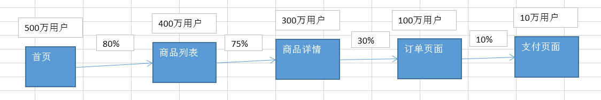
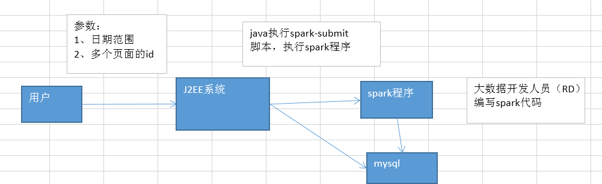
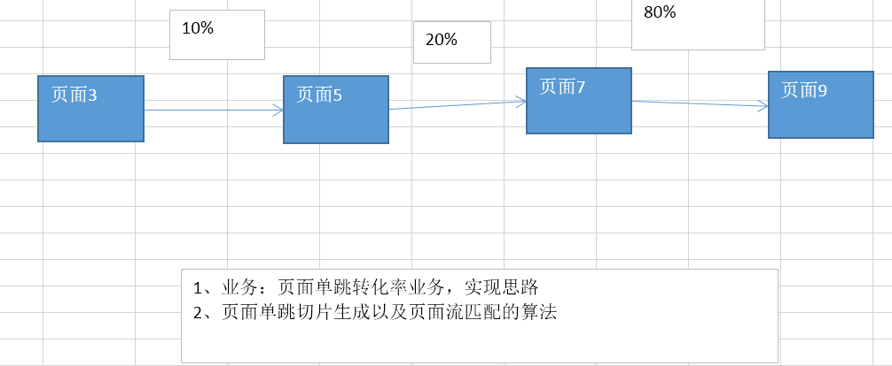

<!-- TOC -->

- [第89讲-页面单跳转化率：模块介绍](#第89讲-页面单跳转化率模块介绍)
- [第90讲-页面单跳转化率：需求分析、技术方案设计、数据表设计](#第90讲-页面单跳转化率需求分析技术方案设计数据表设计)
- [第91讲-页面单跳转化率：编写基础代码](#第91讲-页面单跳转化率编写基础代码)
- [第92讲-页面单跳转化率：页面切片生成以及页面流匹配算法实现](#第92讲-页面单跳转化率页面切片生成以及页面流匹配算法实现)
- [第93讲-页面单跳转化率：计算页面流起始页面的pv](#第93讲-页面单跳转化率计算页面流起始页面的pv)
- [第94讲-页面单跳转化率：计算页面切片的转化率](#第94讲-页面单跳转化率计算页面切片的转化率)
- [第95讲-页面单跳转化率：将页面切片转化率写入MySQL](#第95讲-页面单跳转化率将页面切片转化率写入mysql)
- [第96讲-页面单跳转化率：本地测试](#第96讲-页面单跳转化率本地测试)
- [第97讲-页面单跳转化率：生产环境测试](#第97讲-页面单跳转化率生产环境测试)
- [第98讲-用户访问session分析：生产环境测试](#第98讲-用户访问session分析生产环境测试)

<!-- /TOC -->


# 第89讲-页面单跳转化率：模块介绍


用户行为分析大数据平台

页面单跳转化率，非常经典的功能；而且也非常有用



页面单跳转化率，计算出来以后，还是蛮有用的，蛮有价值的。

产品经理，可以根据这个指标，去尝试分析，整个网站，产品，各个页面的表现怎么样，是不是需要去优化产品的布局；吸引用户最终可以进入最后的支付页面；

数据分析师，可以基于咱们的这个数据，做更深一步的计算和分析

企业管理层，可以看到整个公司的网站，各个页面的之间的跳转的表现，如何？心里有数，可以适当调整公司的经营战略或策略


通过这个模块，我们能够收获到什么？

第一个模块，用户访问session分析模块，很大的一个模块，80多讲，里面的知识和技术点，特别多。

第二个模块，
1、加深和巩固咱们的大数据项目开发流程：需求分析、技术方案设计、数据库设计、代码编写、功能测试、性能调优
2、熟悉和掌握，计算页面间转化率的业务知识，和spark技术实现方案
3、小算法：基于spark的页面切片和页面流匹配算法


# 第90讲-页面单跳转化率：需求分析、技术方案设计、数据表设计



基本的需求：

1、接收J2EE系统传入进来的taskid，从mysql查询任务的参数，日期范围、页面流id
2、针对指定范围日期内的用户访问行为数据，去判断和计算，页面流id中，每两个页面组成的页面切片，它的访问量是多少
3、根据指定页面流中各个页面切片的访问量，计算出来各个页面切片的转化率
4、计算出来的转化率，写入mysql数据库中


用户指定的页面流id：
3,5,7,9,10,21

页面3->页面5的转换率是多少；
页面5->页面7的转化率是多少；
页面7->页面9的转化率是多少；

页面3->页面5的访问量是多少；页面5到页面7的访问量是多少；两两相除，就可以计算出来


1、获取任务的日期范围参数
2、查询指定日期范围内的用户访问行为数据
3、获取用户访问行为中，每个session，计算出各个在指定页面流中的页面切片的访问量；实现，页面单跳切片生成以及页面流匹配的算法；session，3->8->7，3->5->7，是不匹配的；
4、计算出符合页面流的各个切片的pv（访问量）
5、针对用户指定的页面流，去计算各个页面单跳切片的转化率
6、将计算结果持久化到数据库中

现在讲这个东西，看起来和听起来还是比较抽象的；咱们写代码的时候，一边写，一边讲；大家到时候，对这个需求，先有一个囫囵吞枣的概念和认识；后面听课的时候，包括自己动手模仿课程写代码的时候，细细去体会一下，相信一定是可以对这个模块，有比较深入的认识和掌握的


数据表，其实是比较简单的

taskid：唯一标识一个任务
convert_rate：页面流中，各个页面切片的转化率，以特定的格式拼接起来，作为这个字段的值

3,5=10%;5,7=20%





# 第91讲-页面单跳转化率：编写基础代码

忘了说一件事情：

基础数据是什么？还是咱们的用户访问session分析模块基于的基础数据；用户购买支付统计模块；

基础数据是通用的；它里面就包含了咱们网站 / app，每天所有用户在网站中，每一步的访问行为；origin_log

课程，简便为上；三个模块都会用一套基础数据

实际生产环境中，其实一般不会这样；通常来说，都会为某个，或者某几个业务模块，通过hive etl，开发出一个源表。

# 第92讲-页面单跳转化率：页面切片生成以及页面流匹配算法实现

```java
package com.ibeifeng.sparkproject.spark.page;

import java.util.ArrayList;
import java.util.Collections;
import java.util.Comparator;
import java.util.Date;
import java.util.Iterator;
import java.util.List;
import java.util.Map;

import org.apache.spark.SparkConf;
import org.apache.spark.api.java.JavaPairRDD;
import org.apache.spark.api.java.JavaRDD;
import org.apache.spark.api.java.JavaSparkContext;
import org.apache.spark.api.java.function.PairFlatMapFunction;
import org.apache.spark.api.java.function.PairFunction;
import org.apache.spark.broadcast.Broadcast;
import org.apache.spark.sql.Row;
import org.apache.spark.sql.SQLContext;

import scala.Tuple2;

import com.alibaba.fastjson.JSONObject;
import com.ibeifeng.sparkproject.constant.Constants;
import com.ibeifeng.sparkproject.dao.ITaskDAO;
import com.ibeifeng.sparkproject.dao.factory.DAOFactory;
import com.ibeifeng.sparkproject.domain.Task;
import com.ibeifeng.sparkproject.util.DateUtils;
import com.ibeifeng.sparkproject.util.ParamUtils;
import com.ibeifeng.sparkproject.util.SparkUtils;

/**
 * 页面单跳转化率模块spark作业
 * @author Administrator
 *
 */
public class PageOneStepConvertRateSpark {
	
	public static void main(String[] args) {
		// 1、构造Spark上下文
		SparkConf conf = new SparkConf()
				.setAppName(Constants.SPARK_APP_NAME_PAGE);
		SparkUtils.setMaster(conf);  
		
		JavaSparkContext sc = new JavaSparkContext(conf);
		SQLContext sqlContext = SparkUtils.getSQLContext(sc.sc());
		
		// 2、生成模拟数据
		SparkUtils.mockData(sc, sqlContext);  
		
		// 3、查询任务，获取任务的参数
		long taskid = ParamUtils.getTaskIdFromArgs(args, Constants.SPARK_LOCAL_TASKID_PAGE);
		
		ITaskDAO taskDAO = DAOFactory.getTaskDAO();
		Task task = taskDAO.findById(taskid);
		if(task == null) {
			System.out.println(new Date() + ": cannot find this task with id [" + taskid + "].");  
			return;
		}
		
		JSONObject taskParam = JSONObject.parseObject(task.getTaskParam());
		
		// 4、查询指定日期范围内的用户访问行为数据
		JavaRDD<Row> actionRDD = SparkUtils.getActionRDDByDateRange(
				sqlContext, taskParam);
		
		// 对用户访问行为数据做一个映射，将其映射为<sessionid,访问行为>的格式
		// 咱们的用户访问页面切片的生成，是要基于每个session的访问数据，来进行生成的
		// 脱离了session，生成的页面访问切片，是么有意义的
		// 举例，比如用户A，访问了页面3和页面5
		// 用于B，访问了页面4和页面6
		// 漏了一个前提，使用者指定的页面流筛选条件，比如页面3->页面4->页面7
		// 你能不能说，是将页面3->页面4，串起来，作为一个页面切片，来进行统计呢
		// 当然不行
		// 所以说呢，页面切片的生成，肯定是要基于用户session粒度的
		
		JavaPairRDD<String, Row> sessionid2actionRDD = getSessionid2actionRDD(actionRDD);
		
		// 对<sessionid,访问行为> RDD，做一次groupByKey操作
		// 因为我们要拿到每个session对应的访问行为数据，才能够去生成切片
		JavaPairRDD<String, Iterable<Row>> sessionid2actionsRDD = sessionid2actionRDD.groupByKey();
		
		// 最核心的一步，每个session的单跳页面切片的生成，以及页面流的匹配，算法
		JavaPairRDD<String, Integer> pageSplitRDD = generateAndMatchPageSplit(
				sc, sessionid2actionsRDD, taskParam);
		Map<String, Object> pageSplitPvMap = pageSplitRDD.countByKey();
	}
	
	/**
	 * 获取<sessionid,用户访问行为>格式的数据
	 * @param actionRDD 用户访问行为RDD
	 * @return <sessionid,用户访问行为>格式的数据
	 */
	private static JavaPairRDD<String, Row> getSessionid2actionRDD(
			JavaRDD<Row> actionRDD) {
		return actionRDD.mapToPair(new PairFunction<Row, String, Row>() {

			private static final long serialVersionUID = 1L;

			@Override
			public Tuple2<String, Row> call(Row row) throws Exception {
				String sessionid = row.getString(2);
				return new Tuple2<String, Row>(sessionid, row);   
			}
			
		});
	}
	
	/**
	 * 页面切片生成与匹配算法
	 * @param sc 
	 * @param sessionid2actionsRDD
	 * @param taskParam
	 * @return
	 */
	private static JavaPairRDD<String, Integer> generateAndMatchPageSplit(
			JavaSparkContext sc,
			JavaPairRDD<String, Iterable<Row>> sessionid2actionsRDD,
			JSONObject taskParam) {
		String targetPageFlow = ParamUtils.getParam(taskParam, Constants.PARAM_TARGET_PAGE_FLOW);
		final Broadcast<String> targetPageFlowBroadcast = sc.broadcast(targetPageFlow);
		
		return sessionid2actionsRDD.flatMapToPair(
				
				new PairFlatMapFunction<Tuple2<String,Iterable<Row>>, String, Integer>() {

					private static final long serialVersionUID = 1L;

					@Override
					public Iterable<Tuple2<String, Integer>> call(
							Tuple2<String, Iterable<Row>> tuple)
							throws Exception {
						// 定义返回list
						List<Tuple2<String, Integer>> list = 
								new ArrayList<Tuple2<String, Integer>>();
						// 获取到当前session的访问行为的迭代器
						Iterator<Row> iterator = tuple._2.iterator();
						// 获取使用者指定的页面流
						// 使用者指定的页面流，1,2,3,4,5,6,7
						// 1->2的转化率是多少？2->3的转化率是多少？
						String[] targetPages = targetPageFlowBroadcast.value().split(",");  
						
						// 这里，我们拿到的session的访问行为，默认情况下是乱序的
						// 比如说，正常情况下，我们希望拿到的数据，是按照时间顺序排序的
						// 但是问题是，默认是不排序的
						// 所以，我们第一件事情，对session的访问行为数据按照时间进行排序
						
						// 举例，反例
						// 比如，3->5->4->10->7
						// 3->4->5->7->10
						// 排序
						
						List<Row> rows = new ArrayList<Row>();
						while(iterator.hasNext()) {
							rows.add(iterator.next());  
						}
						
						Collections.sort(rows, new Comparator<Row>() {
							
							@Override
							public int compare(Row o1, Row o2) {
								String actionTime1 = o1.getString(4);
								String actionTime2 = o2.getString(4);
								
								Date date1 = DateUtils.parseTime(actionTime1);
								Date date2 = DateUtils.parseTime(actionTime2);
								
								return (int)(date1.getTime() - date2.getTime());
							}
							
						});
						
						// 页面切片的生成，以及页面流的匹配
						Long lastPageId = null;
						
						for(Row row : rows) {
							long pageid = row.getLong(3);
							
							if(lastPageId == null) {
								lastPageId = pageid;
								continue;
							}
							
							// 生成一个页面切片
							// 3,5,2,1,8,9
							// lastPageId=3
							// 5，切片，3_5
							
							String pageSplit = lastPageId + "_" + pageid;
							
							// 对这个切片判断一下，是否在用户指定的页面流中
							for(int i = 1; i < targetPages.length; i++) {
								// 比如说，用户指定的页面流是3,2,5,8,1
								// 遍历的时候，从索引1开始，就是从第二个页面开始
								// 3_2
								String targetPageSplit = targetPages[i - 1] + "_" + targetPages[i];
								
								if(pageSplit.equals(targetPageSplit)) {
									list.add(new Tuple2<String, Integer>(pageSplit, 1));  
									break;
								}
							}
							
							lastPageId = pageid;
						}
						
						return list;
					}
					
				});
	}
	
}

```


# 第93讲-页面单跳转化率：计算页面流起始页面的pv

```java
package com.ibeifeng.sparkproject.spark.page;

import java.util.ArrayList;
import java.util.Collections;
import java.util.Comparator;
import java.util.Date;
import java.util.Iterator;
import java.util.List;
import java.util.Map;

import org.apache.spark.SparkConf;
import org.apache.spark.api.java.JavaPairRDD;
import org.apache.spark.api.java.JavaRDD;
import org.apache.spark.api.java.JavaSparkContext;
import org.apache.spark.api.java.function.FlatMapFunction;
import org.apache.spark.api.java.function.PairFlatMapFunction;
import org.apache.spark.api.java.function.PairFunction;
import org.apache.spark.broadcast.Broadcast;
import org.apache.spark.sql.Row;
import org.apache.spark.sql.SQLContext;

import scala.Tuple2;

import com.alibaba.fastjson.JSONObject;
import com.ibeifeng.sparkproject.constant.Constants;
import com.ibeifeng.sparkproject.dao.ITaskDAO;
import com.ibeifeng.sparkproject.dao.factory.DAOFactory;
import com.ibeifeng.sparkproject.domain.Task;
import com.ibeifeng.sparkproject.util.DateUtils;
import com.ibeifeng.sparkproject.util.ParamUtils;
import com.ibeifeng.sparkproject.util.SparkUtils;

/**
 * 页面单跳转化率模块spark作业
 * @author Administrator
 *
 */
public class PageOneStepConvertRateSpark {
	
	public static void main(String[] args) {
		// 1、构造Spark上下文
		SparkConf conf = new SparkConf()
				.setAppName(Constants.SPARK_APP_NAME_PAGE);
		SparkUtils.setMaster(conf);  
		
		JavaSparkContext sc = new JavaSparkContext(conf);
		SQLContext sqlContext = SparkUtils.getSQLContext(sc.sc());
		
		// 2、生成模拟数据
		SparkUtils.mockData(sc, sqlContext);  
		
		// 3、查询任务，获取任务的参数
		long taskid = ParamUtils.getTaskIdFromArgs(args, Constants.SPARK_LOCAL_TASKID_PAGE);
		
		ITaskDAO taskDAO = DAOFactory.getTaskDAO();
		Task task = taskDAO.findById(taskid);
		if(task == null) {
			System.out.println(new Date() + ": cannot find this task with id [" + taskid + "].");  
			return;
		}
		
		JSONObject taskParam = JSONObject.parseObject(task.getTaskParam());
		
		// 4、查询指定日期范围内的用户访问行为数据
		JavaRDD<Row> actionRDD = SparkUtils.getActionRDDByDateRange(
				sqlContext, taskParam);
		
		// 对用户访问行为数据做一个映射，将其映射为<sessionid,访问行为>的格式
		// 咱们的用户访问页面切片的生成，是要基于每个session的访问数据，来进行生成的
		// 脱离了session，生成的页面访问切片，是么有意义的
		// 举例，比如用户A，访问了页面3和页面5
		// 用于B，访问了页面4和页面6
		// 漏了一个前提，使用者指定的页面流筛选条件，比如页面3->页面4->页面7
		// 你能不能说，是将页面3->页面4，串起来，作为一个页面切片，来进行统计呢
		// 当然不行
		// 所以说呢，页面切片的生成，肯定是要基于用户session粒度的
		
		JavaPairRDD<String, Row> sessionid2actionRDD = getSessionid2actionRDD(actionRDD);
		sessionid2actionRDD = sessionid2actionRDD.cache(); // persist(StorageLevel.MEMORY_ONLY)
		
		// 对<sessionid,访问行为> RDD，做一次groupByKey操作
		// 因为我们要拿到每个session对应的访问行为数据，才能够去生成切片
		JavaPairRDD<String, Iterable<Row>> sessionid2actionsRDD = sessionid2actionRDD.groupByKey();
		
		// 最核心的一步，每个session的单跳页面切片的生成，以及页面流的匹配，算法
		JavaPairRDD<String, Integer> pageSplitRDD = generateAndMatchPageSplit(
				sc, sessionid2actionsRDD, taskParam);
		Map<String, Object> pageSplitPvMap = pageSplitRDD.countByKey();
		
		// 使用者指定的页面流是3,2,5,8,6
		// 咱们现在拿到的这个pageSplitPvMap，3->2，2->5，5->8，8->6
		long startPagePv = getStartPagePv(taskParam, sessionid2actionsRDD);
	}
	
	/**
	 * 获取<sessionid,用户访问行为>格式的数据
	 * @param actionRDD 用户访问行为RDD
	 * @return <sessionid,用户访问行为>格式的数据
	 */
	private static JavaPairRDD<String, Row> getSessionid2actionRDD(
			JavaRDD<Row> actionRDD) {
		return actionRDD.mapToPair(new PairFunction<Row, String, Row>() {

			private static final long serialVersionUID = 1L;

			@Override
			public Tuple2<String, Row> call(Row row) throws Exception {
				String sessionid = row.getString(2);
				return new Tuple2<String, Row>(sessionid, row);   
			}
			
		});
	}
	
	/**
	 * 页面切片生成与匹配算法
	 * @param sc 
	 * @param sessionid2actionsRDD
	 * @param taskParam
	 * @return
	 */
	private static JavaPairRDD<String, Integer> generateAndMatchPageSplit(
			JavaSparkContext sc,
			JavaPairRDD<String, Iterable<Row>> sessionid2actionsRDD,
			JSONObject taskParam) {
		String targetPageFlow = ParamUtils.getParam(taskParam, Constants.PARAM_TARGET_PAGE_FLOW);
		final Broadcast<String> targetPageFlowBroadcast = sc.broadcast(targetPageFlow);
		
		return sessionid2actionsRDD.flatMapToPair(
				
				new PairFlatMapFunction<Tuple2<String,Iterable<Row>>, String, Integer>() {

					private static final long serialVersionUID = 1L;

					@Override
					public Iterable<Tuple2<String, Integer>> call(
							Tuple2<String, Iterable<Row>> tuple)
							throws Exception {
						// 定义返回list
						List<Tuple2<String, Integer>> list = 
								new ArrayList<Tuple2<String, Integer>>();
						// 获取到当前session的访问行为的迭代器
						Iterator<Row> iterator = tuple._2.iterator();
						// 获取使用者指定的页面流
						// 使用者指定的页面流，1,2,3,4,5,6,7
						// 1->2的转化率是多少？2->3的转化率是多少？
						String[] targetPages = targetPageFlowBroadcast.value().split(",");  
						
						// 这里，我们拿到的session的访问行为，默认情况下是乱序的
						// 比如说，正常情况下，我们希望拿到的数据，是按照时间顺序排序的
						// 但是问题是，默认是不排序的
						// 所以，我们第一件事情，对session的访问行为数据按照时间进行排序
						
						// 举例，反例
						// 比如，3->5->4->10->7
						// 3->4->5->7->10
						// 排序
						
						List<Row> rows = new ArrayList<Row>();
						while(iterator.hasNext()) {
							rows.add(iterator.next());  
						}
						
						Collections.sort(rows, new Comparator<Row>() {
							
							@Override
							public int compare(Row o1, Row o2) {
								String actionTime1 = o1.getString(4);
								String actionTime2 = o2.getString(4);
								
								Date date1 = DateUtils.parseTime(actionTime1);
								Date date2 = DateUtils.parseTime(actionTime2);
								
								return (int)(date1.getTime() - date2.getTime());
							}
							
						});
						
						// 页面切片的生成，以及页面流的匹配
						Long lastPageId = null;
						
						for(Row row : rows) {
							long pageid = row.getLong(3);
							
							if(lastPageId == null) {
								lastPageId = pageid;
								continue;
							}
							
							// 生成一个页面切片
							// 3,5,2,1,8,9
							// lastPageId=3
							// 5，切片，3_5
							
							String pageSplit = lastPageId + "_" + pageid;
							
							// 对这个切片判断一下，是否在用户指定的页面流中
							for(int i = 1; i < targetPages.length; i++) {
								// 比如说，用户指定的页面流是3,2,5,8,1
								// 遍历的时候，从索引1开始，就是从第二个页面开始
								// 3_2
								String targetPageSplit = targetPages[i - 1] + "_" + targetPages[i];
								
								if(pageSplit.equals(targetPageSplit)) {
									list.add(new Tuple2<String, Integer>(pageSplit, 1));  
									break;
								}
							}
							
							lastPageId = pageid;
						}
						
						return list;
					}
					
				});
	}
	
	/**
	 * 获取页面流中初始页面的pv
	 * @param taskParam
	 * @param sessionid2actionsRDD
	 * @return
	 */
	private static long getStartPagePv(JSONObject taskParam, 
			JavaPairRDD<String, Iterable<Row>> sessionid2actionsRDD) {
		String targetPageFlow = ParamUtils.getParam(taskParam, 
				Constants.PARAM_TARGET_PAGE_FLOW);
		final long startPageId = Long.valueOf(targetPageFlow.split(",")[0]);  
		
		JavaRDD<Long> startPageRDD = sessionid2actionsRDD.flatMap(
				
				new FlatMapFunction<Tuple2<String,Iterable<Row>>, Long>() {

					private static final long serialVersionUID = 1L;

					@Override
					public Iterable<Long> call(
							Tuple2<String, Iterable<Row>> tuple)
							throws Exception {
						List<Long> list = new ArrayList<Long>();
						
						Iterator<Row> iterator = tuple._2.iterator();
						
						while(iterator.hasNext()) {
							Row row = iterator.next();
							long pageid = row.getLong(3);
							
							if(pageid == startPageId) {
								list.add(pageid);
							}
						}
						
						return list;
					}  
					
				});
		
		return startPageRDD.count();
	}
	
}


```


# 第94讲-页面单跳转化率：计算页面切片的转化率


# 第95讲-页面单跳转化率：将页面切片转化率写入MySQL


# 第96讲-页面单跳转化率：本地测试


# 第97讲-页面单跳转化率：生产环境测试


# 第98讲-用户访问session分析：生产环境测试