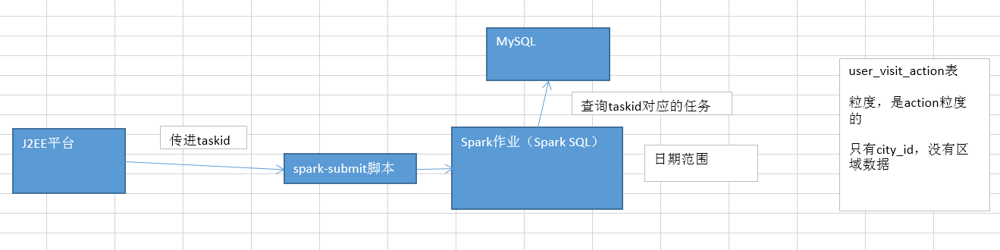

# 第99讲-各区域热门商品统计：模块介绍

需求：根据用户指定的日期范围，统计各个区域下的最热门的top3商品

1、区域信息在哪里，各个城市的信息，城市是不怎么变化的，没有必要存储在hive里？MySQL，Hive和MySQL异构数据源使用，技术点
2、hive用户行为数据，和mysql城市信息，join，关联之后是RDD？RDD转换DataFrame，注册临时表，技术点
3、各个区域下各个商品的点击量，保留每个区域的城市列表数据？自定义UDAF函数，group_concat_distinct()
4、product_id，join hive表中的商品信息，商品信息在哪里？Hive。商品的经营类型是什么？自定义UDF函数，get_json_object()，if()
5、获取每个区域的点击量top3商品？开窗函数；给每个区域打上级别的标识，西北大区，经济落后，区域上的划分，C类区域；北京、上海，发达，标记A类
6、Spark SQL的数据倾斜解决方案？双重group by、随机key以及扩容表（自定义UDF函数，random_key()）、内置reduce join转换为map join、shuffle并行度




大数据方向的职业发展规划的个人的积累：

大数据ETL开发工程师：Hadoop基础知识，Hive精通，SQL和ETL（数据的抽取、转换和导入），原始的大日志->数据仓库（多个表）；java基础、python、shell脚本基础（大数据金字塔的最底端，职业瓶颈非常有限）

钻研Hadoop、学习（北风的两套Spark课程）、自学Storm（北风）、精通java编程

转型

大数据开发工程师：Hadoop（HDFS、YARN，MapReduce过时），Spark，（Storm），J2SE（Java基础编程），Python、Shell，Hive（SQL），HBase，MySQL；负责写纯的MapReduce、Spark、Storm、Hive，程序，Eclipse建立工程，写完打成jar包，配置到公司的调度平台定期运行；要不就是部署到线上机器，等着J2EE平台来调用。

职业发展前景、薪资，肯定是比第一种要高一些的（至少高30%）

平行

J2EE开发工程师：纯J2EE

学习Hadoop视频、（北风网）学习Spark视频、学习Storm视频，还没有达到精通

转型

数据平台J2EE开发工程师：2年、3年、5年的Java开发经验，慢慢往大数据方向来转，懂一点儿大数据的基础知识，Hadoop、Spark、Storm、HBase至少知道是怎么回事，能写一点简单的程序；J2EE精通；（前端）、J2EE，Web系统（界面），提交计算任务（指定参数）、通过界面查看漂亮的报表和表格。

大数据开发工程师+数据平台J2EE开发工程师

大数据平台高级开发工程师：本人在做这一块儿

精通Hadoop、Spark、Storm（源码级别的），Kafka、Flume、ZooKeeper；
J2EE技术，精通，开源框架（Spring MVC、Spring、MyBatis），MySQL性能调优，Java虚拟机（JVM）调优，前端技术（JS熟练、JS框架，jQuery、Bootstrap）；
高并发系统架构（NoSQL、Redis、Memcached、Nginx、负载均衡、分布式）

大数据平台高级架构师

针对各种类型的大数据业务系统，都可以进行独立的规划、把控、技术选型、从底层大数据到上层J2EE的架构搭建、核心模块的编写、开发出来的大数据系统，面向百万级、千万级的用户，还可以实现高并发的系统架构

linux运维工程师

转型

大数据运维工程师：精通linux，hadoop、spark、storm、hbase（源码级别）集群的搭建与运维，集群的升级、二次开发（修改源码）、故障解决和排查，会一些编程语言，和脚本语言

R、SAS传统的分析师

转型

数据分析师：R、Spark R、分析算法、分析模型的建模

高端

大数据数据挖掘与机器学习工程师：编程语言、脚本语言、精通Hadoop、Spark、Storm，精通各种机器学习与数据挖掘的算法

大数据，真正要发挥出来他的价值，比如，直接去推动线上的业务，给公司赚取更多的利润，其实就是就要靠这种工程师，和高端的技术

大数据金字塔的顶端

知名大学（北大、清华、中科大）的至少硕士，就是这个研究方向的；博士；直接可以做这个金字塔顶端的大数据的工作

从上面说的那个系列，一步一步往上走，走到大数据平台高级架构师级别；然后再钻研数据挖掘、机器学习相关的算法和技术（Spark MLlib，机器学习，GraphX，图计算，Hadoop Mahout）；走到大数据金字塔的最顶端。

用技术去改变世界，用技术去改变人们的生活，用技术去直接为企业创造价值和利润


用户行为分析，很重要，大数据平台高级架构师；从Hadoop、Spark、实时计算、J2EE、前端，前面把控和规划，带领团队来实现和开发

（大数据最底端，简单的SQL、报表、ETL、取一些数据）

平台，意义在哪里？辅助公司内部的产品经理，更好的规划和设计产品；高管，能够对用户行为心理有数；分析师，提高他们的工作效率（自己要去做）；给公司内部的人员带来了一些方便、效率上的提升、数据的支持；他们再做对应的一些事情，产品规划、战略调整、分析策略，对公司的利润有间接的支持和提升

大数据数据挖掘与机器学习工程师

算法，预测明年可能热卖的商品有哪些，公司重点去铺开和发展这些商品；预测公司选择哪些形象代言人可以给公司带来最好的形象，以及用户的增长率；

公司，可以直接根据这些人计算出来的一些数据、方案等，去调整公司的战略，是直接对公司的利润的提升、市场占有率的增加是有帮助的


# 第100讲-各区域热门商品统计：需求分析、技术方案设计以及数据设计

需求：根据用户指定的日期范围，统计各个区域下的最热门的top3商品

Spark作业接收taskid，查询对应的MySQL中的task，获取用户指定的筛选参数；统计出指定日期范围内的，各个区域的top3热门商品；最后将结果写入MySQL表中。


技术方案设计：

1、查询task，获取日期范围，通过Spark SQL，查询user_visit_action表中的指定日期范围内的数据，过滤出，商品点击行为，click_product_id is not null；click_product_id != 'NULL'；click_product_id != 'null'；city_id，click_product_id
2、使用Spark SQL从MySQL中查询出来城市信息（city_id、city_name、area），用户访问行为数据要跟城市信息进行join，city_id、city_name、area、product_id，RDD，转换成DataFrame，注册成一个临时表
3、Spark SQL内置函数（case when），对area打标记（华东大区，A级，华中大区，B级，东北大区，C级，西北大区，D级），area_level
4、计算出来每个区域下每个商品的点击次数，group by area, product_id；保留每个区域的城市名称列表；自定义UDAF，group_concat_distinct()函数，聚合出来一个city_names字段，area、product_id、city_names、click_count
5、join商品明细表，hive（product_id、product_name、extend_info），extend_info是json类型，自定义UDF，get_json_object()函数，取出其中的product_status字段，if()函数（Spark SQL内置函数），判断，0 自营，1 第三方；（area、product_id、city_names、click_count、product_name、product_status）
6、开窗函数，根据area来聚合，获取每个area下，click_count排名前3的product信息；area、area_level、product_id、city_names、click_count、product_name、product_status
7、结果写入MySQL表中
8、Spark SQL的数据倾斜解决方案？双重group by、随机key以及扩容表（自定义UDF函数，random_key()）、Spark SQL内置的reduce join转换为map join、提高shuffle并行度
9、本地测试和生产环境的测试


基础数据的准备和设计

1、MySQL表中，要有city_info，city_id、city_name、area
2、Hive表中，要有一个product_info表，product_id、product_name、extend_info
3、MySQL中，设计结果表，task_id、area、area_level、product_id、city_names、click_count、product_name、product_status


# 第101讲-各区域热门商品统计：查询用户指定日期范围内的点击行为数据

```java
package com.ibeifeng.sparkproject.spark.product;

import org.apache.spark.SparkConf;
import org.apache.spark.api.java.JavaRDD;
import org.apache.spark.api.java.JavaSparkContext;
import org.apache.spark.sql.DataFrame;
import org.apache.spark.sql.Row;
import org.apache.spark.sql.SQLContext;

import com.alibaba.fastjson.JSONObject;
import com.ibeifeng.sparkproject.constant.Constants;
import com.ibeifeng.sparkproject.dao.ITaskDAO;
import com.ibeifeng.sparkproject.dao.factory.DAOFactory;
import com.ibeifeng.sparkproject.domain.Task;
import com.ibeifeng.sparkproject.util.ParamUtils;
import com.ibeifeng.sparkproject.util.SparkUtils;

/**
 * 各区域top3热门商品统计Spark作业
 * @author Administrator
 *
 */
public class AreaTop3ProductSpark {

	public static void main(String[] args) {
		// 创建SparkConf
		SparkConf conf = new SparkConf()
				.setAppName("AreaTop3ProductSpark");
		SparkUtils.setMaster(conf); 
		
		// 构建Spark上下文
		JavaSparkContext sc = new JavaSparkContext(conf);
		SQLContext sqlContext = SparkUtils.getSQLContext(sc.sc());
		
		// 准备模拟数据
		SparkUtils.mockData(sc, sqlContext);  
		
		// 获取命令行传入的taskid，查询对应的任务参数
		ITaskDAO taskDAO = DAOFactory.getTaskDAO();
		
		long taskid = ParamUtils.getTaskIdFromArgs(args, 
				Constants.SPARK_LOCAL_TASKID_PRODUCT);
		Task task = taskDAO.findById(taskid);
		
		JSONObject taskParam = JSONObject.parseObject(task.getTaskParam());
		String startDate = ParamUtils.getParam(taskParam, Constants.PARAM_START_DATE);
		String endDate = ParamUtils.getParam(taskParam, Constants.PARAM_END_DATE);
		
		// 查询用户指定日期范围内的点击行为数据
		JavaRDD<Row> clickActionRDD = getClickActionRDDByDate(
				sqlContext, startDate, endDate);
		
		sc.close();
	}
	
	/**
	 * 查询指定日期范围内的点击行为数据
	 * @param sqlContext 
	 * @param startDate 起始日期
	 * @param endDate 截止日期
	 * @return 点击行为数据
	 */
	private static JavaRDD<Row> getClickActionRDDByDate(
			SQLContext sqlContext, String startDate, String endDate) {
		// 从user_visit_action中，查询用户访问行为数据
		// 第一个限定：click_product_id，限定为不为空的访问行为，那么就代表着点击行为
		// 第二个限定：在用户指定的日期范围内的数据
		
		String sql = 
				"SELECT "
					+ "city_id,"
					+ "click_product_id product_id "
				+ "FROM user_visit_action "
				+ "WHERE click_product_id IS NOT NULL "			
				+ "AND click_product_id != 'NULL' "
				+ "AND click_product_id != 'null' "
				+ "AND action_time>='" + startDate + "' "
				+ "AND action_time<='" + endDate + "'";
		
		DataFrame clickActionDF = sqlContext.sql(sql);
	
		return clickActionDF.javaRDD();
	}
	
}


```


# 第102讲-各区域热门商品统计：异构数据源之从MySQL中查询城市数据

```java
package com.ibeifeng.sparkproject.spark.product;

import java.util.HashMap;
import java.util.Map;

import org.apache.spark.SparkConf;
import org.apache.spark.api.java.JavaPairRDD;
import org.apache.spark.api.java.JavaRDD;
import org.apache.spark.api.java.JavaSparkContext;
import org.apache.spark.api.java.function.PairFunction;
import org.apache.spark.sql.DataFrame;
import org.apache.spark.sql.Row;
import org.apache.spark.sql.SQLContext;

import scala.Tuple2;

import com.alibaba.fastjson.JSONObject;
import com.ibeifeng.sparkproject.conf.ConfigurationManager;
import com.ibeifeng.sparkproject.constant.Constants;
import com.ibeifeng.sparkproject.dao.ITaskDAO;
import com.ibeifeng.sparkproject.dao.factory.DAOFactory;
import com.ibeifeng.sparkproject.domain.Task;
import com.ibeifeng.sparkproject.util.ParamUtils;
import com.ibeifeng.sparkproject.util.SparkUtils;

/**
 * 各区域top3热门商品统计Spark作业
 * @author Administrator
 *
 */
public class AreaTop3ProductSpark {

	public static void main(String[] args) {
		// 创建SparkConf
		SparkConf conf = new SparkConf()
				.setAppName("AreaTop3ProductSpark");
		SparkUtils.setMaster(conf); 
		
		// 构建Spark上下文
		JavaSparkContext sc = new JavaSparkContext(conf);
		SQLContext sqlContext = SparkUtils.getSQLContext(sc.sc());
		
		// 准备模拟数据
		SparkUtils.mockData(sc, sqlContext);  
		
		// 获取命令行传入的taskid，查询对应的任务参数
		ITaskDAO taskDAO = DAOFactory.getTaskDAO();
		
		long taskid = ParamUtils.getTaskIdFromArgs(args, 
				Constants.SPARK_LOCAL_TASKID_PRODUCT);
		Task task = taskDAO.findById(taskid);
		
		JSONObject taskParam = JSONObject.parseObject(task.getTaskParam());
		String startDate = ParamUtils.getParam(taskParam, Constants.PARAM_START_DATE);
		String endDate = ParamUtils.getParam(taskParam, Constants.PARAM_END_DATE);
		
		// 查询用户指定日期范围内的点击行为数据（city_id，在哪个城市发生的点击行为）
		JavaPairRDD<Long, Row> clickActionRDD = getcityid2ClickActionRDDByDate(
				sqlContext, startDate, endDate);
		
		// 从MySQL中查询城市信息
		JavaPairRDD<Long, Row> cityInfoRDD = getcityid2CityInfoRDD(sqlContext);
		
		sc.close();
	}
	
	/**
	 * 查询指定日期范围内的点击行为数据
	 * @param sqlContext 
	 * @param startDate 起始日期
	 * @param endDate 截止日期
	 * @return 点击行为数据
	 */
	private static JavaPairRDD<Long, Row> getcityid2ClickActionRDDByDate(
			SQLContext sqlContext, String startDate, String endDate) {
		// 从user_visit_action中，查询用户访问行为数据
		// 第一个限定：click_product_id，限定为不为空的访问行为，那么就代表着点击行为
		// 第二个限定：在用户指定的日期范围内的数据
		
		String sql = 
				"SELECT "
					+ "city_id,"
					+ "click_product_id product_id "
				+ "FROM user_visit_action "
				+ "WHERE click_product_id IS NOT NULL "			
				+ "AND click_product_id != 'NULL' "
				+ "AND click_product_id != 'null' "
				+ "AND action_time>='" + startDate + "' "
				+ "AND action_time<='" + endDate + "'";
		
		DataFrame clickActionDF = sqlContext.sql(sql);
	
		JavaRDD<Row> clickActionRDD = clickActionDF.javaRDD();
	
		JavaPairRDD<Long, Row> cityid2clickActionRDD = clickActionRDD.mapToPair(
				
				new PairFunction<Row, Long, Row>() {

					private static final long serialVersionUID = 1L;

					@Override
					public Tuple2<Long, Row> call(Row row) throws Exception {
						Long cityid = row.getLong(0);
						return new Tuple2<Long, Row>(cityid, row);  
					}
					
				});
		
		return cityid2clickActionRDD;
	}
	
	/**
	 * 使用Spark SQL从MySQL中查询城市信息
	 * @param sqlContext SQLContext
	 * @return 
	 */
	private static JavaPairRDD<Long, Row> getcityid2CityInfoRDD(SQLContext sqlContext) {
		// 构建MySQL连接配置信息（直接从配置文件中获取）
		String url = null;
		boolean local = ConfigurationManager.getBoolean(Constants.SPARK_LOCAL);
		
		if(local) {
			url = ConfigurationManager.getProperty(Constants.JDBC_URL);
		} else {
			url = ConfigurationManager.getProperty(Constants.JDBC_URL_PROD);
		}
		
		Map<String, String> options = new HashMap<String, String>();
		options.put("url", url);
		options.put("dbtable", "city_info");  
		
		// 通过SQLContext去从MySQL中查询数据
		DataFrame cityInfoDF = sqlContext.read().format("jdbc")
				.options(options).load();
		
		// 返回RDD
		JavaRDD<Row> cityInfoRDD = cityInfoDF.javaRDD();
	
		JavaPairRDD<Long, Row> cityid2cityInfoRDD = cityInfoRDD.mapToPair(
			
				new PairFunction<Row, Long, Row>() {

					private static final long serialVersionUID = 1L;

					@Override
					public Tuple2<Long, Row> call(Row row) throws Exception {
						long cityid = row.getLong(0);
						return new Tuple2<Long, Row>(cityid, row);
					}
					
				});
		
		return cityid2cityInfoRDD;
	}
	
}


```


# 第103讲-各区域热门商品统计：关联城市信息以及RDD转换为DataFrame后注册临时表

```java
package com.ibeifeng.sparkproject.spark.product;

import java.util.ArrayList;
import java.util.HashMap;
import java.util.List;
import java.util.Map;

import org.apache.spark.SparkConf;
import org.apache.spark.api.java.JavaPairRDD;
import org.apache.spark.api.java.JavaRDD;
import org.apache.spark.api.java.JavaSparkContext;
import org.apache.spark.api.java.function.Function;
import org.apache.spark.api.java.function.PairFunction;
import org.apache.spark.sql.DataFrame;
import org.apache.spark.sql.Row;
import org.apache.spark.sql.RowFactory;
import org.apache.spark.sql.SQLContext;
import org.apache.spark.sql.types.DataTypes;
import org.apache.spark.sql.types.StructField;
import org.apache.spark.sql.types.StructType;

import scala.Tuple2;

import com.alibaba.fastjson.JSONObject;
import com.ibeifeng.sparkproject.conf.ConfigurationManager;
import com.ibeifeng.sparkproject.constant.Constants;
import com.ibeifeng.sparkproject.dao.ITaskDAO;
import com.ibeifeng.sparkproject.dao.factory.DAOFactory;
import com.ibeifeng.sparkproject.domain.Task;
import com.ibeifeng.sparkproject.util.ParamUtils;
import com.ibeifeng.sparkproject.util.SparkUtils;

/**
 * 各区域top3热门商品统计Spark作业
 * @author Administrator
 *
 */
public class AreaTop3ProductSpark {

	public static void main(String[] args) {
		// 创建SparkConf
		SparkConf conf = new SparkConf()
				.setAppName("AreaTop3ProductSpark");
		SparkUtils.setMaster(conf); 
		
		// 构建Spark上下文
		JavaSparkContext sc = new JavaSparkContext(conf);
		SQLContext sqlContext = SparkUtils.getSQLContext(sc.sc());
		
		// 准备模拟数据
		SparkUtils.mockData(sc, sqlContext);  
		
		// 获取命令行传入的taskid，查询对应的任务参数
		ITaskDAO taskDAO = DAOFactory.getTaskDAO();
		
		long taskid = ParamUtils.getTaskIdFromArgs(args, 
				Constants.SPARK_LOCAL_TASKID_PRODUCT);
		Task task = taskDAO.findById(taskid);
		
		JSONObject taskParam = JSONObject.parseObject(task.getTaskParam());
		String startDate = ParamUtils.getParam(taskParam, Constants.PARAM_START_DATE);
		String endDate = ParamUtils.getParam(taskParam, Constants.PARAM_END_DATE);
		
		// 查询用户指定日期范围内的点击行为数据（city_id，在哪个城市发生的点击行为）
		// 技术点1：Hive数据源的使用
		JavaPairRDD<Long, Row> cityid2clickActionRDD = getcityid2ClickActionRDDByDate(
				sqlContext, startDate, endDate);
		
		// 从MySQL中查询城市信息
		// 技术点2：异构数据源之MySQL的使用
		JavaPairRDD<Long, Row> cityid2cityInfoRDD = getcityid2CityInfoRDD(sqlContext);
		
		// 生成点击商品基础信息临时表
		// 技术点3：将RDD转换为DataFrame，并注册临时表
		generateTempClickProductBasicTable(sqlContext, 
				cityid2clickActionRDD, cityid2cityInfoRDD); 
		
		sc.close();
	}
	
	/**
	 * 查询指定日期范围内的点击行为数据
	 * @param sqlContext 
	 * @param startDate 起始日期
	 * @param endDate 截止日期
	 * @return 点击行为数据
	 */
	private static JavaPairRDD<Long, Row> getcityid2ClickActionRDDByDate(
			SQLContext sqlContext, String startDate, String endDate) {
		// 从user_visit_action中，查询用户访问行为数据
		// 第一个限定：click_product_id，限定为不为空的访问行为，那么就代表着点击行为
		// 第二个限定：在用户指定的日期范围内的数据
		
		String sql = 
				"SELECT "
					+ "city_id,"
					+ "click_product_id product_id "
				+ "FROM user_visit_action "
				+ "WHERE click_product_id IS NOT NULL "			
				+ "AND click_product_id != 'NULL' "
				+ "AND click_product_id != 'null' "
				+ "AND action_time>='" + startDate + "' "
				+ "AND action_time<='" + endDate + "'";
		
		DataFrame clickActionDF = sqlContext.sql(sql);
	
		JavaRDD<Row> clickActionRDD = clickActionDF.javaRDD();
	
		JavaPairRDD<Long, Row> cityid2clickActionRDD = clickActionRDD.mapToPair(
				
				new PairFunction<Row, Long, Row>() {

					private static final long serialVersionUID = 1L;

					@Override
					public Tuple2<Long, Row> call(Row row) throws Exception {
						Long cityid = row.getLong(0);
						return new Tuple2<Long, Row>(cityid, row);  
					}
					
				});
		
		return cityid2clickActionRDD;
	}
	
	/**
	 * 使用Spark SQL从MySQL中查询城市信息
	 * @param sqlContext SQLContext
	 * @return 
	 */
	private static JavaPairRDD<Long, Row> getcityid2CityInfoRDD(SQLContext sqlContext) {
		// 构建MySQL连接配置信息（直接从配置文件中获取）
		String url = null;
		boolean local = ConfigurationManager.getBoolean(Constants.SPARK_LOCAL);
		
		if(local) {
			url = ConfigurationManager.getProperty(Constants.JDBC_URL);
		} else {
			url = ConfigurationManager.getProperty(Constants.JDBC_URL_PROD);
		}
		
		Map<String, String> options = new HashMap<String, String>();
		options.put("url", url);
		options.put("dbtable", "city_info");  
		
		// 通过SQLContext去从MySQL中查询数据
		DataFrame cityInfoDF = sqlContext.read().format("jdbc")
				.options(options).load();
		
		// 返回RDD
		JavaRDD<Row> cityInfoRDD = cityInfoDF.javaRDD();
	
		JavaPairRDD<Long, Row> cityid2cityInfoRDD = cityInfoRDD.mapToPair(
			
				new PairFunction<Row, Long, Row>() {

					private static final long serialVersionUID = 1L;

					@Override
					public Tuple2<Long, Row> call(Row row) throws Exception {
						long cityid = row.getLong(0);
						return new Tuple2<Long, Row>(cityid, row);
					}
					
				});
		
		return cityid2cityInfoRDD;
	}
	
	/**
	 * 生成点击商品基础信息临时表
	 * @param sqlContext
	 * @param cityid2clickActionRDD
	 * @param cityid2cityInfoRDD
	 */
	private static void generateTempClickProductBasicTable(
			SQLContext sqlContext,
			JavaPairRDD<Long, Row> cityid2clickActionRDD,
			JavaPairRDD<Long, Row> cityid2cityInfoRDD) {
		// 执行join操作，进行点击行为数据和城市数据的关联
		JavaPairRDD<Long, Tuple2<Row, Row>> joinedRDD =
				cityid2clickActionRDD.join(cityid2cityInfoRDD);
		
		// 将上面的JavaPairRDD，转换成一个JavaRDD<Row>（才能将RDD转换为DataFrame）
		JavaRDD<Row> mappedRDD = joinedRDD.map(
				
				new Function<Tuple2<Long,Tuple2<Row,Row>>, Row>() {

					private static final long serialVersionUID = 1L;

					@Override
					public Row call(Tuple2<Long, Tuple2<Row, Row>> tuple)
							throws Exception {
						long cityid = tuple._1;
						Row clickAction = tuple._2._1;
						Row cityInfo = tuple._2._2;
						
						long productid = clickAction.getLong(1);
						String cityName = cityInfo.getString(1);
						String area = cityInfo.getString(2);
						
						return RowFactory.create(cityid, cityName, area, productid);  
					}
					
				});
		
		// 基于JavaRDD<Row>的格式，就可以将其转换为DataFrame
		List<StructField> structFields = new ArrayList<StructField>();
		structFields.add(DataTypes.createStructField("city_id", DataTypes.LongType, true));  
		structFields.add(DataTypes.createStructField("city_name", DataTypes.StringType, true));
		structFields.add(DataTypes.createStructField("area", DataTypes.StringType, true));
		structFields.add(DataTypes.createStructField("product_id", DataTypes.LongType, true));  
		
		StructType schema = DataTypes.createStructType(structFields);
	
		DataFrame df = sqlContext.createDataFrame(mappedRDD, schema);
		
		// 将DataFrame中的数据，注册成临时表（tmp_clk_prod_basic）
		df.registerTempTable("tmp_clk_prod_basic");  
	}
	
}


```


# 第104讲-各区域热门商品统计：开发自定义UDAF聚合函数之group_concat_distinct()


```java
package com.ibeifeng.sparkproject.spark.product;

import org.apache.spark.sql.api.java.UDF3;

/**
 * 将两个字段拼接起来（使用指定的分隔符）
 * @author Administrator
 *
 */
public class ConcatLongStringUDF implements UDF3<Long, String, String, String> {

	private static final long serialVersionUID = 1L;
	
	@Override
	public String call(Long v1, String v2, String split) throws Exception {
		return String.valueOf(v1) + split + v2;
	}

}


```


```java
package com.ibeifeng.sparkproject.spark.product;

import java.util.Arrays;

import org.apache.spark.sql.Row;
import org.apache.spark.sql.expressions.MutableAggregationBuffer;
import org.apache.spark.sql.expressions.UserDefinedAggregateFunction;
import org.apache.spark.sql.types.DataType;
import org.apache.spark.sql.types.DataTypes;
import org.apache.spark.sql.types.StructType;

/**
 * 组内拼接去重函数（group_concat_distinct()）
 * @author Administrator
 *
 */
public class GroupConcatDistinctUDAF extends UserDefinedAggregateFunction {

	private static final long serialVersionUID = -2510776241322950505L;
	
	// 指定输入数据的字段与类型
	private StructType inputSchema = DataTypes.createStructType(Arrays.asList(
			DataTypes.createStructField("cityInfo", DataTypes.StringType, true)));  
	// 指定缓冲数据的字段与类型
	private StructType bufferSchema = DataTypes.createStructType(Arrays.asList(
			DataTypes.createStructField("bufferCityInfo", DataTypes.StringType, true)));  
	// 指定返回类型
	private DataType dataType = DataTypes.StringType;
	// 指定是否是确定性的
	private boolean deterministic = true;
	
	@Override
	public StructType inputSchema() {
		return inputSchema;
	}
	
	@Override
	public StructType bufferSchema() {
		return bufferSchema;
	}

	@Override
	public DataType dataType() {
		return dataType;
	}

	@Override
	public boolean deterministic() {
		return deterministic;
	}
	
	/**
	 * 初始化
	 * 可以认为是，你自己在内部指定一个初始的值
	 */
	@Override
	public void initialize(MutableAggregationBuffer buffer) {
		buffer.update(0, "");  
	}
	
	/**
	 * 更新
	 * 可以认为是，一个一个地将组内的字段值传递进来
	 * 实现拼接的逻辑
	 */
	@Override
	public void update(MutableAggregationBuffer buffer, Row input) {
		// 缓冲中的已经拼接过的城市信息串
		String bufferCityInfo = buffer.getString(0);
		// 刚刚传递进来的某个城市信息
		String cityInfo = input.getString(0);
		
		// 在这里要实现去重的逻辑
		// 判断：之前没有拼接过某个城市信息，那么这里才可以接下去拼接新的城市信息
		if(!bufferCityInfo.contains(cityInfo)) {
			if("".equals(bufferCityInfo)) {
				bufferCityInfo += cityInfo;
			} else {
				// 比如1:北京
				// 1:北京,2:上海
				bufferCityInfo += "," + cityInfo;
			}
			
			buffer.update(0, bufferCityInfo);  
		}
	}
	
	/**
	 * 合并
	 * update操作，可能是针对一个分组内的部分数据，在某个节点上发生的
	 * 但是可能一个分组内的数据，会分布在多个节点上处理
	 * 此时就要用merge操作，将各个节点上分布式拼接好的串，合并起来
	 */
	@Override
	public void merge(MutableAggregationBuffer buffer1, Row buffer2) {
		String bufferCityInfo1 = buffer1.getString(0);
		String bufferCityInfo2 = buffer2.getString(0);
		
		for(String cityInfo : bufferCityInfo2.split(",")) {
			if(!bufferCityInfo1.contains(cityInfo)) {
				if("".equals(bufferCityInfo1)) {
					bufferCityInfo1 += cityInfo;
				} else {
					bufferCityInfo1 += "," + cityInfo;
				}
 			}
		}
		
		buffer1.update(0, bufferCityInfo1);  
	}
	
	@Override
	public Object evaluate(Row row) {  
		return row.getString(0);  
	}

}


```


# 第105讲-各区域热门商品统计：查询各区域各商品的点击次数并拼接城市列表

```java
package com.ibeifeng.sparkproject.spark.product;

import java.util.ArrayList;
import java.util.HashMap;
import java.util.List;
import java.util.Map;

import org.apache.spark.SparkConf;
import org.apache.spark.api.java.JavaPairRDD;
import org.apache.spark.api.java.JavaRDD;
import org.apache.spark.api.java.JavaSparkContext;
import org.apache.spark.api.java.function.Function;
import org.apache.spark.api.java.function.PairFunction;
import org.apache.spark.sql.DataFrame;
import org.apache.spark.sql.Row;
import org.apache.spark.sql.RowFactory;
import org.apache.spark.sql.SQLContext;
import org.apache.spark.sql.types.DataTypes;
import org.apache.spark.sql.types.StructField;
import org.apache.spark.sql.types.StructType;

import scala.Tuple2;

import com.alibaba.fastjson.JSONObject;
import com.ibeifeng.sparkproject.conf.ConfigurationManager;
import com.ibeifeng.sparkproject.constant.Constants;
import com.ibeifeng.sparkproject.dao.ITaskDAO;
import com.ibeifeng.sparkproject.dao.factory.DAOFactory;
import com.ibeifeng.sparkproject.domain.Task;
import com.ibeifeng.sparkproject.util.ParamUtils;
import com.ibeifeng.sparkproject.util.SparkUtils;

/**
 * 各区域top3热门商品统计Spark作业
 * @author Administrator
 *
 */
public class AreaTop3ProductSpark {

	public static void main(String[] args) {
		// 创建SparkConf
		SparkConf conf = new SparkConf()
				.setAppName("AreaTop3ProductSpark");
		SparkUtils.setMaster(conf); 
		
		// 构建Spark上下文
		JavaSparkContext sc = new JavaSparkContext(conf);
		SQLContext sqlContext = SparkUtils.getSQLContext(sc.sc());
		
		// 注册自定义函数
		sqlContext.udf().register("concat_long_string", 
				new ConcatLongStringUDF(), DataTypes.StringType);
		sqlContext.udf().register("group_concat_distinct", 
				new GroupConcatDistinctUDAF());
		
		// 准备模拟数据
		SparkUtils.mockData(sc, sqlContext);  
		
		// 获取命令行传入的taskid，查询对应的任务参数
		ITaskDAO taskDAO = DAOFactory.getTaskDAO();
		
		long taskid = ParamUtils.getTaskIdFromArgs(args, 
				Constants.SPARK_LOCAL_TASKID_PRODUCT);
		Task task = taskDAO.findById(taskid);
		
		JSONObject taskParam = JSONObject.parseObject(task.getTaskParam());
		String startDate = ParamUtils.getParam(taskParam, Constants.PARAM_START_DATE);
		String endDate = ParamUtils.getParam(taskParam, Constants.PARAM_END_DATE);
		
		// 查询用户指定日期范围内的点击行为数据（city_id，在哪个城市发生的点击行为）
		// 技术点1：Hive数据源的使用
		JavaPairRDD<Long, Row> cityid2clickActionRDD = getcityid2ClickActionRDDByDate(
				sqlContext, startDate, endDate);
		
		// 从MySQL中查询城市信息
		// 技术点2：异构数据源之MySQL的使用
		JavaPairRDD<Long, Row> cityid2cityInfoRDD = getcityid2CityInfoRDD(sqlContext);
		
		// 生成点击商品基础信息临时表
		// 技术点3：将RDD转换为DataFrame，并注册临时表
		generateTempClickProductBasicTable(sqlContext, 
				cityid2clickActionRDD, cityid2cityInfoRDD); 
		
		// 生成各区域各商品点击次数的临时表
		generateTempAreaPrdocutClickCountTable(sqlContext);
		
		sc.close();
	}

	/**
	 * 查询指定日期范围内的点击行为数据
	 * @param sqlContext 
	 * @param startDate 起始日期
	 * @param endDate 截止日期
	 * @return 点击行为数据
	 */
	private static JavaPairRDD<Long, Row> getcityid2ClickActionRDDByDate(
			SQLContext sqlContext, String startDate, String endDate) {
		// 从user_visit_action中，查询用户访问行为数据
		// 第一个限定：click_product_id，限定为不为空的访问行为，那么就代表着点击行为
		// 第二个限定：在用户指定的日期范围内的数据
		
		String sql = 
				"SELECT "
					+ "city_id,"
					+ "click_product_id product_id "
				+ "FROM user_visit_action "
				+ "WHERE click_product_id IS NOT NULL "			
				+ "AND click_product_id != 'NULL' "
				+ "AND click_product_id != 'null' "
				+ "AND action_time>='" + startDate + "' "
				+ "AND action_time<='" + endDate + "'";
		
		DataFrame clickActionDF = sqlContext.sql(sql);
	
		JavaRDD<Row> clickActionRDD = clickActionDF.javaRDD();
	
		JavaPairRDD<Long, Row> cityid2clickActionRDD = clickActionRDD.mapToPair(
				
				new PairFunction<Row, Long, Row>() {

					private static final long serialVersionUID = 1L;

					@Override
					public Tuple2<Long, Row> call(Row row) throws Exception {
						Long cityid = row.getLong(0);
						return new Tuple2<Long, Row>(cityid, row);  
					}
					
				});
		
		return cityid2clickActionRDD;
	}
	
	/**
	 * 使用Spark SQL从MySQL中查询城市信息
	 * @param sqlContext SQLContext
	 * @return 
	 */
	private static JavaPairRDD<Long, Row> getcityid2CityInfoRDD(SQLContext sqlContext) {
		// 构建MySQL连接配置信息（直接从配置文件中获取）
		String url = null;
		boolean local = ConfigurationManager.getBoolean(Constants.SPARK_LOCAL);
		
		if(local) {
			url = ConfigurationManager.getProperty(Constants.JDBC_URL);
		} else {
			url = ConfigurationManager.getProperty(Constants.JDBC_URL_PROD);
		}
		
		Map<String, String> options = new HashMap<String, String>();
		options.put("url", url);
		options.put("dbtable", "city_info");  
		
		// 通过SQLContext去从MySQL中查询数据
		DataFrame cityInfoDF = sqlContext.read().format("jdbc")
				.options(options).load();
		
		// 返回RDD
		JavaRDD<Row> cityInfoRDD = cityInfoDF.javaRDD();
	
		JavaPairRDD<Long, Row> cityid2cityInfoRDD = cityInfoRDD.mapToPair(
			
				new PairFunction<Row, Long, Row>() {

					private static final long serialVersionUID = 1L;

					@Override
					public Tuple2<Long, Row> call(Row row) throws Exception {
						long cityid = row.getLong(0);
						return new Tuple2<Long, Row>(cityid, row);
					}
					
				});
		
		return cityid2cityInfoRDD;
	}
	
	/**
	 * 生成点击商品基础信息临时表
	 * @param sqlContext
	 * @param cityid2clickActionRDD
	 * @param cityid2cityInfoRDD
	 */
	private static void generateTempClickProductBasicTable(
			SQLContext sqlContext,
			JavaPairRDD<Long, Row> cityid2clickActionRDD,
			JavaPairRDD<Long, Row> cityid2cityInfoRDD) {
		// 执行join操作，进行点击行为数据和城市数据的关联
		JavaPairRDD<Long, Tuple2<Row, Row>> joinedRDD =
				cityid2clickActionRDD.join(cityid2cityInfoRDD);
		
		// 将上面的JavaPairRDD，转换成一个JavaRDD<Row>（才能将RDD转换为DataFrame）
		JavaRDD<Row> mappedRDD = joinedRDD.map(
				
				new Function<Tuple2<Long,Tuple2<Row,Row>>, Row>() {

					private static final long serialVersionUID = 1L;

					@Override
					public Row call(Tuple2<Long, Tuple2<Row, Row>> tuple)
							throws Exception {
						long cityid = tuple._1;
						Row clickAction = tuple._2._1;
						Row cityInfo = tuple._2._2;
						
						long productid = clickAction.getLong(1);
						String cityName = cityInfo.getString(1);
						String area = cityInfo.getString(2);
						
						return RowFactory.create(cityid, cityName, area, productid);  
					}
					
				});
		
		// 基于JavaRDD<Row>的格式，就可以将其转换为DataFrame
		List<StructField> structFields = new ArrayList<StructField>();
		structFields.add(DataTypes.createStructField("city_id", DataTypes.LongType, true));  
		structFields.add(DataTypes.createStructField("city_name", DataTypes.StringType, true));
		structFields.add(DataTypes.createStructField("area", DataTypes.StringType, true));
		structFields.add(DataTypes.createStructField("product_id", DataTypes.LongType, true));  
		
		// 1 北京
		// 2 上海
		// 1 北京
		// group by area,product_id
		// 1:北京,2:上海
		
		// 两个函数
		// UDF：concat2()，将两个字段拼接起来，用指定的分隔符
		// UDAF：group_concat_distinct()，将一个分组中的多个字段值，用逗号拼接起来，同时进行去重
		
		StructType schema = DataTypes.createStructType(structFields);
	
		DataFrame df = sqlContext.createDataFrame(mappedRDD, schema);
		
		// 将DataFrame中的数据，注册成临时表（tmp_click_product_basic）
		df.registerTempTable("tmp_click_product_basic");  
	}
	
	/**
	 * 生成各区域各商品点击次数临时表
	 * @param sqlContext
	 */
	private static void generateTempAreaPrdocutClickCountTable(
			SQLContext sqlContext) {
		// 按照area和product_id两个字段进行分组
		// 计算出各区域各商品的点击次数
		// 可以获取到每个area下的每个product_id的城市信息拼接起来的串
		String sql = 
				"SELECT "
					+ "area,"
					+ "product_id,"
					+ "count(*) click_count, "  
					+ "group_concat_distinct(concat_long_string(city_id,city_name,':')) city_infos "  
				+ "FROM tmp_click_product_basic "
				+ "GROUP BY area,product_id ";
		
		// 使用Spark SQL执行这条SQL语句
		DataFrame df = sqlContext.sql(sql);
		
		// 再次将查询出来的数据注册为一个临时表
		// 各区域各商品的点击次数（以及额外的城市列表）
		df.registerTempTable("tmp_area_product_click_count");    
	}
	
}

```


# 第106讲-各区域热门商品统计：

```java
package com.ibeifeng.sparkproject.spark.product;

import org.apache.spark.sql.api.java.UDF2;

import com.alibaba.fastjson.JSONObject;

/**
 * get_json_object()
 * 
 * 技术点：自定义UDF函数
 * 
 * @author Administrator
 *
 */
public class GetJsonObjectUDF implements UDF2<String, String, String> {

	private static final long serialVersionUID = 1L;

	@Override
	public String call(String json, String field) throws Exception {
		try {
			JSONObject jsonObject = JSONObject.parseObject(json);
			return jsonObject.getString(field);
		} catch (Exception e) {
			e.printStackTrace();  
		}
		return null;
	}

}

```


```java
package com.ibeifeng.sparkproject.spark.product;

import java.util.ArrayList;
import java.util.HashMap;
import java.util.List;
import java.util.Map;

import org.apache.spark.SparkConf;
import org.apache.spark.api.java.JavaPairRDD;
import org.apache.spark.api.java.JavaRDD;
import org.apache.spark.api.java.JavaSparkContext;
import org.apache.spark.api.java.function.Function;
import org.apache.spark.api.java.function.PairFunction;
import org.apache.spark.sql.DataFrame;
import org.apache.spark.sql.Row;
import org.apache.spark.sql.RowFactory;
import org.apache.spark.sql.SQLContext;
import org.apache.spark.sql.types.DataTypes;
import org.apache.spark.sql.types.StructField;
import org.apache.spark.sql.types.StructType;

import scala.Tuple2;

import com.alibaba.fastjson.JSONObject;
import com.ibeifeng.sparkproject.conf.ConfigurationManager;
import com.ibeifeng.sparkproject.constant.Constants;
import com.ibeifeng.sparkproject.dao.ITaskDAO;
import com.ibeifeng.sparkproject.dao.factory.DAOFactory;
import com.ibeifeng.sparkproject.domain.Task;
import com.ibeifeng.sparkproject.util.ParamUtils;
import com.ibeifeng.sparkproject.util.SparkUtils;

/**
 * 各区域top3热门商品统计Spark作业
 * @author Administrator
 *
 */
public class AreaTop3ProductSpark {

	public static void main(String[] args) {
		// 创建SparkConf
		SparkConf conf = new SparkConf()
				.setAppName("AreaTop3ProductSpark");
		SparkUtils.setMaster(conf); 
		
		// 构建Spark上下文
		JavaSparkContext sc = new JavaSparkContext(conf);
		SQLContext sqlContext = SparkUtils.getSQLContext(sc.sc());
		
		// 注册自定义函数
		sqlContext.udf().register("concat_long_string", 
				new ConcatLongStringUDF(), DataTypes.StringType);
		sqlContext.udf().register("get_json_object", 
				new GetJsonObjectUDF(), DataTypes.StringType);
		sqlContext.udf().register("group_concat_distinct", 
				new GroupConcatDistinctUDAF());
		
		// 准备模拟数据
		SparkUtils.mockData(sc, sqlContext);  
		
		// 获取命令行传入的taskid，查询对应的任务参数
		ITaskDAO taskDAO = DAOFactory.getTaskDAO();
		
		long taskid = ParamUtils.getTaskIdFromArgs(args, 
				Constants.SPARK_LOCAL_TASKID_PRODUCT);
		Task task = taskDAO.findById(taskid);
		
		JSONObject taskParam = JSONObject.parseObject(task.getTaskParam());
		String startDate = ParamUtils.getParam(taskParam, Constants.PARAM_START_DATE);
		String endDate = ParamUtils.getParam(taskParam, Constants.PARAM_END_DATE);
		
		// 查询用户指定日期范围内的点击行为数据（city_id，在哪个城市发生的点击行为）
		// 技术点1：Hive数据源的使用
		JavaPairRDD<Long, Row> cityid2clickActionRDD = getcityid2ClickActionRDDByDate(
				sqlContext, startDate, endDate);
		
		// 从MySQL中查询城市信息
		// 技术点2：异构数据源之MySQL的使用
		JavaPairRDD<Long, Row> cityid2cityInfoRDD = getcityid2CityInfoRDD(sqlContext);
		
		// 生成点击商品基础信息临时表
		// 技术点3：将RDD转换为DataFrame，并注册临时表
		generateTempClickProductBasicTable(sqlContext, 
				cityid2clickActionRDD, cityid2cityInfoRDD); 
		
		// 生成各区域各商品点击次数的临时表
		generateTempAreaPrdocutClickCountTable(sqlContext);
		
		sc.close();
	}

	/**
	 * 查询指定日期范围内的点击行为数据
	 * @param sqlContext 
	 * @param startDate 起始日期
	 * @param endDate 截止日期
	 * @return 点击行为数据
	 */
	private static JavaPairRDD<Long, Row> getcityid2ClickActionRDDByDate(
			SQLContext sqlContext, String startDate, String endDate) {
		// 从user_visit_action中，查询用户访问行为数据
		// 第一个限定：click_product_id，限定为不为空的访问行为，那么就代表着点击行为
		// 第二个限定：在用户指定的日期范围内的数据
		
		String sql = 
				"SELECT "
					+ "city_id,"
					+ "click_product_id product_id "
				+ "FROM user_visit_action "
				+ "WHERE click_product_id IS NOT NULL "			
				+ "AND click_product_id != 'NULL' "
				+ "AND click_product_id != 'null' "
				+ "AND action_time>='" + startDate + "' "
				+ "AND action_time<='" + endDate + "'";
		
		DataFrame clickActionDF = sqlContext.sql(sql);
	
		JavaRDD<Row> clickActionRDD = clickActionDF.javaRDD();
	
		JavaPairRDD<Long, Row> cityid2clickActionRDD = clickActionRDD.mapToPair(
				
				new PairFunction<Row, Long, Row>() {

					private static final long serialVersionUID = 1L;

					@Override
					public Tuple2<Long, Row> call(Row row) throws Exception {
						Long cityid = row.getLong(0);
						return new Tuple2<Long, Row>(cityid, row);  
					}
					
				});
		
		return cityid2clickActionRDD;
	}
	
	/**
	 * 使用Spark SQL从MySQL中查询城市信息
	 * @param sqlContext SQLContext
	 * @return 
	 */
	private static JavaPairRDD<Long, Row> getcityid2CityInfoRDD(SQLContext sqlContext) {
		// 构建MySQL连接配置信息（直接从配置文件中获取）
		String url = null;
		boolean local = ConfigurationManager.getBoolean(Constants.SPARK_LOCAL);
		
		if(local) {
			url = ConfigurationManager.getProperty(Constants.JDBC_URL);
		} else {
			url = ConfigurationManager.getProperty(Constants.JDBC_URL_PROD);
		}
		
		Map<String, String> options = new HashMap<String, String>();
		options.put("url", url);
		options.put("dbtable", "city_info");  
		
		// 通过SQLContext去从MySQL中查询数据
		DataFrame cityInfoDF = sqlContext.read().format("jdbc")
				.options(options).load();
		
		// 返回RDD
		JavaRDD<Row> cityInfoRDD = cityInfoDF.javaRDD();
	
		JavaPairRDD<Long, Row> cityid2cityInfoRDD = cityInfoRDD.mapToPair(
			
				new PairFunction<Row, Long, Row>() {

					private static final long serialVersionUID = 1L;

					@Override
					public Tuple2<Long, Row> call(Row row) throws Exception {
						long cityid = row.getLong(0);
						return new Tuple2<Long, Row>(cityid, row);
					}
					
				});
		
		return cityid2cityInfoRDD;
	}
	
	/**
	 * 生成点击商品基础信息临时表
	 * @param sqlContext
	 * @param cityid2clickActionRDD
	 * @param cityid2cityInfoRDD
	 */
	private static void generateTempClickProductBasicTable(
			SQLContext sqlContext,
			JavaPairRDD<Long, Row> cityid2clickActionRDD,
			JavaPairRDD<Long, Row> cityid2cityInfoRDD) {
		// 执行join操作，进行点击行为数据和城市数据的关联
		JavaPairRDD<Long, Tuple2<Row, Row>> joinedRDD =
				cityid2clickActionRDD.join(cityid2cityInfoRDD);
		
		// 将上面的JavaPairRDD，转换成一个JavaRDD<Row>（才能将RDD转换为DataFrame）
		JavaRDD<Row> mappedRDD = joinedRDD.map(
				
				new Function<Tuple2<Long,Tuple2<Row,Row>>, Row>() {

					private static final long serialVersionUID = 1L;

					@Override
					public Row call(Tuple2<Long, Tuple2<Row, Row>> tuple)
							throws Exception {
						long cityid = tuple._1;
						Row clickAction = tuple._2._1;
						Row cityInfo = tuple._2._2;
						
						long productid = clickAction.getLong(1);
						String cityName = cityInfo.getString(1);
						String area = cityInfo.getString(2);
						
						return RowFactory.create(cityid, cityName, area, productid);  
					}
					
				});
		
		// 基于JavaRDD<Row>的格式，就可以将其转换为DataFrame
		List<StructField> structFields = new ArrayList<StructField>();
		structFields.add(DataTypes.createStructField("city_id", DataTypes.LongType, true));  
		structFields.add(DataTypes.createStructField("city_name", DataTypes.StringType, true));
		structFields.add(DataTypes.createStructField("area", DataTypes.StringType, true));
		structFields.add(DataTypes.createStructField("product_id", DataTypes.LongType, true));  
		
		// 1 北京
		// 2 上海
		// 1 北京
		// group by area,product_id
		// 1:北京,2:上海
		
		// 两个函数
		// UDF：concat2()，将两个字段拼接起来，用指定的分隔符
		// UDAF：group_concat_distinct()，将一个分组中的多个字段值，用逗号拼接起来，同时进行去重
		
		StructType schema = DataTypes.createStructType(structFields);
	
		DataFrame df = sqlContext.createDataFrame(mappedRDD, schema);
		
		// 将DataFrame中的数据，注册成临时表（tmp_click_product_basic）
		df.registerTempTable("tmp_click_product_basic");  
	}
	
	/**
	 * 生成各区域各商品点击次数临时表
	 * @param sqlContext
	 */
	private static void generateTempAreaPrdocutClickCountTable(
			SQLContext sqlContext) {
		// 按照area和product_id两个字段进行分组
		// 计算出各区域各商品的点击次数
		// 可以获取到每个area下的每个product_id的城市信息拼接起来的串
		String sql = 
				"SELECT "
					+ "area,"
					+ "product_id,"
					+ "count(*) click_count, "  
					+ "group_concat_distinct(concat_long_string(city_id,city_name,':')) city_infos "  
				+ "FROM tmp_click_product_basic "
				+ "GROUP BY area,product_id ";
		
		// 使用Spark SQL执行这条SQL语句
		DataFrame df = sqlContext.sql(sql);
		
		// 再次将查询出来的数据注册为一个临时表
		// 各区域各商品的点击次数（以及额外的城市列表）
		df.registerTempTable("tmp_area_product_click_count");    
	}
	
	/**
	 * 生成区域商品点击次数临时表（包含了商品的完整信息）
	 * @param sqlContext
	 */
	private static void generateTempAreaFullProductClickCountTable(SQLContext sqlContext) {
		// 将之前得到的各区域各商品点击次数表，product_id
		// 去关联商品信息表，product_id，product_name和product_status
		// product_status要特殊处理，0，1，分别代表了自营和第三方的商品，放在了一个json串里面
		// get_json_object()函数，可以从json串中获取指定的字段的值
		// if()函数，判断，如果product_status是0，那么就是自营商品；如果是1，那么就是第三方商品
		// area, product_id, click_count, city_infos, product_name, product_status
		
		// 为什么要费时费力，计算出来商品经营类型
		// 你拿到到了某个区域top3热门的商品，那么其实这个商品是自营的，还是第三方的
		// 其实是很重要的一件事
		
		String sql = 
				"SELECT "
					+ "tapcc.area,"
					+ "tapcc.product_id,"
					+ "tapcc.click_count,"
					+ "tapcc.city_infos,"
					+ "pi.product_name,"
					+ "if(get_json_object(pi.extend_info,'product_status')=0,'自营商品','第三方商品') product_status "
				+ "FROM tmp_area_product_click_count tapcc "
				+ "JOIN product_info pi ON tapcc.product_id=pi.product_id ";
		
		DataFrame df = sqlContext.sql(sql);
		
		df.registerTempTable("tmp_area_fullprod_click_count");   
	}
	
}

```

# 第106讲-各区域热门商品统计：使用开窗函数统计各区域的top3热门商品


```java
package com.ibeifeng.sparkproject.spark.product;

import java.util.ArrayList;
import java.util.HashMap;
import java.util.List;
import java.util.Map;

import org.apache.spark.SparkConf;
import org.apache.spark.api.java.JavaPairRDD;
import org.apache.spark.api.java.JavaRDD;
import org.apache.spark.api.java.JavaSparkContext;
import org.apache.spark.api.java.function.Function;
import org.apache.spark.api.java.function.PairFunction;
import org.apache.spark.sql.DataFrame;
import org.apache.spark.sql.Row;
import org.apache.spark.sql.RowFactory;
import org.apache.spark.sql.SQLContext;
import org.apache.spark.sql.types.DataTypes;
import org.apache.spark.sql.types.StructField;
import org.apache.spark.sql.types.StructType;

import scala.Tuple2;

import com.alibaba.fastjson.JSONObject;
import com.ibeifeng.sparkproject.conf.ConfigurationManager;
import com.ibeifeng.sparkproject.constant.Constants;
import com.ibeifeng.sparkproject.dao.ITaskDAO;
import com.ibeifeng.sparkproject.dao.factory.DAOFactory;
import com.ibeifeng.sparkproject.domain.Task;
import com.ibeifeng.sparkproject.util.ParamUtils;
import com.ibeifeng.sparkproject.util.SparkUtils;

/**
 * 各区域top3热门商品统计Spark作业
 * @author Administrator
 *
 */
public class AreaTop3ProductSpark {

	public static void main(String[] args) {
		// 创建SparkConf
		SparkConf conf = new SparkConf()
				.setAppName("AreaTop3ProductSpark");
		SparkUtils.setMaster(conf); 
		
		// 构建Spark上下文
		JavaSparkContext sc = new JavaSparkContext(conf);
		SQLContext sqlContext = SparkUtils.getSQLContext(sc.sc());
		
		// 注册自定义函数
		sqlContext.udf().register("concat_long_string", 
				new ConcatLongStringUDF(), DataTypes.StringType);
		sqlContext.udf().register("get_json_object", 
				new GetJsonObjectUDF(), DataTypes.StringType);
		sqlContext.udf().register("group_concat_distinct", 
				new GroupConcatDistinctUDAF());
		
		// 准备模拟数据
		SparkUtils.mockData(sc, sqlContext);  
		
		// 获取命令行传入的taskid，查询对应的任务参数
		ITaskDAO taskDAO = DAOFactory.getTaskDAO();
		
		long taskid = ParamUtils.getTaskIdFromArgs(args, 
				Constants.SPARK_LOCAL_TASKID_PRODUCT);
		Task task = taskDAO.findById(taskid);
		
		JSONObject taskParam = JSONObject.parseObject(task.getTaskParam());
		String startDate = ParamUtils.getParam(taskParam, Constants.PARAM_START_DATE);
		String endDate = ParamUtils.getParam(taskParam, Constants.PARAM_END_DATE);
		
		// 查询用户指定日期范围内的点击行为数据（city_id，在哪个城市发生的点击行为）
		// 技术点1：Hive数据源的使用
		JavaPairRDD<Long, Row> cityid2clickActionRDD = getcityid2ClickActionRDDByDate(
				sqlContext, startDate, endDate);
		
		// 从MySQL中查询城市信息
		// 技术点2：异构数据源之MySQL的使用
		JavaPairRDD<Long, Row> cityid2cityInfoRDD = getcityid2CityInfoRDD(sqlContext);
		
		// 生成点击商品基础信息临时表
		// 技术点3：将RDD转换为DataFrame，并注册临时表
		generateTempClickProductBasicTable(sqlContext, 
				cityid2clickActionRDD, cityid2cityInfoRDD); 
		
		// 生成各区域各商品点击次数的临时表
		generateTempAreaPrdocutClickCountTable(sqlContext);
		
		// 生成包含完整商品信息的各区域各商品点击次数的临时表
		generateTempAreaFullProductClickCountTable(sqlContext);  
		
		// 使用开窗函数获取各个区域内点击次数排名前3的热门商品
		JavaRDD<Row> areaTop3ProductRDD = getAreaTop3ProductRDD(sqlContext);
		
		sc.close();
	}

	/**
	 * 查询指定日期范围内的点击行为数据
	 * @param sqlContext 
	 * @param startDate 起始日期
	 * @param endDate 截止日期
	 * @return 点击行为数据
	 */
	private static JavaPairRDD<Long, Row> getcityid2ClickActionRDDByDate(
			SQLContext sqlContext, String startDate, String endDate) {
		// 从user_visit_action中，查询用户访问行为数据
		// 第一个限定：click_product_id，限定为不为空的访问行为，那么就代表着点击行为
		// 第二个限定：在用户指定的日期范围内的数据
		
		String sql = 
				"SELECT "
					+ "city_id,"
					+ "click_product_id product_id "
				+ "FROM user_visit_action "
				+ "WHERE click_product_id IS NOT NULL "			
				+ "AND click_product_id != 'NULL' "
				+ "AND click_product_id != 'null' "
				+ "AND action_time>='" + startDate + "' "
				+ "AND action_time<='" + endDate + "'";
		
		DataFrame clickActionDF = sqlContext.sql(sql);
	
		JavaRDD<Row> clickActionRDD = clickActionDF.javaRDD();
	
		JavaPairRDD<Long, Row> cityid2clickActionRDD = clickActionRDD.mapToPair(
				
				new PairFunction<Row, Long, Row>() {

					private static final long serialVersionUID = 1L;

					@Override
					public Tuple2<Long, Row> call(Row row) throws Exception {
						Long cityid = row.getLong(0);
						return new Tuple2<Long, Row>(cityid, row);  
					}
					
				});
		
		return cityid2clickActionRDD;
	}
	
	/**
	 * 使用Spark SQL从MySQL中查询城市信息
	 * @param sqlContext SQLContext
	 * @return 
	 */
	private static JavaPairRDD<Long, Row> getcityid2CityInfoRDD(SQLContext sqlContext) {
		// 构建MySQL连接配置信息（直接从配置文件中获取）
		String url = null;
		boolean local = ConfigurationManager.getBoolean(Constants.SPARK_LOCAL);
		
		if(local) {
			url = ConfigurationManager.getProperty(Constants.JDBC_URL);
		} else {
			url = ConfigurationManager.getProperty(Constants.JDBC_URL_PROD);
		}
		
		Map<String, String> options = new HashMap<String, String>();
		options.put("url", url);
		options.put("dbtable", "city_info");  
		
		// 通过SQLContext去从MySQL中查询数据
		DataFrame cityInfoDF = sqlContext.read().format("jdbc")
				.options(options).load();
		
		// 返回RDD
		JavaRDD<Row> cityInfoRDD = cityInfoDF.javaRDD();
	
		JavaPairRDD<Long, Row> cityid2cityInfoRDD = cityInfoRDD.mapToPair(
			
				new PairFunction<Row, Long, Row>() {

					private static final long serialVersionUID = 1L;

					@Override
					public Tuple2<Long, Row> call(Row row) throws Exception {
						long cityid = row.getLong(0);
						return new Tuple2<Long, Row>(cityid, row);
					}
					
				});
		
		return cityid2cityInfoRDD;
	}
	
	/**
	 * 生成点击商品基础信息临时表
	 * @param sqlContext
	 * @param cityid2clickActionRDD
	 * @param cityid2cityInfoRDD
	 */
	private static void generateTempClickProductBasicTable(
			SQLContext sqlContext,
			JavaPairRDD<Long, Row> cityid2clickActionRDD,
			JavaPairRDD<Long, Row> cityid2cityInfoRDD) {
		// 执行join操作，进行点击行为数据和城市数据的关联
		JavaPairRDD<Long, Tuple2<Row, Row>> joinedRDD =
				cityid2clickActionRDD.join(cityid2cityInfoRDD);
		
		// 将上面的JavaPairRDD，转换成一个JavaRDD<Row>（才能将RDD转换为DataFrame）
		JavaRDD<Row> mappedRDD = joinedRDD.map(
				
				new Function<Tuple2<Long,Tuple2<Row,Row>>, Row>() {

					private static final long serialVersionUID = 1L;

					@Override
					public Row call(Tuple2<Long, Tuple2<Row, Row>> tuple)
							throws Exception {
						long cityid = tuple._1;
						Row clickAction = tuple._2._1;
						Row cityInfo = tuple._2._2;
						
						long productid = clickAction.getLong(1);
						String cityName = cityInfo.getString(1);
						String area = cityInfo.getString(2);
						
						return RowFactory.create(cityid, cityName, area, productid);  
					}
					
				});
		
		// 基于JavaRDD<Row>的格式，就可以将其转换为DataFrame
		List<StructField> structFields = new ArrayList<StructField>();
		structFields.add(DataTypes.createStructField("city_id", DataTypes.LongType, true));  
		structFields.add(DataTypes.createStructField("city_name", DataTypes.StringType, true));
		structFields.add(DataTypes.createStructField("area", DataTypes.StringType, true));
		structFields.add(DataTypes.createStructField("product_id", DataTypes.LongType, true));  
		
		// 1 北京
		// 2 上海
		// 1 北京
		// group by area,product_id
		// 1:北京,2:上海
		
		// 两个函数
		// UDF：concat2()，将两个字段拼接起来，用指定的分隔符
		// UDAF：group_concat_distinct()，将一个分组中的多个字段值，用逗号拼接起来，同时进行去重
		
		StructType schema = DataTypes.createStructType(structFields);
	
		DataFrame df = sqlContext.createDataFrame(mappedRDD, schema);
		
		// 将DataFrame中的数据，注册成临时表（tmp_click_product_basic）
		df.registerTempTable("tmp_click_product_basic");  
	}
	
	/**
	 * 生成各区域各商品点击次数临时表
	 * @param sqlContext
	 */
	private static void generateTempAreaPrdocutClickCountTable(
			SQLContext sqlContext) {
		// 按照area和product_id两个字段进行分组
		// 计算出各区域各商品的点击次数
		// 可以获取到每个area下的每个product_id的城市信息拼接起来的串
		String sql = 
				"SELECT "
					+ "area,"
					+ "product_id,"
					+ "count(*) click_count, "  
					+ "group_concat_distinct(concat_long_string(city_id,city_name,':')) city_infos "  
				+ "FROM tmp_click_product_basic "
				+ "GROUP BY area,product_id ";
		
		// 使用Spark SQL执行这条SQL语句
		DataFrame df = sqlContext.sql(sql);
		
		// 再次将查询出来的数据注册为一个临时表
		// 各区域各商品的点击次数（以及额外的城市列表）
		df.registerTempTable("tmp_area_product_click_count");    
	}
	
	/**
	 * 生成区域商品点击次数临时表（包含了商品的完整信息）
	 * @param sqlContext
	 */
	private static void generateTempAreaFullProductClickCountTable(SQLContext sqlContext) {
		// 将之前得到的各区域各商品点击次数表，product_id
		// 去关联商品信息表，product_id，product_name和product_status
		// product_status要特殊处理，0，1，分别代表了自营和第三方的商品，放在了一个json串里面
		// get_json_object()函数，可以从json串中获取指定的字段的值
		// if()函数，判断，如果product_status是0，那么就是自营商品；如果是1，那么就是第三方商品
		// area, product_id, click_count, city_infos, product_name, product_status
		
		// 为什么要费时费力，计算出来商品经营类型
		// 你拿到到了某个区域top3热门的商品，那么其实这个商品是自营的，还是第三方的
		// 其实是很重要的一件事
		
		// 技术点：内置if函数的使用
		
		String sql = 
				"SELECT "
					+ "tapcc.area,"
					+ "tapcc.product_id,"
					+ "tapcc.click_count,"
					+ "tapcc.city_infos,"
					+ "pi.product_name,"
					+ "if(get_json_object(pi.extend_info,'product_status')=0,'自营商品','第三方商品') product_status "
				+ "FROM tmp_area_product_click_count tapcc "
				+ "JOIN product_info pi ON tapcc.product_id=pi.product_id ";
		
		DataFrame df = sqlContext.sql(sql);
		
		df.registerTempTable("tmp_area_fullprod_click_count");   
	}
	
	/**
	 * 获取各区域top3热门商品
	 * @param sqlContext
	 * @return
	 */
	private static JavaRDD<Row> getAreaTop3ProductRDD(SQLContext sqlContext) {
		// 技术点：开窗函数
		
		// 使用开窗函数先进行一个子查询
		// 按照area进行分组，给每个分组内的数据，按照点击次数降序排序，打上一个组内的行号
		// 接着在外层查询中，过滤出各个组内的行号排名前3的数据
		// 其实就是咱们的各个区域下top3热门商品
		
		String sql = 
				"SELECT "
					+ "area,"
					+ "product_id,"
					+ "click_count,"
					+ "city_infos,"
					+ "product_name,"
					+ "product_status "
				+ "FROM ("
					+ "SELECT "
						+ "area,"
						+ "product_id,"
						+ "click_count,"
						+ "city_infos,"
						+ "product_name,"
						+ "product_status,"
						+ "ROW_NUMBER() OVER(PARTITION BY area ORDER BY click_count DESC) rank "
					+ "FROM tmp_area_fullprod_click_count "
				+ ") t "
				+ "WHERE rank<=3";
		
		DataFrame df = sqlContext.sql(sql);
		
		return df.javaRDD();
	}
	
}

```
# 第107讲-各区域热门商品统计：使用内置case when函数给各个区域打上级别标记


```java
package com.ibeifeng.sparkproject.spark.product;

import java.util.ArrayList;
import java.util.HashMap;
import java.util.List;
import java.util.Map;

import org.apache.spark.SparkConf;
import org.apache.spark.api.java.JavaPairRDD;
import org.apache.spark.api.java.JavaRDD;
import org.apache.spark.api.java.JavaSparkContext;
import org.apache.spark.api.java.function.Function;
import org.apache.spark.api.java.function.PairFunction;
import org.apache.spark.sql.DataFrame;
import org.apache.spark.sql.Row;
import org.apache.spark.sql.RowFactory;
import org.apache.spark.sql.SQLContext;
import org.apache.spark.sql.types.DataTypes;
import org.apache.spark.sql.types.StructField;
import org.apache.spark.sql.types.StructType;

import scala.Tuple2;

import com.alibaba.fastjson.JSONObject;
import com.ibeifeng.sparkproject.conf.ConfigurationManager;
import com.ibeifeng.sparkproject.constant.Constants;
import com.ibeifeng.sparkproject.dao.ITaskDAO;
import com.ibeifeng.sparkproject.dao.factory.DAOFactory;
import com.ibeifeng.sparkproject.domain.Task;
import com.ibeifeng.sparkproject.util.ParamUtils;
import com.ibeifeng.sparkproject.util.SparkUtils;

/**
 * 各区域top3热门商品统计Spark作业
 * @author Administrator
 *
 */
public class AreaTop3ProductSpark {

	public static void main(String[] args) {
		// 创建SparkConf
		SparkConf conf = new SparkConf()
				.setAppName("AreaTop3ProductSpark");
		SparkUtils.setMaster(conf); 
		
		// 构建Spark上下文
		JavaSparkContext sc = new JavaSparkContext(conf);
		SQLContext sqlContext = SparkUtils.getSQLContext(sc.sc());
		
		// 注册自定义函数
		sqlContext.udf().register("concat_long_string", 
				new ConcatLongStringUDF(), DataTypes.StringType);
		sqlContext.udf().register("get_json_object", 
				new GetJsonObjectUDF(), DataTypes.StringType);
		sqlContext.udf().register("group_concat_distinct", 
				new GroupConcatDistinctUDAF());
		
		// 准备模拟数据
		SparkUtils.mockData(sc, sqlContext);  
		
		// 获取命令行传入的taskid，查询对应的任务参数
		ITaskDAO taskDAO = DAOFactory.getTaskDAO();
		
		long taskid = ParamUtils.getTaskIdFromArgs(args, 
				Constants.SPARK_LOCAL_TASKID_PRODUCT);
		Task task = taskDAO.findById(taskid);
		
		JSONObject taskParam = JSONObject.parseObject(task.getTaskParam());
		String startDate = ParamUtils.getParam(taskParam, Constants.PARAM_START_DATE);
		String endDate = ParamUtils.getParam(taskParam, Constants.PARAM_END_DATE);
		
		// 查询用户指定日期范围内的点击行为数据（city_id，在哪个城市发生的点击行为）
		// 技术点1：Hive数据源的使用
		JavaPairRDD<Long, Row> cityid2clickActionRDD = getcityid2ClickActionRDDByDate(
				sqlContext, startDate, endDate);
		
		// 从MySQL中查询城市信息
		// 技术点2：异构数据源之MySQL的使用
		JavaPairRDD<Long, Row> cityid2cityInfoRDD = getcityid2CityInfoRDD(sqlContext);
		
		// 生成点击商品基础信息临时表
		// 技术点3：将RDD转换为DataFrame，并注册临时表
		generateTempClickProductBasicTable(sqlContext, 
				cityid2clickActionRDD, cityid2cityInfoRDD); 
		
		// 生成各区域各商品点击次数的临时表
		generateTempAreaPrdocutClickCountTable(sqlContext);
		
		// 生成包含完整商品信息的各区域各商品点击次数的临时表
		generateTempAreaFullProductClickCountTable(sqlContext);  
		
		// 使用开窗函数获取各个区域内点击次数排名前3的热门商品
		JavaRDD<Row> areaTop3ProductRDD = getAreaTop3ProductRDD(sqlContext);
		
		sc.close();
	}

	/**
	 * 查询指定日期范围内的点击行为数据
	 * @param sqlContext 
	 * @param startDate 起始日期
	 * @param endDate 截止日期
	 * @return 点击行为数据
	 */
	private static JavaPairRDD<Long, Row> getcityid2ClickActionRDDByDate(
			SQLContext sqlContext, String startDate, String endDate) {
		// 从user_visit_action中，查询用户访问行为数据
		// 第一个限定：click_product_id，限定为不为空的访问行为，那么就代表着点击行为
		// 第二个限定：在用户指定的日期范围内的数据
		
		String sql = 
				"SELECT "
					+ "city_id,"
					+ "click_product_id product_id "
				+ "FROM user_visit_action "
				+ "WHERE click_product_id IS NOT NULL "			
				+ "AND click_product_id != 'NULL' "
				+ "AND click_product_id != 'null' "
				+ "AND action_time>='" + startDate + "' "
				+ "AND action_time<='" + endDate + "'";
		
		DataFrame clickActionDF = sqlContext.sql(sql);
	
		JavaRDD<Row> clickActionRDD = clickActionDF.javaRDD();
	
		JavaPairRDD<Long, Row> cityid2clickActionRDD = clickActionRDD.mapToPair(
				
				new PairFunction<Row, Long, Row>() {

					private static final long serialVersionUID = 1L;

					@Override
					public Tuple2<Long, Row> call(Row row) throws Exception {
						Long cityid = row.getLong(0);
						return new Tuple2<Long, Row>(cityid, row);  
					}
					
				});
		
		return cityid2clickActionRDD;
	}
	
	/**
	 * 使用Spark SQL从MySQL中查询城市信息
	 * @param sqlContext SQLContext
	 * @return 
	 */
	private static JavaPairRDD<Long, Row> getcityid2CityInfoRDD(SQLContext sqlContext) {
		// 构建MySQL连接配置信息（直接从配置文件中获取）
		String url = null;
		boolean local = ConfigurationManager.getBoolean(Constants.SPARK_LOCAL);
		
		if(local) {
			url = ConfigurationManager.getProperty(Constants.JDBC_URL);
		} else {
			url = ConfigurationManager.getProperty(Constants.JDBC_URL_PROD);
		}
		
		Map<String, String> options = new HashMap<String, String>();
		options.put("url", url);
		options.put("dbtable", "city_info");  
		
		// 通过SQLContext去从MySQL中查询数据
		DataFrame cityInfoDF = sqlContext.read().format("jdbc")
				.options(options).load();
		
		// 返回RDD
		JavaRDD<Row> cityInfoRDD = cityInfoDF.javaRDD();
	
		JavaPairRDD<Long, Row> cityid2cityInfoRDD = cityInfoRDD.mapToPair(
			
				new PairFunction<Row, Long, Row>() {

					private static final long serialVersionUID = 1L;

					@Override
					public Tuple2<Long, Row> call(Row row) throws Exception {
						long cityid = row.getLong(0);
						return new Tuple2<Long, Row>(cityid, row);
					}
					
				});
		
		return cityid2cityInfoRDD;
	}
	
	/**
	 * 生成点击商品基础信息临时表
	 * @param sqlContext
	 * @param cityid2clickActionRDD
	 * @param cityid2cityInfoRDD
	 */
	private static void generateTempClickProductBasicTable(
			SQLContext sqlContext,
			JavaPairRDD<Long, Row> cityid2clickActionRDD,
			JavaPairRDD<Long, Row> cityid2cityInfoRDD) {
		// 执行join操作，进行点击行为数据和城市数据的关联
		JavaPairRDD<Long, Tuple2<Row, Row>> joinedRDD =
				cityid2clickActionRDD.join(cityid2cityInfoRDD);
		
		// 将上面的JavaPairRDD，转换成一个JavaRDD<Row>（才能将RDD转换为DataFrame）
		JavaRDD<Row> mappedRDD = joinedRDD.map(
				
				new Function<Tuple2<Long,Tuple2<Row,Row>>, Row>() {

					private static final long serialVersionUID = 1L;

					@Override
					public Row call(Tuple2<Long, Tuple2<Row, Row>> tuple)
							throws Exception {
						long cityid = tuple._1;
						Row clickAction = tuple._2._1;
						Row cityInfo = tuple._2._2;
						
						long productid = clickAction.getLong(1);
						String cityName = cityInfo.getString(1);
						String area = cityInfo.getString(2);
						
						return RowFactory.create(cityid, cityName, area, productid);  
					}
					
				});
		
		// 基于JavaRDD<Row>的格式，就可以将其转换为DataFrame
		List<StructField> structFields = new ArrayList<StructField>();
		structFields.add(DataTypes.createStructField("city_id", DataTypes.LongType, true));  
		structFields.add(DataTypes.createStructField("city_name", DataTypes.StringType, true));
		structFields.add(DataTypes.createStructField("area", DataTypes.StringType, true));
		structFields.add(DataTypes.createStructField("product_id", DataTypes.LongType, true));  
		
		// 1 北京
		// 2 上海
		// 1 北京
		// group by area,product_id
		// 1:北京,2:上海
		
		// 两个函数
		// UDF：concat2()，将两个字段拼接起来，用指定的分隔符
		// UDAF：group_concat_distinct()，将一个分组中的多个字段值，用逗号拼接起来，同时进行去重
		
		StructType schema = DataTypes.createStructType(structFields);
	
		DataFrame df = sqlContext.createDataFrame(mappedRDD, schema);
		
		// 将DataFrame中的数据，注册成临时表（tmp_click_product_basic）
		df.registerTempTable("tmp_click_product_basic");  
	}
	
	/**
	 * 生成各区域各商品点击次数临时表
	 * @param sqlContext
	 */
	private static void generateTempAreaPrdocutClickCountTable(
			SQLContext sqlContext) {
		// 按照area和product_id两个字段进行分组
		// 计算出各区域各商品的点击次数
		// 可以获取到每个area下的每个product_id的城市信息拼接起来的串
		String sql = 
				"SELECT "
					+ "area,"
					+ "product_id,"
					+ "count(*) click_count, "  
					+ "group_concat_distinct(concat_long_string(city_id,city_name,':')) city_infos "  
				+ "FROM tmp_click_product_basic "
				+ "GROUP BY area,product_id ";
		
		// 使用Spark SQL执行这条SQL语句
		DataFrame df = sqlContext.sql(sql);
		
		// 再次将查询出来的数据注册为一个临时表
		// 各区域各商品的点击次数（以及额外的城市列表）
		df.registerTempTable("tmp_area_product_click_count");    
	}
	
	/**
	 * 生成区域商品点击次数临时表（包含了商品的完整信息）
	 * @param sqlContext
	 */
	private static void generateTempAreaFullProductClickCountTable(SQLContext sqlContext) {
		// 将之前得到的各区域各商品点击次数表，product_id
		// 去关联商品信息表，product_id，product_name和product_status
		// product_status要特殊处理，0，1，分别代表了自营和第三方的商品，放在了一个json串里面
		// get_json_object()函数，可以从json串中获取指定的字段的值
		// if()函数，判断，如果product_status是0，那么就是自营商品；如果是1，那么就是第三方商品
		// area, product_id, click_count, city_infos, product_name, product_status
		
		// 为什么要费时费力，计算出来商品经营类型
		// 你拿到到了某个区域top3热门的商品，那么其实这个商品是自营的，还是第三方的
		// 其实是很重要的一件事
		
		// 技术点：内置if函数的使用
		
		String sql = 
				"SELECT "
					+ "tapcc.area,"
					+ "tapcc.product_id,"
					+ "tapcc.click_count,"
					+ "tapcc.city_infos,"
					+ "pi.product_name,"
					+ "if(get_json_object(pi.extend_info,'product_status')=0,'自营商品','第三方商品') product_status "
				+ "FROM tmp_area_product_click_count tapcc "
				+ "JOIN product_info pi ON tapcc.product_id=pi.product_id ";
		
		DataFrame df = sqlContext.sql(sql);
		
		df.registerTempTable("tmp_area_fullprod_click_count");   
	}
	
	/**
	 * 获取各区域top3热门商品
	 * @param sqlContext
	 * @return
	 */
	private static JavaRDD<Row> getAreaTop3ProductRDD(SQLContext sqlContext) {
		// 技术点：开窗函数
		
		// 使用开窗函数先进行一个子查询
		// 按照area进行分组，给每个分组内的数据，按照点击次数降序排序，打上一个组内的行号
		// 接着在外层查询中，过滤出各个组内的行号排名前3的数据
		// 其实就是咱们的各个区域下top3热门商品
		
		// 华北、华东、华南、华中、西北、西南、东北
		// A级：华北、华东
		// B级：华南、华中
		// C级：西北、西南
		// D级：东北
		
		// case when
		// 根据多个条件，不同的条件对应不同的值
		// case when then ... when then ... else ... end
		
		String sql = 
				"SELECT "
					+ "area,"
					+ "CASE "
						+ "WHEN area='华北' OR area='华东' THEN 'A级' "
						+ "WHEN area='华南' OR area='华中' THEN 'B级' "
						+ "WHEN area='西北' OR area='西南' THEN 'C级' "
						+ "ELSE 'D级' "
					+ "END aera_level,"
					+ "product_id,"
					+ "click_count,"
					+ "city_infos,"
					+ "product_name,"
					+ "product_status "
				+ "FROM ("
					+ "SELECT "
						+ "area,"
						+ "product_id,"
						+ "click_count,"
						+ "city_infos,"
						+ "product_name,"
						+ "product_status,"
						+ "ROW_NUMBER() OVER(PARTITION BY area ORDER BY click_count DESC) rank "
					+ "FROM tmp_area_fullprod_click_count "
				+ ") t "
				+ "WHERE rank<=3";
		
		DataFrame df = sqlContext.sql(sql);
		
		return df.javaRDD();
	}
	
}

```
# 第108讲-各区域热门商品统计：将结果数据写入MySQL中

```java
package com.ibeifeng.sparkproject.spark.product;

import java.util.ArrayList;
import java.util.HashMap;
import java.util.List;
import java.util.Map;

import org.apache.spark.SparkConf;
import org.apache.spark.api.java.JavaPairRDD;
import org.apache.spark.api.java.JavaRDD;
import org.apache.spark.api.java.JavaSparkContext;
import org.apache.spark.api.java.function.Function;
import org.apache.spark.api.java.function.PairFunction;
import org.apache.spark.sql.DataFrame;
import org.apache.spark.sql.Row;
import org.apache.spark.sql.RowFactory;
import org.apache.spark.sql.SQLContext;
import org.apache.spark.sql.types.DataTypes;
import org.apache.spark.sql.types.StructField;
import org.apache.spark.sql.types.StructType;

import scala.Tuple2;

import com.alibaba.fastjson.JSONObject;
import com.ibeifeng.sparkproject.conf.ConfigurationManager;
import com.ibeifeng.sparkproject.constant.Constants;
import com.ibeifeng.sparkproject.dao.IAreaTop3ProductDAO;
import com.ibeifeng.sparkproject.dao.ITaskDAO;
import com.ibeifeng.sparkproject.dao.factory.DAOFactory;
import com.ibeifeng.sparkproject.domain.AreaTop3Product;
import com.ibeifeng.sparkproject.domain.Task;
import com.ibeifeng.sparkproject.util.ParamUtils;
import com.ibeifeng.sparkproject.util.SparkUtils;

/**
 * 各区域top3热门商品统计Spark作业
 * @author Administrator
 *
 */
public class AreaTop3ProductSpark {

	public static void main(String[] args) {
		// 创建SparkConf
		SparkConf conf = new SparkConf()
				.setAppName("AreaTop3ProductSpark");
		SparkUtils.setMaster(conf); 
		
		// 构建Spark上下文
		JavaSparkContext sc = new JavaSparkContext(conf);
		SQLContext sqlContext = SparkUtils.getSQLContext(sc.sc());
		
		// 注册自定义函数
		sqlContext.udf().register("concat_long_string", 
				new ConcatLongStringUDF(), DataTypes.StringType);
		sqlContext.udf().register("get_json_object", 
				new GetJsonObjectUDF(), DataTypes.StringType);
		sqlContext.udf().register("group_concat_distinct", 
				new GroupConcatDistinctUDAF());
		
		// 准备模拟数据
		SparkUtils.mockData(sc, sqlContext);  
		
		// 获取命令行传入的taskid，查询对应的任务参数
		ITaskDAO taskDAO = DAOFactory.getTaskDAO();
		
		long taskid = ParamUtils.getTaskIdFromArgs(args, 
				Constants.SPARK_LOCAL_TASKID_PRODUCT);
		Task task = taskDAO.findById(taskid);
		
		JSONObject taskParam = JSONObject.parseObject(task.getTaskParam());
		String startDate = ParamUtils.getParam(taskParam, Constants.PARAM_START_DATE);
		String endDate = ParamUtils.getParam(taskParam, Constants.PARAM_END_DATE);
		
		// 查询用户指定日期范围内的点击行为数据（city_id，在哪个城市发生的点击行为）
		// 技术点1：Hive数据源的使用
		JavaPairRDD<Long, Row> cityid2clickActionRDD = getcityid2ClickActionRDDByDate(
				sqlContext, startDate, endDate);
		
		// 从MySQL中查询城市信息
		// 技术点2：异构数据源之MySQL的使用
		JavaPairRDD<Long, Row> cityid2cityInfoRDD = getcityid2CityInfoRDD(sqlContext);
		
		// 生成点击商品基础信息临时表
		// 技术点3：将RDD转换为DataFrame，并注册临时表
		generateTempClickProductBasicTable(sqlContext, 
				cityid2clickActionRDD, cityid2cityInfoRDD); 
		
		// 生成各区域各商品点击次数的临时表
		generateTempAreaPrdocutClickCountTable(sqlContext);
		
		// 生成包含完整商品信息的各区域各商品点击次数的临时表
		generateTempAreaFullProductClickCountTable(sqlContext);  
		
		// 使用开窗函数获取各个区域内点击次数排名前3的热门商品
		JavaRDD<Row> areaTop3ProductRDD = getAreaTop3ProductRDD(sqlContext);
		
		// 这边的写入mysql和之前不太一样
		// 因为实际上，就这个业务需求而言，计算出来的最终数据量是比较小的
		// 总共就不到10个区域，每个区域还是top3热门商品，总共最后数据量也就是几十个
		// 所以可以直接将数据collect()到本地
		// 用批量插入的方式，一次性插入mysql即可
		List<Row> rows = areaTop3ProductRDD.collect();
		persistAreaTop3Product(taskid, rows);
		
		sc.close();
	}

	/**
	 * 查询指定日期范围内的点击行为数据
	 * @param sqlContext 
	 * @param startDate 起始日期
	 * @param endDate 截止日期
	 * @return 点击行为数据
	 */
	private static JavaPairRDD<Long, Row> getcityid2ClickActionRDDByDate(
			SQLContext sqlContext, String startDate, String endDate) {
		// 从user_visit_action中，查询用户访问行为数据
		// 第一个限定：click_product_id，限定为不为空的访问行为，那么就代表着点击行为
		// 第二个限定：在用户指定的日期范围内的数据
		
		String sql = 
				"SELECT "
					+ "city_id,"
					+ "click_product_id product_id "
				+ "FROM user_visit_action "
				+ "WHERE click_product_id IS NOT NULL "			
				+ "AND click_product_id != 'NULL' "
				+ "AND click_product_id != 'null' "
				+ "AND action_time>='" + startDate + "' "
				+ "AND action_time<='" + endDate + "'";
		
		DataFrame clickActionDF = sqlContext.sql(sql);
	
		JavaRDD<Row> clickActionRDD = clickActionDF.javaRDD();
	
		JavaPairRDD<Long, Row> cityid2clickActionRDD = clickActionRDD.mapToPair(
				
				new PairFunction<Row, Long, Row>() {

					private static final long serialVersionUID = 1L;

					@Override
					public Tuple2<Long, Row> call(Row row) throws Exception {
						Long cityid = row.getLong(0);
						return new Tuple2<Long, Row>(cityid, row);  
					}
					
				});
		
		return cityid2clickActionRDD;
	}
	
	/**
	 * 使用Spark SQL从MySQL中查询城市信息
	 * @param sqlContext SQLContext
	 * @return 
	 */
	private static JavaPairRDD<Long, Row> getcityid2CityInfoRDD(SQLContext sqlContext) {
		// 构建MySQL连接配置信息（直接从配置文件中获取）
		String url = null;
		boolean local = ConfigurationManager.getBoolean(Constants.SPARK_LOCAL);
		
		if(local) {
			url = ConfigurationManager.getProperty(Constants.JDBC_URL);
		} else {
			url = ConfigurationManager.getProperty(Constants.JDBC_URL_PROD);
		}
		
		Map<String, String> options = new HashMap<String, String>();
		options.put("url", url);
		options.put("dbtable", "city_info");  
		
		// 通过SQLContext去从MySQL中查询数据
		DataFrame cityInfoDF = sqlContext.read().format("jdbc")
				.options(options).load();
		
		// 返回RDD
		JavaRDD<Row> cityInfoRDD = cityInfoDF.javaRDD();
	
		JavaPairRDD<Long, Row> cityid2cityInfoRDD = cityInfoRDD.mapToPair(
			
				new PairFunction<Row, Long, Row>() {

					private static final long serialVersionUID = 1L;

					@Override
					public Tuple2<Long, Row> call(Row row) throws Exception {
						long cityid = row.getLong(0);
						return new Tuple2<Long, Row>(cityid, row);
					}
					
				});
		
		return cityid2cityInfoRDD;
	}
	
	/**
	 * 生成点击商品基础信息临时表
	 * @param sqlContext
	 * @param cityid2clickActionRDD
	 * @param cityid2cityInfoRDD
	 */
	private static void generateTempClickProductBasicTable(
			SQLContext sqlContext,
			JavaPairRDD<Long, Row> cityid2clickActionRDD,
			JavaPairRDD<Long, Row> cityid2cityInfoRDD) {
		// 执行join操作，进行点击行为数据和城市数据的关联
		JavaPairRDD<Long, Tuple2<Row, Row>> joinedRDD =
				cityid2clickActionRDD.join(cityid2cityInfoRDD);
		
		// 将上面的JavaPairRDD，转换成一个JavaRDD<Row>（才能将RDD转换为DataFrame）
		JavaRDD<Row> mappedRDD = joinedRDD.map(
				
				new Function<Tuple2<Long,Tuple2<Row,Row>>, Row>() {

					private static final long serialVersionUID = 1L;

					@Override
					public Row call(Tuple2<Long, Tuple2<Row, Row>> tuple)
							throws Exception {
						long cityid = tuple._1;
						Row clickAction = tuple._2._1;
						Row cityInfo = tuple._2._2;
						
						long productid = clickAction.getLong(1);
						String cityName = cityInfo.getString(1);
						String area = cityInfo.getString(2);
						
						return RowFactory.create(cityid, cityName, area, productid);  
					}
					
				});
		
		// 基于JavaRDD<Row>的格式，就可以将其转换为DataFrame
		List<StructField> structFields = new ArrayList<StructField>();
		structFields.add(DataTypes.createStructField("city_id", DataTypes.LongType, true));  
		structFields.add(DataTypes.createStructField("city_name", DataTypes.StringType, true));
		structFields.add(DataTypes.createStructField("area", DataTypes.StringType, true));
		structFields.add(DataTypes.createStructField("product_id", DataTypes.LongType, true));  
		
		// 1 北京
		// 2 上海
		// 1 北京
		// group by area,product_id
		// 1:北京,2:上海
		
		// 两个函数
		// UDF：concat2()，将两个字段拼接起来，用指定的分隔符
		// UDAF：group_concat_distinct()，将一个分组中的多个字段值，用逗号拼接起来，同时进行去重
		
		StructType schema = DataTypes.createStructType(structFields);
	
		DataFrame df = sqlContext.createDataFrame(mappedRDD, schema);
		
		// 将DataFrame中的数据，注册成临时表（tmp_click_product_basic）
		df.registerTempTable("tmp_click_product_basic");  
	}
	
	/**
	 * 生成各区域各商品点击次数临时表
	 * @param sqlContext
	 */
	private static void generateTempAreaPrdocutClickCountTable(
			SQLContext sqlContext) {
		// 按照area和product_id两个字段进行分组
		// 计算出各区域各商品的点击次数
		// 可以获取到每个area下的每个product_id的城市信息拼接起来的串
		String sql = 
				"SELECT "
					+ "area,"
					+ "product_id,"
					+ "count(*) click_count, "  
					+ "group_concat_distinct(concat_long_string(city_id,city_name,':')) city_infos "  
				+ "FROM tmp_click_product_basic "
				+ "GROUP BY area,product_id ";
		
		// 使用Spark SQL执行这条SQL语句
		DataFrame df = sqlContext.sql(sql);
		
		// 再次将查询出来的数据注册为一个临时表
		// 各区域各商品的点击次数（以及额外的城市列表）
		df.registerTempTable("tmp_area_product_click_count");    
	}
	
	/**
	 * 生成区域商品点击次数临时表（包含了商品的完整信息）
	 * @param sqlContext
	 */
	private static void generateTempAreaFullProductClickCountTable(SQLContext sqlContext) {
		// 将之前得到的各区域各商品点击次数表，product_id
		// 去关联商品信息表，product_id，product_name和product_status
		// product_status要特殊处理，0，1，分别代表了自营和第三方的商品，放在了一个json串里面
		// get_json_object()函数，可以从json串中获取指定的字段的值
		// if()函数，判断，如果product_status是0，那么就是自营商品；如果是1，那么就是第三方商品
		// area, product_id, click_count, city_infos, product_name, product_status
		
		// 为什么要费时费力，计算出来商品经营类型
		// 你拿到到了某个区域top3热门的商品，那么其实这个商品是自营的，还是第三方的
		// 其实是很重要的一件事
		
		// 技术点：内置if函数的使用
		
		String sql = 
				"SELECT "
					+ "tapcc.area,"
					+ "tapcc.product_id,"
					+ "tapcc.click_count,"
					+ "tapcc.city_infos,"
					+ "pi.product_name,"
					+ "if(get_json_object(pi.extend_info,'product_status')=0,'自营商品','第三方商品') product_status "
				+ "FROM tmp_area_product_click_count tapcc "
				+ "JOIN product_info pi ON tapcc.product_id=pi.product_id ";
		
		DataFrame df = sqlContext.sql(sql);
		
		df.registerTempTable("tmp_area_fullprod_click_count");   
	}
	
	/**
	 * 获取各区域top3热门商品
	 * @param sqlContext
	 * @return
	 */
	private static JavaRDD<Row> getAreaTop3ProductRDD(SQLContext sqlContext) {
		// 技术点：开窗函数
		
		// 使用开窗函数先进行一个子查询
		// 按照area进行分组，给每个分组内的数据，按照点击次数降序排序，打上一个组内的行号
		// 接着在外层查询中，过滤出各个组内的行号排名前3的数据
		// 其实就是咱们的各个区域下top3热门商品
		
		// 华北、华东、华南、华中、西北、西南、东北
		// A级：华北、华东
		// B级：华南、华中
		// C级：西北、西南
		// D级：东北
		
		// case when
		// 根据多个条件，不同的条件对应不同的值
		// case when then ... when then ... else ... end
		
		String sql = 
				"SELECT "
					+ "area,"
					+ "CASE "
						+ "WHEN area='华北' OR area='华东' THEN 'A级' "
						+ "WHEN area='华南' OR area='华中' THEN 'B级' "
						+ "WHEN area='西北' OR area='西南' THEN 'C级' "
						+ "ELSE 'D级' "
					+ "END area_level,"
					+ "product_id,"
					+ "click_count,"
					+ "city_infos,"
					+ "product_name,"
					+ "product_status "
				+ "FROM ("
					+ "SELECT "
						+ "area,"
						+ "product_id,"
						+ "click_count,"
						+ "city_infos,"
						+ "product_name,"
						+ "product_status,"
						+ "ROW_NUMBER() OVER(PARTITION BY area ORDER BY click_count DESC) rank "
					+ "FROM tmp_area_fullprod_click_count "
				+ ") t "
				+ "WHERE rank<=3";
		
		DataFrame df = sqlContext.sql(sql);
		
		return df.javaRDD();
	}
	
	/**
	 * 将计算出来的各区域top3热门商品写入MySQL中
	 * @param rows
	 */
	private static void persistAreaTop3Product(long taskid, List<Row> rows) {
		List<AreaTop3Product> areaTop3Products = new ArrayList<AreaTop3Product>();
		
		for(Row row : rows) {
			AreaTop3Product areaTop3Product = new AreaTop3Product();
			areaTop3Product.setTaskid(taskid); 
			areaTop3Product.setArea(row.getString(0));  
			areaTop3Product.setAreaLevel(row.getString(1));  
			areaTop3Product.setProductid(row.getLong(2)); 
			areaTop3Product.setClickCount(Long.valueOf(String.valueOf(row.get(3))));    
			areaTop3Product.setCityInfos(row.getString(4));  
			areaTop3Product.setProductName(row.getString(5));  
			areaTop3Product.setProductStatus(row.getString(6));  
			areaTop3Products.add(areaTop3Product);
		}
		
		IAreaTop3ProductDAO areTop3ProductDAO = DAOFactory.getAreaTop3ProductDAO();
		areTop3ProductDAO.insertBatch(areaTop3Products);
	}
	
}

```

# 第109讲-各区域热门商品统计：Spark SQL数据倾斜解决方案
1、聚合源数据
2、过滤导致倾斜的key
3、提高shuffle并行度：spark.sql.shuffle.partitions
4、双重group by
5、reduce join转换为map join：spark.sql.autoBroadcastJoinThreshold
6、采样倾斜key并单独进行join
7、随机key与扩容表

由于Spark的这种都是基于RDD的特性；哪怕是Spark SQL，原本你是用纯的SQL来实现的；各位想一想，其实你用纯RDD，也能够实现一模一样的功能。

之前使用在Spark Core中的数据倾斜解决方案，全部都可以直接套用在Spark SQL上。

我们要讲一下，之前讲解的方案，如果是用纯的Spark SQL来实现，应该如何来实现。

1、聚合源数据：Spark Core和Spark SQL没有任何的区别
2、过滤导致倾斜的key：在sql中用where条件
3、提高shuffle并行度：groupByKey(1000)，spark.sql.shuffle.partitions（默认是200）
4、双重group by：改写SQL，两次group by
5、reduce join转换为map join：spark.sql.autoBroadcastJoinThreshold（默认是10485760 ）
  你可以自己将表做成RDD，自己手动去实现map join
  Spark SQL内置的map join，默认是如果有一个小表，是在10M以内，默认就会将该表进行broadcast，然后执行map join；调节这个阈值，比如调节到20M、50M、甚至1G。20 971 520
6、采样倾斜key并单独进行join：纯Spark Core的一种方式，sample、filter等算子
7、随机key与扩容表：Spark SQL+Spark Core


```java
package com.ibeifeng.sparkproject.spark.product;

import java.util.ArrayList;
import java.util.HashMap;
import java.util.List;
import java.util.Map;

import org.apache.spark.SparkConf;
import org.apache.spark.api.java.JavaPairRDD;
import org.apache.spark.api.java.JavaRDD;
import org.apache.spark.api.java.JavaSparkContext;
import org.apache.spark.api.java.function.Function;
import org.apache.spark.api.java.function.PairFunction;
import org.apache.spark.sql.DataFrame;
import org.apache.spark.sql.Row;
import org.apache.spark.sql.RowFactory;
import org.apache.spark.sql.SQLContext;
import org.apache.spark.sql.types.DataTypes;
import org.apache.spark.sql.types.StructField;
import org.apache.spark.sql.types.StructType;

import scala.Tuple2;

import com.alibaba.fastjson.JSONObject;
import com.ibeifeng.sparkproject.conf.ConfigurationManager;
import com.ibeifeng.sparkproject.constant.Constants;
import com.ibeifeng.sparkproject.dao.IAreaTop3ProductDAO;
import com.ibeifeng.sparkproject.dao.ITaskDAO;
import com.ibeifeng.sparkproject.dao.factory.DAOFactory;
import com.ibeifeng.sparkproject.domain.AreaTop3Product;
import com.ibeifeng.sparkproject.domain.Task;
import com.ibeifeng.sparkproject.util.ParamUtils;
import com.ibeifeng.sparkproject.util.SparkUtils;

/**
 * 各区域top3热门商品统计Spark作业
 * @author Administrator
 *
 */
public class AreaTop3ProductSpark {

	public static void main(String[] args) {
		// 创建SparkConf
		SparkConf conf = new SparkConf()
				.setAppName("AreaTop3ProductSpark");
		SparkUtils.setMaster(conf); 
		
		// 构建Spark上下文
		JavaSparkContext sc = new JavaSparkContext(conf);
		SQLContext sqlContext = SparkUtils.getSQLContext(sc.sc());
//		sqlContext.setConf("spark.sql.shuffle.partitions", "1000"); 
//		sqlContext.setConf("spark.sql.autoBroadcastJoinThreshold", "20971520");
		
		// 注册自定义函数
		sqlContext.udf().register("concat_long_string", 
				new ConcatLongStringUDF(), DataTypes.StringType);
		sqlContext.udf().register("get_json_object", 
				new GetJsonObjectUDF(), DataTypes.StringType);
		sqlContext.udf().register("random_prefix", 
				new RandomPrefixUDF(), DataTypes.StringType);
		sqlContext.udf().register("remove_random_prefix", 
				new RemoveRandomPrefixUDF(), DataTypes.StringType);
		sqlContext.udf().register("group_concat_distinct", 
				new GroupConcatDistinctUDAF());
		
		// 准备模拟数据
		SparkUtils.mockData(sc, sqlContext);  
		
		// 获取命令行传入的taskid，查询对应的任务参数
		ITaskDAO taskDAO = DAOFactory.getTaskDAO();
		
		long taskid = ParamUtils.getTaskIdFromArgs(args, 
				Constants.SPARK_LOCAL_TASKID_PRODUCT);
		Task task = taskDAO.findById(taskid);
		
		JSONObject taskParam = JSONObject.parseObject(task.getTaskParam());
		String startDate = ParamUtils.getParam(taskParam, Constants.PARAM_START_DATE);
		String endDate = ParamUtils.getParam(taskParam, Constants.PARAM_END_DATE);
		
		// 查询用户指定日期范围内的点击行为数据（city_id，在哪个城市发生的点击行为）
		// 技术点1：Hive数据源的使用
		JavaPairRDD<Long, Row> cityid2clickActionRDD = getcityid2ClickActionRDDByDate(
				sqlContext, startDate, endDate);
		
		// 从MySQL中查询城市信息
		// 技术点2：异构数据源之MySQL的使用
		JavaPairRDD<Long, Row> cityid2cityInfoRDD = getcityid2CityInfoRDD(sqlContext);
		
		// 生成点击商品基础信息临时表
		// 技术点3：将RDD转换为DataFrame，并注册临时表
		generateTempClickProductBasicTable(sqlContext, 
				cityid2clickActionRDD, cityid2cityInfoRDD); 
		
		// 生成各区域各商品点击次数的临时表
		generateTempAreaPrdocutClickCountTable(sqlContext);
		
		// 生成包含完整商品信息的各区域各商品点击次数的临时表
		generateTempAreaFullProductClickCountTable(sqlContext);  
		
		// 使用开窗函数获取各个区域内点击次数排名前3的热门商品
		JavaRDD<Row> areaTop3ProductRDD = getAreaTop3ProductRDD(sqlContext);
		
		// 这边的写入mysql和之前不太一样
		// 因为实际上，就这个业务需求而言，计算出来的最终数据量是比较小的
		// 总共就不到10个区域，每个区域还是top3热门商品，总共最后数据量也就是几十个
		// 所以可以直接将数据collect()到本地
		// 用批量插入的方式，一次性插入mysql即可
		List<Row> rows = areaTop3ProductRDD.collect();
		persistAreaTop3Product(taskid, rows);
		
		sc.close();
	}

	/**
	 * 查询指定日期范围内的点击行为数据
	 * @param sqlContext 
	 * @param startDate 起始日期
	 * @param endDate 截止日期
	 * @return 点击行为数据
	 */
	private static JavaPairRDD<Long, Row> getcityid2ClickActionRDDByDate(
			SQLContext sqlContext, String startDate, String endDate) {
		// 从user_visit_action中，查询用户访问行为数据
		// 第一个限定：click_product_id，限定为不为空的访问行为，那么就代表着点击行为
		// 第二个限定：在用户指定的日期范围内的数据
		
		String sql = 
				"SELECT "
					+ "city_id,"
					+ "click_product_id product_id "
				+ "FROM user_visit_action "
				+ "WHERE click_product_id IS NOT NULL "			
				+ "AND click_product_id != 'NULL' "
				+ "AND click_product_id != 'null' "
				+ "AND action_time>='" + startDate + "' "
				+ "AND action_time<='" + endDate + "'";
		
		DataFrame clickActionDF = sqlContext.sql(sql);
	
		JavaRDD<Row> clickActionRDD = clickActionDF.javaRDD();
	
		JavaPairRDD<Long, Row> cityid2clickActionRDD = clickActionRDD.mapToPair(
				
				new PairFunction<Row, Long, Row>() {

					private static final long serialVersionUID = 1L;

					@Override
					public Tuple2<Long, Row> call(Row row) throws Exception {
						Long cityid = row.getLong(0);
						return new Tuple2<Long, Row>(cityid, row);  
					}
					
				});
		
		return cityid2clickActionRDD;
	}
	
	/**
	 * 使用Spark SQL从MySQL中查询城市信息
	 * @param sqlContext SQLContext
	 * @return 
	 */
	private static JavaPairRDD<Long, Row> getcityid2CityInfoRDD(SQLContext sqlContext) {
		// 构建MySQL连接配置信息（直接从配置文件中获取）
		String url = null;
		boolean local = ConfigurationManager.getBoolean(Constants.SPARK_LOCAL);
		
		if(local) {
			url = ConfigurationManager.getProperty(Constants.JDBC_URL);
		} else {
			url = ConfigurationManager.getProperty(Constants.JDBC_URL_PROD);
		}
		
		Map<String, String> options = new HashMap<String, String>();
		options.put("url", url);
		options.put("dbtable", "city_info");  
		
		// 通过SQLContext去从MySQL中查询数据
		DataFrame cityInfoDF = sqlContext.read().format("jdbc")
				.options(options).load();
		
		// 返回RDD
		JavaRDD<Row> cityInfoRDD = cityInfoDF.javaRDD();
	
		JavaPairRDD<Long, Row> cityid2cityInfoRDD = cityInfoRDD.mapToPair(
			
				new PairFunction<Row, Long, Row>() {

					private static final long serialVersionUID = 1L;

					@Override
					public Tuple2<Long, Row> call(Row row) throws Exception {
						long cityid = row.getLong(0);
						return new Tuple2<Long, Row>(cityid, row);
					}
					
				});
		
		return cityid2cityInfoRDD;
	}
	
	/**
	 * 生成点击商品基础信息临时表
	 * @param sqlContext
	 * @param cityid2clickActionRDD
	 * @param cityid2cityInfoRDD
	 */
	private static void generateTempClickProductBasicTable(
			SQLContext sqlContext,
			JavaPairRDD<Long, Row> cityid2clickActionRDD,
			JavaPairRDD<Long, Row> cityid2cityInfoRDD) {
		// 执行join操作，进行点击行为数据和城市数据的关联
		JavaPairRDD<Long, Tuple2<Row, Row>> joinedRDD =
				cityid2clickActionRDD.join(cityid2cityInfoRDD);
		
		// 将上面的JavaPairRDD，转换成一个JavaRDD<Row>（才能将RDD转换为DataFrame）
		JavaRDD<Row> mappedRDD = joinedRDD.map(
				
				new Function<Tuple2<Long,Tuple2<Row,Row>>, Row>() {

					private static final long serialVersionUID = 1L;

					@Override
					public Row call(Tuple2<Long, Tuple2<Row, Row>> tuple)
							throws Exception {
						long cityid = tuple._1;
						Row clickAction = tuple._2._1;
						Row cityInfo = tuple._2._2;
						
						long productid = clickAction.getLong(1);
						String cityName = cityInfo.getString(1);
						String area = cityInfo.getString(2);
						
						return RowFactory.create(cityid, cityName, area, productid);  
					}
					
				});
		
		// 基于JavaRDD<Row>的格式，就可以将其转换为DataFrame
		List<StructField> structFields = new ArrayList<StructField>();
		structFields.add(DataTypes.createStructField("city_id", DataTypes.LongType, true));  
		structFields.add(DataTypes.createStructField("city_name", DataTypes.StringType, true));
		structFields.add(DataTypes.createStructField("area", DataTypes.StringType, true));
		structFields.add(DataTypes.createStructField("product_id", DataTypes.LongType, true));  
		
		// 1 北京
		// 2 上海
		// 1 北京
		// group by area,product_id
		// 1:北京,2:上海
		
		// 两个函数
		// UDF：concat2()，将两个字段拼接起来，用指定的分隔符
		// UDAF：group_concat_distinct()，将一个分组中的多个字段值，用逗号拼接起来，同时进行去重
		
		StructType schema = DataTypes.createStructType(structFields);
	
		DataFrame df = sqlContext.createDataFrame(mappedRDD, schema);
		
		// 将DataFrame中的数据，注册成临时表（tmp_click_product_basic）
		df.registerTempTable("tmp_click_product_basic");  
	}
	
	/**
	 * 生成各区域各商品点击次数临时表
	 * @param sqlContext
	 */
	private static void generateTempAreaPrdocutClickCountTable(
			SQLContext sqlContext) {
		// 按照area和product_id两个字段进行分组
		// 计算出各区域各商品的点击次数
		// 可以获取到每个area下的每个product_id的城市信息拼接起来的串
		String sql = 
				"SELECT "
					+ "area,"
					+ "product_id,"
					+ "count(*) click_count, "  
					+ "group_concat_distinct(concat_long_string(city_id,city_name,':')) city_infos "  
				+ "FROM tmp_click_product_basic "
				+ "GROUP BY area,product_id ";
		
		/**
		 * 双重group by
		 */
		
//		String _sql = 
//				"SELECT "
//					+ "product_id_area,"
//					+ "count(click_count) click_count,"
//					+ "group_concat_distinct(city_infos) city_infos "
//				+ "FROM ( "
//					+ "SELECT "
//						+ "remove_random_prefix(product_id_area) product_id_area,"
//						+ "click_count,"
//						+ "city_infos "
//					+ "FROM ( "
//						+ "SELECT "
//							+ "product_id_area,"
//							+ "count(*) click_count,"
//							+ "group_concat_distinct(concat_long_string(city_id,city_name,':')) city_infos " 
//						+ "FROM ( "
//							+ "SELECT "  
//								+ "random_prefix(concat_long_string(product_id,area,':'), 10) product_id_area,"
//								+ "city_id,"
//								+ "city_name "
//							+ "FROM tmp_click_product_basic "
//						+ ") t1 "
//						+ "GROUP BY product_id_area "
//					+ ") t2 "  
//				+ ") t3 "
//				+ "GROUP BY product_id_area ";  
		
		// 使用Spark SQL执行这条SQL语句
		DataFrame df = sqlContext.sql(sql);
		
		// 再次将查询出来的数据注册为一个临时表
		// 各区域各商品的点击次数（以及额外的城市列表）
		df.registerTempTable("tmp_area_product_click_count");    
	}
	
	/**
	 * 生成区域商品点击次数临时表（包含了商品的完整信息）
	 * @param sqlContext
	 */
	private static void generateTempAreaFullProductClickCountTable(SQLContext sqlContext) {
		// 将之前得到的各区域各商品点击次数表，product_id
		// 去关联商品信息表，product_id，product_name和product_status
		// product_status要特殊处理，0，1，分别代表了自营和第三方的商品，放在了一个json串里面
		// get_json_object()函数，可以从json串中获取指定的字段的值
		// if()函数，判断，如果product_status是0，那么就是自营商品；如果是1，那么就是第三方商品
		// area, product_id, click_count, city_infos, product_name, product_status
		
		// 为什么要费时费力，计算出来商品经营类型
		// 你拿到到了某个区域top3热门的商品，那么其实这个商品是自营的，还是第三方的
		// 其实是很重要的一件事
		
		// 技术点：内置if函数的使用
		
		String sql = 
				"SELECT "
					+ "tapcc.area,"
					+ "tapcc.product_id,"
					+ "tapcc.click_count,"
					+ "tapcc.city_infos,"
					+ "pi.product_name,"
					+ "if(get_json_object(pi.extend_info,'product_status')=0,'自营商品','第三方商品') product_status "
				+ "FROM tmp_area_product_click_count tapcc "
				+ "JOIN product_info pi ON tapcc.product_id=pi.product_id ";
		
//		JavaRDD<Row> rdd = sqlContext.sql("select * from product_info").javaRDD();
//		JavaRDD<Row> flattedRDD = rdd.flatMap(new FlatMapFunction<Row, Row>() {
//
//			private static final long serialVersionUID = 1L;
//
//			@Override
//			public Iterable<Row> call(Row row) throws Exception {
//				List<Row> list = new ArrayList<Row>();
//				
//				for(int i = 0; i < 10; i ++) {
//					long productid = row.getLong(0);
//					String _productid = i + "_" + productid;
//					
//					Row _row = RowFactory.create(_productid, row.get(1), row.get(2));
//					list.add(_row);
//				}
//				
//				return list;
//			}
//			
//		});
//		
//		StructType _schema = DataTypes.createStructType(Arrays.asList(
//				DataTypes.createStructField("product_id", DataTypes.StringType, true),
//				DataTypes.createStructField("product_name", DataTypes.StringType, true),
//				DataTypes.createStructField("product_status", DataTypes.StringType, true)));
//		
//		DataFrame _df = sqlContext.createDataFrame(flattedRDD, _schema);
//		_df.registerTempTable("tmp_product_info");  
//		
//		String _sql = 
//				"SELECT "
//					+ "tapcc.area,"
//					+ "remove_random_prefix(tapcc.product_id) product_id," 
//					+ "tapcc.click_count,"
//					+ "tapcc.city_infos,"
//					+ "pi.product_name,"
//					+ "if(get_json_object(pi.extend_info,'product_status')=0,'自营商品','第三方商品') product_status "
//				+ "FROM ("
//					+ "SELECT "
//						+ "area,"
//						+ "random_prefix(product_id, 10) product_id,"
//						+ "click_count,"
//						+ "city_infos "
//					+ "FROM tmp_area_product_click_count "
//				+ ") tapcc "
//				+ "JOIN tmp_product_info pi ON tapcc.product_id=pi.product_id ";
		
		DataFrame df = sqlContext.sql(sql);
		
		df.registerTempTable("tmp_area_fullprod_click_count");   
	}
	
	/**
	 * 获取各区域top3热门商品
	 * @param sqlContext
	 * @return
	 */
	private static JavaRDD<Row> getAreaTop3ProductRDD(SQLContext sqlContext) {
		// 技术点：开窗函数
		
		// 使用开窗函数先进行一个子查询
		// 按照area进行分组，给每个分组内的数据，按照点击次数降序排序，打上一个组内的行号
		// 接着在外层查询中，过滤出各个组内的行号排名前3的数据
		// 其实就是咱们的各个区域下top3热门商品
		
		// 华北、华东、华南、华中、西北、西南、东北
		// A级：华北、华东
		// B级：华南、华中
		// C级：西北、西南
		// D级：东北
		
		// case when
		// 根据多个条件，不同的条件对应不同的值
		// case when then ... when then ... else ... end
		
		String sql = 
				"SELECT "
					+ "area,"
					+ "CASE "
						+ "WHEN area='华北' OR area='华东' THEN 'A级' "
						+ "WHEN area='华南' OR area='华中' THEN 'B级' "
						+ "WHEN area='西北' OR area='西南' THEN 'C级' "
						+ "ELSE 'D级' "
					+ "END area_level,"
					+ "product_id,"
					+ "click_count,"
					+ "city_infos,"
					+ "product_name,"
					+ "product_status "
				+ "FROM ("
					+ "SELECT "
						+ "area,"
						+ "product_id,"
						+ "click_count,"
						+ "city_infos,"
						+ "product_name,"
						+ "product_status,"
						+ "ROW_NUMBER() OVER(PARTITION BY area ORDER BY click_count DESC) rank "
					+ "FROM tmp_area_fullprod_click_count "
				+ ") t "
				+ "WHERE rank<=3";
		
		DataFrame df = sqlContext.sql(sql);
		
		return df.javaRDD();
	}
	
	/**
	 * 将计算出来的各区域top3热门商品写入MySQL中
	 * @param rows
	 */
	private static void persistAreaTop3Product(long taskid, List<Row> rows) {
		List<AreaTop3Product> areaTop3Products = new ArrayList<AreaTop3Product>();
		
		for(Row row : rows) {
			AreaTop3Product areaTop3Product = new AreaTop3Product();
			areaTop3Product.setTaskid(taskid); 
			areaTop3Product.setArea(row.getString(0));  
			areaTop3Product.setAreaLevel(row.getString(1));  
			areaTop3Product.setProductid(row.getLong(2)); 
			areaTop3Product.setClickCount(Long.valueOf(String.valueOf(row.get(3))));    
			areaTop3Product.setCityInfos(row.getString(4));  
			areaTop3Product.setProductName(row.getString(5));  
			areaTop3Product.setProductStatus(row.getString(6));  
			areaTop3Products.add(areaTop3Product);
		}
		
		IAreaTop3ProductDAO areTop3ProductDAO = DAOFactory.getAreaTop3ProductDAO();
		areTop3ProductDAO.insertBatch(areaTop3Products);
	}
	
}

```

```java
package com.ibeifeng.sparkproject.spark.product;

import java.util.Random;

import org.apache.spark.sql.api.java.UDF2;

/**
 * random_prefix()
 * @author Administrator
 *
 */
public class RandomPrefixUDF implements UDF2<String, Integer, String> {

	private static final long serialVersionUID = 1L;

	@Override
	public String call(String val, Integer num) throws Exception {
		Random random = new Random();
		int randNum = random.nextInt(10);
		return randNum + "_" + val;
	}
	
}

```


```java
package com.ibeifeng.sparkproject.spark.product;

import org.apache.spark.sql.api.java.UDF1;

/**
 * 去除随机前缀
 * @author Administrator
 *
 */
public class RemoveRandomPrefixUDF implements UDF1<String, String> {

	private static final long serialVersionUID = 1L;

	@Override
	public String call(String val) throws Exception {
		String[] valSplited = val.split("_");
		return valSplited[1];
	}

}

```
# 第110讲-各区域热门商品统计：生产环境测试


```java
package com.ibeifeng.sparkproject.spark.product;

import java.util.ArrayList;
import java.util.HashMap;
import java.util.List;
import java.util.Map;

import org.apache.spark.SparkConf;
import org.apache.spark.api.java.JavaPairRDD;
import org.apache.spark.api.java.JavaRDD;
import org.apache.spark.api.java.JavaSparkContext;
import org.apache.spark.api.java.function.Function;
import org.apache.spark.api.java.function.PairFunction;
import org.apache.spark.sql.DataFrame;
import org.apache.spark.sql.Row;
import org.apache.spark.sql.RowFactory;
import org.apache.spark.sql.SQLContext;
import org.apache.spark.sql.types.DataTypes;
import org.apache.spark.sql.types.StructField;
import org.apache.spark.sql.types.StructType;

import scala.Tuple2;

import com.alibaba.fastjson.JSONObject;
import com.ibeifeng.sparkproject.conf.ConfigurationManager;
import com.ibeifeng.sparkproject.constant.Constants;
import com.ibeifeng.sparkproject.dao.IAreaTop3ProductDAO;
import com.ibeifeng.sparkproject.dao.ITaskDAO;
import com.ibeifeng.sparkproject.dao.factory.DAOFactory;
import com.ibeifeng.sparkproject.domain.AreaTop3Product;
import com.ibeifeng.sparkproject.domain.Task;
import com.ibeifeng.sparkproject.util.ParamUtils;
import com.ibeifeng.sparkproject.util.SparkUtils;

/**
 * 各区域top3热门商品统计Spark作业
 * @author Administrator
 *
 */
public class AreaTop3ProductSpark {
	
	public static void main(String[] args) {
		// 创建SparkConf
		SparkConf conf = new SparkConf()
				.setAppName("AreaTop3ProductSpark");
		SparkUtils.setMaster(conf); 
		
		// 构建Spark上下文
		JavaSparkContext sc = new JavaSparkContext(conf);
		SQLContext sqlContext = SparkUtils.getSQLContext(sc.sc());
//		sqlContext.setConf("spark.sql.shuffle.partitions", "1000"); 
//		sqlContext.setConf("spark.sql.autoBroadcastJoinThreshold", "20971520");
		
		// 注册自定义函数
		sqlContext.udf().register("concat_long_string", 
				new ConcatLongStringUDF(), DataTypes.StringType);
		sqlContext.udf().register("get_json_object", 
				new GetJsonObjectUDF(), DataTypes.StringType);
		sqlContext.udf().register("random_prefix", 
				new RandomPrefixUDF(), DataTypes.StringType);
		sqlContext.udf().register("remove_random_prefix", 
				new RemoveRandomPrefixUDF(), DataTypes.StringType);
		sqlContext.udf().register("group_concat_distinct", 
				new GroupConcatDistinctUDAF());
		
		// 准备模拟数据
		SparkUtils.mockData(sc, sqlContext);  
		
		// 获取命令行传入的taskid，查询对应的任务参数
		ITaskDAO taskDAO = DAOFactory.getTaskDAO();
		
		long taskid = ParamUtils.getTaskIdFromArgs(args, 
				Constants.SPARK_LOCAL_TASKID_PRODUCT);
		Task task = taskDAO.findById(taskid);
		
		JSONObject taskParam = JSONObject.parseObject(task.getTaskParam());
		String startDate = ParamUtils.getParam(taskParam, Constants.PARAM_START_DATE);
		String endDate = ParamUtils.getParam(taskParam, Constants.PARAM_END_DATE);
		
		// 查询用户指定日期范围内的点击行为数据（city_id，在哪个城市发生的点击行为）
		// 技术点1：Hive数据源的使用
		JavaPairRDD<Long, Row> cityid2clickActionRDD = getcityid2ClickActionRDDByDate(
				sqlContext, startDate, endDate);
		System.out.println("cityid2clickActionRDD: " + cityid2clickActionRDD.count());  
		
		// 从MySQL中查询城市信息
		// 技术点2：异构数据源之MySQL的使用
		JavaPairRDD<Long, Row> cityid2cityInfoRDD = getcityid2CityInfoRDD(sqlContext);
		System.out.println("cityid2cityInfoRDD: " + cityid2cityInfoRDD.count());  
		
		// 生成点击商品基础信息临时表
		// 技术点3：将RDD转换为DataFrame，并注册临时表
		generateTempClickProductBasicTable(sqlContext, 
				cityid2clickActionRDD, cityid2cityInfoRDD); 
		
		// 生成各区域各商品点击次数的临时表
		generateTempAreaPrdocutClickCountTable(sqlContext);
		
		// 生成包含完整商品信息的各区域各商品点击次数的临时表
		generateTempAreaFullProductClickCountTable(sqlContext);  
		
		// 使用开窗函数获取各个区域内点击次数排名前3的热门商品
		JavaRDD<Row> areaTop3ProductRDD = getAreaTop3ProductRDD(sqlContext);
		System.out.println("areaTop3ProductRDD: " + areaTop3ProductRDD.count());  
		
		// 这边的写入mysql和之前不太一样
		// 因为实际上，就这个业务需求而言，计算出来的最终数据量是比较小的
		// 总共就不到10个区域，每个区域还是top3热门商品，总共最后数据量也就是几十个
		// 所以可以直接将数据collect()到本地
		// 用批量插入的方式，一次性插入mysql即可
		List<Row> rows = areaTop3ProductRDD.collect();
		System.out.println("rows: " + rows.size());  
		persistAreaTop3Product(taskid, rows);
		
		sc.close();
	}

	/**
	 * 查询指定日期范围内的点击行为数据
	 * @param sqlContext 
	 * @param startDate 起始日期
	 * @param endDate 截止日期
	 * @return 点击行为数据
	 */
	private static JavaPairRDD<Long, Row> getcityid2ClickActionRDDByDate(
			SQLContext sqlContext, String startDate, String endDate) {
		// 从user_visit_action中，查询用户访问行为数据
		// 第一个限定：click_product_id，限定为不为空的访问行为，那么就代表着点击行为
		// 第二个限定：在用户指定的日期范围内的数据
		
		String sql = 
				"SELECT "
					+ "city_id,"
					+ "click_product_id product_id "
				+ "FROM user_visit_action "
				+ "WHERE click_product_id IS NOT NULL "			
				+ "AND date>='" + startDate + "' "
				+ "AND date<='" + endDate + "'";
		
		DataFrame clickActionDF = sqlContext.sql(sql);
	
		JavaRDD<Row> clickActionRDD = clickActionDF.javaRDD();
	
		JavaPairRDD<Long, Row> cityid2clickActionRDD = clickActionRDD.mapToPair(
				
				new PairFunction<Row, Long, Row>() {

					private static final long serialVersionUID = 1L;

					@Override
					public Tuple2<Long, Row> call(Row row) throws Exception {
						Long cityid = row.getLong(0);
						return new Tuple2<Long, Row>(cityid, row);  
					}
					
				});
		
		return cityid2clickActionRDD;
	}
	
	/**
	 * 使用Spark SQL从MySQL中查询城市信息
	 * @param sqlContext SQLContext
	 * @return 
	 */
	private static JavaPairRDD<Long, Row> getcityid2CityInfoRDD(SQLContext sqlContext) {
		// 构建MySQL连接配置信息（直接从配置文件中获取）
		String url = null;
		String user = null;
		String password = null;
		boolean local = ConfigurationManager.getBoolean(Constants.SPARK_LOCAL);
		
		if(local) {
			url = ConfigurationManager.getProperty(Constants.JDBC_URL);
			user = ConfigurationManager.getProperty(Constants.JDBC_USER);
			password = ConfigurationManager.getProperty(Constants.JDBC_PASSWORD);
		} else {
			url = ConfigurationManager.getProperty(Constants.JDBC_URL_PROD);
			user = ConfigurationManager.getProperty(Constants.JDBC_USER_PROD);
			password = ConfigurationManager.getProperty(Constants.JDBC_PASSWORD_PROD);
		}
		
		Map<String, String> options = new HashMap<String, String>();
		options.put("url", url);
		options.put("dbtable", "city_info");  
		options.put("user", user);  
		options.put("password", password);  
		
		// 通过SQLContext去从MySQL中查询数据
		DataFrame cityInfoDF = sqlContext.read().format("jdbc")
				.options(options).load();
		
		// 返回RDD
		JavaRDD<Row> cityInfoRDD = cityInfoDF.javaRDD();
	
		JavaPairRDD<Long, Row> cityid2cityInfoRDD = cityInfoRDD.mapToPair(
			
				new PairFunction<Row, Long, Row>() {

					private static final long serialVersionUID = 1L;

					@Override
					public Tuple2<Long, Row> call(Row row) throws Exception {
						long cityid = Long.valueOf(String.valueOf(row.get(0)));  
						return new Tuple2<Long, Row>(cityid, row);
					}
					
				});
		
		return cityid2cityInfoRDD;
	}
	
	/**
	 * 生成点击商品基础信息临时表
	 * @param sqlContext
	 * @param cityid2clickActionRDD
	 * @param cityid2cityInfoRDD
	 */
	private static void generateTempClickProductBasicTable(
			SQLContext sqlContext,
			JavaPairRDD<Long, Row> cityid2clickActionRDD,
			JavaPairRDD<Long, Row> cityid2cityInfoRDD) {
		// 执行join操作，进行点击行为数据和城市数据的关联
		JavaPairRDD<Long, Tuple2<Row, Row>> joinedRDD =
				cityid2clickActionRDD.join(cityid2cityInfoRDD);
		
		// 将上面的JavaPairRDD，转换成一个JavaRDD<Row>（才能将RDD转换为DataFrame）
		JavaRDD<Row> mappedRDD = joinedRDD.map(
				
				new Function<Tuple2<Long,Tuple2<Row,Row>>, Row>() {

					private static final long serialVersionUID = 1L;

					@Override
					public Row call(Tuple2<Long, Tuple2<Row, Row>> tuple)
							throws Exception {
						long cityid = tuple._1;
						Row clickAction = tuple._2._1;
						Row cityInfo = tuple._2._2;
						
						long productid = clickAction.getLong(1);
						String cityName = cityInfo.getString(1);
						String area = cityInfo.getString(2);
						
						return RowFactory.create(cityid, cityName, area, productid);  
					}
					
				});
		
		// 基于JavaRDD<Row>的格式，就可以将其转换为DataFrame
		List<StructField> structFields = new ArrayList<StructField>();
		structFields.add(DataTypes.createStructField("city_id", DataTypes.LongType, true));  
		structFields.add(DataTypes.createStructField("city_name", DataTypes.StringType, true));
		structFields.add(DataTypes.createStructField("area", DataTypes.StringType, true));
		structFields.add(DataTypes.createStructField("product_id", DataTypes.LongType, true));  
		
		// 1 北京
		// 2 上海
		// 1 北京
		// group by area,product_id
		// 1:北京,2:上海
		
		// 两个函数
		// UDF：concat2()，将两个字段拼接起来，用指定的分隔符
		// UDAF：group_concat_distinct()，将一个分组中的多个字段值，用逗号拼接起来，同时进行去重
		
		StructType schema = DataTypes.createStructType(structFields);
	
		DataFrame df = sqlContext.createDataFrame(mappedRDD, schema);
		System.out.println("tmp_click_product_basic: " + df.count());  
		
		// 将DataFrame中的数据，注册成临时表（tmp_click_product_basic）
		df.registerTempTable("tmp_click_product_basic");  
	}
	
	/**
	 * 生成各区域各商品点击次数临时表
	 * @param sqlContext
	 */
	private static void generateTempAreaPrdocutClickCountTable(
			SQLContext sqlContext) {
		// 按照area和product_id两个字段进行分组
		// 计算出各区域各商品的点击次数
		// 可以获取到每个area下的每个product_id的城市信息拼接起来的串
		String sql = 
				"SELECT "
					+ "area,"
					+ "product_id,"
					+ "count(*) click_count, "  
					+ "group_concat_distinct(concat_long_string(city_id,city_name,':')) city_infos "  
				+ "FROM tmp_click_product_basic "
				+ "GROUP BY area,product_id ";
		
		/**
		 * 双重group by
		 */
		
//		String _sql = 
//				"SELECT "
//					+ "product_id_area,"
//					+ "count(click_count) click_count,"
//					+ "group_concat_distinct(city_infos) city_infos "
//				+ "FROM ( "
//					+ "SELECT "
//						+ "remove_random_prefix(product_id_area) product_id_area,"
//						+ "click_count,"
//						+ "city_infos "
//					+ "FROM ( "
//						+ "SELECT "
//							+ "product_id_area,"
//							+ "count(*) click_count,"
//							+ "group_concat_distinct(concat_long_string(city_id,city_name,':')) city_infos " 
//						+ "FROM ( "
//							+ "SELECT "  
//								+ "random_prefix(concat_long_string(product_id,area,':'), 10) product_id_area,"
//								+ "city_id,"
//								+ "city_name "
//							+ "FROM tmp_click_product_basic "
//						+ ") t1 "
//						+ "GROUP BY product_id_area "
//					+ ") t2 "  
//				+ ") t3 "
//				+ "GROUP BY product_id_area ";  
		
		// 使用Spark SQL执行这条SQL语句
		DataFrame df = sqlContext.sql(sql);
		
		System.out.println("tmp_area_product_click_count: " + df.count());  
		
		// 再次将查询出来的数据注册为一个临时表
		// 各区域各商品的点击次数（以及额外的城市列表）
		df.registerTempTable("tmp_area_product_click_count");    
	}
	
	/**
	 * 生成区域商品点击次数临时表（包含了商品的完整信息）
	 * @param sqlContext
	 */
	private static void generateTempAreaFullProductClickCountTable(SQLContext sqlContext) {
		// 将之前得到的各区域各商品点击次数表，product_id
		// 去关联商品信息表，product_id，product_name和product_status
		// product_status要特殊处理，0，1，分别代表了自营和第三方的商品，放在了一个json串里面
		// get_json_object()函数，可以从json串中获取指定的字段的值
		// if()函数，判断，如果product_status是0，那么就是自营商品；如果是1，那么就是第三方商品
		// area, product_id, click_count, city_infos, product_name, product_status
		
		// 为什么要费时费力，计算出来商品经营类型
		// 你拿到到了某个区域top3热门的商品，那么其实这个商品是自营的，还是第三方的
		// 其实是很重要的一件事
		
		// 技术点：内置if函数的使用
		
		String sql = 
				"SELECT "
					+ "tapcc.area,"
					+ "tapcc.product_id,"
					+ "tapcc.click_count,"
					+ "tapcc.city_infos,"
					+ "pi.product_name,"
					+ "if(get_json_object(pi.extend_info,'product_status')='0','Self','Third Party') product_status "
				+ "FROM tmp_area_product_click_count tapcc "
				+ "JOIN product_info pi ON tapcc.product_id=pi.product_id ";
		
//		JavaRDD<Row> rdd = sqlContext.sql("select * from product_info").javaRDD();
//		JavaRDD<Row> flattedRDD = rdd.flatMap(new FlatMapFunction<Row, Row>() {
//
//			private static final long serialVersionUID = 1L;
//
//			@Override
//			public Iterable<Row> call(Row row) throws Exception {
//				List<Row> list = new ArrayList<Row>();
//				
//				for(int i = 0; i < 10; i ++) {
//					long productid = row.getLong(0);
//					String _productid = i + "_" + productid;
//					
//					Row _row = RowFactory.create(_productid, row.get(1), row.get(2));
//					list.add(_row);
//				}
//				
//				return list;
//			}
//			
//		});
//		
//		StructType _schema = DataTypes.createStructType(Arrays.asList(
//				DataTypes.createStructField("product_id", DataTypes.StringType, true),
//				DataTypes.createStructField("product_name", DataTypes.StringType, true),
//				DataTypes.createStructField("product_status", DataTypes.StringType, true)));
//		
//		DataFrame _df = sqlContext.createDataFrame(flattedRDD, _schema);
//		_df.registerTempTable("tmp_product_info");  
//		
//		String _sql = 
//				"SELECT "
//					+ "tapcc.area,"
//					+ "remove_random_prefix(tapcc.product_id) product_id," 
//					+ "tapcc.click_count,"
//					+ "tapcc.city_infos,"
//					+ "pi.product_name,"
//					+ "if(get_json_object(pi.extend_info,'product_status')=0,'自营商品','第三方商品') product_status "
//				+ "FROM ("
//					+ "SELECT "
//						+ "area,"
//						+ "random_prefix(product_id, 10) product_id,"
//						+ "click_count,"
//						+ "city_infos "
//					+ "FROM tmp_area_product_click_count "
//				+ ") tapcc "
//				+ "JOIN tmp_product_info pi ON tapcc.product_id=pi.product_id ";
		
		DataFrame df = sqlContext.sql(sql);
		
		System.out.println("tmp_area_fullprod_click_count: " + df.count());  
		
		df.registerTempTable("tmp_area_fullprod_click_count");   
	}
	
	/**
	 * 获取各区域top3热门商品
	 * @param sqlContext
	 * @return
	 */
	private static JavaRDD<Row> getAreaTop3ProductRDD(SQLContext sqlContext) {
		// 技术点：开窗函数
		
		// 使用开窗函数先进行一个子查询
		// 按照area进行分组，给每个分组内的数据，按照点击次数降序排序，打上一个组内的行号
		// 接着在外层查询中，过滤出各个组内的行号排名前3的数据
		// 其实就是咱们的各个区域下top3热门商品
		
		// 华北、华东、华南、华中、西北、西南、东北
		// A级：华北、华东
		// B级：华南、华中
		// C级：西北、西南
		// D级：东北
		
		// case when
		// 根据多个条件，不同的条件对应不同的值
		// case when then ... when then ... else ... end
		
		String sql = 
				"SELECT "
					+ "area,"
					+ "CASE "
						+ "WHEN area='China North' OR area='China East' THEN 'A Level' "
						+ "WHEN area='China South' OR area='China Middle' THEN 'B Level' "
						+ "WHEN area='West North' OR area='West South' THEN 'C Level' "
						+ "ELSE 'D Level' "
					+ "END area_level,"
					+ "product_id,"
					+ "click_count,"
					+ "city_infos,"
					+ "product_name,"
					+ "product_status "
				+ "FROM ("
					+ "SELECT "
						+ "area,"
						+ "product_id,"
						+ "click_count,"
						+ "city_infos,"
						+ "product_name,"
						+ "product_status,"
						+ "row_number() OVER (PARTITION BY area ORDER BY click_count DESC) rank "
					+ "FROM tmp_area_fullprod_click_count "
				+ ") t "
				+ "WHERE rank<=3";
		
		DataFrame df = sqlContext.sql(sql);
		
		return df.javaRDD();
	}
	
	/**
	 * 将计算出来的各区域top3热门商品写入MySQL中
	 * @param rows
	 */
	private static void persistAreaTop3Product(long taskid, List<Row> rows) {
		List<AreaTop3Product> areaTop3Products = new ArrayList<AreaTop3Product>();
		
		for(Row row : rows) {
			AreaTop3Product areaTop3Product = new AreaTop3Product();
			areaTop3Product.setTaskid(taskid); 
			areaTop3Product.setArea(row.getString(0));  
			areaTop3Product.setAreaLevel(row.getString(1));  
			areaTop3Product.setProductid(row.getLong(2)); 
			areaTop3Product.setClickCount(Long.valueOf(String.valueOf(row.get(3))));    
			areaTop3Product.setCityInfos(row.getString(4));  
			areaTop3Product.setProductName(row.getString(5));  
			areaTop3Product.setProductStatus(row.getString(6));  
			areaTop3Products.add(areaTop3Product);
		}
		
		IAreaTop3ProductDAO areTop3ProductDAO = DAOFactory.getAreaTop3ProductDAO();
		areTop3ProductDAO.insertBatch(areaTop3Products);
	}
	
}

```