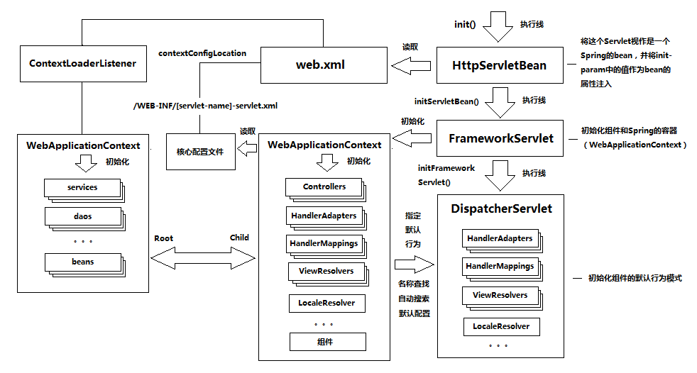
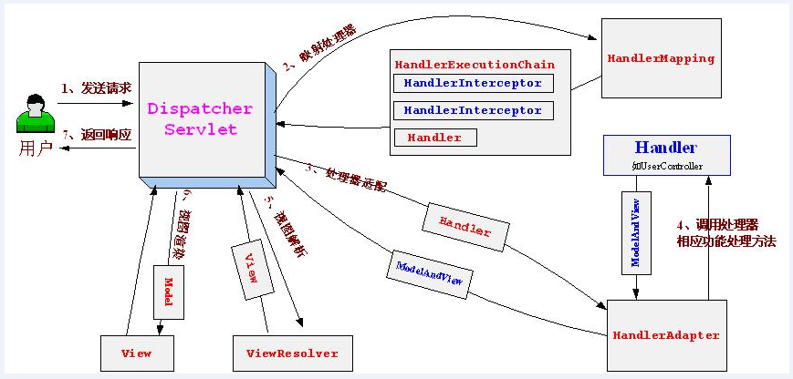
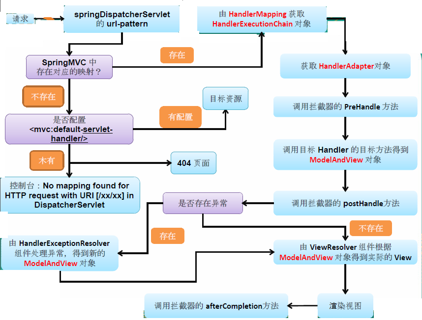
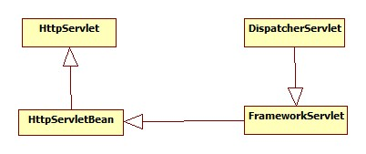
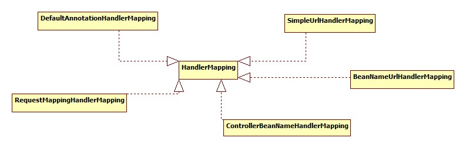
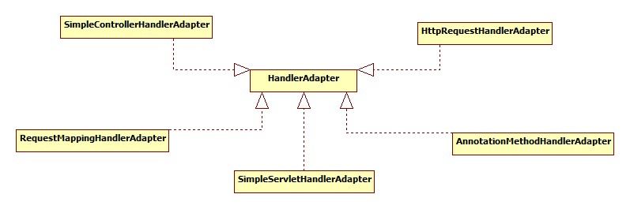
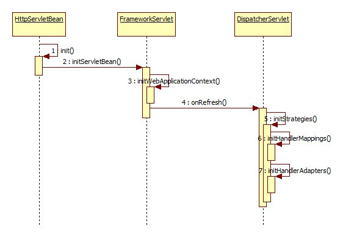
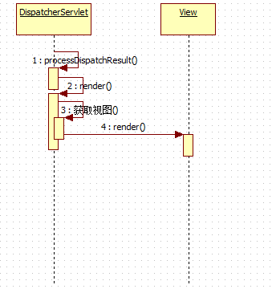
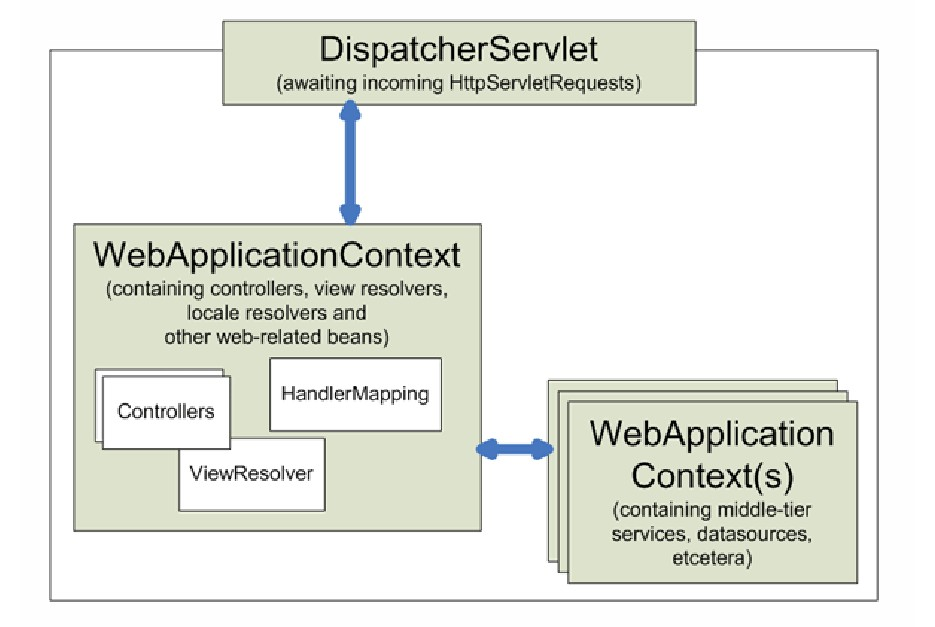

# SpringMVC的知识点整理（初始化过程、处理请求的过程）

SpringMVC的本质是一个servlet，他的目的是解决servlet要是多个的话需要在web.xml配置多个，比较麻烦。
通过springmvc提炼一个核心的Servlet覆盖对所有Http请求的处理，这个就是核心分发器就是DispatcherServlet。
SpringMVC就是通过DispatcherServlet将一堆组件（就是那些核心接口，这些组件在核心配置文件中定义，通过接口的不同实现类可以实现不同的行为模式扩展）串联起来进行处理。

SpringMVC作为一个表现层框架，也必须直面Web开发领域中表现层中的几大课题，并给出自己的回答：
- URL到框架的映射。
- http请求参数绑定
- http响应的生成和输出

核心[控制流和数据流]

## springmvc的初始化过程
两条主线
HttpServlet->HttpServletBean->FrameworkServlet->DispatcherServlet

- 初始化主线 —— 负责对SpringMVC的运行要素进行初始化

- Http请求处理主线 —— 负责对SpringMVC中的组件进行逻辑调度完成对Http请求的处理


HttpServletBean利用了Servlet的init方法的执行特性，将一个普通的Servlet与Spring的容器联系在了一起。
将当前的这个Servlet类转化为一个BeanWrapper，从而能够以Spring的方式来对init-param的值进行注入。（通过web.xml中的配置文件进行）

FrameworkServlet在其内部初始化了一个Spring的容器（WebApplicationContext）并暴露了相关的操作接口，
因而继承自FrameworkServlet的DispatcherServlet，也就直接拥有了与WebApplicationContext进行通信的能力。

SpringMVC的整个运行体系，是由DispatcherServlet、组件和容器这三者共同构成的。在这个运行体系中，
DispatcherServlet是逻辑处理的调度中心，
组件则是被调度的操作对象
而容器在这里所起到的作用，是协助DispatcherServlet更好地对组件进行管理。

初始化的核心：
1、 DispatcherServlet负责对容器（WebApplicationContext）进行初始化。
2、容器（WebApplicationContext）将读取SpringMVC的核心配置文件进行组件的实例化。

DispatcherServlet中对于组件的初始化过程实际上是应用程序在WebApplicationContext中选择和查找组件实现类的过程，也是指定组件在SpringMVC中的默认行为方式的过程。

DispatcherServlet中指定SpringMVC默认行为方式的其他的策略进行的总结：

- 名称查找 —— 根据bean的名字在容器中查找相应的实现类
- 自动搜索 —— 自动搜索容器中所有某个特定组件（接口）的所有实现类
- 默认配置 —— 根据一个默认的配置文件指定进行实现类加载

SpringMVC为一些核心组件设置了默认行为方式的说明，这个说明以一个properties文件的形式位于SpringMVC分发包DispatcherServlet.properties


## Spring和springmvc整合

在这种情况下，DispatcherServlet和ContextLoaderListener会分别构建不同作用范围的容器（WebApplicationContext）。
我们可以引入两个不同的概念来对其进行表述：ContextLoaderListener所初始化的容器，我们称之为Root WebApplicationContext；
而DispatcherServlet所初始化的容器，是SpringMVC WebApplicationContext。



springmvc的基本要素：
- 入口程序 —— DispatcherServlet
- 核心配置 —— [servlet-name]-servlet.xml
- 控制逻辑 —— UserController

SpringMVC就是通过DispatcherServlet将一堆组件（就是那些核心接口，这些组件在核心配置文件中定义，
通过接口的不同实现类可以实现不同的行为模式扩展）串联起来的Web框架。

DefaultAnnotationHandlerMapping —— 支持通过直接扫描Controller类中的Annotation来确定请求映射关系
RequestMappingHandlerAdapter 映射的具体处理

## springmvc处理请求的过程

DispatcherServlet是一个servlet，继承于httpservlet并且重写了其service方法，
在重写的service方法里有一个doDispatch(request, response)方法来作为该分发处理器的核心处理部分。

在doDispatch方法中，首先通过HandlerMapping获取HandlerExecutionChain对象（包含拦截器栈对象组以及最后的handler处理对象），
然后通过HandlerExecutionChain获取HandlerAdapter对象，在调用具体的HandlerAdapter中的controller对象之前,
调用HandlerExecutionChain拦截器栈中的拦截器的PreHandle方法，在调用controller之后调用拦截器栈中拦截器的PostHandle方法，
在DispatcherServlet中，然后通过配置的视图解析器解析HandlerAdapter执行controller对象放回的modelview对象，
然后进行视图的渲染，返回页面。

Spring的MVC框架主要由DispatcherServlet、处理器映射、处理器(控制器)、视图解析器、视图组成。

几个重要的接口：HandlerMapping（映射），HandlerAdapter（处理），HandlerExceptionResolver（异常处理），HandlerInterceptor（拦截器），ViewResolver（视图解析）
几个重要的类：DispatcherServlet，HandlerExecutionChain，View





## 配置文件的核心组件和注解

### 配置文件

<!-- 默认的注解映射的支持 ,它会自动注册DefaultAnnotationHandlerMapping 与AnnotationMethodHandlerAdapter -->
<mvc:annotation-driven />这段配置想要表达的意思，就是在mvc的空间内实现Annotation驱动的配置方式
<mvc:interceptors>
          <!-- 使用bean定义一个Interceptor，直接定义在mvc:interceptors根下面的Interceptor将拦截所有的请求 -->
          <bean class="com.dianjing.cms.web.DjdtContextInterceptor"/>
</mvc:interceptors>
<mvc:resources>：逻辑静态资源路径到物理静态资源路径的支持；
<mvc:default-servlet-handler>：当在web.xml 中DispatcherServlet使用<url-pattern>/</url-pattern> 映射时，能映射静态资源（当Spring Web MVC框架没有处理请求对应的控制器时（如一些静态资源），转交给默认的Servlet来响应静态文件，否则报404找不到资源错误，）。


### 类中的注解
@Controller
　　负责注册一个bean 到spring 上下文中
　　@RequestMapping
　　注解为控制器指定可以处理哪些 URL 请求
　　@RequestBody
　　该注解用于读取Request请求的body部分数据，使用系统默认配置的HttpMessageConverter进行解析，然后把相应的数据绑定到要返回的对象上 ,再把HttpMessageConverter返回的对象数据绑定到 controller中方法的参数上
　　@ResponseBody
　　该注解用于将Controller的方法返回的对象，通过适当的HttpMessageConverter转换为指定格式后，写入到Response对象的body数据区
　　@ModelAttribute
　　在方法定义上使用 @ModelAttribute 注解：Spring MVC 在调用目标处理方法前，会先逐个调用在方法级上标注了@ModelAttribute 的方法
　　在方法的入参前使用 @ModelAttribute 注解：可以从隐含对象中获取隐含的模型数据中获取对象，再将请求参数 –绑定到对象中，再传入入参将方法入参对象添加到模型中
　　@RequestParam
　　在处理方法入参处使用 @RequestParam 可以把请求参 数传递给请求方法
　　@PathVariable
　　绑定 URL 占位符到入参
　　@ExceptionHandler
　　注解到方法上，出现异常时会执行该方法
　　@ControllerAdvice
　　使一个Contoller成为全局的异常处理类，类中用@ExceptionHandler方法注解的方法可以处理所有Controller发生的异常


## DispatcherServlet 处理的大概流程

几个重要的接口：HandlerMapping，HandlerAdapter，HandlerInterceptor
几个重要的类：DispatcherServlet，HandlerExecutionChain，View

### 1、  前端控制器DispatcherServlet类；
HttpServlet->HttpServletBean->FrameworkServlet->DispatcherServlet


### 2、  HandlerMapping接口


```
package org.springframework.web.servlet;

import javax.servlet.http.HttpServletRequest;


public interface HandlerMapping {

    
     String PATH_WITHIN_HANDLER_MAPPING_ATTRIBUTE = HandlerMapping.class.getName() + ".pathWithinHandlerMapping";

     String BEST_MATCHING_PATTERN_ATTRIBUTE = HandlerMapping.class.getName() + ".bestMatchingPattern";

     
     String INTROSPECT_TYPE_LEVEL_MAPPING = HandlerMapping.class.getName() + ".introspectTypeLevelMapping";

    
     String URI_TEMPLATE_VARIABLES_ATTRIBUTE = HandlerMapping.class.getName() + ".uriTemplateVariables";

     
     String MATRIX_VARIABLES_ATTRIBUTE = HandlerMapping.class.getName() + ".matrixVariables";

     
     String PRODUCIBLE_MEDIA_TYPES_ATTRIBUTE = HandlerMapping.class.getName() + ".producibleMediaTypes";

    
     HandlerExecutionChain getHandler(HttpServletRequest request) throws Exception;

}

```


### 3、HandlerAdapter


### 4、  ViewResolver
### 5、  处理器/页面控制器
### 6、  视图


### 初始化详解


```
protected void doDispatch(HttpServletRequest request, HttpServletResponse response) throws Exception {
          HttpServletRequest processedRequest = request;
          HandlerExecutionChain mappedHandler = null;
          boolean multipartRequestParsed = false;

          WebAsyncManager asyncManager = WebAsyncUtils.getAsyncManager(request);

          try {
              ModelAndView mv = null;
              Exception dispatchException = null;

              try {
//检查是否是请求multipart如文件上传，如果是将通过multipartResolver解析
                    
                   processedRequest = checkMultipart(request);
                   multipartRequestParsed = processedRequest != request;

                   // Determine handler for the current request.
//步骤2,请求到处理器(页面控制器)的映射，通过HanMapping进行映射
                   mappedHandler = getHandler(processedRequest);
                   if (mappedHandler == null || mappedHandler.getHandler() == null) {
                        noHandlerFound(processedRequest, response);
                        return;
                   }

                   // Determine handler adapter for the current request.
//步骤3,处理适配，即交我们的处理器包装成相应的适配器，
                   HandlerAdapter ha = getHandlerAdapter(mappedHandler.getHandler());

                   // Process last-modified header, if supported by the handler.
// 304 Not Modified缓存支持
                   String method = request.getMethod();
                   boolean isGet = "GET".equals(method);
                   if (isGet || "HEAD".equals(method)) {
                        long lastModified = ha.getLastModified(request, mappedHandler.getHandler());
                        if (logger.isDebugEnabled()) {
                             String requestUri = urlPathHelper.getRequestUri(request);
                             logger.debug("Last-Modified value for [" + requestUri + "] is: " + lastModified);
                        }
                        if (new ServletWebRequest(request, response).checkNotModified(lastModified) && isGet) {
                             return;
                        }
                   }
// 执行处理器相关的拦截器的预处理（HandlerInterceptor.preHandle）
                   if (!mappedHandler.applyPreHandle(processedRequest, response)) {
                        return;
                   }

                   try {
                        // Actually invoke the handler.
// 步骤4、由适配器执行处理器（调用处理器相应功能处理方法）
                        mv = ha.handle(processedRequest, response, mappedHandler.getHandler());
                   }
                   finally {
                        if (asyncManager.isConcurrentHandlingStarted()) {
                             return;
                        }
                   }

                   applyDefaultViewName(request, mv);
// 执行处理器相关的拦截器的后处理（HandlerInterceptor.postHandle）
                   mappedHandler.applyPostHandle(processedRequest, response, mv);
              }
              catch (Exception ex) {
                   dispatchException = ex;
              }
              processDispatchResult(processedRequest, response, mappedHandler, mv, dispatchException);
          }
          catch (Exception ex) {
              triggerAfterCompletion(processedRequest, response, mappedHandler, ex);
          }
          catch (Error err) {
               triggerAfterCompletionWithError(processedRequest, response, mappedHandler, err);
          }
          finally {
              if (asyncManager.isConcurrentHandlingStarted()) {
                   // Instead of postHandle and afterCompletion
                   mappedHandler.applyAfterConcurrentHandlingStarted(processedRequest, response);
                   return;
              }
              // Clean up any resources used by a multipart request.
              if (multipartRequestParsed) {
                   cleanupMultipart(processedRequest);
              }
          }
     }


protected HandlerExecutionChain getHandler(HttpServletRequest request) throws Exception {
          for (HandlerMapping hm : this.handlerMappings) {
              if (logger.isTraceEnabled()) {
                   logger.trace(
                             "Testing handler map [" + hm + "] in DispatcherServlet with name '" + getServletName() + "'");
              }
              HandlerExecutionChain handler = hm.getHandler(request);
              if (handler != null) {
                   return handler;
              }
          }
          return null;
     }


protected HandlerAdapter getHandlerAdapter(Object handler) throws ServletException {
for (HandlerAdapter ha : this.handlerAdapters) {
if (logger.isTraceEnabled()) {
logger.trace("Testing handler adapter [" + ha + "]");
}
if (ha.supports(handler)) {
return ha;
}
}
throw new ServletException("No adapter for handler [" + handler +
"]: The DispatcherServlet configuration needs to include a HandlerAdapter that supports this handler");
}

```



```
 private void processDispatchResult(HttpServletRequest request, HttpServletResponse response,
              HandlerExecutionChain mappedHandler, ModelAndView mv, Exception exception) throws Exception {

          boolean errorView = false;

          if (exception != null) {
              if (exception instanceof ModelAndViewDefiningException) {
                   logger.debug("ModelAndViewDefiningException encountered", exception);
                   mv = ((ModelAndViewDefiningException) exception).getModelAndView();
              }
              else {
                   Object handler = (mappedHandler != null ? mappedHandler.getHandler() : null);
                   mv = processHandlerException(request, response, handler, exception);
                   errorView = (mv != null);
              }
          }

          // Did the handler return a view to render?
//步骤5 步骤6、解析视图并进行视图的渲染
            //步骤5 由ViewResolver解析View（viewResolver.resolveViewName(viewName, locale)）
              //步骤6 视图在渲染时会把Model传入（view.render(mv.getModelInternal(), request, response);）
          if (mv != null && !mv.wasCleared()) {
              render(mv, request, response);
              if (errorView) {
                   WebUtils.clearErrorRequestAttributes(request);
              }
          }
          else {
              if (logger.isDebugEnabled()) {
                   logger.debug("Null ModelAndView returned to DispatcherServlet with name '" + getServletName() +
                             "': assuming HandlerAdapter completed request handling");
              }
          }

          if (WebAsyncUtils.getAsyncManager(request).isConcurrentHandlingStarted()) {
              // Concurrent handling started during a forward
              return;
          }
//执行处理器相关的拦截器的完成后处理（HandlerInterceptor.afterCompletion）
          if (mappedHandler != null) {
               mappedHandler.triggerAfterCompletion(request, response, null);
          }
     }

protected void render(ModelAndView mv, HttpServletRequest request, HttpServletResponse response) throws Exception {
          // Determine locale for request and apply it to the response.
          Locale locale = this.localeResolver.resolveLocale(request);
          response.setLocale(locale);

          View view;
          if (mv.isReference()) {
              // We need to resolve the view name.
              view = resolveViewName(mv.getViewName(), mv.getModelInternal(), locale, request);
              if (view == null) {
                   throw new ServletException(
                             "Could not resolve view with name '" + mv.getViewName() + "' in servlet with name '" +
                                      getServletName() + "'");
              }
          }
          else {
              // No need to lookup: the ModelAndView object contains the actual View object.
              view = mv.getView();
              if (view == null) {
                   throw new ServletException("ModelAndView [" + mv + "] neither contains a view name nor a " +
                             "View object in servlet with name '" + getServletName() + "'");
              }
          }

          // Delegate to the View object for rendering.
          if (logger.isDebugEnabled()) {
              logger.debug("Rendering view [" + view + "] in DispatcherServlet with name '" + getServletName() + "'");
          }
          try {
              view.render(mv.getModelInternal(), request, response);
          }
          catch (Exception ex) {
              if (logger.isDebugEnabled()) {
                   logger.debug("Error rendering view [" + view + "] in DispatcherServlet with name '"
                             + getServletName() + "'", ex);
              }
              throw ex;
          }
     }

```


```
public class HandlerExecutionChain {

     private static final Log logger = LogFactory.getLog(HandlerExecutionChain.class);

     private final Object handler;

     private HandlerInterceptor[] interceptors;

     private List<HandlerInterceptor> interceptorList;

     private int interceptorIndex = -1;
//...
}


public interface HandlerInterceptor {

   
    boolean preHandle(HttpServletRequest request, HttpServletResponse response, Object handler)
        throws Exception;

   
    void postHandle(
            HttpServletRequest request, HttpServletResponse response, Object handler, ModelAndView modelAndView)
            throws Exception;

   
    void afterCompletion(
            HttpServletRequest request, HttpServletResponse response, Object handler, Exception ex)
            throws Exception;

}


public interface HandlerAdapter {
boolean supports(Object handler);
ModelAndView handle(HttpServletRequest request, HttpServletResponse response, Object handler) throws Exception;
long getLastModified(HttpServletRequest request, Object handler);

}


public class DispatcherServlet extends FrameworkServlet {
private List<HandlerMapping> handlerMappings;
private List<HandlerAdapter> handlerAdapters;
     //...
}

public interface View {
String RESPONSE_STATUS_ATTRIBUTE = View.class.getName() + ".responseStatus";
String PATH_VARIABLES = View.class.getName() + ".pathVariables";
String SELECTED_CONTENT_TYPE = View.class.getName() + ".selectedContentType";
String getContentType();
void render(Map<String, ?> model, HttpServletRequest request, HttpServletResponse response) throws Exception;

}

```


DispatcherServlet初始化组件
```java
public interface WebApplicationContext extends ApplicationContext {

     
     String ROOT_WEB_APPLICATION_CONTEXT_ATTRIBUTE = WebApplicationContext.class.getName() + ".ROOT";

    
     String SCOPE_REQUEST = "request";

    
     String SCOPE_SESSION = "session";

    
     String SCOPE_GLOBAL_SESSION = "globalSession";

     String SCOPE_APPLICATION = "application";

     
     String SERVLET_CONTEXT_BEAN_NAME = "servletContext";

     
     String CONTEXT_PARAMETERS_BEAN_NAME = "contextParameters";

   
     String CONTEXT_ATTRIBUTES_BEAN_NAME = "contextAttributes";

     ServletContext getServletContext();

}
```
