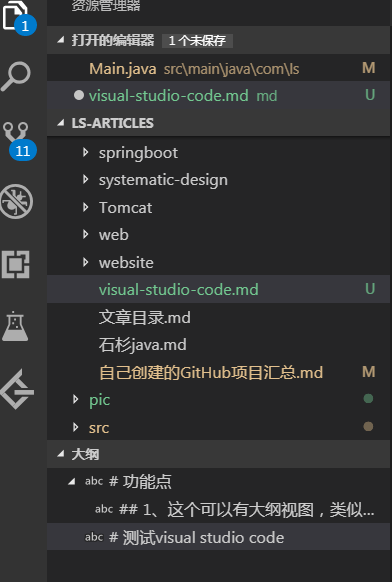
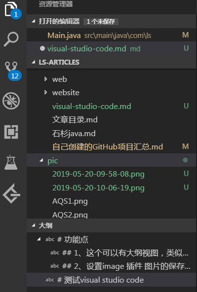
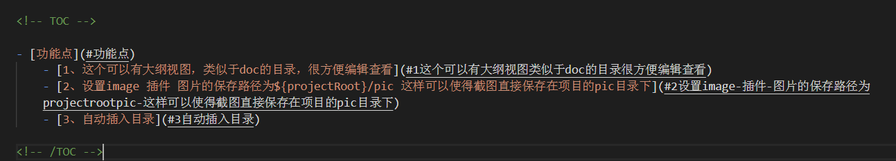
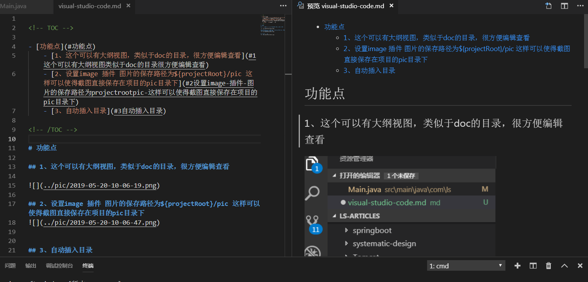

<!-- TOC -->

- [功能点](#功能点)
    - [1、这个可以有大纲视图，类似于doc的目录，很方便编辑查看](#1这个可以有大纲视图类似于doc的目录很方便编辑查看)
    - [2、设置image 插件 图片的保存路径为${projectRoot}/pic 这样可以使得截图直接保存在项目的pic目录下](#2设置image-插件-图片的保存路径为projectrootpic-这样可以使得截图直接保存在项目的pic目录下)
    - [3、自动插入目录](#3自动插入目录)

<!-- /TOC -->

# 功能点

## 1、这个可以有大纲视图，类似于doc的目录，很方便编辑查看

## 2、设置image 插件 图片的保存路径为${projectRoot}/pic 这样可以使得截图直接保存在项目的pic目录下

## 3、自动插入目录

点击右侧的链接即可立即跳转十分方便

# 注意点

- 1、标题中有%会导致自动生成目录失败

