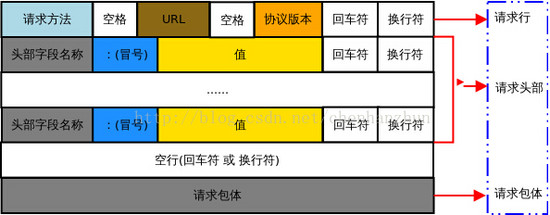
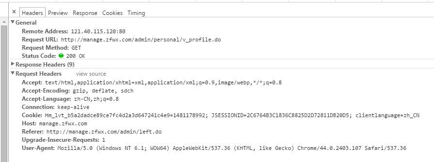

[HTTP协议详解（真的很经典）](http://www.cnblogs.com/li0803/archive/2008/11/03/1324746.html)
[HTTP 协议格式 和 HTTP Header](https://www.tuicool.com/articles/jMFfIv)

HTTP协议的主要特点可概括如下：

1.支持客户/服务器模式。

2.简单快速：客户向服务器请求服务时，只需传送请求方法和路径。请求方法常用的有GET、HEAD、POST。每种方法规定了客户与服务器联系的类型不同。由于HTTP协议简单，使得HTTP服务器的程序规模小，因而通信速度很快。

3.灵活：HTTP允许传输任意类型的数据对象。正在传输的类型由Content-Type加以标记。

4.无连接：无连接的含义是限制每次连接只处理一个请求。服务器处理完客户的请求，并收到客户的应答后，即断开连接。采用这种方式可以节省传输时间。

5.无状态：HTTP协议是无状态协议。无状态是指协议对于事务处理没有记忆能力。缺少状态意味着如果后续处理需要前面的信息，则它必须重传，这样可能导致每次连接传送的数据量增大。另一方面，在服务器不需要先前信息时它的应答就较快。

100-199 用于指定客户端应相应的某些动作。
200-299 用于表示请求成功。
300-399 用于已经移动的文件并且常被包含在定位头信息中指定新的地址信息。
400-499 用于指出客户端的错误。
500-599 用于支持服务器错误。

http状态返回代码 1xx（临时响应）
http状态返回代码 2xx （成功）
http状态返回代码 3xx （重定向）
http状态返回代码 4xx（请求错误）
http状态返回代码 5xx（服务器错误）

状态码：
200 成功

302 --> 请求重定向
304  请求内容没发生变化

400   （错误请求） 服务器不理解请求的语法。(Bad Request/错误请求)
401   （未授权） 请求要求身份验证。 对于需要登录的网页，服务器可能返回此响应。
403 禁止访问

500   （服务器内部错误）  服务器遇到错误，无法完成请求。
502   （错误网关） 服务器作为网关或代理，从上游服务器收到无效响应
503   （服务不可用） 服务器目前无法使用（由于超载或停机维护）。 通常，这只是暂时状态。

http请求协议的格式

1. 首行
2. 头
3. 空行
4. 体

http响应格式

GET/sample.Jsp HTTP/1.1
Accept:image/gif.image/jpeg,*/*
Accept-Language:zh-cn
Connection:Keep-Alive
Host:localhost
User-Agent:Mozila/4.0(compatible;MSIE5.01;Window NT5.0)
Accept-Encoding:gzip,deflate

username=jinqiao&password=1234

一个现实请求的信息格式：

