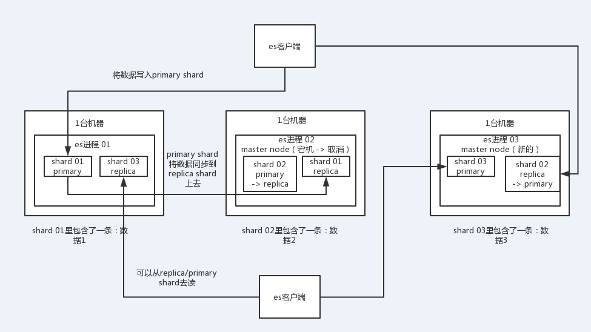
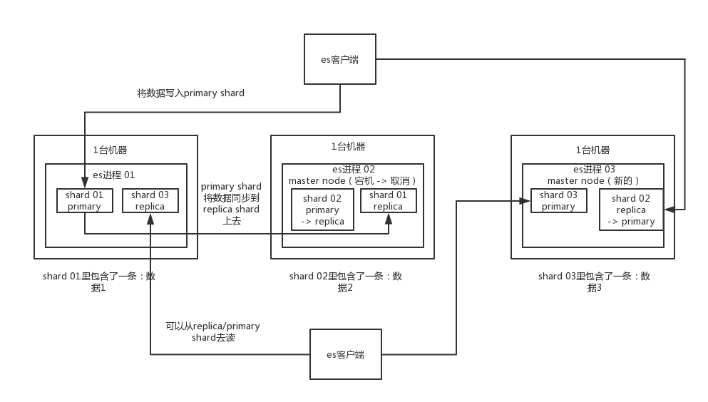
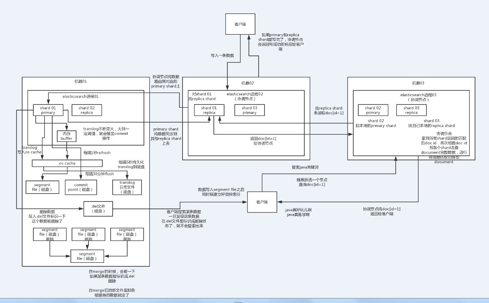
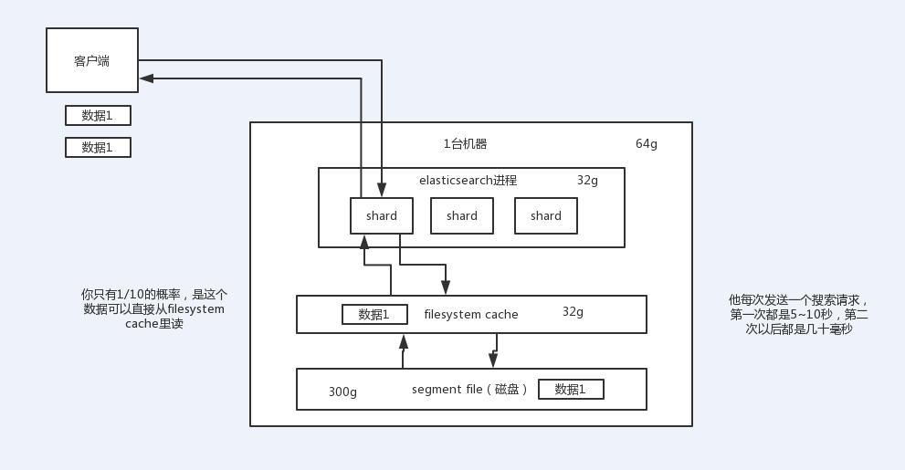

<!-- TOC -->

- [13_体验一下面试官对于分布式搜索引擎的4个连环炮](#13_体验一下面试官对于分布式搜索引擎的4个连环炮)
- [14_分布式搜索引擎的架构是怎么设计的？为啥是分布式的？](#14_分布式搜索引擎的架构是怎么设计的为啥是分布式的)
- [15_分布式搜索引擎写入和查询的工作流程是什么样的？](#15_分布式搜索引擎写入和查询的工作流程是什么样的)
- [16_分布式搜索引擎在几十亿数据量级的场景下如何优化查询性能？](#16_分布式搜索引擎在几十亿数据量级的场景下如何优化查询性能)
- [17_你们公司生产环境的分布式搜索引擎是怎么部署的呢？](#17_你们公司生产环境的分布式搜索引擎是怎么部署的呢)
- [18_总结一下分布式搜索引擎相关问题的面试技巧](#18_总结一下分布式搜索引擎相关问题的面试技巧)

<!-- /TOC -->

自己的问题：

- 1、写入数据的过程中，是如何创建索引的过程？索引文件怎么存？数据文件怎么存？两者是如何关联的？

- 2、es底层的相关度评分算法（TF/IDF算法）？ 

# 13_体验一下面试官对于分布式搜索引擎的4个连环炮

业内目前来说事实上的一个标准，就是分布式搜索引擎一般大家都用elasticsearch，es，solr，但是确实，这两年大家一般都用更加易用的es。

> lucene

如果你确实真的不连lucene都不知道是什么？我觉得你确实不应该，lucene底层的原理是一个东西，叫做倒排索引。太基础了。

百度，搜索一下lucene入门，了解一下lucene是什么？倒排索引是什么？全文检索是什么？写个lucene的demo程序体验一把。

> elasticsearch

百度，搜索一下：elasticsearch入门，初步至少知道es的一些基本概念，然后包括es的基本部署和基本的使用

面试官可能会怎么问？

（1）es的分布式架构原理能说一下么（es是如何实现分布式的啊）？

（2）es写入数据的工作原理是什么啊？es查询数据的工作原理是什么啊？

（3）es在数据量很大的情况下（数十亿级别）如何提高查询性能啊？

（4）es生产集群的部署架构是什么？每个索引的数据量大概有多少？每个索引大概有多少个分片？

# 14_分布式搜索引擎的架构是怎么设计的？为啥是分布式的？

[分布式：shared分片（primary shard和replica shard）]这个是核心实现分布式的

> 1、面试题

es的分布式架构原理能说一下么（es是如何实现分布式的啊）？

> 2、面试官心里分析

在搜索这块，lucene是最流行的搜索库。几年前业内一般都问，你了解lucene吗？你知道倒排索引的原理吗？现在早已经out了，
因为现在很多项目都是直接用基于lucene的分布式搜索引擎——elasticsearch，简称为es。

而现在分布式搜索基本已经成为大部分互联网行业的java系统的标配，其中尤为流行的就是es，前几年es没火的时候，大家一般用solr。
但是这两年基本大部分企业和项目都开始转向es了。

所以互联网面试，肯定会跟你聊聊分布式搜索引擎，也就一定会聊聊es，如果你确实不知道，那你真的就out了。

如果面试官问你第一个问题，确实一般都会问你es的分布式架构设计能介绍一下么？就看看你对分布式搜索引擎架构的一个基本理解。

> 3、额外的友情提示

同学啊，如果你看到这里发现自己对es一无所知，没事儿，保持淡定，暂停一下课程。然后上百度搜一下es是啥？本机启动个es？
然后写个es的hello world感受一下？然后搜个帖子把es常见的几个操作都执行一遍（聚合、常见搜索语法之类的）？ok了，1~2小时熟悉足够了，
回来吧，继续看我们的课程。

> 4、面试题剖析

elasticsearch设计的理念就是分布式搜索引擎，底层其实还是基于lucene的。

核心思想就是在多台机器上启动多个es进程实例，组成了一个es集群。

es中存储数据的基本单位是索引，比如说你现在要在es中存储一些订单数据，你就应该在es中创建一个索引，order_idx，
所有的订单数据就都写到这个索引里面去，一个索引差不多就是相当于是mysql里的一张表。index -> type -> mapping -> document -> field。

index：mysql里的一张表

type：没法跟mysql里去对比，一个index里可以有多个type，每个type的字段都是差不多的，但是有一些略微的差别。

好比说，有一个index，是订单index，里面专门是放订单数据的。就好比说你在mysql中建表，有些订单是实物商品的订单，就好比说一件衣服，一双鞋子；有些订单是虚拟商品的订单，就好比说游戏点卡，话费充值。就两种订单大部分字段是一样的，但是少部分字段可能有略微的一些差别。

所以就会在订单index里，建两个type，一个是实物商品订单type，一个是虚拟商品订单type，这两个type大部分字段是一样的，少部分字段是不一样的。

很多情况下，一个index里可能就一个type，但是确实如果说是一个index里有多个type的情况，你可以认为index是一个类别的表，具体的每个type代表了具体的一个mysql中的表

每个type有一个mapping，如果你认为一个type是一个具体的一个表，index代表了多个type的同属于的一个类型，mapping就是这个type的表结构定义，你在mysql中创建一个表，肯定是要定义表结构的，里面有哪些字段，每个字段是什么类型。。。

mapping就代表了这个type的表结构的定义，定义了这个type中每个字段名称，字段是什么类型的，然后还有这个字段的各种配置

实际上你往index里的一个type里面写的一条数据，叫做一条document，一条document就代表了mysql中某个表里的一行给，每个document有多个field，每个field就代表了这个document中的一个字段的值

接着你搞一个索引，这个索引可以拆分成多个shard，每个shard存储部分数据。

接着就是这个shard的数据实际是有多个备份，就是说每个shard都有一个primary shard，负责写入数据，但是还有几个replica shard。primary shard写入数据之后，会将数据同步到其他几个replica shard上去。

通过这个replica的方案，每个shard的数据都有多个备份，如果某个机器宕机了，没关系啊，还有别的数据副本在别的机器上呢。高可用了吧。

es集群多个节点，会自动选举一个节点为master节点，这个master节点其实就是干一些管理的工作的，比如维护索引元数据拉，负责切换primary shard和replica shard身份拉，之类的。

要是master节点宕机了，那么会重新选举一个节点为master节点。

如果是非master节点宕机了，那么会由master节点，让那个宕机节点上的primary shard的身份转移到其他机器上的replica shard。急着你要是修复了那个宕机机器，重启了之后，master节点会控制将缺失的replica shard分配过去，同步后续修改的数据之类的，让集群恢复正常。

其实上述就是elasticsearch作为一个分布式搜索引擎最基本的一个架构设计

图：分为三个分片，每个分片有一个备份。

# 15_分布式搜索引擎写入和查询的工作流程是什么样的？

> 1、面试题

es写入数据的工作原理是什么啊？es查询数据的工作原理是什么啊？

> 2、面试官心理分析

问这个，其实面试官就是要看看你了解不了解es的一些基本原理，因为用es无非就是写入数据，搜索数据。
你要是不明白你发起一个写入和搜索请求的时候，es在干什么，那你真的就是。。。。

对es基本就是个黑盒，你还能干啥？你唯一能干的就是用es的api读写数据了。。。要是出点什么问题，你啥都不知道，那还能指望你什么呢？是不是。。

> 3、面试题剖析

>> （1）es写数据过程

1）客户端选择一个node发送请求过去，这个node就是coordinating node（协调节点）[全程和这个节点进行交互]

2）coordinating node，对document进行路由，将请求转发给对应的node（有primary shard）

3）实际的node上的primary shard处理请求，然后将数据同步到replica node

4）coordinating node，如果发现primary node和所有replica node都搞定之后，就返回响应结果给客户端[这里会有参数设置是否确保全部的replica分片全部写完？？？]

[问题：自动生成的id在什么时候生成的？在写入之前？写入的时候根据id来决定写到那个primaryshard的？]

>> （2）es读数据过程[根据id查询]

查询，GET某一条数据，写入了某个document，这个document会自动给你分配一个全局唯一的id，doc id，同时也是根据doc id进行hash路由到对应的primary shard上面去。也可以手动指定doc id，比如用订单id，用户id。

你可以通过doc id来查询，会根据doc id进行hash，判断出来当时把doc id分配到了哪个shard上面去，从那个shard去查询

1）客户端发送请求到任意一个node，成为coordinate node

2）coordinate node对document进行路由，将请求转发到对应的node，此时会使用round-robin随机轮询算法，在primary shard以及其所有replica中随机选择一个，让读请求负载均衡

3）接收请求的node返回document给coordinate node

4）coordinate node返回document给客户端

>> （3）es搜索数据过程[分两个阶段：query-phase和fetch-phase]

es最强大的是做全文检索，就是比如你有三条数据

java真好玩儿啊

java好难学啊

j2ee特别牛

你根据java关键词来搜索，将包含java的document给搜索出来

es就会给你返回：java真好玩儿啊，java好难学啊

1）客户端发送请求到一个coordinate node

2）协调节点将搜索请求转发到所有的shard对应的primary shard或replica shard也可以[主分片和备份分片执行搜索的只会有一个，该index有几个分片会执行几次搜索]

3）query phase：每个shard将自己的搜索结果（其实就是一些doc id），返回给协调节点，由协调节点进行数据的合并、排序、分页等操作，产出最终结果

4）fetch phase：接着由协调节点，根据doc id去各个节点上拉取实际的document数据，最终返回给客户端

>> （4）搜索的底层原理，倒排索引，画图说明传统数据库和倒排索引的区别

>> （5）写数据底层原理

重点是4个文件的生成过程：

1、segment file[1秒refresh]；

2、translog日志[5秒写一次磁盘]；

3、commitpoint文件记录全部segment file文件[translog默认30分钟commit一次，然后清空translog日志]；

4、.del文件。merge合并小的segment file，根据.del标记物理删除被删除的document，生成新的segment file

- 1）先写入buffer，在buffer里的时候数据是搜索不到的；同时将数据写入translog日志文件

- 2）如果buffer快满了，或者到一定时间，就会将buffer数据refresh到一个新的segment file中，
但是此时数据不是直接进入segment file的磁盘文件的，而是先进入os cache的。这个过程就是refresh。

每隔1秒钟，es将buffer中的数据写入一个新的segment file，每秒钟会产生一个新的磁盘文件，segment file，
这个segment file中就存储最近1秒内buffer中写入的数据

但是如果buffer里面此时没有数据，那当然不会执行refresh操作咯，也不会每秒创建换一个空的segment file，没必要。

如果buffer里面有数据，默认1秒钟执行一次refresh操作，刷入一个新的segment file中

操作系统里面，磁盘文件其实都有一个东西，叫做os cache，操作系统缓存，就是说数据写入磁盘文件之前，会先进入os cache，先进入操作系统级别的一个内存缓存中去

只要buffer中的数据被refresh操作，刷入os cache中，就代表这个数据就可以被搜索到了

为什么叫es是准实时的？NRT，near real-time，准实时。默认是每隔1秒refresh一次的，所以es是准实时的，因为写入的数据1秒之后才能被看到。

可以通过es的restful api或者java api，手动执行一次refresh操作，就是手动将buffer中的数据刷入os cache中，让数据立马就可以被搜索到。

只要数据被输入os cache中，buffer就会被清空了，因为不需要保留buffer了，数据在translog里面已经持久化到磁盘去一份了

总结

数据写入流程：写入buffer--->磁盘文件segment file【写入的过程会进入操作系统的os cache】--->写完清空buffer【默认每隔一秒】

[问题：上面的流程是一个连续的过程还是等待一个时机才将oscache中的数据写入磁盘？refresh]

- 3）只要数据进入os cache，此时就可以让这个segment file的数据对外提供搜索了

- 4）重复1~3步骤，新的数据不断进入buffer和translog，不断将buffer数据写入一个又一个新的segment file中去，每次refresh完buffer清空，translog保留。随着这个过程推进，translog会变得越来越大。当translog达到一定长度的时候，就会触发commit操作。

buffer中的数据，倒是好，每隔1秒就被刷到os cache中去，然后这个buffer就被清空了。所以说这个buffer的数据始终是可以保持住不会填满es进程的内存的。

每次一条数据写入buffer，同时会写入一条日志到translog日志文件中去，所以这个translog日志文件是不断变大的，当translog日志文件大到一定程度的时候，就会执行commit操作。

- 5）commit操作发生第一步，就是将buffer中现有数据refresh到os cache中去，清空buffer

- 6）将一个commit point写入磁盘文件，里面标识着这个commit point对应的所有segment file

- 7）强行将os cache中目前所有的数据都fsync到磁盘文件中去

translog日志文件的作用是什么？就是在你执行commit操作之前，数据要么是停留在buffer中，要么是停留在os cache中，无论是buffer还是os cache都是内存，一旦这台机器死了，内存中的数据就全丢了。

所以需要将数据对应的操作写入一个专门的日志文件，translog日志文件中，一旦此时机器宕机，再次重启的时候，es会自动读取translog日志文件中的数据，恢复到内存buffer和os cache中去。

commit操作：1、写commit point；2、将os cache数据fsync强刷到磁盘上去；3、清空translog日志文件

[commitpoint文件，标记着所有的segmentfile]

[translog文件保存的是buffer和oscache中的临时数据，默认是30分钟执行一次，叫flush]

- 8）将现有的translog清空，然后再次重启启用一个translog，此时commit操作完成。默认每隔30分钟会自动执行一次commit，但是如果translog过大，也会触发commit。整个commit的过程，叫做flush操作。我们可以手动执行flush操作，就是将所有os cache数据刷到磁盘文件中去。

不叫做commit操作，flush操作。es中的flush操作，就对应着commit的全过程。我们也可以通过es api，手动执行flush操作，手动将os cache中的数据fsync强刷到磁盘上去，记录一个commit point，清空translog日志文件。

- 9）translog其实也是先写入os cache的，默认每隔5秒刷一次到磁盘中去，所以默认情况下，可能有5秒的数据会仅仅停留在buffer或者translog文件的os cache中，如果此时机器挂了，会丢失5秒钟的数据。但是这样性能比较好，最多丢5秒的数据。也可以将translog设置成每次写操作必须是直接fsync到磁盘，但是性能会差很多。

实际上你在这里，如果面试官没有问你es丢数据的问题，你可以在这里给面试官炫一把，你说，其实es第一是准实时的，数据写入1秒后可以搜索到；可能会丢失数据的，你的数据有5秒的数据，停留在buffer、translog os cache、segment file os cache中，有5秒的数据不在磁盘上，此时如果宕机，会导致5秒的数据丢失。

如果你希望一定不能丢失数据的话，你可以设置个参数，官方文档，百度一下。每次写入一条数据，都是写入buffer，同时写入磁盘上的translog，但是这会导致写性能、写入吞吐量会下降一个数量级。本来一秒钟可以写2000条，现在你一秒钟只能写200条，都有可能。

- 10）如果是删除操作，commit的时候会生成一个.del文件，里面将某个doc标识为deleted状态，那么搜索的时候根据.del文件就知道这个doc被删除了

- 11）如果是更新操作，就是将原来的doc标识为deleted状态，然后新写入一条数据

- 12）buffer每次refresh一次，就会产生一个segment file，所以默认情况下是1秒钟一个segment file，segment file会越来越多，此时会定期执行merge

- 13）每次merge的时候，会将多个segment file合并成一个，同时这里会将标识为deleted的doc给物理删除掉，然后将新的segment file写入磁盘，这里会写一个commit point，标识所有新的segment file，然后打开segment file供搜索使用，同时删除旧的segment file。

es里的写流程，有4个底层的核心概念，refresh、flush、translog、merge

当segment file多到一定程度的时候，es就会自动触发merge操作，将多个segment file给merge成一个segment file。

备注：删除操作不是去查找这条数据，而是有个.del标记删除的文件

# 16_分布式搜索引擎在几十亿数据量级的场景下如何优化查询性能？

> 1、面试题

es在数据量很大的情况下（数十亿级别）如何提高查询效率啊？

> 2、面试官心里分析

问这个问题，是肯定的，说白了，就是看你有没有实际干过es，因为啥？es说白了其实性能并没有你想象中那么好的。
很多时候数据量大了，特别是有几亿条数据的时候，可能你会懵逼的发现，跑个搜索怎么一下5秒~10秒，坑爹了。
第一次搜索的时候，是5~10秒，后面反而就快了，可能就几百毫秒。

你就很懵，每个用户第一次访问都会比较慢，比较卡么？

所以你要是没玩儿过es，或者就是自己玩玩儿demo，被问到这个问题容易懵逼，显示出你对es确实玩儿的不怎么样

> 3、面试题剖析

说实话，es性能优化是没有什么银弹的，啥意思呢？就是不要期待着随手调一个参数，就可以万能的应对所有的性能慢的场景。
也许有的场景是你换个参数，或者调整一下语法，就可以搞定，但是绝对不是所有场景都可以这样。

一块一块来分析吧

在这个海量数据的场景下，如何提升es搜索的性能，也是我们之前生产环境实践经验所得

>> （1）性能优化的杀手锏——filesystem cache[减少一个document中非搜索数据字段，只存搜索字段]

[缓存的是索引在内存中还是数据在内存中？]

os cache，操作系统的缓存

你往es里写的数据，实际上都写到磁盘文件里去了，磁盘文件里的数据操作系统会自动将里面的数据缓存到os cache里面去

es的搜索引擎严重依赖于底层的filesystem cache，你如果给filesystem cache更多的内存，尽量让内存可以容纳所有的indx segment file索引数据文件，那么你搜索的时候就基本都是走内存的，性能会非常高。

性能差距可以有大，我们之前很多的测试和压测，如果走磁盘一般肯定上秒，搜索性能绝对是秒级别的，1秒，5秒，10秒。但是如果是走filesystem cache，是走纯内存的，那么一般来说性能比走磁盘要高一个数量级，基本上就是毫秒级的，从几毫秒到几百毫秒不等。

之前有个学员，一直在问我，说他的搜索性能，聚合性能，倒排索引，正排索引，磁盘文件，十几秒。。。。

学员的真实案例

比如说，你，es节点有3台机器，每台机器，看起来内存很多，64G，总内存，64 * 3 = 192g

每台机器给es jvm heap是32G，那么剩下来留给filesystem cache的就是每台机器才32g，总共集群里给filesystem cache的就是32 * 3 = 96g内存

我就问他，ok，那么就是你往es集群里写入的数据有多少数据量？

如果你此时，你整个，磁盘上索引数据文件，在3台机器上，一共占用了1T的磁盘容量，你的es数据量是1t，每台机器的数据量是300g

你觉得你的性能能好吗？filesystem cache的内存才100g，十分之一的数据可以放内存，其他的都在磁盘，然后你执行搜索操作，大部分操作都是走磁盘，性能肯定差

当时他们的情况就是这样子，es在测试，弄了3台机器，自己觉得还不错，64G内存的物理机。自以为可以容纳1T的数据量。

归根结底，你要让es性能要好，最佳的情况下，就是你的机器的内存，至少可以容纳你的总数据量的一半

比如说，你一共要在es中存储1T的数据，那么你的多台机器留个filesystem cache的内存加起来综合，至少要到512G，至少半数的情况下，搜索是走内存的，性能一般可以到几秒钟，2秒，3秒，5秒

如果最佳的情况下，我们自己的生产环境实践经验，所以说我们当时的策略，是仅仅在es中就存少量的数据，就是你要用来搜索的那些索引，内存留给filesystem cache的，就100G，那么你就控制在100gb以内，相当于是，你的数据几乎全部走内存来搜索，性能非常之高，一般可以在1秒以内

比如说你现在有一行数据

id name age ....30个字段

但是你现在搜索，只需要根据id name age三个字段来搜索

如果你傻乎乎的往es里写入一行数据所有的字段，就会导致说70%的数据是不用来搜索的，结果硬是占据了es机器上的filesystem cache的空间，单挑数据的数据量越大，就会导致filesystem cahce能缓存的数据就越少

仅仅只是写入es中要用来检索的少数几个字段就可以了，比如说，就写入es id name age三个字段就可以了，然后你可以把其他的字段数据存在mysql里面，我们一般是建议用es + hbase的这么一个架构。

hbase的特点是适用于海量数据的在线存储，就是对hbase可以写入海量数据，不要做复杂的搜索，就是做很简单的一些根据id或者范围进行查询的这么一个操作就可以了

从es中根据name和age去搜索，拿到的结果可能就20个doc id，然后根据doc id到hbase里去查询每个doc id对应的完整的数据，给查出来，再返回给前端。

你最好是写入es的数据小于等于，或者是略微大于es的filesystem cache的内存容量

然后你从es检索可能就花费20ms，然后再根据es返回的id去hbase里查询，查20条数据，可能也就耗费个30ms，可能你原来那么玩儿，1T数据都放es，会每次查询都是5~10秒，现在可能性能就会很高，每次查询就是50ms。

elastcisearch减少数据量仅仅放要用于搜索的几个关键字段即可，尽量写入es的数据量跟es机器的filesystem cache是差不多的就可以了；其他不用来检索的数据放hbase里，或者mysql。

所以之前有些学员也是问，我也是跟他们说，尽量在es里，就存储必须用来搜索的数据，比如说你现在有一份数据，有100个字段，其实用来搜索的只有10个字段，建议是将10个字段的数据，存入es，剩下90个字段的数据，可以放mysql，hadoop hbase，都可以

这样的话，es数据量很少，10个字段的数据，都可以放内存，就用来搜索，搜索出来一些id，通过id去mysql，hbase里面去查询明细的数据

>> （2）数据预热

假如说，哪怕是你就按照上述的方案去做了，es集群中每个机器写入的数据量还是超过了filesystem cache一倍，比如说你写入一台机器60g数据，结果filesystem cache就30g，还是有30g数据留在了磁盘上。

举个例子，就比如说，微博，你可以把一些大v，平时看的人很多的数据给提前你自己后台搞个系统，每隔一会儿，你自己的后台系统去搜索一下热数据，刷到filesystem cache里去，后面用户实际上来看这个热数据的时候，他们就是直接从内存里搜索了，很快。

电商，你可以将平时查看最多的一些商品，比如说iphone 8，热数据提前后台搞个程序，每隔1分钟自己主动访问一次，刷到filesystem cache里去。

对于那些你觉得比较热的，经常会有人访问的数据，最好做一个专门的缓存预热子系统，就是对热数据，每隔一段时间，你就提前访问一下，让数据进入filesystem cache里面去。这样期待下次别人访问的时候，一定性能会好一些。

>> （3）冷热分离

关于es性能优化，数据拆分，我之前说将大量不搜索的字段，拆分到别的存储中去，这个就是类似于后面我最后要讲的mysql分库分表的垂直拆分。

es可以做类似于mysql的水平拆分，就是说将大量的访问很少，频率很低的数据，单独写一个索引，然后将访问很频繁的热数据单独写一个索引

你最好是将冷数据写入一个索引中，然后热数据写入另外一个索引中，这样可以确保热数据在被预热之后，尽量都让他们留在filesystem os cache里，别让冷数据给冲刷掉。

你看，假设你有6台机器，2个索引，一个放冷数据，一个放热数据，每个索引3个shard

3台机器放热数据index；另外3台机器放冷数据index

然后这样的话，你大量的时候是在访问热数据index，热数据可能就占总数据量的10%，此时数据量很少，几乎全都保留在filesystem cache里面了，就可以确保热数据的访问性能是很高的。

但是对于冷数据而言，是在别的index里的，跟热数据index都不再相同的机器上，大家互相之间都没什么联系了。如果有人访问冷数据，可能大量数据是在磁盘上的，此时性能差点，就10%的人去访问冷数据；90%的人在访问热数据。

>> （4）document模型设计

有不少同学问我，mysql，有两张表

订单表：

id order_code total_price

1 测试订单 5000

订单条目表：

id order_id goods_id purchase_count price

1 1 1 2 2000

2 1 2 5 200

我在mysql里，都是select * from order join order_item on order.id=order_item.order_id where order.id=1

1 测试订单 5000 1 1 1 2 2000

1 测试订单 5000 2 1 2 5 200

在es里该怎么玩儿，es里面的复杂的关联查询，复杂的查询语法，尽量别用，一旦用了性能一般都不太好

设计es里的数据模型

写入es的时候，搞成两个索引，order索引，orderItem索引

order索引，里面就包含id order_code total_price

orderItem索引，里面写入进去的时候，就完成join操作，id order_code total_price id order_id goods_id purchase_count price

写入es的java系统里，就完成关联，将关联好的数据直接写入es中，搜索的时候，就不需要利用es的搜索语法去完成join来搜索了

document模型设计是非常重要的，很多操作，不要在搜索的时候才想去执行各种复杂的乱七八糟的操作。es能支持的操作就是那么多，不要考虑用es做一些它不好操作的事情。如果真的有那种操作，尽量在document模型设计的时候，写入的时候就完成。另外对于一些太复杂的操作，比如join，nested，parent-child搜索都要尽量避免，性能都很差的。

很多同学在问我，很多复杂的乱七八糟的一些操作，如何执行

两个思路，在搜索/查询的时候，要执行一些业务强相关的特别复杂的操作：

1）在写入数据的时候，就设计好模型，加几个字段，把处理好的数据写入加的字段里面

2）自己用java程序封装，es能做的，用es来做，搜索出来的数据，在java程序里面去做，比如说我们，基于es，用java封装一些特别复杂的操作

>> （5）分页性能优化

es的分页是较坑的，为啥呢？举个例子吧，假如你每页是10条数据，你现在要查询第100页，实际上是会把每个shard上存储的前1000条数据都查到一个协调节点上，如果你有个5个shard，那么就有5000条数据，接着协调节点对这5000条数据进行一些合并、处理，再获取到最终第100页的10条数据。

分布式的，你要查第100页的10条数据，你是不可能说从5个shard，每个shard就查2条数据？最后到协调节点合并成10条数据？你必须得从每个shard都查1000条数据过来，然后根据你的需求进行排序、筛选等等操作，最后再次分页，拿到里面第100页的数据。

你翻页的时候，翻的越深，每个shard返回的数据就越多，而且协调节点处理的时间越长。非常坑爹。所以用es做分页的时候，你会发现越翻到后面，就越是慢。

我们之前也是遇到过这个问题，用es作分页，前几页就几十毫秒，翻到10页之后，几十页的时候，基本上就要5~10秒才能查出来一页数据了

1）不允许深度分页/默认深度分页性能很惨

你系统不允许他翻那么深的页，pm，默认翻的越深，性能就越差

2）类似于app里的推荐商品不断下拉出来一页一页的

类似于微博中，下拉刷微博，刷出来一页一页的，你可以用scroll api，自己百度

scroll会一次性给你生成所有数据的一个快照，然后每次翻页就是通过游标移动，获取下一页下一页这样子，性能会比上面说的那种分页性能也高很多很多

针对这个问题，你可以考虑用scroll来进行处理，scroll的原理实际上是保留一个数据快照，然后在一定时间内，你如果不断的滑动往后翻页的时候，类似于你现在在浏览微博，不断往下刷新翻页。那么就用scroll不断通过游标获取下一页数据，这个性能是很高的，比es实际翻页要好的多的多。

但是唯一的一点就是，这个适合于那种类似微博下拉翻页的，不能随意跳到任何一页的场景。同时这个scroll是要保留一段时间内的数据快照的，你需要确保用户不会持续不断翻页翻几个小时。

无论翻多少页，性能基本上都是毫秒级的

因为scroll api是只能一页一页往后翻的，是不能说，先进入第10页，然后去120页，回到58页，不能随意乱跳页。所以现在很多产品，都是不允许你随意翻页的，app，也有一些网站，做的就是你只能往下拉，一页一页的翻

# 17_你们公司生产环境的分布式搜索引擎是怎么部署的呢？

> 1、面试题

es生产集群的部署架构是什么？每个索引的数据量大概有多少？每个索引大概有多少个分片？

> 2、面试官心里分析

这个问题，包括后面的redis什么的，谈到es、redis、mysql分库分表等等技术，面试必问！就是你生产环境咋部署的？说白了，这个问题没啥技术含量，就是看你有没有在真正的生产环境里干过这事儿！

有些同学可能是没在生产环境中干过的，没实际去拿线上机器部署过es集群，也没实际玩儿过，也没往es集群里面导入过几千万甚至是几亿的数据量，可能你就不太清楚这里面的一些生产项目中的细节

如果你是自己就玩儿过demo，没碰过真实的es集群，那你可能此时会懵，但是别懵。。。你一定要云淡风轻的回答出来这个问题，表示你确实干过这事儿

> 3、面试题剖析

其实这个问题没啥，如果你确实干过es，那你肯定了解你们生产es集群的实际情况，部署了几台机器？有多少个索引？每个索引有多大数据量？每个索引给了多少个分片？你肯定知道！

但是如果你确实没干过，也别虚，我给你说一个基本的版本，你到时候就简单说一下就好了

（1）es生产集群我们部署了5台机器，每台机器是6核64G的，集群总内存是320G

（2）我们es集群的日增量数据大概是2000万条，每天日增量数据大概是500MB，每月增量数据大概是6亿，15G。目前系统已经运行了几个月，现在es集群里数据总量大概是100G左右。

（3）目前线上有5个索引（这个结合你们自己业务来，看看自己有哪些数据可以放es的），每个索引的数据量大概是20G，所以这个数据量之内，我们每个索引分配的是8个shard，比默认的5个shard多了3个shard。

大概就这么说一下就行了

# 18_总结一下分布式搜索引擎相关问题的面试技巧

消息队列、分布式搜索引擎

其实如果我是面试官的话，我如果感觉你都把刚才那些问题都答出来了，我可能会继续刨根问底，深挖，问你，直到把你给问倒

消息队列，kafka，复制的底层原理，leader选举的算法，增加partition以后的rebalance算法，扣很多很多的细节，如何优化kafka写入的吞吐量

其实这块如果挖深了可以问的极其深，如果是我来深挖，可能会挖到es底层的相关度评分算法（TF/IDF算法）、deep paging、上千万数据批处理、跨机房多集群同步、搜索效果优化，等等吧，很多的实际生产问题。

3种，一种比较水的面试官，他可能还掌握不到我们这个面试突击课程的水准，他其实连我们这个课程里的这些问题都没问到位；比较nice的面试官，问的差不多了，对你还挺欣赏的，基本上就让你过了；比较hard的面试官，干倒，虐你，故意要让你出丑，我不是这种，我只不过严格，我希望招到的是一个最好的这么一个人，我之所以会深挖深挖深挖，我想看看你的极限到底在哪里，你对这么技术掌握的最深的深度在哪儿？如果你进来成为为的下属，我就可以对你的能力各方面都非常的了解

但是。。。既然我们课程定位是2周快速突击，帮助的是那些原本可能连一些基础问题都没法答出来的同学去面试，而且确实现在很多公司面试官问到这块可能也就是问一些基础的问题，那么。。。我们就不忘初心吧

我唯一能说的，就是只要有人跟你聊到es，你可以自己合盘脱出自己对分布式搜索引擎基本原理的一个理解，以及你们在项目中一般是如何优化的，包括你们生产环境是怎么部署的，数据量多大。让别人感觉你这块至少还是正经了解和干过的。

