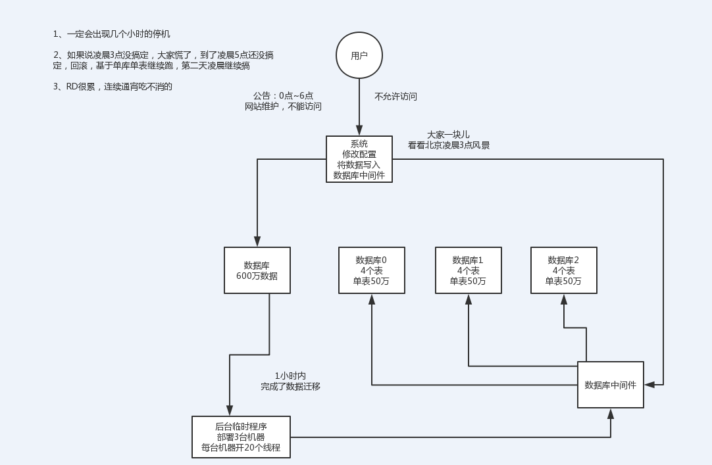
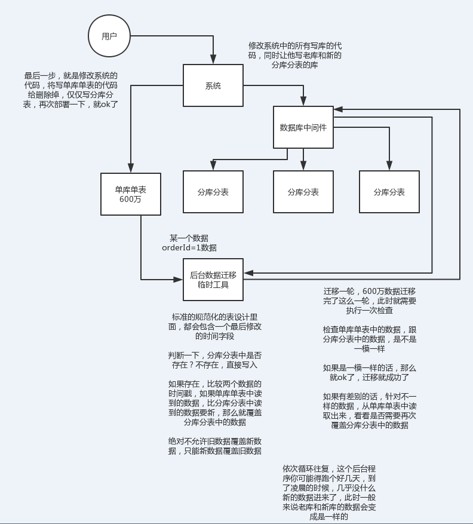

<!-- TOC -->

- [1、面试题](#1面试题)
- [2、面试官心里分析](#2面试官心里分析)
- [3、面试题剖析](#3面试题剖析)
    - [（1）停机迁移方案](#1停机迁移方案)
    - [（2）双写迁移方案](#2双写迁移方案)

<!-- /TOC -->

# 1、面试题

现在有一个未分库分表的系统，未来要分库分表，如何设计才可以让系统从未分库分表动态切换到分库分表上？

# 2、面试官心里分析

你看看，你现在已经明白为啥要分库分表了，你也知道常用的分库分表中间件了，你也设计好你们如何分库分表的方案了（水平拆分、垂直拆分、分表），那问题来了，你接下来该怎么把你那个单库单表的系统给迁移到分库分表上去？

所以这都是一环扣一环的，就是看你有没有全流程经历过这个过程

友情提示

假设，你现有有一个单库单表的系统，在线上在跑，假设单表有600万数据

3个库，每个库里分了4个表，每个表要放50万的数据量

假设你已经选择了一个分库分表的数据库中间件，sharding-jdbc，mycat，都可以

你怎么把线上系统平滑地迁移到分库分表上面去

sharding-jdbc：自己上官网，找一个官网最基本的例子，自己写一下，试一下，跑跑看，是非常简单的

mycat：自己上官网，找一个官网最基本的例子，自己写一下，试一下看看

1个小时以内就可以搞定了

# 3、面试题剖析

这个其实从low到高大上有好几种方案，我们都玩儿过，我都给你说一下

##（1）停机迁移方案

我先给你说一个最low的方案，就是很简单，大家伙儿凌晨12点开始运维，网站或者app挂个公告，说0点到早上6点进行运维，无法访问。。。。。。

接着到0点，停机，系统挺掉，没有流量写入了，此时老的单库单表数据库静止了。然后你之前得写好一个导数的一次性工具，此时直接跑起来，然后将单库单表的数据哗哗哗读出来，写到分库分表里面去。

导数完了之后，就ok了，修改系统的数据库连接配置啥的，包括可能代码和SQL也许有修改，那你就用最新的代码，然后直接启动连到新的分库分表上去。

验证一下，ok了，完美，大家伸个懒腰，看看看凌晨4点钟的北京夜景，打个滴滴回家吧

但是这个方案比较low，谁都能干，我们来看看高大上一点的方案

##（2）双写迁移方案

这个是我们常用的一种迁移方案，比较靠谱一些，不用停机，不用看北京凌晨4点的风景

简单来说，就是在线上系统里面，之前所有写库的地方，增删改操作，都除了对老库增删改，都加上对新库的增删改，这就是所谓双写，同时写俩库，老库和新库。

然后系统部署之后，新库数据差太远，用之前说的导数工具，跑起来读老库数据写新库，写的时候要根据gmt_modified这类字段判断这条数据最后修改的时间，除非是读出来的数据在新库里没有，或者是比新库的数据新才会写。

接着导万一轮之后，有可能数据还是存在不一致，那么就程序自动做一轮校验，比对新老库每个表的每条数据，接着如果有不一样的，就针对那些不一样的，从老库读数据再次写。反复循环，直到两个库每个表的数据都完全一致为止。

接着当数据完全一致了，就ok了，基于仅仅使用分库分表的最新代码，重新部署一次，不就仅仅基于分库分表在操作了么，还没有几个小时的停机时间，很稳。所以现在基本玩儿数据迁移之类的，都是这么干了。

