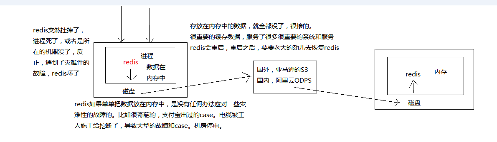
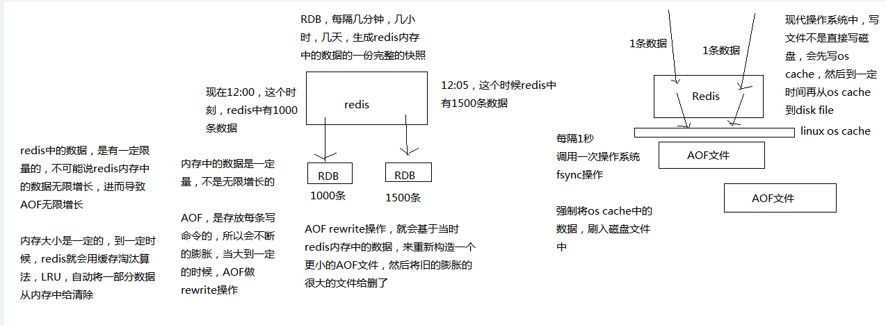
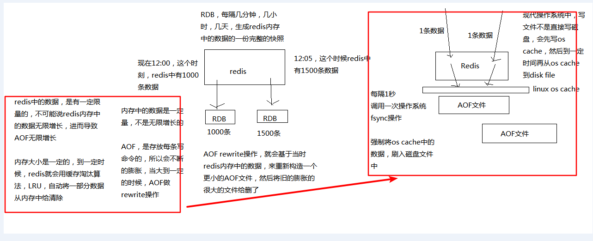
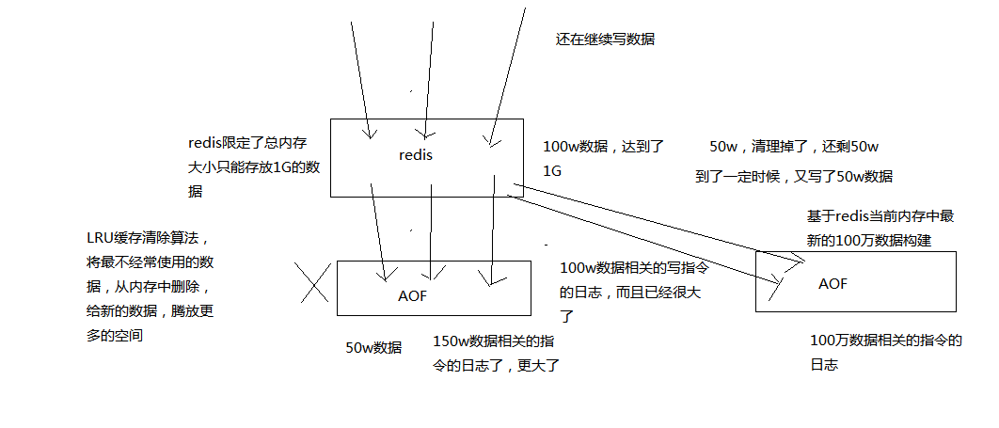
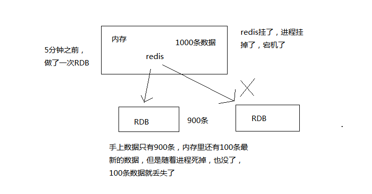

<!-- TOC -->

- [24_怎么保证redis挂掉之后再重启数据可以进行恢复？](#24_怎么保证redis挂掉之后再重启数据可以进行恢复)
    - [01_面试题以及解答思路介绍](#01_面试题以及解答思路介绍)
    - [02_redis持久化机对于生产环境中的灾难恢复的意义](#02_redis持久化机对于生产环境中的灾难恢复的意义)
    - [03_图解分析redis的RDB和AOF两种持久化机制的工作原理&04_redis的RDB和AOF两种持久化机制的优劣势对比](#03_图解分析redis的rdb和aof两种持久化机制的工作原理04_redis的rdb和aof两种持久化机制的优劣势对比)

<!-- /TOC -->

# 24_怎么保证redis挂掉之后再重启数据可以进行恢复？

## 01_面试题以及解答思路介绍

> 1、面试题

redis的持久化有哪几种方式？不同的持久化机制都有什么优缺点？持久化机制具体底层是如何实现的？

> 2、面试官心里分析

redis如果仅仅只是将数据缓存在内存里面，如果redis宕机了，再重启，内存里的数据就全部都弄丢了啊。。。。。。你必须得用redis的持久化机制，将数据写入内存的同时，异步的慢慢的将数据写入磁盘文件里，进行持久化

如果redis宕机了，重启启动，自动从磁盘上加载之前持久化的一些数据，就可以了，也许会丢失少许数据，但是至少不会将所有数据都弄丢 

这个其实一样，针对的都是redis的生产环境可能遇到的一些问题，就是redis要是挂了再重启，内存里的数据不就全丢了？能不能重启的时候把数据给恢复了？

> 3、面试题剖析

## 02_redis持久化机对于生产环境中的灾难恢复的意义

备注：可以把持久化的磁盘日志备份存到云上，便于恢复数据[持久化+云备份]

课程大纲

1、故障发生的时候会怎么样

2、如何应对故障的发生

很多同学，自己也看过一些redis的资料和书籍，当然可能也看过一些redis视频课程

所有的资料，其实都会讲解redis持久化，但是有个问题，我到目前为止，没有看到有人很仔细的去讲解，redis的持久化意义

redis的持久化，RDB，AOF，区别，各自的特点是什么，适合什么场景

redis的企业级的持久化方案是什么，是用来跟哪些企业级的场景结合起来使用的？？？

[redis持久化的意义，在于故障恢复]

比如你部署了一个redis，作为cache缓存，当然也可以保存一些较为重要的数据

如果没有持久化的话，redis遇到灾难性故障的时候，就会丢失所有的数据

如果通过持久化将数据搞一份儿在磁盘上去，然后定期比如说同步和备份到一些云存储服务上去，那么就可以保证数据不丢失全部，还是可以恢复一部分数据回来的

## 03_图解分析redis的RDB和AOF两种持久化机制的工作原理&04_redis的RDB和AOF两种持久化机制的优劣势对比

> 课程大纲

- 1、RDB和AOF两种持久化机制的介绍
- 2、RDB持久化机制的优点
- 3、RDB持久化机制的缺点
- 4、AOF持久化机制的优点
- 5、AOF持久化机制的缺点
- 6、RDB和AOF到底该如何选择

我们已经知道对于一个企业级的redis架构来说，持久化是不可减少的

企业级redis集群架构：海量数据、高并发、高可用

持久化主要是做灾难恢复，数据恢复，也可以归类到高可用的一个环节里面去

比如你redis整个挂了，然后redis就不可用了，你要做的事情是让redis变得可用，尽快变得可用

重启redis，尽快让它对外提供服务，但是就像上一讲说，如果你没做数据备份，这个时候redis启动了，也不可用啊，数据都没了

很可能说，大量的请求过来，缓存全部无法命中，在redis里根本找不到数据，这个时候就死定了，缓存雪崩问题，所有请求，没有在redis命中，就会去mysql数据库这种数据源头中去找，一下子mysql承接高并发，然后就挂了

mysql挂掉，你都没法去找数据恢复到redis里面去，redis的数据从哪儿来？从mysql来。。。

具体的完整的缓存雪崩的场景，还有企业级的解决方案，到后面讲

如果你把redis的持久化做好，备份和恢复方案做到企业级的程度，那么即使你的redis故障了，也可以通过备份数据，快速恢复，一旦恢复立即对外提供服务

redis的持久化，跟高可用，是有关系的，企业级redis架构中去讲解

redis持久化：RDB，AOF

-------------------------------------------------------------------------------------

> 1、RDB和AOF两种持久化机制的介绍

备注：AOF rewrite会基于内存最新的数据重写

RDB持久化机制，对redis中的数据执行周期性的持久化

AOF机制对每条写入命令作为日志，以append-only的模式写入一个日志文件中，在redis重启的时候，可以通过回放AOF日志中的写入指令来重新构建整个数据集

如果我们想要redis仅仅作为纯内存的缓存来用，那么可以禁止RDB和AOF所有的持久化机制

通过RDB或AOF，都可以将redis内存中的数据给持久化到磁盘上面来，然后可以将这些数据备份到别的地方去，比如说阿里云，云服务

如果redis挂了，服务器上的内存和磁盘上的数据都丢了，可以从云服务上拷贝回来之前的数据，放到指定的目录中，然后重新启动redis，redis就会自动根据持久化数据文件中的数据，去恢复内存中的数据，继续对外提供服务

如果同时使用RDB和AOF两种持久化机制，那么在redis重启的时候，会使用AOF来重新构建数据，因为AOF中的数据更加完整

-------------------------------------------------------------------------------------

> 2、RDB持久化机制的优点

（1）RDB会生成多个数据文件，每个数据文件都代表了某一个时刻中redis的数据，这种多个数据文件的方式，非常适合做冷备，可以将这种完整的数据文件发送到一些远程的安全存储上去，比如说Amazon的S3云服务上去，在国内可以是阿里云的ODPS分布式存储上，以预定好的备份策略来定期备份redis中的数据

RDB也可以做冷备，生成多个文件，每个文件都代表了某一个时刻的完整的数据快照
AOF也可以做冷备，只有一个文件，但是你可以，每隔一定时间，去copy一份这个文件出来[只有一份]

RDB做冷备，优势在哪儿呢？由redis去控制固定时长生成快照文件的事情，比较方便; AOF，还需要自己写一些脚本去做这个事情，各种定时
RDB数据做冷备，在最坏的情况下，提供数据恢复的时候，速度比AOF快

（2）RDB对redis对外提供的读写服务，影响非常小，可以让redis保持高性能，因为redis主进程只需要fork一个子进程，让子进程执行磁盘IO操作来进行RDB持久化即可

RDB，每次写，都是直接写redis内存，只是在一定的时候，才会将数据写入磁盘中
AOF，每次都是要写文件的，虽然可以快速写入os cache中，但是还是有一定的时间开销的,速度肯定比RDB略慢一些

（3）相对于AOF持久化机制来说，直接基于RDB数据文件来重启和恢复redis进程，更加快速

AOF，存放的指令日志，做数据恢复的时候，其实是要回放和执行所有的指令日志，来恢复出来内存中的所有数据的
RDB，就是一份数据文件，恢复的时候，直接加载到内存中即可

结合上述优点，RDB特别适合做冷备份，冷备

-------------------------------------------------------------------------------------

> 3、RDB持久化机制的缺点

（1）如果想要在redis故障时，尽可能少的丢失数据，那么RDB没有AOF好。一般来说，RDB数据快照文件，都是每隔5分钟，或者更长时间生成一次，这个时候就得接受一旦redis进程宕机，那么会丢失最近5分钟的数据

这个问题，也是rdb最大的缺点，就是不适合做第一优先的恢复方案，如果你依赖RDB做第一优先恢复方案，会导致数据丢失的比较多

（2）RDB每次在fork子进程来执行RDB快照数据文件生成的时候，如果数据文件特别大，可能会导致对客户端提供的服务暂停数毫秒，或者甚至数秒

一般不要让RDB的间隔太长，否则每次生成的RDB文件太大了，对redis本身的性能可能会有影响的

-------------------------------------------------------------------------------------

> 4、AOF持久化机制的优点

（1）AOF可以更好的保护数据不丢失，一般AOF会每隔1秒，通过一个后台线程执行一次fsync操作，最多丢失1秒钟的数据

每隔1秒，就执行一次fsync操作，保证os cache中的数据写入磁盘中

redis进程挂了，最多丢掉1秒钟的数据

（2）AOF日志文件以append-only模式写入，所以没有任何磁盘寻址的开销，写入性能非常高，而且文件不容易破损，即使文件尾部破损，也很容易修复

（3）AOF日志文件即使过大的时候，出现后台重写操作，也不会影响客户端的读写。因为在rewrite log的时候，会对其中的指导进行压缩，创建出一份需要恢复数据的最小日志出来。再创建新日志文件的时候，老的日志文件还是照常写入。当新的merge后的日志文件ready的时候，再交换新老日志文件即可。

（4）AOF日志文件的命令通过非常可读的方式进行记录，这个特性非常适合做灾难性的误删除的紧急恢复。比如某人不小心用flushall命令清空了所有数据，只要这个时候后台rewrite还没有发生，那么就可以立即拷贝AOF文件，将最后一条flushall命令给删了，然后再将该AOF文件放回去，就可以通过恢复机制，自动恢复所有数据

-------------------------------------------------------------------------------------

> 5、AOF持久化机制的缺点

（1）对于同一份数据来说，AOF日志文件通常比RDB数据快照文件更大

（2）AOF开启后，支持的写QPS会比RDB支持的写QPS低，因为AOF一般会配置成每秒fsync一次日志文件，当然，每秒一次fsync，性能也还是很高的

如果你要保证一条数据都不丢，也是可以的，AOF的fsync设置成没写入一条数据，fsync一次，那就完蛋了，redis的QPS大降

（3）以前AOF发生过bug，就是通过AOF记录的日志，进行数据恢复的时候，没有恢复一模一样的数据出来。所以说，类似AOF这种较为复杂的基于命令日志/merge/回放的方式，比基于RDB每次持久化一份完整的数据快照文件的方式，更加脆弱一些，容易有bug。不过AOF就是为了避免rewrite过程导致的bug，因此每次rewrite并不是基于旧的指令日志进行merge的，而是基于当时内存中的数据进行指令的重新构建，这样健壮性会好很多。

（4）唯一的比较大的缺点，其实就是做数据恢复的时候，会比较慢，还有做冷备，定期的备份，不太方便，可能要自己手写复杂的脚本去做，做冷备不太合适

-------------------------------------------------------------------------------------

> 6、RDB和AOF到底该如何选择

（1）不要仅仅使用RDB，因为那样会导致你丢失很多数据

（2）也不要仅仅使用AOF，因为那样有两个问题，第一，你通过AOF做冷备，没有RDB做冷备，来的恢复速度更快; 第二，RDB每次简单粗暴生成数据快照，更加健壮，可以避免AOF这种复杂的备份和恢复机制的bug

（3）综合使用AOF和RDB两种持久化机制，用AOF来保证数据不丢失，作为数据恢复的第一选择; 用RDB来做不同程度的冷备，在AOF文件都丢失或损坏不可用的时候，还可以使用RDB来进行快速的数据恢复
