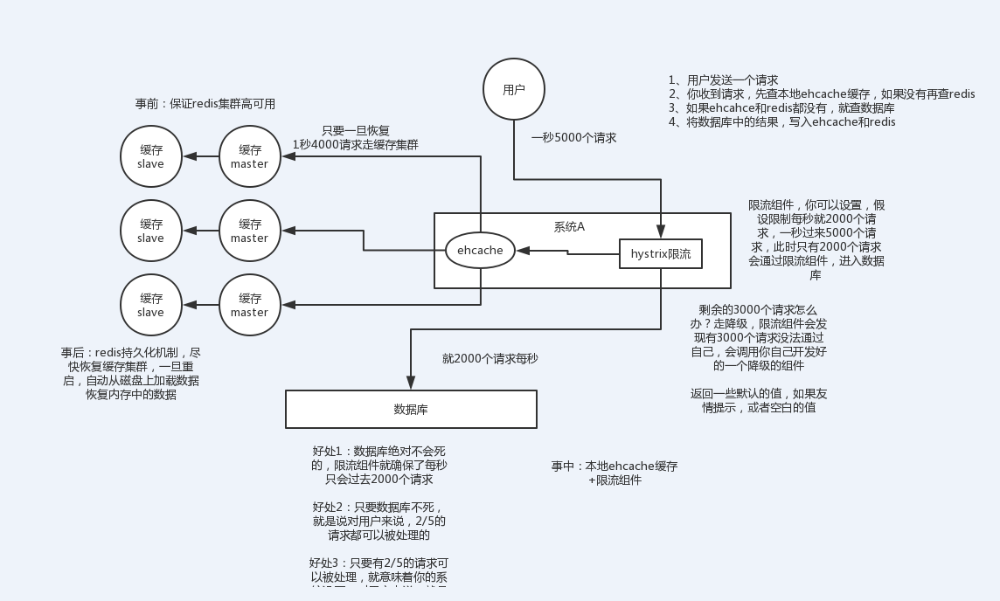
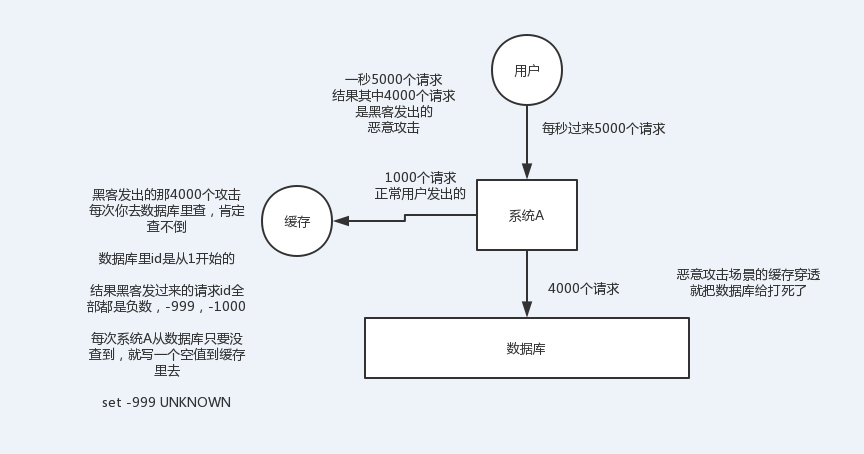
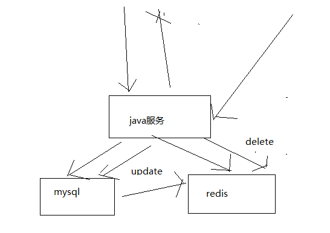
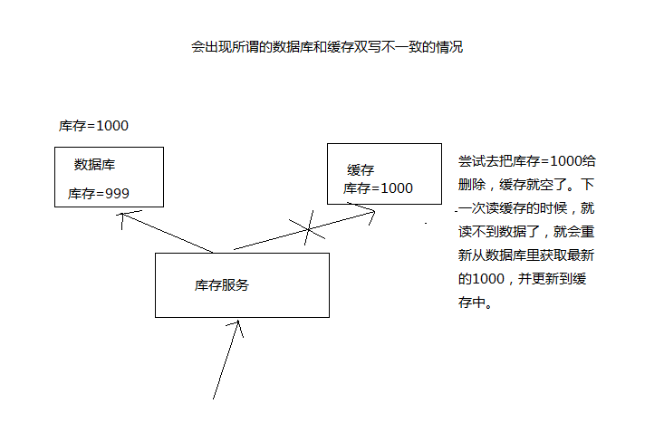
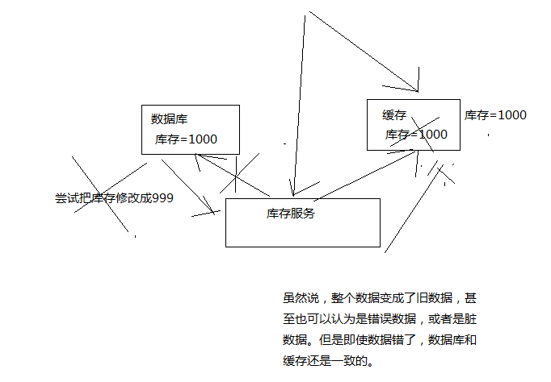
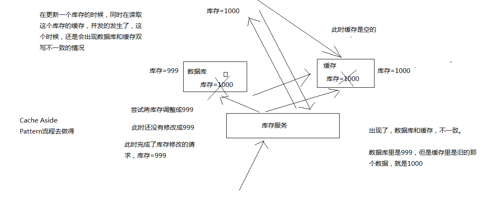
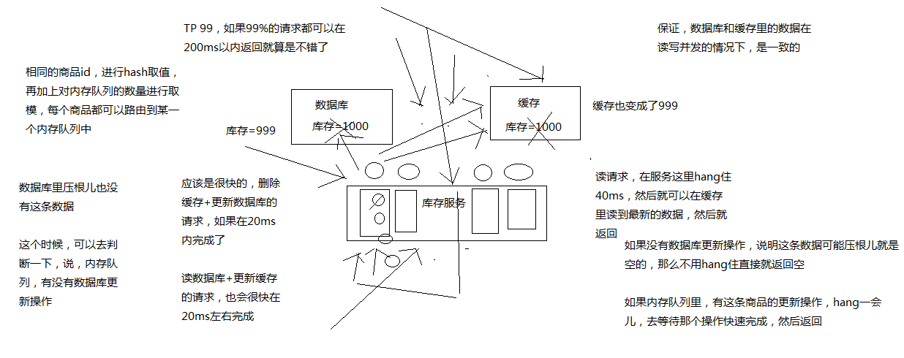
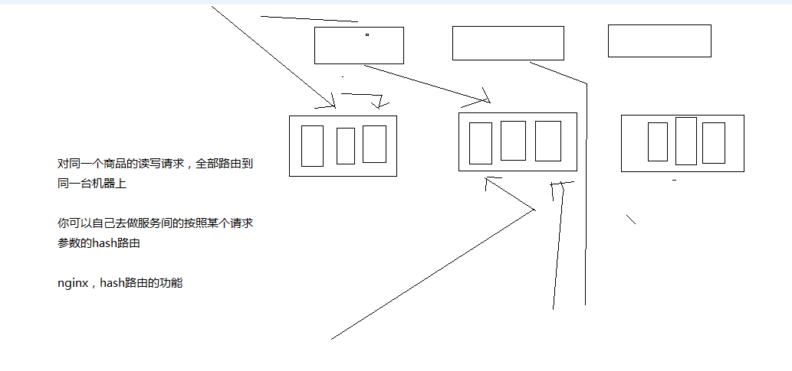
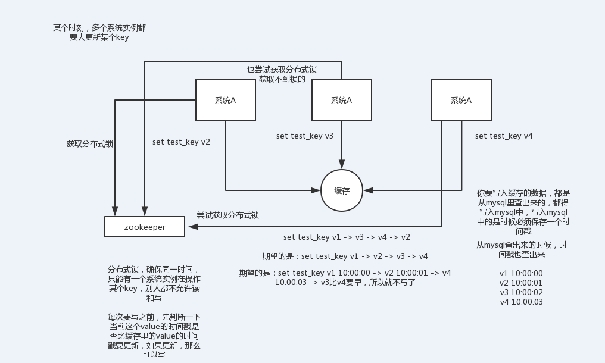

<!-- TOC -->

- [26_你能说说我们一般如何应对缓存雪崩以及穿透问题吗？](#26_你能说说我们一般如何应对缓存雪崩以及穿透问题吗)
- [27_如何保证缓存与数据库双写时的数据一致性？](#27_如何保证缓存与数据库双写时的数据一致性)
    - [01_课程介绍](#01_课程介绍)
    - [02_Cache Aside Pattern缓存+数据库读写模式的分析](#02_cache-aside-pattern缓存数据库读写模式的分析)
        - [1、Cache Aside Pattern](#1cache-aside-pattern)
        - [2、为什么是删除缓存，而不是更新缓存呢？](#2为什么是删除缓存而不是更新缓存呢)
    - [03_高并发场景下的缓存+数据库双写不一致问题分析与解决方案设计](#03_高并发场景下的缓存数据库双写不一致问题分析与解决方案设计)
        - [1、最初级的缓存不一致问题以及解决方案](#1最初级的缓存不一致问题以及解决方案)
        - [2、比较复杂的数据不一致问题分析](#2比较复杂的数据不一致问题分析)
        - [3、为什么上亿流量高并发场景下，缓存会出现这个问题？](#3为什么上亿流量高并发场景下缓存会出现这个问题)
        - [4、数据库与缓存更新与读取操作进行异步串行化](#4数据库与缓存更新与读取操作进行异步串行化)
        - [5、高并发的场景下，该解决方案要注意的问题](#5高并发的场景下该解决方案要注意的问题)
- [28_你能说说redis的并发竞争问题该如何解决吗？](#28_你能说说redis的并发竞争问题该如何解决吗)

<!-- /TOC -->

# 26_你能说说我们一般如何应对缓存雪崩以及穿透问题吗？

> 1、面试题

了解什么是redis的雪崩和穿透？redis崩溃之后会怎么样？系统该如何应对这种情况？如何处理redis的穿透？

> 2、面试官心里分析

其实这是问到缓存必问的，因为缓存雪崩和穿透，那是缓存最大的两个问题，要么不出现，一旦出现就是致命性的问题。所以面试官一定会问你。

> 3、面试题剖析

缓存雪崩发生的现象

缓存雪崩的事前事中事后的解决方案

- 事前：redis高可用，主从+哨兵，redis cluster，避免全盘崩溃

- 事中：本地ehcache缓存 + hystrix限流&降级，避免MySQL被打死

- 事后：redis持久化，快速恢复缓存数据

>> 缓存雪崩[这里的例子是缓存服务器直接宕机，要是大量的缓存同时失效走数据库查询呢？]

>> 缓存穿透

备注：对于恶意的请求，在数据库查询不到就在缓存中设置空值

# 27_如何保证缓存与数据库双写时的数据一致性？

## 01_课程介绍

> 1、面试题

如何保证缓存与数据库的双写一致性？

> 2、面试官心里分析

你只要用缓存，就可能会涉及到缓存与数据库双存储双写，你只要是双写，就一定会有数据一致性的问题，那么你如何解决一致性问题？

> 3、面试题剖析

一般来说，就是如果你的系统不是严格要求缓存+数据库必须一致性的话，缓存可以稍微的跟数据库偶尔有不一致的情况，最好不要做这个方案，读请求和写请求串行化，串到一个内存队列里去，这样就可以保证一定不会出现不一致的情况

串行化之后，就会导致系统的吞吐量会大幅度的降低，用比正常情况下多几倍的机器去支撑线上的一个请求。

## 02_Cache Aside Pattern缓存+数据库读写模式的分析

最经典的缓存+数据库读写的模式，cache aside pattern

### 1、Cache Aside Pattern

（1）读的时候，先读缓存，缓存没有的话，那么就读数据库，然后取出数据后放入缓存，同时返回响应

（2）更新的时候，先删除缓存，然后再更新数据库

问题:新增和删除是属于更新吗？

### 2、为什么是删除缓存，而不是更新缓存呢？

原因很简单，很多时候，复杂点的缓存的场景，因为缓存有的时候，不简单是数据库中直接取出来的值

商品详情页的系统，修改库存，只是修改了某个表的某些字段，但是要真正把这个影响的最终的库存计算出来，可能还需要从其他表查询一些数据，然后进行一些复杂的运算，才能最终计算出

现在最新的库存是多少，然后才能将库存更新到缓存中去

比如可能更新了某个表的一个字段，然后其对应的缓存，是需要查询另外两个表的数据，并进行运算，才能计算出缓存最新的值的

更新缓存的代价是很高的

是不是说，每次修改数据库的时候，都一定要将其对应的缓存去跟新一份？也许有的场景是这样的，但是对于比较复杂的缓存数据计算的场景，就不是这样了

如果你频繁修改一个缓存涉及的多个表，那么这个缓存会被频繁的更新，频繁的更新缓存

但是问题在于，这个缓存到底会不会被频繁访问到？？？

举个例子，一个缓存涉及的表的字段，在1分钟内就修改了20次，或者是100次，那么缓存跟新20次，100次; 但是这个缓存在1分钟内就被读取了1次，有大量的冷数据

28法则，黄金法则，20%的数据，占用了80%的访问量

实际上，如果你只是删除缓存的话，那么1分钟内，这个缓存不过就重新计算一次而已，开销大幅度降低

每次数据过来，就只是删除缓存，然后修改数据库，如果这个缓存，在1分钟内只是被访问了1次，那么只有那1次，缓存是要被重新计算的，用缓存才去算缓存

其实删除缓存，而不是更新缓存，就是一个lazy计算的思想，不要每次都重新做复杂的计算，不管它会不会用到，而是让它到需要被使用的时候再重新计算

mybatis，hibernate，懒加载，思想

查询一个部门，部门带了一个员工的list，没有必要说每次查询部门，都里面的1000个员工的数据也同时查出来啊

80%的情况，查这个部门，就只是要访问这个部门的信息就可以了

先查部门，同时要访问里面的员工，那么这个时候只有在你要访问里面的员工的时候，才会去数据库里面查询1000个员工

## 03_高并发场景下的缓存+数据库双写不一致问题分析与解决方案设计

马上开始去开发业务系统

从哪一步开始做，从比较简单的那一块开始做，实时性要求比较高的那块数据的缓存去做

实时性比较高的数据缓存，选择的就是库存的服务

库存可能会修改，每次修改都要去更新这个缓存数据; 每次库存的数据，在缓存中一旦过期，或者是被清理掉了，前端的nginx服务都会发送请求给库存服务，去获取相应的数据

库存这一块，写数据库的时候，直接更新redis缓存

实际上没有这么的简单，这里，其实就涉及到了一个问题，数据库与缓存双写，数据不一致的问题

围绕和结合实时性较高的库存服务，把数据库与缓存双写不一致问题以及其解决方案，给大家讲解一下

数据库与缓存双写不一致，很常见的问题，大型的缓存架构中，第一个解决方案

大型的缓存架构全部讲解完了以后，整套架构是非常复杂，架构可以应对各种各样奇葩和极端的情况

也有一种可能，不是说，来讲课的就是超人，万能的

讲课，就跟写书一样，很可能会写错，也可能有些方案里的一些地方，我没考虑到

也可能说，有些方案只是适合某些场景，在某些场景下，可能需要你进行方案的优化和调整才能适用于你自己的项目

大家觉得对这些方案有什么疑问或者见解，都可以找我，沟通一下

如果的确我觉得是我讲解的不对，或者有些地方考虑不周，那么我可以在视频里补录，更新到网站上面去

多多包涵

### 1、最初级的缓存不一致问题以及解决方案

问题：先修改数据库，再删除缓存，如果删除缓存失败了，那么会导致数据库中是新数据，缓存中是旧数据，数据出现不一致

解决思路

先删除缓存，再修改数据库，如果删除缓存成功了，如果修改数据库失败了，那么数据库中是旧数据，缓存中是空的，那么数据不会不一致

因为读的时候缓存没有，则读数据库中旧数据，然后更新到缓存中

备注：这种情况虽然数据不正确但是可以保证两者的数据一致。

### 2、比较复杂的数据不一致问题分析

数据发生了变更，先删除了缓存，然后要去修改数据库，此时还没修改

一个请求过来，去读缓存，发现缓存空了，去查询数据库，查到了修改前的旧数据，放到了缓存中

数据变更的程序完成了数据库的修改

完了，数据库和缓存中的数据不一样了。。。。

### 3、为什么上亿流量高并发场景下，缓存会出现这个问题？

只有在对一个数据在并发的进行读写的时候，才可能会出现这种问题

其实如果说你的并发量很低的话，特别是读并发很低，每天访问量就1万次，那么很少的情况下，会出现刚才描述的那种不一致的场景

但是问题是，如果每天的是上亿的流量，每秒并发读是几万，每秒只要有数据更新的请求，就可能会出现上述的数据库+缓存不一致的情况

高并发了以后，问题是很多的

### 4、数据库与缓存更新与读取操作进行异步串行化

[原理：把对同一个key的缓存数据更新和读取缓存空时更新缓存这两个操作串行化处理]

更新数据的时候，根据数据的唯一标识，将操作路由之后，发送到一个jvm内部的队列中

读取数据的时候，如果发现数据不在缓存中，那么将重新读取数据+更新缓存的操作，根据唯一标识路由之后，也发送同一个jvm内部的队列中

一个队列对应一个工作线程

每个工作线程串行拿到对应的操作，然后一条一条的执行

这样的话，一个数据变更的操作，先执行，删除缓存，然后再去更新数据库，但是还没完成更新

此时如果一个读请求过来，读到了空的缓存，那么可以先将缓存更新的请求发送到队列中，此时会在队列中积压，然后同步等待缓存更新完成

这里有一个优化点，一个队列中，其实多个更新缓存请求串在一起是没意义的，因此可以做过滤，如果发现队列中已经有一个更新缓存的请求了，那么就不用再放个更新请求操作进去了，直接等待前面的更新操作请求完成即可

待那个队列对应的工作线程完成了上一个操作的数据库的修改之后，才会去执行下一个操作，也就是缓存更新的操作，此时会从数据库中读取最新的值，然后写入缓存中

如果请求还在等待时间范围内，不断轮询发现可以取到值了，那么就直接返回; 如果请求等待的时间超过一定时长，那么这一次直接从数据库中读取当前的旧值

[总结：解决数据库和缓存数据库不一致的方案（先删缓存再更新数据库+更新和读取串行化【队列去重】）]

### 5、高并发的场景下，该解决方案要注意的问题

> （1）读请求长时阻塞

由于读请求进行了非常轻度的异步化，所以一定要注意读超时的问题，每个读请求必须在超时时间范围内返回

该解决方案，最大的风险点在于说，可能数据更新很频繁，导致队列中积压了大量更新操作在里面，然后读请求会发生大量的超时，最后导致大量的请求直接走数据库

务必通过一些模拟真实的测试，看看更新数据的频繁是怎样的

另外一点，因为一个队列中，可能会积压针对多个数据项的更新操作，因此需要根据自己的业务情况进行测试，可能需要部署多个服务，每个服务分摊一些数据的更新操作

如果一个内存队列里居然会挤压100个商品的库存修改操作，每隔库存修改操作要耗费10ms区完成，那么最后一个商品的读请求，可能等待10 * 100 = 1000ms = 1s后，才能得到数据

这个时候就导致读请求的长时阻塞

一定要做根据实际业务系统的运行情况，去进行一些压力测试，和模拟线上环境，去看看最繁忙的时候，内存队列可能会挤压多少更新操作，可能会导致最后一个更新操作对应的读请求，会hang多少时间，如果读请求在200ms返回，如果你计算过后，哪怕是最繁忙的时候，积压10个更新操作，最多等待200ms，那还可以的

如果一个内存队列可能积压的更新操作特别多，那么你就要加机器，让每个机器上部署的服务实例处理更少的数据，那么每个内存队列中积压的更新操作就会越少

其实根据之前的项目经验，一般来说数据的写频率是很低的，因此实际上正常来说，在队列中积压的更新操作应该是很少的

针对读高并发，读缓存架构的项目，一般写请求相对读来说，是非常非常少的，每秒的QPS能到几百就不错了

一秒，500的写操作，5份，每200ms，就100个写操作

单机器，20个内存队列，每个内存队列，可能就积压5个写操作，每个写操作性能测试后，一般在20ms左右就完成

那么针对每个内存队列中的数据的读请求，也就最多hang一会儿，200ms以内肯定能返回了

写QPS扩大10倍，但是经过刚才的测算，就知道，单机支撑写QPS几百没问题，那么就扩容机器，扩容10倍的机器，10台机器，每个机器20个队列，200个队列

大部分的情况下，应该是这样的，大量的读请求过来，都是直接走缓存取到数据的

少量情况下，可能遇到读跟数据更新冲突的情况，如上所述，那么此时更新操作如果先入队列，之后可能会瞬间来了对这个数据大量的读请求，但是因为做了去重的优化，所以也就一个更新缓存的操作跟在它后面

等数据更新完了，读请求触发的缓存更新操作也完成，然后临时等待的读请求全部可以读到缓存中的数据

> （2）读请求并发量过高

这里还必须做好压力测试，确保恰巧碰上上述情况的时候，还有一个风险，就是突然间大量读请求会在几十毫秒的延时hang在服务上，看服务能不能抗的住，需要多少机器才能抗住最大的极限情况的峰值

但是因为并不是所有的数据都在同一时间更新，缓存也不会同一时间失效，所以每次可能也就是少数数据的缓存失效了，然后那些数据对应的读请求过来，并发量应该也不会特别大

按1:99的比例计算读和写的请求，每秒5万的读QPS，可能只有500次更新操作

如果一秒有500的写QPS，那么要测算好，可能写操作影响的数据有500条，这500条数据在缓存中失效后，可能导致多少读请求，发送读请求到库存服务来，要求更新缓存

一般来说，1:1，1:2，1:3，每秒钟有1000个读请求，会hang在库存服务上，每个读请求最多hang多少时间，200ms就会返回

在同一时间最多hang住的可能也就是单机200个读请求，同时hang住

单机hang200个读请求，还是ok的

1:20，每秒更新500条数据，这500秒数据对应的读请求，会有20 * 500 = 1万

1万个读请求全部hang在库存服务上，就死定了

> （3）多服务实例部署的请求路由

可能这个服务部署了多个实例，那么必须保证说，执行数据更新操作，以及执行缓存更新操作的请求，都通过nginx服务器路由到相同的服务实例上

[保证串行化的关键，把对相同key的用户请求路由到前端的同一台机器上，保证在同一个jvm额内部队列中去]

> （4）热点商品的路由问题，导致请求的倾斜

万一某个商品的读写请求特别高，全部打到相同的机器的相同的队列里面去了，可能造成某台机器的压力过大

就是说，因为只有在商品数据更新的时候才会清空缓存，然后才会导致读写并发，所以更新频率不是太高的话，这个问题的影响并不是特别大

但是的确可能某些机器的负载会高一些

# 28_你能说说redis的并发竞争问题该如何解决吗？

总结：[借助于分布式锁实现+数据时间戳版本机制]

> 1、面试题

redis的并发竞争问题是什么？如何解决这个问题？了解Redis事务的CAS方案吗？

> 2、面试官心里分析

这个也是线上非常常见的一个问题，就是多客户端同时并发写一个key，可能本来应该先到的数据后到了，导致数据版本错了。
或者是多客户端同时获取一个key，修改值之后再写回去，只要顺序错了，数据就错了。

而且redis自己就有天然解决这个问题的CAS类的乐观锁方案

> 3、面试题剖析

