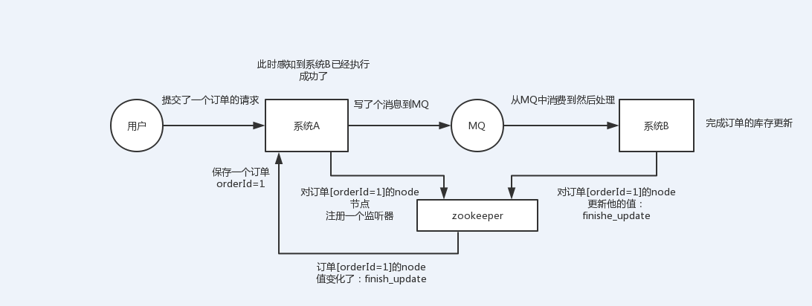
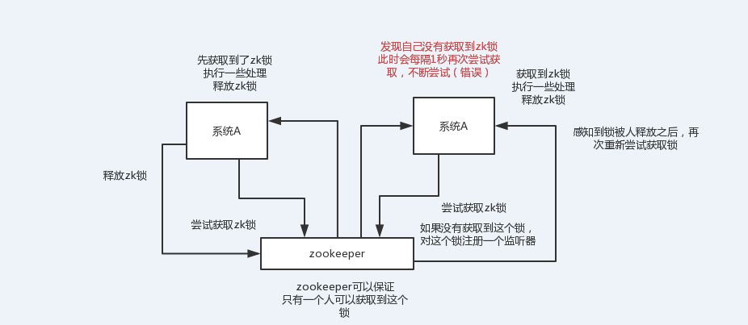
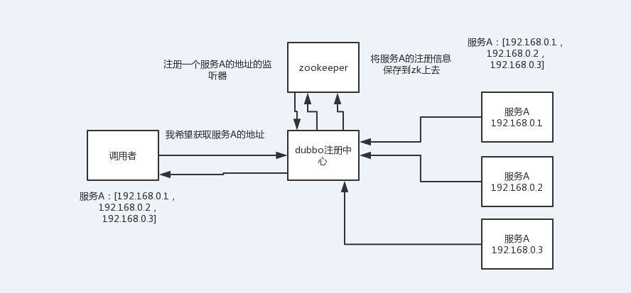
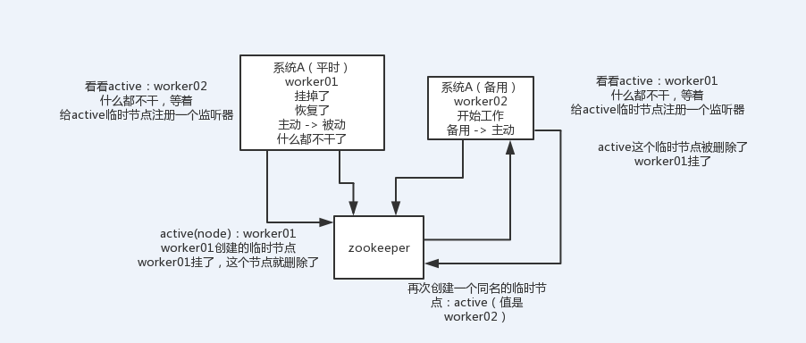

<!-- TOC -->

- [41_说说zookeeper一般都有哪些使用场景？](#41_说说zookeeper一般都有哪些使用场景)
    - [（1）分布式协调](#1分布式协调)
    - [（2）分布式锁](#2分布式锁)
    - [（3）元数据/配置信息管理](#3元数据配置信息管理)
    - [（4）HA高可用性（主备切换）](#4ha高可用性主备切换)

<!-- /TOC -->

# 41_说说zookeeper一般都有哪些使用场景？

> 1、面试题

zk都有哪些使用场景？

> 2、面试官心里分析

zk，zookeeper，你们现在在聊的面试topic，是分布式系统，他其实已经跟你聊完了dubbo以及相关的一些问题，确认，你现在分布式服务框架，rpc框架，基本都有一些认知。可能开始要跟你聊分布式相关的其他问题了。

分布式锁这个东西，很常用的，你做java系统开发，分布式系统，可能会有一些场景会用到。最常用的分布式锁就是zookeeper来做分布式锁。

其实说实话，问这个问题，一般就是看看你是否了解zk，因为zk是分布式系统中很常见的一个基础系统。而且问的话常问的就是说zk的使用场景是什么？看你知道不知道一些基本的使用场景。但是其实zk挖深了自然是可以问的很深很深的。

友情提示，如果有某个同学连zookeeper是什么都不知道？听说过，连个基本原理都不知道，连个demo都没写过。我建议你先暂停这个课程，先百度一下，zookeeper入门，最好写helloworld级别的demo程序，体验一把。

> 3、面试题剖析

大致来说，zk的使用场景如下，我就举几个简单的，大家能说几个就好了：

## （1）分布式协调

这个其实是zk很经典的一个用法，简单来说，就好比，你A系统发送个请求到mq，然后B消息消费之后处理了。那A系统如何知道B系统的处理结果？用zk就可以实现分布式系统之间的协调工作。A系统发送请求之后可以在zk上对某个节点的值注册个监听器，一旦B系统处理完了就修改zk那个节点的值，A立马就可以收到通知，完美解决。

## （2）分布式锁

对某一个数据连续发出两个修改操作，两台机器同时收到了请求，但是只能一台机器先执行另外一个机器再执行。那么此时就可以使用zk分布式锁，一个机器接收到了请求之后先获取zk上的一把分布式锁，就是可以去创建一个znode，接着执行操作；然后另外一个机器也尝试去创建那个znode，结果发现自己创建不了，因为被别人创建了。。。。那只能等着，等第一个机器执行完了自己再执行。

## （3）元数据/配置信息管理

zk可以用作很多系统的配置信息的管理，比如kafka、storm等等很多分布式系统都会选用zk来做一些元数据、配置信息的管理，包括dubbo注册中心不也支持zk么

## （4）HA高可用性（主备切换）

这个应该是很常见的，比如hadoop、hdfs、yarn等很多大数据系统，都选择基于zk来开发HA高可用机制，就是一个重要进程一般会做主备两个，主进程挂了立马通过zk感知到切换到备用进程

