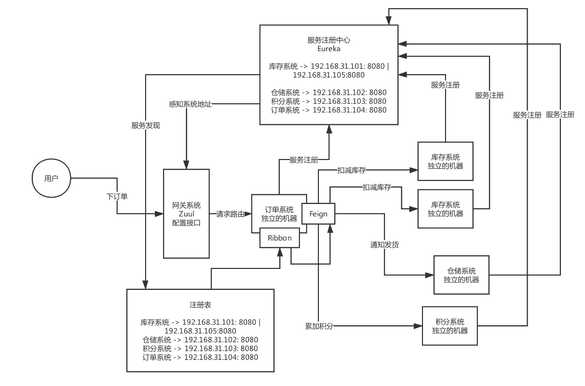

<!-- TOC -->

- [01、互联网大厂面试要求：技术广度、技术深度、系统设计以及项目经验](#01互联网大厂面试要求技术广度技术深度系统设计以及项目经验)
- [02、Java工程师面试突击第一季总结：你离一次成功的面试还差多少？](#02java工程师面试突击第一季总结你离一次成功的面试还差多少)
- [03、《21天互联网Java进阶面试训练营》的课程说明](#0321天互联网java进阶面试训练营的课程说明)
- [04、作业：系统分析一下，自己距离大厂offer差在哪里？](#04作业系统分析一下自己距离大厂offer差在哪里)
- [05、感受一下BAT面试官对分布式技术的十几个面试连环炮!](#05感受一下bat面试官对分布式技术的十几个面试连环炮)
- [06、你们公司用的Dubbo？那你再额外说说Spring Cloud的核心架构原理？](#06你们公司用的dubbo那你再额外说说spring-cloud的核心架构原理)
- [07、基于Dubbo和Spring Cloud分别搭建一个电商系统来快速体验一下！代码下载点击这里哦!](#07基于dubbo和spring-cloud分别搭建一个电商系统来快速体验一下代码下载点击这里哦)
- [08、作业：你们的系统使用了哪种服务框架？为什么要这样技术选型？](#08作业你们的系统使用了哪种服务框架为什么要这样技术选型)
- [09、看过Dubbo源码吗？说说Dubbo的底层架构原理？](#09看过dubbo源码吗说说dubbo的底层架构原理)
- [10、咱们来聊点深入的，说说Dubbo底层的网络通信机制原理！](#10咱们来聊点深入的说说dubbo底层的网络通信机制原理)
- [11、Dubbo框架从架构设计角度，是怎么保证极高的可扩展性的？](#11dubbo框架从架构设计角度是怎么保证极高的可扩展性的)
- [12、作业：自己独立画出Dubbo的底层架构原理图](#12作业自己独立画出dubbo的底层架构原理图)
- [13、如果让你设计一个RPC框架，网络通信、代理机制、负载均衡等该如何设](#13如果让你设计一个rpc框架网络通信代理机制负载均衡等该如何设)
- [14、平时除了使用外，有研究过Spring Cloud的底层架构原理么？](#14平时除了使用外有研究过spring-cloud的底层架构原理么)
- [15、从底层实现原理的角度，对比一下Dubbo和Spring Cloud的优劣！](#15从底层实现原理的角度对比一下dubbo和spring-cloud的优劣)
- [16、作业：自己独立画出Spring Cloud的架构原理图，RPC框架架构设计图！](#16作业自己独立画出spring-cloud的架构原理图rpc框架架构设计图)
- [17、面试官：你们的服务注册中心进行过选型调研吗？对比一下各种服务注册中心！](#17面试官你们的服务注册中心进行过选型调研吗对比一下各种服务注册中心)
- [18、画图阐述一下你们的服务注册中心部署架构，生产环境下怎么保证高可用？](#18画图阐述一下你们的服务注册中心部署架构生产环境下怎么保证高可用)
- [19、你们系统遇到过服务发现过慢的问题吗？怎么优化和解决的？](#19你们系统遇到过服务发现过慢的问题吗怎么优化和解决的)
- [20、作业：说一下自己公司的服务注册中心怎么技术选型的？生产环境中应该怎么优化？](#20作业说一下自己公司的服务注册中心怎么技术选型的生产环境中应该怎么优化)

<!-- /TOC -->

# 01、互联网大厂面试要求：技术广度、技术深度、系统设计以及项目经验

# 02、Java工程师面试突击第一季总结：你离一次成功的面试还差多少？

# 03、《21天互联网Java进阶面试训练营》的课程说明

# 04、作业：系统分析一下，自己距离大厂offer差在哪里？

# 05、感受一下BAT面试官对分布式技术的十几个面试连环炮!

# 06、你们公司用的Dubbo？那你再额外说说Spring Cloud的核心架构原理？

如果聊分布式这块的技术，围绕Dubbo来拷问的，但是呢，现在其实非常流行的是Spring Cloud，Dubbo和Spring Cloud以及阿里系的一些技术，现在正在融合，Spring Cloud Alibaba，只不过现在用的公司暂时还没那么多而已

作为合格的工程师，行业里主流的分布式服务技术栈，Dubbo和Spring Cloud两种，有的公司他是用Dubbo的，不用Spring Cloud的，有的公司是用Spring Cloud的，不用Dubbo的，他们是代表了两种主流技术栈

Java工程师，Dubbo和Spring Cloud起码是基本原理，都有一定的了解

大白话 + 现场画图

上网看一些博客资料，或者是买一些Spring Cloud的书，可能没考虑过一个事儿，第一篇必须是用非常通俗的语言，把一个系统如果用Spring Cloud来做分布式架构的话，那么他需要用到Spring Cloud哪些组件，为什么

跟着书或者博客，直接上手开始搭建demo，开始做起来了

分别用Dubbo和Spring Cloud做两个最基本的Demo工程，用电商背景来搭建几个服务

比如说，现在我们有一个电商系统

用户现在需要下单购买一些东西这样子，订单系统、库存系统、仓储系统、积分系统

不太可能说用单块的架构，电商系统你想支撑多少用户量？10万注册用户，日活1000用户来你这里来购买？

百万级用户，十万级日活，单块系统就不太合适了，背后有几十个人的团队在协作开发，此时单块系统是绝对不合适的

梳理和明确一个概念：电商系统，拆分为了多个子系统，一次下订单的请求需要多个子系统协作完成，每个子系统都完成一部分的功能，多个子系统分别完成自己负责的事情，最终这个请求就处理完毕

我们不会让每个视频太长，按照我们大纲来讲，说是60讲，粗略的大纲，其实最终会拆分成可能上百讲，Spring Cloud架构原理，我们就要分为上下两讲来说 

Spring Cloud核心架构原理

> Spring Cloud

- Eureka：服务注册中心

- Feign：服务调用[把本地调用转化为网络服务调用]

- Ribbon：负载均衡

- Zuul/Spring Cloud Gatway:网关

这么多的系统，电商系统包含了20个子系统，每个子系统有20个核心接口，一共电商系统有400个接口，这么多的接口，直接对外暴露，前后端分离的架构，难道你让前端的同学必须记住你的20个系统的部署的机器，他们去做负载均衡，记住400个接口

微服务那块，网关

灰度发布、统一熔断、统一降级、统一缓存、统一限流、统一授权认证

Hystrix、链路追踪、stream、很多组件，Hystrix这块东西，其实是会放在高可用的环节去说的，并不是说一个普通系统刚开始就必须得用的，没有用好的话，反而会出问题，Hystrix线路熔断的框架，必须得设计对应的一整套的限流方案、熔断方案、资源隔离、降级机制，配合降级机制来做

# 07、基于Dubbo和Spring Cloud分别搭建一个电商系统来快速体验一下！代码下载点击这里哦!

# 08、作业：你们的系统使用了哪种服务框架？为什么要这样技术选型？

# 09、看过Dubbo源码吗？说说Dubbo的底层架构原理？

# 10、咱们来聊点深入的，说说Dubbo底层的网络通信机制原理！

# 11、Dubbo框架从架构设计角度，是怎么保证极高的可扩展性的？

# 12、作业：自己独立画出Dubbo的底层架构原理图

# 13、如果让你设计一个RPC框架，网络通信、代理机制、负载均衡等该如何设
# 14、平时除了使用外，有研究过Spring Cloud的底层架构原理么？
# 15、从底层实现原理的角度，对比一下Dubbo和Spring Cloud的优劣！
# 16、作业：自己独立画出Spring Cloud的架构原理图，RPC框架架构设计图！
# 17、面试官：你们的服务注册中心进行过选型调研吗？对比一下各种服务注册中心！
# 18、画图阐述一下你们的服务注册中心部署架构，生产环境下怎么保证高可用？
# 19、你们系统遇到过服务发现过慢的问题吗？怎么优化和解决的？
# 20、作业：说一下自己公司的服务注册中心怎么技术选型的？生产环境中应该怎么优化？

