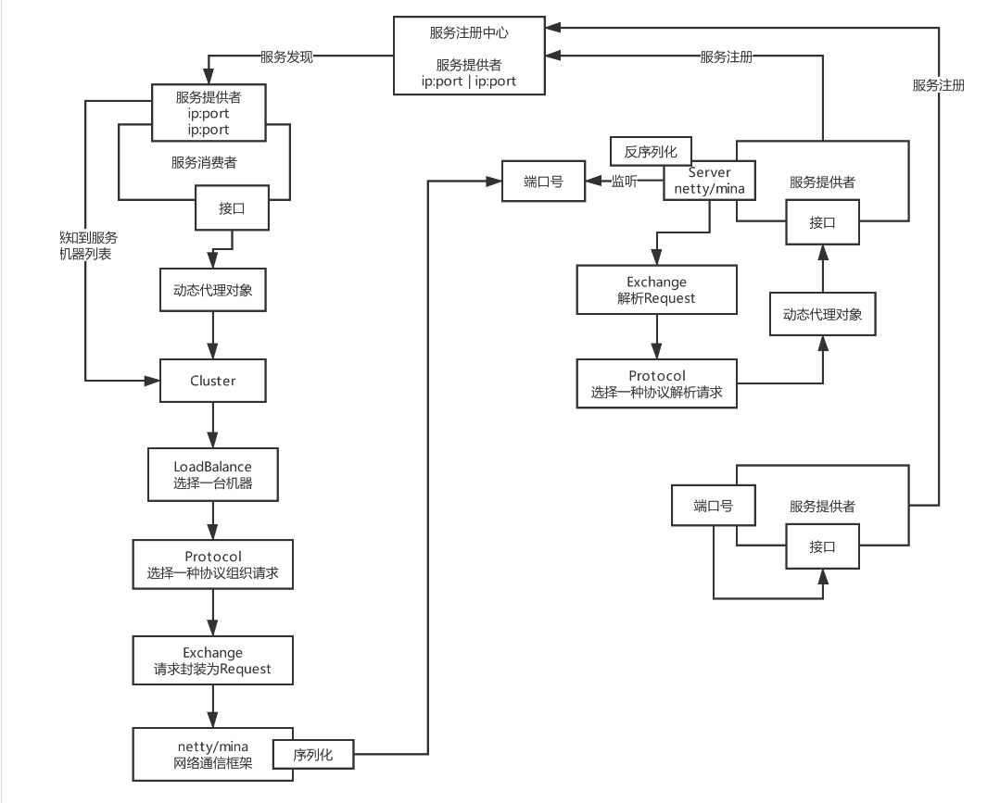
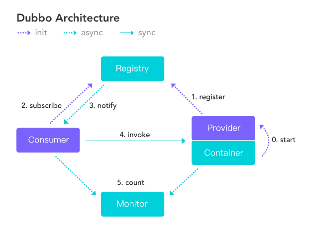
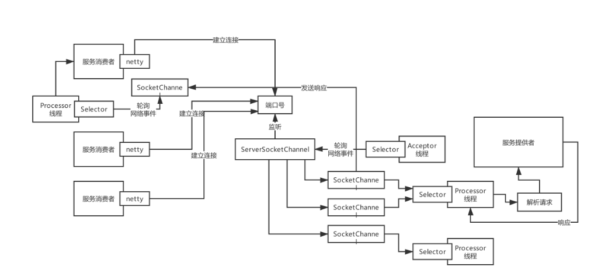
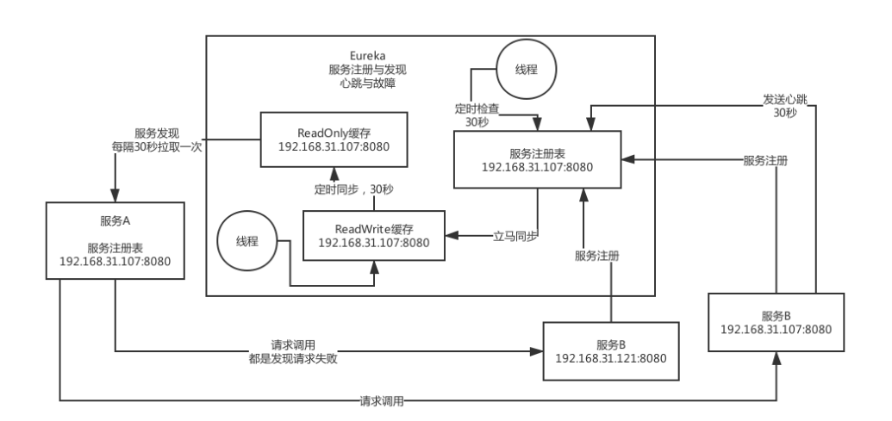
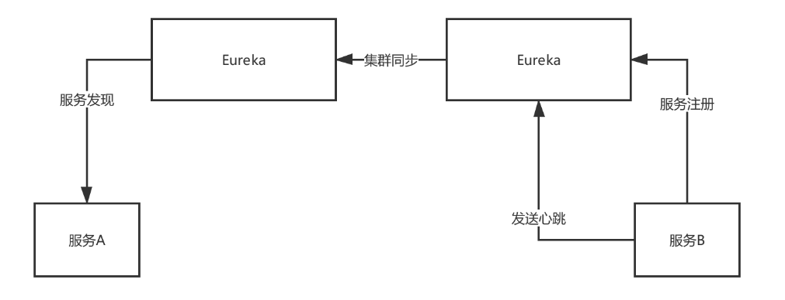
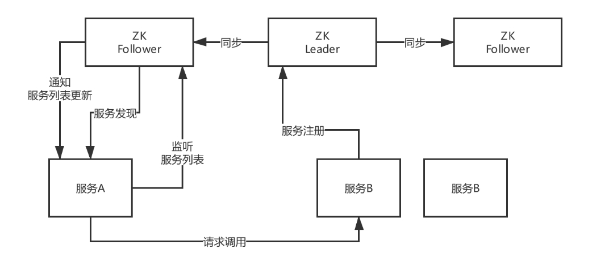
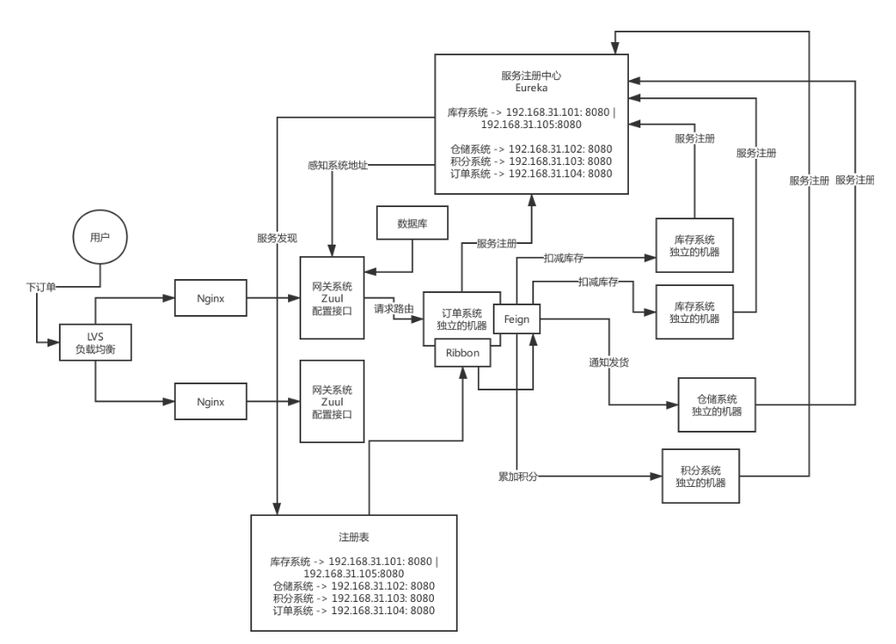

<!-- TOC -->

- [01、互联网大厂面试要求：技术广度、技术深度、系统设计以及项目经验](#01互联网大厂面试要求技术广度技术深度系统设计以及项目经验)
- [02、Java工程师面试突击第一季总结：你离一次成功的面试还差多少？](#02java工程师面试突击第一季总结你离一次成功的面试还差多少)
- [03、《21天互联网Java进阶面试训练营》的课程说明](#0321天互联网java进阶面试训练营的课程说明)
- [04、作业：系统分析一下，自己距离大厂offer差在哪里？](#04作业系统分析一下自己距离大厂offer差在哪里)
- [05、感受一下BAT面试官对分布式技术的十几个面试连环炮!](#05感受一下bat面试官对分布式技术的十几个面试连环炮)
- [06、你们公司用的Dubbo？那你再额外说说Spring Cloud的核心架构原理？](#06你们公司用的dubbo那你再额外说说spring-cloud的核心架构原理)
- [07、基于Dubbo和Spring Cloud分别搭建一个电商系统来快速体验一下！代码下载点击这里哦!](#07基于dubbo和spring-cloud分别搭建一个电商系统来快速体验一下代码下载点击这里哦)
- [08、作业：你们的系统使用了哪种服务框架？为什么要这样技术选型？](#08作业你们的系统使用了哪种服务框架为什么要这样技术选型)
- [09、看过Dubbo源码吗？说说Dubbo的底层架构原理？](#09看过dubbo源码吗说说dubbo的底层架构原理)
- [10、咱们来聊点深入的，说说Dubbo底层的网络通信机制原理！](#10咱们来聊点深入的说说dubbo底层的网络通信机制原理)
- [11、Dubbo框架从架构设计角度，是怎么保证极高的可扩展性的？](#11dubbo框架从架构设计角度是怎么保证极高的可扩展性的)
- [12、作业：自己独立画出Dubbo的底层架构原理图](#12作业自己独立画出dubbo的底层架构原理图)
- [13、如果让你设计一个RPC框架，网络通信、代理机制、负载均衡等该如何设](#13如果让你设计一个rpc框架网络通信代理机制负载均衡等该如何设)
- [14、平时除了使用外，有研究过Spring Cloud的底层架构原理么？](#14平时除了使用外有研究过spring-cloud的底层架构原理么)
- [15、从底层实现原理的角度，对比一下Dubbo和Spring Cloud的优劣！](#15从底层实现原理的角度对比一下dubbo和spring-cloud的优劣)
- [16、作业：自己独立画出Spring Cloud的架构原理图，RPC框架架构设计图！](#16作业自己独立画出spring-cloud的架构原理图rpc框架架构设计图)
- [17、面试官：你们的服务注册中心进行过选型调研吗？对比一下各种服务注册中心！](#17面试官你们的服务注册中心进行过选型调研吗对比一下各种服务注册中心)
- [18、画图阐述一下你们的服务注册中心部署架构，生产环境下怎么保证高可用？](#18画图阐述一下你们的服务注册中心部署架构生产环境下怎么保证高可用)
- [19、你们系统遇到过服务发现过慢的问题吗？怎么优化和解决的？](#19你们系统遇到过服务发现过慢的问题吗怎么优化和解决的)
- [20、作业：说一下自己公司的服务注册中心怎么技术选型的？生产环境中应该怎么优化？](#20作业说一下自己公司的服务注册中心怎么技术选型的生产环境中应该怎么优化)
- [21、你们对网关的技术选型是怎么考虑的？能对比一下各种网关技术的优劣吗？](#21你们对网关的技术选型是怎么考虑的能对比一下各种网关技术的优劣吗)
- [22、说说生产环境下，你们是怎么实现网关对服务的动态路由的？代码下载点击这里哦!](#22说说生产环境下你们是怎么实现网关对服务的动态路由的代码下载点击这里哦)
- [23、如果网关需要抗每秒10万的高并发访问，你应该怎么对网关进行生产优化？](#23如果网关需要抗每秒10万的高并发访问你应该怎么对网关进行生产优化)
- [24、作业：你们公司的网关是怎么技术选型的，假设有高并发场景怎么优化？](#24作业你们公司的网关是怎么技术选型的假设有高并发场景怎么优化)

<!-- /TOC -->

- [参考](https://github.com/shishan100/Java-Interview-Advanced#%E7%AC%AC%E4%B8%80%E5%AD%A3-%E5%88%86%E5%B8%83%E5%BC%8F)


# 01、互联网大厂面试要求：技术广度、技术深度、系统设计以及项目经验

技术广度，为什么要这么考察一个人的技术广度？
假设，现在咱们公司，咱们团队负责一个系统，Dubbo / Spring Cloud作为服务框架，MQ（RocketMQ / Kafka），缓存（Redis），搜索（Elasticsearch）

在互联网行业里 + 非互联网的IT公司里，本身是有一套主流技术栈的

假设，业务发展特别的迅猛，需要团队扩招5个人进来，此时就要在外面的招聘网站里发布对应的职位JD，跟猎头合作，捞一些比较合适的人的简历进来

最最起码的，你应该去从哪个角度来考察这个获选人呢？职位JD要求是工作经验在3年~5年，有一定的社会工作经验的

(1)技术广度来考察
招聘过来一个有几年经验的人，就不要再去培养他了，候选人的整个技术栈是比较匹配我们团队的技术栈的

从广度上把各种技术都给他考察一下，尤其是我们团队负责的系统涉及到的技术

Dubbo，熟悉吗？看你简历之前你们公司也是用的这个服务框架？说一下他的基本的工作原理，从服务注册到发现，他是怎么来运行的呢？你们当时服务注册中心是用的什么技术跟Dubbo搭配起来的？

看你简历上，说你们之前的系统里用过RocketMQ，来聊一聊，先说你们公司当时为什么要用MQ呢？MQ是怎么部署的？集群架构？高可用是如何保证的？RocketMQ的核心架构原理？工作原理？当时有没有考虑过发送到RocketMQ里的消息可能会丢失？

缓存（Redis），集群部署，Redis集群运行原理，Reids高可用的原理，Redis单线程高并发的原理，ES分布式架构的原理，一般你们的ES是怎么优化性能的

JVM，数据库和并发，都是必考的

我们希望你能够进来之后对JVM的基本原理都有一定的了解，然后呢如果你负责的一个系统出现了JVM的一个问题，比如内存溢出，或者是GC频繁的问题，希望你能独立的去分析和解决

数据库，MySQL，包括事务的原理、索引的原理、常见的SQL优化的手段

并发，本身是属于Java编程语言层面的一个基本的功能，本身有一些深度和难度的地方，写出来高效率的正确的并发程序

到此为止，确定，他进来的话，立马可以上手熟悉你们的架构、系统和代码，技术上不用做特殊的培养，很快就可以上手开始干活，基于你们现有的架构、现有的技术栈，上手就可以开始开发各种业务功能模块

常见的技术方案也会设计，常见的一些问题可以自己处理，常见的优化可以做

薪资在20k左右，差不多

(2)项目经验
你平时用的各种技术在你的项目中如何结合业务来进行落地，然后你在项目的生产环境中落地一个技术之后，对他进行的生产优化、架构优化、生产实践是怎么来做的

分库分表，你说你简历里用过Sharding-JDBC来做分库分表

首先给我说说，你们的系统有哪些库哪些表，对应的是哪些业务呢？然后告诉我，核心的表每天新增的数据量有多少，目前已经积累了多少数据了？单表是百万级？还是千万级？你们是什么时候分的表？什么时候分的库？为什么？

在没有分表之前，SQL的性能大概如何？分表之后SQL的性能大概如何？分库之前每个数据库服务器上放多少GB的数据？一台服务器可以抗多少数据？分库之后拆分到几台数据库服务器上去？每台服务器现在放多少GB的数据？

很多同学出去面试，学习了很多的技术，无论是跟着一些视频课程，在线培训课程，或者是网上的博客，或者是一些书，积累了很多的知识，Sharding-JDBC分库分表基本的原理，常见的分库分表的技术方案

但是呢，这些同学往往是为了面试去准备的一些技术，但是其实从没在自己的项目中实践过，也从没思考过这些技术在自己项目落地的各种细节应该是如何来进行设计的

出去面试的时候，往往被 面试官一通追问项目的各种细节，然后就直接死了

(3)生产经验
分布式、微服务这块，你说用过网关，网关调研了哪几种技术？对比一下他们的优缺点？最后你们是怎么进行技术选型的？你们这个系统每天的访问量多高？高峰期QPS多高？你们网关要抗多高的QPS？网关是如何部署的？部署了几台机器？每台机器的配置如何，几个核CPU，几个GB内存？

比如你的服务里加了一个新的接口，总不能你每次都手动在网关里配置一些新的接口和服务的对应关系，网关的动态路由是怎么做的？每次上线服务或者新的接口，跟你的网关动态路由是如何搭配起来的？

线上网关部署的机器在生产环境，你们的访问压力下，平时的高峰期的CPU负载如何

有没有考虑过网关的扩容？如果压力过大如何进行扩容？

有没有测算过网关进行请求路由的性能如何？一般一个请求经过网关层的路由对时间的开销大概是多少？

现在的话呢，假设说，网关当时在线上部署之后生产环境运行的时候有没有遇到过什么问题？比如并发的问题，性能的问题？如果要对生产环境的网关进行高并发、高性能的优化，你们是怎么做的呢？如果要做，你觉得从哪些角度入手可以去做？

总结一下：项目经验 + 生产经验，薪资是28k，30k，或者是32k，高级资深的工程师，经验5年8年左右，希望你能够去带一两个小弟，或者是带一个小小组，当一个小小的team leader

我肯定是希望你能够把生产环境的各种细节都cover住

项目经验，技术在项目中如何落地，各种细节，如果你是一个带几个小弟的资深工程师的话，此时你就必须对你负责的这个项目进行所有细节的把控，希望你能够结合业务和项目的细节去考虑技术如何落地

生产经验，把控项目部署后的生产环境里的情况，对各种情况做出对应的举措和优化的手段，全面为自己的项目来进行负责

如果是很多的大厂，哪怕是三五年经验，或者二三年经验，也会来考察这块项目经验和生产经验，越是大厂，对你的能力里要求就越高，希望你进来以后越能独当一面，所以就希望你不光只是有技术广度

(4)技术深度
你有没有读过哪些开源项目的源码，RocketMQ，RocketMQ的源码，Dubbo的源码，如果你精通一些技术的源码的话，为什么会特别的有价值，有竞争力，让面试官更加的倾向于用你呢？

技术深度决定了你的技术功底，决定了在生产环境随时你的系统使用的各种技术可能会遇到一些异常或者报错，导致系统挂掉

Dubbo、RocketMQ、Kafka、ES，随时可能有问题，比如说Dubbo随时可能会报错，RocketMQ突然异常了无法写入消息，ES突然性能巨慢，一次查询要十几秒的时间

必须需要那些精通一些技术源码的同学，现场根据异常去分析技术的源码，从源码级别定位到问题的所在，然后解决问题

大厂，很可能会考察你的技术深度，如果发现你没有什么技术深度，那么可能你就没有太大的竞争优势

(5)系统设计
往简单了说，就是会考察一些问题，比如说让你来设计秒杀系统，设计一个12306火车票购票系统，支撑几亿用户买火车票，你会如何来设计，让你设计一个微信红包系统，你会如何来考虑

大厂，越是对你的能力要求很高，希望你进来以后独大是哪个一面，哪怕你就20k的薪资，也希望你是进来独当一面的，独立负责一块东西

独立的设计一块系统，独立的设计一个小的架构，此时就会要求你有一定的独立的系统设计的能力，30k，40k的薪资才会考察

30k，40k，50k，更高薪资的职位，技术专家，架构师，要求你本来在你们公司就负责了一大块系统的架构，带了10来个小弟，负责了一个大系统，有丰富的大型架构设计的经验，架构设计的方方面面，从理论到深度，再到经验，都很丰富


# 02、Java工程师面试突击第一季总结：你离一次成功的面试还差多少？

系统性的分析了一下大厂对一个工程师的要:
数据结构和算法，软素质，工程素养，履历背景，学历，带团队管理，真正在招人的时候，会考虑很多的方面，技术广度、技术深度、项目经验、系统设计，技术上的要求

发布过：《互联网Java工程师面试突击（第一季）》

Spring MVC、Spring、Lucene、Activiti，单块系统，做的项目很多都是那种OA系统，财务系统，CRM系统，工厂管理系统，类似这样的一些东西

跟上国内主流的技术栈

MQ，消息丢失，消息重复，高可用部署，原理；缓存，数据库和缓存双写怎么保证一致性；分布式锁，实现原理；分布式事务的常见方案；Dubbo、Spring Cloud

定位，面试突击第一季的定位，就是把常见互联网技术栈里的技术和主流技术方案给大家分析一下，做一个扫盲，避免说出去面试一问三不知

数据库原理和优化，JVM原理和优化，并发的原理和优化

已经帮助了数以千计的同学了，不完全统计，从去年到今年，看过面试突击第一季的同学，估算人数在5000人以上，帮助大量的同学快速扫盲，积累了很多互联网主流技术栈，出去面试，很多人给我们发感谢信

我们也收到了很多同学的反馈，老师，但是还是有很多的问题，项目经验、生产经验、技术深度：

（1）项目经验：分库分表深挖我的项目细节，死磕到底架势，我直接挂掉了

（2）生产经验：Spring Cloud Zuul网关在生产环境如何进行优化，分布式锁会不会导致并发能力降低，如何优化，分布式事务会不会导致交易TPS降低，如何优化，服务注册中心如果发现过慢如何解决，访问量有多大怎么部署的，需要多少台机器

（3）技术深度：Kafka基本原理、RocketMQ基本原理，一问到深度点的东西，比如Kafka底层的分布式架构，副本同步机制，推还是拉，生产者底层的网络通信机制

（4）系统设计：面试官现场出系统设计的问题，让我结合某个业务场景现场设计一个什么什么方案或者架构，让我给思路

我们的课程每天都会有一个作业，引导大家把学习到的项目经验、技术方案和生产优化落地到自己负责的项目中去，让大家出去面试的时候，可以把各种技术结合自己的项目来回答面试官的各种深度拷问

# 03、《21天互联网Java进阶面试训练营》的课程说明

技术广度的积累，问题不太大，面试突击第一季好好看完，把对应的一些技术都自己去找一些资料简单学习一下

项目经验、生产经验、技术深度、系统设计

6季，分布式、微服务、海量数据、高性能、高并发、高可用

> 第1季：分布式

每一季，都是把对应的技术主题中的相关的技术在项目里落地的细节，生产经验，架构经验，技术深度，系统设计，给大家结合很多的案例来进行讲解

每一季是持续21天，三周，每周的周一~周五会更新课程，15天，每天是更新4讲内容，每天的内容量大概在1小时左右，最后总课程时长大概在1000分钟左右 知己知彼 一线互联网公司面试分析

01、互联网大厂面试要求：技术广度、技术深度、系统设计以及项目经验

02、Java工程师面试突击第一季总结：你离一次成功的面试还差多少？

03、《21天互联网Java进阶面试训练营》的课程说明

04、作业：系统分析一下，自己距离大厂offer差在哪里？

>> 1、Dubbo vs Spring Cloud

两大核心分布式服务框架初探

05、感受一下BAT面试官对分布式技术的十几个面试连环炮！

06、你们公司用的Dubbo？那你再额外说说Spring Cloud的核心架构原理？

07、基于Dubbo和Spring Cloud分别搭建一个电商系统来快速体验一下！

08、作业：你们的系统使用了哪种服务框架？为什么要这样技术选型？

>>  2、深入底层Dubbo与Spring Cloud的架构原理剖析

09、看过Dubbo源码吗？说说Dubbo的底层架构原理？

10、咱们来聊点深入的，说说Dubbo底层的网络通信机制原理！

11、Dubbo框架从架构设计角度，是怎么保证极高的可扩展性的？

12、作业：自己独立画出Dubbo的底层架构原理图

13、如果让你设计一个RPC框架，网络通信、代理机制、负载均衡等该如何设计？

14、平时除了使用外，有研究过Spring Cloud的底层架构原理么？

15、从底层实现原理的角度，对比一下Dubbo和Spring Cloud的优劣！

16、作业：自己独立画出Spring Cloud的架构原理图，RPC框架架构设计图！

>> 3、服务注册中心与服务网关的生产实践

17、面试官：你们的服务注册中心进行过选型调研吗？对比一下各种服务注册中心！

18、画图阐述一下你们的服务注册中心部署架构，生产环境下怎么保证高可用？

19、你们系统遇到过服务发现过慢的问题吗？怎么优化和解决的？

20、作业：说一下自己公司的服务注册中心怎么技术选型的？生产环境中应该怎么优化？ 21、你们对网关的技术选型是怎么考虑的？能对比一下各种网关技术的优劣吗？

22、说说生产环境下，你们是怎么实现网关对服务的动态路由的？

23、如果网关需要抗每秒10万的高并发访问，你应该怎么对网关进行生产优化？

24、作业：你们公司的网关是怎么技术选型的，假设有高并发场景怎么优化？

25、如果需要部署上万服务实例，现有的服务注册中心能否抗住？如何优化？

26、你们是如何基于网关实现灰度发布的？说说你们的灰度发布方案？

27、说说你们一个服务从开发到上线，服务注册、网关路由、服务调用的流程！

28、作业：看看你们公司的服务注册中心能否支撑上万服务实例的大规模场景？

>> 4、分布式系统的生产实践

29、画一下你们系统的整体架构图，说说各个服务在生产环境怎么部署的？

30、你们系统每天有多大访问量？每个服务高峰QPS多少？压测过服务最大QPS吗？

31、如果系统访问量比现在增加10倍，你们考虑过系统的扩容方案吗？

32、作业：独立画出自己系统的生产部署架构图，梳理系统和服务的QPS以及扩容方案

33、你们生产环境的服务是怎么配置超时和重试参数的？为什么要这样配置？

34、如果出现服务请求重试，会不会出现类似重复下单的问题？

35、对于核心接口的防重幂等性，你们是怎么设计的？怎么防止重复下单问题？

36、作业：看看自己系统的核心接口有没有设计幂等性方案？如果没有，应该怎么设计？

>> 分布式事务在项目中的落地实践与生产经验

37、画一下你们电商系统的核心交易链路图，说说分布式架构下存在什么问题？

38、针对电商核心交易链路，你们是怎么设计分布式事务技术方案的？

39、对于TCC事务、最终一致性事务的技术选型，你们是怎么做的？如何调研的？

40、作业：你们公司的核心链路是否有事务问题？分布式事务方案怎么调研选型？

41、在搭建好的电商系统里，落地开发对交易链路的TCC分布式事务方案

42、你能说说一个TCC分布式事务框架的核心架构原理吗？

43、现有的TCC事务方案的性能瓶颈在哪里？能支撑高并发交易场景吗？如何优化？

44、作业：如果对自己的系统核心链路落地TCC事务，应该如何落地实现？

45、在搭建好的电商系统里，如何基于RocketMQ最终一致性事务进行落地开发？

46、你了解RocketMQ对分布式事务支持的底层实现原理吗？

47、基于RocketMQ实现的最终一致性事务，如何抗住高并发交易场景？

48、作业：如果对自己的系统落地最终一致性事务，如何落地实现？

>> 分布式锁在项目中的落地实践与生产经验

49、你们是用哪个开源框架实现的Redis分布式锁？能说说其核心原理么？

50、如果Redis是集群部署的，那么分布式锁的实现原理是什么？

51、在Redis集群出现故障的时候，会导致分布式锁失效吗？

52、作业：自己梳理出来Redis分布式锁的生产问题解决方案

53、如果要实现ZooKeeper分布式锁，一般用哪个开源框架？核心原理是什么？

54、对于ZooKeeper的羊群效应，分布式锁实现应该如何优化？

55、如果遇到ZooKeeper脑裂问题，分布式锁应该如何保证健壮性？

56、作业：自己梳理出来ZooKeeper分布式锁的生产问题解决方案

57、在搭建好的电商系统中，落地开发分布式锁保证库存数据准确的方案

58、你们的分布式锁做过高并发优化吗？能抗下每秒上万并发吗？

59、淘宝和京东的库存是怎么实现的？能不能不用分布式锁实现高并发库存更新？

60、作业：自己系统的分布式锁在高并发场景下应该如何优化？

# 04、作业：系统分析一下，自己距离大厂offer差在哪里？


结合自身的情况来分析一下

结合面试突击第一季的课程，在“狸猫技术窝”公众号的知识店铺里去，在里面会有一个免费的课程，就是面试突击第一季，大家去里面找就可以了

可以把免费的面试突击第一季和我们现在付费的后续面试训练营系统同时同步一起看

技术广度的一些，各种技术

(1)自己在技术广度上做的如何？你现在主流技术栈哪些技术都有一定的了解，包括核心原理和常见技术方案
(2)自己在项目经验和生产经验上做的如何？你会的这些技术，自己在项目里到底用过多少？用的有多复杂？用的时候考虑了哪些项目细节和生产细节？
(3)技术深度，你现在对哪些技术是除了核心原理以及基础知识之外，对一些技术的底层的概念和原理有一定的了解
(4)系统设计，你目前自己独立负责过设计的系统和架构有多复杂？如果让你来独立设计秒杀系统、红包系统、12306系统，或者是一些其他大型的架构，你会如何来设计呢？
能力差距在哪里，肯定会有很多的疑问，第一周是预售周，是除了这4讲试看以外，其他的是不更新的，从第一周预售周结束之后会开始每日更新课程，可以把面试突击第一季复习巩固一下，没看过的人正好借着这一周把面试突击第一季先去看一下

而且可以对自己的能力模型做一个详细的梳理，看看自己现在能力有多强，差距在哪里


# 05、感受一下BAT面试官对分布式技术的十几个面试连环炮!


针对面试突击第一季关于分布式这块的内容，相对应的做一个回顾和总结

面试突击第一季总共四五十讲，每个技术专题大概也是有十来讲

(1)为什么要把系统拆分成分布式的？为啥要用dubbo？

(2)dubbo的工作原理是啥？注册中心挂了可以继续通信吗？

(3)dubbo都支持哪些通信协议以及序列化协议？

(4)dubbo支持哪些负载均衡、高可用以及动态代理的策略？

(5)SPI是啥思想？dubbo的SPI机制是怎么玩儿的？

(6)基于dubbo如何做服务治理、服务降级以及重试？

这些问题在面试突击第一季里，我们都讲解过了，都是非常高简单的一些问题，作为一个合格的工程师，如果你是用了分布式系统架构，也就是把大的系统拆分为了多个子系统，或者是 多个服务

你肯定会用到一种服务框架，Dubbo、Spring Cloud、gRPC、Thrift

你必须 对这些服务框架的核心的架构原理，有一个认识和了解，服务注册和发现，通信和序列化，负载均衡，扩展机制，请求重试，请求超时

(7)分布式系统中接口的幂等性该如何保证？比如不能重复扣款？

(8)分布式系统中的接口调用如何保证顺序性？

接口幂等性，分布式系统，如果不保证，是否会发生类似重复下单，重复扣款之类的问题

(9)如何设计一个类似dubbo的rpc框架？架构上该如何考虑？
自己看过一些dubbo、spring cloud的源码，对一款服务框架底层的实现原理，有一定的了解和认识，此时如果说他希望能够深入的考察你一下，看看你的水平，这个时候就有可能会问你这个问题

(10)说说zookeeper一般都有哪些使用场景？

(11)分布式锁是啥？对比下redis和zk两种分布式锁的优劣？
拆分成了分布式系统，就说明有很多子系统在同时的运作，如果说两个子系统都需要对某个数据资源进行一系列复杂的操作，在复杂操作期间，不能让数据被其他任何人来改变。分布式锁，技术实现原理

(13)说说你们的分布式session方案是啥？怎么做的？
前后端分离之后，一般是前端那边来care session之类的问题，对于后端来说，玩儿分布式session玩儿的很少了

(14)了解分布式事务方案吗？你们都咋做的？有啥坑？

# 06、你们公司用的Dubbo？那你再额外说说Spring Cloud的核心架构原理？


如果聊分布式这块的技术，围绕Dubbo来拷问的，但是呢，现在其实非常流行的是Spring Cloud，Dubbo和Spring Cloud以及阿里系的一些技术，现在正在融合，Spring Cloud Alibaba，只不过现在用的公司暂时还没那么多而已

作为合格的工程师，行业里主流的分布式服务技术栈，Dubbo和Spring Cloud两种，有的公司他是用Dubbo的，不用Spring Cloud的，有的公司是用Spring Cloud的，不用Dubbo的，他们是代表了两种主流技术栈

Java工程师，Dubbo和Spring Cloud起码是基本原理，都有一定的了解

大白话 + 现场画图

上网看一些博客资料，或者是买一些Spring Cloud的书，可能没考虑过一个事儿，第一篇必须是用非常通俗的语言，把一个系统如果用Spring Cloud来做分布式架构的话，那么他需要用到Spring Cloud哪些组件，为什么

跟着书或者博客，直接上手开始搭建demo，开始做起来了

分别用Dubbo和Spring Cloud做两个最基本的Demo工程，用电商背景来搭建几个服务

比如说，现在我们有一个电商系统

用户现在需要下单购买一些东西这样子，订单系统、库存系统、仓储系统、积分系统

不太可能说用单块的架构，电商系统你想支撑多少用户量？10万注册用户，日活1000用户来你这里来购买？

百万级用户，十万级日活，单块系统就不太合适了，背后有几十个人的团队在协作开发，此时单块系统是绝对不合适的

梳理和明确一个概念：电商系统，拆分为了多个子系统，一次下订单的请求需要多个子系统协作完成，每个子系统都完成一部分的功能，多个子系统分别完成自己负责的事情，最终这个请求就处理完毕

我们不会让每个视频太长，按照我们大纲来讲，说是60讲，粗略的大纲，其实最终会拆分成可能上百讲，Spring Cloud架构原理，我们就要分为上下两讲来说 


Spring Cloud核心架构原理


> Spring Cloud

- Eureka：服务注册中心

- Feign：服务调用[把本地调用转化为网络服务调用，通过生成动态代理来实现]

- Ribbon：负载均衡

- Zuul/Spring Cloud Gatway:网关


这么多的系统，电商系统包含了20个子系统，每个子系统有20个核心接口，一共电商系统有400个接口，这么多的接口，直接对外暴露，前后端分离的架构，难道你让前端的同学必须记住你的20个系统的部署的机器，他们去做负载均衡，记住400个接口

微服务那块，网关

灰度发布、统一熔断、统一降级、统一缓存、统一限流、统一授权认证

Hystrix、链路追踪、stream、很多组件，Hystrix这块东西，其实是会放在高可用的环节去说的，并不是说一个普通系统刚开始就必须得用的，没有用好的话，反而会出问题，Hystrix线路熔断的框架，必须得设计对应的一整套的限流方案、熔断方案、资源隔离、降级机制，配合降级机制来做


# 07、基于Dubbo和Spring Cloud分别搭建一个电商系统来快速体验一下！代码下载点击这里哦!

Spring Cloud来搭建了一套

http://localhost:9000/order/order/create?productId=1&userId=1&count=3&totalPrice=300

刚开始几次请求会出现请求超时的问题，这个问题大家别纠结，后续要给大家讲spring cloud生产系统的优化

小小的小作业，参考一下dubbo的官方文档，搭建一个电商系统的dubbo版本的案例出来，我后面会搭建好的

# 08、作业：你们的系统使用了哪种服务框架？为什么要这样技术选型？


Spring Cloud入门和使用级别的资料，建议大家自行百度，面试训练营，不是说针对每个技术详细给大家讲解的一个课程，我们会针对每个技术推出重磅的项目实战课程

自己公司如果是分布式的架构，你们当前选用的是Spring Cloud？Dubbo？自己研发的服务框架？对比一下各种服务框架的优点和缺点，技术选型，为什么？


# 09、看过Dubbo源码吗？说说Dubbo的底层架构原理？

聊分布式这块，Dubbo相关的原理，Spring Cloud相关的原理，有的面试官可能会这样问，你有没有看过Dubbo或者Spring Cloud的源码呢？技术广度、技术深度、项目经验、系统设计、基本功

平时看你简历主要是用一些技术来开发一些系统，就会问问你了，对于一些你平时常用的技术，有没有关注过底层的原理，或者是看过源码，你要是说，90%的人，一般都会在这个时候支支吾吾的说

源码看过一点点，但是没怎么看过

看源码技巧是有，但是，需要技术功底

就是说提炼一些Dubbo、Spring Cloud相关的一些底层的运行的原理，给大家来用大白话+现场画图的方式，说清楚，你就可以结合我们视频讲解的内容，去现场画图给面试官画一画一些技术底层的运行的一些原理

分布式系统

拆分为了多个子系统之后，各个系统之间如何通过Spring Cloud服务框架来进行调用，Dubbo框架来进行调用






- [dubbo官网](http://dubbo.apache.org/en-us/)

 Dubbo核心架构原理

> 提供接口

> 服务注册中心，zookeeper等

> 消费者

- 动态代理：Proxy
- 负载均衡：Cluster，负载均衡，故障转移
- 注册中心：Registry
- 通信协议：Protocol，filter机制，http、rmi、dubbo等协议

协议的含义：http、rmi、dubbo。比如说，我现在其实想要调用的是，DemoService里的sayHello接口

你的请求用什么样的方式来组织发送过去呢？以一个什么样的格式来发送你的请求？

http，/demoService/sayHello?name=leo rmi，另外一种样子 dubbo，另外一种样子，interface=demoService|method=sayHello|params=name:leo

- 信息交换：Exchange，Request和Response

对于你的协议的格式组织好的请求数据，需要进行一个封装，Request

- 网络通信：Transport，netty、mina
- 序列化：封装好的请求如何序列化成二进制数组，通过netty/mina发送出去

> 提供者

- 网络通信：Transport，基于netty/mina实现的Server
- 信息交换：Exchange，Response
- 通信协议：Protocol，filter机制
- 动态代理：Proxy


# 10、咱们来聊点深入的，说说Dubbo底层的网络通信机制原理！




如果问到Dubbo底层原理，肯定除了上一讲的底层架构，你能说出来之外，还很可能会追问几个问题，网络通信这块原理的话

netty来举例，NIO来实现的，一台机器同时抗高并发的请求


# 11、Dubbo框架从架构设计角度，是怎么保证极高的可扩展性的？

SPI机制

两点

第一点，是核心的组件全部接口化，组件和组件之间的调用，必须全部是依托于接口，去动态找配置的实现类，如果没有配置就用他自己默认的

第二点，提供一种自己实现的组件的配置的方式，比如说你要是自己实现了某个组件，配置一下，人家到时候运行的时候直接找你配置的那个组件即可，作为实现类，不用自己默认的组件了


# 12、作业：自己独立画出Dubbo的底层架构原理图

对Dubbo稍微做了一点进一步深入的讲解，但是远远是达不到精通源码的程度，只能说是相对于面试突击第一季要深入了一些，Dubbo一次服务请求调用，牵扯到了哪些组件，负载均衡组件、注册中心、协议层、转换层、网络层（netty开发）、动态代理，服务提供者也是类似的

网络通信的一些东西，是如何通过NIO的方式，多线程的方式，让一个服务提供者被多个服务消费者去并发的调用和请求

从整体架构原理的角度，说了一下如何进行扩展的

能说比普通的人稍微好一些，技术深度，那必须得是学其他的课程深入的理解他里面的源码，才能在面试的时候说，我精通一个技术的源码

Dubbo底层架构原理的图，自己手画出来，画的足够的熟练，如果有一些什么问题的话，可以提问

# 13、如果让你设计一个RPC框架，网络通信、代理机制、负载均衡等该如何设

这个面试题还是挺常见的，在面试突击第一季里，基本上带了一下，当时但是没有细讲，是因为当时面试突击第一季里对服务框架的原理没有做一个相对深入一点点的分析，当时主要就是讲了一些最基本的概念

人家并不是要你手撸一个RPC框架，资料，现场手撸一个RPC框架，撸的特别的简单，人家也不是要你手撸，也不是说让你进来了以后就是让你来研发RPC框架的

系统设计的问题，就是让你站在系统设计的角度，来考虑一下，到底如果要设计一个RPC框架，你会如何来考虑

动态代理：比如消费者和提供者，其实都是需要一个实现某个接口的动态代理的，RPC框架的一切的逻辑细节，都是在这个动态代理中实现的，动态代理里面的代码逻辑就是你的RPC框架核心的逻辑

JDK提供了API，去创建针对某个接口的动态代理

调用动态代理对象的方法之后，此时就应该先干一个事情，通过Cluster层的一些组件，服务注册中心，是用什么技术来进行实现呢？往简单了说，服务注册中心也可以是你自己手撸一个，也不难

自己手撸一个，服务去注册，其他服务去拉取注册表进行发现

ZooKeeper，稍微自己上网百度搜索一下，ZooKeeper入门使用教程，基本概念和原理，还有基本的使用，了解一下

Cluster层，从本地缓存的服务注册表里获取到要调用的服务的机器列表

负载均衡，面试突击第一季里，我们分析过Dubbo的负载均衡策略，此时你就可以把那些策略说一说，我要设计多少种策略，从服务的机器列表中采用负载均衡算法从里面选择出来一台机器

选择好了机器，知道了对方的端口号，而且知道你的请求调用，调用哪个Interface的哪个方法，把这些信息交给协议层

把数据组织一下，协议，序列化机制，底层用什么网络通信框架，比如netty，mina现在用的比较少，序列化和反序列化有没有概念，Java基础概念，一个复杂的请求数据序列化成二进制的字节数组

反序列化就是从字节数组变成请求数据结构

按照那个协议的规范对请求数据进行组织，不同的协议，组织出来的数据看起来是不一样的

netty基本的原理

解析完毕了之后，就知道，应该调用自己本地哪个Interface的实现类的哪个方法


# 14、平时除了使用外，有研究过Spring Cloud的底层架构原理么？

问你Dubbo底层架构原理是一样的，不求你说能看过Spring Cloud的源码，单单就是说搞明白他的一些底层架构原理，也是不错的

springcloud核心组件：eureka、Ribbon[负载均衡]、Feign、Zuul

> 1、eureka工作原理



通过多级缓存的好处：就是优化并发冲突


eureka工作原理总结：

- 1、服务的注册与发现

注册新增服务或者故障/下线节点的时候都会把两个缓存清理掉，当消费端发现readonly缓存为空的时候，在一级级从注册表中拉取最新的。

新增/下线服务：服务注册表--->readwrite缓存[清空]--->readonly缓存[清空]--->服务消费端拉取

服务消费端拉取注册表到本地：服务消费端拉取--->readonly缓存[空往上拉取]--->readwrite缓存[空往上拉取]--->服务注册表

当服务变更的时候，服务注册表直接变更，然后直接清空readwrite缓存，有一个后台进程同步readwrite缓存和readonly缓存[定时可配置]。


- 2、心跳与故障

服务提供者注册完毕后会与注册中心定时发送心跳消息，注册中心有个后台线程会定期检测服务是否发送心跳，如果在指定的时间内没有接受到心跳消息，则任务该服务挂了，然后摘除这个服务节点。

> 2、feign原理

如果你基于Spring Cloud对外发布一个接口，实际上就是支持http协议的，对外发布的就是一个最最普通的Spring MVC的http接口

feign，他是对一个接口打了一个注解，他一定会针对这个注解标注的接口生成动态代理，然后你针对feign的动态代理去调用他的方法的时候，此时会在底层生成http协议格式的请求，/order/create?productId=1

底层的话，使用HTTP通信的框架组件，HttpClient，先得使用Ribbon去从本地的Eureka注册表的缓存里获取出来对方机器的列表，然后进行负载均衡，选择一台机器出来，接着针对那台机器发送Http请求过去即可

> 3、zuul网关

配置一下不同的请求路径和服务的对应关系，你的请求到了网关，他直接查找到匹配的服务，然后就直接把请求转发给那个服务的某台机器，Ribbon从Eureka本地的缓存列表里获取一台机器，负载均衡，把请求直接用HTTP通信框架发送到指定机器上去


# 15、从底层实现原理的角度，对比一下Dubbo和Spring Cloud的优劣！

底层架构原理是类似的

Dubbo，RPC的性能比HTTP的性能更好，并发能力更强，经过深度优化的RPC服务框架，性能和并发能力是更好一些

很多中小型公司而言，其实稍微好一点的性能，Dubbo一次请求10ms，Spring Cloud耗费20ms，对很多中小型公司而言，性能、并发，并不是最主要的因素

Spring Cloud这套架构原理，走HTTP接口和HTTP请求，就足够满足性能和并发的需要了，没必要使用高度优化的RPC服务框架

Dubbo之前的一个定位，就是一个单纯的服务框架而已，不提供任何其他的功能，配合的网关还得选择其他的一些技术

Spring Cloud，中小型公司用的特别多，老系统从Dubbo迁移到Spring Cloud，新系统都是用Spring Cloud来进行开发，全家桶，主打的是微服务架构里，组件齐全，功能齐全。网关直接提供了，分布式配置中心，授权认证，服务调用链路追踪，Hystrix可以做服务的资源隔离、熔断降级、服务请求QPS监控、契约测试、消息中间件封装、ZK封装

剩是剩在功能齐全，中小型公司开箱即用，直接满足系统的开发需求

Spring Cloud原来支持的一些技术慢慢的未来会演变为，跟阿里技术体系进行融合，Spring Cloud Alibaba，阿里技术会融入Spring Cloud里面去

# 16、作业：自己独立画出Spring Cloud的架构原理图，RPC框架架构设计图！

1、作业1

把RPC框架如何设计，这个问题，你把整体思路去屡一下，对应的一些细节，很多可以参考之前面试突击第一季的，还有一些网络通信框架，netty，找一些资料，补充了解一些细节，包括动态代理

序列化协议

2、作业2

不看资料，手画Spring Cloud底层原理，Eureka


# 17、面试官：你们的服务注册中心进行过选型调研吗？对比一下各种服务注册中心！


非常常见的一个技术面试题，但凡只要是聊到分布式这块，一定会问问你，Dubbo，Spring Cloud，服务注册中心，你们当时是怎么选型和调研的，你们最终是选择了哪块技术呢？你选择这块技术的原因和理由是什么呢？

Eureka、ZooKeeper

Dubbo作为服务框架的，一般注册中心会选择zk

Spring Cloud作为服务框架的，一般服务注册中心会选择Eureka

Consul、Nacos 普及型还没那么广泛，我会在面试训练营课程里增加对应的内容，给大家去进行补充

> (1)服务注册发现的原理

集群模式 




Eureka，peer-to-peer，部署一个集群，但是集群里每个机器的地位是对等的，各个服务可以向任何一个Eureka实例服务注册和服务发现，集群里任何一个Euerka实例接收到写请求之后，会自动同步给其他所有的Eureka实例 



ZooKeeper，服务注册和发现的原理，Leader + Follower两种角色，只有Leader可以负责写也就是服务注册，他可以把数据同步给Follower，读的时候leader/follower都可以读。

zookeeper在服务变更的时候是通过服务消费端监听指定服务来实现实时监听服务的变更状态。


> (2)一致性保障：CP or AP

CAP，C是一致性，A是可用性，P是分区容错性

CP，AP

[一致性和可用性不可兼得]

ZooKeeper是有一个leader节点会接收数据， 然后同步写其他节点，一旦leader挂了，要重新选举leader，这个过程里为了保证C，就牺牲了A，不可用一段时间，但是一个leader选举好了，那么就可以继续写数据了，保证一致性[CP]

通过暂定不可用来保证数据的强一致。


Eureka是peer模式，可能还没同步数据过去，结果自己就死了，此时还是可以继续从别的机器上拉取注册表，但是看到的就不是最新的数据了，但是保证了可用性，强一致，最终一致性[AP]


> （3）服务注册发现的时效性

zk，时效性更好，注册或者是挂了，一般秒级就能感知到

eureka，默认配置非常糟糕，服务发现感知要到几十秒，甚至分钟级别，上线一个新的服务实例，到其他人可以发现他，极端情况下，可能要1分钟的时间，ribbon去获取每个服务上缓存的eureka的注册表进行负载均衡

服务故障，隔60秒才去检查心跳，发现这个服务上一次心跳是在60秒之前，隔60秒去检查心跳，超过90秒没有心跳，才会认为他死了，2分钟都过去

30秒，才会更新缓存，30秒，其他服务才会来拉取最新的注册表

三分钟都过去了，如果你的服务实例挂掉了，此时别人感知到，可能要两三分钟的时间，一两分钟的时间，很漫长

> (4)容量

zk，不适合大规模的服务实例，因为服务上下线的时候，需要瞬间推送数据通知到所有的其他服务实例，所以一旦服务规模太大，到了几千个服务实例的时候，会导致网络带宽被大量占用

eureka，也很难支撑大规模的服务实例，因为每个eureka实例都要接受所有的请求，实例多了压力太大，扛不住，也很难到几千服务实例

之前dubbo技术体系都是用zk当注册中心，spring cloud技术体系都是用eureka当注册中心这两种是运用最广泛的，但是现在很多中小型公司以spring cloud居多，所以后面基于eureka说一下服务注册中心的生产优化

> （5）多机房、多数据中心、健康检查


# 18、画图阐述一下你们的服务注册中心部署架构，生产环境下怎么保证高可用？


# 19、你们系统遇到过服务发现过慢的问题吗？怎么优化和解决的？

zk，一般来说还好，服务注册和发现，都是很快的

eureka，必须优化参数

eureka.server.responseCacheUpdateIntervalMs = 3000    同步readwrite缓存到readonly缓存的后台线程执行间隔[eureka服务端配置]

eureka.client.registryFetchIntervalSeconds = 30000    消费端拉取注册表的间隔频率[消费端配置]


eureka.client.leaseRenewalIntervalInSeconds = 30  心跳间隔[服务提供端]，默认是30秒

eureka.server.evictionIntervalTimerInMs = 60000   后台线程检测心跳，默认是60秒 [eureka服务端配置]

eureka.instance.leaseExpirationDurationInSeconds = 90

服务发现的时效性变成秒级，几秒钟可以感知服务的上线和下线


# 20、作业：说一下自己公司的服务注册中心怎么技术选型的？生产环境中应该怎么优化？

分布式系统架构的

服务注册中心，eureka、zk、consul，原理画图画清楚

数据一致性，CP、AP

服务注册、故障 和发现的时效性是多长时间

注册中心最大能支撑多少服务实例

如何部署的，几台机器，每台机器的配置如何，会用比较高配置的机器来做，8核16G，16核32G的高配置机器来搞，基本上可以做到每台机器每秒钟的请求支撑几千绝对没问题

可用性如何来保证

有没有做过一些优化，服务注册、故障以及发现的时效性，是否可以优化一下，用eureka的话，可以尝试一下，配合我们讲解的那些参数，优化一下时效性，服务上线、故障到发现是几秒钟的时效性

zk，一旦服务挂掉，zk感知到以及通知其他服务的时效性，服务注册到zk之后通知到其他服务的时效性，leader挂掉之后可用性是否会出现短暂的问题，为了去换取一致性


# 21、你们对网关的技术选型是怎么考虑的？能对比一下各种网关技术的优劣吗？

1、网关的核心功能

- (1)动态路由：新开发某个服务，动态把请求路径和服务的映射关系热加载到网关里去；服务增减机器，网关自动热感知
- (2)灰度发布[新功能先部署在部分机器上，切部分流量到这些新服务机器上]
- (3)授权认证
- (4)性能监控：每个API接口的耗时、成功率、QPS
- (5)系统日志
- (6)数据缓存
- (7)限流熔断


2、几种技术选型

Kong、Zuul、Nginx+Lua（OpenResty）、自研网关

- Kong：Nginx里面的一个基于lua写的模块，实现了网关的功能 

- Zuul：Spring Cloud来玩儿微服务技术架构，Zuul

- Nginx+Lua（OpenResty）：课程目录里面，有一个文档，课程免费学习，亿级流量系统架构的课程，详细讲解了Nginx+Lua的开发，基于lua自己写类似Kong的网关 

- 自研网关：自己来写类似Zuul的网关，基于Servlet、Netty来做网关，实现上述所有的功能


大厂：BAT、京东、美团、滴滴之类的，自研网关，都是基于Netty等技术自研网关；Nginx + Lua（Tengine）来做，封装网关的功能

中小型公司：Spring Cloud技术栈主要是用Zuul，Gateway；如果是Dubbo等技术栈，有的采用Kong等网关，也可以直接不用网关，很多公司压根儿就没用网关，直接Nginx反向代理+负载均衡；

Zuul：基于Java开发，核心网关功能都比较简单，但是比如灰度发布、限流、动态路由之类的，很多都要自己做二次开发

Kong：依托于Nginx实现，OpenResty，lua实现的模块，现成的一些插件，可以直接使用


3、性能对比

Zuul（Servlet、Java）：高并发能力不强，部署到一些机器上去，还要基于Tomcat来部署，Spring Boot用Tomcat把网关系统跑起来；Java语言开发，可以直接把控源码，可以做二次开发封装各种需要的功能

Nginx（Kong、Nginx+Lua）：Nginx抗高并发的能力很强，少数几台机器部署一下，就可以抗很高的并发，精通Nginx源码，很难，c语言，很难说从Nginx内核层面去做一些二次开发和源码定制

Java技术栈为主的大厂，很多其实用Java、Servlet、Netty来开发高并发、高性能的网关系统，自己可以把控一切

# 22、说说生产环境下，你们是怎么实现网关对服务的动态路由的？代码下载点击这里哦!

```sql
CREATE TABLE `gateway_api_route` (
   `id` varchar(50) NOT NULL,
   `path` varchar(255) NOT NULL,
   `service_id` varchar(50) DEFAULT NULL,
   `url` varchar(255) DEFAULT NULL,
   `retryable` tinyint(1) DEFAULT NULL,
   `enabled` tinyint(1) NOT NULL,
   `strip_prefix` int(11) DEFAULT NULL,
   `api_name` varchar(255) DEFAULT NULL,
   PRIMARY KEY (`id`)
 ) ENGINE=InnoDB DEFAULT CHARSET=utf8

INSERT INTO gateway_api_route (id, path, service_id, retryable, strip_prefix, url, enabled) VALUES ('order-service', '/order/**', 'order-service',0,1, NULL, 1);
```


你可以自己用简单的spring mvc+前端页面封装一个可视化的网关管理工作台，如果新开发了一个服务之后，就可以在这个界面上配置一下，说某个服务对应某个url路径，修改，增删改查

http://localhost:9000/order/order/create?productId=1&userId=1&count=2&totalPrice=50

生产级，企业级的功能，网关的动态路由


# 23、如果网关需要抗每秒10万的高并发访问，你应该怎么对网关进行生产优化？


第一个是高并发，第二个是如何优化




高性能网关Zuul Zuul网关部署的是什么配置的机器，部署32核64G，对网关路由转发的请求，每秒抗个小几万请求是不成问题的，几台Zuul网关机器

每秒是1万请求，8核16G的机器部署Zuul网关，5台机器就够了

生产级的网关，应该具备我刚才说的几个特点和功能：

- (1)动态路由：新开发某个服务，动态把请求路径和服务的映射关系热加载到网关里去；服务增减机器，网关自动热感知
- (2)灰度发布：基于现成的开源插件来做
- (3)授权认证
- (4)限流熔断


- (5)性能监控：每个API接口的耗时、成功率、QPS
- (6)系统日志
- (7)数据缓存


# 24、作业：你们公司的网关是怎么技术选型的，假设有高并发场景怎么优化？

服务框架的原理和技术选型，你们公司到底是怎么选，为什么？

服务注册中心，思考，你们公司到底是怎么选的，生产环境有没有做一些优化，如果没有，哪些地方是有优化空间的？

网关系统，思考，你们公司是怎么选型的，为什么？生产环境是否对类似动态路由的功能做过优化，如果没有是否有优化空间？