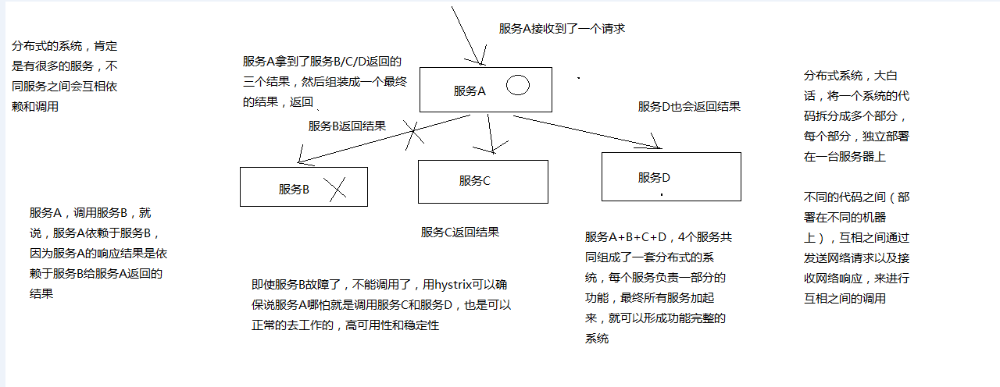
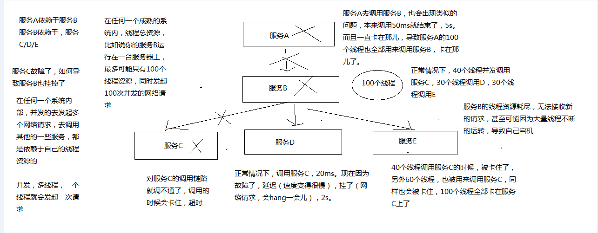
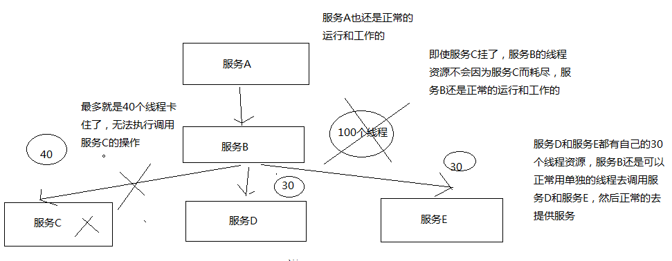

<!-- TOC -->

- [1、简介](#1简介)
- [02_hystrix与高可用系统架构：资源隔离+限流+熔断+降级+运维监控](#02_hystrix与高可用系统架构资源隔离限流熔断降级运维监控)
    - [1、hystrix是什么？](#1hystrix是什么)
    - [2、高可用系统架构](#2高可用系统架构)
    - [3、如何讲解这块内容？](#3如何讲解这块内容)
- [03_hystrix要解决的分布式系统可用性问题以及其设计原则](#03_hystrix要解决的分布式系统可用性问题以及其设计原则)
    - [1、Hystrix是什么？](#1hystrix是什么)
    - [2、Hystrix的历史](#2hystrix的历史)
    - [3、初步看一看Hystrix的设计原则是什么？](#3初步看一看hystrix的设计原则是什么)
    - [4、Hystrix要解决的问题是什么？](#4hystrix要解决的问题是什么)
    - [5、再看Hystrix的更加细节的设计原则是什么？](#5再看hystrix的更加细节的设计原则是什么)
    - [6、Hystrix是如何实现它的目标的？](#6hystrix是如何实现它的目标的)

<!-- /TOC -->

# 1、简介

就是现在，一般来说，互联网的面试，一般都会考察你，什么是分布式系统，高并发，简单的高可用问题。限流、熔断、降级，在分布式的系统架构中，微服务架构中，其实都是最常见、基础和简单的保障系统高可用的手法。dubbo去开发了，spring cloud去开发了，在这个系统的接口调用中，我们是用hystrix去实现一整套的高可用保障机制，基于hystrix去做了限流、熔断和降级。

hystrix是国外的netflix开源的，netflix是国外很大的视频网站，系统非常复杂，微服务架构，多达几千个服务，为自己的场景，经过大量的工业验证，线上生产环境的实践，产出和开源了高可用相关的一个框架，熔断框架，hystrix。

如何用hystrix做限流、熔断和降级。以及这些都是什么鬼？如何使用hystrix来在你的系统中做开发，加入高可用的保障机制？我之前有一个课程都已经讲解过一整套了，hystrix从入门到精通，全程有动手代码实战开发的。

hystrix未来会成为国内的高可用的限流、熔断和降级这一块的事实上的标准，spring cloud微服务框架，就是集成了hystrix来做微服务架构中的限流、降级和熔断的。

- 3.1 如何设计一个高可用系统？

- 3.2 限流
（1）如何限流？在工作中是怎么做的？说一下具体的实现？

- 3.3 熔断
（1）如何进行熔断？熔断框架都有哪些？具体实现原理知道吗？

- 3.4 降级
（1）如何进行降级？

# 02_hystrix与高可用系统架构：资源隔离+限流+熔断+降级+运维监控

前半部分，专注在高并发这一块，缓存架构，承载高并发，在各种高并发导致的令人崩溃/异常的场景下，运行着

缓存架构，高可用性，在各种系统的各个地方有乱七八糟的异常和故障的情况下，整套缓存系统还能继续健康的run着

HA，HAProxy，主备服务间的切换，这就做到了高可用性，主备实例，多冗余实例，高可用最最基础的东西

什么样的情况下，可能会导致系统的崩溃，以及系统不可用，针对各种各样的一些情况，然后我们用什么技术，去保护整个系统处于高可用的一个情况下

## 1、hystrix是什么？

netflix（国外最大的类似于，爱奇艺，优酷）视频网站，五六年前，也是，感觉自己的系统，整个网站，经常出故障，可用性不太高

有时候一些vip会员不能支付，有时候看视频就卡顿，看不了视频。。。

影响公司的收入。。。

五六年前，netflix，api team，提升高可用性，开发了一个框架，类似于spring，mybatis，hibernate，等等这种框架

高可用性的框架，hystrix

hystrix，框架，提供了高可用相关的各种各样的功能，然后确保说在hystrix的保护下，整个系统可以长期处于高可用的状态，100%，99.99999%

最理想的状况下，软件的故障，就不应该说导致整个系统的崩溃，服务器硬件的一些故障，服务的冗余

唯一有可能导致系统彻底崩溃，就是类似于之前，支付宝的那个事故，工人施工，挖断了电缆，导致几个机房都停电

不可用，和产生一些故障或者bug的区别

## 2、高可用系统架构

资源隔离、限流、熔断、降级、运维监控

资源隔离：让你的系统里，某一块东西，在故障的情况下，不会耗尽系统所有的资源，比如线程资源

我实际的项目中的一个case，有一块东西，是要用多线程做一些事情，小伙伴做项目的时候，没有太留神，资源隔离，那块代码，在遇到一些故障的情况下，每个线程在跑的时候，因为那个bug，直接就死循环了，导致那块东西启动了大量的线程，每个线程都死循环

最终导致我的系统资源耗尽，崩溃，不工作，不可用，废掉了

资源隔离，那一块代码，最多最多就是用掉10个线程，不能再多了，就废掉了，限定好的一些资源

限流：高并发的流量涌入进来，比如说突然间一秒钟100万QPS，废掉了，10万QPS进入系统，其他90万QPS被拒绝了

熔断：系统后端的一些依赖，出了一些故障，比如说mysql挂掉了，每次请求都是报错的，熔断了，后续的请求过来直接不接收了，拒绝访问，10分钟之后再尝试去看看mysql恢复没有

降级：mysql挂了，系统发现了，自动降级，从内存里存的少量数据中，去提取一些数据出来

运维监控：监控+报警+优化，各种异常的情况，有问题就及时报警，优化一些系统的配置和参数，或者代码

## 3、如何讲解这块内容？

- （1）如何将eshop-cache，核心的缓存服务改造成高可用的架构

- （2）hystrix中的一部分内容，单拉出来，做成一个免费的小课程，作为福利发放出去

- （3）eshop-cache，写代码，eshop-cache-ha，业务场景，跟之前衔接起来，重新去写代码

- （4）hystrix做服务高可用这一块的内容，讲解成只有一个业务背景，重新写代码，独立

eshop-cache，在各级缓存数据都失效的情况下，会重新从源系统中调用接口，依赖源系统去查询mysql数据库去重新获取数据

如果你的各种依赖的服务有了故障，那么很可能会导致你的系统不可用

hystrix对系统进行各种高可用性的系统加固，来应对各种不可用的情况

缓存雪崩那一块去讲解，redis肯定挂，mysql有较大概率挂掉，在风雨飘摇中

我之前做的一个项目，我们多个项目都用了公司里公用的缓存的存储，缓存彻底挂了，雪崩了，导致各种业务系统全部崩溃，崩溃了好几个小时

导致公司损失了大量的资金的损失

其中导致公司损失最大的负责人，受到了很大的处分

# 03_hystrix要解决的分布式系统可用性问题以及其设计原则

高可用性这个topic，然后咱们会用几讲的时间来讲解一下如何用hystrix，来构建高可用的服务的架构

咱们会用一个真实的项目背景，作为业务场景，来带出来在这个特定的业务场景下，可能会产生哪些各种各样的可用性的一些问题

针对这些问题，我们用hystrix的解决方案和原理是什么

带着大家，纯手工将所有的服务的高可用架构的代码，全部纯手工自己敲出来

形成高可用服务架构的项目实战的一个课程

## 1、Hystrix是什么？

在分布式系统中，每个服务都可能会调用很多其他服务，被调用的那些服务就是依赖服务，有的时候某些依赖服务出现故障也是很正常的。

Hystrix可以让我们在分布式系统中对服务间的调用进行控制，加入一些调用延迟或者依赖故障的容错机制。

Hystrix通过将依赖服务进行资源隔离，进而组织某个依赖服务出现故障的时候，这种故障在整个系统所有的依赖服务调用中进行蔓延，同时Hystrix还提供故障时的fallback降级机制

总而言之，Hystrix通过这些方法帮助我们提升分布式系统的可用性和稳定性

## 2、Hystrix的历史

hystrix，就是一种高可用保障的一个框架，类似于spring（ioc，mvc），mybatis，activiti，lucene，框架，预先封装好的为了解决某个特定领域的特定问题的一套代码库

框架，用了框架之后，来解决这个领域的特定的问题，就可以大大减少我们的工作量，提升我们的工作质量和工作效率，框架

hystrix，高可用性保障的一个框架

Netflix（可以认为是国外的优酷或者爱奇艺之类的视频网站），API团队从2011年开始做一些提升系统可用性和稳定性的工作，Hystrix就是从那时候开始发展出来的。

在2012年的时候，Hystrix就变得比较成熟和稳定了，Netflix中，除了API团队以外，很多其他的团队都开始使用Hystrix。

时至今日，Netflix中每天都有数十亿次的服务间调用，通过Hystrix框架在进行，而Hystrix也帮助Netflix网站提升了整体的可用性和稳定性

## 3、初步看一看Hystrix的设计原则是什么？

hystrix为了实现高可用性的架构，设计hystrix的时候，一些设计原则是什么？？？

（1）对依赖服务调用时出现的调用延迟和调用失败进行控制和容错保护

（2）在复杂的分布式系统中，阻止某一个依赖服务的故障在整个系统中蔓延，服务A->服务B->服务C，服务C故障了，服务B也故障了，服务A故障了，整套分布式系统全部故障，整体宕机

（3）提供fail-fast（快速失败）和快速恢复的支持

（4）提供fallback优雅降级的支持

（5）支持近实时的监控、报警以及运维操作

- 调用延迟+失败，提供容错
- 阻止故障蔓延
- 快速失败+快速恢复
- 降级
- 监控+报警+运维

完全描述了hystrix的功能，提供整个分布式系统的高可用的架构

## 4、Hystrix要解决的问题是什么？

在复杂的分布式系统架构中，每个服务都有很多的依赖服务，而每个依赖服务都可能会故障

如果服务没有和自己的依赖服务进行隔离，那么可能某一个依赖服务的故障就会拖垮当前这个服务

举例来说，某个服务有30个依赖服务，每个依赖服务的可用性非常高，已经达到了99.99%的高可用性

那么该服务的可用性就是99.99%的30次方，也就是99.7%的可用性

99.7%的可用性就意味着3%的请求可能会失败，因为3%的时间内系统可能出现了故障不可用了

对于1亿次访问来说，3%的请求失败，也就意味着300万次请求会失败，也意味着每个月有2个小时的时间系统是不可用的

在真实生产环境中，可能更加糟糕

上面也就是说，即使你每个依赖服务都是99.99%高可用性，但是一旦你有几十个依赖服务，还是会导致你每个月都有几个小时是不可用的

画图分析说，当某一个依赖服务出现了调用延迟或者调用失败时，为什么会拖垮当前这个服务？以及在分布式系统中，故障是如何快速蔓延的？

## 5、再看Hystrix的更加细节的设计原则是什么？

（1）阻止任何一个依赖服务耗尽所有的资源，比如tomcat中的所有线程资源

（2）避免请求排队和积压，采用限流和fail fast来控制故障

（3）提供fallback降级机制来应对故障

（4）使用资源隔离技术，比如bulkhead（舱壁隔离技术），swimlane（泳道技术），circuit breaker（短路技术），来限制任何一个依赖服务的故障的影响

（5）通过近实时的统计/监控/报警功能，来提高故障发现的速度

（6）通过近实时的属性和配置热修改功能，来提高故障处理和恢复的速度

（7）保护依赖服务调用的所有故障情况，而不仅仅只是网络故障情况

调用这个依赖服务的时候，client调用包有bug，阻塞，等等，依赖服务的各种各样的调用的故障，都可以处理

## 6、Hystrix是如何实现它的目标的？

（1）通过HystrixCommand或者HystrixObservableCommand来封装对外部依赖的访问请求，这个访问请求一般会运行在独立的线程中，资源隔离

（2）对于超出我们设定阈值的服务调用，直接进行超时，不允许其耗费过长时间阻塞住。这个超时时间默认是99.5%的访问时间，但是一般我们可以自己设置一下

（3）为每一个依赖服务维护一个独立的线程池，或者是semaphore，当线程池已满时，直接拒绝对这个服务的调用

（4）对依赖服务的调用的成功次数，失败次数，拒绝次数，超时次数，进行统计

（5）如果对一个依赖服务的调用失败次数超过了一定的阈值，自动进行熔断，在一定时间内对该服务的调用直接降级，一段时间后再自动尝试恢复

（6）当一个服务调用出现失败，被拒绝，超时，短路等异常情况时，自动调用fallback降级机制

（7）对属性和配置的修改提供近实时的支持

画图分析，对依赖进行资源隔离后，如何避免依赖服务调用延迟或失败导致当前服务的故障