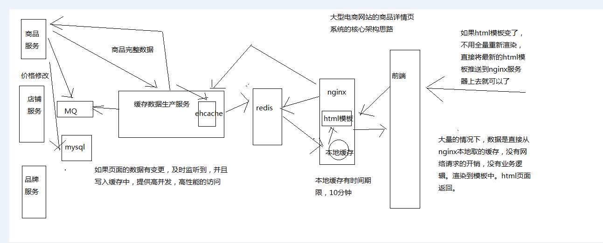

<!-- TOC -->

- [01_课程介绍以及高并发高可用复杂系统中的缓存架构有哪些东西？](#01_课程介绍以及高并发高可用复杂系统中的缓存架构有哪些东西)
- [02_基于大型电商网站中的商品详情页系统贯穿的授课思路介绍](#02_基于大型电商网站中的商品详情页系统贯穿的授课思路介绍)
- [03_小型电商网站的商品详情页的页面静态化架构以及其缺陷](#03_小型电商网站的商品详情页的页面静态化架构以及其缺陷)
- [04_大型电商网站的异步多级缓存构建+nginx数据本地化动态渲染的架构](#04_大型电商网站的异步多级缓存构建nginx数据本地化动态渲染的架构)
- [05_能够支撑高并发+高可用+海量数据+备份恢复的redis的重要性](#05_能够支撑高并发高可用海量数据备份恢复的redis的重要性)
- [06.从零开始在虚拟机中一步一步搭建一个4个节点的CentOS集群](#06从零开始在虚拟机中一步一步搭建一个4个节点的centos集群)

<!-- /TOC -->

# 01_课程介绍以及高并发高可用复杂系统中的缓存架构有哪些东西？


第一讲，简单来跟大家说一下，4块

> 1、现在常见的java工程师/架构师对缓存技术的了解和掌握程度

我常年在一些国内最大的那些互联网公司里吧，负责招人，java这块，我们也会招，各种各样的人，我都见过

大型的互联网公司的人，传统行业的一些人，初级的人，高阶的架构师，高级工程师，技术经理，技术总监，带几十个人

缓存技术，复杂的场景的时候，很复杂的缓存架构

工作中都会用到一些缓存技术，redis/memcached基础使用，初步的集群知识

我面试过的人里，能掌握到很少的缓存架构的人，屈指可数，个位数，而且都是在大公司有过类似的大型复杂系统架构经验的人

> 2、缓存架构/技术掌握的不够，对你的发展带来了哪些阻碍？

工作中

如果你这块技术掌握不够，然后你的公司的项目遇到了一些相关的难题，高并发+高性能的场景，hold不住类似的这种高并发的系统

因为缓存架构做得不好，不到位，实际在公司的项目里，出了一些大case，导致系统崩溃，巨大的经济损失

职业发展中

redis，memcached，activemq，zookeeper，kafka，lucene，activiti，爬虫，或者等等，各种技术，写了都几十种技术

没有一样是精通的，redis就会简单的操作，memcached操作，activemq，zookeeper，爬虫，全都是简单的操作

架构设计思路，有没有一些考量的点，高并发的中场景，高可用的场景，说不出来

不可能做到更高级的一个职位了，因为很多公司的人也不傻，技术一看就平平庸庸，怎么给你一个很好的职位呢？职业发展怎么做上去呢？

亮点，技术亮点，高人一筹

java高工，java资深工，java架构，技术亮点，造诣

如果你的技术很牛，各种技术都有深度，架构面临过一些复杂的场景，别人搞不定的高并发高可用的系统架构，你都能搞定，职业发展就会做的很好

> 3、课程的一个简单的介绍

亿级流量电商网站的商品详情页系统，项目实战，业务背景，简化，贯穿起来，学习到亿级流量的电商网站，商品详情页的整体架构设计，学到的

复杂的缓存架构：才是我们最真实要讲解的东西，支撑高并发，高可用

缓存架构过程中：我们会讲解各种高并发场景下的各种难题，怎么去解决这些难题，缓存架构的过程，各种技术和解决方案，高可用性，解决缓存架构中面临的一些高可用的问题，包括怎么去解决，技术，解决方案

亿级流量电商网站的商品详情页系统，架构讲解，学到，作为项目背景贯穿，项目实战；缓存架构，支撑高并发，高可用的系统架构；缓存架构观察的过程中，高并发以及高可用相关的各种技术点和知识点，解决方案，串在一起，讲解了


这套课程，学到很多的全网独家的技术

大型电商网站的商品详情页系统的架构

复杂的缓存架构

如何用复杂的缓存架构去支撑高并发

利用将缓存架构做成高可用机会，也可以学到高可用系统架构构建的技术

> 4、真正能支撑高并发以及高可用的复杂系统中的缓存架构有哪些东西？

（1）如何让redis集群支撑几十万QPS高并发+99.99%高可用+TB级海量数据+企业级数据备份与恢复？：redis企业级集群架构

（2）如何支撑高性能以及高并发到极致？同时给缓存架构最后的安全保护层？：(nginx+lua)+redis+ehcache的三级缓存架构

（3）高并发场景下，如何解决数据库与缓存双写的时候数据不一致的情况？：企业级的完美的数据库+缓存双写一致性解决方案

（4）如何解决大value缓存的全量更新效率低下问题？：缓存维度化拆分解决方案

（5）如何将缓存命中率提升到极致？：双层nginx部署架构，以及lua脚本实现的一致性hash流量分发策略

（6）如何解决高并发场景下，缓存重建时的分布式并发重建的冲突问题？：基于zookeeper分布式锁的缓存并发重建解决方案

（7）如何解决高并发场景下，缓存冷启动MySQL瞬间被打死的问题？：基于storm实时统计热数据的分布式快速缓存预热解决方案

（8）如何解决热点缓存导致单机器负载瞬间超高？：基于storm的实时热点发现，以及毫秒级的实时热点缓存负载均衡降级

（9）如何解决分布式系统中的服务高可用问题？避免多层服务依赖因为少量故障导致系统崩溃？：基于hystrix的高可用缓存服务，资源隔离+限流+降级+熔断+超时控制

（10）如何应用分布式系统中的高可用服务的高阶技术？：基于hystrix的容错+多级降级+手动降级+生产环境参数优化经验+可视化运维与监控

（11）如何解决恐怖的缓存雪崩问题？避免给公司带来巨大的经济损失？：独家的事前+事中+事后三层次完美解决方案

（12）如何解决高并发场景下的缓存穿透问题？避免给MySQL带来过大的压力？：缓存穿透解决方案

（13）如何解决高并发场景下的缓存失效问题？避免给redis集群带来过大的压力？：缓存失效解决方案

> 5、学会了这套课程，能给你带来些什么？工作中以及职业发展中？

工作中：如果你遇到了类似的缓存架构的一些问题，你可以立刻将学到的东西结合你的项目业务融入到架构中去；系统架构重构，抵抗各种更加复杂的场景的架构

职业发展中：缓存，redis，复杂的缓存架构，解决的复杂场景，技术亮点，青睐，拿到更好的职位

java架构师，学完这套课程行不行？绝对不行

java架构师必备的一项架构技能，缓存架构，高并发（缓存架构，异步队列架构，复杂的分库分表），高可用架构（hystrix分布式系统服务的高可用），微服务的架构

让你积累了成长为java架构师过程中，必备的一项缓存架构的技能

> 5、笔记编辑器

sublime


# 02_基于大型电商网站中的商品详情页系统贯穿的授课思路介绍


我授课的一个思路，龙果另外两个课程，es的快速入门+es高手进阶

讲解一个技术，一个课程，就是纯讲技术，按照一个一个的技术点去讲解

决定拿一个从真实的系统中抽离出来的，简化过后的一个项目，去贯穿整个课程

项目去讲解，提供了连续而且仿真的一个业务场景

各种各样的业务场景，以及在业务场景中面临的难题和问题，去学习一个又一个的技术或者解决方案，或者架构设计思想

亿级流量电商网站的商品详情页系统

最最核心的架构就是缓存架构，商品详情页系统整体有自己整体的架构

一步一步的去实现商品详情页系统中的一些核心的部分，涉及到最最主要的就是缓存架构，高并发

缓存架构，一步一步讲解各种各样支撑高并发场景的缓存技术，解决方案，架构设计

如何将缓存架构本身做成高可用的架构，缓存架构本身面临的可用性的问题

基于hystrix去讲解，缓存架构本身做成高可用的，高可用架构的设计以及相关的技术

商品详情页系统架构 -> 缓存架构 -> 高并发技术+解决方案+架构 -> 高可用技术+解决方案+架构


# 03_小型电商网站的商品详情页的页面静态化架构以及其缺陷


商品详情页的系统架构 -> 缓存架构 -> 高并发 -> 高可用

电商网站里，大概可以说分成两种，第一种小型电商，简单的一种架构方案，页面静态化的方案；大型电商，复杂的一套架构，大电商，国内排名前几的电商，用得应该咱们这里讲解的这套大型的详情页架构

页面静态化，全量的页面静态化

```html
<html>
	<title></title>
	<body>
		商品名称：#{productName}
		商品价格：#{productPrice}
		商品描述：#{productDesc}
	</body>
</html>

->

<html>
	<title>
		<style css>
		<javascript>
	</title>
	<body>
		商品名称：#{productName}
		商品价格：#{productPrice}
		商品描述：#{productDesc}
	</body>
</html>

```


product1.html


假设是放在一个数据库里的

product表

product_name		product_price		product_desc

iphon7 plus			5599.50				这是最好的手机

->

iphon7 plus（玫瑰）	5299.50				这是最好的手机，大降价了

......1万行数据，1万个页面

模板的渲染


```xml
<html>
	<title>
		<style css>
		<javascript>
	</title>
	<body>
		商品名称：iphon7 plus（玫瑰）
		商品价格：5299.50	
		商品描述：这是最好的手机，大降价了
	</body>
</html>
```

iphone7_plus.html


如果模板改变了，那么这个模板对应的所有数据，1万个数据，全部重新渲染一遍，填充到模板中，生成最终的静态化html页面


对于小网站，页面很少，很实用，非常简单，模板引擎，velocity，freemarker，页面数据管理的cms系统，内容管理系统

点击一个按钮，做成系统自动化，重新全量渲染

html --> 几百个页面，推送到nginx服务器上面，直接走html


页面太多，上亿，一个模板修改了，重新渲染一亿的商品，靠谱，几天


# 04_大型电商网站的异步多级缓存构建+nginx数据本地化动态渲染的架构

模板，可能所有的页面要重新渲染，很坑，大网站




# 05_能够支撑高并发+高可用+海量数据+备份恢复的redis的重要性


一块儿一块儿的去讲解，商品详情页的架构实现

缓存架构

第一块儿，要掌握的很好的，就是redis架构

高并发，高可用，海量数据，备份，随时可以恢复，缓存架构如果要支撑这些要点，首先呢，redis就得支撑

redis架构，每秒钟几十万的访问量QPS，99.99%的高可用性，TB级的海量的数据，备份和恢复，缓存架构就成功了一半了

最最简单的模式，无非就是存取redis，存数据，取数据

支撑你的缓存架构，最基础的就是redis架构

解决各种各样高并发场景下的缓存面临的难题，缓存架构中不断的引入各种解决方案和技术，解决高并发的问题

解决各种各样缓存架构本身面临的高可用的问题，缓存架构中引入各种解决方案和技术，解决高可用的问题

# 06.从零开始在虚拟机中一步一步搭建一个4个节点的CentOS集群


课程大纲

1、在虚拟机中安装CentOS

2、在每个CentOS中都安装Java和Perl

3、在4个虚拟机中安装CentOS集群

4、配置4台CentOS为ssh免密码互相通信

从零开始，纯手工，一步一步搭建出一个4个节点的CentOS集群

为我们后面的课程做准备，后面会讲解大型的分布式的redis集群架构，一步一步纯手工搭建redis集群，集群部署，主从架构，分布式集群架构

我们后面的课程，会讲解一些实时计算技术的应用，包括storm，讲解一下storm的基础知识，对于java工程师来说，会用就可以了，用一些storm最基本的分布式实时计算的feature就ok了，搭建一个storm的集群

部署我们整套的系统，nginx，tomcat+java web应用，mysql

尽量以真实的网络拓扑的环境，去给大家演示一下整套系统的部署，不要所有东西，redis集群+storm集群+nginx+tomcat+mysql，全部放在一个节点上玩儿，也可以去试一试，但是作为课程来说，效果不是太理想

redis集群，独立的一套机器

storm集群，独立的一套机器

nginx，独立部署

tomcat + java web应用，独立部署

mysql，独立部署

十几个机器，去部署整套系统，我在自己的笔记本电脑上来讲课的，这么玩儿撑不住的

i5，12G

4台虚拟机，每台虚拟机是1G的内存，电脑基本还能撑住

电脑本身就6个G内存的话，学习这种大型的系统架构的课程，是有点吃力，给大家建议，几个G的内存条，也就几百块钱，给自己最好加个内存条，至少到8G以上

16G凑合

纯手工，从零开始

很多视频课程，里面讲师都是现成的虚拟机，自己都装好了，包括各种必要的软件

讲课的时候直接基于自己的虚拟机就开始讲解了

很多同学就会发现，想要做到跟讲师一样的环境都很难，自己可能照着样子装了个环境，但是发现，各种问题，各种报错，环境起不来

学习课程的过程很艰难

学视频课程，肯定是要跟着视频的所有的东西自己去做一做，练一练，结果你却因为环境问题，做不了，连不了，那就太惨了

从centos的镜像文件，到所有的需要使用的软件，全都给你，在自己电脑上，下载一个虚拟机管理软件，virtual box，就可以跟着玩儿了

如果你一步一步跟着视频做，搭建起整个环境，应该问题不大

环境问题，给大家弄成傻瓜式的

------------------------------------------------------------------------------------------

1、在虚拟机中安装CentOS

启动一个virtual box虚拟机管理软件（vmware，我早些年，发现不太稳定，主要是当时搭建一个hadoop大数据的集群，发现每次休眠以后再重启，集群就挂掉了）

virtual box，发现很稳定，集群从来不会随便乱挂，所以就一直用virtual box了

（1）使用课程提供的CentOS 6.5镜像即可，CentOS-6.5-i386-minimal.iso。

（2）创建虚拟机：打开Virtual Box，点击“新建”按钮，点击“下一步”，输入虚拟机名称为eshop-cache01，选择操作系统为Linux，选择版本为Red Hat，分配1024MB内存，后面的选项全部用默认，在Virtual Disk File location and size中，一定要自己选择一个目录来存放虚拟机文件，最后点击“create”按钮，开始创建虚拟机。

（3）设置虚拟机网卡：选择创建好的虚拟机，点击“设置”按钮，在网络一栏中，连接方式中，选择“Bridged Adapter”。

（4）安装虚拟机中的CentOS 6.5操作系统：选择创建好的虚拟机，点击“开始”按钮，选择安装介质（即本地的CentOS 6.5镜像文件），选择第一项开始安装-Skip-欢迎界面Next-选择默认语言-Baisc Storage Devices-Yes, discard any data-主机名:spark2upgrade01-选择时区-设置初始密码为hadoop-Replace Existing Linux System-Write changes to disk-CentOS 6.5自己开始安装。

（5）安装完以后，CentOS会提醒你要重启一下，就是reboot，你就reboot就可以了。

（6）配置网络

vi /etc/sysconfig/network-scripts/ifcfg-eth0

```
DEVICE=eth0
TYPE=Ethernet
ONBOOT=yes
BOOTPROTO=dhcp
service network restart
ifconfig

BOOTPROTO=static
IPADDR=192.168.0.X
NETMASK=255.255.255.0
GATEWAY=192.168.0.1
service network restart
```


（7）配置hosts

vi /etc/hosts
配置本机的hostname到ip地址的映射

（8）配置SecureCRT

此时就可以使用SecureCRT从本机连接到虚拟机进行操作了

一般来说，虚拟机管理软件，virtual box，可以用来创建和管理虚拟机，但是一般不会直接在virtualbox里面去操作，因为比较麻烦，没有办法复制粘贴

比如后面我们要安装很多其他的一些东西，perl，java，redis，storm，复制一些命令直接去执行

SecureCRT，在windows宿主机中，去连接virtual box中的虚拟机

收费的，我这里有完美破解版，跟着课程一起给大家，破解

（9）关闭防火墙

service iptables stop

service ip6tables stop

chkconfig iptables off

chkconfig ip6tables off

vi /etc/selinux/config

SELINUX=disabled

关闭windows的防火墙

后面要搭建集群，有的大数据技术的集群之间，在本地你给了防火墙的话，可能会没有办法互相连接，会导致搭建失败

（10）配置yum

yum clean all

yum makecache

yum install wget

------------------------------------------------------------------------------------------

2、在每个CentOS中都安装Java和Perl

WinSCP，就是在windows宿主机和linux虚拟机之间互相传递文件的一个工具

（1）安装JDK

1、将jdk-7u60-linux-i586.rpm通过WinSCP上传到虚拟机中

2、安装JDK：rpm -ivh jdk-7u65-linux-i586.rpm

3、配置jdk相关的环境变量

vi .bashrc
export JAVA_HOME=/usr/java/latest
export PATH=$PATH:$JAVA_HOME/bin
source .bashrc

4、测试jdk安装是否成功：java -version

（2）安装Perl

很多讲师，拿着自己之前花了很多时间调试好的虚拟机环境，去讲课，这个很不负责任

yum install -y gcc

wget http://www.cpan.org/src/5.0/perl-5.16.1.tar.gz
tar -xzf perl-5.16.1.tar.gz
cd perl-5.16.1
./Configure -des -Dprefix=/usr/local/perl
make && make test && make install
perl -v

为什么要装perl？我们整个大型电商网站的详情页系统，复杂。java+nginx+lua，需要perl。

perl，是一个基础的编程语言的安装，tomcat，跑java web应用

------------------------------------------------------------------------------------------

3、在4个虚拟机中安装CentOS集群

（1）按照上述步骤，再安装三台一模一样环境的linux机器

（2）另外三台机器的hostname分别设置为eshop-cache02，eshop-cache03，eshop-cache04

（3）安装好之后，在每台机器的hosts文件里面，配置好所有的机器的ip地址到hostname的映射关系

比如说，在eshop-cache01的hosts里面

192.168.31.187 eshop-cache01

192.168.31.xxx eshop-cache02

192.168.31.xxx eshop-cache03

192.168.31.xxx eshop-cache04

------------------------------------------------------------------------------------------

4、配置4台CentOS为ssh免密码互相通信

（1）首先在三台机器上配置对本机的ssh免密码登录
ssh-keygen -t rsa
生成本机的公钥，过程中不断敲回车即可，ssh-keygen命令默认会将公钥放在/root/.ssh目录下
cd /root/.ssh
cp id_rsa.pub authorized_keys
将公钥复制为authorized_keys文件，此时使用ssh连接本机就不需要输入密码了

（2）接着配置三台机器互相之间的ssh免密码登录
使用ssh-copy-id -i hostname命令将本机的公钥拷贝到指定机器的authorized_keys文件中

java，在公司里做项目，有几个人是自己去维护linux集群的啊？？？？？

几乎没有，很少很少，类似这一讲要做的事情，其实都是SRE，运维的同学，去做的

但是对于课程来说，我们只能自己一步一步做，才有环境去学习啊！！！

------------------------------------------------------------------------------------------

基于虚拟机的linux集群环境，都准备好了，手上有4台机器，后面玩儿各种redis、kafka、storm、tomcat、nginx，都有机器了

