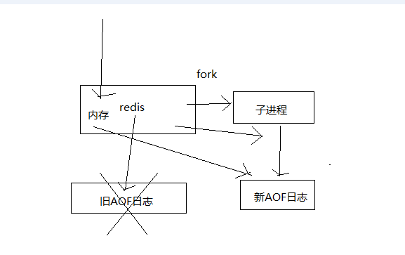
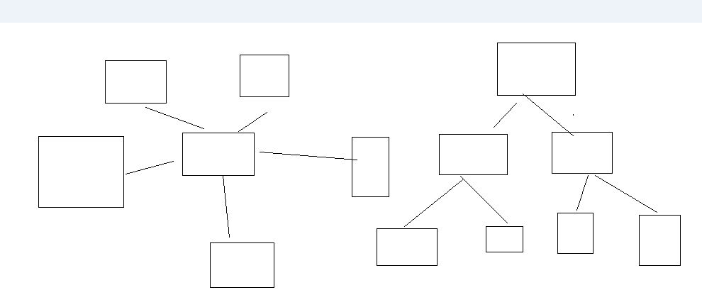

<!-- TOC -->

- [08.redis持久化机对于生产环境中的灾难恢复的意义](#08redis持久化机对于生产环境中的灾难恢复的意义)
- [09.图解分析redis的RDB和AOF两种持久化机制的工作原理](#09图解分析redis的rdb和aof两种持久化机制的工作原理)
- [10.redis的RDB和AOF两种持久化机制的优劣势对比](#10redis的rdb和aof两种持久化机制的优劣势对比)
- [11.redis的RDB持久化配置以及数据恢复实验](#11redis的rdb持久化配置以及数据恢复实验)
- [12_redis的AOF持久化深入讲解各种操作和相关实验](#12_redis的aof持久化深入讲解各种操作和相关实验)
- [13_在项目中部署redis企业级数据备份方案以及各种踩坑的数据恢复容灾演练](#13_在项目中部署redis企业级数据备份方案以及各种踩坑的数据恢复容灾演练)
- [14_redis如何通过读写分离来承载读请求QPS超过10万+？](#14_redis如何通过读写分离来承载读请求qps超过10万)
- [15_redis replication以及master持久化对主从架构的安全意义](#15_redis-replication以及master持久化对主从架构的安全意义)
- [16_redis主从复制原理、断点续传、无磁盘化复制、过期key处理](#16_redis主从复制原理断点续传无磁盘化复制过期key处理)
- [17_redis replication的完整流运行程和原理的再次深入剖析](#17_redis-replication的完整流运行程和原理的再次深入剖析)
- [18_在项目中部署redis的读写分离架构-包含节点间认证口令](#18_在项目中部署redis的读写分离架构-包含节点间认证口令)
- [19_对项目的主从redis架构进行QPS压测以及水平扩容支撑更高QPS](#19_对项目的主从redis架构进行qps压测以及水平扩容支撑更高qps)
- [20_redis主从架构下如何才能做到百分之99.99的高可用性](#20_redis主从架构下如何才能做到百分之9999的高可用性)
- [21_redis哨兵架构的相关基础知识的讲解](#21_redis哨兵架构的相关基础知识的讲解)
- [22_redis哨兵主备切换的数据丢失问题：异步复制、集群脑裂](#22_redis哨兵主备切换的数据丢失问题异步复制集群脑裂)
- [23_redis哨兵的多个核心底层原理的深入解析（包含slave选举算法）](#23_redis哨兵的多个核心底层原理的深入解析包含slave选举算法)
- [24_在项目中以经典的3节点方式部署哨兵集群](#24_在项目中以经典的3节点方式部署哨兵集群)
- [25_对项目中的哨兵节点进行管理以及高可用redis集群的容灾演练](#25_对项目中的哨兵节点进行管理以及高可用redis集群的容灾演练)
- [26_redis如何在保持读写分离+高可用的架构下，还能横向扩容支撑1T+海量数据](#26_redis如何在保持读写分离高可用的架构下还能横向扩容支撑1t海量数据)
- [27_数据分布算法：hash+一致性hash+redis cluster的hash slot](#27_数据分布算法hash一致性hashredis-cluster的hash-slot)
- [28_在项目中重新搭建一套读写分离+高可用+多master的redis cluster集群](#28_在项目中重新搭建一套读写分离高可用多master的redis-cluster集群)
- [29_对项目的redis cluster实验多master写入、读写分离、高可用性](#29_对项目的redis-cluster实验多master写入读写分离高可用性)
- [30_redis cluster通过master水平扩容来支撑更高的读写吞吐+海量数据](#30_redis-cluster通过master水平扩容来支撑更高的读写吞吐海量数据)
- [31_redis cluster的自动化slave迁移实现更强的高可用架构的部署方案](#31_redis-cluster的自动化slave迁移实现更强的高可用架构的部署方案)
- [32_redis cluster的核心原理分析：gossip通信、jedis smart定位、主备切换](#32_redis-cluster的核心原理分析gossip通信jedis-smart定位主备切换)
- [33_redis在实践中的一些常见问题以及优化思路（包含linux内核参数优化）](#33_redis在实践中的一些常见问题以及优化思路包含linux内核参数优化)
- [34_redis阶段性总结：1T以上海量数据+10万以上QPS高并发+99.99百分之高可用](#34_redis阶段性总结1t以上海量数据10万以上qps高并发9999百分之高可用)

<!-- /TOC -->


[搭建redis的高可用集群]


# 08.redis持久化机对于生产环境中的灾难恢复的意义

8到9的内容在下面的链接中，对应02，03、04

[怎么保证挂掉之后再重启数据可以进行恢复](../专题/redis-03-怎么保证挂掉之后再重启数据可以进行恢复.md)

# 09.图解分析redis的RDB和AOF两种持久化机制的工作原理

8到9的内容在下面的链接中，对应02，03、04

[怎么保证挂掉之后再重启数据可以进行恢复](../专题/redis-03-怎么保证挂掉之后再重启数据可以进行恢复.md)

# 10.redis的RDB和AOF两种持久化机制的优劣势对比

8到9的内容在下面的链接中，对应02，03、04

[怎么保证挂掉之后再重启数据可以进行恢复](../专题/redis-03-怎么保证挂掉之后再重启数据可以进行恢复.md)


# 11.redis的RDB持久化配置以及数据恢复实验


课程大纲

1、如何配置RDB持久化机制

2、RDB持久化机制的工作流程

3、基于RDB持久化机制的数据恢复实验

------------------------------------------------------------------------

1、如何配置RDB持久化机制

redis.conf文件，也就是/etc/redis/6379.conf，去配置持久化

save 60 1000

每隔60s，如果有超过1000个key发生了变更，那么就生成一个新的dump.rdb文件，就是当前redis内存中完整的数据快照，这个操作也被称之为snapshotting，快照

也可以手动调用save或者bgsave命令，同步或异步执行rdb快照生成

save可以设置多个，就是多个snapshotting检查点，每到一个检查点，就会去check一下，是否有指定的key数量发生了变更，如果有，就生成一个新的dump.rdb文件

------------------------------------------------------------------------

2、RDB持久化机制的工作流程

（1）redis根据配置自己尝试去生成rdb快照文件
（2）fork一个子进程出来
（3）子进程尝试将数据dump到临时的rdb快照文件中
（4）完成rdb快照文件的生成之后，就替换之前的旧的快照文件

dump.rdb，每次生成一个新的快照，都会覆盖之前的老快照

------------------------------------------------------------------------

3、基于RDB持久化机制的数据恢复实验

（1）在redis中保存几条数据，立即停掉redis进程，然后重启redis，看看刚才插入的数据还在不在

数据还在，为什么？

带出来一个知识点，通过redis-cli SHUTDOWN这种方式去停掉redis，其实是一种安全退出的模式，redis在退出的时候会将内存中的数据立即生成一份完整的rdb快照

/var/redis/6379/dump.rdb

（2）在redis中再保存几条新的数据，用kill -9粗暴杀死redis进程，模拟redis故障异常退出，导致内存数据丢失的场景

这次就发现，redis进程异常被杀掉，数据没有进dump文件，几条最新的数据就丢失了

（2）手动设置一个save检查点，save 5 1
（3）写入几条数据，等待5秒钟，会发现自动进行了一次dump rdb快照，在dump.rdb中发现了数据
（4）异常停掉redis进程，再重新启动redis，看刚才插入的数据还在

rdb的手动配置检查点，以及rdb快照的生成，包括数据的丢失和恢复，全都演示过了


# 12_redis的AOF持久化深入讲解各种操作和相关实验





课程大纲

1、AOF持久化的配置

2、AOF持久化的数据恢复实验

3、AOF rewrite

4、AOF破损文件的修复

5、AOF和RDB同时工作

------------------------------------------------------------------------------

1、AOF持久化的配置

AOF持久化，默认是关闭的，默认是打开RDB持久化

appendonly yes，可以打开AOF持久化机制，在生产环境里面，一般来说AOF都是要打开的，除非你说随便丢个几分钟的数据也无所谓

打开AOF持久化机制之后，redis每次接收到一条写命令，就会写入日志文件中，当然是先写入os cache的，然后每隔一定时间再fsync一下

而且即使AOF和RDB都开启了，redis重启的时候，也是优先通过AOF进行数据恢复的，因为aof数据比较完整

可以配置AOF的fsync策略，有三种策略可以选择，一种是每次写入一条数据就执行一次fsync; 一种是每隔一秒执行一次fsync; 一种是不主动执行fsync

always: 每次写入一条数据，立即将这个数据对应的写日志fsync到磁盘上去，性能非常非常差，吞吐量很低; 确保说redis里的数据一条都不丢，那就只能这样了

mysql -> 内存策略，大量磁盘，QPS到多少，一两k。QPS，每秒钟的请求数量
redis -> 内存，磁盘持久化，QPS到多少，单机，一般来说，上万QPS没问题

everysec: 每秒将os cache中的数据fsync到磁盘，这个最常用的，生产环境一般都这么配置，性能很高，QPS还是可以上万的

no: 仅仅redis负责将数据写入os cache就撒手不管了，然后后面os自己会时不时有自己的策略将数据刷入磁盘，不可控了

------------------------------------------------------------------------------

2、AOF持久化的数据恢复实验

（1）先仅仅打开RDB，写入一些数据，然后kill -9杀掉redis进程，接着重启redis，发现数据没了，因为RDB快照还没生成
（2）打开AOF的开关，启用AOF持久化
（3）写入一些数据，观察AOF文件中的日志内容

其实你在appendonly.aof文件中，可以看到刚写的日志，它们其实就是先写入os cache的，然后1秒后才fsync到磁盘中，只有fsync到磁盘中了，才是安全的，要不然光是在os cache中，机器只要重启，就什么都没了

（4）kill -9杀掉redis进程，重新启动redis进程，发现数据被恢复回来了，就是从AOF文件中恢复回来的

redis进程启动的时候，直接就会从appendonly.aof中加载所有的日志，把内存中的数据恢复回来

------------------------------------------------------------------------------

3、AOF rewrite

redis中的数据其实有限的，很多数据可能会自动过期，可能会被用户删除，可能会被redis用缓存清除的算法清理掉

redis中的数据会不断淘汰掉旧的，就一部分常用的数据会被自动保留在redis内存中

所以可能很多之前的已经被清理掉的数据，对应的写日志还停留在AOF中，AOF日志文件就一个，会不断的膨胀，到很大很大

所以AOF会自动在后台每隔一定时间做rewrite操作，比如日志里已经存放了针对100w数据的写日志了; redis内存只剩下10万; 基于内存中当前的10万数据构建一套最新的日志，到AOF中; 覆盖之前的老日志; 确保AOF日志文件不会过大，保持跟redis内存数据量一致

redis 2.4之前，还需要手动，开发一些脚本，crontab，通过BGREWRITEAOF命令去执行AOF rewrite，但是redis 2.4之后，会自动进行rewrite操作

在redis.conf中，可以配置rewrite策略

auto-aof-rewrite-percentage 100
auto-aof-rewrite-min-size 64mb

比如说上一次AOF rewrite之后，是128mb

然后就会接着128mb继续写AOF的日志，如果发现增长的比例，超过了之前的100%，256mb，就可能会去触发一次rewrite

但是此时还要去跟min-size，64mb去比较，256mb > 64mb，才会去触发rewrite

（1）redis fork一个子进程
（2）子进程基于当前内存中的数据，构建日志，开始往一个新的临时的AOF文件中写入日志
（3）redis主进程，接收到client新的写操作之后，在内存中写入日志，同时新的日志也继续写入旧的AOF文件
（4）子进程写完新的日志文件之后，redis主进程将内存中的新日志再次追加到新的AOF文件中
（5）用新的日志文件替换掉旧的日志文件

------------------------------------------------------------------------------

4、AOF破损文件的修复

如果redis在append数据到AOF文件时，机器宕机了，可能会导致AOF文件破损

用redis-check-aof --fix命令来修复破损的AOF文件

------------------------------------------------------------------------------

5、AOF和RDB同时工作

（1）如果RDB在执行snapshotting操作，那么redis不会执行AOF rewrite; 如果redis再执行AOF rewrite，那么就不会执行RDB snapshotting
（2）如果RDB在执行snapshotting，此时用户执行BGREWRITEAOF命令，那么等RDB快照生成之后，才会去执行AOF rewrite
（3）同时有RDB snapshot文件和AOF日志文件，那么redis重启的时候，会优先使用AOF进行数据恢复，因为其中的日志更完整

------------------------------------------------------------------------------

6、最后一个小实验，让大家对redis的数据恢复有更加深刻的体会

（1）在有rdb的dump和aof的appendonly的同时，rdb里也有部分数据，aof里也有部分数据，这个时候其实会发现，rdb的数据不会恢复到内存中
（2）我们模拟让aof破损，然后fix，有一条数据会被fix删除
（3）再次用fix得aof文件去重启redis，发现数据只剩下一条了

数据恢复完全是依赖于底层的磁盘的持久化的，主要rdb和aof上都没有数据，那就没了


# 13_在项目中部署redis企业级数据备份方案以及各种踩坑的数据恢复容灾演练


到这里为止，其实还是停留在简单学习知识的程度，学会了redis的持久化的原理和操作，但是在企业中，持久化到底是怎么去用得呢？

企业级的数据备份和各种灾难下的数据恢复，是怎么做得呢？

1、企业级的持久化的配置策略

在企业中，RDB的生成策略，用默认的也差不多

save 60 10000：如果你希望尽可能确保说，RDB最多丢1分钟的数据，那么尽量就是每隔1分钟都生成一个快照，低峰期，数据量很少，也没必要

10000->生成RDB，1000->RDB，这个根据你自己的应用和业务的数据量，你自己去决定

AOF一定要打开，fsync，everysec

auto-aof-rewrite-percentage 100: 就是当前AOF大小膨胀到超过上次100%，上次的两倍
auto-aof-rewrite-min-size 64mb: 根据你的数据量来定，16mb，32mb

2、企业级的数据备份方案

RDB非常适合做冷备，每次生成之后，就不会再有修改了

数据备份方案

（1）写crontab定时调度脚本去做数据备份
（2）每小时都copy一份rdb的备份，到一个目录中去，仅仅保留最近48小时的备份
（3）每天都保留一份当日的rdb的备份，到一个目录中去，仅仅保留最近1个月的备份
（4）每次copy备份的时候，都把太旧的备份给删了
（5）每天晚上将当前服务器上所有的数据备份，发送一份到远程的云服务上去

/usr/local/redis

每小时copy一次备份，删除48小时前的数据

crontab -e

0 * * * * sh /usr/local/redis/copy/redis_rdb_copy_hourly.sh

redis_rdb_copy_hourly.sh

!/bin/sh 

cur_date=`date +%Y%m%d%k`
rm -rf /usr/local/redis/snapshotting/$cur_date
mkdir /usr/local/redis/snapshotting/$cur_date
cp /var/redis/6379/dump.rdb /usr/local/redis/snapshotting/$cur_date

del_date=`date -d -48hour +%Y%m%d%k`
rm -rf /usr/local/redis/snapshotting/$del_date

每天copy一次备份

crontab -e

0 0 * * * sh /usr/local/redis/copy/redis_rdb_copy_daily.sh

redis_rdb_copy_daily.sh

!/bin/sh 

cur_date=`date +%Y%m%d`
rm -rf /usr/local/redis/snapshotting/$cur_date
mkdir /usr/local/redis/snapshotting/$cur_date
cp /var/redis/6379/dump.rdb /usr/local/redis/snapshotting/$cur_date

del_date=`date -d -1month +%Y%m%d`
rm -rf /usr/local/redis/snapshotting/$del_date

每天一次将所有数据上传一次到远程的云服务器上去

3、数据恢复方案

（1）如果是redis进程挂掉，那么重启redis进程即可，直接基于AOF日志文件恢复数据

不演示了，在AOF数据恢复那一块，演示了，fsync everysec，最多就丢一秒的数

（2）如果是redis进程所在机器挂掉，那么重启机器后，尝试重启redis进程，尝试直接基于AOF日志文件进行数据恢复

AOF没有破损，也是可以直接基于AOF恢复的

AOF append-only，顺序写入，如果AOF文件破损，那么用redis-check-aof fix

（3）如果redis当前最新的AOF和RDB文件出现了丢失/损坏，那么可以尝试基于该机器上当前的某个最新的RDB数据副本进行数据恢复

当前最新的AOF和RDB文件都出现了丢失/损坏到无法恢复，一般不是机器的故障，人为

大数据系统，hadoop，有人不小心就把hadoop中存储的大量的数据文件对应的目录，rm -rf一下，我朋友的一个小公司，运维不太靠谱，权限也弄的不太好

/var/redis/6379下的文件给删除了

找到RDB最新的一份备份，小时级的备份可以了，小时级的肯定是最新的，copy到redis里面去，就可以恢复到某一个小时的数据

容灾演练

我跟大家解释一下，我其实上课，为什么大量的讲师可能讲课就是纯PPT，或者是各种复制粘贴，都不是现场讲解和写代码演示的

很容易出错，为了避免出错，一般就会那样玩儿

吐槽，念PPT，效果很差

真实的，备课，讲课不可避免，会出现一些问题，但是我觉得还好，真实

appendonly.aof + dump.rdb，优先用appendonly.aof去恢复数据，但是我们发现redis自动生成的appendonly.aof是没有数据的

然后我们自己的dump.rdb是有数据的，但是明显没用我们的数据

redis启动的时候，自动重新基于内存的数据，生成了一份最新的rdb快照，直接用空的数据，覆盖掉了我们有数据的，拷贝过去的那份dump.rdb

你停止redis之后，其实应该先删除appendonly.aof，然后将我们的dump.rdb拷贝过去，然后再重启redis

很简单，就是虽然你删除了appendonly.aof，但是因为打开了aof持久化，redis就一定会优先基于aof去恢复，即使文件不在，那就创建一个新的空的aof文件

停止redis，暂时在配置中关闭aof，然后拷贝一份rdb过来，再重启redis，数据能不能恢复过来，可以恢复过来

脑子一热，再关掉redis，手动修改配置文件，打开aof，再重启redis，数据又没了，空的aof文件，所有数据又没了

在数据安全丢失的情况下，基于rdb冷备，如何完美的恢复数据，同时还保持aof和rdb的双开

停止redis，关闭aof，拷贝rdb备份，重启redis，确认数据恢复，直接在命令行热修改redis配置，打开aof，这个redis就会将内存中的数据对应的日志，写入aof文件中

此时aof和rdb两份数据文件的数据就同步了

redis config set热修改配置参数，可能配置文件中的实际的参数没有被持久化的修改，再次停止redis，手动修改配置文件，打开aof的命令，再次重启redis

（4）如果当前机器上的所有RDB文件全部损坏，那么从远程的云服务上拉取最新的RDB快照回来恢复数据

（5）如果是发现有重大的数据错误，比如某个小时上线的程序一下子将数据全部污染了，数据全错了，那么可以选择某个更早的时间点，对数据进行恢复

举个例子，12点上线了代码，发现代码有bug，导致代码生成的所有的缓存数据，写入redis，全部错了

找到一份11点的rdb的冷备，然后按照上面的步骤，去恢复到11点的数据，不就可以了吗


# 14_redis如何通过读写分离来承载读请求QPS超过10万+？

- 14对02
- 15对03
- 16对04
- 17对05

后面的

- 20对06
- 21对07
- 22对08
- 23对09


- [怎么保证高并发以及高可用的](../专题/redis-02-怎么保证高并发以及高可用的.md)

# 15_redis replication以及master持久化对主从架构的安全意义

- 14对02
- 15对03
- 16对04
- 17对05

后面的

- 20对06
- 21对07
- 22对08
- 23对09


- [怎么保证高并发以及高可用的](../专题/redis-02-怎么保证高并发以及高可用的.md)

# 16_redis主从复制原理、断点续传、无磁盘化复制、过期key处理

- 14对02
- 15对03
- 16对04
- 17对05

后面的

- 20对06
- 21对07
- 22对08
- 23对09


- [怎么保证高并发以及高可用的](../专题/redis-02-怎么保证高并发以及高可用的.md)

# 17_redis replication的完整流运行程和原理的再次深入剖析


- 14对02
- 15对03
- 16对04
- 17对05

后面的

- 20对06
- 21对07
- 22对08
- 23对09


- [怎么保证高并发以及高可用的](../专题/redis-02-怎么保证高并发以及高可用的.md)


# 18_在项目中部署redis的读写分离架构-包含节点间认证口令


之前几讲都是在铺垫各种redis replication的原理，和知识，主从，读写分离，画图

知道了这些东西，关键是怎么搭建呢？？？

一主一从，往主节点去写，在从节点去读，可以读到，主从架构就搭建成功了

1、启用复制，部署slave node

wget http://downloads.sourceforge.net/tcl/tcl8.6.1-src.tar.gz
tar -xzvf tcl8.6.1-src.tar.gz
cd  /usr/local/tcl8.6.1/unix/
./configure  
make && make install

使用redis-3.2.8.tar.gz（截止2017年4月的最新稳定版）
tar -zxvf redis-3.2.8.tar.gz
cd redis-3.2.8
make && make test && make install

（1）redis utils目录下，有个redis_init_script脚本
（2）将redis_init_script脚本拷贝到linux的/etc/init.d目录中，将redis_init_script重命名为redis_6379，6379是我们希望这个redis实例监听的端口号
（3）修改redis_6379脚本的第6行的REDISPORT，设置为相同的端口号（默认就是6379）
（4）创建两个目录：/etc/redis（存放redis的配置文件），/var/redis/6379（存放redis的持久化文件）
（5）修改redis配置文件（默认在根目录下，redis.conf），拷贝到/etc/redis目录中，修改名称为6379.conf

（6）修改redis.conf中的部分配置为生产环境

daemonize	yes							让redis以daemon进程运行
pidfile		/var/run/redis_6379.pid 	设置redis的pid文件位置
port		6379						设置redis的监听端口号
dir 		/var/redis/6379				设置持久化文件的存储位置

（7）让redis跟随系统启动自动启动

在redis_6379脚本中，最上面，加入两行注释

 chkconfig:   2345 90 10

 description:  Redis is a persistent key-value database

chkconfig redis_6379 on

在slave node上配置：slaveof 192.168.1.1 6379，即可

也可以使用slaveof命令

2、强制读写分离

基于主从复制架构，实现读写分离

redis slave node只读，默认开启，slave-read-only

开启了只读的redis slave node，会拒绝所有的写操作，这样可以强制搭建成读写分离的架构

3、集群安全认证

master上启用安全认证，requirepass
master连接口令，masterauth

4、读写分离架构的测试

先启动主节点，eshop-cache01上的redis实例
再启动从节点，eshop-cache02上的redis实例

刚才我调试了一下，redis slave node一直说没法连接到主节点的6379的端口

在搭建生产环境的集群的时候，不要忘记修改一个配置，bind

bind 127.0.0.1 -> 本地的开发调试的模式，就只能127.0.0.1本地才能访问到6379的端口

每个redis.conf中的bind 127.0.0.1 -> bind自己的ip地址
在每个节点上都: iptables -A INPUT -ptcp --dport  6379 -j ACCEPT

redis-cli -h ipaddr
info replication

在主上写，在从上读

# 19_对项目的主从redis架构进行QPS压测以及水平扩容支撑更高QPS


你如果要对自己刚刚搭建好的redis做一个基准的压测，测一下你的redis的性能和QPS（query per second）

redis自己提供的redis-benchmark压测工具，是最快捷最方便的，当然啦，这个工具比较简单，用一些简单的操作和场景去压测

1、对redis读写分离架构进行压测，单实例写QPS+单实例读QPS

```
redis-3.2.8/src

./redis-benchmark -h 192.168.31.187

-c <clients>       Number of parallel connections (default 50)
-n <requests>      Total number of requests (default 100000)
-d <size>          Data size of SET/GET value in bytes (default 2)

```

根据你自己的高峰期的访问量，在高峰期，瞬时最大用户量会达到10万+，-c 100000，-n 10000000，-d 50

各种基准测试，直接出来

1核1G，虚拟机

```

====== PING_INLINE ======
  100000 requests completed in 1.28 seconds
  50 parallel clients
  3 bytes payload
  keep alive: 1

99.78% <= 1 milliseconds
99.93% <= 2 milliseconds
99.97% <= 3 milliseconds
100.00% <= 3 milliseconds
78308.54 requests per second

====== PING_BULK ======
  100000 requests completed in 1.30 seconds
  50 parallel clients
  3 bytes payload
  keep alive: 1

99.87% <= 1 milliseconds
100.00% <= 1 milliseconds
76804.91 requests per second

====== SET ======
  100000 requests completed in 2.50 seconds
  50 parallel clients
  3 bytes payload
  keep alive: 1

5.95% <= 1 milliseconds
99.63% <= 2 milliseconds
99.93% <= 3 milliseconds
99.99% <= 4 milliseconds
100.00% <= 4 milliseconds
40032.03 requests per second

====== GET ======
  100000 requests completed in 1.30 seconds
  50 parallel clients
  3 bytes payload
  keep alive: 1

99.73% <= 1 milliseconds
100.00% <= 2 milliseconds
100.00% <= 2 milliseconds
76628.35 requests per second

====== INCR ======
  100000 requests completed in 1.90 seconds
  50 parallel clients
  3 bytes payload
  keep alive: 1

80.92% <= 1 milliseconds
99.81% <= 2 milliseconds
99.95% <= 3 milliseconds
99.96% <= 4 milliseconds
99.97% <= 5 milliseconds
100.00% <= 6 milliseconds
52548.61 requests per second

====== LPUSH ======
  100000 requests completed in 2.58 seconds
  50 parallel clients
  3 bytes payload
  keep alive: 1

3.76% <= 1 milliseconds
99.61% <= 2 milliseconds
99.93% <= 3 milliseconds
100.00% <= 3 milliseconds
38684.72 requests per second

====== RPUSH ======
  100000 requests completed in 2.47 seconds
  50 parallel clients
  3 bytes payload
  keep alive: 1

6.87% <= 1 milliseconds
99.69% <= 2 milliseconds
99.87% <= 3 milliseconds
99.99% <= 4 milliseconds
100.00% <= 4 milliseconds
40469.45 requests per second

====== LPOP ======
  100000 requests completed in 2.26 seconds
  50 parallel clients
  3 bytes payload
  keep alive: 1

28.39% <= 1 milliseconds
99.83% <= 2 milliseconds
100.00% <= 2 milliseconds
44306.60 requests per second

====== RPOP ======
  100000 requests completed in 2.18 seconds
  50 parallel clients
  3 bytes payload
  keep alive: 1

36.08% <= 1 milliseconds
99.75% <= 2 milliseconds
100.00% <= 2 milliseconds
45871.56 requests per second

====== SADD ======
  100000 requests completed in 1.23 seconds
  50 parallel clients
  3 bytes payload
  keep alive: 1

99.94% <= 1 milliseconds
100.00% <= 2 milliseconds
100.00% <= 2 milliseconds
81168.83 requests per second

====== SPOP ======
  100000 requests completed in 1.28 seconds
  50 parallel clients
  3 bytes payload
  keep alive: 1

99.80% <= 1 milliseconds
99.96% <= 2 milliseconds
99.96% <= 3 milliseconds
99.97% <= 5 milliseconds
100.00% <= 5 milliseconds
78369.91 requests per second

====== LPUSH (needed to benchmark LRANGE) ======
  100000 requests completed in 2.47 seconds
  50 parallel clients
  3 bytes payload
  keep alive: 1

15.29% <= 1 milliseconds
99.64% <= 2 milliseconds
99.94% <= 3 milliseconds
100.00% <= 3 milliseconds
40420.37 requests per second

====== LRANGE_100 (first 100 elements) ======
  100000 requests completed in 3.69 seconds
  50 parallel clients
  3 bytes payload
  keep alive: 1

30.86% <= 1 milliseconds
96.99% <= 2 milliseconds
99.94% <= 3 milliseconds
99.99% <= 4 milliseconds
100.00% <= 4 milliseconds
27085.59 requests per second

====== LRANGE_300 (first 300 elements) ======
  100000 requests completed in 10.22 seconds
  50 parallel clients
  3 bytes payload
  keep alive: 1

0.03% <= 1 milliseconds
5.90% <= 2 milliseconds
90.68% <= 3 milliseconds
95.46% <= 4 milliseconds
97.67% <= 5 milliseconds
99.12% <= 6 milliseconds
99.98% <= 7 milliseconds
100.00% <= 7 milliseconds
9784.74 requests per second

====== LRANGE_500 (first 450 elements) ======
  100000 requests completed in 14.71 seconds
  50 parallel clients
  3 bytes payload
  keep alive: 1

0.00% <= 1 milliseconds
0.07% <= 2 milliseconds
1.59% <= 3 milliseconds
89.26% <= 4 milliseconds
97.90% <= 5 milliseconds
99.24% <= 6 milliseconds
99.73% <= 7 milliseconds
99.89% <= 8 milliseconds
99.96% <= 9 milliseconds
99.99% <= 10 milliseconds
100.00% <= 10 milliseconds
6799.48 requests per second

====== LRANGE_600 (first 600 elements) ======
  100000 requests completed in 18.56 seconds
  50 parallel clients
  3 bytes payload
  keep alive: 1

0.00% <= 2 milliseconds
0.23% <= 3 milliseconds
1.75% <= 4 milliseconds
91.17% <= 5 milliseconds
98.16% <= 6 milliseconds
99.04% <= 7 milliseconds
99.83% <= 8 milliseconds
99.95% <= 9 milliseconds
99.98% <= 10 milliseconds
100.00% <= 10 milliseconds
5387.35 requests per second

====== MSET (10 keys) ======
  100000 requests completed in 4.02 seconds
  50 parallel clients
  3 bytes payload
  keep alive: 1

0.01% <= 1 milliseconds
53.22% <= 2 milliseconds
99.12% <= 3 milliseconds
99.55% <= 4 milliseconds
99.70% <= 5 milliseconds
99.90% <= 6 milliseconds
99.95% <= 7 milliseconds
100.00% <= 8 milliseconds
24869.44 requests per second

```

我们这个读写分离这一块的第一讲

大部分情况下来说，看你的服务器的机器性能和配置，机器越牛逼，配置越高

单机上十几万，单机上二十万

很多公司里，给一些低配置的服务器，操作复杂度

大公司里，都是公司会提供统一的云平台，比如京东、腾讯、BAT、其他的一些、小米、美团

虚拟机，低配

搭建一些集群，专门为某个项目，搭建的专用集群，4核4G内存，比较复杂的操作，数据比较大

几万，单机做到，差不多了

redis提供的高并发，至少到上万，没问题

几万~十几万/二十万不等

QPS，自己不同公司，不同服务器，自己去测试，跟生产环境还有区别

生产环境，大量的网络请求的调用，网络本身就有开销，你的redis的吞吐量就不一定那么高了

QPS的两个杀手：一个是复杂操作，lrange，挺多的; value很大，2 byte，我之前用redis做大规模的缓存

做商品详情页的cache，可能是需要把大串数据，拼接在一起，作为一个json串，大小可能都几k，几个byte

2、水平扩容redis读节点，提升度吞吐量

就按照上一节课讲解的，再在其他服务器上搭建redis从节点，单个从节点读请QPS在5万左右，两个redis从节点，所有的读请求打到两台机器上去，承载整个集群读QPS在10万+


# 20_redis主从架构下如何才能做到百分之99.99的高可用性

- 14对02
- 15对03
- 16对04
- 17对05

后面的

- 20对06
- 21对07
- 22对08
- 23对09


- [怎么保证高并发以及高可用的](../专题/redis-02-怎么保证高并发以及高可用的.md)

# 21_redis哨兵架构的相关基础知识的讲解

- 14对02
- 15对03
- 16对04
- 17对05

后面的

- 20对06
- 21对07
- 22对08
- 23对09


- [怎么保证高并发以及高可用的](../专题/redis-02-怎么保证高并发以及高可用的.md)

# 22_redis哨兵主备切换的数据丢失问题：异步复制、集群脑裂

- 14对02
- 15对03
- 16对04
- 17对05

后面的

- 20对06
- 21对07
- 22对08
- 23对09


- [怎么保证高并发以及高可用的](../专题/redis-02-怎么保证高并发以及高可用的.md)

# 23_redis哨兵的多个核心底层原理的深入解析（包含slave选举算法）


- 14对02
- 15对03
- 16对04
- 17对05

后面的

- 20对06
- 21对07
- 22对08
- 23对09


- [怎么保证高并发以及高可用的](../专题/redis-02-怎么保证高并发以及高可用的.md)

# 24_在项目中以经典的3节点方式部署哨兵集群


动手实操，练习如何操作部署哨兵集群，如何基于哨兵进行故障转移，还有一些企业级的配置方案

1、哨兵的配置文件

sentinel.conf

最小的配置

每一个哨兵都可以去监控多个maser-slaves的主从架构

因为可能你的公司里，为不同的项目，部署了多个master-slaves的redis主从集群

相同的一套哨兵集群，就可以去监控不同的多个redis主从集群

你自己给每个redis主从集群分配一个逻辑的名称

sentinel monitor mymaster 127.0.0.1 6379 2
sentinel down-after-milliseconds mymaster 60000
sentinel failover-timeout mymaster 180000
sentinel parallel-syncs mymaster 1

sentinel monitor resque 192.168.1.3 6380 4
sentinel down-after-milliseconds resque 10000
sentinel failover-timeout resque 180000
sentinel parallel-syncs resque 5

sentinel monitor mymaster 127.0.0.1 6379 

类似这种配置，来指定对一个master的监控，给监控的master指定的一个名称，因为后面分布式集群架构里会讲解，可以配置多个master做数据拆分

sentinel down-after-milliseconds mymaster 60000
sentinel failover-timeout mymaster 180000
sentinel parallel-syncs mymaster 1

上面的三个配置，都是针对某个监控的master配置的，给其指定上面分配的名称即可

上面这段配置，就监控了两个master node

这是最小的哨兵配置，如果发生了master-slave故障转移，或者新的哨兵进程加入哨兵集群，那么哨兵会自动更新自己的配置文件

sentinel monitor master-group-name hostname port quorum

quorum的解释如下：

（1）至少多少个哨兵要一致同意，master进程挂掉了，或者slave进程挂掉了，或者要启动一个故障转移操作
（2）quorum是用来识别故障的，真正执行故障转移的时候，还是要在哨兵集群执行选举，选举一个哨兵进程出来执行故障转移操作
（3）假设有5个哨兵，quorum设置了2，那么如果5个哨兵中的2个都认为master挂掉了; 2个哨兵中的一个就会做一个选举，选举一个哨兵出来，执行故障转移; 如果5个哨兵中有3个哨兵都是运行的，那么故障转移就会被允许执行

down-after-milliseconds，超过多少毫秒跟一个redis实例断了连接，哨兵就可能认为这个redis实例挂了

parallel-syncs，新的master别切换之后，同时有多少个slave被切换到去连接新master，重新做同步，数字越低，花费的时间越多

假设你的redis是1个master，4个slave

然后master宕机了，4个slave中有1个切换成了master，剩下3个slave就要挂到新的master上面去

这个时候，如果parallel-syncs是1，那么3个slave，一个一个地挂接到新的master上面去，1个挂接完，而且从新的master sync完数据之后，再挂接下一个

如果parallel-syncs是3，那么一次性就会把所有slave挂接到新的master上去

failover-timeout，执行故障转移的timeout超时时长

2、在eshop-cache03上再部署一个redis

只要安装redis就可以了，不需要去部署redis实例的启动

wget http://downloads.sourceforge.net/tcl/tcl8.6.1-src.tar.gz
tar -xzvf tcl8.6.1-src.tar.gz
cd  /usr/local/tcl8.6.1/unix/
./configure  
make && make install

使用redis-3.2.8.tar.gz（截止2017年4月的最新稳定版）
tar -zxvf redis-3.2.8.tar.gz
cd redis-3.2.8
make && make test
make install

2、正式的配置

哨兵默认用26379端口，默认不能跟其他机器在指定端口连通，只能在本地访问

mkdir /etc/sentinal
mkdir -p /var/sentinal/5000

/etc/sentinel/5000.conf

port 5000
bind 192.168.31.187
dir /var/sentinal/5000
sentinel monitor mymaster 192.168.31.187 6379 2
sentinel down-after-milliseconds mymaster 30000
sentinel failover-timeout mymaster 60000
sentinel parallel-syncs mymaster 1

port 5000
bind 192.168.31.19
dir /var/sentinal/5000
sentinel monitor mymaster 192.168.31.187 6379 2
sentinel down-after-milliseconds mymaster 30000
sentinel failover-timeout mymaster 60000
sentinel parallel-syncs mymaster 1

port 5000
bind 192.168.31.227
dir /var/sentinal/5000
sentinel monitor mymaster 192.168.31.187 6379 2
sentinel down-after-milliseconds mymaster 30000
sentinel failover-timeout mymaster 60000
sentinel parallel-syncs mymaster 1

3、启动哨兵进程

在eshop-cache01、eshop-cache02、eshop-cache03三台机器上，分别启动三个哨兵进程，组成一个集群，观察一下日志的输出

redis-sentinel /etc/sentinal/5000.conf
redis-server /etc/sentinal/5000.conf --sentinel

日志里会显示出来，每个哨兵都能去监控到对应的redis master，并能够自动发现对应的slave

哨兵之间，互相会自动进行发现，用的就是之前说的pub/sub，消息发布和订阅channel消息系统和机制

4、检查哨兵状态

redis-cli -h 192.168.31.187 -p 5000

sentinel master mymaster
SENTINEL slaves mymaster
SENTINEL sentinels mymaster

SENTINEL get-master-addr-by-name mymaster


# 25_对项目中的哨兵节点进行管理以及高可用redis集群的容灾演练


1、哨兵节点的增加和删除

增加sentinal，会自动发现

删除sentinal的步骤

（1）停止sentinal进程
（2）SENTINEL RESET *，在所有sentinal上执行，清理所有的master状态
（3）SENTINEL MASTER mastername，在所有sentinal上执行，查看所有sentinal对数量是否达成了一致

2、slave的永久下线

让master摘除某个已经下线的slave：SENTINEL RESET mastername，在所有的哨兵上面执行

3、slave切换为Master的优先级

slave->master选举优先级：slave-priority，值越小优先级越高

4、基于哨兵集群架构下的安全认证

每个slave都有可能切换成master，所以每个实例都要配置两个指令

master上启用安全认证，requirepass
master连接口令，masterauth

sentinal，sentinel auth-pass <master-group-name> <pass>

5、容灾演练

通过哨兵看一下当前的master：SENTINEL get-master-addr-by-name mymaster

把master节点kill -9掉，pid文件也删除掉

查看sentinal的日志，是否出现+sdown字样，识别出了master的宕机问题; 然后出现+odown字样，就是指定的quorum哨兵数量，都认为master宕机了

（1）三个哨兵进程都认为master是sdown了
（2）超过quorum指定的哨兵进程都认为sdown之后，就变为odown
（3）哨兵1是被选举为要执行后续的主备切换的那个哨兵
（4）哨兵1去新的master（slave）获取了一个新的config version
（5）尝试执行failover
（6）投票选举出一个slave区切换成master，每隔哨兵都会执行一次投票
（7）让salve，slaveof noone，不让它去做任何节点的slave了; 把slave提拔成master; 旧的master认为不再是master了
（8）哨兵就自动认为之前的187:6379变成了slave了，19:6379变成了master了
（9）哨兵去探查了一下187:6379这个salve的状态，认为它sdown了

所有哨兵选举出了一个，来执行主备切换操作

如果哨兵的majority都存活着，那么就会执行主备切换操作

再通过哨兵看一下master：SENTINEL get-master-addr-by-name mymaster

尝试连接一下新的master

故障恢复，再将旧的master重新启动，查看是否被哨兵自动切换成slave节点

（1）手动杀掉master
（2）哨兵能否执行主备切换，将slave切换为master
（3）哨兵完成主备切换后，新的master能否使用
（4）故障恢复，将旧的master重新启动
（5）哨兵能否自动将旧的master变为slave，挂接到新的master上面去，而且也是可以使用的

6、哨兵的生产环境部署

daemonize yes
logfile /var/log/sentinal/5000

mkdir -p /var/log/sentinal/5000


# 26_redis如何在保持读写分离+高可用的架构下，还能横向扩容支撑1T+海量数据

- 26对02
- 27对03
- 32对04

- [cluster集群模式的原理](../专题/redis-04-cluster集群模式的原理.md)


# 27_数据分布算法：hash+一致性hash+redis cluster的hash slot


- 26对02
- 27对03
- 32对04

- [cluster集群模式的原理](../专题/redis-04-cluster集群模式的原理.md)

# 28_在项目中重新搭建一套读写分离+高可用+多master的redis cluster集群


redis cluster最最基础的一些知识

redis cluster: 自动，master+slave复制和读写分离，master+slave高可用和主备切换，支持多个master的hash slot支持数据分布式存储

停止之前所有的实例，包括redis主从和哨兵集群

1、redis cluster的重要配置

cluster-enabled <yes/no>

cluster-config-file <filename>：这是指定一个文件，供cluster模式下的redis实例将集群状态保存在那里，包括集群中其他机器的信息，比如节点的上线和下限，故障转移，不是我们去维护的，给它指定一个文件，让redis自己去维护的

cluster-node-timeout <milliseconds>：节点存活超时时长，超过一定时长，认为节点宕机，master宕机的话就会触发主备切换，slave宕机就不会提供服务

2、在三台机器上启动6个redis实例

（1）在eshop-cache03上部署目录

/etc/redis（存放redis的配置文件），/var/redis/6379（存放redis的持久化文件）

（2）编写配置文件

redis cluster集群，要求至少3个master，去组成一个高可用，健壮的分布式的集群，每个master都建议至少给一个slave，3个master，3个slave，最少的要求

正式环境下，建议都是说在6台机器上去搭建，至少3台机器

保证，每个master都跟自己的slave不在同一台机器上，如果是6台自然更好，一个master+一个slave就死了

3台机器去搭建6个redis实例的redis cluster

mkdir -p /etc/redis-cluster
mkdir -p /var/log/redis
mkdir -p /var/redis/7001

port 7001
cluster-enabled yes
cluster-config-file /etc/redis-cluster/node-7001.conf
cluster-node-timeout 15000
daemonize	yes							
pidfile		/var/run/redis_7001.pid 						
dir 		/var/redis/7001		
logfile /var/log/redis/7001.log
bind 192.168.31.187		
appendonly yes

至少要用3个master节点启动，每个master加一个slave节点，先选择6个节点，启动6个实例

将上面的配置文件，在/etc/redis下放6个，分别为: 7001.conf，7002.conf，7003.conf，7004.conf，7005.conf，7006.conf

（3）准备生产环境的启动脚本

在/etc/init.d下，放6个启动脚本，分别为: redis_7001, redis_7002, redis_7003, redis_7004, redis_7005, redis_7006

每个启动脚本内，都修改对应的端口号

（4）分别在3台机器上，启动6个redis实例

将每个配置文件中的slaveof给删除

3、创建集群

下面方框内的内容废弃掉

=======================================================================

wget https://cache.ruby-lang.org/pub/ruby/2.3/ruby-2.3.1.tar.gz
tar -zxvf ruby-2.3.1.tar.gz
./configure -prefix=/usr/local/ruby
make && make install
cd /usr/local/ruby
cp bin/ruby /usr/local/bin
cp bin/gem /usr/local/bin

wget http://rubygems.org/downloads/redis-3.3.0.gem
gem install -l ./redis-3.3.0.gem
gem list --check redis gem

=======================================================================

因为，以前比如公司里面搭建集群，公司里的机器的环境，运维会帮你做好很多事情

在讲课的话，我们手工用从零开始装的linux虚拟机去搭建，那肯定会碰到各种各样的问题

yum install -y ruby
yum install -y rubygems
gem install redis

cp /usr/local/redis-3.2.8/src/redis-trib.rb /usr/local/bin

redis-trib.rb create --replicas 1 192.168.31.187:7001 192.168.31.187:7002 192.168.31.19:7003 192.168.31.19:7004 192.168.31.227:7005 192.168.31.227:7006

--replicas: 每个master有几个slave

6台机器，3个master，3个slave，尽量自己让master和slave不在一台机器上

yes

redis-trib.rb check 192.168.31.187:7001

4、读写分离+高可用+多master

读写分离：每个master都有一个slave
高可用：master宕机，slave自动被切换过去
多master：横向扩容支持更大数据量


# 29_对项目的redis cluster实验多master写入、读写分离、高可用性


redis cluster搭建起来了

redis cluster，提供了多个master，数据可以分布式存储在多个master上; 每个master都带着slave，自动就做读写分离; 每个master如果故障，那么久会自动将slave切换成master，高可用

redis cluster的基本功能，来测试一下

1、实验多master写入 -> 海量数据的分布式存储

你在redis cluster写入数据的时候，其实是你可以将请求发送到任意一个master上去执行

但是，每个master都会计算这个key对应的CRC16值，然后对16384个hashslot取模，找到key对应的hashslot，找到hashslot对应的master

如果对应的master就在自己本地的话，set mykey1 v1，mykey1这个key对应的hashslot就在自己本地，那么自己就处理掉了

但是如果计算出来的hashslot在其他master上，那么就会给客户端返回一个moved error，告诉你，你得到哪个master上去执行这条写入的命令

什么叫做多master的写入，就是每条数据只能存在于一个master上，不同的master负责存储不同的数据，分布式的数据存储

100w条数据，5个master，每个master就负责存储20w条数据，分布式数据存储

大型的java系统架构，还专注在大数据系统架构，分布式，分布式存储，hadoop hdfs，分布式资源调度，hadoop yarn，分布式计算，hadoop mapreduce/hive

分布式的nosql数据库，hbase，分布式的协调，zookeeper，分布式通用计算引擎，spark，分布式的实时计算引擎，storm

如果你要处理海量数据，就涉及到了一个名词，叫做大数据，只要涉及到大数据，那么其实就会涉及到分布式

redis cluster，分布式

因为我来讲java系统的架构，有时候跟其他人不一样，纯搞java，但是我因为工作时间很长，早期专注做java架构，好多年，大数据兴起，就一直专注大数据系统架构

大数据相关的系统，也涉及很多的java系统架构，高并发、高可用、高性能、可扩展、分布式系统

会给大家稍微拓展一下知识面，从不同的角度去讲解一块知识

redis，高并发、高性能、每日上亿流量的大型电商网站的商品详情页系统的缓存架构，来讲解的，redis是作为大规模缓存架构中的底层的核心存储的支持

高并发、高性能、每日上亿流量，redis持久化 -> 灾难的时候，做数据恢复，复制 -> 读写分离，扩容slave，支撑更高的读吞吐，redis怎么支撑读QPS超过10万，几十万; 哨兵，在redis主从，一主多从，怎么保证99.99%可用性; redis cluster，海量数据

java架构课，架构思路和设计是很重要的，但是另外一点，我希望能够带着大家用真正java架构师的角度去看待一些技术，而不是仅仅停留在技术的一些细节的点

给大家从一些大数据的角度，去分析一下我们java架构领域中的一些技术

天下武功，都出自一脉，研究过各种大数据的系统，redis cluster讲解了很多原理，跟elasticsearch，很多底层的分布式原理，都是类似的

redis AOF，fsync

elasticsearch建立索引的时候，先写内存缓存，每秒钟把数据刷入os cache，接下来再每隔一定时间fsync到磁盘上去

redis cluster，写可以到任意master，任意master计算key的hashslot以后，告诉client，重定向，路由到其他mater去执行，分布式存储的一个经典的做法

elasticsearch，建立索引的时候，也会根据doc id/routing value，做路由，路由到某个其他节点，重定向到其他节点去执行

分布式的一些，hadoop，spark，storm里面很多核心的思想都是类似的

后面，马上把redis架构给讲完之后，就开始讲解业务系统的开发，包括高并发的商品详情页系统的大型的缓存架构，jedis cluster相关api去封装和测试对redis cluster的访问

jedis cluster api，就可以自动针对多个master进行写入和读取

2、实验不同master各自的slave读取 -> 读写分离

在这个redis cluster中，如果你要在slave读取数据，那么需要带上readonly指令，get mykey1

redis-cli -c启动，就会自动进行各种底层的重定向的操作

实验redis cluster的读写分离的时候，会发现有一定的限制性，默认情况下，redis cluster的核心的理念，主要是用slave做高可用的，每个master挂一两个slave，主要是做数据的热备，还有master故障时的主备切换，实现高可用的

redis cluster默认是不支持slave节点读或者写的，跟我们手动基于replication搭建的主从架构不一样的

slave node，readonly，get，这个时候才能在slave node进行读取

redis cluster，主从架构是出来，读写分离，复杂了点，也可以做，jedis客户端，对redis cluster的读写分离支持不太好的

默认的话就是读和写都到master上去执行的

如果你要让最流行的jedis做redis cluster的读写分离的访问，那可能还得自己修改一点jedis的源码，成本比较高

要不然你就是自己基于jedis，封装一下，自己做一个redis cluster的读写分离的访问api

核心的思路，就是说，redis cluster的时候，就没有所谓的读写分离的概念了

读写分离，是为了什么，主要是因为要建立一主多从的架构，才能横向任意扩展slave node去支撑更大的读吞吐量

redis cluster的架构下，实际上本身master就是可以任意扩展的，你如果要支撑更大的读吞吐量，或者写吞吐量，或者数据量，都可以直接对master进行横向扩展就可以了

也可以实现支撑更高的读吞吐的效果

不会去跟大家直接讲解的，很多东西都要带着一些疑问，未知，实际经过一些实验和操作之后，让你体会的更加深刻一些

redis cluster，主从架构，读写分离，没说错，没有撒谎

redis cluster，不太好，server层面，jedis client层面，对master做扩容，所以说扩容master，跟之前扩容slave，效果是一样的

3、实验自动故障切换 -> 高可用性

redis-trib.rb check 192.168.31.187:7001

比如把master1，187:7001，杀掉，看看它对应的19:7004能不能自动切换成master，可以自动切换

切换成master后的19:7004，可以直接读取数据

再试着把187:7001给重新启动，恢复过来，自动作为slave挂载到了19:7004上面去


# 30_redis cluster通过master水平扩容来支撑更高的读写吞吐+海量数据


实验，演示过了

redis cluster模式下，不建议做物理的读写分离了

我们建议通过master的水平扩容，来横向扩展读写吞吐量，还有支撑更多的海量数据

redis单机，读吞吐是5w/s，写吞吐2w/s

扩展redis更多master，那么如果有5台master，不就读吞吐可以达到总量25/s QPS，写可以达到10w/s QPS

redis单机，内存，6G，8G，fork类操作的时候很耗时，会导致请求延时的问题

扩容到5台master，能支撑的总的缓存数据量就是30G，40G -> 100台，600G，800G，甚至1T+，海量数据

redis是怎么扩容的

1、加入新master

mkdir -p /var/redis/7007

port 7007
cluster-enabled yes
cluster-config-file /etc/redis-cluster/node-7007.conf
cluster-node-timeout 15000
daemonize	yes							
pidfile		/var/run/redis_7007.pid 						
dir 		/var/redis/7007		
logfile /var/log/redis/7007.log
bind 192.168.31.227		
appendonly yes

搞一个7007.conf，再搞一个redis_7007启动脚本

手动启动一个新的redis实例，在7007端口上

redis-trib.rb add-node 192.168.31.227:7007 192.168.31.187:7001

redis-trib.rb check 192.168.31.187:7001

连接到新的redis实例上，cluster nodes，确认自己是否加入了集群，作为了一个新的master

2、reshard一些数据过去

resharding的意思就是把一部分hash slot从一些node上迁移到另外一些node上

redis-trib.rb reshard 192.168.31.187:7001

要把之前3个master上，总共4096个hashslot迁移到新的第四个master上去

How many slots do you want to move (from 1 to 16384)?

1000

3、添加node作为slave

eshop-cache03

mkdir -p /var/redis/7008

port 7008
cluster-enabled yes
cluster-config-file /etc/redis-cluster/node-7008.conf
cluster-node-timeout 15000
daemonize	yes							
pidfile		/var/run/redis_7008.pid 						
dir 		/var/redis/7008		
logfile /var/log/redis/7008.log
bind 192.168.31.227		
appendonly yes

redis-trib.rb add-node --slave --master-id 28927912ea0d59f6b790a50cf606602a5ee48108 192.168.31.227:7008 192.168.31.187:7001

4、删除node

先用resharding将数据都移除到其他节点，确保node为空之后，才能执行remove操作

redis-trib.rb del-node 192.168.31.187:7001 bd5a40a6ddccbd46a0f4a2208eb25d2453c2a8db

2个是1365，1个是1366

当你清空了一个master的hashslot时，redis cluster就会自动将其slave挂载到其他master上去

这个时候就只要删除掉master就可以了


# 31_redis cluster的自动化slave迁移实现更强的高可用架构的部署方案


slave的自动迁移

比如现在有10个master，每个有1个slave，然后新增了3个slave作为冗余，有的master就有2个slave了，有的master出现了salve冗余

如果某个master的slave挂了，那么redis cluster会自动迁移一个冗余的slave给那个master

只要多加一些冗余的slave就可以了

为了避免的场景，就是说，如果你每个master只有一个slave，万一说一个slave死了，然后很快，master也死了，那可用性还是降低了

但是如果你给整个集群挂载了一些冗余slave，那么某个master的slave死了，冗余的slave会被自动迁移过去，作为master的新slave，此时即使那个master也死了

还是有一个slave会切换成master的

之前有一个master是有冗余slave的，直接让其他master其中的一个slave死掉，然后看有冗余slave会不会自动挂载到那个master


# 32_redis cluster的核心原理分析：gossip通信、jedis smart定位、主备切换


- 26对02
- 27对03
- 32对04

- [cluster集群模式的原理](../专题/redis-04-cluster集群模式的原理.md)

# 33_redis在实践中的一些常见问题以及优化思路（包含linux内核参数优化）




基本讲解到现在，大家其实直接到公司里，就可以去搭建redis了

因为其实有些东西，也许没有讲解到台细节的一些东西，比如一些参数的设置

不同的公司，不同的业务，不同的数据量，可能要调节的参数不同

到这里为止，大家就差不多了，按照这个思路，去搭建redis支撑高并发、高可用、海量数据的架构，部署

可以用公司里的一些已有的数据，导入进去，几百万，一千万，进去

做各种压力测试，性能，redis-benchmark，并发，QPS，高可用的演练，每台机器最大能存储多少数据量，横向扩容支撑更多数据

基于测试环境还有测试数据，做各种演练，去摸索一些最适合自己的一些细节的东西

你说你靠一套课程，搞定一个技术100%的所有的东西，几乎是不可能的

师傅领进门，修行在个人

一套好的课程，唯一的判断标准，就是在这个价格下，能教会你值得这个价格的一些技术和架构等等知识，是你从其他地方没法学到的，或者自己去学要耗费几倍的时间摸索的

这个课程的价值就已经达到了

你说你花了几百块钱，买了个课程，要求，课程，学完，立即就是独孤九剑，直接到公司里各种问题都能轻松解决

这个世界上，不存在这种课程，合理的价值观，大家才能有一个非常好的良性的互动的过程

spark等等课程

实际学了课程去做项目，100%会遇到大量自己没想到的问题，遇到了首先就自己尝试去解决，遇到问题，才是你的经验积累

遇到了问题，加我的QQ，然后跟我咨询咨询，我给你看看，也是可以的

spark，elasticsearch，java架构课程

70%~80%的问题，我都可以帮你搞定，我能做到的

1、fork耗时导致高并发请求延时

RDB和AOF的时候，其实会有生成RDB快照，AOF rewrite，耗费磁盘IO的过程，主进程fork子进程

fork的时候，子进程是需要拷贝父进程的空间内存页表的，也是会耗费一定的时间的

一般来说，如果父进程内存有1个G的数据，那么fork可能会耗费在20ms左右，如果是10G~30G，那么就会耗费20 * 10，甚至20 * 30，也就是几百毫秒的时间

info stats中的latest_fork_usec，可以看到最近一次form的时长

redis单机QPS一般在几万，fork可能一下子就会拖慢几万条操作的请求时长，从几毫秒变成1秒

优化思路

fork耗时跟redis主进程的内存有关系，一般控制redis的内存在10GB以内，slave -> master，全量复制

2、AOF的阻塞问题

redis将数据写入AOF缓冲区，单独开一个现场做fsync操作，每秒一次

但是redis主线程会检查两次fsync的时间，如果距离上次fsync时间超过了2秒，那么写请求就会阻塞

everysec，最多丢失2秒的数据

一旦fsync超过2秒的延时，整个redis就被拖慢

优化思路

优化硬盘写入速度，建议采用SSD，不要用普通的机械硬盘，SSD，大幅度提升磁盘读写的速度

3、主从复制延迟问题

主从复制可能会超时严重，这个时候需要良好的监控和报警机制

在info replication中，可以看到master和slave复制的offset，做一个差值就可以看到对应的延迟量

如果延迟过多，那么就进行报警

4、主从复制风暴问题

如果一下子让多个slave从master去执行全量复制，一份大的rdb同时发送到多个slave，会导致网络带宽被严重占用

如果一个master真的要挂载多个slave，那尽量用树状结构，不要用星型结构

5、vm.overcommit_memory

0: 检查有没有足够内存，没有的话申请内存失败
1: 允许使用内存直到用完为止
2: 内存地址空间不能超过swap + 50%

如果是0的话，可能导致类似fork等操作执行失败，申请不到足够的内存空间

cat /proc/sys/vm/overcommit_memory
echo "vm.overcommit_memory=1" >> /etc/sysctl.conf
sysctl vm.overcommit_memory=1

6、swapiness

cat /proc/version，查看linux内核版本

如果linux内核版本<3.5，那么swapiness设置为0，这样系统宁愿swap也不会oom killer（杀掉进程）
如果linux内核版本>=3.5，那么swapiness设置为1，这样系统宁愿swap也不会oom killer

保证redis不会被杀掉

echo 0 > /proc/sys/vm/swappiness
echo vm.swapiness=0 >> /etc/sysctl.conf

7、最大打开文件句柄

ulimit -n 10032 10032

自己去上网搜一下，不同的操作系统，版本，设置的方式都不太一样

8、tcp backlog

cat /proc/sys/net/core/somaxconn
echo 511 > /proc/sys/net/core/somaxconn


# 34_redis阶段性总结：1T以上海量数据+10万以上QPS高并发+99.99百分之高可用


> 1、讲解redis是为了什么？

topic：高并发、亿级流量、高性能、海量数据的场景，电商网站的商品详情页系统的缓存架构

商品详情页系统，大型电商网站，会有很多部分组成，但是支撑高并发、亿级流量的，主要就是其中的大型的缓存架构

在这个大型的缓存架构中，redis是最最基础的一层

高并发，缓存架构中除了redis，还有其他的组成部分，但是redis至关重要

大量的离散请求，随机请求，各种你未知的用户过来的请求，上千万用户过来访问，每个用户访问10次; 集中式的请求，1个用户过来，一天访问1亿次

支撑商品展示的最重要的，就是redis cluster，去抗住每天上亿的请求流量，支撑高并发的访问

redis cluster在整个缓存架构中，如何跟其他几个部分搭配起来组成一个大型的缓存系统，后面再讲

> 2、讲解的redis可以实现什么效果？

我之前一直在redis的各个知识点的讲解之前都强调一下，我们要讲解的每个知识点，要解决的问题是什么？？？

redis：持久化、复制（主从架构）、哨兵（高可用，主备切换）、redis cluster（海量数据+横向扩容+高可用/主备切换）

持久化：高可用的一部分，在发生redis集群灾难的情况下（比如说部分master+slave全部死掉了），如何快速进行数据恢复，快速实现服务可用，才能实现整个系统的高可用

复制：主从架构，master -> slave 复制，读写分离的架构，写master，读slave，横向扩容slave支撑更高的读吞吐，读高并发，10万，20万，30万，上百万，QPS，横向扩容

哨兵：高可用，主从架构，在master故障的时候，快速将slave切换成master，实现快速的灾难恢复，实现高可用性

redis cluster：多master读写，数据分布式的存储，横向扩容，水平扩容，快速支撑高达的数据量+更高的读写QPS，自动进行master -> slave的主备切换，高可用

让底层的缓存系统，redis，实现能够任意水平扩容，支撑海量数据（1T+，几十T，10G * 600 redis = 6T），支撑很高的读写QPS（redis单机在几万QPS，10台，几十万QPS），高可用性（给我们每个redis实例都做好AOF+RDB的备份策略+容灾策略，slave -> master主备切换）

1T+海量数据、10万+读写QPS、99.99%高可用性

> 3、redis的第一套企业级的架构

如果你的数据量不大，单master就可以容纳，一般来说你的缓存的总量在10G以内就可以，那么建议按照以下架构去部署redis

redis持久化+备份方案+容灾方案+replication（主从+读写分离）+sentinal（哨兵集群，3个节点，高可用性）

可以支撑的数据量在10G以内，可以支撑的写QPS在几万左右，可以支撑的读QPS可以上10万以上（随你的需求，水平扩容slave节点就可以），可用性在99.99%

> 4、redis的第二套企业级架构

如果你的数据量很大，比如我们课程的topic，大型电商网站的商品详情页的架构（对标那些国内排名前三的大电商网站，*宝，*东，*宁易购），数据量是很大的

海量数据

redis cluster

多master分布式存储数据，水平扩容

支撑更多的数据量，1T+以上没问题，只要扩容master即可

读写QPS分别都达到几十万都没问题，只要扩容master即可，redis cluster，读写分离，支持不太好，readonly才能去slave上读

支撑99.99%可用性，也没问题，slave -> master的主备切换，冗余slave去进一步提升可用性的方案（每个master挂一个slave，但是整个集群再加个3个slave冗余一下）

我们课程里，两套架构都讲解了，后续的业务系统的开发，主要是基于redis cluster去做

> 5、我们现在课程讲解的项目进展到哪里了？

我们要做后续的业务系统的开发，redis的架构部署好，是第一件事情，也是非常重要的，也是你作为一个架构师而言，在对系统进行设计的时候，你必须要考虑到底层的redis的并发、性能、能支撑的数据量、可用性

redis：水平扩容，海量数据，上10万的读写QPS，99.99%高可用性

从架构的角度，我们的redis是可以做到的，水平扩容，只要机器足够，到1T数据量，50万读写QPS，99.99%

正式开始做大型电商网站的商品详情页系统，大规模的缓存架构设计


