<!-- TOC -->

- [35_亿级流量商品详情页的多级缓存架构以及架构中每一层的意义](#35_亿级流量商品详情页的多级缓存架构以及架构中每一层的意义)
- [36_Cache Aside Pattern缓存+数据库读写模式的分析](#36_cache-aside-pattern缓存数据库读写模式的分析)
- [37_高并发场景下的缓存+数据库双写不一致问题分析与解决方案设计](#37_高并发场景下的缓存数据库双写不一致问题分析与解决方案设计)
- [38_在linux虚拟机中安装部署MySQL数据库](#38_在linux虚拟机中安装部署mysql数据库)
- [39_库存服务的开发框架整合与搭建：spring boot+mybatis+jedis[eshop-inventory]](#39_库存服务的开发框架整合与搭建spring-bootmybatisjediseshop-inventory)
- [40_在库存服务中实现缓存与数据库双写一致性保障方案（一）](#40_在库存服务中实现缓存与数据库双写一致性保障方案一)
- [41_在库存服务中实现缓存与数据库双写一致性保障方案（二）](#41_在库存服务中实现缓存与数据库双写一致性保障方案二)
- [42_在库存服务中实现缓存与数据库双写一致性保障方案（三）](#42_在库存服务中实现缓存与数据库双写一致性保障方案三)
- [43_在库存服务中实现缓存与数据库双写一致性保障方案（四）](#43_在库存服务中实现缓存与数据库双写一致性保障方案四)
- [44_库存服务代码调试以及打印日志观察服务的运行流程是否正确](#44_库存服务代码调试以及打印日志观察服务的运行流程是否正确)
- [45_商品详情页结构分析、缓存全量更新问题以及缓存维度化解决方案](#45_商品详情页结构分析缓存全量更新问题以及缓存维度化解决方案)
- [46_缓存数据生产服务的工作流程分析以及工程环境搭建[eshop-cache]](#46_缓存数据生产服务的工作流程分析以及工程环境搭建eshop-cache)
- [47_完成spring boot整合ehcache的搭建以支持服务本地堆缓存[eshop-cache]](#47_完成spring-boot整合ehcache的搭建以支持服务本地堆缓存eshop-cache)
- [48_redis的LRU缓存清除算法讲解以及相关配置使用](#48_redis的lru缓存清除算法讲解以及相关配置使用)
- [49_zookeeper+kafka集群的安装部署以及如何简单使用的介绍](#49_zookeeperkafka集群的安装部署以及如何简单使用的介绍)
- [50_基于kafka+ehcache+redis完成缓存数据生产服务的开发与测试](#50_基于kafkaehcacheredis完成缓存数据生产服务的开发与测试)
- [51_基于“分发层+应用层”双层nginx架构提升缓存命中率方案分析](#51_基于分发层应用层双层nginx架构提升缓存命中率方案分析)
- [52_基于OpenResty部署应用层nginx以及nginx+lua开发hello world](#52_基于openresty部署应用层nginx以及nginxlua开发hello-world)
- [53_部署分发层nginx以及基于lua完成基于商品id的定向流量分发策略](#53_部署分发层nginx以及基于lua完成基于商品id的定向流量分发策略)
- [54_基于nginx+lua+java完成多级缓存架构的核心业务逻辑（一）](#54_基于nginxluajava完成多级缓存架构的核心业务逻辑一)
- [55_基于nginx+lua+java完成多级缓存架构的核心业务逻辑（二）](#55_基于nginxluajava完成多级缓存架构的核心业务逻辑二)
- [56_基于nginx+lua+java完成多级缓存架构的核心业务逻辑（三）](#56_基于nginxluajava完成多级缓存架构的核心业务逻辑三)
- [57_分布式缓存重建并发冲突问题以及zookeeper分布式锁解决方案](#57_分布式缓存重建并发冲突问题以及zookeeper分布式锁解决方案)
- [58_缓存数据生产服务中的zk分布式锁解决方案的代码实现（一）](#58_缓存数据生产服务中的zk分布式锁解决方案的代码实现一)
- [59_缓存数据生产服务中的zk分布式锁解决方案的代码实现（二）](#59_缓存数据生产服务中的zk分布式锁解决方案的代码实现二)
- [60_缓存数据生产服务中的zk分布式锁解决方案的代码实现（三）](#60_缓存数据生产服务中的zk分布式锁解决方案的代码实现三)

<!-- /TOC -->


# 35_亿级流量商品详情页的多级缓存架构以及架构中每一层的意义

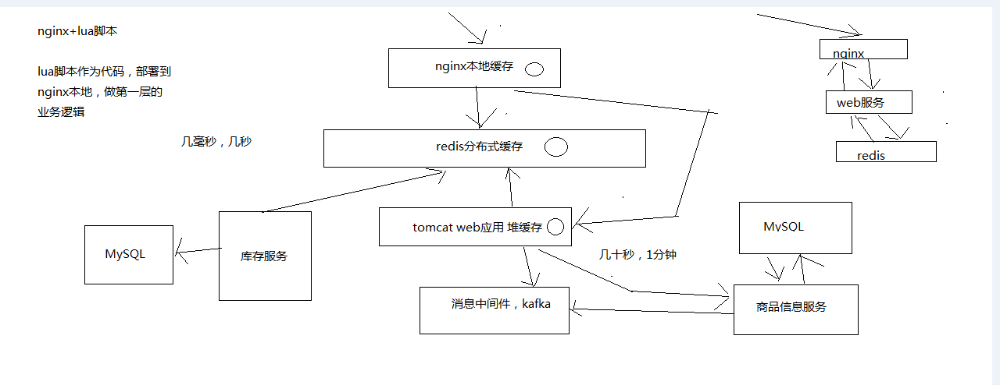


- 第一层：NGINX
- 第二层：redis分布式缓存
- 第三层：Tomcat的本地缓存


我们之前的三十讲，主要是在讲解redis如何支撑海量数据、高并发读写、高可用服务的架构，redis架构

redis架构，在我们的真正类似商品详情页读高并发的系统中，redis就是底层的缓存存储的支持

从这一讲开始，我们正式开始做业务系统的开发

亿级流量以上的电商网站的商品详情页的系统，商品详情页系统，大量的业务，十几个人做一两年，堆出来复杂的业务系统

几十个小时的课程，讲解复杂的业务

把整体的架构给大家讲解清楚，然后浓缩和精炼里面的业务，提取部分业务，做一些简化，把整个详情页系统的流程跑出来

架构，骨架，有少量的业务，血和肉，把整个项目串起来，在业务背景下，去学习架构

讲解商品详情页系统，缓存架构，90%大量的业务代码（没有什么技术含量），10%的最优技术含量的就是架构，上亿流量，每秒QPS几万，上十万的，读并发

读并发，缓存架构

> 1、上亿流量的商品详情页系统的多级缓存架构

很多人以为，做个缓存，其实就是用一下redis，访问一下，就可以了，简单的缓存

做复杂的缓存，支撑电商复杂的场景下的高并发的缓存，遇到的问题，非常非常之多，绝对不是说简单的访问一下redsi就可以了

采用三级缓存：nginx本地缓存+redis分布式缓存+tomcat堆缓存的多级缓存架构

时效性要求非常高的数据：库存

一般来说，显示的库存，都是时效性要求会相对高一些，因为随着商品的不断的交易，库存会不断的变化

当然，我们就希望当库存变化的时候，尽可能更快将库存显示到页面上去，而不是说等了很长时间，库存才反应到页面上去

时效性要求不高的数据：商品的基本信息（名称、颜色、版本、规格参数，等等）

时效性要求不高的数据，就还好，比如说你现在改变了商品的名称，稍微晚个几分钟反应到商品页面上，也还能接受

商品价格/库存等时效性要求高的数据，而且种类较少，采取相关的服务系统每次发生了变更的时候，直接采取数据库和redis缓存双写的方案，这样缓存的时效性最高

商品基本信息等时效性不高的数据，而且种类繁多，来自多种不同的系统，采取MQ异步通知的方式，写一个数据生产服务，监听MQ消息，然后异步拉取服务的数据，更新tomcat jvm缓存+redis缓存

nginx+lua脚本做页面动态生成的工作，每次请求过来，优先从nginx本地缓存中提取各种数据，结合页面模板，生成需要的页面

如果nginx本地缓存过期了，那么就从nginx到redis中去拉取数据，更新到nginx本地

如果redis中也被LRU算法清理掉了，那么就从nginx走http接口到后端的服务中拉取数据，数据生产服务中，现在本地tomcat里的jvm堆缓存中找，ehcache，如果也被LRU清理掉了，那么就重新发送请求到源头的服务中去拉取数据，然后再次更新tomcat堆内存缓存+redis缓存，并返回数据给nginx，nginx缓存到本地

> 2、多级缓存架构中每一层的意义

nginx本地缓存，抗的是热数据的高并发访问，一般来说，商品的购买总是有热点的，比如每天购买iphone、nike、海尔等知名品牌的东西的人，总是比较多的

这些热数据，利用nginx本地缓存，由于经常被访问，所以可以被锁定在nginx的本地缓存内

大量的热数据的访问，就是经常会访问的那些数据，就会被保留在nginx本地缓存内，那么对这些热数据的大量访问，就直接走nginx就可以了

那么大量的访问，直接就可以走到nginx就行了，不需要走后续的各种网络开销了

redis分布式大规模缓存，抗的是很高的离散访问，支撑海量的数据，高并发的访问，高可用的服务

redis缓存最大量的数据，最完整的数据和缓存，1T+数据; 支撑高并发的访问，QPS最高到几十万; 可用性，非常好，提供非常稳定的服务

nginx本地内存有限，也就能cache住部分热数据，除了各种iphone、nike等热数据，其他相对不那么热的数据，可能流量会经常走到redis那里

利用redis cluster的多master写入，横向扩容，1T+以上海量数据支持，几十万的读写QPS，99.99%高可用性，那么就可以抗住大量的离散访问请求

tomcat jvm堆内存缓存，主要是抗redis大规模灾难的，如果redis出现了大规模的宕机，导致nginx大量流量直接涌入数据生产服务，那么最后的tomcat堆内存缓存至少可以再抗一下，不至于让数据库直接裸奔

同时tomcat jvm堆内存缓存，也可以抗住redis没有cache住的最后那少量的部分缓存


# 36_Cache Aside Pattern缓存+数据库读写模式的分析

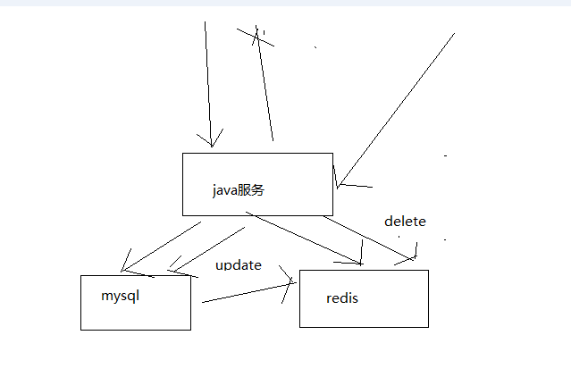


最经典的缓存+数据库读写的模式，cache aside pattern

> 1、Cache Aside Pattern

（1）读的时候，先读缓存，缓存没有的话，那么就读数据库，然后取出数据后放入缓存，同时返回响应

（2）更新的时候，先删除缓存，然后再更新数据库

> 2、为什么是删除缓存，而不是更新缓存呢？

原因很简单，很多时候，复杂点的缓存的场景，因为缓存有的时候，不简单是数据库中直接取出来的值

商品详情页的系统，修改库存，只是修改了某个表的某些字段，但是要真正把这个影响的最终的库存计算出来，可能还需要从其他表查询一些数据，然后进行一些复杂的运算，才能最终计算出

现在最新的库存是多少，然后才能将库存更新到缓存中去

比如可能更新了某个表的一个字段，然后其对应的缓存，是需要查询另外两个表的数据，并进行运算，才能计算出缓存最新的值的

更新缓存的代价是很高的

是不是说，每次修改数据库的时候，都一定要将其对应的缓存去跟新一份？也许有的场景是这样的，但是对于比较复杂的缓存数据计算的场景，就不是这样了

如果你频繁修改一个缓存涉及的多个表，那么这个缓存会被频繁的更新，频繁的更新缓存

但是问题在于，这个缓存到底会不会被频繁访问到？？？

举个例子，一个缓存涉及的表的字段，在1分钟内就修改了20次，或者是100次，那么缓存跟新20次，100次; 但是这个缓存在1分钟内就被读取了1次，有大量的冷数据

28法则，黄金法则，20%的数据，占用了80%的访问量

实际上，如果你只是删除缓存的话，那么1分钟内，这个缓存不过就重新计算一次而已，开销大幅度降低

每次数据过来，就只是删除缓存，然后修改数据库，如果这个缓存，在1分钟内只是被访问了1次，那么只有那1次，缓存是要被重新计算的，用缓存才去算缓存

其实删除缓存，而不是更新缓存，就是一个lazy计算的思想，不要每次都重新做复杂的计算，不管它会不会用到，而是让它到需要被使用的时候再重新计算

mybatis，hibernate，懒加载，思想

查询一个部门，部门带了一个员工的list，没有必要说每次查询部门，都里面的1000个员工的数据也同时查出来啊

80%的情况，查这个部门，就只是要访问这个部门的信息就可以了

先查部门，同时要访问里面的员工，那么这个时候只有在你要访问里面的员工的时候，才会去数据库里面查询1000个员工


# 37_高并发场景下的缓存+数据库双写不一致问题分析与解决方案设计


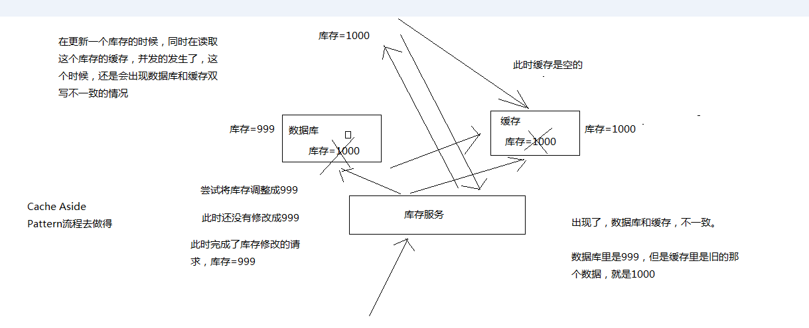

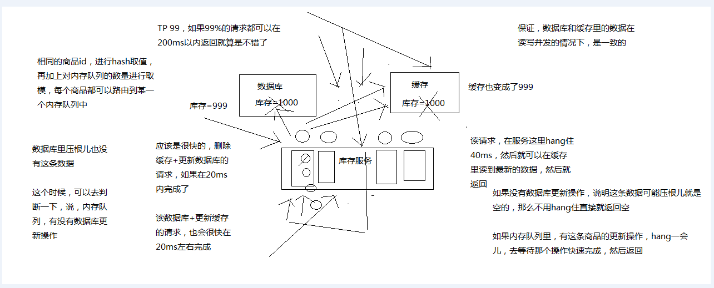

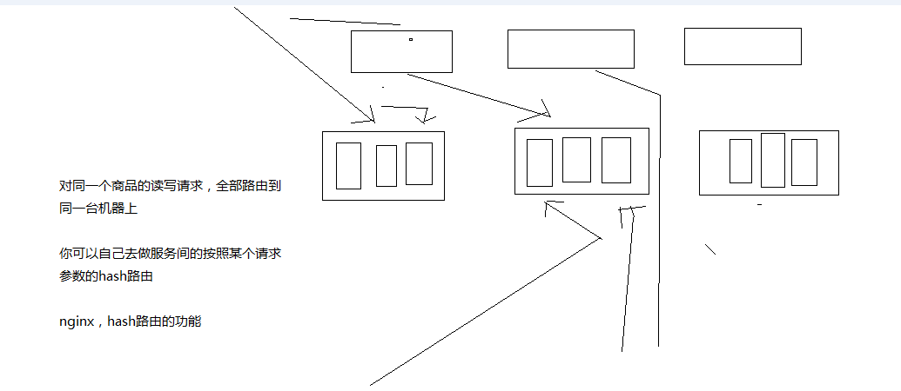

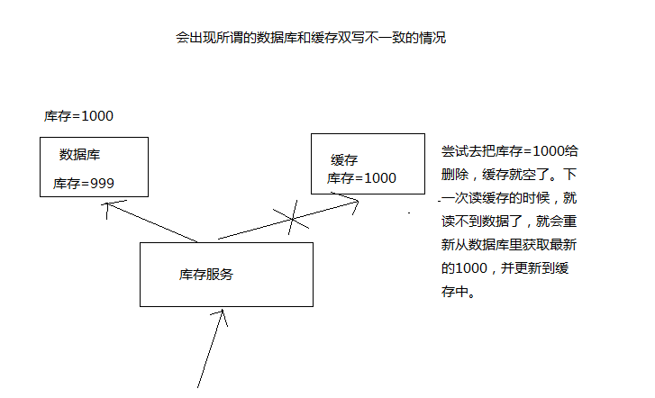

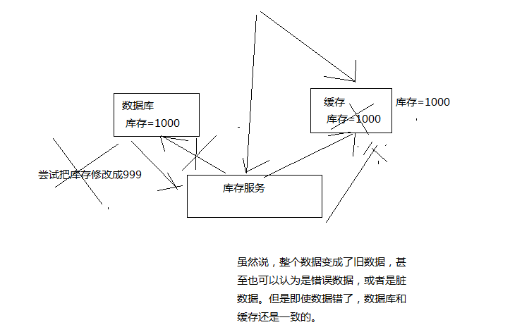


马上开始去开发业务系统

从哪一步开始做，从比较简单的那一块开始做，实时性要求比较高的那块数据的缓存去做

实时性比较高的数据缓存，选择的就是库存的服务

库存可能会修改，每次修改都要去更新这个缓存数据; 每次库存的数据，在缓存中一旦过期，或者是被清理掉了，前端的nginx服务都会发送请求给库存服务，去获取相应的数据

库存这一块，写数据库的时候，直接更新redis缓存

实际上没有这么的简单，这里，其实就涉及到了一个问题，数据库与缓存双写，数据不一致的问题

围绕和结合实时性较高的库存服务，把数据库与缓存双写不一致问题以及其解决方案，给大家讲解一下

数据库与缓存双写不一致，很常见的问题，大型的缓存架构中，第一个解决方案

大型的缓存架构全部讲解完了以后，整套架构是非常复杂，架构可以应对各种各样奇葩和极端的情况

也有一种可能，不是说，来讲课的就是超人，万能的

讲课，就跟写书一样，很可能会写错，也可能有些方案里的一些地方，我没考虑到

也可能说，有些方案只是适合某些场景，在某些场景下，可能需要你进行方案的优化和调整才能适用于你自己的项目

大家觉得对这些方案有什么疑问或者见解，都可以找我，沟通一下

如果的确我觉得是我讲解的不对，或者有些地方考虑不周，那么我可以在视频里补录，更新到网站上面去

多多包涵


1、最初级的缓存不一致问题以及解决方案

问题：先修改数据库，再删除缓存，如果删除缓存失败了，那么会导致数据库中是新数据，缓存中是旧数据，数据出现不一致

解决思路

先删除缓存，再修改数据库，如果删除缓存成功了，如果修改数据库失败了，那么数据库中是旧数据，缓存中是空的，那么数据不会不一致

因为读的时候缓存没有，则读数据库中旧数据，然后更新到缓存中

2、比较复杂的数据不一致问题分析

数据发生了变更，先删除了缓存，然后要去修改数据库，此时还没修改

一个请求过来，去读缓存，发现缓存空了，去查询数据库，查到了修改前的旧数据，放到了缓存中

数据变更的程序完成了数据库的修改

完了，数据库和缓存中的数据不一样了。。。。

3、为什么上亿流量高并发场景下，缓存会出现这个问题？

只有在对一个数据在并发的进行读写的时候，才可能会出现这种问题

其实如果说你的并发量很低的话，特别是读并发很低，每天访问量就1万次，那么很少的情况下，会出现刚才描述的那种不一致的场景

但是问题是，如果每天的是上亿的流量，每秒并发读是几万，每秒只要有数据更新的请求，就可能会出现上述的数据库+缓存不一致的情况

高并发了以后，问题是很多的

4、数据库与缓存更新与读取操作进行异步串行化

更新数据的时候，根据数据的唯一标识，将操作路由之后，发送到一个jvm内部的队列中

读取数据的时候，如果发现数据不在缓存中，那么将重新读取数据+更新缓存的操作，根据唯一标识路由之后，也发送同一个jvm内部的队列中

一个队列对应一个工作线程

每个工作线程串行拿到对应的操作，然后一条一条的执行

这样的话，一个数据变更的操作，先执行，删除缓存，然后再去更新数据库，但是还没完成更新

此时如果一个读请求过来，读到了空的缓存，那么可以先将缓存更新的请求发送到队列中，此时会在队列中积压，然后同步等待缓存更新完成

这里有一个优化点，一个队列中，其实多个更新缓存请求串在一起是没意义的，因此可以做过滤，如果发现队列中已经有一个更新缓存的请求了，那么就不用再放个更新请求操作进去了，直接等待前面的更新操作请求完成即可

待那个队列对应的工作线程完成了上一个操作的数据库的修改之后，才会去执行下一个操作，也就是缓存更新的操作，此时会从数据库中读取最新的值，然后写入缓存中

如果请求还在等待时间范围内，不断轮询发现可以取到值了，那么就直接返回; 如果请求等待的时间超过一定时长，那么这一次直接从数据库中读取当前的旧值

5、高并发的场景下，该解决方案要注意的问题

（1）读请求长时阻塞

由于读请求进行了非常轻度的异步化，所以一定要注意读超时的问题，每个读请求必须在超时时间范围内返回

该解决方案，最大的风险点在于说，可能数据更新很频繁，导致队列中积压了大量更新操作在里面，然后读请求会发生大量的超时，最后导致大量的请求直接走数据库

务必通过一些模拟真实的测试，看看更新数据的频繁是怎样的

另外一点，因为一个队列中，可能会积压针对多个数据项的更新操作，因此需要根据自己的业务情况进行测试，可能需要部署多个服务，每个服务分摊一些数据的更新操作

如果一个内存队列里居然会挤压100个商品的库存修改操作，每隔库存修改操作要耗费10ms区完成，那么最后一个商品的读请求，可能等待10 * 100 = 1000ms = 1s后，才能得到数据

这个时候就导致读请求的长时阻塞

一定要做根据实际业务系统的运行情况，去进行一些压力测试，和模拟线上环境，去看看最繁忙的时候，内存队列可能会挤压多少更新操作，可能会导致最后一个更新操作对应的读请求，会hang多少时间，如果读请求在200ms返回，如果你计算过后，哪怕是最繁忙的时候，积压10个更新操作，最多等待200ms，那还可以的

如果一个内存队列可能积压的更新操作特别多，那么你就要加机器，让每个机器上部署的服务实例处理更少的数据，那么每个内存队列中积压的更新操作就会越少

其实根据之前的项目经验，一般来说数据的写频率是很低的，因此实际上正常来说，在队列中积压的更新操作应该是很少的

针对读高并发，读缓存架构的项目，一般写请求相对读来说，是非常非常少的，每秒的QPS能到几百就不错了

一秒，500的写操作，5份，每200ms，就100个写操作

单机器，20个内存队列，每个内存队列，可能就积压5个写操作，每个写操作性能测试后，一般在20ms左右就完成

那么针对每个内存队列中的数据的读请求，也就最多hang一会儿，200ms以内肯定能返回了

写QPS扩大10倍，但是经过刚才的测算，就知道，单机支撑写QPS几百没问题，那么就扩容机器，扩容10倍的机器，10台机器，每个机器20个队列，200个队列

大部分的情况下，应该是这样的，大量的读请求过来，都是直接走缓存取到数据的

少量情况下，可能遇到读跟数据更新冲突的情况，如上所述，那么此时更新操作如果先入队列，之后可能会瞬间来了对这个数据大量的读请求，但是因为做了去重的优化，所以也就一个更新缓存的操作跟在它后面

等数据更新完了，读请求触发的缓存更新操作也完成，然后临时等待的读请求全部可以读到缓存中的数据

（2）读请求并发量过高

这里还必须做好压力测试，确保恰巧碰上上述情况的时候，还有一个风险，就是突然间大量读请求会在几十毫秒的延时hang在服务上，看服务能不能抗的住，需要多少机器才能抗住最大的极限情况的峰值

但是因为并不是所有的数据都在同一时间更新，缓存也不会同一时间失效，所以每次可能也就是少数数据的缓存失效了，然后那些数据对应的读请求过来，并发量应该也不会特别大

按1:99的比例计算读和写的请求，每秒5万的读QPS，可能只有500次更新操作

如果一秒有500的写QPS，那么要测算好，可能写操作影响的数据有500条，这500条数据在缓存中失效后，可能导致多少读请求，发送读请求到库存服务来，要求更新缓存

一般来说，1:1，1:2，1:3，每秒钟有1000个读请求，会hang在库存服务上，每个读请求最多hang多少时间，200ms就会返回

在同一时间最多hang住的可能也就是单机200个读请求，同时hang住

单机hang200个读请求，还是ok的

1:20，每秒更新500条数据，这500秒数据对应的读请求，会有20 * 500 = 1万

1万个读请求全部hang在库存服务上，就死定了

（3）多服务实例部署的请求路由

可能这个服务部署了多个实例，那么必须保证说，执行数据更新操作，以及执行缓存更新操作的请求，都通过nginx服务器路由到相同的服务实例上

（4）热点商品的路由问题，导致请求的倾斜

万一某个商品的读写请求特别高，全部打到相同的机器的相同的队列里面去了，可能造成某台机器的压力过大

就是说，因为只有在商品数据更新的时候才会清空缓存，然后才会导致读写并发，所以更新频率不是太高的话，这个问题的影响并不是特别大

但是的确可能某些机器的负载会高一些


# 38_在linux虚拟机中安装部署MySQL数据库

后面写的各种代码，还是要基于mysql去做一些开发的，因为缓存的底层的数据存储肯定是数据库

mysql数据库，还是要部署一下的

eshop-cache04

先用yum安装mysql server

yum install -y mysql-server

service mysqld start
chkconfig mysqld on

yum install -y mysql-connector-java


# 39_库存服务的开发框架整合与搭建：spring boot+mybatis+jedis[eshop-inventory]


> 1、pom.xml

maven下载这些依赖的时候，会非常非常的慢，根据不同人的网络环境，也不一样

你就在eclipse里面，观察每个依赖的下载的情况

如果说觉得下载的很慢，就是卡在一个地方，好长时间不能下载，进度条都不动了

那就手动下载maven依赖，mysql connector java maven，进到maven中央依赖库里面，去手动下载对应版本的jar包，可以用迅雷，会比较快速一些

你需要手动将jar包拷贝到你本地的maven仓库的对应的目录中去

可能对应的目录不存在，那就自己手动创建; 可能对应的目录已经存在，那么需要你将里面的东西先删除，然后拷贝自己下载的jar包进去

然后需要执行mvn install命令，手动安装依赖

mvn install:install-file -Dfile=F:\apache-maven-3.0.5\mvn_repo\redis\clients\jedis\2.5.2\jedis-2.5.2.jar -DgroupId=redis.clients -DartifactId=jedis -Dversion=2.5.2 -Dpackaging=jar

可能需要将eclipse强制关闭，任务管理器里面，直接强制结束任务，关闭eclipse，重新打开

右击工程，强制重新更新maven的依赖

然后就会继续去下载接下来的依赖包

我大概手动下载了将近10个依赖，然后才顺利的下载完了所有的依赖

```xml
	<parent>
        <groupId>org.springframework.boot</groupId>
        <artifactId>spring-boot-starter-parent</artifactId>
        <version>1.2.5.RELEASE</version>
    </parent>

    <properties>
        <project.build.sourceEncoding>UTF-8</project.build.sourceEncoding>
        <java.version>1.8</java.version>
    </properties>

    <dependencies>
        <dependency>
            <groupId>org.springframework.boot</groupId>
            <artifactId>spring-boot-starter-web</artifactId>
        </dependency>
        <dependency>
            <groupId>org.springframework.boot</groupId>
            <artifactId>spring-boot-starter-thymeleaf</artifactId>
        </dependency>
        <dependency>
            <groupId>org.springframework.boot</groupId>
            <artifactId>spring-boot-starter-jdbc</artifactId>
        </dependency>
        <dependency>
            <groupId>org.springframework.boot</groupId>
            <artifactId>spring-boot-starter-actuator</artifactId>
        </dependency>
        <dependency>
            <groupId>org.mybatis</groupId>
            <artifactId>mybatis-spring</artifactId>
            <version>1.2.2</version>
        </dependency>
        <dependency>
            <groupId>org.mybatis</groupId>
            <artifactId>mybatis</artifactId>
            <version>3.2.8</version>
        </dependency>
        <dependency>
            <groupId>org.apache.tomcat</groupId>
            <artifactId>tomcat-jdbc</artifactId>
        </dependency>
        <dependency>
            <groupId>mysql</groupId>
            <artifactId>mysql-connector-java</artifactId>
        </dependency>
        <dependency>
            <groupId>com.alibaba</groupId>
            <artifactId>fastjson</artifactId>
            <version>1.1.43</version>
        </dependency>
    </dependencies>

    <build>
        <plugins>
            <plugin>
                <groupId>org.springframework.boot</groupId>
                <artifactId>spring-boot-maven-plugin</artifactId>
            </plugin>
        </plugins>
    </build>

    <repositories>
        <repository>
            <id>spring-milestone</id>
            <url>https://repo.spring.io/libs-release</url>
        </repository>
    </repositories>

    <pluginRepositories>
        <pluginRepository>
            <id>spring-milestone</id>
            <url>https://repo.spring.io/libs-release</url>
        </pluginRepository>
    </pluginRepositories>


```

> 2、com.roncoo.eshop.inventory.Application

我们是直接讲解项目的，项目中遇到的一些技术，比如说redis，是缓存架构topic里面非常重要的一个环节，那我们当然会花费很大的篇幅去仔细讲解

但是比如spring boot、mybatis、zookeeper、storm

有些技术，是默认大家要会的，spring boot，mybatis，你说你都不会，不行，自己去学一下

zookeeper，kafka，技术，直接带着大家部署，简单介绍一下，就开始用了，如果真的是要用这个技术，做项目，还是得上网自己去查阅一些资料，学习这个技术

storm，会带着大家把20%的核心基础知识学习一下，作为java程序员，可以开发就行了

一个项目课程，涉及了十几种技术，我不可能全都给你按照从入门到精通的方式，全部讲解一遍

```java
@EnableAutoConfiguration
@SpringBootApplication
@ComponentScan
@MapperScan("com.roncoo.eshop.inventory.mapper")
public class Application {
 
    @Bean
    @ConfigurationProperties(prefix="spring.datasource")
    public DataSource dataSource() {
        return new org.apache.tomcat.jdbc.pool.DataSource();
    }
    
    @Bean
    public SqlSessionFactory sqlSessionFactoryBean() throws Exception {
        SqlSessionFactoryBean sqlSessionFactoryBean = new SqlSessionFactoryBean();
        sqlSessionFactoryBean.setDataSource(dataSource());
        PathMatchingResourcePatternResolver resolver = new PathMatchingResourcePatternResolver();
        sqlSessionFactoryBean.setMapperLocations(resolver.getResources("classpath:/mybatis/*.xml"));
        return sqlSessionFactoryBean.getObject();
    }
 
    @Bean
    public PlatformTransactionManager transactionManager() {
        return new DataSourceTransactionManager(dataSource());
    }

    public static void main(String[] args) {
        SpringApplication.run(Application.class, args);
    }
 
}

```

> 3、com.roncoo.eshop.inventory.model.User

> 4、com.roncoo.eshop.inventory.mapper.UserMapper

```java
public interface UserMapper {
    public User findUserInfo();
}
```

> 5、com.roncoo.eshop.inventory.service.UserService

> 6、UserController

```java
@Controller
public class UserController {
 
    @Autowired
    private UserService userService;
 
    @RequestMapping("/getUserInfo")
    @ResponseBody
    public User getUserInfo() {
        User user = userService.getUserInfo();
        return user;
    }

}

```

> 7、resources/Application.properties

```
spring.datasource.url=jdbc:mysql://127.0.0.1:3306/test
spring.datasource.username=root
spring.datasource.password=root
spring.datasource.driver-class-name=com.mysql.jdbc.Driver
```

> 8、resources/mybatis/UserMapper.xml

```xml
<?xml version="1.0" encoding="UTF-8"?>
<!DOCTYPE mapper PUBLIC "-//mybatis.org//DTD Mapper 3.0//EN" "http://mybatis.org/dtd/mybatis-3-mapper.dtd">
<mapper namespace="com.roncoo.eshop.inventory.mapper.UserMapper">
 
  <select id="findUserInfo" resultType="com.roncoo.eshop.inventory.model.User">
	select name,age from user;
  </select>
 
</mapper>
```

> 9、测试spring boot+mybatis的整合

在数据库中创建一个eshop database，创建一个eshop账号和密码，创建一个user表，里面插入一条数据，张三和25岁

```
create database if not exists eshop;
grant all privileges on eshop.* to 'eshop'@'%' identified by 'eshop';
create table user(name varchar(255), age int)
insert into user values('张三', 25)

```

启动Application程序，访问getUserInfo接口，能否从mysql中查询数据，并返回到页面上

如果可以，说明spring boot+mybatis整合成功

> 10、整合Jedis Cluster

```xml
<dependency>
    <groupId>redis.clients</groupId>
    <artifactId>jedis</artifactId>
</dependency>
```

```java
Application

@Bean
public JedisCluster JedisClusterFactory() {
    Set<HostAndPort> jedisClusterNodes = new HashSet<HostAndPort>();
    jedisClusterNodes.add(new HostAndPort("192.168.31.19", 7003));
    jedisClusterNodes.add(new HostAndPort("192.168.31.19", 7004));
    jedisClusterNodes.add(new HostAndPort("192.168.31.227", 7006));
    JedisCluster jedisCluster = new JedisCluster(jedisClusterNodes);
    return jedisCluster;
}

@Repository("redisDAO")   
public class RedisDAOImpl implements RedisDAO {

    @Resource
    private JedisCluster jedisCluster;
    
    @Override
    public void set(String key, String value) {
        jedisCluster.set(key, value);
    }

    @Override
    public String get(String key) {
        return jedisCluster.get(key);
    }

}

UserServiceImpl

@Override
public User getCachedUserInfo() {
    redisDAO.set("cached_user", "{\"name\": \"zhangsan\", \"age\": 25}") ;  
    String json = redisDAO.get("cached_user");  
    JSONObject jsonObject = JSONObject.parseObject(json);
    
    User user = new User();
    user.setName(jsonObject.getString("name"));  
    user.setAge(jsonObject.getInteger("age")); 
    
    return user;
}

UserController

@RequestMapping("/getCachedUserInfo")
@ResponseBody
public User getCachedUserInfo() {
    User user = userService.getCachedUserInfo();
    return user;
}

```

# 40_在库存服务中实现缓存与数据库双写一致性保障方案（一）


更新数据的时候，根据数据的唯一标识，将操作路由之后，发送到一个jvm内部的队列中

读取数据的时候，如果发现数据不在缓存中，那么将重新读取数据+更新缓存的操作，根据唯一标识路由之后，也发送同一个jvm内部的队列中

一个队列对应一个工作线程

每个工作线程串行拿到对应的操作，然后一条一条的执行

这样的话，一个数据变更的操作，先执行，删除缓存，然后再去更新数据库，但是还没完成更新

此时如果一个读请求过来，读到了空的缓存，那么可以先将缓存更新的请求发送到队列中，此时会在队列中积压，然后同步等待缓存更新完成

这里有一个优化点，一个队列中，其实多个更新缓存请求串在一起是没意义的，因此可以做过滤，如果发现队列中已经有一个更新缓存的请求了，那么就不用再放个更新请求操作进去了，直接等待前面的更新操作请求完成即可

待那个队列对应的工作线程完成了上一个操作的数据库的修改之后，才会去执行下一个操作，也就是缓存更新的操作，此时会从数据库中读取最新的值，然后写入缓存中

如果请求还在等待时间范围内，不断轮询发现可以取到值了，那么就直接返回; 如果请求等待的时间超过一定时长，那么这一次直接从数据库中读取当前的旧值

int h;
return (key == null) ? 0 : (h = key.hashCode()) ^ (h >>> 16);

(queueNum - 1) & hash

1、线程池+内存队列初始化

@Bean
public ServletListenerRegistrationBean servletListenerRegistrationBean(){
    ServletListenerRegistrationBean servletListenerRegistrationBean = new ServletListenerRegistrationBean();
    servletListenerRegistrationBean.setListener(new InitListener());
    return servletListenerRegistrationBean;
}

java web应用，做系统的初始化，一般在哪里做呢？

ServletContextListener里面做，listener，会跟着整个web应用的启动，就初始化，类似于线程池初始化的构建

spring boot应用，Application，搞一个listener的注册

2、两种请求对象封装

3、请求异步执行Service封装

4、两种请求Controller接口封装

5、读请求去重优化

6、空数据读请求过滤优化

队列

对一个商品的库存的数据库更新操作已经在内存队列中了

然后对这个商品的库存的读取操作，要求读取数据库的库存数据，然后更新到缓存中，多个读

这多个读，其实只要有一个读请求操作压到队列里就可以了

其他的读操作，全部都wait那个读请求的操作，刷新缓存，就可以读到缓存中的最新数据了

如果读请求发现redis缓存中没有数据，就会发送读请求给库存服务，但是此时缓存中为空，可能是因为写请求先删除了缓存，也可能是数据库里压根儿没这条数据

如果是数据库中压根儿没这条数据的场景，那么就不应该将读请求操作给压入队列中，而是直接返回空就可以了

都是为了减少内存队列中的请求积压，内存队列中积压的请求越多，就可能导致每个读请求hang住的时间越长，也可能导致多个读请求被hang住

这边跟大家提前说一下，打个招呼

我的风格，跟其他一些人不太一样，我都是课上纯实时手写代码的，没有说提前自己先练个10遍（也没那时间），也不是说预先写好，然后放ppt，课程里就copy粘贴

我就是思路梳理出来，然后边讲课边写代码

就是跟真实的开发的时候是一样的，可能会犯各种各样的错误，可能会写出来bug

有可能有些错误，或者是疏忽的地方，自己课程上就发现了，然后就纠正了; 也可能我没发现自己一些遗漏的地方，QQ+我，然后跟我反馈

视频随时可以补充进去，纠错的一些东西

talk is cheap, show me the code

写代码，还有一个问题，我们是课程上现场写代码，第一遍写代码，写出来的代码，面向对象的设计，设计模式的运用，然后代码结构的设置，都不是太完美，甚至可能是有点粗糙

公司里做项目，其实那个代码会改来改去，重构，代码会变得越来越规整

课程里没办法，大家如果觉得我的代码写的不太好，比如说觉得我哪里本来应该用个设计模式，结果没有用

很重要的废话

这套课程，主要还是讲解架构的，面向架构

架构，很虚，说说说

架构还是得落地，落地还是要写代码的，不管大家是什么层级的人，开发，高工，架构师，技术总监，项目经理

所有的代码跟着一点一点写一下


# 41_在库存服务中实现缓存与数据库双写一致性保障方案（二）


更新数据的时候，根据数据的唯一标识，将操作路由之后，发送到一个jvm内部的队列中

读取数据的时候，如果发现数据不在缓存中，那么将重新读取数据+更新缓存的操作，根据唯一标识路由之后，也发送同一个jvm内部的队列中

一个队列对应一个工作线程

每个工作线程串行拿到对应的操作，然后一条一条的执行

这样的话，一个数据变更的操作，先执行，删除缓存，然后再去更新数据库，但是还没完成更新

此时如果一个读请求过来，读到了空的缓存，那么可以先将缓存更新的请求发送到队列中，此时会在队列中积压，然后同步等待缓存更新完成

这里有一个优化点，一个队列中，其实多个更新缓存请求串在一起是没意义的，因此可以做过滤，如果发现队列中已经有一个更新缓存的请求了，那么就不用再放个更新请求操作进去了，直接等待前面的更新操作请求完成即可

待那个队列对应的工作线程完成了上一个操作的数据库的修改之后，才会去执行下一个操作，也就是缓存更新的操作，此时会从数据库中读取最新的值，然后写入缓存中

如果请求还在等待时间范围内，不断轮询发现可以取到值了，那么就直接返回; 如果请求等待的时间超过一定时长，那么这一次直接从数据库中读取当前的旧值

int h;
return (key == null) ? 0 : (h = key.hashCode()) ^ (h >>> 16);

(queueNum - 1) & hash

1、线程池+内存队列初始化

@Bean
public ServletListenerRegistrationBean servletListenerRegistrationBean(){
    ServletListenerRegistrationBean servletListenerRegistrationBean = new ServletListenerRegistrationBean();
    servletListenerRegistrationBean.setListener(new InitListener());
    return servletListenerRegistrationBean;
}

java web应用，做系统的初始化，一般在哪里做呢？

ServletContextListener里面做，listener，会跟着整个web应用的启动，就初始化，类似于线程池初始化的构建

spring boot应用，Application，搞一个listener的注册

2、两种请求对象封装

3、请求异步执行Service封装

4、两种请求Controller接口封装

5、读请求去重优化

6、空数据读请求过滤优化

队列

对一个商品的库存的数据库更新操作已经在内存队列中了

然后对这个商品的库存的读取操作，要求读取数据库的库存数据，然后更新到缓存中，多个读

这多个读，其实只要有一个读请求操作压到队列里就可以了

其他的读操作，全部都wait那个读请求的操作，刷新缓存，就可以读到缓存中的最新数据了

如果读请求发现redis缓存中没有数据，就会发送读请求给库存服务，但是此时缓存中为空，可能是因为写请求先删除了缓存，也可能是数据库里压根儿没这条数据

如果是数据库中压根儿没这条数据的场景，那么就不应该将读请求操作给压入队列中，而是直接返回空就可以了

都是为了减少内存队列中的请求积压，内存队列中积压的请求越多，就可能导致每个读请求hang住的时间越长，也可能导致多个读请求被hang住

这边跟大家提前说一下，打个招呼

我的风格，跟其他一些人不太一样，我都是课上纯实时手写代码的，没有说提前自己先练个10遍（也没那时间），也不是说预先写好，然后放ppt，课程里就copy粘贴

我就是思路梳理出来，然后边讲课边写代码

就是跟真实的开发的时候是一样的，可能会犯各种各样的错误，可能会写出来bug

有可能有些错误，或者是疏忽的地方，自己课程上就发现了，然后就纠正了; 也可能我没发现自己一些遗漏的地方，QQ+我，然后跟我反馈

视频随时可以补充进去，纠错的一些东西

talk is cheap, show me the code

写代码，还有一个问题，我们是课程上现场写代码，第一遍写代码，写出来的代码，面向对象的设计，设计模式的运用，然后代码结构的设置，都不是太完美，甚至可能是有点粗糙

公司里做项目，其实那个代码会改来改去，重构，代码会变得越来越规整

课程里没办法，大家如果觉得我的代码写的不太好，比如说觉得我哪里本来应该用个设计模式，结果没有用

很重要的废话

这套课程，主要还是讲解架构的，面向架构

架构，很虚，说说说

架构还是得落地，落地还是要写代码的，不管大家是什么层级的人，开发，高工，架构师，技术总监，项目经理

所有的代码跟着一点一点写一下


# 42_在库存服务中实现缓存与数据库双写一致性保障方案（三）


更新数据的时候，根据数据的唯一标识，将操作路由之后，发送到一个jvm内部的队列中

读取数据的时候，如果发现数据不在缓存中，那么将重新读取数据+更新缓存的操作，根据唯一标识路由之后，也发送同一个jvm内部的队列中

一个队列对应一个工作线程

每个工作线程串行拿到对应的操作，然后一条一条的执行

这样的话，一个数据变更的操作，先执行，删除缓存，然后再去更新数据库，但是还没完成更新

此时如果一个读请求过来，读到了空的缓存，那么可以先将缓存更新的请求发送到队列中，此时会在队列中积压，然后同步等待缓存更新完成

这里有一个优化点，一个队列中，其实多个更新缓存请求串在一起是没意义的，因此可以做过滤，如果发现队列中已经有一个更新缓存的请求了，那么就不用再放个更新请求操作进去了，直接等待前面的更新操作请求完成即可

待那个队列对应的工作线程完成了上一个操作的数据库的修改之后，才会去执行下一个操作，也就是缓存更新的操作，此时会从数据库中读取最新的值，然后写入缓存中

如果请求还在等待时间范围内，不断轮询发现可以取到值了，那么就直接返回; 如果请求等待的时间超过一定时长，那么这一次直接从数据库中读取当前的旧值

int h;
return (key == null) ? 0 : (h = key.hashCode()) ^ (h >>> 16);

(queueNum - 1) & hash

1、线程池+内存队列初始化

@Bean
public ServletListenerRegistrationBean servletListenerRegistrationBean(){
    ServletListenerRegistrationBean servletListenerRegistrationBean = new ServletListenerRegistrationBean();
    servletListenerRegistrationBean.setListener(new InitListener());
    return servletListenerRegistrationBean;
}

java web应用，做系统的初始化，一般在哪里做呢？

ServletContextListener里面做，listener，会跟着整个web应用的启动，就初始化，类似于线程池初始化的构建

spring boot应用，Application，搞一个listener的注册

2、两种请求对象封装

3、请求异步执行Service封装

4、请求处理的工作线程封装

5、两种请求Controller接口封装

6、读请求去重优化

7、空数据读请求过滤优化

队列

对一个商品的库存的数据库更新操作已经在内存队列中了

然后对这个商品的库存的读取操作，要求读取数据库的库存数据，然后更新到缓存中，多个读

这多个读，其实只要有一个读请求操作压到队列里就可以了

其他的读操作，全部都wait那个读请求的操作，刷新缓存，就可以读到缓存中的最新数据了

如果读请求发现redis缓存中没有数据，就会发送读请求给库存服务，但是此时缓存中为空，可能是因为写请求先删除了缓存，也可能是数据库里压根儿没这条数据

如果是数据库中压根儿没这条数据的场景，那么就不应该将读请求操作给压入队列中，而是直接返回空就可以了

都是为了减少内存队列中的请求积压，内存队列中积压的请求越多，就可能导致每个读请求hang住的时间越长，也可能导致多个读请求被hang住

这边跟大家提前说一下，打个招呼

我的风格，跟其他一些人不太一样，我都是课上纯实时手写代码的，没有说提前自己先练个10遍（也没那时间），也不是说预先写好，然后放ppt，课程里就copy粘贴

我就是思路梳理出来，然后边讲课边写代码

就是跟真实的开发的时候是一样的，可能会犯各种各样的错误，可能会写出来bug

有可能有些错误，或者是疏忽的地方，自己课程上就发现了，然后就纠正了; 也可能我没发现自己一些遗漏的地方，QQ+我，然后跟我反馈

视频随时可以补充进去，纠错的一些东西

talk is cheap, show me the code

写代码，还有一个问题，我们是课程上现场写代码，第一遍写代码，写出来的代码，面向对象的设计，设计模式的运用，然后代码结构的设置，都不是太完美，甚至可能是有点粗糙

公司里做项目，其实那个代码会改来改去，重构，代码会变得越来越规整

课程里没办法，大家如果觉得我的代码写的不太好，比如说觉得我哪里本来应该用个设计模式，结果没有用

很重要的废话

这套课程，主要还是讲解架构的，面向架构

架构，很虚，说说说

架构还是得落地，落地还是要写代码的，不管大家是什么层级的人，开发，高工，架构师，技术总监，项目经理

所有的代码跟着一点一点写一下


# 43_在库存服务中实现缓存与数据库双写一致性保障方案（四）


更新数据的时候，根据数据的唯一标识，将操作路由之后，发送到一个jvm内部的队列中

读取数据的时候，如果发现数据不在缓存中，那么将重新读取数据+更新缓存的操作，根据唯一标识路由之后，也发送同一个jvm内部的队列中

一个队列对应一个工作线程

每个工作线程串行拿到对应的操作，然后一条一条的执行

这样的话，一个数据变更的操作，先执行，删除缓存，然后再去更新数据库，但是还没完成更新

此时如果一个读请求过来，读到了空的缓存，那么可以先将缓存更新的请求发送到队列中，此时会在队列中积压，然后同步等待缓存更新完成

这里有一个优化点，一个队列中，其实多个更新缓存请求串在一起是没意义的，因此可以做过滤，如果发现队列中已经有一个更新缓存的请求了，那么就不用再放个更新请求操作进去了，直接等待前面的更新操作请求完成即可

待那个队列对应的工作线程完成了上一个操作的数据库的修改之后，才会去执行下一个操作，也就是缓存更新的操作，此时会从数据库中读取最新的值，然后写入缓存中

如果请求还在等待时间范围内，不断轮询发现可以取到值了，那么就直接返回; 如果请求等待的时间超过一定时长，那么这一次直接从数据库中读取当前的旧值

int h;
return (key == null) ? 0 : (h = key.hashCode()) ^ (h >>> 16);

(queueNum - 1) & hash

1、线程池+内存队列初始化

@Bean
public ServletListenerRegistrationBean servletListenerRegistrationBean(){
    ServletListenerRegistrationBean servletListenerRegistrationBean = new ServletListenerRegistrationBean();
    servletListenerRegistrationBean.setListener(new InitListener());
    return servletListenerRegistrationBean;
}

java web应用，做系统的初始化，一般在哪里做呢？

ServletContextListener里面做，listener，会跟着整个web应用的启动，就初始化，类似于线程池初始化的构建

spring boot应用，Application，搞一个listener的注册

2、两种请求对象封装

3、请求异步执行Service封装

4、请求处理的工作线程封装

5、两种请求Controller接口封装

6、读请求去重优化

如果一个读请求过来，发现前面已经有一个写请求和一个读请求了，那么这个读请求就不需要压入队列中了

因为那个写请求肯定会更新数据库，然后那个读请求肯定会从数据库中读取最新数据，然后刷新到缓存中，自己只要hang一会儿就可以从缓存中读到数据了

7、空数据读请求过滤优化

可能某个数据，在数据库里面压根儿就没有，那么那个读请求是不需要放入内存队列的，而且读请求在controller那一层，直接就可以返回了，不需要等待

如果数据库里都没有，就说明，内存队列里面如果没有数据库更新的请求的话，一个读请求过来了，就可以认为是数据库里就压根儿没有数据吧

如果缓存里没数据，就两个情况，第一个是数据库里就没数据，缓存肯定也没数据; 第二个是数据库更新操作过来了，先删除了缓存，此时缓存是空的，但是数据库里是有的

但是的话呢，我们做了之前的读请求去重优化，用了一个flag map，只要前面有数据库更新操作，flag就肯定是存在的，你只不过可以根据true或false，判断你前面执行的是写请求还是读请求

但是如果flag压根儿就没有呢，就说明这个数据，无论是写请求，还是读请求，都没有过

那这个时候过来的读请求，发现flag是null，就可以认为数据库里肯定也是空的，那就不会去读取了

或者说，我们也可以认为每个商品有一个最最初始的库存，但是因为最初始的库存肯定会同步到缓存中去的，有一种特殊的情况，就是说，商品库存本来在redis中是有缓存的

但是因为redis内存满了，就给干掉了，但是此时数据库中是有值得

那么在这种情况下，可能就是之前没有任何的写请求和读请求的flag的值，此时还是需要从数据库中重新加载一次数据到缓存中的

8、深入的去思考优化代码的漏洞

我的一些思考，如果大家发现了其他的漏洞，随时+我Q跟我交流一下

一个读请求过来，将数据库中的数刷新到了缓存中，flag是false，然后过了一会儿，redis内存满了，自动删除了这个额缓存

下一次读请求再过来，发现flag是false，就不会去执行刷新缓存的操作了

而是hang在哪里，反复循环，等一会儿，发现在缓存中始终查询不到数据，然后就去数据库里查询，就直接返回了

这种代码，就有可能会导致，缓存永远变成null的情况

最简单的一种，就是在controller这一块，如果在数据库中查询到了，就刷新到缓存里面去，以后的读请求就又可以从缓存里面读了

队列

对一个商品的库存的数据库更新操作已经在内存队列中了

然后对这个商品的库存的读取操作，要求读取数据库的库存数据，然后更新到缓存中，多个读

这多个读，其实只要有一个读请求操作压到队列里就可以了

其他的读操作，全部都wait那个读请求的操作，刷新缓存，就可以读到缓存中的最新数据了

如果读请求发现redis缓存中没有数据，就会发送读请求给库存服务，但是此时缓存中为空，可能是因为写请求先删除了缓存，也可能是数据库里压根儿没这条数据

如果是数据库中压根儿没这条数据的场景，那么就不应该将读请求操作给压入队列中，而是直接返回空就可以了

都是为了减少内存队列中的请求积压，内存队列中积压的请求越多，就可能导致每个读请求hang住的时间越长，也可能导致多个读请求被hang住

这边跟大家提前说一下，打个招呼

我的风格，跟其他一些人不太一样，我都是课上纯实时手写代码的，没有说提前自己先练个10遍（也没那时间），也不是说预先写好，然后放ppt，课程里就copy粘贴

我就是思路梳理出来，然后边讲课边写代码

就是跟真实的开发的时候是一样的，可能会犯各种各样的错误，可能会写出来bug

有可能有些错误，或者是疏忽的地方，自己课程上就发现了，然后就纠正了; 也可能我没发现自己一些遗漏的地方，QQ+我，然后跟我反馈

视频随时可以补充进去，纠错的一些东西

talk is cheap, show me the code

写代码，还有一个问题，我们是课程上现场写代码，第一遍写代码，写出来的代码，面向对象的设计，设计模式的运用，然后代码结构的设置，都不是太完美，甚至可能是有点粗糙

公司里做项目，其实那个代码会改来改去，重构，代码会变得越来越规整

课程里没办法，大家如果觉得我的代码写的不太好，比如说觉得我哪里本来应该用个设计模式，结果没有用

很重要的废话

这套课程，主要还是讲解架构的，面向架构

架构，很虚，说说说

架构还是得落地，落地还是要写代码的，不管大家是什么层级的人，开发，高工，架构师，技术总监，项目经理

所有的代码跟着一点一点写一下

如果你后面发现了任何的解决方案有一些场景下的漏洞，或者是代码的性能或者效率不好，那么可以直接给我反馈意见

我这里跟大家说一下，龙果也有一套课程，是讲解分布式事务的解决方案，很多同学提出，这些方案有一些不完美的地方，或者是一些漏洞

但是我想说的是，没有一种完美的方案，任何方案都是会根据具体的业务，去进行适当的调整的

所以说没有任何一个方案是100%一样的，我这里讲解的方案，更多的是通用的一个思路，也许有一些漏洞，但是有些漏洞，可能站在我之前工作的时候，场景和环境下，不是太大的问题

但是也许放在其他的场景和环境下，就是一个严重的问题


# 44_库存服务代码调试以及打印日志观察服务的运行流程是否正确
# 45_商品详情页结构分析、缓存全量更新问题以及缓存维度化解决方案


我们讲解过，咱们的整个缓存的技术方案，分成两块

第一块，是做实时性比较高的那块数据，比如说库存，销量之类的这种数据，我们采取的实时的缓存+数据库双写的技术方案，双写一致性保障的方案

第二块，是做实时性要求不高的数据，比如说商品的基本信息，等等，我们采取的是三级缓存架构的技术方案，就是说由一个专门的数据生产的服务，去获取整个商品详情页需要的各种数据，经过处理后，将数据放入各级缓存中，每一级缓存都有自己的作用

我们先来看看一下，所谓的这种实时性要求不高的数据，在商品详情页中，都有哪些

1、大型电商网站中的商品详情页的数据结构分析

商品的基本信息

标题：【限时直降】Apple/苹果 iPhone 7 128G 全网通4G智能手机正品
短描述：限时优惠 原封国行 正品保障
颜色：
存储容量
图片列表
规格参数

其他信息：店铺信息，分类信息，等等，非商品维度的信息

商品介绍：放缓存，看一点，ajax异步从缓存加载一点，不放我们这里讲解

实时信息：实时广告推荐、实时价格、实时活动推送，等等，ajax加载

我们不是带着大家用几十讲的时间去做一套完整的商品详情页的系统，电商网站的话，都几百个人做好几年的

将商品的各种基本信息，分类放到缓存中，每次请求过来，动态从缓存中取数据，然后动态渲染到模板中

数据放缓存，性能高，动态渲染模板，灵活性好

2、大型缓存全量更新问题

（1）网络耗费的资源大

（2）每次对redis都存取大数据，对redis的压力也比较大

（3）大家记不记得，之前我给大家提过，redis的性能和吞吐量能够支撑到多大，基本跟数据本身的大小有很大的关系

如果数据越大，那么可能导致redis的吞吐量就会急剧下降

3、缓存维度化解决方案

维度：商品维度，商品分类维度，商品店铺维度

不同的维度，可以看做是不同的角度去观察一个东西，那么每个商品详情页中，都包含了不同的维度数据

我就跟大家举个例子，如果不维度化，就导致多个维度的数据混合在一个缓存value中

但是不同维度的数据，可能更新的频率都大不一样

比如说，现在只是将1000个商品的分类批量调整了一下，但是如果商品分类的数据和商品本身的数据混杂在一起

那么可能导致需要将包括商品在内的大缓存value取出来，进行更新，再写回去，就会很坑爹，耗费大量的资源，redis压力也很大

但是如果我们队对缓存进行围堵维度化

唯独化：将每个维度的数据都存一份，比如说商品维度的数据存一份，商品分类的数据存一份，商品店铺的数据存一份

那么在不同的维度数据更新的时候，只要去更新对应的维度就可以了

包括我们之前讲解的那种实时性较高的数据，也可以理解为一个维度，那么维度拆分后


# 46_缓存数据生产服务的工作流程分析以及工程环境搭建[eshop-cache]

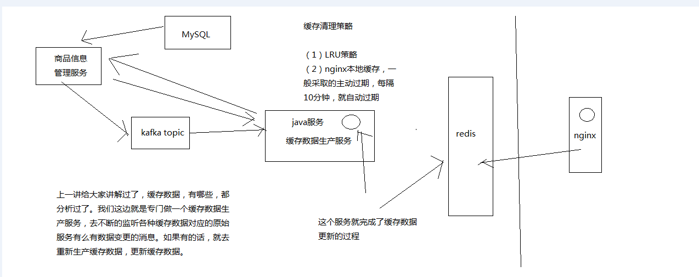

接下来要做这个多级缓存架构，从底往上做，先做缓存数据的生产这一块

我们画图来简单介绍一下整个缓存数据生产服务的一个工作流程

1、商品详情页缓存数据生产服务的工作流程分析

（1）监听多个kafka topic，每个kafka topic对应一个服务（简化一下，监听一个kafka topic）
（2）如果一个服务发生了数据变更，那么就发送一个消息到kafka topic中
（3）缓存数据生产服务监听到了消息以后，就发送请求到对应的服务中调用接口以及拉取数据，此时是从mysql中查询的
（4）缓存数据生产服务拉取到了数据之后，会将数据在本地缓存中写入一份，就是ehcache中
（5）同时会将数据在redis中写入一份

2、spring boot+mybatis+redis框架整合搭建

（1）依赖

<parent>
    <groupId>org.springframework.boot</groupId>
    <artifactId>spring-boot-starter-parent</artifactId>
    <version>1.2.5.RELEASE</version>
</parent>

<properties>
    <project.build.sourceEncoding>UTF-8</project.build.sourceEncoding>
    <java.version>1.8</java.version>
</properties>

<dependencies>
    <dependency>
        <groupId>org.springframework.boot</groupId>
        <artifactId>spring-boot-starter-web</artifactId>
    </dependency>
    <dependency>
        <groupId>org.springframework.boot</groupId>
        <artifactId>spring-boot-starter-thymeleaf</artifactId>
    </dependency>
    <dependency>
        <groupId>org.springframework.boot</groupId>
        <artifactId>spring-boot-starter-jdbc</artifactId>
    </dependency>
    <dependency>
        <groupId>org.springframework.boot</groupId>
        <artifactId>spring-boot-starter-actuator</artifactId>
    </dependency>
    <dependency>
        <groupId>org.mybatis</groupId>
        <artifactId>mybatis-spring</artifactId>
        <version>1.2.2</version>
    </dependency>
    <dependency>
        <groupId>org.mybatis</groupId>
        <artifactId>mybatis</artifactId>
        <version>3.2.8</version>
    </dependency>
    <dependency>
        <groupId>org.apache.tomcat</groupId>
        <artifactId>tomcat-jdbc</artifactId>
    </dependency>
    <dependency>
        <groupId>mysql</groupId>
        <artifactId>mysql-connector-java</artifactId>
    </dependency>
    <dependency>
        <groupId>com.alibaba</groupId>
        <artifactId>fastjson</artifactId>
        <version>1.1.43</version>
    </dependency>
</dependencies>

<build>
    <plugins>
        <plugin>
            <groupId>org.springframework.boot</groupId>
            <artifactId>spring-boot-maven-plugin</artifactId>
        </plugin>
    </plugins>
</build>

<repositories>
    <repository>
        <id>spring-milestone</id>
        <url>https://repo.spring.io/libs-release</url>
    </repository>
</repositories>

<pluginRepositories>
    <pluginRepository>
        <id>spring-milestone</id>
        <url>https://repo.spring.io/libs-release</url>
    </pluginRepository>
</pluginRepositories>

（2）Application

@EnableAutoConfiguration
@SpringBootApplication
@ComponentScan
@MapperScan("com.roncoo.eshop.inventory.mapper")
public class Application {
 
    @Bean
    @ConfigurationProperties(prefix="spring.datasource")
    public DataSource dataSource() {
        return new org.apache.tomcat.jdbc.pool.DataSource();
    }
    
    @Bean
    public SqlSessionFactory sqlSessionFactoryBean() throws Exception {
        SqlSessionFactoryBean sqlSessionFactoryBean = new SqlSessionFactoryBean();
        sqlSessionFactoryBean.setDataSource(dataSource());
        PathMatchingResourcePatternResolver resolver = new PathMatchingResourcePatternResolver();
        sqlSessionFactoryBean.setMapperLocations(resolver.getResources("classpath:/mybatis/*.xml"));
        return sqlSessionFactoryBean.getObject();
    }
 
    @Bean
    public PlatformTransactionManager transactionManager() {
        return new DataSourceTransactionManager(dataSource());
    }

    public static void main(String[] args) {
        SpringApplication.run(Application.class, args);
    }
 
}

（3）resources/Application.properties

spring.datasource.url=jdbc:mysql://127.0.0.1:3306/test
spring.datasource.username=root
spring.datasource.password=root
spring.datasource.driver-class-name=com.mysql.jdbc.Driver

（4）resources/mybatis

（5）整合Jedis Cluster

<dependency>
    <groupId>redis.clients</groupId>
    <artifactId>jedis</artifactId>
</dependency>

Application

@Bean
public JedisCluster JedisClusterFactory() {
    Set<HostAndPort> jedisClusterNodes = new HashSet<HostAndPort>();
    jedisClusterNodes.add(new HostAndPort("192.168.31.19", 7003));
    jedisClusterNodes.add(new HostAndPort("192.168.31.19", 7004));
    jedisClusterNodes.add(new HostAndPort("192.168.31.227", 7006));
    JedisCluster jedisCluster = new JedisCluster(jedisClusterNodes);
    return jedisCluster;
}


# 47_完成spring boot整合ehcache的搭建以支持服务本地堆缓存[eshop-cache]


因为之前跟大家提过，三级缓存，多级缓存，服务本地堆缓存 + redis分布式缓存 + nginx本地缓存组成的

每一层缓存在高并发的场景下，都有其特殊的用途，需要综合利用多级的缓存，才能支撑住高并发场景下各种各样的特殊情况

服务本地堆缓存，作用，预防redis层的彻底崩溃，作为缓存的最后一道防线，避免数据库直接裸奔

服务本地堆缓存，我们用什么来做缓存，难道我们自己手写一个类或者程序去管理内存吗？？？java最流行的缓存的框架，ehcache

所以我们也是用ehcache来做本地的堆缓存

spring boot + ehcache整合起来，演示一下是怎么使用的

spring boot整合ehcache

（1）依赖

<dependency>
  <groupId>org.springframework.boot</groupId>
  <artifactId>spring-boot-starter-data-jpa</artifactId>
</dependency>
<dependency>
  <groupId>org.springframework</groupId>
  <artifactId>spring-context-support</artifactId>
</dependency>
<dependency>
  <groupId>net.sf.ehcache</groupId>
  <artifactId>ehcache</artifactId>
  <version>2.8.3</version>
</dependency>

（2）缓存配置管理类

@Configuration
@EnableCaching
public class CacheConfiguration {

    @Bean
    public EhCacheManagerFactoryBean ehCacheManagerFactoryBean(){
      EhCacheManagerFactoryBean cacheManagerFactoryBean = new EhCacheManagerFactoryBean();
      cacheManagerFactoryBean.setConfigLocation(new ClassPathResource("ehcache.xml"));
      cacheManagerFactoryBean.setShared(true);
      return cacheManagerFactoryBean;
    }
   
    @Bean
    public EhCacheCacheManager ehCacheCacheManager(EhCacheManagerFactoryBean bean){
      return new EhCacheCacheManager(bean.getObject());
    }
     
}

（3）ehcache.xml

<?xml version="1.0" encoding="UTF-8"?>
<ehcache xmlns:xsi="http://www.w3.org/2001/XMLSchema-instance"
    xsi:noNamespaceSchemaLocation="http://ehcache.org/ehcache.xsd"
    updateCheck="false">
  
    <diskStore path="java.io.tmpdir/Tmp_EhCache" />
    
    <defaultCache
        eternal="false"
        maxElementsInMemory="1000"
        overflowToDisk="false"
        diskPersistent="false"
        timeToIdleSeconds="0"
        timeToLiveSeconds="0"
        memoryStoreEvictionPolicy="LRU" />
 
    <cache
        name="local"  
        eternal="false"
        maxElementsInMemory="1000"
        overflowToDisk="false"
        diskPersistent="false"
        timeToIdleSeconds="0"
        timeToLiveSeconds="0"
        memoryStoreEvictionPolicy="LRU" />
      
</ehcache>

（4）CacheService

@Service("cacheService")  
public class CacheServiceImpl implements CacheService {
   
    public static final String CACHE_NAME = "local";
    
    @Cacheable(value = CACHE_NAME, key = "'key_'+#id")
    public ProductInfo findById(Long id){
       return null;
    }
   
    @CachePut(value = CACHE_NAME, key = "'key_'+#productInfo.getId()")
    public ProductInfo saveProductInfo(ProductInfo productInfo) {
      return productInfo;
    }
     
}

（5）写一个Controller测试一下ehcache的整合

@Controller
public class CacheTestController {

  @Resource
  private CacheService cacheService;
  
  @RequestMapping("/testPutCache")
  @ResponseBody
  public void testPutCache(ProductInfo productInfo) {
    System.out.println(productInfo.getId() + ":" + productInfo.getName());  
    cacheService.saveProductInfo(productInfo);
  }
  
  @RequestMapping("/testGetCache")
  @ResponseBody
  public ProductInfo testGetCache(Long id) {
    ProductInfo productInfo = cacheService.findById(id);
    System.out.println(productInfo.getId() + ":" + productInfo.getName()); 
    return productInfo;
  }
  
}

ehcache已经整合进了我们的系统，spring boot

封装好了对ehcache本地缓存进行添加和获取的方法和service


# 48_redis的LRU缓存清除算法讲解以及相关配置使用


之前给大家讲解过，多级缓存架构，缓存数据生产服务，监听各个数据源服务的数据变更的消息，得到消息之后，然后调用接口拉去数据

将拉去到的数据，写入本地ehcache缓存一份，spring boot整合，演示过

数据写入redis分布式缓存中一份，你不断的将数据写入redis，写入redis，然后redis的内存是有限的，每个redis实例最大一般也就是设置给10G

那如果你不断的写入数据，当数据写入的量超过了redis能承受的范围之后，改该怎么玩儿呢？？？

redis是会在数据达到一定程度之后，超过了一个最大的限度之后，就会将数据进行一定的清理，从内存中清理掉一些数据

只有清理掉一些数据之后，才能将新的数据写入内存中

1、LRU算法概述

redis默认情况下就是使用LRU策略的，因为内存是有限的，但是如果你不断地往redis里面写入数据，那肯定是没法存放下所有的数据在内存的

所以redis默认情况下，当内存中写入的数据很满之后，就会使用LRU算法清理掉部分内存中的数据，腾出一些空间来，然后让新的数据写入redis缓存中

LRU：Least Recently Used，最近最少使用算法

将最近一段时间内，最少使用的一些数据，给干掉。比如说有一个key，在最近1个小时内，只被访问了一次; 还有一个key在最近1个小时内，被访问了1万次

这个时候比如你要将部分数据给清理掉，你会选择清理哪些数据啊？肯定是那个在最近小时内被访问了1万次的数据

2、缓存清理设置

redis.conf

maxmemory，设置redis用来存放数据的最大的内存大小，一旦超出这个内存大小之后，就会立即使用LRU算法清理掉部分数据

如果用LRU，那么就是将最近最少使用的数据从缓存中清除出去

对于64 bit的机器，如果maxmemory设置为0，那么就默认不限制内存的使用，直到耗尽机器中所有的内存为止; 但是对于32 bit的机器，有一个隐式的闲置就是3GB

maxmemory-policy，可以设置内存达到最大闲置后，采取什么策略来处理

（1）noeviction: 如果内存使用达到了maxmemory，client还要继续写入数据，那么就直接报错给客户端
（2）allkeys-lru: 就是我们常说的LRU算法，移除掉最近最少使用的那些keys对应的数据
（3）volatile-lru: 也是采取LRU算法，但是仅仅针对那些设置了指定存活时间（TTL）的key才会清理掉
（4）allkeys-random: 随机选择一些key来删除掉
（5）volatile-random: 随机选择一些设置了TTL的key来删除掉
（6）volatile-ttl: 移除掉部分keys，选择那些TTL时间比较短的keys

在redis里面，写入key-value对的时候，是可以设置TTL，存活时间，比如你设置了60s。那么一个key-value对，在60s之后就会自动被删除

redis的使用，各种数据结构，list，set，等等

allkeys-lru

这边拓展一下思路，对技术的研究，一旦将一些技术研究的比较透彻之后，就喜欢横向对比底层的一些原理

storm，科普一下

玩儿大数据的人搞得，领域，实时计算领域，storm

storm有很多的流分组的一些策略，按shuffle分组，global全局分组，direct直接分组，fields按字段值hash后分组

分组策略也很多，但是，真正公司里99%的场景下，使用的也就是shuffle和fields，两种策略

redis，给了这么多种乱七八糟的缓存清理的算法，其实真正常用的可能也就那么一两种，allkeys-lru是最常用的

3、缓存清理的流程

（1）客户端执行数据写入操作
（2）redis server接收到写入操作之后，检查maxmemory的限制，如果超过了限制，那么就根据对应的policy清理掉部分数据
（3）写入操作完成执行

4、redis的LRU近似算法

科普一个相对来说稍微高级一丢丢的知识点

redis采取的是LRU近似算法，也就是对keys进行采样，然后在采样结果中进行数据清理

redis 3.0开始，在LRU近似算法中引入了pool机制，表现可以跟真正的LRU算法相当，但是还是有所差距的，不过这样可以减少内存的消耗

redis LRU算法，是采样之后再做LRU清理的，跟真正的、传统、全量的LRU算法是不太一样的

maxmemory-samples，比如5，可以设置采样的大小，如果设置为10，那么效果会更好，不过也会耗费更多的CPU资源


# 49_zookeeper+kafka集群的安装部署以及如何简单使用的介绍


多级缓存的架构

主要是用来解决什么样的数据的缓存的更新的啊？？？

时效性不高的数据，比如一些商品的基本信息，如果发生了变更，假设在5分钟之后再更新到页面中，供用户观察到，也是ok的

时效性要求不高的数据，那么我们采取的是异步更新缓存的策略

时效性要求很高的数据，库存，采取的是数据库+缓存双写的技术方案，也解决了双写的一致性的问题

缓存数据生产服务，监听一个消息队列，然后数据源服务（商品信息管理服务）发生了数据变更之后，就将数据变更的消息推送到消息队列中

缓存数据生产服务可以去消费到这个数据变更的消息，然后根据消息的指示提取一些参数，然后调用对应的数据源服务的接口，拉去数据，这个时候一般是从mysql库中拉去的

消息队列是什么东西？采取打的就是kafka

我工作的时候，很多项目是跟大数据相关的，当然也有很多是纯java系统的架构，最近用kafka用得比较多

kafka比较简单易用，讲课来说，很方便

解释一下，我们当然是不可能对课程中涉及的各种技术都深入浅出的讲解的了，kafka，花上20个小时给你讲解一下，不可能的

所以说呢，在这里，一些技术的组合，用什么都ok

笑傲江湖中的风清扬，手中无剑胜有剑，还有任何东西都可以当做兵器，哪怕是一根草也可以

搞技术，kafka和activemq肯定有区别，但是说，在有些场景下，其实可能没有那么大的区分度，kafka和activemq其实是一样的

生产者+消费者的场景，kafka+activemq都ok

涉及的这种架构，对时效性要求高和时效性要求低的数据，分别采取什么技术方案？数据库+缓存双写一致性？异步+多级缓存架构？大缓存的维度化拆分？

你要关注的，是一些架构上的东西和思想，而不是具体的什么mq的使用

activemq的课程，书籍，资料

kafka集群，zookeeper集群，先搭建zookeeper集群，再搭建kafka集群

kafka另外一个原因：kafka，本来就要搭建zookeeper，zookeeper这个东西，后面我们还要用呢，缓存的分布式并发更新的问题，分布式锁解决

zookeeper + kafka的集群，都是三节点

java高级工程师的思想，在干活儿，在思考，jvm，宏观的思考，通盘去考虑整个架构，还有未来的技术规划，业务的发展方向，架构的演进方向和路线

把课程里讲解的各种技术方案组合成、修改成你需要的适合你的业务的缓存架构

1、zookeeper集群搭建

将课程提供的zookeeper-3.4.5.tar.gz使用WinSCP拷贝到/usr/local目录下。
对zookeeper-3.4.5.tar.gz进行解压缩：tar -zxvf zookeeper-3.4.5.tar.gz。
对zookeeper目录进行重命名：mv zookeeper-3.4.5 zk

配置zookeeper相关的环境变量
vi ~/.bashrc
export ZOOKEEPER_HOME=/usr/local/zk
export PATH=$ZOOKEEPER_HOME/bin
source ~/.bashrc

cd zk/conf
cp zoo_sample.cfg zoo.cfg

vi zoo.cfg
修改：dataDir=/usr/local/zk/data
新增：
server.0=eshop-cache01:2888:3888	
server.1=eshop-cache02:2888:3888
server.2=eshop-cache03:2888:3888

cd zk
mkdir data
cd data

vi myid
0

在另外两个节点上按照上述步骤配置ZooKeeper，使用scp将zk和.bashrc拷贝到eshop-cache02和eshop-cache03上即可。唯一的区别是标识号分别设置为1和2。

分别在三台机器上执行：zkServer.sh start。
检查ZooKeeper状态：zkServer.sh status，应该是一个leader，两个follower
jps：检查三个节点是否都有QuromPeerMain进程

2、kafka集群搭建

scala，我就不想多说了，就是一门编程语言，现在比较火，很多比如大数据领域里面的spark（计算引擎）就是用scala编写的

将课程提供的scala-2.11.4.tgz使用WinSCP拷贝到/usr/local目录下。
对scala-2.11.4.tgz进行解压缩：tar -zxvf scala-2.11.4.tgz。
对scala目录进行重命名：mv scala-2.11.4 scala

配置scala相关的环境变量
vi ~/.bashrc
export SCALA_HOME=/usr/local/scala
export PATH=$SCALA_HOME/bin
source ~/.bashrc

查看scala是否安装成功：scala -version

按照上述步骤在其他机器上都安装好scala。使用scp将scala和.bashrc拷贝到另外两台机器上即可。

将课程提供的kafka_2.9.2-0.8.1.tgz使用WinSCP拷贝到/usr/local目录下。
对kafka_2.9.2-0.8.1.tgz进行解压缩：tar -zxvf kafka_2.9.2-0.8.1.tgz。
对kafka目录进行改名：mv kafka_2.9.2-0.8.1 kafka

配置kafka
vi /usr/local/kafka/config/server.properties
broker.id：依次增长的整数，0、1、2，集群中Broker的唯一id
zookeeper.connect=192.168.31.187:2181,192.168.31.19:2181,192.168.31.227:2181

安装slf4j
将课程提供的slf4j-1.7.6.zip上传到/usr/local目录下
unzip slf4j-1.7.6.zip
把slf4j中的slf4j-nop-1.7.6.jar复制到kafka的libs目录下面

解决kafka Unrecognized VM option 'UseCompressedOops'问题

vi /usr/local/kafka/bin/kafka-run-class.sh 

if [ -z "$KAFKA_JVM_PERFORMANCE_OPTS" ]; then
  KAFKA_JVM_PERFORMANCE_OPTS="-server  -XX:+UseCompressedOops -XX:+UseParNewGC -XX:+UseConcMarkSweepGC -XX:+CMSClassUnloadingEnabled -XX:+CMSScavengeBeforeRemark -XX:+DisableExplicitGC -Djava.awt.headless=true"
fi

去掉-XX:+UseCompressedOops即可

按照上述步骤在另外两台机器分别安装kafka。用scp把kafka拷贝到其他机器即可。
唯一区别的，就是server.properties中的broker.id，要设置为1和2

在三台机器上的kafka目录下，分别执行以下命令：nohup bin/kafka-server-start.sh config/server.properties &

使用jps检查启动是否成功

使用基本命令检查kafka是否搭建成功

bin/kafka-topics.sh --zookeeper 192.168.31.187:2181,192.168.31.19:2181,192.168.31.227:2181 --topic test --replication-factor 1 --partitions 1 --create

bin/kafka-console-producer.sh --broker-list 192.168.31.181:9092,192.168.31.19:9092,192.168.31.227:9092 --topic test

bin/kafka-console-consumer.sh --zookeeper 192.168.31.187:2181,192.168.31.19:2181,192.168.31.227:2181 --topic test --from-beginning


# 50_基于kafka+ehcache+redis完成缓存数据生产服务的开发与测试


1、将kafka整合到spring boot中

<dependency>
    <groupId>org.apache.kafka</groupId>
    <artifactId>kafka_2.9.2</artifactId>
    <version>0.8.1</version>
</dependency>

@Bean
public ServletListenerRegistrationBean servletListenerRegistrationBean() {
	ServletListenerRegistrationBean servletListenerRegistrationBean = 
			new ServletListenerRegistrationBean();
	servletListenerRegistrationBean.setListener(new InitListener());  
	return servletListenerRegistrationBean;
}

public class KafkaConcusmer implements Runnable {

    private final ConsumerConnector consumer;
    private final String topic;
 	
    public ConsumerGroupExample(String topic) {
        consumer = Consumer.createJavaConsumerConnector(createConsumerConfig());
        this.topic = topic;
    }

    private static ConsumerConfig createConsumerConfig(String a_zookeeper, String a_groupId) {
        Properties props = new Properties();
        props.put("zookeeper.connect", "192.168.31.187:2181,192.168.31.19:2181,192.168.31.227:2181");
        props.put("group.id", "eshop-cache-group");
        props.put("zookeeper.session.timeout.ms", "400");
        props.put("zookeeper.sync.time.ms", "200");
        props.put("auto.commit.interval.ms", "1000");
        return new ConsumerConfig(props);
    }
 	
    public void run() {
        Map<String, Integer> topicCountMap = new HashMap<String, Integer>();
        topicCountMap.put(topic, 1);
        Map<String, List<KafkaStream<byte[], byte[]>>> consumerMap = consumer.createMessageStreams(topicCountMap);
        List<KafkaStream<byte[], byte[]>> streams = consumerMap.get(topic);

        for (final KafkaStream stream : streams) {
            new Thread(new KafkaMessageProcessor(stream)).start();
        }
    }

}

public class KafkaMessageProcessor implements Runnable {

    private KafkaStream kafkaStream;
 
    public ConsumerTest(KafkaStream kafkaStream) {
    	this.kafkaStream = kafkaStream;
    }
 
    public void run() {
        ConsumerIterator<byte[], byte[]> it = kafkaStream.iterator();
        while (it.hasNext()) {
        	String message = new String(it.next().message());
        }
    }

}

ServletContext sc = sce.getServletContext();
ApplicationContext context = WebApplicationContextUtils.getWebApplicationContext(sc);

2、编写业务逻辑

（1）两种服务会发送来数据变更消息：商品信息服务，商品店铺信息服务，每个消息都包含服务名以及商品id

（2）接收到消息之后，根据商品id到对应的服务拉取数据，这一步，我们采取简化的模拟方式，就是在代码里面写死，会获取到什么数据，不去实际再写其他的服务去调用了

（3）商品信息：id，名称，价格，图片列表，商品规格，售后信息，颜色，尺寸

（4）商品店铺信息：其他维度，用这个维度模拟出来缓存数据维度化拆分，id，店铺名称，店铺等级，店铺好评率

（5）分别拉取到了数据之后，将数据组织成json串，然后分别存储到ehcache中，和redis缓存中

3、测试业务逻辑

（1）创建一个kafka topic

（2）在命令行启动一个kafka producer

（3）启动系统，消费者开始监听kafka topic

C:\Windows\System32\drivers\etc\hosts

（4）在producer中，分别发送两条消息，一个是商品信息服务的消息，一个是商品店铺信息服务的消息

（5）能否接收到两条消息，并模拟拉取到两条数据，同时将数据写入ehcache中，并写入redis缓存中

（6）ehcache通过打印日志方式来观察，redis通过手工连接上去来查询


# 51_基于“分发层+应用层”双层nginx架构提升缓存命中率方案分析

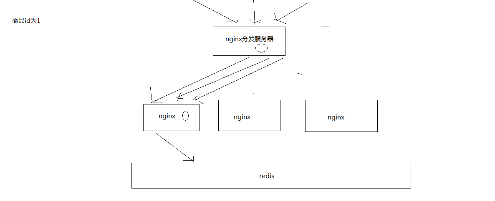


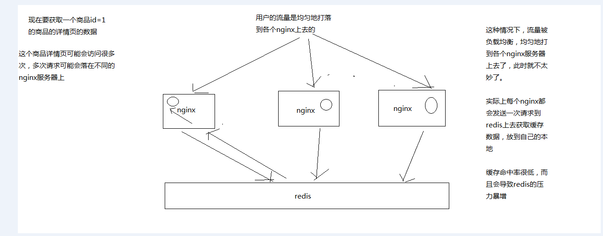


1、缓存命中率低

缓存数据生产服务那一层已经搞定了，相当于三层缓存架构中的本地堆缓存+redis分布式缓存都搞定了

就要来做三级缓存中的nginx那一层的缓存了

如果一般来说，你默认会部署多个nginx，在里面都会放一些缓存，就默认情况下，此时缓存命中率是比较低的

2、如何提升缓存命中率

分发层+应用层，双层nginx

分发层nginx，负责流量分发的逻辑和策略，这个里面它可以根据你自己定义的一些规则，比如根据productId去进行hash，然后对后端的nginx数量取模

将某一个商品的访问的请求，就固定路由到一个nginx后端服务器上去，保证说只会从redis中获取一次缓存数据，后面全都是走nginx本地缓存了

后端的nginx服务器，就称之为应用服务器; 最前端的nginx服务器，被称之为分发服务器

看似很简单，其实很有用，在实际的生产环境中，可以大幅度提升你的nginx本地缓存这一层的命中率，大幅度减少redis后端的压力，提升性能


# 52_基于OpenResty部署应用层nginx以及nginx+lua开发hello world


我们这里玩儿nginx，全都会在nginx里去写lua脚本，因为我们需要自定义一些特殊的业务逻辑

比如说，流量分发，自己用lua去写分发的逻辑，在分发层nginx里去写的

再比如说，要用lua去写多级缓存架构存取的控制逻辑，在应用层nginx里去写的

后面还要做热点数据的自动降级机制，也是用lua脚本去写降级机制的，在分发层nginx里去写的

因为我们要用nginx+lua去开发，所以会选择用最流行的开源方案，就是用OpenResty

nginx+lua打包在一起，而且提供了包括redis客户端，mysql客户端，http客户端在内的大量的组件

我们这一讲是去部署应用层nginx，会采用OpenResty的方式去部署nginx，而且会带着大家写一个nginx+lua开发的一个hello world

1、部署第一个nginx，作为应用层nginx（192.168.31.187那个机器上）

（1）部署openresty

mkdir -p /usr/servers  
cd /usr/servers/

yum install -y readline-devel pcre-devel openssl-devel gcc

wget http://openresty.org/download/ngx_openresty-1.7.7.2.tar.gz  
tar -xzvf ngx_openresty-1.7.7.2.tar.gz  
cd /usr/servers/ngx_openresty-1.7.7.2/

cd bundle/LuaJIT-2.1-20150120/  
make clean && make && make install  
ln -sf luajit-2.1.0-alpha /usr/local/bin/luajit

cd bundle  
wget https://github.com/FRiCKLE/ngx_cache_purge/archive/2.3.tar.gz  
tar -xvf 2.3.tar.gz  

cd bundle  
wget https://github.com/yaoweibin/nginx_upstream_check_module/archive/v0.3.0.tar.gz  
tar -xvf v0.3.0.tar.gz  

cd /usr/servers/ngx_openresty-1.7.7.2  
./configure --prefix=/usr/servers --with-http_realip_module  --with-pcre  --with-luajit --add-module=./bundle/ngx_cache_purge-2.3/ --add-module=./bundle/nginx_upstream_check_module-0.3.0/ -j2  
make && make install 

cd /usr/servers/  
ll

/usr/servers/luajit
/usr/servers/lualib
/usr/servers/nginx
/usr/servers/nginx/sbin/nginx -V 

启动nginx: /usr/servers/nginx/sbin/nginx

（2）nginx+lua开发的hello world

vi /usr/servers/nginx/conf/nginx.conf

在http部分添加：

lua_package_path "/usr/servers/lualib/?.lua;;";  
lua_package_cpath "/usr/servers/lualib/?.so;;";  

/usr/servers/nginx/conf下，创建一个lua.conf

server {  
    listen       80;  
    server_name  _;  
}  

在nginx.conf的http部分添加：

include lua.conf;

验证配置是否正确：

/usr/servers/nginx/sbin/nginx -t

在lua.conf的server部分添加：

location /lua {  
    default_type 'text/html';  
    content_by_lua 'ngx.say("hello world")';  
} 

/usr/servers/nginx/sbin/nginx -t  

重新nginx加载配置

/usr/servers/nginx/sbin/nginx -s reload  

访问http: http://192.168.31.187/lua

vi /usr/servers/nginx/conf/lua/test.lua

ngx.say("hello world"); 

修改lua.conf

location /lua {  
    default_type 'text/html';  
    content_by_lua_file conf/lua/test.lua; 
}

查看异常日志

tail -f /usr/servers/nginx/logs/error.log

（3）工程化的nginx+lua项目结构

项目工程结构

hello
    hello.conf     
    lua              
      hello.lua
    lualib            
      *.lua
      *.so

放在/usr/hello目录下

/usr/servers/nginx/conf/nginx.conf

worker_processes  2;  

error_log  logs/error.log;  

events {  
    worker_connections  1024;  
}  

http {  
    include       mime.types;  
    default_type  text/html;  
  
    lua_package_path "/usr/hello/lualib/?.lua;;";  
    lua_package_cpath "/usr/hello/lualib/?.so;;"; 
    include /usr/hello/hello.conf;  
}  

/usr/hello/hello.conf

server {  
    listen       80;  
    server_name  _;  
  
    location /lua {  
        default_type 'text/html';  
        lua_code_cache off;  
        content_by_lua_file /usr/example/lua/test.lua;  
    }  
}  

2、如法炮制，在另外一个机器上，也用OpenResty部署一个nginx


大家可能会发现说，有的人可能对nginx也不是太懂，对lua也没什么了解

对于我的课程来说，主要还是关注，关注的是我们核心的topic，缓存，缓存，缓存，缓存的各种解决方案，大型缓存的架构

那么对于课程里涉及到的各种技术来说，比如nginx，lua脚本

你说让我给你讲成nginx从入门到精通，也不太现实; 讲一个lua脚本开发从入门到精通，也不太现实

我只能说，跟着整个项目的思路去走，把项目里涉及的相关技术的知识给你讲解一下，然后保证说，带着你手把手的去做，让你至少可以学会项目里讲解的这些知识，可以做出来

如果你后面真的是要自己去用nginx+lua去做项目，其实个人建议你还是得去查询和学习一些更多的资料，nginx的一些知识，lua的一些语法

龙果，最受欢迎的一套课程，就是dubbo实战课程，里面也是dubbo整合了各种技术，active mq，zookeeper，redis 3.0分布式集群，mysql读写分离

但是有个问题，每个课程，我相信一个好的课程，它总是可以让你学到很多知识的

但是任何一个好的课程，它都不是万能的，dubbo，zookeeper，注册中心，zookeeper分布式锁，分布式协调，分布式选举，等等技术，你学到吗？

dubbo它也不可能说是给你把zookeeper，redis，mysql全部讲解到从入门到精通这样子

topic，主题，基于dubbo复杂的分布式系统的通用架构，分布式系统，dubbo rpc的调用，服务的开发; zookeeper注册中心; redis分布式集群; mysql读写分离; tomcat集群; hudson持续集成

它告诉你的是一个通用的分布式系统的架构

我这里的也会带着你做nginx的部署,openresty，nginx+lua的开发，redis集群/高可用/高并发/读写分离/持久化/数据备份恢复，zookeeper分布式锁，kafka去做消息通信，hystrix去做限流

但是任何一个技术都不可能给你从入门到精通讲解完

大家可以去关注一下我的es的课程，你如果录一套课程，基本选择方向就两个，要不就是讲解技术本身，大量案例实战贯穿，把技术本身讲解的很细致

我之前有两个es顶尖高手系列的课程，技术课程，把es这个技术讲解的非常非常的细致

像我们现在这个课程，大规模缓存，支撑高并发，高性能，海量数据，类似之前dubbo实战课程，它讲解的还是一种架构课程，那么就关注点在整个架构的整体，整合，架构方案，架构设计，架构思想

里面涉及的技术是不可能给你去深入讲解的


# 53_部署分发层nginx以及基于lua完成基于商品id的定向流量分发策略


大家可以自己按照上一讲讲解的内容，基于OpenResty在另外两台机器上都部署一下nginx+lua的开发环境

我已经在eshop-cache02和eshop-cache03上都部署好了

我这边的话呢，是打算用eshop-cache01和eshop-cache02作为应用层nginx服务器，用eshop-cache03作为分发层nginx

在eshop-cache03，也就是分发层nginx中，编写lua脚本，完成基于商品id的流量分发策略

当然了，我们这里主要会简化策略，简化业务逻辑，实际上在你的公司中，你可以随意根据自己的业务逻辑和场景，去制定自己的流量分发策略

1、获取请求参数，比如productId
2、对productId进行hash
3、hash值对应用服务器数量取模，获取到一个应用服务器
4、利用http发送请求到应用层nginx
5、获取响应后返回

这个就是基于商品id的定向流量分发的策略，lua脚本来编写和实现

我们作为一个流量分发的nginx，会发送http请求到后端的应用nginx上面去，所以要先引入lua http lib包

cd /usr/hello/lualib/resty/  
wget https://raw.githubusercontent.com/pintsized/lua-resty-http/master/lib/resty/http_headers.lua  
wget https://raw.githubusercontent.com/pintsized/lua-resty-http/master/lib/resty/http.lua 

代码：

local uri_args = ngx.req.get_uri_args()
local productId = uri_args["productId"]

local host = {"192.168.31.19", "192.168.31.187"}
local hash = ngx.crc32_long(productId)
hash = (hash % 2) + 1  
backend = "http://"..host[hash]

local method = uri_args["method"]
local requestBody = "/"..method.."?productId="..productId

local http = require("resty.http")  
local httpc = http.new()  

local resp, err = httpc:request_uri(backend, {  
    method = "GET",  
    path = requestBody
})

if not resp then  
    ngx.say("request error :", err)  
    return  
end

ngx.say(resp.body)  
  
httpc:close() 

/usr/servers/nginx/sbin/nginx -s reload

基于商品id的定向流量分发策略的lua脚本就开发完了，而且也测试过了

我们就可以看到，如果你请求的是固定的某一个商品，那么就一定会将流量打到固定的一个应用nginx上面去


# 54_基于nginx+lua+java完成多级缓存架构的核心业务逻辑（一）


分发层nginx，lua应用，会将商品id，商品店铺id，都转发到后端的应用nginx

/usr/servers/nginx/sbin/nginx -s reload

1、应用nginx的lua脚本接收到请求

2、获取请求参数中的商品id，以及商品店铺id

3、根据商品id和商品店铺id，在nginx本地缓存中尝试获取数据

4、如果在nginx本地缓存中没有获取到数据，那么就到redis分布式缓存中获取数据，如果获取到了数据，还要设置到nginx本地缓存中

但是这里有个问题，建议不要用nginx+lua直接去获取redis数据

因为openresty没有太好的redis cluster的支持包，所以建议是发送http请求到缓存数据生产服务，由该服务提供一个http接口

缓存数生产服务可以基于redis cluster api从redis中直接获取数据，并返回给nginx

cd /usr/hello/lualib/resty/  
wget https://raw.githubusercontent.com/pintsized/lua-resty-http/master/lib/resty/http_headers.lua  
wget https://raw.githubusercontent.com/pintsized/lua-resty-http/master/lib/resty/http.lua 

5、如果缓存数据生产服务没有在redis分布式缓存中没有获取到数据，那么就在自己本地ehcache中获取数据，返回数据给nginx，也要设置到nginx本地缓存中

6、如果ehcache本地缓存都没有数据，那么就需要去原始的服务中拉去数据，该服务会从mysql中查询，拉去到数据之后，返回给nginx，并重新设置到ehcache和redis中

这里先不考虑，后面要专门讲解一套分布式缓存重建并发冲突的问题和解决方案

7、nginx最终利用获取到的数据，动态渲染网页模板

cd /usr/hello/lualib/resty/
wget https://raw.githubusercontent.com/bungle/lua-resty-template/master/lib/resty/template.lua
mkdir /usr/hello/lualib/resty/html
cd /usr/hello/lualib/resty/html
wget https://raw.githubusercontent.com/bungle/lua-resty-template/master/lib/resty/template/html.lua

在hello.conf的server中配置模板位置

set $template_location "/templates";  
set $template_root "/usr/hello/templates";

mkdir /usr/hello/templates

vi product.html

product id: {* productId *}<br/>
product name: {* productName *}<br/>
product picture list: {* productPictureList *}<br/>
product specification: {* productSpecification *}<br/>
product service: {* productService *}<br/>
product color: {* productColor *}<br/>
product size: {* productSize *}<br/>
shop id: {* shopId *}<br/>
shop name: {* shopName *}<br/>
shop level: {* shopLevel *}<br/>
shop good cooment rate: {* shopGoodCommentRate *}<br/>

8、将渲染后的网页模板作为http响应，返回给分发层nginx

hello.conf中：

lua_shared_dict my_cache 128m;

lua脚本中：

local uri_args = ngx.req.get_uri_args()
local productId = uri_args["productId"]
local shopId = uri_args["shopId"]

local cache_ngx = ngx.shared.my_cache

local productCacheKey = "product_info_"..productId
local shopCacheKey = "shop_info_"..shopId

local productCache = cache_ngx:get(productCacheKey)
local shopCache = cache_ngx:get(shopCacheKey)

if productCache == "" or productCache == nil then
	local http = require("resty.http")
	local httpc = http.new()

	local resp, err = httpc:request_uri("http://192.168.31.179:8080",{
  		method = "GET",
  		path = "/getProductInfo?productId="..productId
	})

	productCache = resp.body
	cache_ngx:set(productCacheKey, productCache, 10 * 60)
end

if shopCache == "" or shopCache == nil then
	local http = require("resty.http")
	local httpc = http.new()

	local resp, err = httpc:request_uri("http://192.168.31.179:8080",{
  		method = "GET",
  		path = "/getShopInfo?shopId="..shopId
	})

	shopCache = resp.body
	cache_ngx:set(shopCacheKey, shopCache, 10 * 60)
end

local cjson = require("cjson")
local productCacheJSON = cjson.decode(productCache)
local shopCacheJSON = cjson.decode(shopCache)

local context = {
	productId = productCacheJSON.id,
	productName = productCacheJSON.name,
	productPrice = productCacheJSON.price,
	productPictureList = productCacheJSON.pictureList,
	productSpecification = productCacheJSON.specification,
	productService = productCacheJSON.service,
	productColor = productCacheJSON.color,
	productSize = productCacheJSON.size,
	shopId = shopCacheJSON.id,
	shopName = shopCacheJSON.name,
	shopLevel = shopCacheJSON.level,
	shopGoodCommentRate = shopCacheJSON.goodCommentRate
}

local template = require("resty.template")
template.render("product.html", context)


# 55_基于nginx+lua+java完成多级缓存架构的核心业务逻辑（二）


/usr/servers/nginx/sbin/nginx -s reload

lua_shared_dict my_cache 128m;

<html>
	<head>
		<meta http-equiv="Content-Type" content="text/html; charset=UTF-8">
		<title>商品详情页</title>
	</head>
<body>
商品id: {* productId *}<br/>
商品名称: {* productName *}<br/>
商品图片列表: {* productPictureList *}<br/>
商品规格: {* productSpecification *}<br/>
商品售后服务: {* productService *}<br/>
商品颜色: {* productColor *}<br/>
商品大小: {* productSize *}<br/>
店铺id: {* shopId *}<br/>
店铺名称: {* shopName *}<br/>
店铺评级: {* shopLevel *}<br/>
店铺好评率: {* shopGoodCommentRate *}<br/>
</body>
</html>

# 56_基于nginx+lua+java完成多级缓存架构的核心业务逻辑（三）

/usr/servers/nginx/sbin/nginx -s reload

<html>
        <head>
                <meta http-equiv="Content-Type" content="text/html; charset=UTF-8">
                <title>商品详情页</title>
        </head>
<body>
商品id: {* productId *}<br/>
商品名称: {* productName *}<br/>
商品图片列表: {* productPictureList *}<br/>
商品规格: {* productSpecification *}<br/>
商品售后服务: {* productService *}<br/>
商品颜色: {* productColor *}<br/>
商品大小: {* productSize *}<br/>
店铺id: {* shopId *}<br/>
店铺名称: {* shopName *}<br/>
店铺等级: {* shopLevel *}<br/>
店铺好评率: {* shopGoodCommentRate *}<br/>
</body>
</html>

第一次访问的时候，其实在nginx本地缓存中是取不到的，所以会发送http请求到后端的缓存服务里去获取，会从redis中获取

拿到数据以后，会放到nginx本地缓存里面去，过期时间是10分钟

然后将所有数据渲染到模板中，返回模板

以后再来访问的时候，就会直接从nginx本地缓存区获取数据了

缓存数据生产 -> 有数据变更 -> 主动更新两级缓存（ehcache+redis）-> 缓存维度化拆分

分发层nginx + 应用层nginx -> 自定义流量分发策略提高缓存命中率

nginx shared dict缓存 -> 缓存服务 -> redis -> ehcache -> 渲染html模板 -> 返回页面

还差最后一个很关键的要点，就是如果你的数据在nginx -> redis -> ehcache三级缓存都不在了，可能就是被LRU清理掉了

这个时候缓存服务会重新拉去数据，去更新到ehcache和redis中，这里我们还没讲解

分布式的缓存重建的并发问题


# 57_分布式缓存重建并发冲突问题以及zookeeper分布式锁解决方案

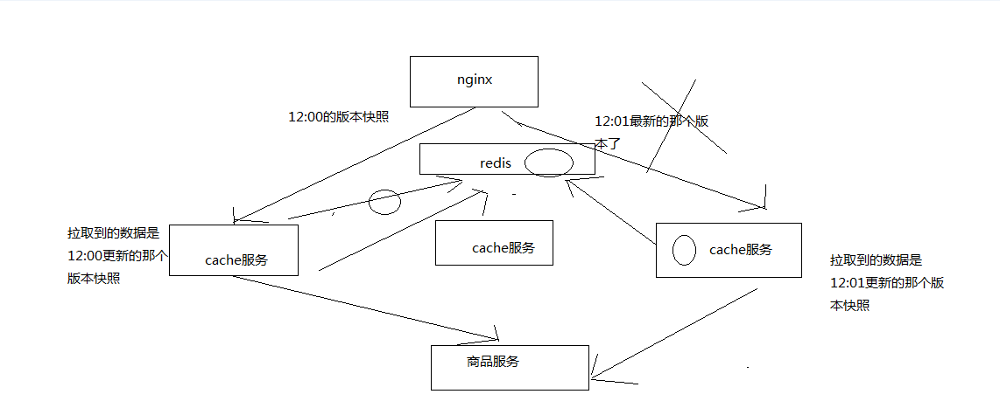

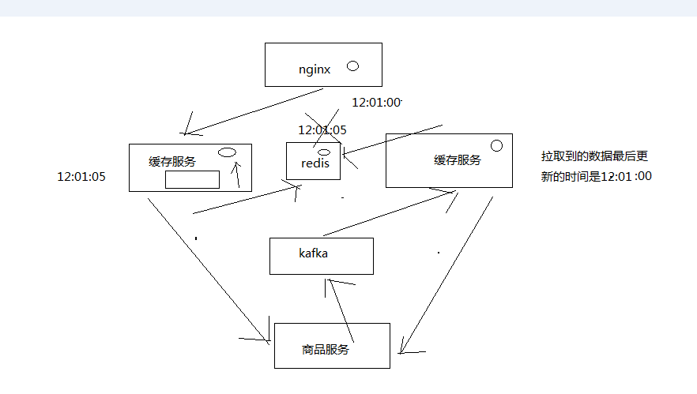

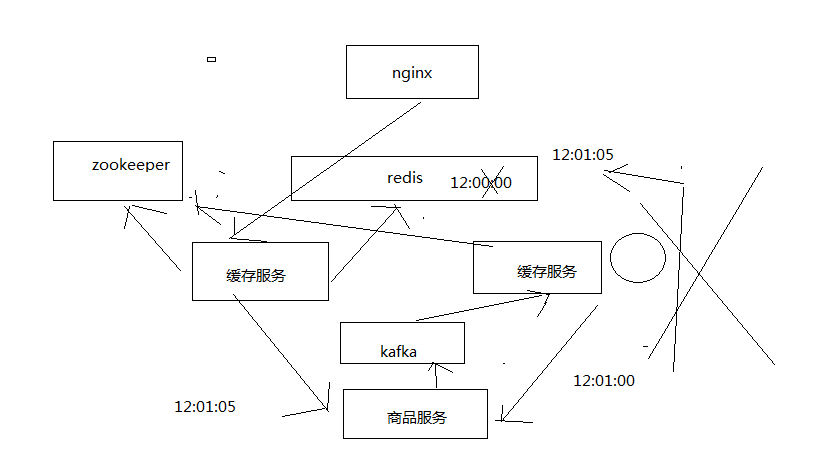


整个三级缓存的架构已经走通了

我们还遇到一个问题，就是说，如果缓存服务在本地的ehcache中都读取不到数据，那就恩坑爹了

这个时候就意味着，需要重新到源头的服务中去拉去数据，拉取到数据之后，赶紧先给nginx的请求返回，同时将数据写入ehcache和redis中

分布式重建缓存的并发冲突问题

重建缓存：比如我们这里，数据在所有的缓存中都不存在了（LRU算法弄掉了），就需要重新查询数据写入缓存，重建缓存

分布式的重建缓存，在不同的机器上，不同的服务实例中，去做上面的事情，就会出现多个机器分布式重建去读取相同的数据，然后写入缓存中

分布式重建缓存的并发冲突问题。。。。。。

1、流量均匀分布到所有缓存服务实例上

应用层nginx，是将请求流量均匀地打到各个缓存服务实例中的，可能咱们的eshop-cache那个服务，可能会部署多实例在不同的机器上

2、应用层nginx的hash，固定商品id，走固定的缓存服务实例

分发层的nginx的lua脚本，是怎么写的，怎么玩儿的，搞一堆应用层nginx的地址列表，对每个商品id做一个hash，然后对应用nginx数量取模

将每个商品的请求固定分发到同一个应用层nginx上面去

在应用层nginx里，发现自己本地lua shared dict缓存中没有数据的时候，就采取一样的方式，对product id取模，然后将请求固定分发到同一个缓存服务实例中去

这样的话，就不会出现说多个缓存服务实例分布式的去更新那个缓存了

留个作业，大家去做吧，这个东西，之前已经讲解果了，lua脚本几乎都是一模一样的，我们就不去做了，节省点时间

3、源信息服务发送的变更消息，需要按照商品id去分区，固定的商品变更走固定的kafka分区，也就是固定的一个缓存服务实例获取到

缓存服务，是监听kafka topic的，一个缓存服务实例，作为一个kafka consumer，就消费topic中的一个partition

所以你有多个缓存服务实例的话，每个缓存服务实例就消费一个kafka partition

所以这里，一般来说，你的源头信息服务，在发送消息到kafka topic的时候，都需要按照product id去分区

也就时说，同一个product id变更的消息一定是到同一个kafka partition中去的，也就是说同一个product id的变更消息，一定是同一个缓存服务实例消费到的

我们也不去做了，其实很简单，kafka producer api，里面send message的时候，多加一个参数就可以了，product id传递进去，就可以了

4、问题是，自己写的简易的hash分发，与kafka的分区，可能并不一致！！！

我们自己写的简易的hash分发策略，是按照crc32去取hash值，然后再取模的

关键你又不知道你的kafka producer的hash策略是什么，很可能说跟我们的策略是不一样的

拿就可能导致说，数据变更的消息所到的缓存服务实例，跟我们的应用层nginx分发到的那个缓存服务实例也许就不在一台机器上了

这样的话，在高并发，极端的情况下，可能就会出现冲突

5、分布式的缓存重建并发冲突问题发生了。。。

6、基于zookeeper分布式锁的解决方案

分布式锁，如果你有多个机器在访问同一个共享资源，那么这个时候，如果你需要加个锁，让多个分布式的机器在访问共享资源的时候串行起来

那么这个时候，那个锁，多个不同机器上的服务共享的锁，就是分布式锁

分布式锁当然有很多种不同的实现方案，redis分布式锁，zookeeper分布式锁

zk，做分布式协调这一块，还是很流行的，大数据应用里面，hadoop，storm，都是基于zk去做分布式协调

zk分布式锁的解决并发冲突的方案

（1）变更缓存重建以及空缓存请求重建，更新redis之前，都需要先获取对应商品id的分布式锁
（2）拿到分布式锁之后，需要根据时间版本去比较一下，如果自己的版本新于redis中的版本，那么就更新，否则就不更新
（3）如果拿不到分布式锁，那么就等待，不断轮询等待，直到自己获取到分布式的锁


# 58_缓存数据生产服务中的zk分布式锁解决方案的代码实现（一）


zk分布式锁的代码封装

zookeeper java client api去封装连接zk，以及获取分布式锁，还有释放分布式锁的代码

先简单介绍一下zk分布式锁的原理

我们通过去创建zk的一个临时node，来模拟给摸一个商品id加锁

zk会给你保证说，只会创建一个临时node，其他请求过来如果再要创建临时node，就会报错，NodeExistsException

那么所以说，我们的所谓上锁，其实就是去创建某个product id对应的一个临时node

如果临时node创建成功了，那么说明我们成功加锁了，此时就可以去执行对redis立面数据的操作

如果临时node创建失败了，说明有人已经在拿到锁了，在操作reids中的数据，那么就不断的等待，直到自己可以获取到锁为止

基于zk client api，去封装上面的这个代码逻辑

释放一个分布式锁，去删除掉那个临时node就可以了，就代表释放了一个锁，那么此时其他的机器就可以成功创建临时node，获取到锁

即使是用zk去实现一个分布式锁，也有很多种做法，有复杂的，也有简单的

应该说，我演示的这种分布式锁的做法，是非常简单的一种，但是很实用，大部分情况下，用这种简单的分布式锁都能搞定

<dependency>
    <groupId>org.apache.zookeeper</groupId>
    <artifactId>zookeeper</artifactId>
    <version>3.4.5</version>
</dependency>

/**
 * ZooKeeperSession
 * @author Administrator
 *
 */
public class ZooKeeperSession {
	
	private static CountDownLatch connectedSemaphore = new CountDownLatch(1);
	
	private ZooKeeper zookeeper;

	public ZooKeeperSession() {
		// 去连接zookeeper server，创建会话的时候，是异步去进行的
		// 所以要给一个监听器，说告诉我们什么时候才是真正完成了跟zk server的连接
		try {
			this.zookeeper = new ZooKeeper(
					"192.168.31.187:2181,192.168.31.19:2181,192.168.31.227:2181", 
					50000, 
					new ZooKeeperWatcher());
			// 给一个状态CONNECTING，连接中
			System.out.println(zookeeper.getState());
			
			try {
				// CountDownLatch
				// java多线程并发同步的一个工具类
				// 会传递进去一些数字，比如说1,2 ，3 都可以
				// 然后await()，如果数字不是0，那么久卡住，等待
				
				// 其他的线程可以调用coutnDown()，减1
				// 如果数字减到0，那么之前所有在await的线程，都会逃出阻塞的状态
				// 继续向下运行
				
				connectedSemaphore.await();
			} catch(InterruptedException e) {
				e.printStackTrace();
			}

			System.out.println("ZooKeeper session established......");
		} catch (Exception e) {
			e.printStackTrace();
		}
	}
	
	/**
	 * 获取分布式锁
	 * @param productId
	 */
	public void acquireDistributedLock(Long productId) {
		String path = "/product-lock-" + productId;
	
		try {
			zookeeper.create(path, "".getBytes(), 
					Ids.OPEN_ACL_UNSAFE, CreateMode.EPHEMERAL);
			System.out.println("success to acquire lock for product[id=" + productId + "]");  
		} catch (Exception e) {
			// 如果那个商品对应的锁的node，已经存在了，就是已经被别人加锁了，那么就这里就会报错
			// NodeExistsException
			int count = 0;
			while(true) {
				try {
					Thread.sleep(20); 
					zookeeper.create(path, "".getBytes(), 
							Ids.OPEN_ACL_UNSAFE, CreateMode.EPHEMERAL);
				} catch (Exception e2) {
					e2.printStackTrace();
					count++;
					continue;
				}
				System.out.println("success to acquire lock for product[id=" + productId + "] after " + count + " times try......");
				break;
			}
		}
	}
	
	/**
	 * 释放掉一个分布式锁
	 * @param productId
	 */
	public void releaseDistributedLock(Long productId) {
		String path = "/product-lock-" + productId;
		try {
			zookeeper.delete(path, -1); 
		} catch (Exception e) {
			e.printStackTrace();
		}
	}
	
	/**
	 * 建立zk session的watcher
	 * @author Administrator
	 *
	 */
	private class ZooKeeperWatcher implements Watcher {

		public void process(WatchedEvent event) {
			System.out.println("Receive watched event: " + event.getState());
			if(KeeperState.SyncConnected == event.getState()) {
				connectedSemaphore.countDown();
			} 
		}
		
	}
	
	/**
	 * 封装单例的静态内部类
	 * @author Administrator
	 *
	 */
	private static class Singleton {
		
		private static ZooKeeperSession instance;
		
		static {
			instance = new ZooKeeperSession();
		}
		
		public static ZooKeeperSession getInstance() {
			return instance;
		}
		
	}
	
	/**
	 * 获取单例
	 * @return
	 */
	public static ZooKeeperSession getInstance() {
		return Singleton.getInstance();
	}
	
	/**
	 * 初始化单例的便捷方法
	 */
	public static void init() {
		getInstance();
	}
	
}


# 59_缓存数据生产服务中的zk分布式锁解决方案的代码实现（二）


业务代码

1、主动更新

监听kafka消息队列，获取到一个商品变更的消息之后，去哪个源服务中调用接口拉取数据，更新到ehcache和redis中

先获取分布式锁，然后才能更新redis，同时更新时要比较时间版本

2、被动重建

直接读取源头数据，直接返回给nginx，同时推送一条消息到一个队列，后台线程异步消费

后台现成负责先获取分布式锁，然后才能更新redis，同时要比较时间版本


# 60_缓存数据生产服务中的zk分布式锁解决方案的代码实现（三）