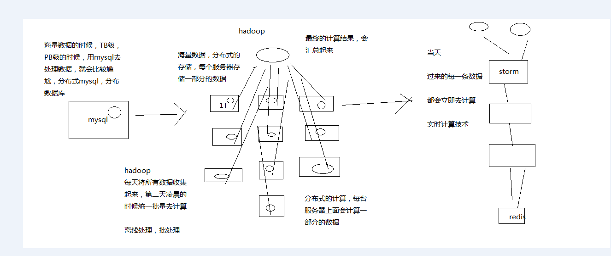
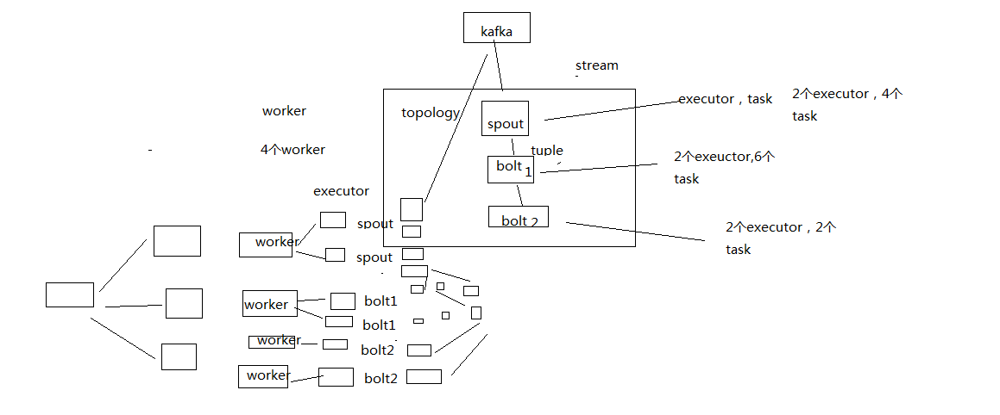
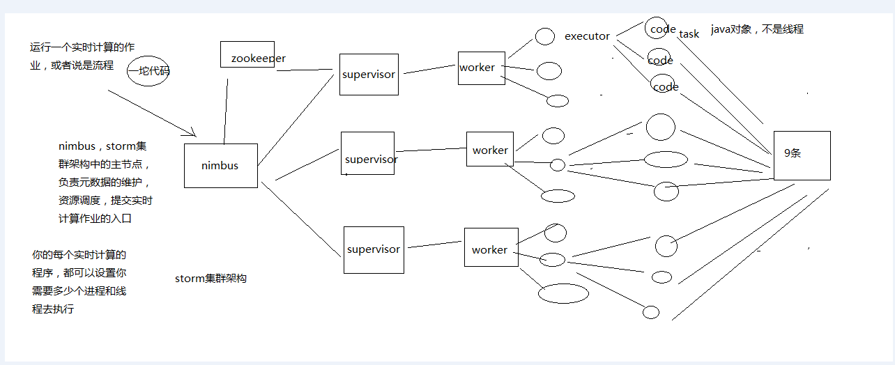
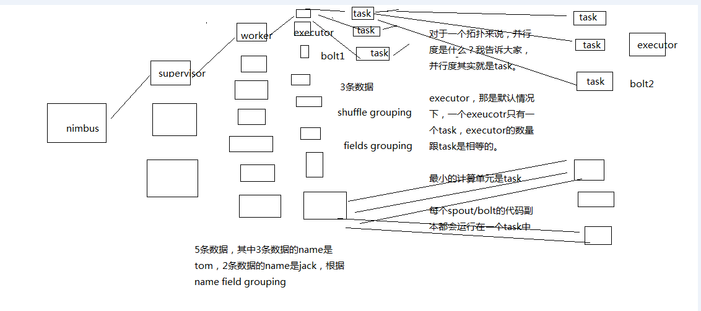
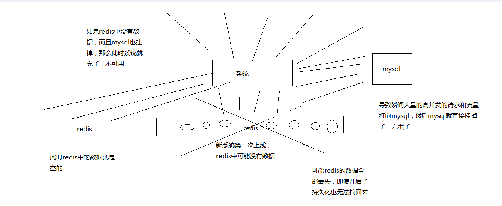
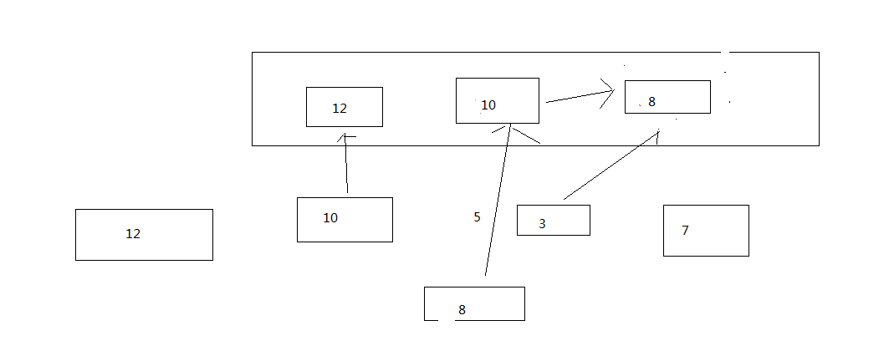
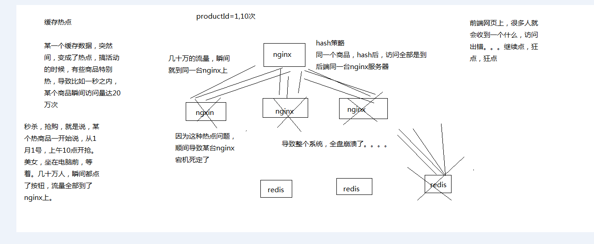
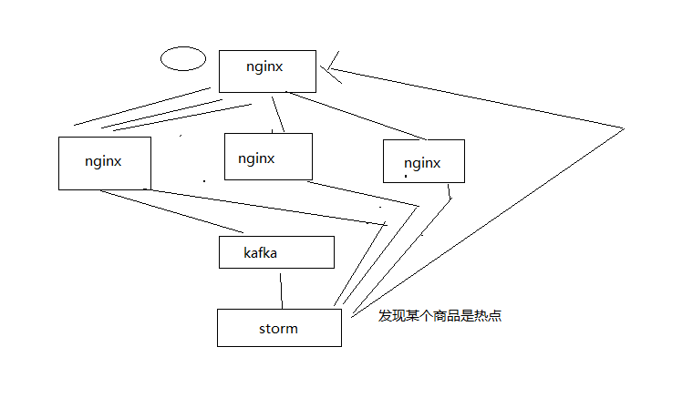

<!-- TOC -->

- [61_Java程序员、缓存架构以及Storm大数据实时计算之间的关系](#61_java程序员缓存架构以及storm大数据实时计算之间的关系)
- [62_讲给Java工程师的史上最通俗易懂Storm教程：大白话介绍](#62_讲给java工程师的史上最通俗易懂storm教程大白话介绍)
- [63_讲给Java工程师的史上最通俗易懂Storm教程：大白话讲集群架构与核心概念](#63_讲给java工程师的史上最通俗易懂storm教程大白话讲集群架构与核心概念)
- [64_讲给Java工程师的史上最通俗易懂Storm教程：大白话讲并行度和流分组](#64_讲给java工程师的史上最通俗易懂storm教程大白话讲并行度和流分组)
- [65_讲给Java工程师的史上最通俗易懂Storm教程：纯手敲WordCount程序](#65_讲给java工程师的史上最通俗易懂storm教程纯手敲wordcount程序)
- [66_讲给Java工程师的史上最通俗易懂Storm教程：纯手工集群部署](#66_讲给java工程师的史上最通俗易懂storm教程纯手工集群部署)
- [67_讲给Java工程师的史上最通俗易懂Storm教程：基于集群运行计算拓扑](#67_讲给java工程师的史上最通俗易懂storm教程基于集群运行计算拓扑)
- [68_缓存冷启动问题：新系统上线、redis彻底崩溃导致数据无法恢复](#68_缓存冷启动问题新系统上线redis彻底崩溃导致数据无法恢复)
- [69_缓存预热解决方案：基于storm实时热点统计的分布式并行缓存预热](#69_缓存预热解决方案基于storm实时热点统计的分布式并行缓存预热)
- [70_基于nginx+lua完成商品详情页访问流量实时上报kafka的开发](#70_基于nginxlua完成商品详情页访问流量实时上报kafka的开发)
- [71_基于storm+kafka+LRUMap完成商品访问次数实时统计拓扑的开发](#71_基于stormkafkalrumap完成商品访问次数实时统计拓扑的开发)
- [72_基于storm完成LRUMap中topn热门商品列表的算法讲解与编写](#72_基于storm完成lrumap中topn热门商品列表的算法讲解与编写)
- [73_基于storm+zookeeper以及分布式锁完成热门商品列表的分段存储](#73_基于stormzookeeper以及分布式锁完成热门商品列表的分段存储)
- [74_基于双重zookeeper分布式锁完成分布式并行缓存预热的代码开发](#74_基于双重zookeeper分布式锁完成分布式并行缓存预热的代码开发)
- [75_将缓存预热解决方案的代码运行后观察效果以及调试和修复所有的bug](#75_将缓存预热解决方案的代码运行后观察效果以及调试和修复所有的bug)
- [76_热点缓存问题：促销抢购时的超级热门商品可能导致系统全盘崩溃的场景](#76_热点缓存问题促销抢购时的超级热门商品可能导致系统全盘崩溃的场景)
- [77_基于nginx+lua+storm的热点缓存的流量分发策略自动降级解决方案](#77_基于nginxluastorm的热点缓存的流量分发策略自动降级解决方案)
- [78_在storm拓扑中加入热点缓存实时自动识别和感知的代码逻辑](#78_在storm拓扑中加入热点缓存实时自动识别和感知的代码逻辑)
- [79_在storm拓扑中加入nginx反向推送缓存热点与缓存数据的代码逻辑](#79_在storm拓扑中加入nginx反向推送缓存热点与缓存数据的代码逻辑)
- [80_在流量分发+后端应用双层nginx中加入接收热点缓存数据的接口](#80_在流量分发后端应用双层nginx中加入接收热点缓存数据的接口)
- [81_在nginx+lua中实现热点缓存自动降级为负载均衡流量分发策略的逻辑](#81_在nginxlua中实现热点缓存自动降级为负载均衡流量分发策略的逻辑)
- [82_在storm拓扑中加入热点缓存消失的实时自动识别和感知的代码逻辑](#82_在storm拓扑中加入热点缓存消失的实时自动识别和感知的代码逻辑)
- [83_将热点缓存自动降级解决方案的代码运行后观察效果以及调试和修复bug](#83_将热点缓存自动降级解决方案的代码运行后观察效果以及调试和修复bug)

<!-- /TOC -->

# 61_Java程序员、缓存架构以及Storm大数据实时计算之间的关系

接下来，我们是要讲解这个商品详情页缓存架构，缓存预热问题和解决方案，缓存热点数据可能导致整个系统崩溃的问题，以及解决方案

缓存，热，预热，热数据

解决方案，和架构设计中，会引入大数据的实时计算的技术，storm

为什么要引入这个storm，难道必须是storm吗？我们后面去讲解那个解决方案的时候再说

java工程师，storm的关系是什么呢，缓存架构和storm的关系

缓存架构和storm的关系，因为有些热点数据相关的一些实时处理的一些方案，比如快速预热，热点数据的实时感知和快速降级，全部要用到storm

因为我们可能需要实时的去计算出热点缓存数据，实时计算，亿级流量，高并发，大量的请求过来

这个时候，你要做一些实时的计算，那么必须涉及到分布式的一些技术，分布式的技术，才能处理高并发，大量的请求

目前在时候计算的领域，最成熟的大数据的技术，就是storm

storm分布式的大数据实时计算的技术/系统

java工程师，我跟storm之间的关系是什么？

1、介绍，我自己本身这么多年，一直在大公司，BAT公司，一线的大互联网公司，我认识的很多的java工程师

java开发和架构，后来开始大数据的架构

大公司里的很多java工程师，都是会用一些大数据的一些技术的，比如storm，或者hbase，或者zookeeper，或者hive，spark

因为在大公司里，容易遇到一些复杂的挑战和场景，比如高并发，海量数据，场景

你做一些java先关的项目，和系统，可能也会遇到这种问题，很多时候，直接用大数据的一些技术，实时计算，你是自己去写个系统，还是用现成的storm

更好的选择时用storm，成熟

我也只是说部分java的人，但是也有很多搞java的工程师就是纯java技术栈

2、java系统跟大数据技术的关系

（1）大数据不仅仅只是大数据工程师要关注的东西

（2）大数据也是Java程序员在构建各类系统的时候一种全新的思维，以及架构理念，比如Storm，Hive，Spark，ZooKeeper，HBase，Elasticsearch，等等

（3）举例说明

Storm：实时缓存热点数据统计->缓存预热->缓存热点数据自动降级

Hive：Hadoop生态栈里面，做数据仓库的一个系统，高并发访问下，海量请求日志的批量统计分析，日报周报月报，接口调用情况，业务使用情况，等等

我所知，在一些大公司里面，是有些人是将海量的请求日志打到hive里面，做离线的分析，然后反过来去优化自己的系统

Spark：离线批量数据处理，比如从DB中一次性批量处理几亿数据，清洗和处理后写入Redis中供后续的系统使用，大型互联网公司的用户相关数据

ZooKeeper：分布式系统的协调，分布式锁，分布式选举->高可用HA架构，轻量级元数据存储

用java开发了分布式的系统架构，你的整套系统拆分成了多个部分，每个部分都会负责一些功能，互相之间需要交互和协调

服务A说，我在处理某件事情的时候，服务B你就别处理了

服务A说，我一旦发生了某些状况，希望服务B你立即感知到，然后做出相应的对策

HBase：海量数据的在线存储和简单查询，替代MySQL分库分表，提供更好的伸缩性

java底层，对应的是海量数据，然后要做一些简单的存储和查询，同时数据增多的时候要快速扩容

mysql分库分表就不太合适了，mysql分库分表扩容，还是比较麻烦的

Elasticsearch：海量数据的复杂检索以及搜索引擎的构建，支撑有大量数据的各种企业信息化系统的搜索引擎，电商/新闻等网站的搜索引擎，等等

mysql的like "%xxxx%"，更加合适一些，性能更加好

大家不要说觉得来听课程，就必须每堂课都是代码，代码，代码，就不喜欢听我这些废话

我告诉大家，这些还真不是废话，代码很重要，手写代码，copy。我可能做为一个过来人，很多项目都做过，很多技术都用过，也做过。

比较我的角度，去给大家讲一讲，行业，一些技术领域的问题

# 62_讲给Java工程师的史上最通俗易懂Storm教程：大白话介绍

这块给大家解释一下，就是说，有些技术我们可能就是简单带着大家去用一下就好了

nginx，java，一般都会一些

kafka，zookeeper，lua，我觉得，那些东西的话，主要是讲解基于他们的一些架构，和解决方案的设计还有开发

redis：跟我们的这个topic是很有关系的，大型缓存架构，高并发高性能高可用的缓存架构的底层支持，redis，细致的去讲解，那块redis技术和知识是本套课程的一个重点

数据库+缓存双写，多级缓存架构，大家重点去理解里面的方案设计和架构思想

热数据的处理，缓存雪崩 --> storm，hystrix

对于这两个技术，都是关键性的会去影响你的热数据，缓存雪崩时的系统可用性和稳定性

对这两个技术，storm，hystrix，都很重要

会类似redis，花费较多的篇幅去给大家讲解一下，让大家可以把这两个技术同时也学习的非常好

正好跟着我们的大的项目实战在走，学完以后，直接可以学以致用，用到我们的系统架构中去

kafka，消息队列，用起来很简单，而且搞java得一般来说，对消息队列都有一些了解吧，而且到了真实的生产环境中，kafka你是可以换成其他的技术，Active MQ，Rabbit MQ，Rocket MQ

zookeeper，分布式锁，分布式锁，搞java一般也会知道一些，zk去做，redis去做锁也是可以的

lua，大家后面真的是要用到lua，觉得课程里讲解的东西不够，可以自己去网上查一些lua的语法可以了，语法是最最简单的

storm，说句实话，在做热数据这块，如果要做复杂的热数据的统计和分析，亿流量，高并发的场景下，我还真觉得，最合适的技术就是storm，没有其他

缓存架构，热数据先关的架构设计，热数据相关的架构中最重要的唯一的可选技术，storm，好好的去讲一下的

hystrix，分布式系统的高可用性的限流，熔断，降级，等等，一些措施，缓存雪崩的方案，限流的技术

讲给Java工程师的史上最通俗易懂Storm教程

讲给Java工程师：我知道你没什么大数据的背景和经验，基础，那么我就把你当做一个大数据小白，主要是java背景和基础

史上最通俗易懂：市面上其他的storm视频课程，或者是一些书籍，我告诉，storm还是挺难的，事务，云里雾里，云里雾里

搞storm大数据的，连这个并行度和流分组的本质它都说不清楚，因为市面上的资料也说不清楚

会把你当做小白，用最最通俗易懂的语言，给你去讲解这块的知识，画图

一、Storm到底是什么？

1、mysql，hadoop与storm

mysql：事务性系统，面临海量数据的尴尬
hadoop：离线批处理
storm：实时计算

2、我们能不能自己搞一套storm？

来一条数据，我理解就算一条，来一条，算一条

坑，海量高并发大数据，高并发的请求数据，分布式的系统，流式处理的分布式系统

如果自己搞一套实时流系统出来，也是可以的，但是。。。。

（1）花费大量的时间在底层技术细节上：如何部署各种中间队列，节点间的通信，容错，资源调配，计算节点的迁移和部署，等等

（2）花费大量的时间在系统的高可用上问题上：如何保证各种节点能够高可用稳定运行

（3）花费大量的时间在系统扩容上：吞吐量需要扩容的时候，你需要花费大量的时间去增加节点，修改配置，测试，等等

5万/s，10万/s，扩容

国内，国产的实时大数据计算系统，唯一做出来的，做得好的，做得影响力特别大，特别牛逼的，就是JStorm，阿里

阿里，技术实力，世界一流，顶尖，国内顶尖，一流

JStorm，clojure编程预压，Java重新写了一遍，Galaxy流式计算的系统，百度，腾讯，也都自己做了，也能做得很好

3、storm的特点是什么？

（1）支撑各种实时类的项目场景：实时处理消息以及更新数据库，基于最基础的实时计算语义和API（实时数据处理领域）；对实时的数据流持续的进行查询或计算，同时将最新的计算结果持续的推送给客户端展示，同样基于最基础的实时计算语义和API（实时数据分析领域）；对耗时的查询进行并行化，基于DRPC，即分布式RPC调用，单表30天数据，并行化，每个进程查询一天数据，最后组装结果

storm做各种实时类的项目都ok

（2）高度的可伸缩性：如果要扩容，直接加机器，调整storm计算作业的并行度就可以了，storm会自动部署更多的进程和线程到其他的机器上去，无缝快速扩容

扩容起来，超方便

（3）数据不丢失的保证：storm的消息可靠机制开启后，可以保证一条数据都不丢

数据不丢失，也不重复计算

（4）超强的健壮性：从历史经验来看，storm比hadoop、spark等大数据类系统，健壮的多的多，因为元数据全部放zookeeper，不在内存中，随便挂都不要紧

特别的健壮，稳定性和可用性很高

（5）使用的便捷性：核心语义非常的简单，开发起来效率很高

用起来很简单，开发API还是很简单的

# 63_讲给Java工程师的史上最通俗易懂Storm教程：大白话讲集群架构与核心概念

大白话讲解

二、Storm的集群架构以及核心概念

1、Storm的集群架构

Nimbus，Supervisor，ZooKeeper，Worker，Executor，Task

2、Storm的核心概念

Topology，Spout，Bolt，Tuple，Stream

拓扑：务虚的一个概念

Spout：数据源的一个代码组件，就是我们可以实现一个spout接口，写一个java类，在这个spout代码中，我们可以自己尝试去数据源获取数据，比如说从kafka中消费数据

bolt：一个业务处理的代码组件，spout会将数据传送给bolt，各种bolt还可以串联成一个计算链条，java类实现了一个bolt接口

一堆spout+bolt，就会组成一个topology，就是一个拓扑，实时计算作业，spout+bolt，一个拓扑涵盖数据源获取/生产+数据处理的所有的代码逻辑，topology

tuple：就是一条数据，每条数据都会被封装在tuple中，在多个spout和bolt之间传递

stream：就是一个流，务虚的一个概念，抽象的概念，源源不断过来的tuple，就组成了一条数据流

# 64_讲给Java工程师的史上最通俗易懂Storm教程：大白话讲并行度和流分组

三、Storm的并行度以及流分组

因为我们在这里，是讲给java工程师的storm教程

所以我期望的场景是，你们所在的公司，基本上来说，已经有大数据团队，有人在维护storm集群

我觉得，对于java工程师来说，先不说精通storm

至少说，对storm的核心的基本原理，门儿清，你都很清楚，集群架构、核心概念、并行度和流分组

接下来，掌握最常见的storm开发范式，spout消费kafka，后面跟一堆bolt，bolt之间设定好流分组的策略

在bolt中填充各种代码逻辑

了解如何将storm拓扑打包后提交到storm集群上去运行

掌握如何能够通过storm ui去查看你的实时计算拓扑的运行现状

你在一个公司里，如果说，需要在你的java系统架构中，用到一些类似storm的大数据技术，如果已经有人维护了storm的集群

那么此时你就可以直接用，直接掌握如何开发和部署即可

但是，当然了，如果说，恰巧没人负责维护storm集群，也没什么大数据的团队，那么你可能需要说再去深入学习一下storm

当然了，如果你的场景不是特别复杂，整个数据量也不是特别大，其实自己主要研究一下，怎么部署storm集群

你自己部署一个storm集群，也ok

好多年前，我第一次接触storm的时候，真的，我觉得都没几个人能彻底讲清楚，用一句话讲清楚什么是并行度，什么是流分组

很多时候，你以外你明白了，其实你不明白

比如我经常面试一些做过storm的人过来，我就问一个问题，就知道它的水深水浅，流分组的时候，数据在storm集群中的流向，你画一下

比如你自己随便设想一个拓扑结果出来，几个spout，几个bolt，各种流分组情况下，数据是怎么流向的，要求具体画出集群架构中的流向

worker，executor，task，supervisor，流的

几乎没几个人能画对，为什么呢，很多人就没搞明白这个并行度和流分组到底是什么

并行度：Worker->Executor->Task，没错，是Task

流分组：Task与Task之间的数据流向关系

Shuffle Grouping：随机发射，负载均衡
Fields Grouping：根据某一个，或者某些个，fields，进行分组，那一个或者多个fields如果值完全相同的话，那么这些tuple，就会发送给下游bolt的其中固定的一个task

你发射的每条数据是一个tuple，每个tuple中有多个field作为字段

比如tuple，3个字段，name，age，salary

{"name": "tom", "age": 25, "salary": 10000} -> tuple -> 3个field，name，age，salary

All Grouping
Global Grouping
None Grouping
Direct Grouping
Local or Shuffle Grouping

# 65_讲给Java工程师的史上最通俗易懂Storm教程：纯手敲WordCount程序

storm核心的基本原理，都了解了

写一下代码，去体验一下，storm的程序是怎么开发的，通过了解了代码之后，再回头，你去看一下之前讲解的一些基本原理，就很清楚了

大数据，入门程序，wordcount，单词计数

你可以认为，storm源源不断的接收到一些句子，然后你需要实时的统计出句子中每个单词的出现次数

（1）搭建工程环境

<?xml version="1.0" encoding="UTF-8"?>
<project xmlns="http://maven.apache.org/POM/4.0.0" xmlns:xsi="http://www.w3.org/2001/XMLSchema-instance" xsi:schemaLocation="http://maven.apache.org/POM/4.0.0 http://maven.apache.org/xsd/maven-4.0.0.xsd">

  <modelVersion>4.0.0</modelVersion>
  <artifactId>storm-wordcount</artifactId>
  <packaging>jar</packaging>

  <name>storm-wordcount</name>

  <properties>
    <project.build.sourceEncoding>UTF-8</project.build.sourceEncoding>
  </properties>

  <dependencies>
    <dependency>
      <groupId>org.apache.storm</groupId>
      <artifactId>storm-core</artifactId>
      <version>1.1.0</version>
    </dependency>
    <dependency>
      <groupId>commons-collections</groupId>
      <artifactId>commons-collections</artifactId>
      <version>3.2.1</version>
    </dependency>
    <dependency>
      <groupId>com.google.guava</groupId>
      <artifactId>guava</artifactId>
    </dependency>
  </dependencies>

  <build>
    <sourceDirectory>src/main/java</sourceDirectory>
    <testSourceDirectory>test/main/java</testSourceDirectory>

    <plugins>
        <plugin>
            <groupId>org.apache.maven.plugins</groupId>
            <artifactId>maven-shade-plugin</artifactId>
            <configuration>
                <createDependencyReducedPom>true</createDependencyReducedPom>
                <filters>
                    <filter>
                        <artifact>*:*</artifact>
                        <excludes>
                            <exclude>META-INF/*.SF</exclude>
                            <exclude>META-INF/*.sf</exclude>
                            <exclude>META-INF/*.DSA</exclude>
                            <exclude>META-INF/*.dsa</exclude>
                            <exclude>META-INF/*.RSA</exclude>
                            <exclude>META-INF/*.rsa</exclude>
                            <exclude>META-INF/*.EC</exclude>
                            <exclude>META-INF/*.ec</exclude>
                            <exclude>META-INF/MSFTSIG.SF</exclude>
                            <exclude>META-INF/MSFTSIG.RSA</exclude>
                        </excludes>
                    </filter>
                </filters>
            </configuration>
            <executions>
                <execution>
                    <phase>package</phase>
                    <goals>
                        <goal>shade</goal>
                    </goals>
                    <configuration>
                        <transformers>
                            <transformer implementation="org.apache.maven.plugins.shade.resource.ServicesResourceTransformer" />
                            <transformer implementation="org.apache.maven.plugins.shade.resource.ManifestResourceTransformer">
                            </transformer>
                        </transformers>
                    </configuration>
                </execution>
            </executions>
        </plugin>

      <plugin>
        <groupId>org.codehaus.mojo</groupId>
        <artifactId>exec-maven-plugin</artifactId>
        <version>1.2.1</version>
        <executions>
          <execution>
            <goals>
              <goal>exec</goal>
            </goals>
          </execution>
        </executions>
        <configuration>
          <executable>java</executable>
          <includeProjectDependencies>true</includeProjectDependencies>
          <includePluginDependencies>false</includePluginDependencies>
          <classpathScope>compile</classpathScope>
          <mainClass></mainClass>
        </configuration>
      </plugin>
    </plugins>
  </build>
</project>

（2）编写代码

public class WordCountTopology {

	public static class RandomSentenceSpout extends BaseRichSpout {

	  SpoutOutputCollector _collector;
	  Random _rand;

	  @Override
	  public void open(Map conf, TopologyContext context, SpoutOutputCollector collector) {
	    _collector = collector;
	    _rand = new Random();
	  }

	  @Override
	  public void nextTuple() {
	    Utils.sleep(100);
	    String[] sentences = new String[]{sentence("the cow jumped over the moon"), sentence("an apple a day keeps the doctor away"),
	            sentence("four score and seven years ago"), sentence("snow white and the seven dwarfs"), sentence("i am at two with nature")};
	    final String sentence = sentences[_rand.nextInt(sentences.length)];

	    _collector.emit(new Values(sentence));
	  }

	  protected String sentence(String input) {
	    return input;
	  }

	  @Override
	  public void ack(Object id) {
	  }

	  @Override
	  public void fail(Object id) {
	  }

	  @Override
	  public void declareOutputFields(OutputFieldsDeclarer declarer) {
	    declarer.declare(new Fields("word"));
	  }

	}

  public static class SplitSentence implements IRichBolt {

    public SplitSentence() {
      
    }

    @Override
    public void declareOutputFields(OutputFieldsDeclarer declarer) {
      declarer.declare(new Fields("word"));
    }

    @Override
    public Map<String, Object> getComponentConfiguration() {
      return null;
    }
  }

  public static class WordCount extends BaseBasicBolt {
    Map<String, Integer> counts = new HashMap<String, Integer>();

    @Override
    public void execute(Tuple tuple, BasicOutputCollector collector) {
      String word = tuple.getString(0);
      Integer count = counts.get(word);
      if (count == null)
        count = 0;
      count++;
      counts.put(word, count);
      collector.emit(new Values(word, count));
    }

    @Override
    public void declareOutputFields(OutputFieldsDeclarer declarer) {
      declarer.declare(new Fields("word", "count"));
    }
  }

  public static void main(String[] args) throws Exception {
    TopologyBuilder builder = new TopologyBuilder();

    builder.setSpout("spout", new RandomSentenceSpout(), 5);

    builder.setBolt("split", new SplitSentence(), 8).shuffleGrouping("spout");
    builder.setBolt("count", new WordCount(), 12).fieldsGrouping("split", new Fields("word"));

    Config conf = new Config();
    conf.setDebug(true);

    if (args != null && args.length > 0) {
      conf.setNumWorkers(3);
      StormSubmitter.submitTopologyWithProgressBar(args[0], conf, builder.createTopology());
    }
    else {
      conf.setMaxTaskParallelism(3);

      LocalCluster cluster = new LocalCluster();
      cluster.submitTopology("word-count", conf, builder.createTopology());

      Thread.sleep(10000);

      cluster.shutdown();
    }
  }
}

（4）测试代码

# 66_讲给Java工程师的史上最通俗易懂Storm教程：纯手工集群部署

讲了手写了storm wordcount程序

蕴含了很多的知识点

（1）Spout
（2）Bolt
（3）OutputCollector，Declarer
（4）Topology
（5）设置worker，executor，task，流分组

storm的核心基本原理，基本的开发，学会了

storm集群部署，怎么将storm的拓扑扔到storm集群上去跑

六、部署一个storm集群

（1）安装Java 7和Pythong 2.6.6

（2）下载storm安装包，解压缩，重命名，配置环境变量

（3）修改storm配置文件

mkdir /var/storm

conf/storm.yaml

storm.zookeeper.servers:
  - "111.222.333.444"
  - "555.666.777.888"

storm.local.dir: "/mnt/storm"

nimbus.seeds: ["111.222.333.44"]

slots.ports，指定每个机器上可以启动多少个worker，一个端口号代表一个worker

supervisor.slots.ports:
    - 6700
    - 6701
    - 6702
    - 6703

(4)启动storm集群和ui界面

一个节点，storm nimbus >/dev/null 2>&1 &
三个节点，storm supervisor >/dev/null 2>&1 &
一个节点，storm ui >/dev/null 2>&1 &

（5）访问一下ui界面，8080端口

# 67_讲给Java工程师的史上最通俗易懂Storm教程：基于集群运行计算拓扑

七、提交作业到storm集群来运行

将eclipse中的工程，进行打包

（1）提交作业到storm集群

storm jar path/to/allmycode.jar org.me.MyTopology arg1 arg2 arg3

（2）在storm ui上观察storm作业的运行

（3）kill掉某个storm作业

storm kill topology-name

# 68_缓存冷启动问题：新系统上线、redis彻底崩溃导致数据无法恢复

缓存冷启动的问题

新系统第一次上线，此时在缓存里可能是没有数据的

系统在线上稳定运行着，但是突然间重要的redis缓存全盘崩溃了，而且不幸的是，数据全都无法找回来

系统第一次上线启动，系统在redis故障的情况下重新启动，在高并发的场景下

# 69_缓存预热解决方案：基于storm实时热点统计的分布式并行缓存预热

0、缓存预热

缓存冷启动，redis启动后，一点数据都没有，直接就对外提供服务了，mysql就裸奔

（1）提前给redis中灌入部分数据，再提供服务
（2）肯定不可能将所有数据都写入redis，因为数据量太大了，第一耗费的时间太长了，第二根本redis容纳不下所有的数据
（3）需要根据当天的具体访问情况，实时统计出访问频率较高的热数据
（4）然后将访问频率较高的热数据写入redis中，肯定是热数据也比较多，我们也得多个服务并行读取数据去写，并行的分布式的缓存预热
（5）然后将灌入了热数据的redis对外提供服务，这样就不至于冷启动，直接让数据库裸奔了

1、nginx+lua将访问流量上报到kafka中

要统计出来当前最新的实时的热数据是哪些，我们就得将商品详情页访问的请求对应的流浪，日志，实时上报到kafka中

2、storm从kafka中消费数据，实时统计出每个商品的访问次数，访问次数基于LRU内存数据结构的存储方案

优先用内存中的一个LRUMap去存放，性能高，而且没有外部依赖

我之前做过的一些项目，不光是这个项目，还有很多其他的，一些广告计费类的系统，storm

否则的话，依赖redis，我们就是要防止redis挂掉数据丢失的情况，就不合适了; 用mysql，扛不住高并发读写; 用hbase，hadoop生态系统，维护麻烦，太重了

其实我们只要统计出最近一段时间访问最频繁的商品，然后对它们进行访问计数，同时维护出一个前N个访问最多的商品list即可

热数据，最近一段时间，可以拿到最近一段，比如最近1个小时，最近5分钟，1万个商品请求，统计出最近这段时间内每个商品的访问次数，排序，做出一个排名前N的list

计算好每个task大致要存放的商品访问次数的数量，计算出大小

然后构建一个LRUMap，apache commons collections有开源的实现，设定好map的最大大小，就会自动根据LRU算法去剔除多余的数据，保证内存使用限制

即使有部分数据被干掉了，然后下次来重新开始计数，也没关系，因为如果它被LRU算法干掉，那么它就不是热数据，说明最近一段时间都很少访问了

3、每个storm task启动的时候，基于zk分布式锁，将自己的id写入zk同一个节点中

4、每个storm task负责完成自己这里的热数据的统计，每隔一段时间，就遍历一下这个map，然后维护一个前3个商品的list，更新这个list

5、写一个后台线程，每隔一段时间，比如1分钟，都将排名前3的热数据list，同步到zk中去，存储到这个storm task对应的一个znode中去

6、我们需要一个服务，比如说，代码可以跟缓存数据生产服务放一起，但是也可以放单独的服务

服务可能部署了很多个实例

每次服务启动的时候，就会去拿到一个storm task的列表，然后根据taskid，一个一个的去尝试获取taskid对应的znode的zk分布式锁

如果能获取到分布式锁的话，那么就将那个storm task对应的热数据的list取出来

然后将数据从mysql中查询出来，写入缓存中，进行缓存的预热，多个服务实例，分布式的并行的去做，基于zk分布式锁做了协调了，分布式并行缓存的预热

# 70_基于nginx+lua完成商品详情页访问流量实时上报kafka的开发

在nginx这一层，接收到访问请求的时候，就把请求的流量上报发送给kafka

这样的话，storm才能去消费kafka中的实时的访问日志，然后去进行缓存热数据的统计

用得技术方案非常简单，从lua脚本直接创建一个kafka producer，发送数据到kafka

wget https://github.com/doujiang24/lua-resty-kafka/archive/master.zip

yum install -y unzip

unzip lua-resty-kafka-master.zip

cp -rf /usr/local/lua-resty-kafka-master/lib/resty /usr/hello/lualib

nginx -s reload

local cjson = require("cjson")  
local producer = require("resty.kafka.producer")  

local broker_list = {  
    { host = "192.168.31.187", port = 9092 },  
    { host = "192.168.31.19", port = 9092 },  
    { host = "192.168.31.227", port = 9092 }
}

local log_json = {}  
log_json["headers"] = ngx.req.get_headers()  
log_json["uri_args"] = ngx.req.get_uri_args()  
log_json["body"] = ngx.req.read_body()  
log_json["http_version"] = ngx.req.http_version()  
log_json["method"] =ngx.req.get_method() 
log_json["raw_reader"] = ngx.req.raw_header()  
log_json["body_data"] = ngx.req.get_body_data()  

local message = cjson.encode(log_json);  

local productId = ngx.req.get_uri_args()["productId"]

local async_producer = producer:new(broker_list, { producer_type = "async" })   
local ok, err = async_producer:send("access-log", productId, message)  

if not ok then  
    ngx.log(ngx.ERR, "kafka send err:", err)  
    return  
end

两台机器上都这样做，才能统一上报流量到kafka

bin/kafka-topics.sh --zookeeper 192.168.31.187:2181,192.168.31.19:2181,192.168.31.227:2181 --topic access-log --replication-factor 1 --partitions 1 --create

bin/kafka-console-consumer.sh --zookeeper 192.168.31.187:2181,192.168.31.19:2181,192.168.31.227:2181 --topic access-log --from-beginning

（1）kafka在187上的节点死掉了，可能是虚拟机的问题，杀掉进程，重新启动一下

nohup bin/kafka-server-start.sh config/server.properties &

（2）需要在nginx.conf中，http部分，加入resolver 8.8.8.8;

（3）需要在kafka中加入advertised.host.name = 192.168.31.187，重启三个kafka进程

（4）需要启动eshop-cache缓存服务，因为nginx中的本地缓存可能不在了

# 71_基于storm+kafka+LRUMap完成商品访问次数实时统计拓扑的开发

maven构建出的一些问题，直接从maven中央仓库可能下载不到jar包，自己去百度一下jar，下载下来

根据错误提示，拷贝到maven本地仓库对应的目录中去，然后手工安装一下

1、kafka consumer spout

单独的线程消费，写入队列

nextTuple，每次都是判断队列有没有数据，有的话再去获取并发射出去，不能阻塞

2、日志解析bolt

3、商品访问次数统计bolt

基于LRUMap完成统计

# 72_基于storm完成LRUMap中topn热门商品列表的算法讲解与编写

1、storm task启动的时候，基于分布式锁将自己的taskid累加到一个znode中

2、开启一个单独的后台线程，每隔1分钟算出top3热门商品list

3、每个storm task将自己统计出的热数据list写入自己对应的znode中

# 73_基于storm+zookeeper以及分布式锁完成热门商品列表的分段存储

1、task初始化

2、热门商品list保存

# 74_基于双重zookeeper分布式锁完成分布式并行缓存预热的代码开发

1、服务启动的时候，进行缓存预热

2、从zk中读取taskid列表

3、依次遍历每个taskid，尝试获取分布式锁，如果获取不到，快速报错，不要等待，因为说明已经有其他服务实例在预热了

4、直接尝试获取下一个taskid的分布式锁

5、即使获取到了分布式锁，也要检查一下这个taskid的预热状态，如果已经被预热过了，就不再预热了

6、执行预热操作，遍历productid列表，查询数据，然后写ehcache和redis

7、预热完成后，设置taskid对应的预热状态

# 75_将缓存预热解决方案的代码运行后观察效果以及调试和修复所有的bug

缓存预热，我们已经全部搞完了，所以说，接下来呢，storm拓扑，缓存服务，都给跑起来，看看能不能符合我们的期望

# 76_热点缓存问题：促销抢购时的超级热门商品可能导致系统全盘崩溃的场景

热数据 -> 热数据的统计 -> redis中缓存的预热 -> 避免新系统刚上线，或者是redis崩溃数据丢失后重启，redis中没有数据，redis冷启动 -> 大量流量直接到数据库

redis启动前，必须确保其中是有部分热数据的缓存的

瞬间的缓存热点

# 77_基于nginx+lua+storm的热点缓存的流量分发策略自动降级解决方案

1、在storm中，实时的计算出瞬间出现的热点

有很多种算法，给大家介绍一种我们的比较简单的算法

某个storm task，上面算出了1万个商品的访问次数，LRUMap

频率高一些，每隔5秒，去遍历一次LRUMap，将其中的访问次数进行排序，统计出往后排的95%的商品访问次数的平均值

1000
999
888
777
666
50
60
80
100
120

比如说，95%的商品，访问次数的平均值是100

然后，从最前面开始，往后遍历，去找有没有瞬间出现的热点数据

1000，95%的平均值（100）的10倍，这个时候要设定一个阈值，比如说超出95%平均值得n倍，5倍

我们就认为是瞬间出现的热点数据，判断其可能在短时间内继续扩大的访问量，甚至达到平均值几十倍，或者几百倍

当遍历，发现说第一个商品的访问次数，小于平均值的5倍，就安全了，就break掉这个循环

热点数据，热数据，不是一个概念

有100个商品，前10个商品比较热，都访问量在500左右，其他的普通商品，访问量都在200左右，就说前10个商品是热数据

统计出来

预热的时候，将这些热数据放在缓存中去预热就可以了

热点，前面某个商品的访问量，瞬间超出了普通商品的10倍，或者100倍，1000倍，热点

2、storm这里，会直接发送http请求到nginx上，nginx上用lua脚本去处理这个请求

storm会将热点本身对应的productId，发送到流量分发的nginx上面去，放在本地缓存中

storm会将热点对应的完整的缓存数据，发送到所有的应用nginx服务器上去，直接放在本地缓存中

3、流量分发nginx的分发策略降级

流量分发nginx，加一个逻辑，就是每次访问一个商品详情页的时候，如果发现它是个热点，那么立即做流量分发策略的降级

hash策略，同一个productId的访问都同一台应用nginx服务器上

降级成对这个热点商品，流量分发采取随机负载均衡发送到所有的后端应用nginx服务器上去

瞬间将热点缓存数据的访问，从hash分发，全部到一台nginx，变成了，负载均衡发送到多台nginx上去

避免说大量的流量全部集中到一台机器，50万的访问量到一台nginx，5台应用nginx，每台就可以承载10万的访问量

4、storm还需要保存下来上次识别出来的热点list

下次去识别的时候，这次的热点list跟上次的热点list做一下diff，看看可能有的商品已经不是热点了

热点的取消的逻辑，发送http请求到流量分发的nginx上去，取消掉对应的热点数据，从nginx本地缓存中，删除

# 78_在storm拓扑中加入热点缓存实时自动识别和感知的代码逻辑
# 79_在storm拓扑中加入nginx反向推送缓存热点与缓存数据的代码逻辑

<dependency>
	<groupId>org.apache.httpcomponents</groupId>
	<artifactId>httpclient</artifactId>
	<version>4.4</version>
</dependency>

/**
 * HttpClient工具类
 * @author lixuerui
 *
 */
@SuppressWarnings("deprecation")
public class HttpClientUtils {
	
	/**
	 * 发送GET请求
	 * @param url 请求URL
	 * @return 响应结果
	 */
	@SuppressWarnings("resource")
	public static String sendGetRequest(String url) {
		String httpResponse = null;
		
		HttpClient httpclient = null;
		InputStream is = null;
		BufferedReader br = null;
		
		try {
			// 发送GET请求
			httpclient = new DefaultHttpClient();
			HttpGet httpget = new HttpGet(url);  
			HttpResponse response = httpclient.execute(httpget);
			
			// 处理响应
			HttpEntity entity = response.getEntity();
			if (entity != null) {
				is = entity.getContent();
				br = new BufferedReader(new InputStreamReader(is));      
				
		        StringBuffer buffer = new StringBuffer("");       
		        String line = null;   
		        
		        while ((line = br.readLine()) != null) {  
		        		buffer.append(line + "\n");      
	            }  
	    
		        httpResponse = buffer.toString();      
			}
		} catch (Exception e) {  
			e.printStackTrace();  
		} finally {
			try {
				if(br != null) {
					br.close();
				}
				if(is != null) {
					is.close();
				}
			} catch (Exception e2) {
				e2.printStackTrace();  
			}
		}
		  
		return httpResponse;
	}
	
	/**
	 * 发送post请求
	 * @param url URL
	 * @param map 参数Map
	 * @return
	 */
	@SuppressWarnings({ "rawtypes", "unchecked", "resource" })
	public static String sendPostRequest(String url, Map<String,String> map){  
		HttpClient httpClient = null;  
        HttpPost httpPost = null;  
        String result = null;  
        
        try{  
            httpClient = new DefaultHttpClient();  
            httpPost = new HttpPost(url);  
            
            //设置参数  
            List<NameValuePair> list = new ArrayList<NameValuePair>();  
            Iterator iterator = map.entrySet().iterator();  
            while(iterator.hasNext()){  
                Entry<String,String> elem = (Entry<String, String>) iterator.next();  
                list.add(new BasicNameValuePair(elem.getKey(), elem.getValue()));  
            }  
            if(list.size() > 0){  
                UrlEncodedFormEntity entity = new UrlEncodedFormEntity(list, "utf-8");    
                httpPost.setEntity(entity);  
            }  
            
            HttpResponse response = httpClient.execute(httpPost);  
            if(response != null){  
                HttpEntity resEntity = response.getEntity();  
                if(resEntity != null){  
                    result = EntityUtils.toString(resEntity, "utf-8");    
                }  
            }  
        } catch(Exception ex){  
            ex.printStackTrace();  
        } finally {
        	
        }
        
        return result;  
    }  
	
}

# 80_在流量分发+后端应用双层nginx中加入接收热点缓存数据的接口

流量分发

local uri_args = ngx.req.get_uri_args()
local product_id = uri_args["productId"]

local cache_ngx = ngx.shared.my_cache

local hot_product_cache_key = "hot_product_"..product_id

cache_ngx:set(hot_product_cache_key, "true", 60 * 60)

后端应用

local uri_args = ngx.req.get_uri_args()
local product_id = uri_args["productId"]
local product_info = uri_args["productInfo"]

local product_cache_key = "product_info_"..product_id

local cache_ngx = ngx.shared.my_cache

cache_ngx:set(product_cache_key,product_info,60 * 60)

# 81_在nginx+lua中实现热点缓存自动降级为负载均衡流量分发策略的逻辑

math.randomseed(tostring(os.time()):reverse():sub(1, 7))
math.random(1, 2)

local uri_args = ngx.req.get_uri_args()
local productId = uri_args["productId"]
local shopId = uri_args["shopId"]

local hosts = {"192.168.31.187", "192.168.31.19"}
local backend = ""

local hot_product_key = "hot_product_"..productId

local cache_ngx = ngx.shared.my_cache
local hot_product_flag = cache_ngx:get(hot_product_key)

if hot_product_flag == "true" then
  math.randomseed(tostring(os.time()):reverse():sub(1, 7))
  local index = math.random(1, 2)  
  backend = "http://"..hosts[index]
else
  local hash = ngx.crc32_long(productId)
  local index = (hash % 2) + 1
  backend = "http://"..hosts[index]
end

local requestPath = uri_args["requestPath"]
requestPath = "/"..requestPath.."?productId="..productId.."&shopId="..shopId

local http = require("resty.http")
local httpc = http.new()

local resp, err = httpc:request_uri(backend,{
  method = "GET",
  path = requestPath
})

if not resp then
  ngx.say("request error: ", err)
  return
end

ngx.say(resp.body)

httpc:close()

# 82_在storm拓扑中加入热点缓存消失的实时自动识别和感知的代码逻辑
# 83_将热点缓存自动降级解决方案的代码运行后观察效果以及调试和修复bug

1、storm中打印日志

2、重新部署storm拓扑

3、nginx中修改html模板

4、手动构造出一个热点缓存出来，看热点缓存能否进行负载均衡

5、手动让热点缓存消失，看热点缓存能否自动小时，重新进行hash分发

http://192.168.31.187/hot?productId=15&productInfo={"id":15,"name":"iphone7手机","price":5599.0,"pictureList":"a.jpg,b.jpg","specification":"iphone7的规格","service":"iphone7的售后服务","color":"红色,白色,黑色","size":"5.5","shopId":1,"modifiedTime":"2017-01-01 12:01:00"}
