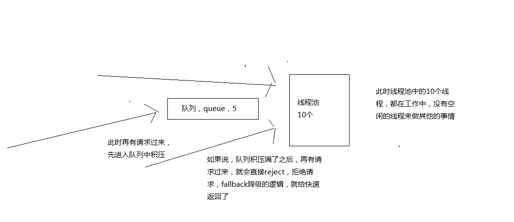
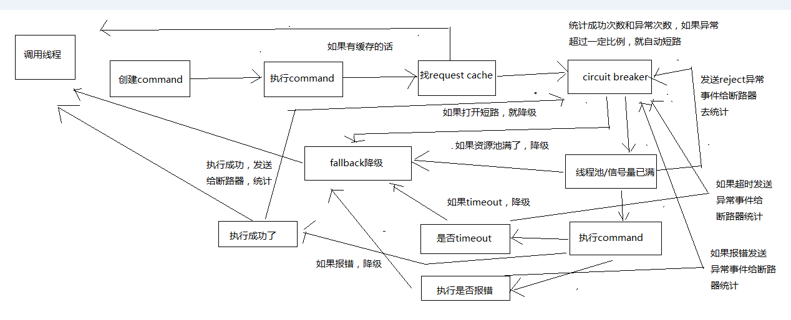
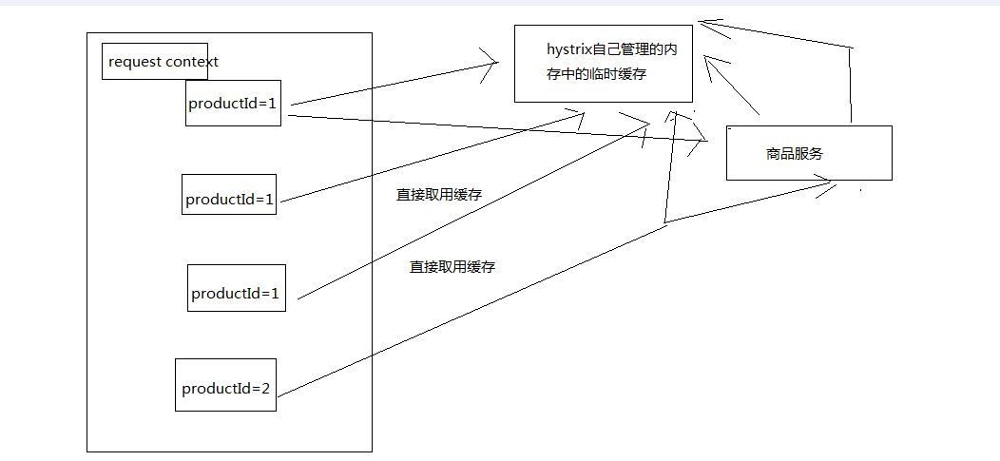

<!-- TOC -->

- [84_hystrix与高可用系统架构：资源隔离+限流+熔断+降级+运维监控](#84_hystrix与高可用系统架构资源隔离限流熔断降级运维监控)
- [85_hystrix要解决的分布式系统可用性问题以及其设计原则](#85_hystrix要解决的分布式系统可用性问题以及其设计原则)
- [86_电商网站的商品详情页缓存服务业务背景以及框架结构说明](#86_电商网站的商品详情页缓存服务业务背景以及框架结构说明)
- [87_基于spring boot快速构建缓存服务以及商品服务](#87_基于spring-boot快速构建缓存服务以及商品服务)
- [88_快速完成缓存服务接收数据变更消息以及调用商品服务接口的代码编写](#88_快速完成缓存服务接收数据变更消息以及调用商品服务接口的代码编写)
- [89_商品服务接口故障导致的高并发访问耗尽缓存服务资源的场景分析](#89_商品服务接口故障导致的高并发访问耗尽缓存服务资源的场景分析)
- [90_基于hystrix的线程池隔离技术进行商品服务接口的资源隔离以及限流](#90_基于hystrix的线程池隔离技术进行商品服务接口的资源隔离以及限流)
- [91_基于hystrix的信号量技术对地理位置获取逻辑进行资源隔离与限流](#91_基于hystrix的信号量技术对地理位置获取逻辑进行资源隔离与限流)
- [92_hystrix的线程池+服务+接口划分以及资源池的容量大小控制](#92_hystrix的线程池服务接口划分以及资源池的容量大小控制)
- [93_深入分析hystrix执行时的8大流程步骤以及内部原理](#93_深入分析hystrix执行时的8大流程步骤以及内部原理)
- [94_基于request cache请求缓存技术优化批量商品数据查询接口](#94_基于request-cache请求缓存技术优化批量商品数据查询接口)
- [95_开发品牌名称获取接口的基于本地缓存的fallback降级机制](#95_开发品牌名称获取接口的基于本地缓存的fallback降级机制)
- [96_深入理解hystrix的短路器原理以及接口异常时的熔断实验](#96_深入理解hystrix的短路器原理以及接口异常时的熔断实验)
- [97_深入理解线程池隔离技术的设计原则以及动手实战接口限流实验](#97_深入理解线程池隔离技术的设计原则以及动手实战接口限流实验)
- [98_基于timeout机制来为商品服务接口的调用超时提供安全保护](#98_基于timeout机制来为商品服务接口的调用超时提供安全保护)
- [99_基于hystrix的高可用分布式系统架构项目实战课程的总结](#99_基于hystrix的高可用分布式系统架构项目实战课程的总结)

<!-- /TOC -->

[84-91小节内容](../专题/高可用-00-hystrix构建高可用的服务的架构.md)

=========================================================================

# 84_hystrix与高可用系统架构：资源隔离+限流+熔断+降级+运维监控
# 85_hystrix要解决的分布式系统可用性问题以及其设计原则
# 86_电商网站的商品详情页缓存服务业务背景以及框架结构说明
# 87_基于spring boot快速构建缓存服务以及商品服务
# 88_快速完成缓存服务接收数据变更消息以及调用商品服务接口的代码编写
# 89_商品服务接口故障导致的高并发访问耗尽缓存服务资源的场景分析
# 90_基于hystrix的线程池隔离技术进行商品服务接口的资源隔离以及限流
# 91_基于hystrix的信号量技术对地理位置获取逻辑进行资源隔离与限流

===========================================================================

# 92_hystrix的线程池+服务+接口划分以及资源池的容量大小控制

资源隔离，两种策略，线程池隔离，信号量隔离

对资源隔离这一块东西，做稍微更加深入一些的讲解，告诉你，除了可以选择隔离策略以外，对你选择的隔离策略，可以做一定的细粒度的一些控制

1、execution.isolation.strategy

指定了HystrixCommand.run()的资源隔离策略，THREAD或者SEMAPHORE，一种是基于线程池，一种是信号量

线程池机制，每个command运行在一个线程中，限流是通过线程池的大小来控制的

信号量机制，command是运行在调用线程中，但是通过信号量的容量来进行限流

如何在线程池和信号量之间做选择？

默认的策略就是线程池

线程池其实最大的好处就是对于网络访问请求，如果有超时的话，可以避免调用线程阻塞住

而使用信号量的场景，通常是针对超大并发量的场景下，每个服务实例每秒都几百的QPS，那么此时你用线程池的话，线程一般不会太多，可能撑不住那么高的并发，如果要撑住，可能要耗费大量的线程资源，那么就是用信号量，来进行限流保护

一般用信号量常见于那种基于纯内存的一些业务逻辑服务，而不涉及到任何网络访问请求

netflix有100+的command运行在40+的线程池中，只有少数command是不运行在线程池中的，就是从纯内存中获取一些元数据，或者是对多个command包装起来的facacde command，是用信号量限流的

// to use thread isolation
HystrixCommandProperties.Setter()
   .withExecutionIsolationStrategy(ExecutionIsolationStrategy.THREAD)
// to use semaphore isolation
HystrixCommandProperties.Setter()
   .withExecutionIsolationStrategy(ExecutionIsolationStrategy.SEMAPHORE)

2、command名称和command组

线程池隔离，依赖服务->接口->线程池，如何来划分

你的每个command，都可以设置一个自己的名称，同时可以设置一个自己的组

private static final Setter cachedSetter = 
    Setter.withGroupKey(HystrixCommandGroupKey.Factory.asKey("ExampleGroup"))
        .andCommandKey(HystrixCommandKey.Factory.asKey("HelloWorld"));    

public CommandHelloWorld(String name) {
    super(cachedSetter);
    this.name = name;
}

command group，是一个非常重要的概念，默认情况下，因为就是通过command group来定义一个线程池的，而且还会通过command group来聚合一些监控和报警信息

同一个command group中的请求，都会进入同一个线程池中

3、command线程池

threadpool key代表了一个HystrixThreadPool，用来进行统一监控，统计，缓存

默认的threadpool key就是command group名称

每个command都会跟它的threadpool key对应的thread pool绑定在一起

如果不想直接用command group，也可以手动设置thread pool name

public CommandHelloWorld(String name) {
    super(Setter.withGroupKey(HystrixCommandGroupKey.Factory.asKey("ExampleGroup"))
            .andCommandKey(HystrixCommandKey.Factory.asKey("HelloWorld"))
            .andThreadPoolKey(HystrixThreadPoolKey.Factory.asKey("HelloWorldPool")));
    this.name = name;
}

command threadpool -> command group -> command key

command key，代表了一类command，一般来说，代表了底层的依赖服务的一个接口

command group，代表了某一个底层的依赖服务，合理，一个依赖服务可能会暴露出来多个接口，每个接口就是一个command key

command group，在逻辑上去组织起来一堆command key的调用，统计信息，成功次数，timeout超时次数，失败次数，可以看到某一个服务整体的一些访问情况

command group，一般来说，推荐是根据一个服务去划分出一个线程池，command key默认都是属于同一个线程池的

比如说你以一个服务为粒度，估算出来这个服务每秒的所有接口加起来的整体QPS在100左右

你调用那个服务的当前服务，部署了10个服务实例，每个服务实例上，其实用这个command group对应这个服务，给一个线程池，量大概在10个左右，就可以了，你对整个服务的整体的访问QPS大概在每秒100左右

一般来说，command group是用来在逻辑上组合一堆command的

举个例子，对于一个服务中的某个功能模块来说，希望将这个功能模块内的所有command放在一个group中，那么在监控和报警的时候可以放一起看

command group，对应了一个服务，但是这个服务暴露出来的几个接口，访问量很不一样，差异非常之大

你可能就希望在这个服务command group内部，包含的对应多个接口的command key，做一些细粒度的资源隔离

对同一个服务的不同接口，都使用不同的线程池

command key -> command group

command key -> 自己的threadpool key

逻辑上来说，多个command key属于一个command group，在做统计的时候，会放在一起统计

每个command key有自己的线程池，每个接口有自己的线程池，去做资源隔离和限流

但是对于thread pool资源隔离来说，可能是希望能够拆分的更加一致一些，比如在一个功能模块内，对不同的请求可以使用不同的thread pool

command group一般来说，可以是对应一个服务，多个command key对应这个服务的多个接口，多个接口的调用共享同一个线程池

如果说你的command key，要用自己的线程池，可以定义自己的threadpool key，就ok了

4、coreSize

设置线程池的大小，默认是10

HystrixThreadPoolProperties.Setter()
   .withCoreSize(int value)

一般来说，用这个默认的10个线程大小就够了

5、queueSizeRejectionThreshold

控制queue满后reject的threshold，因为maxQueueSize不允许热修改，因此提供这个参数可以热修改，控制队列的最大大小

HystrixCommand在提交到线程池之前，其实会先进入一个队列中，这个队列满了之后，才会reject

默认值是5

HystrixThreadPoolProperties.Setter()
   .withQueueSizeRejectionThreshold(int value)

6、execution.isolation.semaphore.maxConcurrentRequests

设置使用SEMAPHORE隔离策略的时候，允许访问的最大并发量，超过这个最大并发量，请求直接被reject

这个并发量的设置，跟线程池大小的设置，应该是类似的，但是基于信号量的话，性能会好很多，而且hystrix框架本身的开销会小很多

默认值是10，设置的小一些，否则因为信号量是基于调用线程去执行command的，而且不能从timeout中抽离，因此一旦设置的太大，而且有延时发生，可能瞬间导致tomcat本身的线程资源本占满

HystrixCommandProperties.Setter()
   .withExecutionIsolationSemaphoreMaxConcurrentRequests(int value)

# 93_深入分析hystrix执行时的8大流程步骤以及内部原理

之前几讲，我们用实际的业务背景给了一些可用性的问题

然后借着那些最最基础的可用性的问题，然后讲解了hystrix最基本的支持高可用的技术，资源隔离+限流

创建command，执行这个command，配置这个command对应的group和线程池，以及线程池/信号量的容量和大小

我们要去讲解一下，你开始执行这个command，调用了这个command的execute()方法以后，hystrix内部的底层的执行流程和步骤以及原理是什么呢？

在讲解这个流程的过程中，我们会带出来hystrix其他的一些核心以及重要的功能

画图分析整个8大步骤的流程，然后再对每个步骤进行细致的讲解

1、构建一个HystrixCommand或者HystrixObservableCommand

一个HystrixCommand或一个HystrixObservableCommand对象，代表了对某个依赖服务发起的一次请求或者调用

构造的时候，可以在构造函数中传入任何需要的参数

HystrixCommand主要用于仅仅会返回一个结果的调用
HystrixObservableCommand主要用于可能会返回多条结果的调用

HystrixCommand command = new HystrixCommand(arg1, arg2);
HystrixObservableCommand command = new HystrixObservableCommand(arg1, arg2);

2、调用command的执行方法

执行Command就可以发起一次对依赖服务的调用

要执行Command，需要在4个方法中选择其中的一个：execute()，queue()，observe()，toObservable()

其中execute()和queue()仅仅对HystrixCommand适用

execute()：调用后直接block住，属于同步调用，直到依赖服务返回单条结果，或者抛出异常
queue()：返回一个Future，属于异步调用，后面可以通过Future获取单条结果
observe()：订阅一个Observable对象，Observable代表的是依赖服务返回的结果，获取到一个那个代表结果的Observable对象的拷贝对象
toObservable()：返回一个Observable对象，如果我们订阅这个对象，就会执行command并且获取返回结果

K             value   = command.execute();
Future<K>     fValue  = command.queue();
Observable<K> ohValue = command.observe();         
Observable<K> ocValue = command.toObservable();    

execute()实际上会调用queue().get().queue()，接着会调用toObservable().toBlocking().toFuture()

也就是说，无论是哪种执行command的方式，最终都是依赖toObservable()去执行的

3、检查是否开启缓存

从这一步开始，进入我们的底层的运行原理啦，了解hysrix的一些更加高级的功能和特性

如果这个command开启了请求缓存，request cache，而且这个调用的结果在缓存中存在，那么直接从缓存中返回结果

4、检查是否开启了短路器

检查这个command对应的依赖服务是否开启了短路器

如果断路器被打开了，那么hystrix就不会执行这个command，而是直接去执行fallback降级机制

5、检查线程池/队列/semaphore是否已经满了

如果command对应的线程池/队列/semaphore已经满了，那么也不会执行command，而是直接去调用fallback降级机制

6、执行command

调用HystrixObservableCommand.construct()或HystrixCommand.run()来实际执行这个command

HystrixCommand.run()是返回一个单条结果，或者抛出一个异常
HystrixObservableCommand.construct()是返回一个Observable对象，可以获取多条结果

如果HystrixCommand.run()或HystrixObservableCommand.construct()的执行，超过了timeout时长的话，那么command所在的线程就会抛出一个TimeoutException

如果timeout了，也会去执行fallback降级机制，而且就不会管run()或construct()返回的值了

这里要注意的一点是，我们是不可能终止掉一个调用严重延迟的依赖服务的线程的，只能说给你抛出来一个TimeoutException，但是还是可能会因为严重延迟的调用线程占满整个线程池的

即使这个时候新来的流量都被限流了。。。

如果没有timeout的话，那么就会拿到一些调用依赖服务获取到的结果，然后hystrix会做一些logging记录和metric统计

7、短路健康检查

Hystrix会将每一个依赖服务的调用成功，失败，拒绝，超时，等事件，都会发送给circuit breaker断路器

短路器就会对调用成功/失败/拒绝/超时等事件的次数进行统计

短路器会根据这些统计次数来决定，是否要进行短路，如果打开了短路器，那么在一段时间内就会直接短路，然后如果在之后第一次检查发现调用成功了，就关闭断路器

8、调用fallback降级机制

在以下几种情况中，hystrix会调用fallback降级机制：run()或construct()抛出一个异常，短路器打开，线程池/队列/semaphore满了，command执行超时了

一般在降级机制中，都建议给出一些默认的返回值，比如静态的一些代码逻辑，或者从内存中的缓存中提取一些数据，尽量在这里不要再进行网络请求了

即使在降级中，一定要进行网络调用，也应该将那个调用放在一个HystrixCommand中，进行隔离

在HystrixCommand中，上线getFallback()方法，可以提供降级机制

在HystirxObservableCommand中，实现一个resumeWithFallback()方法，返回一个Observable对象，可以提供降级结果

如果fallback返回了结果，那么hystrix就会返回这个结果

对于HystrixCommand，会返回一个Observable对象，其中会发返回对应的结果
对于HystrixObservableCommand，会返回一个原始的Observable对象

如果没有实现fallback，或者是fallback抛出了异常，Hystrix会返回一个Observable，但是不会返回任何数据

不同的command执行方式，其fallback为空或者异常时的返回结果不同

对于execute()，直接抛出异常
对于queue()，返回一个Future，调用get()时抛出异常
对于observe()，返回一个Observable对象，但是调用subscribe()方法订阅它时，理解抛出调用者的onError方法
对于toObservable()，返回一个Observable对象，但是调用subscribe()方法订阅它时，理解抛出调用者的onError方法

9、不同的执行方式

execute()，获取一个Future.get()，然后拿到单个结果
queue()，返回一个Future
observer()，立即订阅Observable，然后启动8大执行步骤，返回一个拷贝的Observable，订阅时理解回调给你结果
toObservable()，返回一个原始的Observable，必须手动订阅才会去执行8大步骤

# 94_基于request cache请求缓存技术优化批量商品数据查询接口

我们上一讲讲解的那个图片，顺着那个图片的流程，来一个一个的讲解hystrix的核心技术

1、创建command，2种command类型
2、执行command，4种执行方式
3、查找是否开启了request cache，是否有请求缓存，如果有缓存，直接取用缓存，返回结果

首先，有一个概念，叫做reqeust context，请求上下文，一般来说，在一个web应用中，hystrix

我们会在一个filter里面，对每一个请求都施加一个请求上下文，就是说，tomcat容器内，每一次请求，就是一次请求上下文

然后在这次请求上下文中，我们会去执行N多代码，调用N多依赖服务，有的依赖服务可能还会调用好几次

在一次请求上下文中，如果有多个command，参数都是一样的，调用的接口也是一样的，其实结果可以认为也是一样的

那么这个时候，我们就可以让第一次command执行，返回的结果，被缓存在内存中，然后这个请求上下文中，后续的其他对这个依赖的调用全部从内存中取用缓存结果就可以了

不用在一次请求上下文中反复多次的执行一样的command，提升整个请求的性能

HystrixCommand和HystrixObservableCommand都可以指定一个缓存key，然后hystrix会自动进行缓存，接着在同一个request context内，再次访问的时候，就会直接取用缓存

用请求缓存，可以避免重复执行网络请求

多次调用一个command，那么只会执行一次，后面都是直接取缓存

对于请求缓存（request caching），请求合并（request collapsing），请求日志（request log），等等技术，都必须自己管理HystrixReuqestContext的声明周期

在一个请求执行之前，都必须先初始化一个request context

HystrixRequestContext context = HystrixRequestContext.initializeContext();

然后在请求结束之后，需要关闭request context

context.shutdown();

一般来说，在java web来的应用中，都是通过filter过滤器来实现的

public class HystrixRequestContextServletFilter implements Filter {

    public void doFilter(ServletRequest request, ServletResponse response, FilterChain chain) 
     throws IOException, ServletException {
        HystrixRequestContext context = HystrixRequestContext.initializeContext();
        try {
            chain.doFilter(request, response);
        } finally {
            context.shutdown();
        }
    }
}

@Bean
public FilterRegistrationBean indexFilterRegistration() {
    FilterRegistrationBean registration = new FilterRegistrationBean(new IndexFilter());
    registration.addUrlPatterns("/");
    return registration;
}

结合咱们的业务背景，我们做了一个批量查询商品数据的接口，在这个里面，我们其实通过HystrixObservableCommand一次性批量查询多个商品id的数据

但是这里有个问题，如果说nginx在本地缓存失效了，重新获取一批缓存，传递过来的productId都没有进行去重，1,1,2,2,5,6,7

那么可能说，商品id出现了重复，如果按照我们之前的业务逻辑，可能就会重复对productId=1的商品查询两次，productId=2的商品查询两次

我们对批量查询商品数据的接口，可以用request cache做一个优化，就是说一次请求，就是一次request context，对相同的商品查询只能执行一次，其余的都走request cache

public class CommandUsingRequestCache extends HystrixCommand<Boolean> {

    private final int value;

    protected CommandUsingRequestCache(int value) {
        super(HystrixCommandGroupKey.Factory.asKey("ExampleGroup"));
        this.value = value;
    }

    @Override
    protected Boolean run() {
        return value == 0 || value % 2 == 0;
    }

    @Override
    protected String getCacheKey() {
        return String.valueOf(value);
    }

}

@Test
public void testWithCacheHits() {
    HystrixRequestContext context = HystrixRequestContext.initializeContext();
    try {
        CommandUsingRequestCache command2a = new CommandUsingRequestCache(2);
        CommandUsingRequestCache command2b = new CommandUsingRequestCache(2);

        assertTrue(command2a.execute());
        // this is the first time we've executed this command with
        // the value of "2" so it should not be from cache
        assertFalse(command2a.isResponseFromCache());

        assertTrue(command2b.execute());
        // this is the second time we've executed this command with
        // the same value so it should return from cache
        assertTrue(command2b.isResponseFromCache());
    } finally {
        context.shutdown();
    }

    // start a new request context
    context = HystrixRequestContext.initializeContext();
    try {
        CommandUsingRequestCache command3b = new CommandUsingRequestCache(2);
        assertTrue(command3b.execute());
        // this is a new request context so this 
        // should not come from cache
        assertFalse(command3b.isResponseFromCache());
    } finally {
        context.shutdown();
    }
}

缓存的手动清理

public static class GetterCommand extends HystrixCommand<String> {

    private static final HystrixCommandKey GETTER_KEY = HystrixCommandKey.Factory.asKey("GetterCommand");
    private final int id;

    public GetterCommand(int id) {
        super(Setter.withGroupKey(HystrixCommandGroupKey.Factory.asKey("GetSetGet"))
                .andCommandKey(GETTER_KEY));
        this.id = id;
    }

    @Override
    protected String run() {
        return prefixStoredOnRemoteDataStore + id;
    }

    @Override
    protected String getCacheKey() {
        return String.valueOf(id);
    }

    /**
     * Allow the cache to be flushed for this object.
     * 
     * @param id
     *            argument that would normally be passed to the command
     */
    public static void flushCache(int id) {
        HystrixRequestCache.getInstance(GETTER_KEY,
                HystrixConcurrencyStrategyDefault.getInstance()).clear(String.valueOf(id));
    }

}

public static class SetterCommand extends HystrixCommand<Void> {

    private final int id;
    private final String prefix;

    public SetterCommand(int id, String prefix) {
        super(HystrixCommandGroupKey.Factory.asKey("GetSetGet"));
        this.id = id;
        this.prefix = prefix;
    }

    @Override
    protected Void run() {
        // persist the value against the datastore
        prefixStoredOnRemoteDataStore = prefix;
        // flush the cache
        GetterCommand.flushCache(id);
        // no return value
        return null;
    }
}

# 95_开发品牌名称获取接口的基于本地缓存的fallback降级机制

1、创建command
2、执行command
3、request cache
4、短路器，如果打开了，fallback降级机制

1、fallback降级机制

hystrix调用各种接口，或者访问外部依赖，mysql，redis，zookeeper，kafka，等等，如果出现了任何异常的情况

比如说报错了，访问mysql报错，redis报错，zookeeper报错，kafka报错，error

对每个外部依赖，无论是服务接口，中间件，资源隔离，对外部依赖只能用一定量的资源去访问，线程池/信号量，如果资源池已满，reject

访问外部依赖的时候，访问时间过长，可能就会导致超时，报一个TimeoutException异常，timeout

上述三种情况，都是我们说的异常情况，对外部依赖的东西访问的时候出现了异常，发送异常事件到短路器中去进行统计

如果短路器发现异常事件的占比达到了一定的比例，直接开启短路，circuit breaker

上述四种情况，都会去调用fallback降级机制

fallback，降级机制，你之前都是必须去调用外部的依赖接口，或者从mysql中去查询数据的，但是为了避免说可能外部依赖会有故障

比如，你可以再内存中维护一个ehcache，作为一个纯内存的基于LRU自动清理的缓存，数据也可以放入缓存内

如果说外部依赖有异常，fallback这里，直接尝试从ehcache中获取数据

比如说，本来你是从mysql，redis，或者其他任何地方去获取数据的，获取调用其他服务的接口的，结果人家故障了，人家挂了，fallback，可以返回一个默认值

两种最经典的降级机制：纯内存数据，默认值

run()抛出异常，超时，线程池或信号量满了，或短路了，都会调用fallback机制

给大家举个例子，比如说我们现在有个商品数据，brandId，品牌，一般来说，假设，正常的逻辑，拿到了一个商品数据以后，用brandId再调用一次请求，到其他的服务去获取品牌的最新名称

假如说，那个品牌服务挂掉了，那么我们可以尝试本地内存中，会保留一份时间比较过期的一份品牌数据，有些品牌没有，有些品牌的名称过期了，Nike++，Nike

调用品牌服务失败了，fallback降级就从本地内存中获取一份过期的数据，先凑合着用着

public class CommandHelloFailure extends HystrixCommand<String> {

    private final String name;

    public CommandHelloFailure(String name) {
        super(HystrixCommandGroupKey.Factory.asKey("ExampleGroup"));
        this.name = name;
    }

    @Override
    protected String run() {
        throw new RuntimeException("this command always fails");
    }

    @Override
    protected String getFallback() {
        return "Hello Failure " + name + "!";
    }

}

@Test
public void testSynchronous() {
    assertEquals("Hello Failure World!", new CommandHelloFailure("World").execute());
}

HystrixObservableCommand，是实现resumeWithFallback方法

2、fallback.isolation.semaphore.maxConcurrentRequests

这个参数设置了HystrixCommand.getFallback()最大允许的并发请求数量，默认值是10，也是通过semaphore信号量的机制去限流

如果超出了这个最大值，那么直接被reject

HystrixCommandProperties.Setter()
   .withFallbackIsolationSemaphoreMaxConcurrentRequests(int value)

# 96_深入理解hystrix的短路器原理以及接口异常时的熔断实验

短路器深入的工作原理

1、如果经过短路器的流量超过了一定的阈值，HystrixCommandProperties.circuitBreakerRequestVolumeThreshold()

举个例子，可能看起来是这样子的，要求在10s内，经过短路器的流量必须达到20个；在10s内，经过短路器的流量才10个，那么根本不会去判断要不要短路

2、如果断路器统计到的异常调用的占比超过了一定的阈值，HystrixCommandProperties.circuitBreakerErrorThresholdPercentage()

如果达到了上面的要求，比如说在10s内，经过短路器的流量（你，只要执行一个command，这个请求就一定会经过短路器），达到了30个；同时其中异常的访问数量，占到了一定的比例，比如说60%的请求都是异常（报错，timeout，reject），会开启短路

3、然后断路器从close状态转换到open状态

4、断路器打开的时候，所有经过该断路器的请求全部被短路，不调用后端服务，直接走fallback降级

5、经过了一段时间之后，HystrixCommandProperties.circuitBreakerSleepWindowInMilliseconds()，会half-open，让一条请求经过短路器，看能不能正常调用。如果调用成功了，那么就自动恢复，转到close状态

短路器，会自动恢复的，half-open，半开状态

6、circuit breaker短路器的配置

（1）circuitBreaker.enabled

控制短路器是否允许工作，包括跟踪依赖服务调用的健康状况，以及对异常情况过多时是否允许触发短路，默认是true

HystrixCommandProperties.Setter()
   .withCircuitBreakerEnabled(boolean value)

（2）circuitBreaker.requestVolumeThreshold

设置一个rolling window，滑动窗口中，最少要有多少个请求时，才触发开启短路

举例来说，如果设置为20（默认值），那么在一个10秒的滑动窗口内，如果只有19个请求，即使这19个请求都是异常的，也是不会触发开启短路器的

HystrixCommandProperties.Setter()
   .withCircuitBreakerRequestVolumeThreshold(int value)

（3）circuitBreaker.sleepWindowInMilliseconds

设置在短路之后，需要在多长时间内直接reject请求，然后在这段时间之后，再重新导holf-open状态，尝试允许请求通过以及自动恢复，默认值是5000毫秒

HystrixCommandProperties.Setter()
   .withCircuitBreakerSleepWindowInMilliseconds(int value)

（4）circuitBreaker.errorThresholdPercentage

设置异常请求量的百分比，当异常请求达到这个百分比时，就触发打开短路器，默认是50，也就是50%

HystrixCommandProperties.Setter()
   .withCircuitBreakerErrorThresholdPercentage(int value)

（5）circuitBreaker.forceOpen

如果设置为true的话，直接强迫打开短路器，相当于是手动短路了，手动降级，默认false

HystrixCommandProperties.Setter()
   .withCircuitBreakerForceOpen(boolean value)

（6）circuitBreaker.forceClosed

如果设置为ture的话，直接强迫关闭短路器，相当于是手动停止短路了，手动升级，默认false

HystrixCommandProperties.Setter()
   .withCircuitBreakerForceClosed(boolean value)

7、实战演练

配置一个断路器，流量要求是20，异常比例是50%，短路时间是5s

在command内加入一个判断，如果是productId=-1，那么就直接报错，触发异常执行

写一个client测试程序，写入50个请求，前20个是正常的，但是后30个是productId=-1，然后继续请求，会发现

# 97_深入理解线程池隔离技术的设计原则以及动手实战接口限流实验

1、command的创建和执行：资源隔离
2、request cache：请求缓存
3、fallback：优雅降级
4、circuit breaker：短路器，快速熔断（一旦后端服务故障，立刻熔断，阻止对其的访问）

把一个分布式系统中的某一个服务，打造成一个高可用的服务

资源隔离，优雅降级，熔断

5、判断，线程池或者信号量的容量是否已满，reject，限流

限流，限制对后端的服务的访问量，比如说你对mysql，redis，zookeeper，各种后端的中间件的资源，访问，其实为了避免过大的流浪打死后端的服务，线程池，信号量，限流

限制服务对后端的资源的访问

1、线程池隔离技术的设计原则

Hystrix采取了bulkhead舱壁隔离技术，来将外部依赖进行资源隔离，进而避免任何外部依赖的故障导致本服务崩溃

线程池隔离，学术名称：bulkhead，舱壁隔离

外部依赖的调用在单独的线程中执行，这样就能跟调用线程隔离开来，避免外部依赖调用timeout耗时过长，导致调用线程被卡死

Hystrix对每个外部依赖用一个单独的线程池，这样的话，如果对那个外部依赖调用延迟很严重，最多就是耗尽那个依赖自己的线程池而已，不会影响其他的依赖调用

Hystrix选择用线程池机制来进行资源隔离，要面对的场景如下：

（1）每个服务都会调用几十个后端依赖服务，那些后端依赖服务通常是由很多不同的团队开发的
（2）每个后端依赖服务都会提供它自己的client调用库，比如说用thrift的话，就会提供对应的thrift依赖
（3）client调用库随时会变更
（4）client调用库随时可能会增加新的网络请求的逻辑
（5）client调用库可能会包含诸如自动重试，数据解析，内存中缓存等逻辑
（6）client调用库一般都对调用者来说是个黑盒，包括实现细节，网络访问，默认配置，等等
（7）在真实的生产环境中，经常会出现调用者，突然间惊讶的发现，client调用库发生了某些变化
（8）即使client调用库没有改变，依赖服务本身可能有会发生逻辑上的变化
（9）有些依赖的client调用库可能还会拉取其他的依赖库，而且可能那些依赖库配置的不正确
（10）大多数网络请求都是同步调用的
（11）调用失败和延迟，也有可能会发生在client调用库本身的代码中，不一定就是发生在网络请求中

简单来说，就是你必须默认client调用库就很不靠谱，而且随时可能各种变化，所以就要用强制隔离的方式来确保任何服务的故障不能影响当前服务

我不知道在学习这个课程的学员里，有多少人，真正参与过一些复杂的分布式系统的开发，不是说一个team，你们五六个人，七八个人，去做的

在一些大公司里，做一些复杂的项目的话，广告计费系统，特别复杂，可能涉及多个团队，总共三四十个人，五六十个人，一起去开发一个系统，每个团队负责一块儿

每个团队里的每个人，负责一个服务，或者几个服务，比较常见的大公司的复杂分布式系统项目的分工合作的一个流程

线程池机制的优点如下：

（1）任何一个依赖服务都可以被隔离在自己的线程池内，即使自己的线程池资源填满了，也不会影响任何其他的服务调用
（2）服务可以随时引入一个新的依赖服务，因为即使这个新的依赖服务有问题，也不会影响其他任何服务的调用
（3）当一个故障的依赖服务重新变好的时候，可以通过清理掉线程池，瞬间恢复该服务的调用，而如果是tomcat线程池被占满，再恢复就很麻烦
（4）如果一个client调用库配置有问题，线程池的健康状况随时会报告，比如成功/失败/拒绝/超时的次数统计，然后可以近实时热修改依赖服务的调用配置，而不用停机
（5）如果一个服务本身发生了修改，需要重新调整配置，此时线程池的健康状况也可以随时发现，比如成功/失败/拒绝/超时的次数统计，然后可以近实时热修改依赖服务的调用配置，而不用停机
（6）基于线程池的异步本质，可以在同步的调用之上，构建一层异步调用层

简单来说，最大的好处，就是资源隔离，确保说，任何一个依赖服务故障，不会拖垮当前的这个服务

线程池机制的缺点：

（1）线程池机制最大的缺点就是增加了cpu的开销

除了tomcat本身的调用线程之外，还有hystrix自己管理的线程池

（2）每个command的执行都依托一个独立的线程，会进行排队，调度，还有上下文切换
（3）Hystrix官方自己做了一个多线程异步带来的额外开销，通过对比多线程异步调用+同步调用得出，Netflix API每天通过hystrix执行10亿次调用，每个服务实例有40个以上的线程池，每个线程池有10个左右的线程
（4）最后发现说，用hystrix的额外开销，就是给请求带来了3ms左右的延时，最多延时在10ms以内，相比于可用性和稳定性的提升，这是可以接受的

我们可以用hystrix semaphore技术来实现对某个依赖服务的并发访问量的限制，而不是通过线程池/队列的大小来限制流量

sempahore技术可以用来限流和削峰，但是不能用来对调研延迟的服务进行timeout和隔离

execution.isolation.strategy，设置为SEMAPHORE，那么hystrix就会用semaphore机制来替代线程池机制，来对依赖服务的访问进行限流

如果通过semaphore调用的时候，底层的网络调用延迟很严重，那么是无法timeout的，只能一直block住

一旦请求数量超过了semephore限定的数量之后，就会立即开启限流

2、接口限流实验

假设，一个线程池，大小是15个，队列大小是10个，timeout时长设置的长一些，5s

模拟发送请求，然后写死代码，在command内部做一个sleep，比如每次sleep 1s，10个请求发送过去以后，直接被hang死，线程池占满

再发送请求，就会堵塞在缓冲队列，queue，10个，20个，10个，后10个应该就直接reject，fallback逻辑

15 + 10 = 25个请求，15在执行，10个缓冲在队列里了，剩下的流量全部被reject，限流，降级

withCoreSize：设置你的线程池的大小
withMaxQueueSize：设置的是你的等待队列，缓冲队列的大小
withQueueSizeRejectionThreshold：如果withMaxQueueSize<withQueueSizeRejectionThreshold，那么取的是withMaxQueueSize，反之，取得是withQueueSizeRejectionThreshold

线程池本身的大小，如果你不设置另外两个queue相关的参数，等待队列是关闭的

queue大小，等待队列的大小，timeout时长

先进去线程池的是10个请求，然后有8个请求进入等待队列，线程池里有空闲，等待队列中的请求如果还没有timeout，那么就进去线程池去执行

10 + 8 = 18个请求之外，7个请求，直接会被reject掉，限流，fallback

withExecutionTimeoutInMilliseconds(20000)：timeout也设置大一些，否则如果请求放等待队列中时间太长了，直接就会timeout，等不到去线程池里执行了
withFallbackIsolationSemaphoreMaxConcurrentRequests(30)：fallback，sempahore限流，30个，避免太多的请求同时调用fallback被拒绝访问

# 98_基于timeout机制来为商品服务接口的调用超时提供安全保护

一般来说，在调用依赖服务的接口的时候，比较常见的一个问题，就是超时

超时是在一个复杂的分布式系统中，导致不稳定，或者系统抖动，或者出现说大量超时，线程资源hang死，吞吐量大幅度下降，甚至服务崩溃

超时最大的一个问题

你去调用各种各样的依赖服务，特别是在大公司，你甚至都不认识开发一个服务的人，你都不知道那个人的水平怎么样，不了解

比尔盖茨说过一句话，在互联网的另外一头，你都不知道甚至坐着一条狗

分布式系统，大公司，多个团队，大型协作，服务是谁的，不了解，很可能说那个哥儿们，实习生都有可能

在一个复杂的系统里，可能你的依赖接口的性能很不稳定，有时候2ms，200ms，2s

如果你不对各种依赖接口的调用，做超时的控制，来给你的服务提供安全保护措施，那么很可能你的服务就被各种垃圾的依赖服务的性能给拖死了

大量的接口调用很慢，大量线程就卡死了，资源隔离，线程池的线程卡死了，超时的控制

（1）execution.isolation.thread.timeoutInMilliseconds

手动设置timeout时长，一个command运行超出这个时间，就被认为是timeout，然后将hystrix command标识为timeout，同时执行fallback降级逻辑

默认是1000，也就是1000毫秒

HystrixCommandProperties.Setter()
   .withExecutionTimeoutInMilliseconds(int value)

（2）execution.timeout.enabled

控制是否要打开timeout机制，默认是true

HystrixCommandProperties.Setter()
   .withExecutionTimeoutEnabled(boolean value)

让一个command执行timeout，然后看是否会调用fallback降级

# 99_基于hystrix的高可用分布式系统架构项目实战课程的总结

已经学到的东西

hystrix的核心知识

1、hystrix内部工作原理：8大执行步骤和流程
2、资源隔离：你如果有很多个依赖服务，高可用性，先做资源隔离，任何一个依赖服务的故障不会导致你的服务的资源耗尽，不会崩溃
3、请求缓存：对于一个request context内的多个相同command，使用request cache，提升性能
4、熔断：基于短路器，采集各种异常事件，报错，超时，reject，短路，熔断，一定时间范围内就不允许访问了，直接降级，自动恢复的机制
5、降级：报错，超时，reject，熔断，降级，服务提供容错的机制
6、限流：在你的服务里面，通过线程池，或者信号量，限制对某个后端的服务或资源的访问量，避免从你的服务这里过去太多的流量，打死某个资源
7、超时：避免某个依赖服务性能过差，导致大量的线程hang住去调用那个服务，会导致你的服务本身性能也比较差

学会了这些东西以后，我们特意设置了大电商背景，商品详情页系统，缓存服务的业务场景，尽量的去结合一些仿真的业务，去学习hystrix的各项技术

这个东西做起来没那么容易，尽量做了，学习效果更好一些，兴趣也会更好一些

已经可以快速利用hystrix给自己开发的服务增加各种高可用的保障措施了，避免你的系统因为各种各样的异常情况导致崩溃，不可用

hystrix的高阶知识

1、request collapser，请求合并技术
2、fail-fast和fail-slient，高阶容错模式
3、static fallback和stubbed fallback，高阶降级模式
4、嵌套command实现的发送网络请求的降级模式
5、基于facade command的多级降级模式
6、request cache的手动清理
7、生产环境中的线程池大小以及timeout配置优化经验
8、线程池的自动化动态扩容与缩容技术
9、hystrix的metric高阶配置
10、基于hystrix dashboard的可视化分布式系统监控
11、生产环境中的hystrix工程运维经验

