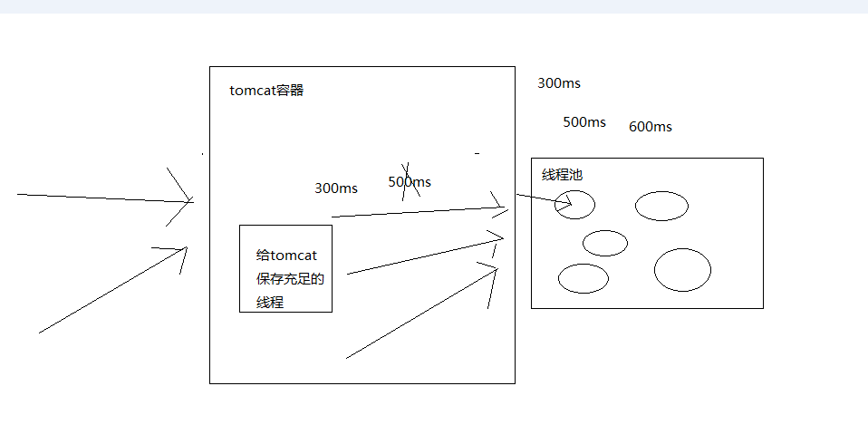
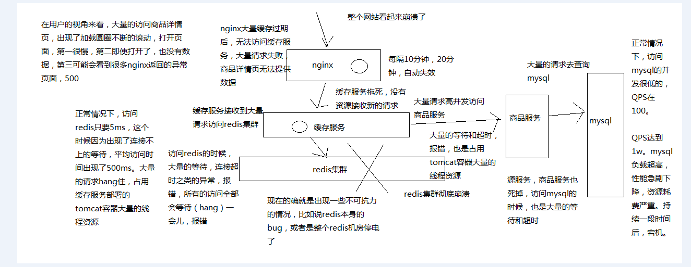
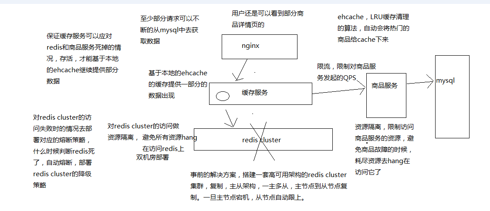
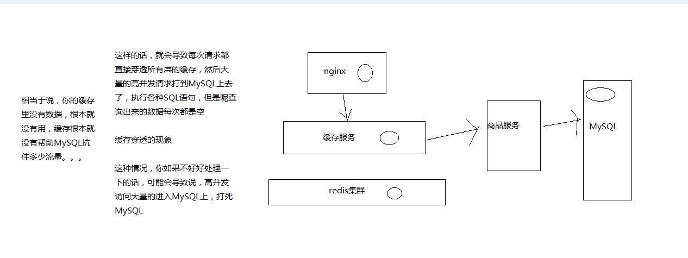

<!-- TOC -->

- [100_基于request collapser请求合并技术进一步优化批量查询](#100_基于request-collapser请求合并技术进一步优化批量查询)
- [101_hystirx的fail-fast与fail-silient两种最基础的容错模式](#101_hystirx的fail-fast与fail-silient两种最基础的容错模式)
- [102_为商品服务接口调用增加stubbed fallback降级机制](#102_为商品服务接口调用增加stubbed-fallback降级机制)
- [103_基于双层嵌套command开发商品服务接口的多级降级机制](#103_基于双层嵌套command开发商品服务接口的多级降级机制)
- [104_基于facade command开发商品服务接口的手动降级机制](#104_基于facade-command开发商品服务接口的手动降级机制)
- [105_生产环境中的线程池大小以及timeout超时时长优化经验总结](#105_生产环境中的线程池大小以及timeout超时时长优化经验总结)
- [106_生产环境中的线程池自动扩容与缩容的动态资源分配经验](#106_生产环境中的线程池自动扩容与缩容的动态资源分配经验)
- [107_hystrix的metric统计相关的各种高阶配置讲解](#107_hystrix的metric统计相关的各种高阶配置讲解)
- [108_hystrix dashboard可视化分布式系统监控环境部署](#108_hystrix-dashboard可视化分布式系统监控环境部署)
- [109_生产环境中的hystrix分布式系统的工程运维经验总结](#109_生产环境中的hystrix分布式系统的工程运维经验总结)
- [110_高并发场景下恐怖的缓存雪崩现象以及导致系统全盘崩溃的后果](#110_高并发场景下恐怖的缓存雪崩现象以及导致系统全盘崩溃的后果)
- [111_缓存雪崩的基于事前+事中+事后三个层次的完美解决方案](#111_缓存雪崩的基于事前事中事后三个层次的完美解决方案)
- [112_基于hystrix完成对redis访问的资源隔离以避免缓存服务被拖垮](#112_基于hystrix完成对redis访问的资源隔离以避免缓存服务被拖垮)
- [113_为redis集群崩溃时的访问失败增加fail silent容错机制](#113_为redis集群崩溃时的访问失败增加fail-silent容错机制)
- [114_为redis集群崩溃时的场景部署定制化的熔断策略](#114_为redis集群崩溃时的场景部署定制化的熔断策略)
- [115_基于hystrix限流完成源服务的过载保护以避免流量洪峰打死MySQL](#115_基于hystrix限流完成源服务的过载保护以避免流量洪峰打死mysql)
- [116_为源头服务的限流场景增加stubbed fallback降级机制](#116_为源头服务的限流场景增加stubbed-fallback降级机制)
- [117_高并发场景下的缓存穿透导致MySQL压力倍增问题以及其解决方案](#117_高并发场景下的缓存穿透导致mysql压力倍增问题以及其解决方案)
- [118_在缓存服务中开发缓存穿透的保护性机制](#118_在缓存服务中开发缓存穿透的保护性机制)
- [119_高并发场景下的nginx缓存失效导致redis压力倍增问题以及解决方案](#119_高并发场景下的nginx缓存失效导致redis压力倍增问题以及解决方案)
- [120_在nginx lua脚本中开发缓存失效的保护性机制](#120_在nginx-lua脚本中开发缓存失效的保护性机制)
- [121_支撑高并发与高可用的大型电商详情页系统的缓存架构课程总结](#121_支撑高并发与高可用的大型电商详情页系统的缓存架构课程总结)
- [122_如何将课程中的东西学以致用在自己目前的项目中去应用？](#122_如何将课程中的东西学以致用在自己目前的项目中去应用)
- [123_如何带着课程中讲解的东西化为自己的技术并找一份更好的工作？](#123_如何带着课程中讲解的东西化为自己的技术并找一份更好的工作)

<!-- /TOC -->

# 100_基于request collapser请求合并技术进一步优化批量查询

hystrix，高级的技术，request collapser，请求合并技术，collapser折叠

优化过一个批量查询的接口了，request cache来做优化，可能有相同的商品就可以直接取用缓存了

多个商品，需要发送多次网络请求，调用多次接口，才能拿到结果

可以使用HystrixCollapser将多个HystrixCommand合并到一起，多个command放在一个command里面去执行，发送一次网络请求，就拉取到多条数据

用请求合并技术，将多个请求合并起来，可以减少高并发访问下需要使用的线程数量以及网络连接数量，这都是hystrix自动进行的

其实对于高并发的访问来说，是可以提升性能的

请求合并有很多种级别

（1）global context，tomcat所有调用线程，对一个依赖服务的任何一个command调用都可以被合并在一起，hystrix就传递一个HystrixRequestContext

（2）user request context，tomcat内某一个调用线程，将某一个tomcat线程对某个依赖服务的多个command调用合并在一起

（3）object modeling，基于对象的请求合并，如果有几百个对象，遍历后依次调用每个对象的某个方法，可能导致发起几百次网络请求，基于hystrix可以自动将对多个对象模型的调用合并到一起

请求合并技术的开销有多大

使用请求合并技术的开销就是导致延迟大幅度增加，因为需要一定的时间将多个请求合并起来

发送过来10个请求，每个请求本来大概是2ms可以返回，要把10个请求合并在一个command内，统一一起执行，先后等待一下，5ms

所以说，要考量一下，使用请求合并技术是否合适，如果一个请求本来耗费的时间就比较长，那么进行请求合并，增加一些延迟影响并不大

请求合并技术，不是针对那种访问延时特别低的请求的，比如说你的访问延时本身就比较高，20ms，10个请求合并在一起，25ms，这种情况下就还好

好处在哪里，大幅度削减你的线程池的资源耗费，线程池，10个线程，一秒钟可以执行10个请求，合并在一起，1个线程执行10个请求，10个线程就可以执行100个请求

增加你的吞吐量

减少你对后端服务访问时的网络资源的开销，10个请求，10个command，10次网络请求的开销，1次网络请求的开销了

每个请求就2ms，batch，8~10ms，延迟增加了4~5倍

每个请求本来就30ms~50ms，batch，35ms~55ms，延迟增加不太明显

将多个command请求合并到一个command中执行

请求合并时，可以设置一个batch size，以及elapsed time（控制什么时候触发合并后的command执行）

有两种合并模式，一种是request scope，另一种是global scope，默认是rquest scope，在collapser构造的时候指定scope模式

request scope的batch收集是建立在一个request context内的，而global scope的batch收集是横跨多个request context的

所以对于global context来说，必须确保能在一个command内处理多个requeset context的请求

在netflix，是只用request scope请求合并的，因为默认是用唯一一个request context包含所有的command，所以要做合并，肯定就是request scope

一般请求合并技术，对于那种访问同一个资源的command，但是参数不同，是很有效的

批量查询，HystrixObservableCommand，HystrixCommand+request cache，都是每个商品发起一次网络请求

一个批量的商品过来以后，我们还是多个command的方式去执行，request collapser+request cache，相同的商品还是就查询一次，不同的商品合并到一起通过一个网络请求得到结果

timeout问题解释：开发机上，特别慢，第一次请求的时候，几百毫秒，默认的timeout时长比较短

第二次的时候，访问的速度会快很多，就不会超时了

反应在系统上，第一次启动的时候，会有个别的超时，但是后面就好了，手动将timeout时长设置的大一些

（1）maxRequestsInBatch

控制一个Batch中最多允许多少个request被合并，然后才会触发一个batch的执行

默认值是无限大，就是不依靠这个数量来触发执行，而是依靠时间

HystrixCollapserProperties.Setter()
   .withMaxRequestsInBatch(int value)

（2）timerDelayInMilliseconds

控制一个batch创建之后，多长时间以后就自动触发batch的执行，默认是10毫秒

HystrixCollapserProperties.Setter()
   .withTimerDelayInMilliseconds(int value)

super(Setter.withCollapserKey(HystrixCollapserKey.Factory.asKey("GetProductInfosCollapser"))
				.andCollapserPropertiesDefaults(HystrixCollapserProperties.Setter()
						   .withMaxRequestsInBatch(100)
						   .withTimerDelayInMilliseconds(20))); 

# 101_hystirx的fail-fast与fail-silient两种最基础的容错模式

fail-fast，就是不给fallback降级逻辑，HystrixCommand.run()，直接报错，直接会把这个报错抛出来，给你的tomcat调用线程

fail-silent，给一个fallback降级逻辑，如果HystrixCommand.run()，报错了，会走fallback降级，直接返回一个空值，HystrixCommand，就给一个null

HystrixObservableCommand，Observable.empty()

很少会用fail-fast模式，比较常用的可能还是fail-silent，特别常用，既然都到了fallback里面，肯定要做点降级的事情

# 102_为商品服务接口调用增加stubbed fallback降级机制

stubbed fallback，残缺的降级

用请求中的部分数据拼装成结果，然后再填充一些默认值，返回

比如说你发起了一个请求，然后请求中可能本身就附带了一些信息，如果主请求失败了，走到降级逻辑

在降级逻辑里面，可以将这个请求中的数据，以及部分本地缓存有的数据拼装在一起，再给数据填充一些简单的默认值

然后尽可能将自己有的数据返回到请求方

stubbed，残缺了，比如说应该查询到一个商品信息，里面包含20个字段

请求参数搂出来一两个字段，从本地的少量缓存中比如说，可以搂出来那么两三个字段，最终的话返回的字段可能就五六个，其他的字段都是填充的默认值

数据有残缺

我们主要是演示一下这种模式的使用，你硬要我拿最真实的业务和代码去演示，不可能的

公司真实的项目，真实的业务代码，都极其的复杂

我做过的真实的项目，简化，抽象，仿真，拿出来模拟的业务场景，给大家来讲解

效果肯定是比你纯粹一点业务都没有，全都是一些最基础的demo代码，业务的feel，是怎么用的s

在你自己的项目里去用的话，你就必须结合你自己的业务场景，去思考，stubbed fallback，从请求参数里尽可能提取一些数据，请求参数多给一些

你要考虑到可以将哪些量比较少的数据保存在内存中，提取部分数据

默认的值怎么设置，看起来能稍微靠谱一些

# 103_基于双层嵌套command开发商品服务接口的多级降级机制

多级降级

先降一级，尝试用一个备用方案去执行，如果备用方案失败了，再用最后下一个备用方案去执行

command嵌套command

尝试从备用服务器接口去拉取结果

给大家科普一下，常见的多级降级的做法，有一个操作，要访问MySQL数据库

mysql数据库访问报错，降级，去redis中获取数据

如果说redis又挂了，然后就去从本地ehcache缓存中获取数据

hystrix command fallback语义，很容易就可以实现多级降级的策略

商品服务接口，多级降级的策略

command，fallback，又套了一个command，第二个command其实是第一级降级策略

第二个command的fallback是第二级降级策略

第一级降级策略，可以是

storm，我们之前做storm这块，第一级降级，一般是搞一个storm的备用机房，部署了一套一模一样的拓扑，如果主机房中的storm拓扑挂掉了，备用机房的storm拓扑定顶上

如果备用机房的storm拓扑也挂了

第二级降级，可能就降级成用mysql/hbase/redis/es，手工封装的一套，按分钟粒度去统计数据的系统

第三季降级，离线批处理去做，hdfs+spark，每个小时执行一次数据统计，去降级

特别复杂，重要的系统，肯定是要搞好几套备用方案的，一个方案死了，立即上第二个方案，而且要尽量做到是自动化的

商品接口拉取

主流程，访问的商品服务，是从主机房去访问的，服务，如果主机房的服务出现了故障，机房断电，机房的网络负载过高，机器硬件出了故障

第一级降级策略，去访问备用机房的服务

第二级降级策略，用stubbed fallback降级策略，比较常用的，返回一些残缺的数据回去

# 104_基于facade command开发商品服务接口的手动降级机制

手动降级

你写一个command，在这个command它的主流程中，根据一个标识位，判断要执行哪个流程

可以执行主流程，command，也可以执行一个备用降级的command

一般来说，都是去执行一个主流程的command，如果说你现在知道有问题了，希望能够手动降级的话，动态给服务发送个请求

在请求中修改标识位，自动就让command以后都直接过来执行备用command

3个command，套在最外面的command，是用semaphore信号量做限流和资源隔离的，因为这个command不用去care timeout的问题，嵌套调用的command会自己去管理timeout超时的

商品服务接口的手动降级的方案

主流程还是去走GetProductInfoCommand，手动降级的方案，比如说是从某一个数据源，自己去简单的获取一些数据，尝试封装一下返回

手动降级的策略，就比较low了，调用别人的接口去获取数据的，业务逻辑的封装

主流程有问题，那么可能你就需要立即自己写一些逻辑发布上去，从mysql数据库的表中获取一些数据去返回，手动调整一下降级标识，做一下手动降级

# 105_生产环境中的线程池大小以及timeout超时时长优化经验总结

生产环境里面，一个是线程池的大小怎么设置，timeout时长怎么

不合理的话，问题还是很大的

在生产环境中部署一个短路器，一开始需要将一些关键配置设置的大一些，比如timeout超时时长，线程池大小，或信号量容量

然后逐渐优化这些配置，直到在一个生产系统中运作良好

（1）一开始先不要设置timeout超时时长，默认就是1000ms，也就是1s
（2）一开始也不要设置线程池大小，默认就是10
（3）直接部署hystrix到生产环境，如果运行的很良好，那么就让它这样运行好了
（4）让hystrix应用，24小时运行在生产环境中
（5）依赖标准的监控和报警机制来捕获到系统的异常运行情况
（6）在24小时之后，看一下调用延迟的占比，以及流量，来计算出让短路器生效的最小的配置数字
（7）直接对hystrix配置进行热修改，然后继续在hystrix dashboard上监控
（8）看看修改配置后的系统表现有没有改善

下面是根据系统表现优化和调整线程池大小，队列大小，信号量容量，以及timeout超时时间的经验

假设对一个依赖服务的高峰调用QPS是每秒30次

一开始如果默认的线程池大小是10

我们想的是，理想情况下，每秒的高峰访问次数 * 99%的访问延时 + buffer = 30 * 0.2 + 4 = 10线程，10个线程每秒处理30次访问应该足够了，每个线程处理3次访问

此时，我们合理的timeout设置应该为300ms，也就是99.5%的访问延时，计算方法是，因为判断每次访问延时最多在250ms（TP99如果是200ms的话），再加一次重试时间50ms，就是300ms，感觉也应该足够了

因为如果timeout设置的太多了，比如400ms，比如如果实际上，在高峰期，还有网络情况较差的时候，可能每次调用要耗费350ms，也就是达到了最长的访问时长

那么每个线程处理2个请求，就会执行700ms，然后处理第三个请求的时候，就超过1秒钟了，此时会导致线程池全部被占满，都在处理请求

这个时候下一秒的30个请求再进来了，那么就会导致线程池已满，拒绝请求的情况，就会调用fallback降级机制

因此对于短路器来说，timeout超时一般应该设置成TP99.5，比如设置成300ms，那么可以确保说，10个线程，每个线程处理3个访问，每个访问最多就允许执行300ms，过时就timeout了

这样才能保证说每个线程都在1s内执行完，才不会导致线程池被占满，然后后续的请求过来大量的reject

对于线程池大小来说，一般应该控制在10个左右，20个以内，最少5个，不要太多，也不要太少

大家可能会想，每秒的高峰访问次数是30次，如果是300次，甚至是3000次，30000次呢？？？

30000 * 0.2 = 6000 + buffer = 6100，一个服务器内一个线程池给6000个线程把

如果你一个依赖服务占据的线程数量太多的话，会导致其他的依赖服务对应的线程池里没有资源可以用了

6000 / 20 = 300台虚拟机也是ok的

虚拟机，4个cpu core，4G内存，虚拟机，300台

物理机，十几个cpu core，几十个G的内存，5~8个虚拟机，300个虚拟机 = 50台物理机

你要真的说是，你的公司服务的用户量，或者数据量，或者请求量，真要是到了每秒几万的QPS，

3万QPS，60 * 3 = 180万访问量，1800，1亿8千，1亿，10个小时，10亿的访问量，app，系统

几十台服务器去支撑，我觉得很正常

QPS每秒在几千都算多的了

# 106_生产环境中的线程池自动扩容与缩容的动态资源分配经验

可能会出现一种情况，比如说我们的某个依赖，在高峰期，需要耗费100个线程，但是在那个时间段，刚好其他的依赖的线程池其实就维持一两个就可以了

但是，如果我们都是设置死的，每个服务就给10个线程，那就很坑，可能就导致有的服务在高峰期需要更多的资源，但是没资源了，导致很多的reject

但是其他的服务，每秒钟就易一两个请求，结果也占用了10个线程，占着茅坑不拉屎

做成弹性的线程资源调度的模式

刚开始的时候，每个依赖服务都是给1个线程，3个线程，但是我们允许说，如果你的某个线程池突然需要大量的线程，最多可以到100个线程

如果你使用了100个线程，高峰期过去了，自动将空闲的线程给释放掉

（1）coreSize

设置线程池的大小，默认是10

HystrixThreadPoolProperties.Setter()
   .withCoreSize(int value)

（2）maximumSize

设置线程池的最大大小，只有在设置allowMaximumSizeToDivergeFromCoreSize的时候才能生效

默认是10

HystrixThreadPoolProperties.Setter()
   .withMaximumSize(int value)

（5）keepAliveTimeMinutes

设置保持存活的时间，单位是分钟，默认是1

如果设置allowMaximumSizeToDivergeFromCoreSize为true，那么coreSize就不等于maxSize，此时线程池大小是可以动态调整的，可以获取新的线程，也可以释放一些线程

如果coreSize < maxSize，那么这个参数就设置了一个线程多长时间空闲之后，就会被释放掉

HystrixThreadPoolProperties.Setter()
   .withKeepAliveTimeMinutes(int value)

（6）allowMaximumSizeToDivergeFromCoreSize

允许线程池大小自动动态调整，设置为true之后，maxSize就生效了，此时如果一开始是coreSize个线程，随着并发量上来，那么就会自动获取新的线程，但是如果线程在keepAliveTimeMinutes内空闲，就会被自动释放掉

默认是fales

HystrixThreadPoolProperties.Setter()
   .withAllowMaximumSizeToDivergeFromCoreSize(boolean value)

生产环境中，这块怎么玩儿的

也是根据你的服务的实际的运行的情况切看的，比如说你发现某个服务，平时3个并发QPS就够了，高峰期可能要到30个

那么你就可以给设置弹性的资源调度

因为你可能一个服务会有多个线程池，你要计算好，每个线程池的最大的大小加起来不能过大，30个依赖，30个线程池，每个线程池最大给到30,900个线程，很坑的

还有一种模式，就是说让多个依赖服务共享一个线程池，我们不推荐，多个依赖服务就做不到资源隔离，互相之间会影响的

1，coreSize

# 107_hystrix的metric统计相关的各种高阶配置讲解

1、为什么需要监控与报警？

HystrixCommand执行的时候，会生成一些执行耗时等方面的统计信息。这些信息对于系统的运维来说，是很有帮助的，因为我们通过这些统计信息可以看到整个系统是怎么运行的。hystrix对每个command key都会提供一份metric，而且是秒级统计粒度的。

这些统计信息，无论是单独看，还是聚合起来看，都是很有用的。如果将一个请求中的多个command的统计信息拿出来单独查看，包括耗时的统计，对debug系统是很有帮助的。聚合起来的metric对于系统层面的行为来说，是很有帮助的，很适合做报警或者报表。hystrix dashboard就很适合。

2、hystrix的事件类型

对于hystrix command来说，只会返回一个值，execute只有一个event type，fallback也只有一个event type，那么返回一个SUCCESS就代表着命令执行的结束

对于hystrix observable command来说，多个值可能被返回，所以emit event代表一个value被返回，success代表成功，failure代表异常

（1）execute event type

EMIT					observable command返回一个value
SUCCESS 				完成执行，并且没有报错
FAILURE					执行时抛出了一个异常，会触发fallback
TIMEOUT					开始执行了，但是在指定时间内没有完成执行，会触发fallback
BAD_REQUEST				执行的时候抛出了一个HystrixBadRequestException
SHORT_CIRCUITED			短路器打开了，触发fallback
THREAD_POOL_REJECTED	线程成的容量满了，被reject，触发fallback
SEMAPHORE_REJECTED		信号量的容量满了，被reject，触发fallback

（2）fallback event type

FALLBACK_EMIT			observable command，fallback value被返回了
FALLBACK_SUCCESS		fallback逻辑执行没有报错
FALLBACK_FAILURE		fallback逻辑抛出了异常，会报错
FALLBACK_REJECTION		fallback的信号量容量满了，fallback不执行，报错
FALLBACK_MISSING		fallback没有实现，会报错

（3）其他的event type

EXCEPTION_THROWN		command生命自周期是否抛出了异常
RESPONSE_FROM_CACHE		command是否在cache中查找到了结果
COLLAPSED				command是否是一个合并batch中的一个

（4）thread pool event type

EXECUTED				线程池有空间，允许command去执行了
REJECTED 				线程池没有空间，不允许command执行，reject掉了

（5）collapser event type

BATCH_EXECUTED			collapser合并了一个batch，并且执行了其中的command
ADDED_TO_BATCH			command加入了一个collapser batch
RESPONSE_FROM_CACHE		没有加入batch，而是直接取了request cache中的数据

3、metric storage

metric被生成之后，就会按照一段时间来存储，存储了一段时间的数据才会推送到其他系统中，比如hystrix dashboard

另外一种方式，就是每次生成metric就实时推送metric流到其他地方，但是这样的话，会给系统带来很大的压力

hystrix的方式是将metric写入一个内存中的数据结构中，在一段时间之后就可以查询到

hystrix 1.5x之后，采取的是为每个command key都生成一个start event和completion event流，而且可以订阅这个流。每个thread pool key也是一样的，包括每个collapser key也是一样的。

每个command的event是发送给一个线程安全的RxJava中的rx.Subject，因为是线程安全的，所以不需要进行线程同步

因此每个command级别的，threadpool级别的，每个collapser级别的，event都会发送到对应的RxJava的rx.Subject对象中。这些rx.Subject对象接着就会被暴露出Observable接口，可以被订阅。

5、metric统计相关的配置

（1）metrics.rollingStats.timeInMilliseconds

设置统计的rolling window，单位是毫秒，hystrix只会维持这段时间内的metric供短路器统计使用

这个属性是不允许热修改的，默认值是10000，就是10秒钟

HystrixCommandProperties.Setter()
   .withMetricsRollingStatisticalWindowInMilliseconds(int value)

（2）metrics.rollingStats.numBuckets

该属性设置每个滑动窗口被拆分成多少个bucket，而且滑动窗口对这个参数必须可以整除，同样不允许热修改

默认值是10，也就是说，每秒钟是一个bucket

随着时间的滚动，比如又过了一秒钟，那么最久的一秒钟的bucket就会被丢弃，然后新的一秒的bucket会被创建

HystrixCommandProperties.Setter()
   .withMetricsRollingStatisticalWindowBuckets(int value)

（3）metrics.rollingPercentile.enabled

控制是否追踪请求耗时，以及通过百分比方式来统计，默认是true

HystrixCommandProperties.Setter()
   .withMetricsRollingPercentileEnabled(boolean value)

（4）metrics.rollingPercentile.timeInMilliseconds

设置rolling window被持久化保存的时间，这样才能计算一些请求耗时的百分比，默认是60000，60s，不允许热修改

相当于是一个大的rolling window，专门用于计算请求执行耗时的百分比

HystrixCommandProperties.Setter()
   .withMetricsRollingPercentileWindowInMilliseconds(int value)

（5）metrics.rollingPercentile.numBuckets

设置rolling percentile window被拆分成的bucket数量，上面那个参数除以这个参数必须能够整除，不允许热修改

默认值是6，也就是每10s被拆分成一个bucket

HystrixCommandProperties.Setter()
   .withMetricsRollingPercentileWindowBuckets(int value)

（6）metrics.rollingPercentile.bucketSize

设置每个bucket的请求执行次数被保存的最大数量，如果再一个bucket内，执行次数超过了这个值，那么就会重新覆盖从bucket的开始再写

举例来说，如果bucket size设置为100，而且每个bucket代表一个10秒钟的窗口，但是在这个bucket内发生了500次请求执行，那么这个bucket内仅仅会保留100次执行

如果调大这个参数，就会提升需要耗费的内存，来存储相关的统计值，不允许热修改

默认值是100

HystrixCommandProperties.Setter()
   .withMetricsRollingPercentileBucketSize(int value)

（7）metrics.healthSnapshot.intervalInMilliseconds

控制成功和失败的百分比计算，与影响短路器之间的等待时间，默认值是500毫秒

HystrixCommandProperties.Setter()
   .withMetricsHealthSnapshotIntervalInMilliseconds(int value)

# 108_hystrix dashboard可视化分布式系统监控环境部署

1、安装metrics stream

<dependency>
    <groupId>com.netflix.hystrix</groupId>
    <artifactId>hystrix-metrics-event-stream</artifactId>
    <version>1.4.10</version>
</dependency>

@Bean
public ServletRegistrationBean indexServletRegistration() {
    ServletRegistrationBean registration = new ServletRegistrationBean(new HystrixMetricsStreamServlet());
    registration.addUrlMappings("/hystrix.stream");
    return registration;
}

2、安装gradle

类似于maven，一种java里面的打包和构建的工具，hystrix是用gradle去管理打包和构建的

配置环境变量，GRADLE_HOME
配置PATH，%GRADLE_HOME%/bin

gradle -v

3、下载tomcat7

解压缩

4、下载hystrix-dashboard的war包

cp hystrix-dashboard-*.war apache-tomcat-7.*/webapps/hystrix-dashboard.war

5、下载turbin

下载并解压缩

cp turbine-web/build/libs/turbine-web-*.war ./apache-tomcat-7.*/webapps/turbine.war

在/WEB-INF/classes下放置配置文件

config.properties

turbine.ConfigPropertyBasedDiscovery.default.instances=localhost
turbine.instanceUrlSuffix=:8081/hystrix.stream

turbin是用来监控一个集群的，可以将一个集群的所有机器都配置在这里

6、启动我们的服务

7、启动tomcat中的hystrix dashboard和turbin

localhost:8080/hystrix-dashboard

http://localhost:8081/hystrix.stream，监控单个机器
http://localhost:8080/turbine/turbine.stream，监控整个集群

8、发送几个请求，看看效果

9、hystrix dashboard

hystrix的dashboard可以支持实时监控metric

netflix开始用这个dashboard的时候，大幅度优化了工程运维的操作，帮助节约了恢复系统的时间。大多数生产系统的故障持续时间变得很短，而且影响幅度小了很多，主要是因为hystrix dashborad提供了可视化的监控。

截图说明，dashboard上的指标都是什么？

圆圈的颜色和大小代表了健康状况以及流量，折线代表了最近2分钟的请求流量

集群中的机器数量，请求延时的中位数以及平均值

最近10秒内的异常请求比例，请求QPS，每台机器的QPS，以及整个集群的QPS

断路器的状态

最近一分钟的请求延时百分比，TP90，TP99，TP99.5

几个有颜色的数字，代表了最近10秒钟的统计，以1秒钟为粒度

成功的请求数量，绿颜色的数字; 短路的请求数量，蓝色的数字; timeout超时的请求数量，黄色的数字; 线程池reject的请求数量，紫色的数字; 请求失败，抛出异常的请求数量，红色的数字

# 109_生产环境中的hystrix分布式系统的工程运维经验总结

如果发现了严重的依赖调用延时，先不用急着去修改配置，如果一个command被限流了，可能本来就应该限流

在netflix早期的时候，经常会有人在发现短路器因为访问延时发生的时候，去热修改一些皮遏制，比如线程池大小，队列大小，超时时长，等等，给更多的资源，但是这其实是不对的

如果我们之前对系统进行了良好的配置，然后现在在高峰期，系统在进行线程池reject，超时，短路，那么此时我们应该集中精力去看底层根本的原因，而不是调整配置

为什么在高峰期，一个10个线程的线程池，搞不定这些流量呢？？？代码写的太烂了，异步，更好的算法

千万不要急于给你的依赖调用过多的资源，比如线程池大小，队列大小，超时时长，信号量容量，等等，因为这可能导致我们自己对自己的系统进行DDOS攻击

疯狂的大量的访问你的机器，最后给打垮

举例来说，想象一下，我们现在有100台服务器组成的集群，每台机器有10个线程大小的线程池去访问一个服务，那么我们对那个服务就有1000个线程资源去访问了

在正常情况下，可能只会用到其中200~300个线程去访问那个后端服务

但是如果再高峰期出现了访问延时，可能导致1000个线程全部被调用去访问那个后端服务，如果我们调整到每台服务器20个线程呢？

如果因为你的代码等问题导致访问延时，即使有20个线程可能还是会导致线程池资源被占满，此时就有2000个线程去访问后端服务，可能对后端服务就是一场灾难

这就是断路器的作用了，如果我们把后端服务打死了，或者产生了大量的压力，有大量的timeout和reject，那么就自动短路，一段时间后，等流量洪峰过去了，再重启访问

简单来说，让系统自己去限流，短路，超时，以及reject，直到系统重新变得正常了

就是不要随便乱改资源配置，不要随便乱增加线程池大小，等待队列大小，异常情况是正常的

# 110_高并发场景下恐怖的缓存雪崩现象以及导致系统全盘崩溃的后果

缓存雪崩这种场景，缓存架构中非常重要的一个环节，应对缓存雪崩的解决方案，避免缓存雪崩的时候，造成整个系统崩溃，带来巨大的经济损失

1、redis集群彻底崩溃

2、缓存服务大量对redis的请求hang住，占用资源

3、缓存服务大量的请求打到源头服务去查询mysql，直接打死mysql

4、源头服务因为mysql被打死也崩溃，对源服务的请求也hang住，占用资源

5、缓存服务大量的资源全部耗费在访问redis和源服务无果，最后自己被拖死，无法提供服务

6、nginx无法访问缓存服务，redis和源服务，只能基于本地缓存提供服务，但是缓存过期后，没有数据提供

7、网站崩溃

行业里真实的缓存雪崩的经验和教训

某电商，之前就是出现过，整个缓存的集群彻底崩溃了，因为主要是集群本身的bug，导致自己把自己给弄死了，虽然当时也是部署了双机房的，但是还是死了

电商大量的，几乎所有的应用都是基于那个缓存集群去开发的

导致各种服务的线程资源全部被耗尽，然后用在了访问那个缓存集群时的等待、超时和报错上了

然后导致各种服务就没有资源对外提供服务咯

然后各种降级措施也没做好，直接就是整体系统的全盘崩溃

导致网站就没法对外出售商品咯，导致了很大数额的经济的损失

java架构师，资深java工程师，对自己技术有点要求，多学一些，多思考一些各种场景下的缓存架构，用来解决各种各样的问题

自己做系统架构设计的时候，多留个心眼儿，考虑一下各种高并发场景下可能出现的问题，数据不一致，热点缓存，重建并发冲突，redis高可用性，缓存雪崩， 缓存穿透，缓存失效

架构设计做好一些，稳定性也做好一些

你的系统能够承载各种各样的故障，才能在真正发生故障的时候，减少对公司的损失，保住大家的饭碗

你说你用过redis，系统里面涉及过这种缓存的架构，高并发场景下的各种问题，结合你的业务，怎么去设计整套缓存架构的，跳槽面试的时候，说点牛逼的出来

# 111_缓存雪崩的基于事前+事中+事后三个层次的完美解决方案

相对来说，考虑的比较完善的一套方案，分为事前，事中，事后三个层次去思考怎么来应对缓存雪崩的场景

1、事前解决方案

发生缓存雪崩之前，事情之前，怎么去避免redis彻底挂掉

redis本身的高可用性，复制，主从架构，操作主节点，读写，数据同步到从节点，一旦主节点挂掉，从节点跟上

双机房部署，一套redis cluster，部分机器在一个机房，另一部分机器在另外一个机房

还有一种部署方式，两套redis cluster，两套redis cluster之间做一个数据的同步，redis集群是可以搭建成树状的结构的

一旦说单个机房出了故障，至少说另外一个机房还能有些redis实例提供服务

2、事中解决方案

redis cluster已经彻底崩溃了，已经开始大量的访问无法访问到redis了

（1）ehcache本地缓存

所做的多级缓存架构的作用上了，ehcache的缓存，应对零散的redis中数据被清除掉的现象，另外一个主要是预防redis彻底崩溃

多台机器上部署的缓存服务实例的内存中，还有一套ehcache的缓存

ehcache的缓存还能支撑一阵

（2）对redis访问的资源隔离

（3）对源服务访问的限流以及资源隔离

3、事后解决方案

（1）redis数据可以恢复，做了备份，redis数据备份和恢复，redis重新启动起来

（2）redis数据彻底丢失了，或者数据过旧，快速缓存预热，redis重新启动起来

redis对外提供服务

缓存服务里，熔断策略，自动可以恢复，half-open，发现redis可以访问了，自动恢复了，自动就继续去访问redis了

基于hystrix的高可用服务这块技术之后，先讲解缓存服务如何设计成高可用的架构

缓存架构应对高并发下的缓存雪崩的解决方案，基于hystrix去做缓存服务的保护

要带着大家去实现的有什么东西？事前和事后不用了吧

事中，ehcache本身也做好了

基于hystrix对redis的访问进行保护，对源服务的访问进行保护，讲解hystrix的时候，也说过对源服务的访问怎么怎么进行这种高可用的保护

但是站的角度不同，源服务如果自己本身不知道什么原因出了故障，我们怎么去保护，调用商品服务的接口大量的报错、超时

限流，资源隔离，降级

# 112_基于hystrix完成对redis访问的资源隔离以避免缓存服务被拖垮

这一讲开始，用几讲的时间，给咱们的redis的访问这一块，加上保护措施，给商品服务的访问加上限流的保护措施（重复，之前已经）

redis这一块，全都用hystrix的command进行封装，做资源隔离，确保说，redis的访问只能在固定的线程池内的资源来进行访问

哪怕是redis访问的很慢，有等待和超时，也不要紧，只有少量额线程资源用来访问，缓存服务不会被拖垮

# 113_为redis集群崩溃时的访问失败增加fail silent容错机制

上一节课，我们已经通过hystrix command对redis的访问进行了资源隔离

资源隔离，避免说redis访问频繁失败，或者频繁超时的时候，耗尽大量的tomcat容器的资源去hang在redis的访问上

限定只有一部分线程资源可以用来访问redis

你是不是说，如果redis集群彻底崩溃了，这个时候，可能command对redis的访问大量的报错和timeout超时，熔断（短路）

降级机制，fallback

fail silent模式，fallback里面直接返回一个空值，比如一个null，最简单了

在外面调用redis的代码（CacheService类），是感知不到redis的访问异常的，只要你把timeout、熔断、熔断恢复、降级，都做好了

可能会出现的情况是，当redis集群崩溃的时候，CacheService获取到的是大量的null空值

根据这个null空值，我们还可以去做多级缓存的降级访问，nginx本地缓存，redis分布式集群缓存，ehcache本地缓存，CacheController

# 114_为redis集群崩溃时的场景部署定制化的熔断策略

缓存雪崩的解决方案，事中，发生缓存雪崩的时候，解决方案

redis集群崩溃的时候，会怎么样？

（1）首先大量的等待，超时，报错
（2）如果是短时间内报错，会直接走fallback降级，直接返回null
（3）超时控制，你应该判断说redis访问超过了多长时间，就直接给timeout掉了

不推荐说用默认的值，一般不太精准，redis的访问你首先自己先统计一下访问时长的百分比，hystrix dashboard，TP90 TP95 TP99

一般来说，redis访问，假设说TP99在100ms，那么此时，你的timeout稍微多给一些，100ms

1、timeout超时控制

HystrixCommandProperties.Setter()
   .withExecutionTimeoutInMilliseconds(int value)

意义在于哪里，一旦说redis出现了大面积的故障，此时肯定是访问的时候大量的超过100ms，大量的在等待和超时

就可以确保说，大量的请求不会hang住过长的时间，比如说hang住个1s，500ms，100ms直接就报timeout，走fallback降级了

2、熔断策略

（1）circuitBreaker.requestVolumeThreshold

设置一个rolling window，滑动窗口中，最少要有多少个请求时，才触发开启短路

举例来说，如果设置为20（默认值），那么在一个10秒的滑动窗口内，如果只有19个请求，即使这19个请求都是异常的，也是不会触发开启短路器的

HystrixCommandProperties.Setter()
   .withCircuitBreakerRequestVolumeThreshold(int value)

我们应该根据我们自己的平时的访问流量去设置，而不是用默认值，比如说，我们认为平时一般的时候，流量也可以在每秒在QPS 100，10秒的滑动窗口就是1000

一般来说，你可以设置这样的一个值，根据你自己的系统的流量去设置

假如说，你设置的太少了，或者太多了，都不太合适

举个例子，你设置一个20，结果在晚上最低峰的时候，刚好是30，可能晚上的时候因为访问不频繁，大量的找不到缓存，可能超时频繁了一些，结果直接就给短路了

（2）circuitBreaker.errorThresholdPercentage

设置异常请求量的百分比，当异常请求达到这个百分比时，就触发打开短路器，默认是50，也就是50%

HystrixCommandProperties.Setter()
   .withCircuitBreakerErrorThresholdPercentage(int value)

我们最好还是自己定制，自己设置，你说如果是要50%的时候才短路的话，会有什么情况呢，10%短路，也不太靠谱，90%异常，才短路

我觉得这个值可以稍微高一些，redis集群彻底崩溃，那么基本上就是所有的请求，100%都会异常，60%，70%

也有可能偶然出现网络的抖动，导致比如说就这10秒钟，访问延时高了一些，其实可能并不需要立即就短路，可能下10秒马上就恢复了

金融支付类的接口，可能这个比例就会设置的很低，因为对异常系统必须要很敏感，可能就是10%异常了，就直接短路了，不让继续访问了

比如金融支付类的接口，正常来说，是很重要的，而且必须是很稳定，我们不能容忍任何的延迟或者是报错

一旦支付类的接口，有10%的异常的话，我们基本就可以认为这个接口已经出问题了，再继续访问的话，也许访问的就是有问题的接口，可能造成资金的错乱，等给公司造成损失

熔断，不让访问了，走降级策略

就是对整个系统，是一个安全性的保障

（3）circuitBreaker.sleepWindowInMilliseconds

设置在短路之后，需要在多长时间内直接reject请求，然后在这段时间之后，再重新导holf-open状态，尝试允许请求通过以及自动恢复，默认值是5000毫秒

HystrixCommandProperties.Setter()
   .withCircuitBreakerSleepWindowInMilliseconds(int value)

如果redis集群崩溃了，会在5s内就直接恢复，1分钟

# 115_基于hystrix限流完成源服务的过载保护以避免流量洪峰打死MySQL

redis集群彻底崩溃的时候，一个是对redis本身做资源隔离、超时控制、熔断策略

大量的请求，高并发会去访问源服务，商品服务（提供商品数据），QPS 10000去访问商品服务，基于mysql去查询

QPS 10000去访问mysql，会怎么样，mysql打死，商品服务也会死掉

就是要对商品服务这种源服务的访问施加限流的措施

限流怎么限，hystrix本身就是提供了两种机制，线程池（内部做了异步化处理，可以处理超时），semaphore（信号量，让tomcat线程执行运行逻辑，没有内部的异步化处理，一旦超时，会导致tomcat线程就hang住了）

一般推荐的是，线程池用来做有网络访问的这种资源隔离，因为涉及到网络，就很容易超时；sempahore是用来做对服务纯内存的一些复杂业务逻辑的操作，进行限流，因为不涉及网络访问，就是纯粹为了避免说对内存内的复杂业务逻辑进行太高并发的访问，造成系统本身的故障

semaphore是很合适的，比如一些推荐、搜索，有部分算法，复杂的算法，是放在服务内部纯内存去运行的，一个服务暴露出来的就是某个算法的执行

这个时候，就很适合用semaphore

访问外部的商品服务，所以还是用线程池做限流了。。。

算一下，要限多少，怎么限

假设说，每次商品服务的访问性能在200ms，1个线程一秒可以执行5次访问，假设说我们一个缓存服务实例对这个商品服务的访问每秒在150次

所以这个时候，我们就需要30个线程，每个线程每秒可以访问5次，总共每秒30个线程可以访问150次

这个时候呢，我们限流，要做得事情是这样子的，我们算的这个每秒150次访问时正常情况下，如果是非正常情况下，每秒1000次，甚至1w次，此时就可以自然限流

因为我们的线程池就30个。。。，还要设置等待队列

非正常情况下，直接线程池+等待队列全满，此时就会会出现大量的reject操作，然后就会去调用降级逻辑

接下来，我们要做限流，设置的就是线程池的大小，还有等待队列的大小，30个线程可以每秒处理150个请求，但是偶尔会多一些出来，同时30个线程处理150个请求会快一些，不用花费1秒钟，等待队列给一些buffer，不要偶尔1秒钟来了200条请求，50条直接给reject掉，等待队列，150个，30个线程直接500ms处理完了，等待队列中的50个请求可以继续处理

# 116_为源头服务的限流场景增加stubbed fallback降级机制

我们上一讲讲到说，限流，计算了一下线程池的最大的大小，和这个等待队列，去限制了每秒钟最多能发送多少次请求到商品服务

避免大量的请求都发送到商品服务商去

限流过后，就会导致什么呢，比如redis集群崩溃了，雪崩，大量的请求涌入到商品服务调用的command中，是线程池不够

reject，被reject掉的请求就会去执行fallback降级逻辑

理清楚一些前提，首先一个请求都发送到这里来了，那么nginx本地缓存肯定就没了，redis已经崩溃了，ehcache中找不到这条数据对应的缓存

只能从源头的商品服务里面去查询，但是被限流了，这个请求只能走降级方案

都是用之前讲解的一些技术，stubbed fallback降级机制，残缺的降级

一般这种情况下，就是说，用请求参数中少量的数据，加上纯内存中缓存的少量的数据来提供残缺的数据服务

就给大家举个例子，我们之前讲解的stubbed fallback，是从内存中加载了部分品牌数据，加载了部分城市地理位置的数据啦。。。

方案，可以做，冷热分离

冷数据，也就是说你可以这么认为，将一些过时的数据，比如一个商品信息一周前的版本，放入大数据的在线存储中，比如比较合适做冷数据存放的是hbase

hadoop，离线批处理，hdfs分布式存储，yarn分布式资源调度（跟hbase没关系），mapreduce分布式计算

hbase，基于hdfs分布式存储基础之上，封装了一个系统，叫做hbase，分布式在线存储，分布式NoSQL数据库，里面可以放大量的冷数据

hbase，可以做商品服务热数据是放mysql，可以将一周前，一个月前的数据快照，做一份冷备放到hbase来备用

你本来正常情况下是直接去访问商品服务，去拉取热数据

发送请求去访问hbase，去加载冷数据，hbase本身是分布式的，所以也是可以承载高并发的访问的（分布式的特性比mysql），即使这个时候大量并发到了hbase，如果你集群运维够好的话，也开始以撑住的，加载到一条冷数据的话，那么此时就是过期的数据，商品一周前或者一个月前的一个快照版本

但是至少有数据，还可以显示一下

多级降级机制，先走hbase冷备，然后再走stubbed fallback

缓存雪崩的回顾

1、事前，redis高可用性，redis cluster，sentinal，复制，主从，从->主，双机房部署

2、事中，ehcache可以抗一抗，redis挂掉之后的资源隔离、超时控制、熔断，商品服务的访问限流、多级降级，缓存服务在雪崩场景下存活下来，基于ehcache和存活的商品服务提供数据

3、事后，快速恢复Redis，备份+恢复，快速的缓存预热的方案

# 117_高并发场景下的缓存穿透导致MySQL压力倍增问题以及其解决方案

缓存穿透

缓存穿透的现象是什么呢？

# 118_在缓存服务中开发缓存穿透的保护性机制

我们的缓存穿透的解决方案，其实非常的简单，就是说每次如果从源服务（商品服务）查询到的数据是空，就说明这个数据根本就不存在

那么如果这个数据不存在的话，我们不要不往redis和ehcache等缓存中写入数据，我们呢，给写入一个空的数据，比如说空的productInfo的json串

给nginx也是，返回一个空的productInfo的json串咯

因为我们有一个异步监听数据变更的机制在里面，也就是说，如果数据变更的话，某个数据本来是没有的，可能会导致缓存穿透，所以我们给了个空数据

但是现在这个数据有了，我们接收到这个变更的消息过后，就可以将数据再次从源服务中查询出来

然后设置到各级缓存中去了

# 119_高并发场景下的nginx缓存失效导致redis压力倍增问题以及解决方案

缓存失效

就是大家还记得，我们在nginx中设置本地的缓存的时候，会给一个过期的时间，比如说10分钟

10分钟以后自动过期，过期了以后，就会重新从redis中去获取数据

这个10分钟到期自动过期的事情，就叫做缓存的失效

如果缓存失效以后，那么实际上此时，就会有大量的请求回到redis中去查询

缓存失效的问题。。。。

如果说同一时间来了1000个请求，都将缓存cache在了nginx自己的本地，缓存失效的时间都设置了10分钟

那么是不是可能导致10分钟过后，这些数据，就自动全部在同一时间失效了

如果同一时间全部失效，会不会导致说同一时间大量的请求过来，在nginx里找不到缓存数据，全部高并发走到redis上去了

加重大量的网络请求，网络负载也会加重

解决方案是什么呢？

# 120_在nginx lua脚本中开发缓存失效的保护性机制

math.randomseed(tostring(os.time()):reverse():sub(1, 7))
local expireTime = math.random(600, 1200)  

# 121_支撑高并发与高可用的大型电商详情页系统的缓存架构课程总结

1、亿级流量电商网站的商品详情页系统架构

面临难题：对于每天上亿流量，拥有上亿页面的大型电商网站来说，能够支撑高并发访问，同时能够秒级让最新模板生效的商品详情页系统的架构是如何设计的？

解决方案：异步多级缓存架构+nginx本地化缓存+动态模板渲染的架构

2、redis企业级集群架构

面临难题：如何让redis集群支撑几十万QPS高并发+99.99%高可用+TB级海量数据+企业级数据备份与恢复？

解决方案：redis的企业级备份恢复方案+复制架构+读写分离+哨兵架构+redis cluster集群部署

3、多级缓存架构设计

面临难题：如何将缓存架构设计的能够支撑高性能以及高并发到极致？同时还要给缓存架构最后的一个安全保护层？

解决方案：nginx抗热点数据+redis抗大规模离线请求+ehcache抗redis崩溃的三级缓存架构

4、数据库+缓存双写一致性解决方案

面临难题：高并发场景下，如何解决数据库与缓存双写的时候数据不一致的情况？

解决方案：异步队列串行化的数据库+缓存双写一致性解决方案

5、缓存维度化拆分解决方案

面临难题：如何解决大value缓存的全量更新效率低下问题？

解决方案：商品缓存数据的维度化拆分解决方案

6、缓存命中率提升解决方案

面临难题：如何将缓存命中率提升到极致？

解决方案：双层nginx部署架构+lua脚本实现一致性hash流量分发策略

7、缓存并发重建冲突解决方案

面临难题：如何解决高并发场景下，缓存重建时的分布式并发重建的冲突问题？

解决方案：基于zookeeper分布式锁的缓存并发重建冲突解决方案

8、缓存预热解决方案

面临难题：如何解决高并发场景下，缓存冷启动导致MySQL负载过高，甚至瞬间被打死的问题？

解决方案：基于storm实时统计热数据的分布式快速缓存预热解决方案

9、热点缓存自动降级方案

面临难题：如何解决热点缓存导致单机器负载瞬间超高？

解决方案：基于storm的实时热点发现+毫秒级的实时热点缓存负载均衡降级

10、高可用分布式系统架构设计

面临难题：如何解决分布式系统中的服务高可用问题？避免多层服务依赖因为少量故障导致系统崩溃？

解决方案：基于hystrix的高可用缓存服务，资源隔离+限流+降级+熔断+超时控制

11、复杂的高可用分布式系统架构设计

面临难题：如何针对复杂的分布式系统将其中的服务设计为高可用架构？

解决方案：基于hystrix的容错+多级降级+手动降级+生产环境参数优化经验+可视化运维与监控

12、缓存雪崩解决方案

面临难题：如何解决恐怖的缓存雪崩问题？避免给公司带来巨大的经济损失？

解决方案：全网独家的事前+事中+事后三层次完美缓存雪崩解决方案

13、缓存穿透解决方案

面临难题：如何解决高并发场景下的缓存穿透问题？避免给MySQL带来过大的压力？

解决方案：缓存穿透解决方案

14、缓存失效解决方案

面临难题：如何解决高并发场景下的缓存失效问题？避免给redis集群带来过大的压力？

解决方案：基于随机过期时间的缓存失效解决方案

硬件规划

每日上亿流量，高峰QPS过1万

nginx部署，负载很重，16核32G，建议给3~5台以上，就非常充裕了，每台抗个几千QPS

缓存服务部署，4核8G，按照每台QPS支撑500，部署个10~20台

redis部署，每台给8核16G，根据数据量以及并发读写能力来看，部署5~10个master，每个master挂一个slave，主要是为了支撑更多数据量，1万并发读写肯定没问题了

# 122_如何将课程中的东西学以致用在自己目前的项目中去应用？

大家肯定学到了很多东西，技术，解决方案，架构

大家肯定会问，我怎么用？？？

提示一个思路，你学习到的任何课程，你如果要用这里的技术，你首先必须得对课程里的东西彻底给他嚼烂了

课程里那套东西吸收到自己独自里去

然后再看看自己的项目，有哪些地方是可以用到一些技术的，你的项目中有没有遇到我们讲解的各种问题

如果有可能，建议，将课程中学到的一些东西，如果是你之前不会的，尽量用到项目中去，将项目中的架构做的牛逼一些

缓存架构，java代码操作一下redis，都不考虑数据库+缓存双写的一致性问题

怎么将学到的东西应用到项目中去？

这块是这样子的，你肯定不是照搬，需要对你学到的各种解决方案进行一些改造和你的系统去融合

举个例子，你的MQ可能就不是kafka，可能就是ActiveMQ

分布式锁，可能不是基于zookeeper去做的，用你自己想要的锁就好

你要做实时的热点数据的统计，或者离线的热点数据的统计，也许量没那么大，不需要用storm，hadoop这种大数据的技术

你就直接用java系统自己封装自己写，不就得了

最重要的是什么？？？

我希望的是，这套课程学完以后，你对自己的系统多一些思考，多一些架构上的思考和设计

不要说出去的时候，就是各种技术整合在一起，就这么一个架构，而且各种技术还没用得多么的深

架构，考虑到各种高并发情况下的问题，然后你的架构是怎么设计的，怎么演化的，怎么去解决那些问题的

你的架构，明显比一般人的要好，思考的要多，你才能有机会拿到更高阶的技术岗位

# 123_如何带着课程中讲解的东西化为自己的技术并找一份更好的工作？

我做线上培训课程很长时间了，做java架构的课，没有出过

主要是出一些大数据spark的课程，其中有一个课程是一个纯企业级的大型的spark的大数据项目的课程

很多人学习了以后，有个问题

直接原封不动，直接就拿着课程里学到的东西，出去找工作，坑爹，很多人的简历，写自己做了个什么大数据的项目，几乎是一模一样

必死

你没做过电商的项目，结果你拿着这个电商项目出去，你就完蛋了

基本上，在行业里，一些项目实战类的课程，100%，都是用简化后的业务，来讲解各种技术和架构，方案

绝对不可能说一个几十个小时的课程，可以给你讲完一个大型项目所有的业务，带你做出来一个一模一样的项目

大项目，10+，做至少半年，5 * 8 = 40 * 4 = 160 ， 1000个小时，1w个小时

几十个小时，能给你讲清楚技术、架构和方案是足够的，但是也仅此而已了

任何项目实战类的课程，项目，简化业务，拿业务背景出来串起来所有的技术和知识，架构，让你在具体的业务背景中去学习

而不是简简单单的干学技术，写了一堆demo代码，没有这个技术在项目中如何运用的sense

你拿着一个项目实战的课程，原封不动出去找工作，你肯定完蛋了

你根本不了解这里面的业务，比如这个电商，你了解这个电商的业务吗？市面上任何一个课程讲解了吗？超级简化和简单的一个小电商？订单管理+购物车+首页

技巧

你肯定是要将项目课程中的技术嚼烂了，吞下去，变成自己的东西，然后呢？？？

跟自己的项目结合起来

项目实战课程，spark电商用户行为分析，很多人没有做过电商业务，银行信用卡系统，电信计费系统，网络运营系统，游戏运营系统

将一个课程中的技术全部提取出来，融合进你的项目的业务背景中

银行信用卡用户行为分析系统

电信用户短信通话行为分析系统

网络流量分析系统

游戏用户行为分析系统

技术提取出来，融入你自己的业务中去，业务你很清楚，门儿清，技术你也学到了

缓存架构

电商的缓存架构，商品详情页

银行信用卡系统的缓存架构，多级缓存，各种方案

电信计费系统的缓存架构

网络运营系统的缓存架构

游戏运营系统的缓存架构

