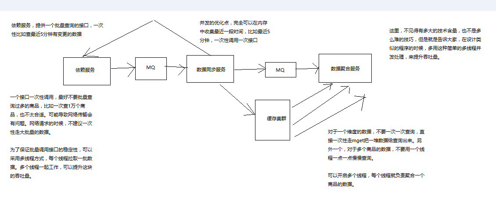

<!-- TOC -->

- [124_大型电商网站的商品详情页的深入分析](#124_大型电商网站的商品详情页的深入分析)
- [125_大型电商网站的商品详情页系统架构是如何一步一步演进的](#125_大型电商网站的商品详情页系统架构是如何一步一步演进的)
- [126_亿级流量大型电商网站的商品详情页系统架构的整体设计](#126_亿级流量大型电商网站的商品详情页系统架构的整体设计)
- [127_商品详情页动态渲染系统：架构整体设计](#127_商品详情页动态渲染系统架构整体设计)
- [128_商品详情页动态渲染系统：大型网站的多机房4级缓存架构设计](#128_商品详情页动态渲染系统大型网站的多机房4级缓存架构设计)
- [129_商品详情页动态渲染系统：复杂的消息队列架构设计](#129_商品详情页动态渲染系统复杂的消息队列架构设计)
- [130_商品详情页动态渲染系统：使用多线程并发提升系统吞吐量的设计](#130_商品详情页动态渲染系统使用多线程并发提升系统吞吐量的设计)
- [131_商品详情页动态渲染系统：redis批量查询性能优化设计](#131_商品详情页动态渲染系统redis批量查询性能优化设计)
- [132_商品详情页动态渲染系统：全链路高可用架构设计](#132_商品详情页动态渲染系统全链路高可用架构设计)
- [133_商品详情页动态渲染系统：微服务架构设计](#133_商品详情页动态渲染系统微服务架构设计)
- [134_商品详情页动态渲染系统：机房与机器的规划](#134_商品详情页动态渲染系统机房与机器的规划)
- [135_商品详情页动态渲染系统：部署CentOS虚拟机集群](#135_商品详情页动态渲染系统部署centos虚拟机集群)
- [136_商品详情页动态渲染系统：双机房部署接入层与应用层Nginx+Lua](#136_商品详情页动态渲染系统双机房部署接入层与应用层nginxlua)
- [137_商品详情页动态渲染系统：为什么是twemproxy+redis而不是redis cluster？](#137_商品详情页动态渲染系统为什么是twemproxyredis而不是redis-cluster)
- [138_商品详情页动态渲染系统：redis复习以及twemproxy基础知识讲解](#138_商品详情页动态渲染系统redis复习以及twemproxy基础知识讲解)
- [139_商品详情页动态渲染系统：部署双机房一主三从架构的redis主集群](#139_商品详情页动态渲染系统部署双机房一主三从架构的redis主集群)
- [140_商品详情页动态渲染系统：给每个机房部署一个redis从集群](#140_商品详情页动态渲染系统给每个机房部署一个redis从集群)
- [141_商品详情页动态渲染系统：为redis主集群部署twemproxy中间件](#141_商品详情页动态渲染系统为redis主集群部署twemproxy中间件)
- [142_商品详情页动态渲染系统：为每个机房的redis从集群部署twemproxy中间件](#142_商品详情页动态渲染系统为每个机房的redis从集群部署twemproxy中间件)
- [143_商品详情页动态渲染系统：部署RabbitMQ消息中间件](#143_商品详情页动态渲染系统部署rabbitmq消息中间件)
- [144_商品详情页动态渲染系统：部署MySQL数据库](#144_商品详情页动态渲染系统部署mysql数据库)
- [145_商品详情页动态渲染系统：声音小问题&课程代码二次开发&商品服务需求](#145_商品详情页动态渲染系统声音小问题课程代码二次开发商品服务需求)
- [146_商品详情页动态渲染系统：工程师的why-how-what思考方法&价格服务说明](#146_商品详情页动态渲染系统工程师的why-how-what思考方法价格服务说明)
- [147_商品详情页动态渲染系统：库存服务的场景介绍以及课程需求说明](#147_商品详情页动态渲染系统库存服务的场景介绍以及课程需求说明)
- [148_商品详情页动态渲染系统：微服务与Spring Cloud基本介绍](#148_商品详情页动态渲染系统微服务与spring-cloud基本介绍)
- [149_商品详情页动态渲染系统：Spring Boot与微服务的关系以及开发回顾](#149_商品详情页动态渲染系统spring-boot与微服务的关系以及开发回顾)
- [150_商品详情页动态渲染系统：Spring Cloud之Eureka注册中心](#150_商品详情页动态渲染系统spring-cloud之eureka注册中心)
- [151_商品详情页动态渲染系统：Spring Cloud之Ribbon+Rest调用负载均衡](#151_商品详情页动态渲染系统spring-cloud之ribbonrest调用负载均衡)
- [152_商品详情页动态渲染系统：Spring Cloud之Fegion声明式服务调用](#152_商品详情页动态渲染系统spring-cloud之fegion声明式服务调用)
- [153_商品详情页动态渲染系统：Spring Cloud之Hystrix熔断降级](#153_商品详情页动态渲染系统spring-cloud之hystrix熔断降级)
- [154_商品详情页动态渲染系统：Spring Cloud之Zuul网关路由](#154_商品详情页动态渲染系统spring-cloud之zuul网关路由)
- [155_商品详情页动态渲染系统：Spring Cloud之Config统一配置中心](#155_商品详情页动态渲染系统spring-cloud之config统一配置中心)
- [156_商品详情页动态渲染系统：Spring Cloud之Sleuth调用链路追踪](#156_商品详情页动态渲染系统spring-cloud之sleuth调用链路追踪)
- [157_商品详情页动态渲染系统：Spring Cloud之Eureka Server安全认证](#157_商品详情页动态渲染系统spring-cloud之eureka-server安全认证)
- [158_商品详情页动态渲染系统：完成Spring Boot+Spring Cloud+MyBatis整合](#158_商品详情页动态渲染系统完成spring-bootspring-cloudmybatis整合)
- [159_商品详情页动态渲染系统：基于Spring Cloud开发商品服务（一）](#159_商品详情页动态渲染系统基于spring-cloud开发商品服务一)
- [160_商品详情页动态渲染系统：基于Spring Cloud开发商品服务（二）](#160_商品详情页动态渲染系统基于spring-cloud开发商品服务二)
- [161_商品详情页动态渲染系统：基于Spring Cloud开发价格服务](#161_商品详情页动态渲染系统基于spring-cloud开发价格服务)
- [162_商品详情页动态渲染系统：基于Spring Cloud开发库存服务](#162_商品详情页动态渲染系统基于spring-cloud开发库存服务)
- [163_商品详情页动态渲染系统：windows部署rabbitmq作为开发测试环境](#163_商品详情页动态渲染系统windows部署rabbitmq作为开发测试环境)
- [164_商品详情页动态渲染系统：windows部署redis作为开发测试环境](#164_商品详情页动态渲染系统windows部署redis作为开发测试环境)
- [165_商品详情页动态渲染系统：依赖服务将数据变更消息写入rabbitmq或双写redis](#165_商品详情页动态渲染系统依赖服务将数据变更消息写入rabbitmq或双写redis)
- [166_商品详情页动态渲染系统：基于Spring Cloud开发数据同步服务](#166_商品详情页动态渲染系统基于spring-cloud开发数据同步服务)
- [167_商品详情页动态渲染系统：基于Spring Cloud开发数据聚合服务](#167_商品详情页动态渲染系统基于spring-cloud开发数据聚合服务)
- [168_商品详情页动态渲染系统：完成数据同步服务与数据聚合服务的测试](#168_商品详情页动态渲染系统完成数据同步服务与数据聚合服务的测试)
- [169_商品详情页动态渲染系统：消息队列架构升级之去重队列](#169_商品详情页动态渲染系统消息队列架构升级之去重队列)
- [170_商品详情页动态渲染系统：消息队列架构升级之刷数据与高优先级队列](#170_商品详情页动态渲染系统消息队列架构升级之刷数据与高优先级队列)
- [171_商品详情页动态渲染系统：吞吐量优化之批量调用依赖服务接口](#171_商品详情页动态渲染系统吞吐量优化之批量调用依赖服务接口)
- [172_商品详情页动态渲染系统：吞吐量优化之redis mget批量查询数据](#172_商品详情页动态渲染系统吞吐量优化之redis-mget批量查询数据)
- [173_商品详情页动态渲染系统：在分发层nginx部署流量分发的lua脚本](#173_商品详情页动态渲染系统在分发层nginx部署流量分发的lua脚本)
- [174_商品详情页动态渲染系统：完成应用层nginx的lua脚本的编写与部署](#174_商品详情页动态渲染系统完成应用层nginx的lua脚本的编写与部署)
- [175_商品详情页动态渲染系统：基于Spring Cloud开发数据直连服务](#175_商品详情页动态渲染系统基于spring-cloud开发数据直连服务)
- [176_商品详情页动态渲染系统：完成多级缓存全链路的测试多个bug修复](#176_商品详情页动态渲染系统完成多级缓存全链路的测试多个bug修复)
- [177_商品详情页动态渲染系统：商品介绍分段存储以及分段加载的介绍](#177_商品详情页动态渲染系统商品介绍分段存储以及分段加载的介绍)
- [178_商品详情页动态渲染系统：高可用架构优化之读链路多级降级思路介绍](#178_商品详情页动态渲染系统高可用架构优化之读链路多级降级思路介绍)
- [179_商品详情页动态渲染系统：高可用架构优化之hystrix隔离与降级](#179_商品详情页动态渲染系统高可用架构优化之hystrix隔离与降级)
- [180_商品详情页动态渲染系统：部署jenkins持续集成服务器](#180_商品详情页动态渲染系统部署jenkins持续集成服务器)
- [181_商品详情页动态渲染系统：在CentOS 6安装和部署Docker](#181_商品详情页动态渲染系统在centos-6安装和部署docker)
- [182_商品详情页动态渲染系统：在CentOS 6安装maven、git以及推送github](#182_商品详情页动态渲染系统在centos-6安装mavengit以及推送github)
- [183_商品详情页动态渲染系统：通过jenkins+docker部署eureka服务](#183_商品详情页动态渲染系统通过jenkinsdocker部署eureka服务)
- [!/bin/bash](#binbash)
- [RUN bash -c 'touch /app.jar'](#run-bash--c-touch-appjar)
- [184_商品详情页动态渲染系统：twemproxy hash tag+mget优化思路介绍](#184_商品详情页动态渲染系统twemproxy-hash-tagmget优化思路介绍)
- [185_商品详情页动态渲染系统：所有服务最终修改以及jenkins+docker部署](#185_商品详情页动态渲染系统所有服务最终修改以及jenkinsdocker部署)
- [!/bin/bash](#binbash-1)
- [RUN bash -c 'touch /app.jar'](#run-bash--c-touch-appjar-1)
- [186_商品详情页OneService系统：整体架构设计](#186_商品详情页oneservice系统整体架构设计)
- [187_商品详情页OneService系统：基于Spring Cloud构建OneService服务](#187_商品详情页oneservice系统基于spring-cloud构建oneservice服务)
- [188_商品详情页OneService系统：库存服务与价格服务的代理接口开发](#188_商品详情页oneservice系统库存服务与价格服务的代理接口开发)
- [189_商品详情页OneService系统：请求预处理功能设计介绍](#189_商品详情页oneservice系统请求预处理功能设计介绍)
- [190_商品详情页OneService系统：多服务接口合并设计介绍](#190_商品详情页oneservice系统多服务接口合并设计介绍)
- [191_商品详情页OneService系统：基于hystrix进行接口统一降级](#191_商品详情页oneservice系统基于hystrix进行接口统一降级)
- [192_商品详情页OneService系统：基于hystrix dashboard进行统一监控](#192_商品详情页oneservice系统基于hystrix-dashboard进行统一监控)
- [193_商品详情页OneService系统：基于jenkins+docker部署OneService服务](#193_商品详情页oneservice系统基于jenkinsdocker部署oneservice服务)
- [194_商品详情页OneService系统：基于jenkins+docker部署hystrix terbine服务](#194_商品详情页oneservice系统基于jenkinsdocker部署hystrix-terbine服务)
- [195_商品详情页前端介绍&课程总结&Java架构师展望](#195_商品详情页前端介绍课程总结java架构师展望)

<!-- /TOC -->


# 124_大型电商网站的商品详情页的深入分析


之前，咱们也是说在讲解这个商品详情页系统的架构

缓存架构，高可用服务

商品详情页系统，我们只是抽取了其中一部分来讲解，而且还做了很大程度的简化

主要是为了用一个较为拟真的这么一个业务场景，重点是要讲解：缓存架构，高可用服务（hystrix）

在讲解完了之前的内容之后，相信大家也都掌握了一定的基础了，然后接下来我们就要去动手纯实战，去开发出来一个较为完整的亿级流量大型电商网站的商品详情页系统

升级内容：

（1）纯实战，我们不会过多的讲解一些技术（redis，缓存架构，hystrix高可用服务），redis和hystrix都是对技术的深入讲解
（2）技术讲解过多了，对于我们这样的一套单品课程来说，自然在第一版的时候，业务和完整架构自然讲解就少了
（3）这次升级，策略跟第一版不同，重点就是完整架构的项目实战，亿级流量电商详情页系统架构的完整架构的项目实战
（4）纯实战，做东西，不会深入讲解任何技术
（5）部署，简单的讲解，做

商品详情页介绍

	商品详情页的多模板化
		多套模板：聚划算、天猫超市、淘抢购、电器城
		不同模板的元数据一样，只是展示方式不一样
		不同的业务，商品详情页的个性化需求很多，数据来源也很多
	
	商品详情页结构
		时效性比较低的数据
			一个商品详情包含了不同的维度
			商品维度：标题，图片，属性，等等
			主商品维度：商品介绍，规格参数，等等
			分类维度
			商家维度
			时效性比较低的数据
				其实后面会讲解，都是在一个商品详情页被访问到的时候，将数据动态直接渲染/填充到一个html模板中去的
				在浏览器展现的时候，数据写死在html里面，直接就出来了
				因为比如说，一个商品的数据变更了，可能是异步的去更新数据的，也许需要5分钟，或者10分钟的时间，才能将变更的数据反映的商品详情页中去
		实时性较高的数据
			实时价格、实时促销、广告词、配送至、预售、库存
			ajax异步加载
			在访问商品详情页的时候，价格、库存、促销活动、广告词，都没有直接写死到html中，直接是在html里放了一个js脚本
			然后在html在浏览器显示出来的时候，js脚本运行，直接发送ajax请求到后端
			后端接口，直接查询价格、库存、促销活动、广告词，最新的数据
			只要你变更了数据，那么在下一次商品详情页展示的时候，一定可以将最新的数据展示出来
	
	在淘宝网上展示一个通用商品模板，商品详情页结构拆解说明，分析一个商品详情页的多维度构成
		
	亿级流量电商网站的商品详情页访问情况
		访问量：比如双11活动，商品详情页的pv至少达到几亿次，但是经过良好设计的详情页系统，响应时间小于几十ms
		访问特点：离散访问多，热点数据少
		一般来说，访问的比较均匀，很少说集中式访问某个商品详情页，除非是那种秒杀活动，那是集中式访问某个商品详情页


# 125_大型电商网站的商品详情页系统架构是如何一步一步演进的


商品详情页系统架构演进历程

	第一个版本
		架构设计
			J2EE+Tomcat+MySQL
			动态页面，每次请求都要调用多个依赖服务的接口，从数据库里查询数据，然后通过类似JSP的技术渲染到HTML模板中，返回最终HTML页面
		架构缺陷
			每次请求都是要访问数据库的，性能肯定很差
			每次请求都要调用大量的依赖服务，依赖服务不稳定导致商品详情页展示的性能经常抖动
		
	第二个版本
		架构设计
			页面静态化技术
			通过MQ得到商品详情页涉及到的数据的变更消息
			通过Java Worker服务全量调用所有的依赖服务的接口，查询数据库，获取到构成一个商品详情页的完整数据，并通过velocity等模板技术生成静态HTML
			将静态HTML页面通过rsync工具直接推送到多台nginx服务器上，每台nginx服务器上都有全量的HTML静态页面
			nginx对商品详情页的访问请求直接返回本地的静态HTML页面
			在nginx服务器前加一层负载均衡设备，请求打到任何一台应用nginx服务器上，都有全量的HTML静态页面可以返回
		架构缺陷
			全量更新问题
				如果某一个商品分类、商家等信息变更了
				那么那个分类、店铺、商家下面所有的商品详情页都需要重新生成静态HTML页面
			更新速度过慢问题
				分类、店铺、商家、商品越来越多
				重新生成HTML的负载越来越高，rsync全量同步所有nginx的负载也越来越高
				从数据变更到生成静态HTML，再到全量同步到所有nginx，时间越来越慢
			扩容问题
				因为每个商品详情页都要全量同步到所有的nginx上，导致系统无法扩容，无法增加系统容量
		架构优化
			解决全量更新问题
				每次Java Worker收到某个维度的变更消息，不是拉去全量维度并生成完整HTML，而是按照维度拆分，生成一个变化维度的HTML片段
				nginx对多个HTML片段通过SSI合并html片段然后输出一个完整的html
			解决扩容问题
				每个商品详情页不是全量同步到所有的nginx
				而是根据商品id路由到某一台nginx上，同时接入层nginx按照相同的逻辑路由请求
			更新速度过慢问题
				增加更多机器资源
				多机房部署，每个机房部署一套Java Worker+应用Nginx，所有机房用一套负载均衡设备，在每个机房内部完成全流程，不跨机房
		架构优化后的缺陷
			更新速度还是不够快的问题
				商品的每个维度都有一个HTML片段，rsync推送大量的HTML片段，负载太高，性能较差
				Nginx基于机械硬盘进行SSI合并，性能太差
			还是存在全量更新的问题
				虽然解决了分类、商家、店铺维度的变更，只要增量重新生产较小的HTML片段即可，不用全量重新生成关联的所有商品详情页的HTML
				但是如果某个页面模板变更，或者新加入一个页面模板，还是会导致几亿个商品的HTML片段都要重新生成和rsync，要几天时间才能完成，无法响应需求
			还是存在容量问题
				nginx存储有限，不能无限存储几亿，以及增长的商品详情页的HTML文件
				如果nginx存储达到极限，需要删除部分商品详情页的HTML文件，改成nginx找不到HTML，则调用后端接口，回到动态页面的架构
				动态页面架构在高并发访问的情况下，会对依赖系统造成过大的压力，几乎扛不住
			
	第三个版本
		需要支持的需求
			迅速响应各种页面模板的改版和个性化需求的新模板的加入
			页面模块化，页面中的某个区域变化，只要更新这个区域中的数据即可
			支持高性能访问
			支持水平扩容的伸缩性架构
		架构设计
			系统架构设计
				依赖服务有数据变更发送消息到MQ
				数据异构Worker服务监听MQ中的变更消息，调用依赖服务的接口，仅仅拉取有变更的数据即可，然后将数据存储到redis中
				数据异构Worker存储到redis中的，都是原子未加工数据，包括商品基本信息、商品扩展属性、商品其他信息、商品规格参数、商品分类、商家信息
				数据异构Worker发送消息到MQ，数据聚合Worker监听到MQ消息
				数据聚合Worker将原子数据从redis中取出，按照维度聚合后存储到redis中，包括三个维度
					基本信息维度：基本信息、扩展属性
					商品介绍：PC版、移动版
					其他信息：商品分类、商家信息
				nginx+lua，lua从redis读取商品各个维度的数据，通过nginx动态渲染到html模板中，然后输出最终的html
			如何解决所有的问题
				更新问题：不再是生成和推送html片段了，不再需要合成html，直接数据更新到redis，然后走动态渲染，性能大大提升
				全量更新问题：数据和模板分离，数据更新呢就更新数据，模板更新直接推送模板到nginx，不需要重新生成所有html，直接走动态渲染
				容量问题：不需要依赖nginx所在机器的磁盘空间存储大量的html，将数据放redis，html就存放模板，大大减少空间占用，而且redis集群可扩容


# 126_亿级流量大型电商网站的商品详情页系统架构的整体设计


商品详情页整体架构组成

	动态渲染系统
		将页面中静的数据，直接在变更的时候推送到缓存，然后每次请求页面动态渲染新数据
		商品详情页系统（负责静的部分）：被动接收数据，存储redis，nginx+lua动态渲染
		商品详情页动态服务系统（对外提供数据接口）
			提供各种数据接口
			动态调用依赖服务的接口，产生数据并且返回响应
			从商品详情页系统处理出来的redis中，获取数据，并返回响应
			
	OneService系统
		动的部分，都是走ajax异步请求的，不是走动态渲染的
		商品详情页统一服务系统（负责动的部分）
		
	前端页面
		静的部分，直接被动态渲染系统渲染进去了
		动的部分，html一到浏览器，直接走js脚本，ajax异步加载
		商品详情页，分段存储，ajax异步分屏加载
		
	工程运维
		限流，压测，灰度发布


# 127_商品详情页动态渲染系统：架构整体设计


我们先做动态渲染那套系统

（1）依赖服务 -> MQ -> 动态渲染服务 -> 多级缓存
（2）负载均衡 -> 分发层nginx -> 应用层nginx -> 多级缓存
（3）多级缓存 -> 数据直连服务

动态渲染系统
	
	数据闭环
		数据闭环架构
			依赖服务：商品基本信息，规格参数，商家/店铺，热力图，商品介绍，商品维度，品牌，分类，其他
			发送数据变更消息到MQ
			数据异构Worker集群，监听MQ，将原子数据存储到redis，发送消息到MQ
			数据聚合Worker集群，监听MQ，将原子数据按维度聚合后存储到redis，三个维度（商品基本信息、商品介绍、其他信息）
		数据闭环，就是数据的自我管理，所有数据原样同步后，根据自己的逻辑进行后续的数据加工，走系统流程，以及展示k
		数据形成闭环之后，依赖服务的抖动或者维护，不会影响到整个商品详情页系统的运行
		数据闭环的流程：数据异构（多种异构数据源拉取），数据原子化，数据聚合（按照维度将原子数据进行聚合），数据存储（Redis）
	
	数据维度化
		商品基本信息：标题、扩展属性、特殊属性、图片、颜色尺码、规格参数
		商品介绍
		非商品维度其他信息：分类，商家，店铺，品牌
		商品维度其他信息：采用ajax异步加载，价格，促销，配送至，广告，推荐，最佳组合，等等
		
		采取ssdb，这种基于磁盘的大容量/高性能的kv存储，保存商品维度、主商品维度、商品维度其他信息，数据量大，不能光靠内存去支撑
		采取redis，纯内存的kv存储，保存少量的数据，比如非商品维度的其他数据，商家数据，分类数据，品牌数据
		
		一个完整的数据，拆分成多个维度，每个维度独立存储，就避免了一个维度的数据变更就要全量更新所有数据的问题
		不同维度的数据，因为数据量的不一样，可以采取不同的存储策略
		
	系统拆分
		系统拆分更加细：依赖服务、MQ、数据异构Worker、数据同步Worker、Redis、Nginx+Lua
		每个部分的工作专注，影响少，适合团队多人协作
		异构Worker的原子数据，基于原子数据提供的服务更加灵活
		聚合Worker将数据聚合后，减少redis读取次数，提升性能
		前端展示分离为商品详情页前端展示系统和商品介绍前端展示系统，不同特点，分离部署，不同逻辑，互相不影响
		
	异步化
		异步化，提升并发能力，流量削峰
		消息异步化，让各个系统解耦合，如果使用依赖服务调用商品详情页系统接口同步推送，那么就是耦合的
		缓存数据更新异步化，数据异构Worker同步调用依赖服务接口，但是异步更新redis
		
	动态化
		数据获取动态化：nginx+lua获取商品详情页数据的时候，按照维度获取，比如商品基本数据、其他数据（分类、商家）
		模板渲染实时化：支持模板页面随时变化，因为采用的是每次从nginx+redis+ehcache缓存获取数据，渲染到模板的方式，因此模板变更不用重新静态化HTML
		重启应用秒级化：nginx+lua架构，重启在秒级
		需求上线快速化：使用nginx+lua架构开发商品详情页的业务逻辑，非常快速
			
	多机房多活
		Worker无状态，同时部署在各自的机房时采取不同机房的配置，来读取各自机房内部部署的数据集群（redis、mysql等）
			将数据异构Worker和数据聚合Worker设计为无状态化，可以任意水平扩展
			Worker无状态化，但是配置文件有状态，不同的机房有一套自己的配置文件，只读取自己机房的redis、ssdb、mysql等数据
		每个机房配置全链路：接入nginx、商品详情页nginx+商品基本信息redis集群+其他信息redis集群、商品介绍nginx+商品介绍redis集群
		部署统一的CDN以及LVS+KeepAlived负载均衡设备


# 128_商品详情页动态渲染系统：大型网站的多机房4级缓存架构设计


多级缓存架构
	本地缓存
		使用nginx shared dict作为local cache，http-lua-module的shared dict可以作为缓存，而且reload nginx不会丢失
		也可以使用nginx proxy cache做local cache
		双层nginx部署，一层接入，一层应用，接入层用hash路由策略提升缓存命中率
			比如库存缓存数据的TP99为5s，本地缓存命中率25%，redis命中率28%，回源命中率47%
			一次普通秒杀活动的命中率，本地缓存55%，分布式redis命中率15%，回源命中率27%
			最高可以提升命中率达到10%
		全缓存链路维度化存储，如果有3个维度的数据，只有其中1个过期了，那么只要获取那1个过期的数据即可
		nginx local cache的过期时间一般设置为30min，到后端的流量会减少至少3倍
	4级多级缓存
		nginx本地缓存，抗热点数据，小内存缓存访问最频繁的数据
		各个机房本地的redis从集群的数据，抗大量离线数据，采用一致性hash策略构建分布式redis缓存集群
		tomcat中的动态服务的本地jvm堆缓存
			支持在一个请求中多次读取一个数据，或者与该数据相关的数据
			作为redis崩溃的备用防线
			固定缓存一些较少访问频繁的数据，比如分类，品牌等数据
			堆缓存过期时间为redis过期时间的一半
		主redis集群
			命中率非常低，小于5%
			防止主从同步延迟导致的数据读取miss
			防止各个机房的从redis集群崩溃之后，全量走依赖服务会导致雪崩，主redis集群是后备防线
	主redis集群，采取多机房一主三从的高可用部署架构
		redis集群部署采取双机房一主三活的架构，机房A部署主集群+一个从集群，机房B部署一个从集群（从机房A主集群）+一个从集群（从机房B从集群）
		双机房一主三活的架构，保证了机房A彻底故障的时候，机房B还有一套备用的集群，可以升级为一主一从
		如果采取机房A部署一主一从，机房B一从，那么机房A故障时，机房B的一从承载所有读写压力，压力过大，很难承受


# 129_商品详情页动态渲染系统：复杂的消息队列架构设计


队列化
	任务等待队列
	任务排重队列（异构Worker对一个时间段内的变更消息做排重）
	失败任务队列（失败重试机制）
	优先级队列，刷数据队列（依赖服务洗数据）、高优先级队列（活动商品优先级高）


# 130_商品详情页动态渲染系统：使用多线程并发提升系统吞吐量的设计



并发化
	数据同步服务做并发化+合并，将多个变更消息合并在一起，调用依赖服务一次接口获取多个数据，采用多线程并发调用
	数据聚合服务做并发化，每次重新聚合数据的时候，对多个原子数据用多线程并发从redis查询

# 131_商品详情页动态渲染系统：redis批量查询性能优化设计


# 132_商品详情页动态渲染系统：全链路高可用架构设计


高可用设计
	
	读链路多级降级：本机房从集群 -> 主集群 -> 直连
	
	全链路隔离
		基于hystrix的依赖调用隔离，限流，熔断，降级
		普通服务的多机房容灾冗余部署以及隔离
		

# 133_商品详情页动态渲染系统：微服务架构设计


1、领域驱动设计：我们需要对这个系统涉及到的领域模型机进行分析，然后进行领域建模，最后的话，设计出我们对应的微服务的模型
2、spring cloud：微服务的基础技术架构，我们用spring cloud来做
3、持续交付流水线，jenkins+git+自动化持续集成+自动化测试+自动化部署
4、docker：大量的微服务的部署与管理

我们这个课程

一大块，真实的完整的亿级流量高并发高可用的电商详情页系统的架构实战

另一块，里面的服务，都会用微服务架构来做，相当于是在真实业务场景下的微服务项目实战


# 134_商品详情页动态渲染系统：机房与机器的规划


虚拟机，要弄几台，大概怎么来部署

负载均衡：2台机器，lvs+keepalived，双机高可用

两个机房，每个机房给1台机器，总共就是2台机器，分发层nginx+应用层nginx+缓存从集群

缓存主集群：模拟跟上面的两个机房部署在一起，在实际生产环境中，的确可能是在相同的机房，但是肯定在不同的机器上

我们这里不会有真正的机房，但是会模拟出来，有些机器会在某个机房里

缓存集群分片中间件，跟缓存集群部署在一起

rabbitmq和mysql：1台机器

5


# 135_商品详情页动态渲染系统：部署CentOS虚拟机集群


2台3G内存的虚拟机

1、在虚拟机中安装CentOS

（1）使用课程提供的CentOS 6.5镜像即可，CentOS-6.5-i386-minimal.iso。
（2）创建虚拟机：打开Virtual Box，点击“新建”按钮，点击“下一步”，输入虚拟机名称为eshop-cache01，选择操作系统为Linux，选择版本为Red Hat，分配1024MB内存，后面的选项全部用默认，在Virtual Disk File location and size中，一定要自己选择一个目录来存放虚拟机文件，最后点击“create”按钮，开始创建虚拟机。
（3）设置虚拟机网卡：选择创建好的虚拟机，点击“设置”按钮，在网络一栏中，连接方式中，选择“Bridged Adapter”。
（4）安装虚拟机中的CentOS 6.5操作系统：选择创建好的虚拟机，点击“开始”按钮，选择安装介质（即本地的CentOS 6.5镜像文件），选择第一项开始安装-Skip-欢迎界面Next-选择默认语言-Baisc Storage Devices-Yes, discard any data-主机名:spark2upgrade01-选择时区-设置初始密码为hadoop-Replace Existing Linux System-Write changes to disk-CentOS 6.5自己开始安装。
（5）安装完以后，CentOS会提醒你要重启一下，就是reboot，你就reboot就可以了。

（6）配置网络

vi /etc/sysconfig/network-scripts/ifcfg-eth0

DEVICE=eth0
TYPE=Ethernet
ONBOOT=yes
BOOTPROTO=dhcp
service network restart
ifconfig

BOOTPROTO=static
IPADDR=192.168.0.X
NETMASK=255.255.255.0
GATEWAY=192.168.0.1
service network restart

（7）配置hosts

vi /etc/hosts
配置本机的hostname到ip地址的映射

（8）配置SecureCRT

此时就可以使用SecureCRT从本机连接到虚拟机进行操作了

一般来说，虚拟机管理软件，virtual box，可以用来创建和管理虚拟机，但是一般不会直接在virtualbox里面去操作，因为比较麻烦，没有办法复制粘贴

比如后面我们要安装很多其他的一些东西，perl，java，redis，storm，复制一些命令直接去执行

SecureCRT，在windows宿主机中，去连接virtual box中的虚拟机

收费的，我这里有完美破解版，跟着课程一起给大家，破解

（9）关闭防火墙

service iptables stop
service ip6tables stop
chkconfig iptables off
chkconfig ip6tables off

vi /etc/selinux/config
SELINUX=disabled

关闭windows的防火墙

后面要搭建集群，有的大数据技术的集群之间，在本地你给了防火墙的话，可能会没有办法互相连接，会导致搭建失败

（10）配置yum

yum clean all
yum makecache
yum install wget

------------------------------------------------------------------------------------------

2、在每个CentOS中都安装Java和Perl

（1）安装JDK

1、将jdk-7u60-linux-i586.rpm通过WinSCP上传到虚拟机中
2、安装JDK：rpm -ivh jdk-7u65-linux-i586.rpm
3、配置jdk相关的环境变量
vi .bashrc
export JAVA_HOME=/usr/java/latest
export PATH=$PATH:$JAVA_HOME/bin
source .bashrc
4、测试jdk安装是否成功：java -version

（2）安装Perl

yum install -y gcc

wget http://www.cpan.org/src/5.0/perl-5.16.1.tar.gz
tar -xzf perl-5.16.1.tar.gz
cd perl-5.16.1
./Configure -des -Dprefix=/usr/local/perl
make && make test && make install
perl -v

------------------------------------------------------------------------------------------

3、在另外一个虚拟机中安装CentOS集群

（1）按照上述步骤，再安装1台一模一样环境的linux机器
（2）另外三台机器的hostname分别设置为eshop-detail02
（3）安装好之后，在每台机器的hosts文件里面，配置好所有的机器的ip地址到hostname的映射关系

------------------------------------------------------------------------------------------

4、配置2台CentOS为ssh免密码互相通信

（1）首先在三台机器上配置对本机的ssh免密码登录
ssh-keygen -t rsa
生成本机的公钥，过程中不断敲回车即可，ssh-keygen命令默认会将公钥放在/root/.ssh目录下
cd /root/.ssh
cp id_rsa.pub authorized_keys
将公钥复制为authorized_keys文件，此时使用ssh连接本机就不需要输入密码了

（2）接着配置三台机器互相之间的ssh免密码登录
使用ssh-copy-id -i hostname命令将本机的公钥拷贝到指定机器的authorized_keys文件中


# 136_商品详情页动态渲染系统：双机房部署接入层与应用层Nginx+Lua


openresty，我们之前都给大家讲解过了

部署了两台虚拟机

模拟的场景是什么，假设这两台虚拟机分别在不同的机房中，每个机房里都有一台机器，所以按照我们之前讲解的那套双机房的四级缓存架构

部署nginx，虚拟机，每台机器上，部署两个nginx，一个是分发层nginx，一个是应用层nginx

在实际生产环境中

1、部署第一个nginx

（1）部署openresty

mkdir -p /usr/servers  
cd /usr/servers/

yum install -y readline-devel pcre-devel openssl-devel gcc

wget http://openresty.org/download/ngx_openresty-1.7.7.2.tar.gz  
tar -xzvf ngx_openresty-1.7.7.2.tar.gz  
cd /usr/servers/ngx_openresty-1.7.7.2/

cd bundle/LuaJIT-2.1-20150120/  
make clean && make && make install  
ln -sf luajit-2.1.0-alpha /usr/local/bin/luajit

cd bundle  
wget https://github.com/FRiCKLE/ngx_cache_purge/archive/2.3.tar.gz  
tar -xvf 2.3.tar.gz  

cd bundle  
wget https://github.com/yaoweibin/nginx_upstream_check_module/archive/v0.3.0.tar.gz  
tar -xvf v0.3.0.tar.gz  

cd /usr/servers/ngx_openresty-1.7.7.2  
./configure --prefix=/usr/servers --with-http_realip_module  --with-pcre  --with-luajit --add-module=./bundle/ngx_cache_purge-2.3/ --add-module=./bundle/nginx_upstream_check_module-0.3.0/ -j2  
make && make install 

cd /usr/servers/  
ll

/usr/servers/luajit
/usr/servers/lualib
/usr/servers/nginx
/usr/servers/nginx/sbin/nginx -V 

启动nginx: /usr/servers/nginx/sbin/nginx

（2）nginx+lua开发的hello world

vi /usr/servers/nginx/conf/nginx.conf

在http部分添加：

lua_package_path "/usr/servers/lualib/?.lua;;";  
lua_package_cpath "/usr/servers/lualib/?.so;;";  

/usr/servers/nginx/conf下，创建一个lua.conf

server {  
    listen       80;  
    server_name  _;  
}  

在nginx.conf的http部分添加：

include lua.conf;

验证配置是否正确：

/usr/servers/nginx/sbin/nginx -t

在lua.conf的server部分添加：

location /lua {  
    default_type 'text/html';  
    content_by_lua 'ngx.say("hello world")';  
} 

/usr/servers/nginx/sbin/nginx -t  

重新nginx加载配置

/usr/servers/nginx/sbin/nginx -s reload  

访问http: http://192.168.31.187/lua

vi /usr/servers/nginx/conf/lua/test.lua

ngx.say("hello world"); 

修改lua.conf

location /lua {  
    default_type 'text/html';  
    content_by_lua_file conf/lua/test.lua; 
}

查看异常日志

tail -f /usr/servers/nginx/logs/error.log

（3）工程化的nginx+lua项目结构

项目工程结构

hello
    hello.conf     
    lua              
      hello.lua
    lualib            
      *.lua
      *.so

放在/usr/hello目录下

/usr/servers/nginx/conf/nginx.conf

worker_processes  2;  

error_log  logs/error.log;  

events {  
    worker_connections  1024;  
}  

http {  
    include       mime.types;  
    default_type  text/html;  
  
    lua_package_path "/usr/hello/lualib/?.lua;;";  
    lua_package_cpath "/usr/hello/lualib/?.so;;"; 
    include /usr/hello/hello.conf;  
}  

/usr/hello/hello.conf

server {  
    listen       80;  
    server_name  _;  
  
    location /lua {  
        default_type 'text/html';  
        lua_code_cache off;  
        content_by_lua_file /usr/example/lua/test.lua;  
    }  
}  


# 137_商品详情页动态渲染系统：为什么是twemproxy+redis而不是redis cluster？


1、LVS那块不讲解

LVS+KeepAlived，负载均衡那块，讲一讲，还是不讲了，意义不是太大

MySQL+Atlas，分库分表，鸡肋

单课，聚焦，围绕一个主题去讲解，太发散了以后，什么都讲，没有围绕主题去讲解，意义不是太大

商品详情页系统，亿级流量大电商，核心的东西

随着课程不断讲解，可能会有10%的出入，砍掉或者调整一些细枝末节，大的思路是ok的，不会改变的

对课程，更加深入的思考

每一讲的标题会不断的变更

2、redis cluster的问题

twemproxy+redis去做集群，redis部署多个主实例，每个主实例可以挂载一些redis从实例，如果将不同的数据分片，写入不同的redis主实例中，twemproxy这么一个缓存集群的中间件

redis cluster

（1）不好做读写分离，读写请求全部落到主实例上的，如果要扩展写QPS，或者是扩展读QPS，都是需要扩展主实例的数量，从实例就是一个用做热备+高可用
（2）不好跟nginx+lua直接整合，lua->redis的client api，但是不太支持redis cluster，中间就要走一个中转的java服务
（3）不好做树状集群结构，比如redis主集群一主三从双机房架构，redis cluster不太好做成那种树状结构
（4）方便，相当于是上下线节点，集群扩容，运维工作，高可用自动切换，比较方便

3、twemproxy+redis

（1）上线下线节点，有一些手工维护集群的成本
（2）支持redis集群+读写分离，就是最基本的多个redis主实例，twemproxy这个中间件来决定的，java/nginx+lua客户端，是连接twemproxy中间件的。每个redis主实例就挂载了多个redis从实例，高可用->哨兵，redis cluster读写都要落到主实例的限制，你自己可以决定写主，读从，等等
（3）支持redis cli协议，可以直接跟nginx+lua整合
（4）可以搭建树状集群结构

4、如何选择？

（1）看你是否一定需要那3点了，如果不需要，那么用redis cluster也ok，大多数情况下，很多应用用redis就是比较简单的，做一个缓存
（2）如果你的架构里很需要那3点，那么用twemproxy比较好，商品详情页系统的整套架构


# 138_商品详情页动态渲染系统：redis复习以及twemproxy基础知识讲解


1、部署redis

tar -zxvf redis-2.8.19.tar.gz --版本过旧，实际在做类似这种nginx+lua生产环境的部署的时候，不一定用最新的版本就是最好，老版本一般比较稳定，nginx+lua整合，用老点的版本，会比较保险一些
cd redis-2.8.19
make

nohup /usr/local/redis-test/redis-2.8.19/src/redis-server  /usr/local/redis-test/redis-2.8.19/redis.conf &  

ps -aux | grep redis

/usr/local/redis-test/redis-2.8.19/src/redis-cli -p 6379  

set k1 v1
get k1

2、twemproxy部署

yum install -y autoconf automake libtool

yum remove -y autoconf --直接将autoconf和automake、libtool都删除掉了

wget ftp://ftp.gnu.org/gnu/autoconf/autoconf-2.69.tar.gz
tar -zxvf autoconf-2.69.tar.gz
cd autoconf-2.69 
./configure --prefix=/usr
make && make install

wget http://ftp.gnu.org/gnu/automake/automake-1.14.tar.gz
tar -zxvf automake-1.14.tar.gz 
cd automake-1.14
./bootstrap.sh
./configure --prefix=/usr
make && make install

wget http://ftpmirror.gnu.org/libtool/libtool-2.4.2.tar.gz
tar -zxvf libtool-2.4.2.tar.gz
cd libtool-2.4.2
./configure --prefix=/usr
make && make install

tar -zxvf twemproxy-0.4.0.tar.gz

cd twemproxy-0.4.0

autoreconf -fvi
./configure && make

vi /usr/local/twemproxy-test/twemproxy-0.4.0/conf/nutcracker.yml  

server1:  
  listen: 127.0.0.1:1111  
  hash: fnv1a_64  
  distribution: ketama  
  redis: true  
  servers:  
   - 127.0.0.1:6379:1 

/usr/local/twemproxy-test/twemproxy-0.4.0/src/nutcracker -d -c /usr/local/twemproxy-test/twemproxy-0.4.0/conf/nutcracker.yml 

ps -aux | grep nutcracker

/usr/local/redis-test/redis-2.8.19/src/redis-cli -p 1111  

get k1
set k1 v2
get k1

3、redis配置

redis.conf

port 6379
logfile ""
maxmemory 100mb
maxmemory-policy volatile-lru
maxmemory-samples 10

4、redis主从

cp redis.conf redis_6379.conf
cp redis.conf redis_6380.conf

两份文件分别将端口设置为6379和6380

分别启动两个redis实例

nohup /usr/local/redis-2.8.19/src/redis-server  /usr/local/redis-2.8.19/redis_6379.conf &  
nohup /usr/local/redis-2.8.19/src/redis-server  /usr/local/redis-2.8.19/redis_6380.conf &

ps -aux | grep redis 

通过从实例客户端挂载主从

/usr/local/redis-2.8.19/src/redis-cli  -p 6380

slaveof 127.0.0.1 6379

info replication

/usr/local/redis-2.8.19/src/redis-cli -p 6379

set k2 v2

/usr/local/redis-2.8.19/src/redis-cli -p 6380

get k2

5、twemproxy讲解

eshop-detail-test:  
  listen: 127.0.0.1:1111  
  hash: fnv1a_64  
  distribution: ketama  
  timeout:1000  
  redis: true  
  servers:  
   - 127.0.0.1:6379:1 test-redis-01 
   - 127.0.0.1:6380:1 test-redis-02

eshop-detail-test: redis集群的逻辑名称
listen：twemproxy监听的端口号
hash：hash散列算法
distribution：分片算法，一致性hash，取模，等等
timeout：跟redis连接的超时时长
redis：是否是redis，false的话是memcached
servers：redis实例列表，一定要加别名，否则默认使用ip:port:weight来计算分片，如果宕机后更换机器，那么分片就不一样了，因此加了别名后，可以确保分片一定是准确的

你的客户端，java/nginx+lua，连接twemproxy，写数据的时候，twemproxy负责将数据分片，写入不同的redis实例
   
如果某个redis机器宕机，需要自动从一致性hash环上摘掉，等恢复后自动上线

auto_eject_hosts: true，自动摘除故障节点
server_retry_timeout: 30000，每隔30秒判断故障节点是否正常，如果正常则放回一致性hash环
server_failure_limit: 2，多少次无响应，就从一致性hash环中摘除

一致性hash，前面讲解果了


# 139_商品详情页动态渲染系统：部署双机房一主三从架构的redis主集群


在第一台虚拟机上，部署两个redis主实例+两个redis从实例，模拟一个机房的情况
在第二台虚拟机上，部署两个redis从实例，挂载到第一台虚拟机的redis从实例上; 再部署两个redis从实例，挂载到第二台虚拟机的从实例上

tar -zxvf redis-2.8.19.tar.gz 
cd redis-2.8.19
make

master01.conf
master02.conf
slave01.conf
slave02.conf

nohup src/redis-server  ../redis.conf &  

src/redis-cli -p 6379  

slaveof


# 140_商品详情页动态渲染系统：给每个机房部署一个redis从集群


# 141_商品详情页动态渲染系统：为redis主集群部署twemproxy中间件


yum install -y autoconf automake libtool

yum remove -y autoconf --直接将autoconf和automake、libtool都删除掉了

wget ftp://ftp.gnu.org/gnu/autoconf/autoconf-2.69.tar.gz
tar -zxvf autoconf-2.69.tar.gz
cd autoconf-2.69 
./configure --prefix=/usr
make && make install

wget http://ftp.gnu.org/gnu/automake/automake-1.14.tar.gz
tar -zxvf automake-1.14.tar.gz 
cd automake-1.14
./bootstrap.sh
./configure --prefix=/usr
make && make install

wget http://ftpmirror.gnu.org/libtool/libtool-2.4.2.tar.gz
tar -zxvf libtool-2.4.2.tar.gz
cd libtool-2.4.2
./configure --prefix=/usr
make && make install

tar -zxvf twemproxy-0.4.0.tar.gz

cd twemproxy-0.4.0

autoreconf -fvi
./configure && make

vi conf/nutcracker.yml  

server1:  
  listen: 127.0.0.1:1111  
  hash: fnv1a_64  
  distribution: ketama  
  redis: true  
  servers:  
   - 127.0.0.1:6379:1 

src/nutcracker -d -c ../conf/nutcracker.yml 

ps -aux | grep nutcracker

src/redis-cli -p 1111  

get k1
set k1 v2
get k1


# 142_商品详情页动态渲染系统：为每个机房的redis从集群部署twemproxy中间件


yum install -y autoconf automake libtool

yum remove -y autoconf --直接将autoconf和automake、libtool都删除掉了

wget ftp://ftp.gnu.org/gnu/autoconf/autoconf-2.69.tar.gz
tar -zxvf autoconf-2.69.tar.gz
cd autoconf-2.69 
./configure --prefix=/usr
make && make install

wget http://ftp.gnu.org/gnu/automake/automake-1.14.tar.gz
tar -zxvf automake-1.14.tar.gz 
cd automake-1.14
./bootstrap.sh
./configure --prefix=/usr
make && make install

wget http://ftpmirror.gnu.org/libtool/libtool-2.4.2.tar.gz
tar -zxvf libtool-2.4.2.tar.gz
cd libtool-2.4.2
./configure --prefix=/usr
make && make install

tar -zxvf twemproxy-0.4.0.tar.gz

cd twemproxy-0.4.0

autoreconf -fvi
./configure && make

vi conf/nutcracker.yml  

server1:  
  listen: 127.0.0.1:1111  
  hash: fnv1a_64  
  distribution: ketama  
  redis: true  
  servers:  
   - 127.0.0.1:6379:1 

src/nutcracker -d -c ../conf/nutcracker.yml 

ps -aux | grep nutcracker

src/redis-cli -p 1111  

get k1
set k1 v2
get k1


# 143_商品详情页动态渲染系统：部署RabbitMQ消息中间件


我之前是想用activemq，但是实际上，现在最近几年，企业里比较流行的还是rabbitmq，因为性能等各方面都比传统的activemq要好很多

安装rabbitmq 3.6.12，当前为止，最新的rabbitmq的版本

1、安装编译工具

yum install -y ncurses ncurses-base ncurses-devel ncurses-libs ncurses-static ncurses-term ocaml-curses ocaml-curses-devel
yum install -y openssl-devel zlib-devel
yum install -y make ncurses-devel gcc gcc-c++ unixODBC unixODBC-devel openssl openssl-devel

2、安装erlang

下载erlang：http://erlang.org/download/otp_src_20.0.tar.gz

tar -zxvf otp_src_20.0.tar.gz

cd otp_src_20.0

./configure --prefix=/usr/local/erlang --with-ssl -enable-threads -enable-smmp-support -enable-kernel-poll --enable-hipe --without-javac

make && make install

ln -s /usr/local/erlang/bin/erl /usr/local/bin/erl

vi ~/.bashrc

ERLANG_HOME=/usr/local/erlang
PATH=$ERLANG_HOME/bin:$PATH

source ~/.bashrc

erl

3、安装rabbitmq

http://www.rabbitmq.com/releases/rabbitmq-server/v3.6.12/rabbitmq-server-generic-unix-3.6.12.tar.xz

yum install -y xz

xz -d rabbitmq-server-generic-unix-3.6.12.tar.xz

tar -xvf rabbitmq-server-generic-unix-3.6.12.tar

mv rabbitmq_server-3.6.1 rabbitmq-3.6.12

开启管理页面的插件

cd rabbitmq-3.6.1/sbin/
./rabbitmq-plugins enable rabbitmq_management

后台启动rabbitmq server

./rabbitmq-server -detached

关闭rabbitmq server

./rabbitmqctl stop

添加管理员账号

./rabbitmqctl add_user rabbitadmin 123456
./rabbitmqctl set_user_tags rabbitadmin administrator

进入管理页面

15672端口号，输入用户名和密码


# 144_商品详情页动态渲染系统：部署MySQL数据库


用最简单的方式装一个mysql数据库，然后后面的话，就有数据库可以用来开发了

yum install -y mysql-server

chkconfig mysqld on
 
service mysqld start 

mysql -u root

set password for root@localhost=password('root');

mysql -uroot -proot


# 145_商品详情页动态渲染系统：声音小问题&课程代码二次开发&商品服务需求


前置性的东西

直到144讲，把mysql给装好，我其实用的是我的一台最近新买的电脑录制的，那个电脑比较好，内存也有24个G，录制出来的声音也很响

有很多同学都反馈，之前说视频的声音很小，我有一台老的笔记本电脑，4年前买，换过几次内存条，SSD，录制的东西，我自己听是没有任何问题的

但是我就是不知道为什么上传到龙果就是声音很小，后来龙果找了一些办法，发现是每个同学将自己的声卡升级一下，就可以保证声音响亮了

但是如果还是不行的话，有其他同学总结过几种办法，可以到我们的学员群，有个共享空间，找一下，也可以找客服老师去要，如何解决声音小的问题

win10，自动拉取一个很庞大的更新，4g，下到一半，电脑就卡死了，直接就跳转，导致我的电脑无法启动，然后只能用戴尔自己的恢复功能，恢复到出厂的设置

那个电脑很多东西就弄丢了，而且到目前为止，还是有点问题，没有办法用那个新电脑直接讲课，为了保证升级内容的录制进度

那个新电脑就慢慢拿去修了，后面所有的内容，全部用4年的老电脑继续讲解

我这边周末花了整天的时间，在老电脑上，搭建了一套升级内容的环境

唯一的问题，我怀疑可能录制出来的视频，放到龙果，还是会有问题的，声音会小，有很多办法，有很多同学用了那些办法解决了声音小的问题

如果实在不行，你只能插耳机，在比较安静的环境下去听视频，声音开到最大，那样的话，也可以听，用户体验差一些了

------------------------------------------------

之前我们已经将课程需要的一些基础性的环境都搭建好了，第一个阶段，设计了这次完整的一套商品详情页系统架构; 第二个阶段，搭建了基础设施

可以正式开始进入业务系统的开发了

第一个版本的内容，实际上，相对来说，没有出来一个完整的商品详情页架构，这次我们要做一个完整的架构，涉及到很多的服务，商品详情页的数据，都是从各个服务来的

商品服务，价格服务，库存服务，促销服务，广告服务，推荐服务。。。可能多大十几个服务，甚至是二十多个服务

动手去开发几个正儿八经的依赖服务，商品服务，价格服务，库存服务

我这边还是要说明一点，我们尽量用真实的流程和架构去做，但是完全真实复杂的电商业务，没可能，业务代码是特别多，不可能通过一个课程去讲解一个完整的电商业务的，上百人做几年，做出来一套复杂的业务

做业务出来，也没什么意义

讲课，我希望给大家屡清楚一点，讲多少业务，讲到什么程度，我觉得业务肯定要有，要讲，但是肯定要做阉割和简化，业务讲解到能用真实的场景，将整个项目流程，和架构串起来，完全跑出来，业务讲解就到位了

很多人问我，是不是可以直接拿来做二次开发，我只能这么说，你要怎么二次开发？你是要拿到完全真实的一套电商业务系统，上百万行代码，二次开发，你请绕远路，自己去外面花钱买，10万起步，几十万，买一套源码回来。

但是我们的课程讲解出来的最后的代码，也是绝对支持二次开发，我们整个架构完全出来，环境，基础设施，开发流程，部署，架构的每个环节，填充了一些简单的业务，拿到手以后，一样可以二次开发，直接就是在这个架构里面填入你自己的系统的业务就可以了

------------------------------------------------

商品服务，管理商品的数据

分类管理：增删改查
品牌管理：增删改查
商品基本信息管理：增删改查
商品规格管理：增删改查
商品属性管理：增删改查
商品介绍管理：编辑

写出来，这块很定是要基于数据库去做得，然后重点就是演示，这种服务如何跟商品详情页系统的架构串接起来


# 146_商品详情页动态渲染系统：工程师的why-how-what思考方法&价格服务说明


复杂电商里面，商品的价格，比较复杂的事情

（1）调整自己商品的价格，但是这个时候你可能需要引入很多的策略，比如说做各种限制，价格是不是可以为负数，在活动来临之际，突然提价再打折，你是不是要通过专门的价格服务去检测和限制，网络加盟商，你跟品牌之间有没有一些价格上的限制

（2）每个商品可能是可以有多个价格的，什么属性，土豪金，可能就会比较贵，范围内，你可能可以打包多个东西放一起，那么就是一个价格，可能你购买的是去年款的，那么会便宜一些，电商上，价格是个区间（256元~356元）

（3）但是在我们的课程里，我不打算做这些业务

大公司里面，会给工程师培训一些软素质，比如如何正确的思考

（1）错误的思考过程：what -> how -> why，你做了很多事情，你也一直在考虑如何做到这个事情，结果你做到之后，有一天，你突然问问自己，我为什么要做这个事情？好像没有必要啊。。。

（2）正确的思考过程：why -> how -> what，考虑一个事情，为什么要做？如何去做？具体做什么？

价格服务，很多复杂的业务

我要做一个真实的可以二次开发的复杂的价格服务的业务，我要听中华石杉老师讲这块业务，没有这个，我退钱，这个课，没有价值了

为什么要做真实的价格业务？对你有什么好处？对你没什么帮助

（1）如果你是一个做电商行业系统的一个从业人员，这些业务对你来说是小儿科，产品经理有很完善的需求文档

（2）如果你不是一个做电商行业系统的从业人员，你了解到了细枝末节的业务，对你也没什么用，你自己做了电商系统，你只有对自己所在的公司所处的行业，你工作了至少2~3年以后，才能说对一块业务是熟悉的，博客，论坛，demo级的项目

（3）培训机构，j2ee就业课程，项目，OA系统，进销存系统，里面就挑选真实系统的1%的模块，花10天时间给你讲一讲，你出去敢说自己做了OA系统？进销存系统？

对课程来说，有什么帮助？

业务，对我们，商品详情页系统，我告诉你，对这个系统来说，是么有太大的意义，因为其实无论的价格怎么变，最终就是变化之后，反馈到商品详情页面里去，让用户可以尽快看到最新的价格，至于价格是怎么变化的，我们不关心

how，修改商品价格

给一个简单的接口，可以修改商品的价格，落地到数据库中，价格跟后面的商品详情页系统架构，串接起来，时效性比较高的服务，去讲解

商品详情页上，部分时效性要求很高的数据，比如价格，库存，是通过ajax异步加载的

what，价格服务，提供一个接口，可以修改某个商品的价格，落地到数据库中，可以跟商品详情页系统架构，串接起来


# 147_商品详情页动态渲染系统：库存服务的场景介绍以及课程需求说明


why-how-what思考法，库存服务

要不要去做复杂的库存服务，对你个人的价值，对课程的价值，根本不需要

商品服务，之所以要做一些增删改查的操作，是因为那些东西跟商品详情页系统的影响较大，做那样的一些操作

库存服务 = 价格服务，不需要做复杂的业务，库存变化了，反应到数据库中，跟商品详情页系统架构串接起来，就ok了

库存的介绍，业务：

（1）事务性关联很大，商品的购买，就要修改库存
（2）保证库存的递减一定是事务的，不能失败，不能出错，最怕的就是系统里面库存不准确，比如一个商家都没有库存了，但是还是出了bug，导致超售，用户道歉，退款
（3）电商，退货，退款，库存增加
（4）进销存，物流等系统打通，进货，退货，增减库存

主要关注库存的增加和减少，最终的结果就ok了，我们只要关注库存显示到商品详情页上去就ok了

how&what，服务，接口，修改商品的商品库存，反应数据库中，跟商品详情页系统架构打通


# 148_商品详情页动态渲染系统：微服务与Spring Cloud基本介绍


微服务，龙果，在我这个升级之前，就有2个课程了

dubbo的课程，通用架构给搭建了起来，dubbo去做微服务+activemq+redis+mysql+持续集成，把一个比较通用的完整的微服务的技术架构讲解了出来

spring cloud课程，那个课程会主要讲解spring cloud的技术

升级，微服务实战，spring cloud，还有各种DevOps，docker容器，持续交付流水线，结合在这个真实的电商详情页系统项目实战中去做微服务架构

微服务的项目实战，spring cloud微服务的项目实战

另外一个重点，弥补第一个版本课程的遗憾，要将一个完整的电商详情页系统架构搭建出来，跑通，从前到后，全部搞定，架构->二次开发

-------------------------------------------------------

传统架构的问题

（1）单块应用，耦合严重
（2）开发速度慢，新需求
（3）不易于扩展和重构
（4）不易于技术升级

一个java web工程，多个工程，maven整合起来，spring mvc -> spring -> mybatis

一个工程，可能就包含几十万行代码

各种业务模块，全部耦合在一个大的工程中，公用了很多的基础代码

开发速度慢，开发流程，代码管理工具，签出最新的代码副本到本地，运行一下，保证可以运行

做自己的开发，你的代码跟其他人的代码都耦合在了一起，然后可能还需要涉及到跟其他的代码要做持续集成，然后放在一起统一测试，统一回归，然后统一部署和发布

每次部署都非常重，因为你要考虑到别人的代码，依赖的一些基础环境是否ok，打包和部署，都特别慢

很可能不小心别人的代码bug，导致你的系统部署失败，回滚，你还要通知别人，跟别人一起去调试和找到它的bug在哪儿

多人写作开发一个工程，经常涉及到各种代码的冲突，解决冲突，搞出来一些bug，重新运行多大几千个，上万个单元测试，重新经历后续的所有测试环境

软件迭代开发的速度很慢，可能迭代一个小功能，就要一周时间，一个模块，半个月的时间

-------------------------------------------------------

微服务架构的几大特征：

（1）足够单一的职责与功能
（2）非常的微型
（3）面向服务的思想
（4）独立开发：团队，技术选型，前后端分离，存储分离，独立部署
（5）自动化开发流程：编码，自动化测试，持续集成，自动化部署

用最简单的话来说，比如之前，可能就一个单块应用，几十个兄弟在一个代码上开发，商品模块，价格模块，库存模块，促销模块，o2o模块，全部放一起了

微服务，把几十万行的单块应用，拆分出多个服务，每个服务对应一个工程，每个工程就几百行到几千行代码

每个服务，职责很单一，负责一块事情，商品数据的管理，商品服务; 价格服务，管理复杂的价格变更的业务; 库存服务，管理复杂的库存变更的业务

微型：几百行~几千行代码

面向服务的思想：每个服务暴露出来一堆接口，然后其他人都是依赖你的服务在开发

独立开发：工程上完全独立了， 那就可以给不同的服务配置不同的团队，或者工程师去开发。商品服务是3个哥儿们在维护，价格服务是1个应届生在做，库存服务是2个哥儿们在做

不同的人就做不同的工程，维护自己不同的代码，spring mvc + spring + mybatis，php，go，c++

技术选型：mysql，mongodb，memcached，redis，hbase

每个服务都是自己的存储，单独对接自己的前端工程师，独立的部署在自己的机器上

独立开发，跟其他人没关系

-------------------------------------------------------

微服务的强大作用：

（1）迭代速度：你只要管好自己的服务就行了，跟别人没关系，随便你这么玩儿，修改代码，测试，部署，都是你自己的事情，不用考虑其他人，没有任何耦合
（2）复用性：拆分成一个一个服务之后，就不需要写任何重复的代码了，有一个功能别人做好了，暴露了接口出来，直接调用不就ok了么
（3）扩展性：独立，扩展，升级版本，重构，更换技术
（4）完全克服了传统单块应用的缺点

-------------------------------------------------------

微服务的缺点

（1）服务太多，难以管理
（2）微服务 = 分布式系统，你本来是一个系统，现在拆分成多块，部署在不同的服务器上，一个请求要经过不同的服务器上不同的代码逻辑处理，才能完成，这不就是分布式系统
（3）分布式一致性，分布式事务，故障+容错

-------------------------------------------------------

微服务的技术栈

（1）领域驱动设计：微服务建模

你的任何业务系统都有自己独特的复杂的业务，但是这个时候就是有一个问题，怎么拆分服务？拆成哪些服务？拆成多大？每个服务负责哪些功能？

微服务的建模，模型怎么设计

领域驱动的设计思想，可以去分析系统，完成建模的设计

这里不讲解了，一定是要拿超级复杂的业务来讲解，你才能听懂，业务采取的还是比较简单的，领域驱动

至少如果你真的很了解你的业务的话，你大概也知道应该如何去拆分这个服务

（2）Spring Cloud：基础技术架构

各个服务之间怎么知道对方在哪里 -> 服务的注册和发现

服务之间的调用怎么处理，rpc，负载均衡

服务故障的容错

服务调用链条的追踪怎么做

多个服务依赖的统一的配置如何管理

（3）DevOps：自动化+持续集成+持续交付+自动化流水线，将迭代速度提升到极致

如果要将微服务的开发效率提升到最高，DevOps，全流程标准化，自动化，大幅度提升你的开发效率

（4）Docker：容器管理大量服务

微服务，一个大型的系统，可以涉及到几十个，甚至是上百个服务，比较坑，怎么部署，机器怎么管理，怎么运维

-------------------------------------------------------

整个微服务技术架构，全部涉及到，全部结合我们的实际的项目，完成整套微服务架构的项目实战


# 149_商品详情页动态渲染系统：Spring Boot与微服务的关系以及开发回顾


第一版的内容里，spring boot也用了，但是几乎没什么介绍，主要是什么原因呢？

龙果是很多课都之前都有了，spring boot专门有了一套课程去见解的，所以我当时就没多说什么

spring cloud，很多人之前都说基于spring boot的微服务

1、Spring Boot的特点

（1）快速开发spring应用的框架

spring mvc+spring+mybatis，首先配置一大堆xml配置文件，其次部署和安装tomcat，jetty等容器，跟java web打交道

跟servlet，listener，filter，打交道

手工部署到tomcat或者jetty等容器中，发布一个web应用

spring boot，简单来说，就是看中了这种java web应用繁琐而且重复的开发流程，采用了spring之上封装的一套框架，spring boot，简化整个这个流程

尽可能提升我们的开发效率，让我们专注于自己的业务逻辑即可

（2）内嵌tomcat和jetty容器，不需要单独安装容器，jar包直接发布一个web应用
（3）简化maven配置，parent这种方式，一站式引入需要的各种依赖
（4）基于注解的零配置思想
（5）和各种流行框架，spring web mvc，mybatis，spring cloud无缝整合

2、Spring Boot和微服务

（1）spring boot不是微服务技术
（2）spring boot只是一个用于加速开发spring应用的基础框架，简化工作，开发单块应用很适合
（3）如果要直接基于spring boot做微服务，相当于需要自己开发很多微服务的基础设施，比如基于zookeeper来实现服务注册和发现
（4）spring cloud才是微服务技术

3、Spring Boot的入门开发

参照之前的库存服务的spring boot，整合搭建一个spring boot


# 150_商品详情页动态渲染系统：Spring Cloud之Eureka注册中心


我们大概会通过七八讲的时间，来讲解一下spring cloud这个东西，不会太深入，spring cloud课

1、什么是注册中心

（1）就是首先有一个eureka server，服务的注册与发现的中心
（2）你如果写好了一个服务，就可以将其注册到eureka server上去
（3）然后别人的服务如果要调用你的服务，就可以从eureka server上查找你的服务所在的地址，然后调用

2、Eureka基本原理

（1）服务都会注册到eureka的注册表
（2）eureka有心跳机制，自动检测服务，故障时自动从注册表中摘除
（3）每个服务也会缓存euraka的注册表，即使eureka server挂掉，每个服务也可以基于本地注册表缓存，与其他服务进行通信
（4）只不过是如果eureka server挂掉了，那么无法发布新的服务了

实验步骤

（1）启动和发布一个eureka server，注册中心，web界面可以看到所有注册的服务
（2）写一个hello world服务，注册到eureka server上去

3、eureka server

（1）pom.xml

<parent>
	<groupId>org.springframework.boot</groupId>
	<artifactId>spring-boot-starter-parent</artifactId>
	<version>1.5.2.RELEASE</version>
	<relativePath/> <!-- lookup parent from repository -->
</parent>

<properties>
	<project.build.sourceEncoding>UTF-8</project.build.sourceEncoding>
	<project.reporting.outputEncoding>UTF-8</project.reporting.outputEncoding>
	<java.version>1.8</java.version>
</properties>

<dependencies>
	<!--eureka server -->
	<dependency>
		<groupId>org.springframework.cloud</groupId>
		<artifactId>spring-cloud-starter-eureka-server</artifactId>
	</dependency>

	<!-- spring boot test-->
	<dependency>
		<groupId>org.springframework.boot</groupId>
		<artifactId>spring-boot-starter-test</artifactId>
		<scope>test</scope>
	</dependency>
</dependencies>

<dependencyManagement>
	<dependencies>
		<dependency>
			<groupId>org.springframework.cloud</groupId>
			<artifactId>spring-cloud-dependencies</artifactId>
			<version>Dalston.RC1</version>
			<type>pom</type>
			<scope>import</scope>
		</dependency>
	</dependencies>
</dependencyManagement>

<build>
	<plugins>
		<plugin>
			<groupId>org.springframework.boot</groupId>
			<artifactId>spring-boot-maven-plugin</artifactId>
		</plugin>
	</plugins>
</build>

<repositories>
	<repository>
		<id>spring-milestones</id>
		<name>Spring Milestones</name>
		<url>https://repo.spring.io/milestone</url>
		<snapshots>
			<enabled>false</enabled>
		</snapshots>
	</repository>
</repositories>

（2）Application

@EnableEurekaServer
@SpringBootApplication
public class EurekaServerApplication {

    public static void main(String[] args) {
        SpringApplication.run(EurekaServerApplication.class, args);
    }
}

（3）application.yml

server:
  port: 8761

eureka:
  instance:
    hostname: localhost
  client:
    registerWithEureka: false
    fetchRegistry: false
    serviceUrl:
      defaultZone: http://${eureka.instance.hostname}:${server.port}/eureka/
	  
（4）访问8761端口

4、eureka client

（1）pom.xml

<parent>
	<groupId>org.springframework.boot</groupId>
	<artifactId>spring-boot-starter-parent</artifactId>
	<version>1.5.2.RELEASE</version>
	<relativePath/> <!-- lookup parent from repository -->
</parent>

<properties>
	<project.build.sourceEncoding>UTF-8</project.build.sourceEncoding>
	<project.reporting.outputEncoding>UTF-8</project.reporting.outputEncoding>
	<java.version>1.8</java.version>
</properties>

<dependencies>
	<dependency>
		<groupId>org.springframework.cloud</groupId>
		<artifactId>spring-cloud-starter-eureka</artifactId>
	</dependency>
	<dependency>
		<groupId>org.springframework.boot</groupId>
		<artifactId>spring-boot-starter-web</artifactId>
	</dependency>

	<dependency>
		<groupId>org.springframework.boot</groupId>
		<artifactId>spring-boot-starter-test</artifactId>
		<scope>test</scope>
	</dependency>
</dependencies>

<dependencyManagement>
	<dependencies>
		<dependency>
			<groupId>org.springframework.cloud</groupId>
			<artifactId>spring-cloud-dependencies</artifactId>
			<version>Dalston.RC1</version>
			<type>pom</type>
			<scope>import</scope>
		</dependency>
	</dependencies>
</dependencyManagement>

<build>
	<plugins>
		<plugin>
			<groupId>org.springframework.boot</groupId>
			<artifactId>spring-boot-maven-plugin</artifactId>
		</plugin>
	</plugins>
</build>

<repositories>
	<repository>
		<id>spring-milestones</id>
		<name>Spring Milestones</name>
		<url>https://repo.spring.io/milestone</url>
		<snapshots>
			<enabled>false</enabled>
		</snapshots>
	</repository>
</repositories>

（2）Application

@SpringBootApplication
@EnableEurekaClient
@RestController
public class SayHelloServiceApplication {

    public static void main(String[] args) {
        SpringApplication.run(SayHelloServiceApplication.class, args);
    }

    @Value("${server.port}")
    String port;
    @RequestMapping("/sayHello")
    public String home(@RequestParam String name) {
        return "hello, " + name + " from port:" +port;
    }

}

（3）application.yml

eureka:
  client:
    serviceUrl:
      defaultZone: http://localhost:8761/eureka/
server:
  port: 8762
spring:
  application:
    name: service-say-hello

（4）查看eureka server界面

（5）http://localhost:8762/sayHello?name=leo


	

# 151_商品详情页动态渲染系统：Spring Cloud之Ribbon+Rest调用负载均衡


上一讲，我们已经知道如何发布一个eureka注册中心，然后也知道如何发布一个服务注册到eureka server

这一讲，就来学习，如何开发另外一个服务，来通过eureka server发现其他服务，并且调用其他服务，通过ribbon+rest，RestTemplate调用rest服务接口，ribbon多个服务实例的负载均衡

1、将say-hello-service的port修改为8673，再启动一个实例

在生产环境中，肯定是一个服务会发布在多台机器上，每个机器上发布的服务，就是一个服务实例，多个服务实例实际上就组成了一个集群

2、创建一个新的工程，叫做greeting-service

（1）pom.xml

<parent>
	<groupId>org.springframework.boot</groupId>
	<artifactId>spring-boot-starter-parent</artifactId>
	<version>1.5.2.RELEASE</version>
	<relativePath/> <!-- lookup parent from repository -->
</parent>

<properties>
	<project.build.sourceEncoding>UTF-8</project.build.sourceEncoding>
	<project.reporting.outputEncoding>UTF-8</project.reporting.outputEncoding>
	<java.version>1.8</java.version>
</properties>

<dependencies>
	<dependency>
		<groupId>org.springframework.cloud</groupId>
		<artifactId>spring-cloud-starter-eureka</artifactId>
	</dependency>
	<dependency>
		<groupId>org.springframework.cloud</groupId>
		<artifactId>spring-cloud-starter-ribbon</artifactId>
	</dependency>
	<dependency>
		<groupId>org.springframework.boot</groupId>
		<artifactId>spring-boot-starter-web</artifactId>
	</dependency>

	<dependency>
		<groupId>org.springframework.boot</groupId>
		<artifactId>spring-boot-starter-test</artifactId>
		<scope>test</scope>
	</dependency>
</dependencies>

<dependencyManagement>
	<dependencies>
		<dependency>
			<groupId>org.springframework.cloud</groupId>
			<artifactId>spring-cloud-dependencies</artifactId>
			<version>Dalston.RC1</version>
			<type>pom</type>
			<scope>import</scope>
		</dependency>
	</dependencies>
</dependencyManagement>

<build>
	<plugins>
		<plugin>
			<groupId>org.springframework.boot</groupId>
			<artifactId>spring-boot-maven-plugin</artifactId>
		</plugin>
	</plugins>
</build>

<repositories>
	<repository>
		<id>spring-milestones</id>
		<name>Spring Milestones</name>
		<url>https://repo.spring.io/milestone</url>
		<snapshots>
			<enabled>false</enabled>
		</snapshots>
	</repository>
</repositories>

（2）application.yml

eureka:
  client:
    serviceUrl:
      defaultZone: http://localhost:8761/eureka/
server:
  port: 8764
spring:
  application:
    name: greeting-service
	
（3）Application

// @EnableDiscoveryClient，向eureka注册自己作为一个服务的调用client
// 之前的服务，EnableEurekaClient，代表的是向eureka注册自己，将自己作为一个服务
@SpringBootApplication
@EnableDiscoveryClient
public class GreetingServiceApplication {

    public static void main(String[] args) {
        SpringApplication.run(GreetingServiceApplication.class, args);
    }
	
	// 在spring容器中注入一个bean，RestTemplate，作为rest服务接口调用的客户端
	// @LoadBalanced标注，代表对服务多个实例调用时开启负载均衡
    @Bean
    @LoadBalanced
    public RestTemplate restTemplate() {
        return new RestTemplate();
    }

}

（4）调用say-hello-service

// 写一个服务，注入RestTemplate服务调用客户端
@Service
public class GreetingService {

    @Autowired
    private RestTemplate restTemplate;

	// 用SAY-HELLO-SERVICE这个服务名替代实际的ip地址
	// ribbon负载在多个服务实例之间负载均衡，每次调用随机挑选一个实例，然后替换服务名
    public String greeting(String name) {
        return restTemplate.getForObject("http://SAY-HELLO-SERVICE/sayHello?name="+name, String.class);
    }

}

（5）controller

@RestController
public class GreetingControler {

    @Autowired
    private GreetingService greetingService;
	
    @RequestMapping(value = "/greeting")
    public String greeting(@RequestParam String name){
        return greetingService.greeting(name);
    }

}

（6）多次访问http://localhost:8764/greeting?name=leo，发现每次访问的端口都不一样，在多个服务实例之间负载均衡了
	
	


# 152_商品详情页动态渲染系统：Spring Cloud之Fegion声明式服务调用


ribbon+rest是比较底层的调用方式，其实一般不常用

fegion，声明式的服务调用，类似于rpc风格的服务调用，默认集成了ribbon做负载均衡，集成eureka做服务发现

用fegion来重构greeting-service

1、pom.xml

<parent>
	<groupId>org.springframework.boot</groupId>
	<artifactId>spring-boot-starter-parent</artifactId>
	<version>1.5.2.RELEASE</version>
	<relativePath/> <!-- lookup parent from repository -->
</parent>

<properties>
	<project.build.sourceEncoding>UTF-8</project.build.sourceEncoding>
	<project.reporting.outputEncoding>UTF-8</project.reporting.outputEncoding>
	<java.version>1.8</java.version>
</properties>

<dependencies>
	<dependency>
		<groupId>org.springframework.cloud</groupId>
		<artifactId>spring-cloud-starter-eureka</artifactId>
	</dependency>
	<dependency>
		<groupId>org.springframework.cloud</groupId>
		<artifactId>spring-cloud-starter-feign</artifactId>
	</dependency>
	<dependency>
		<groupId>org.springframework.boot</groupId>
		<artifactId>spring-boot-starter-web</artifactId>
	</dependency>

	<dependency>
		<groupId>org.springframework.boot</groupId>
		<artifactId>spring-boot-starter-test</artifactId>
		<scope>test</scope>
	</dependency>
</dependencies>

<dependencyManagement>
	<dependencies>
		<dependency>
			<groupId>org.springframework.cloud</groupId>
			<artifactId>spring-cloud-dependencies</artifactId>
			<version>Dalston.RC1</version>
			<type>pom</type>
			<scope>import</scope>
		</dependency>
	</dependencies>
</dependencyManagement>

<build>
	<plugins>
		<plugin>
			<groupId>org.springframework.boot</groupId>
			<artifactId>spring-boot-maven-plugin</artifactId>
		</plugin>
	</plugins>
</build>

<repositories>
	<repository>
		<id>spring-milestones</id>
		<name>Spring Milestones</name>
		<url>https://repo.spring.io/milestone</url>
		<snapshots>
			<enabled>false</enabled>
		</snapshots>
	</repository>
</repositories>

2、application.yml

eureka:
  client:
    serviceUrl:
      defaultZone: http://localhost:8761/eureka/
server:
  port: 8764
spring:
  application:
    name: greeting-service
	
3、Application

@SpringBootApplication
@EnableDiscoveryClient
@EnableFeignClients
public class GreetingServiceApplication {

    public static void main(String[] args) {
        SpringApplication.run(GreetingServiceApplication.class, args);
    }
}

4、声明远程服务接口

@FeignClient(value = "say-hello-service")
public interface SayHelloService {

    @RequestMapping(value = "/sayHello",method = RequestMethod.GET)
    String sayHello(@RequestParam(value = "name") String name);

}

5、controller

@RestController
public class GreetingController {

    @Autowired
    private SayHelloService sayHelloService;
	
    @RequestMapping(value = "/greeting", method = RequestMethod.GET)
    public String greeting(@RequestParam String name){
        return sayHelloService.sayHello(name);
    }
	
}


# 153_商品详情页动态渲染系统：Spring Cloud之Hystrix熔断降级


微服务架构，很重要的就是多个服务之间互相调用，很可能某个服务就死了，然后依赖它的其他服务调用大量超时，最后耗尽资源，继续死，最终导致整个系统崩盘

hystrix去做资源隔离，限流，熔断，降级

1、让greeting-service支持hystrix

（1）pom.xml

<dependency>
    <groupId>org.springframework.cloud</groupId>
    <artifactId>spring-cloud-starter-hystrix</artifactId>
</dependency>

（2）application.xml

feign.hystrix.enabled=true

（3）SayHelloService

@FeignClient(value = "say-hello-service", fallback = SayHelloServiceFallback.class)  
public interface SayHelloService {

	@RequestMapping(value = "/sayHello", method = RequestMethod.GET)
	public String sayHello(@RequestParam(value = "name") String name);
	
}

（4）SayHelloServiceFallback

@Component
public class SayHelloServiceFallback implements SayHelloService {

    @Override
    public String sayHello(String name) {
        return "error, " + name;
    }
	
}

（5）先保持SayHelloService启动，可以访问; 关闭SayHelloSerivce，再访问，调用失败直接走降级

包括限流，自动熔断，调用失败，都会走降级

2、hystrix dashboard

（1）pom.xml

<dependency>
	<groupId>org.springframework.boot</groupId>
	<artifactId>spring-boot-starter-actuator</artifactId>
</dependency>
<dependency>
	<groupId>org.springframework.cloud</groupId>
	<artifactId>spring-cloud-starter-hystrix-dashboard</artifactId>
</dependency>

（2）Application

@EnableHystrixDashboard
@EnableCircuitBreaker

（3）http://localhost:8764/hystrix

输入http://localhost:8764/hystrix.stream和title

访问接口，会在hystrix dashboard看到访问请求

3、改造say-hello-service支持hystrix

将一个服务多个实例的指标聚合起来看，改造say-hello-service

（1）pom.xml

<dependency>
	<groupId>org.springframework.boot</groupId>
	<artifactId>spring-boot-starter-actuator</artifactId>
</dependency>
<dependency>
	<groupId>org.springframework.cloud</groupId>
	<artifactId>spring-cloud-starter-hystrix-dashboard</artifactId>
</dependency>
<dependency>
	<groupId>org.springframework.cloud</groupId>
	<artifactId>spring-cloud-starter-hystrix</artifactId>
</dependency>

（2）Application

@SpringBootApplication
@EnableEurekaClient
@RestController
@EnableHystrix
@EnableHystrixDashboard
@EnableCircuitBreaker
public class SayHelloServiceApplication {

	public static void main(String[] args) {
		SpringApplication.run(SayHelloServiceApplication.class, args); 
	}
	
	@Value("${server.port}")
	private String port;
	
	@RequestMapping("/sayHello")
	@HystrixCommand(fallbackMethod = "sayHelloFallback")
	public String sayHello(String name) {
		return "hello, " + name + " from port: " + port;
	}
	
	public String sayHelloFallback(String name) {
		return "error, " + name
	}
	
}

（3）locahost:8762/hystrix

输入locahost:8762/hystrix.stream，2000，title

访问这个接口

4、创建turbin工程，hystrix-turbine-server

（1）pom.xml

<dependency>
	<groupId>org.springframework.cloud</groupId>
	<artifactId>spring-cloud-starter-turbine</artifactId>
</dependency>
<dependency>
	<groupId>org.springframework.cloud</groupId>
	<artifactId>spring-cloud-netflix-turbine</artifactId>
</dependency>
<dependency>
	<groupId>org.springframework.boot</groupId>
	<artifactId>spring-boot-starter-actuator</artifactId>
</dependency>

<dependency>
	<groupId>org.springframework.boot</groupId>
	<artifactId>spring-boot-starter-test</artifactId>
	<scope>test</scope>
</dependency>

（2）Application

@SpringBootApplication
@EnableTurbine
public class HystrixTurbineServer {

    public static void main(String[] args) {
        new SpringApplicationBuilder(HystrixTurbineServer.class).web(true).run(args);
    }
	
}

（3）application.yml

spring:
  application.name: hystrix-terbine-server
server:
  port: 8765
security.basic.enabled: false
turbine:
  aggregator:
    clusterConfig: default   
  appConfig: say-hello-service
  clusterNameExpression: new String("default")
eureka:
  client:
    serviceUrl:
      defaultZone: http://localhost:8761/eureka/

（4）对say-hello-service每个服务实例都访问几次

http://localhost:8762/hystrix	  

stream输入：http://localhost:8765/turbine.stream

在dashboard可以看到两个服务实例聚合起来的指标
	  

# 154_商品详情页动态渲染系统：Spring Cloud之Zuul网关路由


常规的spring cloud的微服务架构下

前端请求先通过nginx走到zuul网关服务，zuul负责路由转发、请求过滤等网关接入层的功能，默认和ribbon整合实现了负载均衡

比如说你有20个服务，暴露出去，你的调用方，如果要跟20个服务打交道，是不是很麻烦

所以比较好的一个方式，就是开发一个通用的zuul路由转发的服务，根据请求api模式，动态将请求路由转发到对应的服务

你的前端，主要考虑跟一个服务打交道就可以了

1、创建zuul-server工程

2、pom.xml

<parent>
	<groupId>org.springframework.boot</groupId>
	<artifactId>spring-boot-starter-parent</artifactId>
	<version>1.5.2.RELEASE</version>
	<relativePath/> <!-- lookup parent from repository -->
</parent>

<properties>
	<project.build.sourceEncoding>UTF-8</project.build.sourceEncoding>
	<project.reporting.outputEncoding>UTF-8</project.reporting.outputEncoding>
	<java.version>1.8</java.version>
</properties>

<dependencies>
	<dependency>
		<groupId>org.springframework.cloud</groupId>
		<artifactId>spring-cloud-starter-eureka</artifactId>
	</dependency>
	<dependency>
		<groupId>org.springframework.cloud</groupId>
		<artifactId>spring-cloud-starter-zuul</artifactId>
	</dependency>
	<dependency>
		<groupId>org.springframework.boot</groupId>
		<artifactId>spring-boot-starter-web</artifactId>
	</dependency>

	<dependency>
		<groupId>org.springframework.boot</groupId>
		<artifactId>spring-boot-starter-test</artifactId>
		<scope>test</scope>
	</dependency>
</dependencies>

<dependencyManagement>
	<dependencies>
		<dependency>
			<groupId>org.springframework.cloud</groupId>
			<artifactId>spring-cloud-dependencies</artifactId>
			<version>Dalston.RC1</version>
			<type>pom</type>
			<scope>import</scope>
		</dependency>
	</dependencies>
</dependencyManagement>

<build>
	<plugins>
		<plugin>
			<groupId>org.springframework.boot</groupId>
			<artifactId>spring-boot-maven-plugin</artifactId>
		</plugin>
	</plugins>
</build>

<repositories>
	<repository>
		<id>spring-milestones</id>
		<name>Spring Milestones</name>
		<url>https://repo.spring.io/milestone</url>
		<snapshots>
			<enabled>false</enabled>
		</snapshots>
	</repository>
</repositories>

3、Application

@EnableZuulProxy
@EnableEurekaClient
@SpringBootApplication
public class ServiceZuulApplication {

    public static void main(String[] args) {
        SpringApplication.run(ServiceZuulApplication.class, args);
    }
	
}

4、application.yml

eureka:
  client:
    serviceUrl:
      defaultZone: http://localhost:8761/eureka/
server:
  port: 8766
spring:
  application:
    name: zuul-server
zuul:
  routes:
    say-hello:
      path: /say/hello/**
      serviceId: say-hello-service
    greeting:
      path: /greeting/**
      serviceId: greeting-service

5、修改代码

在greeting-service中的返回值加入自己的标识

6、运行，依次走两种不同的api接口，zuul会路由到不同的服务上去

7、请求过滤

@Component
public class UserLoginFilter extends ZuulFilter {

    private static Logger logger = LoggerFactory.getLogger(UserLoginFilter.class);
	
	// pre，routing，post，error
    @Override
    public String filterType() {
        return "pre";
    }

	// 顺序
    @Override
    public int filterOrder() {
        return 0;
    }

	// 根据逻辑判断是否要过滤
    @Override
    public boolean shouldFilter() {
        return true;
    }

    @Override
    public Object run() {
        RequestContext ctx = RequestContext.getCurrentContext();
        HttpServletRequest request = ctx.getRequest();
        log.info(String.format("%s >>> %s", request.getMethod(), request.getRequestURL().toString()));
		
        Object userId = request.getParameter("userId");
		
        if(userId == null) {
            log.warn("userId is empty");
            ctx.setSendZuulResponse(false);
            ctx.setResponseStatusCode(401);
            try {
                ctx.getResponse().getWriter().write("userId is empty");
            }catch (Exception e){}

            return null;
        }
		
        log.info("ok");
		
        return null;
    }
	
}


# 155_商品详情页动态渲染系统：Spring Cloud之Config统一配置中心


多个服务共享相同的配置，举个例子，数据库连接，redis连接，还有别的一些东西，包括一些降级开关，等等

用config统一配置中心

1、创建工程config-server

2、pom.xml

<parent>
	<groupId>org.springframework.boot</groupId>
	<artifactId>spring-boot-starter-parent</artifactId>
	<version>1.5.2.RELEASE</version>
	<relativePath/> <!-- lookup parent from repository -->
</parent>

<properties>
	<project.build.sourceEncoding>UTF-8</project.build.sourceEncoding>
	<project.reporting.outputEncoding>UTF-8</project.reporting.outputEncoding>
	<java.version>1.8</java.version>
</properties>

<dependencies>
	<dependency>
		<groupId>org.springframework.cloud</groupId>
		<artifactId>spring-cloud-config-server</artifactId>
	</dependency>

	<dependency>
		<groupId>org.springframework.boot</groupId>
		<artifactId>spring-boot-starter-test</artifactId>
		<scope>test</scope>
	</dependency>

	<dependency>
		<groupId>org.springframework.cloud</groupId>
		<artifactId>spring-cloud-starter-eureka</artifactId>
	</dependency>
</dependencies>

<dependencyManagement>
	<dependencies>
		<dependency>
			<groupId>org.springframework.cloud</groupId>
			<artifactId>spring-cloud-dependencies</artifactId>
			<version>Camden.SR6</version>
			<type>pom</type>
			<scope>import</scope>
		</dependency>
	</dependencies>
</dependencyManagement>

<build>
	<plugins>
		<plugin>
			<groupId>org.springframework.boot</groupId>
			<artifactId>spring-boot-maven-plugin</artifactId>
		</plugin>
	</plugins>
</build>

<repositories>
	<repository>
		<id>spring-milestones</id>
		<name>Spring Milestones</name>
		<url>https://repo.spring.io/milestone</url>
		<snapshots>
			<enabled>false</enabled>
		</snapshots>
	</repository>
</repositories>

2、Application

@SpringBootApplication
@EnableConfigServer
public class ConfigServerApplication {

    public static void main(String[] args) {
        SpringApplication.run(ConfigServerApplication.class, args);
    }
}

3、公开的git仓库

spring cloud config，配置文件，用的是properties的格式，基于git去做

账号：roncoo-eshop
密码：roncoo123456
仓库地址：https://github.com/roncoo-eshop/roncoo-eshop-config

git怎么用，我不讲解了，自己百度或者找资料

3、application.properties

spring.application.name=config-server
server.port=8767

spring.cloud.config.server.git.uri=https://github.com/roncoo-eshop/roncoo-eshop-config
spring.cloud.config.server.git.searchPaths=config-file
spring.cloud.config.label=master
spring.cloud.config.server.git.username=roncoo-eshop
spring.cloud.config.server.git.password=roncoo123456

4、访问http://localhost:8767/name/dev

5、重构greeting-service

配置一个默认的name，如果前端没有传递name参数，直接取用默认的name

（1）pom.xml

<dependency>
	<groupId>org.springframework.cloud</groupId>
	<artifactId>spring-cloud-starter-config</artifactId>
</dependency>

（2）application.yml -> bootstrap.properties

spring.application.name=config-client
spring.cloud.config.label=master
spring.cloud.config.profile=dev
spring.cloud.config.uri= http://localhost:8767/
server.port=8764
eureka.client.serviceUrl.defaultZone=http://localhost:8761/eureka/
feign.hystrix.enabled=true

（3）controller

@Value("${defaultName}")
private String defaultName;

没有传递name的时候，默认用spring cloud config中配置的name


# 156_商品详情页动态渲染系统：Spring Cloud之Sleuth调用链路追踪


在一个微服务系统中，一个请求过来，可能会经过一个很复杂的调用链路，经过多个服务的依次处理，才能完成

在这个调用链路过程中，可能任何一个环节都会出问题，所以如果要进行一些问题的定位，那么就要对每个调用链路进行追踪

sleuth

1、搭建sleuth server

（1）创建工程：sleuth-server

（2）pom.xml

<dependencies>
	<dependency>
		<groupId>org.springframework.boot</groupId>
		<artifactId>spring-boot-starter</artifactId>
	</dependency>

	<dependency>
		<groupId>org.springframework.boot</groupId>
		<artifactId>spring-boot-starter-web</artifactId>
	</dependency>
	<dependency>
		<groupId>org.springframework.boot</groupId>
		<artifactId>spring-boot-starter-test</artifactId>
		<scope>test</scope>
	</dependency>

	<dependency>
		<groupId>io.zipkin.java</groupId>
		<artifactId>zipkin-server</artifactId>
	</dependency>

	<dependency>
		<groupId>io.zipkin.java</groupId>
		<artifactId>zipkin-autoconfigure-ui</artifactId>
	</dependency>

</dependencies>

<dependencyManagement>
	<dependencies>
		<dependency>
			<groupId>org.springframework.cloud</groupId>
			<artifactId>spring-cloud-dependencies</artifactId>
			<version>Camden.SR6</version>
			<type>pom</type>
			<scope>import</scope>
		</dependency>
	</dependencies>
</dependencyManagement>

（3）Application

@SpringBootApplication
@EnableZipkinServer
public class SleuthServer {

    public static void main(String[] args) {
        SpringApplication.run(SleuthServer.class, args);
    }
	
}

（4）application.yml

server.port=9411

2、在say-hello-service和greeting-service中加入sleuth支持

（1）pom.xml

<dependency>
	<groupId>org.springframework.cloud</groupId>
	<artifactId>spring-cloud-starter-zipkin</artifactId>
</dependency>

（2）application.yml

spring.zipkin.base-url=http://localhost:9411

3、调用接口，查看http://localhost:9411


# 157_商品详情页动态渲染系统：Spring Cloud之Eureka Server安全认证


1、pom.xml

<dependency>  
    <groupId>org.springframework.boot</groupId>  
    <artifactId>spring-boot-starter-security</artifactId>  
</dependency>  

2、application.yml

security:  
  basic:  
    enabled: true  
  user:  
    name: admin  
    password: 123456

3、访问http://localhost:8761/，需要输入用户名和密码	

基于spring cloud提供的一整套技术：服务注册与发现，声明式的服务调用，熔断降级，网关路由，统一配置，链路追踪

来开发我们的商品详情页系统


# 158_商品详情页动态渲染系统：完成Spring Boot+Spring Cloud+MyBatis整合


接下来就要进入正式的业务系统开发，各种设计思路，各种基础环境的搭建（课程中的生产环境），基础知识（spring boot，spring cloud）

体会到我之前的苦心，为什么第一版的内容，一开始做的时候，没有想要做一个特别大而全的系统架构，就是找准里面几个点深入去讲解呢？因为完整的架构涉及到的东西太多了。要讲解的细枝末节特别多，满足各位同学的心愿，微服务的项目实战，商品详情页系统就涉及到很多服务，服务之间的高可用。

但是，我们尽可能将需要的环境，比如说mysql，rabbitmq，redis，尽量在本地都部署一份，平时开发，就在本地玩儿就可以了

我这个是老电脑，12G内存，2台虚拟机启动，6g，再启动一个eclipse，里面跑一大堆的服务，12g内存几乎吃满

尽可能讲课的过程中，不要又是启动虚拟机，又是启动eclipse跑服务，尽可能就是要么在本机开发，测试，相当于是我们平时工作中的开发环境

要么就是最终完全课程讲完之后，全部使用微服务的方式部署各种服务到虚拟机模拟的生产环境中去，跑通整个流程

0、在windows上安装mysql数据库，方便测试和开发

我本来这个老电脑上，本机就有一个mysql数据库，大家自己装的话，百度一下，官网下载个安装包，作为windows服务启动即可

再下载一个SQLYog数据库管理工具

spring boot+spring cloud，本身自带了spring web mvc的支持，mybatis整合起来，可以操作数据库

1、pom.xml

<dependency>
	<groupId>mysql</groupId>
	<artifactId>artifactId</artifactId>
</dependency>
<dependency>
	<groupId>org.mybatis.spring.boot</groupId>
	<artifactId>mybatis-spring-boot-starter</artifactId>
	<version>1.1.1</version>
</dependency>
<dependency>
	<groupId>com.alibaba</groupId>
	<artifactId>druid</artifactId>
	<version>1.0.18</version>
</dependency>

2、application.yml

spring: 
  datasource: 
    type: com.alibaba.druid.pool.DruidDataSource
    platform: mysql
    url: jdbc:mysql://192.168.31.223:3306/eshop
    username: root
    password: root

3、User

public class User {
	
	private Long id;
	private String name;
	private Integer age;
	
}

4、UserMapper

@Mapper
public interface UserMapper {
	
	@Select("select * from users")
	List<User> findAllUsers();
	
}
	
5、UserService

@Service
public class UserService {
	
	@Autowired
	private UserMapper userMapper;
	
	public List<User> findAllUsers() {
		return userMapper.findAllUsers();
	}
	
}

6、UserController

@RestController
public class UserController {
	
	@Autowrite
	private UserService userService;
	
	@RequestMapping("/findAllUsers")
	@ResponseEntity
	public List<User> findAllUsers() {
		return userService.findAllUsers();
	}
	
}

跟mybatis整合成功，可以操作数据库


# 159_商品详情页动态渲染系统：基于Spring Cloud开发商品服务（一）


1、基于spring cloud搭建一个商品服务，跑通基本架构

spring boot + spring cloud + spring mvc + spring + mybatis

2、在里面进行业务代码开发

CRUD，而且我还做了很多的简化，这里说一点，有些同学也是正儿八经的做这个电商系统行业的，所以本身其实就对电商业务很了解

如果你对这个电商业务很了解的话，业务简化也没关系

不少人提，为什么没有真实的业务，课程，几十个小时，核心

吐槽，为什么不带着我们做复杂的电商数据库的建模，好像是有人提过，玩儿那种特别复杂的电商业务建模，上百张表

这个课程，架构，技术，商品详情页系统，电商系统

分类管理：增删改查
品牌管理：增删改查
商品基本信息管理：增删改查
商品规格管理：增删改查
商品属性管理：增删改查
商品介绍管理：编辑


# 160_商品详情页动态渲染系统：基于Spring Cloud开发商品服务（二）


包括后面要讲解的商品介绍，分段存储和分段ajax加载，也不讲解图片，存储的都是一些图片的名字，有专门的图片服务器

商品属性管理：增删改查
商品规格管理：增删改查
商品介绍管理：编辑

在很多的大公司里，业务的价值，在于你对这个领域的理解，你是一个领域专家，对业务的理解，技术促进业务

实际上，对于工程师而言，在一个大的系统中，可能就是架构师设计架构，玩儿的是技术含量最高的，你在里面写业务代码，CRUD

# 161_商品详情页动态渲染系统：基于Spring Cloud开发价格服务


单开服务，修改商品价格


# 162_商品详情页动态渲染系统：基于Spring Cloud开发库存服务


单开服务，修改商品库存

# 163_商品详情页动态渲染系统：windows部署rabbitmq作为开发测试环境


之前在虚拟机linux上安装了rabbitmq，作为生产环境

在本地windows上，我们需要去搭建一套本地的开发和测试环境，数据库已经安装了，rabbitmq

从下一讲开始，我们其实就可以去将数据写入rabbitmq，然后开发同步服务，聚合服务，等等从rabbitmq里面消费数据，写入redis

1、安装erlang

下载erlang：http://www.erlang.org/downloads，otp_win64_20.0.exe，直接安装

在windows设置环境变量

ERLANG_HOME=/usr/local/erlang
PATH=$ERLANG_HOME/bin:$PATH

erl

3、安装rabbitmq

http://www.rabbitmq.com/download.html 

cd rabbitmq-3.6.1/sbin/
rabbitmq-plugins.bat enable rabbitmq_management

后台启动rabbitmq server

添加管理员账号

./rabbitmqctl add_user rabbitadmin 123456
./rabbitmqctl set_user_tags rabbitadmin administrator

进入管理页面

15672端口号，输入用户名和密码


# 164_商品详情页动态渲染系统：windows部署redis作为开发测试环境


我们之前讲解过了，咱们因为是在我的旧电脑上玩儿，12g内存，每次都开几台虚拟机，然后启动eclipse，启动一大堆spring cloud服务，内存吃不消

所以开发、测试环境与生产部署环境隔离，虚拟机上部署的一套作为生产环境

windows上，我们启动eclipse+一大堆服务，同时将rabbitmq，mysql，redis，等，全部在windows上部署，作为咱们的测试环境

这一讲，在windows上部署一个最基本的单实例的redis，可以用就行了，可以写kv存储就可以了

上生产环境，也是直接连接twemproxy，连接twemproxy中间件+redis集群，跟本地连接单个的redis实例，是一个意思

原生的redis是不支持windows的，但是微软搞了一个可以在windows上部署的redis版本，供我们学习、开发以及测试来使用的


# 165_商品详情页动态渲染系统：依赖服务将数据变更消息写入rabbitmq或双写redis


1、基于spring boot整合rabbitmq的发送与消费

（1）pom.xml

<dependency>  
    <groupId>org.springframework.boot</groupId>  
    <artifactId>spring-boot-starter-amqp</artifactId>  
</dependency>

（2）application.yml

spring: 
  rabbitmq:
    host: localhost
    port: 15672  
    username: rabbitadmin  
    password: 123456

（3）生产者

@Component  
public class RabbitMQSender {  

    @Autowired  
    private AmqpTemplate rabbitTemplate;  
   
    public void send(String message) {  
        this.rabbitTemplate.convertAndSend("my-queue", message);  
    }  
	
}  

（4）消费者

@Component  
@RabbitListener(queues = "my-queue")  
public class RabbitMQReceiver {  
  
    @RabbitHandler  
    public void process(String message) {  
        System.out.println("从my-queue队列接收到一条消息：" + message);  
    }  
  
}  

（5）在rabbitmq管理界面中创建队列

rabbitmqctl set_permissions -p / rabbitadmin '.*' '.*' '.*' 

在web界面中，到admin下，点击一下那个用户，set一下permission，就可以创建queue了

2、spring boot整合redis

（1）pom.xml

<dependency>
	<groupId>com.alibaba</groupId>
	<artifactId>fastjson</artifactId>
	<version>1.1.43</version>
</dependency>
<dependency>
	<groupId>redis.clients</groupId>
	<artifactId>jedis</artifactId>
</dependency>

（2）Application

@Bean
public Jedis jedis() {
	JedisPoolConfig config = new JedisPoolConfig();
	config.setMaxActive(100);
	config.setMaxIdle(5);
	config.setMaxWait(1000 * 100);
	config.setTestOnBorrow(true);
	pool = new JedisPool(config, "localhost", 6379);
}

3、商品服务数据变更，将消息写入rabbitmq

时效性比较低的数据，走rabbitmq，然后后面就接着整套动态渲染系统去玩儿

4、价格服务和库存服务，数据变更，直接将数据双写到redis中

时效性比较高的数据，直接mysql+redis双写，不走冬天渲染系统，写到redis之后，后面走OneService服务提供页面的ajax调用


# 166_商品详情页动态渲染系统：基于Spring Cloud开发数据同步服务


1、基于spring boot整合rabbitmq的发送与消费

（1）pom.xml

<dependency>  
    <groupId>org.springframework.boot</groupId>  
    <artifactId>spring-boot-starter-amqp</artifactId>  
</dependency>

（2）application.yml

spring: 
  rabbitmq:
    host: localhost
    port: 15672  
    username: rabbitadmin  
    password: 123456

（3）生产者

@Component  
public class RabbitMQSender {  

    @Autowired  
    private AmqpTemplate rabbitTemplate;  
   
    public void send(String message) {  
        this.rabbitTemplate.convertAndSend("my-queue", message);  
    }  
	
}  

（4）消费者

@Component  
@RabbitListener(queues = "my-queue")  
public class RabbitMQReceiver {  
  
    @RabbitHandler  
    public void process(String message) {  
        System.out.println("从my-queue队列接收到一条消息：" + message);  
    }  
  
}  

（5）在rabbitmq管理界面中创建队列

2、spring boot整合redis

（1）pom.xml

<dependency>
	<groupId>com.alibaba</groupId>
	<artifactId>fastjson</artifactId>
	<version>1.1.43</version>
</dependency>
<dependency>
	<groupId>redis.clients</groupId>
	<artifactId>jedis</artifactId>
</dependency>

（2）Application

@Bean
public Jedis jedis() {
	return new Jedis("127.0.0.1", 6379);
}

3、基于spring cloud开发数据同步服务

（1）接收到增删改消息

（2）直接基于Fegion调用依赖服务接口，拉取数据，对redis原子数据进行增删改操作

（3）再将数据变更消息按照维度发送到rabbitmq

4、基于spring cloud开发数据聚合服务

（1）接收到数据变更消息

（2）按照维度从redis中获取数据，聚合成一个维度数据，写入redis中维度聚合数据


# 167_商品详情页动态渲染系统：基于Spring Cloud开发数据聚合服务


是这样，数据同步服务，就是去接收各个依赖服务发送过来的某个原子数据的变更消息，然后将原子数据通过fegion调用依赖服务的接口拉取过来

然后写入redis中

接着再将某个维度数据的变更消息发送到另外一个queue中

数据聚合服务，就是去监听另外一个queue，得到某个维度变化的消息之后，就从redis中将这个维度的数据全部读取出来，然后拼成一个大的聚合json串

1、基于spring boot整合rabbitmq的发送与消费

（1）pom.xml

<dependency>  
    <groupId>org.springframework.boot</groupId>  
    <artifactId>spring-boot-starter-amqp</artifactId>  
</dependency>

（2）application.yml

spring: 
  rabbitmq:
    host: localhost
    port: 15672  
    username: rabbitadmin  
    password: 123456

（3）生产者

@Component  
public class RabbitMQSender {  

    @Autowired  
    private AmqpTemplate rabbitTemplate;  
   
    public void send(String message) {  
        this.rabbitTemplate.convertAndSend("my-queue", message);  
    }  
	
}  

（4）消费者

@Component  
@RabbitListener(queues = "my-queue")  
public class RabbitMQReceiver {  
  
    @RabbitHandler  
    public void process(String message) {  
        System.out.println("从my-queue队列接收到一条消息：" + message);  
    }  
  
}  

（5）在rabbitmq管理界面中创建队列

2、spring boot整合redis

（1）pom.xml

<dependency>
	<groupId>com.alibaba</groupId>
	<artifactId>fastjson</artifactId>
	<version>1.1.43</version>
</dependency>
<dependency>
	<groupId>redis.clients</groupId>
	<artifactId>jedis</artifactId>
</dependency>

（2）Application

@Bean
public Jedis jedis() {
	return new Jedis("127.0.0.1", 6379);
}

3、基于spring cloud开发数据同步服务

（1）接收到增删改消息

（2）直接基于Fegion调用依赖服务接口，拉取数据，对redis原子数据进行增删改操作

（3）再将数据变更消息按照维度发送到rabbitmq

4、基于spring cloud开发数据聚合服务

（1）接收到数据变更消息

（2）按照维度从redis中获取数据，聚合成一个维度数据，写入redis中维度聚合数据

# 168_商品详情页动态渲染系统：完成数据同步服务与数据聚合服务的测试

2310879776


# 169_商品详情页动态渲染系统：消息队列架构升级之去重队列


已经做好了什么

依赖服务，一个商品服务走动态渲染系统，另外两个价格服务和库存服务走mysql+redis双写+OneService系统+页面Ajax

商品服务（增删改查各种数据） -> 发送数据变更消息到queue -> 数据同步服务+原子数据更新到redis中 -> 发送维度数据变更消息到queue -> 数据聚合服务+将原子数据从redis中查询出来按照维度聚合后写入redis

对这个里面的一些细节做一些架构上的优化和升级

消息队列，rabbitmq，去重队列

动态渲染系统，就说明了，数据更新之后，要反馈到页面中，时效性并不是太高，可以接受几秒钟甚至是几分钟的延迟

在这里为了减少后面的系统，比如说数据聚合服务的压力，可以做一些优化，去重队列

数据同步服务里面，完全可以不用每次立即发送维度数据变更消息，可以将维度数据变更消息采用set的方式，在内存中先进行去重

开启一条后台线程，每隔5分钟，每隔1分钟，每隔5秒钟，将set中的数据拿出来，发送到下一个queue中，然后set中的数据清除掉

比如某一个维度数据，product，商品属性，商品规格，商品本身，短时间内变更了，可能就会发送3条一模一样的维度数据变更消息到下一个queue

数据聚合服务短时间内要执行3次聚合操作，压力比较大， 给redis带来的压力也比较大

如果做了去重之后，3个维度数据变更消息会在数据同步服务的内存中先去重，然后几分钟之后才会发送一条消息到下一个queue，数据聚合服务执行一次聚合操作即可

2310879776


# 170_商品详情页动态渲染系统：消息队列架构升级之刷数据与高优先级队列


刷数据的问题

业务系统，特别是在快速迭代过程中，可能会因为一些代码的bug，或者要上线一些新功能，导致需要对全量的数据刷一遍数据

本来有个字段，status，0，1，2这样的值，但是现在要将所有数据，status这个字段的值刷为OPEN，CLOSED，SEND之类的状态

刷数据，一般是在晚上凌晨的时候执行的，依赖服务会大量的更新数据，大量的刷数据的请求会到我们的消息队列中

此时我们的系统压力会非常的大

甚至可能会影响夜间一些正常用户的购买行为，等等

所以一般对这个问题是这样的，我们会针对刷数据的问题，单独开出来队列，专门处理刷数据的请求，对这些队列的消费，通常来说，只会在凌晨0点之后才开始执行

这样的话呢，好处在于，正常的消息不会跟刷数据的消息混杂在一个队列中，可以拆分到不同的队列中

高优先级问题

大家可以这么想，有些数据，比如说，一些特别紧急的活动对应的数据，需要尽快的反应到页面中，那么此时，一个道理，如果这种高优先级的数据

跟其他的消息混杂的一个队列中，势必需要去等待队列中其他的普通消息先处理完了，才能轮到自己

所以一般来说，也会单开高优先级的队列，然后如果业务系统有高优先级的消息，直接写到高优先的队列中，这样的话呢，后续流程全部单独处理

2310879776


# 171_商品详情页动态渲染系统：吞吐量优化之批量调用依赖服务接口


2310879776


# 172_商品详情页动态渲染系统：吞吐量优化之redis mget批量查询数据

2310879776


# 173_商品详情页动态渲染系统：在分发层nginx部署流量分发的lua脚本

用之前做好的lua脚本修改一下

2310879776

# 174_商品详情页动态渲染系统：完成应用层nginx的lua脚本的编写与部署


app.conf

lua_shared_dict my_cache 128m;

local function close_redis(red)  
	if not red then  
		return  
	end  
	local pool_max_idle_time = 10000 
	local pool_size = 100 
	local ok, err = red:set_keepalive(pool_max_idle_time, pool_size)  
	if not ok then  
		ngx.say("set keepalive error : ", err)  
	end  
end  
  
local redis = require("resty.redis")  
   
local red = redis:new()  
red:set_timeout(1000)  
local ip = "127.0.0.1"  
local port = 6660  
local ok, err = red:connect(ip, port)  
if not ok then  
    ngx.say("connect to redis error : ", err)  
    return close_redis(red)  
end  
  
local resp, err = red:get("msg")  
if not resp then  
    ngx.say("get msg error : ", err)  
    return close_redis(red)  
end  

if resp == ngx.null then  
    resp = ''  
end  

ngx.say("msg : ", resp)  
  
close_redis(red)

wget https://raw.githubusercontent.com/pintsized/lua-resty-http/master/lib/resty/http_headers.lua  
wget https://raw.githubusercontent.com/pintsized/lua-resty-http/master/lib/resty/http.lua 

cd /usr/hello/lualib/resty/
wget https://raw.githubusercontent.com/bungle/lua-resty-template/master/lib/resty/template.lua
mkdir /usr/hello/lualib/resty/html
cd /usr/hello/lualib/resty/html
wget https://raw.githubusercontent.com/bungle/lua-resty-template/master/lib/resty/template/html.lua

在app.conf的server中配置模板位置

set $template_location "/templates";  
set $template_root "/usr/servers/distribution_nginx/distribution_app/templates";

product id: {* productId *}<br/>
product name: {* productName *}<br/>
product picture list: {* productPictureList *}<br/>
product specification: {* productSpecification *}<br/>
product service: {* productService *}<br/>
product color: {* productColor *}<br/>
product size: {* productSize *}<br/>
shop id: {* shopId *}<br/>
shop name: {* shopName *}<br/>
shop level: {* shopLevel *}<br/>
shop good cooment rate: {* shopGoodCommentRate *}<br/>

2310879776


# 175_商品详情页动态渲染系统：基于Spring Cloud开发数据直连服务


如果nginx本地，走nginx local cache没有，在本机房的通过twemproxy读本机房的从集群，如果还是没有，则发送http请求给数据直连服务

数据直连服务，先在自己本地读取ehcache（有的时候也可以忽略，我这里就不做了，因为之前已经做过了），读redis主集群，通过fegion拉取依赖服务的接口

将数据写入主集群中，主集群会同步到各个机房的从集群，同时数据直连服务将获取到的数据返回给nginx，nginx会写入自己本地的local cache

2310879776


# 176_商品详情页动态渲染系统：完成多级缓存全链路的测试多个bug修复


为什么单独拉这么一讲，测试出来，这次讲解，有好几讲，都是单独的测试，调试

因为上次在我们的群里，好多同学居然跟我提出抗议，之前讲解的时候，每次遇到的问题，直接就暂停，一会儿就好了？？？？

他们没看到我调试的过程，是一种损失

<html>
<head>
    <meta http-equiv="Content-Type" content="text/html; charset=utf-8" />
</head>
<body>
product info: {* productInfo *}
</body>
</html>

2310879776


# 177_商品详情页动态渲染系统：商品介绍分段存储以及分段加载的介绍


商品介绍，product_intro，里面可能包含大段的文字，还有大量的图片

存储的时候，完全可以将大段的东西，分段来存储，因为一般最好不要将一个特别大的value存储到redis中

2310879776


# 178_商品详情页动态渲染系统：高可用架构优化之读链路多级降级思路介绍

读链路：nginx local cache -> 本机房redis从集群 -> 数据直连服务的jvm堆缓存（之前讲解，这次没做） -> 其他机房redis主集群 -> 依赖服务

读链路的降级

本机房redis从集群可能会挂掉，可能性会大一些：降级为直接连数据直连服务

数据直连服务也可能会挂掉：降级为跨机房直接连redis主集群

t1 = os.time();

t2 = os.time();
os.difftime(t2, t1)

if not resp then  
    ngx.say("request error :", err)  
    return  
end

2310879776

# 179_商品详情页动态渲染系统：高可用架构优化之hystrix隔离与降级


这块说，hystrix之前已经深入讲解过了，在spring cloud里面，fegion去掉用其他服务接口的操作，在这里肯定是要将hystrix跟fegion整合起来的

这样的话，对后端的依赖服务的接口才能做资源隔离，不至于说某一个依赖服务故障，拖垮整个服务，有一个服务故障的时候，可以自动降级

hystrix，还可以自动做限流

依赖服务故障过多，限流，熔断，降级

hystrix.command.default.execution.isolation.thread.timeoutInMilliseconds: 5000

2310879776


# 180_商品详情页动态渲染系统：部署jenkins持续集成服务器


上传到github上面去，然后部署jenkins持续集成服务器，在jenkins上配置自动化部署的脚本

每次部署，都是在jenkins上执行构建，jenkins自动从github上面拉取代码，用maven打包，打成jar包，创建一个docker镜像，通过docker容器来部署spring cloud微服务

然后就可以通过这种自动化流水线的方式部署所有的微服务

所有的微服务通过这种方式部署好了之后，可以跟我们的虚拟机中的类生产环境打通，mysql，redis，rabbitmq，全部都用虚拟机中的生产环境

相当于是我们修改商品数据，那个数据直接会进入各个机房的redis从集群

我们在nginx上访问，不就可以从自己本机房的redis从集群中获取数据了么，数据直连服务都把多级缓存打通了

再装一个2g的虚拟机，用centos 7，java 8

http://updates.jenkins-ci.org/download/war/

2.78

将jenkins.war放到/usr/local中

执行java -jar httpPort=8080 jenkins.war，启动jenkins服务器

访问8080端口，可以看到jenkins的界面，需要输入秘钥

在控制台可以找到秘钥，也可以再/root/.jenkins/secrets/initialAdminPassword中找到

复制秘钥，进入界面

install suggested plugins，安装推荐的插件

创建一个管理员账户，save and finish

2310879776


# 181_商品详情页动态渲染系统：在CentOS 6安装和部署Docker


1、初步安装和启动docker

yum update -y

yum install -y yum-utils

yum-config-manager --add-repo https://download.docker.com/linux/centos/docker-ce.repo

yum -y install docker-ce

systemctl start docker

2、设置镜像

vi /etc/docker/daemon.json

{
  "registry-mirrors": ["https://aj2rgad5.mirror.aliyuncs.com"]
}

3、开放管理端口映射

vi /lib/systemd/system/docker.service

将第11行的ExecStart=/usr/bin/dockerd，替换为：

ExecStart=/usr/bin/dockerd -H tcp://0.0.0.0:2375 -H unix:///var/run/docker.sock -H tcp://0.0.0.0:7654

2375是管理端口，7654是备用端口

在~/.bashrc中写入docker管理端口

export DOCKER_HOST=tcp://0.0.0.0:2375

source ~/.bashrc

4、重启docker

systemctl daemon-reload && service docker restart

5、测试docker是否正常安装和运行

docker run hello-world

Hello from Docker!
This message shows that your installation appears to be working correctly.

2310879776


# 182_商品详情页动态渲染系统：在CentOS 6安装maven、git以及推送github


1、安装maven

wget http://mirror.bit.edu.cn/apache/maven/maven-3/3.5.0/binaries/apache-maven-3.5.0-bin.tar.gz

tar -zxvf apache-maven-3.5.0-bin.tar.gz

vi ~/.bashrc

export  MAVEN_HOME=/usr/local/apache-maven-3.5.0
export PATH=$PATH:$MAVEN_HOME/bin

source ~/.bashrc

mvn -version

cd /usr/local/apache-maven-3.5.0/conf

vi settings.xml

<mirror>
	<id>nexus-aliyun</id>
	<mirrorOf>*</mirrorOf>
	<name>Nexus aliyun</name>
	<url>http://maven.aliyun.com/nexus/content/groups/public</url>
</mirror>

2、安装git

yum install -y git

git --version

3、修改课程中的所有服务的配置为基于虚拟机中的生产环境

4、将代码推送到github中

2310879776


# 183_商品详情页动态渲染系统：通过jenkins+docker部署eureka服务


1、新建一个任务

2、构建一个自由风格的软件项目

3、配置Github，包括github地址，用户名和密码，分支

4、配置构建环境

增加构建步骤 -> invoker top-level-Maven targets

Maven version: maven3.5.0
Goals: clean package
POM: pom.xml

5、增加构建步骤 -> execute shell

#!/bin/bash
REGISTRY_URL=192.168.189.54:2375
WORK_DIR=/root/work_build
PROJECT_NAME=eureka-server
PROJECT_VERSION=0.0.1-SNAPSHOT
if [ ! -e ${WORK_DIR}/${PROJECT_NAME} ] && [ ! -d ${WORK_DIR}/${PROJECT_NAME} ]; then
mkdir -p ${WORK_DIR}/${PROJECT_NAME}
echo "Create Dir: ${WORK_DIR}/${PROJECT_NAME}"
fi
if [ -e ${WORK_DIR}/${PROJECT_NAME}/Dockerfile ]; then
rm -rf ${WORK_DIR}/${PROJECT_NAME}/Dockerfile
echo "Remove File: ${WORK_DIR}/${PROJECT_NAME}/Dockerfile"
fi
cp /root/.jenkins/workspace/eureka-server/Dockerfile ${WORK_DIR}/${PROJECT_NAME}/
cp /root/.jenkins/workspace/eureka-server/target/*.jar ${WORK_DIR}/${PROJECT_NAME}/
cd ${WORK_DIR}/${PROJECT_NAME}/
docker build -t ${REGISTRY_URL}/eshop-detail/${PROJECT_NAME}:${PROJECT_VERSION} .
docker push ${REGISTRY_URL}/eshop-detail/${PROJECT_NAME}:${PROJECT_VERSION}
if docker ps -a | grep ${PROJECT_NAME}; then
docker rm -f ${PROJECT_NAME}
echo "Remove Docker Container: ${PROJECT_NAME}"
fi
docker run -d -p 8761:8761 --name ${PROJECT_NAME} ${REGISTRY_URL}/eshop-detail/${PROJECT_NAME}:${PROJECT_VERSION}

6、执行一些修改

（1）修改1：在系统配置中设置maven，然后在配置中选择自己配置的maven版本，解决cannot run mvn program的错误

（2）修改2：编写DockerFile

FROM frolvlad/alpine-oraclejdk8:slim
VOLUME /tmp
ADD eureka-server-0.0.1-SNAPSHOT.jar app.jar
#RUN bash -c 'touch /app.jar'
ENTRYPOINT ["java","-Djava.security.egd=file:/dev/./urandom","-jar","/app.jar"]
EXPOSE 8761

7、执行构建

8、访问http://192.168.31.253:8761/，可以看到eureka-server的页面

2310879776


# 184_商品详情页动态渲染系统：twemproxy hash tag+mget优化思路介绍


我们其实twemproxy就是将Redis集群做成了很多个分片，相当于是部署了很多个redis主实例

然后通过twemproxy中间件，将数据散列存储到多个redis实例中去，每个redis实例中存储一部分的数据

但是还记得，我们用了mget那个优化操作么

product_1
product_property_1
product_specification_1

这是3个key，可能会散列到不同的redis实例上去

此时直接用mget很坑，可能要走多次网络请求，连接多个redis实例才能获取到所有数据

所以这里的优化思路，就是用hash tag这个功能

通过hash tag，将一个商品关联的数据（可能会被mget一下子一起批量获取的数据），全部路由到同一个redis实例上去

这样的话呢，后面在获取数据的时候，直接就会路由到同一个redis实例，一下子mget出来多个数据

就不需要连接多次到不同的redis实例上去

1、twemproxy中配置一个东西，hash_tag

server1:  
  listen: 127.0.0.1:1111  
  hash: fnv1a_64  
  distribution: ketama  
  redis: true  
  hash_tag: "::"  
  servers:  
   - 127.0.0.1:6660:1 server1  
   - 127.0.0.1:6661:1 server2  

2、写和读，都按照hash_tag格式来
   
product:1:
product_property:1:
product_specification:1:

写的时候，不是按照product_1这种完整的串来计算hash值和路由的

是按照两个冒号中间的值来计算hash值和路由的

比如上面3个值，两个冒号中间都是1，那么计算出来的hash值一定是一样的，然后三个key-value对一定会路由到同一个redis实例上去

在读的时候

mget product:1: product_property:1: product_specification:1:

读的时候，同样是根据两个冒号中间的值来路由和读取，这样的话，3个key会路由到同一个redis实例上去，一次性全部读出来

2310879776


# 185_商品详情页动态渲染系统：所有服务最终修改以及jenkins+docker部署


把所有服务全部修改为生产环境的配置，然后全部代码推送带github，全部在jenkins中配置基于docker的自动化部署

整个流程串起来搞一遍看看

1、新建一个任务

2、构建一个自由风格的软件项目

3、配置Github，包括github地址，用户名和密码，分支

4、配置构建环境

增加构建步骤 -> invoker top-level-Maven targets

Maven version: maven3.5.0
Goals: clean package
POM: pom.xml

5、增加构建步骤 -> execute shell

#!/bin/bash
REGISTRY_URL=192.168.189.54:2375
WORK_DIR=/root/work_build
PROJECT_NAME=eshop-datalink-service
PROJECT_VERSION=0.0.1-SNAPSHOT
if [ ! -e ${WORK_DIR}/${PROJECT_NAME} ] && [ ! -d ${WORK_DIR}/${PROJECT_NAME} ]; then
mkdir -p ${WORK_DIR}/${PROJECT_NAME}
echo "Create Dir: ${WORK_DIR}/${PROJECT_NAME}"
fi
if [ -e ${WORK_DIR}/${PROJECT_NAME}/Dockerfile ]; then
rm -rf ${WORK_DIR}/${PROJECT_NAME}/Dockerfile
echo "Remove File: ${WORK_DIR}/${PROJECT_NAME}/Dockerfile"
fi
cp /root/.jenkins/workspace/eshop-datalink-service/Dockerfile ${WORK_DIR}/${PROJECT_NAME}/
cp /root/.jenkins/workspace/eshop-datalink-service/target/*.jar ${WORK_DIR}/${PROJECT_NAME}/
cd ${WORK_DIR}/${PROJECT_NAME}/
docker build -t ${REGISTRY_URL}/eshop-detail/${PROJECT_NAME}:${PROJECT_VERSION} .
docker push ${REGISTRY_URL}/eshop-detail/${PROJECT_NAME}:${PROJECT_VERSION}
if docker ps -a | grep ${PROJECT_NAME}; then
docker rm -f ${PROJECT_NAME}
echo "Remove Docker Container: ${PROJECT_NAME}"
fi
docker run -d -p 8767:8767 --network="host" --name ${PROJECT_NAME} ${REGISTRY_URL}/eshop-detail/${PROJECT_NAME}:${PROJECT_VERSION}

6、执行一些修改

（1）修改1：在系统配置中设置maven，然后在配置中选择自己配置的maven版本，解决cannot run mvn program的错误

（2）修改2：编写DockerFile

FROM frolvlad/alpine-oraclejdk8:slim
VOLUME /tmp
ADD eureka-server-0.0.1-SNAPSHOT.jar app.jar
#RUN bash -c 'touch /app.jar'
ENTRYPOINT ["java","-Djava.security.egd=file:/dev/./urandom","-jar","/app.jar"]
EXPOSE 8761

hystrix有熔断的作用，所以一开始调用失败后，后面几次可能经常会失败，所以大家可以跟我一样，在datasync-service里加一个测试的接口，手动去调用一下product-service的接口，这样让接口调通了以后，就ok了

7、执行构建

8、访问http://192.168.31.253:8761/，可以看到eureka-server的页面

2310879776

GRANT ALL PRIVILEGES ON *.* TO 'root'@'%' IDENTIFIED BY 'root' WITH GRANT OPTION;

eshop.sql

```sql

/*
SQLyog Ultimate v11.25 (64 bit)
MySQL - 5.5.54 : Database - eshop
*********************************************************************
*/


/*!40101 SET NAMES utf8 */;

/*!40101 SET SQL_MODE=''*/;

/*!40014 SET @OLD_UNIQUE_CHECKS=@@UNIQUE_CHECKS, UNIQUE_CHECKS=0 */;
/*!40014 SET @OLD_FOREIGN_KEY_CHECKS=@@FOREIGN_KEY_CHECKS, FOREIGN_KEY_CHECKS=0 */;
/*!40101 SET @OLD_SQL_MODE=@@SQL_MODE, SQL_MODE='NO_AUTO_VALUE_ON_ZERO' */;
/*!40111 SET @OLD_SQL_NOTES=@@SQL_NOTES, SQL_NOTES=0 */;
USE `eshop`;

/*Table structure for table `brand` */

CREATE TABLE `brand` (
  `id` int(11) NOT NULL AUTO_INCREMENT,
  `name` varchar(255) DEFAULT NULL,
  `description` varchar(255) DEFAULT NULL,
  PRIMARY KEY (`id`)
) ENGINE=InnoDB AUTO_INCREMENT=5 DEFAULT CHARSET=utf8;

/*Data for the table `brand` */

insert  into `brand`(`id`,`name`,`description`) values (1,'三星','韩国品牌22');
insert  into `brand`(`id`,`name`,`description`) values (2,'iPhone','美国品牌99');
insert  into `brand`(`id`,`name`,`description`) values (3,'测试品牌1111','测试品牌1111');
insert  into `brand`(`id`,`name`,`description`) values (4,'测试品牌2','测试品牌2');

/*Table structure for table `category` */

CREATE TABLE `category` (
  `id` int(11) NOT NULL AUTO_INCREMENT,
  `name` varchar(255) DEFAULT NULL,
  `description` varchar(255) DEFAULT NULL,
  PRIMARY KEY (`id`)
) ENGINE=InnoDB AUTO_INCREMENT=7 DEFAULT CHARSET=utf8;

/*Data for the table `category` */

insert  into `category`(`id`,`name`,`description`) values (1,'平板电脑','电子产品');
insert  into `category`(`id`,`name`,`description`) values (2,'手机','电子类');
insert  into `category`(`id`,`name`,`description`) values (4,'汽车','出行类');
insert  into `category`(`id`,`name`,`description`) values (5,'笔记本电脑','电子产品');
insert  into `category`(`id`,`name`,`description`) values (6,'iPhone','热门手机分类');

/*Table structure for table `product` */

CREATE TABLE `product` (
  `id` int(11) NOT NULL AUTO_INCREMENT,
  `name` varchar(255) DEFAULT NULL,
  `category_id` int(11) DEFAULT NULL,
  `brand_id` int(11) DEFAULT NULL,
  PRIMARY KEY (`id`)
) ENGINE=InnoDB AUTO_INCREMENT=2 DEFAULT CHARSET=utf8;

/*Data for the table `product` */

insert  into `product`(`id`,`name`,`category_id`,`brand_id`) values (1,'Apple/苹果 iPhone 7 中国红亮黑色磨砂黑 国行全网通 港版未激活222',6,2);

/*Table structure for table `product_intro` */

CREATE TABLE `product_intro` (
  `id` int(11) NOT NULL AUTO_INCREMENT,
  `content` varchar(255) DEFAULT NULL,
  `product_id` int(11) DEFAULT NULL,
  PRIMARY KEY (`id`)
) ENGINE=InnoDB AUTO_INCREMENT=2 DEFAULT CHARSET=utf8;

/*Data for the table `product_intro` */

insert  into `product_intro`(`id`,`content`,`product_id`) values (1,'1.jpg,2.jpg,3.jpg,4.jpg,5.jpg,6.jpg,7.png',1);

/*Table structure for table `product_inventory` */

CREATE TABLE `product_inventory` (
  `id` int(11) NOT NULL AUTO_INCREMENT,
  `value` int(11) DEFAULT NULL,
  `product_id` int(11) DEFAULT NULL,
  PRIMARY KEY (`id`)
) ENGINE=InnoDB AUTO_INCREMENT=2 DEFAULT CHARSET=utf8;

/*Data for the table `product_inventory` */

insert  into `product_inventory`(`id`,`value`,`product_id`) values (1,755,1);

/*Table structure for table `product_price` */

CREATE TABLE `product_price` (
  `id` int(11) NOT NULL AUTO_INCREMENT,
  `value` decimal(11,2) DEFAULT NULL,
  `product_id` int(11) DEFAULT NULL,
  PRIMARY KEY (`id`)
) ENGINE=InnoDB AUTO_INCREMENT=2 DEFAULT CHARSET=utf8;

/*Data for the table `product_price` */

insert  into `product_price`(`id`,`value`,`product_id`) values (1,'7480.00',1);

/*Table structure for table `product_property` */

CREATE TABLE `product_property` (
  `id` int(11) NOT NULL AUTO_INCREMENT,
  `name` varchar(255) DEFAULT NULL,
  `value` varchar(255) DEFAULT NULL,
  `product_id` int(11) DEFAULT NULL,
  PRIMARY KEY (`id`)
) ENGINE=InnoDB AUTO_INCREMENT=2 DEFAULT CHARSET=utf8;

/*Data for the table `product_property` */

insert  into `product_property`(`id`,`name`,`value`,`product_id`) values (1,'ihpone手机的属性','\"机身颜色=金色,银色;存储容量=32GB,128GB;版本类型=港澳台,中国大陆\"',1);

/*Table structure for table `product_specification` */

CREATE TABLE `product_specification` (
  `id` int(11) NOT NULL AUTO_INCREMENT,
  `name` varchar(255) DEFAULT NULL,
  `value` varchar(255) DEFAULT NULL,
  `product_id` int(11) DEFAULT NULL,
  PRIMARY KEY (`id`)
) ENGINE=InnoDB AUTO_INCREMENT=2 DEFAULT CHARSET=utf8;

/*Data for the table `product_specification` */

insert  into `product_specification`(`id`,`name`,`value`,`product_id`) values (1,'iphone手机的规格','上市时间=2017-03,机身厚度=0.7cm,售后保障=五星服务',1);

/*Table structure for table `user` */

CREATE TABLE `user` (
  `id` int(11) NOT NULL AUTO_INCREMENT,
  `name` varchar(255) DEFAULT NULL,
  `age` int(11) DEFAULT NULL,
  PRIMARY KEY (`id`)
) ENGINE=InnoDB DEFAULT CHARSET=utf8;

/*Data for the table `user` */

/*!40101 SET SQL_MODE=@OLD_SQL_MODE */;
/*!40014 SET FOREIGN_KEY_CHECKS=@OLD_FOREIGN_KEY_CHECKS */;
/*!40014 SET UNIQUE_CHECKS=@OLD_UNIQUE_CHECKS */;
/*!40111 SET SQL_NOTES=@OLD_SQL_NOTES */;

```


# 186_商品详情页OneService系统：整体架构设计


OneService系统
	商品详情页依赖的服务达到数十个，甚至是上百个
	需要给一个统一的入口，打造服务闭环
	请求预处理
	合并接口调用，减少ajax异步加载次数
	统一监控
	统一降级

2310879776


# 187_商品详情页OneService系统：基于Spring Cloud构建OneService服务
2310879776

# 188_商品详情页OneService系统：库存服务与价格服务的代理接口开发
统一入口，方便用户调用
			
2310879776

# 189_商品详情页OneService系统：请求预处理功能设计介绍


我这么跟大家说，我们是不可能完全真实的开发出一个完整业务的OneService系统的

因为那样做的话，需要构建出来大量的各种各样的依赖服务，才能将这个业务场景模拟出来，没必要

我这边，把一个基本的OenService系统的架子，基于spring cloud做出来，大家就能体验到一个完整的架构是怎么做的

至于里面一些具体的业务，就由我来给大家说明和介绍一下就可以了

请求预处理
	比如库存状态（有货/无货）的转换，第三方运费的处理，第三方配送时效（多少天发货）的处理
	处理主商品与配件关系，比如说iphone可能就搭载着耳机，充电器，等等
	商家运费动态计算
	
请求预处理，先做一些简单的，薄薄的一层的封装和代理，先做点业务逻辑的判断和处理

这样的话，就可以给后端的服务传递更多的参数，或者简化后端服务的计算逻辑

2310879776


# 190_商品详情页OneService系统：多服务接口合并设计介绍


之前我们都跟大家说过了，可能页面中需要相关联的几份数据，就不用一次又一次的发送ajax请求来获取多份数据

直接就是一次请求发给一个one service系统的大接口，然后那个接口统一调用各个后端服务的接口就可以

减少浏览器和后端系统之间的交互次数

将哪些接口合并为一个接口呢？如何来设计接口的合并呢？

请求合并
	促销和广告，合并成一个接口，一次性发送请求过来，然后调用促销服务和广告服务，获取两份数据
	库存服务，配送服务，合并成一个接口，一次性过来，获取当前有多少库存，如何配送
	组合推荐服务+配件推荐服务+套装推荐服务，三个服务并发调用，合并结果

2310879776

# 191_商品详情页OneService系统：基于hystrix进行接口统一降级


1、让greeting-service支持hystrix

（1）pom.xml

<dependency>
    <groupId>org.springframework.cloud</groupId>
    <artifactId>spring-cloud-starter-hystrix</artifactId>
</dependency>

（2）application.xml

feign.hystrix.enabled=true

（3）SayHelloService

@FeignClient(value = "say-hello-service", fallback = SayHelloServiceFallback.class)  
public interface SayHelloService {

	@RequestMapping(value = "/sayHello", method = RequestMethod.GET)
	public String sayHello(@RequestParam(value = "name") String name);
	
}

（4）SayHelloServiceFallback

@Component
public class SayHelloServiceFallback implements SayHelloService {

    @Override
    public String sayHello(String name) {
        return "error, " + name;
    }
	
}

（5）先保持SayHelloService启动，可以访问; 关闭SayHelloSerivce，再访问，调用失败直接走降级

包括限流，自动熔断，调用失败，都会走降级

2310879776


# 192_商品详情页OneService系统：基于hystrix dashboard进行统一监控


2、hystrix dashboard

（1）pom.xml

<dependency>
	<groupId>org.springframework.boot</groupId>
	<artifactId>spring-boot-starter-actuator</artifactId>
</dependency>
<dependency>
	<groupId>org.springframework.cloud</groupId>
	<artifactId>spring-cloud-starter-hystrix-dashboard</artifactId>
</dependency>

（2）Application

@EnableHystrixDashboard
@EnableCircuitBreaker

（3）http://localhost:8764/hystrix

输入http://localhost:8764/hystrix.stream和title

访问接口，会在hystrix dashboard看到访问请求

3、改造say-hello-service支持hystrix

将一个服务多个实例的指标聚合起来看，改造say-hello-service

（1）pom.xml

<dependency>
	<groupId>org.springframework.boot</groupId>
	<artifactId>spring-boot-starter-actuator</artifactId>
</dependency>
<dependency>
	<groupId>org.springframework.cloud</groupId>
	<artifactId>spring-cloud-starter-hystrix-dashboard</artifactId>
</dependency>
<dependency>
	<groupId>org.springframework.cloud</groupId>
	<artifactId>spring-cloud-starter-hystrix</artifactId>
</dependency>

（2）Application

@SpringBootApplication
@EnableEurekaClient
@RestController
@EnableHystrix
@EnableHystrixDashboard
@EnableCircuitBreaker
public class SayHelloServiceApplication {

	public static void main(String[] args) {
		SpringApplication.run(SayHelloServiceApplication.class, args); 
	}
	
	@Value("${server.port}")
	private String port;
	
	@RequestMapping("/sayHello")
	@HystrixCommand(fallbackMethod = "sayHelloFallback")
	public String sayHello(String name) {
		return "hello, " + name + " from port: " + port;
	}
	
	public String sayHelloFallback(String name) {
		return "error, " + name
	}
	
}

（3）locahost:8762/hystrix

输入locahost:8762/hystrix.stream，2000，title

访问这个接口

4、创建turbin工程，hystrix-turbine-server

（1）pom.xml

<dependency>
	<groupId>org.springframework.cloud</groupId>
	<artifactId>spring-cloud-starter-turbine</artifactId>
</dependency>
<dependency>
	<groupId>org.springframework.cloud</groupId>
	<artifactId>spring-cloud-netflix-turbine</artifactId>
</dependency>
<dependency>
	<groupId>org.springframework.boot</groupId>
	<artifactId>spring-boot-starter-actuator</artifactId>
</dependency>

<dependency>
	<groupId>org.springframework.boot</groupId>
	<artifactId>spring-boot-starter-test</artifactId>
	<scope>test</scope>
</dependency>

（2）Application

@SpringBootApplication
@EnableTurbine
public class HystrixTurbineServer {

    public static void main(String[] args) {
        new SpringApplicationBuilder(HystrixTurbineServer.class).web(true).run(args);
    }
	
}

（3）application.yml

spring:
  application.name: hystrix-terbine-server
server:
  port: 8765
security.basic.enabled: false
turbine:
  aggregator:
    clusterConfig: default   
  appConfig: say-hello-service
  clusterNameExpression: new String("default")
eureka:
  client:
    serviceUrl:
      defaultZone: http://localhost:8761/eureka/

（4）对say-hello-service每个服务实例都访问几次

http://localhost:8762/hystrix	  

stream输入：http://localhost:8765/turbine.stream

在dashboard可以看到两个服务实例聚合起来的指标

2310879776


# 193_商品详情页OneService系统：基于jenkins+docker部署OneService服务

2310879776


# 194_商品详情页OneService系统：基于jenkins+docker部署hystrix terbine服务


2310879776

# 195_商品详情页前端介绍&课程总结&Java架构师展望


咱们的最后一讲了

我们最后，相当于我们已经有了两套系统

第一套：商品服务+动态渲染系统

第二套：库存/价格服务+OneService系统

第三部分：前端页面

（1）时效性比较低的数据

更新的时候发送消息到mq，专门有一套数据同步服务+数据聚合服务来进行数据的加工和处理

前端页面，请求商品详情页的时候，nginx会走多级缓存策略（nginx local cache -> 本机房redis集群 -> 数据直连服务 -> 本地jvm cache -> redis主集群 -> 依赖服务），将时效性比较低的数据，全部加载到内存中，然后动态渲染到html中

前端html展示出来的时候，上来就有一些动态渲染出来的数据

（2）时效性比较高的数据

依赖服务每次更新数据库的时候，直接就更新redis缓存了，mysql+redis双写

前端html在展示出来以后，立即会对时效性要求比较高的数据，比如库存，价格，促销，推荐，广告，发送ajax请求到后盾

后端nginx接收到请求之后，就会将请求转发给one service系统，one service系统代理了所有几十个服务的接口，统一代理，统一降级，预处理，合并接口，统一监控

由one service系统发送请求给后端的一些服务，那些服务优先读redis，如果没有则读mysql，然后再重新刷入redis

（3）商品介绍

写的时候，采取的是分段存储策略，之前介绍过了

读的时候，也是在用户滚屏的时候，动态的异步ajax加载，分段加载商品介绍，不要一次性将所有的商品介绍都加载出来

总结

第一版：深入redis，缓存架构，hystrix高可用

第二版：完整的亿级流量商品详情页的系统架构，spring cloud+jenkins+docker的微服务项目实战

单课，是不可能真的将所有东西讲的面面俱到的

职业生涯去考虑，比如说从月薪十几k的中级工程师到月薪二十多k的高级工程师，或者从高级工程师到月薪三十多k，四十多k的架构师

至少1~2年的时间，非常系统的去学习完整的架构师的知识，才能够达到

我的这个架构班，内容一定是非常多，1~1.5年

2310879776


