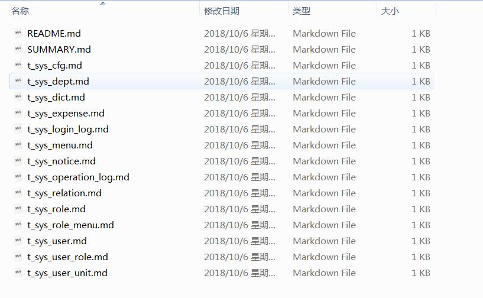
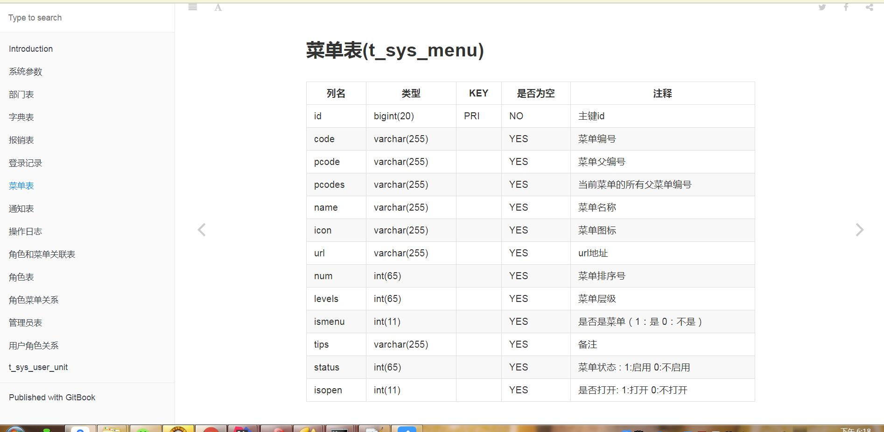

# 1、jar包构建参数
    
     <build>
            <plugins>
                <plugin>
                    <groupId>org.apache.maven.plugins</groupId>
                    <artifactId>maven-compiler-plugin</artifactId>
                    <version>3.0</version>
                    <configuration>
                        <encoding>${project.build.sourceEncoding}</encoding>
                        <source>${java_source_version}</source>
                        <target>${java_target_version}</target>
                        <compilerArgument>-Xlint:unchecked</compilerArgument>
    
                    </configuration>
                </plugin>
                <plugin>
                    <groupId>org.apache.maven.plugins</groupId>
                    <artifactId>maven-surefire-plugin</artifactId>
                    <configuration>
                        <skip>${skipTests}</skip>
                    </configuration>
                </plugin>
                <plugin>
                    <artifactId>maven-war-plugin</artifactId>
                    <version>2.3</version>
                    <configuration>
                        <warSourceDirectory>webapp</warSourceDirectory>
                    </configuration>
                </plugin>
                <plugin>
                    <groupId>org.apache.maven.plugins</groupId>
                    <artifactId>maven-resources-plugin</artifactId>
                    <version>2.6</version>
                    <configuration>
                        <encoding>${project.build.sourceEncoding}</encoding>
                    </configuration>
                </plugin>
    
                <plugin>
                    <groupId>org.codehaus.mojo</groupId>
                    <artifactId>truezip-maven-plugin</artifactId>
                    <version>1.1</version>
                    <executions>
                        <execution>
                            <id>remove-a-file-in-sub-archive</id>
                            <goals>
                                <goal>remove</goal>
                            </goals>
                            <phase>package</phase>
                            <configuration>
                                <fileset>
                                    <directory>${project.basedir}/lib</directory>
                                    <includes>
                                        <include>*.jar</include>
    
                                    </includes>
                                </fileset>
                            </configuration>
                        </execution>
                    </executions>
                </plugin>
                <plugin>
                    <groupId>org.apache.maven.plugins</groupId>
                    <artifactId>maven-dependency-plugin</artifactId>
                    <version>2.8</version>
                    <executions>
                        <execution>
                            <id>copy-dependencies</id>
                            <phase>package</phase>
                            <goals>
                                <goal>copy-dependencies</goal>
                            </goals>
                            <configuration>
                                <outputDirectory>${project.basedir}/lib</outputDirectory>
                                <overWriteReleases>false</overWriteReleases>
                                <overWriteSnapshots>true</overWriteSnapshots>
                            </configuration>
                        </execution>
                    </executions>
                </plugin>
                <plugin>
                    <artifactId>maven-assembly-plugin</artifactId>
                    <version>2.4</version>
                    <configuration>
                        <appendAssemblyId>false</appendAssemblyId>
                        <finalName>${project.artifactId}-${build.timestamp}</finalName>
                        <descriptors>
                            <descriptor>dist.xml</descriptor>
                        </descriptors>
                    </configuration>
                    <executions>
                        <execution>
                            <id>make-assembly</id>
                            <phase>package</phase>
                            <goals>
                                <goal>assembly</goal>
                            </goals>
                        </execution>
                    </executions>
                </plugin>
                <plugin>
                    <groupId>org.apache.maven.plugins</groupId>
                    <artifactId>maven-jar-plugin</artifactId>
                    <version>2.6</version>
                    <configuration>
    
                        <excludes>
                            <exclude>**/*.properties</exclude>
                        </excludes>
                    </configuration>
                </plugin>
    
            </plugins>
        </build>
        
# 2、jar包的执行脚本
/bin/start.bat
/bin/start.sh


# 3、database-doc-generator 数据库文档生成器 说明

- 该工具根据给定的链接生成数据库文档，如果你嫌powerdesigner太重，那么可以试试该工具。
- 你可以下载[release](https://github.com/enilu/database-doc-generator/releases/tag/1.0)包来或者下载源代码来使用。
- 如果使用源代码，需要先克隆该项目后运行mvn package打包，然后运行发布报中bin/start.bat
- 运行程序后按照下面提示输入对应数据库参数：

```bash
input mysql host:
127.0.0.1
input mysql port:
3306
input database name:
guns-lite
input mysql username:
root
input mysql password:
root
```
- 输入完成后回车，即可生成数据库文档目录${dbname}-doc,目录中文档以markdown文件为载体：



- 确保安装了gitbook后，进入上述文件目录的命令行窗口运行：gitbook serve
```bash
E:\\database-doc-generator-20181006100721\guns-lite-doc>gitbook serve
openssl config failed: error:02001003:system library:fopen:No such process
Live reload server started on port: 35729
Press CTRL+C to quit ...

info: 7 plugins are installed
info: loading plugin "livereload"... OK
info: loading plugin "highlight"... OK
info: loading plugin "search"... OK
info: loading plugin "lunr"... OK
info: loading plugin "sharing"... OK
info: loading plugin "fontsettings"... OK
info: loading plugin "theme-default"... OK
info: found 15 pages
info: found 0 asset files
info: >> generation finished with success in 1.6s !

Starting server ...
Serving book on http://localhost:4000
```
- 访问 http://localhost:4000，即可在线查看数据库文档





